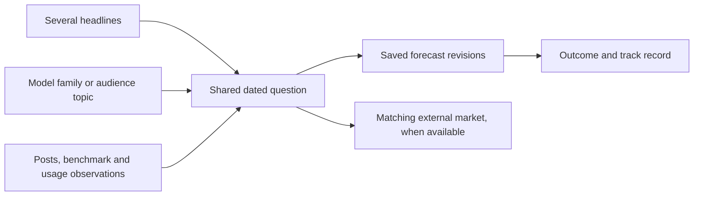

# G3 — Evidence histories, prediction engine and market candidates

## Round-one closeout — October 9

The owner closes the research/design round and transfers unimplemented G3
requirements and open proposals to [round-two G3](2026-10-09-110145-general-round-two.md#g3--chart-engine-and-inherited-analysis),
items B2-G3-01–03. The new chart-engine priority builds on the separately
delivered benchmark work. Forecasts, reader scenarios and market workflows
remain inherited work; their statistical and operating decisions are unresolved.

The old benchmark-dependent implementation hold is historical context to
reassess against actual delivered inputs, not evidence that a forecast engine
was built. Preserve all detailed reasoning below. New scope/progress belongs
to the successor; the [closeout](../analysis/2026-10-09-110145-general-round-one-closeout.md)
records exact outcomes and round-two lessons.

## Plain-English Summary

Build a prediction engine that learns from benchmark and adoption history,
verified model releases, and the posts collected around those releases. It
should estimate both what a forthcoming model may achieve and when a release
may happen, with a qualitative explanation of the changing discussion.
Arena ranking and usage are separate forecast targets; the first target will
be selected after checking available history and prediction accuracy.
Each usable forecast presents 2–5 key variables as questions so readers can
test their own assumptions and see how the estimated outcome changes.
A simple line chart beside the questions updates that personal probability
and shows which side of 50% the forecast falls on.

The engine will test whether changes in post volume and classification mix
regularly precede releases, including each publisher's weekday and time-of-day
patterns. It will verify release evidence across X, official announcements
and Hugging Face repositories, save dated forecasts, and prepare promising
questions for a Kalshi market-candidate request. Before a market exists, readers
can press **“Vote to make a market on Kalshi.”** This records support for a
proposal. Once enough distinct supporters are collected, the eligible proposal
is sent as a packet through the agreed submission route and supporters receive
status notifications. Kalshi decides whether to list it. Historical replay and
a forward forecast record will show whether the engine improves on simple
predictions.

The benchmark work now defines the evidence more precisely: collected brand
posts, exact-model OpenRouter tokens, HF rolling-download counters and their net
changes, plus Arena score, published uncertainty, battle count and rank. G3
will use those underlying measurements and their source dates. The selected
three-line chart explains release response relative to a complete post-release
reference week; that future week cannot enter a pre-release forecast. Arena's
score/uncertainty panel and the reader's probability chart have distinct meanings.

This revision adds requirements and a proposed work sequence to the existing
G3 design. Implementation still waits for the independent benchmark work under
G3-R12. Exact interfaces, schema and execution files belong in the later G3
implementation plan; this document does not claim a working engine or an
external submission.

The owner now requires a statistical foundation: compare verified releases and
their following 30 days, then forecast the next GLM release from evidence known
at the prediction time. The first pilot will audit release/measurement/post
coverage, compare a historical baseline with small statistical candidates and
report broad uncertainty where releases are sparse. Calendar and evidenced
company/team geography are candidate explanatory factors, not established
effects. Tool choices and the first numeric target remain proposals.

## Direction and scope

The owner's October 6 clarification and October 7 feature requirement make G3
responsible for a prediction engine supported by comparisons of products and
trends over defined historical windows. It should produce
estimates of future user attention, downloads, rankings and token usage.
Qualitative descriptions supply context and explain the estimates. A headline
is an entry point; the same question can survive many headlines and model
releases. Readers could eventually compare PushinWeight's forecast with an
external prediction market and choose to trade through that provider.

The owner requested this brainstorm on October 5, connecting posts, Arena,
Hugging Face downloads and OpenRouter usage with a prediction engine. They also
identified eventual Kalshi/Polymarket betting as an ambition. The prediction-
support purpose is selected in G3-R13, with the major engine, qualitative view,
calendar signals, 2–5-question interaction and chart selected in G3-R15–R19. Method,
schema, evaluation settings and presentation choices below remain proposals;
this does not make live trading a launch commitment.
No application code, collection, exchange account or order is part of this work.

The owner previously reported a prediction engine and now explicitly requires
one as a major G3 feature. Its implementation entry point/interface was not
identified in the inspected checkout. Audit and reuse any existing engine
before deciding which parts must be built; the feature cannot depend on an
unidentified forecast producer. The separate
[benchmark/usage collector plan](../../.worktrees/feat/benchmark-download-collector/docs/plans/2026-10-05-070106-feat-benchmark-download-collector-plan.md)
and candidate code already establish explicit product mappings, source timestamps
and immutable snapshots. Its recorded staging delivery at `1375d1c0` verifies
the collector/history/input-reader scope. The later selected-chart additions
R37–R40/U22–U23 remain pending; neither result establishes a live G3 engine.

G3 implementation remains on hold for that independent benchmark LFG under
G3-R12. Consume its delivered identities, reviewed product relationships and
historical measurements when resuming. Keep the historical lookback, evidence
cutoff and forecast horizon separate. The selected 15-minute/1-day saved analyses
and 7-/30-/360-day asynchronous histories remain the comparison behavior; they
do not automatically select prediction horizons or trigger a forecast on every
click. Attention needs an explicit measurement definition: post discussion,
website engagement and proposal clicks must not silently become the same target.

## Benchmark dependency amendment — data use and predecessor ranking

The owner accepted the review questions and predecessor-ranking addition for the
next benchmark rerun. The canonical [benchmark plan](../../.worktrees/feat/benchmark-download-collector/docs/plans/2026-10-05-070106-feat-benchmark-download-collector-plan.md)
now owns R31–R36/U19–U21: an explicit prior-release Arena rank series, source-use
permission enforcement, cutoff-aware inputs, and separate storage, public-output
and trading release decisions. The proxy ends at the successor's first valid
Arena evaluation, not its launch; every point retains the measured model and
switch provenance. Existing exact-model measurements remain separate. General
post/download/engagement proxy attribution remains deferred.

G3 owns qualifying forecast accuracy, joint personal scenarios, exact market
outcome/rule matching, and any eventual exchange or trading behavior. Historical
charts alone do not prove what was knowable at a past forecast cutoff. Treat
proxy and reconstructed inputs explicitly; do not fit or settle against invented
successor measurements. The benchmark plan records the new Kalshi data-terms
finding: confirm the applicable API/partner rights before feeding market data
into G3/Jev or republishing it. An accessible API is not clearance for those uses.

These requirements amend the later P1/P4/P5/P6/P7 acceptance scope; they do not
implement G3, authorize provider contact or lift its benchmark readiness hold.
No production deployment or trading is authorized by this documentation update.

## Benchmark measurement and chart basis — October 7 refresh

The owner requires the engine to use the precise data and line-graph contracts
developed in the benchmark worktree. Consume R26–R40/KD16–KD25 rather than
devising different meanings for the same measurements. The authoritative
[benchmark plan](../../.worktrees/feat/benchmark-download-collector/docs/plans/2026-10-05-070106-feat-benchmark-download-collector-plan.md)
and [staging G3 input handoff](../../.worktrees/feat/benchmark-download-collector/docs/analysis/2026-10-07-benchmark-staging/review-and-handoff.md)
own collection, storage, identity, source-use policy and shared readers. G3 owns
cutoff-safe features, forecasts, validation and explanations. Charter G5-R17
records the accepted chart. This refresh preserves the independent owners' files.

### Exact data and candidate features

The native keys are verified in the benchmark [definition registry](../../.worktrees/feat/benchmark-download-collector/core/benchmark_metric_identity.py)
and [source-row writer](../../.worktrees/feat/benchmark-download-collector/core/benchmark_metric_store.py).
Derived features below are proposals to evaluate, not proven predictors or new
provider facts. Select only evidence permitted for the intended use and known
at the forecast cutoff.

| Source and exact data | Candidate forecasting use and boundaries |
| --- | --- |
| X/native posts: distinct `Post` IDs, selected attribution, UTC day, classification/version and author/source evidence | Volume and lift against a past-only weekday baseline, classification shares, independent authors and concentration. The graph's brand discussion is not exact-release attribution. Topic/product features need evidenced scope and honest ingestion/classification availability. |
| OpenRouter: `total_tokens`, exact `model_permaslug`, UTC calendar day, `meta.as_of`, dataset configuration | Daily volume, trailing means, persistence and lags relative to other sources. This is routed prompt/completion traffic, not worldwide use or unique users. Top-50 absence is unavailable, not zero. A platform-share target requires a complete same-scope denominator including unmapped models and `other` where supplied; never divide by our mapped subset. Preserve provider-specific tokenizers. |
| OpenCode, selected under benchmark R42–R45/U25–U27: model `usage.daily.tokens`, approximate `uniqueUsers` and `sessions`, UTC date, `updatedAt` and local observation time | Separate hosted Go + free-model usage target/context, admitted when the pending adapter/history/definitions are delivered. Hourly refreshes retain partial/completed-day revisions, not hourly usage facts. Do not sum approximate users across dates/models as unique people or add OpenCode to OR as global usage. |
| HF repository: `downloads`, rolling 30-day qualifying-request total at a direct/archive snapshot | Raw level and explicitly named net counter change `D_t - D_previous_date`, with past-only trailing means/lags. Both adjacent dates must have actual observations for the same complete reviewed cohort. Gaps, changed cohorts, incompatible definitions or held display values invalidate the difference. It includes entries/exits from the rolling window and possible corrections; it is not daily new downloads or unique downloaders. |
| HF repository: optional `downloads_all_time` (wire `downloadsAllTime`) | Since-origin scale, with unknown origin/end retained. Changes need a separately verified time/reset rule. Missing values remain unavailable; this metric does not replace the selected graph's rolling-counter net change. |
| HF repository `likes`; source-qualified account `followers` (direct wire `numFollowers`) | Supplementary repository/publisher interest where honest history exists. Followers are account context, not product measurements. Observed/archived states remain distinct from `reconstructed_current_relationships`, which omit removed relationships and are excluded from operational replay. Missing followers are not zero. |
| Arena: `rating`, `rating_lower`, `rating_upper`, optional `variance`, `vote_count`, `rank`, evaluated variant/publication/configuration | Comparable score level/change, confidence-band width, reported battles, publication age and rank context. Use the same row/publication in `text`/`overall`, no style control. Scores/bounds use `arena_points`, variance `arena_points_squared`, votes integer `battles`, rank integer `position`. Battles are comparisons, not unique people or usage; missing optional fields remain unavailable. |
| Reviewed release/publisher/predecessor evidence, announcement/availability date and observation/review times | Release cohorts, known prior-release context, elapsed time and publisher calendar patterns. Repository creation/edit alone does not prove release. Preserve precision and knowledge time. Predecessor observations never become successor outcomes. |

Weight-publication metadata for release verification is separate from the
numeric reader. Website interest, proposal clicks and reader estimates also
remain separate. Preserve denominators and campaign concentration; one promotion
repeated across posts/likes/downloads is not independent corroboration. See
[HF counting methodology](https://huggingface.co/docs/hub/en/models-download-stats)
and [OpenRouter definitions](https://openrouter.ai/docs/api/api-reference/datasets/daily-token-totals-for-top-50-models).

### Three evidence lines, Arena panel and personal probability

Benchmark R37–R38 selects exactly three lines on one linear axis: **brand posts**,
exact-product **OpenRouter daily tokens**, and **HF net rolling-counter change**.
The fixed reference is the earliest seven consecutive completed dates strictly
after the reviewed launch on which all three raw inputs exist, within the frozen
reference-search range. HF differences also require the preceding snapshot.
Each line uses its own unsmoothed mean over that common seven-date interval.

Display `100 * (displayed_value / reference_mean - 1)`. The default displayed
value is a trailing three-day arithmetic mean; the daily toggle uses raw values
with the same reference means. Never smooth across gaps, allocate multi-day HF
changes to missing dates, redefine the reference on view controls or fabricate
zeros. Missing/nonpositive reference means leave that normalized line unavailable
while retaining raw values. Preserve real negative HF changes and percentages
below -100, exact count strings and precision before display rounding.

Zero is the reference-week average, not launch-day zero, cumulative growth or
probability. R39–R40 puts Arena raw score/confidence bands and reported battles
in a linked panel, with rank context and actual publication markers. Arena is
not a fourth normalized line: score/rank percentages do not describe percentage
quality changes. The labeled predecessor-rank alternative does not substitute
predecessor scores or battles into the exact-model panel.

The default context, 14 days before release through day +28, does not replace
G3's 15-minute/1-day/7-day/30-day/360-day histories or select forecast horizons.
G3-R19's separate 0–100% line shows the saved personal outcome probability and
50% direction as answers change. Compute that probability through the qualified
engine/scenario method, never by averaging or summing evidence-line percentages.

### Prevent future chart information entering a forecast

The post-release reference week is future information for a pre-release or
early-release estimate. Before release, use known predecessor/family history,
publisher context and eligible posts; do not invent successor HF/OR/Arena data.
After release but before a complete reference is known, use available raw
successor observations and past-only features. A different feature baseline
must be named/versioned separately from the selected chart reference.

Only a later forecast may use the fixed reference once every contributing
observation/review/import was available at its cutoff. A retrospective chart
may normalize earlier dates to that later week, but cannot establish what was
known then. Saved-forecast inspection must distinguish later chart context
from its original evidence. Corrected inputs/references create new versions.
Prove no future value, reference, smoothing dependency, mapping, publication or
classification enters a forecast. Later outcomes can label training examples,
but cannot supply their input features.

### Arena evaluation precision and actual publications

Study whether early scores hold up as later publications include more reported
battles/narrower confidence bands, and whether this adds information about later
performance/adoption. Keep Arena score uncertainty separate from G3 forecast
uncertainty; do not turn a confidence band directly into top-five probability.
Reported battles can decrease; their snapshot differences are not exact daily
new battles. Stable score/worse rank can reflect competitors, while a lower
score with more battles alone does not establish degraded model quality.

Score-change features need compatible configuration, methodology and verified
score anchoring. Unknown/changed anchors require a break or suppressed change
claim, while retaining raw observations. Arena's [anchored score-history analysis](https://arena.ai/blog/opendata-july2025#score-changes)
provides context, not proof that our selected publications share an anchor.
Count actual distinct publications and releases, not daily held steps, repeated
imports or smoothed points. Preserve omission/correction/failed-fetch rules and
date-only publication precision; never backward-fill bounds or invent daily
Arena samples. Shared calendar axes do not establish identical cutoff instants.

### Delivered interface, gaps and acceptance scope

Inspected feature head: `585cfa30`; recorded staging runtime: `1375d1c0`.
R31–R36/U19–U21 are documented as implemented/verified in that staging scope.
R37–R40/U22–U23 database-backed additions remain pending. Static prototype
evidence supports the design only, not those units or a live prediction engine.

Use [core.benchmark_forecast_inputs.forecast_inputs](../../.worktrees/feat/benchmark-download-collector/core/benchmark_forecast_inputs.py)
with timezone-aware cutoff, bounded mapping IDs and intended use. Operational
mode gates local observation/completed import, mapping review, contract creation/
review and taxonomy creation, plus known precise source/effective bounds.
Old archives imported today are not evidence our system possessed earlier.
`retrospective_research` returns `not_past_known_evidence=true`; keep it labeled
and establish forward forecast records. `build_comparison` is retrospective
display, not the engine's past-knowledge reader.

The numeric reader retains eligible immutable revisions, not a resolved feature
vector. Pin value/observation/run IDs, contract/taxonomy/hash, source definition,
configuration, precision and feature version. Resolve revision/omission precedence
after cutoff filtering, not by selecting today's corrected history first.
Current caps are 10,000 returned values and 1,000 selected mapping IDs; exceeding
the budget fails. Coordinate bounded/range extensions with the benchmark owner
instead of truncating or building another collector.

Current presets are read from `MetricCollectionContract.methodology['comparisons']`;
R38 describes the future policy under `comparison_presets`. Verify/reconcile the
delivered writer/validator key before consuming the new preset; preserve old
immutable contracts. Two later integration gaps remain explicit:

- Native X posts/current classifications are excluded from the numeric reader.
  G3 needs a cutoff-aware adapter over existing post evidence and attribution/
  classification availability, not a duplicate collector or a retrospective
  count masquerading as a past-known feature.
- The numeric reader requires mapped observations, excluding unmapped OR/`other`
  denominator context. A share target needs a bounded cutoff-aware same-scope
  context read coordinated with the dependency owner. Until then, use defined
  raw-token targets or report share unavailable.

Saved staging examples contain only three actual successor Arena score
publications for DeepSeek Flash and eight for GLM in these displayed windows.
Posts end October 3; successor HF/OR extend to October 6; followers have no
observations there. DeepSeek has reviewed predecessor-rank context; GLM has no
reviewed predecessor. These are integration fixtures, not a sufficient training
cohort or proof of predictive accuracy. Missing inputs remain unavailable.

Evaluate post spikes versus sustained OR traffic, HF net-counter momentum/likes
versus later adoption, and early Arena score/uncertainty versus later comparable
performance. Include decaying hype, stable scores with competitor-driven rank
loss and copied campaigns. Compare the same chronological release cohort with
source groups removed one at a time, including Arena uncertainty/battles beyond
score alone. Account for dependent same-release rows and rolling-window overlap.
Select 2–5 evidenced questions from influential available factors only for a
qualified forecast; insufficient support can require withholding a probability.

The first target remains open. Define an HF target as rolling activity or net
counter change, not daily new downloads. Distinguish release timing from
conditional rank/adoption and fix non-release/not-listed outcome rules before
preparing a Kalshi proposal. P1/P3/P4/P5/P7 below carry this acceptance scope.

## Statistical pilot — Release cohorts and small samples

The owner explicitly requires a statistics-based engine: examine the 30 days
following releases across models in our database, find relationships down to
individual-post classifications, and use them to forecast the next GLM release's
usage, rank and attention. Examine season, weekday, company headquarters and
researcher work locations while accounting for sparse/dependent samples.
This selects a statistical foundation, not a tool/version or fitted model.
The methods and pilot choices below are recommendations for later execution.

### Start with verified releases and coverage

Build an auditable release cohort from existing `ModelRelease` /
`ModelReleaseEvidence`, canonical products and reviewed provider mappings;
verify the actual records before reuse. A catalogue repository is not an
independent release. Preview/stable versions, model-size variants, derivatives
and several products launched together need explicit identity/group rules.
Record true distinct release events, launch-family groups, publishers and
usable outcomes for each target, alongside unresolved/excluded candidates.
Do not choose only successful models with high usage or Arena listings.

Read-only local check on October 7, approximately 22:00 JST:
`pw_benchmark_ready_20261006` at localhost:55436 contains 2,048 products across
34 brand keys and 74,957 posts. Existing source mappings cover two HF product
subjects/two account subjects, two OpenRouter products and three Arena products
across retained contracts. Raw accepted observations contain 426 OR and 186
Arena source identifiers; those are not verified release counts. The projection
contains zero release/evidence, exact classification-state or researcher-
affiliation rows. Company HQ is nonempty for 27 of its 31 companies, without
establishing historical verification. This database is a limited review
projection, not a complete production snapshot: empty projected tables do not
prove production lacks those records. Resolve/import the separately authorized
verified cohort and classifications before fitting; this brainstorm performs
no new import, collection or production query.

### Outcome windows and what a forecast may know

Recommended study unit: one release/variant trajectory with an explicit launch
group and publisher, daily rows for a pre-release lookback plus 30 completed
post-release days, and a release-level outcome row. Define day 1–30 as the next
30 complete UTC calendar dates after the reviewed release date for the first
date-only pilot; this is a proposal, not an exact 720-hour interpretation. Keep
announcement versus actual availability and source precision visible.

Recommended first target: reported OR adoption over that window, if coverage
permits it. In parallel prepare collected-attention and exact Arena outcomes:

| Outcome | Definition and limit |
| --- | --- |
| Usage | Thirty-day OR tokens for the exact product only when all required days are reported; sustained use in days22–30 can separate launch traffic from persistence. Unreported top-50 days censor totals; record coverage, do not fill zero or train only on continuously popular models without stating selection bias. Consider reporting-cohort presence as a separate target when total traffic is unavailable. OpenCode is a separate later target when its delivered coverage permits. |
| Attention | Distinct collected posts/authors over the same window, plus a declared classification mix. Brand/topic discussion and exact-release attention need separate attribution. Collection changes affect counts; this is collected attention, not all-X reach. |
| Arena | Exact-variant rank/threshold or compatible raw score at a defined day30 cutoff, with latest valid publication age/bounds/battles. Define not-listed/stale/tie/correction states; an earlier publication is not a new day30 measurement. Rank also depends on competitors. |
| HF context/target | Known rolling total/net counter changes and likes; this does not supply exact daily new downloads. The source window overlaps successive days, so treat dependence explicitly. |

Create a pre-release/day0 forecast and separately defined day3/day7 updates
as candidate evaluations. Features stop at each issue cutoff. Post-release
30-day classifications/traffic can be outcome descriptions, not inputs to a
pre-release prediction. Later updates may use the observed prefix to predict
the remainder of the fixed window, without counting that prefix twice.
Training examples must have their outcomes resolved/available before the
historical fitting cutoff, not merely have an older release date.

### Individual posts become a few evidenced predictors

Inspect posts individually for scope, exact classification version, source role,
repetition and evidence, then aggregate their eligible classifications into
release/cutoff features. Start with a small prespecified set: discussion lift
over a past-only baseline; independent hands-on/results-evaluation shares;
promotion/author concentration; and prior-release adoption/performance context.
These are candidate factors, not already established associations. Preserve
multi-label denominators and missing/context-missing outcomes using the
[classification analysis contract](../analysis/2026-09-09-112957-classification-analysis-contract.md).
Current latest classification state is not a historical event ledger; later
reclassification cannot become past-known evidence. Do not repeat a release's
one outcome over thousands of posts and call them independent training samples.

Calendar/geography fields are candidate covariates, with observation times and
coverage: release weekday in a verified publisher timezone, day-of-year/year
trend, evidenced holiday distance, historical company HQ and reviewed researchers'
work locations/affiliations at release. HQ, researcher locations and publisher
identity may be nearly indistinguishable in this dataset; do not claim separate
country effects without sufficient cross-company/within-company variation.
Nationality or a current X profile location is not proof of team work location
at an older release. Unknown location stays unknown; report the known fraction,
do not extrapolate a few public profiles to the entire team. Examine researcher
geography as an optional later feature after coverage, not as an immediate
mandatory input or an individual-person productivity score.

### Compare three approaches, with partial pooling as the main candidate

1. **Similar-release baseline:** publisher/family historical median and a few
   visibly comparable releases, with uncertainty. Useful immediately, easy to
   audit; sparse peers can still be unstable.
2. **Regularized regression:** a small fixed predictor set with penalties that
   keep weak effects small. A practical transparent challenger; it does not by
   itself address every censoring or group-dependence problem.
3. **Bayesian hierarchical model — recommended candidate:** learn across
   publishers while allowing publisher-specific baselines. This shares
   information between groups (partial pooling), preventing two unusual GLM
   releases from determining an extreme GLM-only estimate. Priors should favor
   modest effects unless evidence supports larger ones; check sensitivity and
   model assumptions. Pooling improves estimation under those assumptions,
   but cannot create missing releases or make unsupported calendar/geography
   effects identifiable. [PyMC multilevel example](https://www.pymc.io/projects/examples/en/latest/generalized_linear_models/multilevel_modeling.html).

Proposed starting likelihoods: robust regression on log token totals for fully
observed positive usage, a negative-binomial count model for collected posts,
and a separate binary/ordered or score model for Arena. Do not apply the same
normal-error model to every outcome. Explicit censoring/selection treatment is
required before including unreported OR outcomes; if unsupported, decline that
numeric target rather than filling zeros. Method complexity follows observed
cohort size. [Student-t](https://www.pymc.io/projects/docs/en/stable/api/distributions/generated/pymc.StudentT.html),
[negative-binomial](https://www.pymc.io/projects/docs/en/stable/api/distributions/generated/pymc.NegativeBinomial.html).

### Small-sample evaluation before publishing probabilities

Thirty days from ten releases are ten launch groups with repeated observations,
not 300 independent releases. Several same-launch variants are dependent too.
Report launch/publisher counts and target-specific coverage rather than infer
precision from raw post or metric-row counts. Correlations are exploratory:
prespecify a handful of questions, examine effect size/uncertainty, use
release/publisher-aware resampling only where exchangeability is defensible,
and account for multiple tested relationships. A small p-value selected from
hundreds of candidate correlations is not a forecasting qualification.
[SciPy small-sample correlation guidance](https://docs.scipy.org/doc/scipy/tutorial/stats/hypothesis_spearmanr.html).

Primary validation: fit on earlier releases with known outcomes, test later
ones, keeping launch siblings together. Exclude overlapping unresolved 30-day
outcomes from training at the test cutoff. Fit scaling, feature selection and
question selection inside training only. A chronological grouped split needs
an explicit combined policy; `TimeSeriesSplit` alone does not enforce launch
groups and `GroupKFold` alone does not enforce chronology. Extra publisher-
holdout checks can assess transfer when enough publishers exist. Random post/day
splits are unsuitable. [scikit-learn validation](https://scikit-learn.org/stable/modules/cross_validation.html).

Check whether one launch/publisher drives a result, whether collection/classifier
era or platform growth explains it, and whether removing post classifications,
calendar or geography worsens future prediction. Report probability calibration,
interval coverage/error and improvement over the baseline with uncertainty;
few resolved releases may be inadequate to establish calibration. Use prior/
posterior predictive checks and sampling diagnostics for Bayesian candidates.
Keep uncertainty about fitted average effects separate from wider uncertainty
about one new GLM release. Abstain or show broad ranges when needed.

Suggested first experiment budget: freeze cohort/cutoffs/targets and at most
five prespecified substantive predictors, compare the baseline with one
regularized and one hierarchical candidate in one fixed evaluation round.
Record data insufficiency rather than searching until a strong correlation
appears. Calendar/geography are first described, then added in a separately
bounded test if support exists. These are proposed bounds, not a scheduled run.

### Tools and integration

| Tool | Proposed job |
| --- | --- |
| Existing PostgreSQL/Django plus pandas | Read admitted evidence and produce versioned release/cutoff feature and outcome datasets. Aggregate in SQL first; reuse storage/readers rather than adding a warehouse. [SQL interface](https://pandas.pydata.org/pandas-docs/stable/reference/api/pandas.read_sql_query.html). |
| SciPy | Exploratory rank correlations and appropriate resampling primitives; grouping/exchangeability is our design responsibility. [Permutation tests](https://docs.scipy.org/doc/scipy/reference/generated/scipy.stats.permutation_test.html). |
| scikit-learn | Regularized challenger, training-only preprocessing and forecast scoring with our chronological grouped splits. |
| PyMC | Hierarchical posterior estimates and new-release predictive distributions, including explicit uncertainty and scenario recomputation. |
| ArviZ / compatible ArviZ components | Inspect sampling/convergence and whether generated outcomes resemble observed data. Pin compatible versions later; do not assume old/new ArviZ APIs are interchangeable. [Diagnostics](https://python.arviz.org/projects/stats/en/latest/api/generated/arviz_stats.diagnose.html), [predictive-check example](https://python.arviz.org/en/v0.23.4/examples/plot_ppc.html). |
| Reproducible analysis script/notebook and Matplotlib | Review the initial cohort, effects, release curves and forecast intervals; move accepted computation into a versioned batch job later. No new service is needed for the research pilot. |

Fit in an isolated offline process, save the fitted version and frozen feature
definitions, then serve lightweight saved predictions/scenarios through Django.
The initial output should be a coverage/cohort report, candidate relationships
with uncertainty, honest future-release evaluation and a saved next-GLM forecast
only if supported. Do not install packages or start model fitting in this
brainstorm. Tools are candidates pending the actual cohort/compatibility audit.

Jev may evaluate supplied factor/evidence questions concurrently; its answers
feed a learned, evaluated statistical scenario method. The statistical model
controls the final usage/rank/attention probability and interval. An uncoupled
Jev future-event probability is not a substitute for this selected foundation.
Unsupported holiday/geography assumptions can be labeled scenarios, but cannot
receive fabricated statistically learned effects. Preserve prior proposed Jev
direct estimates as research comparators only, not an accepted default engine.

## Major feature — Prediction engine (October 7 owner requirements)

### Required outcome and target selection

Use the totality of usable evidence delivered by the
[benchmark/usage plan](../../.worktrees/feat/benchmark-download-collector/docs/plans/2026-10-05-070106-feat-benchmark-download-collector-plan.md),
with the source definition, identity, history and coverage of every input
preserved. Study historical relationships and time lags between benchmark
performance, posts, downloads, repository/account engagement and routed usage.
Generate a dated forecast for a publisher's next legitimate model release and
its later performance or adoption, then connect eligible popular questions to
the Kalshi candidate workflow. Historical correlation is a hypothesis to test,
not a demonstrated prediction method or causal explanation.

The owner leaves Arena ranking versus usage open. Support distinct target
definitions and compare their historical feasibility before selecting the
first production question:

| Target | Required definition and practical limit |
| --- | --- |
| Arena performance | Exact model/variant, leaderboard configuration/category, threshold or rank/score and outcome date. Rank depends on other models entering/leaving. Preserve same-publication score/bounds/variance/battles as available, actual publication samples and compatible score anchoring. Missing/not-listed outcomes need explicit rules. |
| OpenRouter usage | Exact reported model identifier or explicitly reviewed group, completed-day token volume or reported usage share, and a defined post-release period. This measures OpenRouter activity, not worldwide use or unique users. Historical top-50 membership changes; absence from the reported cohort is not zero usage. |
| HF downloads/engagement | Exact repository/account or reviewed cohort and native window. Define rolling total versus adjacent-snapshot net change; neither is unique people or daily new downloads. Likes/followers are state counts; reconstructed surviving relationships are not historical snapshots. |
| Attention | Defined post volume/composition or site interest, each with its own scope and denominator. Proposal clicks remain a demand measure alongside these targets. |

Working recommendation: evaluate daily OpenRouter usage and Arena outcomes
alongside each other. Usage can be a useful internal adoption forecast even
when no suitable exchange contract exists. For the first external candidate,
Arena has existing Kalshi category precedent; that does not establish that
Arena is easier to predict. Benchmark amendment R30/KD21 now selects official
Arena dataset configuration `text`, category `overall`, without style control,
for new collection. Retain older `text_style_control` histories separately and
consume the delivered amendment only after its readiness evidence is available.
[OpenRouter dataset](https://openrouter.ai/docs/api/api-reference/datasets/daily-token-totals-for-top-50-models),
[HF download definitions](https://huggingface.co/docs/hub/en/models-download-stats),
[existing Kalshi Arena series](https://external-api.kalshi.com/trade-api/v2/series/KXLLM1).

### Qualitative view and pre-release changes in posts

The owner requires an evidence-based qualitative view of collected posts and
their classification mix. Test whether a marked change occurs before releases,
how early it occurs, how often a comparable change occurs without a release,
and whether that change helps predict later ranking or usage. A pre-release
pattern is a possibility to investigate; do not assume it exists before every
release or transfers between publishers.

Compare release-aligned periods with earlier baselines and matched non-release
periods. Candidate analysis windows include 1, 7 and 30 days before a release;
these research choices do not replace the five owner-selected reader history
windows or select the forecast horizon. Keep brand-wide discussion identifiable
when the future model has no exact product identity yet.

Measure distinct posts, distinct authors, changes in posting rate, author
concentration and the count/share of recognized classification categories:
releases/updates, results/evaluations, hands-on usage, questions/requests and
advertising/marketing. Separate official/staff sources from broader discussion
when the identity evidence supports doing so. Track duplication, copied
promotion, collection outages, changed queries and classification coverage.
State each denominator; overlapping category memberships need not total 100%.
Teasers, rumors, claimed leaks, sentiment and repeated performance claims may
be additional text-derived cues, but they are proposed features, not invented
existing classification labels.

Reuse the [classification analysis contract](../analysis/2026-09-09-112957-classification-analysis-contract.md)
and [Stage 1C contract](../analysis/2026-09-10-203138-stage1c-contracts.md).
Preserve taxonomy/prompt/model versions, exact versus approximate history,
unclassified/context-missing populations and the counting unit. The existing
classification state stores latest judgments, not an immutable history: a
classification made or revised after the forecast cutoff cannot masquerade as
an input available earlier. Use retained feature snapshots for operational
replay and explicitly label retrospective reconstructions.

Produce a sourced narrative beside the forecast: what changed in discussion,
which categories and independent authors account for it, how it compares with
earlier releases, contrary evidence, and the source/coverage limitations.
Show volume and composition over time, with verified releases and saved
forecast revisions marked. An explanation may report that a pattern is weak
or absent; it must not manufacture support for the numeric estimate.

### Release verification across X and Hugging Face

Identify release candidates from collected X posts and accepted publisher
identities. Corroborate them with official announcements, model cards and HF
repository/file/revision metadata where applicable. Reuse the benchmark plan's
canonical products, reviewed mappings and typed relationships, and consume
accepted official-company mappings from the independent discovery work.
G3 owns release-event interpretation, not a second publisher-discovery or
benchmark-collection system.

For an open-weight release, inspect the verified publisher's repository,
the claimed model/version, relevant configuration/card and evidence that
weight files were published at a particular revision. Repository creation
alone may indicate preparation, an empty placeholder, a mirror or a derivative.
A weights upload corroborates availability but does not by itself establish
an official new successor. Existing repositories can also receive new releases.
Closed/API-only models can be confirmed through official availability evidence
without an HF repository. Use metadata rather than downloading weights.
[HF metadata API](https://huggingface.co/docs/huggingface_hub/en/package_reference/hf_api#huggingface_hub.HfApi.model_info).

Keep candidate, announced, available/confirmed, disputed and withdrawn states
with supporting evidence and review reasons; exact state names remain an
implementation choice. Preserve announcement time, repository creation,
first observed weight revision, actual availability/release anchor and our
observation time separately, including unknown precision. Several posts
repeating one announcement do not constitute several independent confirmations.

### Release timing and the next model

The owner identifies weekday regularity as a candidate signal. Estimate each
publisher's release frequency by weekday and time of day, time since its last
release, and relevant calendar context such as documented events. Keep the
source timezone and chosen calendar interpretation explicit; a UTC date can
fall on a different weekday from the publisher's local date. Unknown release
times or timezones remain unknown. Sparse publisher histories need a stated
fallback rather than a confident personalized schedule.

Test post-volume/composition deviations against the publisher's ordinary
weekday and time-of-day pattern. Include days and periods without releases,
so the evaluation measures false alarms as well as successful release signals.
Weekday patterns are probabilistic features, not a rule that confirms a release.

Separate two outputs: probability of a qualifying release within a defined
period, and the expected ranking/usage of that release conditional on its
occurrence. Before announcement, refer to a documented next-release scenario
or family question; do not invent an official model name or successor link.
After confirmation, link the exact release and save a new forecast revision.
Do not silently substitute a different model into an earlier question.

### Reader questions — 2–5 variables with conditional forecasts

The owner requires the engine to give readers **2–5 key variables in the form
of questions**. Select influential, intelligible factors relevant to the exact
forecast, with evidence for why each matters. Show the engine's baseline
assumption, the question, answer options and the estimated probability under
each answer. Readers can select answers to produce a saved personal scenario;
an unanswered/uncertain factor retains an explicitly stated baseline treatment.
Insufficient-evidence views must not invent factors to satisfy the question count.

The owner's example is whether Qwen staff may slow down during Golden Week
or Chinese New Year, with Yes/No branches showing different chances of meeting
an October 30 ranking/deadline outcome. This establishes the interaction,
not measured probabilities or the direction of the holiday effect. Use
publisher/team-specific evidence and calendar history rather than assuming
staff leave from country or nationality. Separate known holidays, our inferred
operational impact and the reader's assumption.

First define one forecast outcome precisely, for example a named next-release
scenario reaching a specified Arena top-five position by October 30 in a
specified year/timezone. Then ask, for example, “Do you expect the relevant Qwen
team's release work to slow during this holiday period?” Yes and No must both
report the probability of that same outcome. Release by the deadline and
ranking by the deadline are distinct events; display their separate estimates
where useful. Account for publication/eligibility delay and define the outcome
if no qualifying release or ranking appears. Do not hard-code Yes above 50%
and No below 50%, or reverse them, without the method supporting that result.

Other question candidates include an unusually strong pre-release discussion
shift, likely release/availability timing, expected improvement over a verified
predecessor, pricing/access assumptions affecting usage, and expected competing
releases affecting relative rank. These are illustrative options. The engine
chooses 2–5 for the target; no universal five-question form is selected.

Preserve a stable variable/question ID and version, exact wording, evidence,
answer-to-assumption mapping, forecast outcome/version, baseline and branch
probabilities, uncertainty and method/sample support. Distinguish an association
estimated from history from an explicitly hypothetical scenario. Changing an
answer recomputes the joint scenario using the same cutoff and method;
correlated factors cannot be treated as independent or their percentage-point
effects simply added. Show the change from the baseline in plain language.

Save reader answers and the resulting personal forecast separately from the
canonical engine revision and community poll. Later evidence creates new dated
versions, not silent edits to earlier scenarios. A Kalshi candidate identifies
which canonical forecast/scenario supports it and reports demand separately;
answering a factor question does not submit a market or place a trade.

Acceptance: each usable forecast exposes 2–5 evidenced questions; both answer
branches concern the identical outcome and cutoff; repeated answers reproduce
the same result; multiple answers produce a dependency-aware joint estimate;
unknown answers and weak support remain visible; and saved personal scenarios
cannot overwrite the engine, community or earlier forecast record.

### Prediction panel — Simple line chart and 50% direction

The owner requires a simple probability line chart accompanying the prediction
div/panel. It moves up or down as the reader answers the 2–5 questions, with a
visible 50% reference line and Yes/No direction. Preserve the G5 visual language
and use the same exact outcome, cutoff and saved personal scenario as the
question controls; a second calculation must not produce a different chart.

Proposed horizontal axis: baseline → successive answer/scenario revisions,
with probability of the defined Yes outcome on a 0–100% vertical scale. Keep
this interaction trail distinct from the dated longitudinal forecast history.
Show the latest value, baseline change in percentage points and the question
responsible for each revision. Editing or clearing an answer recomputes the
complete current scenario; answer order must not change the final estimate for
an identical answer set. Chart points represent actual saved calculations,
not generated intermediate evidence or outcomes.

Above 50%, show **“Forecast leans Yes”**; below 50%, **“Forecast leans No”**;
at exactly 50%, **“Even chance”**. Use the underlying value for the direction,
so rounding does not create a false crossing. Use labels as well as color,
preserve a readable percentage without hovering, and make pending/error or
insufficient-evidence states visible. Rapid answer changes must not allow an
older response to overwrite the latest scenario or leave the chart and number
showing different revisions.

The owner's intended next action is a Yes/No decision on Kalshi. There, buying
a contract involves a price, rather than a free poll vote. A 50% crossing
identifies the more likely outcome; it alone does not determine an attractive
trade. For a standard binary contract paying $1 on success, compare the
estimated Yes probability with the actual Yes purchase price, and the No
probability with the actual No purchase price, including applicable costs.
Keep quote timestamp, available quantity and the exact matched rules visible
when that later trading/link phase exists. Do not substitute a midpoint or
last trade for an executable purchase quote.
[Kalshi prices](https://help.kalshi.com/en/articles/13823836-how-are-prices-determined),
[order-book quotes](https://help.kalshi.com/en/articles/13823828-the-orderbook),
[payout and costs](https://help.kalshi.com/en/articles/13823844-portfolio-balances-and-positions).

Illustrative only: at a 55% Yes estimate, buying Yes for 70 cents has an expected
settlement payout of 55 cents, below its price even before costs. Conversely,
a below-50% Yes estimate can still exceed a cheap Yes purchase price. Keep the
forecast direction and comparison with market price identifiable rather than
publishing “buy Yes/No” solely from the 50% line. Either side, both sides or
neither may have an attractive quoted price under the user's assumptions;
uncertainty in the forecast remains relevant.

If the question is not listed, show its internal forecast/candidate status and
**“Vote to make a market on Kalshi”** under G3-R28. The helper text explains that
this supports a proposal requiring Kalshi's approval. A Yes/No forecast answer
does not record this support vote. Display an external market action only for
an exact verified listing. Crossing 50% or answering a question does not submit
a candidate or an order. External submission and trading remain later
authorized phases; this addition changes the design, not their scope.

Acceptance: baseline and answer changes move the line to the saved probability;
above/below/exactly-50% states and rounding work; identical complete answers
give the same endpoint; reset restores the baseline; late responses cannot
replace the current result; labels remain usable without color/hover; and a
missing listing/quote cannot become a fabricated Kalshi recommendation.

### Jev parallel question evaluation and probability updates

The owner first asks whether Jev can serve this workflow, then clarifies the
intended role: evaluate the multiple questions concurrently and use probability
answers in a quick calculation that updates the user's forecast. Add this as
a proposed engine path, not merely an evidence-selection helper. Adoption and
forecasting quality remain to be evaluated.
The current official primitives support yes/no judgments (`Noul`), selection
from supplied options (`Choice`) and positions on supplied rubrics (`Score`).
They require context and questions/options to be supplied; Jev does not write
arbitrary questions or explanations.
[Noul](https://docs.typesafe.ai/primitives/noul),
[Choice](https://docs.typesafe.ai/primitives/choice),
[Score](https://docs.typesafe.ai/primitives/score),
[System One](https://docs.typesafe.ai/concepts/system-one).

Jev supports multiple questions against shared state in one request, evaluated
in parallel. Send the frozen evidence/history summary, exact outcome/deadline,
baseline and the user assumptions once, with stable IDs for the 2–5 factor
questions. Every answer is evaluated against that state; one question's answer
does not automatically become another question's input. User answers already
known when building the request can be included together.
[Parallel question contract](https://docs.typesafe.ai/primitives#ask-multiple-questions-together).

Two concrete paths belong in the evaluation:

1. **Factor judgments plus learned update.** Jev estimates supplied factor
   propositions concurrently; the engine applies their historically measured
   relationship to the outcome. A small fitted calculation can update the
   baseline after user answers, accounting for overlapping factors. Freeze
   weights/update method and its version; do not turn arbitrary weighted
   scores or multiply factor probabilities into an outcome probability.
2. **Direct conditional scenario estimates.** Ask parallel Noul questions for
   the same outcome under the baseline, each relevant Yes/No assumption and
   the complete user-selected scenario. Put each scenario's assumptions in
   its question/context explicitly. Compute the displayed change as
   `100 × (p_user_scenario − p_baseline)` percentage points. The joint estimate
   evaluates the full combination, rather than adding separate branch changes.

Illustrative arithmetic only: a baseline outcome probability of 0.60 and a
complete user-scenario probability of 0.45 means 45%, down 15 percentage points.
A probability that a factor is true and a probability of ranking given that
factor are different quantities. Label which question each number answers.
If the user supplies their own starting probability, keep it separately;
do not transfer an engine delta to that prior without a defined, tested update
rule. Otherwise “user probability” means the scenario derived from the engine
baseline using the user's answers.

Prepare Jev's evidence from the same cutoff-safe raw/features packet used by the
engine, with source scope, publication age, coverage and uncertainty retained.
Do not send today's retrospective normalized chart as if it were past-known
evidence. Questions about attention, HF activity or Arena evaluation precision
must retain the exact measurement meanings in the benchmark basis above.

Retrieve and summarize historical evidence before this fast step. Cache unchanged
questions/branch estimates by evidence, method and model version. User changes
may use a validated local update or a single bounded scenario batch; exact
refresh policy, latency and cost must be measured. A new call depending on
previously unknown Jev answers belongs in a subsequent request, not hidden
sequential behavior inside the parallel batch.

Possible jobs: judge whether evidence supports an official release, a teaser
or a slowdown claim; score candidate factor relevance against a defined rubric;
select the next factor from a supplied eligible set; and check whether proposed
question wording is supported by the attached evidence. In the learned-update
path, numeric influence comes from the historical forecasting/sensitivity
method. Jev relevance judgments alone cannot establish that a factor improves
prediction or is one of the most
influential variables. Generate wording through a separate writing route or
reviewed templates. Compare learned updates with direct conditional Jev
estimates, using the same evidence and outcomes, before choosing the method.

Keep Jev's evidence judgment and its confidence separate from the outcome
probability. Confidence that a post supports a holiday slowdown is not the
probability that the next model ranks in the top five by the deadline. Jev can
be evaluated as the direct conditional-forecast candidate above, but its event
probabilities need the same chronological tests/calibration as other methods;
vendor probability output is not project-specific forecasting evidence.

Reuse the [Jev evaluation closeout](../analysis/2026-10-01-193945-jev-classification-closeout.md)
for known limits. The owner retained 0731 for the existing classifier, and that
evaluation did not measure this forecasting/question workflow. This proposal
does not switch the classifier, revive old test budgets or authorize model
calls. At implementation, pin the evaluated Jev version, question rubric,
evidence cutoff and thresholds; measure evidence quality, factor selection,
branch/joint consistency, downstream forecast benefit and full reader-visible
latency/cost before adoption. Preserve unknown/disputed evidence and deterministic
fallback choices.

### Historical learning, evaluation and saved forecasts

At each forecast cutoff, freeze the target/question, evidence references,
subject mappings, feature/classification versions, input availability,
source revisions, forecast method/version, numeric estimate/range or event
probability, and qualitative explanation. Record missing coverage explicitly.
Keep historical lookback, issue time, expected release period and outcome
horizon distinct. The next model's post-release benchmark/usage data cannot
enter a pre-release forecast; later revisions can use newly available evidence.

Use the dependency's `forecast_inputs` operational mode for numeric evidence
and a separately cutoff-aware post/classification adapter. Resolve revisions
after cutoff filtering and pin selected IDs. The selected chart's post-release
reference week cannot enter pre-release/early-release features; distinguish
retrospective research from operational replay and compare against a forward
record. Shared/held chart dates are not independent observations.

Build a historical release cohort with non-release comparison periods and
replay cutoffs in chronological order. Keep whole releases/families together
where needed to prevent related rows from entering both training and test
sets. Test on later, unseen releases and report performance by publisher,
model type, target and horizon. Historical archives retrieved today need an
explicit availability policy; current reconstructions cannot establish what
our system knew then. Begin a forward forecast record as well.

Before fitting models, freeze the sample, minimum coverage, primary target,
evaluation measures, baseline methods, and iteration/compute budget. Candidate
baselines include publisher weekday release frequency, predecessor performance,
similar-release adoption and a simple trend. Measure numeric error or binary
probability accuracy/calibration as appropriate. Compare benchmark-only,
post-only and combined inputs to determine whether composition and qualitative
signals add useful prediction. Any text-derived signals used numerically must
be versioned and generated using evidence available at that cutoff.

Use uncertainty or an insufficient-evidence outcome when history is inadequate.
Simple statistical forecasting is an initial proposal; method selection follows
the evaluation. A language model can extract/explain evidence, but a fluent
narrative is not proof that the forecast predicts outcomes accurately.

### Forecast to Kalshi market-candidate request

Kalshi is the selected venue for this feature's planning. The owner's October 8
direction, G3-R28, selects the pre-listing sequence: support vote → enough
distinct supporters → proposal packet sent to Kalshi → supporter notification.
A forecast question can collect demand before any corresponding contract
exists. G5 consumes this action and status contract; this amendment does not
change its independently owned prototypes.

Show **“Vote to make a market on Kalshi”** beside an unlisted question. Explain:
**“Support submitting this proposal to Kalshi. This is not a bet or a commitment
to trade. Kalshi decides whether to create the market.”** Voting for creation
does not mean voting Yes on the outcome. Keep the reader's prediction, scenario
answers, support vote, optional future trading intent and actual orders as
separate records and counts. No payment, deposit or order is part of this vote.

Count one active support vote per signed-in user and question/rules version;
repeated clicks do not add supporters. Account counts are not verified counts
of unique people or eligible traders. Exclude test/bot activity under the
selected abuse policy and retain transparent count definitions. Proposed user
behavior: show “Supported,” allow withdrawal before submission and offer a
status subscription. Material changes to the outcome or deadline require a new
version and renewed support, rather than carrying earlier votes silently.

“Enough” is a PushinWeight submission threshold, not a published Kalshi
acceptance requirement or a guarantee of listing. The number, count-quality
rules, notification channels and review owner remain to be selected. Once
configured demand is met, submit one packet when the question has passed its
resolution/eligibility review, no equivalent listed contract exists and the
agreed submission route is ready. Complete review before arming an automatic
threshold trigger, or queue it for the operator when review is still pending;
do not silently treat queued/prepared as sent. Engine confidence, reader demand
and independently resolvable outcomes remain separate inputs.

Prepare a versioned packet with the question, exact model/scenario,
forecast and evidence cutoff, deadline/timezone, public resolution source,
leaderboard or usage configuration, treatment of non-release/not-listing,
corrections/removal/ties, measured distinct demand and demand-collection dates.
Separate support votes from page clicks, Yes/No forecasts and optional intent
to trade. Freeze the packet and its aggregate counts at submission. Send
aggregate demand by default; personal scenario answers and supporter contact
details are not part of the packet without a separately justified consent flow.
When an API-route or model alias can change, freeze the applicable identity
rule before submitting. Expired questions cannot trigger a new proposal.

The submission function must use a verified Kalshi suggestion or agreed partner
route. Do not assume a create-market API exists. Preserve prepared, submitted,
acknowledged, accepted/rejected and listed outcomes with actual receipts;
submission is not listing or an order. A retries/duplicate guard must prevent
several forecast revisions from submitting the same question repeatedly. A
timeout with unknown delivery remains uncertain until reconciled; do not
automatically resend or tell users it was successfully submitted.
[Kalshi's current suggestion process](https://help.kalshi.com/en/articles/13823833-suggesting-a-new-market).

Supporters receive a saved status notification after confirmed submission and
for later verified decisions/listing. Proposed first channel: in-app, with
email or other outbound channels only for users who choose them. A pending
candidate can show “Collecting support,” “Ready for review/submission,” or
“Submitted to Kalshi”; show “Under review” only when actually acknowledged.
Inform supporters of a confirmed decline or expiry as well as successful
listing. No reply is “Awaiting response,” not an invented rejection. Link the
verified live market only after its exact rules/deadline are matched, and
explain material differences before asking a user to consider trading.

Notification records pin the candidate version and actual status event; retry
delivery without sending the same update repeatedly. Keep support and notice
preferences separately so users can stop future notifications. The promise is
to report confirmed submission and available status, not a Kalshi response
deadline or guaranteed market creation. Legal review of forecast claims,
referrals and any later trading phase remains separate; the support notice is
not a waiver of liability for misleading claims.

### Proposed work sequence and acceptance evidence

| Unit | Work and required proof |
| --- | --- |
| P1 — Contract and dependency | Inspect benchmark R26–R40/KD16–KD25 and readiness by delivered unit; preserve G3-R12. Audit any existing engine/entry point. Pin the exact source inventory, `forecast_inputs` interface, comparison preset key, use decisions, target/horizons/cohort and evaluation/budget. Record U22–U23 as pending until demonstrated; identify missing post-as-of and OR denominator paths rather than assuming a chart JSON is a feature vector. |
| P2 — Verified release history | Audit/reuse ModelRelease/ModelReleaseEvidence, canonical products and mappings; construct all eligible releases with explicit launch-family grouping and per-target 30-day coverage/exclusions. Check verified date versus repo creation, open/closed releases, previews/variants/derivatives, unresolved/missing outcomes and whether the local projection contains the needed classifications. Catalogue/mapped rows are not independent sample counts. |
| P3 — Measurement, post and calendar features | Derive cutoff-safe raw/trailing/lag features from exact posts, OR tokens, HF rolling levels/net changes and available likes/followers, plus Arena score/bounds/variance/battles/rank. Reuse dependency definitions and omission/revision rules. Produce release-aligned composition, independent-author concentration and publisher weekday/timezone baselines. Prove adjacent HF/cohort completeness, top-50/denominator limits, Arena anchor/sample handling, non-release controls, late classification and collection gaps. |
| P4 — Statistical forecast evaluation | Freeze 30-day outcome definitions, pre-release/day0 and candidate day3/day7 cutoffs, launch groups, feature count and model/iteration budget. Compare historical baseline, regularized and partially pooled statistical candidates under chronological grouped validation; training outcomes must also be known at fitting time. Examine calendar/HQ/team-location coverage, confounding, censoring, influential releases and training-only feature selection. Remove source groups to test added value, including classifications and Arena uncertainty/battles. Report actual release counts, predictive intervals/error/calibration and insufficient support; preserve a forward record. Jev supplies evaluated factor inputs/research comparators, not an unqualified probability replacement. |
| P5 — Qualitative view, questions and visual | Consume the shared accepted three-line response calculation and linked Arena panel through G5 after their dependency verification; avoid a second normalization implementation. Show sourced discussion, analogues, contrary evidence and forecast/outcome timelines. Present 2–5 supported questions and reproducible personal probability branches. The separate 0–100% probability line has 50% direction, reset/edit, late-response protection and separate price comparison. Verify source dates/raw/reference/uncertainty readouts, past-known versus later context, separate records and saved short/async long histories. |
| P6 — Kalshi candidates | Exercise unlisted question → explicit support vote → configured demand/review → frozen packet → confirmed submission → supporter status notification using a test adapter. Verify separate Yes/No versus creation support, one active vote per user/version, withdrawal and material-rule changes, distinct-count definitions, exact rules/non-release outcomes, existing-contract matching, expiry, duplicate/unknown-delivery handling and notification preferences/retries. Report submitted versus acknowledged/accepted/listed accurately; no reply is not rejection. Real sending belongs to the later authorized integration. |
| P7 — Regression net | Pin actual cutoff-aware numeric/post readers → selected revisions/features → statistical forecast/scenario → persistence → candidate with fixed fixtures and isolated PostgreSQL. Prove future 30-day outcomes/reference/smoothing/correction/classification exclusion, launch-group chronological splits and training-only preprocessing. Cover missing/censored outcomes, HQ/team-location uncertainty, HF adjacent/cohort rules, OR reporting/denominator limits, same-row Arena fields and sparse/held/anchor handling. Preserve dependent-factor/answer-order rules, personal/canonical records, old contracts/arithmetic and G2/G4/G5/benchmark consumers. |

This sequence is a requirements-stage addition, not a second executable plan.
Ollija currently resolves the root branch's superseded G1 planning record;
leave that unrelated plan intact. Create/annotate the G3 branch's execution plan
when implementation resumes, using this artifact and the charter as its inputs.
Open decisions: first Arena/usage target, release calendar/timezones, sufficient
historical coverage, release/cohort review, cutoff-safe post adapter and OR share
denominator, Arena anchor evidence, exact delivered preset contract, engine method/interface, forecast
cadence/cost, question selection and scenario methodology, demand thresholds,
review ownership, supporter/count-quality policy, notification channels and
Kalshi submission channel/partnership. The pre-listing support-vote → packet →
notification sequence is selected under G3-R28; its live activation is not.

## Recommended organizing unit

Use three connected records: a **subject** (exact model, supported model family,
audience topic, or their intersection), a **dated question**, and its **forecast
history**. Several headlines can link to one question. A question can link to an
external market when the outcome, deadline and rules match.

A new release should inherit relevant context through supported relationships.
A release successor, a fine-tune and a quantized copy are different relationships.
The owner's GLM version example illustrates continuity; version numbers alone do
not prove ancestry. A local-LLM topic can cover many families without being forced
under one brand.

Three plausible product approaches:

| Approach | Strength | Tradeoff |
| --- | --- | --- |
| **Start from headlines — recommended** | Builds directly on the G3 history/prediction action and explains why today's news matters. | Needs shared questions so each story does not spawn a duplicate forecast. |
| Start from model/topic research pages | Best for comparisons across releases and a continuing watchlist. | More navigation and design work before readers see the value in a headline. |
| Start from external markets | Immediately gives traders a defined question and outcome contract. | Available markets determine coverage; many useful research questions will have no matching contract. |

## Reader experience

The headline's longitudinal action opens three views: **What changed**, **What
we expected**, and **What happens next**. Preserve the owner's 15-minute, 1-day,
7-day, 30-day and 360-day history controls. Save the first two analyses in the
database; load the longer analyses asynchronously and reuse them while relevant.
The forecast deadline is a separate control from the historical lookback.

Illustrative question for the owner's release example:

> Will the new GLM Flash release appear in the top five of the specified Arena
> text leaderboard by November 4?

The reader sees earlier family performance, the release, subsequent evidence,
and dated forecast revisions. The card explains the strongest supporting and
contrary evidence and what new observation would most change the estimate.
If a forecast was never saved, the interface says so. A reconstruction made today
cannot appear as a prediction made last month.

Use a shared horizontal time axis with separate lanes for attention, measured
performance, downloads, routed token usage and forecast probability. Keep each
lane's units. Clicking a revision freezes the display to evidence available then.
For a numeric outcome, show the forecast range and later observation. For a
yes/no outcome, show the probability history and final result. Release dates,
price changes and benchmark publications become labeled event markers.

## Product ideas worth developing

1. **Hype versus follow-through.** Show whether rising discussion is followed by
   benchmark progress and sustained usage, or whether the signals diverge.
   Quiet usage growth can itself suggest a story. Describe associations rather
   than claiming posts caused adoption.
2. **Release comparisons at the same age.** Compare day 7 of a new release with
   day 7 of predecessors or comparable releases. Show the historical range and
   explain differences in pricing, availability and model scope. Calendar-time
   and days-since-release views answer different questions.
3. **Expectation replay.** Let a reader choose an earlier date and see what the
   engine expected, what evidence existed and what happened afterward. A surprise
   becomes the gap between a saved expectation and an observation.
4. **Three separate estimates.** Where available, compare engine, reader-community
   and market estimates for exactly the same question. Keep their origins clear.
   If market prices inform the engine, disclose that dependency rather than
   describing agreement or disagreement as independent evidence.
5. **Watch a question.** Readers follow a model or audience topic and receive an
   update when a material observation changes a forecast. Explain the revision.
   Refreshing a page should not create a new forecast or notification.
6. **A public forecasting record.** Let readers submit probabilities without
   money initially and compare their resolved forecasts with the engine's. Include
   failures and unresolved questions. A points-based experiment could test demand
   before account/trading integration.

## Concrete question templates

These are examples, not actual forecasts or claims that corresponding markets exist.

| Story angle | Candidate question | Definition needed before forecasting |
| --- | --- | --- |
| New release | Will the exact model enter Arena's top five by a date? | Leaderboard track/version, eligible published results, ties, deadline and no-result treatment. |
| Performance improvement | Will the successor exceed a fixed predecessor's score by a specified margin? | Verified relationship and comparable benchmark methodology; Arena text results cannot establish coding performance. |
| Sustained usage | Will a model rank in OpenRouter's top ten on every day of a specified seven-day period? | Exact model variant, complete daily data, timezone and treatment of missing observations. |
| Download interest | Will a frozen set of official repositories exceed a rolling-download threshold on a date? | Exact repository set and statistic; suitable for research first because download counts are vulnerable to automated activity. |
| Broad audience topic | Will a model meeting defined local-hardware limits exceed a named performance threshold by a date? | Hardware/task/quality criteria and independent measurements; this needs evidence beyond the initial collector. |

Prefer explicit dates and measurable thresholds to questions such as “Will this
model win?” or “Are local models taking over?” A family-level question must state
which releases count; a new release should not silently change the target.

## What the evidence can support

Keep source measurements distinct:

- **Posts:** attention, attributed claims, complaints and independent corroboration.
  Preserve raw volume while separately counting authors and repeated claims.
- **Arena:** performance on a specified track, with score uncertainty, reported battle counts
  and publication date. Rank can change when competitors appear even if a model's
  score does not.
- **Hugging Face:** download activity, not unique people or confirmed running
  installations. Public counts include qualifying file requests; automated
  requests can contribute. The collector's rolling 30-day value cannot be turned
  into daily downloads by subtraction. [Counting methodology](https://huggingface.co/docs/hub/models-download-stats).
- **OpenRouter:** platform token usage, not downloads or worldwide adoption. Its
  daily data exposes the top 50 models plus an aggregated remainder; absent
  individual values are not zeros. Provider tokenizers also differ. Preserve the
  dataset's attribution and as-of time when displaying it.
  [Daily dataset](https://openrouter.ai/docs/api/api-reference/datasets/daily-token-totals-for-top-50-models).

The [DeepSWE/SWE-bench audit](../analysis/2026-10-05-144309-g3-benchmark-mentions/legitimacy-audit.md)
found concentrated promotion within otherwise broader discussion. Repeating one
claim 35 times should not supply 35 independent reasons to raise a forecast.
Company claims, independent tests and promotional repetition need visible source
roles. These sources can all inform attention while having different evidentiary
weight for a performance question.

Earlier brand-level rollups select the best mapped model per publication.
The selected R39 panel instead uses exact-model score, uncertainty and battles;
G3 consumes the underlying exact observations for model questions. A change in
the brand's leading model is not an improvement by the previous model.
OpenRouter hosted usage also cannot establish local-machine usage.

## Forecasts that can earn trust

The engine needs a defined target and evidence cutoff for each revision. Preserve
the original inputs and output; corrections create new revisions. Record both
source/event time and the time PushinWeight observed the evidence, so late-arriving
data cannot silently improve an earlier forecast. Historical source data fetched
today is not proof it was available to the system then.

Choose evaluation rules before the result: source, deadline, comparison method,
missing data, corrections and invalidated questions. Compare performance against
simple baselines such as no change or historical frequencies. Track whether
probabilities match outcomes over many resolved questions: roughly 60% of events
assigned 60% should happen over a sufficiently large sample. A fluent explanation
does not demonstrate predictive accuracy. Start a forward record now; retrospective
LLM simulations can be contaminated by knowledge of later events.

The 15-minute view can contain fresh posts alongside the latest available daily
usage and published benchmark result. Label each source's age; a fast interface
does not imply that every source updates at that speed. Missing coverage remains
unknown. Changes of benchmark method, repository cohort or source mapping must
remain visible rather than becoming unexplained jumps in a continuous series.

## Eventual Kalshi or Polymarket integration

The October 7 requirement adds forecast-to-Kalshi candidate requests as a core
planned function. **Market discovery and comparison** supports that flow by
finding an existing matching contract before proposing a new one. A later
read-only integration can display its dated price and let readers open it at
the provider. Kalshi documents
public market/series/order-book endpoints; Polymarket exposes market data and
trading interfaces. These are separable integration steps.
[Kalshi market data](https://docs.kalshi.com/getting_started/quick_start_market_data),
[Polymarket documentation](https://docs.polymarket.com/).

Matching requires the same outcome rules and deadline, not merely similar titles.
Polymarket states that its team creates markets; users cannot directly create
one for each headline. Keep unmatched questions as internal forecasts and use
demonstrated interest to inform a later market proposal.
[Market creation](https://help.polymarket.com/en/articles/13364541-how-are-markets-created).

Show freshness and available buy/sell quotes alongside any market-derived
probability. A displayed Polymarket price can be a midpoint or last trade, so it
is not necessarily the price a reader could execute. A difference from our
forecast is a disagreement, not proof of a profitable trade.
[Price definitions](https://docs.polymarket.com/concepts/prices-orderbook).

A later trading phase would let eligible users connect the appropriate provider
account and explicitly submit an order after seeing its actual quote and costs.
Provider/product availability and integration terms must be established for the
intended audience; the US and global Polymarket products have distinct docs.
Trading access is a separate project decision from read-only market data.
[Polymarket access restrictions](https://docs.polymarket.com/api-reference/geoblock),
[Polymarket US](https://docs.polymarket.us).

External contracts retain their provider's resolution rules and final result.
The language model may explain the evidence; it should not invent or replace the
contract's settlement decision.
[Resolution rules](https://docs.polymarket.com/concepts/resolution).

## Proposed first slice and open decisions

Start with one model family, one broader audience topic and a small set of dated
questions. Reuse collector observations, connect relevant headlines, save forecast
revisions and show a timeline plus outcome history. In the October 5 follow-up,
the owner selects a poll to build demand for an eventual market proposal, so the
requested local prototype includes this participation flow. External market
comparisons and trading can follow as separately selected phases.

Conceptually, the missing connective records are a question, evidence references,
forecast revisions, outcome and optional external-contract link. This is not a
database schema proposal. G2 can explain the same saved facts in its voices; G5
owns presentation. Any later G4 API/MCP exposure retains its existing prohibition
on raw post text and account identity.

Open decisions: the existing engine's location and output contract or the required
new engine's implementation; which question
types it supports; whether engine and source-post predictions both appear; the
first model/topic and deadlines; evidence sufficiency and refresh rules; who sets
and adjudicates internal outcomes; which historical snapshots exist; and the
poll's production launch scope. New records and detailed staging above remain
recommendations.

## October 5 owner follow-up: polls and a G5-conforming prototype

The owner confirms that the poll should attract the attention needed to support
a market proposal to Polymarket and/or Kalshi, and explicitly delegates a local
prototype while the main agent compares provider parameters. The prototype must
conform to the [maintained G5 design](../ideation/2026-10-01-190859-g5-general-homepage.md).
It extends a G5 headline into the evidence/forecast/poll flow inside an isolated
copy; the authoritative G5 files and live app remain unchanged.

The [provider research](../analysis/2026-10-05-170409-g3-market-listing-and-order-parameters.md)
finds explicit demand evidence in Polymarket's proposal guidance and user interest
in Kalshi's review criteria. No numeric poll threshold guaranteeing listing was
established. Proposed refinements: distinguish the predicted outcome from
nonbinding interest in trading, count unique participants, version the exact
question, and export a reviewable proposal with source, deadline and edge rules.
Changing a contract's meaning should not silently carry earlier votes forward.
These detailed controls remain proposed; no external submission is authorized.

The isolated [interactive prototype](../../.context/compound-engineering/ce-prototype/2026-10-05-g3-poll-to-market/01-headline-poll-proposal/screens/index.html)
copies the maintained G5 shell and adds GLM/model and local-LLM/topic examples.
It demonstrates history windows, saved-forecast replay, revisable Yes/No votes,
separate nonbinding trading interest, and a downloadable draft proposal. New G3
figures are illustrative; browser-local choices are not collected community data.
Changing the draft's outcome rules marks the original demand as inapplicable to
the edited question. The visual direction and flow await owner judgment.
Preview during this session: `http://100.102.74.50:61086` on fuchitalee; the
preview process is temporary, while the files remain in the ignored run directory.
The prototype passed 34 browser/asset checks at 1440×1000 and 390×844, including
vote replacement, independent trading interest, rules/demand separation and an
actual draft download. Copied G5 assets and outer panel geometry match the
maintained reference. The parent inspected rendered desktop/phone views and
verified the final phone close control clears the annotation toolbar. These
checks establish prototype behavior, not production collection or forecasting.

## October 5 audience check

At the owner's request, the main agent replaced the assumed US/EU/Japan audience
with a [read-only stored-author geography analysis](../analysis/2026-10-05-195203-g3-audience-geography/README.md).
The latest 30-day window contains 96,275 posts from 39,812 author accounts;
12,504 have a recorded country. Among those, the US contributes 30.1%, EU27
16.7%, Japan 11.9% and India 7.9%. The US share rises to 34.5% in the saved
benchmark-mention subset. Excluding provider-flagged geography preserves the
main pattern, but all country observations were fetched August 31 and most
recent authors lack a country. These are source accounts, not measured readers
or eligible traders.

Proposed implication: prioritize a US-compatible venue, comparing Kalshi and
Polymarket US on the exact question they will list and actual trading depth.
Polymarket US also has current AI-ranking/release listings. International
Polymarket is an additional country-specific route; its website's national
new-position restrictions overlap 63.7% of country-known authors. That overlap
is not a complete legal-eligibility assessment. EU access varies by country;
Japanese eligibility remains unresolved. The report links current provider
sources and keeps API restrictions distinct from website restrictions.

An optional residence-country and existing-exchange choice on the separate
trading-interest action could measure actual reader demand next. This remains
a recommendation; no prototype change, paid collection, provider selection,
external proposal or trading action was made.

## October 5 builder programs and future liquidity provision

The owner asks how the exchange programs could support G3 and whether
PushinWeight could itself supply liquidity at sufficient scale. The
[program comparison](../analysis/2026-10-05-210519-g3-builder-and-liquidity-programs/README.md)
separates new-question listing, bringing participants, and posting funded buy/sell
orders. Builder/affiliate income depends on the specific integration and terms;
liquidity income depends on executable quotes, accumulated positions and costs.
The current research does not establish a profitable forecasting or trading edge.

A concrete opportunity is Kalshi's existing AI Share designated-provider program.
Public API responses confirm that OpenAI share contracts settle from OpenRouter's
weekly text share by model author, with a precise cutoff and rounding rules. This
overlaps our source work but is not automatically equivalent to the collector's
current observations. One provider is already listed; no available slot,
acceptance or compensation is assumed.

Proposed direction: build useful evidence and reader demand around a few existing
AI contracts, evaluate simulated quotes with realistic execution assumptions,
then consider a separately authorized funded pilot or partnership with an
established market maker. Capital, pricing evidence, reliable order management
and operating-entity eligibility matter alongside audience scale. Kalshi's public
liquidity rewards currently exclude non-US users; negotiated-provider eligibility
would need separate confirmation. No bot, account, funding, application, contact,
order or external proposal was created. The charter's future trading ambition
remains exploratory and no implementation plan is selected.

## October 6 owner scope: internal interest analytics

The owner selects internal tracking of which proposed trades receive the most
clicks as the immediate market-related scope, and asks which current analytics
tools also support future API/MCP usage. This takes precedence over the earlier
suggested liquidity pilot; external trading remains a future ambition.

The [analytics comparison](../analysis/2026-10-06-123349-g3-interest-analytics/README.md)
recommends PostHog with explicit impression/open/interest events and stable
question IDs. Its documented MCP analytics is relevant, but Python instrumentation
is beta and its payload/interface defaults need deliberate configuration.
GA4 can measure website clicks; its server-only reporting has documented limits.
Plausible/Umami are simpler web options, and Moesif specializes in API usage.
No vendor is selected or installed by this research.

The owner then requested a [last-30-days review check](../analysis/2026-10-06-124136-posthog-ga4-recent-reviews/README.md).
The dated sample contains eight Reddit cases, eight X posts from distinct
accounts and three web articles; old fallback Reddit threads and all discovered
YouTube videos were excluded. It supports PostHog's product-investigation fit
without establishing a universal usability or reliability advantage over GA4.
The sample contains little firsthand MCP evidence, and two of the three web
articles are from competing vendors. Keep future MCP validation separate from
the website analytics decision; the provider remains unselected.

Proposed measurement: show absolute and unique clicks alongside visible-card
impressions so placement does not masquerade as stronger interest. Keep browser
interest and successful agent requests in separate views, with shared question
identity; distinguish customers from calls and preserve retries/polling as
operational measures. Future server events should contain approved metadata,
without exporting source posts, credentials or tool payloads by default. Exact
event, identity, consent, retention and rollout choices belong in later selected
implementation work. G4/G5 ownership and existing prototype files are preserved.

## October 7 owner requirement: popular prediction to market candidate

The owner requires a submission capability and asks to focus on one exchange,
judging commercial openness and the prospect of partner/market acceptance as
well as technology. This expands the design work beyond measuring interest;
G3 implementation still waits for the independent benchmark work. Actual
applications, proposals and trading are not authorized by this brainstorm.

The [current assessment](../analysis/2026-10-07-104452-g3-market-partnership-selection/README.md)
recommends **Kalshi** as the first working target. Its builder invitation covers
our stage and product type, and existing Arena/OpenRouter contracts establish
relevant category precedent. These facts support approaching it; no comparative
acceptance rates or listing guarantee were established. Polymarket international
is easier to start with technically, while Polymarket US has a separate partner
process. Neither developer admission nor an affiliate agreement grants listing
authority.

Proposed initial flow: measure distinct reader interest → operator selects a
candidate → prepare a versioned question/rules/demand/evidence packet → submit
through the verified suggestion route or an agreed partner channel → record
response and rule changes → attach the exact market when listed. Preparation,
submission, acknowledgement and listing must be separate observed states.
Internal clicks, explicit nonbinding trade interest and eligible trading demand
are different measures; keep repeat accounts, automation and missing geography
visible. No exchange participant threshold is assumed.

The commercial proposal is a small AI information/distribution pilot: a useful
research experience around existing markets and a few new candidates supported
by real reader demand. Begin with an independently resolvable Arena-ranking
question, checking for an existing equivalent and the exact track. The latest
benchmark-plan amendment R30/KD21 selects the no-style-control series for new
collection; older style-controlled records remain a separate configuration.
Next consider compatible OpenRouter outcomes; attention and HF-download
forecasts can remain internal while their suitability for settlement is assessed.

The prototype, honest current development status, a clear public-source question
and measured demand when available form the application evidence. Applicant
entity location, the first question, demand thresholds, review contact, data use,
attribution and commercial terms remain open. The short initial Kalshi form was
inspected but not filled or sent. Supplying public suggestions alone carries no
assumed compensation; any grant or distribution agreement is a separate outcome.

Related: [G3 charter](2026-09-30-104924-general-launch-charter.md#g3--topic-history-and-longitudinal-reporting)
and [shared index](2026-09-30-104924-general-launch-index.md).
