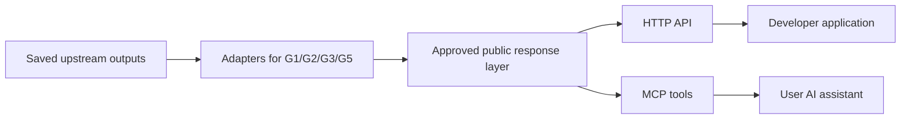

# G4 MCP offering and preparatory scaffold

## Round-one closeout — October 9

The owner closes this discovery pass and the linked G4 draft plan. Its unmet
requirements and unresolved proposals transfer to
[round-two G4](2026-10-09-110145-general-round-two.md#g4--sharing-x-and-inherited-api-work),
especially B2-G4-03. Keep the findings below as historical design input; no
public MCP/API implementation is claimed. New sharing/X scope and progress
belong to the successor. See the
[round-one closeout](../analysis/2026-10-09-110145-general-round-one-closeout.md).

## Plain-English Summary

Recommend a hosted, read-only PushinWeight connection for users' AI assistants,
with a regular API serving the same approved information to developers. Users
could ask what happened, find relevant stories, and eventually explore topic
histories without visiting each page. Their assistant supplies the conversation;
retrieving saved results need not trigger a new model call at PushinWeight.

The owner assigns this session to G4 and wants scaffolding now, with final
integration/completion after G1, G2, G3 and G5 finish. The first discussion
establishes the offering, public content contract, and dependency boundaries.
This document is preparatory design, not an implementation plan or a running
server. Recommendations below remain proposals until selected.

## Current evidence

- Read the authoritative [index](2026-09-30-104924-general-launch-index.md) and
  [charter](2026-09-30-104924-general-launch-charter.md), including G4-R01–R06.
- Root checkout: `docs/general-launch-coordination`, `33f20b97`; fetched main
  was `5082ddf7`. Root has other sessions' uncommitted work and is 2 commits
  ahead / 44 behind fetched main. It is a coordination checkout, not a chosen
  implementation base. Active benchmark, account-discovery and G3 work remain
  separately owned.
- G5 already has a loopback-only [sample server](../ideation/mockups/2026-10-01-190859-g5-general-homepage/01-above-the-fold/screens/serve.py).
  It reads bundled snapshots, handles selected JSON-RPC methods, and exposes
  proposed tools `get_chatter`, `get_pulse`, `get_calendar`, `get_free_stuff`,
  `get_jobs`, and `get_people_moves`. Its corresponding API paths are in
  `demo-data.js`. This is useful product evidence, not production MCP readiness.
- The demo declares protocol `2025-11-25`. Current official MCP documentation
  resolves to `2026-07-28`, with protocol differences. Select and test actual
  client/SDK versions before implementation; do not copy the sample wire handler.
- Demo Pulse uses `1d/7d/30d/365d` chart windows. G3 explicitly requires
  `15m/1d/7d/30d/360d` topic-history windows. These are separate contracts.
- Current root routing is Django/allauth plus monitor routes. Its dependency
  manifest has no MCP SDK. Existing browser login does not itself implement
  authorization for external MCP clients.

## User-facing offering options

| Offering | Example user request | Required capability | Tradeoff |
| --- | --- | --- | --- |
| News and discovery — recommended first | “What changed in open models today? Find related jobs and events.” | Search and retrieve approved saved stories, classifications and section entries | Useful with bounded serving costs; disclose freshness and unavailable coverage |
| Research and comparisons | “Explain how this topic changed over 30 days.” | G3 topic history; separately approved measurement series and definitions | More distinctive; depends on upstream identity, evidence and asynchronous result contracts |
| Personal assistant | “Follow this topic and prepare my morning briefing.” | User-owned preferences, watchlists, schedules and delivery | Adds persistent writes, account isolation, consent, retries and operating cost; future scope |

These can be stages of one service. The first does not need to masquerade as
an autonomous research agent. A dedicated `ask_pushinweight` model-backed tool
is an optional later product choice, with separately bounded spend and latency.
The client assistant can initially combine our saved outputs itself.

Interactive charts/cards are an additional presentation option through
[MCP Apps](https://modelcontextprotocol.io/extensions/apps/overview), not a
replacement for the underlying data tools. Use structured/text fallbacks for
clients without that extension. G5 would supply the visual design after its
content and interaction contracts settle. No claim of universal host support.

## Connection and access options

Recommend remote **Streamable HTTP**: users connect to a hosted HTTPS endpoint.
An optional local **stdio** package means their assistant launches a process on
their machine; that can suit developer workflows but adds installation and
update support. Keep local access to the same approved service, never distribute
our database or provider credentials. Both are standard
[MCP transports](https://modelcontextprotocol.io/specification/2026-07-28/basic/transports).

Access is a separate choice:

- Anonymous, tightly limited public reads: least onboarding, weaker per-user
  quotas and abuse attribution.
- Account-connected OAuth: recommended production direction for user assistants;
  scoped, revocable access and per-user quotas. The browser signs in and grants
  the assistant permission. Use the current
  [MCP authorization contract](https://modelcontextprotocol.io/specification/2026-07-28/basic/authorization).
- Issued developer credentials: useful for scripts/API customers and MCP clients
  that accept them; do not assume every consumer app accepts custom headers.

Free/paid tiers, quotas and access provider remain owner choices. “Public API”
means available to external users; it need not mean anonymous or unlimited.

## Shared foundation to scaffold

Proposed boundaries:

1. Explicit public schemas with stable public identifiers, locale, schema and
   content revision, publication time, evidence cutoff, freshness and coverage.
   Give unready, empty, withheld, unavailable and stale results distinct meanings.
2. One shared response builder and content policy for API, MCP text and
   structured results, resources, errors, metadata and future interactive views.
   Allow fields explicitly; do not serialize database models wholesale.
3. Replaceable upstream adapters, initially backed by synthetic approved fixtures.
   Test behavior without depending on unfinished upstream model names or schemas.
4. A maintained Python MCP SDK and thin HTTP adapter. The
   [official SDK](https://github.com/modelcontextprotocol/python-sdk) is the
   initial candidate; pin a released version and verify its supported protocol
   and clients before installing. Reuse Django business logic and avoid a new
   independent data store. Same-service ASGI mounting versus a small separate
   process remains an implementation/deployment decision.
5. Bounded query length, pages, result bytes, date ranges, database work and
   concurrency; authenticated quotas and sanitized request/error metrics. Agent
   usage stays separate from G3 human click/impression analytics.
6. Correction/withdrawal handling and cache invalidation across every output.
   Paid computation, if later added, uses explicit job requests and status reads,
   deduplication and budgets. A read tool must not silently start paid work.

Proposed tool vocabulary is task-oriented: `search_stories`, `get_story`,
`get_topic_history`, and narrowly defined listing tools for events, opportunities
and jobs. G5's six tool names remain inputs to this design, not frozen public
names. Avoid arbitrary SQL and generic internal database access.

Candidate routes to settle in the implementation plan: `/api/v2/mcp/`,
`/api/v2/stories/`, `/api/v2/stories/{id}/`,
`/api/v2/topics/{id}/history/`, `/api/v2/events/`,
`/api/v2/opportunities/`, `/api/v2/job-listings/`.
These are proposed routes, not existing endpoints.

Tools are the initial interface. Resources can supply the glossary, coverage
and supported filters; optional prompts can guide a daily briefing or topic
comparison. These are complementary
[MCP building blocks](https://modelcontextprotocol.io/docs/2026-07-28/learn/server-concepts).

## Content decisions that affect the scaffold

The charter prohibits source post text and author/account identity in external
responses, including indirect exposure through generated prose and metadata.
G2's faithful commentary can contain quotes or names, so an editorially approved
web result is not automatically an approved MCP result. G1 identities, faces,
source portraits, media URLs and classification evidence are not automatically
exportable. The treatment of a named story subject versus a source author needs
an explicit rule, especially where they are the same person or organization.

Source links are owner-permitted in principle, but both ordinary X URLs and
`x.com/i/status/...` links can reveal the author. Choose between source
traceability with identity omitted from our payload and a stricter offering
without external identifying links. Neither approach proves anonymity against
inference. A PushinWeight story link may reveal identity too; review destinations.
Keep links/media absent from initial synthetic fixtures until that policy is
resolved, without treating this temporary fixture choice as a new owner rule.

Started from repository compliance references and checked current
[TwitterAPI.io terms](https://twitterapi.io/terms),
[acceptable use](https://twitterapi.io/acceptable-use), and
[X Developer Policy](https://docs.x.com/developer-terms/policy) on October 6.
TwitterAPI.io requires compliance with third-party terms; X restricts content
redistribution and has display/removal requirements. These checks do **not**
establish that selling or exporting derived commentary/classifications is
permitted. Before public activation, map each proposed output to applicable
terms and resolve permission gaps. Redaction is not a substitute for that review.

## Upstream contracts to consume later

| Owner | G4 needs | Boundary |
| --- | --- | --- |
| G1 | Identity/provenance and approved media status | Enforce disclosure exclusions; no automatic people-directory tool |
| G2 | Saved Chatter/Pulse stories, locales, revisions, attribution and withdrawals | Public content projection independent of editorial approval |
| G3 | Stable topic identity, five exact windows, readiness/freshness, async semantics | Saved reads separate from potentially paid analysis requests |
| G5 | Section filters, canonical links and user connection/documentation surface | Its samples inform design; final integration waits under G4-R06 |
| Independent benchmark work | Approved metric definitions, entity mappings, timestamps and coverage | Optional consumer integration; no G6 or assumption of redistribution rights |

## Proof required from the eventual scaffold

Exercise actual API requests and an SDK client calling MCP, not only response
helpers. Both must return equivalent approved content for the same request.
Negative cases include raw quotes and author names in prose, nested evidence,
URLs, metadata, media, errors and resources; withheld/unready upstream data;
wrong/revoked credentials; exceeded limits; corrections invalidating cached
results; and no unintended provider/model call during reads. Test supported
protocol versions with selected real clients before promising compatibility.
Do not claim schema validation alone can prove semantic anonymity.

## Next decision and handoff

The October 7 [G4 implementation draft](../../.worktrees/feat/g4-mcp/docs/plans/2026-10-07-053244-feat-g4-mcp-plan.md)
is now the canonical planning artifact. It incorporates expanded G3 prediction
and scenario requirements and the analytics vendor comparison; recommendations
in this earlier discovery are not newly selected owner decisions.

Choose the primary offering and intended first clients, then settle the
identity/source-link rule and access model. Recommended starting assumption:
news/research reads over hosted MCP plus the shared API, OAuth direction,
synthetic fixtures and no newly generated answer per request.

When implementation planning starts, create an isolated checkout from reviewed
current main, read the installed Ollija skill, run `ollija annotate-plan` before
selecting a plan, and enrich the exact returned path. Keep delivery on-request.
Final integration waits for the other G tracks under G4-R06. This discovery pass
changed only this design and targeted G4 coordination; no runtime scaffold,
application tests, provider calls, database changes or deployment were performed.
