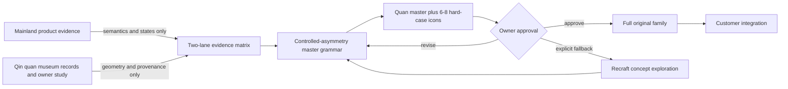
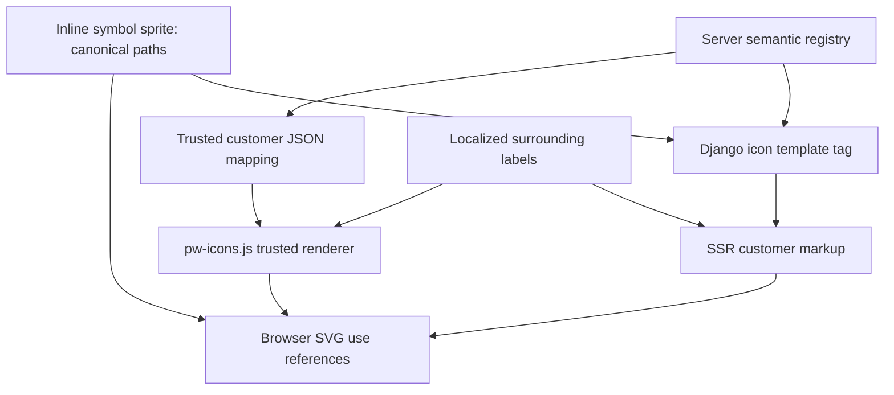

# Qin-Quan-Inspired Customer SVG Icon System - Plan

> Preserved ideation only. This document is not an active implementation or
> production authorization. Replan from current `main` and the current Ollija
> plan-annotator contract before executing any part of it.

## Goal Capsule

- **Objective:** Give every fixed customer-facing interface symbol a coherent, original, minimalist SVG treatment that is recognizably PushinWeight and remains legible across routes, locales, states, and rendering paths.
- **Means:** Build the family from an approved Qin-quan master grammar, a semantic icon registry, and an inline `currentColor` SVG system shared by server and client rendering (KTD2, KTD4).
- **Product authority:** This plan owns the icon-system addition. The approved V24 target continues to own layout, control geometry, chart behavior, filtering, and locale behavior.
- **Execution profile:** Deep, browser-first UI work on a fresh main-based Ollija worktree, with a mandatory specimen-approval gate before full-family drawing or production migration.
- **Stop conditions:** Stop if the overlapping V24 worktree is unresolved; if the owner-supplied quan references cannot be given durable provenance; if the specimen is not owner-approved; if any customer route needs a product behavior change to fit an icon; or if `/internal/` changes visually or at runtime.
- **Tail ownership:** The implementation agent owns research capture, original vectors, code, tests, and candidate documentation. The owner retains specimen approval, any Recraft authorization, desktop and physical-iPhone visual approval, and every staging or release decision.

---

## Product Contract

### Summary

PushinWeight will replace its fixed customer-facing emoji and font glyphs with an original SVG family. The family will remain minimalist, graphic, and mostly colorless. Its visual lineage will come from the Qin bronze weight, or quan, that inspired the PushinWeight identity.

Current mainland products will inform semantic recognition, icon size, and interaction-state conventions. They will not determine the site's visual density or proprietary path geometry.

### Problem Frame

The production interface currently mixes platform-dependent emoji, text glyphs, CSS pseudo-content, and dynamically generated symbols. Their forms vary by operating system and do not create a durable brand identity.

The first smooth abstraction of the Qin quan captures the arched handle and tapered body but removes much of the source object's character. The historical objects have uneven shoulders, nonparallel tapers, off-center negative space, variable joins, and visible mass. A useful modern abstraction needs controlled asymmetry without reproducing surface damage, inscription texture, or ornamental detail at icon size.

Contemporary mainland apps provide strong evidence for familiar social semantics, but their often dense and text-heavy presentation is not the desired aesthetic. PushinWeight should offer mainland users a distinct, restrained visual language while keeping all icon meanings immediately recognizable.

### Key Decisions

- **Use contemporary mainland apps as semantic evidence only.** (session-settled: user-directed — chosen over treating current mainland product styling as the visual target: the product should differentiate through a minimalist, graphic bias.) Governs R2, R5-R6.
- **Use the Qin quan as the primary visual lineage.** (session-settled: user-directed — chosen over a broad collage of ancient-Chinese motifs: the quan already belongs to the PushinWeight name and logo study.) Governs R3-R4, R14.
- **Preserve controlled asymmetry.** (session-settled: user-directed — chosen over the smooth symmetrical abstraction: asymmetrical shoulders, tapers, and joins better retain the character of cast ancient objects.) Governs R3-R6.
- **Draw the system in house.** (session-settled: user-approved — chosen over starting with AI vector generation: this set is small enough to control directly and must remain original and coherent.) Governs R1, R14-R15.
- **Keep icons neutral until a real state calls for color.** (session-settled: user-directed — chosen over permanently colored emoji or symbols: the requested model is Twitter-like monochrome with hover, selection, or status color.) Governs R7-R8.
- **Change customer-facing surfaces only.** (session-settled: user-approved — chosen over a repository-wide glyph replacement: `/internal/` is a protected legacy surface.) Governs R9-R13.

### Actors

- A1. A customer reads the public dashboard or an authenticated brand page in English, Simplified Chinese, or original-language mode.
- A2. The owner reviews the quan master and icon specimen at real production sizes and approves, revises, or rejects the visual direction.
- A3. The implementation agent creates original paths, integrates them across server and client renderers, and verifies route isolation and visual fidelity.

### Requirements

**Identity and authorship**

- R1. Every new path is original work; proprietary product paths, exact silhouettes, spacing systems, and animations are evidence-only and are not copied or traced.
- R2. Current mainland products determine recognizable semantics, practical scale, and state behavior, but they do not determine PushinWeight's visual density or path style.
- R3. The family derives from documented Qin-quan traits: stable mass, tapered bodies, arched negative space, slightly unequal shoulders, controlled off-axis balance, and blunt cast-like joins.
- R4. The historical influence remains structural and secondary; icons do not use faux calligraphy, distressed texture, literal inscriptions, dragons, pagodas, lanterns, red seals, ornamental borders, or unrelated dynasty motifs as generic Chinese shorthand.
- R5. Universal recognition and legibility at actual production sizes take priority over historical reference; a user never needs cultural knowledge to identify an icon.
- R6. Controlled asymmetry is optically deliberate and repeatable, not random path jitter, damaged edges, or inconsistent stroke quality.
- R7. The approved family is minimalist and graphic, with one coherent grid, optical scale, terminal treatment, and negative-space rhythm.
- R8. Paths inherit `currentColor`; neutral statistics and categories inherit muted or text color, actionable hover/focus and selected controls inherit their parent state, and genuine up/down/moderation statuses may inherit existing semantic tokens.

**Surface and behavior**

- R9. All application-authored fixed glyphs on `/` and authenticated `/brands/<brand>/` are migrated across templates, CSS pseudo-content, initial server rendering, refreshes, pagination, and JavaScript-created rows.
- R10. `/internal/` retains its existing templates, assets, glyphs, table structure, and runtime behavior and does not load the customer icon sprite, helper, or stylesheet.
- R11. Chart.js canvases, chart data marks, generated avatars, legend and status dots, chip rails, headline pulse dots, sentiment background tints, brand swatches, native controls, structural punctuation, and user-authored or model-authored emoji remain unchanged.
- R12. The V24 locale controls, pulse multiselect, selected-chip styling, two-clock timezone pill, fixed control geometry, chart behavior, feed data, and responsive layout remain unchanged.
- R13. Server and client output use the same semantic icon identifiers, order, number formatting, classes, and accessible meaning without an emoji-to-SVG flash or broken reference.

**Approval, accessibility, and provenance**

- R14. The owner approves a refined quan master and a representative six-to-eight-icon specimen at production sizes before the full family is drawn or migrated.
- R15. Recraft is not called or charged by default; it becomes a concept-only fallback only after explicit owner authorization, and any accepted result is provenance-recorded, redrawn or normalized to the approved system, and reviewed for originality.
- R16. Decorative SVGs are hidden from assistive technology; surrounding controls or localized hidden text own meaning, state, and count descriptions in English, Simplified Chinese, and original-language mode.
- R17. Unknown semantic keys fail safely without interpolated markup, external references, broken `<use>` nodes, or loss of the surrounding accessible text.
- R18. Research, specimen decisions, symbol meanings, source provenance, state rules, and migrated code locations remain documented as a current contract; the deployed production inventory changes only after authorized production verification.
- R19. Implementation begins from a fresh worktree based on current `main`, after overlapping UI work is settled, and any staging or release follows Ollija without direct Git, Render, or database release mutations.

### Key Flows

- F1. Evidence-to-specimen approval
  - **Trigger:** The implementation worktree is current and overlap-free.
  - **Actors:** A2-A3
  - **Steps:** Record mainland semantic conventions separately from Qin-quan geometry; verify authoritative artifact and owner-reference provenance; derive a restrained shape grammar; draw the quan master and representative specimen; review at production sizes and dense feed placement; record approval or revision.
  - **Outcome:** A signed-off visual contract exists before system-wide drawing begins.
  - **Covers:** R1-R8, R14-R15, R18-R19.
- F2. Public initial and dynamic rendering
  - **Trigger:** A customer opens `/` or changes locale, filters, window, timezone, or pagination state.
  - **Actors:** A1, A3
  - **Steps:** Render fixed symbols in the initial response; load one customer sprite and helper; resolve trusted semantic IDs; preserve V24 state styling; produce matching icons through each asynchronous replacement path.
  - **Outcome:** The customer sees one coherent icon family without layout shift, broken references, or behavioral regressions.
  - **Covers:** R7-R9, R11-R13, R16-R17.
- F3. Brand and internal route split
  - **Trigger:** An authenticated user opens a brand page or `/internal/`, then refreshes, sorts, filters, changes locale, or loads more rows.
  - **Actors:** A1, A3
  - **Steps:** Customer capability selects the iconized brand table renderer; absence of that capability keeps the existing internal renderer and assets; both initial and dynamic paths retain their route's DOM contract.
  - **Outcome:** The brand page joins the customer system while `/internal/` remains unchanged after both SSR and runtime updates.
  - **Covers:** R9-R10, R13, R16-R17.

### Acceptance Examples

- AE1. **Covers R2, R5-R8.** A display-only like count uses a recognizable heart or thumb semantic chosen by the registry, renders in neutral inherited color, carries no pointer or focus behavior, and shows only subtle quan-derived asymmetry.
- AE2. **Covers R7-R8, R12.** A selected V24 pulse chip keeps its existing geometry and `aria-pressed` behavior while its direction icon inherits white from the accent parent; the idle icon inherits neutral text color and remains distinguishable without color.
- AE3. **Covers R9, R13, R16.** A signal-rich post has the same semantic IDs, order, localized hidden summary, and count formatting in the initial server response and after filter refresh, locale replacement, page-two append, and periodic refresh.
- AE4. **Covers R9-R10, R13.** An authenticated brand page renders iconized table rows initially and after refresh, while `/internal/` retains its present glyph and DOM behavior through the same runtime actions and loads no customer icon asset.
- AE5. **Covers R13, R17.** A future unknown taxonomy key produces no broken or externally referenced SVG; known signals remain visible and the row's accessible summary remains complete enough to understand the available classifications.
- AE6. **Covers R8, R12-R13.** At 04:59/05:00, 07:59/08:00, 16:59/17:00, and 19:59/20:00, both local and California time icons switch to the correct semantic ID without changing the approved timezone-pill dimensions.
- AE7. **Covers R3-R7, R14.** The quan master and specimen retain unequal shoulders, a slightly off-center arch, and controlled taper at 1x and 2x, yet remain clean and coherent at 12-16 px without simulated corrosion or inscription texture.
- AE8. **Covers R11.** A user-authored post containing emoji, a chart canvas, avatar, status dot, and structural `·`, `—`, or `…` renders exactly as before while only application-authored fixed UI symbols change.

### Success Criteria

- The owner approves one refined quan master and a six-to-eight-icon specimen that covers social engagement, direction, sentiment, category, moderation or nationalism, and time-of-day at actual production sizes.
- The approved specimen is understandable without historical explanation, looks like one family at 1x and 2x, and expresses Qin-quan influence through structure rather than decoration.
- Customer routes contain no inventoried fixed emoji or font glyphs outside R11's exclusions, and every emitted `<use>` resolves to exactly one approved symbol.
- Default, hover/focus, selected, and semantic-status states use inherited computed color and preserve meaning without color alone.
- Public and brand SSR, refresh, pagination, locale, clock, and chart-replacement paths have semantic and accessibility parity.
- Automated and browser tests prove that `/internal/` remains free of customer icon assets and retains its current initial and runtime behavior.
- V24 control geometry, responsive behavior, Chart.js canvas rendering, data flow, and locale behavior remain within their existing regression contract.

### Scope Boundaries

- This work creates the icon system, a refined quan identity master, an approved specimen, customer-route integration, tests, and provenance documentation.
- The refined quan master is a source for the icon grammar and may replace an existing customer-facing brand mark if one is found on current `main`; this plan does not invent a new logo placement or redesign the page layout.
- This work does not redesign `/internal/`, charts, data marks, avatars, typography, color palette, information architecture, filters, headline generation, harvesting, database schema, APIs, or deployment topology.
- This work does not make the interface denser, more textual, more ornamental, or more similar to a specific mainland app.
- This work does not adopt a third-party icon package, external icon font, runtime SVG service, proprietary path, or AI-generated asset as the canonical source.
- This work does not authorize Recraft usage, staging, beta release, or production deployment.
- The production graphics inventory remains a deployed-state record until an Ollija-authorized release is verified; candidate mappings live in the icon contract meanwhile.

### Dependencies and Assumptions

- The owner-supplied study contains two historical quan images and one generated smooth abstraction. Their visual observations are usable now, but image origin and reuse rights must be recorded before any file is committed as a durable source.
- Authoritative collection records from the Palace Museum, National Museum of China, and Emperor Qinshihuang's Mausoleum Site Museum provide sufficient object identity, period, material, proportions, and typology to validate the quan lineage.
- The overlapping V24 worktree may change templates, filters, selectors, and browser tests. U1 re-inventories current `main` after that work is settled rather than coding against this stale checkout.
- Original SVG drawing is feasible in house. Recraft credits are a reserve, not a required dependency.

### Sources and Research

- `docs/ideation/2026-08-19-154623-qin-quan-production-graphic-elements-inventory.md` — preserved deployed-graphics research and code-location baseline.
- `docs/reference/2026-08-19-132714-v24-bridgewright-target.md` — approved additive V24 behavior and geometry target on current `main`.
- `monitor/templates/monitor/home.html`, `monitor/templates/monitor/brand_home.html`, and `monitor/templates/monitor/home_internal.html` — current route and asset boundaries.
- `monitor/templates/monitor/_feed_initial_v22.html`, `monitor/templates/monitor/_feed_initial_legacy.html`, and `monitor/static/pw-feed.js` — SSR and shared client-rendering paths.
- `monitor/static/pw-tz.js`, `monitor/static/pw-chart.js`, `monitor/static/home-v20.css`, and `monitor/static/dashboard.css` — dynamic chrome, pseudo-content, and two customer style contexts.
- [Emperor Qinshihuang's Mausoleum Site Museum Qin bronze quan](https://www.bmy.com.cn/impor_collections/420.html) — Qin-period excavated bronze weight, seventeen-sided form, shoulder and base dimensions, inscription, and find context.
- [Palace Museum Qin First Emperor edict quan](https://www.dpm.org.cn/collection/bronze/228543.html) — registered Qin bronze weight with rounded truncated body, loop handle, eighteen ribs, dimensions, and inscription record.
- [National Museum of China eight-catty bronze quan](https://www.chnmuseum.cn/zp/zpml/csp/202008/t20200826_247418.shtml) — Qin weight function, bronze and iron material context, dimensions, and standardized-measure inscription.
- [Weibo](https://weibo.com/), [Bilibili](https://www.bilibili.com/), [Xiaohongshu](https://apps.apple.com/cn/app/id741292507), [Douyin](https://apps.apple.com/cn/app/id1142110895), [WeChat](https://apps.apple.com/cn/app/id414478124), and [Zhihu](https://apps.apple.com/cn/app/id432274380) — current semantic and state evidence only; anti-abuse and authentication limitations must remain recorded.
- [Tencent TDesign Icons](https://github.com/Tencent/tdesign-icons), [ByteDance Semi Design](https://semi.design/en-US/basic/icon), [Arco Design](https://github.com/arco-design/arco-design), and [Ant Design icon specification](https://ant.design/docs/spec/icon/) — grid, state, and SVG mechanics references, not path sources or runtime dependencies.

---

## Planning Contract

### Current Baseline

| Concern | Current behavior | Planned change |
| --- | --- | --- |
| Visual authorship | Emoji and font glyphs inherit operating-system or font shapes. | Original Qin-quan-derived paths on one approved system. |
| Rendering | Symbols come from templates, CSS pseudo-content, `textContent`, and HTML strings. | One semantic registry and one inline sprite serve SSR and all customer CSR paths. |
| State color | Several icons have fixed or default semantic colors. | Paths use `currentColor`; the surrounding state owns neutral, accent, or semantic color. |
| Public page | V24 uses card rows, dynamic pulse/headline replacement, and two timezone icons. | Replace fixed symbols without changing V24 geometry, data, or interaction behavior. |
| Brand page | Uses legacy table SSR, `dashboard.css`, and shared feed JavaScript. | Add a customer-capable iconized table renderer and shared icon base styles. |
| Internal page | Shares the legacy partial and feed JavaScript with the brand page. | Preserve the existing partial, assets, glyphs, and absent customer capability. |
| Accessibility | Many symbols are hidden or exposed as bare glyphs and counts. | Decorative SVGs are hidden; localized surrounding text owns meaning and state. |
| Inventory | The inventory describes deployed SHA `bfc66f…`; current `main` already contains later V24 work. | Keep deployed truth intact and maintain a separate candidate registry until release verification. |

### Assumptions

- A stable 24x24 canonical coordinate system will suit most icons, with documented optical scaling for 12-16 px and 24-28 px render sizes. U2 may revise the grid before approval without changing the Product Contract.
- The quan influence will use a small set of repeatable geometric rules rather than making each semantic icon resemble a weight.
- Existing page-level text and state attributes can own accessible meaning; reusable symbols do not need localized `<title>` nodes.
- No Django model or migration is required.

### Key Technical Decisions

- **KTD1 — Separate semantic and visual evidence.** The evidence matrix has two lanes. Contemporary app evidence records meaning, scale, grouping, and state. Qin-quan evidence records artifact, period, material, collection identifier, rights, observed geometry, and the abstract rule derived from it. No source crosses lanes without an explicit rationale. (session-settled: user-directed — chosen over deriving “Chinese taste” from current app appearance: the desired product distinction is minimalist and historically grounded.) Implements R1-R6, R18.
- **KTD2 — Build a controlled-asymmetry master before individual icons.** Define optical-axis offsets, shoulder inequality, taper, arch shape, terminal weight, corner cadence, and negative-space limits from several authenticated quan objects. Apply only the subset that improves each icon at small size. Do not use random roughening, texture masks, or literal inscriptions. (session-settled: user-directed — chosen over smoothing the weight into perfect symmetry: the source objects' cast irregularity is a core identity trait.) Implements R3-R7, R14.
- **KTD3 — Make approval a two-stage gate.** Stage one approves the refined quan master and six-to-eight hard-case icons in context. Stage two draws and reviews the full semantic manifest. Production integration cannot start before stage one, and broad migration cannot finish before stage two. Recraft remains behind a separate owner authorization. Implements R14-R15.
- **KTD4 — Use one server-owned semantic registry and one inline symbol source.** `monitor/icon_registry.py` owns trusted semantic keys and metadata. A Django template tag renders SSR instances from that allowlist. `_icon_sprite.html` owns all path geometry. Customer templates serialize the trusted mapping for `pw-icons.js`, which creates client instances without duplicating paths or accepting raw IDs. This fits the no-bundler stack and avoids external-sprite color and hashed-URL complexity. Implements R1, R7-R9, R13, R17.
- **KTD5 — Use customer capability, then page shape, to select renderers.** `/` and the brand template opt into a versioned `data-pw-icon-set` capability. The public renderer keeps V24 card rows. The brand renderer produces iconized table rows. Absence of the capability executes the existing `/internal/` behavior and loads no icon assets. Implements R9-R10, R13.
- **KTD6 — State and accessibility belong to the parent.** The SVG instance is decorative. Existing `aria-expanded`, `aria-pressed`, link/button names, and localized hidden summaries own semantics. CSS applies color to the parent or wrapper, and every path inherits it. Display-only statistics remain noninteractive. Implements R8, R12, R16.
- **KTD7 — Treat the V24 target and icon specimen as additive oracles.** V24 remains authoritative for layout and behavior. The new dated icon contract owns path style, icon regions, and states. Browser tests compare each claim to the correct oracle instead of weakening broad visual thresholds. Implements R12, R14, R18.
- **KTD8 — Keep deployed and candidate documentation separate.** The dated icon contract records the candidate symbol map and provenance. `2026-08-19-154623-qin-quan-production-graphic-elements-inventory.md` changes only after the exact candidate is deployed and verified through Ollija. Implements R18-R19.

### High-Level Technical Design

These diagrams communicate direction and ownership. They are not implementation code.

**Design and approval lifecycle**



**Registry and rendering data flow**



**Route isolation and runtime branching**

```mermaid
flowchart TD
  R[Rendered page] --> C{Customer icon capability present?}
  C -->|no| I[/internal/: existing legacy assets and renderer]
  C -->|yes| P{Page shape}
  P -->|public multi-brand| V[/ V24 card SSR and CSR]
  P -->|brand| B[/brands/: customer table SSR and CSR]
  V --> X[Shared sprite, helper, and base CSS]
  B --> X
```

### State Contract

| Context | Idle | Hover or focus | Selected | Accessibility owner |
| --- | --- | --- | --- | --- |
| Engagement statistic | Muted/text `currentColor` | No added state | Not applicable | Localized count summary |
| Filter caret | Parent text color | Existing parent focus/hover | Rotation/open state only | Filter control `aria-expanded` and label |
| Pulse direction | Parent neutral color | Existing chip hover | Existing selected-parent color, including white on accent | Existing direction text and `aria-pressed` |
| Timezone icon | Parent muted/text color | Existing timezone-half state | Existing selected-half color | Timezone control label and selected mode |
| Back link | Link text color | Existing link accent | Not applicable | Link text |
| Classification signal | Neutral unless it is a genuine status | No interaction | Not applicable | Localized signal-group summary |
| Up/down/moderation status | Existing semantic token | No invented interaction | Existing state if any | Adjacent or hidden status text; never color alone |

### System-Wide Impact

- **Data flow:** No product data changes. Existing semantic keys pass through a trusted registry before templates or JavaScript select symbol IDs.
- **Rendering:** Public cards, brand tables, dynamic chart chrome, clocks, filters, and pagination converge on one path source while retaining their current DOM contracts.
- **Security:** Symbol names and classification keys are allowlisted. No untrusted key becomes HTML, a CSS selector, or an `href` target.
- **Accessibility and locale:** Labels stay outside symbols and use existing Django and client locale sources. Original-language mode continues to use English chrome.
- **Static delivery:** The sprite is inline once per customer page. The helper and base stylesheet are WhiteNoise-managed local assets loaded before their consumers and excluded from `/internal/`.
- **Operations:** No migration, worker, scheduler, external request, or new service is introduced.

### Risks and Dependencies

- **Overlapping V24 work:** The current checkout is behind `origin/main`, and an active V24-related worktree touches the same templates, scripts, and browser tests. Start only after Ollija and worktree checks identify a clean current base.
- **Cultural pastiche:** Too many motifs or literal artifact details would violate the minimalist goal. Mitigate with one primary source family, prohibited motifs, actual-size specimen review, and the two-stage approval gate.
- **Illegible asymmetry:** Optical offsets can look accidental at 12 px. Mitigate with 1x/2x review, density fixtures, and a rule that recognition wins over lineage.
- **Shared-renderer leakage:** `pw-feed.js` serves customer and internal routes, and brand/internal share a legacy partial. Mitigate with explicit customer capability plus page-shape branching and runtime `/internal/` regression tests.
- **Intrinsic SVG geometry:** Baselines and view boxes can clip or change row height. Verify bounding boxes, line boxes, overflow, zoom, and mobile widths against V24.
- **Unsupported source images:** The owner-supplied photos currently lack durable source metadata. Do not commit them until origin and reuse terms are known; use authoritative museum links and record observations instead.
- **Browser variation:** Inline `<use>` and inherited color need Chromium and WebKit/Safari coverage, plus physical-iPhone owner review before any release.

### Sequencing

1. Settle the overlapping worktree and establish the current browser baseline.
2. Complete the two-lane evidence matrix and controlled-asymmetry grammar.
3. Obtain owner approval for the master and representative specimen.
4. Build the registry and customer capability before migrating any producer.
5. Migrate public and brand SSR and CSR paths while keeping internal on its current branch.
6. Run source, static, accessibility, browser, locale, and route-isolation gates.
7. Record candidate state; stage or release only on a later explicit owner direction through Ollija.

---

## Implementation Units

### U1 — Establish the current baseline and two-lane evidence matrix

- **Dependencies:** None.
- **Goal:** Produce a durable, rights-aware baseline that cleanly separates semantic conventions from Qin-quan visual geometry.
- **Requirements:** R1-R6, R11-R12, R18-R19.
- **Files:** `docs/ideation/2026-08-19-154623-qin-quan-production-graphic-elements-inventory.md`, `docs/investigations/2026-08-19-181145-mainland-icon-semantics-and-qin-quan-geometry.md`, `docs/reference/2026-08-19-132714-v24-bridgewright-target.md`, `bridgewright.yaml`.
- **Approach:** Begin with `./bin/ollija status --json`, current branch/worktree inspection, and a fresh main-based worktree after the overlapping UI work is settled. Re-run the browser-first inventory on `/`, the authenticated brand route, and `/internal/`. Build a semantic manifest for every fixed glyph and record its route, meaning, state, renderer, accessibility owner, and disposition. In a separate evidence table, record each quan artifact's period, material, museum or owner source, collection identifier, rights, observed geometry, and permitted abstract derivation. Preserve the production inventory as deployed truth; put candidate differences in the investigation.
- **Execution note:** Characterize current browser behavior before editing source. Do not treat the stale checkout or temporary owner-image directory as the canonical baseline.
- **Test Scenarios:**
  - **Happy path:** The investigation accounts for every inventoried fixed glyph and every V24 addition, with each item assigned to replace, preserve, or exclude.
  - **Edge case:** A symbol with different meanings in different contexts, such as `☆` or `★`, receives distinct semantic IDs rather than a global Unicode replacement.
  - **Error path:** An owner or museum image without clear reuse terms remains a linked observation and is not copied into the repository.
  - **Integration:** Public, brand, and internal screenshots and DOM captures identify both initial and runtime producers before implementation begins.
- **Verification:** Owner and implementer can trace every planned symbol to one meaning and every proposed visual rule to a documented quan source without a proprietary path or mixed evidence lane.

### U2 — Define and approve the quan master and icon specimen

- **Dependencies:** U1.
- **Goal:** Turn the historical lineage into a precise, owner-approved minimalist visual contract before full-family production.
- **Requirements:** R1-R8, R14-R16, R18.
- **Files:** `docs/ideation/mockups/2026-08-19-181145-qin-quan-icon-specimen.html`, `docs/reference/2026-08-19-181145-customer-svg-icon-system.md`, `bridgewright.yaml`.
- **Approach:** Refine the quan master with controlled asymmetry, then draw six to eight hard cases: like or approval, reply or repost, direction or caret, sentiment, post type, moderation or nationalism, and the time-of-day family. Show each on the real dark surfaces at 12-16 px and 24-28 px, 1x and 2x, neutral and applicable interaction/status states, plus a maximum-density feed row. Document the grid, optical scale, asymmetry rules, terminals, fill/stroke policy, state table, accessibility ownership, prohibited motifs, original authorship, and source provenance. Add the approved contract as an additive Bridgewright target without replacing V24.
- **Execution note:** This is a visual-probe and owner-approval gate. Stop before drawing the full manifest if the master or specimen is not approved.
- **Test Scenarios:**
  - **Happy path:** The owner approves a coherent master and specimen that remain recognizable and crisp at actual production sizes.
  - **Edge case:** At least one icon needs less asymmetry than the master; the contract permits selective use while preserving family cadence.
  - **Error path:** A specimen resembles a proprietary app path, reads as ornamental Chinese shorthand, or loses meaning at 12 px; reject and redraw it.
  - **Integration:** The specimen preserves V24 control boxes, dense feed-row height, both customer CSS contexts, and English/Chinese label alignment.
- **Verification:** Record explicit owner approval in the contract. Record any Recraft authorization separately; absence of that record means no Recraft call is allowed.

### U3 — Build the trusted SVG registry and customer-only delivery layer

- **Dependencies:** U2.
- **Goal:** Provide one canonical path source and safe, parity-preserving renderers for templates and JavaScript.
- **Requirements:** R1, R7-R10, R13, R16-R17.
- **Files:** `monitor/icon_registry.py`, `monitor/templatetags/pw_icons.py`, `monitor/templates/monitor/_icon_sprite.html`, `monitor/static/pw-icons.js`, `monitor/static/pw-icons.css`, `monitor/templates/monitor/home.html`, `monitor/templates/monitor/brand_home.html`, `tests/test_icon_system.py`, `tests/test_pw_icons.js`, `tests/test_static_refs_resolve.py`, `tests/test_collected_static_provenance.py`.
- **Approach:** Add the closed semantic registry, template renderer, inline symbol sprite, client helper, and shared base CSS described by KTD4. Include the sprite, serialized trusted mapping, CSS, and helper once on `/` and the brand template, before consumer scripts. Add the versioned customer capability to those templates only. Keep paths free of embedded colors, text, events, scripts, external references, and raster content. Unknown names return no icon instance and retain surrounding semantic text.
- **Execution note:** Build and test the infrastructure with the approved specimen symbols before migrating all producers.
- **Test Scenarios:**
  - **Happy path:** Every registered key renders an SSR instance and a client instance that resolve to the same unique symbol.
  - **Edge case:** Multiple instances share one symbol without duplicate IDs, duplicate sprites, or inaccessible hidden content.
  - **Error path:** Unknown or hostile names cannot create raw HTML, external `href` values, scripts, event handlers, or broken references.
  - **Integration:** WhiteNoise static collection resolves the helper and CSS, customer consumers load after the helper, and `/internal/` loads none of the new assets.
- **Verification:** `tests/test_icon_system.py`, `tests/test_pw_icons.js`, static-reference tests, and collected-static provenance tests pass; source inspection finds only `currentColor` and approved geometry in the sprite.

### U4 — Migrate public V24 chrome and dynamic controls

- **Dependencies:** U3.
- **Goal:** Replace fixed public-page symbols without changing V24 control behavior or geometry.
- **Requirements:** R7-R9, R11-R13, R16-R17.
- **Files:** `monitor/templates/monitor/home.html`, `monitor/static/pw-tz.js`, `monitor/static/pw-chart.js`, `monitor/static/home-v20.css`, `tests/v22_support.py`, `tests/test_pw_chart_filter.js`, `tests/test_home_chart_pulse.py`, `tests/test_home_v22_browser.py`.
- **Approach:** Replace timezone day symbols, pulse direction pseudo-content, Top Voices score marks, filter carets, and other public chrome with semantic icon instances. Keep the two-clock timezone DOM, selected half, pulse multiselect, chart canvas, and rollback behavior. Replace CSS pseudo-content with real SVG hosts where meaning or runtime parity requires DOM markup. Narrow only the root-level test that currently treats any `<svg>` as a chart; keep the chart partial itself SVG-free.
- **Execution note:** Use Playwright before and after each chrome group. Preserve interaction ownership on the existing parent control.
- **Test Scenarios:**
  - **Happy path:** Initial and refreshed pulse, Top Voices, filters, and both clocks show approved symbol IDs with correct inherited colors.
  - **Edge case:** Time icons transition at every defined boundary in both displayed zones without clipping or pill-width change.
  - **Error path:** A malformed chart refresh rolls back to the last complete chrome, including its icon IDs and selected states.
  - **Integration:** Locale and window changes, pulse multiselect, keyboard focus, chart refresh, desktop, 520 px, 393 px, and 320 px retain the V24 contract.
- **Verification:** Focused JavaScript and browser suites pass; computed color, nonzero bounding boxes, on-screen geometry, and chart-canvas assertions match the V24 and icon oracles.

### U5 — Migrate feed signals and engagement with brand/internal isolation

- **Dependencies:** U3.
- **Goal:** Give public cards and brand table rows full SSR/CSR icon parity while keeping `/internal/` on its existing behavior.
- **Requirements:** R2, R5, R7-R11, R13, R16-R17.
- **Files:** `monitor/templates/monitor/_feed_initial_v22.html`, `monitor/templates/monitor/_feed_initial_brand.html`, `monitor/templates/monitor/_feed_initial_legacy.html`, `monitor/templates/monitor/brand_home.html`, `monitor/static/pw-feed.js`, `monitor/static/home-v20.css`, `monitor/static/dashboard.css`, `locale/en/LC_MESSAGES/django.po`, `locale/zh_Hans/LC_MESSAGES/django.po`, `tests/test_pw_feed_formatter.js`, `tests/test_home_v22_feed_row_shape.py`, `tests/test_dashboard_i18n.py`, `tests/test_i18n_catalog_pinned.py`.
- **Approach:** Replace engagement pseudo-content and sentiment, post-type, nationalism, unsanctioned, and legacy brand glyph production with semantic IDs. Render complete public signals in SSR rather than empty containers that flash after hydration. Split brand SSR from `_feed_initial_legacy.html`. In `pw-feed.js`, gate icon output on the customer capability, then select the public card or brand table renderer by page shape. Absence of capability preserves the existing internal client path. Add localized hidden count and classification summaries outside decorative SVGs; keep dynamic post content and emoji untouched.
- **Execution note:** Implement and characterize public, brand, and internal branches together; a brand-only template split is incomplete.
- **Test Scenarios:**
  - **Happy path:** Public cards and brand table rows render matching icon IDs and accessible summaries on the initial response, refresh, page two, and periodic update.
  - **Edge case:** A maximum-density signal row with mixed sentiment, all post types, both nationalism markers, and unsanctioned state wraps or compresses without clipping, row-height regression, or color-only meaning.
  - **Error path:** Empty, unknown, or malformed classification data creates no broken icon and does not erase valid surrounding content or accessible text.
  - **Integration:** English, `zh_cn`, the `zh_hans` alias, and original-language mode keep SSR/JSON parity; authenticated `/internal/` retains its legacy assets and runtime branch after refresh, sort, filter, and pagination actions.
- **Verification:** Feed formatter, row-shape, i18n, catalog, and browser assertions prove semantic ID, order, number, class, and accessibility parity while pinning `/internal/` isolation.

### U6 — Complete the family and run cross-browser visual regression

- **Dependencies:** U4, U5.
- **Goal:** Finish every approved manifest icon and prove family coherence, density, route behavior, and accessibility in real browsers.
- **Requirements:** R1-R18.
- **Files:** `monitor/templates/monitor/_icon_sprite.html`, `docs/ideation/mockups/2026-08-19-181145-qin-quan-icon-specimen.html`, `docs/reference/2026-08-19-181145-customer-svg-icon-system.md`, `tests/test_customer_icons_browser.py`, `tests/test_home_v22_browser.py`, `tests/regression_net.py`, `tests/visual_tokens.py`, `tests/element_audit.py`, `tests/test_bridgewright_v24_target.py`.
- **Approach:** Draw the remaining manifest under the approved grammar. Add targeted icon-region screenshots and DOM assertions instead of weakening V24's oracle. Exercise Chromium and WebKit/Safari at desktop, 520 px, 393 px, and 320 px, plus 200% zoom, English and Simplified Chinese, neutral/hover/focus/selected/status states, JavaScript disabled or slow, initial SSR, all asynchronous replacement paths, empty results, and request failures. Inspect forced-colors/high-contrast behavior where available. Retain explicit owner desktop and physical-iPhone approval before any later release.
- **Execution note:** The approved specimen, not the old platform glyph, is the visual oracle.
- **Test Scenarios:**
  - **Happy path:** Every customer icon is visible, aligned, original, coherent, and semantically correct at all supported sizes and routes.
  - **Edge case:** Thin negative spaces and asymmetrical joins survive 12 px, 1x display, 200% zoom, maximum signal density, and both dark customer CSS contexts.
  - **Error path:** Missing static helper, delayed JavaScript, failed refresh, or unknown key leaves complete SSR content or the last complete state without console errors or broken boxes.
  - **Integration:** Public and authenticated brand flows pass in both browser engines and locales while `/internal/`, Chart.js, user emoji, and V24 geometry remain unchanged.
- **Verification:** The targeted browser suite, V24 contract tests, regression net, visual tokens, and element audit pass. The owner records desktop and physical-iPhone visual approval before release eligibility.

### U7 — Finalize candidate documentation and release-safe handoff

- **Dependencies:** U6.
- **Goal:** Leave an auditable, current candidate with no false claim that unshipped icons are already in production.
- **Requirements:** R15, R18-R19.
- **Files:** `docs/reference/2026-08-19-181145-customer-svg-icon-system.md`, `docs/ideation/2026-08-19-154623-qin-quan-production-graphic-elements-inventory.md`, `bridgewright.yaml`, `docs/deploy/render.md`.
- **Approach:** Update the icon contract with the final semantic manifest, source locations, state and accessibility rules, original-authorship statement, approved specimen receipt, and test evidence. Keep `2026-08-19-154623-qin-quan-production-graphic-elements-inventory.md` pinned to its deployed SHA until an explicitly authorized Ollija release is verified. If the owner later authorizes release, follow Ollija's reported next action, preserve required desktop and physical-iPhone approvals, verify the exact deployed candidate, then refresh the production inventory to current state and SHA. Do not retain obsolete glyphs as active alternatives; Git carries history.
- **Execution note:** Candidate completion does not authorize staging or release.
- **Test Scenarios:**
  - **Happy path:** A reviewer can map every customer icon from semantic key to approved symbol, renderer, state, label owner, and provenance record.
  - **Edge case:** The implementation is complete but not released; candidate docs are current while the production inventory remains explicitly deployed-state truth.
  - **Error path:** Ollija reports a stale candidate, dirty overlap, missing approval, or production mismatch; stop without editing production-state documentation.
  - **Integration:** After a later authorized release, the production browser, deployed SHA, Bridgewright target, and inventory agree on the exact icon system while `/internal/` remains legacy.
- **Verification:** Documentation contains no superseded active instructions, the candidate/deployed distinction is explicit, and any production update has an Ollija verification receipt.

---

## Verification Contract

### Source and Unit Gates

Run from the clean implementation worktree on current `main`:

```bash
./bin/ollija status --json
node tests/test_pw_icons.js
node tests/test_pw_feed_formatter.js
node tests/test_pw_chart_filter.js
.venv/bin/python manage.py check
.venv/bin/python manage.py collectstatic --noinput --dry-run
```

Run focused Django and static tests against the repository's isolated PostgreSQL test database:

```bash
DATABASE_URL=<isolated-test-postgres-url> .venv/bin/pytest -q \
  tests/test_icon_system.py \
  tests/test_static_refs_resolve.py \
  tests/test_collected_static_provenance.py \
  tests/test_home_chart_pulse.py \
  tests/test_home_v22_feed_row_shape.py \
  tests/test_dashboard_i18n.py \
  tests/test_i18n_catalog_pinned.py \
  tests/test_bridgewright_v24_target.py
```

### Browser and Regression Gates

```bash
DATABASE_URL=<isolated-test-postgres-url> .venv/bin/pytest -q \
  tests/test_home_v22_browser.py \
  tests/test_customer_icons_browser.py \
  tests/regression_net.py \
  tests/visual_tokens.py \
  tests/element_audit.py
```

- Treat required PostgreSQL tests that skip, error, or use the wrong backend as non-green.
- Verify Chromium and WebKit/Safari where the browser suite supports them.
- Capture targeted icon-region screenshots at desktop, 520 px, 393 px, and 320 px in English and Simplified Chinese.
- Assert nonzero and on-screen geometry, computed inherited color, alignment, no clipping, and correct neutral/hover/focus/selected/status behavior.
- Assert SSR/CSR parity after filter, locale, pagination, periodic feed refresh, pulse refresh and rollback, headline replacement, and timezone boundary updates.
- Assert authenticated brand initial and runtime table rendering.
- Assert authenticated `/internal/` initial and runtime legacy preservation and absence of the customer sprite, helper, CSS, and capability.
- Keep chart-specific SVG prohibitions scoped to the chart component; the production graph remains a Chart.js canvas.

### Manual Approval Gates

- Owner approval of the refined quan master and representative specimen before full-family work.
- Owner approval of the completed family at actual size on both customer CSS contexts.
- Originality and provenance review confirming no proprietary paths, unlicensed committed images, or undisclosed generated assets.
- Owner desktop and physical-iPhone visual approval before release eligibility.
- A new explicit owner direction plus Ollija-reported release path before staging or production changes.

---

## Definition of Done

- U1 is done when the current-main browser inventory and two-lane evidence matrix account for every customer glyph, exclusion, source, state, renderer, and provenance limitation without changing deployed-state documentation.
- U2 is done when the owner approves the refined Qin-quan master and representative specimen and the dated icon contract becomes an additive Bridgewright oracle.
- U3 is done when the trusted registry, template renderer, inline sprite, client helper, and shared customer CSS pass safety, resolution, and static-delivery tests and remain absent from `/internal/`.
- U4 is done when all public V24 chrome producers use approved semantic icons and retain their geometry, behavior, canvas chart, state, and rollback contracts.
- U5 is done when public cards and brand table rows have complete SSR/CSR icon and accessibility parity and `/internal/` remains unchanged after runtime updates.
- U6 is done when the full family passes source, locale, accessibility, density, responsive, Chromium, WebKit/Safari, and V24 regression gates and receives required owner visual approval.
- U7 is done when candidate documentation is complete, deployed and candidate truth remain distinct, and no staging or release has occurred without explicit owner direction and Ollija evidence.
- The global work is done when all R1-R19 and acceptance examples are satisfied, all required automated and manual gates are green, and abandoned experiments, rejected generated concepts, duplicate paths, unused helpers, obsolete pseudo-content, and temporary debug code are removed from the final diff.
