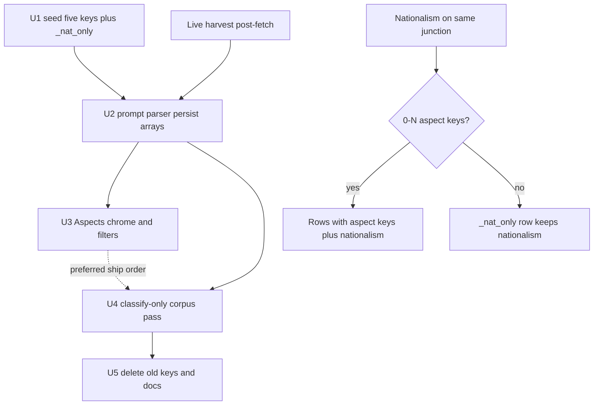

<!-- BEGIN OLLIJA DELIVERY GUIDE -->
## Ollija Delivery Guide

This block is generated guidance. Do not edit it directly. Correct durable facts in `.ollija/project.yaml` or this template, then rerun `./bin/ollija annotate-plan`. Put a user-directed exception in the editable Delivery Exceptions section below.

### Resolved locations

- Authoritative host: `fuchitalee`
- Authoritative repository: `/Users/fuchitalee/development/pushin-weight-v2`
- Ollija release worktree area: `/Users/fuchitalee/development/pushin-weight-v2/.worktrees`
- Active worktree: `/Users/fuchitalee/development/pushin-weight-v2`
- Plan: `/Users/fuchitalee/development/pushin-weight-v2/docs/plans/2026-09-02-125049-feat-replace-discourse-with-aspects-plan.md`
- Change: `feat-replace-discourse-with-aspects-2026-09-02-125049`
- Branch: `main`
- Staging branch and blueprint: `staging`, `/Users/fuchitalee/development/pushin-weight-v2/render-staging.yaml`
- Production branch and blueprint: `main`, `/Users/fuchitalee/development/pushin-weight-v2/render.yaml`
- Staging URL: `https://pushinweight-staging-web.onrender.com`
- Production URL: `https://pushinweight-web.onrender.com`

### Placement

1. Move this worktree from `/Users/fuchitalee/development/pushin-weight-v2` to `/Users/fuchitalee/development/pushin-weight-v2/.worktrees/main` before any other delivery action.
2. Rerun `./bin/ollija annotate-plan` after the move; this guide contains stale active-worktree paths until then.
Ollija does not move or reject the worktree.

### Delivery scope

- Workflow: `plan`
- Delivery target: `on-request`
- Owner selection recorded: `false`

Target is not authorized until the owner selects it. Wait for a later explicit release request; do not commit, push, stage, or promote on this guide alone.

### Failure handling

- Never promote a staging candidate whose automated checks failed.
- Implementation failures return to the parent implementation workflow for diagnosis, correction, recommit, and restaging.
- SSH, shell, environment, or multi-machine failures use the repository infra/multi-machine skill first.
- The change ledger is advisory; do not validate or enforce it.
- Never force-remove a worktree. Retain staging-only, failed, dirty, locked,
  noncanonical, or candidate-mismatched worktrees for diagnosis or later
  delivery.
- Do not run an endless retry loop or start a persistent Ollija process.
<!-- END OLLIJA DELIVERY GUIDE -->
# Replace Discourse With Subject-Matter Aspects - Plan

## Goal Capsule

- **Objective:** A MiniMax or Qwen DevRel person can filter cost/value + negative (and Chinese) and get real pricing complaints, not a genuine_hype pile. Rhetorical discourse keys are gone from the feed.
- **Means:** Replace the per-brand discourse slot with five bilingual subject-matter aspects (KTD1), classify-only corpus pass (KTD4), keep nationalism via `_nat_only` rows (KTD5, KTD6).
- **Authority:** Product Contract Key Decisions and Requirements win on behavior. KTDs win on mechanism. Units cite those IDs and do not restate them.
- **Stop if:** nationalism would be dropped on no-aspect posts; harvest `manage.py backfill` would be used to re-tag (that path fetches TwitterAPI); production harvest cron would be paused without a current owner order.
- **Execution profile:** `code`. Ordinary planning. `delivery_target: on-request`.
- **Tail ownership:** Parent workflow. Ollija does not commit, push, or deploy.

Product Contract preservation: written from the 2026-09-02 ce-brainstorm session. No prior requirements-only file.

---

## Product Contract

### Summary

Retire the ten rhetorical discourse keys. The same per-brand filter slot becomes five bilingual aspects: cost/value, agents/tools, evals/benchmarks, API/developer surface, openness/license. Multi-label, only when present. Backfill the stored corpus. DevRel can slice MiniMax/Qwen pricing complaints.

### Problem Frame

Discourse was a 9-then-10 key pragmatic-register list invented from a 2026-06-26 prompt, not from this corpus. On 185,895 production posts (read-only census 2026-09-02), `genuine_hype` is 43,185 of 62,077 discoursed posts and ~95% positive. `advertising-marketing` overlaps `post_type=advertising_marketing`. Lexical 阴阳 is 3 posts while the classifier fires `dunk_yingyang` 2,267 times. Subject-matter keywords cover 27% of all posts and 40% of Chinese posts (价格/性价比 ~20% of zh; 开源/闭源/商用 ~17% of zh). Post type already covers genre. Sentiment already covers valence.

### Key Decisions

- Five bilingual aspects including evals, not an 8-key list and not the 2026-06-24 four Aspects. Genre (post type) and subject (aspect) stay distinct. (session-settled: user-approved — chosen over 8 keys or the 2026-06-24 four: enough coverage without rare leftovers.) Governs R1, R2, R6.
- Tag only when an aspect is present. No forced tag, no persisted dump bucket. (session-settled: user-approved — chosen over forcing ≥1 tag: avoids a new genuine_hype.) Governs R3, R10.
- Multi-label, small cap. (session-settled: user-approved — chosen over one primary: MiniMax cheap tool-calling is cost/value and agents/tools.) Governs R4.
- Backfill the existing corpus, not new harvests only. (session-settled: user-approved — chosen over new-only or a recent window: historical pricing complaints must be filterable.) Governs R8.
- Replace the per-brand discourse slot, not post-level tags and not keyword-derived tags. (session-settled: user-approved — chosen over post-level or keyword-only: MiniMax × cost/value needs a brand on the tag.) Governs R5, R7.
- No competitive/ecosystem classifier family. Closed-weight brands plus same-post co-occurrence later. (session-settled: user-directed — chosen over a second family: those brands are coming.) Governs R11.
- Distillation stays out of the aspect list. (session-settled: user-approved — chosen over an aspect or unsanctioned flag: 357 classified posts, ~40 tight accusations.) Governs R1.

### Requirements

**Vocabulary**

- R1. The persisted aspect keys are exactly `cost_value`, `agents_tools`, `evals_benchmarks`, `api_developer_surface`, `openness_license`. Underscored. Distillation, hardware, long-context, and the ten rhetorical keys are not keys.
- R2. Each key has en and zh-cn labels: Cost / Value 价格与性价比; Agents / Tools 智能体与工具; Evals / Benchmarks 评测与基准; API / Developer surface API与开发者接口; Openness / License 开源与商用.
- R3. A post×brand with no matching subject gets zero keys from the five aspects. Nationalism-only storage uses `_nat_only` (KTD5), which is not an aspect pill. The feed uncategorized choice matches posts with no key in the five aspects. `uncategorized` is never a `discourse_keys` row.

**Assignment**

- R4. One post×brand may carry more than one aspect, cap 3 in the prompt, hard cap 6 in the parser. Production persist must write every allowed key, not only the first.
- R5. Aspects stay per post×brand, same slot as today's discourse junction. Post type, sentiment, role, and unsanctioned flags stay on their current tables.
- R6. Evals/benchmarks is the subject of a comparison (MMLU, Arena, 评测, 跑分). It is not a synonym of `post_type=performance_comparisons`. A comparison about price is cost/value.
- R7. Hardware cost, token price, 免费, and 性价比 map to `cost_value`. Hardware used as quality evidence maps to `evals_benchmarks`. Long-context maps to `evals_benchmarks` when it is a capability/benchmark claim and to `cost_value` when it is about packing tokens cheaply. Coding without agents/tools is not an aspect.

**Feed**

- R8. After backfill, a MiniMax or Qwen DevRel can filter cost/value + negative (and Chinese) and see pricing complaints. Launch-hype with no subject does not appear in that slice.
- R9. Visible chrome is Aspects / 方面. The ten rhetorical labels leave the filter pill and brand-chart discourse tab. Home mix does not keep a rhetorical series.

**Backfill and preservation**

- R10. New harvests write only the five keys. Historical attributed posts are re-tagged without TwitterAPI fetch and without rewriting `posts_brands_signals`.
- R11. China/US nationalism already on a post×brand survives even when the new aspect list is empty. Competitive-frame tagging is out of this work.

### Actors

- A1. DevRel for MiniMax, Qwen, Llama, NVIDIA NeMo, SpaceXAI, including Chinese-language staff. Primary success slice is MiniMax/Qwen.
- A2. Harvest classifier (post-fetch). Assigns aspects on new posts.
- A3. Operator running the classify-only corpus pass.

### Key Flows

- F1. New harvest post
  - **Trigger:** CycleRunner post-fetch classify.
  - **Steps:** Merged pragmatics call emits aspects array. Persist 0–N aspect rows per brand. Nationalism copied onto those rows or a nationalism-only row. Signals unchanged in shape.
  - **Outcome:** Feed aspect filters match new keys only.
  - **Covered by:** R4, R5, R10, R11.
- F2. DevRel pricing slice
  - **Trigger:** Home or brand feed. Locale zh or en.
  - **Steps:** Filter aspects=`cost_value` and sentiment=`negative` (optional lang=zh). Uncategorized off.
  - **Outcome:** Pricing complaints, not genuine_hype.
  - **Covered by:** R8, AE1.
- F3. Corpus re-tag
  - **Trigger:** Operator classify-only command after U2 (U1 implied). U3 is preferred ship order, not a hard gate.
  - **Steps:** Batched LLM classify of stored posts. Write aspects only. Copy nationalism. Do not fetch. Do not pause cron unless the owner separately orders it.
  - **Outcome:** Historical MiniMax pricing posts become filterable.
  - **Covered by:** R8, R10, R11.

### Acceptance Examples

- AE1. Covers R8. Given a MiniMax Chinese post that complains about 价格/收费, when DevRel filters MiniMax + `cost_value` + negative + zh, then that post is in the feed and a launch-hype post with no price talk is not.
- AE2. Covers R4, R6. Given a post that is a leaderboard comparison about cheap tool-calling, when classified, then post type may be `performance_comparisons` and aspects include `cost_value` and `agents_tools` and may include `evals_benchmarks` only if evals are actually discussed.
- AE3. Covers R3, R10. Given a buzz post with no subject-matter aspect, when classified, then zero of the five aspect keys; uncategorized matches; nationalism on that brand is still stored on a `_nat_only` row if a nationalism value is set.
- AE4. Covers R10, R11. Given a historical post that already has `dunk_yingyang` and `china_nationalism=pro`, when the classify-only pass runs, then the rhetorical key is gone, aspects reflect the text, signals are unchanged, and china nationalism remains `pro`.

### Success Criteria

- SC1. AE1 works on a backfilled window, not only on posts harvested after the prompt swap.
- SC2. After U5, distinct `discourse_key` values are the five aspects plus `_nat_only`. `genuine_hype` count is 0.
- SC3. A launch-hype fixture post produces zero of the five aspect keys (regression against a new dump bucket).

### Scope Boundaries

**In scope**

- Swap the discourse vocabulary, prompt, parser, CycleRunner persist, feed pill, charts that still name discourse, i18n chrome, seed labels, classify-only corpus pass, headline family that currently enumerates discourse keys.

**Deferred for later**

- Closed-weight brand harvest (GPT/Claude/Gemini/Grok) and same-post co-occurrence as a competitive proxy.
- Splitting nationalism onto its own table.
- Renaming SQL tables `discourse_keys` / `posts_brands_discourse` to aspect_*.
- Keyword-only aspect assignment.
- Weibo/Zhihu.

**Outside this product's identity**

- Rebuilding rhetorical discourse (hype, dunk, cope, FUD) as a first-class family.
- Changing the 7-call harvest shape or translator model.

**Deferred to Follow-Up Work**

- None. Flask `x_monitor/dashboard.py` constants still pin 10 keys in CI; U1 updates those tuples so tests pass. That is test lockstep, not a Flask product revival.

---

## Planning Contract

### Key Technical Decisions

- KTD1. Keep storage and wire names `discourse_keys`, `posts_brands_discourse`, query `discourse=`, `data-group="discourse"`. Visible chrome is Aspects / 方面. (session-settled: user-approved — instantiates replace-the-slot over a family rename: nationalism FKs and filter localStorage stay on the existing junction.) Governs R5, R9.
- KTD2. Stop collapsing in `_classify_one_batch_to_by_brand`. Emit `aspects: list[str]` (and keep post_types arrays) through to the shared persist helper. Persist writes every allowed key. A CycleRunner test that stubs two aspects already in `by_brand` is not enough; one test must send two-key LLM JSON through `classify_batch_pragmatics_full`. Governs R4.
- KTD3. Prompt field is `aspects` (array). Parser accepts `aspects` and, during one harvest window, `discourse_roles` as a fallback alias so in-flight caches do not 500. Persist maps to FK `discourse` / DB column `discourse_key`. U5 removes the alias. Governs R1, R4.
- KTD4. Classify-only corpus pass calls `classify_batch_pragmatics_full` and a shared persist helper extracted from `CycleRunner._run_post_fetch`. It does not call `manage.py backfill --since/--until` and does not use `x_monitor/reattribute.py` (that path does not write discourse). Governs R10.
- KTD5. Nationalism-only rows use seeded key `_nat_only`, which is not in the five aspect dashboard keys. Do not null a composite-PK column. Uncategorized matches posts with no key in the five aspects, including `_nat_only` and leftover rhetoric until U5. Do not persist `uncategorized`. Governs R3, R11.
- KTD6. Harvest persist writes this call's nationalism onto aspect rows or `_nat_only`. The corpus pass copies stored nationalism for that post×brand and ignores LLM nationalism. It does not write `posts_brands_signals`. Governs R10, R11.
- KTD7. LLM caps on both harvest and corpus pass: batch 20, `max_workers=3`, `X_MONITOR_LLM_PAUSE_SECONDS`, optional `--max-llm-calls`. Classifier model is `cfg.llm.classifier_model` (`deepseek-v4-flash`) on every call. Do not pause `pushinweight-harvest` without a current owner order. Governs R10.
- KTD8. Seed the five keys first. UI lists only those five immediately. Old rhetoric rows do not match aspect filters (they look uncategorized). After the corpus pass, delete leftover rhetoric rows, then delete the ten old keys (PROTECT FK). Governs R1, R9, R10.
- KTD9. `seed_i18n_labels` must update labels for existing keys, not only `get_or_create`. Chrome `discourses:` / 话语: becomes Aspects: / 方面: in both `.po` catalogs. Governs R2, R9.
- KTD10. Headline mix that reads `discourse_keys` picks up the five aspects after seed. Touch headline code only if a hardcoded rhetorical allow-list exists. Do not add a seventh competitive family. Remove the `discourse_roles` parser alias in U5.

### High-Level Technical Design

Shared persist helper is the only writer of `posts_brands_discourse` for harvest and the corpus pass.

### Assumptions

- Corpus pass covers posts with at least one `posts_brands` row other than `_unattributed`. Posts with no brand cannot receive per-brand aspects.
- ~99k already-signaled posts is the practical LLM set. Operator may `--limit` for a first drain.
- Home Django mix chart does not currently fill discourse stacked series. U3 removes leftover JS/tests that still assume 10 rhetorical keys rather than building a new mix axis.
- External landscape research was skipped. Local 027 taxonomy pattern is the recipe.

### Implementation Constraints

- M7: no second classifier client.
- M8: name LLM caps before the corpus run.
- M10: en and zh-cn labels plus chrome `.po`.
- M12: explicit classifier model on the CycleRunner call chain.
- M17: diagnose and backfill read-only toward production harvest; pause only with a current owner order.
- M18: call-chain test through `_run_post_fetch`, not only `_VALID_DISCOURSE`.
- Do not write to `data/x_monitoring.db`.

### Sequencing

Preferred ship order: U1 → U2 → U3 → U4 → U5. Hard gate: U4 requires U2 (U1 implied). U3 is not a U4 prerequisite. Harvest can ship U2+U3 before U4.

---

## Implementation Units

### U1. Seed five aspect keys and labels

- **Goal:** Lookup tables and dashboard constants list the five keys in R1–R2. Old ten keys still exist until U5.
- **Requirements:** R1, R2, R3, R11.
- **Dependencies:** none.
- **Files:** `core/management/commands/seed_i18n_labels.py`; `monitor/views.py`; `x_monitor/dashboard.py`; `core/models.py` (DiscourseKey docstring); `tests/test_home_chart.py`; `tests/test_ui_assurance_contract.py`; `tests/fixtures/ui_assurance/declaration.json`.
- **Approach:**
  1. Insert five aspect keys plus `_nat_only`. Keep old rhetorical keys so PROTECT FKs do not fail.
  2. Change Django `_DASHBOARD_DISCOURSE_KEYS` and the Flask twin in `x_monitor/dashboard.py` to the five plus synthetic uncategorized. `_nat_only` is not on the dashboard tuple. This is CI lockstep, not a Flask revival.
  3. Teach `seed_i18n_labels` to update labels when copy changes (KTD9).
- **Patterns to follow:** `docs/reference/lookup-tables.md` adding-a-value checklist. Migration 027 was additive keys only. No schema migration.
- **Test scenarios:**
  - Seed dry-run reports five aspect keys plus `_nat_only` and does not delete old keys.
  - Inserting `discourse_key='uncategorized'` fails FK. Inserting `_nat_only` succeeds.
  - Dashboard tuple length is 5. `genuine_hype` and `_nat_only` are absent. `cost_value` is present.
- **Verification:** `python manage.py seed_i18n_labels --dry-run` then apply on a test DB.

### U2. Prompt, parser, and CycleRunner array persist

- **Goal:** New harvests assign 0–N aspects per brand through the shared writer.
- **Requirements:** R1, R3, R4, R5, R6, R7, R10, R11. KTD2, KTD3, KTD7.
- **Dependencies:** U1.
- **Files:** `x_monitor/attribution.py`; `monitor/cycle.py`; `docs/reference/classifier-prompts.md`; `tests/test_classify_pragmatics_full_prompt.py`; `tests/test_classify_pragmatics_full_arrays.py`; `tests/test_classify_batch_pragmatics_full.py`; new `tests/test_cycle_persist_aspects.py`.
- **Approach:**
  1. Replace the discourse_roles legend with the five aspects and fold-in rules from R6–R7. Drop rhetorical examples, including distillation.
  2. Parser: allow-list is the five keys; missing/invalid → `[]` not `["uncategorized"]`; cap 6. `_nat_only` is never an LLM value.
  3. Stop collapsing in `_classify_one_batch_to_by_brand`. Emit `aspects` lists through to persist (KTD2).
  4. Extract persist of junction rows from `_run_post_fetch` into a helper. Harvest passes this call's nationalism. Helper writes every allowed aspect, or one `_nat_only` row when aspects are empty and nationalism is set (non-null and not `none`).
  5. Call-chain test sends two-key LLM JSON through `classify_batch_pragmatics_full` into the helper; captured `model=` is `cfg.llm.classifier_model`.
- **Execution note:** Add the collapse-red test first so today's scalar reshape fails before persist changes.
- **Patterns to follow:** Array parser already exists. Batch reshape currently drops all but the first discourse key.
- **Test scenarios:**
  - Prompt lists the five keys and does not list `genuine_hype` or `distillation_accusation`.
  - Empty aspects persist zero of the five keys. Nationalism-only post gets one `_nat_only` row (Covers AE3).
  - Two-key LLM JSON persists two rows, not one (Covers AE2).
  - Unknown key is dropped, not stored.
  - CycleRunner captured kwargs include `model=deepseek-v4-flash` (or cfg value) even when env still points at MiniMax (M12/M18).
  - Signals writer is unchanged when only aspects change.
- **Verification:** Named pytest files green. A dry-run cycle against a fixture post writes aspect keys only.

### U3. Feed chrome, filters, and leftover charts

- **Goal:** DevRel sees Aspects / 方面 and can filter the five keys plus uncategorized.
- **Requirements:** R3, R9. KTD1, KTD9.
- **Dependencies:** U1.
- **Files:** `monitor/templates/monitor/home.html`; `monitor/views.py`; `monitor/static/pw-locale-toggle.js`; `monitor/static/pw-filter-store.js`; `monitor/static/pw-chart.js`; `monitor/static/pw-brand-chart.js`; `monitor/static/dashboard.css`; `locale/en/LC_MESSAGES/django.po`; `locale/zh_Hans/LC_MESSAGES/django.po`; `tests/test_home_v22_filter_pills.py`; `tests/test_home_chart_pulse.py`; `tests/test_i18n_catalog_pinned.py`; `tests/test_home_v22_browser.py`.
- **Approach:**
  1. Keep `data-group="discourse"` and query `discourse=` (KTD1). Change visible titles on home and brand-chart tab to Aspects / 方面.
  2. Rewrite `_post_matches_filter` and the feed queryset: uncategorized = no key in the five aspects. `_nat_only` and leftover rhetoric match uncategorized, not an aspect pill.
  3. Drop rhetorical `--bar-*` tokens. Add five aspect color tokens. Keep wire `data-pw-tab="discourse"`.
  4. Pin both `.po` catalogs. Dual-path JS chrome in `pw-locale-toggle.js`.
  5. Before U4, aspect-only filters may show the existing empty-feed copy. No special banner.
- **Patterns to follow:** `tests/test_home_v22_filter_pills.py` order and 未分类. `docs/solutions/workflow-issues/django-i18n-locale-toggle-debugging-journey.md`.
- **Test scenarios:**
  - Pill title is Aspects / 方面. Five keys plus uncategorized. No 阴阳怪气 / Genuine Hype. Brand-chart tab matches.
  - Uncategorized matches `_nat_only` rows and `genuine_hype`-only rows. Those rows do not match `cost_value`. In-memory and ORM paths.
  - `cost_value` + negative filter returns the AE1 fixture and excludes launch-hype.
  - Playwright: toggle `cost_value`; locale toggle asserts Aspects then 方面; toggle uncategorized and assert a `_nat_only` fixture stays visible. Desktop and a mobile width. Rhetoric-only corpus + `cost_value` shows the existing empty feed, not a console error.
- **Verification:** pytest pills + i18n pin + one Playwright home filter path. Visual check is not enough.

### U4. Classify-only corpus pass

- **Goal:** Historical attributed posts receive aspects without TwitterAPI and without rewriting signals.
- **Requirements:** R8, R10, R11. KTD4, KTD6, KTD7.
- **Dependencies:** U2.
- **Files:** new Django management command under `monitor/management/commands/` (name chosen at implementation); shared persist helper from U2; `tests/test_cli_backfill_unsanctioned_flags.py` as pattern; new `tests/test_aspect_corpus_pass.py`.
- **Approach:**
  1. Remaining-work set: post×brand rows that still have a non-null `discourse_key` outside the five aspects and `_nat_only`, or that have nationalism and no aspect key yet. Skip rows whose non-null keys are already ⊆ the five plus `_nat_only`. Optional `--brand`, `--limit`, `--dry-run`, `--max-llm-calls`.
  2. Call `classify_batch_pragmatics_full` with explicit `cfg.llm.classifier_model`. Discard signal writes. Pass stored nationalism into the U2 helper (ignore LLM nationalism).
  3. Replace rhetoric rows for a post×brand only when the parsed result includes that post×brand. Empty `by_brand`, missing tweet_id, or batch shape failure leaves existing rows and stays in remaining-work. Do not treat classifier empty-shape as AE3.
  4. Reuse pause_sec / batch 20 / max_workers=3. Log LLM call count. Do not touch harvest cron.
- **Execution note:** Prove the command with `--limit` on fixtures before any production job. Production run is operator-triggered, not this plan's deploy.
- **Patterns to follow:** Unsanctioned-flags CLI extracts one dimension. Invert the persist filter: write aspects, skip flags and signals. Do not use date-range harvest backfill.
- **Test scenarios:**
  - Fixture with `dunk_yingyang` + `china_nationalism=pro` + MiniMax price complaint → after pass, aspect `cost_value`, nationalism `pro`, signals unchanged (Covers AE4).
  - `--dry-run` makes no writes. A second run skips already-aspect rows.
  - Fake client captured `model=` is the cfg classifier model.
  - Parsed empty aspects + existing nationalism → `_nat_only` row, zero rhetoric keys.
  - Batch classify failure leaves `dunk_yingyang` in place and counts a retryable miss.
  - Command does not import TwitterAPI search.
- **Verification:** pytest for the command. Operator dry-run counts on shadow DB before a real job.

### U5. Retire old keys and refresh docs

- **Goal:** After U4, production junction keys are the five aspects plus `_nat_only`. Docs and CONCEPTS match current state.
- **Requirements:** R1, R9. KTD8, KTD10.
- **Dependencies:** U4.
- **Files:** `core/management/commands/seed_i18n_labels.py` (drop old lists); `docs/reference/lookup-tables.md`; `docs/reference/classifier-prompts.md`; `CONCEPTS.md`; remaining tests still pinning 10 rhetorical keys.
- **Approach:**
  1. Gate: count of `discourse_key` not in the five aspects or `_nat_only` is 0.
  2. Delete leftover rhetoric rows, then delete old rhetorical keys. Keep `_nat_only`.
  3. Remove the KTD3 `discourse_roles` parser alias. Update lookup-tables and classifier-prompts. Verify headline mix still reads keys from `discourse_keys`; touch headline code only if a hardcoded rhetorical allow-list exists. CONCEPTS: Aspect occupies the discourse slot.
  4. No remnant "previously 10 rhetorical keys" narrative in reference docs (M11).
- **Test scenarios:**
  - Prod/shadow query: distinct keys ⊆ five aspects ∪ `{_nat_only}`.
  - Seed no longer inserts `genuine_hype`.
  - No hardcoded `dunk_yingyang` in headline ranker if one existed; otherwise docs only.
- **Verification:** SC2 query. Docs describe current keys only.

---

## Verification Contract

| Gate | Command / evidence | Units |
|---|---|---|
| Parser and prompt | `pytest tests/test_classify_pragmatics_full_prompt.py tests/test_classify_pragmatics_full_arrays.py tests/test_classify_batch_pragmatics_full.py` | U2 |
| CycleRunner call chain | `pytest tests/test_cycle_persist_aspects.py` | U2, U4 |
| Feed and i18n | `pytest tests/test_home_v22_filter_pills.py tests/test_home_chart_pulse.py tests/test_ui_assurance_contract.py tests/test_i18n_catalog_pinned.py` | U1, U3 |
| Browser | `pytest tests/test_home_v22_browser.py` path that toggles the aspect/discourse group | U3 |
| Corpus pass | `pytest tests/test_aspect_corpus_pass.py` | U4 |
| Production health after harvest ships U2 | harvester-latest-n-health-check enrichment-relevant route (read-only; no cron pause) | U2 |
| SC2 after U5 | read-only `render psql` distinct `discourse_key` | U5 |

Do not treat Render cron `successful` as proof. Check persisted keys.

---

## Definition of Done

- R1–R11 and AE1–AE4 hold in tests named above.
- SC1–SC3 hold on shadow or prod after the corpus pass the operator actually ran.
- CycleRunner call-chain test is green (M18). Function-only allow-list tests are not enough.
- No TwitterAPI calls in the corpus pass.
- Nationalism still present on AE4-class posts.
- Abandoned probe code is not left in the diff.
- `CONCEPTS.md` defines Aspect. Reference docs show five keys only after U5.

---

## Risks & Dependencies

- LLM cost of the corpus pass is large. Mitigate with `--limit`, brand filter, and harvest coexistence caps. Do not use TwitterAPI backfill to "save" LLM calls.
- Overlap with live harvest on the classifier endpoint. Mitigate with existing pause_sec and max_workers. Do not infer a cron pause (M17).
- `cost_value` could become a new dump bucket. SC3 and prompt negatives (launch-hype → no aspect) are the pin.
- Headline mix still names old keys until U5. Ship U5 in the same release train as U4 completion, or headlines stay wrong.

---

## Alternative Approaches Considered

- **Post-level aspect table.** Rejected in brainstorm. MiniMax × cost/value needs a brand.
- **Keyword-derived aspects, no LLM.** Rejected in brainstorm. 27% recall and noisy `agent`/`api`.
- **Rename SQL family to aspect_*.** Deferred. Nationalism FKs and every filter consumer would move with little user value.
- **Nullable `discourse_key` in the composite PK.** Rejected. PostgreSQL PK columns cannot be null. `_nat_only` keeps the existing PK (KTD5).
- **Reset `classification_status=PENDING` and reuse full `_run_post_fetch`.** Rejected. That re-translates and rewrites signals.

---

## Documentation / Operational Notes

- Operator corpus pass is a Render one-off job or local-against-shadow command with `--limit` first. Not the 15-minute harvest cron.
- After U2 ships to harvest, new posts get aspects immediately; history looks uncategorized until U4.
- `./bin/ollija annotate-plan docs/plans/2026-09-02-125049-feat-replace-discourse-with-aspects-plan.md` after edits.

## Delivery Exceptions

Parked 2026-09-02 in `docs/ideation/` until a later plan slot. Not the active harvest worktree. Ordinary planning. No staging or production delivery selected.

---

## Sources / Research

- Production census 2026-09-02 on `pushinweight-db-shadow` (read-only): 185,895 posts; discourse vs sentiment overlap; axis keyword unions.
- `docs/plans/2026-07-03-003-feat-post-fetch-taxonomy-and-multi-discourse-plan.md` (additive 027 pattern; unsanctioned dimension-only backfill).
- `docs/solutions/architecture-patterns/backfiller-and-llm-classifier-pipeline-wiring.md` (do not re-fetch to re-classify).
- `docs/reference/lookup-tables.md`, `docs/reference/classifier-prompts.md`.
- Grounding dossier: `/tmp/compound-engineering-501/ce-brainstorm/discourse-taxonomy-20260902/grounding.md`.
- Probe notes: `/tmp/compound-engineering-501/ce-brainstorm/discourse-taxonomy-20260902/probe-findings.md`.
