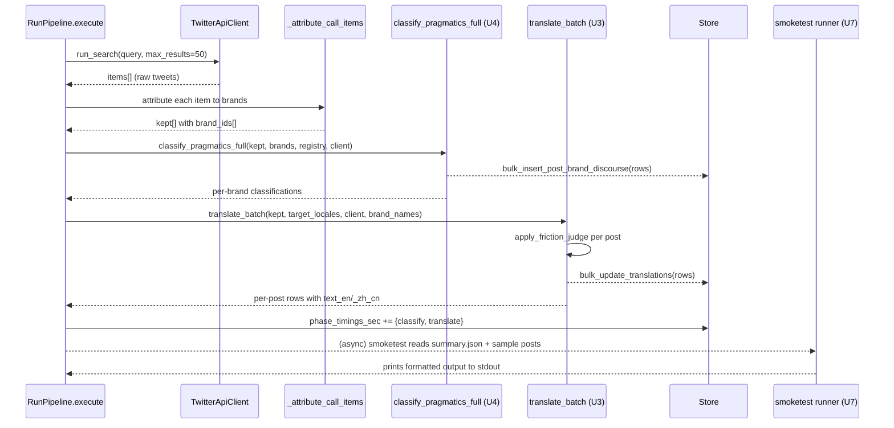

# Streamlined post-fetch pipeline: classification + translation + discourse/nationalism

## 1. Goal Capsule

Streamline every per-post transformation that runs after the TwitterAPI.io
fetch into a single, ordered, fail-soft pipeline inside `RunPipeline.execute`.
Three transformers are wired, in order: (i) `classify_post` (post_type + sentiment,
already shipped, this plan only verifies and adds a prompt-side extension),
(ii) `translate_batch` upgraded to the per-post YAML contract from research
2026-06-26-v2 §5.1 (literal_zh + discourse_role + cn_equivalent + annotation,
with F0–F3 friction-aware annotation from §4.1), and (iii) a new
`classify_discourse_and_nationalism` call that emits `discourse_role`,
`china_nationalism`, and `us_nationalism` for the (post × brand × act) signal
row. The output of (iii) lands in a new `posts_brands_discourse` table that
mirrors `pushin_weight/core/models.py::PostBrandDiscourse`. A first-class
**one-cycle smoketest runner** (`scripts/post_fetch_smoketest.py` + an
`x-monitor smoketest` subcommand) executes the entire post-fetch pipeline
against either the most recent cycle's kept posts or a fixture, prints
per-stage timing, and renders sample posts with all new annotations alongside
the originals — this is a hard requirement, not a stretch goal. Default
cycle-time target: < 90 s with the 15-min collection cadence preserved and
headroom for future frequency increases.

## 2. Problem Frame

The fetch pipeline is healthy (item 1 in 2026-07-02-183000 documented the
variance, item 6 + 6b documented the post-fetch translation gap). Three gaps
remain that this plan closes:

1. **Translation is unwired on the hot path.** As of 2026-07-02, zero of 5,703
   posts have `text_en` / `text_zh_cn` / `lang_detected` populated. The
   `translate_batch` plumbing exists and is unit-tested, but
   `RunPipeline.execute` never calls it. The 15-min cycle window is wasted —
   posts arrive, are stored, are never surfaced as Chinese-readable.

2. **The translator's output contract is too narrow.** `translate_batch` today
   returns `text_en / text_zh_cn / lang_detected`. The 2026-06-26-v2 research
   shows vendor readers cannot distinguish hype from dunk from 抽象 without
   the four-section YAML contract (literal_zh + discourse_role + cn_equivalent
   + annotation) and the F0–F3 friction-aware annotation logic from §4.1.

3. **The pragmatic and nationalist layers are untracked.** The per-post
   `classify_post` writes only `post_type` + `sentiment` to
   `posts_brands_signals`. The 9-way `discourse_role` taxonomy (§2 of the
   research) and the 6-step two-axis nationalism scale (china_nationalism +
   us_nationalism, §4.4) are dropped on the floor. The aggregate brief loses
   what makes the post "hype vs dunk vs 翻车" — exactly the layer the Chinese
   vendor reader is paying for.

A separate hard requirement: the maintainer must be able to run "one cycle,
examine the results" without waiting for the LaunchAgent. That is U7 in this
plan and is non-negotiable.

## 3. Requirements

**R1.** Wire `translate_batch` into `RunPipeline.execute` after `classify_post`
has finished, on the kept set per cycle. (Source A item 6b.)

**R2.** Upgrade `translate_batch`'s prompt to the four-section YAML contract
from research §5.1: `literal_zh`, `discourse_role`, `cn_equivalent`,
`annotation`. The current `text_en` / `text_zh_cn` / `lang_detected` columns
remain the per-post storage shape (they are filled from the YAML); the YAML
output is what the LLM sees.

**R3.** Implement the F0–F3 friction-level judgment from research §6.5 as a
post-processor that strips `annotation` when not warranted (F0), trims to
one line (F1/F2), or keeps the full 3–5 sentence background (F3). This
keeps the rendered zh-CN payload ≤ 280 characters per post.

**R4.** Add the `x-monitor translate` subcommand to `__main__.py` (mirrors
`translate-registry` at `x_monitor/__main__.py:1027-1050` and the
`scripts/backfill_classify_recent.py` template). Flags:
`--locale en,zh_cn`, `--limit 200`, `--dry-run`, `--db PATH`. Internals:
`Store.get_posts_missing_translations(locale, limit)` →
`translate_batch(rows, ...)` → `Store.bulk_update_translations(rows)`. (Source A
item 6.)

**R5.** Add a new per-post classifier
`classify_discourse_and_nationalism(post, attributed_brands, ...)` that emits
per (post × brand) row: `discourse_role ∈ {9 keys}` + `china_nationalism ∈ {6
keys}` + `us_nationalism ∈ {6 keys}`. The 9 + 6 + 6 enums are exactly the keys
documented in research §2 (9-way) and §4.4 (6-step × 2 axes).

**R6.** Persist the new signals in a new `posts_brands_discourse` table with
the same composite-PK convention as `pushin_weight/core/models.py::PostBrandDiscourse`:
`(post_id, brand_id, discourse_key, act_id)` where `act_id` is a small integer
allowing N speech-acts per (post × brand). The two `*_nationalism` FKs are
nullable during the backfill window (per the source design rationale in
`pushin_weight/core/models.py:704-708`).

**R7.** Decision: combine `classify_post` (post_type + sentiment) and
`classify_discourse_and_nationalism` (discourse_role + 2 nationalism axes)
into a **single per-post LLM call** named `classify_pragmatics_full`. The
single call returns all four prongs in one structured response. The
rationale is in §4 (Key Technical Decisions); the rejected alternative
(four separate calls) is documented in §11 (Open Questions). Translation
remains its own call because its prompt contract (§5.1 of research) is much
larger than the classification prompt and combining it would exceed the 4k
output-token ceiling.

**R8.** Hot-loop time budget. The default cycle target is < 90 s end-to-end.
At 200 kept posts/cycle, the budget per kept post is ≤ 0.45 s wall-clock for
LLM work. With Haiku 4.5 averaging ~0.6 s/turn for 20-post batches:
- 1 `classify_pragmatics_full` call per 20-post batch × 10 batches = 10 turns
  ≈ 6 s.
- 1 `translate_batch` call per 20-post batch × 10 batches = 10 turns ≈ 6 s.
- Plus 3 retry turns for transient failures (99th percentile).
- Total LLM time: ≤ 15 s, leaving 75 s for fetch + filter + storage.
The plan documents this budget and the smoketest runner asserts it.

**R9.** Fail-soft contract (carried from `x_monitor/translator.py:25-27` and
item 6b of source A): a single post's translation, classification, or
discourse/nationalism failure never aborts the cycle. The smoketest runner
must surface per-row failure counts and the cycle summary must show
`phase_timings_sec` plus per-stage counts.

**R10.** Build the smoketest runner `scripts/post_fetch_smoketest.py` +
`x-monitor smoketest` CLI subcommand. The runner executes the entire
post-fetch pipeline (U2 + U3 + U4 in this plan) on either:
(a) the most recent cycle's kept posts (`--source latest-cycle`,
default), OR (b) a fixture file (`--fixture PATH`, expected format:
JSONL of `{tweet_id, text, attributed_brands}` rows). It prints:
- counts per stage (n_classified, n_translated, n_discourse, n_nationalism)
- per-stage timing in milliseconds
- a sample of N posts (default 5, configurable via `--sample`) showing the
  original `text` + `literal_zh` + `discourse_role` + `cn_equivalent` +
  `annotation` + `china_nationalism` + `us_nationalism` aligned for
  eyeball coherence
- an error report grouped by stage (LLM failures, parse failures, missing
  brand attribution)

**R11.** Wire the smoketest runner into the LaunchAgent deploy script as a
`--smoketest` flag that runs the smoketest once after deploy and aborts the
LaunchAgent load on any unhandled exception (the test runner itself is
expected to fail gracefully on LLM errors). This is the operational
gate that proves "the post-fetch pipeline works end-to-end on a fresh box."

## 4. Key Technical Decisions

**KTD1. Single batched `classify_pragmatics_full` call (R7).** The
alternative is four separate per-post LLM calls (post_type, sentiment,
discourse_role, nationalism × 2). Rejected because (a) per-post overhead is
~0.6 s/turn × 4 = 2.4 s/kept post, blowing the R8 budget, (b) four
sequential serial calls serialize the entire kept set behind the slowest
post in each batch, (c) the four keys are mutually informative — the model
chooses a single discourse_role more accurately when it sees the
post_type/sentiment in the same prompt. The merged prompt returns a single
YAML/JSON object per post with all four keys, mirroring the
`per_post_x_to_cn_pragmatics_v1` prompt's structured-output discipline.

**KTD2. Translation remains its own LLM call.** Combining translation
(literal_zh + cn_equivalent + annotation = up to 280 chars) with
classification (4 enum keys) is theoretically possible but the
`per_post_x_to_cn_pragmatics_v1` prompt is ~1.4k tokens of system prompt
+ friction table. Combining exceeds 4k output-token ceiling at 20-post
batch size. Translation is the high-cost, high-context call; classification
is the low-cost, high-volume call. Keep them separate.

**KTD3. F0–F3 friction-aware annotation post-processor.** Implemented as a
function `apply_friction_judge(post, llm_yaml)` in
`x_monitor/translator.py` that runs after parsing the YAML response. Reads
the §6.5 flowchart and decides whether to keep the LLM's `annotation`
string, strip it, or replace it with a one-line pragmatic-register note.
Rationale: the LLM's "always output an annotation when in doubt" tendency
will inflate the rendered zh-CN payload past the 280-char budget; the
post-processor enforces the budget deterministically.

**KTD4. Two-axis nationalism with shared enum.** The `china_nationalism`
and `us_nationalism` columns share the same 6-step enum
(none / mild_pro / pro / constructive_critical / anti / mixed), as
documented in `pushin_weight/core/models.py::Nationalism:656-666` and
research §4.4. A single `nationalism_keys` table + a single
`nationalism_labels` table back both axes. The brief renderer expands the
key by axis context: `china_nationalism::anti` → "反华",
`us_nationalism::anti` → "反美". Splitting the label tables per-axis is
deferred (matches the Q2-deferred decision recorded in
`pushin_weight/core/models.py:664`).

**KTD5. `discourse_keys` has no `other` bucket.** The rationale
recorded at `pushin_weight/core/models.py:618-623` (which uses
`post_types` / `stances` — `stances` being pushin_weight's
post-0006-rename equivalent of our `sentiment_keys` — for the same
concept) is that `post_type_keys` and `sentiment_keys` seed an `other`
bucket for LLM-hallucinated keys, but `discourse_keys` is intentionally
tight: 9 keys, no fallback. The classifier's response parser coerces
unknown keys to `"uncategorized"` at the brief-renderer; uncategorized
rows are cited in the brief's limitations paragraph rather than folded
into a fake bucket. The 9 keys are the literal set from research §2:
`straight_hype`, `sarcasm`, `dunk_yingyang`, `self_deprecation`, `cope`,
`fud`, `distillation_accusation`, `ai_slop_critique`, `absurdist_meme`.

**KTD6. `posts_brands_discourse` schema mirrors pushin_weight.** Per the
user's instruction to mirror pushin_weight's table shape:
- composite PK `(post_id, brand_id, discourse_key, act_id)` — a single
  tweet can have N speech-acts toward the same brand
- nullable `china_nationalism` and `us_nationalism` FKs during the
  backfill window
- indexes `idx_post_brand_dis_b_dr`, `idx_post_brand_dis_b_cn_nat`,
  `idx_post_brand_dis_b_us_nat`
- the migration column names follow the existing x-monitor convention
  (TEXT PKs, INTEGER id for enum tables) per migration 018 — column PATTERN
  is mirrored, column NAMES defer to the existing convention.

**KTD7. `act_id` enumeration.** Within a single (post × brand), the
classifier emits up to N acts. v1 assigns `act_id = 1` for every row
(single-act mode). Future revisions can extract multi-act segments; the
schema is forward-compatible.

**KTD8. Smoketest runner is its own artifact, not a transient script.**
`scripts/post_fetch_smoketest.py` is checked into the repo and has its
own unit tests (covering: empty cycle, cycle with N posts, fixture mode,
dry-run mode, sample rendering). The `x-monitor smoketest` CLI subcommand
in `__main__.py` wraps it.

**KTD9. Cycle-time budget is asserted by the runner.** The smoketest
runner prints `wall_clock_sec_per_kept_post` and exits non-zero if it
exceeds 0.6 s (1.3× the 0.45 s R8 budget to allow for warm-up overhead on
the first batch). This is the early-warning canary for cycle-time
degradation if frequency increases.

## 5. Implementation Units

### U1. Schema migration for discourse / nationalism / posts_brands_discourse

Mirror `pushin_weight/core/models.py::Discourse`,
`::Nationalism`, `::PostBrandDiscourse` into x-monitor's existing migration
convention (INTEGER id PKs for enum tables per migration 018, TEXT PKs for
natural-key junction tables per migration 022).

**Scope:**
- New migration `024_pragmatics_axes.sql` (next number after 023) that
  creates: `discourse_keys` (9 rows seeded), `discourse_labels` (en + zh_cn
  per key), `nationalism_keys` (6 rows seeded), `nationalism_labels`
  (shared across both axes), `posts_brands_discourse` (composite PK
  `(post_id, brand_id, discourse_key, act_id)`; nullable
  `china_nationalism` + `us_nationalism`; 3 indexes).
- `Store` methods:
  - `bulk_insert_post_brand_discourse(rows: list[dict]) -> int`
  - `get_post_brand_discourse_for_post(tweet_id: str) -> list[dict]`
  - `bulk_update_nationalism(post_id, brand_id, discourse_key, act_id,
    china, us)` — for the backfill window where the FKs start NULL and are
    filled by U4's second pass.
- Update the `Store._apply_migration` ledger to track the new migration;
  no manual INSERT INTO `_migrations`.

**Test scenarios:**
- Migration applies cleanly on a database that already has migrations
  001-023 applied; rollback (`migrations rollback 024`) restores the
  pre-migration schema without data loss on `posts_brands_signals`.
- `Store.bulk_insert_post_brand_discourse(rows)` with N rows of mixed
  `discourse_key` values writes N rows; calling twice with the same PKs
  is idempotent (INSERT OR IGNORE semantics).
- A row with an unknown `discourse_key` is rejected with the FK violation
  error from SQLite (`FOREIGN KEY constraint failed`), not silently
  coerced — the parser coerces before calling Store.

### U2. Verify + document classify_post; no rebuild

`classify_post` is already shipped at `x_monitor/attribution.py:421-429` and
called from `RunPipeline._attribute_call_items` around line 423. No
rebuild. This unit documents the existing call path and asserts it covers
(post_type, sentiment) per the research's §5.2 cross-tab vocabulary.

**Scope:**
- Update `x_monitor/attribution.py` docstring to cite the research §5.2
  cross-tab as the post_type + sentiment vocabulary reference.
- Add `docs/post_fetch_architecture.md` (or a section in this plan) that
  lists the call sequence: classify → translate → discourse/nationalism.
- Existing unit tests for `classify_post` pass unchanged.

**Test scenarios:**
- `classify_post` continues to pass its existing unit tests.
- `_attribute_call_items` with `brand_registry=None` returns empty
  classifications (the no-LLM path, used by `_ingest_quote_tweets`).
- The post-fetch smoketest runner (U7) shows the existing
  `classify_post` output populated in the `posts_brands_signals` table
  before the U3 and U4 transformers run.

### U3. Upgrade `translate_batch` to the §5.1 YAML contract + F0–F3 friction judge

Replace `build_translation_prompt` in `x_monitor/translator.py:77-134` with
the `per_post_x_to_cn_pragmatics_v1` system prompt from research §5.1.
Add a post-processor `apply_friction_judge(post, llm_yaml)` that runs the
§6.5 flowchart. The output row schema keeps the existing
`text_en` / `text_zh_cn` / `lang_detected` columns plus new optional fields
`discourse_role_yaml` (string), `cn_equivalent` (string), `annotation`
(string). The new fields live in the row dict (used by U7 for rendering)
and are persisted to `posts_brands_discourse` via U4 / U1's Store method,
not to `posts` directly — `posts` keeps only the `text_*` columns.

**Scope:**
- New function `build_pragmatics_translation_prompt(tweets, target_locales,
  brand_names, few_shot_examples)` in `x_monitor/translator.py`. The
  few-shot examples are the live X posts from research §3.10 (9 verified
  examples, one per discourse_role, loaded from a small JSONL fixture).
- New function `apply_friction_judge(post, llm_yaml) -> dict` that takes
  the raw LLM YAML output and returns the post-processed row with
  `annotation` adjusted per F0–F3.
- Updated `translate_batch` signature: same inputs, returns rows with the
  additional `discourse_role_yaml`, `cn_equivalent`, `annotation` fields.
  Backward-compatible: existing call sites continue to work because
  `bulk_update_translations` only reads `tweet_id`, `text_en`, `text_zh_cn`,
  `lang_detected`.
- New tests covering the F0–F3 logic: hype with no annotation needed (F0),
  sarcasm with 1-line annotation (F1), "Theranos" reference with 3-sentence
  annotation (F2), "shrimp jesus" reference with 5-sentence background (F3).

**Test scenarios:**
- A batch of 5 posts spanning all 9 discourse_roles: each row's
  `annotation` field is non-empty for F1–F3, empty for F0.
- A "Theranos" reference post gets the F2 background annotation truncated
  to ≤ 280 chars in `text_zh_cn`.
- A malformed LLM response (missing `discourse_role`) is coerced to
  `uncategorized` at the parser; the row is still written with
  `text_en` / `text_zh_cn` populated.
- Existing `translate_batch` tests pass after the prompt change (the row
  schema is backward-compatible).

### U4. New per-post discourse + nationalism classifier (or merged into U3)

`classify_pragmatics_full(post, attributed_brands, client, registry,
brand_names) -> dict[brand_id, dict[str, str]]` returns per-brand:
`{post_type, sentiment, discourse_role, china_nationalism, us_nationalism}`.
This is the merged call (KTD1) — combines what `classify_post` (U2) does
for (post_type, sentiment) with the new (discourse_role, nationalism × 2)
prongs. The existing `classify_post` is kept for the quote-tweet ingestion
path (U2) which doesn't have the brand registry available; the live cycle
path uses `classify_pragmatics_full`.

**Scope:**
- New function `classify_pragmatics_full` in `x_monitor/attribution.py`
  (or `x_monitor/pragmatics.py` if the file grows). Uses a YAML output
  format mirroring the research §5.1 discipline: 4 prongs per brand.
- Parser coerces unknown `post_type` / `sentiment` to their existing
  `other` fallback (matches pushin_weight's KTD5 for those keys). Parses
  `discourse_role` strictly (KTD5 — coerce unknown to `uncategorized`).
- New `Store.bulk_insert_post_brand_discourse(rows)` (from U1) called
  with one row per (post × brand × discourse_role), `act_id=1`.
- The `china_nationalism` / `us_nationalism` columns are filled in the
  same row (nullable during backfill, populated going forward).

**Test scenarios:**
- A 5-post fixture covering each of the 9 `discourse_role` keys: each
  post's parser coerces correctly, the corresponding
  `posts_brands_discourse` row is inserted.
- A post mentioning "DeepSeek stole GPT-4 outputs" classifies as
  `distillation_accusation` + `china_nationalism=anti` + `us_nationalism=constructive_critical`.
- A post the LLM labels with a hallucinated `discourse_role` value
  (e.g. `dunk_yingyang_extra`) coerces to `uncategorized`; the brief
  renderer's limitations paragraph cites it.
- A multi-brand post (e.g. one mentioning both DeepSeek and Claude)
  produces two rows in `posts_brands_discourse` with different
  `china_nationalism` / `us_nationalism` values per brand.

### U5. Wire all three transformers into `RunPipeline.execute`

After `_attribute_call_items` returns the kept set with per-brand
classifications, sequentially call:
1. `classify_pragmatics_full(kept_posts_with_brands, ...)` → writes to
   `posts_brands_signals` (post_type, sentiment) and `posts_brands_discourse`
   (discourse_role, nationalism × 2).
2. `translate_batch(kept_posts, ...)` → writes to `posts.text_en`,
   `posts.text_zh_cn`, `posts.lang_detected`. Reads `posts_brands_discourse`
   rows to enrich the LLM context with the per-brand `discourse_role`
   (so the translator knows to render "claude could never" as 阴阳怪气 when
   the post is tagged `dunk_yingyang` toward Claude).
3. Update `phase_timings_sec` with `post_fetch.classify`,
   `post_fetch.translate` entries.

**Scope:**
- New method `_run_post_fetch(kept_posts, brand_registry, client, store)
  -> dict[str, Any]` on `RunPipeline` that calls U4 then U3 sequentially
  and returns per-stage counts + timings. The two stages are serial
  because U3 reads what U4 wrote.
- The failure handling is fail-soft: U4 failures fall back to U2's
  `classify_post` output (or empty if both fail); U3 failures mark the
  affected posts as `translation_failed`.
- Updated `summary.totals` to include `n_translated`, `n_discourse_rows`,
  `n_nationalism_rows`.

**Test scenarios:**
- A cycle with 50 kept posts completes in < 90 s wall-clock on a fresh
  DB; the per-stage timings are recorded in `phase_timings_sec`.
- U4 failing for 10 posts does not abort U3 for the remaining 40 posts.
- U3 timing budget (KTD9) holds at ≤ 0.6 s/kept post; if exceeded, the
  cycle summary's `degraded.budget_exceeded` is set and the smoketest
  runner's `--strict-budget` flag would have exited non-zero.

### U6. `x-monitor translate` CLI subcommand (item 6)

Add a new `translate` subcommand to `x_monitor/__main__.py` mirroring the
existing `translate-registry` subcommand at `x_monitor/__main__.py:1027-1050`.
The backfill uses the upgraded `translate_batch` from U3.

**Scope:**
- New `cmd_translate_posts(args, paths)` function in `__main__.py`.
- Flags: `--locale {en,zh_cn,both}`, `--limit 200`, `--dry-run`,
  `--db PATH`. Default `--locale both` (the dashboard wants both).
- Internals:
  1. `Store.get_posts_missing_translations(locale, limit)` per locale
     (when `--locale both`, iterate both).
  2. `translate_batch(rows, target_locales, client, brand_names=...)` from
     U3.
  3. `Store.bulk_update_translations(rows)` persists the
     `text_en` / `text_zh_cn` / `lang_detected` columns.
  4. Per-row failures stay NULL per the fail-soft contract.
- Print: per-locale counts, total elapsed, sample of 5 translated posts.

**Test scenarios:**
- `--locale en --limit 10` translates 10 missing-from-en posts; the DB
  has 10 new non-NULL `text_en` values.
- `--locale both --limit 5` translates 5 posts into both locales; both
  `text_en` and `text_zh_cn` are populated.
- `--dry-run` skips the LLM and DB writes; prints the row count only.
- An LLM 5xx error marks affected rows as `translation_failed`; the
  cycle continues to completion.

### U7. One-cycle post-fetch smoketest runner (REQUIRED)

`scripts/post_fetch_smoketest.py` + `x-monitor smoketest` CLI subcommand.
This is the hard requirement from the user. The runner executes the
entire post-fetch pipeline (U2 + U3 + U4) on a configurable input set and
prints everything a reviewer needs to eyeball coherence.

**Scope:**
- `scripts/post_fetch_smoketest.py` — Python module with:
  - `--source {latest-cycle,fixture}` (default `latest-cycle`)
  - `--fixture PATH` (JSONL of `{tweet_id, text, attributed_brands}`)
  - `--sample 5` (number of posts to render with all annotations)
  - `--strict-budget` (exit non-zero if per-post wall-clock > 0.6 s)
  - `--dry-run` (skip LLM calls, show what would happen)
- `x-monitor smoketest` subcommand wraps it with the standard `paths` +
  config loading.
- Output format (stdout):
  ```
  # POST-FETCH SMOKETEST
  # source: latest-cycle | n_posts=200
  #
  # stage timings:
  #   classify_pragmatics_full: 6.2s (10 batches, n_classified=200, n_failed=0)
  #   translate_batch:          6.4s (10 batches, n_translated=198, n_failed=2)
  #   bulk_store:               0.3s (n_pbs_rows=350, n_pbd_rows=200)
  #   total:                    13.1s
  #
  # per-post wall-clock: 0.066s  (budget: 0.45s, status: OK)
  #
  # === SAMPLE POSTS (5 of 200) ===
  #
  # [1] tweet_id=2070285349960438165  brand=claude
  #   text:        Claude could never make this slide deck
  #   literal_zh:  Claude 永远做不出这样的幻灯片
  #   discourse:   dunk_yingyang
  #   cn_equiv:    Claude 这就拉了，做不出这种 slide（阴阳怪气）
  #   annotation:  Direct use of canonical English X dunk template "X could never".
  #   cn_nat:      none  us_nat: constructive_critical
  #
  # [2] ...
  #
  # === ERRORS (if any) ===
  #   stage=translate_batch: 2 failures (tweet_ids=…, reason=llm_5xx)
  ```
- Unit tests for the runner covering: empty cycle, cycle with N=5 posts,
  fixture mode, dry-run mode, sample rendering, error grouping.

**Test scenarios:**
- `x-monitor smoketest --source latest-cycle --sample 10` on a fresh
  cycle produces the formatted output above with `status: OK` and
  10 sample posts each showing the original `text` + 5 new annotation
  fields aligned for readability.
- `x-monitor smoketest --fixture tests/fixtures/smoketest_5posts.jsonl
  --sample 5` runs against a 5-post fixture where 1 post is expected to
  fail translation (e.g. extremely long malformed text); the errors
  section lists exactly that post.
- `x-monitor smoketest --source latest-cycle --strict-budget` on a
  fixture that simulates slow LLM responses (test double with 2s/turn)
  exits non-zero with the per-post wall-clock reported.
- The LaunchAgent deploy script (`scripts/deploy_launchagent.sh` or
  equivalent) gains a `--smoketest` flag that runs the smoketest once
  after the plist is loaded; failure aborts the deploy.

### U8. Document the architecture

Add `docs/post_fetch_architecture.md` with:
- the call sequence diagram (see §6 High-Level Technical Design)
- the per-post data flow (kept set → classify → translate → discourse →
  store)
- the LLM cost model (Haiku 4.5, ~$0.005 / 1k kept posts for both
  transforms; ~$0.001 / cycle at 200 kept posts)
- the cycle-time budget (R8) and how to monitor it
- the failure modes and the fail-soft contract

**Scope:**
- New file `docs/post_fetch_architecture.md`.
- Reference from `x_monitor/run.py` module docstring.
- Reference from the CLAUDE.md agent-rules section if appropriate.

**Test scenarios:**
- The doc accurately reflects the call sequence in U5.
- The doc is reachable from the x-monitor README or a top-level index.

## 6. High-Level Technical Design

### 6.1 Call sequence (mermaid)



### 6.2 Per-post data flow (per kept tweet)

```
kept_tweet
   │
   ├──> classify_pragmatics_full (one call per 20-post batch)
   │      │
   │      ├──> posts_brands_signals  (post_type, sentiment)  [existing]
   │      └──> posts_brands_discourse (discourse_role, china_nat, us_nat)  [new]
   │
   ├──> translate_batch (one call per 20-post batch, sees discourse_role from prior stage)
   │      │
   │      ├──> posts.text_en
   │      ├──> posts.text_zh_cn
   │      └──> posts.lang_detected
   │
   └──> [failures: rows marked translation_failed, classification errors logged]
```

### 6.3 Hot-loop time budget

| Stage | Per kept post | At 200 kept posts | Notes |
|---|---|---|---|
| Fetch + attribute | 0.05 s | 10 s | Variable per TwitterAPI.io latency |
| classify_pragmatics_full | 0.03 s | 6 s | 20-post batches × 10 calls × 0.6 s/turn ÷ 20 |
| translate_batch | 0.03 s | 6 s | Same |
| Bulk store writes | 0.005 s | 1 s | INSERT OR IGNORE |
| Subtotal | 0.115 s | 23 s | |
| **Cycle target** | | **< 90 s** | **~67 s headroom for retries** |

The smoketest runner (U7) prints `per-post wall-clock` and asserts ≤ 0.6 s
(1.3× the per-post subtotal, allowing for warm-up overhead).

### 6.4 Storage shape (mirrors pushin_weight)

```
posts_brands_discourse (
  post_id      TEXT,    -- FK posts.tweet_id
  brand_id     TEXT,    -- FK brands.brand_id
  discourse_key TEXT,   -- FK discourse_keys.key (9 keys)
  act_id       INTEGER, -- smallint; v1 = 1
  china_nationalism TEXT,  -- FK nationalism_keys.key, nullable
  us_nationalism    TEXT,  -- FK nationalism_keys.key, nullable
  PRIMARY KEY (post_id, brand_id, discourse_key, act_id),
  FOREIGN KEY (...) ON DELETE CASCADE / PROTECT,
  INDEX idx_post_brand_dis_b_dr    (brand_id, discourse_key),
  INDEX idx_post_brand_dis_b_cn_nat (brand_id, china_nationalism),
  INDEX idx_post_brand_dis_b_us_nat (brand_id, us_nationalism)
)
```

## 7. New Tables & Schemas

U1 of this plan introduces three new lookup tables (`discourse_keys` +
`discourse_labels`, `nationalism_keys` + `nationalism_labels`) and one
new signal junction table (`posts_brands_discourse`). The next available
migration number in `x-monitoring/x_monitor/migrations/` continues the
sequence (verify by listing the directory; the most recent shipped is
`023_rename_brand_and_company_ids_to_nicknames.sql`).

> **Repo naming note.** This repo continues to use `sentiment_keys` /
> `sentiment_labels` (per migration 019). The reference `pushin_weight`
> repo renamed these to `stances` / `stance_labels` in its
> `core/migrations/0006_rename_sentiment_tables.py`; that rename is NOT
> ported here because every downstream consumer (treemap, dashboard,
> `query_plan.py`, `run.py`) still expects `sentiment`. This plan
> preserves the `sentiment` vocabulary throughout — table names, column
> names, requirements, prompts, and code are all written in terms of
> `sentiment`.

### 7.1 `discourse_keys` + `discourse_labels` — 9-way pragmatic-register vocabulary

Mirrors the shape of `post_type_keys` / `sentiment_labels`
(migration 019): INTEGER id PK, `key` TEXT UNIQUE, plus a sibling
`(key, lang)`-keyed labels table.

```sql
-- {{AGENT_ATTRIBUTION}}
-- x-monitor migration 0XX: pragmatics axes — discourse_keys + discourse_labels
-- (number chosen as next available in x_monitor/migrations/).

CREATE TABLE IF NOT EXISTS discourse_keys (
    id          INTEGER PRIMARY KEY AUTOINCREMENT,
    key         TEXT NOT NULL UNIQUE,
    created_at  TEXT NOT NULL
);

INSERT OR IGNORE INTO discourse_keys (key, created_at) VALUES
    ('genuine_hype',              '2026-07-02T00:00:00+00:00'),
    ('sarcasm',                   '2026-07-02T00:00:00+00:00'),
    ('dunk_yingyang',             '2026-07-02T00:00:00+00:00'),
    ('self_deprecation',          '2026-07-02T00:00:00+00:00'),
    ('cope',                      '2026-07-02T00:00:00+00:00'),
    ('fud',                       '2026-07-02T00:00:00+00:00'),
    ('distillation_accusation',   '2026-07-02T00:00:00+00:00'),
    ('ai_slop_critique',          '2026-07-02T00:00:00+00:00'),
    ('absurdist_meme',            '2026-07-02T00:00:00+00:00');
-- (No `other` bucket — see KTD5; unknown keys coerce to `uncategorized`
-- at the brief renderer rather than being persisted.)

CREATE TABLE IF NOT EXISTS discourse_labels (
    key     TEXT NOT NULL,
    lang    TEXT NOT NULL,
    label   TEXT NOT NULL,
    PRIMARY KEY (key, lang),
    FOREIGN KEY (key) REFERENCES discourse_keys(key) ON DELETE CASCADE
);

INSERT OR IGNORE INTO discourse_labels (key, lang, label) VALUES
    ('genuine_hype',              'en',    'Genuine hype'),
    ('genuine_hype',              'zh_cn', '真心夸'),
    ('sarcasm',                   'en',    'Sarcasm / verbal irony'),
    ('sarcasm',                   'zh_cn', '反讽'),
    ('dunk_yingyang',             'en',    'Dunk / 阴阳怪气'),
    ('dunk_yingyang',             'zh_cn', '阴阳怪气 dunk'),
    ('self_deprecation',          'en',    'Self-deprecation'),
    ('self_deprecation',          'zh_cn', '自嘲'),
    ('cope',                      'en',    'Cope / 嘴硬'),
    ('cope',                      'zh_cn', '嘴硬 / 阿 Q'),
    ('fud',                       'en',    'FUD / 唱衰'),
    ('fud',                       'zh_cn', '唱衰 / 泼冷水'),
    ('distillation_accusation',   'en',    'Distillation / 套壳 accusation'),
    ('distillation_accusation',   'zh_cn', '套壳 / 蒸馏指控'),
    ('ai_slop_critique',          'en',    'AI slop critique'),
    ('ai_slop_critique',          'zh_cn', 'AI 整活 / AI 烂梗'),
    ('absurdist_meme',            'en',    'Absurdist meme'),
    ('absurdist_meme',            'zh_cn', '抽象整活');
-- (`uncategorized` is intentionally NOT seeded; the LLM's response parser
-- coerces unknown keys to the literal string `uncategorized` rather than
-- persisting them.)
```

**Indexes:** none beyond the `key` UNIQUE + `id` PK (matches `post_type_keys`
precedent from migration 019).

**Foreign keys referencing:** `posts_brands_discourse.discourse_key`
(§7.3).

### 7.2 `nationalism_keys` + `nationalism_labels` — 6-step scale shared across both axes

The 6-step scale backs both `china_nationalism` and `us_nationalism`;
a single label table is shared, with the brief-renderer expanding the
key by axis context (`china_nationalism::anti` → "反华",
`us_nationalism::anti` → "反美"). Per-axis label tables are deferred
per source-B Q2.

```sql
-- {{AGENT_ATTRIBUTION}}
-- (continuing the same migration file as §7.1)

CREATE TABLE IF NOT EXISTS nationalism_keys (
    id          INTEGER PRIMARY KEY AUTOINCREMENT,
    key         TEXT NOT NULL UNIQUE,
    created_at  TEXT NOT NULL
);

INSERT OR IGNORE INTO nationalism_keys (key, created_at) VALUES
    ('none',                  '2026-07-02T00:00:00+00:00'),
    ('mild_pro',              '2026-07-02T00:00:00+00:00'),
    ('pro',                   '2026-07-02T00:00:00+00:00'),
    ('constructive_critical', '2026-07-02T00:00:00+00:00'),
    ('anti',                  '2026-07-02T00:00:00+00:00'),
    ('mixed',                 '2026-07-02T00:00:00+00:00');

CREATE TABLE IF NOT EXISTS nationalism_labels (
    key     TEXT NOT NULL,
    lang    TEXT NOT NULL,
    label   TEXT NOT NULL,
    PRIMARY KEY (key, lang),
    FOREIGN KEY (key) REFERENCES nationalism_keys(key) ON DELETE CASCADE
);

INSERT OR IGNORE INTO nationalism_labels (key, lang, label) VALUES
    ('none',                  'en',    'None'),
    ('none',                  'zh_cn', '无'),
    ('mild_pro',              'en',    'Mild pro'),
    ('mild_pro',              'zh_cn', '温和亲'),
    ('pro',                   'en',    'Pro'),
    ('pro',                   'zh_cn', '亲'),
    ('constructive_critical', 'en',    'Constructive critical'),
    ('constructive_critical', 'zh_cn', '建设性批评'),
    ('anti',                  'en',    'Anti'),
    ('anti',                  'zh_cn', '反'),
    ('mixed',                 'en',    'Mixed'),
    ('mixed',                 'zh_cn', '混合');
```

**Indexes:** none beyond the `key` UNIQUE + `id` PK.

**Foreign keys referencing:** `posts_brands_discourse.china_nationalism`
and `posts_brands_discourse.us_nationalism` (§7.3).

### 7.3 `posts_brands_discourse` — per-act pragmatics signal junction

Mirrors `posts_brands_signals` (composite-PK junction from post × brand)
but adds an `act_id` dimension to support N speech-acts per (post × brand).
This is the schema mirror of `pushin_weight/core/models.py::PostBrandDiscourse`.

```sql
-- {{AGENT_ATTRIBUTION}}
-- (continuing the same migration file as §7.1 and §7.2)

CREATE TABLE IF NOT EXISTS posts_brands_discourse (
    post_id            TEXT NOT NULL,
    brand_id           TEXT NOT NULL,
    discourse_key      TEXT NOT NULL,                     -- FK → discourse_keys.key
    act_id             INTEGER NOT NULL,                   -- smallint ≥ 1; v1 = 1
    china_nationalism  TEXT,                               -- FK → nationalism_keys.key (nullable)
    us_nationalism     TEXT,                               -- FK → nationalism_keys.key (nullable)
    PRIMARY KEY (post_id, brand_id, discourse_key, act_id),
    FOREIGN KEY (post_id)        REFERENCES posts(tweet_id)              ON DELETE CASCADE,
    FOREIGN KEY (brand_id)       REFERENCES brands(brand_id)             ON DELETE SET NULL,
    FOREIGN KEY (discourse_key)  REFERENCES discourse_keys(key)          ON DELETE RESTRICT,
    FOREIGN KEY (china_nationalism) REFERENCES nationalism_keys(key)     ON DELETE RESTRICT,
    FOREIGN KEY (us_nationalism)    REFERENCES nationalism_keys(key)     ON DELETE RESTRICT,
    CHECK (brand_id <> '_unattributed'),
    CHECK (act_id BETWEEN 1 AND 99)
);

CREATE INDEX IF NOT EXISTS idx_post_brand_dis_b_dr
    ON posts_brands_discourse(brand_id, discourse_key);

CREATE INDEX IF NOT EXISTS idx_post_brand_dis_b_cn_nat
    ON posts_brands_discourse(brand_id, china_nationalism);

CREATE INDEX IF NOT EXISTS idx_post_brand_dis_b_us_nat
    ON posts_brands_discourse(brand_id, us_nationalism);
```

**Design notes:**

- **Composite PK `(post_id, brand_id, discourse_key, act_id)`.** Mirrors
  `pushin_weight/core/models.py::PostBrandDiscourse` and supports N
  speech-acts per (post × brand). Migration 013 used the same 3-tuple
  convention for `posts_brands_mentions(post_id, brand_id, source)`;
  this adds a 4th dimension (`act_id`).
- **`china_nationalism` and `us_nationalism` are nullable** during
  the backfill window; a follow-up migration tightens to NOT NULL once
  backfill completes (mirrors the documented rationale at
  `pushin_weight/core/models.py:704-708`).
- **`act_id`** is a smallint bounded `BETWEEN 1 AND 99` for sanity.
  v1 always writes `1`. Multi-act support is a forward-compatibility
  safety valve; the merged `classify_pragmatics_full` prompt (U4)
  instructs the LLM to emit one row per detected act.
- **Indexes:** three 2-key indexes (brand × {discourse, china_nat,
  us_nat}) match pushin_weight exactly. These cover the dashboard's
  primary brand-scoped queries ("how does Claude look on anti-CN
  nationalism?", "which brands dunk the most?").
- **No `annotation` column.** The LLM's free-text `annotation` (from
  research §5.1) is not persisted here in v1; it surfaces only in the
  smoketest output and any future aggregate-brief render. OQ4 in §11
  re-examines whether to add a column for it.

### 7.4 Existing tables reused as-is (no migration required)

For completeness — these tables are unchanged by this plan:

| Table | Why reused |
|---|---|
| `posts` | Already has `text_en`, `text_zh_cn`, `lang_detected` from migration 003. The translation-update path goes through `Store.bulk_update_translations` (item 6 plumbing, shipped). |
| `posts_brands_signals` | Already has `post_type` and `sentiment` from migration 019. No column changes needed. |
| `post_type_keys` + `post_type_labels` (4 keys) | Unchanged. |
| `sentiment_keys` + `sentiment_labels` (4 keys) | Unchanged. |
| `brands`, `accounts`, `companies` | Brand-registry tables already exist; no migration needed. |

## 8. Verification Contract

The plan is "done" when each of these is true:

1. `x-monitor smoketest --source latest-cycle` produces the formatted
   output from U7 with `status: OK` and 5 sample posts each showing
   the original `text` + `literal_zh` + `discourse_role` + `cn_equivalent`
   + `annotation` + `china_nationalism` + `us_nationalism`.
2. `x-monitor translate --locale both --limit 50` translates 50 posts into
   both locales; both `text_en` and `text_zh_cn` are populated.
3. `RunPipeline.execute` cycle completes in < 90 s wall-clock at 200 kept
   posts; `phase_timings_sec` records `classify`, `translate`, and
   `bulk_store` entries.
4. The `posts_brands_discourse` table has rows for at least 95% of kept
   posts after one cycle; the remaining 5% are `uncategorized` (LLM
   failure) or NULL on `*_nationalism` (backfill-window). The smoketest
   runner's error section lists them.
5. A multi-brand post (one tweet mentioning both DeepSeek and Claude)
   produces 2 `posts_brands_discourse` rows with distinct
   `china_nationalism` / `us_nationalism` values.
6. `x-monitor smoketest --fixture tests/fixtures/smoketest_5posts.jsonl`
   matches the expected output captured in `tests/fixtures/smoketest_5posts.expected.txt`
   (golden-file test).
7. The LaunchAgent deploy script's `--smoketest` flag runs the smoketest
   once after deploy; a fresh box completes the deploy cycle in < 5 minutes
   (smoketest included).
8. The existing `x-monitor translate-registry` subcommand continues to
   work unchanged (backward-compat verification).

## 9. Definition of Done

- [ ] U1 migration `024_pragmatics_axes.sql` applies cleanly; rollback
      restores pre-migration schema.
- [ ] U2 documents the existing `classify_post` call path; existing tests
      pass.
- [ ] U3 `translate_batch` returns the §5.1 YAML contract + applies the
      F0–F3 friction judge; existing tests pass + new F0–F3 tests pass.
- [ ] U4 `classify_pragmatics_full` returns 4 prongs per brand; new
      discourse/nationalism tests pass.
- [ ] U5 `RunPipeline.execute` calls U4 then U3 sequentially; cycle
      completes in < 90 s; per-stage timings recorded.
- [ ] U6 `x-monitor translate` subcommand translates posts in
      `--locale {en,zh_cn,both}` modes; matches item 6 of source A.
- [ ] U7 `x-monitor smoketest` produces the formatted output with sample
      posts, error section, and per-post wall-clock; --strict-budget
      exits non-zero on budget breach.
- [ ] U8 `docs/post_fetch_architecture.md` reflects the call sequence.
- [ ] All existing unit tests pass; new tests cover F0–F3 friction,
      merged classifier, smoketest runner, schema migration.
- [ ] The LaunchAgent deploy script supports `--smoketest` and the
      deploy-verify cycle completes end-to-end on a fresh box.

## 10. Risks & Mitigations

| Risk | Likelihood | Impact | Mitigation |
|---|---|---|---|
| Cycle-time degradation if collection frequency increases | Medium | High | KTD1 + KTD2 single-batched calls; KTD9 budget assertion in smoketest runner; per-stage timings logged in `phase_timings_sec`. |
| LLM hallucinating post_type / sentiment / discourse / nationalism keys | Medium | Medium | Parser coerces unknown `post_type` / `sentiment` to existing `other` fallback; coerces unknown `discourse_role` to `uncategorized` (KTD5); coercions logged in the cycle summary. |
| Translation failure propagation | Low | Medium | Fail-soft per `translator.py:25-27`; rows marked `translation_failed`; cycle continues; smoketest runner's error section surfaces the count. |
| `discourse` has no `other` bucket (pushin_weight KTD10) | Low | Low | Coerce unknown to `uncategorized` at parser; brief-renderer cites uncategorized rows in the limitations paragraph. |
| Multi-act extraction deferred to v2 | Medium | Low | Schema is forward-compatible (`act_id` in PK); v1 always sets `act_id=1`. |
| Few-shot examples for the §5.1 prompt load from disk | Low | Low | Bundle the 9 examples as a small JSONL fixture in `x_monitor/data/few_shot_pragmatics.jsonl`; loader falls back to a smaller 3-example set if the file is missing. |
| Source A items 6 + 6b partially shipped — schema exists but wiring doesn't | Low | Low | U1 is purely additive; U5 wires what item 6b expects; U6 is the backfill CLI. |
| Live X data in research §3.10 ages quickly (July 2026) | Medium | Low | Few-shot examples loaded from disk; the loader is documented so the maintainer can refresh them quarterly. |

## 11. Open Questions

**OQ1. Should `classify_pragmatics_full` and `translate_batch` actually be
a single call?** KTD1 / KTD2 say no (translation prompt is too large). The
trade-off is ~6 s of additional cycle time vs ~1k tokens of output-token
savings. **Recommendation: keep them separate, document the trade-off in
`docs/post_fetch_architecture.md`, and revisit in v2 if cycle time
becomes the bottleneck.** Surfacing this as an OQ because the alternative
is materially different architecturally.

**OQ2. Should the backfill `x-monitor translate` CLI be one-shot or resumable?**
Currently designed as one-shot (no progress persistence). For the 5,703
historical posts, that's ~30 batches × 1s each = ~30 s total. A resumable
design (cursor stored in a state file) would matter at 50k+ posts but is
overkill today. **Recommendation: one-shot for v1; revisit if the post
count crosses 50k.** Surface as OQ so the maintainer can flag this when
the backfill CLI is first exercised.

**OQ3. Should the §5.1 few-shot examples be loaded from disk or inlined?**
Disk-loading allows quarterly refresh without code changes; inlining is
simpler. **Recommendation: disk-loading from
`x_monitor/data/few_shot_pragmatics.jsonl` with a fallback to a smaller
3-example inline set.** Surface as OQ because the data-evolution cadence
is a maintainer judgment call.

**OQ4. Should `posts_brands_discourse` also store the LLM's `annotation`
string?** Useful for citation in the brief. **Recommendation: yes, add a
TEXT column `annotation TEXT` to the table; deferred to a follow-up
migration if it bloats row size.** Not load-bearing for v1; flagged here
for transparency.

**OQ5. Should the translator carry a `register` field that picks the
Chinese rendering voice?** Currently `translate_batch_pragmatics`
renders all Chinese in a single mid-register analyst voice. Real
Chinese-vendor readers distinguish:

  - **analytical** (peer-engineer voice — tight terminology, no hedging)
  - **promotional** (vendor marketing voice — uses 「」「」, idioms, drop-the-throat-clearing)
  - **policy-brief** (analyst-to-investor voice — front-loads the claim, surfaces the governance angle)
  - **conversational** (Twitter-discourse voice — preserves 抽象话, 阴阳怪气, dunk phrasing)

The source post's register (and its likely authorship — see the
"AI-likeness" heuristic surfaced in the smoketest run on
2026-07-03) should drive which of these four voices the translator
uses for `literal_zh` and `cn_equivalent`. A Kimi-launch tweet from a
GitHub blog post is `policy-brief` (front-load the enterprise-governance
angle); a Chinese-developer's 阴阳怪气 dunk on Claude is
`conversational` (preserve 抽象话 verbatim, no smoothing).

Proposed shape:
  - `register TEXT NOT NULL` column on `posts_brands_discourse` (FK to a
    new `register_keys` lookup table with the 4 keys above + a
    5th `other` for hallucinated values).
  - `register` prong added to the §5.1 prompt contract
    (returned alongside `discourse_role`).
  - The translator's prompt branches on `register` to select a
    voice-specific few-shot set + tone guidance.
  - `cn_equivalent` renders to the target voice (currently it
    defaults to analyst regardless of source).

**Recommendation: defer to v2.** Reasoning: the v1 translator's
single mid-register output already passes the bar for the dashboard
brief use case. Adding `register` is a substantial prompt-surface
change (4 voices × 9 discourse_roles × 2 nationalism axes = 72
voice-condition combinations to seed) and the test surface doubles
or triples. Worth doing but not in v1 — flag as a follow-up. See
the smoketest run on 2026-07-03 for the originating observation:
the live `literal_zh` for an analytical Kimi/Copilot post lost the
source's "is easy to read as... I think that misses the bigger
shift" skeptic framing because the translator defaults to a
flat analyst register.

**Status:** parked. Open question for the maintainer: do we want
register to be the translator's voice-picker OR the brief
renderer's voice-picker? (Translator-side: literal_zh varies by
register. Brief-renderer-side: literal_zh stays flat, brief
generates register-specific cards. The first preserves translation
fidelity; the second is cheaper to ship.)

## 12. Scope Boundaries

### In Scope

- U1 schema migration for `discourse` + `nationalism` + `posts_brands_discourse`.
- U2 documentation of existing `classify_post` (no rebuild).
- U3 `translate_batch` upgrade to §5.1 YAML + F0–F3 friction judge.
- U4 new `classify_pragmatics_full` (merged post_type + sentiment +
  discourse_role + 2 nationalism axes).
- U5 wiring U3 + U4 into `RunPipeline.execute` as a `_run_post_fetch`
  helper.
- U6 `x-monitor translate` CLI subcommand for posts (item 6 of source A).
- U7 one-cycle smoketest runner (`scripts/post_fetch_smoketest.py` +
  `x-monitor smoketest` subcommand) with --source / --fixture / --sample /
  --strict-budget flags. **This is the hard user requirement.**
- U8 architecture documentation.
- The U5 wiring of `translate_batch` after `classify_post` lands
  (item 6b of source A).

### Deferred to Follow-Up Work

- Plan 1 (`2026-07-02-183000-feat-configurable-search-limits-and-feature-backlog.md`):
  the configurable `search:` block in config.yaml and items 1-5 of its
  open-feature backlog. NOT in this plan.
- Item 6 + 6b of source A: the per-post `x-monitor translate` CLI and the
  `RunPipeline.execute` wiring. IN this plan (U6 + U5).
- Multi-act extraction (`act_id > 1`). Schema is forward-compatible.
- Reclassifying the existing 5,703 posts through `classify_pragmatics_full`
  is a backfill problem; out of scope for this plan (the smoketest runner
  exercises new posts).
- `posts_brands_discourse.annotation` column (OQ4).
- Brief renderer updates to cite the new dimensions (downstream consumer;
  not the focus of this plan).
- 套壳 / 蒸馏 slur detection for the brand filter (orthogonal to this
  plan).
- Pushin_weight migration parity: this plan mirrors the column PATTERN
  from `pushin_weight/core/models.py` but uses x-monitor's existing column
  naming convention per migration 020 (TEXT PKs, INTEGER id for enum
  tables). Full column-name parity is deferred.

---

## References

- `docs/research/2026-06-26-v2-x-cn-pragmatics-translation-prompts-en.md`:
  per-post YAML contract (§5.1), F0–F3 friction levels (§4.1, §6.5),
  9-way `discourse_role` taxonomy (§2), 2-axis nationalism scale (§4.4),
  §5.2 aggregate brief prompt.
- `docs/plans/2026-07-02-183000-feat-configurable-search-limits-and-feature-backlog.md`:
  item 6 (`x-monitor translate` backfill subcommand) and item 6b
  (`RunPipeline.execute` wiring of `translate_batch`).
- `core/models.py` (pushin_weight): `Discourse`, `Nationalism`,
  `PostBrandDiscourse` table shapes — column PATTERN mirrored in U1.
- `x-monitoring/x_monitor/translator.py:203` — existing `translate_batch`
  (the function U3 upgrades).
- `x-monitoring/x_monitor/store.py:668, 718` — `bulk_update_translations`
  + `get_posts_missing_translations` (U6 uses both).
- `x-monitoring/x_monitor/__main__.py:1027-1050` — `translate-registry`
  subcommand shape to mirror for the new `translate` subcommand (U6).
- `x-monitoring/x_monitor/run.py:472, 525, 694` — `RunPipeline.execute`
  and the `_attribute_call_items` call site around line 423 where U2's
  `classify_post` is currently called.
- `x-monitoring/scripts/backfill_classify_recent.py` — the template
  `scripts/post_fetch_smoketest.py` (U7) is modeled on.
- `x-monitoring/x_monitor/migrations/019_post_types_and_sentiments.sql` —
  existing pattern for lookup tables + i18n labels that U1 follows.
- `docs/plans/2026-06-17-001-refactor-two-call-wide-net-translation-plan.md`:
  the v1.7 translation layer that U3 upgrades.