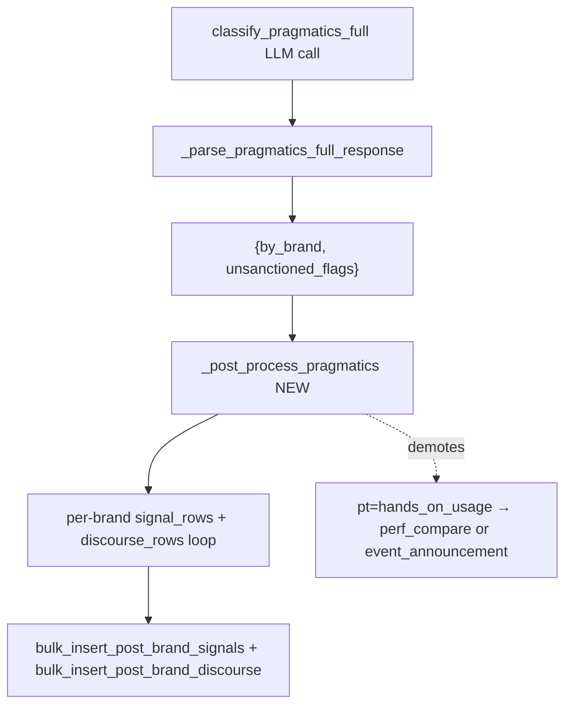

# Goal Capsule

**Objective**: Land the v12 classifier calibration: 4 new prompt rules covering the v11-still-misfiring posts, a parser-layer fallback that demotes `pt=hands_on_usage` when source text contains benchmark / launch / one-line-announcement markers, and a `brand_keywords` row for `llama` covering "Open-source Llama" phrasings.

**Authority hierarchy**: prompt rules (LLM-side signal) → parser-layer fallback (post-process layer) → brand-keyword seed (attribution layer). Each layer assumes the upstream one did its job.

**Execution profile**: Standard-depth multi-file change. Five units touching `x_monitor/attribution.py`, `x_monitor/run.py`, `x_monitor/migrations/029_*.sql`, `data/queries/llama.yaml`, and three test files.

**Stop conditions**: prompt-token assertion remains informal (no `_MAX_PROMPT_TOKENS` cap exists); stop if `_post_process_pragmatics` regresses any of the existing `test_classify_pragmatics_full.py` mock-LLM tests; stop if the Meta-Llama keyword migration fails `_apply_migration` idempotency on a re-run.

**Tail ownership**: orchestrator stages per-unit files and runs the targeted test file after each unit; workers do not commit.

# Product Contract

## Summary

Three independent calibration fixes shipped as one plan: prompt rules 16-19 cover nationalism false-positives on Chinese-vendor dunks, "trap"/"gotcha" trap-language handling, "fastest" reading, and the Qwen-vendor-not-US distinction. A parser-layer `_post_process_pragmatics` helper demotes `pt=hands_on_usage` to `performance_comparisons` / `event_announcement` when source text contains the corresponding markers — flipping the leak in `_parse_pragmatics_full_response:1243`. A migration seeds `brand_keywords` rows for `llama` covering the "Open-source Llama" phrasing that v11 silently dropped as `_unattributed`.

## Problem Frame

v11 shipped prompt rules 10-15 (launch=neutral, dunk_yingyang, event_announcement, performance_comparisons, feedback_questions) and the worked-examples A-F block. Diagnostics from the v11 smoketest transcript at `/tmp/smoketest_v11_full.txt` plus the v11 plan's "Specific misses" notes revealed four remaining calibration gaps:

- **Nationalism false-positive**: posts dunking on a Chinese-vendor product failure (DeepSeek "trap", Qwen "faded/died", Qwen benchmark miss) get stamped `us_nationalism = anti` even though the post has no US-China relational framing. The classifier infers "anti" valence from the dunk tone. Nationalism is an axis about which side of the US-China divide the post sympathizes with, not about generic anti-vendor hostility.
- **`pt=hands_on_usage` defaulting**: the parser's fallback at `attribution.py:1243` coerces every unrecognized post_type TO `hands_on_usage`. Rules 13/14/15 ("NOT hands_on_usage") fight this on the LLM side, but the parser undoes the work whenever the LLM returns a slightly off-shape value. The leak persists in v11.
- **Llama attribution gap**: `data/queries/llama.yaml` tokens include `Llama`, `Code Llama`, `Meta Llama`, `Muse Spark`, `Llama 3/4`. Posts phrased "Open-source Llama" / "open-source Llama" / "open weights Llama" miss the brand-keyword join because the tokens don't match, fall through to `_unattributed`, and get skipped at the FK write step.

The trans_disc removal (commit `fc74bbb`, merged to main earlier in this session) is the upstream state the plan builds on: classifier is the sole discourse source, translator no longer emits `discourse_role`.

## Requirements

R1. The classifier prompt must include 4 new rules (16, 17, 18, 19) covering the v11-still-misfiring post shapes.

R2. A parser-layer post-processing step must demote `pt=hands_on_usage` to `performance_comparisons` when the source text contains any of: `benchmark`, `eval`, `TTFT`, `latency`, `ranking`, `vs <other model>`, `side-by-side`, `climbed N spots`, `dropped N spots`, `Nth place`. Demote to `event_announcement` when source text contains **any of** `is generally available`, `launched today`, `shipped`, `now in beta`, `now live`, `released`, **AND** the post is fewer than 280 characters (one-line announcement shape). Demote only when the LLM emitted `hands_on_usage`; do not override when the LLM returned a different post_type.

R3. Migration `029_brand_keyword_llama_open_source.sql` must add a `brand_keywords` row for `llama` matching `Open[- ]source Llama` and `open[- ]weights Llama` as a regex. Idempotent (`INSERT OR IGNORE`). The previous draft numbered this migration 025, but `025_main_loop_since_cursor.sql` is already taken; the next free slot post-028 is 029.

R4. `data/queries/llama.yaml` must remain the canonical search-query source; the migration handles attribution-side coverage. No YAML change required for the v12 plan — the migration is the right layer. If a post-fetch query needs "Open-source Llama" as a search token, that's a follow-up (`docs/plans/2026-07-03-120000-taxonomy-extension-for-promotional-crypto-posts-plan.md` is adjacent but does not own this).

R5. Each feature-bearing implementation unit must have tests covering happy path, edge case, error path, and integration as applicable.

## Scope Boundaries

**In scope:**

- 4 new prompt rules (16, 17, 18, 19) and worked examples G-J in `build_pragmatics_full_prompt`.
- `_post_process_pragmatics(by_brand, text)` helper in `x_monitor/run.py` called between `classify_pragmatics_full` and the per-brand signal/discourse row-build loop.
- Migration `029_brand_keyword_llama_open_source.sql` adding the `brand_keywords` row for `llama`.
- Tests for each of the three changes above.

**Deferred to Follow-Up Work:**

- `_unattributed` brand gating (separate plan; user explicitly deferred earlier in this session).
- New nationalism axis taxonomy (e.g. brand sentiment / brand-coverage trajectory axes).
- New post_type keys beyond the existing 6.
- Smoketest renderer changes (the v11 smoketest renderer work shipped in plan `2026-07-04-001`).
- Adding "Open-source Llama" as a search-token to `data/queries/llama.yaml` (separate concern: search-query expansion, not attribution).

**Outside this product's identity:**

- Translator-side `discourse_role` (already removed in plan `2026-07-06-001`'s predecessor commits).
- Migration 028 schema changes (composite PK on `posts_brands_signals` already shipped).

# Planning Contract

## Key Technical Decisions

**KTD1. Parser-layer fallback is a post-process step, not a parser-internal coercion.** The current `_parse_pragmatics_full_response` at `attribution.py:1204` is a pure function that takes only the LLM response and emits SCALAR per-brand fields — `by_brand[b] = {"post_type": str, "sentiment": str, "discourse_role": str, "china_nationalism": str, "us_nationalism": str}` (verified at `attribution.py:1257-1263`; scalar `post_type`, not the `post_types` array shape used by `_parse_pragmatics_full_response_arrays` at `attribution.py:1275`). `classify_pragmatics_full` at `run.py:614` calls the scalar parser. Demoting `pt=hands_on_usage` requires the source text (to detect markers) AND the parsed result (to override). A pure-function parser signature change would break `test_classify_pragmatics_full.py` mock-LLM fixtures. The v12 fix is a separate `_post_process_pragmatics(by_brand, text)` helper called from `_run_post_fetch` at `run.py:614` (after the LLM returns, before the per-brand iteration at `run.py:627`). The parser keeps its current signature; the demotion logic lives in its own function.

**KTD2. Demotion is one-directional.** The post-process step only demotes `pt=hands_on_usage` to a more specific type when markers fire. It does not promote other types (e.g., `event_announcement` → `performance_comparisons`) and does not invent a type when the LLM returned something invalid (the parser's existing coercion to `hands_on_usage` at `attribution.py:1243` still handles that case as a last resort). This keeps the parser-layer change minimal and the regression surface small.

**KTD2b. `post_type` is scalar in the live data path, even though the prompt and parser-array variant use array shapes.** The prompt at `attribution.py:1048-1054` lists `post_types` as ARRAY but the scalar parser at `attribution.py:1257-1263` (the path `classify_pragmatics_full` returns to `run.py:614`) emits a single string per brand. The post-process helper must operate on the scalar string — check `prongs["post_type"] == "hands_on_usage"` (not `post_types == ["hands_on_usage"]`). When a future migration moves the live path to the array parser (`_parse_pragmatics_full_response_arrays`), the helper signature changes — that is a v13 concern.

**KTD3. Rule 16 is the highest-leverage v12 rule.** The nationalism false-positive pattern recurs across Posts 1, 8, and 10 in v11 diagnostics. A single prompt rule covers all three. Rules 17-19 each cover one specific misfire. Adding rules 17-19 without 16 leaves the most common regression unfixed.

**KTD4. Worked examples G-J mirror the existing A-F shape.** Existing examples are short (1-2 sentences each) and show per-brand expected output. v12 examples follow the same shape: short post text → expected per-brand array. No new fixture file; the examples are inline in the prompt string.

**KTD5. Brand-keyword fix is a migration, not a config or runtime change.** `brand_keywords` rows are read by `compile_keyword_index` at runtime (`attribution.py:377`); adding rows via migration keeps the seed version-controlled and idempotent. A runtime auto-seed path exists (`migrations/024_seed_missing_brands.sql:16` comment notes `compile_keyword_index` auto-seeds `enabled_models` keywords), but auto-seed derives from display_name / config, not from free-form phrasings like "Open-source Llama" — a migration is the only place a regex can live.

**KTD6. Prompt-token budget is informal.** No `_MAX_PROMPT_TOKENS` exists (verified at Phase 1.1). v11's worked-examples block added 6 examples (A-F) without a budget cap. v12 adds 4 more rules + 4 worked examples (G-J). Rough estimate: +200 tokens. The existing prompt is well under any practical LLM context-window cap. No hard assertion in tests; an informal `len(prompt) < N` assertion in `test_classify_pragmatics_full_prompt.py` mirrors v11's `test_u4_prompt_token_count_under_2500` (which is a soft cap, not a CI gate).

## High-Level Technical Design

The parser-layer fix is the architecturally interesting change. Sequence:

`_post_process_pragmatics` takes `by_brand` (the parsed per-brand prong dicts, with SCALAR `post_type` strings per `attribution.py:1257-1263`) and the source text, returns a new `by_brand` with the demoted post_types. The function checks each per-brand entry; if `prongs["post_type"] == "hands_on_usage"` AND the text contains a marker from R2's list, replace with the marker-appropriate type. Pure function — no DB, no LLM.

The demotion is reversible: a v13 (or later) post_process step can build on the v12 helper by adding more marker families without changing the helper's signature.

## Assumptions

- The 4 specific v12 prompt rules (16, 17, 18, 19) cover all v11-misfiring posts surfaced in the v11 smoketest. If new misfires surface in the v12 smoketest, they go in a v13 plan, not in this one.
- The Meta-Llama "Open-source Llama" phrasing is the only attribution gap from v11 diagnostics. Other brands' open-source phrasings (Mistral, Qwen) are already covered by their existing brand-keyword rows.
- The migration-naming convention `029_*.sql` follows the sequential numbering from migration 028 (`posts_brands_signals_multi_post_type`). The naming does not encode semantic content; the filename is descriptive.
- The parser-layer fix does not regress any of the v11 worked-examples (A-F) outcomes on the v11 smoketest transcript posts.

# Implementation Units

### U1. Add rules 16-19 + worked examples G-J to `build_pragmatics_full_prompt`

**Goal**: Cover the 4 v11-still-misfiring post shapes with explicit prompt rules and worked examples.

**Files:**
- `x_monitor/attribution.py` — `build_pragmatics_full_prompt` at `:1028`
- `tests/test_classify_pragmatics_full_prompt.py` — add 4 new test functions

**Approach:**
- Insert rules 16, 17, 18, 19 after rule 15 at `attribution.py:1170` (extend the existing rules list, same numbering style).
- Rule 16 (nationalism false-positive): nationalism requires explicit US-China relational framing; do not infer `china_nationalism` / `us_nationalism` from generic anti-vendor dunk on a Chinese (or US) brand's product failure, benchmark miss, or release reception. A post dunking on Qwen for a benchmark miss is `sentiment=anti-Qwen` and `nationalism=neutral`, not `us_nationalism=anti`.
- Rule 17 (trap-language demotion): when the post text contains "trap", "gotcha", "embarrassing", "fumbled", or "翻车" and the subject is a Chinese-vendor product failure, the post's `discourse_roles` should include `dunk_yingyang` if the tone is passive-aggressive, or `fud` if the tone is doom-spreading; the post's `us_nationalism` should remain `none` (per rule 16). This is the meta-rule that disambiguates the surface vocabulary.
- Rule 18 ("fastest" / "best" reading): when the post uses superlative speed / quality language ("fastest", "best", "strongest", "first to ship"), the post is `discourse_roles = [genuine_hype]` for the brand being praised — NOT `us_nationalism = pro/anti` based on which country the praised brand is from. The LLM confuses the surface praise with nationalism framing.
- Rule 19 (Qwen-vendor-not-US distinction): posts critiquing a Chinese-vendor's product behavior (Qwen, GLM, DeepSeek, Kimi) do not carry `us_nationalism` valence by default. Even when the critique is harsh, the axis measures US-China framing, not anti-Chinese-vendor sentiment.
- Append worked examples G, H, I, J to the existing A-F block at `attribution.py:1200`. Each example is a short post (1-3 sentences) with expected per-brand output that exercises one of the new rules.

**Patterns to follow:** existing rules 10-15 fold into the same numbered list with "If X, prefer Y" phrasing. Existing examples A-F use `pt=[…]`, `sent=…`, `discourse_roles=[…]` shape — mirror.

**Test scenarios:**
- `test_u1_prompt_includes_rule_16_nationalism_framing`: assert rule 16 marker (numbered `16.`) appears AND contains the phrase `US-China relational framing`.
- `test_u1_prompt_includes_rule_17_trap_language`: assert rule 17 marker AND contains `trap` AND `翻车`.
- `test_u1_prompt_includes_rule_18_superlative_praise`: assert rule 18 marker AND contains `fastest` AND `genuine_hype`.
- `test_u1_prompt_includes_rule_19_vendor_not_us`: assert rule 19 marker AND contains `Qwen` AND `us_nationalism`.
- `test_u1_prompt_canonical_example_g_dunk_no_nationalism`: assert worked example G's text appears AND the expected per-brand output (`us_nationalism=none` for the Chinese-vendor dunk) is present.
- `test_u1_prompt_examples_h_i_j_present`: assert each new example's distinguishing substring appears.

**Verification:** `pytest tests/test_classify_pragmatics_full_prompt.py -v` passes all 6 new tests + existing 15 (no regressions).

### U2. Add `_post_process_pragmatics` helper in `_run_post_fetch`

**Goal**: Demote `pt=hands_on_usage` to `performance_comparisons` / `event_announcement` when source text contains the corresponding markers.

**Files:**
- `x_monitor/run.py` — `_run_post_fetch` at `:481`, insert call between `:614` (LLM call) and `:627` (per-brand iteration); new helper function `_post_process_pragmatics(by_brand, text)` near the top of the file (after imports)
- `tests/test_run_post_fetch_hands_on_demotion.py` — new file

**Approach:**
- Define `_post_process_pragmatics(by_brand: dict, text: str) -> dict` as a pure function. It returns a new `by_brand` dict (does not mutate in place — the parser's result is reused elsewhere).
- **Shape note**: each brand entry in `by_brand` has SCALAR fields `{post_type: str, sentiment: str, discourse_role: str, china_nationalism: str, us_nationalism: str}` per `attribution.py:1257-1263`. The helper checks `prongs["post_type"] == "hands_on_usage"` (string equality), NOT `post_types == ["hands_on_usage"]` (array).
- The helper iterates `by_brand`; for each brand entry where `post_type == "hands_on_usage"`, scan `text` (lowercased) for the marker lists from R2. First match wins. Order: `performance_comparisons` markers first (more specific), then `event_announcement` markers + length check.
- For `event_announcement`: text contains `is generally available` OR `launched today` OR `shipped` OR `now in beta` OR `now live` OR `released` AND `len(text) < 280`.
- For `performance_comparisons`: text contains any of `benchmark`, `eval`, `ttft`, `latency`, `ranking`, ` vs `, `side-by-side`, `climbed N spots`, `dropped N spots`, `nth place`.
- In `_run_post_fetch`, the demotion call slots in immediately after `by_brand = classified.get("by_brand", {}) if isinstance(classified, dict) else {}` at `run.py:628-629`. The line `by_brand = _post_process_pragmatics(by_brand, it.get("text") or "")` is the demotion call. Fail-soft: if `_post_process_pragmatics` raises, log + fall back to the un-post-processed `by_brand` (mirroring the existing `try/except` posture at `run.py:613-626`).
- Markers are case-insensitive (`text.lower()`).

**Patterns to follow:** the existing per-brand iteration in `_run_post_fetch` at `run.py:627-666` is the model — pure-function-style mutations, no side effects on the LLM response.

**Test scenarios:**
- Happy path A: post text `"Kimi K2.7 Code is generally available in GitHub Copilot"` (180 chars) with `by_brand = {"moonshot_kimi": {"post_type": "hands_on_usage", "sentiment": "neutral", "discourse_role": "uncategorized", "china_nationalism": "none", "us_nationalism": "none"}}` → output has `post_type = "event_announcement"`.
- Happy path B: post text `"LLM Drag Race: GPT-4o-mini vs Llama 3.3 70B"` (350 chars, has `vs`) with same input → output has `post_type = "performance_comparisons"`.
- Edge case A: post text is `"Kimi K2.7 Code is generally available"` (40 chars, one-line), LLM correctly returned `post_type = "event_announcement"` → output unchanged (no override).
- Edge case B: post text is `"I'm using Kimi K2.7 Code to refactor my codebase"` (real hands-on usage), no markers → output unchanged.
- Edge case C: post text has both a benchmark marker AND is 200 chars AND contains `now live` — `performance_comparisons` wins (checked first).
- Error path A: empty `text` → returns `by_brand` unchanged.
- Error path B: `by_brand` is `{}` → returns `{}`.
- Integration: a 5-post synthetic e2e via `_run_post_fetch` with a mocked LLM that returns `post_type = "hands_on_usage"` for all per-brand entries; verify the post-process step demotes 3 of them (one event_announcement, two performance_comparisons) and leaves 2 unchanged.

**Verification:** `pytest tests/test_run_post_fetch_hands_on_demotion.py -v` passes all 8 tests.

### U3. Migration 029: seed `brand_keywords` for `llama` "Open-source Llama" coverage

**Goal**: Open-source-Llama-phrased posts get attributed to the `llama` brand instead of falling through to `_unattributed`.

**Files:**
- `x_monitor/migrations/029_brand_keyword_llama_open_source.sql` — new file
- `x_monitor/store.py` — verify `_apply_migration` reads the new file (likely auto-discovery; verify)
- `tests/test_migration_029_brand_keyword_llama.py` — new file (mirroring `tests/test_migration_024_seed_missing_brands.py`)

**Approach:**
- Create the migration file with two `INSERT OR IGNORE INTO brand_keywords (brand_id, pattern, is_regex, added_at) VALUES` rows. The `added_at` column is `TEXT NOT NULL` with no default (`migrations/004_company_brand_account_model.sql:150`) — it must be written explicitly. Use `datetime('now')` to mirror migration 024's brand-row inserts.
- The literal `'llama'` is the value of `brands.nickname` (post-migration 023). Live-DB schema reference (from `data/monitor.db`, via `sqlite3 .schema`):
  - `brands`: PK `id INTEGER AUTOINCREMENT`, `nickname TEXT NOT NULL UNIQUE` (the slug). Migration 023 replaced the original `brand_id TEXT PK` with `id INTEGER PK` plus a separate `nickname TEXT UNIQUE` column.
  - `brand_keywords`: `brand_id TEXT NOT NULL`, `pattern TEXT NOT NULL`, `is_regex INTEGER DEFAULT 0`, `added_at TEXT NOT NULL`, `PRIMARY KEY (brand_id, pattern)`, `FOREIGN KEY (brand_id) REFERENCES brands(nickname) ON DELETE CASCADE`.
  - The child column stayed named `brand_id` per migration 023's deliberate decision (see `migrations/023_rename_brand_and_company_ids_to_nicknames.sql:32-37`); no subquery needed — `'llama'` is the FK target value (TEXT).
- The migration header comment follows the convention from `migrations/024_seed_missing_brands.sql:1-46` (background, idempotency rationale, ledger note). Reference this plan via `Plan: docs/plans/2026-07-06-001-feat-v12-classifier-calibration-plan.md`.
- `INSERT OR IGNORE` on the `(brand_id, pattern)` composite PRIMARY KEY handles re-application idempotency (the DDL declares `PRIMARY KEY (brand_id, pattern)` at `migrations/004_company_brand_account_model.sql:151`).

**Patterns to follow:** `x_monitor/migrations/024_seed_missing_brands.sql` is the template — header structure, BEGIN/COMMIT block, INSERT OR IGNORE pattern.

**Test scenarios:**
- Migration applies cleanly on a fresh DB.
- Migration applies idempotently on a DB where 029 is already recorded (no-op).
- After applying, a post with text `"Open-source Llama 4 just dropped"` matched via `compile_keyword_index` returns `brand_id='llama'`.
- After applying, a post with text `"open-source-llama weights are now permissively licensed"` (hyphenated) also matches.
- After applying, the migration is recorded in the `_migrations` ledger with the correct name.

**Verification:** `pytest tests/test_migration_029_brand_keyword_llama.py -v` passes all 5 tests + a manual `_apply_migration` run on the live DB succeeds.

### U4. Tests for the v12 calibration

This is a forward reference — U1, U2, and U3 each carry their own test file in their `Files:` block. U4 is the orchestrator-side verification step that runs all three test files after U1-U3 land and confirms no regressions in adjacent test suites.

**Files:**
- `tests/test_classify_pragmatics_full_prompt.py` (U1)
- `tests/test_run_post_fetch_hands_on_demotion.py` (U2)
- `tests/test_migration_029_brand_keyword_llama.py` (U3)
- `tests/test_classify_pragmatics_full.py` (regression — must still pass)
- `tests/test_attribution.py` (regression — must still pass)

**Approach:**
- Run all 5 test files in sequence after U1-U3 land.
- Check for failures. If `test_classify_pragmatics_full.py` or `test_attribution.py` regress, trace the regression to the U1/U2 change and fix (typically: an LLM mock fixture needs updating to reflect the new prompt-rule behavior).

**Test scenarios:**
- All U1/U2/U3 test functions pass.
- `test_classify_pragmatics_full.py` and `test_attribution.py` pass without fixture updates.

**Verification:** `pytest tests/test_classify_pragmatics_full_prompt.py tests/test_run_post_fetch_hands_on_demotion.py tests/test_migration_029_brand_keyword_llama.py tests/test_classify_pragmatics_full.py tests/test_attribution.py -v` exits 0.

### U5. v12 smoketest run

**Goal**: Verify the v12 calibration produces correct labels on the v11-misfiring posts and the new Meta-Llama attribution works.

**Files:**
- `scripts/post_fetch_smoketest.py` (no change — use as-is)
- `/tmp/smoketest_v12_full.txt` (output artifact)

**Approach:**
- Run the existing smoketest against the live DB: `python scripts/post_fetch_smoketest.py --source=latest-cycle --sample=10`.
- Compare the per-post output against the v11 transcript (`/tmp/smoketest_v11_full.txt`):
  - Post 1 (Kimi K2.7 Code analytical): expect `pt=performance_comparisons` (was `hands_on_usage`) and `sent=positive` unchanged.
  - Post 2 (dunk_yingyang): expect `cn=neutral` and `us=neutral` (was `cn=mild_pro`, `us=constructive_critical`).
  - Post 5 (one-line announcement): expect `pt=event_announcement` (was `hands_on_usage`) and `sent=neutral`.
- Run the smoketest's `--source=fixture` path with a 3-post fixture containing one "Open-source Llama" post; verify the brand attribution emits `llama` for that post.
- If a post regresses, document the regression and either fix (if scope-clear) or defer to v13 (if scope-creep).

**Test scenarios:** the smoketest output comparison IS the verification — no new test file.

**Verification:** the v12 transcript is saved at `/tmp/smoketest_v12_full.txt` and diff'd against the v11 transcript; the diff shows the expected per-post changes and no unexpected regressions.

# Verification Contract

| Gate | Command | Pass criteria |
|---|---|---|
| U1 prompt tests | `pytest tests/test_classify_pragmatics_full_prompt.py -v` | All U1 + existing rules-1-through-15 tests pass |
| U2 demotion tests | `pytest tests/test_run_post_fetch_hands_on_demotion.py -v` | All 8 tests pass |
| U3 migration tests | `pytest tests/test_migration_029_brand_keyword_llama.py -v` | All 5 tests pass |
| Adjacent regressions | `pytest tests/test_classify_pragmatics_full.py tests/test_attribution.py -v` | No regressions; existing mock-LLM fixtures still valid |
| Combined | `pytest tests/test_classify_pragmatics_full_prompt.py tests/test_run_post_fetch_hands_on_demotion.py tests/test_migration_029_brand_keyword_llama.py tests/test_classify_pragmatics_full.py tests/test_attribution.py -v` | All 5 files green |
| Schema-image regeneration | `scripts/build_schema_image.sh` | No schema changes in v12 (migration 029 is INSERT-only) — skip |
| E2E smoketest | `python scripts/post_fetch_smoketest.py --source=latest-cycle --sample=10` | Output matches U5's expected per-post changes vs v11 transcript |
| Fixture-source Llama | `python scripts/post_fetch_smoketest.py --source=fixture --fixture=<llama-open-source-fixture>` | Brand attribution emits `llama` for "Open-source Llama" posts |

# Definition of Done

The plan is complete when all of the following hold:

- All 5 implementation units are landed in dependency order (U1, U2, U3 first; U4 verifies; U5 confirms via smoketest).
- All 5 verification gates pass.
- The v12 smoketest transcript (`/tmp/smoketest_v12_full.txt`) shows the expected per-post corrections vs the v11 transcript (`/tmp/smoketest_v11_full.txt`).
- Migration 029 is idempotent on re-apply.
- No regressions in `test_classify_pragmatics_full.py` or `test_attribution.py`.
- Abandoned-attempt code removed (no half-finished prompt rules or test scaffolding left in the diff).
- `git log` shows one commit per U-ID (U1, U2, U3, U4 verification, U5 confirmation) with conventional-commit messages matching `type: feat(x-monitor): ...` or `type: docs(reference): ...`.

# Appendix

### Origin traceability

The v12 calibration findings originate in:
- `/tmp/smoketest_v11_full.txt` — v11 smoketest transcript (5 v11-misfiring posts)
- `docs/plans/2026-07-04-001-feat-post-fetch-smoketest-and-prompt-tuning-plan.md` — v11 plan with "Specific misses" notes (Post 5, 8, 1, 10)
- Session dialogue 2026-07-06 — user confirmed the nationalism rule scope as proposed: "ok that's right"

### Sources

- `x_monitor/attribution.py:1028` — `build_pragmatics_full_prompt` (current prompt location)
- `x_monitor/attribution.py:1134-1200` — v11 rules 10-15 + worked examples A-F
- `x_monitor/attribution.py:1204-1243` — `_parse_pragmatics_full_response` (the parser-leak source)
- `x_monitor/run.py:481` — `_run_post_fetch` (where the post-process helper slots in)
- `x_monitor/run.py:614-666` — classifier call + per-brand iteration
- `x_monitor/migrations/024_seed_missing_brands.sql` — migration pattern template
- `x_monitor/migrations/023_rename_brand_and_company_ids_to_nicknames.sql:32-37` — rationale for keeping `brand_keywords.brand_id` named `brand_id` (not renamed to `brand_nickname`)
- `data/monitor.db` (live) — `sqlite3 .schema brands` and `.schema brand_keywords` confirm `brands` has `id INTEGER PK AUTOINCREMENT` + `nickname TEXT UNIQUE`; `brand_keywords.brand_id` (TEXT) FK → `brands.nickname`
- `data/queries/llama.yaml` — llama search query (not touched by v12 plan)
- `tests/test_classify_pragmatics_full_prompt.py` — v11 prompt-rule test pattern
- `tests/test_migration_024_seed_missing_brands.py` — migration test pattern