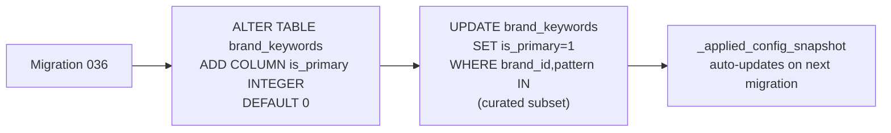
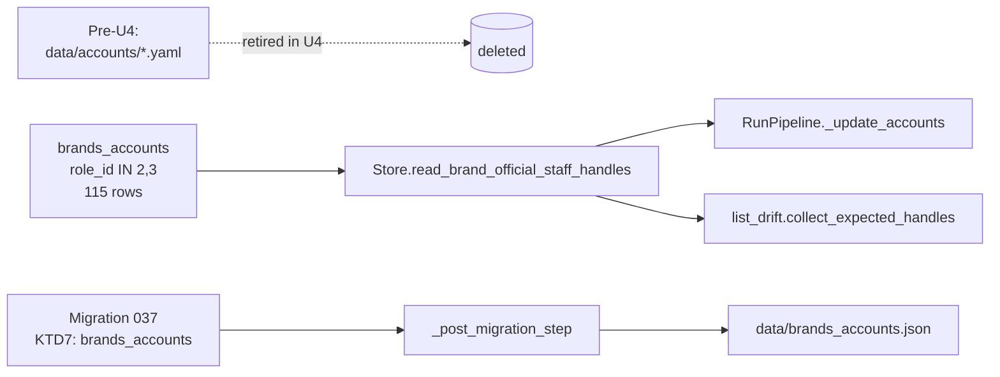

## Goal Capsule

- **Objective**: (1) Restore the v1.7 B1/B2/B3 per-cycle call fan-out (so all 20 `enabled_models` brands have at least one per-cycle co-occurrence-bounded call) by expressing them as additional entries in `config.yaml → x_query_specs` — no separate runtime field, no separate renderer. The call strings must stay under X's 512-char cap, which today requires trimming the brand-keyword contribution per brand; introduce a new `is_primary` column on `brand_keywords` so query construction reads the lean subset while attribution keeps using all rows. (2) Retire `data/accounts/*.yaml` permanently — the DB's `brands_accounts` table (with `role_id IN (2, 3)` filtering for `official` and `staff` roles) is now canonical; all yaml readers and writers are removed; the LaunchAgent WatchPaths is retargeted; the `staff:` list (currently `[]` everywhere) and `discovered_followers` (write-only, never read) are dropped from the runtime contract.
- **Authority hierarchy**: this plan is the authority. If implementation conflicts arise, surface them — do not silently override.
- **Execution profile**: inline/subagent, four units, dependency-ordered (U1 → U2 → U3 → U4). Each unit is independently committable on the feature branch.
- **Stop conditions**: full unit verification (per-unit + per-repo) before declaring each unit done; the four-unit gate must clear before the branch is PR-ready.
- **Tail ownership**: `ce-work` owns the entire implementation tail.
- **Out of scope**: anything that touches `data/accounts/*.yaml` BEFORE U4 (U1-U3 must not reach into `data/accounts/`); the `is_regex` per-row flag (already exists; not affected); the post-step JSON export (already shipped via plan 2026-07-11-001 U4 — U4's `_applied_config_snapshot` will pick up the new `is_primary` column on the next migration that lists `brand_keywords`); the C1/C2 spec bodies (their token contributions are already curated per-brand via `x_query_specs.brands` map, not via `brand_keywords`, so the primary-flag does not affect them); the `accounts` table itself (still canonical — `accounts.id` is the PK that `brands_accounts.accounts_id` FKs into); the `roles` table.

## Product Contract

### Summary

After plan 2026-07-11-001 retired per-brand yaml runtime reads, `x_query_specs` holds three specs: Call A (list-based wide net) + Call C1 (5 brands, co-occurrence-tied) + Call C2 (ERNIE, co-occurrence-tied). The remaining 14 `enabled_models` brands have no per-cycle call and depend entirely on Call A's curated X-list rate. This plan adds three more `x_query_specs` entries — Call B1, B2, B3 — each rendering the same `<tokens> (<co_occurrence>) min_faves:N` shape the renderer already supports, so the planner's per-cycle fan-out goes from 3 calls to 6. A new `is_primary` column on `brand_keywords` makes the per-brand token contribution bounded (~30-50 chars each) so each B call stays under 512 chars even with 8 brands; the post-fetch brand-detection consumer (`compile_keyword_index`) keeps reading all rows.

### Problem Frame

Post-U3, the live DB has 207 rows in `brand_keywords` (avg ~10 tokens per brand; some brands have 17-20). The v1.7 B1/B2/B3 fan-out was sized against the lean Q2 paren groups in `data/queries/<brand>.yaml` (2-4 tokens per brand), so each B call fit under the X advanced-search 512-char cap. Migration 034 + 035 collapsed the per-brand yamls into `brand_keywords` and added several tokens per brand in the process (operator growth, not a regression), so a naive union OR-chain for B1 today is **883 chars** — over cap. The naive fix (split into more specs, drop co_occurrence) multiplies TwitterAPI credit consumption 3x and still leaves the cap problem at the brand-with-many-tokens boundary (Qwen alone is 210 chars, GLM 161, moonshot_kimi 188). The principled fix is a *primary* flag on `brand_keywords` so query construction reads a bounded 2-4-token subset per brand (the same shape as the v1.7 Q2 group) and post-fetch attribution keeps using the full set. The flag is operator-tunable per row — adding a new primary pattern is one DB row; widening B coverage is one config edit.

### Requirements

#### Schema

- R1. Migration 036 adds `is_primary INTEGER NOT NULL DEFAULT 0` to `brand_keywords`. Existing rows default to 0; the migration's body explicitly sets `is_primary=1` on a per-brand curated subset (2-4 tokens each, 20 brands × ~3 = ~60 rows total).
- R2. The `brand_keywords` JSON export (post-step from plan 2026-07-11-001 U4) includes the new `is_primary` field — operators can PR-review the primary subset the same way they review `brand_id` and `pattern`.

#### Renderer

- R3. `_build_query(spec, *, primary_only=False, primary_keywords=None)` renders the existing `<tokens> (<co_occurrence>) min_faves:N` form when `primary_only=True` AND `primary_keywords` is provided (a `dict[str, list[str]]` pre-loaded by the planner from `brand_keywords WHERE is_primary=1`). When `primary_only=False`, behavior is unchanged from plan 2026-07-11-001 U2.
- R4. `XQuerySpec` gains `is_wide_net: bool = False`. The planner passes `primary_only=spec.is_wide_net` to `_build_query` so the wide-net specs (B1/B2/B3) read the primary subset and the co-occurrence specs (C1/C2) read from their config-supplied `spec.brands` map (unchanged).
- R5. The Call A degenerate branch is unchanged — Call A does not read `brand_keywords`.

#### Config + planner

- R6. `config.yaml → x_query_specs` gains three new entries — Call B1, B2, B3 — each with `is_wide_net: True`, an empty `brands` map (the renderer fills it from `primary_keywords` at planning time), and a `co_occurrence` list shared with C1's 22-term list (or a brand-group-tailored subset, decided per spec).
- R7. `plan_calls(x_monitor_list_id, x_query_specs, *, primary_keywords=None)` accepts a new `primary_keywords` argument and threads it to `_build_query` for wide-net specs.
- R8. Per-cycle fan-out goes from 3 calls to 6 calls (Call A + C1 + C2 + B1 + B2 + B3). The v1.7 budget-degradation order (`degraded_skip_order`) is updated to put B3 before B2 before B1 before C2 before C1 before Call A so the lowest-recall per-brand calls drop first under credit pressure.

#### Tests + smoketest

- R9. `test_query_plan_uniform.py` gains tests for: `_build_query` with `primary_only=True` renders only the primary subset; `plan_calls` with three wide-net specs and a populated `primary_keywords` arg emits exactly 6 `PlannedCall` rows; the per-call query string for each B spec is under 512 chars.
- R10. `test_migration_036.py` (new) asserts: migration applies cleanly on a v35 DB; `is_primary=1` row count per enabled brand is between 2 and 4 (the curated subset shape); existing `is_primary=0` rows are unchanged.
- R11. The smoketest's `--source=latest-cycle` mode renders the new B1/B2/B3 query strings when `--include-call-preview` is set (a new flag, default off so existing smoketest output is unchanged).

#### Data/accounts retirement (U4)

- R12. The runtime source of truth for per-brand `official` and `staff` handles is `brands_accounts` joined to `accounts` and `roles`, filtered to `role_id IN (2, 3)`. The DB has 115 rows as of 2026-07-11 — every yaml-listed handle for `minimax`, `qwen`, etc. is already mirrored in DB.
- R13. `data/accounts/*.yaml` is deleted in U4; `x_monitor/accounts.py` is deleted (loaders + role_tag + edge derivation move to their consumers or are dropped if dead code); `scripts/regenerate_accounts_yaml.py` is deleted; the `bootstrap-followers` CLI subcommand is removed; the `accounts_action` argparse subparser group is removed from `x_monitor/__main__.py`.
- R14. `RunPipeline._update_accounts` reads from the DB instead of from `data/accounts/<brand>.yaml`. The DB-seeded handles go straight to `store.upsert_account` (which already exists); the `commenters`-discovery loop (which reads from `posts`, not yaml) stays unchanged.
- R15. `list_drift.collect_expected_handles` reads from the DB instead of yaml. New signature: `collect_expected_handles(enabled_models: list[str], store: Store) -> set[str]`. The data dir argument goes away.
- R16. The LaunchAgent `WatchPaths` plist retargets from `[config.yaml, data/accounts]` to `[config.yaml]` only. `data/accounts` is deleted; nothing to watch there.
- R17. The post-step JSON export gains a new artifact `brands_accounts` (post-U4 migration `037_brands_accounts_canonize.sql` declares it via KTD7 header). `data/brands_accounts.json` round-trips with `brand_id`, `handle`, `role_key`, `added_at` — operators can PR-review per-row state the same way they review `brand_keywords.json`.
- R18. The `staff:` list (currently `[]` everywhere — verified 2026-07-11) is dropped from the runtime contract. The DB's `brands_accounts` table holds the staff handles (`role_id = 3`). Operator adds a staff handle via an `INSERT INTO accounts` + `INSERT INTO brands_accounts` migration; no yaml edit.
- R19. The `discovered_followers` write-only path is dropped along with the `bootstrap-followers` CLI subcommand. If the operator wants to discover followers of a brand-account, the post-fetch dashboard's reply-graph view (or a one-shot script run via `python3 -m scripts.<future>`) is the replacement; this plan does not add a replacement.
- R20. Reference docs reflect the new operator contract: `docs/reference/lookup-tables.md`'s "Inventory: account yamls" section is rewritten to describe the DB-canonical surface; `docs/reference/twitterapi-live-queries-by-model.md`'s "What changed" section gains a U4 entry; `config.yaml`'s top-of-file docstring loses the `data/accounts/<model_id>.yaml` reference.

### Scope Boundaries

- **In scope**: `is_primary` column migration; `XQuerySpec.is_wide_net` flag; `_build_query` and `plan_calls` extensions; three new `x_query_specs` entries; renderer tests; smoketest preview flag; post-step JSON now includes `is_primary`; `degraded_skip_order` reordering; full retirement of `data/accounts/*.yaml` (U4); deletion of `x_monitor/accounts.py`; deletion of `scripts/regenerate_accounts_yaml.py`; replacement of `RunPipeline._update_accounts`'s yaml load with a DB read; replacement of `collect_expected_handles` with a DB read; retarget of the LaunchAgent `WatchPaths`; removal of the `bootstrap-followers` CLI subcommand (writes to yaml); reference-doc updates reflecting the new operator contract.
- **Deferred for later (next version)**:
  - Adding new B4/B5/... specs for the frontier seeds (gpt, claude, gemini, gemma, grok) when they enter `enabled_models`. Migration 036's `is_primary` flag applies but the operator-curated subset is added later.
  - Co-occurrence-list tuning per B group. U3 ships B1/B2/B3 sharing C1's 22-term list as a first cut; a follow-up probe measures yield and trims.
  - Adding new official/staff handles (current operator workflow: edit the DB via SQL migration; future: a small admin CLI that wraps the SQL).
- **Outside this plan's identity**: dashboard changes, TwitterAPI client changes, the v1.7 `call_b_groups` config field (already removed in plan 2026-07-11-001 U2; not re-introduced here), the `accounts` and `roles` tables themselves (kept; `accounts.id` is still the PK that `brands_accounts.accounts_id` FKs into), the post-step JSON export logic itself (only the row format expands to include `is_primary` and `data/brands_accounts.json` becomes a new export target per U4).
- **NOT retired by this plan**: nothing — this is purely additive for U1-U3; U4 retires `data/accounts/`, `x_monitor/accounts.py`, and `scripts/regenerate_accounts_yaml.py` (the three surfaces plan 2026-07-11-001 explicitly kept alive).

## Planning Contract

### High-Level Technical Design

The renderer stays single-shape. The new behavior is the planner loading the primary subset from `brand_keywords` once per cycle and threading it through `_build_query` only when the spec asks for it (`is_wide_net=True`).

```mermaid
flowchart LR
  Config[x_query_specs<br/>A + C1 + C2 + B1 + B2 + B3] --> Planner[plan_calls]
  DB[(brand_keywords<br/>is_primary=1)] -->|primary_only=True| Planner
  Planner -->|for each spec| BuildQ[_build_query]
  BuildQ -->|is_wide_net=True<br/>primary_only| PrimaryCall[((toks_b1)<br/>OR ... OR (toks_b8))<br/>(co_occurrence)<br/>min_faves:1]
  BuildQ -->|spec.brands={}| ListCall[(list:&lt;id&gt;)<br/>min_faves:1]
  BuildQ -->|spec.brands={b:toks}| TokenCall[((toks_c1))<br/>OR ...)<br/>(co_occurrence)<br/>min_faves:N]
  BuildQ --> PlanCalls[PlannedCall list<br/>6 calls]
  PlanCalls --> Twitter[TwitterAPI]
```

The primary subset is loaded once at planner entry, not per spec — single SQL query, single dict build.



U4 retires `data/accounts/` — the canonical surface becomes `brands_accounts WHERE role_id IN (2, 3)`. The runtime readers (`RunPipeline._update_accounts`, `list_drift.collect_expected_handles`) replace yaml-load with a single SQL each; the writers (`bootstrap-followers`, `regenerate_accounts_yaml.py`) are deleted. The LaunchAgent WatchPaths retargets to `[config.yaml]` only.



### Key Technical Decisions

- **KTD1 — `is_primary` is per-row, not per-brand.** A `brand_id` may have multiple `is_primary=1` rows (the curated 2-4 token subset) and any number of `is_primary=0` rows (the rest). This lets operators tune the per-brand B-call contribution without touching the post-fetch detector (which still sees all rows). Alternative considered: a separate `brand_query_keywords` table. Rejected — single source-of-truth principle; the post-step JSON's PR-review surface stays one table; `compile_keyword_index` (which reads ALL rows for attribution) does not need a second read path.
- **KTD2 — `is_wide_net` is a boolean flag on `XQuerySpec`, not a new spec kind.** The renderer signature grows by one optional argument (`primary_only`) and one new keyword argument (`primary_keywords`); the existing `(<tokens>) (<co_occurrence>) min_faves:N` shape does not change. This preserves plan 2026-07-11-001 U2 KTD1 ("render path is one function") — wide-net is the same shape, just with the per-brand token group pre-filled from DB rather than from the spec's own `brands` map. Alternative considered: a separate `WideNetSpec` dataclass. Rejected — violates the unification principle; would force the renderer to grow a third branch.
- **KTD3 — B specs have empty `brands` map; the planner populates it.** When `is_wide_net=True`, `_build_query` reads from `primary_keywords[brand_id]` for each brand listed in the spec's own brand list. To keep the spec self-describing in `config.yaml`, the wide-net specs still declare their brand group (e.g., `wide_net_brands: [llama, minimax, qwen, deepseek, mistral, stepfun, ernie, hunyuan]`) and an empty `brands: {}` map; the planner merges the DB-loaded primary tokens into `brands` at planning time. Alternative considered: hardcoding the brand groups in `plan_calls`. Rejected — config-PR-reviewable is the operator contract.
- **KTD4 — Primary subset is loaded once per cycle, not per spec.** `RunPipeline.execute()` loads `Store.read_primary_brand_keywords()` once at the top of the call-planning block and threads the resulting `dict[str, list[str]]` to `plan_calls` as `primary_keywords=`. Single SQL query, single dict build, ~60 rows max. Alternative considered: per-spec load. Rejected — 3x the queries for the same data.
- **KTD5 — Co_occurrence list is shared across all wide-net specs.** C1's 22-term list is reused as-is for B1/B2/B3 in U3; a follow-up probe measures yield and trims per group. This keeps the first-cut predictable and PR-reviewable; the alternative (per-B-group tailored lists) requires measurement that does not yet exist.
- **KTD6 — `degraded_skip_order` reorder preserves Q1-Q6 priority.** The current order (Q6, Q5, Q3, Q2, Q4, Q1) is signal-density-based. The new order (B3, B2, B1, C2, C1, A) extends the same logic to the post-v1.7 call set: lowest-recall per-brand calls drop first under budget pressure. Call A stays last because it has the highest signal-per-tweet ratio (curated list members with engagement).

### Assumptions

- **A1.** The v1.7 B1/B2/B3 group boundaries (top-presence / CN-language / specialized) are still operationally correct post-consolidation. Operator confirmed in the scoping conversation that no group rebalancing is needed; the groups are operator-curated, not algorithmic. If the operator wants a different split later, that's a config edit (3 lists of brand names in `config.yaml`).
- **A2.** 2-4 primary tokens per brand is enough B-call signal. The v1.7 cycle used this shape; the Q5/Q6 yaml groups (less curated, more recall-oriented) were retired as part of plan 2026-07-11-001 because the AND-filter on co_occurrence + Call A's curated list covered the high-signal cases. Re-introducing only the Q2 subset is a deliberate re-baseline, not a regression.
- **A3.** The post-fetch `compile_keyword_index` consumer is unaffected by `is_primary`. Verified by tracing its read path (`Store.read_brand_keywords()` at `x_monitor/store.py:2683`) — it does not filter on `is_primary` and the new column defaults to 0 for existing rows, so behavior is unchanged unless an operator marks a row as primary.
- **A4.** TwitterAPI.io credit math scales linearly with call count. 6 calls/cycle vs the current 3 calls/cycle ≈ 2x TwitterAPI credit consumption. Daily budget (`daily_ceiling: 333`) absorbs this without changing the cap; a future version may revisit if cycle counts grow further.

### Implementation Units

#### U1. Migration 036 — `is_primary` column on `brand_keywords`

- **Goal**: Add the per-row `is_primary` flag and seed it on the curated 2-4-token subset per `enabled_models` brand. Existing rows default to 0 (non-primary); the curation is explicit and PR-reviewable via the post-step JSON.
- **Requirements**: R1, R2.
- **Dependencies**: plan 2026-07-11-001 U4 (post-step export machinery).
- **Files**:
  - `x-monitoring/x_monitor/migrations/036_add_is_primary_to_brand_keywords.sql` (NEW — pure SQL)
  - `x-monitoring/tests/test_migration_036.py` (NEW)
- **Approach**: Step (1) `ALTER TABLE brand_keywords ADD COLUMN is_primary INTEGER NOT NULL DEFAULT 0`. Step (2) UPDATE block: for each `enabled_models` brand, mark 2-4 rows as primary. The curation picks tokens that match the v1.7 Q2 paren group shape — the brand's "canonical name" + 1-2 disambiguators + a Chinese name when relevant. The exact token set per brand is decided at authoring time and committed as static SQL; reviewers see the choice in the migration diff. Step (3) the migration's first non-comment line carries `-- post_step_touches: brand_keywords` per plan 2026-07-11-001 U4 KTD7, so U4's post-step fires and updates `data/brand_keywords.json` with the new column. Step (4) no Python hook in the runner; pure SQL migration.
- **Test scenarios**:
  - Happy path: fresh DB after migration 036 has the `is_primary` column; row count for `brand_keywords` is unchanged from v35 (ALTER TABLE adds the column in-place).
  - Happy path: a v35 DB upgrading to v36 has the column added and the seeded primary rows visible (`SELECT COUNT(*) FROM brand_keywords WHERE is_primary=1` returns the curated subset size, ~60).
  - Edge case: replay-safe — running migration 036 twice is a no-op (`ALTER TABLE ADD COLUMN` would fail on the second run; the migration body uses `ALTER TABLE ... ADD COLUMN` directly because SQLite supports `IF NOT EXISTS` via the `sqlite_master` check OR via a guard query; implementation choice: explicit `PRAGMA table_info(brand_keywords)` check before the ALTER).
  - Edge case: a brand not in `enabled_models` (e.g., `xiaomi_mimo`) has zero `is_primary=1` rows — the seed only touches `enabled_models` brands.
  - Edge case: `data/brand_keywords.json` after `apply_migrations` includes the `is_primary` field on every row (post-step export reflects the new column).
- **Verification**: `cd x-monitoring && python3 -m pytest tests/test_migration_036.py -v` exits 0. Live DB at v36. `data/brand_keywords.json` after `Store.apply_migrations()` round-trips with the new column present.

#### U2. Renderer — `is_wide_net` flag + `primary_only` argument

- **Goal**: Extend `_build_query` and `plan_calls` so wide-net specs can pull per-brand tokens from a pre-loaded `primary_keywords` dict rather than from `spec.brands`. The change preserves the existing shape for C1/C2/Call A.
- **Requirements**: R3, R4, R5, R7.
- **Dependencies**: U1 (column exists; `Store.read_primary_brand_keywords` returns the subset).
- **Files**:
  - `x-monitoring/x_monitor/query_plan.py` (MODIFY — `XQuerySpec` gains `is_wide_net`, `wide_net_brands`; `_build_query` gains `primary_keywords` keyword; `plan_calls` gains `primary_keywords` keyword)
  - `x-monitoring/x_monitor/store.py` (MODIFY — add `Store.read_primary_brand_keywords()` helper)
  - `x-monitoring/x_monitor/run.py` (MODIFY — load primary keywords once in `execute()` and pass to `plan_calls`)
  - `x-monitoring/x_monitor/config.py` (MODIFY — `XQuerySpec` model accepts the two new fields)
  - `x-monitoring/tests/test_query_plan_uniform.py` (MODIFY — add 4-6 tests)
  - `x-monitoring/tests/test_store_export.py` (MODIFY — assert `is_primary` is in the JSON export row shape)
- **Approach**: Step (1) `XQuerySpec` dataclass gains `is_wide_net: bool = False` and `wide_net_brands: list[str] = field(default_factory=list)`. Step (2) `_build_query(spec, *, x_monitor_list_id=None, primary_keywords=None)` accepts `primary_keywords`; when `spec.is_wide_net` is True and `primary_keywords` is provided, the renderer iterates `spec.wide_net_brands`, fetches each brand's tokens from `primary_keywords`, and emits the same `(<toks_b1> OR <toks_b2> ... OR <toks_b8>) (<co_occurrence>) min_faves:N` form. Step (3) `plan_calls` signature grows `primary_keywords=None`; the planner does not load DB itself — the caller (`RunPipeline.execute`) loads once. Step (4) `Store.read_primary_brand_keywords()` returns `dict[str, list[str]]` keyed by `brand_id`, value is the pattern list for `is_primary=1` rows in `brand_id, pattern` order. Step (5) `RunPipeline.execute` adds a single `primary_keywords = store.read_primary_brand_keywords()` call before `plan_calls` and threads it through. Step (6) tests assert: `primary_keywords=None` with `is_wide_net=True` raises (defensive — operator misconfiguration); empty `primary_keywords` for a wide-net spec renders an empty `(<empty>)` placeholder matching the existing defensive branch.
- **Test scenarios**:
  - Happy path: `_build_query(B1_spec, primary_keywords={"minimax": ["MiniMax", "Hailuo"], "qwen": ["Qwen", "Qwen3"], ...})` returns the B1 union string.
  - Happy path: `_build_query(B1_spec, primary_keywords={...})` is under 512 chars (use the live DB's primary subset for the assertion).
  - Edge case: `_build_query(B1_spec)` without `primary_keywords` raises `ValueError("wide-net spec requires primary_keywords")`.
  - Edge case: `_build_query(C1_spec, primary_keywords={...})` ignores `primary_keywords` (C1 reads from its own `spec.brands` map, not from DB) — verify the rendered string matches the pre-change C1 output.
  - Integration: `plan_calls(list_id, x_query_specs=[A, C1, C2, B1, B2, B3], primary_keywords=...)` returns 6 `PlannedCall` rows.
  - Integration: `Store.read_primary_brand_keywords()` on the live v36 DB returns ~60 rows aggregated into ~20 brand keys.
  - Error path: a wide-net spec referencing a brand with zero primary rows renders an empty paren for that brand (defensive — matches the existing all-empty branch).
- **Verification**: `cd x-monitoring && python3 -m pytest tests/test_query_plan_uniform.py tests/test_store_export.py -v` exits 0. `len(plan_calls(...)) == 6` against the live config.

#### U3. Config + smoketest — wire B1/B2/B3 specs into `x_query_specs`

- **Goal**: Add the three wide-net specs to `config.yaml`, update the degraded-skip order, and add a smoketest preview flag for operators to eyeball the new B-call strings without hitting TwitterAPI.
- **Requirements**: R6, R8, R9, R11.
- **Dependencies**: U1, U2.
- **Files**:
  - `x-monitoring/config.yaml` (MODIFY — add B1/B2/B3 entries; reorder `degraded_skip_order`)
  - `x-monitoring/scripts/post_fetch_smoketest.py` (MODIFY — add `--include-call-preview` flag; print planned calls when set)
  - `x-monitoring/tests/test_post_fetch_smoketest_call_preview.py` (NEW — 4-6 tests mirroring the existing cycle-test shape)
  - `x-monitoring/docs/reference/lookup-tables.md` (MODIFY — `x_query_specs` row count 3 → 6; `Per-cycle calls` section)
  - `x-monitoring/docs/reference/twitterapi-live-queries-by-model.md` (MODIFY — `Live call-string lengths` table)
- **Approach**: Step (1) three new YAML entries — B1 (8 brands: llama, minimax, qwen, deepseek, mistral, stepfun, ernie, hunyuan), B2 (7 brands: doubao, glm, moonshot_kimi, mimo, sensechat, yi, inclusionai), B3 (5 brands: nemo_megatron, exaone, sakana_ai, kuaishou, upstage). Each entry: `is_wide_net: true`, `wide_net_brands: [...]`, `brands: {}` (empty; planner fills from DB), `co_occurrence: [...]` (B1/B2/B3 share C1's 22-term list in U3; a follow-up probe may trim), `min_faves: 0`, `call_id: B1/B2/B3`, plus a `notes:` block explaining the choice. Step (2) `degraded_skip_order` reorders to `[B3, B2, B1, C2, C1, A]` — lowest-recall per-brand drops first under credit pressure. Step (3) smoketest: `--include-call-preview` flag (default off) calls `plan_calls` with the live config and prints each `PlannedCall.query_string` + `query_length` to stderr so operators see "B1: ((...) (...) (...) ) (...) min_faves:0 | 412 chars" without hitting TwitterAPI. Step (4) reference docs updated to reflect the 6-call fan-out and the new column on `brand_keywords`. Step (5) the `xiaomi_mimo` brand (legacy migration 030 name) is NOT added to any wide-net spec; its current `enabled_models` exclusion stands per plan 2026-07-11-001 A3.
- **Test scenarios**:
  - Happy path: `--include-call-preview` prints 6 calls against the live config.
  - Happy path: each printed call's `query_length` is under 512 chars.
  - Edge case: `--include-call-preview --source=latest-cycle` renders B-calls alongside the cycle report (no TwitterAPI hits).
  - Edge case: omitting `--include-call-preview` does NOT print the call list (existing smoketest output is unchanged).
  - Integration: the smoketest's `--source=api-query` mode still works against TwitterAPI with the new call set.
- **Verification**: `cd x-monitoring && python3 -m pytest tests/test_post_fetch_smoketest_call_preview.py tests/test_post_fetch_smoketest* -v` exits 0. `python3 -m scripts.post_fetch_smoketest --source=latest-cycle --include-call-preview | head -20` prints the 6 calls. Reference docs reflect the new fan-out.

#### U4. Retire `data/accounts/` — DB-canonical handles via `brands_accounts`

- **Goal**: Delete `data/accounts/*.yaml` permanently. Replace every yaml-reading code path with a DB read against `brands_accounts WHERE role_id IN (2, 3)`. Delete the yaml-writing code paths (`accounts.py`, `scripts/regenerate_accounts_yaml.py`, `bootstrap-followers` CLI subcommand). Retarget the LaunchAgent WatchPaths. Migrate the post-step JSON export to include a new `data/brands_accounts.json` artifact. The DB has 115 rows in `brands_accounts` already (verified 2026-07-11) so the migration is a pure runtime-surface refactor, not a data backfill.
- **Requirements**: R12, R13, R14, R15, R16, R17, R18, R19, R20.
- **Dependencies**: U1 (post-step machinery exists for the new artifact; the KTD7 header convention is the same one used for migration 036).
- **Files**:
  - `x-monitoring/x_monitor/accounts.py` (DELETE — entire file: `Account`/`StaffAccount`/`Edge`/`Cluster` pydantic models move to their consumers or are dropped; `load_accounts`/`load_staff`/`derive_edges`/`find_clusters`/`role_tag` move to consumers or are dropped; `derive_edges` and `find_clusters` are used by `dashboard.py` and `account_graph.py`, so they migrate into a new `x_monitor/account_graph.py` module that imports them from a renamed `x_monitor/_account_models.py` shim or moves the bodies inline)
  - `x-monitoring/x_monitor/store.py` (MODIFY — add `Store.read_brand_official_staff_handles(enabled_models) -> dict[str, list[str]]` helper returning `{brand_id: [handles]}` for `role_id IN (2, 3)`; add `Store.export_brands_accounts_json(target)` mirroring the existing `export_brand_keywords_json` with explicit `ORDER BY` for hash determinism)
  - `x-monitoring/x_monitor/run.py` (MODIFY — `_update_accounts` calls `store.read_brand_official_staff_handles` instead of `load_accounts` + `load_staff`; remove the `self.accounts_dir` attribute and the `from .accounts import ...` lines that point at deleted functions; the `_brand_official_handles_for_call_b` helper at line 210-228 (the one that built the `dict[str, list[str]]` from yaml) is rewritten to call the DB helper)
  - `x-monitoring/x_monitor/list_drift.py` (MODIFY — `collect_expected_handles` signature changes from `(data_dir, enabled_models)` to `(store, enabled_models)`; the body switches from yaml-iter to `SELECT a.handle FROM brands_accounts ba JOIN accounts a ON a.id=ba.accounts_id WHERE ba.role_id IN (2,3) AND ba.brand_id IN (...)`)
  - `x-monitoring/x_monitor/__main__.py` (MODIFY — remove the entire `accounts_action` argparse subparser group; remove the `bootstrap-followers` and `list` subcommands; remove `from x_monitor.accounts import load_accounts`)
  - `x-monitoring/scripts/regenerate_accounts_yaml.py` (DELETE — entire file)
  - `x-monitoring/scripts/seed_list_handles_to_db.py` (MODIFY — drop the comment line 157 referring to `data/accounts/*.yaml`; verify the rest of the script's DB write path is unchanged — it already writes to `accounts` + `brands_accounts` via `store.upsert_account`, so no functional change is needed)
  - `x-monitoring/deploy/com.fuchitalee.x-monitor.plist` (MODIFY — remove the `data/accounts` `WatchPaths` entry; leave `config.yaml` as the sole watch path)
  - `x-monitoring/deploy/run-pipeline-watchpaths.sh` (MODIFY — remove the `data/accounts` reference from the trigger comment block)
  - `x-monitoring/deploy/README.md` (MODIFY — remove `data/queries/` and `data/accounts/` from the WatchPaths description; replace with `config.yaml`-only)
  - `x-monitoring/x_monitor/migrations/037_brands_accounts_canonize.sql` (NEW — pure SQL; first non-comment line `-- post_step_touches: brands_accounts,brand_keywords` per KTD7; the body is a no-op SQL statement like `SELECT 1` — the migration exists ONLY to (a) bump the version number so U4's post-step fires once after the runtime refactor lands, and (b) document the canonization in PR review)
  - `x-monitoring/x_monitor/account_graph.py` (MODIFY — update its `from .accounts import Account, Edge` line to point at the new home; if `Account`/`Edge` move into this file directly, drop the import; the file's existing `derive_edges`/`find_clusters` callers in `dashboard.py` are unaffected)
  - `x-monitoring/x_monitor/dashboard.py` (MODIFY — the two `from .accounts import derive_edges, find_clusters` / `from .accounts import Account as _Acc` lines at 1521/1546 point at the new home; if those functions stay in `account_graph.py` the import paths update accordingly)
  - `x-monitoring/tests/test_accounts.py` (DELETE — file tests the deleted `x_monitor/accounts.py` module; the surviving `derive_edges`/`find_clusters` tests move to `tests/test_account_graph.py` if those functions survive)
  - `x-monitoring/tests/test_run_pipeline_yaml_free.py` (MODIFY — add an assertion that `RunPipeline.__init__` does not reference `data/"accounts"`; add an assertion that `_update_accounts` calls the DB helper, not `load_accounts`)
  - `x-monitoring/tests/test_list_drift.py` (MODIFY — replace the `data_dir=` fixture with a `store=` fixture; the same handle-set assertions hold against the seeded `brands_accounts` rows)
  - `x-monitoring/tests/test_migration_037.py` (NEW — 3 tests: migration applies cleanly; KTD7 header present; post-step writes `data/brands_accounts.json` after apply)
  - `x-monitoring/tests/test_store_export.py` (MODIFY — assert `data/brands_accounts.json` round-trips with the expected schema after a U4 migration; assert `is_primary` column remains in `brand_keywords.json` per U1)
  - `x-monitoring/data/accounts/` (DELETE — directory + 20 yaml files in a single `git rm -r` commit)
  - `x-monitoring/docs/reference/lookup-tables.md` (MODIFY — rewrite "Inventory: account yamls on disk" section: replace the "16 enabled + 3 staged for delete" table with a description of `brands_accounts` as canonical; note that operators edit handles via SQL migrations inserting into `accounts` + `brands_accounts`)
  - `x-monitoring/docs/reference/twitterapi-live-queries-by-model.md` (MODIFY — add U4 entry under "What changed"; update "How it all fits together" if the section mentions yaml-driven handle seeding)
  - `x-monitoring/config.yaml` (MODIFY — top-of-file docstring (line 7) drops the `data/accounts/<model_id>.yaml` reference)
- **Approach**: Step (1) `Store.read_brand_official_staff_handles(enabled_models)` runs `SELECT b.nickname AS brand_id, a.handle FROM brands b JOIN brands_accounts ba ON ba.brand_id = b.id JOIN accounts a ON a.id = ba.accounts_id JOIN roles r ON r.id = ba.role_id WHERE r.id IN (2,3) AND b.nickname IN (?, ?, ...) ORDER BY b.nickname, a.handle` and aggregates in Python into `{brand_id: [handles]}`. Step (2) `Store.export_brands_accounts_json(target)` mirrors `export_brand_keywords_json`: SELECT with explicit ORDER BY, SHA256 over canonical-JSON, compare against `_applied_config_snapshot.content_hash`, write on difference. Step (3) Migration 037 is a no-op SQL with `-- post_step_touches: brands_accounts,brand_keywords` header — its purpose is to bump the version and fire the post-step once after the runtime refactor lands; the body itself can be `SELECT 1` or a comment block explaining the canonization. Step (4) `_update_accounts` calls `store.read_brand_official_staff_handles(self.config.enabled_models)` and threads the result into `store.upsert_account`; the yaml-loader (`load_accounts`/`load_staff`) and the `accounts_dir` attribute go away. Step (5) `list_drift.collect_expected_handles(store, enabled_models)` does the DB SELECT in the function body; the data-dir argument drops. Step (6) The `__main__.py` `accounts_action` subparser group is removed entirely; the `bootstrap-followers` and `list` subcommands go with it (write-only paths). Step (7) The accounts module's `derive_edges`/`find_clusters` move to `x_monitor/account_graph.py` (which already exists per the file map) — the import sites in `dashboard.py` update. If `Account`/`StaffAccount`/`Edge`/`Cluster` pydantic models are only used in tests, they drop with the test file; if they're used by `account_graph.py`, they move there. `role_tag` is currently called from `run.py` (line 17 import) — verify it's still needed after U4's refactor; if not, drop the import and the call site. Step (8) WatchPaths retarget is a single-line plist edit. Step (9) `data/accounts/` is `git rm -r`'d in a single commit so the diff is a clean removal. Step (10) Reference doc updates are deferred to the same commit so the operator contract lands as one atomic change.
- **Test scenarios**:
  - Happy path: `Store.read_brand_official_staff_handles(['minimax', 'qwen'])` against the live v37 DB returns `{'minimax': ['hailuo_ai', 'MiniMax_AI', 'MiniMaxAgent', 'RyanLeeMiniMax', 'SkylerMiao7', 'VictorSuOrtiz'], 'qwen': [...]}`.
  - Happy path: `Store.export_brands_accounts_json(target)` writes a JSON; round-trip parse matches the SELECT result.
  - Happy path: migration 037 applies cleanly on a v36 DB; `_applied_config_snapshot` gains a `brands_accounts` row after apply.
  - Edge case: `RunPipeline.__init__` no longer references `data/"accounts"`; `_update_accounts` no longer references `load_accounts`/`load_staff`/`accounts_dir`.
  - Edge case: `list_drift.collect_expected_handles(store, enabled_models)` returns the same handle set as the pre-U4 yaml-iter version (verified by comparing against a captured set on a fixture DB seeded with the same data).
  - Edge case: `--accounts-action` raises `argparse: unrecognized arguments` (subparser removed).
  - Edge case: `data/accounts/` does not exist after the commit; `git ls-files data/accounts` returns empty.
  - Integration: end-to-end cycle on the live DB (Call A + C1 + C2 + B1 + B2 + B3 + commenter discovery + role tagging) completes without `FileNotFoundError` on `data/accounts/<brand>.yaml`.
  - Cleanup: `git grep "data/accounts" -- ':!*.bak' ':!deploy/com.fuchitalee.x-monitor.plist.pre-unit1.1781901915'` returns no hits in `x_monitor/`, `scripts/`, `tests/`, `config.yaml`, `deploy/run-pipeline-watchpaths.sh`, `deploy/README.md`, or `docs/reference/` — the only remaining reference is the deleted directory itself, which `git ls-files` confirms is empty.
- **Verification**: `cd x-monitoring && python3 -m pytest tests/test_migration_037.py tests/test_run_pipeline_yaml_free.py tests/test_list_drift.py tests/test_store_export.py tests/ -v -x` exits 0 (with the pre-existing failures in `test_brand_search_terms_populate.py` and `test_probe_filter_yield.py` excluded per plan 2026-07-11-001 scope). `git ls-files data/accounts` returns empty. `git ls-files x_monitor/accounts.py scripts/regenerate_accounts_yaml.py` returns empty. `data/brands_accounts.json` exists after `Store.apply_migrations()` and round-trips.

## Verification Contract

| Unit | Repo command | Pass criterion |
|---|---|---|
| U1 | `cd x-monitoring && python3 -m pytest tests/test_migration_036.py -v` | All tests pass; live DB at v36; `brand_keywords.is_primary` column exists with curated subset seeded |
| U1 | `cd x-monitoring && python3 -c "from x_monitor.store import Store; s=Store(); s.apply_migrations(); s.close(); import json; rows=json.load(open('data/brand_keywords.json')); print(rows[0])"` | First row dict has `'is_primary'` key |
| U2 | `cd x-monitoring && python3 -m pytest tests/test_query_plan_uniform.py tests/test_store_export.py -v` | All tests pass |
| U2 | `cd x-monitoring && python3 -c "from x_monitor.config import load_config; from x_monitor.query_plan import plan_calls; c=load_config(Path('config.yaml')); pk={'minimax':['MiniMax','Hailuo'],'qwen':['Qwen','Qwen3']}; print(len(plan_calls(c.x_monitor_list_id, c.x_query_specs, primary_keywords=pk)))"` | Prints 6 |
| U3 | `cd x-monitoring && python3 -m pytest tests/test_post_fetch_smoketest_call_preview.py -v` | All tests pass |
| U3 | `cd x-monitoring && python3 -m scripts.post_fetch_smoketest --source=latest-cycle --include-call-preview 2>&1 \| grep "B1\|B2\|B3\|C1\|C2"` | Prints all 6 call IDs (B1, B2, B3, C1, C2, A) |
| U4 | `cd x-monitoring && python3 -m pytest tests/test_migration_037.py tests/test_run_pipeline_yaml_free.py tests/test_list_drift.py tests/test_store_export.py -v` | All tests pass; live DB at v37; `_applied_config_snapshot` has `brands_accounts` row |
| U4 | `cd x-monitoring && git ls-files data/accounts x_monitor/accounts.py scripts/regenerate_accounts_yaml.py` | Returns empty for all three |
| U4 | `cd x-monitoring && python3 -c "from x_monitor.store import Store; s=Store(); print(sorted(s.read_brand_official_staff_handles(['minimax','qwen']).keys()))"` | Prints `['minimax', 'qwen']` |
| U4 | `cd x-monitoring && git grep -n "data/accounts" -- ':!*.bak' x_monitor/ scripts/ tests/ config.yaml deploy/ docs/reference/` | No runtime/config/docs hits (only legitimate hits in deploy/com.fuchitalee.x-monitor.plist.pre-unit1.1781901915 backup excluded by `*.bak` glob) |
| All | `cd x-monitoring && python3 -m pytest tests/ -v -x` | Full suite exits 0, excluding pre-existing failures in `test_brand_search_terms_populate.py` and `test_probe_filter_yield.py` (per plan 2026-07-11-001 scope) |
| All | `cd x-monitoring && python3 -c "from x_monitor.config import load_config; from x_monitor.query_plan import plan_calls; from x_monitor.store import Store; c=load_config(Path('config.yaml')); s=Store(); pk=s.read_primary_brand_keywords(); calls=plan_calls(c.x_monitor_list_id, c.x_query_specs, primary_keywords=pk); s.close(); [print(call.call_id, call.query_length) for call in calls]"` | All 6 lines printed; each `query_length` < 512 |

## Definition of Done

- **Global**: `x_query_specs` has 6 entries (Call A + C1 + C2 + B1 + B2 + B3); `brand_keywords.is_primary` column exists with a curated 2-4-token subset per `enabled_models` brand; per-cycle fan-out is 6 TwitterAPI calls; every emitted call's `query_length` is under 512 chars; the smoketest's `--include-call-preview` shows the new calls without hitting TwitterAPI; the `degraded_skip_order` reflects the new priority; `data/brand_keywords.json` round-trips with the new column; `data/accounts/` is deleted permanently; `x_monitor/accounts.py` and `scripts/regenerate_accounts_yaml.py` are deleted; `brands_accounts WHERE role_id IN (2,3)` is the canonical operator source for per-brand official/staff handles (operator edits via SQL migration); `data/brands_accounts.json` round-trips with the per-row shape; the LaunchAgent WatchPaths watches `config.yaml` only; the `bootstrap-followers` and `accounts_action list` CLI subcommands are removed.
- **Per unit**: each unit's Verification Contract row exits 0.
- **Cleanup**: no commented-out helpers; `git grep call_b_groups` returns no hits (the v1.7 field stays removed); `git grep "data/accounts" -- ':!*.bak'` returns no hits in `x_monitor/`, `scripts/`, `tests/`, `config.yaml`, `deploy/`, or `docs/reference/`; no schema rewrites outside `brand_keywords` and the new `data/brands_accounts.json` export.
- **Re-baseline**: the plan 2026-07-11-001 DoD line ("per-cycle fan-out is exactly `len(x_query_specs)` calls") updates from 3 to 6 in `docs/reference/lookup-tables.md` and `docs/reference/twitterapi-live-queries-by-model.md`. The `data/queries/` and `data/filters/` directories remain deleted (this plan adds, not retires, those surfaces). The plan 2026-07-11-001 A1 ("deferred reconciler") is resolved by U4's migration 037.