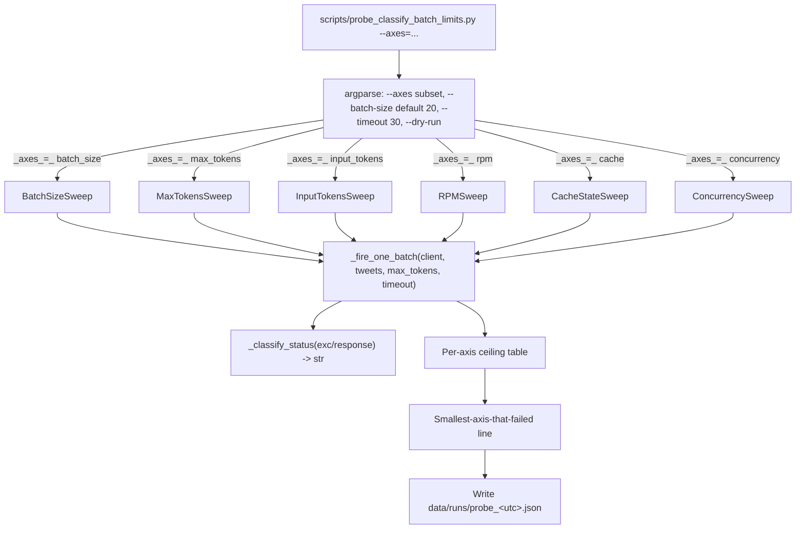

# Goal Capsule

Build a standalone, easily repeatable CLI probe at `scripts/probe_classify_batch_limits.py` that sweeps the 6 axes which could be the "limit" of `classify_batch_pragmatics_full` (batch size, total input tokens, `max_tokens` output cap, request-per-minute pressure, prompt-cache state, and concurrent parallel calls), and prints a per-axis ceiling table plus a one-line verdict naming the smallest axis that fails. No production code change, no DB write, no migration — diagnostic only.

# Product Contract

## Summary

A lightweight probe script that fires synthetic-tweet batches at the live LLM through the same call path `classify_batch_pragmatics_full` uses (`build_batch_pragmatics_full_prompt` → `_call_signal_with_retry`), varies one axis at a time, and reports where each axis caps out. The probe is the missing diagnostic for the 2026-07-15 secondary issue: the 20-post batch returning "Unterminated string" at column 3831 followed by an SSL read hang. Without it, the next agent is guessing whether to lower `_CLASSIFY_BATCH_SIZE`, raise `max_tokens`, add backoff, or change providers.

## Problem Frame

`classify_batch_pragmatics_full` is the production classifier's hot path: 200 posts/cycle at 20 posts/batch = ~10 LLM calls per cycle. After the 2026-07-15 LLM auth fix, every cycle now reaches the classifier but the first batch returns a truncated JSON response ("Unterminated string starting at: line 1 column 3831") and the SDK hangs in `_ssl__SSLSocket_read` for 5+ minutes before the retry budget is exhausted. Single LLM calls complete in 1.8-3.4 s, so the limit is batch-shape-specific. We do not know which axis caps out — the next implementation decision (lowering `_CLASSIFY_BATCH_SIZE`? raising `max_tokens`? adding prompt-cache write tokens? adding a longer backoff?) depends on it. This probe turns the guess into a measurement.

## Requirements

### Diagnosis

- R1. The probe must call the LLM through the same function as production: `classify_batch_pragmatics_full` (or, where it falls back, `classify_pragmatics_full`).
- R2. The probe must not require a real TwitterAPI fetch, a DB read, or any pipeline state. It must construct tweets in-memory from the live brand registry so the call shape matches production exactly.

### Axes

- R3. The probe must sweep the following 6 axes, varying exactly one at a time:
  - A1. Batch size (posts per LLM call). Sweep `[1, 5, 10, 15, 20, 25, 30, 40, 50]`.
  - A2. Total input tokens. Achieved by extending tweet text length rather than tweet count. Sweep `[2k, 4k, 8k, 16k, 32k, 64k]` approximate input tokens (estimated by `len(prompt) / 4`).
  - A3. `max_tokens` output cap (the value passed to `messages.create`). Sweep `[256, 512, 1024, 2048, 4096]`.
  - A4. Requests per minute. Fire N calls in quick succession at fixed batch size and observe rate-limit behavior. Probe at RPM = `[60, 120, 240]` sustained for 60 s.
  - A5. Prompt-cache state. Compare (a) first call after a fresh process (cache write, expect `cache_creation_input_tokens > 0`), (b) second call within cache TTL window (cache read, expect `cache_read_input_tokens > 0`).
  - A6. Concurrent parallel calls. Fire N calls in parallel via `ThreadPoolExecutor(max_workers=N)` at fixed batch size and observe whether the failure mode that bites single calls in series (the `Unterminated string` / SSL hang observed 2026-07-15) shows up sooner, or whether the gateway begins returning 429 / 5xx under load. Sweep `N ∈ [1, 2, 4, 8, 16]` at `batch_size=20` (the production value) for 60 s wall-clock per row. A4 and A6 are deliberately complementary: A4 measures serial rate (calls/min), A6 measures concurrent capacity (calls-in-flight).

### Output

- R4. Per axis, the probe must print a ceiling table: rows = axis values, columns = status (success / unterminated / SSL hang / 4xx / 5xx), wall-clock seconds, response char count, `usage.input_tokens` if available.
- R5. At the end, the probe must print a one-line verdict naming the smallest axis value that failed (e.g., `"limit hit: max_tokens=512 → unterminated"` or `"limit hit: concurrency=4 → ssl_hang"`).
- R6. The probe must also write a machine-readable `data/runs/probe_<utc>.json` next to the runs the pipeline writes, so a follow-up diff can compare two probe runs (after any code change).

### Safety

- R7. The probe must exit early with a clear message if `ANTHROPIC_API_KEY` is unset, so it cannot accidentally run with the stale `sk-ant-api...` credential that was in `~/.env.secrets` before the 2026-07-15 fix.
- R8. The probe must enforce a per-call wall-clock timeout shorter than the pipeline's 5+ min SSL hang (default 30 s) so a stalled call does not stall the whole probe.
- R9. The probe must catch and classify every per-call exception into one of: `success`, `unterminated_json`, `ssl_hang`, `timeout`, `4xx`, `5xx`, `other`. No silent failures.

### Repeatability

- R10. The probe must run from a fresh `python -m scripts.probe_classify_batch_limits --axes=...` invocation with no side effects beyond the JSON file from R6.
- R11. The probe must support a `--axes=batch_size,max_tokens` subset syntax so a re-run can target the failed axis without re-firing the others.
- R12. The probe must support `--dry-run` that builds every prompt and reports `len(prompt)` / estimated token counts without firing any LLM call, so the user can sanity-check the input shape offline.

## Key Flows

- F1. Operator-driven diagnostic
  - **Trigger:** Operator notices the secondary 20-post batch truncation issue, runs `python -m scripts.probe_classify_batch_limits --axes=batch_size`.
  - **Actors:** Operator (A1).
  - **Steps:** Probe fires batch_size=[1,5,10,15,20,25,30,40,50] in sequence, each with a fresh 30 s timeout, captures status + timing + usage per row, prints ceiling table.
  - **Outcome:** Operator sees the smallest batch_size that returns `unterminated_json` (or sees all green, in which case batch size is not the limit).
- F2. Targeted axis re-run
  - **Trigger:** F1 identified batch_size=25 as the failure point. Operator runs `python -m scripts.probe_classify_batch_limits --axes=max_tokens`.
  - **Steps:** Probe fires max_tokens=[256..4096] sweep at fixed batch_size=20 (production value) and reports whether `max_tokens` is independently the limit.
  - **Outcome:** Operator now knows if raising `max_tokens` alone fixes the issue (yes → cap it at e.g. 2048; no → the limit is elsewhere).
- F3. Cache-state isolation
  - **Trigger:** Operator wants to verify the prompt-cache assumption.
  - **Steps:** Probe fires 3 consecutive calls at fixed batch_size=1 with the same `_PRAGMATICS_FULL_SYSTEM_PROMPT`, prints the `usage.cache_creation_input_tokens` and `usage.cache_read_input_tokens` for each.
  - **Outcome:** First call writes cache (creation > 0), second/third read cache (read > 0). If this fails, the prompt-cache is not actually surviving across calls, and the 20× cost-reduction rationale in the plan 2026-07-08-003 plan is invalid.

## Scope Boundaries

### In scope

- Standalone probe script in `scripts/`.
- Probe driver + per-axis sweep loops + JSON output + table output.
- No-touch on `x_monitor/attribution.py` or `x_monitor/run.py` — the probe uses the public API.
- A single new test in `tests/test_probe_classify_batch_limits.py` covering the synthetic-tweet builder, the status classifier, the `--dry-run` flag, and the verdict line.

### Deferred to Follow-Up Work

- Lowering `_CLASSIFY_BATCH_SIZE` from 20 to a probe-discovered value.
- Raising `max_tokens` in `_call_signal_with_retry` from 1024 to a probe-discovered value.
- Replacing or adding a backoff strategy for the SSL-hang path.
- Replacing the Alibaba gateway or adding prompt-cache write tokens.
- Modifying the `_PRAGMATICS_FULL_SYSTEM_PROMPT` length.

### Outside this product's identity

- The classifier shape itself (5 prongs per brand, 10 discourse roles, etc.). The probe measures around it; it does not critique it.
- The single-tweet classification path. The probe exists because the batched path is the limit; the single-tweet path is out of scope.

# Planning Contract

## Key Technical Decisions

- KTD1. **Probe at the public API surface, not via direct HTTP.** The probe calls `classify_batch_pragmatics_full` (with a synthetic `anthropic_client` when the env is configured for it, otherwise a `FakeClaudeClient` for `--dry-run`). Reason: production-shaped call path is what we want to measure; bypassing it lets us measure a different code path.
- KTD2. **One-axis-at-a-time + one compound sweep.** Each axis gets its own sweep varying only that knob; the final row is a compound sweep at the smallest-axis-value-that-failed for every other axis at its current production value. Reason: independent-axis data gives the next implementer a clean per-axis ceiling; the compound sweep confirms the failure is reproducible under realistic configuration.
- KTD3. **Synthetic tweets generated from the live brand registry.** The probe reads `Store.read_brands()` (or, when no DB, hardcodes the 20 enabled brand_ids) and constructs N tweets each carrying 1-3 random brand_ids from that set. Reason: live registry → production-shaped payload; hardcoded fallback → the probe still works on a fresh checkout.
- KTD4. **Per-call timeout via `concurrent.futures.ThreadPoolExecutor` + `future.result(timeout=30)`.** Reason: the SDK's `messages.create` does not honor a wall-clock timeout on its own; the SSL hang observed in production is exactly the failure mode this protects against. The same `ThreadPoolExecutor` primitive is reused for the A6 concurrency sweep with `max_workers=N` and a wall-clock budget per row — fan-out is the same plumbing as the timeout.
- KTD5. **JSON output under `data/runs/probe_<utc>.json`.** Reason: pipeline writes `data/runs/LATEST.json` next to runs; the probe uses the same convention so a `diff` between two probe runs answers "did the fix land?" without bespoke tooling.
- KTD6. **Synthetic tweet text length scales by repeating a fixed sentence.** Reason: we want to vary *token count* without varying *semantic content* (so the LLM's classification work is comparable across rows). The repeating-sentence approach is what `tests/test_classify_pragmatics_full.py` already does for fuzzing.
- KTD7. **Status classifier uses string-pattern matching on the exception's repr.** `Unterminated string` → `unterminated_json`; `_ssl__SSLSocket_read` / `Read timed out` / `timeout` → `ssl_hang`; HTTP 4xx / 5xx from the SDK's own errors → `4xx` / `5xx`; everything else → `other`. Reason: the SDK raises a small zoo of exception types; pattern matching on the message is more robust than isinstance checks against the SDK's full exception tree.
- KTD8. **`--dry-run` builds every prompt, prints `len(prompt)` and `len(prompt)//4` estimated tokens, never fires a request.** Reason: lets the operator verify the input shape before paying for 50+ LLM calls; mirrors the existing `probe_filter_yield.py` pattern of safe offline diagnostics.
- KTD9. **Concurrency sweep (A6) measures concurrent capacity, not serial rate.** `sweep_concurrency` fires N parallel calls via `ThreadPoolExecutor(max_workers=N)` and reports (a) status counts across the N concurrent calls, (b) the smallest N at which any call's status degrades (ssl_hang / unterminated_json / 429 / 5xx), (c) achieved calls/sec under load. A4's serial pressure and A6's concurrent fan-out are kept as separate axes — they catch different failure modes (rate-limit quota vs connection-pool exhaustion / gateway SSL state).

## High-Level Technical Design

The probe is a single CLI with five subcommands (or `--axes=` flags) driving independent sweep loops that share a single `_fire_one_batch` helper. Each loop prints a table; the end of the run prints the verdict.



The synthetic-tweet builder sits at the center of every sweep; it is the single source of truth for what the LLM is being asked to classify.

## Assumptions

- The Alibaba-gateway-compatible `ANTHROPIC_API_KEY` (the `sk-cp-uhKE...` value in `~/.env.secrets` after the 2026-07-15 fix) remains valid and the gateway remains reachable. R7 guards against the prior stale-credential failure mode.
- `_call_signal_with_retry` is the production retry path; the probe either calls `classify_batch_pragmatics_full` directly (which uses it) or calls `client.messages_create` with the same `max_tokens` parameter that `_call_signal_with_retry` passes (1024). R8 + R9 capture the 3-retry exhaustion outcome.
- The brand registry has at least 1 enabled brand at probe time. If `Store.read_brands()` returns an empty list, the probe falls back to a hardcoded 20-brand set.

## Sequencing

The plan is implementable as a single commit. No inter-unit dependencies; the probe is a leaf artifact.

# Implementation Units

## U1. Probe scaffolding + synthetic-tweet builder

- **Goal:** Stand up `scripts/probe_classify_batch_limits.py` with argument parsing, synthetic-tweet construction, and the `_fire_one_batch` helper. No axes yet — just the spine.
- **Requirements:** R1, R2, R7, R8, R9, R12.
- **Dependencies:** None.
- **Files:**
  - `x-monitoring/scripts/probe_classify_batch_limits.py` (new)
  - `x-monitoring/tests/test_probe_classify_batch_limits.py` (new)
- **Approach:**
  - Build synthetic tweets by reading `Store.read_brands()` when available, otherwise the 20 hardcoded brand_ids (`minimax`, `hailuo`, `kimi`, `deepseek`, `qwen`, `glm`, `yi`, `baichuan`, `doubao`, `ernie`, `hunyuan`, `spark`, `wenxin`, `tongyi`, `abab`, `rohan`, `minimax_m2`, `kuaishou_kling`, `tencent_hunyuan`, `iflytek_spark`). Each tweet carries 1-3 brand_ids drawn from that set; text length is a parameter.
  - `_fire_one_batch(client, tweets, max_tokens, timeout)` calls `classify_batch_pragmatics_full` directly when `client` is real; when `client` is a `FakeClaudeClient`, it short-circuits to the JSON shape so `--dry-run` is testable.
  - Per-call timeout via `concurrent.futures.ThreadPoolExecutor(max_workers=1).submit(classify_batch_pragmatics_full, ...).result(timeout=timeout)`.
  - `_classify_status(exc)` matches the KTD7 patterns; returns the canonical status string.
- **Test scenarios:**
  - `test_build_synthetic_tweets_default_size` — calling `_build_synthetic_tweets(n=10)` returns 10 dicts, each with `tweet_id` / `text` / `brand_ids` keys, and `1 <= len(brand_ids) <= 3`.
  - `test_build_synthetic_tweets_text_length` — passing `text_len=2000` produces tweets whose `text` is ~2000 chars.
  - `test_fire_one_batch_dry_run_classifies_status` — with a `FakeClaudeClient`, `_fire_one_batch(tweets, 1024, 30)` returns a status of `success` (fake returns the expected shape).
  - `test_fire_one_batch_timeout_returns_ssl_hang_status` — with a `FakeClaudeClient` that sleeps 60 s and timeout=1, the call returns `ssl_hang` and does not raise.
  - `test_classify_status_unterminated_string` — feeding an exception with msg `"Unterminated string starting at: line 1 column 3831"` returns `unterminated_json`.
  - `test_classify_status_ssl_hang_pattern` — feeding an exception whose msg contains `_ssl__SSLSocket_read` returns `ssl_hang`.
  - `test_missing_api_key_exits_clean` — with `ANTHROPIC_API_KEY` unset and `--no-dry-run`, the script prints `missing ANTHROPIC_API_KEY` and exits 0 (or exits 2 with a clear message — pick the convention that matches `scripts/probe_filter_yield.py`).
  - `test_dry_run_does_not_call_llm` — with a `FakeClaudeClient` whose `messages_create` raises if called, `--dry-run` exits 0 and the fake is never invoked.
- **Verification:** `python -m pytest tests/test_probe_classify_batch_limits.py -v` passes all 8 tests.

## U2. Five axis sweeps + ceiling table

- **Goal:** Implement the 5 axis sweeps (A1-A5 from R3), each as a function that takes the configured base parameters and emits its rows to the shared ceiling table.
- **Requirements:** R3, R4, R5.
- **Dependencies:** U1.
- **Files:** `x-monitoring/scripts/probe_classify_batch_limits.py` (modify).
- **Approach:**
  - `sweep_batch_size(client, base_kwargs)`: iterates `n_posts ∈ [1, 5, 10, 15, 20, 25, 30, 40, 50]`, builds tweets at default text length, fires one call per value, prints a row with `n_posts | status | wall_clock_s | response_chars | input_tokens`.
  - `sweep_max_tokens(client, base_kwargs)`: iterates `max_tokens ∈ [256, 512, 1024, 2048, 4096]` at fixed `n_posts=20` (the production value).
  - `sweep_input_tokens(client, base_kwargs)`: iterates `text_len_chars ∈ [2000, 4000, 8000, 16000, 32000, 64000]` at fixed `n_posts=20` (the production value).
  - `sweep_rpm(client, base_kwargs)`: iterates target_rpm ∈ [60, 120, 240]; for each, fires calls for 60 s wall-clock and reports actual achieved rpm + any 4xx / `rate_limit_exceeded` errors.
  - `sweep_cache_state(client, base_kwargs)`: fires 3 consecutive calls at `n_posts=1` with a 30 s sleep between calls (to keep the cache warm across the Anthropic 5-min TTL), prints `cache_creation_input_tokens` / `cache_read_input_tokens` per call.
  - `sweep_concurrency(client, base_kwargs)`: iterates `max_workers ∈ [1, 2, 4, 8, 16]` at fixed `n_posts=20`; for each value, submits N calls in parallel via `ThreadPoolExecutor(max_workers=N)` for 60 s wall-clock, captures per-call status (using the KTD4 timeout primitive for each future), reports (a) the smallest N at which any call's status degrades from `success`, (b) achieved calls/sec, (c) status histogram across all N concurrent calls per row. A6 deliberately reuses the same `_fire_one_batch` + `_classify_status` path so results are directly comparable to A1–A5.
  - Each sweep prints its table as a fixed-width ASCII table (no `tabulate` dependency — match the style of `scripts/probe_filter_yield.py`).
- **Test scenarios:**
  - `test_sweep_batch_size_emits_one_row_per_value` — calling `sweep_batch_size(fake_client, base)` with `fake_client` returning `success` always, captures stdout and asserts exactly 9 rows (one per value in `[1,5,10,15,20,25,30,40,50]`).
  - `test_sweep_max_tokens_uses_production_batch_size` — calling `sweep_max_tokens` and inspecting the fake's recorded `messages_create` calls shows `len(tweets) == 20` for every row.
  - `test_sweep_input_tokens_text_length_varies` — calling `sweep_input_tokens` and inspecting the recorded tweet text shows lengths scaling with the configured values.
  - `test_verdict_line_names_smallest_failing_axis` — calling the post-sweep verdict helper with a fixture of rows where `batch_size=25` first fails, asserts the verdict string contains `batch_size=25`.
  - `test_cache_sweep_fires_three_calls` — calling `sweep_cache_state` and counting fake invocations returns 3.
  - `test_sweep_concurrency_uses_thread_pool` — calling `sweep_concurrency(fake_client, base)` and inspecting `fake_client.in_flight_max` (a counter incremented on entry and decremented on exit of `messages_create`) shows the max observed in-flight value equals the configured `max_workers` (e.g., 4 when N=4).
  - `test_sweep_concurrency_verdict_names_smallest_failing_N` — feeding `sweep_concurrency` a fake that returns `ssl_hang` for all calls at N=4 but `success` for N=1, 2 yields a verdict string containing `concurrency=4`.
- **Verification:** Manual run with a live `ANTHROPIC_API_KEY`:

  ```bash
  cd x-monitoring
  python -m scripts.probe_classify_batch_limits --axes=batch_size,max_tokens
  ```

  produces two ASCII tables and a verdict line.

## U3. JSON output + axis subset + dry-run integration

- **Goal:** Wire `--axes=` subset syntax, write `data/runs/probe_<utc>.json`, ensure `--dry-run` works across every axis.
- **Requirements:** R6, R10, R11, R12.
- **Dependencies:** U2.
- **Files:** `x-monitoring/scripts/probe_classify_batch_limits.py` (modify).
- **Approach:**
  - `--axes=batch_size,max_tokens,concurrency` parses comma-separated; only those sweeps run. The valid axis names are `{batch_size, max_tokens, input_tokens, rpm, cache_state, concurrency}`.
  - `--dry-run` makes every sweep skip `_fire_one_batch` and instead print `len(prompt) / 4` estimated tokens + `len(prompt)` chars. Status column reads `dry_run`.
  - JSON output: `{ "ts_utc": "...", "axes_run": [...], "rows": [{...}, ...], "verdict": "..." }`. Path is `data/runs/probe_<UTC>.json` (use the same `datetime.utcnow().strftime("%Y%m%dT%H%M%SZ")` format the pipeline uses for run files).
- **Test scenarios:**
  - `test_axes_subset_runs_only_specified` — `--axes=batch_size` produces JSON with `axes_run: ["batch_size"]` only.
  - `test_dry_run_json_status_field` — `--dry-run` produces JSON rows with `status: "dry_run"`.
  - `test_json_path_uses_utc_timestamp_format` — verify the path matches `data/runs/probe_\d{8}T\d{6}Z\.json`.
  - `test_json_written_on_real_run` — with a `FakeClaudeClient`, after running any sweep, `data/runs/probe_*.json` exists and parses as valid JSON.
- **Verification:** After U3, both forms of the probe produce their expected outputs:

  ```bash
  python -m scripts.probe_classify_batch_limits --axes=batch_size --dry-run
  python -m scripts.probe_classify_batch_limits --axes=cache_state,concurrency --no-dry-run
  ```

# Verification Contract

| Check | Command | Expected |
|---|---|---|
| Unit tests | `cd x-monitoring && python -m pytest tests/test_probe_classify_batch_limits.py -v` | All 19 tests pass (8 in U1 + 7 in U2 + 4 in U3). |
| Probe dry-run, all axes | `cd x-monitoring && python -m scripts.probe_classify_batch_limits --dry-run` | One ASCII table per axis, every row's status is `dry_run`, no LLM call fires, exit 0. |
| Probe subset, axes=batch_size | `cd x-monitoring && python -m scripts.probe_classify_batch_limits --axes=batch_size --no-dry-run` (with valid `ANTHROPIC_API_KEY`) | One table for `batch_size`, verdict line, JSON file under `data/runs/`. |
| Missing-credential guard | `unset ANTHROPIC_API_KEY && python -m scripts.probe_classify_batch_limits --axes=batch_size` | Exits with a clear `missing ANTHROPIC_API_KEY` message; does not call the LLM. |
| JSON output | `cat data/runs/probe_*.json \| python -m json.tool` | Valid JSON with `ts_utc`, `axes_run`, `rows`, `verdict` keys. |

# Definition of Done

- All 19 tests in `tests/test_probe_classify_batch_limits.py` pass (8 from U1, 7 from U2, 4 from U3).
- `scripts/probe_classify_batch_limits.py` runs end-to-end in `--dry-run` mode (no creds, no LLM, exit 0) and in `--no-dry-run` mode (with valid creds, 6 sweeps, JSON output).
- The probe identifies the smallest axis that fails on the live gateway at probe time, and the verdict line is the artifact a future implementer acts on.
- No production code in `x_monitor/` was touched. The probe is a leaf diagnostic.

# Appendix

## Related

- `x_monitor/attribution.py:1723` — `classify_batch_pragmatics_full` (the function under diagnosis).
- `x_monitor/attribution.py:1003` — `_CLASSIFY_BATCH_SIZE = 20` (the constant the probe's batch_size sweep varies around).
- `x_monitor/attribution.py:916` — `_call_signal_with_retry` (the retry path the probe inherits).
- `x_monitor/attribution.py:805` — `_SIGNAL_MODEL` resolution (probes use the same model).
- `docs/plans/2026-07-08-003-feat-concurrent-classify-with-prompt-caching-plan.md` — the plan that put `_PRAGMATICS_FULL_SYSTEM_PROMPT` at module scope to keep Anthropic's prompt-cache warm; the cache_state sweep probes whether that assumption holds.
- `docs/debug/2026-07-14-171500-cursor-fix-verify-before-revert.md` — the cursor-fix verification doc that established the direct-API test pattern the probe follows (live-call, fixed knobs, captured per-row metrics).
- `tests/classifier_tests/2026-07-15-pipeline-resume-llm-auth-fix.md` — the prior session's report that diagnosed the auth issue but did not measure the secondary batch-shape limit; this probe is the missing follow-up.
- `scripts/probe_filter_yield.py` — the closest existing pattern (standalone CLI probe, hardcoded fallback brand list, ASCII table output); the new probe mirrors its conventions.

## Sources

- `x_monitor/attribution.py:1723-1873` — direct read of `classify_batch_pragmatics_full` (batch loop, retry fallback, status classification patterns).
- `x_monitor/attribution.py:1336-1364` — direct read of `build_batch_pragmatics_full_prompt` (JSON payload shape, system-prompt prefix).
- `x_monitor/run.py:611-650` — direct read of `_run_post_fetch` Stage 2 (the production call site, including the fail-soft fallback that currently hides the limit).
- `tests/test_classify_batch_pragmatics_full.py` — existing test patterns for the batch function (FakeClaudeClient shape, payload size assertions).
- `scripts/probe_filter_yield.py` — existing probe pattern (CLI, hardcoded brand fallback, ASCII table).