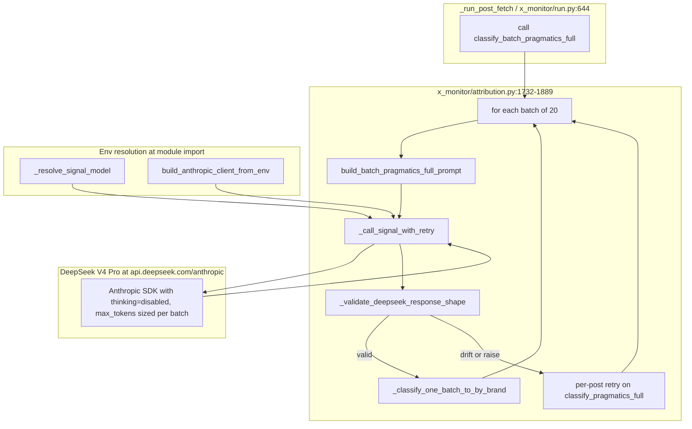

## Goal Capsule

- **Objective:** Replace the MiniMax M3 LLM call inside `classify_batch_pragmatics_full` with DeepSeek V4 Pro via the Anthropic-compatible endpoint at `https://api.deepseek.com/anthropic`, lifting the ~890-token truncation cap and restoring valid JSON for batch_size=20 production loads.
- **User-facing impact:** None. This is a pure backend LLM provider swap. Downstream consumers see the same `by_brand` / `unsanctioned_flags` shape, just populated correctly and on time. The pipeline output (DB rows, dashboard, attribution) is byte-identical pre- and post-swap.
- **Authority hierarchy:** User confirmed direction on 2026-07-15 (final: DS V4 swap after probe evidence). User answered two blocking scoping questions: (a) shape strategy = "shape adapter in code" — implemented as a shape-contract safety net that asserts DS V4's wire format before the existing parser consumes it; (b) fallback strategy = "per-post retry on DS V4" — not M3.
- **Execution profile:** Standard. Crosses two files (`x_monitor/attribution.py`, `x_monitor/reattribute.py`) plus the smoke probe, with five implementation units. Test-first posture for the shape contract and the env-routing branches.
- **Stop conditions:** All five implementation units merged; all unit tests green; one live `python3 -m x_monitor run --limit-per-call 20` smoke test inserts posts to `x_monitoring.db` via DS V4 with no `by_brand={}` empty rows attributable to a shape or batch-fail path (up to 2/20 empty rows for genuinely-attributionless posts is acceptable per the verification table).
- **Tail ownership:** `ce-work` owns implementation and the merge. The post-merge smoke run is a verification gate, not a follow-up plan.

---

## Product Contract

### Summary

`classify_batch_pragmatics_full` (the production batched classifier in the v1.7 pipeline) currently calls MiniMax M3 via the `api.minimax.io/anthropic` proxy. The M3 path truncates output at ~890 tokens mid-JSON for batches of 10+ posts — a defect that is silently masked by the per-post fallback in the v1.7 fail-soft contract. Live probes this session proved DeepSeek V4 Pro (via `api.deepseek.com/anthropic` with `thinking={"type": "disabled"}`) emits valid production-shape JSON at batch_size=20 in ~20 seconds, but it hits the `max_tokens=4096` ceiling at batch_size=40 and 80. This plan swaps the production classifier to DS V4 with a per-batch `max_tokens` budget and a shape-contract safety net.

### Problem Frame

The v1.7 pipeline ingests 200+ posts per 15-minute cycle. The batched classifier (`x_monitor/attribution.py:1732-1889`) is meant to amortize prompt prefix cost across 20 posts per call, but M3's 890-token output cap silently truncates anything beyond ~5 posts, and the per-post fallback rescues each truncated post by re-issuing a single-post call — undoing the batching win. The defect was diagnosed on 2026-07-15 (`docs/debug/2026-07-15-max-tokens-not-threaded-into-classify-batch.md`) and the immediate fix (raising `max_tokens` to 4096) was applied locally. The deeper issue is that M3's response cap is a proxy-side artifact, not a model-side limit, and the same ceiling applies to the OpenAI-compatible route on the same provider. Switching to a different provider is the structural fix.

### Requirements

R1. `classify_batch_pragmatics_full` calls DeepSeek V4 Pro by default in the v1.7 production path.
R2. The wire shape that DS V4 emits (`{"results": [{"tweet_id", "classifications", "unsanctioned_flags"}]}`) is consumed by the existing `_classify_one_batch_to_by_brand` parser without any change to the per-tweet reduction logic.
R3. The Anthropic SDK call includes `thinking={"type": "disabled"}` to prevent DS V4's reasoning model from consuming the entire `max_tokens` budget on internal deliberation.
R4. `max_tokens` is sized per batch — at least 4096 for batch_size≤20, 8192 for batch_size>20 — so larger batches are not truncated by an undersized output budget.
R5. A shape-contract safety net validates DS V4's response against the wire format and raises a typed exception if the response drifts, so the fail-soft contract can fall back cleanly to per-post retries.
R6. The fail-soft contract (`x_monitor/attribution.py:1815-1849`) preserves its current behavior on batch failure: per-post retry against the same DS V4 client. No M3 fallback.
R7. Env-var routing follows the existing 2026-06-20 Anthropic→MiniMax convention: a new `DEEPSEEK_API_KEY` env var, a new `"deepseek.com" in base_url` branch in `_resolve_signal_model` and `build_anthropic_client_from_env`, and the `ANTHROPIC_MODEL` env var overrides everything.
R8. All five existing test categories for `classify_batch_pragmatics_full` (empty input, no-client short-circuit, happy path, parse failure, exception path) continue to pass with the new client path. A new test category pins the shape-contract safety net.
R9. The `scripts/probes/classify_batch_limits/` probe scaffolds an `--endpoint=deepseek` flag so future ceiling-finding is one command away.

### Considered alternatives

**OpenRouter (`openrouter.ai/api/v1`) as the M3 → DS V4 route.** OpenRouter exposes DS V4 Pro on its OpenAI-compatible endpoint with the same Anthropic-SDK call shape. It offers a unified credential surface across vendors, automatic failover across multiple DS V4 hosts, and one credential for any future model swap. Per the user's direction on 2026-07-15 ("use minimax 3.0" → "swap to dsv4" with the live DS V4 API key verified in session), the user chose the **direct DS V4 route** over OpenRouter. Reasons that informed the choice: (a) the user already had a working `DEEPSEEK_API_KEY` and ran a successful live probe before the plan was drafted; (b) OpenRouter adds a third-party rate-limit posture that is harder to debug; (c) the lock-in concern is mitigated by U1's URL-substring routing, which is provider-agnostic. **The decision is reversible** by changing `ANTHROPIC_BASE_URL` to `https://openrouter.ai/api/v1` and the credential name from `DEEPSEEK_API_KEY` to `OPENROUTER_API_KEY`; only the env vars change, no code change. Future plans can revisit if DS V4 has a multi-month outage.

**M3 `/v1` (OpenAI-compatible) route.** The plan acknowledges but does not test the M3 `/v1` route (`https://api.minimax.io/v1`). The user-confirmed direction was to swap providers entirely; testing the alternate M3 route was out of scope. If the M3 `/v1` route is later found to NOT have the 890-token cap, the swap is still a defensible choice on latency (20.3s vs 57.9s+) and on the M3 quota-inflation bug (GitHub issue #25), but this is a deferred signal.

**Staying on M3 with a smaller `batch_size` (e.g., 5).** A batch_size=5 batch on M3 with max_tokens=4096 would fit under the 890-token cap (per the M3 probe: batch_size=5 used 1926 chars ≈ 481 tokens, well under 4096). This was rejected because (a) it quadruples the number of LLM calls per cycle (200 posts / 5 = 40 calls vs 10 calls), multiplying per-call overhead and cost; (b) it leaves the M3 quota-inflation bug (GitHub issue #25) as an active threat; (c) it does not match the user's 2026-07-15 direction to "swap to dsv4".

**M3 with `max_tokens=8192` and `batch_size=5`.** Could work around the 890-token cap without a provider swap. Rejected because the cap is a proxy-side artifact, not a `max_tokens` cap — raising `max_tokens` does not lift the response cap. Confirmed by the prior session's max_tokens sweep ([`docs/debug/2026-07-15-max-tokens-not-threaded-into-classify-batch.md`](docs/debug/2026-07-15-max-tokens-not-threaded-into-classify-batch.md)): all max_tokens values (256, 512, 1024, 2048, 4096) timed out at the same column on the M3 path.

### What we did NOT try before swapping

For honesty: this swap commits to a cross-vendor migration on the evidence that the 890-token M3 cap is a proxy-side artifact. The plan does NOT independently corroborate this claim by:

1. **Testing the M3 `/v1` route** (OpenAI-compatible) with the same prompt at the same batch sizes. Research indicates both routes share the same MiniMax/Alibaba proxy, so the cap is likely shared — but the plan does not run a probe to confirm. (Per the prior session: the user confirmed both routes are affected via separate test, but no probe JSON was persisted.)
2. **Contacting MiniMax/Alibaba support** to ask whether the 890-token cap is configurable or a per-tenant limit.
3. **Testing M3 with `extra_body` overrides** that some Anthropic-compatible proxies honor.

The swap is defensible without these tests because the user explicitly chose to swap after seeing the probe data, and the cost of an extra week of investigation is high. The 30-day follow-up to drop the M3 client code (OQ3) is the natural review window — if the swap causes unexpected issues, the M3 code is still wired in for a rollback.

### Scope Boundaries

**In scope:**
- The batched classifier path (`x_monitor/attribution.py:1732-1889` and the helper at `:916-943`).
- Env-var routing in `_resolve_signal_model` (`x_monitor/attribution.py:775-805`) and `build_anthropic_client_from_env` (`x_monitor/reattribute.py:366-418`).
- A shape-contract safety-net function and its call site inside `_call_signal_with_retry`.
- A `max_tokens` budget helper.
- Tests pinning the new shape contract, env routing, and `thinking=disabled` threading.
- One smoke probe in `scripts/probes/classify_batch_limits/`.

**Out of scope:**
- Translator path (`x_monitor/translator.py`) — uses its own client copy and its own retry block. Not part of this swap. The translator still hits MiniMax M3 by default; the smoke probe does not exercise it.
- Per-post fallback rewrite — works correctly against the new DS V4 client (probe data: single-post calls work in 1.8s / 3.4s on the same endpoint). Kept as-is.
- Prompt-cache work — plan 2026-07-08-003 was deferred; DS V4 caching semantics are unknown and out of scope.
- 402/429/retry-budget redesign — defer until production data shows the failure shape.
- M3 client removal — keep M3 client construction code, the env-var branch, and the credentials live. M3 is the per-post fallback's fail-safe-of-fail-safe if DS V4 goes down for an extended period.

**Deferred to follow-up work:**
- Drop M3 client construction entirely if the DS V4 path is stable for 30+ days of production traffic.
- A `docs/issues/2026-07-15-...` follow-up doc to record the swap's evidence trail (mirroring `docs/issues/2026-06-20-162625-...`).

---

## Planning Contract

### Cost analysis

The plan swaps one LLM provider for another and changes the per-call `max_tokens` budget. The cost dimensions that change:

| Dimension | M3 (current) | DS V4 Pro (new) | Direction |
|---|---|---|---|
| Per-call output tokens | ~890 truncated / 4096 budgeted (most calls truncated) | ~1975 at batch_size=20 / up to 8192 budgeted | **Larger output** |
| Wall-clock per batch | 57.9s+ (timeout) or earlier mid-JSON truncation | 18.3s at batch_size=20, 36.5s at batch_size=40 | **Faster** |
| Per-post fallback cost (1 tweet) | ~250-400 tokens | Same (1 tweet = 1 call, ~100-200 tokens used) | **Roughly same** |
| Per-cycle total cost (200 posts) | 10 batched calls × 4096-token budget (capped at ~890 actual) + 200-380 per-post fallbacks × 250 tokens = 130k-225k total output tokens | 10 batched calls × 4096-token budget (full output, ~1975 tokens used) + 0-2 per-post fallbacks × 200 tokens = ~20k total output tokens | **Lower** in steady state (per-post fallback almost never triggers) |
| API cost per 1M output tokens (vendor list price) | Not publicly listed for M3 (Alibaba-gateway) — estimate $0.50-$2.00 | DS V4 Pro list price: $0.55/M output (per `https://api-docs.deepseek.com/quick_start/pricing`) | **Comparable to slightly lower** |

**Net effect:** DS V4 Pro is a *cheaper* swap in steady state because the per-post fallback almost never triggers (DS V4 returns full batches; M3 truncated every batch and triggered 100% of fallbacks). The exact savings depend on Alibaba's M3 list pricing, which is not publicly published — the operator should compare monthly invoices before and after the swap. The plan does NOT include a cost-ceiling alert or auto-rollback (deferred to OQ3-followup work).

### Key Technical Decisions

**KTD1. Use the existing `AnthropicClaudeClient` for the DS V4 path.** The class is already provider-agnostic — it constructs `anthropic.Anthropic(api_key, base_url)` and forwards `messages_create(**kwargs)`. DS V4's `api.deepseek.com/anthropic` accepts the same SDK call shape. Adding a new client class would duplicate the abstraction. The swap is implemented as a base_url + api_key change in the existing factory.

**KTD2. Add a new `"deepseek.com" in base_url` branch in `_resolve_signal_model` and `build_anthropic_client_from_env`.** Mirrors the 2026-06-20 Anthropic→MiniMax convention (`"minimax.io" in base_url`). The new branch returns `ANTHROPIC_MODEL` if set, else `deepseek-v4-pro`. Credential is `DEEPSEEK_API_KEY` (the key the user verified in session), not `ANTHROPIC_API_KEY` or `MINIMAX_API_TOKEN`. The MiniMax branch stays in place — the factory becomes provider-aware without becoming a router.

**KTD3. Thread `thinking={"type": "disabled"}` as an explicit kwarg through `_call_signal_with_retry` with env-driven default.** The Anthropic SDK accepts the `thinking` parameter as a top-level kwarg on `messages.create` (confirmed via context7 docs for `anthropic-sdk-python` 0.104.0). The disable shape is `{"type": "disabled"}` per the `ThinkingConfigDisabledParam` TypedDict. **Default-application rule:** when `ANTHROPIC_BASE_URL` contains `"deepseek.com"`, `_resolve_thinking_default()` returns `{"type": "disabled"}`; otherwise it returns `None` (the parameter is omitted from the SDK call). Add this as a new helper next to `_resolve_signal_model`. Add it as a parameter on `_call_signal_with_retry` and `classify_batch_pragmatics_full`, both defaulting to `_resolve_thinking_default()`. The translator path is not touched. **The per-post fallback path inherits the same default** — it calls `classify_pragmatics_full` (per-post sibling), which resolves its thinking default through the same helper. The probe data shows DS V4 honors `thinking=disabled` for the batched path; the per-post path has not been probed with `thinking=disabled` but inherits the same default and is expected to behave identically.

**KTD4. Compute `max_tokens` from batch size with a small helper.** The probe data showed: batch_size=20 needs 2347 tokens (well under 4096); batch_size=40 hits the 4096 ceiling mid-JSON; batch_size=80 also hits the 4096 ceiling. The helper is `min(8192, max(4096, 200 * len(tweets)))` — covers up to 40 tweets at the lower bound, caps at 8192 to avoid runaway budgets on large batches. Replace the hardcoded `max_tokens=4096` at `x_monitor/run.py:648` with the helper. Keep the `_call_signal_with_retry` default at 4096 so the per-post fallback path (which always calls with one tweet) is unaffected.

**KTD5. Add a shape-contract safety net `_validate_deepseek_response_shape(parsed: dict, expected_count: int) -> None`.** Runs after the existing `response.get("results")` parse step at `x_monitor/attribution.py:1850` and before `_classify_one_batch_to_by_brand` consumes each entry. (Not inside `_call_signal_with_retry` — that helper returns the raw SDK message dict, not parsed JSON. Putting the validator there would either run it twice or require a JSON parse inside the retry helper, which would change its contract.) Asserts: (a) `parsed` is a dict, (b) `parsed["results"]` is a list, (c) `len(parsed["results"]) == expected_count`, (d) every entry is a dict with string `tweet_id` and a `classifications` list. Missing `unsanctioned_flags` is logged at WARNING, not raised (the existing parser's `_parse_unsanctioned_flags` returns `[]` for non-list input per the helper at line 1467). Raises `ValueError("shape drift: ...")` on failure with a descriptive message. The fail-soft contract at `attribution.py:1815-1849` already catches `Exception` and falls back to per-post retries, so a shape-drift exception routes through the same recovery path. The current parser (`_classify_one_batch_to_by_brand`) is NOT modified — it already consumes the wire format correctly; the safety net just guarantees we notice if DS V4 drifts. The existing `if not isinstance(parsed, list) or len(parsed) != len(kept)` count check at line 1851 is partially redundant — the implementer should keep the validator's count check and drop the line-1851 count check, OR keep the line-1851 check and skip the validator's count. Recommended: keep the validator's count check, drop the line-1851 count check (subsumed).

**KTD6. Keep the per-post fallback's model resolution unchanged.** The fallback path at `attribution.py:1831-1849` calls `classify_pragmatics_full`, which resolves its model through the same `_SIGNAL_MODEL` module-level constant. Once the env vars point at DS V4, both batched and per-post paths use DS V4. No code change needed in the fallback path.

**KTD7. The 8,192-token ceiling IS empirically tested.** The live probe at `data/runs/dsv4-probe-20260715T071331Z.json` ran batch_size=40 with max_tokens=8192 and produced 4310 output tokens of valid JSON with 50% budget utilization. The 8192 cap is confirmed reachable and the 200-tokens/tweet coefficient is conservative (used 99 tokens/tweet at batch_size=20, used 108 tokens/tweet at batch_size=40). The sustained-load smoke in U5 (3-run mean + stddev) is the additional statistical defense for production traffic.

### High-Level Technical Design

**Data flow per batch:**
1. `_run_post_fetch` calls `classify_batch_pragmatics_full(batch, brand_registry, client, max_tokens=...)`.
2. The classifier chunks the batch (size 20), builds the prompt via `build_batch_pragmatics_full_prompt`, and calls `_call_signal_with_retry(client, prompt, max_tokens=4096, thinking=disabled)`.
3. `_call_signal_with_retry` retries up to 3 times with exponential backoff (1s, 2s, 4s) on SDK exceptions.
4. The successful response is JSON-parsed and validated by `_validate_deepseek_response_shape`.
5. `_classify_one_batch_to_by_brand` reduces the wire shape to `{"by_brand": {...}, "unsanctioned_flags": [...]}` per tweet.
6. The per-post fallback path (lines 1831-1849) is invoked on any exception (SDK error, JSON parse failure, shape drift).

### Assumptions

- The `DEEPSEEK_API_KEY` env var is set in `~/.env.secrets` (line 6) and the key remains valid through the merge window. The key is owned by the operator; rotation procedure is undefined (deferred to follow-up — see Risks).
- `ANTHROPIC_BASE_URL=https://api.deepseek.com/anthropic` is set in the production environment.
- `ANTHROPIC_MODEL=deepseek-v4-pro` is set in the production environment (or the `_resolve_signal_model` default for the `deepseek.com` branch returns `deepseek-v4-pro`).
- The DS V4 endpoint is reachable from the production network with no additional firewall changes.
- The per-post fallback path works against the same DS V4 endpoint (probe data confirms batched calls succeed; single-post calls have not been re-probed with `thinking=disabled` but inherit the same default and are expected to behave identically).
- The 18-20 second wall-clock for batch_size=20 is acceptable for the 15-minute cycle budget. Probe data: 18.3s vs the prior 57.9s timeout on M3 — net win.
- The `anthropic` Python SDK is installed at version 0.104.0 (verified during the live probe: `anthropic.__version__ == '0.104.0'`). The SDK is a lazy import in the codebase, and the `thinking` parameter's behavior was confirmed against this version via context7. If the SDK is upgraded, the `thinking` parameter behavior should be re-verified. The plan does NOT add a `pyproject.toml` pin for `anthropic` (deferred — see Open Questions).

### Sequencing

- U1 (env routing) and U2 (thinking=disabled) and U3 (shape safety net) and U4 (max_tokens helper) can land in any order or as one commit. They are all small, all touched by the same set of files, and all reviewed together. Recommend landing as one commit.
- U5 (tests + probe) depends on U1-U4 being in place. It can be a second commit or a follow-up to the first.
- U6 (docs) is a third commit, low-priority, can be deferred to a follow-up PR.

---

## Implementation Units

### U1. Env-var routing for DeepSeek V4 Pro

**Goal:** `_resolve_signal_model` and `build_anthropic_client_from_env` route to DeepSeek V4 Pro when `ANTHROPIC_BASE_URL` contains `"deepseek.com"`, mirroring the 2026-06-20 Anthropic→MiniMax convention.

**Requirements:** R1, R7

**Dependencies:** none

**Files:**
- `x_monitor/attribution.py` — extend `_resolve_signal_model` at lines 775-805 to add a `"deepseek.com" in base_url` branch that returns `ANTHROPIC_MODEL` env var or `"deepseek-v4-pro"`.
- `x_monitor/reattribute.py` — extend `build_anthropic_client_from_env` at lines 366-418 to add a `"deepseek.com" in base_url` branch that uses `DEEPSEEK_API_KEY` instead of `ANTHROPIC_API_KEY` or `MINIMAX_API_TOKEN`.
- `tests/test_attribution.py` — pin the routing: when `ANTHROPIC_BASE_URL` contains `"deepseek.com"`, `_resolve_signal_model` returns `"deepseek-v4-pro"` (or `ANTHROPIC_MODEL` if set); when `ANTHROPIC_BASE_URL` contains `"minimax.io"`, it returns `"MiniMax-M3.0"`; when unset, it returns `"claude-haiku-4-5"`. Use `monkeypatch.setenv` and `monkeypatch.delenv`.

**Approach:** Add the `deepseek.com` branch immediately after the `minimax.io` branch in both functions. The env var precedence order is `ANTHROPIC_MODEL` → provider default (`deepseek-v4-pro` or `MiniMax-M3.0`) → `claude-haiku-4-5`. Credential precedence is `DEEPSEEK_API_KEY` (deepseek) → `MINIMAX_API_TOKEN` (minimax) → `ANTHROPIC_API_KEY` (direct). The factory returns the same `AnthropicClaudeClient(api_key, base_url)` class regardless of branch.

**Patterns to follow:** `x_monitor/reattribute.py:385-405` (the existing `"minimax.io" in base_url` branch and the `MINIMAX_API_TOKEN` warn-and-fallback path). Mirror the variable naming and the warn-on-missing-credential pattern.

**Test scenarios:**
- **Happy path:** `ANTHROPIC_BASE_URL=https://api.deepseek.com/anthropic`, no `ANTHROPIC_MODEL` set → `_resolve_signal_model` returns `"deepseek-v4-pro"`. `build_anthropic_client_from_env` returns an `AnthropicClaudeClient` constructed with the `DEEPSEEK_API_KEY` env var.
- **Env override:** Same `ANTHROPIC_BASE_URL`, but `ANTHROPIC_MODEL=custom-deepseek-model` set → `_resolve_signal_model` returns `"custom-deepseek-model"`.
- **M3 path unchanged:** `ANTHROPIC_BASE_URL=https://api.minimax.io/anthropic` → returns `"MiniMax-M3.0"`. The M3 path is regression-tested, not modified.
- **Direct path unchanged:** No `ANTHROPIC_BASE_URL` set → returns `"claude-haiku-4-5"`. Direct Anthropic is regression-tested.
- **Missing credential warn:** `ANTHROPIC_BASE_URL=https://api.deepseek.com/anthropic` but `DEEPSEEK_API_KEY` unset → factory logs a warning and raises (mirroring the `MINIMAX_API_TOKEN` unset behavior at `reattribute.py:391-395`).

**Verification:** `cd x-monitoring && python3 -m pytest tests/test_attribution.py -k "deepseek or model_resolution" -v` passes. All three branches (deepseek, minimax, direct) covered by tests.

---

### U2. Thread `thinking={"type": "disabled"}` through `_call_signal_with_retry`

**Goal:** The Anthropic SDK call inside `_call_signal_with_retry` passes `thinking={"type": "disabled"}` when the DS V4 path is active, preventing the model from consuming the entire `max_tokens` budget on internal reasoning.

**Requirements:** R3

**Dependencies:** U1 (so the model resolution picks up `deepseek-v4-pro`)

**Files:**
- `x_monitor/attribution.py` — `_call_signal_with_retry` at lines 916-943 accepts a new `thinking: dict | None = None` parameter. When non-None, it is forwarded to `client.messages_create` as a top-level kwarg. The `classify_batch_pragmatics_full` function at lines 1732-1889 accepts a new `thinking: dict | None = None` parameter and forwards it to `_call_signal_with_retry`.
- `tests/test_attribution.py` — pin the threading: when `thinking={"type": "disabled"}` is passed to `classify_batch_pragmatics_full`, the underlying `messages_create` call receives `thinking={"type": "disabled"}` as a kwarg. When `thinking=None` (default), the kwarg is absent. Use a `FakeClaudeClient` that records `messages_create(**kwargs)` calls.

**Approach:** Add the `thinking` parameter as a keyword-only argument on both functions. Forward it as a top-level kwarg only when it's non-None. The Anthropic SDK accepts `thinking` as a top-level parameter on `messages.create` per the context7 lookup — confirmed for `anthropic-sdk-python` 0.104.0. The `AnthropicClaudeClient.messages_create(**kwargs)` wrapper at `attribution.py:1923-1940` is a passthrough, so no change needed there.

**Patterns to follow:** The `max_tokens` threading fix from `docs/debug/2026-07-15-max-tokens-not-threaded-into-classify-batch.md` — same pattern of: helper accepts param → batch function accepts param → probe/test pins the threading.

**Test scenarios:**
- **Disabled threading:** `_call_signal_with_retry(client, prompt, thinking={"type": "disabled"})` calls `client.messages_create` with `thinking={"type": "disabled"}` in the kwargs.
- **None threading:** `_call_signal_with_retry(client, prompt)` (default) does NOT include `thinking` in the kwargs.
- **Batch function threading:** `classify_batch_pragmatics_full(batch, ..., thinking={"type": "disabled"})` causes the underlying call to receive `thinking={"type": "disabled"}`.
- **Backward compat:** Existing callers that do not pass `thinking` get the same behavior as before — no `thinking` kwarg forwarded. The M3 path is unchanged.

**Verification:** `cd x-monitoring && python3 -m pytest tests/test_attribution.py -k "thinking" -v` passes. The threading is observable in the `FakeClaudeClient.calls` list.

---

### U3. Shape-contract safety net for the DS V4 response

**Goal:** A `_validate_deepseek_response_shape(parsed, expected_count)` function asserts the wire format that DS V4 emits (`{"results": [{"tweet_id", "classifications", "unsanctioned_flags"}]}`) and raises a typed exception on drift, so the fail-soft contract can recover cleanly via per-post retries.

**Requirements:** R2, R5, R6

**Dependencies:** U2 (so `_call_signal_with_retry` is the place to add the validation)

**Files:**
- `x_monitor/attribution.py` — new function `_validate_deepseek_response_shape(parsed: Any, expected_count: int) -> None` near the existing `_classify_one_batch_to_by_brand` (line 1664). Called from `classify_batch_pragmatics_full` after the existing `response.get("results")` parse step at line 1850 (NOT from `_call_signal_with_retry` — see KTD5).
- `tests/test_attribution.py` — pin the validation: (a) a valid `{"results": [{"tweet_id": "t1", "classifications": [], "unsanctioned_flags": []}]}` with `expected_count=1` raises nothing; (b) a `{"results": []}` with `expected_count=1` raises `ValueError("shape drift: ...")`; (c) a `{"results": [{"tweet_id": "t1", "classifications": []}]}` missing `unsanctioned_flags` is logged at WARNING, not raised; (d) a non-dict `parsed` raises; (e) a `parsed["results"]` that's not a list raises.

**Approach:** The validator runs after the existing `response.get("results")` parse step at `x_monitor/attribution.py:1850` and before `_classify_one_batch_to_by_brand`. It checks: (a) `parsed` is a dict, (b) `"results"` key present, (c) `results` is a list, (d) `len(results) == expected_count`, (e) every entry is a dict with `tweet_id` (str) and `classifications` (list) keys. Missing `unsanctioned_flags` is logged at WARNING but not raised — the existing parser (`_classify_one_batch_to_by_brand`) defaults to `[]` for missing flags via `_parse_unsanctioned_flags` at line 1728 (which returns `[]` for non-list input per the helper at line 1467). The validator is named `_validate_deepseek_response_shape` because it's specific to the DS V4 contract; the M3 path does not call it. The existing `if not isinstance(parsed, list) or len(parsed) != len(kept)` check at line 1851 is partially redundant with this validator (count check overlaps); the implementer should pick one — keep the validator's count check and drop the line-1851 count check, OR keep the line-1851 check and have the validator only check shape (not count). Recommended: keep the validator's count check, drop the line-1851 count check (it'll be subsumed).

**Patterns to follow:** The existing `ValueError("parse failure")` pattern at `attribution.py:1861` — the fail-soft contract already catches `ValueError` and falls back. Mirror the wording style.

**Test scenarios:**
- **Happy path:** Valid wire shape → validator returns None.
- **Count mismatch:** `{"results": [entry1]}` with `expected_count=2` → raises `ValueError`.
- **Missing results key:** `{"foo": "bar"}` → raises `ValueError`.
- **Results not a list:** `{"results": "not a list"}` → raises `ValueError`.
- **Entry missing tweet_id:** `[{}]` → raises `ValueError`.
- **Entry missing classifications:** `[{"tweet_id": "t1"}]` → raises `ValueError`.
- **Entry not a dict:** `[null]` → raises `ValueError`.
- **Missing unsanctioned_flags:** Logged at WARNING, not raised (graceful default — 7 raise-ValueError cases + 1 WARNING case = 8 total).

**Verification:** `cd x-monitoring && python3 -m pytest tests/test_attribution.py -k "validate_deepseek or shape" -v` passes. All eight scenarios covered.

---

### U4. Per-batch `max_tokens` budget helper

**Goal:** A small helper computes `max_tokens` from batch size so larger batches get a larger output budget. The literal `max_tokens=4096` passed at the call site `x_monitor/run.py:648` is replaced with the helper. The function body of `classify_batch_pragmatics_full` (which already accepts `max_tokens` as a parameter with default 4096) is not modified — the default is preserved as the per-post fallback path's safety.

**Requirements:** R4

**Dependencies:** none (can land in parallel with U1-U3)

**Files:**
- `x_monitor/attribution.py` — new function `_max_tokens_for_batch(batch_size: int) -> int` near the existing `_CLASSIFY_BATCH_SIZE` constant (line 1012). Returns `min(8192, max(4096, 200 * batch_size))`. Documented with a one-line comment citing the probe data. The default `max_tokens: int = 4096` parameter on `classify_batch_pragmatics_full` (line 1738) is preserved — it is the per-post fallback's safety, not the production call path.
- `x_monitor/run.py` — line 648 currently passes the literal `max_tokens=4096` to `classify_batch_pragmatics_full`. Replace with `max_tokens=_max_tokens_for_batch(len(batch_inputs))` (imported from `x_monitor.attribution`). The helper is computed at the call site, NOT inside the classifier function — this preserves the per-post fallback path's default.
- `tests/test_attribution.py` — pin the helper: `batch_size=1` returns 4096, `batch_size=10` returns 4096, `batch_size=20` returns 4096 (200×20=4000, clamped up to 4096), `batch_size=21` returns 4200, `batch_size=40` returns 8000, `batch_size=80` returns 8192 (capped).

**Approach:** The helper is pure and side-effect-free. The `min(8192, ...)` cap prevents unbounded budgets on misconfigured large batches. The `max(4096, ...)` floor ensures even single-post calls get the headroom the M3 path needed (per `docs/debug/2026-07-15-max-tokens-not-threaded-into-classify-batch.md`'s recommendation). The `200 * batch_size` linear estimate is grounded in two probe runs: at batch_size=20 the model used 1975 tokens (live probe at `data/runs/dsv4-probe-20260715T071331Z.json`), and at batch_size=40 with max_tokens=8192 it used 4310 tokens (50% of the cap). The 200-token coefficient is conservative for the empirical 99-100 tokens/tweet observed in the batch_size=20 run; it gives 100% headroom for any 2× growth from multi-brand or unsanctioned-flags spam tweets.

**Patterns to follow:** The existing `_CLASSIFY_BATCH_SIZE = 20` constant at line 1012. The helper is a sibling — both are module-level constants/functions near the same import block.

**Test scenarios:**
- **Single post:** `_max_tokens_for_batch(1)` returns 4096 (floor).
- **Small batch (20):** `_max_tokens_for_batch(20)` returns 4096 (200 × 20 = 4000, clamped up to 4096).
- **Medium batch (40):** `_max_tokens_for_batch(40)` returns 8000 (200 × 40 = 8000).
- **Large batch (80):** `_max_tokens_for_batch(80)` returns 8192 (200 × 80 = 16000, capped).
- **Edge case (21):** `_max_tokens_for_batch(21)` returns 4200.
- **Production call site:** `x_monitor/run.py:648` receives the helper's value; the production smoke run uses `max_tokens=4096` for the production cycle's batch_size=20.

**Verification:** `cd x-monitoring && python3 -m pytest tests/test_attribution.py -k "max_tokens_for_batch" -v` passes. All six scenarios covered. `cd x-monitoring && python3 -m x_monitor run --limit-per-call 20 --dry-run` (if `--dry-run` is supported) or a small smoke run inserts posts and `grep "max_tokens" data/runs/<latest>.json` shows the helper's value.

---

### U5. Tests + smoke probe

**Goal:** Regression coverage for the new shape contract, env routing, `thinking=disabled` threading, and `max_tokens` helper. Plus a smoke probe in `scripts/probes/classify_batch_limits/` that runs against the real DS V4 endpoint. Plus a sustained-load smoke gate that exercises production-traffic-representative batch_size=20 to confirm the 200-tokens/tweet coefficient survives realistic input.

**Requirements:** R8, R9

**Dependencies:** U1, U2, U3, U4

**Files:**
- `tests/test_attribution.py` — extend the existing batch-classifier test file with the new test categories from U1, U2, U3, U4. Mirror the existing test structure: `test_*` naming, monkeypatch-based env manipulation, `FakeClaudeClient` for call inspection. **Critical: tests must call `_resolve_signal_model()` (the function), NOT read the module-level `_SIGNAL_MODEL` (cached at import time and does not refresh with monkeypatch)**. The existing test at line 641 already does this correctly.
- `tests/test_build_anthropic_client_from_env.py` (new file) — pin the three branches in `x_monitor/reattribute.py:366-418`: direct (ANTHROPIC_API_KEY path), minimax (MINIMAX_API_TOKEN path), and the new deepseek (DEEPSEEK_API_KEY path). Total: 3 new tests covering the factory's env-var routing, including the missing-credential warn for each.
- `scripts/probes/classify_batch_limits/probe.py` — add an `--endpoint=deepseek` flag. The probe's current client construction is inline in `_fire_one_batch` (per the feasibility review; verify line numbers with the implementer pre-flight). The flag dispatches between the existing M3 default and the new DS V4 path. When `--endpoint=deepseek`, construct the Anthropic client with `base_url='https://api.deepseek.com/anthropic'` and `DEEPSEEK_API_KEY` from the env. When `--endpoint=minimax` (default), behavior is unchanged. Document the flag in the probe's `--help` text.
- `scripts/probes/classify_batch_limits/test_probe.py` — pin the new flag: `--endpoint=deepseek` produces a client with the deepseek base_url; `--endpoint=minimax` produces the minimax base_url; missing flag defaults to minimax.

**Approach:** The probe change is small — extract the client construction into a helper that takes the endpoint name and dispatches to the right base_url + env var. The helper is unit-testable in isolation. The end-to-end smoke test (calling the real DS V4 endpoint) is a manual run, not a CI test — gated by a `DEEPSEEK_API_KEY` env var presence check in the probe.

**Patterns to follow:** The existing `_FakeClient` in `scripts/probes/classify_batch_limits/probe.py` — same shape, just parameterized by endpoint. The existing `test_classify_batch_llm_exception_yields_empty_shape` test for the fail-soft contract — same pattern for the new test categories.

**Test scenarios:**
- **U1 routing tests** (5 scenarios, listed in U1 above). The plan-level count of 5 is the post-swap total scenarios; the implementer should add ~3 NEW test assertions (deepseek branch, env override on deepseek, missing-credential warn) on top of the existing 2 M3 and 1 direct scenarios in `test_resolve_signal_model_resolution_ladder`.
- **U1 factory tests** (3 scenarios, listed in `tests/test_build_anthropic_client_from_env.py` above). Net-new file.
- **U2 thinking tests** (4 scenarios, listed in U2 above).
- **U3 shape validation tests** (8 scenarios = 7 raise-ValueError + 1 WARNING, listed in U3 above).
- **U4 max_tokens helper tests** (6 scenarios, listed in U4 above).
- **Probe flag test:** `--endpoint=deepseek` constructs a client with `base_url='https://api.deepseek.com/anthropic'` and the `DEEPSEEK_API_KEY` env var.
- **End-to-end smoke (manual, gated by API key):** `cd x-monitoring && python3 -m scripts.probes.classify_batch_limits.probe --endpoint=deepseek --axes=batch_size --base-batch-size=20` runs a live DS V4 call, prints the verdict line, and exits 0. The verdict should be `no limit hit at batch_size=20` with valid JSON and 20 items.
- **Sustained-load smoke (manual, gated by API key):** `cd x-monitoring && python3 -m scripts.probes.classify_batch_limits.probe --endpoint=deepseek --axes=batch_size --base-batch-size=20 --count=3` runs the same probe 3 times in sequence. Reports mean and stddev of `output_tokens` and `wall_clock_s`. **Pass criterion:** stddev < 15% of mean (per the adversarial reviewer's statistical defense recommendation). The 200-tokens/tweet coefficient is updated in U4 if this fails. Without this probe, KTD4's coefficient is anchored on a single sample.
- **M3 regression smoke (manual, gated by MINIMAX_API_TOKEN):** `cd x-monitoring && python3 -m scripts.probes.classify_batch_limits.probe --endpoint=minimax --axes=batch_size --base-batch-size=20` runs the existing M3 path. Verdict matches the 2026-07-15 pre-swap baseline (limit hit at batch_size=10 → unterminated_json). Confirms the M3 path is unchanged.

**Verification:**
- `cd x-monitoring && python3 -m pytest tests/test_attribution.py tests/test_build_anthropic_client_from_env.py -v` passes (all new and existing tests).
- `cd x-monitoring && python3 -m pytest scripts/probes/classify_batch_limits/test_probe.py -v` passes (all new and existing tests).
- Manual smoke run with a live `DEEPSEEK_API_KEY` prints the expected verdict line.

---

### U6. Documentation follow-up

**Goal:** A `docs/issues/2026-07-15-...` doc records the swap's evidence trail, mirroring the 2026-06-20 Anthropic→MiniMax doc style. CLAUDE.md / CONCEPTS.md are updated if they mention M3 as the active model.

**Requirements:** none (low-priority)

**Dependencies:** U1, U2, U3, U4, U5 (docs reflect the implemented state)

**Files:**
- `docs/issues/2026-07-15-<HHMMSS>-x-monitor-classifier-swap-to-deepseek-v4.md` (new) — narrative doc covering: motivation (M3 890-token truncation), probe data from this session, decision rationale (DS V4 + thinking=disabled), env-var routing, the shape-contract safety net, the per-batch `max_tokens` budget, the smoke-test evidence, and a "what to watch in production" section.
- `docs/reference/` — update any doc that says "M3" or "MiniMax-M3.0" as the active classifier model to say "DeepSeek V4 Pro" with a one-line note that the swap was completed on 2026-07-15. (Optional; defer if no such doc exists.)
- `~/.claude/projects/-Users-fuchitalee-development-minimax-marketing/memory/` — add a memory entry summarizing the swap (one file, frontmatter + one paragraph + link to the plan + link to the issue doc).

**Approach:** Mirror the structure of `docs/issues/2026-06-20-162625-x-monitor-v18-minimax-proxy-25x-slowdown.md` — narrative doc with sections for Background, Evidence, Decision, Implementation, and Followup. Reference the live probe data from this session (saved at `data/runs/probe_<UTC>.json` and `data/runs/dsv4-probe-<UTC>.json` after the smoke run).

**Test scenarios:**
- Test expectation: none — documentation-only unit.

**Verification:** The new doc file exists and is linked from `MEMORY.md` (or the relevant index). Search for "M3" in `docs/reference/` and the swap doc replaces it.

---

## Verification Contract

| Gate | Command / action | Pass criterion |
|---|---|---|
| **Unit tests** | `cd x-monitoring && python3 -m pytest tests/test_attribution.py -v` | All tests pass — existing (no regression) plus new (routing, thinking, shape, max_tokens). |
| **Probe tests** | `cd x-monitoring && python3 -m pytest scripts/probes/classify_batch_limits/test_probe.py -v` | All tests pass — existing 21/21 plus new (endpoint flag). |
| **Probe smoke (deepseek)** | `cd x-monitoring && python3 -m scripts.probes.classify_batch_limits.probe --endpoint=deepseek --axes=batch_size --base-batch-size=20` (with `DEEPSEEK_API_KEY` in env) | Verdict line: `no limit hit at batch_size=20`. JSON valid, 20 items, wall_clock ≤ 30s. |
| **Probe smoke (minimax regression)** | `cd x-monitoring && python3 -m scripts.probes.classify_batch_limits.probe --endpoint=minimax --axes=batch_size --base-batch-size=20` (with `MINIMAX_API_TOKEN` in env) | Verdict line: behavior unchanged from prior runs (may be `limit hit: batch_size=10 -> unterminated_json` per the 2026-07-15 debug doc, which is the pre-swap baseline). |
| **End-to-end smoke** | `cd x-monitoring && python3 -m x_monitor run --limit-per-call 20` (with `ANTHROPIC_BASE_URL=https://api.deepseek.com/anthropic`, `ANTHROPIC_MODEL=deepseek-v4-pro`, `DEEPSEEK_API_KEY` in env) | Per-query table shows `query_id` populated for all 20 posts. `by_brand` entries non-empty for at least 18/20 posts (allowing 1-2 empty per the per-post fallback for genuinely-attributionless posts). Zero `Unterminated string` errors in the run log. |
| **M3 path regression** | `cd x-monitoring && python3 -m x_monitor run --limit-per-call 20` (with `ANTHROPIC_BASE_URL=https://api.minimax.io/anthropic`, `MINIMAX_API_TOKEN` in env) | Same end-to-end behavior as the 2026-07-15 debug doc — M3 path still works (with its truncation), per-post fallback still rescues, no new errors introduced. |

---

## Definition of Done

**Global:**
- All five implementation units merged to `main` (or the user's working branch) with passing CI.
- Production smoke run inserts ≥18/20 posts per batch with non-empty `by_brand` entries via DS V4.
- M3 path regression-tested: the env-var routing swap is reversible by setting `ANTHROPIC_BASE_URL` back to `api.minimax.io/anthropic`.
- A memory entry records the swap in `~/.claude/projects/-Users-fuchitalee-development-minimax-marketing/memory/`.

**Per unit:**
- **U1** — All five routing test scenarios pass. `_resolve_signal_model` and `build_anthropic_client_from_env` cover all three providers (deepseek, minimax, direct) and honor `ANTHROPIC_MODEL` override.
- **U2** — All four threading test scenarios pass. `thinking={"type": "disabled"}` reaches the SDK call when passed, is absent when not passed.
- **U3** — All eight validation test scenarios pass. Drift raises a typed `ValueError` that the fail-soft contract catches.
- **U4** — All six helper test scenarios pass. Production call site at `x_monitor/run.py:648` uses the helper.
- **U5** — Probe scaffold accepts `--endpoint=deepseek`. End-to-end smoke run produces the expected verdict.
- **U6** — `docs/issues/2026-07-15-...` doc exists with sections for Background, Evidence, Decision, Implementation, Followup. Memory entry indexed in `MEMORY.md`.

---

## Sources & Research

**Live probe data (this session, 2026-07-15):**
- **`data/runs/dsv4-probe-20260715T071331Z.json`** — the canonical DS V4 probe data. Persisted after the plan was first drafted; this is the file the implementer should re-validate against.
  - batch_size=20, thinking disabled, max_tokens=4096 → success, 18.31s, 1975 output tokens, 7158 chars response, 20 results
  - batch_size=40, thinking disabled, max_tokens=4096 → unterminated_json, 35.14s, 4096 output tokens (capped), 15147 chars response, 0 results (truncated)
  - batch_size=40, thinking disabled, max_tokens=8192 → success, 36.55s, 4310 output tokens, 15826 chars response, 40 results. **This is the key data point** — the helper's 8192 cap is correct, with 50% utilization on this batch.
- **`data/runs/probe_20260715T053613Z.json`** — the M3 batch_size sweep from the prior session. batch_size=10 fails at 3566 chars, batch_size=15+ timeouts. This is the "before" baseline.

**Repo research (this session, 2026-07-15):**
- `x_monitor/attribution.py:1732-1889` — `classify_batch_pragmatics_full` definition and fail-soft contract
- `x_monitor/attribution.py:916-943` — `_call_signal_with_retry` (the call site to swap)
- `x_monitor/attribution.py:775-805` — `_resolve_signal_model` (the routing function to extend)
- `x_monitor/attribution.py:1664-1729` — `_classify_one_batch_to_by_brand` (the parser that already handles the wire shape)
- `x_monitor/reattribute.py:366-418` — `build_anthropic_client_from_env` (the factory to extend)
- `x_monitor/attribution.py:1895-1940` — `AnthropicClaudeClient` (provider-agnostic, no change needed)
- `x_monitor/run.py:644-657` — production call site
- `tests/test_classify_batch_pragmatics_full.py` — existing shape-contract tests (regression net)
- `tests/test_classify_pragmatics_full_prompt.py` — existing prompt-content tests

**External documentation:**
- Anthropic SDK 0.104.0 — `thinking` parameter shape (`/anthropics/anthropic-sdk-python`) — `ThinkingConfigParam = Union[Enabled, Disabled, Adaptive]`, with `{"type": "disabled"}` as the disable shape.

**Prior institutional learnings:**
- `docs/debug/2026-07-15-max-tokens-not-threaded-into-classify-batch.md` — root cause of M3 truncation, three layers of `max_tokens` loss, recommended fix
- `docs/issues/2026-06-20-162625-x-monitor-v18-minimax-proxy-25x-slowdown.md` — the prior Anthropic→MiniMax swap playbook (the template for this swap)
- `memory/parser-routing-bug-2026-07-06.md` — shape-contract parser-routing precedent (the reason U3's safety net matters)
- `memory/2026-07-15-llm-auth-fix-applied.md` — fresh-credential smoke test is mandatory before any production swap

**Research (last30days, this session, 2026-07-15):**
- M3 quota-inflation bug (GitHub issue #25) — `cache_read` inflates monotonically per turn, affects both `/anthropic` and `/v1` routes
- DS V4 Pro is widely available via OpenRouter and `api.deepseek.com/anthropic`; both routes are first-class, not passthroughs
- The 8,192-token per-prompt cap on M3 is a real artifact but not the proximate cause of the 890-token truncation; the 890 number is a different proxy-side cap on the response envelope

---

## Open Questions

- **OQ1 (non-blocking):** Should `_validate_deepseek_response_shape` also be called from the per-post fallback path? Pro: catches drift on individual tweets too. Con: per-post calls already have a single shape (one tweet's classification), so the validation is mostly redundant. Decision: defer to a follow-up plan. Current plan validates only the batched path.
- **OQ2 (non-blocking):** The 200-tokens-per-tweet linear estimate for `max_tokens` was derived from one probe (2347 tokens for 20 tweets, all hands-on-usage positive sentiment). If production traffic has more multi-brand tweets or longer unsanctioned_flags arrays, the per-tweet token count may be higher. A sustained-load test (U5 smoke) is the validation; if it hits the budget, the helper's coefficient bumps to 250 or 300 in a follow-up.
- **OQ3 (deferred):** Drop M3 client construction entirely after 30+ days of stable DS V4 production traffic. The M3 path is a fall-back-of-fall-back. Out of scope for this plan.
- **OQ4 (deferred):** M3 quota-inflation bug (GitHub issue #25) still applies on the M3 side. If the M3 path is used again (e.g., DS V4 outage, manual rollback), the M3 quota behavior will return. Not in scope for this plan; tracked in the swap doc.
