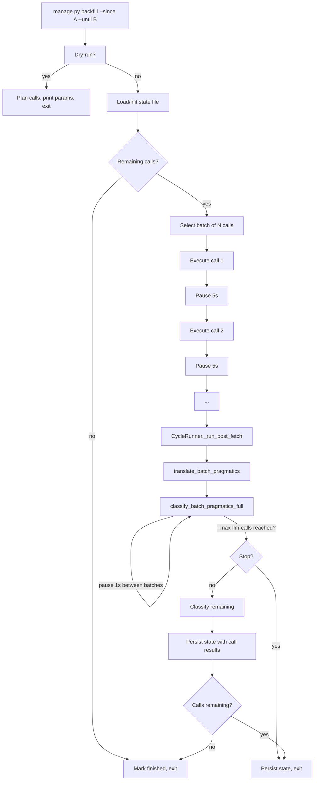

## Goal Capsule

Build the **backfiller**: a batched, resumable, LLM-guarded management command for
filling historical gaps in the dataset. Positioned as a critical tool alongside
the harvest cron (`pushinweight-harvest`) and config-reload — the third leg of
the data operations triad. The backfiller accepts `--since`/`--until` date
ranges, computes its own capacity parameters from the window size, processes
posts in small batches with pauses to coexist with the regular 15-min harvest,
persists progress to a state file for resumability, and classifies posts via the
same LLM pipeline the regular harvest uses — with built-in guards against
overtaxing the LLM API.

Stop conditions: (1) `manage.py backfill --since <iso> --until <iso>` fetches,
attributes, persists, and classifies posts for any historical window, (2) state
files in `data/backfill/` survive failures and enable resume, (3) the backfiller
never blocks the regular 15-min harvest cron, (4) LLM API calls are sequential
with configurable pauses and a hard per-invocation cap, (5) the regular harvest
cycle also produces classified posts (the backfiller and harvest share the same
`CycleRunner`).

---

## Product Contract

### Summary

Combine the resumable backfill command (fetch + persist) with LLM classification
(translate + classify) into one unified backfiller tool. The fetch/persist half
is already built (`manage.py backfill` with `--batch-size`, `--pause`,
`--since`/`--until`, state files). The LLM half is stubbed out in
`CycleRunner._run_post_fetch` — wire the existing v1 functions and add
guardrails. Both halves share the same `CycleRunner`, so the regular harvest
automatically gains classification when the LLM wiring lands.

### Problem Frame

The v2 harvest cycle has two gaps: (a) it can't fill historical data gaps
without manual scripting, and (b) it doesn't run LLM classification so posts
lack discourse, post_type, sentiment, and nationalism labels. The backfiller
solves (a) — it's already built. Wiring the LLM solves (b) for both the
regular harvest and the backfiller simultaneously. The two are one system:
the backfiller is the harvest cycle with date bounds and batching; the LLM
pipeline is the classification step every cycle runs.

### Requirements

**Backfiller (already built):**
- R1. `manage.py backfill --since <iso> --until <iso>` fetches posts for any
  historical window, computing `max_results` and `max_pages` dynamically from
  window size with a configurable safety margin.
- R2. Batched execution: `--batch-size N` limits how many harvest calls run
  per invocation, with `--pause SECONDS` between calls so the regular cron
  can grab the pipeline lock between batches.
- R3. Resumable: state file in `data/backfill/<epochs>.json` tracks completed
  call IDs, total posts inserted, and errors. Failed calls are retried on
  the next invocation. `--status` prints progress; `--reset` starts over.
- R4. Precision timestamps: `--since`/`--until` accept `YYYY-MM-DD` or
  `YYYY-MM-DDTHH:MM:SS`.

**LLM classification (to build):**
- R5. After fetch + attribute + persist, the cycle runs translate on all new
  posts (writes `text_en` / `text_zh_cn`).
- R6. After translate, the cycle runs classify on all new posts (writes
  `PostBrandSignal` and `PostBrandDiscourse` rows).
- R7. LLM calls are sequential with a configurable pause between batches
  (`X_MONITOR_LLM_PAUSE_SECONDS`, default 1s).
- R8. `--max-llm-calls N` on the backfill command stops classification after
  N LLM batches — the hard safety valve. Remaining posts wait for the next
  invocation.
- R9. If translate or classify fails, the cycle continues with a degraded
  marker — one bad LLM call doesn't kill the cycle.

### Scope Boundaries

In scope: `monitor/cycle.py` (`_run_post_fetch` method + LLM guardrails),
`monitor/management/commands/backfill.py`, `x_monitor/apify.py` (already
done — `until_time` support).

Deferred: LLM prompt tuning, classifier model changes, translation quality
improvements (v1 concerns).

Outside: changes to the v1 Flask stack, the Google OAuth flow, or the
dashboard UI.

---

## Planning Contract

### Key Technical Decisions

- KTD1. **Reuse v1 LLM functions without modification.** Import
  `translate_batch_pragmatics` from `x_monitor.translator` and
  `classify_batch_pragmatics_full` from `x_monitor.attribution`. These are
  proven in v1 — wiring change only.
- KTD2. **Classify only new posts.** The post-fetch step receives the list of
  tweet IDs inserted/updated this cycle. Historical posts are never
  re-classified.
- KTD3. **Sequential LLM calls with configurable pause.** The classifier
  already loops one batch at a time (`_CLASSIFY_BATCH_SIZE=20`). We inject
  a `time.sleep(pause)` between batches, read from
  `settings.X_MONITOR_LLM_PAUSE_SECONDS` (default 1s). No concurrency means
  no concurrent-rate-limit risk; the pause prevents rapid-fire.
- KTD4. **Hard LLM cap on backfill.** `--max-llm-calls N` stops the
  post-fetch classification step after N batches. The regular harvest has
  no cap (it processes ~4 batches per cycle — negligible). The backfiller
  defaults to no cap either, but the operator can set it when processing
  large windows.
- KTD5. **Dynamic capacity from window size.** Already built —
  `_compute_params()` derives `max_results` and `max_pages` from
  `(gap_hours × 2,350 posts/day ÷ 6 calls)` with a 2× safety margin.
- KTD6. **State file keyed on epoch bounds.** `data/backfill/<since>-<until>.json`
  survives across invocations. Different windows have separate state files.

### High-Level Technical Design

### Implementation Units

#### U1. Wire translate + classify into CycleRunner._run_post_fetch

- **Goal:** Remove the STUBBED marker and call the real LLM functions.
- **Requirements:** R5, R6, R9.
- **Dependencies:** None.
- **Files:**
  - `monitor/cycle.py` — replace `_run_post_fetch` stub with real calls to
    `translate_batch_pragmatics` and `classify_batch_pragmatics_full`
- **Approach:** In `_run_post_fetch`, after attribution + persistence:
  1. Collect tweet IDs + text for all new posts from this cycle.
  2. Call `translate_batch_pragmatics(tweets)` — writes `text_en`/`text_zh_cn`
     via ORM updates. Already handles batching internally (20 posts/batch).
  3. Call `classify_batch_pragmatics_full(tweets, brand_registry)` — writes
     `PostBrandSignal` and `PostBrandDiscourse` rows.
  4. Wrap each call in try/except; on failure, log the error, set a degraded
     marker, and continue.
  5. Update the run summary counters (`n_translated`, `n_classified`).
- **Patterns to follow:** `x_monitor/run.py:_run_post_fetch` for call
  signatures and error handling.
- **Test scenarios:**
  - Happy: A cycle with 10 new posts calls translate, then classify.
    `n_classified` > 0 in the run summary.
  - Happy: `PostBrandSignal` rows exist for classified posts after the cycle.
  - Edge: translate fails → classify still runs → degraded marker set.
  - Edge: classify fails → cycle completes with degraded marker, posts
    still persisted (without labels).
  - Edge: 0 new posts → post-fetch is a no-op (no LLM calls).
- **Verification:** Run a cycle against a test DB with a few posts. Verify
  `PostBrandSignal` and `PostBrandDiscourse` rows exist.

#### U2. Add LLM guardrails — pause between batches, max-llm-calls cap

- **Goal:** Prevent overtaxing the LLM API during backfill runs.
- **Requirements:** R7, R8.
- **Dependencies:** U1.
- **Files:**
  - `monitor/cycle.py` — read `X_MONITOR_LLM_PAUSE_SECONDS` from settings
    (default 1s), `time.sleep(pause)` between classifier batches; track
    LLM call count and stop when `_max_llm_calls` limit reached
  - `monitor/cycle.py` — add `_max_llm_calls` parameter to `CycleRunner.__init__`
  - `monitor/management/commands/backfill.py` — add `--max-llm-calls` flag;
    add `--classify-batch-size` flag to override the default 20
- **Approach:**
  1. In `_run_post_fetch`, after each `classify_batch_pragmatics_full` batch:
     `time.sleep(settings.X_MONITOR_LLM_PAUSE_SECONDS)`.
  2. `CycleRunner.__init__` accepts `_max_llm_calls: int | None`. The
     post-fetch step increments a counter per LLM call. When the limit is
     reached, classification stops — remaining posts are persisted without
     labels and will be picked up by the next invocation.
  3. Expose `_CLASSIFY_BATCH_SIZE` via `settings.X_MONITOR_CLASSIFY_BATCH_SIZE`
     so it can be tuned without code changes.
- **Test scenarios:**
  - Happy: With `--max-llm-calls 2`, a backfill run stops after 2 LLM
    batches. Remaining posts are persisted without labels.
  - Happy: Regular cron (no `--max-llm-calls`) classifies all new posts.
  - Edge: `X_MONITOR_LLM_PAUSE_SECONDS=0` disables the pause (for testing).
  - Edge: `--max-llm-calls 0` skips classification entirely.
- **Verification:** Run backfill with `--max-llm-calls 2`. Verify only 2
  LLM calls fire in the logs. Run again — remaining posts are classified.

---

## Verification Contract

- `manage.py backfill --since 2026-07-22 --dry-run` computes params and
  plans calls without spending budget.
- `manage.py backfill --since 2026-07-22 --batch-size 2` fetches, persists,
  translates, and classifies posts. State file created in `data/backfill/`.
- `manage.py backfill --since 2026-07-22 --status` shows progress.
- `manage.py backfill --since 2026-07-22 --max-llm-calls 2` stops
  classification after 2 LLM batches.
- `manage.py run_cycle` against a DB with new posts runs translate + classify
  and writes `PostBrandSignal` + `PostBrandDiscourse` rows.
- Regular 15-min harvest cron continues to run without interference.
- Dashboard feed rows show classification pills.
- `python manage.py check` exits 0.

## Definition of Done

- `_run_post_fetch` is no longer stubbed — translate + classify run on every
  cycle.
- The backfill command is resumable (`--status`, `--reset`, state files).
- LLM guardrails are active: sequential calls, configurable pause, hard cap.
- Regular harvest cycles produce classified data.
- Backfill cycles also produce classified data (shared CycleRunner).
- The backfiller is documented as the third critical data-ops tool alongside
  `pushinweight-harvest` and the config-reload agent.
