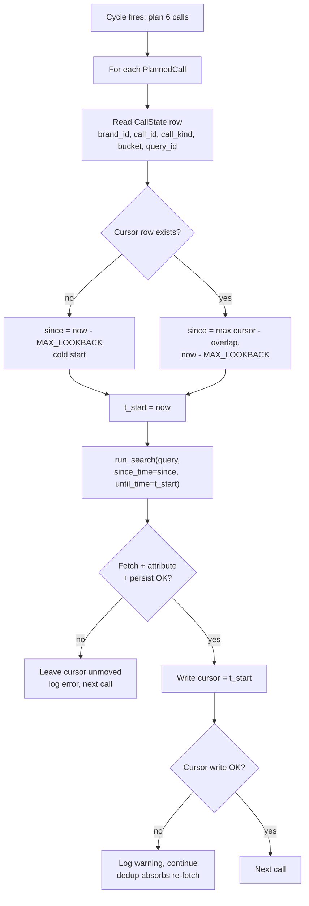

# fix: Restore incremental harvest cursor in v2 CycleRunner

**Created:** 2026-07-27
**Plan depth:** Standard
**Origin:** debugging session 2026-07-27 (no upstream brainstorm; `ce-plan-bootstrap`)

---

## Summary

The v2 Django harvest collects roughly **half** the posts per day that the v1
Flask harvest did. A systematic stage-by-stage diff of the two implementations
(they share the query planner, the `apify.py` client, `config.yaml`, and the
per-call caps, so the difference set is bounded and enumerable) found **two
independent causes**:

1. **No incremental cursor.** v1 read `call_state.last_completed_at` before each
   call, converted it into a `since_time` floor, and swept the whole window since
   the last cycle. v2 passes `since_time=None` in production, so every 15-minute
   cycle re-requests the newest ≤50 posts per query with no time floor — cycles
   heavily overlap and anything that scrolls past that slice between cycles is
   lost forever.
2. **No quote-tweet harvest.** v1 ran a second ingest channel every cycle
   (`get_tweets_by_ids` → `get_quote_tweets` → `_ingest_quote_tweets`) that
   inserted quote-tweet posts. v2 never calls either endpoint. In the v1 era,
   quote-derived posts were **24% of stored volume**; in v2 that channel is
   contributing zero.

This plan fixes cause 1 (the cursor), guards the query-length cap that the fix
would otherwise silently breach, and adds a regression-net test plus a full
lifecycle test. Cause 2 is scoped as a separate follow-up — it is a distinct
feature port, not a regression fix, and mixing them would make neither
verifiable.

---

## Problem Frame

**Symptom.** Dashboard "total posts per day" dropped ~50% after the 2026-07-23
cutover to the prod Postgres stack.

**Measured evidence** (genuine harvest time on both sides — v1 SQLite
`fetched_at` is real; v2 prod `fetched_at` for 7/25 is real, after the 7/23–24
backfill spike settled):

| Stack | Window | Posts/day |
| --- | --- | --- |
| v1 (Flask + SQLite) | 7/19, 7/20, 7/21 | 1,995 / 2,256 / 2,425 |
| v2 (Django + Postgres) | 7/25 | ~1,150 |

The drop is **uniform across brands** (deepseek, glm, and qwen all roughly
halved on 7/25) — not a per-brand keyword or attribution loss.

### Cause 1 — missing incremental cursor

`monitor/cycle.py` `_fetch_tweets` (line ~499) reads `since_time` only from
`settings.X_MONITOR_CYCLE_SINCE_TIME`, which the production cron never sets —
only the backfill command does. `CycleRunner` contains **no reference to
`CallState`** in either direction: it never reads the cursor and never advances
it. v1 (`x_monitor/run.py:1189` read, `:1419` write) does both.

Because `since_time` is `None`, `x_monitor/apify.py:335-350` injects no time
operators at all, so each cycle issues a bare `queryType=Latest` query and takes
the newest ≤100 per call. Consecutive cycles return nearly the same posts.

**Corroborating evidence.**

- Prod `call_state` is frozen at `2026-07-23 09:39` — v2 has never written it;
  the rows are a v1 fossil.
- v2's hourly insert rate on 7/25 is dead flat at ~48/hr around the clock. Real
  X chatter has day/night swings; a flat rate is the signature of a per-cycle
  ceiling being skimmed rather than a window being swept.

### Cause 2 — missing quote-tweet ingest channel (deferred)

v1 fires a second set of API calls each cycle that v2 does not implement at all:
`get_tweets_by_ids` (`x_monitor/run.py:1645, 1756`) to refresh quote counts, then
`get_quote_tweets` (`:1664, :1774`) for posts whose quote count grew, feeding
`_ingest_quote_tweets` — which **inserts new posts**, not just metadata.

Measured proof that this channel is entirely dead in v2:

| Era | Total posts | `quoted_status_id` present | `quoted_text` present |
| --- | --- | --- | --- |
| v1 (authored 7/19–21) | 6,686 | 1,586 (24%) | **1,586** |
| v2 (fetched 7/25–26) | 2,274 | 370 (16%) | **0** |

`quoted_text` is zero across **every** v2 row. A clean zero is a code-path
signature, not a data fluctuation: nothing in v2 ever populates it, because the
quote fetch never runs.

### What was ruled out

Verified identical between the two stacks, so none of these contribute:

- **Call planning** — both build the same 6 calls (Call A + B1/B2/B3/C1/C2) from
  the same `config.yaml` specs and the same `brand_keywords WHERE is_primary`
  rows. v1's `apply_skip_order` budget loop never drops a call in practice
  (`x_monitor/run.py:889-916`).
- **Per-call caps** — `max_results=50`, `max_pages=5`, `max_per_page=20` in both.
- **Pagination** — one `run_search` per planned call, `_walk_search` cursor-walks
  identically.
- **Per-brand keywords** — identical counts for all 20 brands (v1 SQLite vs v2
  prod).
- **Search client** — shared `x_monitor/apify.py`, `queryType=Latest` in both.
- **Attribution/persistence** — zero orphan posts in either era (every stored
  post has a brand row); the `_upsert_account` / `_upsert_post` early returns fire
  only on genuinely missing IDs. Filtering is a no-op in both (v1's relevance
  filter was retired under Plan 2026-07-11-001 KTD6; v2 never had one), and both
  drop `_unattributed` items identically.
- **The `transaction.atomic()` per-post rollback in `_persist_items`** — a
  plausible-looking candidate that measurement **refuted**. v2 wraps each post in
  an atomic block (`monitor/cycle.py:622`), so a PROTECT-FK failure on a junction
  row would roll back the whole post where v1 committed the post and only warned
  (`x_monitor/store.py:711-718`). But in prod there are **zero** brand references
  in `posts_brands_signals` or `posts_brands_mentions` that are absent from
  `brands` (33 brands seeded, a superset of `KNOWN_MODELS`), so the FK cannot
  fire; and 1,162/1,163 posts on 7/25 carry signals while 1,163/1,163 carry
  mentions. Attribution is succeeding, not rolling back. Retained as a latent
  fragility in Risks, not a cause.
- **Cadence** — the Render cron fires reliably every 15 minutes.

---

## Requirements

| ID | Requirement |
| --- | --- |
| R1 | Each scheduled cycle MUST derive a `since_time` per call from that call's `call_state.last_completed_at` cursor, and pass a matching `until_time` upper bound. |
| R2 | The cursor MUST advance only after a call's fetch/attribute/persist pipeline completes successfully; a failed call MUST leave the cursor unmoved so the next cycle re-sweeps that window. |
| R3 | A cursor-write failure MUST NOT abort the cycle (log and continue) — `tweet_id` dedup absorbs any re-fetch. |
| R4 | The first window after deploy MUST be clamped to a bounded lookback so a stale cursor cannot request a multi-day sweep that silently truncates against the per-call cap. |
| R5 | Cursor rows MUST be keyed by the same identity tuple v1 used: `(brand_id, call_id, call_kind, bucket, query_id)`. |
| R6 | The operator-supplied `X_MONITOR_CYCLE_SINCE_TIME` / `UNTIL_TIME` settings MUST continue to override the cursor (backfill behavior preserved). |
| R7 | Injecting the time operators MUST NOT push a query over the 512-char cap; an over-cap query MUST be detected and reported rather than silently returning zero results, and MUST NOT advance the cursor. |
| R8 | A regression-net test MUST pin the invariant that broke: a scheduled cycle issues time-bounded queries and advances the cursor. |
| R9 | A full lifecycle test MUST prove the multi-cycle cursor contract end to end (cold start → advance → resume → failure hold). |
| R10 | A regression net MUST pin the harvest surface values this investigation proved UNCHANGED between v1 and v2, so silent drift in call set, caps, keyword coverage, or query-length headroom fails a test rather than quietly reducing collection. |

---

## Key Technical Decisions

**KTD1. Port v1's cursor pattern rather than inventing a new one.**
*(session-settled: user-directed — chosen over a redesign: v1's pattern is
proven in production for months and its failure modes are already documented.)*
Mirror `x_monitor/run.py:1189` (read) and `:1419` (write) semantics exactly,
including the 1-minute `CURSOR_OVERLAP_HOURS` boundary overlap. Governs R1, R2,
R3, R5.

**KTD2. Read and write the cursor through the Django ORM (`core.models.CallState`), not `x_monitor.store.Store`.**
v2's data plane is the ORM; `CycleRunner` already persists posts that way. The
`CallState` model with the correct composite PK already exists. Governs R5.

**KTD3. Clamp the first window to a bounded lookback.**
*(session-settled: user-approved — chosen over seeding `call_state` to deploy
time, and over letting it catch up naturally.)* Compute
`since_time = max(cursor_value, now - MAX_LOOKBACK)`. Prod's cursor is stale by
~5 days; an unclamped sweep would exceed the 50×5 per-call ceiling and truncate
silently — the exact failure class this plan is fixing. Seeding to now was
rejected because it discards the gap deliberately; natural catch-up was rejected
because truncation is silent. Governs R4.

**KTD4. Bound the window explicitly and advance the cursor to the *same* instant used as `until_time`.**
Capture one timestamp per call — `t_bound = now(UTC)` — pass it as `until_time`,
and on success write exactly that value to the cursor. The invariant is that the
value written equals the upper bound actually queried, so consecutive windows
chain precisely.

This deliberately diverges from v1, which is subtly leaky: v1 never passes
`until_time` at all (`x_monitor/run.py:1253-1259`), so `x_monitor/apify.py:349`
defaults the upper bound to `time.time()` at query-build time, while v1 then
writes the cursor with `_now_iso()` captured *after* the fetch
(`x_monitor/run.py:1425`). v1's cursor therefore lands slightly *after* the
window it actually swept, and the 1-minute overlap on the next `since_time` is
what absorbs the difference. Passing an explicit bound removes the reliance on
that slack. The overlap is still kept as defense in depth. Governs R1, R2.

**Correction note:** an earlier draft of this plan claimed t_start "makes the
window provably gapless" and described this as a refinement of v1's write-time
`_now_iso()`. That was wrong on both counts — the overlap applies to the *lower*
bound only, and v1 does not bound the upper end at all. The invariant above
(write == queried upper bound) is what actually closes the chain.

**KTD5. Treat zero inserted as success — except when the query was over-cap.**
The cursor records "we swept through this moment", not "we found something".
Zero-insert calls advance normally, matching v1's documented behavior. The one
exception is an over-cap query (KTD6), where zero results is an *error* wearing a
quiet-window disguise and must not advance. Governs R2, R7.

**KTD8. Pin the cursor identity-tuple semantics.**
Three details that a well-meaning refactor could silently break:
- `PlannedCall.brand_id` is a **planner placeholder**, not a real brand: `"*"` for
  Call A (`x_monitor/query_plan.py:351`), and the first brand in iteration order
  for B/C specs (`:370-379`). Disambiguation between the 6 rows is owned by
  `call_id`. Never re-derive `brand_id` from post-attribution — that would merge
  B/C rows.
- `bucket` is `None` on every v2 planned call, but `CallState.bucket` is
  `TextField(blank=True, default="")` (`core/models.py:923`). Normalize
  `None → ""` on both read and write, mirroring v1's `_NULL_BUCKET_SENTINEL`
  (`x_monitor/store.py:455-459`).
- `query_id` derives from `call_id`, per the v1 convention documented at
  `x_monitor/run.py:199-203`.

Governs R5.

**KTD9. Cursor values cross the ORM boundary as aware datetimes, not epochs.**
`CallState.last_completed_at` is a `DateTimeField` under `USE_TZ=True`, so the
helpers take and return timezone-aware `datetime` objects
(`datetime.now(timezone.utc)`); a naive datetime raises in Django. Convert to a
unix epoch int only at the `run_search` call boundary, since the API wants
epochs. The frozen v1 prod rows were already converted to TIMESTAMPTZ by the
cutover migration, so the read path must **not** re-parse ISO strings. Governs
R1, R5.
`assert_under_length_cap` runs inside `plan_calls` on the *pre-injection* query
(`x_monitor/query_plan.py:346,364`), so it cannot see the ~44 chars the time
operators add. Measured against real prod keywords on 2026-07-27, all 6 calls
currently fit — but **C1 lands at 505/512, only 7 chars of headroom**:

| Call | Base | Post-injection | Headroom |
| --- | --- | --- | --- |
| A | 20 | 64 | 448 |
| C1 | 461 | **505** | **7** |
| C2 | 295 | 339 | 173 |
| B1 | 414 | 458 | 54 |
| B2 | 377 | 421 | 91 |
| B3 | 359 | 403 | 109 |

An over-cap query is the worst possible failure mode here: TwitterAPI.io returns
**zero results with no error** (`x_monitor/queries.py:213-214`), the call looks
like a legitimate quiet window, and under KTD5 the cursor would advance straight
past the skipped span — permanently losing it. So the guard must both report and
withhold the cursor advance (R7). Governs R7.

**KTD6. Guard the 512-char query cap at the post-injection boundary.**
`assert_under_length_cap` runs inside `plan_calls` on the *pre-injection* query
(`x_monitor/query_plan.py:346,364`), so it cannot see the ~44 chars the time
operators add. Measured against real prod keywords on 2026-07-27, all 6 calls
currently fit — but **C1 lands at 505/512, only 7 chars of headroom**:

| Call | Base | Post-injection | Headroom |
| --- | --- | --- | --- |
| A | 20 | 64 | 448 |
| C1 | 461 | **505** | **7** |
| C2 | 295 | 339 | 173 |
| B1 | 414 | 458 | 54 |
| B2 | 377 | 421 | 91 |
| B3 | 359 | 403 | 109 |

An over-cap query is the worst possible failure mode here: TwitterAPI.io returns
**zero results with no error** (`x_monitor/queries.py:213-214`), the call looks
like a legitimate quiet window, and under KTD5 the cursor would advance straight
past the skipped span — permanently losing it. So the guard must both report and
withhold the cursor advance (R7). Governs R7.

**KTD7. Prod runs the harvest as a Render cron job, not Celery.**
`render.yaml:32-41` defines `pushinweight-harvest` on `*/15 * * * *` running
`python manage.py run_cycle --limit-per-call 50`. The Celery beat/worker services
and `CELERY_BEAT_SCHEDULE` (`project/settings.py:210-215`) exist but are not the
harvest path in production. Consequence for this plan: each cycle is a fresh
process with no in-process state, so there is no Celery visibility-timeout
overlap to reason about — but a cron invocation killed mid-cycle (overrun, OOM,
eviction) leaves the cursor unadvanced, which is the safe direction. No
distributed lock is required for correctness; the cursor's success-only advance
is the sole coordination point. Governs R2.

---

## High-Level Technical Design

Per-call cursor lifecycle inside one cycle:



Window continuity across cycles (why the overlap matters):

```
cycle N-1:  [------- swept -------]
                                  ^ cursor = t_start(N-1)
cycle N:                      [------- swept -------]
                              ^ since = cursor - 1min overlap
                              (overlap absorbs boundary-second posts;
                               tweet_id dedup discards the duplicates)
```

---

## Implementation Units

### U1. Add cursor read/write helpers for CallState

**Goal:** Provide ORM-backed cursor accessors that `CycleRunner` can call, with
the clamped-lookback rule in one place.

**Requirements:** R1, R4, R5, KTD2, KTD3, KTD8, KTD9

**Dependencies:** none

**Files:**
- `monitor/cycle.py` (add module-level helpers + lookback constant)
- `tests/test_cycle_cursor_helpers.py` (new)

**Approach:**
1. Add a module constant for the boundary overlap (mirror v1's 1 minute) and one
   for the maximum first-window lookback (a bounded value in the low hours —
   pick the smallest value that comfortably covers one missed beat plus restart
   slack, and record the chosen number in the docstring).
2. Add a read helper taking the five-part identity tuple, returning the clamped
   `since_time`: no row → `now - MAX_LOOKBACK`; row present →
   `max(cursor - overlap, now - MAX_LOOKBACK)`. Normalize `bucket=None → ""`
   (KTD8).
3. Add a write helper `(brand_id, call_id, call_kind, bucket, query_id, t_bound: datetime)`
   that upserts the `CallState` row, swallowing and logging any exception (R3).
   `t_bound` is an aware UTC datetime (KTD9).
4. Derive `query_id` from the planned call's `call_id` (KTD8).

**Patterns to follow:** `x_monitor/run.py:1189-1228` (read + overlap),
`x_monitor/run.py:1418-1440` (write + swallow-and-log);
`core/models.py:910-935` `CallState` field names and composite-PK order;
`x_monitor/store.py:455-459` for the null-bucket sentinel;
`monitor/cycle.py:100-101` `_now_iso` for the aware-UTC idiom.

**Test conventions** (apply to U1–U5): tests live flat in `tests/` as
`test_*.py`; `pytest-django>=4.8` is available and DB-touching tests use
`@pytest.mark.django_db` (see `tests/test_views.py`). Mirror the closest existing
analogue — `tests/test_run_since_cursor.py` — which monkeypatches `plan_calls`,
uses a `MagicMock`/`FakeApify` for the API client, and asserts against
`run_search.call_args_list`. There is no `conftest.py`; add one if the new files
end up sharing a fake client.

**Test scenarios** (`tests/test_cycle_cursor_helpers.py`):
- No cursor row exists → returned `since_time` equals `now - MAX_LOOKBACK`
  (cold start).
- Fresh cursor (a few minutes old) → returned `since_time` equals
  `cursor - overlap`, NOT the lookback floor.
- Stale cursor (5 days old, matching prod) → returned `since_time` is clamped to
  `now - MAX_LOOKBACK`, proving R4.
- Cursor exactly at the lookback boundary → clamp is applied without an
  off-by-one that moves the window backward.
- Write helper creates a row when absent, and updates `last_completed_at` in
  place when present (no duplicate rows for the same identity tuple).
- Written `last_completed_at` is timezone-aware (`.tzinfo is not None`) — the
  single assertion that catches all naive-datetime regressions (KTD9).
- Passing a naive datetime to the write helper is rejected or coerced explicitly,
  not silently stored.
- Read with `bucket=""` matches a row written with `bucket=None`, and vice versa
  (KTD8).
- Write helper raising a DB error is swallowed: the call returns normally and
  emits a warning rather than propagating (R3).
- Two calls differing only by `call_id` maintain independent cursor rows (R5).
- Identity tuple for Call A is `("*", "A", "account", "", "A")` and for B1 is
  `(<wide_net_brands[0]>, "B1", "brand_wide", "", "B1")` — pinning the
  placeholder semantics so a future refactor that re-derives `brand_id` from
  attribution fails loudly (KTD8).

**Verification:** Helper unit tests pass; a stale cursor provably yields a
bounded window.

---

### U2. Wire the cursor into CycleRunner's per-call fetch path

**Goal:** Make scheduled cycles time-bounded and cursor-advancing, restoring v1
behavior while preserving the backfill override.

**Requirements:** R1, R2, R3, R6, KTD1, KTD4, KTD5

**Dependencies:** U1

**Files:**
- `monitor/cycle.py` (`CycleRunner._fetch_tweets` and the per-call loop in `run`)
- `tests/test_cycle_cursor_wiring.py` (new)

**Approach:**
1. In the per-call loop, before fetching: capture `t_start = now` and resolve
   `since_time` via the U1 read helper for that call's identity tuple.
2. Precedence (R6): when `X_MONITOR_CYCLE_SINCE_TIME` / `UNTIL_TIME` are set
   (backfill, operator runs), they win and the cursor is neither read nor
   advanced. Otherwise use the cursor-derived window with `until_time = t_start`.
3. Thread the resolved window into the existing `api.run_search(...)` call —
   the `since_time` / `until_time` parameters already exist and are already
   injected as inline query operators by `x_monitor/apify.py`.
4. After the call's fetch → attribute → persist steps all succeed, advance the
   cursor to `t_start` via the U1 write helper. Do not advance on any of the
   caught error paths (auth, rate limit, server error, generic) that currently
   `return []`.
5. Add a per-call log line recording the resolved window bounds so a truncating
   or unexpectedly wide window is diagnosable from Render logs.

**Execution note:** Implement this unit test-first — the regression net in U3 is
the proof the bug is fixed, so write U2's wiring tests before changing the fetch
path.

**Patterns to follow:** the existing error-handling structure in
`_fetch_tweets` (each exception class logs, appends to `self._errors`, and
returns `[]`) — cursor advance must sit outside those paths.

**Test scenarios** (`tests/test_cycle_cursor_wiring.py`, API client faked):
- A scheduled cycle passes non-`None` `since_time` **and** `until_time` to
  `run_search` for every planned call (the core regression — v2 currently passes
  `None`).
- `until_time` equals the captured `t_start`, and `since_time < until_time`.
- Successful call → a `CallState` row exists afterward with
  `last_completed_at == t_start` (KTD4: fetch-start, not completion).
- Call raising a rate-limit error → cursor is NOT advanced (R2), and the cycle
  continues to the remaining calls rather than aborting.
- Call raising an auth error → cursor not advanced; error recorded in cycle stats.
- Call returning zero tweets but otherwise succeeding → cursor IS advanced
  (KTD5).
- `X_MONITOR_CYCLE_SINCE_TIME` set → that value is used verbatim and the cursor
  is not advanced (R6, backfill unaffected).
- Each of the 6 planned calls gets its own cursor row; advancing one does not
  move another (R5).
- Cursor write failure mid-cycle → cycle still completes and reports success for
  the fetched posts (R3).

**Verification:** With a faked API client, a simulated scheduled cycle issues
bounded queries and leaves exactly one advanced cursor row per successful call.

---

### U3. Regression-net test: pin the collection-rate invariant

**Goal:** Lock in the specific invariant whose absence caused the ~50% decline,
so the cursor cannot be silently dropped again by a future refactor.

**Requirements:** R8

**Dependencies:** U2

**Files:**
- `tests/test_harvest_cursor_regression_net.py` (new)

**Approach:** Pin the observable contract rather than internal call shapes, so
the test survives refactors but fails if the cursor regresses. Assert on three
axes, with each assertion naming the 2026-07-27 incident in its failure message
so a future implementer immediately understands what broke.

1. **No unbounded search.** Across a full simulated scheduled cycle, assert that
   **zero** `run_search` invocations receive `since_time=None` while in scheduled
   mode. This is the single assertion that would have caught the regression on
   the cutover commit.
2. **Cursor liveness.** After a scheduled cycle, `call_state` has a row per
   successful call whose `last_completed_at` is within seconds of the cycle time —
   i.e. the table is live, not a frozen fossil (the prod symptom was a table
   stuck at 2026-07-23).
3. **Window coverage across consecutive cycles.** Run two cycles back to back
   and assert cycle 2's `since_time` is `<=` cycle 1's `until_time` — proving the
   swept windows are contiguous or overlapping, never gapped. A gap here is
   exactly the mechanism that dropped posts.

**Execution note:** Write these assertions so they fail against the pre-fix
code. Confirm that failure explicitly before implementing — a regression net that
passes on the broken revision is worthless.

**Test scenarios:**
- Scheduled cycle: no `run_search` call receives `since_time=None`.
- Scheduled cycle: no `run_search` call receives `until_time=None`.
- Post-cycle: a `call_state` row exists for every call that succeeded.
- Post-cycle: every written `last_completed_at` is recent relative to the run
  (asserting liveness, not a hardcoded date).
- Two consecutive cycles: `since_time(cycle2) <= until_time(cycle1)` — windows
  contiguous, no gap.
- Two consecutive cycles: `since_time(cycle2) > since_time(cycle1)` — the cursor
  actually moves forward rather than re-sweeping from the lookback floor every
  time (which would mask the bug while looking healthy).
- Backfill mode with explicit settings remains exempt from axis 1 (documents that
  the net targets scheduled cycles only).

**Verification:** The suite fails on the pre-fix revision (each assertion for the
right reason) and passes after U2.

---

### U4. Full cursor lifecycle test

**Goal:** Prove the whole multi-cycle contract end to end, including the
cold-start clamp and failure-hold behavior that the unit tests only cover in
isolation.

**Requirements:** R9, R2, R4

**Dependencies:** U2

**Files:**
- `tests/test_harvest_cursor_lifecycle.py` (new)

**Approach:** Drive `CycleRunner` across a sequence of cycles against a faked
API client that records the query window it was handed and returns a scripted
tweet set per cycle. Use a controllable clock so windows are deterministic.
Walk the full state machine: cold start → steady advance → failure hold →
recovery → stale-cursor clamp.

**Test scenarios:**
- **Cold start:** empty `call_state` → first cycle's window starts at the
  lookback floor; a cursor row is created for each successful call.
- **Steady advance:** three consecutive successful cycles → cursor advances
  monotonically; each cycle's window abuts the previous one within the overlap
  tolerance; no gap appears at any boundary.
- **Failure hold:** cycle 2's fetch raises a rate-limit error → cursor stays at
  cycle 1's value, and cycle 3's window therefore re-covers cycle 2's missed
  span (proving no permanent data loss from a transient failure — the property
  that most directly protects collection volume).
- **Recovery:** after the failure-hold cycle succeeds, the cursor resumes normal
  advance from the recovered position.
- **Stale cursor (prod cold-start shape):** seed a cursor ~5 days old, matching
  the frozen prod row, then run one cycle → the requested window is clamped to
  the bounded lookback rather than spanning 5 days (R4/KTD3), and the cursor
  advances normally afterward.
- **Per-call independence:** a failure on one call does not stall the other five
  calls' cursors in the same cycle.
- **Dedup tolerance:** overlapping windows re-deliver a tweet already stored →
  the cycle completes without an integrity error and does not double-insert
  (documents why the overlap in KTD1 is safe).

**Verification:** The lifecycle suite passes and demonstrably exercises
cold-start, advance, failure-hold, recovery, and clamp paths.

---

### U5. Guard the post-injection query length cap

**Goal:** Ensure the time operators can never silently push a query over the
512-char cap, since an over-cap query returns zero results with no error and
would let the cursor skip that window permanently.

**Requirements:** R7, KTD6

**Dependencies:** U2

**Files:**
- `monitor/cycle.py` (`_fetch_tweets` — validate the effective query before the API call)
- `tests/test_cycle_query_length_guard.py` (new)

**Approach:**
1. Build the same effective query string the client will send (base query plus the
   two inline time operators) and measure it against `X_LENGTH_CAP`
   (`x_monitor/queries.py:216`).
2. When it would exceed the cap: do **not** issue the call. Record a distinct
   per-call status (e.g. `length_cap_exceeded`), append to `self._errors`, log at
   error level with the call ID and measured length, and return no items — which
   by R2/KTD5 leaves the cursor unadvanced so the window is retried rather than
   skipped.
3. Reuse `assert_under_length_cap` rather than reimplementing the comparison.

**Execution note:** The failing-first test here is cheap and high value — assert
the guard trips on a synthetic 500-char query before writing the guard.

**Test scenarios** (`tests/test_cycle_query_length_guard.py`):
- A short query (Call A shape, ~20 chars) passes the guard untouched and is sent.
- A query at 461 chars (real C1 length) plus operators = 505 → still under the
  512 cap, so it IS sent (guards against an over-strict guard that would break
  C1 today).
- A synthetic 500-char query plus operators = 544 → guard trips: no API call is
  made, a `length_cap_exceeded` status is recorded, and an error is logged.
- When the guard trips, the cursor for that call is NOT advanced (the window will
  be retried) — the property that prevents permanent data loss.
- When the guard trips on one call, the other five calls in the cycle still run.
- Backfill mode with operator-supplied `SINCE_TIME`/`UNTIL_TIME` is subject to the
  same guard (the operators are the same length).

**Verification:** Guard trips only above the cap; C1's real 505-char post-injection
length still passes; a tripped call leaves its cursor unmoved.

---

### U6. Regression net: pin the unchanged harvest surface

**Goal:** Lock the harvest surface values that this investigation measured as
**identical** between v1 and v2, so future drift in the call set, per-call caps,
brand coverage, or query-length headroom fails a test instead of quietly halving
collection again. U3 pins the cursor behavior that *broke*; this unit pins the
things that were *fine* and must stay fine.

**Requirements:** R10

**Dependencies:** none (independent of U1–U5; can land first)

**Files:**
- `tests/test_harvest_surface_regression_net.py` (new)

**Approach:** Assert against values measured on 2026-07-27, each with a failure
message explaining what a change implies. These are deliberately
"change-detector" assertions — that is the point of a regression net, and the
comment in each should say so, with instructions to update the pinned value
*intentionally* when the change is desired.

Two rules keep the net honest:
1. **Pin the invariant, not the incidental.** Pin the call *set* and *count*,
   per-call caps, that every enabled brand is covered by some spec, and the
   query-length headroom. Do not pin the rendered query text — keyword edits are
   normal and would make the test noise.
2. **Derive from config, compare to literals.** Build the plan through the real
   `plan_calls` path so a planner regression is caught, then compare against
   hardcoded expected values.

**Execution note:** This is a pure-assertion unit with no production change —
write it and confirm it passes on the current revision (unlike U3, which must
fail pre-fix).

**Test scenarios** (`tests/test_harvest_surface_regression_net.py`):
- **Call set is exactly 6:** `plan_calls` returns Call A plus 5 specs, with
  `call_id`s exactly `{A, C1, C2, B1, B2, B3}`. Failure means a call was added or
  dropped — a direct change in collection volume.
- **Call kinds are pinned:** `A` is `account`; `C1/C2/B1/B2/B3` are `brand_wide`.
- **Wide-net flags pinned:** `B1/B2/B3` are wide-net; `C1/C2` are not. A flipped
  flag silently changes each call's token source.
- **Per-call caps pinned at 50 / 5 / 20** (`max_results`, `max_pages`,
  `max_per_page`) as the effective values used by the cycle. Since ceiling =
  `max_pages × max_per_page`, a reduction here caps volume directly.
- **Brand coverage is complete:** every non-sentinel brand in the DB appears in at
  least one spec's `brands`/`wide_net_brands`. Catches the failure mode where a
  brand is added to `brands` but never wired into a query and silently collects
  nothing. Currently 20 brands across the 5 specs (C1:4, C2:2, B1:6, B2:4, B3:4).
- **Query-length headroom (the highest-value assertion):** for every planned call,
  `len(query) + len(" since_time:<10> until_time:<10>")` must be `<= 512`. Assert
  the measured headroom explicitly so the tightest call is visible in the test:
  C1 is the canary at 461 base → 505 post-injection → **7 chars spare**. A keyword
  addition to C1 trips this test instead of silently making TwitterAPI.io return
  zero results for that call forever.
- **Time-operator overhead is pinned at 44 chars**, so if the operator format ever
  changes, the headroom math above is re-derived rather than silently stale.
- **`min_faves` pinned per call** (currently 0 across all specs, and
  `MIN_FAVES_FOR_LIST_CALL` for Call A). A raised threshold would drop posts that
  currently qualify.

**Verification:** Suite passes on the current revision. Manually bumping a
`config.yaml` keyword on C1 by ~10 chars makes the headroom assertion fail —
confirm that once, then revert, to prove the canary actually fires.

---

## Verification Contract

- `pytest tests/test_cycle_cursor_helpers.py tests/test_cycle_cursor_wiring.py tests/test_harvest_cursor_regression_net.py tests/test_harvest_cursor_lifecycle.py tests/test_cycle_query_length_guard.py tests/test_harvest_surface_regression_net.py` passes.
- The full suite (`pytest`) shows no new failures.
- `python manage.py check` passes.
- **Pre-fix proof (required):** the U3 regression net fails on the current
  revision before U2 lands, each assertion failing for the documented reason.
- **Local cycle proof:** a single `python manage.py run_cycle` (bounded via
  `--limit-per-call`) logs a resolved `since_time`/`until_time` per call and
  leaves a fresh `call_state` row per successful call.
- **Post-deploy proof (the real acceptance signal):** after one full day on
  prod, genuine daily insert count (measured by `fetched_at` on rows inserted
  after the fix deploys) rises materially above the current ~1,150/day. Expect
  roughly the **non-quote** share of v1's volume — v1 ran ~2,000–2,400/day with
  ~24% of stored posts coming from the quote channel, so the cursor fix alone
  should land near ~1,500–1,900/day. Reaching full v1 parity requires the
  deferred quote-tweet port as well; do **not** treat short-of-2,000 as a failed
  fix.
- **Cursor liveness on prod:** `max(call_state.updated_at)` advances every ~15
  minutes instead of remaining frozen at 2026-07-23.
- **No silent cap breach:** no call logs a `length_cap_exceeded` status after
  deploy (R7). C1 runs at 505/512 chars post-injection, so this is the canary.

---

## Definition of Done

- [ ] `CycleRunner` reads and advances the `call_state` cursor per call (R1, R2, R5).
- [ ] First window is clamped to a bounded lookback (R4).
- [ ] Cursor-write failures log without aborting the cycle (R3).
- [ ] Backfill/operator `SINCE_TIME`/`UNTIL_TIME` override still wins (R6).
- [ ] Post-injection query length is guarded; an over-cap call reports and does not advance the cursor (R7).
- [ ] Regression net (U3) fails pre-fix and passes post-fix (R8).
- [ ] Full lifecycle test (U4) covers cold start, advance, failure hold, recovery, clamp (R9).
- [ ] Surface regression net (U6) pins call set, caps, brand coverage, and query-length headroom (R10).
- [ ] Whole suite green; `manage.py check` clean.
- [ ] Post-deploy: prod daily insert rate rises toward the non-quote share of v1 volume, and `call_state` advances every cycle.

---

## Risks & Dependencies

| Risk | Mitigation |
| --- | --- |
| First post-deploy cycle requests a wide window and truncates against the 50×5 cap. | KTD3's clamp bounds the first window; U1 and U4 both test the stale-cursor path explicitly. |
| Overlapping windows re-fetch tweets, inflating API credit spend. | Overlap is 1 minute (v1's proven value); `tweet_id` dedup discards duplicates. U4 asserts no double-insert. |
| Cursor advances despite a partial persist failure, creating a real gap. | R2 confines the advance to the all-steps-succeeded path; U2 and U4 test each error path leaves the cursor unmoved. |
| Per-call credit spend rises now that windows are swept fully rather than skimmed. | Expected and desired — this is the restored v1 behavior. `max_pages` still bounds worst-case spend per call; monitor the first day's usage. |
| Orphaned cursor rows if `query_id` derivation drifts from v1's convention. | R5 pins the identity tuple; v1 documented this exact hazard at `x_monitor/run.py:199-203` — worst case is one wider fetch that dedup absorbs. |
| **Latent (not a current cause):** `_persist_items` wraps each post in `transaction.atomic()` (`monitor/cycle.py:622`), so any future PROTECT-FK failure on a junction row would silently roll back the whole post — where v1 committed the post and only warned. Measured clean today (zero orphan brand refs), but a new brand slug emitted by the classifier before it is seeded into `brands` would start silently dropping posts. | Out of scope here. Worth a follow-up that either seeds unknown brands defensively or narrows the atomic block so a junction failure cannot discard the post. Note that `n_inserted` counts `update_or_create` calls, so the run summary would not reveal the loss — only row-count growth would. |

---

## Scope Boundaries

**In scope:** cursor read/write in `monitor/cycle.py`, the clamped first window,
and the four test files above.

### Deferred to Follow-Up Work

- **Port the quote-tweet ingest channel (cause 2 — highest-value follow-up).**
  v2 never calls `get_tweets_by_ids` or `get_quote_tweets`, so the entire
  quote-tweet harvest loop is missing. In v1 this channel accounted for ~24% of
  stored posts, and `quoted_text` is `0` across all v2 rows. Porting it means
  lifting v1's `x_monitor/run.py:1640-1690` (and the daily non-official variant
  at `:1750-1790`) plus `_ingest_quote_tweets`, and the `last_quote_count_seen` /
  `last_quote_fetched_at` tracking columns that already exist on the v2 `Post`
  model. Deliberately separate: it is a feature port with its own call-budget and
  cost profile, and bundling it would make the cursor fix's effect unmeasurable.
- **NULL `created_at_epoch` on ~40% of prod posts** (10,893 / 27,242). A real
  data-quality bug, but it does **not** affect the dashboard, which buckets by
  `created_at` (100% populated).
- **Backfilling the 7/22 → fix-deploy gap.** Posts missed while v2 ran without a
  cursor are not recovered by this change; the existing `backfill` command with
  explicit `SINCE_TIME`/`UNTIL_TIME` is the tool for that.
- **Per-brand volume mix.** Once both causes are fixed, re-check whether any
  genuine brand-mix shift remains beneath the uniform drop.

**Non-goals:** changing query specs, keywords, `max_results`/`max_pages` caps,
beat cadence, or the dashboard's per-day metric definition.

---

## Open Questions

- **Exact `MAX_LOOKBACK` value.** U1 picks the smallest value covering one
  missed beat plus restart slack. If the first post-deploy cycle shows
  truncation, this is the dial to revisit.
- **Whether `created_at` vs `fetched_at` is the right dashboard axis.** Out of
  scope here, but worth deciding separately: bucketing the volume chart by
  `fetched_at` would make collection health directly visible instead of
  entangled with authored-date backfill.

---

## Sources & Research

- `x_monitor/run.py:1177-1228` — v1 cursor read, overlap rationale, `sinceTime`
  URL-param caveat.
- `x_monitor/run.py:1408-1440` — v1 cursor advance: success-only, swallow-and-log.
- `x_monitor/run.py:199-203` — documented orphaned-cursor behavior after a
  `query_id` convention change.
- `monitor/cycle.py:499-539` — v2 `_fetch_tweets`; settings-only `since_time`,
  no cursor.
- `x_monitor/apify.py:280-351` — `run_search` inline `since_time:` / `until_time:`
  operator injection; `queryType=Latest`; `_walk_search` page cap at line 251.
- `core/models.py` `CallState` — composite PK `(brand_id, call_id, call_kind,
  bucket, query_id)`.
- `project/settings.py:210-215` — beat schedule, 15-minute cadence.
- `docs/debug/2026-07-14-160222-call-state-not-persisting.md` — prior
  call_state incident; API test proving URL-param time filters are dropped.
- Prod Postgres (`pushinweight-db`) and v1 SQLite (`data/x_monitoring.db`)
  measurements taken 2026-07-27, as tabulated in Problem Frame.
