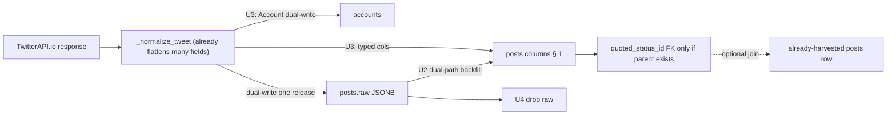

## Goal Capsule

Promote every TwitterAPI.io tweet field currently stored under `posts.raw` (a JSONB blob) into first-class typed `posts` columns, then drop the `raw` column. The literal `posts` table at the end of this work is the table in **§ 1. Goal schema** below — that table is the success criterion, the regression-net target, and the implementer's "are we done?" check.

**Authority hierarchy.** User-confirmed decisions (see Planning Contract) outrank per-row census. Per-row census outrank assumptions about TwitterAPI's full schema. Existing `posts` columns stay; the goal schema is the union of existing columns and the new TwitterAPI-derived columns.

**Stop conditions.**
- Stop the data migration if, after applying the dual-path resolver (§ 1.6) and the exclusion list (§ 1.4), a **goal-schema** source key still cannot be resolved for a non-empty sample of rows that contain that key in either path (investigate census drift — do not invent columns for excluded stamps).
- Stop the harvest code update if its regression net fails (last 50 cycles, >1% schema-shape regression on new posts for the **required** new-column set).
- Stop the `raw` drop if the U4 gate fails: for each new column, among posts fetched in the last hour that had a non-null source value available at write time, the typed column must not be NULL (see U4 — **not** "every new column non-NULL on every fresh row").

**Execution profile.** Deep, four ordered units plus regression net. Schema → backfill → harvest update → drop. Linear, no parallelism between units.

**Tail ownership.** `ce-work` (or `/goal`) implements; this plan does not pre-write code.

**Pre-flight (before U1).** Agent must run a **prod census** (Render PG) sampling `posts.raw` shapes: for each goal column source key, count presence at (a) outer snake_case and (b) `raw->'raw'` camelCase. Attach counts to the PR. Do not begin U2 without this.

---

## 1. Goal schema — the literal `posts` table

This is the final shape. Every column is listed exactly once. Type, nullability, and source key are authoritative. The implementer's last test is `psql \d posts` on prod matches this table's **column names/types/nullability** (modulo indexes and constraint names, which may vary).

### 1.1 Existing columns (preserved)

| column | SQL type | nullable | source | notes |
|---|---|---|---|---|
| `tweet_id` | `text` | NOT NULL (PK) | outer `id` / `tweet_id`; inner `raw->'raw'->>'id'` | unchanged |
| `author_handle` | `varchar(64)` case_insensitive | YES | outer `author_handle`; inner `raw->'raw'->'author'->>'userName'` | unchanged |
| `author` | FK → `accounts.author_id` (`db_column=author_id`) | YES | outer `author_id`; inner `raw->'raw'->'author'->>'id'` | unchanged |
| `text` | `text` | YES | outer / inner `text` | unchanged |
| `lang` | `text` | YES | outer / inner `lang` | unchanged |
| `created_at` | `timestamptz` | YES | parsed from outer `created_at` or inner `createdAt` | unchanged; parser in `_upsert_post` |
| `fetched_at` | `timestamptz` | NOT NULL | harvest-set | unchanged; auto_now_add |
| `like_count` | `integer` | YES | outer `like_count`; inner `likeCount` | unchanged |
| `retweet_count` | `integer` | YES | outer / inner | unchanged |
| `reply_count` | `integer` | YES | outer / inner | unchanged |
| `quote_count` | `integer` | YES | outer / inner | unchanged |
| `in_reply_to_user_id` | `text` | YES | outer / inner | unchanged |
| `quoted_status_id` | `text` (self-FK → `posts.tweet_id`) | YES | outer `quoted_status_id`; inner `quoted_tweet.id` | **FK added** under **policy A** (see § 1.5) |
| `conversation_id` | `text` | YES | outer / inner | unchanged |
| `entities` | `jsonb` | YES | outer / inner | unchanged |
| `source_query_id` | `text` | YES | harvest stamp | **NOT from TwitterAPI** |
| `headline` | `text` | YES | pipeline | out of scope |
| `headline_source` | `text` | YES | pipeline | out of scope |
| `text_en` | `text` | YES | translation | out of scope |
| `text_zh_cn` | `text` | YES | translation | out of scope |
| `lang_detected` | `text` | YES | detection | out of scope |
| `quoted_text` | `text` | YES | outer / inner `quoted_tweet.text` | display denorm |
| `last_quote_count_seen` | `integer` | YES | QT pipeline state | out of scope |
| `last_quote_fetched_at` | `timestamptz` | YES | QT pipeline state | out of scope |
| `created_at_epoch` | `bigint` | YES | outer / inner if present | unchanged |

### 1.2 New columns (TwitterAPI top-level tweet fields)

| column | SQL type | nullable | primary source keys (dual-path; see § 1.6) |
|---|---|---|---|
| `created_at_raw` | `text` | YES | outer `created_at` string if unparsed kept; inner `createdAt` |
| `bookmark_count` | `integer` | YES | outer `bookmark_count`; inner `bookmarkCount` |
| `is_reply` | `boolean` | YES | outer `is_reply`; inner `isReply` |
| `is_retweet` | `boolean` | YES | outer `is_retweet`; inner `isRetweet` / presence of `retweeted_tweet` |
| `is_quote` | `boolean` | YES | outer `is_quote`; inner `isQuote` / presence of `quoted_tweet` |
| `in_reply_to_id` | `text` | YES | outer / inner `inReplyToId` |
| `in_reply_to_username` | `text` | YES | outer / inner `inReplyToUsername` |
| `tweet_type` | `text` | YES | outer / inner `type` |
| `tweet_url` | `text` | YES | outer / inner `url` |
| `tweet_twitter_url` | `text` | YES | outer / inner `twitterUrl` |
| `card` | `jsonb` | YES | outer / inner `card` |
| `place` | `jsonb` | YES | outer / inner `place` |
| `client_source` | `text` | YES | outer / inner `source` (X client string, e.g. "Twitter Web App") — **not** `source_query_id` |
| `view_count` | `integer` | YES | outer / inner `viewCount` |
| `article` | `jsonb` | YES | outer / inner `article` |
| `is_limited_reply` | `boolean` | YES | outer / inner `isLimitedReply` |
| `community_info` | `jsonb` | YES | outer / inner `communityInfo` |
| `display_text_range` | `integer[]` | YES | outer / inner `displayTextRange` (guarded cast) |
| `extended_entities` | `jsonb` | YES | outer / inner `extendedEntities` |
| `quoted_author_handle` | `text` | YES | outer `quoted_author_handle`; inner `quoted_tweet.author.userName` |

### 1.3 New columns (from TwitterAPI `author` — **harvest-time snapshot on the post**)

These are **snapshots at fetch time**, not a live join to `accounts`. Also dual-write the overlapping subset into `Account` via `_upsert_account` (see U3).

| column | SQL type | nullable | source (outer snake first, then author object) |
|---|---|---|---|
| `author_name` | `text` | YES | outer `author_name`; `author.name` |
| `author_followers_count` | `integer` | YES | outer `author_followers_count`; `author.followers` |
| `author_following_count` | `integer` | YES | outer; `author.following` |
| `author_verified` | `boolean` | YES | outer; union of verified flags |
| `author_is_blue_verified` | `boolean` | YES | outer; `author.isBlueVerified` |
| `author_verified_type` | `text` | YES | outer; `author.verifiedType` |
| `author_is_translator` | `boolean` | YES | `author.isTranslator` |
| `author_is_automated` | `boolean` | YES | `author.isAutomated` |
| `author_automated_by` | `text` | YES | `author.automatedBy` |
| `author_description` | `text` | YES | outer; `author.description` |
| `author_location` | `text` | YES | outer; `author.location` |
| `author_media_count` | `integer` | YES | outer; `author.mediaCount` |
| `author_statuses_count` | `integer` | YES | outer; `author.statusesCount` |
| `author_favourites_count` | `integer` | YES | outer; `author.favouritesCount` |
| `author_fast_followers_count` | `integer` | YES | outer; `author.fastFollowersCount` |
| `author_can_dm` | `boolean` | YES | `author.canDm` |
| `author_can_media_tag` | `boolean` | YES | `author.canMediaTag` |
| `author_profile_picture` | `text` | YES | outer; `author.profilePicture` |
| `author_profile_bio` | `jsonb` | YES | `author.profile_bio` object |
| `author_cover_picture` | `text` | YES | `author.coverPicture` |
| `author_pinned_tweet_ids` | `text[]` | YES | `author.pinnedTweetIds` |
| `author_affiliates_highlighted_label` | `jsonb` | YES | `author.affiliatesHighlightedLabel` |
| `author_withheld_in_countries` | `text[]` | YES | `author.withheldInCountries` |
| `author_possibly_sensitive` | `boolean` | YES | `author.possiblySensitive` |
| `author_has_custom_timelines` | `boolean` | YES | `author.hasCustomTimelines` |
| `author_entities` | `jsonb` | YES | `author.entities` |
| `author_twitter_url` | `text` | YES | `author.twitterUrl` |
| `author_type` | `text` | YES | `author.type` |
| `author_url` | `text` | YES | `author.url` |
| `author_created_at_raw` | `text` | YES | `author.createdAt` |
| `author_status` | `text` | YES | `author.status` |

### 1.4 Columns explicitly NOT promoted

- `raw.brand_id` / `raw.brand_ids` / `raw.mentions` — harvest stamps → junction tables
- `raw.classifications` / `raw.signals` — LLM pipeline
- `raw.favorite_count` / `raw.model_id` — v1 legacy
- `raw.headline` / `raw.headline_source` — already typed on `posts`
- `raw.source_query_id` — already typed on `posts`

### 1.5 Self-FK on `quoted_status_id` — **Policy A (canonical)**

```sql
ALTER TABLE posts
  ADD CONSTRAINT posts_quoted_status_id_fk
  FOREIGN KEY (quoted_status_id)
  REFERENCES posts (tweet_id)
  ON DELETE SET NULL
  DEFERRABLE INITIALLY DEFERRED;
```

**Policy A (required — resolves KTD4/KTD5 contradiction):**

1. **Never create stub parent rows** for unharvested quoted/retweeted tweets.
2. When writing `quoted_status_id` (harvest or backfill): if the target `tweet_id` **exists** in `posts`, store the id; **otherwise store NULL**.
3. Always keep display denorms `quoted_text` and `quoted_author_handle` from the payload even when the FK id is nulled.
4. Postgres never has "dangling" FK rows. Verification that expected "orphan ids in raw" were **nulled** is:  
   `SELECT count(*) FROM posts WHERE raw ... quoted id IS NOT NULL AND quoted_status_id IS NULL` can be non-zero;  
   `SELECT count(*) FROM posts p WHERE p.quoted_status_id IS NOT NULL AND NOT EXISTS (...)` **must be 0**.

Add the FK **after** backfill has nulled non-resolving ids (or add FK with `NOT VALID` then validate — prefer: backfill with policy A first, then add constraint).

### 1.6 Dual-path resolver for `posts.raw` (required for U2)

**Live write path today** (`monitor/cycle.py` `_upsert_post` ~line 450+; `x_monitor/apify.py` `_normalize_tweet`):

```text
_normalize_tweet(api_item) → {
  id, text, like_count, author_handle, author_followers_count, ...,
  raw: <original TwitterAPI item with camelCase>
}
_upsert_post(normalized) → posts.raw = that whole object
```

So `posts.raw` is **not** only `raw->'raw'`. Prefer:

| Priority | Path | Example for view count |
|---|---|---|
| 1 | Outer snake_case (normalized) | `raw->>'view_count'` / `raw->>'bookmark_count'` |
| 2 | Outer camelCase (if any) | `raw->>'viewCount'` |
| 3 | Inner TwitterAPI envelope | `raw->'raw'->>'viewCount'` |
| 4 | Inner author | `raw->'raw'->'author'->>'followers'` |
| 5 | else | NULL |

**COALESCE** in SQL for scalar fields. Do not invent values.

**Already extracted in `_normalize_tweet` (do not re-invent in U3):**  
`bookmark_count`, `is_reply`, `is_retweet`, `is_quote`, `quoted_status_id`, `quoted_text`, `quoted_author_handle`, `author_id`, `author_name`, `author_followers_count`, `author_following_count`, `author_verified`, `author_is_blue_verified`, `author_verified_type`, `author_profile_picture`, `author_location`, `author_description`, several engagement counters, nested `raw` pointer.  

**U3 gap is primarily:** persist those keys in `_upsert_post` / fix `_upsert_account` key names (`author_followers_count` vs `author_followers`), plus any keys still missing from normalize (viewCount, card, place, client_source, displayTextRange, etc.).

### 1.7 NULL vs 0 / false semantics

For **newly introduced metric and flag columns** in § 1.2–1.3:

- Missing API key → **SQL NULL** (not `0`, not `false`).
- Present `0` / `false` → store 0 / false.

When changing `_normalize_tweet`, prefer `None` when key absent: e.g.  
`bookmark_count = int(v) if v is not None else None`  
rather than `int(v or 0)`.

**Exception:** existing columns that already coerce to 0 (`like_count` et al.) may keep current behavior for backward compatibility unless a unit test requires otherwise — do not expand 0-coercion to new columns.

---

## 2. Product Contract

### Summary

The `posts` table grows from ~25 typed columns to the full set in § 1; `raw` is dropped after dual-write + backfill. Quote identity is a self-FK under **policy A**. Author fields on `posts` are harvest-time snapshots; overlapping fields also update `accounts`.

### Problem Frame

1. **Schema is invisible** — querying view counts via jsonb is painful and unindexed.
2. **Double-write / dual envelope** — normalized snake_case + inner camelCase both live in `raw`.
3. **Quote graph is weak** — id is plain text today; we want a real join when the parent was harvested, without inventing stubs.

### Requirements

- **R1–R4.** As before: promote TwitterAPI tweet + author fields; keep existing typed homes; `created_at` + `created_at_raw`.
- **R5.** Self-FK on `quoted_status_id` under **policy A** (§ 1.5).
- **R6.** No jsonb column for full quoted/retweeted payloads; display denorms stay; **no stub posts**.
- **R7.** Non-resolving quoted ids → **NULL** on the FK column (not a dangling FK).
- **R8–R9.** Exclusions for stamps / legacy / LLM fields.
- **R10.** Ordered units; dual-write one cycle before drop.
- **R11.** Regression net pins § 1 column set (names/types/nullability), FK policy A, and harvest wire shape.
- **R12.** Dual-path backfill (§ 1.6) is mandatory.
- **R13.** New metric/flag columns use NULL-when-absent (§ 1.7).
- **R14.** Dual-write author snapshot fields to `Account` where the model already has a home (`followers_count`, `is_blue_verified`, `profile_picture`, `description`, …). Fix `_upsert_account` key mismatches.

### Scope Boundaries

**In scope:** schema, backfill, harvest persistence, drop `raw`, tests.  
**Out of scope:** v1 SQLite; translation columns; LLM classifications; new indexes (follow-up).  
**Deferred:** indexes on high-selectivity new columns once query patterns exist.

---

## 3. Planning Contract

### Key Technical Decisions

- **KTD1.** `created_at` (parsed) + `created_at_raw` (verbatim string).
- **KTD2.** Promote sparse keys as nullable columns.
- **KTD3.** Flatten author into `author_*` on posts (snapshots); no leftover `api_payload` jsonb.
- **KTD4 + KTD5 → Policy A.** Self-FK when parent exists; else NULL; no stubs; keep `quoted_text` / `quoted_author_handle` for display.
- **KTD6.** Chunked SQL backfill (10k), dual-path COALESCE.
- **KTD7.** Prod order: schema → backfill (null invalid quoted ids) → add/validate FK if not in U1 → deploy harvest dual-write → wait ≥1 cycle → drop `raw`.
- **KTD8.** Goal schema § 1 is the pin target (column set, not exact constraint names).
- **KTD9.** Pre-flight prod census of outer vs inner key presence before U2.
- **KTD10.** U3 treats normalize as mostly done; focus on persistence + missing keys + Account dual-write.

### High-Level Technical Design



### Assumptions

- **A1.** Wire shape stable; new API fields are follow-up.
- **A2.** Twin outer/inner fields collapse to one column via dual-path COALESCE.
- **A3.** No production **read** of `posts.raw` outside debug; re-grep before U4. Tests may still construct raw — update them in U4/U5.

### Risks

| Risk | Mitigation |
|---|---|
| Wrong JSON path underfills columns | Pre-flight census + dual-path; U2 probe `WHERE col IS NULL AND source key present` = 0 |
| FK add fails on orphan ids | Policy A nulling before validate; never store orphan ids |
| Long locks on free Render PG | 10k chunks; short transactions; run off-peak |
| Uneven deploy (web vs cron) | Dual-write keeps raw until all services on new code ≥1 cycle |
| Normalize `or 0` vs NULL | § 1.7; unit tests for missing keys |
| Account left stale | R14 dual-write |

---

## 4. Implementation Units

### U0. Pre-flight census (blocking)

- **Goal.** Document outer vs `raw->'raw'` key presence for every § 1.2 / § 1.3 source key on prod (or a full dump).
- **Files.** Scratch SQL under `docs/debug/` or PR notes — not a migration.
- **Verification.** Census attached to PR before U2 merges.

### U1. Schema migration — new columns (+ FK optional until after U2)

- **Goal.** Add all nullable columns in § 1.2–1.3. Convert `quoted_status_id` to self-FK **only after** U2 has applied policy A (preferred), **or** add FK in U1 and ensure U2 never writes orphan ids (same effect).
- **Files.** `core/models.py`, `core/migrations/0002_…` (number may shift if other migrations land first).
- **Line anchors (as of 2026-07-27 main):** `Post` in `core/models.py` (~`class Post`); do **not** trust older plan line numbers.
- **Verification.** New columns nullable; FK present and `ON DELETE SET NULL` after U2 policy A.

### U2. Data migration — dual-path backfill

- **Goal.** Fill new columns from `posts.raw` using § 1.6.
- **Files.** `core/migrations/0003_…_backfill_post_columns.py`.
- **Approach.**
  - Per column family: `UPDATE … WHERE col IS NULL AND raw IS NOT NULL`, 10k chunks by `tweet_id`.
  - **quoted_status_id last:** set only when `EXISTS (SELECT 1 FROM posts q WHERE q.tweet_id = resolved_id)`; else NULL.
  - Casts guarded; malformed values → NULL + warning log, continue.
- **Verification.** For each new column:  
  `SELECT count(*) FROM posts WHERE <col> IS NULL AND (<outer key present> OR <inner key present>)` → **0**.  
  `SELECT count(*) FROM posts p WHERE p.quoted_status_id IS NOT NULL AND NOT EXISTS (SELECT 1 FROM posts q WHERE q.tweet_id = p.quoted_status_id)` → **0**.

### U3. Harvest code — persist typed columns (dual-write raw one release)

- **Goal.** New inserts populate § 1 columns without depending on later backfill.
- **Files.** `x_monitor/apify.py` (`_normalize_tweet` — fill **missing** keys only), `monitor/cycle.py` (`_upsert_post` ~450+, `_upsert_account` ~406+).
- **Approach.**
  - Map every normalize key in § 1.2–1.3 into `defaults[...]` on `_upsert_post`.
  - Keep `defaults["raw"] = _make_json_safe(raw)` until U4.
  - `_upsert_account`: use `author_followers_count` / `author_following_count` / `author_is_blue_verified` / `author_profile_picture` / `author_description` (fix the current wrong key names).
  - Apply § 1.7 NULL semantics for new fields.
  - Apply policy A when setting `quoted_status_id`.
- **Tests.** Fixture with full TwitterAPI shape; missing `viewCount` → NULL; malformed `card` → NULL + no crash; existing columns unchanged.

### U4. Drop `raw`

- **Goal.** Remove column and stop writing it.
- **Files.** `core/migrations/0004_…_drop_post_raw.py`, model, `_upsert_post`, `_normalize_tweet` (optional drop of nested `"raw": item` if unused).
- **Gate (not global non-NULL):** for a **core required set** of columns that harvest always has a source for when the API returns a normal tweet (e.g. `created_at_raw` or `is_quote`/`bookmark_count` when keys present in fixture), assert last-hour inserts match source. Sparse columns (e.g. `article`, `place`) are allowed NULL when source key absent.
- **Verification.** No `raw` on `\d posts`; harvest still inserts; U5 green.

### U5. Regression net

- **Files.** `tests/test_post_schema_denormalization.py`.
- **Layers.**
  1. Column pin: goal schema literal vs `connection.introspection` (names, nullability, rough type family).
  2. FK pin: constraint exists, references `posts.tweet_id`, `ON DELETE SET NULL`; **no orphan ids**.
  3. Dual-path / harvest pin: fixture raw → expected typed values; `_normalize_tweet` + mock persist.
- **Wire into default pytest** (not Postgres-only silent skip without banner).

---

## 5. Verification Contract

| After | Check |
|---|---|
| U0 | Census in PR |
| U1 | Columns exist, nullable |
| U2 | Presence probes = 0; orphan FK count = 0 |
| U3 | One cycle / fixture: new cols set; Account updated |
| U4 | No `raw`; harvest green |
| U5 | `pytest tests/test_post_schema_denormalization.py` green |
| Always | `manage.py check --deploy`; full `pytest`; `makemigrations --check` |

---

## 6. Definition of Done

- Migrations applied on prod; harvest services on code that dual-writes then drops `raw` in order.
- `\d posts` matches § 1 column set; no `raw`.
- Self-FK present; policy A enforced in code and data.
- U5 green in CI (or documented until CI exists).
- Short note in `docs/solutions/` (or runtime-errors): columns added, backfill row count, census surprises.
- Optional memory: TwitterAPI wire shape reference.

---

## 7. Sources & Research

- `x_monitor/apify.py` — `_normalize_tweet` (live code; re-open file, ignore stale line numbers)
- `monitor/cycle.py` — `_upsert_post` (~450+), `_upsert_account` (~406+)
- `core/models.py` — `Post`, `Account`
- `core/migrations/0001_initial.py` — migration style
- Prod key census (2026-07-27) — 106 distinct keys; re-census in U0
- Grok Build pre-execution review (2026-07-27) — frontmatter `reviewed_by`

---

## 8. Agent preamble (repeat back before coding)

1. Policy A for `quoted_status_id` (NULL if parent missing; no stubs).  
2. Dual-path raw resolution (§ 1.6); U0 census first.  
3. Normalize already has many fields — extend persistence, don't rewrite from scratch.  
4. NULL-when-absent for new metrics (§ 1.7).  
5. Dual-write Account for overlapping author fields.  
6. Units: U0 → U1 → U2 → U3 → one cycle → U4 → U5.  
7. Scope delivered vs plan promised line in every commit.
