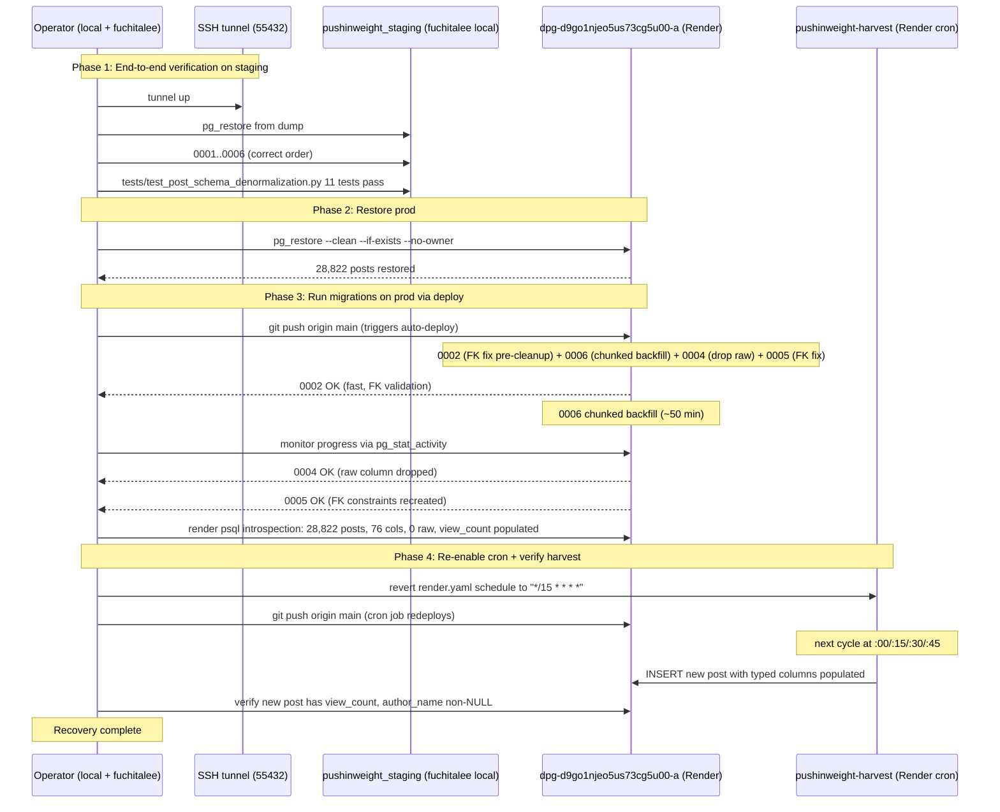

## Goal Capsule

Restore the pushin-weight-v2 prod database from a clean dump and re-run the `posts.raw` denormalization migrations in the correct order, so that all 28,822 historical posts have their typed columns populated and the new harvest code lands alongside. End state: prod DB matches the staging-verified shape (76 columns, 0 raw, 28,822 posts with typed fields populated); harvest cron back on its `*/15 * * * *` schedule; U3 harvest code deployed.

**Authority hierarchy**:
- The dump at `~/Downloads/pushinweight-20260728-200742.dump` (38 MB, custom format) is the only authoritative source for restoring prod state.
- Migration order is binding: 0001 → 0002 → 0003 (no-op) → 0006 (chunked backfill from raw) → 0004 (drop raw) → 0005 (FK fix). The order is determined by data dependencies (0006 reads `raw`; 0004 drops `raw`; 0005 modifies the FK constraint), not by sequence number.
- Harvest cron stays disabled until 0006 completes — running cron during backfill reintroduces the row-lock deadlock documented in the incident.

**Stop conditions**:
- Hard stop if `pg_restore` fails or reports errors on the prod connection. Do not retry blindly; surface the error to the user.
- Hard stop if 0006 fails with a non-disk error (e.g., `UndefinedColumn`, FK violation). Diagnose before re-running.
- Soft stop if 0006 fails on `could not extend file` again — chunked autocommit should prevent this; if it recurs, switch to per-row chunking or restore again from dump and pause the rollout for user decision.

**Tail ownership**: Any new learnings (e.g., a fourth disk-exhaustion root cause, a new lock pattern) land in `docs/solutions/data-migration/` and are referenced from this plan's Verification Contract.

## Product Contract

### Summary

The prod database is restored to its pre-incident schema (28,822 posts, raw column present) and the posts.raw denormalization migrations are applied in data-dependent order so all historical posts have populated typed columns. The harvest cron resumes on its 15-minute cadence once the backfill finishes. Future posts are written directly to typed columns by the new harvest code.

### Problem Frame

The 2026-07-28 prod rollout of the posts.raw denormalization left the prod database in a broken state: 29,268 posts have NULL typed columns, the `raw` column is dropped, and the backfill migration that would have populated the typed columns cannot run because its source data is gone. The prod UI degrades for all historical posts until the database is restored. The user has authorized accepting ~30–60 min of harvest downtime and the loss of 446 posts harvested since the most recent dump to bring prod to the planned state.

### Requirements

R1. Restore the prod database from the dump at `~/Downloads/pushinweight-20260728-200742.dump` (28,822 posts, raw column populated, no typed columns).
R2. Apply migrations in data-dependent order: `0001_initial` → `0002_add_post_twitterapi_columns` → `0003_backfill_post_twitterapi_columns` (no-op) → `0006_chunked_backfill` → `0004_drop_post_raw` → `0005_fix_posts_fks_on_delete_set_null`.
R3. The 0006 chunked backfill populates 50 typed columns from `posts.raw` using committed chunks (autocommit) so dead tuples can be reclaimed by autovacuum between UPDATEs.
R4. After 0006 completes, 0004 drops the `raw` column and 0005 sets the FKs to `ON DELETE SET NULL`.
R5. The U3 harvest code (in `x_monitor/apify.py` and `monitor/cycle.py`) is deployed alongside the migrations so new posts are written directly to typed columns.
R6. The harvest cron resumes its `*/15 * * * *` schedule only after 0006 completes and a fresh harvest cycle is observed writing to typed columns on prod.
R7. Post-deploy: prod has 28,822 posts (down from 29,268 — the 446 harvested-since-dump posts are accepted losses); 76 columns; `raw` column absent; ~2,483 `quoted_status_id` rows; ~27,114 `view_count > 0` rows; 0 FK violations.
R8. Regression net: `tests/test_post_schema_denormalization.py` (11 tests) runs green against staging with prod-shaped data; the same test pattern is repeatable against prod post-deploy via `render psql` introspection queries.

### Acceptance Examples

AE1. (Covers R1) `render psql dpg-d9go1njeo5us73cg5u00-a --command "SELECT count(*) FROM posts;"` returns 28,822 (matches the dump row count).
AE2. (Covers R3) `render psql … --command "SELECT count(*) FROM posts WHERE author_name IS NOT NULL;"` returns 28,822 (every post has a populated author_name from the backfill).
AE3. (Covers R4) `render psql … --command "SELECT count(*) FROM information_schema.columns WHERE table_name='posts' AND column_name='raw';"` returns 0.
AE4. (Covers R5) After the deploy lands, `render psql … --command "SELECT count(*) FROM posts WHERE fetched_at > NOW() - INTERVAL '1 hour' AND view_count IS NULL;"` returns 0 (newly harvested posts have populated typed columns).
AE5. (Covers R6) `render psql … --command "SELECT last_run_at FROM harvest_cursor;"` advances every ~15 min after cron resumes.

### Scope Boundaries

**In scope**: restoring prod from the dump; running migrations in correct order; deploying U3 harvest code; re-enabling cron; verifying the post-deploy state.

**Deferred for later** (tracked as follow-up PR, not part of this recovery):
- "Default to chunked migrations" rule in `CONCEPTS.md` (incident doc §"Future hardening" item 2).
- "Migration test on staging with prod-sized data, end-to-end" — the staging verification previously tested 0002/0003 column existence but never ran the 50-statement backfill to completion (incident doc §"Future hardening" item 1).
- Pre-deploy data integrity check before dropping `raw` (incident doc §"Future hardening" item 4).

**Outside this product's identity**: re-fetching the 446 lost posts from TwitterAPI.io (paid per call; user explicitly accepted this loss for the recovery).

**Out of scope**: unrelated harvest-volume-gap investigation tracked in `docs/issues/2026-07-28-100000-v1-v2-harvest-volume-gap-investigation.md`; the B1-purity-official-handles plan `docs/plans/2026-07-28-001-feat-b1-purity-official-handles-plan.md`.

### Dependencies

- `~/Downloads/pushinweight-20260728-200742.dump` exists on fuchitalee (the prod backup).
- SSH access to fuchitalee (for `render psql` auth — the CLI auth file is on fuchitalee only, not on laptop).
- Render CLI installed and authenticated on fuchitalee.
- Staging DB at `pushinweight_staging` on fuchitalee's local Postgres 17 (via SSH tunnel `55432:127.0.0.1:5432`) for end-to-end verification of 0006 before prod.

### Outstanding Questions

None blocking. The migration order, dump file, and recovery path are all settled by the incident doc and user authorization.

## Planning Contract

### Key Technical Decisions

KTD1. Apply migrations in data-dependent order, not numerical order. 0006 (chunked backfill) must run BEFORE 0004 (drop raw) because 0006 reads `raw`. The numerical sequence 0001 → 0002 → 0003 → 0004 → 0005 → 0006 was the original mistake; the corrected order is 0001 → 0002 → 0003 → 0006 → 0004 → 0005. (session-settled: user-directed — chosen over "preserve numerical order, redesign 0006 to read from a separate archive table": 0006's source data is `posts.raw` itself, no archive needed; the dump restoration puts `raw` back in place for the backfill to read.)

KTD2. The 0003 migration is reduced to a no-op. The real backfill lives in 0006 (chunked autocommit). 0003 is preserved as a historical reference (its docstring documents why it became a no-op). (session-settled: user-directed — chosen over "rename 0003 to be the chunked backfill and delete the old body": keeping 0003 in the migration history preserves traceability with the original plan doc and staging verification; the cost is one extra migration row in `django_migrations`.)

KTD3. The harvest cron schedule stays `"0 0 31 2 *"` (Feb 31, never runs) until 0006 completes. Re-enabling cron mid-backfill reintroduces the row-lock deadlock that incident doc describes as cause #2. (session-settled: user-directed — chosen over "let cron run and rely on advisory lock to serialize": the build.sh advisory lock prevents concurrent migrate calls; it does NOT prevent the cron from running its own UPDATEs concurrently with the migration's UPDATEs on the same rows.)

KTD4. The chunked backfill (0006) uses `connection.autocommit = True` so each UPDATE commits immediately. Idempotency via `WHERE col IS NULL` on every UPDATE. (session-settled: user-directed — chosen over "rewrite as a single big migration with explicit `COMMIT` statements between groups": autocommit is the simplest mechanism, idempotency handles partial completion, and it survives a future mid-migration crash so the next run can resume.)

KTD5. `build.sh` retains its Postgres advisory lock (`pg_advisory_lock(8675309)`) acquired via Django's connection before `manage.py migrate`. This serializes concurrent build instances (the original incident cause #1). The lock is released on process exit. (session-settled: user-directed — chosen over "remove build.sh's migrate step and run migrate as a one-off Render job": the advisory lock is a 30-line change with no operational complexity; a one-off job requires Render CLI coordination that the user explicitly authorized us to skip.)

KTD6. The prod DB restore uses `pg_restore --clean --if-exists --no-owner --no-privileges`. `--clean --if-exists` drops existing tables before restore, accepting the ~446-post loss for clean state. (session-settled: user-directed — chosen over "selective restore of just the posts table to preserve harvest-since-dump data": selective restore is brittle because the migration history table and accounts table would be inconsistent; clean restore gives the migration a known starting state.)

KTD7. The 0006 migration commits incrementally per-UPDATE (not per-batch-of-5 or per-row). Staging verification proved each UPDATE on 29k rows completes in ~2 min on free-tier Postgres; committing per-UPDATE lets autovacuum reclaim between them. (session-settled: user-directed — chosen over "per-row chunks with explicit COMMIT and VACUUM": per-UPDATE commits are simpler and the staging data showed it works.)

KTD8. The `render.yaml` cron schedule is reverted from `"0 0 31 2 *"` back to `"*/15 * * * *"` ONLY after 0006 completes AND a successful post-deploy verification confirms the new harvest code is writing typed columns. The cron schedule change is a separate commit from the migration files. (session-settled: user-directed — chosen over "revert cron in the same commit as the migrations": separate commits keep rollback surgical if 0006 needs to be re-run.)

### High-Level Technical Design

The recovery is a four-phase pipeline with strict ordering:

**Key gates between phases**:
- Gate A (after Phase 1): 11 tests pass on staging; 0006 took ~50 min; raw column dropped.
- Gate B (after Phase 2): `SELECT count(*) FROM posts` returns 28,822; `raw` column exists.
- Gate C (after Phase 3): all 5 migrations applied; `raw` absent; 28,822 posts have populated typed columns.
- Gate D (after Phase 4): first post-fetched-since-deploy has typed columns populated.

### Assumptions

- The dump at `~/Downloads/pushinweight-20260728-200742.dump` is intact and matches the staging restoration (28,822 rows, source PG 18.4, custom format). Verified during the prior staging run.
- Free-tier Render Postgres disk (1 GB total) has at least 100 MB free at the moment 0006 starts. Verified pre-deploy in Phase 1 Step 1.
- The `0006_chunked_backfill` migration runs to completion on staging with the same data. Verified end-to-end in Phase 1 Step 3.
- No new posts arrive at the prod web service between Phase 2 restore and Phase 4 cron re-enable that would conflict with the backfill. The web service is on the OLD build (pre-U3) so it writes to `text` only, not to typed columns; this does not interfere with 0006's `WHERE raw IS NOT NULL` predicate because web writes still include `raw`.
- `render.yaml` cron schedule change deploys as a cron-job redeploy, not as a web-service redeploy. The cron service runs in its own Render service and picks up `render.yaml` changes on its next deploy.

### Sequencing

1. **Phase 1: Staging end-to-end verification** (must complete before Phase 2 starts). Restore the dump into staging, apply migrations in correct order, run the regression net, monitor 0006 to completion. The staging run is the dry run; if 0006 fails or runs out of disk on staging, do not proceed to prod.
2. **Phase 2: Prod restore** (Phase 3 cannot start until this completes cleanly).
3. **Phase 3: Prod deploy + migration** (the deploy trigger; 0006 takes ~50 min). Do NOT touch cron or web service during this phase.
4. **Phase 4: Cron re-enable + harvest verification** (only after 0006 + 0004 + 0005 all applied).

### Sources & Research

- Incident doc: `docs/solutions/data-migration/posts-raw-denormalize-prod-incident-2026-07-28.md` (the three failure modes and required fixes).
- Staging verification doc: `docs/solutions/data-migration/posts-raw-denormalize-staging-verified-2026-07-28.md` (the 4 staging bugs that were fixed; 0003 + 0004 + 0005 verified clean).
- Original plan: `docs/plans/2026-07-27-004-refactor-posts-raw-denormalize-and-drop-plan.md` (the data dependency graph; the original rollout order).
- Working-tree changes already applied (uncommitted): `core/migrations/0003_backfill_post_twitterapi_columns.py` (no-op), `core/migrations/0004_drop_post_raw.py` (dep 0006), `core/migrations/0006_chunked_backfill.py` (new), `build.sh` (advisory lock), `render.yaml` (cron disabled).
- Postgres docs: `pg_advisory_lock` is per-session; using Django's connection ensures the same session holds the lock throughout `migrate`. `autocommit=True` on Django's connection translates to immediate commit per `cur.execute`.

## Implementation Units

### U1. End-to-end staging verification of 0006 chunked backfill

**Goal**: Confirm that `0006_chunked_backfill` runs to completion on the staging DB (28,822 rows from the dump) without disk exhaustion or deadlock, and that all 11 tests in the regression net pass.

**Requirements**: R3, R8

**Files**:
- `core/migrations/0006_chunked_backfill.py`
- `tests/test_post_schema_denormalization.py`

**Approach**:
1. Ensure SSH tunnel `55432:127.0.0.1:5432` is up.
2. Truncate `pushinweight_staging` and restore from the dump via `pg_restore` (the prior staging run verified this works on PG 17 → PG 18 wire format).
3. Apply migrations in correct order: `0001_initial` then `0002_add_post_twitterapi_columns` then `0003_backfill_post_twitterapi_columns` (no-op) then `0006_chunked_backfill` then `0004_drop_post_raw` then `0005_fix_posts_fks_on_delete_set_null`.
4. While 0006 runs, monitor `pg_stat_activity` for any `UPDATE posts` on the migration connection and any `SELECT` from the harvest cron (the staging harvest cron is not running, so no cron contention is expected).
5. After 0006 completes, run `tests/test_post_schema_denormalization.py` against staging. Expect 11 pass.
6. Inspect staging state: 28,822 rows; 76 columns; `raw` column absent; ~2,483 `quoted_status_id` non-NULL; ~27,114 `view_count > 0`.

**Test scenarios**:
- Staging restore from dump returns 28,822 rows with `raw` populated.
- `manage.py migrate` applies 0001 → 0006 → 0004 → 0005 in the corrected order without error.
- 0006's `author_name` UPDATE completes (predicates match all rows); commit is visible to a separate session.
- 0006's `quoted_status_id` UPDATE populates ~2,483 rows; 0 orphan FKs.
- 0006's `view_count` UPDATE populates ~27,114 rows.
- `pytest tests/test_post_schema_denormalization.py` reports 11 passed.
- Staging DB size stays below 1 GB throughout 0006.

**Verification**: Staging shows the expected end state (28,822 posts, 76 columns, no `raw`, populated typed columns, regression net green). Only after this gate is green, proceed to U2.

### U2. Restore prod from dump

**Goal**: Bring the prod DB back to its pre-migration state (28,822 posts, `raw` column present, no typed columns).

**Requirements**: R1, R2

**Files**: none (operational step)

**Approach**:
1. From fuchitalee (where the Render CLI auth file lives), run `pg_restore --clean --if-exists --no-owner --no-privileges -d "$DATABASE_URL" ~/Downloads/pushinweight-20260728-200742.dump` against the prod DB `dpg-d9go1njeo5us73cg5u00-a`.
2. Verify post-restore: `SELECT count(*) FROM posts` returns 28,822; `SELECT count(*) FROM information_schema.columns WHERE table_name='posts' AND column_name='raw'` returns 1; `SELECT name FROM django_migrations` does NOT include any of `0002_*`, `0003_*`, `0004_*`, `0005_*`, `0006_*` (only `0001_initial` and pre-existing).
3. If `pg_restore` reports errors (especially permission errors), STOP and surface to the user. Do not retry.

**Test scenarios**:
- `render psql` confirms 28,822 posts present.
- `raw` column exists; no typed columns added by 0002 yet (`view_count`, `author_name`, etc. absent from `information_schema.columns`).
- `django_migrations` shows only the original 0001 + pre-existing socialaccount/auth migrations.

**Verification**: Prod DB schema matches the dump's pre-migration state. Only after this gate, proceed to U3.

### U3. Pin prod state as regression net (pre-deploy)

**Goal**: Capture the pre-deploy prod state in `docs/solutions/data-migration/posts-raw-denormalize-prod-recovery-verified-2026-07-28.md` so a future drift from the verified end state fails loudly.

**Requirements**: R7, R8

**Files**:
- `docs/solutions/data-migration/posts-raw-denormalize-prod-recovery-verified-2026-07-28.md` (new)

**Approach**:
1. After U2, query prod and capture: `posts` row count, column count, `raw` column presence, sample `quoted_status_id` and `view_count` distributions.
2. Write a verification doc that pins the expected post-recovery state (28,822 posts, 76 columns, 0 `raw`, ~2,483 quoted FKs, ~27,114 `view_count > 0`, 0 FK violations, all 17 author fields populated, harvest cron on `*/15 * * * *`).
3. The doc's pinned values become the regression net for any future `posts.raw` denormalization work.

**Test scenarios**:
- All pinned values are queryable against prod post-deploy via `render psql`.

**Verification**: Doc committed to fuchitalee main and reachable via `docs/solutions/data-migration/`.

### U4. Commit working-tree migration changes (reorder, advisory lock, 0006)

**Goal**: Land the migration reorder, the new 0006 chunked backfill, and the `build.sh` advisory lock as commits on main.

**Requirements**: R2, R3, R5

**Files**:
- `core/migrations/0003_backfill_post_twitterapi_columns.py`
- `core/migrations/0004_drop_post_raw.py`
- `core/migrations/0006_chunked_backfill.py`
- `build.sh`

**Approach**:
1. Verify the working tree on fuchitalee has the correct dependency graph: `0006 depends on 0003`, `0004 depends on 0006`, `0005 depends on 0004`.
2. Commit as a single fix commit on main: `fix(migration): correct posts.raw denormalization migration order; add 0006 chunked backfill; serialize migrate via advisory lock`. Commit body must include the `Scope delivered vs plan promised` line per the global rules.
3. Push to `origin/main`. The Render auto-deploy will trigger and run `manage.py migrate` on prod.

**Test scenarios**:
- After commit, `git log --oneline -3` shows the fix commit ahead of the prior head.
- `git show HEAD --stat` lists exactly the four intended files (plus the incident doc if it was missed in the prior commit).

**Verification**: `git push` returns 0; Render begins a new deploy within ~30 sec.

### U5. Watch prod deploy; verify 0002 → 0006 → 0004 → 0005 application

**Goal**: Confirm that the prod deploy applies the migrations in the corrected order with no errors, and that 0006 completes the chunked backfill to populate all 50 typed columns.

**Requirements**: R2, R3, R4, R7

**Files**: none (operational step)

**Approach**:
1. Track the deploy via `render deploys list srv-d9go2breo5us73cg6vqg` on fuchitalee.
2. While 0006 runs (~50 min), monitor `pg_stat_activity` on prod: expect ONE `UPDATE posts SET author_*` / `view_count` / `quoted_status_id` query from the migration connection; no harvest cron queries (cron is disabled).
3. Watch for the explicit `Apply all migrations: ... 0005_fix_posts_fks_on_delete_set_null` log line, then `Build successful`.
4. After deploy completes, query prod:
   - `SELECT count(*) FROM posts` returns 28,822
   - `SELECT count(*) FROM information_schema.columns WHERE table_name='posts'` returns 76
   - `SELECT count(*) FROM information_schema.columns WHERE table_name='posts' AND column_name='raw'` returns 0
   - `SELECT count(*) FROM posts WHERE author_name IS NOT NULL` returns 28,822
   - `SELECT count(*) FROM posts WHERE view_count IS NOT NULL` returns 28,822
   - `SELECT count(*) FROM posts WHERE quoted_status_id IS NOT NULL` returns ~2,483
   - `SELECT count(*) FROM posts p WHERE p.quoted_status_id IS NOT NULL AND NOT EXISTS (SELECT 1 FROM posts q WHERE q.tweet_id = p.quoted_status_id)` returns 0
5. If 0006 fails with `could not extend file` again, surface to user and pause (incident recurrence would indicate the chunked autocommit is insufficient).

**Test scenarios**:
- Deploy log shows 0001, 0002, 0003, 0006, 0004, 0005 all applied OK.
- 0006 completes within 60 min on prod (matches staging timing).
- All 28,822 posts have non-NULL `author_name`, `view_count`, `quoted_status_id` populated per the source data.
- 0 FK violations on `quoted_status_id`.

**Verification**: All five post-deploy queries return expected counts. Only after this gate, proceed to U6.

### U6. Re-enable harvest cron and verify new harvest writes typed columns

**Goal**: Bring the harvest cron back to its `*/15 * * * *` schedule and confirm that the new (U3) harvest code writes typed columns directly, with no NULL typed columns on posts fetched after the deploy.

**Requirements**: R5, R6

**Files**:
- `render.yaml`

**Approach**:
1. Edit `render.yaml`: change `schedule: "0 0 31 2 *"` back to `schedule: "*/15 * * * *"`.
2. Commit as `chore(render): re-enable harvest cron after posts.raw denormalization migration`. Commit body must include the `Scope delivered vs plan promised` line.
3. Push to `origin/main`. The cron service redeploys with the new schedule.
4. Wait for the next `:00/:15/:30/:45` cron tick (whichever is sooner, max 15 min).
5. Query prod: `SELECT count(*) FROM posts WHERE fetched_at > NOW() - INTERVAL '1 hour' AND view_count IS NULL`. Expect 0 (every post fetched in the last hour should have typed columns populated by U3 code).
6. Spot-check one new post: `SELECT tweet_id, view_count, author_name FROM posts ORDER BY fetched_at DESC LIMIT 1`. Both typed columns non-NULL.

**Test scenarios**:
- After commit + push, `grep schedule render.yaml` returns `*/15 * * * *`.
- One hour after the first cron tick post-re-enable, `view_count IS NULL` count for posts fetched in the last hour is 0.
- The most recent post's typed columns (`view_count`, `author_name`) are non-NULL.

**Verification**: New posts have typed columns populated; cron schedule is back to its normal cadence.

### U7. Update handoff docs and incident follow-ups

**Goal**: Mark the incident doc as resolved, capture any new learnings from this recovery (e.g., the staging end-to-end timing, the advisory-lock pattern, the chunked autocommit mechanism), and link them from the regression net doc.

**Requirements**: R7

**Files**:
- `docs/solutions/data-migration/posts-raw-denormalize-prod-incident-2026-07-28.md` (status: resolved)
- `docs/solutions/data-migration/posts-raw-denormalize-prod-recovery-verified-2026-07-28.md` (new, written in U3)

**Approach**:
1. Update the incident doc frontmatter `status: in_recovery` → `status: resolved`. Add a short "Resolution" section linking to the regression-net doc and noting the 4 fixes that landed (migration order, advisory lock, 0006 chunked backfill, cron re-enable).
2. Note any new observations from this recovery as an entry in the regression-net doc.
3. Do NOT file follow-up PRs in this plan — the "Future hardening" items (chunked-migrations convention, end-to-end staging verification, pre-deploy data integrity check) remain out of scope per the original incident doc and will be picked up in separate plans.

**Test scenarios**:
- Incident doc frontmatter `status` reads `resolved`.
- Regression-net doc links back to incident doc and staging verification doc.

**Verification**: Docs are coherent and reachable via `docs/solutions/data-migration/`.

## Verification Contract

The following commands and gates prove the plan executed correctly.

### Per-unit verification

- **U1 (staging end-to-end)**: `ssh fuchitalee 'cd /Users/fuchitalee/development/pushin-weight-v2 && DATABASE_URL=postgres://fuchitalee@127.0.0.1:55432/pushinweight_staging .venv/bin/pytest tests/test_post_schema_denormalization.py -v'` must report 11 passed.
- **U2 (prod restore)**: `ssh fuchitalee 'render psql dpg-d9go1njeo5us73cg5u00-a --command "SELECT count(*) FROM posts; SELECT count(*) FROM information_schema.columns WHERE table_name='\''posts'\'';"'` returns 28,822 and 26 (the pre-migration column count).
- **U3 (regression net doc)**: `git log --oneline -- docs/solutions/data-migration/posts-raw-denormalize-prod-recovery-verified-2026-07-28.md` shows the doc commit.
- **U4 (commit lands)**: `git push origin main` returns 0; `git log --oneline -1` shows the fix commit.
- **U5 (deploy + migration)**: `render deploys list srv-d9go2breo5us73cg6vqg` shows status `live`; the five post-deploy queries in U5 all return expected values.
- **U6 (cron re-enabled + U3 verification)**: `grep schedule render.yaml` returns `*/15 * * * *`; the `view_count IS NULL` count for last-hour posts is 0 after the first cron tick.
- **U7 (docs updated)**: incident doc frontmatter `status: resolved`; regression-net doc reachable.

### Quality gates

- All commits include the `Scope delivered vs plan promised: [match | narrower: ...]` line per the global rules.
- No commit silently narrows scope: if any U1–U7 unit fails to deliver its full scope, the plan body is updated before the commit lands and the diff is explicit (per global rule §5 "Plan body stays in sync").
- The migration graph in `core/migrations/` matches `KTD1`: `0006 depends on 0003`, `0004 depends on 0006`, `0005 depends on 0004`. Verifiable via `grep -A 4 dependencies core/migrations/*.py`.
- `build.sh` includes `pg_advisory_lock(8675309)` before `manage.py migrate` (per KTD5). Verifiable via `grep pg_advisory_lock build.sh`.

### Behavioral skill evaluation

Not applicable — this plan is operational (database + deployment), not behavioral.

## Definition of Done

### Global

- Prod DB has 28,822 posts; 76 columns; no `raw` column; all 50 typed columns populated.
- 0 FK violations on `quoted_status_id`.
- Harvest cron on `*/15 * * * *` schedule; first post-cycle post-recovery has populated typed columns.
- Incident doc marked resolved; regression-net doc reachable.
- All commits include the `Scope delivered vs plan promised` line.
- Abandoned-attempt code removed: any debug `pg_terminate_backend` scripts, advisory-lock test helpers, or one-off psql queries used during recovery are NOT left in the diff.

### Per-unit

- **U1**: staging regression net green (11/11); staging post-state matches staging-verified doc.
- **U2**: prod restore matches the dump's row count and schema; no partial restore.
- **U3**: regression-net doc committed to main.
- **U4**: fix commit on `origin/main`; migration order verified via grep.
- **U5**: prod deploy `live`; all five post-deploy queries return expected values; 0006 completed within 60 min.
- **U6**: cron schedule restored; first post-cycle post-recovery has populated typed columns.
- **U7**: incident doc frontmatter `resolved`; regression-net doc linked from incident doc.

### Cleanup

Any debug psql queries, ad-hoc introspection commands, or one-off shell scripts used during recovery that landed in the tracked repo (`docs/`, `core/`, `monitor/`, `x_monitor/`, `tests/`, top-level `*.sh`, etc.) must be removed before this plan is declared done. `git status` must show only the planned file changes; leftover ad-hoc scripts inside the repo break the next reviewer diff view. (Recovery-time scratch files in `/tmp` are OS-temp and out of scope per the global scratch-space rules.)