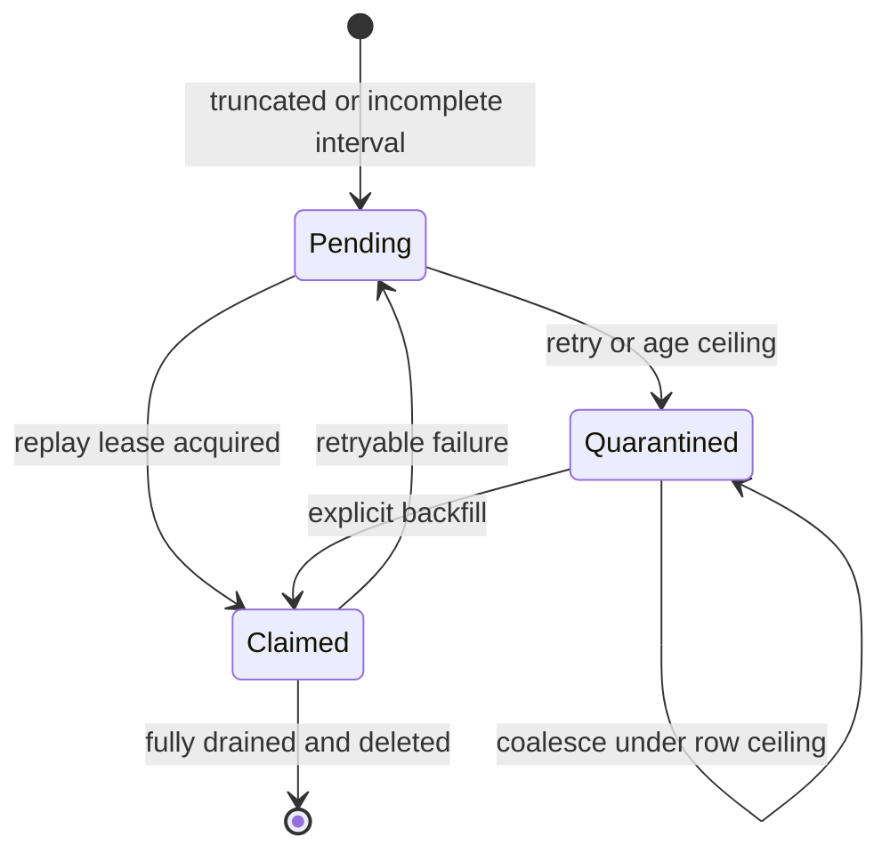
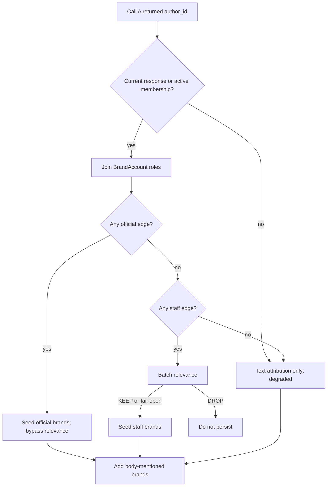

# Harvester Near-Real-Time Delivery and Recall - Plan

## Goal Capsule

- **Objective:** Reduce the time from a TwitterAPI response containing an eligible X post to browser visibility to at most three minutes, without losing older posts when pagination, persistence, or cursor writes fail.
- **Product authority:** The verbatim 14-item review artifact in this plan, the user's 15-minute cadence decision, the user's Call A official/staff policy, and the August 10 translator contract.
- **Implementation authority:** The active requirements and KTDs below supersede the stale August 1 implementation text that previously occupied this file. Current `main` already contains most of that earlier translator/config work.
- **Preserve:** The 15-minute Render schedule, the seven logical A/B/C calls, `Config` as runtime source of truth, the shared `CycleRunner`/backfill core, the August 10 language behavior, one-shot metrics-refresh semantics, and unrelated UI work.
- **Execution profile:** Work in an isolated worktree from current `main`. Pause `pushinweight-harvest` before secret rotation, migrations, or live-state changes. Use PostgreSQL for all cursor, ledger, membership, lease, and migration proof.
- **Stop conditions:** Stop before deployment if the production secret group cannot supply `DATABASE_URL`, if the authorized owners cannot approve protected-ref or Render-secret changes, if PostgreSQL-required tests skip, if a migration cannot roll back safely, if the cost or wall-time guard would be exceeded, or if a change would weaken the protected translator behavior.
- **Tail ownership:** Implementation includes safe rollout, two consecutive live-cycle checks, a statistically labeled latency cohort, repo-local report synchronization, U17 history containment, and durable `tests/posts/` evidence. Render success alone is not completion.

---

## Product Contract

### Summary

The harvester keeps its designed 15-minute polling cadence, but a post already returned by TwitterAPI must not wait behind serial relevance calls, swallowed failures, false pagination completion, or misleading counters before appearing in the app.
The pipeline will prioritize the current live window, record any unfinished older interval as bounded PostgreSQL metadata, persist accepted posts before translation and classification, and expose each latency stage independently.
Call A will keep the compact list query while resolving list membership, author role, and author-owned brands from durable database state.

### Problem Frame

The current pipeline can compound several delays: scheduled calls use smaller caps than `config.yaml`, page exhaustion can be mislabeled complete, held cursors repeatedly fetch the newest portion of a wide window, relevance runs serially on the wrong calls, and the summary overwrites real filtering counters.
An approximately one-hour user-visible delay can therefore be a chain of recall gaps, repeated truncation, blocking pre-persist work, and poor observability rather than the 15-minute schedule alone.
The current app already polls `/feed/` every 60 seconds, so the active target is to make a post durable promptly after the API returns it and prove when the feed and browser observe it.

### Requirements

**Latency and scheduling**

- R9. Keep the 15-minute Render cadence and the seven logical A/B/C call shape unchanged.
- R10. For an eligible post returned by TwitterAPI, the release cohort must show API-response-to-DB p95 at or below 60 seconds, API-response-to-DB maximum at or below 105 seconds, DB-to-`/feed/` maximum at or below 10 seconds, visible-tab browser poll wait at or below 65 seconds, and API-response-to-browser maximum at or below 180 seconds. Every stage maximum and the end-to-end maximum are simultaneous hard gates.
- R11. Report X-created-to-cycle-start and cycle-start-to-page-response separately. The first-page tip sweep for all seven logical calls must complete within 120 seconds of cycle start, and posts returned in the next healthy scheduled cycle must be browser-visible within 20 minutes of X creation. Provider-late may be claimed only when a prior healthy, untruncated request with recorded query bounds covered the post's creation/list window and did not return its tweet ID; every other miss remains harvester recall debt/degradation.

**Recall, cursors, and capacity**

- R12. Every scheduled call must use `cfg.search.max_results`, `max_pages`, and `max_per_page` unless an explicit command or test override is present.
- R13. Page-cap exhaustion with a valid continuation must be `truncated`, and the cycle must never declare an unfinished interval complete.
- R14. Every uncovered interval has exactly one recovery owner. A live cursor may transfer coverage to the PostgreSQL backlog only in the same transaction that durably records the residual and advances `CallState`; rollback leaves the cursor as sole owner.
- R15. Unfinished-window state stores interval and lifecycle metadata only, remains bounded per call, coalesces overlap, and preserves quarantined coverage for explicit backfill rather than caching tweet bodies or silently deleting recall obligations. Saturation or quarantine emits typed degradation plus an operator-visible alert; non-empty quarantine remains explicit recall debt until drained or waived with recorded reason.
- R16. Every write-capable scheduled command, task entrypoint, and explicit historical/backfill run shares one production writer lock. Execution mode controls live-cursor authority, and explicit historical/backfill runs never advance the live cursor.

**Call A attribution and relevance**

- R17. Call A remains the compact `(list:<id>)` query; returned authors are observed immediately, while a complete TwitterAPI list-members snapshot is reconciled after the seven live calls and keyed in PostgreSQL by `(list_id, author_id)`.
- R18. An active Call A official author bypasses relevance and receives every official author-owned brand plus body-mentioned brands.
- R19. A Call A author with no official edge but one or more staff edges is relevance-gated in bounded batches; a kept post receives its staff author-owned brands plus body-mentioned brands.
- R20. Non-A posts never enter this relevance gate; malformed, partial, timeout, or failed relevance responses fail open, degrade the cycle, and do not prevent later calls from persisting.
- R21. Unknown, stale, conflicting, or poisoned membership data cannot grant an official bypass or author-seeded brand attribution.

**Persistence and post-fetch health**

- R22. Post upserts report `n_inserted`, `n_updated`, and `n_persist_failed` truthfully; a repeated tweet never increments `n_inserted`.
- R23. Accepted posts are committed before translation and classification so non-staff work cannot block initial feed visibility. Durable enrichment status distinguishes pending, succeeded, and failed work; `/feed/` exposes that status and the existing row presentation provides a minimal accessible pending/failed signal so absence of a flag row is never interpreted as “classified clean.”
- R24. A configured but unavailable translator or classifier degrades a non-empty cycle and increments typed counters, while an empty cycle is not degraded for having no post-fetch work.
- R25. Translation changes must preserve the August 10 closed language allowlist, language-first prompt, one targeted repair, first-pass text merge, fail-empty residual, and EN/ZH no-op behavior.
- R26. Successful classifier flags persist through the existing Django unsanctioned tables; a successful empty flag list deletes the post's flag row, while failed, malformed, partial, or unknown-only results preserve the prior row and record degradation. Unknown-key dead letters contain only allowlisted identifiers and redacted reasons, never raw model output, post text, provider bodies, credentials, or unbounded evidence.

**Reporting, security, and proof**

- R27. The runtime summary has one executed row per logical call plus separately identified backlog replays, preserves real filtering counters, records typed degraded/alert states including pending and quarantined debt, and includes only server-observable latency clocks. The synchronized cohort joins runtime evidence to `/feed/` and visible-DOM observations by tweet and run identity.
- R28. Structured summaries exported from Render use a strict canonical allowlist, reject unknown fields, and redact database URLs, API keys, authorization headers, cookies, provider bodies, encoded or nested credentials, and credential-like strings before entering `data/runs/` or `tests/posts/`. Evidence retains only run/service/deploy identity, tweet ID when necessary, timestamps, counters, backlog state, and derived latency/cost fields; it omits raw post text, author profiles, screenshots, and provider bodies and has a documented retention/cleanup rule.
- R29. Production database credentials come only from `pushinweight-secrets`; the exposed credential is rotated and invalidated, inline URLs and documentary copies are removed, and available access logs are reviewed without committing sensitive incident details.
- R30. The regression gate includes production-call-chain tests and real PostgreSQL tests with zero required skips; helper-only and SQLite-only passes are insufficient.

### Acceptance Examples

- AE1. **Fresh official post.** Given Call A returns a MiniMax official post with no brand word, when the cycle processes it, then it is committed with MiniMax attribution without a relevance call and appears in a visible browser within R10.
- AE2. **Official plus body brand.** Given the same MiniMax official post mentions DeepSeek, when attribution runs, then MiniMax is author-seeded and DeepSeek is added from body evidence.
- AE3. **Truncated live window.** Given a final permitted page advertises a continuation, including multiple posts in its oldest second, when the live interval is persisted, then overlap-plus-tweet-ID deduplication protects the boundary, the uncovered range has exactly one owner, and backlog transfer plus cursor advancement commit atomically.
- AE4. **Staff relevance failure.** Given a Call A staff batch times out, when the gate fails, then all batch posts fail open, the cycle is degraded, and later calls still persist.
- AE5. **Flag clearing.** Given a post has `scam` and a later successful classifier result has an empty flag array, when persistence completes, then the one-to-one flag row is deleted; a classifier failure instead leaves it intact.
- AE6. **Truthful evidence.** Given two consecutive live cycles, when the report is synchronized, then its run IDs and hashes match Render summaries, all latency stages and filtering counters are present, and injected fake secrets are absent.
- AE7. **Pending enrichment.** Given an accepted post is committed before classification, when `/feed/` can observe it, then durable state reports enrichment as pending rather than clean; success or failure later resolves that state without changing the original insert count.
- AE8. **Ledger saturation.** Given pending and quarantined rows are at cap and a disjoint residual cannot coalesce, when call completion runs, then no new row is created, `CallState` remains sole owner, the cursor does not advance, and capacity degradation plus an alert are emitted.

### Scope Boundaries

- Keep the 15-minute cadence. A schedule change requires a separate costed decision.
- Do not redesign the feed UI. Existing 60-second auto-refresh remains the browser-observation mechanism; the only presentation change is an additive accessible pending/failed enrichment state in the existing metadata area.
- Do not broadly split `monitor/cycle.py`; create focused state/reconciliation/report helpers only where this plan requires them.
- Do not change one-shot metrics-refresh delay or cap semantics.
- Do not revive the v1 Flask, launchd, SQLite, or filesystem cursor paths.
- Do not base this work on the stale `fix/harvester-lang-detected` or `fix/once-metrics-refresh` worktrees.

### Product Contract Preservation

The 2026-08-11 14-item review artifact below is preserved verbatim.
The active R9-R30 requirements resolve its implementation gaps without changing its product behavior.

---

## Planning Contract

### Key Technical Decisions

- KTD9. **Keep cadence and measure the real latency stages.** (session-settled: user-directed — chosen over shortening the cron interval: 15 minutes is intentional and does not explain the post-API delay.) R10 owns the release thresholds.
- KTD10. **Use one PostgreSQL advisory writer lock across every production entrypoint.** `run_cycle`, the Celery task, and explicit backfill share a lock keyed by deployment environment; execution mode, not a second lock, decides live-cursor authority. The lock releases on connection loss. Backfill refuses or waits outside the next scheduled window rather than racing shared posts, flags, reports, or API/LLM budgets. The system never steals a live advisory lock automatically; repeated contention records owner/run context, emits an alert, and routes operators to the halt/runbook path.
- KTD11. **Transfer live coverage atomically to a time-bounded ledger.** A truncated fetch persists accepted posts first, then one outer transaction locks `CallState`, upserts the residual, and advances the live cursor; rollback leaves the live cursor as sole owner. The residual overlaps the oldest returned second and relies on tweet-ID idempotency so same-second ties cannot be skipped. If a narrower safe boundary cannot be derived, ownership of the full original interval transfers to the ledger; provider cursors are not persisted, and repeated no-progress intervals quarantine without deleting coverage.
- KTD12. **Bound the ledger by configuration and refuse unsafe overflow.** Defaults are eight pending rows and four quarantined rows per call, eight automatic attempts, 24 hours before age quarantine, and two replay attempts per cycle. Overlap and adjacency are coalesced under a `CallState` row lock; completed rows are deleted atomically. If a disjoint residual cannot fit, the transfer transaction does not advance `CallState`; the cursor remains sole owner and capacity degradation plus an alert are emitted. Every saturation/quarantine transition writes one redacted `HARVEST_ALERT` ERROR envelope and makes that cron run fail after its durable summary is emitted, so Render's verified cron-failure channel notifies operators without aborting later calls. Debt older than 24 hours requires explicit backfill or a recorded waiver.
- KTD13. **Use one end-to-end scheduled deadline and sweep every live tip first.** Config owns a 13-minute run deadline with a two-minute next-slot reserve and a 120-second target for first-page responses across all seven logical calls. The fetch client exposes page-wise progress: each call's first page is attributed and persisted before deeper pagination can monopolize the cycle. Every API/LLM/post-fetch attempt starts only when its worst-case configured timeout/retry envelope fits the remaining budget. Deadline-limited page walks become truthful residuals; unresolved post-fetch stays durably pending. After the tip sweep, bounded enrichment, deeper pagination, a due list snapshot, and oldest-first backlog replay consume the remaining budget in that order, subject to the daily credit ceiling and KTD12's caps.
- KTD14. **Reconcile the real Twitter list without expanding or blocking Call A.** (session-settled: user-directed — chosen over author-expanded search text: TwitterAPI query length is constrained and the list query must remain short.) The verified `/twitter/list/members` contract supplies 20-member pages with stable `id`/`userName`, `has_next_page`, and `next_cursor`. A Call A response is immediate evidence that its author currently belongs to the queried list; a complete snapshot runs after the seven live calls at most every six hours. Removals apply only after a complete successful snapshot.
- KTD15. **Resolve author role with official precedence.** (session-settled: user-directed — chosen over applying relevance to every curated account: official output always passes and only staff output needs relevance.) One or more official edges seed only official brands and bypass the gate. If no official edge exists, all staff edges are batch-gated and seeded only after KEEP. Body brands are always additive.
- KTD16. **Batch Call A staff relevance by tweet ID without holding unrelated posts.** Official and non-gated accepted posts persist before staff relevance begins. Staff batches contain at most 20 posts, run sequentially under the existing LLM call cap, use `cfg.llm.relevancy_model`, return an ID-keyed KEEP/DROP envelope, and persist each resolved/fail-open batch before starting the next. A batch has a 30-second configured timeout and also fails open before the oldest included post reaches R10's 105-second DB deadline; queued later batches fail open rather than consume that deadline. Missing IDs, duplicate IDs, malformed output, timeout, and exceptions fail open with typed counters.
- KTD17. **Preserve created-vs-updated at the ORM boundary.** `_upsert_post` returns the model and Django's `created` boolean so `_persist_items` can increment exactly one of `n_inserted` or `n_updated`.
- KTD18. **Delete flags only after a valid successful empty classification.** Feed code treats row existence as flagged, so retaining an empty row is incorrect. Mixed known/unknown output persists the known keys and dead-letters the unknown keys; unknown-only or failed output preserves prior state.
- KTD19. **Emit one canonical redacted summary envelope per run.** A reserved line prefix frames a strict schema containing the allowlisted server summary, run ID, service ID, deploy SHA, schema version, and SHA-256 integrity hash. Operator-only synchronization uses the least-privilege Render credential available and only read operations, recomputes the hash, rejects unknown fields and wrong context, and matches each envelope to the service-scoped Render `cron_job_run_ended` event plus deployed-commit record obtained independently through the authenticated API. `(run_id, hash)` provides integrity/idempotency, not standalone authenticity.
- KTD20. **Cut over to group-only secrets before rotation, then contain every reachable copy.** First remove the service-local `DATABASE_URL` in a maintenance deployment and prove web/build/cron connectivity through `pushinweight-secrets` without printing values; then rotate and prove the old credential fails. Group-only cutover, invalidation, documentary cleanup, and sanitized access review unblock the latency deployment. Authorized Git-history/ref/cache/clone containment remains required for full plan completion but runs as U17 without keeping the fixed harvester paused.
- KTD21. **Treat the old U0-U6 prose as historical evidence, not executable work.** Current `main` already has cfg-aware planning, LLM config, factory wiring, and translator regression pins. This plan changes only the remaining gaps and preserves those tests.
- KTD22. **Keep enrichment advisory, visible, and replayable.** This preserves R23's latency contract instead of blocking feed admission on translation/classification. A committed post remains feed-eligible while enrichment is pending or failed, but durable status, `/feed/`, the minimal accessible row state, and summaries never equate flag-row absence with successful clean classification. Pending work is a bounded row-claimed queue drained after each tip sweep; attempts/age and alerts prevent silent accumulation. Backlog replay uses current list membership and `BrandAccount` roles at replay time and records reconciliation/run provenance; historical role reconstruction is out of scope.

### High-Level Technical Design

**Pipeline and visibility flow**

```mermaid
flowchart TB
  Cron[Command or Celery entrypoint] --> Lock[Shared PostgreSQL writer lock]
  Backfill[Explicit backfill] --> Lock
  Lock --> Tip[First page for each of seven live calls]
  Tip --> Route{Call A staff only?}
  Route -->|no| Attr[Resolve official or text brands]
  Attr --> Persist[Persist post and brand edges]
  Route -->|yes| Rel[Deadline-bounded relevance batch]
  Rel -->|KEEP or fail-open| StaffAttr[Seed staff plus body brands]
  Rel -->|DROP| Drop[Do not persist]
  StaffAttr --> Persist
  Persist --> Feed[/feed/ JSON]
  Feed --> Browser[60-second browser refresh]
  Persist --> PostFetch[Translate, classify, flags]
  Tip --> Deep[Deadline-bounded deeper pages]
  Deep --> Route
  Deep --> Roster[Due post-live roster snapshot]
  Deep --> Residual[Atomic coverage transfer]
  Residual --> Replay[Deadline-bounded replay]
  Replay --> Route
```

**Backlog lifecycle**



**Atomic live-window completion**

```mermaid
sequenceDiagram
  participant C as CycleRunner
  participant X as TwitterAPI
  participant P as PostgreSQL
  C->>X: live interval request
  X-->>C: posts plus continuation state
  C->>P: persist accepted posts idempotently
  alt interval drained
    C->>P: transactionally advance CallState
  else truncated
    C->>P: transactionally lock CallState
    C->>P: transfer overlapped residual or full interval to ledger
    C->>P: advance CallState in the same commit
  else transaction fails
    C->>P: rollback; CallState remains sole owner
  end
```

**Call A routing**



### Runtime State Contracts

- `HarvestBacklogWindow` owns call identity, original and remaining bounds, state, reason, attempts, first/last seen timestamps, claim owner/run ID, and quarantine reason. It stores no tweet payload.
- `TwitterListMembership` owns list ID, canonical `Account`, active state, first/last seen timestamps, last complete reconciliation, and source metadata. Brand and role remain owned by `BrandAccount`.
- `CallState` remains the live completed-window cursor and the transaction lock owner for interval normalization.
- `PostEnrichmentState` is a one-to-one live Django model owning separate translation/classification status, attempts, first/last/next attempt timestamps, claim owner/run ID, and bounded redacted error code. It stores no post/provider/model payload; `PostUnsanctionedFlag` continues to own successful classifier flags, and flag-row absence alone has no clean-state meaning.
- At every commit, a time range belongs to either `CallState` recovery or one backlog row, never both. Claims use PostgreSQL row locking with skip-locked semantics, and deadline or crash recovery returns the row to pending without narrowing coverage prematurely.
- All write-capable entrypoints share KTD10's writer lock. Scheduled contention returns a truthful skipped/degraded summary without fetching or mutating cursors; explicit-window mode holds the same writer lock but never owns live cursors.
- `HARVEST_ALERT` is a versioned redacted ERROR envelope for new capacity, quarantine, aged-enrichment, or repeated-lock-contention transitions. U16 must verify its Render cron-failure notification destination and deduplication key before resume.

### Sequencing

1. Complete group-only credential cutover, old-credential invalidation, documentary cleanup, and sanitized access review. If that external work is pending, isolated offline implementation may continue, but migrations, live probes, deployment, and resume remain blocked.
2. Add PostgreSQL backlog/membership state models, data seeds, and the shared writer lock.
3. Add the shared scheduled deadline, page-wise seven-call tip sweep, truthful pagination, live residual creation, and bounded replay.
4. Add post-live roster reconciliation, official/staff attribution, and staff-only relevance batching.
5. Add durable enrichment status and repair persistence counters, post-fetch health, flags, summary schema, and report export.
6. Run the full regression net before any live resume.
7. Resume only after migration and deployment verification, then inspect and report two consecutive cycles.
8. Complete authorized Git-history/ref/cache/clone containment in U17 without re-pausing the fixed harvester unless that operation itself changes live configuration.

---

## Implementation Units

| Unit | Title | Primary files | Depends on |
|---|---|---|---|
| U8 | Cut over and invalidate the exposed credential | `render.yaml`, operations docs | None |
| U9 | Add durable state and single-flight | `core/models.py`, `core/migrations/`, `monitor/run_lock.py` | None |
| U10 | Make fetch completion truthful and replayable | `monitor/cycle.py`, `monitor/backlog.py`, `x_monitor/apify.py` | U9 |
| U11 | Reconcile Call A list membership | `monitor/list_membership.py`, `x_monitor/apify.py` | U10 |
| U12 | Route Call A attribution and relevance | `monitor/cycle.py`, `x_monitor/relevancy.py` | U11 |
| U13 | Make persistence and post-fetch health truthful | `monitor/cycle.py`, flag models | U9, U12 |
| U14 | Define latency and summary schema | `monitor/cycle.py`, `monitor/harvest_summary.py` | U10, U13 |
| U15 | Synchronize redacted Render evidence | `scripts/harvest_cost/` | U14 |
| U7 | Land the strong regression net | `tests/` | U9-U15 |
| U16 | Roll out and prove two live cycles | Render, PostgreSQL, `tests/posts/` | U7, U8 |
| U17 | Scrub secret-bearing history and remnants | Git refs, caches, clone/worktree runbook | U8 |

### U8. Cut over and invalidate the exposed credential

**Goal:** Make the Render secret group authoritative, invalidate the exposed database password, remove current-tree/documentary copies, and prevent live writes during the cutover.

**Requirements:** R29.

**Dependencies:** None.

**Files:**

- Modify `render.yaml`.
- Modify documents containing the exposed URL identified by the repository-wide secret scan.
- Modify `docs/operations/pause-and-resume-harvest-cron.md` with append-only pause/resume evidence.
- Add `tests/test_render_secret_regression_net.py`.

**Approach:**

1. Identify the authorized Render/database owners and declare the maintenance/rollback window.
2. Pause `pushinweight-harvest`, record the event, remove the service-local `DATABASE_URL`, and deploy the group-only configuration while the existing credential is still valid.
3. Prove build, web, and cron database connectivity comes from `pushinweight-secrets` by key name and source only, with an explicit rollback decision if group-only delivery fails.
4. Rotate the managed PostgreSQL credential, verify the old URL cannot authenticate and the group-backed replacement works, and review available Render/PostgreSQL access logs from the exposure window.
5. Remove documentary/current-tree copies and scan all executable and documentation paths; hand the invalid credential fingerprint and exposure inventory to U17 without storing the live or replacement value.

**Patterns to follow:** `render.yaml` `fromGroup` entries and `docs/operations/pause-and-resume-harvest-cron.md`.

**Test scenarios:**

1. Static scan rejects any executable inline PostgreSQL URL and accepts non-secret Render service identifiers.
2. Both web and harvest services retain `pushinweight-secrets` and no service-local `DATABASE_URL` value.
3. Fixtures containing fake database URLs and API keys prove the scan detects secrets without printing them.
4. A sanitized incident checklist records rotation time, old-credential invalidation, and access-log review without secret values.

**Verification:** The old credential is unusable, web and cron connectivity work through the group, the current tree/documentation scan is clean, and the cron remains paused until U16.

### U9. Add durable state and single-flight

**Goal:** Add the PostgreSQL primitives required for bounded interval recovery, Call A membership, flag vocabulary, and non-overlapping scheduled cycles.

**Requirements:** R15, R16, R17, R26, R30.

**Dependencies:** None. U8 remains a deployment blocker even when isolated offline code work proceeds.

**Files:**

- Modify `core/models.py`.
- Add Django migrations under `core/migrations/` for backlog and membership models plus the four flag keys.
- Add `monitor/run_lock.py`.
- Modify `monitor/management/commands/run_cycle.py`, `monitor/tasks.py`, and `monitor/management/commands/backfill.py` at their shared outer execution boundary.
- Modify `x_monitor/config.py` and `config.yaml` for KTD12-KTD14's ledger, 13-minute run, two-minute reserve, 120-second tip-sweep, reconciliation, and replay bounds; U12 adds KTD16's 30-second relevance bound through the same schema.
- Add `tests/test_harvester_state_models.py`, `tests/test_harvester_state_migrations.py`, and `tests/test_cycle_run_lock.py`.

**Approach:** Implement the backlog/membership/flag-vocabulary runtime contracts, enforce interval validity and per-call indexes, seed exactly `marketing_spam`, `scam`, `crypto`, and `unauthorized`, and make `Config` own KTD13's single monotonic deadline budget. Acquire KTD10's common writer lock before any production entrypoint plans calls or claims work. Use row-level skip-locked claims inside that writer boundary and keep cursor authority explicit by execution mode.

**Execution note:** Start with PostgreSQL migration and concurrency tests before wiring `CycleRunner`.

**Patterns to follow:** `core/models.py::CallState`, current Django migrations, and the required-PostgreSQL marker in `tests/conftest.py`.

**Test scenarios:**

1. Fresh migration creates both models and exactly four flag keys; reverse migration leaves pre-existing posts and flags safe.
2. Invalid, inverted, duplicate, overlapping, and adjacent intervals normalize without exceeding KTD12's row bounds.
3. Management-command, Celery-task, and explicit-backfill entrypoints compete for the same advisory writer lock; one owns the run and every loser performs zero API/LLM calls and zero state writes.
4. A crashed lock owner releases automatically when its database connection closes.
5. Membership FK, list/author uniqueness, active-state, and timestamp constraints work on PostgreSQL.
6. A claimed backlog row returns to pending after deadline or connection loss without losing or duplicating its coverage range.
7. Two consecutive lock-contention skips emit owner/run context and an operator alert; no test or runtime path steals a still-live advisory lock.
8. Config validation rejects non-positive or internally impossible run/reserve/tip/relevance budgets, and every consumer receives the same monotonic deadline object rather than its own hard-coded clock.

**Verification:** Migration checks and PostgreSQL state/lock suites pass with zero required skips.

### U10. Make fetch completion truthful and replayable

**Goal:** Use production configuration, report pagination truthfully, and keep fresh delivery moving while preserving every unfinished interval.

**Requirements:** R11-R16.

**Dependencies:** U9.

**Files:**

- Modify `monitor/cycle.py`.
- Add `monitor/backlog.py`.
- Modify `x_monitor/apify.py`.
- Modify `monitor/management/commands/backfill.py`.
- Modify `tests/test_apify.py`, `tests/test_cycle_cursor_helpers.py`, `tests/test_cycle_cursor_wiring.py`, `tests/test_harvest_cursor_lifecycle.py`, `tests/test_harvest_cursor_regression_net.py`, and `tests/test_cycle_runtime_constants.py`.

**Approach:**

1. Resolve search caps from `self.cfg.search` with explicit Django/command overrides first; caps remain per-call ceilings, while KTD13's shared deadline may stop earlier only by returning truthful truncation.
2. Refactor the search client around page-wise progress so the first page for all seven logical calls is fetched, attributed, and persisted before any call walks deeper continuation pages.
3. Stamp every normalized tweet with the wall/monotonic receipt time of the exact page that carried it, and preserve only tweet ID plus receipt/commit clocks in release evidence.
4. Return `truncated` when the final allowed page still has a valid continuation or when the page/deadline guard stops a walk.
5. Keep per-item upserts idempotent, then define one call-completion transaction that locks `CallState`, transfers exactly one overlapped residual owner to the ledger, and advances the cursor under KTD11. If the ledger is saturated and cannot coalesce, roll back transfer/advance and alert under KTD12.
6. After the tip sweep and bounded enrichment/deeper-page work, claim and replay through the same fetch/attribute/persist core until KTD12's replay cap or KTD13's scheduled deadline, whichever comes first.
7. Extend explicit backfill to claim quarantined intervals without advancing live cursors.

**Execution note:** Add characterization coverage for the unsafe `max_pages` fall-through before changing it.

**Patterns to follow:** `_cursor_key`, `_read_cursor_since`, `_advance_cursor`, `plan_calls_for_cycle`, and current backfill call reuse.

**Test scenarios:**

1. Underfilled final page plus continuation returns `truncated=True`.
2. Scheduled A/B/C calls capture `config.yaml` caps; explicit command overrides win.
3. A truncated live interval commits new posts, transfers exactly one overlapped residual interval, and advances the live cursor atomically; no committed state leaves the cursor and ledger owning the same range.
4. Multiple capped tweets sharing the oldest second are recovered by deliberate one-second overlap and tweet-ID idempotency; missing or invalid oldest-post time transfers the full interval without deleting coverage.
5. Crash after post persistence but before coverage transfer rolls back the ledger/cursor decision and safely replays through tweet-ID idempotency.
6. Repeated failure reaches retry or age quarantine; coalescing keeps pending and quarantined rows within KTD12.
7. Explicit historical and quarantined backfills never advance live `CallState`.
8. Cursor-write failure degrades both call and cycle, including a successful empty sweep.
9. Deadline exhaustion begins no new replay, returns any safely interrupted claim to pending, and lets the scheduled process finish before the next 15-minute slot.
10. Seven first-page responses and their accepted posts complete the tip sweep inside R11's 120-second gate under the production-call-chain clock; deeper pages cannot delay a later call's first page.
11. A disjoint residual at full ledger capacity creates no row, leaves `CallState` sole owner, does not advance the cursor, and emits typed degradation plus one deduplicated alert.

**Verification:** All cursor suites run on PostgreSQL, and deliberate removal of residual creation or page-cap truthfulness makes a named test fail.

### U11. Reconcile Call A list membership

**Goal:** Keep the real curated X list and canonical database accounts synchronized without lengthening Call A.

**Requirements:** R17, R21.

**Dependencies:** U10.

**Files:**

- Add `monitor/list_membership.py`.
- Add `monitor/management/commands/sync_twitter_list_members.py`.
- Modify `x_monitor/apify.py` with a paginated list-members client.
- Modify `monitor/cycle.py` to observe Call A authors immediately and schedule due reconciliation only after all seven live calls.
- Add `tests/test_list_membership_reconciliation.py` and extend `tests/test_apify.py`.

**Approach:** Follow KTD14's verified contract: request `list_id` plus cursor, parse 20-member pages, identify accounts by stable member `id` with `userName` as mutable metadata, and require consistent `has_next_page`/`next_cursor` completion. Upsert Call A response authors immediately because the list query itself is current membership evidence. Run a due full snapshot after live persistence and only inside KTD13's deadline; mark absent rows inactive only after every page completes successfully. Record one snapshot ID and completion timestamp for atomic activation/removal. Treat unknown accounts and role conflicts as degraded inputs, not authorization.

**Patterns to follow:** `Account`/`BrandAccount` ORM relationships, TwitterAPI cursor pagination in `x_monitor/apify.py`, and the defensive empty-page guard.

**Test scenarios:**

1. Complete multi-page snapshot activates all returned members and deactivates removed members atomically.
2. Partial, empty-lie, timeout, and malformed snapshots leave the last complete active set unchanged and mark degradation.
3. A new Call A response author updates membership observation immediately without waiting six hours, while a due multi-page snapshot never delays the seven live calls.
4. A stale, unknown, or role-conflicting row cannot grant official bypass or author brand seeding.
5. Repeated identical snapshots are idempotent and do not grow membership rows.
6. Member `userName` changes update metadata without changing identity; missing/duplicate member IDs or inconsistent continuation fields reject the snapshot.
7. A due snapshot that cannot fit inside the scheduled deadline defers truthfully without overlapping the next cron slot.

**Verification:** Client, command, and PostgreSQL reconciliation tests pass; the compact Call A query golden tests remain unchanged.

### U12. Route Call A attribution and relevance

**Goal:** Seed official/staff author brands correctly and make relevance a bounded Call A staff-only gate.

**Requirements:** R18-R21, R23.

**Dependencies:** U11.

**Files:**

- Modify `monitor/cycle.py`.
- Modify `x_monitor/attribution.py` only where author provenance must be carried.
- Modify `x_monitor/relevancy.py`.
- Modify `monitor/management/commands/run_cycle.py` to pass `cfg.llm.relevancy_model`.
- Modify `x_monitor/config.py` and `config.yaml` to carry KTD16's 30-second relevance bound through the shared config object.
- Modify `tests/test_attribution.py`, `tests/test_c_relevancy_gate.py`, and `tests/test_relevancy_llm_call.py`.
- Add `tests/test_call_a_role_routing.py`.

**Approach:** Resolve current membership and all current `BrandAccount` edges once per Call A batch, attach author-role plus reconciliation/run provenance before text attribution, and apply KTD15 precedence. Persist official and other non-gated accepted posts first; then send only staff candidates through KTD16's ID-keyed batches and persist each batch before the next. Apply the same current-trust rule during backlog replay; do not infer historical roles that the database does not store.

**Execution note:** Preserve current body-keyword tests before introducing author provenance.

**Patterns to follow:** `attribute_to_brands` author-account input, `BrandAccount` role joins, and the existing relevance parser's keep bias.

**Test scenarios:**

1. Official MiniMax with no brand text persists with MiniMax and zero relevance calls.
2. Official MiniMax mentioning DeepSeek persists both brands with distinct author/body provenance.
3. Staff-only author enters one bounded batch and receives all staff brands only after KEEP.
4. An author official for one brand and staff for another bypasses the gate, seeds only official brands, and can add the staff brand only through body evidence.
5. C1/C2/C3 and all other non-A posts make zero relevance calls.
6. Missing IDs, duplicates, partial response, malformed response, timeout, and exception fail open, degrade, and allow later calls to persist.
7. The configured relevance model reaches the production LLM call even when environment defaults disagree.
8. Replaying an old Call A interval uses current membership/roles, records the snapshot/run provenance, and never grants attribution from a now-stale edge.
9. Official/non-gated posts commit before the first relevance request, and a kept or fail-open staff batch commits before a later staff batch begins.
10. A slow first staff batch times out/fails open at the configured 30-second bound; any queued staff candidate approaching 105 seconds since page receipt fails open and commits before R10's DB maximum.

**Verification:** Call-chain tests capture roles, brands, batch count, model, receipt-to-relevance wait, configured timeout, and failure behavior through `CycleRunner.run`.

### U13. Make persistence and post-fetch health truthful

**Goal:** Report created/updated posts correctly, degrade missing stages, and persist classifier safety flags without weakening translation.

**Requirements:** R22-R26.

**Dependencies:** U9, U12.

**Files:**

- Modify `monitor/cycle.py`.
- Modify `core/models.py` and add a migration for the one-to-one `PostEnrichmentState` contract above.
- Add `monitor/unsanctioned_flags.py` if persistence logic would otherwise duplicate legacy `Store` code.
- Modify `monitor/views.py`, `monitor/static/pw-feed.js`, and `monitor/templates/monitor/home.html` only for the additive enrichment-status wire and minimal accessible row state; preserve layout, filtering, sorting, pagination, and refresh behavior.
- Modify `x_monitor/config.py` and `config.yaml` for bounded pending-enrichment attempts, age, and per-cycle claim count.
- Modify `tests/test_cycle_anomaly_metrics.py` and `tests/test_cycle_error_counters.py`.
- Add `tests/test_django_unsanctioned_flags.py` and keep retired `x_monitor.store`/SQLite flag tests explicitly outside production proof.
- Modify `tests/test_views.py`, `tests/test_pw_feed_formatter.js`, and `tests/test_home_v22_browser.py` for the additive pending/failed/succeeded state.
- Preserve and run `tests/test_translator_lang_detected_compliance.py` and `tests/test_translator_text_en_noop.py`.

**Approach:** Thread the ORM `created` result through persistence, create/update `PostEnrichmentState` before post-fetch, and expose classification status additively through the existing feed formatter and metadata area without changing layout. Claim at most 20 pending states per cycle after the tip sweep, retry at most eight times, and alert/quarantine after eight attempts or 24 hours without calling pending/failed work clean. Mark configured missing clients as typed failure only when kept posts require them, persist valid flags after classification, and apply KTD18's successful-empty delete rule. Reject unknown keys in the Django application layer because the live JSON flag column is not FK-constrained to `UnsanctionedFlagKey`; dead-letter only into the bounded redacted run-summary entry with run ID, tweet ID, stage, known/rejected key names, and reason code—no new payload table.

**Patterns to follow:** Django `update_or_create`, `PostUnsanctionedFlag` feed-enrichment semantics, and the August 10 translator solution.

**Test scenarios:**

1. First sighting increments `n_inserted` once; repeat sighting increments `n_updated` and not `n_inserted`.
2. Per-item persistence failure increments `n_persist_failed`, holds or ledgers coverage, and never appears completed.
3. Missing configured translator or classifier on a non-empty cycle degrades with typed counters; an empty cycle stays healthy.
4. Valid flags create/update the one-to-one row using only the four seeded keys.
5. Successful empty flags delete the row; failed/malformed/partial/unknown-only results preserve it.
6. Mixed known/unknown flags persist known keys, dead-letter unknown keys, and degrade without aborting.
7. Every August 10 language allowlist, repair, merge, fail-empty, and no-op test remains unchanged and green.
8. A just-committed post is feed-eligible with pending enrichment, then resolves to succeeded or failed; neither pending nor failed is reported as classified clean, and this status transition never changes `n_inserted`.
9. The required PostgreSQL seed and Django ORM tests execute separately from legacy SQLite `x_monitor.store` coverage.
10. `/feed/` JSON and the existing row metadata expose an accessible pending/failed signal, clear it after success, and preserve all current layout/filter/sort/pagination/refresh behavior.
11. Deadline deferral, retry exhaustion, and 24-hour age transition stay bounded, remain claim-safe on PostgreSQL, and emit pending/failed/quarantined counters plus a deduplicated alert.
12. Dead letters reject raw model output, post text, provider bodies, credentials, and over-length reasons even when nested or multiline.

**Verification:** Persistence, stage-health, flag, and translator suites pass; database rows match summary counters.

### U14. Define latency and summary schema

**Goal:** Make every delay and degradation observable at the final summary boundary without duplicate or zeroed call rows.

**Requirements:** R10, R11, R24, R27, R28.

**Dependencies:** U10, U13.

**Files:**

- Modify `monitor/cycle.py`.
- Add `monitor/harvest_summary.py`.
- Modify `scripts/harvest_cost/emit.py`.
- Modify `tests/test_cycle_anomaly_metrics.py`, `tests/test_cycle_cost_emit.py`, and `tests/test_harvest_cost_summary_regression_net.py`.
- Add `tests/test_harvest_latency_summary.py`; extend `tests/test_home_v22_browser.py` and `tests/test_pw_feed_formatter.js` without changing current feed UX.

**Approach:** Record only clocks the server owns: cycle start, request start, each page-response receipt, each accepted tweet's commit, and post-fetch completion. Carry page receipt through normalization so per-post API-to-DB p95/max is computed from the page that actually returned the tweet, including duplicates without substituting `Post.fetched_at`. Split planned metadata from one-row-per-executed-call results, tag backlog replays, preserve filter counters, and emit KTD19's one-line canonical redacted envelope. Keep `/feed/` response and visible-DOM observation in the PostgreSQL/Playwright cohort harness, joined by tweet ID and run ID; do not invent client telemetry or claim a browser clock from `monitor/views.py`. A provider-late exception must cite the prior healthy query bounds and absence evidence required by R11.

**Patterns to follow:** `Post.created_at`, `Post.fetched_at`, current `run_id`, TwitterApiClient request logging, `/feed/` JSON, and `scripts.harvest_cost.emit`.

**Test scenarios:**

1. Summary contains one live result per call plus separately tagged replays and no duplicate planned rows.
2. Real `not_include_drops` and `llm_drops` survive finalization.
3. Cursor, backlog, relevance, translator, classifier, flag, and report failures produce stable typed degraded entries.
4. Controllable clocks compute each server-owned R10/R11 stage independently and never substitute X `created_at` for API receipt; the browser harness separately observes `/feed/` and the next visible-tab DOM refresh.
5. URL-encoded or alternate-scheme DSNs, query credentials, nested arrays/maps, mixed-case duplicate headers, multiline exceptions, provider errors, and ordinary fake secrets are absent from the structural allowlist envelope.
6. Canonical serialization, reserved line prefix, hash, schema version, service ID, deploy SHA, and run context are deterministic for the same redacted summary.
7. Paginated and duplicate items retain the correct page-receipt/commit pair, and aggregate p95/max exactly from eligible observations while evidence stores only tweet ID and clocks.
8. Provider-late classification fails unless a prior healthy untruncated call proves matching query/list/time bounds and non-return of that tweet ID.
9. Each logical call records cycle-start-to-first-page-response, and the tip sweep fails R11 when any seventh first-page response lands after 120 seconds.

**Verification:** Summary-schema and server-latency tests pass, the PostgreSQL/Playwright harness supplies the feed/DOM clocks, and the cost tooling still prices the versioned envelope.

### U15. Synchronize redacted Render evidence

**Goal:** Copy authoritative cycle summaries from Render logs to repo-local `data/runs/` and generate auditable `tests/posts/` reports.

**Requirements:** R27, R28.

**Dependencies:** U14.

**Files:**

- Add `scripts/harvest_cost/render_sync.py`.
- Modify `scripts/harvest_cost/cli.py` and `scripts/harvest_cost/README.md`.
- Modify `scripts/harvest_cost/emit.py`.
- Add `tests/test_harvest_render_sync.py` and extend `tests/test_harvester_cycle_cost_cli.py`.

**Approach:** Run only from the pre-authenticated fuchitalee operator context using a dedicated read-only Render credential when the provider supports one; otherwise document the provider limitation, restrict the operator context, and issue read operations only. Fail closed on an unexpected account/service scope and never print or persist tokens. Read prefix-delimited KTD19 envelopes with explicit service, time-window, pagination, and newest/oldest ordering. Strictly parse the canonical schema, recompute hashes, list the service's Render events in the same bounded time window, join each envelope to exactly one `cron_job_run_ended` event plus the deployed-commit record, deduplicate by `(run_id, hash)`, and fail when any requested cycle or log segment is missing, expired, dropped, ambiguous, forged, or corrupt. Write only R28's minimized fields to repo-local `data/runs/`, generate provenance-bearing reports, and document retention/cleanup for generated uncommitted runs and committed cohorts.

**Patterns to follow:** Existing harvest-cost selectors/rendering and `data/runs/<run_id>.json` naming.

**Test scenarios:**

1. Two valid log envelopes synchronize once and generate a report with matching provenance.
2. Re-running is idempotent; a changed hash for the same run ID fails loudly.
3. Interleaved lines, duplicate run IDs, log-page boundaries, truncated segments, missing cycles, and corrupt envelopes fail or resolve deterministically without accepting partial evidence.
4. A self-consistent forged hash, wrong service/deploy/run context, or extra schema field fails synchronization.
5. Nested, encoded, multiline, header-alias, and ordinary fake secrets injected into logs cannot reach `data/runs/` or `tests/posts/`.
6. Real filtering and server latency fields survive synchronization, and the cohort merges feed/DOM observations without pretending they came from the cycle summary.
7. Unexpected Render account/service context, missing documented credential-scope decision, zero or multiple matching cron-run events, missing deployed-commit record, or any attempt to serialize a token fails closed without writing artifacts.
8. Evidence fixtures containing post text, author profiles, screenshots, or provider bodies are rejected; retention cleanup removes expired uncommitted run artifacts without deleting the approved cohort.

**Verification:** Offline CLI fixtures and a read-only Render-log smoke pass produce verified repo-local summaries without secrets.

### U7. Pin harvester recall, latency, attribution, and health end to end

**Goal:** Make R9-R30 and review items 1-14 deletion-resistant through the production `run_cycle` to `CycleRunner` call chain.

**Requirements:** R9-R30 and the verbatim review artifact.

**Dependencies:** U9-U15.

**Files:**

- Add `tests/test_harvester_pipeline_regression_net.py`.
- Modify every targeted test file named by U9-U15.
- Add `tests/test_render_secret_regression_net.py` if not already added by U8.
- Preserve the translator regression files named by U13.

**Approach:** Use captured fake TwitterAPI/LLM clients, a controllable clock, real `Config`, and PostgreSQL state. Invoke the real `run_cycle` command entrypoint as well as `CycleRunner.run()` so config loading, model threading, writer locking, and the Render path are covered. Helper tests support but never replace call-chain proof. Add deliberate deletion pins for each production seam.

**Test scenarios:**

1. Command, Celery, and backfill entrypoints contend through one writer lock, yielding one active writer, zero loser-side calls/writes, and no duplicate state.
2. Two consecutive 15-minute cycles complete all seven first pages inside 120 seconds, keep the live tip fresh, and atomically transfer/bound/replay truncated residuals before the 13-minute run deadline.
3. Retry, age, corruption, same-second ties, unsafe boundaries, overlap, crash points, and row overflow preserve single ownership and remain bounded through quarantine.
4. Page-cap continuation, config caps, and explicit overrides reach the real API caller.
5. Official, staff, multi-brand, stale-roster, and relevance-failure cases follow KTD15-KTD16.
6. Cursor failure, inserted/updated counts, stage health, flags, and filtering counters remain truthful at finalization.
7. August 10 translation behavior is byte-for-behavior preserved by its existing suite.
8. Secret and report redaction nets fail on nested, encoded, multiline, forged-envelope, and ordinary fake credentials/context.
9. Every required PostgreSQL test collects and executes with zero skips and zero stale imports.
10. A real Playwright/PostgreSQL browser-flow test inserts after initial page load, then records `/feed/` and visible-DOM arrival through the current 60-second refresh path within R10 without production client telemetry.
11. Pending/failed enrichment remains feed-eligible by KTD22 but is never represented in state or evidence as classified clean.
12. Live pagination, staff relevance, post-fetch, roster sync, enrichment claims, and backlog replay all consume one monotonic deadline; each external request starts only when its timeout/retry envelope fits.
13. Provider-late requires prior healthy query-bound absence proof; otherwise the same observation is recall degradation.
14. Per-page receipt clocks produce exact per-post API-to-DB p95/max, and p95 is labeled provisional until at least 20 eligible production observations exist.
15. Full disjoint ledger saturation, quarantine age, and enrichment debt emit deduplicated alerts and cannot pass recall-complete proof without drain or a recorded waiver.

**Verification:** The fast, production-call-chain, PostgreSQL, static-secret, and browser layers pass; deliberately bypassing any owning seam fails at least one named test.

### U16. Roll out and prove two live cycles

**Goal:** Deploy safely, resume the cron, and produce durable evidence that the hour-scale lag is gone without hiding recall or cost regressions.

**Requirements:** R9-R11, R27-R30.

**Dependencies:** U7, U8.

**Files:**

- Modify `docs/operations/pause-and-resume-harvest-cron.md` append-only.
- Add one timestamped cohort under `tests/posts/`.
- Update operational documentation only where the new backlog, roster, and report commands require it.

**Approach:** Apply migrations while paused only after U8 proves group-only secrets and old-credential invalidation, verify deployed SHA and writer-lock connectivity, run a bounded dry path, resume through the documented Render method, and inspect two consecutive scheduled cycles in logs and PostgreSQL. Synchronize both summaries and extend the observation window up to 24 hours when needed to reach at least 20 eligible production posts for a non-provisional p95; never fabricate sample size from duplicates or synthetic timing. Capture costs plus server/feed/browser R10/R11 stages in the cohort.

**Test scenarios:**

1. Deployed SHA matches the implementation commit and migrations are applied before resume.
2. Two consecutive cycles run all seven live calls, retain truthful status, and do not overlap.
3. At least one eligible returned post is traced end to end from page receipt to DB by server clocks and from DB to `/feed/`/visible browser by the external cohort harness within R10; p95 uses at least 20 eligible observations or is explicitly labeled provisional and cannot satisfy the p95 DoD without an approved waiver.
4. Any residual backlog remains within KTD12; quarantine/capacity alerts show exact age/count/coverage, and debt at or beyond 24 hours is backfilled to completion or carries a recorded owner-approved waiver before recall is declared complete.
5. Cost report separates seven live calls, replays, list reconciliation, and one-shot metrics refresh.
6. The synchronized cohort contains service/deploy/run IDs, hashes, feed/browser observations, and no secrets.
7. Provider-late examples include the prior healthy query/list/time bounds and non-return proof; unproven misses remain degraded recall debt.
8. A fake saturation/quarantine transition emits one redacted alert envelope, the durable summary finishes, the cron exits failed, and the configured Render failure-notification destination receives the test signal without exposing secrets.

**Verification:** The durable cohort proves R10/R11, truthful counters, bounded state, seven-call shape, and acceptable credit spend for two consecutive cycles. The resume event is recorded.

### U17. Scrub secret-bearing history and remnants

**Goal:** Remove the invalidated credential from every controllable Git/history/artifact surface without coupling the already-contained secret to harvester resume.

**Requirements:** R29.

**Dependencies:** U8.

**Files:**

- Modify `docs/operations/pause-and-resume-harvest-cron.md` or the repository security runbook with sanitized execution evidence.
- Reuse `tests/test_render_secret_regression_net.py` for current-tree and fresh-clone scanning.
- Modify no runtime harvester code.

**Approach:** Obtain protected-ref/host-owner authorization, freeze concurrent pushes, enumerate hosted branches, tags, PR/fork refs, caches, artifacts, collaborator clones, and active worktrees, and create a time-bounded access-restricted recovery copy. Rewrite every controllable secret-bearing ref, coordinate clone/worktree replacement, scan remote refs and a fresh clone, document host-controlled remnants that cannot be purged, and destroy or formally expire the recovery copy. Use only the invalid credential's scanner fingerprint; never copy either full credential into plan or evidence artifacts.

**Patterns to follow:** KTD20, the sanitized incident checklist from U8, provider protected-ref controls, and recoverable/non-default-accessible maintenance backups.

**Test scenarios:**

1. All controllable branches/tags/refs and a fresh clone contain no invalidated credential.
2. Hosted PR/fork refs, caches/artifacts, collaborator clones, and active worktrees each have an owner plus purged/replaced/uncontrollable disposition.
3. The restricted recovery copy is inaccessible by default and has an executed destruction or approved expiry record.
4. Current `main`, Render configuration, and the running web/cron services continue to use group-only delivery after the history update.
5. Sanitized evidence contains no old or replacement credential value.

**Verification:** Every controllable copy is clean, uncontrollable remnants are explicitly recorded, collaborators have replaced stale clones/worktrees, the recovery copy reached its disposition, and the live harvester remains on the verified group-only credential.

---

## Verification Contract

| Gate | Scope | Done signal |
|---|---|---|
| Static and fast | Targeted U8-U17 unit suites | Zero failures; secret fixtures remain fake and redacted |
| Production call chain | `tests/test_harvester_pipeline_regression_net.py` and Call A/config tests | Real `run_cycle`, Celery/backfill lock boundaries, and `CycleRunner.run` exercise every production seam |
| PostgreSQL | All `requires_postgres` cursor, state, migration, membership, lease, and flag tests | `executed > 0`, `skipped = 0`, `errors = 0` |
| Translator preservation | Existing August 10 translator compliance and EN/ZH no-op suites | No test weakened, deleted, or semantically rewritten |
| Full Python | `pytest` against the configured PostgreSQL test database | Entire suite green with no required skips |
| Browser visibility | Real PostgreSQL/Playwright harness plus the new feed-latency scenario | External clocks prove `/feed/` and visible-tab DOM observe the post within R10 and expose pending/failed enrichment accessibly |
| Cost | `python -m scripts.harvest_cost` on the two-cycle cohort | Live, replay, membership, and metrics costs are separated and within configured ceilings |
| Deployment | Render service state, deployed SHA, logs, and PostgreSQL queries | Two consecutive cycles prove tip-sweep/deadline health; at least 20 eligible observations support non-provisional p95 or an explicit waiver remains visible |

No gate may treat Render exit 0, helper-only tests, SQLite-only tests, or a locally written Render filesystem artifact as completion evidence.

---

## Definition of Done

- [ ] The verbatim 14-item artifact remains byte-identical.
- [ ] The old exposed database credential is invalid, inline and documentary copies are removed, secret-group delivery is verified, and sanitized access review is complete.
- [ ] U17 scrubbed secret-bearing history through KTD20's authorized, coordinated procedure; all controllable refs and a fresh clone are clean, host-controlled remnants are documented, and the restricted recovery copy is expired or destroyed as approved.
- [ ] The cron was paused for live-state work and its pause/resume events were appended to the runbook.
- [ ] PostgreSQL migrations, shared writer lock, bounded backlog, enrichment state, and post-live membership reconciliation are live and reversible.
- [ ] Scheduled calls use `Config` ceilings and one 13-minute deadline, all seven first pages finish inside 120 seconds, pagination truth is correct, same-second boundaries overlap safely, each unfinished interval has exactly one owner, and saturation/quarantine cannot stay silent.
- [ ] Call A official/staff routing, author-plus-body attribution, batched relevance, and fail-open degradation satisfy AE1-AE4.
- [ ] Insert/update counters, bounded enrichment status/retry, accessible feed state, dead-letter minimization, stage-health degradation, and unsanctioned flags satisfy R22-R26 without altering the August 10 translator contract.
- [ ] Canonical server summaries, context-bound Render synchronization, external feed/browser observations, report provenance, and adversarial redaction satisfy R27-R28.
- [ ] Every required PostgreSQL test ran with zero skips; all fast, call-chain, full-suite, and browser gates are green.
- [ ] Two consecutive live cycles satisfy the hard R10/R11 maxima and retain the seven logical live calls; a non-provisional p95 claim uses at least 20 eligible production observations, otherwise the explicit waiver/provisional status remains open.
- [ ] A timestamped `tests/posts/` cohort records run IDs, hashes, stage latencies, filtering counters, backlog state, and costs without secrets.
- [ ] Code made dead or duplicate by U8-U17 is removed by its owning unit before handoff; unrelated pre-existing experiments remain out of scope.

---

## System-Wide Impact and Risks

- **Database lifecycle:** New persistent state makes migrations and transactional ordering load-bearing. Mitigation: pause first, use PostgreSQL-only concurrency tests, and keep old empty state backward-compatible.
- **Credit spend:** Backlog replay and six-hour list reconciliation add bounded calls. Mitigation: two replay attempts per cycle, existing daily ceiling, separate cost lines, and no schedule change.
- **Next-slot starvation:** Pagination, LLM work, maintenance, or replay can consume the next 15-minute tick even with single-flight. Mitigation: seven-call tip sweep first, one 13-minute monotonic deadline across every stage, configured timeout/retry admission, durable deferral, and a two-minute reserve.
- **Freshness versus recall:** Tip-first processing favors current posts while the ledger protects older coverage. Mitigation: exactly-one ownership, saturation refusal, quarantine/capacity alerts, explicit backfill/waiver ownership, and the shared core.
- **Role trust boundary:** Membership can affect bypass and attribution. Mitigation: current Call A evidence plus a complete list snapshot and valid `BrandAccount` roles are required; stale/unknown/conflicting state cannot authorize.
- **Time-shifted trust:** Backlog replay can occur after membership or roles change. Mitigation: authorize against current trust state, record snapshot/run provenance, and never synthesize unrecorded historical roles.
- **LLM pressure:** Staff relevance becomes batched. Mitigation: batch size 20, sequential calls, existing max-call cap, and fail-open degradation.
- **Transient enrichment exposure:** R23 favors freshness, so pending or failed classification does not block feed admission. Mitigation: durable status and a minimal accessible feed state never label row absence clean, bounded claims retry promptly, and reports alert on aged debt.
- **Report leakage or spoofing:** Durable logs and repo artifacts can amplify secrets or accept forged evidence. Mitigation: minimized canonical envelope, adversarial redaction tests, least-privilege operator-only sync, integrity hash, and an independent Render run/deploy match.
- **Quiet-cohort certainty:** Two low-volume cycles cannot establish a meaningful p95. Mitigation: require at least 20 eligible production observations, extend collection up to 24 hours, and label/waive provisional evidence explicitly.
- **History cleanup:** Rewriting Git history disrupts collaborators and may miss reachable copies. Mitigation: U8 first cuts over and invalidates the credential, U17 separately authorizes/freezes/enumerates every controllable ref/artifact/clone class, time-boxes a restricted recovery copy, coordinates the update, and documents host-controlled remnants without keeping the fixed cron paused.

---

## Sources and Research

- `AGENTS.md`, `.claude/skills/change-harvester/SKILL.md`, and `.claude/skills/avoiding-recurring-mistakes/SKILL.md` define the v2 PostgreSQL/Render, halt-first, DRY, cost-guard, and call-chain proof constraints.
- `docs/solutions/architecture-patterns/backfiller-and-llm-classifier-pipeline-wiring.md` requires shared scheduled/backfill pipeline logic and rejects Render-local filesystem state.
- `docs/solutions/integration-issues/harvest-pipeline-missing-call-queries.md` documents config/consumer drift and the need to pin the complete call shape.
- `docs/solutions/runtime-errors/2026-08-10-translator-lang-detected-llm-compliance.md` owns the translator behavior R25 preserves.
- `docs/solutions/runtime-errors/cmd-run-summary-fidelity-three-fixes.md` requires counters to be read after post-fetch and interpreted by their actual semantics.
- `docs/operations/cursor-vs-insert-gap-diagnosis.md` shows why a lookback clamp is not a durable unfinished-window mechanism.
- [TwitterAPI.io Get List Members](https://docs.twitterapi.io/api-reference/endpoint/get_list_members) documents the required `list_id`/cursor request and the 20-member `id`/`userName` plus continuation response contract used by KTD14.
- [TwitterAPI.io Get List Tweets](https://docs.twitterapi.io/api-reference/endpoint/get_list_tweet) documents list-tweet time bounds, pagination, and the empty-page inconsistency the fetch guards preserve.
- [Render Notifications](https://render.com/docs/notifications) confirms failed cron executions can notify configured email or Slack destinations, which U16 verifies before resume.
- [Render List Events](https://api-docs.render.com/reference/list-events) and [Retrieve Event](https://api-docs.render.com/reference/retrieve-event) define the service-scoped event/time-range lookup and event identity used as independent KTD19 evidence.
- [Render Logs](https://render.com/docs/logging) documents plan-dependent retention and dropped excess log lines, so U15 treats missing segments as a failed proof rather than silently accepting an incomplete cohort.

---

## Appendix

### Current-State Reconciliation of the August 1 Precursor

- U0 is already implemented on `main`: `plan_calls_for_cycle(cfg)` and both production callers are wired, with regression coverage.
- U1-U3 are substantially implemented, with current DeepSeek translator defaults superseding the old MiniMax prose. The remaining relevance-model wiring belongs to U12.
- U4-U5 have translator/classifier counters and tests, but unavailable-client degradation remains in U13.
- U6's config block exists. Its old service-local secret instructions are superseded by KTD20 and U8.
- The former `_attribute_items` out-of-scope clause is removed; Call A attribution is active scope under R17-R21.

## 2026-08-11 Comprehensive Harvester Review Execution Artifact

This amendment is a durable execution reference from the comprehensive harvester-pipeline review. The numbered artifact below is preserved verbatim; implementation work must cite its item number and must not silently narrow, paraphrase away, or reverse its stated behavior.

1. Held failed or truncated windows are abandoned.  
   If one harvest run misses posts, the next run can move on instead of going back for them, so they may never appear.  
   This involves `monitor/cycle.py`, especially `_read_cursor_since()` and `CycleRunner.run()`.  
   **Proposed solution:** Store the unfinished window separately and keep retrying that exact time range until it has been completely drained.  
   **Added answer:** Use a bounded durable backlog ledger that stores only interval metadata—not tweets—with a uniqueness key, overlap coalescing, per-call row/age/retry ceilings, atomic completion cleanup, and a watchdog that quarantines and alerts on overflow for explicit backfill.

2. Production uses much smaller search limits than configured.  
   The harvester is collecting fewer posts per run than intended, which creates a backlog during busy periods.  
   This involves `monitor/cycle.py`, especially `CycleRunner._fetch_tweets()`.  
   **More detail:** `config.yaml` specifies 2,000 results, 100 pages, and 20 results per page, but normal scheduled calls default to 50 results, 5 pages, and 20 per page because `_fetch_tweets()` does not read `self.cfg.search`.  
   **More detail:** C1 is raised to 150 results and 8 pages, and each call can perform up to five backward truncation walks, but this is still different from the declared configuration and can leave high-volume windows undrained.  
   **Proposed solution:** Use `self.cfg.search.max_results`, `max_pages`, and `max_per_page` as the defaults while preserving explicit command-line or Django-setting overrides.

3. Pagination can falsely report that all posts were fetched.  
   The system may stop after a limited number of pages even though TwitterAPI says more results are available.  
   This involves `x_monitor/apify.py`, especially `TwitterApiClient._walk_search()`.  
   **More detail:** If the final permitted page still returns `has_next_page=true` and a `next_cursor`, but the number of collected results has not reached `max_results`, the loop falls through and returns `truncated=False`.  
   **More detail:** This is not triggered when full pages reach the result limit first; it affects underfilled-page cases where the page limit is reached while TwitterAPI still advertises additional results.  
   **Proposed solution:** Return `truncated=True` whenever the page limit is exhausted and the last response still contains a valid continuation cursor.

4. Official-author posts can fail attribution.  
   A post from an official brand account may be discarded simply because the brand name is not repeated in the post text.  
   This involves `monitor/cycle.py`, especially `CycleRunner._attribute_items()`.  
   **Is this 100% the case?** It is 100% confirmed that `_attribute_items()` currently ignores author ownership by passing `brands_accounts={}` and omitting the author from `post_like`; it is not true that every official post is dropped, because posts containing a recognizable brand keyword can still be attributed from their text.  
   **Proposed solution:** Load an `author_id` or normalized handle to brand-and-role mapping and attribute Call A posts from their authors before falling back to body-text matching.  
   **Added answer:** Call A can remain the same short `(list:<id>)` query, while a DB-backed list-membership registry keyed by `(list_id, author_id)` is reconciled against the actual curated roster and joined behind the scenes to the existing `Account` and `BrandAccount` brand-and-role records.

5. Relevance checking blocks database insertion.  
   Posts wait while an AI model examines them one at a time, even though users could otherwise see them immediately.  
   This involves `monitor/cycle.py`, especially `_apply_relevancy_gate()` and `CycleRunner.run()`.  
   **Regarding Call A:** The current implementation does not apply relevance only to Call A; `should_apply_binary_gate()` explicitly gates C1, C2, and C3, plus some C-tier brand results from other calls, while Call A is deliberately bypassed.  
   **Regarding the intended behavior:** Yes, the gate can be restricted to Call A, and author-role data could narrow it further to staff accounts if official brand accounts should always pass.  
   **Proposed solution:** Change the gate condition to Call A, optionally restrict it to staff-role authors, and evaluate the Call A posts in one bounded batch instead of one network request per post.  
   **Added answer:** Once list membership is joined to role data, official Call A posts should always pass with their author’s brand pre-seeded and text-mentioned brands added, while only staff posts undergo relevance and kept staff posts then receive author-plus-text attribution.

6. The relevance integration is broken and can abort harvesting.  
   It currently misunderstands the AI response, filters nothing, and can stop the entire run if one request fails.  
   This involves `x_monitor/relevancy.py`—especially `build_binary_relevancy_llm_call()`—and `_apply_relevancy_gate()` in `monitor/cycle.py`.  
   **Regarding Call A:** Restricting the gate to Call A fixes where it runs, but the response mismatch and uncaught-exception behavior still need correction or the Call A filter will remain ineffective and potentially stop the cycle.  
   **Proposed solution:** Give the gate a raw-text KEEP/DROP client contract, use the configured relevance model, catch failures per item or batch, and fail open while recording a degraded error.  
   **Added answer:** Accordingly, `_apply_relevancy_gate()` should receive the resolved author role, bypass official authors and every non-A call, batch only Call A staff posts, and fail open with a degraded error if relevance is unavailable.

7. The 15-minute cron creates a built-in delay.  
   Even a perfectly functioning pipeline may wait almost 15 minutes before it begins looking for a new post.  
   The schedule is defined in `render.yaml`, which starts `Command.handle()` in `monitor/management/commands/run_cycle.py`.  
   **How it delays things:** A post created immediately after one cycle starts waits almost 15 minutes for the next cycle, while a post created immediately before a cycle waits almost no time, producing an average scheduling wait of roughly 7.5 minutes.  
   **Important qualification:** This is expected periodic-polling behavior, does not explain an approximately one-hour delay by itself, and is irrelevant when measuring only the time between an existing TwitterAPI response and database/feed visibility.  
   **Proposed solution:** Keep the designed 15-minute cadence, but measure schedule wait separately from API-to-database and database-to-browser latency so it is not mistaken for a pipeline failure.

8. Cursor-write failures are reported as successful runs.  
   Monitoring can say everything worked even when the system failed to remember where it finished.  
   This involves `_advance_cursor()` and `CycleRunner.run()` in `monitor/cycle.py`.  
   **Proposed solution:** Mark the call and overall cycle degraded whenever `_advance_cursor()` returns false, and emit a typed cursor-write error.

9. Duplicate posts are counted as new insertions.  
   Operational reports exaggerate how many new posts reached the app, making delays harder to diagnose.  
   This involves `_upsert_post()` and `CycleRunner._persist_items()` in `monitor/cycle.py`.  
   **Proposed solution:** Preserve Django’s `created` result from `update_or_create()` and increment `n_inserted` only for genuinely new rows.

10. Missing translation or classification can remain green.  
    A run can appear healthy even when important post-processing stages did not happen.  
    This involves `CycleRunner._run_post_fetch()` and final status handling in `monitor/cycle.py`.  
    **Proposed solution:** Record typed errors and mark the cycle degraded whenever a configured translation or classification client is unavailable.  
    **Added answer:** The latest August 10 translation correction is already implemented, so this change must remain limited to cycle-health reporting and preserve the closed language allowlist, language-first prompt, one targeted repair call, first-pass-text-preserving merge, fail-empty residual behavior, and existing EN/ZH no-op rules.

11. Classifier safety flags are discarded.  
    Spam or other unwanted posts may reach the feed without the warning labels produced by the classifier.  
    This involves `CycleRunner._run_post_fetch()` in `monitor/cycle.py`, which does not persist `unsanctioned_flags`.  
    **Proposed solution:** Write each classifier result’s `unsanctioned_flags` into `PostUnsanctionedFlag` and define how later empty classifications clear those flags.  
    **Added answer:** Live production has both `unsanctioned_flag_keys` and `posts_unsanctioned_flags`, with 1,539 post-flag rows, but the lookup table currently has zero keys and should be seeded with exactly `marketing_spam`, `scam`, `crypto`, and `unauthorized` before classifier output is validated and written.

12. Filtering statistics are erased before reporting.  
    Operators cannot see how many posts were rejected or determine whether filtering caused missing content.  
    This happens in `CycleRunner.run()` in `monitor/cycle.py`, where `not_include_drops` and `llm_drops` are reset to zero.  
    **Proposed solution:** Remove the obsolete zero assignments and retain the counters calculated by the real filtering stages.  
    **Added answer:** Yes—include the counters in the existing per-cycle summary, emit that complete summary as structured Render log data, and have a fuchitalee reporting command copy it into repo-local `data/runs/` before generating `tests/posts`, because the current Render cron filesystem is ephemeral.

13. A production database credential is committed in `render.yaml`.  
    The password should be rotated because removing it from the file does not remove it from Git history.  
    This is primarily a `render.yaml` deployment-config problem; Django consumes the resulting `DATABASE_URL` through `project/settings.py`.  
    **Proposed solution:** Rotate the database credential, remove both inline URLs, and supply the replacement exclusively through the existing Render secret group.  
    **Added answer:** A repository-wide scan found no Python or shell runtime method embedding the full URL—the active copies are the web and cron entries in `render.yaml`, while several documents also contain it—so verify `DATABASE_URL` from the secret group during build, web startup, and a cron connection before removal, then rotate the password and scrub the documentation and Git history.

14. The current tests do not protect these behaviors adequately.  
    Some tests actually encode the broken behavior, while the most important PostgreSQL cursor tests were not runnable in the review environment.  
    This involves `tests/test_apify.py`, `tests/test_relevancy_llm_call.py`, `tests/test_cycle_anomaly_metrics.py`, `tests/test_cycle_cursor_helpers.py`, and `tests/test_cycle_cursor_wiring.py`.  
    **Proposed solution:** Repair the stale cursor-test imports, run the PostgreSQL-required suite, and add production-call-chain tests for configuration, pagination, Call A attribution, relevance batching, and truthful counters.

---
