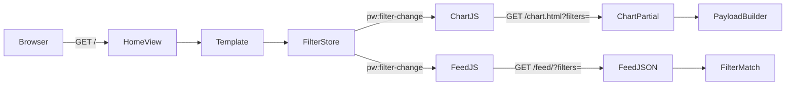

# feat: Ship mockup v18 as production homepage

### written by Grok 4.3

**Target repo:** pushin-weight-v2  
**Visual source of truth:** `docs/ideation/mockups/06-tier1-composed.v18.html`  
**Skill pre-read:** `.claude/skills/avoiding-recurring-mistakes/SKILL.md` (M1–M16 applied below)

---

## Goal Capsule

Replace the live multi-brand homepage at `/` with the **v18 mobile-first composition** (topbar + local⇄CA timezone pill, pulse bar, horizontal filter pills with Open/Closed brands + US/CN nationalism lenses, multi-brand line chart without hover, headline strip, truncated feed with followers + TZ-aware absolute stamps). Keep **filter semantics and chart data pipeline** of the current production home. Serve the previous homepage at **`/old`**. Defaults: **zh_cn**, **24h window**, **local time**. Responsive CSS for desktop without a separate template fork.

---

## Problem Frame

The production home (`monitor/templates/monitor/home.html` + `dashboard.css` + control-panel filters) is dense and desktop-biased. Mock **v18** is the agreed mobile-first redesign. Production already has:

- Working filter store (`pw-filter-store.js` → `pw:filter-change`)
- Chart re-fetch on filters (`/chart.html?filters=…`, Chart.js multi-brand series)
- Feed JSON + filter matching (`/feed/`, `_post_matches_filter`)
- Locale cookie default already **zh_cn**; window cookie default is still **7** (must become **1** = 24h)

The gap is **UI shell + layout + a few product surfaces** (TZ pill, pulse, headline strip, feed stamps/followers, pill-style filters), not a new data model.

---

## Requirements

| ID | Requirement |
|---|---|
| R1 | `/` renders the v18 composition as the canonical homepage. |
| R2 | Previous homepage remains available at `/old` (same filter/chart/feed behavior as today’s `/`). |
| R3 | Defaults for first paint: **zh_cn** locale, **24h** window (`HOME_WINDOW_DEFAULT = 1`), **local** timezone mode. |
| R4 | Filters **functionally** match production: brands, discourse, role, lang, us/cn nationalism, unsanctioned (and post_type / sentiment where already in data layer). UI may use pill dropdowns + lenses (Open/Closed brands; US/CN nationalism). |
| R5 | Multi-brand **line chart** uses the same payload builder (`_build_home_chart_payload` / `/chart` + `/chart.html`) and Chart.js render path; **no hover-to-isolate-brand** behavior. |
| R6 | Layout is **mobile-first** matching v18; **responsive** so desktop is usable (wider max-width, optional multi-column feed/chart) without a second mock. |
| R7 | Timezone pill: toggle **local** ⇄ **California** (`America/Los_Angeles`); day/night emoji; feed absolute stamps (`HH:mm` + `local` or CA badge) when post age &lt; 24h. |
| R8 | Feed rows: follower count before likes/RTs/replies; headline “Top voices” use **☆ N** for follower weight. |
| R9 | Idiomatic URLs only (M9): no `/api/v1/…`, no dotted path segments. Prefer existing `/feed/`, `/chart/`, `/chart.html`, `/locale/…`, `/window/…`; add `/old/` only for legacy shell. |
| R10 | i18n: new chrome strings in both `locale/en` and `locale/zh_Hans` catalogs (M10). |
| R11 | Regression net pins **unchanged** filter/chart contracts before UI swap (global plan-execution contract + M5). |

### Success criteria

- Cold load of `/` on a phone-width viewport matches v18 structure (sections present, filters open, chart paints without placeholder flash).
- Toggling a brand/discourse checkbox still changes chart series + feed (same event bus).
- Chart has **no** hover brand-isolation (tooltips optional/minimal).
- `/old` looks and behaves like pre-ship home.
- First visit without cookies: zh_cn + 24h + local TZ.

---

## Scope Boundaries

### In scope

- Templates/CSS/JS for new home shell
- Route `/` → new home; `/old` → legacy template
- `HOME_WINDOW_DEFAULT` 7 → 1
- Chart.js config: strip hover-isolate plugins/handlers
- Filter DOM restructured to v18 pills while keeping `data-pw-filter-group` / `pwFilter` contract
- TZ client module + feed stamp binding
- Followers already have `_pretty_followers` / wire fields — expose in feed UI
- Sentiment / post_type: include in pill bar **if** keys already exposed in view context or cheap to add (parity with mock + live taxonomy)
- Responsive breakpoints
- Tests: regression net + URL + window default + chart hover absence + filter event still refetches

### Out of scope / deferred

- Rebuilding harvest/classifier
- Closed-lab brands (Anthropic, OpenAI, …) as first-class DB brands if not already seeded — mock Closed tier may be empty or static until data exists (**assumption A1**)
- Brand drill-down page (`/brands/<brand>/`) redesign
- Spend panel redesign
- Hover tooltips redesign (only remove hover isolate)
- Separate desktop-only template (07 mock as-is)
- Deploy/ops beyond “ship behind normal Render deploy” (M2: no volunteer push)

### Assumptions

| ID | Assumption |
|---|---|
| A1 | Open/Closed is a **UI partition** of brand list; Closed brands not in DB simply omit from Closed grid. |
| A2 | “local” = browser/runtime timezone via `Intl` (not hard-coded Beijing), matching v18 mock behavior. |
| A3 | Post_type remains filterable; may stay off the primary pill order if v18 bar is crowded — **prefer** mock order: Brands, Discourse, Role, Lang, Sentiment, Nationalism, Unsanctioned; post_type can sit under Discourse or a later unit if space fails. |
| A4 | Pulse/trending bar uses existing brand volume deltas if available from chart/window payload; if not, ship a **read-only stub** driven by chart payload top brands (no new harvest). |
| A5 | Headline strip uses existing `headline` fields / simple “top voices by followers” from current feed window — no new LLM headline pipeline in this plan. |

---

## Key Technical Decisions

| ID | Decision | Rationale |
|---|---|---|
| KTD1 | **Shell swap, not API rewrite.** Keep `pw-filter-store.js`, `/feed/`, `/chart.html`, `_post_matches_filter`. | R4; M7 DRY; least risk. |
| KTD2 | **Legacy at `/old/`** renders current `home.html` renamed/copied to `home_legacy.html` (or template alias). New `home_v18.html` (or replace `home.html` and point old at legacy). | R2; clear rollback URL. |
| KTD3 | **Default window = 1 day** via `HOME_WINDOW_DEFAULT`. | R3; currently 7. |
| KTD4 | **Chart: same Chart.js instance + payload; delete hover-isolate** (`hoveredBrandIndex` path in `pw-chart.js`). Keep multi-series colors. | R5. |
| KTD5 | **Filters: same `data-pw-filter-group` attributes** inside new dropdown DOM so store needs minimal change; extend store only for all/clear scoped to visible lens. | R4. |
| KTD6 | **TZ is client-only** (no server cookie required for v1). Optional cookie `pw_tz=local\|ca` for persistence. | R7; small surface. |
| KTD7 | **Responsive single template** — CSS breakpoints (~768 / ~1024), not two Django views. | R6. |
| KTD8 | **Static assets live under `monitor/static/`** (canonical for Django/WhiteNoise); keep `x_monitor/static/` in sync only if dual-serve still required — prefer one path. | Avoid dual-source drift. |

### Product Contract preservation

Product Contract source: **ce-plan-bootstrap** (no prior requirements-only artifact). Scope taken from user prompt + v18 mock + live home contracts.

---

## High-Level Technical Design

### Request flow (unchanged spine)



### UI composition (v18)

```text
.topbar [title | window 24h/7d/30d/365d | locale | TZ pill]
[.pulse-bar]          optional / derived
.filter-bar pills     → fixed dropdown = bar width
.home-chart-wrap      → canvas.home-chart (no hover isolate)
.headline-strip
.feed-strip           → rows: handle · rel · (abs TZ) · text · 👥 · ♥ ↻ 💬
```

### URL map (M9)

| Path | Role |
|---|---|
| `/` | New v18 home |
| `/old/` | Legacy home |
| `/feed/` | Feed JSON (unchanged contract) |
| `/chart/`, `/chart.html` | Chart JSON/HTML (unchanged) |
| `/locale/<locale>/`, `/window/<days>/` | Cookie setters (unchanged) |

No new `/api/v1/…` endpoints.

---

## Implementation Units

### U0. Pin homepage contracts as regression net

**Goal:** Freeze current filter keys, window default (pre-change), chart payload shape, and feed wire fields so the shell rewrite cannot silently break data contracts.

**Requirements:** R11  

**Dependencies:** none  

**Files:**
- `tests/test_home_v18_regression_net.py` (create)
- Possibly assert against constants in `monitor/views.py`

**Approach:**
1. Pin `_DASHBOARD_*` key tuples used by home filters (discourse, post_type, role, nationalism, lang).
2. Pin feed wire fields currently required by `pw-feed.js` / `_serialize_feed_row` / `_post_to_wire` (tweet_id, handle, followers, created_at, text fields, classification keys).
3. Pin chart payload top-level keys returned by `_build_home_chart_payload` (labels, datasets or equivalent current shape).
4. Pin **pre-change** `HOME_WINDOW_DEFAULT == 7` in a test that will be **updated in U2** to `1` with a BEFORE comment (intentional change).
5. Pin existing routes: `reverse("home") == "/"`, and after U1 `reverse("home_legacy")` or path `/old/`.

**Test scenarios:**
- Happy: importing views exposes expected key tuples equal to frozen lists.
- Happy: chart payload for window=1 with empty filters has expected keys (call builder in test DB or mock ORM carefully).
- Edge: unsupported locale still normalizes per existing rules (unchanged).

**Verification:** pytest green on regression net alone before template edits.

**Execution note:** Characterization-first; no UI changes in this unit.

---

### U1. Route split: `/` new shell stub + `/old` legacy

**Goal:** Introduce URL and template split without finishing full v18 chrome.

**Requirements:** R1, R2, R9  

**Dependencies:** U0  

**Files:**
- `monitor/urls.py`
- `monitor/views.py` (`home`, new `home_legacy` or dual templates)
- `monitor/templates/monitor/home.html` (becomes v18 target or rename)
- `monitor/templates/monitor/home_legacy.html` (copy of current home)
- `tests/test_home_routes.py` (create or extend)

**Approach:**
1. Copy current `home.html` → `home_legacy.html`.
2. `path("old/", …, name="home_legacy")` → render legacy.
3. `path("", …, name="home")` → render new template (initially thin wrapper still loading chart/filter/feed so nothing is dark).
4. Do not break brand_home.

**Test scenarios:**
- Happy: `GET /old/` returns 200 and contains control-panel marker from legacy (`id="control-panel"` or equivalent).
- Happy: `GET /` returns 200.
- Happy: named URL reverses are slash-style paths without `v1`.

**Verification:** Django test client both routes 200.

---

### U2. Defaults: 24h window + document zh_cn + local TZ

**Goal:** First paint matches product defaults.

**Requirements:** R3  

**Dependencies:** U1  

**Files:**
- `monitor/views.py` (`HOME_WINDOW_DEFAULT`)
- `tests/test_home_v18_regression_net.py` (update window pin: BEFORE 7 → AFTER 1)
- `monitor/static/pw-tz.js` (create) + wire in new template
- Optional cookie helper later

**Approach:**
1. Set `HOME_WINDOW_DEFAULT = 1`.
2. Confirm locale path already defaults zh_cn (no change unless bug).
3. TZ module: `data-tz-active="local"` default; CA = `America/Los_Angeles`; labels `local` / CA badge (from v18).

**Test scenarios:**
- Happy: request without cookies resolves window_days == 1.
- Happy: request without locale cookie activates zh_cn / zh-hans translation.
- Happy: TZ script marks `data-tz-mode=local` on boot (JS unit or template attribute pin).

**Verification:** view unit tests for `_resolve_home_window` / `_resolve_locale`.

---

### U3. Filter bar UI → v18 pills; keep filter store contract

**Goal:** Replace vertical control panel with horizontal pill bar + full-bar-width dropdowns; filters still emit `pw:filter-change` and serialize the same filter JSON shape.

**Requirements:** R4, R10  

**Dependencies:** U1, U0  

**Files:**
- `monitor/templates/monitor/home.html` (filter markup)
- `monitor/static/pw-filter-store.js` (minimal: all/clear scoped to lens; nationalism dual grids)
- `x_monitor/static/dashboard.css` or new `monitor/static/home-v18.css`
- `locale/en/LC_MESSAGES/django.po`, `locale/zh_Hans/LC_MESSAGES/django.po`
- `tests/test_filter_store_contract.py` or JS-free Python tests for parse/match; optional Playwright later

**Approach:**
1. Preserve `data-pw-filter-group` values: `brands`, `discourse`, `post_types`, `role`, `lang`, `us_nationalism`, `cn_nationalism`, `unsanctioned`.
2. Brands: Open/Closed lens UI; Closed empty if no closed brands.
3. Nationalism: single pill with US/CN lens; two grids bound to `us_nationalism` / `cn_nationalism`.
4. Sentiment: add group if wire + match support exists; else add match path for `sentiment` keys (`positive|negative|neutral|mixed`) as part of this unit.
5. all/clear buttons only affect visible lens or flat group (v18 behavior).
6. Dropdown geometry: width/left = filter-bar box (not viewport).

**Patterns:** v18 mock HTML/CSS; existing `pw-filter-store.js` change handlers.

**Test scenarios:**
- Happy: `_parse_filters_from_request` still accepts existing filter JSON.
- Happy: unchecking a discourse key excludes posts with only that discourse (`_post_matches_filter`).
- Happy: nationalism US vs CN independent.
- Edge: empty brand selection / all-on → `__all__` sentinel behavior preserved.
- Integration: filter change triggers chart refetch URL containing `filters=` (can assert JS wiring via static analysis or minimal browser test).

**Verification:** server-side filter tests green; manual/Playwright: open Brands, clear, chart updates.

---

### U4. Chart: reuse payload; remove hover isolate

**Goal:** Chart looks continuous with production data; no hover brand isolation.

**Requirements:** R5  

**Dependencies:** U1  

**Files:**
- `monitor/static/pw-chart.js` (and `x_monitor/static/pw-chart.js` if still dual-copied)
- `monitor/templates/monitor/_home_chart.html` (unchanged canvas contract)
- `tests/test_pw_chart_no_hover_isolate.py` or comment+grep-based test in suite documenting forbidden symbols — prefer a small pure function extract if feasible

**Approach:**
1. Keep Chart.js construction and dataset mapping from payload.
2. Remove `hoveredBrandIndex` mouse-move logic and any discourse overlay hover-only reveal that depends on it (if that was hover-only; do not remove static multi-brand lines).
3. Ensure `pw:filter-change` refetch path still works with new DOM (`#home-chart` id preserved).

**Test scenarios:**
- Happy: chart region id remains `home-chart`; canvas class `home-chart`.
- Happy: after unit, source of `pw-chart.js` does not contain hover-isolate control flow (or unit-tested interaction no-ops).
- Integration: filter change still calls `/chart.html?filters=`.

**Verification:** visual: multi lines always visible; mouse move does not hide series.

---

### U5. Pulse, headline, feed chrome (followers, TZ stamps, ☆ voices)

**Goal:** Match v18 information density under the chart.

**Requirements:** R7, R8, A4, A5  

**Dependencies:** U2, U3  

**Files:**
- `monitor/templates/monitor/home.html`
- `monitor/static/pw-feed.js`
- `monitor/static/pw-tz.js`
- `monitor/views.py` (`_post_to_wire` / serialize: ensure `followers`, `created_at` ISO available)
- Tests for stamp visibility rule (&lt;24h)

**Approach:**
1. Feed row: relative time + `(HH:mm local|CA)` when age &lt; 24h; bind to TZ mode.
2. Engagement: `👥` followers first using `_pretty_followers`.
3. Headline strip: top voices with `☆ N` (follower counts, not engagement).
4. Pulse: derive from chart payload top brands or existing trending helper if present; else minimal stub with brand names + placeholder deltas labeled as mock-derived until data exists.

**Test scenarios:**
- Happy: wire includes followers integer; pretty format matches existing helper tests if any.
- Happy: post age 12m → stamp shown; age 2d → stamp hidden.
- Happy: TZ toggle switches stamp suffix local ↔ CA without reload.
- Edge: missing followers → empty or omit icon.

**Verification:** Playwright or manual on `/` with seeded posts.

---

### U6. Responsive layout + i18n chrome pass

**Goal:** Desktop usable; Chinese/English chrome complete.

**Requirements:** R6, R10  

**Dependencies:** U3–U5  

**Files:**
- `home-v18.css` / `dashboard.css`
- `locale/*/LC_MESSAGES/django.po`
- Optional compile step in verify docs only (not choreography)

**Approach:**
1. Mobile-first base = v18 widths (~360 content column centered or full bleed).
2. ≥768px: increase max-width, filter pills less cramped, chart height; optional side-by-side chart/feed only if it does not break filter bar.
3. Add/translate strings: local, California, Filters groups, Unsanctioned, etc.

**Test scenarios:**
- Regression: pin a sample of existing gettext strings still present (e.g. Filters / 筛选 if already in catalog) — AFTER intentional new strings listed separately.
- Happy: template loads both locales without missing-message errors in tests that activate translation.

**Verification:** resize browser; locale toggle still works on new topbar.

---

### U7. Integration verification + Definition of Done gate

**Goal:** End-to-end proof before ship.

**Requirements:** R1–R11, M5  

**Dependencies:** U1–U6  

**Files:**
- `tests/test_home_v18_e2e.py` or Playwright script under `tests/` if repo already uses Playwright
- Plan DoD checklist (this section)

**Approach:** Run automated + documented manual checks; fix gaps.

**Test scenarios:**
- `/` 200, `/old/` 200, both contain distinct markers.
- Default window 1, locale zh_cn.
- Filter uncheck → feed/chart request includes filters.
- Chart multi-series visible without hover hide.
- TZ toggle updates feed stamps.

**Verification:** full pytest path for home + one Playwright smoke if infrastructure exists; else Django + manual checklist signed in PR description.

---

## Risks & Dependencies

| Risk | Mitigation |
|---|---|
| Dual static roots (`monitor/static` vs `x_monitor/static`) diverge | Edit both or consolidate load path in U4 |
| Closed brands empty confuses users | Hide Closed tab if zero brands |
| HOME_WINDOW_DEFAULT change surprises returning users with cookie=7 | Cookie wins when set; only first visits / cleared cookies get 24h |
| Pulse/headline data thin | Stub with clear “derived from window” behavior; no fake precision |
| Parallel sessions editing UI static (M4) | Before implement: `git fetch`, check worktrees and recent main commits on `monitor/static/*` |

---

## System-Wide Impact

- **End users:** new home UX; bookmark `/` changes look; `/old` escape hatch.
- **i18n:** new strings; locale default already zh.
- **Ops:** no migration expected; pure app/static.
- **Brand pages:** out of scope but share static JS — watch for `pw-chart.js` shared hover removal affecting brand chart (scope brand chart separately if shared; prefer page-gated logic).

---

## Verification Contract

1. **Regression net (U0)** green before shell rewrite; window pin updated in U2.
2. **Routes:** `/` and `/old/` 200 with distinct template markers.
3. **Defaults:** no-cookie request → window 1, locale zh_cn, TZ local.
4. **Filters:** uncheck brand/discourse → chart.html and feed requests carry filters; match function tests green.
5. **Chart:** multi-brand lines; no hover isolate; payload builder unchanged.
6. **Feed:** followers visible; &lt;24h absolute stamp; TZ toggle flips stamp zone.
7. **i18n:** both catalogs contain new chrome strings.
8. **Playwright/manual mobile 360 + desktop 1280** screenshots optional but recommended (M5).

---

## Definition of Done

- [ ] All units U0–U7 complete
- [ ] Regression net shipped and green
- [ ] `/` is v18 shell; `/old` is legacy home
- [ ] Defaults: zh_cn, 24h, local TZ
- [ ] Filters and chart data path behavioral parity with pre-change home (minus hover)
- [ ] No hover brand isolation on home chart
- [ ] Responsive CSS covers mobile + desktop
- [ ] i18n strings for new chrome
- [ ] Avoiding-recurring-mistakes M1–M16 respected (no volunteer deploy; idiomatic URLs; verification in DoD)

---

## Open Questions (non-blocking)

1. Persist TZ in cookie across sessions? (default: yes, `pw_tz`)
2. Include post_type pill on primary bar or only under legacy `/old`?
3. Should `/old` be temporary (sunset date) or permanent?

---

## Sources & Research

- Mock: `docs/ideation/mockups/06-tier1-composed.v18.html`
- Live home: `monitor/templates/monitor/home.html`, `monitor/views.py` (`home`, `_parse_filters_from_request`, `_build_home_chart_payload`, `_resolve_locale`, `HOME_WINDOW_DEFAULT`)
- Static: `monitor/static/pw-filter-store.js`, `pw-chart.js`, `pw-feed.js`
- Skill: `.claude/skills/avoiding-recurring-mistakes/SKILL.md`
- Global plan-execution contract: regression net required for surface changes

---

## Deferred to Follow-Up Work

- Full desktop composition from mock 07
- Closed-lab brand seeding in DB
- Dedicated pulse/trending API
- Removing `/old` after confidence window
- Brand home page restyle

