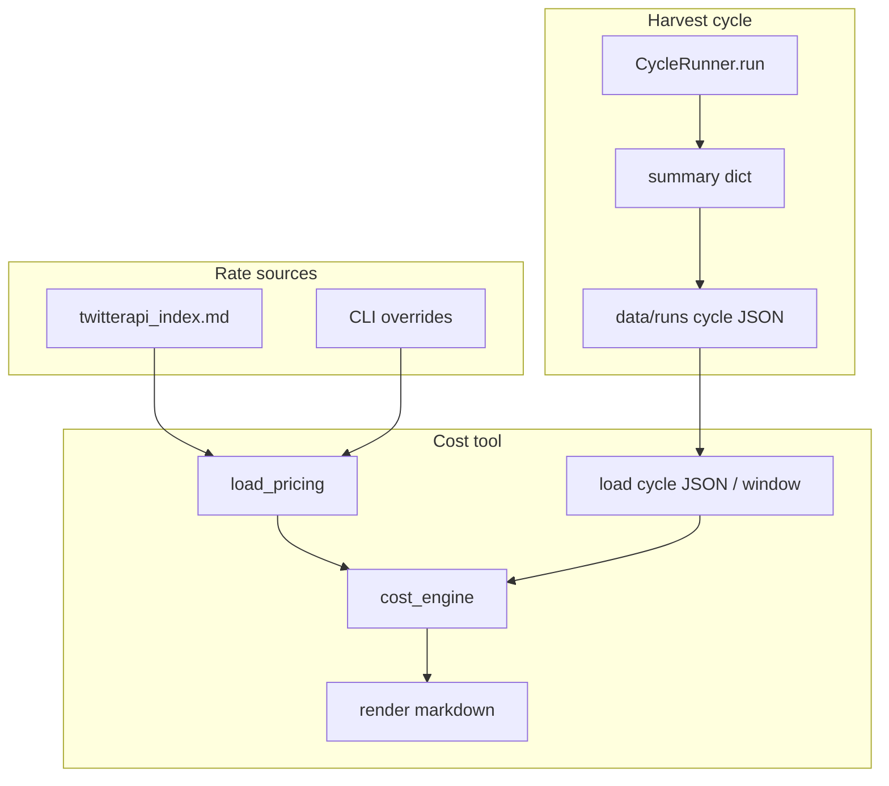

# Harvester cycle cost script - Plan

## Goal Capsule

- **Objective:** Give operators a lightweight, repeatable way to price harvest spend over a chosen time period, with rates loaded from the TwitterAPI pricing doc and optional CLI overrides.
- **Authority:** This plan > `docs/external_vendors/twitterapi/twitterapi_index.md` (rates) > existing cost table reports as format inspiration. Avoiding-recurring-mistakes M2/M7/M8/M14 apply.
- **Execution profile:** code — small library + thin cycle emit + CLI script + tests.
- **Stop when:** CLI can report search + metrics costs for `--latest` / `--last-cycles N` / `--since`–`--until` from persisted cycle JSON (or stdin JSON), using doc-default rates and overrides; cycle emit does not change harvest fetch/persist behavior; regression net green.
- **Out of goal:** rewriting budget guards, dashboard spend panel redesign, continuous QT, live TwitterAPI billing API polling as primary source.

---

## Product Contract

### Summary

Build a DRY cost calculator for the v2 harvest cycle: flexible tweet/floor/USD rates (defaulted from the in-repo pricing doc), multi-cycle time windows, and a markdown report shaped like the harvester cycle cost table. Cycle runs emit structured per-call result counts so reports stop depending on truncated-walk log scraping.

### Problem Frame

Periodic cost analysis was done by hand twice (2026-08-05 baseline table; 2026-08-10 latest-run note). Per-call `n_results` exists in memory on `CycleRunner` but is not persisted on the Render cron path. Operators only get B1 `total_items` when truncated, plus aggregate `posts seen`. Pricing is stable in `twitterapi_index.md` but not machine-readable. Without a small tool, every check re-derives math and re-scrapes logs.

### Requirements

#### Pricing and math

- R1. Default rates come from the pricing doc (`docs/external_vendors/twitterapi/twitterapi_index.md`): tweet unit credits, per-call floor, credits-per-USD. Parser must tolerate doc edits that keep the same key facts.
- R2. Operators can override any rate via CLI without editing the doc (tweet credits, floor, credits-per-USD). Overrides win over doc defaults.
- R3. Cost for a billable tweet-shaped unit = `max(n, 0) * tweet_credits`, applying the per-call floor when the response is empty/near-empty per pricing rules (0–1 results → floor when modeling HTTP calls; document assumption in report).
- R4. Report separates **search harvest** (A/B/C style results) from **metrics_refresh** (by-id tweet units) and notes QT continuous as zero when channel is no-op.

#### Time period

- R5. CLI accepts absolute window `--since` / `--until` (UTC timestamps or dates).
- R6. CLI accepts convenience selectors `--latest` and `--last-cycles N` (default N=1 for latest-only style).
- R7. Multi-cycle windows produce both per-cycle rows and a period rollup (sum credits, avg results, extrapolated day/month at observed mean cycle rate and at 96 cycles/day when enough cycles present).

#### Inputs and outputs

- R8. Primary input is structured cycle summary JSON (one file, a directory of files, or stdin). Secondary fallback may parse Render-style log text only when JSON is missing for a window, and must label residual aggregates as non-exact per-call splits.
- R9. Markdown output matches the spirit of `tests/harvester_costs/harvester-cycle-cost-table.md` / latest-run reports: per-call table, floors, period burn, notes. Machine frontmatter (`generated_by`, rates, window); no Grok agent attribution line from the script.
- R10. Exit code non-zero on hard failures (missing pricing source without overrides, unreadable JSON, empty window when required). Soft warnings (fallback log path, residual-only rows) stay on stderr and still produce a report when possible.

#### Cycle emit (enabler)

- R11. Each successful `CycleRunner.run` completion attaches enough structure for exact cost: per-call `call_id`, `n_results` (unique items), optional walk/http counts when available, `metrics_refresh` due/refreshed/missing, totals already on summary.
- R12. Cron path persists that summary to a durable, dated location under the app data/runs layout (or equivalent ops path documented in the script help), without requiring `--json` on the management command.
- R13. Emit is side-effect free for harvest correctness: failures to write summary log a warning and never abort the cycle.

#### Scope and quality

- R14. No new third-party deps; stdlib + existing Django/x_monitor imports only as needed.
- R15. Pricing parse + cost math live in a shared module usable by the CLI and unit tests (DRY with any future dashboard hookup; do not rewrite dashboard in this plan).
- R16. Touching cycle emit does not change cursor advance, fetch, attribute, persist, or metrics_refresh eligibility rules.

### Success Criteria

- Operator can run the script against the last cycle (or last 24h / last N cycles) and get credits + USD using doc rates without hand math.
- Changing `--tweet-credits` or pointing at an alternate pricing file changes the report without code edits.
- With cycle JSON present, A/B1/…/C3 rows are exact `n_results`, not residual buckets.
- Tests pin default rates extracted from the pricing doc and cost arithmetic for known fixtures.

### Scope Boundaries

**In scope**

- Pricing loader, cost engine, cycle summary persist/emit, CLI, tests, sample/fixture reports under `tests/harvester_costs/` if useful.

**Out of scope**

- Fixing `_CREDITS_PER_ADVANCED_SEARCH_PAGE = 300` budget guard (document only).
- Live pull from TwitterAPI `/backend/user/consumption_*` as primary source (optional later).
- Continuous QT re-enable.
- Full dashboard redesign.
- Enforcing `daily_ceiling` in config.

#### Deferred to Follow-Up Work

- Optional adapter to vendor consumption API for reconciliation against calculated cost.
- Auto-PR of cost markdown into `tests/harvester_costs/` from cron (ops preference).
- Walk-aware billed-tweet upper bound when HTTP log is attached (v1-style `http_log` already has `n_results` per request).

### Actors

- A1. Operator (human or agent) running cost analysis periodically.
- A2. Render harvest cron (`run_cycle`) producing cycle summaries.

### Key Flows

- F1. **Periodic cost check**
  - **Trigger:** Operator wants burn for a window.
  - **Steps:** Load rates → select cycle JSON files in window → compute → write markdown (stdout or `--out`).
  - **Outcome:** Report with per-call and period totals.

- F2. **Harvest cycle emit**
  - **Trigger:** Cron finishes a cycle.
  - **Steps:** Build summary (existing) → attach cost-relevant fields → write JSON artifact → continue success path.
  - **Outcome:** Next F1 run can price that cycle exactly.

### Acceptance Examples

- AE1. Covers R1–R4, R9. Given the pricing doc with 15 credits/tweet and 100_000 credits/USD, when a fixture cycle has B1 `n_results=63` and metrics `refreshed=174`, then search credits include `63*15` for B1 and metrics credits `174*15`, USD = credits/100_000.
- AE2. Covers R2. Given override `--tweet-credits 20`, when the same fixture is priced, all tweet-shaped lines use 20.
- AE3. Covers R5–R7. Given three cycle files spanning 45 minutes, when `--since`/`--until` covers all three, rollup sums credits and lists three per-cycle sections (or a table of three rows).
- AE4. Covers R11–R13. Given a cycle run with write permission, when the cycle completes, a JSON file appears with `calls[].call_id` and `calls[].n_results`; if the write path is unwritable, cycle still completes with status completed/degraded as today and logs a warning.

---

## Planning Contract

### Product Contract preservation

Product Contract authored in this bootstrap plan (no upstream brainstorm). Session-settled choices recorded as KTDs below.

### Key Technical Decisions

- KTD1. **JSON emit + script, not log-scrape primary.** (session-settled: user-directed — chosen over script-only: exact A/B/C rows need structured `n_results`.) Cron path writes cycle summary JSON; script prefers that. Log fallback is residual-only and labeled.
- KTD2. **Time window = since/until + last-N + latest.** (session-settled: user-directed — chosen over single-cycle-only: periodic multi-cycle checks.)
- KTD3. **Pricing defaults from the markdown price doc; overrides via CLI flags and optional `--pricing-file`.** Do not invent a second YAML rate source of truth. If parse fails, require explicit overrides or fail clearly.
- KTD4. **Pure cost engine separate from I/O.** Load rates → list of `CycleCostInput` → `CostReport` dataclass → render markdown. Script/cycle emit are adapters only (DRY, testable).
- KTD5. **Tweet-shaped billing only in v1 of the tool.** advanced_search, list-backed search results, and by-id metrics use the tweet rate. Profiles/followers tier tables are parsed only if cheap; otherwise document “not used by harvester cost v1.”
- KTD6. **Minimal cycle change:** extend existing `summary` (already has `calls`, `metrics_refresh` on main) with `http_log` copy from `TwitterApiClient._request_log` when present, and write summary JSON at end of `run`. Do not change fetch/attribute/persist semantics (R16). Prefer one structured log line `cycle_cost_summary` for greppable ops.
- KTD7. **Reuse, don’t fork, spend helpers.** Prefer extracting shared aggregation from `x_monitor/dashboard.summarize_http_log` / patterns in `scripts/dump_http_log.py` into a neutral module if needed; do not leave duplicate credit math in three places.
- KTD8. **Report location:** default stdout; `--out` writes under caller path, with examples pointing at `tests/harvester_costs/YYYY-MM-DD-HHMMSS-….md` for archived checks.

### High-Level Technical Design

**Directional sketch (not implementation):** pricing table maps resource kind → credits; each cycle contributes rows `(source=search|metrics, call_id?, n_results, http_calls?)`; engine applies rates and floors; renderer formats tables + period extrapolations (`mean_cycle * 96` for day when N≥1).

### Assumptions

- Cycle summary on origin/main already includes `metrics_refresh` counters and per-call `n_results` in the in-memory summary; only durable emit may be missing on cron.
- `data/runs/` remains an acceptable local/ops artifact path; Render filesystem may be ephemeral — plan documents that cost history may require downloading logs or mounting a persistent disk later; script still works on any collected JSON.
- Pricing doc structure stays table-oriented with “15 credits” and “100,000 credits” near Pricing heading; parser uses resilient regex/section anchors, not brittle full-file equality.

### Implementation Constraints

- M2: no volunteer commit/push/deploy.
- M7: share cost math; do not reimplement dump_http_log’s latency features.
- M8: emit must not add API calls or LLM load.
- M14: this plan lives at `docs/plans/2026-08-10-003-feat-harvester-cycle-cost-script-plan.md`.
- Repo-relative paths only in artifacts.

### Sequencing

U1 → U2 (core) → U3 (emit) → U4 (CLI) → U5 (regression net + tests). U5 can start fixtures in parallel with U4 once U1–U2 land.

---

## Implementation Units

### U1. Pricing loader (doc + overrides)

- **Goal:** Machine-readable rates with CLI-friendly overrides.
- **Requirements:** R1, R2, R14, R15
- **Dependencies:** none
- **Files:**
  - create: `x_monitor/harvest_cost_pricing.py`
  - test: `tests/test_harvest_cost_pricing.py`
- **Approach:**
  1. Define a frozen/dataclass `PricingRates` (tweet_credits, call_floor_credits, credits_per_usd, source_path, parse_notes).
  2. Parse the Pricing section of the index markdown for the canonical tweet rate, floor, and credits-per-USD.
  3. Support `--pricing-file` path override and explicit numeric overrides that replace only provided fields.
  4. Fail loudly if neither parse nor overrides can supply tweet_credits and credits_per_usd.
- **Patterns to follow:** stdlib-only parse style like other scripts; no network fetch of pricing page at runtime.
- **Test scenarios:**
  - Happy path: load real `docs/external_vendors/twitterapi/twitterapi_index.md` → tweet_credits == 15, credits_per_usd == 100_000, floor == 15 (or documented parse of floor).
  - Override: tweet_credits=20 wins over doc.
  - Error: empty/malformed file without overrides raises/returns error the CLI maps to non-zero exit.
  - Alternate fixture pricing file with different tweet rate loads correctly.
- **Verification:** unit tests green; no network calls.

### U2. Cost engine (pure)

- **Goal:** Turn cycle inputs + rates into a structured report model.
- **Requirements:** R3, R4, R7, R15
- **Dependencies:** U1
- **Files:**
  - create: `x_monitor/harvest_cost_engine.py`
  - test: `tests/test_harvest_cost_engine.py`
- **Approach:**
  1. Define `CallCostLine`, `CycleCost`, `PeriodCost` (or equivalent) with credits and USD helpers.
  2. Map search lines from `summary["calls"]` using `call_id` + `n_results`/`fetch_n`.
  3. Map metrics from `summary["metrics_refresh"]` using refreshed (primary) and due (upper note).
  4. Period rollup: sum cycles, mean per cycle, optional extrapolations (×4 hour, ×96 day, ×30 month) clearly labeled “if every cycle matched the mean.”
  5. If only residual aggregate available (log fallback), one row `A+B2+… residual` plus exact B1 when present.
- **Patterns to follow:** pure functions; no I/O; mirror math in latest-run cost report.
- **Test scenarios:**
  - Covers AE1: fixture with B1=63, metrics refreshed=174, rates 15 / 100k → expected credits and USD.
  - Multi-cycle rollup: two cycles sum correctly.
  - Empty calls list with metrics only → metrics line only.
  - Floor behavior: zero-result HTTP call contributes floor when modeling http_log entries (if engine supports http_log mode).
  - QT absent/no-op → zero QT credits.
- **Verification:** unit tests encode golden numbers from AE1.

### U3. Cycle summary emit for cost (instrumentation)

- **Goal:** Persist structured cycle summary so the script can price exact per-call rows after cron runs.
- **Requirements:** R11, R12, R13, R16
- **Dependencies:** none (can land before U4)
- **Files:**
  - modify: `monitor/cycle.py` (end of `run`, summary assembly)
  - modify: `monitor/management/commands/run_cycle.py` only if path config must pass through
  - test: `tests/test_cycle_cost_emit.py` (or extend existing cycle tests)
- **Approach:**
  1. After metrics_refresh / before return, copy `api._request_log` into `summary["http_log"]` when the client exposes it (match v1 run.py pattern).
  2. Ensure each `summary["calls"]` entry retains `call_id`, `n_results`, `n_inserted`, `status` (already present — do not drop).
  3. Write `summary` JSON under `data/runs/<run_id>.json` or dated subdir consistent with existing `data/runs` usage; create parents as needed.
  4. Emit one info log line with compact totals for grepping (`posts seen`, search credits not required in log if JSON exists).
  5. Wrap write in try/except → warning only (R13).
- **Execution note:** Prefer characterization test of summary keys before changing write path if existing cycle tests are thin.
- **Patterns to follow:** `x_monitor/run.py` summary write + `http_log` copy; origin/main `metrics_refresh` summary block.
- **Test scenarios:**
  - Covers AE4: with tmp path, `run` (or helper `_persist_cycle_summary`) writes JSON containing `calls` and `metrics_refresh` when present.
  - Write failure: monkeypatched open/path error → no exception out of `run`; warning logged.
  - Regression: existing summary fields `totals.n_results`, `totals.n_inserted` still set (pin values on a dry-run/plan-only path if full fetch is not unit-testable).
- **Verification:** unit tests with tmpdir; no live TwitterAPI.

### U4. CLI: period window + markdown report

- **Goal:** Operator-facing script for periodic checks.
- **Requirements:** R5–R10, R14
- **Dependencies:** U1, U2; benefits from U3
- **Files:**
  - create: `scripts/harvester_cycle_cost.py`
  - optional help doc line in `tests/harvester_costs/README.md` (only if directory needs orientation — keep short)
  - test: `tests/test_harvester_cycle_cost_cli.py`
- **Approach:**
  1. argparse: `--pricing-file`, `--tweet-credits`, `--call-floor-credits`, `--credits-per-usd`, `--since`, `--until`, `--latest`, `--last-cycles`, `--runs-dir`, `--input` (file/glob/stdin), `--out`, `--format md|json`.
  2. Resolve window: exclusive rules documented (`--latest` ≡ `--last-cycles 1`; `--since`/`--until` filter file mtimes or summary `finished_at`/`started_at`).
  3. Load cycles → engine → markdown (default) or JSON for machine consumers.
  4. Markdown sections: rates used, per-cycle tables, period rollup, methodology notes (unique n_results vs walk-billed if http_log present).
- **Patterns to follow:** `scripts/dump_http_log.py`, `scripts/probe_call_a.py` argparse + `if __name__`.
- **Test scenarios:**
  - Covers AE2/AE3: invoke main with tmp pricing + fixture runs; assert markdown contains expected credit totals and both cycle ids.
  - Empty window: non-zero exit or clear empty report per R10 choice (prefer non-zero when `--require-cycles` or default when `--latest` finds nothing).
  - Stdin JSON single cycle works.
- **Verification:** CLI tests with fixtures; manual smoke optional against real `data/runs` if present.

### U5. Pin existing cycle summary surface as regression net

- **Goal:** Prevent silent drift of in-memory summary keys the cost tool depends on.
- **Requirements:** R11, R16; regression-net rule
- **Dependencies:** U3
- **Files:**
  - create/modify: `tests/test_harvest_cost_summary_regression_net.py`
- **Approach:**
  1. Pin the **current** summary contract the cost tool needs:
     - `calls` is a list of dicts with `call_id` and `n_results` (or `fetch_n`) when a call completed with items.
     - `totals` includes `n_results`, `n_inserted`, `n_calls_run`.
     - `metrics_refresh` keys when channel runs: `n_due` / `due` and `n_refreshed` / `refreshed` — pin actual key names from origin/main implementation (normalize in adapter if both appear).
  2. Pin pricing defaults from live doc: tweet_credits=15, credits_per_usd=100_000 (AFTER state if doc already says so; no intentional change).
  3. Do **not** pin free-form log message text that changes often; pin structured keys/values.
- **Test scenarios:**
  - Fixture or lightweight CycleRunner plan-only/dry path builds summary with required keys.
  - Pricing loader pin: 15 and 100_000 from repo pricing file.
  - Intentional key rename fails the net loudly.
- **Verification:** regression net green in CI/local pytest.

---

## Verification Contract

| Gate | Command / check | Applies |
|---|---|---|
| Pricing unit tests | `pytest tests/test_harvest_cost_pricing.py -q` | U1 |
| Engine unit tests | `pytest tests/test_harvest_cost_engine.py -q` | U2 |
| Emit tests | `pytest tests/test_cycle_cost_emit.py -q` | U3 |
| CLI tests | `pytest tests/test_harvester_cycle_cost_cli.py -q` | U4 |
| Regression net | `pytest tests/test_harvest_cost_summary_regression_net.py -q` | U5 |
| Combined | `pytest tests/test_harvest_cost_*.py tests/test_cycle_cost_emit.py tests/test_harvester_cycle_cost_cli.py -q` | full feature |
| Smoke (optional ops) | run CLI `--latest` against a real summary file after one cron cycle with U3 deployed | post-ship |

No `release:validate` required for script-only ops tool; include cycle emit tests because harvest path is touched.

---

## Definition of Done

**Global**

- [ ] U1–U5 shipped with tests green.
- [ ] Pricing defaults load from `docs/external_vendors/twitterapi/twitterapi_index.md` without hardcoding only in the CLI.
- [ ] CLI supports `--since`/`--until`, `--latest`, `--last-cycles`, rate overrides, markdown out.
- [ ] Cycle completion writes durable summary JSON usable by the script (R12–R13).
- [ ] Search vs metrics lines separated in report (R4).
- [ ] Regression net (U5) green and cannot be dropped silently.
- [ ] No change to fetch/cursor/metrics eligibility behavior (R16).
- [ ] Abandoned experimental code removed from the final diff.

**Per unit**

- U1: AE rates load; overrides work.
- U2: AE1 golden math.
- U3: AE4 write + non-fatal failure.
- U4: AE2/AE3 CLI behavior.
- U5: pins listed values present.

---

## Risks & Dependencies

| Risk | Mitigation |
|---|---|
| Render disk ephemeral → JSON lost between deploys | Script accepts offline JSON export; log line remains greppable; document ops copy path |
| Pricing doc reformat breaks parser | Tests on real file; clear error; CLI overrides as escape hatch |
| Key name drift `due` vs `n_due` | Adapter normalizes; regression net pins actual keys |
| Walk billing > unique n_results | Report notes limitation; optional http_log sum when present (deferred full walk accounting) |

**Dependencies:** origin/main metrics_refresh already on cycle path; TwitterAPI pricing doc present.

---

## Sources & Research

- `docs/reference/harvester-cycle-cost-table.md` / `tests/harvester_costs/*` — report shape and baseline math
- `docs/external_vendors/twitterapi/twitterapi_index.md` — Pricing section (15 cr/tweet, floor, 100k/USD)
- `docs/external_vendors/x_twitter/2026-08-10-120136-twitterapi-credit-burn-and-engagement-half-life.md` — search vs by-id credit mix
- `monitor/cycle.py` — `call_entry["n_results"]`, summary totals, metrics_refresh block on main
- `x_monitor/apify.py` — `_request_log`, `TWEETS_BY_IDS_CHUNK=50`
- `scripts/dump_http_log.py`, `x_monitor/dashboard.summarize_http_log` — prior spend aggregation
- `.claude/skills/avoiding-recurring-mistakes/SKILL.md` — M2/M7/M8/M14
- Session: cost analysis latest run; user chose JSON emit + time window form (since/until + last N)

---

## Open Questions

None blocking. Deferred items are under Scope Boundaries.
