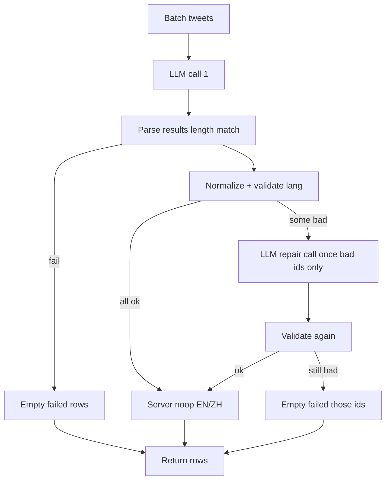

# Translator lang_detected LLM compliance - Plan

## Goal Capsule

- **Objective:** Stop silent incomplete translator stamps: require allowlisted `lang_detected` via **prompt contract**, **allowlist**, and **validate + one repair re-call** — without using X API `lang` as truth, without heuristic script detection as primary, and without expanding scope beyond `x_monitor/translator.py` + focused tests. Residual rows that still lack lang after repair fail empty (may not raise overall fill rate if the model keeps omitting lang).
- **Authority:** This plan > session diagnosis (null lang with texts present) > plans `2026-08-04-001` / Aug 5 translator handoffs (historical batch-fail context). Project skills: `.claude/skills/avoiding-recurring-mistakes` (M2 tight scope, M8 LLM budget, M12 explicit model, M18 call-chain regression net).
- **Execution profile:** code — small pure helpers + prompt edit + tests.
- **Stop when:** missing/invalid `lang_detected` cannot silently persist from a “successful” parse; one targeted repair re-call is bounded; regression net green with call-chain coverage; noop EN/ZH rules unchanged for valid langs.
- **Out of goal:** X API `lang` fill, character-script heuristics, classifier/discourse, batch-size policy change, provider structured-output API migration, historical backfill job, dashboard.

---

## Product Contract

### Summary

Tighten the **pragmatics translator** so `lang_detected` is a first-class required field with a **closed allowlist**, prompt pressure that favors language-first output, and a **post-parse gate** that rejects incomplete rows and triggers **at most one repair LLM call for only the bad tweet_ids**. Do not use X’s unreliable `lang` as ground truth.

### Problem Frame

Prod still shows ~20–28% null `lang_detected` on recent cohorts while `text_en` / `text_zh_cn` are often filled. That is **not** the Aug 5 whole-batch death mode; it is **soft omission** of a low-salience JSON key. Server-side noop (null EN when lang is English, null ZH when Simplified Chinese) **depends on** `lang_detected`; missing lang breaks those conventions. Past plans fixed M3/env/max_tokens; this plan closes residual **LLM schema compliance**.

### Requirements

#### Contract and prompt (LLM compliance)

- R1. `lang_detected` is **required** on every pragmatics result row after parse. Empty / whitespace / missing → invalid.
- R2. Allowed values are a **closed allowlist** (normalize case/hyphen): at minimum `en`, `zh-Hans`, `zh-Hant`, `ja`, `ko`, `other` — map common synonyms (`zh`, `zh-cn`, `zh_cn`, `zh-hans` → `zh-Hans`; `zh-tw`/`zh-hant` → `zh-Hant`; `en-US` → `en`) before validate. Unknown after normalize → invalid (do not invent open ISO freestyle).
- R3. Prompt/schema lists **`lang_detected` first** in the result object shape and states explicitly: “For each tweet set `lang_detected` before any translation fields. Never omit it.”
- R4. Remove or neutralize the **≤280 characters per post (excl. tweet_id)** rule as a hard constraint on structured output (it competes with bilingual fields and encourages dropping tags). Annotation length caps in `apply_friction_judge` may stay.
- R5. Any in-repo few-shot examples used by the pragmatics prompt must include non-empty `lang_detected` first; fix fixtures if any omit it.

#### Validate + repair (deterministic gate; M8 budget)

- R6. After a successful JSON parse (`len(results)==len(batch)`), validate each row’s `lang_detected` (R1–R2). Rows that fail validation are **not** written as “success with null lang.”
- R7. **Repair path (tight):** collect invalid tweet_ids; issue **at most one** additional LLM call with **only those tweets**, repair-focused prompt (“return full pragmatics JSON; every row must include allowlisted `lang_detected` first”). Merge repaired rows by `tweet_id`. **Merge rule (doc-review D1):** for each repaired id, take `lang_detected` (normalized) from the repair response; if repair omits or empties text fields that the first pass already populated, **keep first-pass `text_en` / `literal_zh` / related text fields**. Only replace texts when repair supplies non-empty values. If lang is still invalid after merge, R8 applies (fail empty) — do not keep first-pass texts with null lang.
- R8. If a tweet is still invalid after repair (or repair call fails): emit that row as **failed empty** (`translation_failed=True`, null texts + null lang) — same as today’s parse-fail empty row — and increment an error counter (e.g. `translator_lang_missing` or reuse `translator_batch_failed` with a distinct log reason). **Do not** silently keep partial texts with null lang.
- R9. Repair must not open a retry storm: **max 1 repair call per original batch**, no recursive repair-of-repair.

#### Preserve existing behavior outside lang stamp

- R10. Server-side noop rules for valid langs remain: English family → null `text_en`; Simplified Chinese family → null `text_zh_cn` (existing tests in `tests/test_translator_text_en_noop.py` / pragmatics tests stay green).
- R11. Classifier / discourse / metrics_refresh / cycle fetch paths are **out of radius** unless a one-line log counter is already threaded via existing `on_batch_error` (prefer no cycle.py change).
- R12. Do **not** use `posts.lang` / X API lang as the fill source of truth in this plan (session decision).

### Success Criteria

- Unit/call-chain tests: missing `lang_detected` cannot appear on a non-failed success row after `translate_batch_pragmatics` with a fake client.
- Repair invoked once when first response omits lang on a subset; second response supplies allowlisted lang → success row with lang set.
- Still-invalid after repair → `translation_failed` empty row.
- Noop matrix for en / zh-Hans still holds when lang is present.
- Regression net pins allowlist + required-key + max-one-repair.

### Scope Boundaries

**In**

- `x_monitor/translator.py` (pragmatics path primarily: prompt, normalize/validate, repair loop)
- `x_monitor/data/few_shot_pragmatics.jsonl` (or equivalent) if present and incomplete
- New/extended tests under `tests/test_translator_*.py`

**Out**

- `monitor/cycle.py` API-lang fill  
- Character-script heuristics  
- Changing `_TRANSLATION_BATCH_SIZE`  
- Raising/lowering DeepSeek max_tokens formula (already fixed)  
- Historical DB backfill of nulls  
- Classifier / UI / i18n  

#### Deferred to Follow-Up Work

- Optional provider JSON-schema / structured output  
- Separate lang-only first pass as always-on dual-call design  
- Cheap historical stamp job (only if product later accepts non-LLM fill)

### Acceptance Examples

- AE1. Covers R1,R6,R7,R8. Fake LLM returns 2 rows with texts but one missing `lang_detected`; repair returns lang only (empty texts) → merged row keeps first-pass texts + repaired lang. If repair still omits lang → `translation_failed` empty (texts wiped). Never success with null lang + non-null texts.
- AE2. Covers R2,R10. Fake returns `lang_detected: "zh-cn"` + literal_zh → normalized to `zh-Hans`; existing Simplified-Chinese noop applies (`text_zh_cn` null when source is already Simplified Chinese family — same rule as today’s pragmatics path after normalize).
- AE3. Covers R7,R9. First call omits lang on 1 of 3 tweets; repair call receives only that tweet_id once; no second repair.
- AE4. Covers R3,R4. Prompt builder output contains language-first shape instruction and does **not** contain the hard “≤280 characters per post” rule as currently worded (or documents replacement that excludes structured fields).

---

## Planning Contract

### Product Contract preservation

Bootstrap from session; no upstream brainstorm file. Session-settled: **LLM compliance over X API lang**; **tight radius**; **strong regression net**.

### Key Technical Decisions

- KTD1. **Primary lever = allowlist + validate + one repair re-call**, not X `lang` and not script heuristics. (session-settled: user-directed — X lang unreliable; want higher LLM compliance.)
- KTD2. **Radius = translator pragmatics path + tests only.** Prefer zero `monitor/cycle.py` edits. (session-settled: tight radius.)
- KTD3. **Invalid after repair → fail empty row** (lose partial texts for that tweet) rather than persist null lang with texts — matches “don’t lie about language”; cost is quality on rare residual rows, not silent bad stamps.
- KTD4. **Normalize then allowlist** so existing noop helpers (`_is_english_family`, `_is_simplified_chinese_family`) keep working on canonical forms.
- KTD5. **M8:** max one repair call per batch; repair payload only invalid ids; no concurrent new LLM fan-out.
- KTD6. **M18 regression net:** tests must drive `translate_batch_pragmatics` with a fake client that records call count and kwargs/payloads — not only pure normalize helpers in isolation.
- KTD7. **Repair merge preserves first-pass texts** when repair only fixes lang (doc-review D1; user-approved). Residual invalid still fail-empty (KTD3 / D2 kept).

### High-Level Technical Design

### Assumptions

- Pragmatics path (`translate_batch_pragmatics`) is the live cycle path (confirmed by `monitor/cycle.py`).
- Fake clients in existing tests remain the pattern for no-network unit tests.
- Allowlist is closed: after synonym normalize, only `en`, `zh-Hans`, `zh-Hant`, `ja`, `ko`, and explicit model output `other` are valid. Freeform codes (e.g. `fr`, `esperanto`) are **invalid** — do not auto-map unknowns into `other`.

### Sequencing

U1 normalize/validate helpers + allowlist → U2 prompt/few-shot → U3 wire validate+repair into `translate_batch_pragmatics` → U4 regression net (includes call-chain).

---

## Implementation Units

### U1. Lang allowlist + normalize + validate helpers

- **Goal:** Pure functions for R1–R2 with no I/O.
- **Requirements:** R1, R2
- **Dependencies:** none
- **Files:**
  - modify: `x_monitor/translator.py` (small helpers near pragmatics section)
  - test: `tests/test_translator_lang_detected_compliance.py` (new)
- **Approach:**
  1. Define `LANG_DETECTED_ALLOWLIST` and `normalize_lang_detected(raw) -> str | None`.
  2. `validate_lang_detected(raw) -> bool` after normalize.
  3. Keep helpers importable for tests without LLM.
- **Test scenarios:**
  - `en`, `EN`, `en-US` → `en`
  - `zh`, `zh-cn`, `zh_Hans` → `zh-Hans`
  - `zh-tw` → `zh-Hant`
  - `""` / `None` / `"   "` → invalid
  - `"esperanto"` → invalid (not silently accepted)
- **Verification:** pure unit tests green.

### U2. Prompt + few-shot: language-first, drop 280 hard cap

- **Goal:** R3–R5 prompt compliance pressure.
- **Requirements:** R3, R4, R5
- **Dependencies:** U1 (allowlist listed in prompt)
- **Files:**
  - modify: `x_monitor/translator.py` (`_PRAGMATICS_SYSTEM_PROMPT` / `build_pragmatics_translation_prompt`)
  - modify: `x_monitor/data/few_shot_pragmatics.jsonl` if present
  - test: extend `tests/test_translator_pragmatics.py` or compliance test file
- **Approach:**
  1. Reorder JSON shape example: `lang_detected` first.
  2. State required allowlist values in the prompt.
  3. Remove hard “≤280 characters per post” rule from system prompt (annotation caps remain in friction judge).
  4. Audit few-shots for lang present.
- **Test scenarios:**
  - Covers AE4: `build_pragmatics_translation_prompt([...])` contains allowlist + language-first instruction; does not contain the old 280 hard rule string.
  - Few-shot file (if loaded) every example output has `lang_detected`.
- **Verification:** prompt snapshot assertions (string contains / not contains).

### U3. Post-parse validate + single repair re-call

- **Goal:** Wire R6–R9 into `translate_batch_pragmatics`.
- **Requirements:** R6, R7, R8, R9, R10, R11
- **Dependencies:** U1, U2
- **Files:**
  - modify: `x_monitor/translator.py` only
  - test: `tests/test_translator_lang_detected_compliance.py`
- **Approach:**
  1. After `_parse_pragmatics_response` succeeds, partition rows by `validate_lang_detected`.
  2. If any invalid: one `messages_create` repair with only invalid tweets + short repair system addendum; parse; re-validate.
  3. Merge by `tweet_id` per R7 (lang from repair; preserve first-pass texts when repair texts empty).
  4. Success rows go through existing `apply_friction_judge` + noop logic **using normalized lang**.
  5. Residual invalid → `_empty_pragmatics_row(..., failed=True)` (R8 / KTD3 — wipe texts; no null-lang success).
  6. Log clearly: repair attempted / still missing (M8 observability).
  7. Do not change classifier or cycle except existing counters if already hooked via `on_batch_error` (repair failure may call it once).
- **Execution note:** Test with fake client recording call count and second-call input tweet_ids.
- **Test scenarios:**
  - Covers AE1/AE3: two-call path when first response omits lang on one id; assert `client.call_count == 2` and second payload only that id.
  - All valid first response → `call_count == 1`.
  - Repair still missing lang → failed empty row, no third call.
  - Covers AE2: synonym normalize then noop behavior for en / zh-Hans (pin current text_en / text_zh_cn nulling).
- **Verification:** compliance tests green; existing pragmatics + text_en_noop tests green.

### U4. Pin translator lang surface as regression net (strong / M18)

- **Goal:** Prevent silent drift of required lang + repair budget + noop for valid langs.
- **Requirements:** R1–R10; regression-net rule; M18
- **Dependencies:** U3
- **Files:**
  - create/extend: `tests/test_translator_lang_detected_compliance.py`
  - pin cross-file: ensure `tests/test_translator_text_en_noop.py` still passes (unchanged surface)
- **Approach — pin these AFTER values explicitly:**
  1. **Allowlist set** (exact members as shipped).
  2. **Normalize table:** `en-US`→`en`, `zh-cn`→`zh-Hans`, `zh-tw`→`zh-Hant`, empty→invalid.
  3. **Success path cannot emit** `lang_detected is None` with `translation_failed` false.
  4. **Repair budget:** max 2 LLM calls when first batch has any invalid lang; never 3.
  5. **Repair merge:** first-pass texts retained when repair supplies lang but empty texts.
  6. **Call-chain:** fake client used **only** through `translate_batch_pragmatics` (production entry), not only helper unit tests.
  7. **Unchanged surface:** en noop still nulls `text_en`; zh-Hans noop still nulls `text_zh_cn` (BEFORE/AFTER same unless normalize renames input — pin AFTER normalize behavior).
- **Test scenarios:** each pin above as a separate test function; failure message names the pin.
- **Verification:** `pytest tests/test_translator_lang_detected_compliance.py tests/test_translator_pragmatics.py tests/test_translator_text_en_noop.py -q` green.

---

## Verification Contract

| Gate | What |
|---|---|
| Compliance unit + call-chain | `pytest tests/test_translator_lang_detected_compliance.py -q` |
| Adjacent translator nets | `pytest tests/test_translator_pragmatics.py tests/test_translator_text_en_noop.py tests/test_translator_max_tokens.py -q` |
| Optional broader | `pytest tests/test_translator*.py -q` |
| Live (post-deploy, optional) | One harvest cycle: share of fresh posts with non-null `lang_detected` ≥ prior baseline; watch for repair log rate |

No cron halt required for this code-only change (not a live anomaly halt/M17 event).

---

## Definition of Done

- [ ] U1–U4 complete; regression net cannot be dropped silently.
- [ ] No success row with null `lang_detected` from `translate_batch_pragmatics`.
- [ ] Max one repair LLM call per batch; repair only bad ids.
- [ ] X API lang not used as fill source.
- [ ] No scope creep into cycle/classifier/UI.
- [ ] Existing noop tests green.
- [ ] Abandoned experimental code removed.
- [ ] Optional: one-line note in `docs/solutions/` or CONCEPTS only if implementer ships behavior ops must know — not required for tight radius if tests + plan suffice; prefer **short solution doc** if repair logs appear in prod (follow-up ok).

---

## Risks & Dependencies

| Risk | Mitigation |
|---|---|
| Repair doubles cost on high miss rate | Max 1 repair; only bad ids; monitor log rate |
| Allowlist too tight (`other` needed) | Allow explicit `other` in allowlist; reject freeform |
| Prompt change breaks few-shot load | Tolerant loader already; fix fixtures |
| M18 miss (helper-only tests) | U4 requires translate_batch_pragmatics call-chain |

**Depends on:** DeepSeek translator path already live (plan 2026-08-04-001).

---

## Sources & Research

- Session: latest-50 72% lang_detected; 14 nulls with texts present; code path `translate_batch_pragmatics` + cycle update
- `docs/plans/2026-08-04-001-swap-translator-to-deepseek-v4-plan.md` and Aug 5 handoffs/solutions (batch-fail history — different mechanism)
- `.claude/skills/avoiding-recurring-mistakes/SKILL.md` M2/M8/M12/M18
- `x_monitor/translator.py` pragmatics prompt, `_parse_pragmatics_response`, noop block
- `tests/test_translator_pragmatics.py`, `tests/test_translator_text_en_noop.py`

---

## Open Questions

None blocking. `other` is in the allowlist as an explicit model output for non-CJK/EN; freeform codes remain invalid.
