# feat: expand V22 cached trend narratives with graph-ready analytics

## Goal Capsule

- **Objective:** Turn the V22 headline strip into a fast, factual analysis of the selected `1d`, `7d`, `30d`, or `365d` window's dominant market story, including two extraordinary co-dominant brand stories when both warrant top billing, using a persisted database-derived analytical snapshot, normalized narrative subjects, and a stored bilingual DeepSeek rendering.
- **User outcome:** A visitor can change windows repeatedly and immediately receive one English or Simplified Chinese headline covering one selected measured brand or, when both warrant it, two extraordinary co-dominant measured brands, plus up to two supporting observations. A company, brand, product, or model present in bounded evidence is not hidden merely because it falls outside the configured universe or database, but an unresolved entity is described only as evidence around a measured trend until it becomes canonical and measured. The analysis can explain trajectory shape, short-lived spikes, engagement, sentiment, post type, discourse, and US/China nationalism without waiting for an LLM or seeing prose from a different window.
- **Operational outcome:** Each completed 15-minute harvest may enqueue one downstream refresh task. That task makes zero to four physical provider requests, only for due windows whose semantic facts changed; duplicate delivery, browser traffic, locale/filter changes, provider retries, and worker restarts cannot raise that ceiling for the source cycle.
- **Release success condition:** The plan is not successful at local implementation, test completion, commit, or Blueprint validation. Success requires the authorized production revision to be fully deployed across the affected Render web, harvest-cron, and headline-worker services with every deployment healthy and zero build, migration, startup, worker, cron, or runtime errors in their Render events/logs through the first-headline smoke; one real eligible production harvest must then generate a valid current narrative and the production homepage must visibly display that generated headline rather than fallback or stale copy.
- **Execution baseline:** Plan and implement from current `origin/main`, not the stale dirty primary checkout. At this amendment, `origin/main` is `4626dd0103ba78728c05c709a2de1902b807e486`; the implementer must re-fetch, record the new immutable base, inspect all worktrees, and allocate the next migration number before editing.
- **Execution profile:** Before editing, read `AGENTS.md`, `CONCEPTS.md`, `.claude/skills/avoiding-recurring-mistakes/SKILL.md`, `.claude/skills/fix-ui/SKILL.md`, and `.claude/skills/change-harvester/SKILL.md`. Preserve their gates: real production call-chain proof, real URL/browser proof, a baseline API-call budget, PostgreSQL-required tests that fail instead of silently skipping, and no edits over another session's dirty files.
- **Landing ownership:** This plan authorizes implementation and local verification only. Commit, push, Render Blueprint apply, service creation/reactivation, database migration in a shared environment, and production enablement require the user's normal explicit authorization.
- **Stop conditions:** Stop if a scoped dirty file is owned by another session; the release manifest cannot prove exactly one active scheduler and zero active beat services; provider/serving enablement is reached without one owned headline consumer and broker namespace; a new harvest/TwitterAPI request is required; the hard physical-call ceiling cannot be enforced durably; a PostgreSQL-required suite skips/errors; the selected provider/model cannot pass the bilingual factuality fixture; or deployment would require reactivating either suspended legacy Celery service.

---

## Product Contract

**Product Contract preservation:** changed R7/R18 and AE14/AE23, then added AE25–AE26 and KD9, because the user explicitly broadened the headline from exactly one selected brand to one or two distinct extraordinary brands. The open-vocabulary amendment changed R6–R7/R18–R19 and AE8/AE23, added R20, AE27–AE28, and KD10, and deferred first-class open-world discovery. This schema amendment changes R9/R18–R20 and AE23/AE27–AE28, adds R21–R23 and AE29–AE32, chooses Option A for unresolved entities, normalizes the one-or-two narrative subjects into a child table, adopts `zh_cn` and `llm_model_name`, and renames both the Django model and the physical PostgreSQL table from version-oriented to narrative-oriented names through a three-release expand/quiesce/contract rollout. The production-success amendment tightens AE15 and the release proof without changing feature scope: passing locally is necessary but is not success until Render is clean and the first generated headline is visible in production.

### Requirements

- **R1 — Fixed shared narratives:** Produce one market-wide narrative for each fixed window `1d`, `7d`, `30d`, and `365d`. Brand, sentiment, discourse, role, language, nationalism, unsanctioned, and other page filters do not change the narrative. The request locale selects the stored body but does not change trend selection.
- **R2 — Database-owned analytical snapshot:** PostgreSQL and application code calculate a versioned snapshot from committed rows under one UTC cutoff. The snapshot owns all measurements, bucket boundaries, candidate identities, evidence identities, coverage, and display-ready values; the LLM may select and interpret one or two supplied candidates but may not invent a measurement or candidate.
- **R3 — Multi-resolution trajectory and spike preservation:** Aggregate every eligible post into a complete coarse trajectory—`1d: 8×3h`, `7d: 7×1d`, `30d: 10×3d`, and `365d: 12` equal-duration buckets—while scanning the full range at `15m`, `1h`, `1d`, and `1d` resolution respectively for exceptional episodes. Coarse buckets are aggregates, never sampled endpoints. The persisted snapshot keeps the complete compact fine series for shortlisted candidates plus bounded spike markers; only the bounded episodes and supporting metrics enter the provider projection.
- **R4 — Bounded, diverse candidate shortlist:** Count distinct `(post, brand)` associations and distinct authors, not signal rows. Build at most six deduplicated candidates from current volume, absolute and relative volume movement, engagement movement, and supported post-type, discourse, sentiment, and nationalism share shifts; apply the 20-post and 10-author support floors and label zero/low prior bases instead of emitting unstable percentages.
- **R5 — Coverage-aware comparisons:** Calculate selected-window and prior-equal-window calendar-time coverage independently as `duration(requested half-open interval ∩ [earliest eligible committed post time, as_of)) / duration(requested interval)`, never as post count or nonempty-bucket count. Below 75% selected-window coverage, use `coverage_limited`; below 75% prior-window coverage, omit period-over-period percentages but retain the selected-window trajectory and spikes. Persist the earliest boundary and any known overlapping unresolved harvest-backlog interval as separate provenance; a known gap suppresses comparison claims for its affected range. A `365d` analysis never implies a prior-year comparison without adequate 730-day calendar coverage.
- **R6 — Stable material-change policy:** Before any provider call, fingerprint the bounded provider-story input projection: snapshot schema, candidate identities/order, selected display-ready values, evidence IDs, normalized excerpt digests and deterministic support metadata, coverage states, prompt version, publication epoch, exact model route, and canonical trajectory/episode bands. A coarse shape band is each bucket's share of its candidate series total rounded to the nearest configured 5 percentage points; episode IDs/boundaries are exact fingerprint inputs. Exact graph series remain persisted but do not churn prose while all rounded bands, displayed values, candidates, episodes, and bounded evidence inputs remain unchanged. Changing any of those inputs changes the pre-call `semantic_fingerprint`. Provider-selected candidate IDs, returned off-list names/support records, prose, and claims instead enter a post-call `output_hash` used for publication integrity and audit, never for due/no-call gating.
- **R7 — Qualitative, evidence-bound LLM role:** DeepSeek receives the bounded candidate snapshot plus selected post evidence and returns one bilingual headline with zero to two paired bilingual observations. It selects one measured candidate by default and may select two candidates only when they represent distinct brands that each independently warrant extraordinary top billing from the supplied facts and evidence; it never adds a merely notable second measured brand for symmetry. The prompt does not require every entity named in the prose to belong to the configured brand universe, analytical shortlist, or database. One evidence-only entity may consume the optional second subject position beside one measured candidate. It may use supplied numbers and make qualitative judgments about measured trajectory, engagement, metadata, sentiment, and nationalism; event and evidence-only entity claims require supplied evidence, unmeasured-entity wording remains occurrence-limited rather than directional or quantitative, nationalism language remains correlational, and every output claim identifies its candidate or evidence-only support before atomic publication.
- **R8 — Zero-call serving path:** Initial render, `/chart.html`, the 60-second refresh, locale changes, filter changes, and repeated window switching read persisted results only. They never enqueue generation and never call the provider. Ten window changes in one session therefore cause zero LLM requests.
- **R9 — Durable parent ledger with normalized subjects:** PostgreSQL is the publication authority. Keep checked/suppressed, generating, abandoned, failed, published, and superseded attempts/versions with the complete graph-ready analytical snapshot, prompt/model provenance, source-cycle time, checks, fenced claims, output claim/evidence references, errors, latency, token use, and call-slot/transport observations in the bounded `trend_narratives` parent table. Store its ordered one-or-two reported identities in `trend_narrative_subjects`; do not duplicate lifecycle state or analytical series into the child table. Do not rely on process memory, Redis, Celery results, or prompt caching as the only published copy.
- **R10 — Bounded asynchronous refresh:** One downstream task evaluates due windows sequentially at concurrency one after an eligible harvest commits. Each changed window permits one provider-call slot for that source cycle; provider/SDK automatic retries and whole-task automatic retries are disabled. Consuming a slot is irreversible even if a crash makes transport start unknowable. A later eligible harvest may retry a failed fingerprint after its bounded backoff.
- **R11 — At-least-once safety and monotonic publication:** Duplicate tasks, overlapping workers, expired claims, and reversed completion order cannot make duplicate calls for the same source-cycle/window or let an older fact snapshot replace a newer published one. A failure never clears the last valid narrative.
- **R12 — Independent window publication:** English and Chinese publish atomically within a window, while windows publish independently. A failure for `30d` cannot discard successful `1d`, `7d`, or `365d` results. Disabled or failed generation continues serving the last valid version; cold start uses localized deterministic fallback copy.
- **R13 — Atomic UI projection:** Add `trend_narrative` to the existing home/chart payload rather than adding a narrative endpoint. Chart, pulse, headline, and Top Voices commit only when their response window identities match the newest request. A failed or late response keeps the previous four projections and their original window identity.
- **R14 — Observable and reversible operation:** Operators can inspect, per window, the current fingerprint, source/check/generation ages, provider/model/prompt, status, claim, call-slot/transport observations, tokens, latency, last error, and stale state without issuing a provider request. Serving, enqueueing, and provider calls have independent default-off controls; the worker rechecks a fail-closed provider-call control before every reservation. Rollout/rollback cannot alter harvesting success or its TwitterAPI call count.
- **R15 — Lag-aware engagement facts:** Use recorded likes, reposts, quotes, and replies in addition to post and author counts. Each bucket carries refreshed-eligible post count, engagement coverage, raw totals, per-eligible-post intensity, top-post concentration, and metric observation timing; missing two-hour refreshes are unknown rather than zero, and Version 1 makes no engagement projection for incomplete posts.
- **R16 — Metadata and nationalism change facts:** For post type, discourse, sentiment, China nationalism, and US nationalism, emit current/prior distinct post-brand counts, volume change where the prior base is adequate, current/prior prevalence, percentage-point share change, trajectory, and coverage. Nationalism keeps the six stored tiers on each independent axis and may additionally derive pro/anti direction groups without folding `constructive_critical` into `anti`.
- **R17 — Bounded representative evidence:** For each shortlisted candidate, select and persist at most four post snapshots covering an official/likely catalyst when available, the highest-engagement original post, a post representative of the dominant discourse, and a materially contrasting reaction. The persisted snapshot contains the exact bounded text sent to DeepSeek, post/author identity, creation and metric-observation times, engagement, classifications, and selection role. The provider projection replaces raw post/author identity with stable evidence IDs, `official_for_candidate`, and `distinct_author_group` flags; it sends no handles, profile fields, or post IDs. Pure reposts count toward volume and engagement but are excluded from representative text unless they add commentary. An event claim must return a normalized event anchor and cite either one same-brand `official` account post containing that anchor or two posts from distinct authors, neither copied/reposted from the other, that contain the same anchor; otherwise only a conversation claim is allowed.
- **R18 — Structured analytical output:** Persist the headline, zero to two supporting observations per locale, one or two ordered selected candidate IDs with distinct brand keys, at most two ordered `TrendNarrativeSubject` rows across all prose, claim-to-evidence references for every headline and observation claim, and any claim-scoped normalized event anchors. Every selected candidate must have a `support_type=measured_candidate` subject. One `support_type=evidence_only` subject—linked to a known brand/product when safely resolved, otherwise unresolved—may consume position `1` only when position `0` is the sole measured candidate. The first subject is primary; the optional second is either a co-dominant measured candidate or an evidence-only entity. Each English/Chinese observation pair resolves to the same subject identities, both locales select the same candidate and subject set, and the complete output publishes atomically within a window.
- **R19 — V2-compatible methods without a V2 page:** Version 1 produces a prompt-independent, schema-versioned analytical snapshot with explicit shared bucket boundaries, complete coarse and shortlisted-candidate fine series, series keys, spike markers, shortlist rank provenance, coverage, measurement timestamps, candidate IDs, and evidence IDs. Immutable `TrendNarrativeSubject` rows preserve the ordered one-or-two reported identities and name snapshots. A future detail projection resolves measured candidate IDs against the snapshot to emphasize or compare their series; it must not fabricate a series for an evidence-only subject before the discovery follow-up measures and canonicalizes that entity. The future detail page is deferred, and Version 1 adds no detail route, graph, click behavior, or request-time recomputation.
- **R20 — Interim open-world entity mentions (Option A):** Version 1 removes prompt and validator rules that require every reported company, brand, product, or model to resolve to the configured brand universe, analytical candidate shortlist, or an existing database row. DeepSeek may report at most one unresolved evidence-only entity beside exactly one measured candidate when KTD25 validates its canonical evidence span and independent supporting evidence. The prose may say only that the entity was mentioned in or drew attention within discussion around the measured trend; it may not say that the unresolved entity itself is trending or that its volume, engagement, share, momentum, or other metric rose, surged, accelerated, dominated, or otherwise changed. The publication persists an evidence-only subject with immutable observed-name snapshots and evidence IDs, but gives it no synthetic canonical key, link, numerical trend, trajectory, official status, brand row, or product row. Version 1 never auto-inserts unresolved names into `brands` or `products`. Automated discovery, alias canonicalization, measurement, and promotion are deferred.
- **R21 — Normalized narrative-subject identity:** Replace parent-level primary/secondary brand columns with a one-to-many `TrendNarrativeSubject` model and physical `trend_narrative_subjects` table. Each subject has `position` `0` or `1`, exactly one identity mode—known `brand_id`, known `product_id`, or unresolved observed name—and immutable English, Simplified Chinese, and canonical-key snapshots for historical rendering. A unique `(trend_narrative_id, position)` constraint and a two-position check enforce cardinality. Known products are linked only when an existing `products` row safely resolves; current `products.repo_id` limitations are not widened in this phase.
- **R22 — Unambiguous locale and provider-model names:** Persistent Simplified Chinese narrative/name fields use the `zh_cn` suffix, not `zh_hans`; request-locale aliases may continue resolving `zh-Hans`, `zh_hans`, and existing aliases to that stored locale. Rename provider provenance `model_name` to `llm_model_name`. A discussed product/model belongs on `TrendNarrativeSubject.product_id` (or unresolved observed-name fields), never in `llm_model_name`.
- **R23 — Django and PostgreSQL rename together:** Rename Django `TrendNarrativeVersion` to `TrendNarrative` and the physical PostgreSQL table `trend_narrative_versions` to `trend_narratives`. Because migration `0013_trend_narrative_version` and live rows already exist, use an atomic expand release that renames the table, exposes a writable compatibility view at the old relation name, adds/backfills canonical fields and subjects, and keeps legacy reads/writes functioning during a mixed-revision deploy. Follow with a quiescence release whose code and Django state no longer reference legacy fields while their physical columns/view remain, then a separately deployed database-only contract migration that removes the compatibility view and legacy columns only after every web, harvest, and headline-worker process is on the quiescent revision and queues are drained.

### Acceptance Examples

- **AE1:** With `as_of=2026-08-12T12:00:00Z` and `1d`, MiniMax volume is flat for three coarse buckets, rises sharply in the fourth, and remains elevated through the eighth. The snapshot preserves that vector and the fine spike episode; the headline may call the move a surge followed by sustained attention without deriving those words from start/end values alone.
- **AE2:** A `365d` series aggregates every eligible post into its coarse buckets. A one-day event with 20 times the brand's daily baseline appears as a bounded fine-resolution spike even when its containing coarse bucket does not rank first; one at `as_of` or in the future enters neither range.
- **AE3:** A candidate with fewer than 20 posts or 10 authors is excluded. A prior count of zero or a low prior base yields `new_or_low_base` plus absolute counts, not an infinite or explosive percentage; exact ranking ties sort by canonical candidate key.
- **AE4:** Two brands with the same start/end counts but different paths—steady rise versus spike-and-fade—produce different trajectory facts and may support different qualitative judgments. The LLM receives the vectors and bounded episodes, not an application-authored shape adjective.
- **AE5:** A `365d` request with at least 75% selected coverage but less than 75% prior-365d coverage retains its twelve-point trajectory and spike episodes, omits year-over-year percentage claims, and displays localized comparison coverage context. Adequate prior coverage enables period-over-period facts.
- **AE6:** Two consecutive source cycles produce the same bounded candidates, displayed values, 5-percentage-point coarse shape bands, episode IDs/boundaries, and evidence IDs despite changes to exact persisted graph points within those bands. The second advances check freshness monotonically, creates no version, and makes zero provider requests; crossing a band or changing an episode boundary makes the fingerprint change.
- **AE7:** Only the `7d` fingerprint changes in a due refresh: exactly one physical request returns both bodies and only `7d` publishes. A cold start or deliberate prompt/model rollout may make four requests; no refresh task can make five.
- **AE8:** A timeout, `429`, `5xx`, refusal, invalid JSON, missing locale, uncited or under-supported evidence-only entity claim, invented digit, HTML/Markdown, or mismatched narrative type records failure and retains the last valid bilingual version. There is no same-cycle repair request.
- **AE9:** Two workers receive the same source cycle. One durable claim wins. If the winner times out after the provider may have responded, the duplicate does not call again for that source-cycle/window; a later source cycle may create a new attempt after backoff. An expired lease never reopens the consumed slot.
- **AE10:** A delayed `10:00` task finishes after a successful `10:15` task. The older row is retained or superseded for diagnosis but cannot become current. Publication uses the strictly greatest `(publication_epoch, facts_as_of)`, never completion time; an intentional rollback increments the epoch.
- **AE11:** A live non-dry harvest with status `completed` or `degraded` dispatches once after committed state is visible; a quiet cycle is `completed` with zero results or inserts, not a separate status. Dry run, writer-lock skip, `aborted`, rollback, or exception dispatches zero times. Broker failure is logged separately and does not change the harvest result or repeat any harvest/API call.
- **AE12:** Initial `/` and each `/chart.html` response carry chart, pulse, narrative, and Top Voices with the same validated window. Ten rapid `1d→7d→30d→365d` switches issue normal chart requests but zero provider requests; an older response cannot overwrite newer state, and a failure retains all four prior projections.
- **AE13:** English requests show `body_en`; existing Simplified Chinese aliases—including `zh-Hans` and `zh_hans`—resolve to stored `body_zh_cn`; `original` shows English. The page and `Content-Language` agree through the real locale-cookie/navigation flow.
- **AE14:** Cold, stale, available, disabled, and failed-refresh states render useful localized copy without nested anchors, unsafe markup, zero-height content, or off-screen overflow at 360px and desktop widths. A deleted selected brand retains snapshot text but loses its link without removing the other selected brand when present.
- **AE15:** After the authorized production revision is fully deployed, the affected Render web, harvest-cron, and headline-worker services are healthy with zero build, migration, startup, worker, cron, or runtime errors in Render events/logs through the smoke. A real eligible production harvest completes, one task reaches the dedicated worker, a valid generated row becomes current, and the production homepage visibly serves that generated headline rather than fallback or stale copy while the measured harvest/TwitterAPI call budget remains unchanged.
- **AE16:** Five source envelopes accumulate during a worker outage. On recovery, expired or older-than-latest envelopes are consumed as `superseded_source` with zero reservations and zero HTTP attempts; only the newest useful envelope may consume up to four slots.
- **AE17:** A real envelope is queued, then provider calls are disabled. The worker consumes it with zero reservation/HTTP attempt while last-good or fallback copy remains servable and the loaded control revision is observable.
- **AE18:** A brand's post volume and pro-China prevalence rise in the same buckets while market-wide pro-China prevalence stays flat. The snapshot reports the brand-specific excess shift, and the narrative may say the trend coincided with a pro-China tilt but may not say nationalism caused the trend.
- **AE19:** One post-brand pair has two post types and three discourse acts. It counts once in the brand denominator, once in each applicable multi-label prevalence numerator, and no more than once per nationalism-axis value; multi-label prevalence may sum above 100% and is never presented as a mutually exclusive composition.
- **AE20:** At a 15-minute headline refresh, newly harvested posts have no two-hour metrics snapshot. They contribute to volume and author velocity, while engagement coverage is reported as incomplete and no missing metric becomes zero. For `1d`, engagement comparisons use eligible posts and expose the uncovered newest interval.
- **AE21:** A pure repost contributes one post to volume and its source post's recorded repost count contributes to engagement, but the repost text is not selected as representative evidence. A quote post with original commentary may be selected and remains distinct from the source post's `quote_count`.
- **AE22:** One same-brand `official` account post stating that Model X weights were released permits that event claim when the returned `model_x_weights_release` anchor resolves to its bounded text. Without an official source, two non-repost posts from distinct authors must resolve the same anchor; one unofficial source, two copies of one source, or two posts without the shared anchor permit only “release discussion rose.”
- **AE23:** A valid provider response contains one or two ordered selected candidate IDs, one bilingual headline, zero to two aligned observations per locale, at most two reported subjects, and valid claim/evidence references. Two selected candidates resolve to distinct shortlisted brand keys and produce two measured-candidate subjects. One selected candidate may be paired with one evidence-only subject, linked to a known brand/product when safely resolved or stored unresolved otherwise. Both locale bodies analyze the same selected set and report the same subjects, and each bilingual observation pair shares candidate/evidence-only identities. An unresolved subject carries one canonical evidence spelling used in both locale bodies, its evidence IDs, and name snapshots but no fabricated candidate ID, canonical key, brand ID, or product ID. A zero- or three-candidate selection, a duplicate-brand measured pair, more than two subjects, an evidence-only subject beside two selected candidates, a third observation, mismatched locale count or identity, unknown candidate/evidence ID, unsupported number, uncited unresolved name, or causal nationalism claim fails the whole window and retains last-good copy.
- **AE24:** The persisted current `TrendNarrative` contains every graph-ready coarse point and shortlisted-candidate fine point, bucket boundary, spike marker, shortlist rank/source, coverage field, measurement timestamp, candidate ID, and evidence ID that materially supported its prose. Its immutable ordered `TrendNarrativeSubject` rows preserve the reported identities while the unchanged analytical snapshot preserves each measured candidate's complete series. A future page can render and explain that exact stored version without querying live aggregates or calling DeepSeek; no such page or route ships in Version 1.
- **AE25:** Two distinct brands each show extraordinary, independently supported movement in the same window, even when their signal families or spike timing differ. DeepSeek may select both, both English and Chinese headlines report both brands, and each headline claim maps to its own selected candidate and supplied evidence.
- **AE26:** One brand is extraordinary while every other shortlisted brand is only notable or weakly supported. DeepSeek selects only that brand; the prompt and bilingual evaluation gate do not force a comparison or promote a second brand merely because the schema permits two.
- **AE27:** Two independent, non-copy/near-duplicate evidence posts in a shortlisted measured story explicitly name the same off-list company, brand, product, model, or organization in the selected window. With exactly one measured candidate selected, DeepSeek may report that entity as being mentioned in or drawing attention within discussion around the measured trend even though it has no configured brand, product, or candidate row. Position `1` stores it in unresolved identity mode with the canonical evidence span, immutable name snapshots, and supporting evidence IDs; both locale bodies retain that exact spelling, and the UI renders it as plain text with no fabricated link or numerical series.
- **AE28:** An unresolved name appears in no supplied evidence, appears only in one independent source cluster, fails KTD25's entity/privacy/Unicode checks, differs by canonical spelling between English and Chinese output, is returned alongside a second unresolved entity or two selected measured candidates, or is described as itself trending or receives a numerical/directional trend claim. The validator rejects the claim and retains last-good copy; it does not auto-create a `Brand`/`Product`, reintroduce a global allowlist, or reject one sufficiently supported unresolved evidence entity merely because it is unknown.
- **AE29:** Upgrading a production-shaped database atomically changes the base relation from table `trend_narrative_versions` to table `trend_narratives` and creates an automatically updatable compatibility view at `trend_narrative_versions`. A pre-expansion application revision can `SELECT`, `INSERT ... RETURNING`, `UPDATE`, and `DELETE` through that view while the expansion revision reads/writes `trend_narratives`; existing row IDs, defaults, sequence ownership, constraints, indexes, and current-row uniqueness continue to work without a relation-not-found interval.
- **AE30:** Backfilling a legacy published/superseded narrative with a valid primary brand snapshot creates exactly one position-`0` measured subject; a valid legacy secondary brand snapshot creates position `1`. Legacy checked/suppressed/generating/abandoned/failed rows whose output schema legitimately has no primary snapshot remain subjectless and servable as legacy attempts; the migration never invents an identity from prose. Database constraints reject position `2`, duplicate `(trend_narrative_id, position)`, a subject with no identity, multiple identity modes, evidence-only support with a candidate ID, measured support without a candidate ID, or evidence-only position `0`. Deleting a linked brand/product nulls the FK but retains immutable snapshots and historical rendering.
- **AE31:** Evidence names such as an unknown model are stored only as unresolved evidence-only subjects in Version 1 and are not inserted into the current Hugging Face-oriented `products` table. If a suitable canonical `Product` already exists, the subject may use `product_id`; a later catalog/reconciliation feature may resolve unresolved subjects to canonical products while retaining snapshots, evidence, and published prose, but it never repurposes `llm_model_name`.
- **AE32:** New writes persist Simplified Chinese prose/name snapshots only in `body_zh_cn`/`name_zh_cn_snapshot` and provider provenance only in `llm_model_name`. During expansion, the application dual-writes legacy `body_zh_hans`/`model_name` for mixed-revision compatibility; after the contract migration those legacy columns are absent, while public locale aliases still produce the same Chinese output.

### Product Key Decisions

- **KD1 — Shared fixed-window summaries.** Generate four market-wide narratives, not personalized or arbitrary-filter variants. This caps cache cardinality, makes a single result reusable across users, and guarantees window changes do not generate. **Governs:** R1, R8, R13. *(session-settled: user-approved — chosen over per-user/per-filter generation after the confirmed scope review.)*
- **KD2 — Trajectory and episodes replace endpoint momentum.** Coarse complete-range vectors describe the period, while a finer scan preserves short-lived spikes that coarse buckets dilute. **Governs:** R2–R6. *(session-settled: user-directed — chosen over one start/end percentage or fixed-interval sampling because both can hide the shape of the period.)*
- **KD3 — Generation is downstream of harvesting.** LLM latency and failure cannot sit inside the harvest transaction or determine harvest success. **Governs:** R10, R11, R14. *(session-settled: user-directed — chosen over inline generation in the harvester.)*
- **KD4 — The database measures and shortlists; the model judges and narrates.** Product truth remains the analytical snapshot, while DeepSeek chooses the most coherent one or two supplied candidates and makes qualitative judgments from their trajectories and evidence. **Governs:** R2, R4, R6, R7, R17, R18. *(session-settled: user-directed — chosen over deterministic application selection of the headline leader or leaders because the headline should make qualitative analytical judgments.)*
- **KD5 — Stale valid copy beats empty or regenerated copy.** A semantically unchanged narrative remains current when facts are rechecked, and provider failures never remove it. **Governs:** R6, R9, R11, R12.
- **KD6 — Nationalism is a first-class independent signal.** China and US nationalism are analyzed on separate six-tier axes, compared with both the brand and market trajectory, and described with correlational language. **Governs:** R7, R16. *(session-settled: user-directed — chosen over omitting nationalism or collapsing it into sentiment because politically inflected attention can be the material story.)*
- **KD7 — Engagement confirms attention on a delayed clock.** Post/author velocity remains immediately available, while one-shot engagement snapshots qualify the trend only with explicit eligibility and coverage. **Governs:** R4, R15. *(session-settled: user-directed — chosen over post volume alone while rejecting treatment of the newest two hours as measured zeros.)*
- **KD8 — Version 2 visualization is a separate follow-up.** Version 1 stores a graph-ready snapshot and keeps analytical methods prompt-independent, but does not add the headline-click page. **Governs:** R9, R19. *(session-settled: user-directed — chosen over building the detail page in the current scope so the current feature can anticipate it without absorbing its UI work.)*
- **KD9 — One headline may carry two co-dominant brands.** DeepSeek selects one brand by default but may select two distinct brands when both independently warrant extraordinary top billing; the contract never requires a weak second brand. **Governs:** R7, R18. *(session-settled: user-directed — chosen over an exactly-one-brand headline because two extraordinary trends in the same period should both be visible.)*
- **KD10 — Evidence-only reporting precedes first-class discovery.** Version 1 removes the closed entity-vocabulary rule from the prompt and validator while retaining evidence support; the harvester later gains open-world discovery as a separate feature. **Governs:** R7, R18, R20.
- **KD11 — Narrative subjects are normalized, bounded child records.** One or two identities belong in `TrendNarrativeSubject` rows rather than primary/secondary/tertiary columns on the publication ledger. **Governs:** R9, R18, R19, R21. *(session-settled: user-directed — chosen over adding more parent columns because cardinality, identity mode, and future product resolution belong in a one-to-many relation.)*
- **KD12 — Unknown products remain unresolved until canonicalized.** Version 1 uses Option A: an unknown model/product may be reported only as an evidence-only subject and is never auto-inserted into `products`; existing safely resolved products may use `product_id`, and catalog population/generalization remains a follow-up. **Governs:** R20–R22. *(session-settled: user-directed — chosen over polluting the current Hugging Face-oriented product catalog with LLM-extracted names.)*
- **KD13 — Rename the domain concept through every persistence layer.** `TrendNarrativeVersion`/`trend_narrative_versions` becomes `TrendNarrative`/`trend_narratives`, with expand, quiescence, and contract releases because live code and rows already depend on the old PostgreSQL relation and Render runs migrations before each new service revision starts. **Governs:** R9, R21–R23. *(session-settled: user-directed — chosen over a Python-only rename because the Django and PostgreSQL names should agree.)*

### Scope Boundaries

- **Touch:** versioned trend-analysis aggregation; coarse trajectories and fine spike detection; metadata, nationalism, and lag-aware engagement facts; bounded candidate/evidence selection; evidence-only unresolved subjects; Django model rename to `TrendNarrative`; physical PostgreSQL table rename to `trend_narratives`; one normalized `TrendNarrativeSubject`/`trend_narrative_subjects` child relation; staged canonical `body_zh_cn`/`llm_model_name` fields; headline-specific DeepSeek prompt/validator; the existing asynchronous refresh task; the home/chart payload and V22 headline strip; focused tests, operator status, and current reference documentation.
- **Preserve:** the Render harvest cron as sole scheduler; existing `CycleRunner` ordering, configured `Config.enabled_models` attribution universe, writer lock, bounded enrichment/reconciliation state, seven-call TwitterAPI budget, cursor behavior, chart/pulse arithmetic, shared filters, `/chart.html`, public `/`, authenticated `/internal/`, raw posts/classifications, v22 master mockup, and unrelated active worktree changes. The current implementation changes the headline prompt/validator only; it does not implement the deferred harvester discovery feature.
- **Ask first:** reactivating or deleting the suspended `pushinweight-worker`/`pushinweight-beat`; provisioning or applying paid Render services; reusing a broker owned by another app; sending post text outside R17's bounded evidence set; changing the four windows or calibrated support/coverage thresholds after rollout evidence; adding public regeneration; committing, pushing, migrating shared data, or deploying.
- **Out of scope:** personalization; narratives for arbitrary filter combinations; unrestricted topic clustering or causal inference; automatic creation, canonicalization, or trend measurement of newly discovered entities; changing the current `products` schema or populating a general product/model catalog; product aliases/external IDs; post-to-product mention attribution; automatic unresolved-subject reconciliation; rewriting historical published prose; public regeneration; provider batch APIs; Redis read caching; prompt-prefix caching; Celery beat; changing translator/classifier prompts or models; historical narrative generation backfill; and the Version 2 detail page, line graph, headline link, and detail API.

### Deferred to Follow-Up Work: Version 2 Headline Analysis Page

Version 2 will make the published headline clickable and render a dedicated page from the exact persisted analytical snapshot that supported that narrative. The page will graph brand volume and authors, engagement totals and coverage, relevant metadata and nationalism counts/shares, coarse trajectory points, fine spike markers, and evidence posts. It will not recompute aggregates or call DeepSeek on click. Route shape, chart interaction, retention expectations, authorization, and browser design require a separate plan and UI regression contract.

### Deferred to Follow-Up Work: Open-World Entity Discovery and Product Canonicalization

Add a separate harvester/catalog feature whose first phase discovers co-mentioned brand, model, product, company, and organization entities outside `Config.enabled_models` in already fetched posts and quoted text; canonicalizes aliases; preserves mention provenance; creates or queues reviewed identities; and promotes sufficiently supported discoveries into normal attribution, classification, aggregation, and headline candidates. Generalize/populate `products` beyond its current required Hugging Face `repo_id` shape before treating it as the canonical catalog for every discussed model, then add explicit aliases/external IDs and post-product mentions. Reconcile unresolved `TrendNarrativeSubject` rows only through an auditable operation that preserves snapshots, evidence, and published prose. The harvester work must reuse the `CycleRunner` fetch→attribute→persist→translate→classify path, preserve the existing seven-call TwitterAPI query shape and credit budget, and add a production call-chain regression net rather than a parallel discovery pipeline. Any broader Twitter query expansion is a separate decision with explicit recall goals, query-shape review, credit-cost calibration, cursor/backfill policy, and user authorization. Until it ships, R20 permits evidence-only reporting only when the entity happens to survive bounded R17 evidence selection; Version 1 performs no corpus-wide off-list recall scan, automatic canonical insertion, aggregate series, dashboard filter, or follow-up query for that entity.

---

## Planning Contract

### Current Baseline and Reconciliation

| Surface | Current fact at `source_ref` | Planning consequence |
| --- | --- | --- |
| Checkout safety | Primary `main` is 24 commits behind `origin/main` and has overlapping uncommitted UI/feed/test/reference work; current headline code is clean at `origin/main` in its existing feature worktree | Implement from freshly fetched `origin/main` in an isolated worktree; inventory owners and do not transplant or overwrite unrelated changes. |
| Harvest production entry | `render.yaml` runs `python manage.py run_cycle` every 15 minutes; this management command, not Celery beat, is the live scheduler | Put the producer boundary in the real command path and a shared helper used by the dormant Celery path; keep beat absent. |
| Headline topology | The Blueprint and live release include `pushinweight-headlines`, its owned broker, the `trend-narratives` queue, and no Celery beat | Reuse the deployed queue and worker. Do not add another scheduler, worker, broker, or harvest path for the analytical expansion. |
| Harvester state | Current code uses PostgreSQL claims/leases, `select_for_update(skip_locked=True)`, bounded backlog, a writer lock, and structured harvest summaries | Reuse those single-flight/idempotency conventions for narrative claims; never add filesystem state or a parallel harvest path. |
| V22 delivery | `home()` server-renders the initial chart/pulse payload; `pw-chart.js` fetches `/chart.html` on window/filter/locale changes and every 60 seconds with latest-response-wins behavior | Extend this payload and atomic commit with `trend_narrative`; do not add a request or connect the browser to generation. |
| V22 headline | Production serves cached bilingual DeepSeek summaries and deterministic Top Voices from the same strip | Extend the stored/public DTO for supporting observations without adding the deferred detail link or disturbing Top Voices link semantics. |
| Trend arithmetic | `build_trend_fact_packet()` currently compares equal halves and fingerprints semantic leader/momentum bands; it does not model trajectories, spikes, metadata, nationalism, or engagement | Evolve the provider-free fact seam into KTD22's analytical snapshot. Do not reuse pulse percentages or prompt parsing as analytical truth. |
| LLM routing | The headline role is live on explicit DeepSeek V4 Pro through the Anthropic-compatible interface; the current prompt forbids digits, raw post evidence, sentiment, causes, event facts, and extra brand aliases outside its expected list | Keep the explicit route and call ledger while replacing the prompt/output contract with R7/R18/R20 and a real caller regression net. |
| Persistence/cache | Deployed `TrendNarrativeVersion`/`trend_narrative_versions` stores JSON beside current/history/call-ledger state; production migration `core.0013_trend_narrative_version` is already applied and the relation contains live rows | Preserve IDs/history while renaming the Django model and PostgreSQL base table together. Add the normalized subject table and canonical fields through an expand migration plus old-name compatibility view; contract only after every service revision is compatible. |
| Production schema audit | On 2026-08-13, Render database `pushinweight-db-shadow` (`dpg-d9koekqjobas73fvjqng-a`) reports `core.0013_trend_narrative_version` applied at `2026-08-12 10:31:21+00`; `trend_narrative_versions` is a base table with 19 rows and 4 current rows | Treat `0013` and all 19 rows as immutable migration/data history. Capture the same identifiers/counts immediately before implementation because production may advance; any mismatch requires recalibration, not hard-coded assumptions. |
| Engagement observations | `metrics_refresh` overwrites stored counts once, no earlier than two hours after `fetched_at`, stamps `metrics_refreshed_at`, and processes at most 200 due posts per harvest cycle | Treat metrics as observed, lagged, and potentially backlog-delayed. Derive coverage/timing from stored timestamps and make no assumption that every snapshot is exactly two hours after post creation. |
| Data distribution | Current volume supports the existing post/author floors, while prior-period and metrics coverage vary by window and cohort | Calibrate spike, low-base, and engagement-coverage defaults with aggregate-only production-shaped reports before changing prompt version/publication epoch. |

### Deployed baseline for the analytical expansion (2026-08-13)

The cached headline lifecycle, DeepSeek route, queue-isolated worker, broker, PostgreSQL authority, serving controls, and Top Voices separator repair are live at `source_ref`. U0–U10 remain the regression baseline for cost, idempotency, deployment ownership, and V22 parity. The active expansion changes facts, evidence, structured output, persistence names, and compact rendering; it adds exactly one normalized child table but no service, scheduler, provider route, cache tier, or detail page.

### Key Technical Decisions

- **KTD1 — One neutral, reproducible completion envelope.** After `CycleRunner.run()` returns with committed state, each harvest entrypoint constructs an immutable transport-neutral envelope containing source-cycle ID, completion time, outcome, and dry-run state. A narrow dispatch port serializes it for Celery. `CycleRunner`, harvest state, and harvest summaries never import narrative models, provider config, feature flags, or Celery. The completion time is `as_of` for all four queries, so queue delay does not change the fact set.
- **KTD2 — One set-based analytical snapshot builder, separate from pulse.** Build R2's versioned graph-ready snapshot in a provider-free module from distinct post-brand/author bases, then layer bounded series, change facts, candidates, and evidence over those bases. The existing pulse remains an independent UI projection; do not join multi-label signal rows before deduplication or scan an unbounded queryset in Python.
- **KTD3 — PostgreSQL remains the ledger/cache, with normalized subjects.** Rename the existing parent model/table to `TrendNarrative`/`trend_narratives` and add only `TrendNarrativeSubject`/`trend_narrative_subjects`; create no parallel publication/cache table. Add an output-schema version so legacy rows keep nullable/empty analytical output fields while every newly generated analytical publication requires one or two distinct-brand selected candidate IDs, aligned claim fields, and valid ordered subject rows. One terminal generation reservation remains uniquely identified by `(source_cycle_id, window_days)`; R6's pre-call `semantic_fingerprint` is indexed for due/no-call comparison but may recur in a later source cycle after failure, while the post-validation `output_hash` covers selected candidates, subjects, claims, and bilingual prose without influencing call eligibility. A matching valid current publication advances freshness with zero new row/call. The parent keeps bounded attempt/version history and a conditional unique current publication per window; the child keeps identity/display snapshots only, and no Redis application read cache ships in Version 1.
- **KTD4 — Two unambiguous freshness snapshots.** `generated_at` and immutable `generation_facts` identify the prose input. A complete latest-check tuple—source ID, `last_checked_as_of`, processing time, and optional `latest_checked_facts`—advances atomically only when the incoming source time is strictly newer. UI staleness uses this tuple, so duplicate/equal tasks cannot mask a stalled harvester and quiet markets do not create a call floor.
- **KTD5 — Durable, fenced call slot before I/O.** In one transaction, create/lock the source-cycle/window attempt, verify cadence/fingerprint/backoff/budget/control state, and irreversibly consume its provider-call slot with owner, fencing generation, and lease. Commit before network I/O. The lease exceeds provider hard timeout plus shutdown margin; expiry may abandon/terminalize but never authorize another request for that source cycle. Owner and fence must still match to publish/fail, so a late worker is harmless.
- **KTD6 — Strictly monotonic, serialized publication.** Serialize every publish for a window with a PostgreSQL per-window transaction lock even when no current row exists. Rank candidates by `(publication_epoch, facts_as_of)`; every prompt/model route change or rollback increments the configured epoch, and only a strictly higher rank can replace current. Repeat finalization of the same row is idempotent. Superseding current and promoting the fully valid bilingual winner remain one transaction, with the conditional unique constraint as final backstop.
- **KTD7 — One portable analytical JSON contract and zero repair calls.** Use the headline-specific client with automatic retries disabled and request one closed object containing `selected_candidate_ids` with one or two ordered entries, both headline bodies, paired observation arrays, `reported_subjects`, and claim records. Each reported-subject record is either candidate-backed or one `support_type=evidence_only` entity; each claim maps to a supplied candidate or to evidence IDs that satisfy KTD25, plus an optional normalized event anchor. Valid cardinalities are exactly one measured candidate with zero or one evidence-only subject, or exactly two distinct-brand measured candidates with no evidence-only subject; at most two reported subjects may appear across the complete headline and observation body. Keep selected measured candidates separate from observation-only candidates and evidence-only mentions. Validate candidate count, distinct selected brand keys, bilingual claim identity, supplied numbers, factual/event support, evidence-only support, and correlational nationalism wording in application code. Reject invalid output and wait for the next source cycle instead of making a repair request.
- **KTD8 — Pin the DeepSeek headline route and controls independently.** Keep headline-specific provider, base URL, model, timeout, prompt version, publication epoch, cadences, thresholds, call cap, and three independent controls for serving, enqueueing, and provider calls. The worker checks a shared fail-closed provider-call control/release revision before every reservation so accepted messages cannot spend after shutdown. The production route remains provider `deepseek`, base URL `https://api.deepseek.com/anthropic`, and model `deepseek-v4-pro`. It reads `DEEPSEEK_API_KEY`, intentionally using the same DSV4 credential value as translation/classification, but the value is copied into a worker-scoped Render secret rather than attaching the broad `pushinweight-secrets` group. The secret is never committed, printed, or logged. The deploy runbook covers emergency revocation/rotation without a code change and post-rotation canary verification. The Anthropic-compatible wire interface is transport compatibility, not a Claude/Anthropic model choice. The headline caller owns its route/model controls even though all three roles intentionally use DeepSeek V4 Pro and the same credential family.
- **KTD9 — Cadence gates reduce deterministic work as well as calls.** Check `1d` no more often than every 30 minutes, `7d` hourly, `30d` every 6 hours, and `365d` every 24 hours. Stale thresholds are twice those intervals: 1 hour, 2 hours, 12 hours, and 48 hours. A task still inspects durable due state cheaply and skips non-due windows.
- **KTD10 — One coalescing worker task, four sequential windows.** The producer emits one small envelope with a bounded expiry and advances a monotonic latest-envelope watermark in the owned broker namespace. A dedicated headline-only queue, concurrency one, and prefetch one process only the newest useful source; older/expired envelopes record `superseded_source` and make zero reservations. Due windows publish independently. Deadlines stay below 15 minutes.
- **KTD11 — Render cron remains authoritative.** Reuse and verify the deployed owned broker and dedicated `pushinweight-headlines` worker that subscribes only to the explicitly routed headline queue. Do not add another service, add/enable Celery beat, or let this worker consume default/harvest queues. Roll the analytical expansion through provider-off and serving-off compatibility checks before its canary. Suspended legacy services remain untouched unless separately approved.
- **KTD12 — Dispatch after eligible committed cycles.** Both the production management command and existing Celery harvest wrapper construct KTD1's envelope after `CycleRunner.run()` returns for a live non-dry `completed` or `degraded` outcome and pass it to the neutral dispatch port. Quiet means `completed` with zero results or inserts, not another status. Lock skip, `aborted`, exception, and rollback do not dispatch. If no outer transaction exists, this after-return boundary is sufficient; otherwise dispatch on commit. Failure is isolated from harvest success.
- **KTD13 — Extend the existing atomic payload through one read model.** A read-only projection maps `(window_days, resolved_locale, now)` to a versioned public `trend_narrative` DTO containing only serving state, window, safe headline body, zero-to-two observations, and one or two ordered subject records with display name and an optional safe canonical link, plus public freshness. Brand subjects may link to an existing brand route; product and unresolved subjects remain plain text in Version 1 unless a real product route already exists and is explicitly proven safe. Both `_build_home_chart_payload()` and initial SSR use it. `pw-chart.js` validates schema version plus chart/pulse/headline identities before newest-request commit. Unknown ledger states map to `unavailable`; operational fields never leak into the web payload.
- **KTD14 — Dynamic prose is escaped, validated data.** Persist plain text only, render it with normal Django escaping, and reject markup and arbitrary URLs. Digits and percentages are allowed only when the validator resolves them to supplied display-ready snapshot values. Use explicit anchors only for subjects with a proven local route, render product/unresolved subjects as plain text otherwise, and keep voice links as siblings within a section/region; never fabricate an entity URL or wrap the whole strip around clickable children. `original` resolves to English.
- **KTD15 — Bounded evidence permits factual event context.** After deterministic candidate selection, attach at most four R17 evidence posts as untrusted quoted data with stable evidence IDs and only the provider-safe source flags from R17. The provider may state an event only when it returns a normalized event anchor plus claim/evidence references and application validation against the persisted identities proves either a same-brand `BrandAccount(role=official)` source or two distinct-author, non-copy/repost sources containing that shared anchor in the bounded excerpts. KTD25 separately governs off-list evidence entities and forbids claims that an unmeasured entity is itself trending. Otherwise the provider describes only the observed conversation. Prompt instructions never come from post text.
- **KTD16 — Existing PostgreSQL authority wins over Blueprint symmetry.** Render resource identity is resolved against the live workspace before a Blueprint sync. Web, harvest, and the headline worker must use the existing `pushinweight-db-shadow`; a convenient candidate name is never permission to provision a second production database. If the existing resource cannot be referenced safely by the Blueprint, the rollout stops for explicit resource-binding direction rather than guessing.
- **KTD17 — Server-rendered and client-rendered voice lists share one semantic shape.** Top Voices are sibling links with explicit separator nodes between them, never punctuation embedded in link text and never a whole-strip anchor. The client refresh path must preserve the server-rendered contract, including zero/one/many entries and accessible link boundaries.
- **KTD18 — Coarse vectors and fine episodes share one complete-range base.** Implement R3 with explicit half-open bucket start/end timestamps and zero-filled missing buckets. The coarse series is always bounded to 7–12 points. A separate set-based fine aggregation covers every fine bucket, ranks eligible buckets by `post_count / max(window_median_fine_bucket_count, 1)`, uses the calibrated absolute post/author support floors as a second gate, merges adjacent qualifying buckets, and identifies at most the top three episodes per candidate with baseline, peak, support, and boundary facts. After shortlisting, persist each candidate's complete zero-filled fine values in a compact series that shares the window's boundary schedule; the provider projection receives only the three episode summaries. Exact qualification thresholds remain explicit configuration frozen by U0 calibration; no application-authored shape adjective enters the snapshot. *(session-settled: user-approved — chosen over sending every fine bucket to DeepSeek because it preserves spikes without making prompt size scale with the selected period; implements KD2 / R3.)*
- **KTD19 — Metadata uses prevalence and share shift, not raw joined rows.** Build each post-type, discourse, sentiment, and nationalism family from a distinct post-brand base. Emit volume change and percentage-point prevalence change separately; multi-label families may sum above 100%, and conflict/null coverage remains visible. Compute brand-relative and market-relative nationalism shifts on both stored axes before deriving pro/anti groups. *(session-settled: user-directed — chosen over a single start/end count because the database should expose how the conversation mix changed; implements KD6 / R16.)*
- **KTD20 — Engagement is measured, censored, and unprojected.** Attribute stored likes/reposts/quotes/replies to the post's creation bucket, but include them in trend facts only with `metrics_refreshed_at`, eligible/missing counts, refresh timing, and per-bucket coverage. Keep raw totals and per-eligible-post intensity separate, expose top-post concentration, and do not extrapolate the newest unrefreshed interval in Version 1. *(session-settled: user-directed — chosen over post counts alone and over treating two-hour-lagged metrics as complete; implements KD7 / R15.)*
- **KTD21 — Candidate diversity precedes LLM judgment.** Produce one independently ranked stream for each of six story families—volume, engagement, post type, discourse, sentiment, and nationalism—using canonical candidate key as the final tie-breaker. Define candidate identity as `(brand_key, episode_id)`, where `episode_id` is KTD18's merged half-open fine-bucket interval and sustained/no-episode stories use the literal `full_window`. Seed the shortlist with the highest eligible item from each nonempty stream and merge only identical candidate identities while retaining every contributing signal. Then continue fixed-order round-robin over every non-exhausted family stream—not only streams whose leaders were deduplicated—until six unique candidate identities are present or all streams are exhausted. When at least two supported brand keys exist but the under-cap shortlist contains only one, append the highest-ranked omitted other-brand candidate; only when the shortlist is already full may the backstop replace its lowest-priority duplicate-brand slot. Distinct episodes for one brand may occupy distinct slots. Each candidate carries family rank/source provenance, its relevant complete coarse and fine trajectories, at most three episode markers, and at most four evidence posts. The provider projection receives bounded trajectories/episodes rather than every fine point, selects one candidate by default or two candidates with distinct brand keys when both independently warrant extraordinary top billing, and may use up to two other shortlisted facts as supporting observations. The candidate shortlist bounds measured stories but does not act as a closed vocabulary for evidence-grounded names under R20. This avoids one opaque weighted score while making shortlist composition deterministic, allowing two same-family contenders to reach the qualitative gate, and keeping context bounded. *(session-settled: user-approved — chosen over always selecting the numerically highest volume brand because multiple independent stories can coexist; implements KD4/KD9/KD10 and R4, R7, R17, R18, R20.)*
- **KTD22 — Persist the analysis contract before projecting it.** Introduce a prompt-independent snapshot schema whose compact series use stable keys, shared boundary schedules, value arrays, and aligned coverage arrays; episodes and candidates have stable IDs and rank/source provenance; bounded evidence snapshots preserve normalized exact excerpts and private source metadata under stable evidence IDs. Persist the complete snapshot in parent `generation_facts`; derive a minimized provider packet with evidence IDs/source flags but no raw author/post identities, derive normalized subject rows only after output validation, and derive the current compact web DTO separately. Bound evidence text to 1,000 Unicode characters per snapshot, the canonical serialized snapshot to 256 KiB, and the DeepSeek packet to 128 KiB. Construction is two-stage inside one read-only PostgreSQL `REPEATABLE READ` transaction established before the first query: rank from set-based aggregate families, then fetch complete graph series/evidence only for shortlisted candidate IDs with a fixed query count rather than per-candidate queries. Serialize the immutable result before ending that read snapshot, then persist it through the lifecycle transaction; an `as_of` cutoff alone does not freeze concurrent metric/classification/deletion changes. Exceeding a byte ceiling fails the window before call-slot consumption and records a safe reason; it never silently drops graph provenance. Version 2 can add a detail projection over the same parent/subject publication without changing analytical methods or recomputing on request. *(session-settled: user-directed — chosen over making prompt JSON the analytical API or building the page now; implements KD8 / R2, R9, R19.)*

- **KTD23 — Content never enters operational logs.** Across selection, lifecycle, generation, web projection, status, and structured observability, logs may contain only non-content metadata such as schema/version, stable internal candidate/evidence IDs, byte counts, statuses, timings, token counts, and normalized error codes. Evidence text, raw author/post identity, provider request/response bodies, output prose, credentials, and claim/evidence payloads never enter logs or exception messages; tests inspect captured structured records on happy and failure paths.
- **KTD24 — Co-dominance stays qualitative but has a versioned release gate.** The application does not calculate a deterministic “extraordinary” score or reject a structurally valid second brand by numeric rank. U0 freezes product-approved numerical fact packets and expected one-or-two selections for two strong brands in the same family, two strong brands in different families, one strong plus one merely notable brand, and low-coverage variants. U3's bilingual release gate requires the same expected candidate set in both locales, zero false second-brand selections across the gate set, and all canonical two-strong fixtures to select both before a prompt/model version can ship. Re-run and explicitly version this calibration before every prompt/model-route release, whenever provider release notes or real-caller capture indicate changed DeepSeek V4 Pro behavior, and at least quarterly; a changed expected set requires product approval and a prompt/evaluation-version increment. This preserves DeepSeek's qualitative judgment while making KD9 falsifiable.
- **KTD25 — Unknown names are unverified evidence entities, not synthetic brands/products.** Replace every prompt/validator rule that limits reported names to the configured universe or candidate shortlist with this evidence rule. The response may contain at most one `support_type=evidence_only` subject, only beside exactly one measured candidate. Its `canonical_evidence_name` must be one contiguous span from supplied evidence, normalized to Unicode NFC with surrounding whitespace removed and internal whitespace collapsed while preserving evidence case and punctuation; Version 1 performs no alias resolution, translation, or transliteration, and both locale bodies must contain that exact canonical spelling. The record must return `entity_type` as `company`, `brand`, `product`, `model`, or `organization`; deterministic validation plus the versioned bilingual evaluation gate reject people/personal accounts, handles, contact data, abusive labels, overlong names above 80 Unicode code points, mixed-script/confusable forms, and control, bidirectional, zero-width, or other default-ignorable characters. A confusable collision with a configured alias is rejected unless it safely resolves to an existing canonical identity. Establish the occurrence only from original fetched post text or retained quoted-source text and persist its `occurrence_source` and exact span. Define a versioned `source_cluster_id` as the root post ID when available or a digest of normalized occurrence-source text otherwise; merge exact duplicates and texts whose normalized Unicode character 5-gram Jaccard similarity is at least `0.90`, frozen with fixtures. At least two supplied excerpts must have non-null distinct author-group IDs and distinct source-cluster IDs, so reposts, repeated quotations of one root source, copies, and near duplicates count once. This support permits only evidence-scoped wording such as “was mentioned in discussion around [measured candidate]”; it never permits saying the evidence-only entity itself is trending or attaching numbers, direction, trajectory, official status, a synthetic key, or a fabricated link. Persist it as a known subject only if deterministic application resolution finds one unambiguous existing `Brand` or `Product`; otherwise use unresolved identity mode and never auto-insert. Persist the exact evidence spans and IDs for audit. This is the interim implementation of KD10/KD12/R20, not corpus-wide discovery or canonical identity.
- **KTD26 — Failed-input backoff is durable and bounded.** Persist `consecutive_failures` and `next_attempt_at` on the attempt/version state for R6's exact semantic fingerprint. The first failure waits one cadence interval for that window; each consecutive failure for the same fingerprint doubles that interval up to the window's R9 stale threshold. A different semantic fingerprint or a successful publication resets the counter and clears `next_attempt_at`. Before that timestamp, due evaluation records a no-call backoff result and consumes no call slot; all comparisons use database time under the same lifecycle lock as reservation.
- **KTD27 — Narrative subjects use a bounded identity union.** `TrendNarrativeSubject` belongs to one `TrendNarrative` and has immutable `position`, `support_type`, `entity_type`, optional `brand_id`, optional `product_id`, optional `observed_name`, immutable key/name snapshots, optional `candidate_id`, and bounded evidence IDs. `identity_type=brand|product|unresolved` makes the union explicit: brand mode excludes `product_id`/`observed_name`, product mode excludes `brand_id`/`observed_name`, and unresolved mode requires both FKs null plus a validated `observed_name`. Known-mode FKs use `SET NULL` so historical rows survive canonical deletion; required key/name snapshots preserve the original identity and the mode remains known after nulling. Application creation requires the corresponding FK before insertion; database constraints enforce mode exclusivity, position `0|1`, unique parent/position, measured-candidate versus evidence-only candidate/evidence rules, and publication cardinality in the same transaction. Do not auto-promote or mutate unresolved rows during ordinary reads. *(session-settled: user-directed — chosen over primary/secondary columns and automatic product insertion; implements KD11/KD12 and R18–R22.)*
- **KTD28 — The parent rename is a three-release PostgreSQL expand/quiesce/contract.** The expansion migration uses Django `RenameModel` plus `AlterModelTable` (or `SeparateDatabaseAndState` only if required to make state exact) to rename `TrendNarrativeVersion`/`trend_narrative_versions` to `TrendNarrative`/`trend_narratives` atomically. In that same transaction it creates a simple automatically updatable compatibility view named `trend_narrative_versions`, keeps legacy physical columns, adds/backfills `body_zh_cn`, `llm_model_name`, and subject rows, and preserves sequence/default/constraint behavior. Expansion code reads canonical fields first with legacy fallback, synthesizes a read-only subject projection from legacy primary/secondary fields when normalized rows are absent, and dual-writes canonical plus legacy fields/subjects on every expansion-revision write. An old revision writes only legacy columns through the view; those rows remain correctly readable through fallback and are normalized by final reconciliation rather than pretending the view can populate child rows. The quiescence release reconciles late legacy writes, removes legacy fields from Django state with `SeparateDatabaseAndState` while leaving the view/physical columns intact, and deploys canonical-only code to every service. Only after every process and queued task is proven on that quiescent revision does a separately deployed database-only contract migration drop the view and legacy `primary_*`, `secondary_*`, `body_zh_hans`, and `model_name` columns. This ordering accounts for Render running migrations before the first process of a new revision starts; no service build may physically drop columns still referenced by an older process. Constraint/index names may remain unchanged for operational stability; sequence renaming is optional. Operational rollback after expansion retains the schema and redeploys expansion-compatible code through the view; after physical contraction rollback is limited to quiescence-compatible canonical-only code. *(session-settled: user-directed — chosen over a Django-only rename because the PostgreSQL table name must change too; implements KD13/R23.)*
- **KTD29 — `zh_cn` and `llm_model_name` are canonical persistence vocabulary.** New Django fields, database columns, internal DTOs, tests, and reference docs use `body_zh_cn`, `name_zh_cn_snapshot`, and `llm_model_name`. Locale normalization remains an API boundary concern and may accept legacy aliases without creating duplicate stored locale fields. `llm_model_name` always means the provider model such as `deepseek-v4-pro`; a monitored model/product is represented by `TrendNarrativeSubject.product_id` or unresolved observed-name snapshots. *(session-settled: user-directed — chosen to remove the collision between locale aliases, provider provenance, and product identity; implements R21–R22.)*

### High-Level Technical Design

```mermaid
flowchart LR
  CRON[Render harvest cron every 15m] --> CMD[run_cycle management command]
  CMD --> RUN[CycleRunner and committed harvest state]
  RUN -->|eligible committed outcome| HOOK[neutral completion envelope and dispatch port]
  HOOK --> Q[dedicated headline queue]
  Q --> WORKER[concurrency-one narrative worker]
  WORKER --> DUE[due-window and durable-budget gate]
  DUE --> FACTS[PostgreSQL analysis snapshot]
  FACTS --> SERIES[coarse and fine trajectories plus episodes]
  SERIES --> CANDIDATES[bounded candidates and evidence]
  CANDIDATES -->|unchanged or insufficient| CHECK[advance check state; zero calls]
  CANDIDATES -->|material change| CLAIM[reserve source-cycle/window call]
  CLAIM --> LLM[one bilingual provider request]
  LLM --> VALIDATE[closed schema, measured facts, and evidence-only entity validation]
  VALIDATE -->|valid and monotonic| DB[(TrendNarrative plus graph-ready snapshot)]
  DB --> SUBJECTS[(one or two TrendNarrativeSubjects)]
  VALIDATE -->|failure| OLD[retain last valid publication]
  DB --> PAYLOAD[existing home and chart payload]
  OLD --> PAYLOAD
  PAYLOAD --> UI[atomic chart plus pulse plus headline commit]
```

The design is descriptive, not an exact API. The load-bearing boundaries are: committed harvest state before enqueue, database-owned measurements before LLM judgment, durable reservation before a physical call, evidence-bound validation before publication, and database-only reads in the request path.

Logical modules remain separate even if final filenames are adjusted to repo conventions: a fact builder performs aggregate reads and pure derivation; a generation adapter turns closed facts into validated bilingual output; a lifecycle service owns cadence, claims, call slots, publication, failures, backoff, and retention; the Celery task is a thin transport adapter; and a web projection is read-only. Fact and web modules cannot import or reach the provider/task layer.

### Narrative State and Data Contract

| Concern | Required representation |
| --- | --- |
| Identity | unique `(source_cycle_id, window_days)` for call-capable attempts; indexed semantic fingerprint; publication epoch; prompt version; provider; redacted base host; exact model |
| Fact provenance | immutable generation source/`facts_as_of`; snapshot schema; shared boundary schedules; complete coarse and shortlisted-candidate fine values; episode boundaries; shortlist family rank/source; metadata/nationalism/engagement measurements and coverage; candidate/evidence IDs; separate atomic latest-check tuple; non-null snapshot brand names/keys plus nullable `SET NULL` references |
| Size and normalization | canonical UTF-8 JSON; normalized evidence excerpts capped at 1,000 Unicode characters each; at most six candidates, three episode markers/candidate, and four evidence posts/candidate; 256 KiB persisted-snapshot ceiling; 128 KiB provider-packet ceiling; over-limit analysis fails before a call slot rather than truncating provenance |
| Content exposure | persisted evidence retains source identity for validation/audit; the provider sees bounded text plus opaque evidence/source flags only; web Version 1 exposes neither snapshot nor evidence; logs/status expose non-content metadata only |
| Bilingual publication | `body_en`/`body_zh_cn`; zero-to-two aligned observation arrays; one or two ordered selected candidate IDs with distinct brand keys; one or two normalized candidate-backed/evidence-only subject rows; candidate/evidence-only claim references and optional normalized event anchors; one current parent row per window; generated/published/checked timestamps; output hash |
| Attempt/claim | status `checked | suppressed | generating | abandoned | failed | published | superseded`; call-slot consumed; owner/fence/lease; transport-start/completion observations; next attempt; nonnegative usage/latency; normalized error code |
| Serving states | `available`; `stale`; `unavailable`; `disabled`. A failed refresh with an older valid row serves `available` or `stale` plus operational error metadata, never raw error text |
| Retention | Retain the union of all rows from the last 90 days and newest 20 terminal non-current rows/window, deterministic ties included. A capped best-effort lifecycle step locks/rechecks candidates; it never deletes current or any generating row and never runs in `CycleRunner`, a web request, or beat |

### Narrative Persistence Schema

The expansion release leaves legacy columns in place temporarily for the writable compatibility view and mixed-revision dual-write. The canonical end state after contraction is:

| Model / column | Required meaning |
| --- | --- |
| `TrendNarrative` / `trend_narratives` | Parent publication, lifecycle, analytical snapshot, provider-call ledger, history, and current-row authority formerly named `TrendNarrativeVersion` / `trend_narrative_versions`. |
| `body_en` | Published English headline body. |
| `body_zh_cn` | Published Simplified Chinese headline body; request aliases such as `zh-Hans` normalize to this field. |
| `llm_model_name` | Exact provider model used to generate the narrative, such as `deepseek-v4-pro`; never a product discussed by the narrative. |
| `TrendNarrativeSubject.id` | Surrogate primary key for one reported identity attached to one immutable narrative publication. |
| `trend_narrative_id` | Foreign key to `trend_narratives`; cascade-delete only when the parent history row is intentionally removed by bounded retention. |
| `position` | Ordered role: `0` is the primary measured subject; `1` is either a co-dominant measured subject or the sole evidence-only subject. |
| `support_type` | `measured_candidate` when backed by a selected analytical candidate; `evidence_only` when supported only by KTD25 evidence. |
| `identity_type` | Explicit identity union discriminator: `brand`, `product`, or `unresolved`. |
| `entity_type` | Narrative entity semantics returned/validated as `company`, `brand`, `product`, `model`, or `organization`; separate from database identity mode. |
| `brand_id` | Nullable `SET NULL` FK to an existing canonical brand when identity mode is `brand`; never synthesized from LLM text. |
| `product_id` | Nullable `SET NULL` FK to an existing canonical product when identity mode is `product`; a discussed model belongs here, not in `llm_model_name`. |
| `observed_name` | Required validated canonical evidence span only for unresolved identity mode; null for known brand/product modes. |
| `canonical_key_snapshot` | Immutable canonical brand/product key at publication time; null for unresolved identities so no synthetic key is implied. |
| `name_en_snapshot` | Immutable English/display-name snapshot used for historical rendering if a canonical row later changes or is removed. |
| `name_zh_cn_snapshot` | Immutable Simplified Chinese/display-name snapshot using canonical persistence suffix `zh_cn`; for unresolved entities this may equal the exact evidence spelling because Version 1 does not translate names. |
| `candidate_id` | Stable analytical candidate ID; required for measured-candidate support and null for evidence-only support. |
| `evidence_ids` | Bounded canonical JSON array of supporting evidence IDs used for claims/audit; required and nonempty for evidence-only support. |
| `created_at` | Publication-time audit timestamp; subject identity/snapshots are immutable after atomic publication except an explicit future reconciliation operation. |

Database checks enforce `position IN (0,1)`, unique `(trend_narrative_id, position)`, identity-mode exclusivity, snapshot requirements, and support/candidate/evidence compatibility. Parent publication code locks and validates the complete one-or-two-row set before setting `is_current`; a row-level check alone cannot enforce cross-row cardinality.

### V2-Compatible Analytical Boundaries

| Boundary | Version 1 responsibility | Version 2 reuse |
| --- | --- | --- |
| Analysis snapshot builder | Accepts only `window_days`, one UTC `as_of`, and analytical configuration; returns the complete bounded schema from R19 without importing provider, task, view, or chart code | Reused unchanged to define the graph's data contract; the page normally reads its persisted coarse/fine values and coverage instead of calling it |
| Candidate/evidence selector | Consumes ranked aggregate streams and database evidence rows; returns stable candidate/evidence IDs, rank/source provenance, complete shortlisted graph series, and bounded evidence snapshots | Supplies graph series, story-selection explanation, spike annotations, and evidence-post sections |
| Provider projection | Converts the persisted snapshot into the smaller DeepSeek packet; it cannot calculate a new metric or discard provenance required by output validation | Not used by the page |
| Compact headline projection | Reads a current row and emits only serving state, localized headline/observations, public freshness, and existing link metadata | Remains the homepage contract |
| Detail-page projection | Not implemented in Version 1 | Reads one persisted narrative version and maps the stored series, episodes, coverage, candidates, and evidence into a graph/page DTO without live aggregation or an LLM call |

The analytical snapshot schema is the shared contract. Prompt strings and frontend chart-library objects are terminal projections and never become the source of truth.

### System-Wide Impact

- **Harvest lifecycle:** Adds one neutral completion dispatch after eligible committed outcomes but no fetch/classification/reconciliation work and no new TwitterAPI request. Broker failure must not re-enter or repeat `CycleRunner`; harvest domain code remains transport-unaware.
- **Database lifecycle:** One normalized child table and three staged migrations/releases evolve the existing parent ledger: expansion renames the Django model and PostgreSQL base table, adds canonical fields/subjects, backfills existing rows, and exposes the old table name as a writable compatibility view; quiescence removes legacy fields from Django state and deploys canonical-only code while retaining physical compatibility; contraction later removes the view/legacy columns with database-only operations. State-dependent constraints, fenced claims, per-window publication serialization, subject cardinality, and current-row transitions require PostgreSQL; SQLite is not proof. Operational rollback preserves migrated fields/data rather than reversing expansion.
- **LLM lifecycle:** The role-specific DeepSeek V4 Pro route receives only a bounded analytical packet and at most four evidence posts per candidate, with untrusted-text boundaries, claim/evidence validation, usage accounting, timeout, and the existing maximum four-request cold path. The `/anthropic` path denotes DeepSeek's compatible request interface; no Claude model is selected.
- **Web lifecycle:** Initial SSR and `/chart.html` use one versioned compact projection over current rows. The persisted snapshot remains server-side in Version 1; no request recomputes it or exposes a detail route. Absence/failure/unknown status is a valid unavailable projection, not a chart failure.
- **Analytics lifecycle:** Coarse series, complete shortlisted-candidate fine series, episode markers, metadata prevalence, nationalism, and lag-aware engagement share one snapshot schema and UTC cutoff. The schema is reusable by a later graph projection without binding analytical code to the DeepSeek prompt.
- **Client lifecycle:** Existing newest-response-wins state expands from chart/pulse to chart/pulse/headline. Top Voices remain deterministic and update with the same payload without influencing the narrative fingerprint.
- **Deployment lifecycle:** The existing ledger, broker, queue-isolated worker, control task, and producer path are regression baselines. Roll out the expansion schema with controls off, prove old/new revision CRUD plus canonical-first/legacy-fallback projections through the compatibility relation and canonical base table, then advance all web/cron/headline-worker revisions before provider and serving canaries. Contract only in a later release after queue drain, mixed-revision exit, and final normalization proof. Render cron remains the only scheduler; beat stays absent/suspended. Serving, enqueueing, and provider-call controls fail closed independently.
- **Support lifecycle:** KTD23-safe structured logs plus a read-only status command answer “why stale?”, “which facts/model?”, and “how many physical calls?” without calling the provider. `headline_status` remains a Django management command restricted to operators with Render service-shell access; no web wrapper, internal endpoint, or agent tool exposes it in Version 1.
- **Agent-native assessment:** No public or agent action surface is added. A read-only operator command and durable provenance are sufficient; do not create an agent tool or public regenerate operation merely for parity.

### Resolved During Planning

- **How many new tables?** One. `trend_narratives` remains the durable parent cache/call ledger/audit history under its new name, and `trend_narrative_subjects` normalizes the bounded one-or-two reported identities. The temporary old-name compatibility object is a view, not another table.
- **How many LLM calls per 15 minutes?** Zero to four physical HTTP requests after an eligible harvest, normally zero and often at most one; four only on cold start or a simultaneous material/prompt/model change. UI traffic adds zero.
- **Does the LLM run in the harvester?** No. An entrypoint dispatches one neutral envelope after an eligible committed outcome; a separate worker owns LLM latency and failure.
- **Who chooses the dominant story?** PostgreSQL computes and ranks a bounded diverse measured shortlist; DeepSeek chooses the most coherent single candidate or two distinct extraordinary co-dominant candidates and writes the qualitative analysis from supplied facts and evidence. It may also report a KTD25-supported evidence-only entity without pretending that entity has measured candidate facts.
- **How is a long period represented without hiding a short spike?** Every post enters coarse and fine aggregation. The snapshot stores complete fine values for the resulting shortlist plus the top merged episode markers; only those bounded episode summaries enter DeepSeek's smaller projection.
- **How does engagement affect a fresh trend?** Volume and unique-author velocity are immediate. Likes, reposts, quotes, and replies qualify the trend only for posts with one-shot metrics coverage; missing newest metrics remain unknown and unprojected.
- **How is nationalism interpreted?** Each US/China axis remains independent and six-tiered. The snapshot compares brand and market prevalence over time, while prose uses coincident/leading/lagging language rather than causal claims.
- **Are four rows regenerated every 15 minutes?** No. Each window has a due cadence and semantic fingerprint; same facts only refresh the check clock.
- **How deterministic is the output?** The selected facts and serving identity are deterministic and persisted. LLM wording need not be bit-for-bit deterministic; a validated published version remains stable until a canonical 5-percentage-point trajectory band, displayed value, episode, candidate/evidence set, prompt, epoch, or model route changes.
- **What does rollback mean?** A content/config rollback redeploys the prior prompt/model/config with a newly incremented publication epoch. Last-good copy remains current until the next eligible generation under that reverted contract; rollback never repoints `is_current` to an older row or lowers an epoch.
- **Does the PostgreSQL table name change?** Yes. Expansion atomically renames the base table to `trend_narratives` and places a writable compatibility view at `trend_narrative_versions`; contraction removes that view only after every live process is compatible. Renaming only the Django class is not sufficient.
- **What does `model_name` mean after this work?** The canonical parent field is `llm_model_name` and records the provider model. A discussed model/product is a subject linked by `product_id` when canonical or stored as an unresolved evidence-only subject under Option A.
- **Does X prove an LLM caching pattern?** No. X's public material supports separating detection/ranking from context and serving persisted ranked results; it does not establish that X uses or caches LLM-written trend summaries. This plan adopts the transferable boundary, not an unsupported implementation claim.

### Risks and Dependencies

| Risk/dependency | Mitigation and evidence gate |
| --- | --- |
| Suspended legacy Celery services hide stale config or an unsafe broker | Release manifest records immutable service IDs, type/state/region, repo/branch/SHA, command/schedule, auto-deploy, environment-group identity, broker owner, and queue namespace. Any unknown owner, active beat, second scheduler/consumer, or mismatched command/SHA is no-go. |
| Automatic retries or crash ambiguity break the four-call ceiling | Dedicated client retries zero; irreversible call slot reserved before I/O; transport start/completion recorded separately; fenced late results cannot publish; no same-cycle reclaim/autoretry. Tests assert call slots and observed transport independently. |
| Rolling timestamps churn fingerprints | Fingerprint only R6 semantic facts plus prompt/model route; same-fingerprint checks advance freshness without generation. |
| Removing the closed brand vocabulary permits hallucinated, spoofed, or weakly supported off-list entities | KTD25 requires one validated canonical evidence span plus two distinct-author/distinct-source-cluster supports, rejects unsafe/confusable identity forms, and permits only evidence-scoped wording around a measured trend. Off-list records cannot claim they are trending or carry synthetic keys, links, numbers, trajectories, or official status; bilingual identity checks, atomic publication, last-good fallback, and AE27–AE28 gate the prompt version. |
| A rolling deploy observes neither the old nor new parent relation, or an old worker writes after canonical backfill | KTD28 performs the base-table rename and compatibility-view creation in one atomic migration; expansion code supports legacy fallback plus dual-write, and a second reconciliation runs only after immutable SHA/service inventory and queue-drain proof. Old-revision CRUD through the view and new-revision CRUD through the table are PostgreSQL release gates. |
| A compatibility view is assumed writable but loses defaults, `RETURNING`, or grants | Keep the old-name view a simple single-base-table projection and test `SELECT`/`INSERT ... RETURNING`/`UPDATE`/`DELETE` with the application role on a production-shaped schema. Explicitly preserve ownership/grants and sequence/default behavior; stop rollout if any operation differs. |
| A Django state-only rename diverges from PostgreSQL or a reverse migration destroys live writes | Use explicit `RenameModel` plus `AlterModelTable`, inspect generated SQL/state, and verify relation kinds by catalog query. Treat expansion as operationally forward-only after writes; rollback redeploys through the view rather than reversing data-bearing migrations. |
| Unknown product names pollute the current Hugging Face-oriented `products` table | Option A never inserts from model output. Link only an unambiguous existing product; otherwise persist an evidence-only unresolved subject. General product catalog design, aliases, attribution, and reconciliation are separately planned. |
| LLM invents facts, follows evidence-post instructions, or returns misaligned locales | Bounded untrusted evidence blocks, supplied-number checks, candidate/evidence-only claim references, paired headline/observation validation, atomic publication, last-good fallback, and analytical evaluation fixtures. |
| Partial 365-day history yields misleading copy | R5 coverage branch and boundary tests; deterministic localized coverage qualifier; no earlier-period claim below 75%. |
| Coarse long-window buckets hide a one-day event | R3/KTD18 fine scans cover the full selected range, merge adjacent exceptional buckets, and persist bounded episodes even when the containing coarse bucket looks ordinary. |
| Multi-label joins inflate post type, discourse, or nationalism | KTD19 starts from distinct post-brand bases, deduplicates each label/axis value, exposes prevalence semantics, and pins sums-above-100% behavior in PostgreSQL tests. |
| Newest posts appear weak because two-hour metrics are absent | R15/KTD20 report engagement eligibility and bucket coverage, compare per-eligible-post intensity, and never coerce missing metrics to zero or project them in Version 1. |
| One viral account makes a brand look broadly trending | Candidate facts include unique authors, per-eligible-post engagement, and top-post concentration; the LLM receives both reach and concentration and cannot present a concentrated event as broad participation without support. |
| Representative posts inject instructions or fail to prove an event | Evidence text is bounded and labeled as untrusted data; event claims require one official or two independent agreeing sources; output claims reference known evidence IDs and fail closed on unsupported content. |
| Persisted analysis becomes unusable for the Version 2 graph | KTD22 versions the prompt-independent snapshot and stores explicit bucket boundaries, stable series/candidate/evidence IDs, coverage, and measurement timestamps; snapshot fixtures prove round-trip stability. |
| A 365-day fine scan or rich evidence packet overruns the worker/context budget | KTD18/KTD22 use two-stage set-based selection, shared compact boundary/value arrays, fixed query counts, complete fine values only for the shortlist, at most three episode markers and four evidence posts per candidate, explicit 256/128 KiB ceilings, and production-shaped query plans. A 365-day snapshot must complete within 30 seconds at calibrated production volume; otherwise provider enablement stops and a separate daily-rollup design is planned instead of adding an ad hoc table or Python scan. |
| Snapshot/evidence normalization changes after publication | Schema version, canonical UTF-8 serialization, excerpt boundary rule, and stable IDs enter the fingerprint. Existing rows remain immutable; a normalization change increments snapshot schema/prompt publication epoch and can roll back operationally by serving the last valid row. |
| Long 365-day query delays the queue | Set-based aggregation, production-shaped query-plan gate, cadence throttling, per-window isolation, worker deadlines below 15 minutes. |
| Duplicate/out-of-order tasks regress publication | Unique source-cycle/window attempts, fenced leases, per-window transaction serialization, conditional current-row constraint, strictly increasing `(publication_epoch, facts_as_of)`, and reversed/rolling-deploy tests. |
| Broker outage affects harvest or causes a recovery burst | Dispatch failure is isolated from harvest. Envelopes expire and coalesce against the latest-source watermark; outage drill proves older messages make zero reservations and only the newest useful source can spend up to four slots. |
| UI shows old prose under a new window label | Payload carries identity for all projections; atomic latest-response commit; failure preserves the previous window and announces it. |
| Provider/model deprecation or proxy incompatibility | Exact role-specific route persisted, real caller test, startup observability, small bilingual evaluation set, prompt/model version invalidation, last-good serving during rollback. |
| History grows without bound | Exact union-of-90-days-and-newest-20 parent policy; capped lifecycle cleanup under publication locking after expired attempts are terminalized; no current/generating deletion; subject rows cascade only with an intentionally retained/deleted parent. |
| A kill switch reaches producers but not queued work | Provider-call permission is a shared fail-closed runtime control checked before each reservation; loaded release revision is observable. Rollback proves an already queued task makes zero reservations after disablement. |
| Concurrent implementation overwrites current UI/harvester work | Fresh isolated worktree and explicit file-owner check before U1; re-fetch migration sequence; stop on overlap. |

### Deferred, Not Blocking

- The Version 2 clickable headline analysis page, line graph, detail projection/API, route, chart interactions, and page-specific browser/accessibility contract described under Product Scope Boundaries.
- First-class open-world brand discovery in the harvester, including entity extraction, alias canonicalization, review/promotion policy, new-brand persistence, trend measurement, dashboard filtering, and query-policy expansion. The separate plan must reuse `CycleRunner`, preserve the seven-call TwitterAPI budget unless explicitly changed, and include a production call-chain regression net.
- Generalizing and populating `products` as a canonical market-product/model catalog, including nullable/non-Hugging-Face identity, aliases/external IDs, localized names, post-product mentions, reviewed promotion, and auditable reconciliation of unresolved narrative subjects. The current phase only permits a nullable FK to an already suitable product row.
- Unrestricted topic clustering or causal inference beyond R17's bounded evidence-supported event context.
- Personalized, brand-filtered, or arbitrary-duration narratives.
- Redis hot-read caching, prompt-prefix caching, provider batch generation, and multiple headline workers; add only after measured need.
- A public/admin regenerate action. Operators may receive a separately approved guarded bootstrap command later, still subject to the same durable budget.
- Final retirement or reuse of suspended legacy Render Celery services; this requires live-owner and cost authorization beyond implementation.

---

## Implementation Units

| Unit | Outcome | Primary files | Depends on |
| --- | --- | --- | --- |
| U0 | Safe measured baseline | `render.yaml`, aggregate calibration evidence | — |
| U1 | Deterministic analytical bases and series | `monitor/trend_narrative_facts.py`, `tests/test_trend_narrative_facts.py` | U0 |
| U11 | Candidate selection and graph-ready snapshot assembly | `monitor/trend_narrative_candidates.py`, `tests/test_trend_narrative_candidates.py` | U1 |
| U2 | Expand/rename the parent ledger and add normalized subjects | `core/models.py`, next expansion `core/migrations/`, `tests/test_trend_narrative_model.py` | U1, U11 |
| U3 | Evidence-bound bilingual DeepSeek output | `monitor/trend_narrative_generation.py`, `tests/test_trend_narrative_generation.py` | U1, U11, U2 |
| U4 | Bounded asynchronous analytical refresh | `monitor/trend_narrative_tasks.py`, `monitor/trend_narrative_lifecycle.py` | U1–U3, U11 |
| U5 | Existing harvest-dispatch regression net | harvest call-chain tests and ledger evidence | U4 |
| U6 | Existing queue-consumer compatibility gate | `render.yaml`, `project/settings.py`, deployment smoke evidence | U4, U5 |
| U7 | Compact headline and observations projection | `monitor/views.py`, `monitor/templates/monitor/home.html`, `monitor/static/pw-chart.js` | U2–U4 |
| U8 | Operator status, reference docs, and end-to-end proof | `monitor/management/commands/headline_status.py`, `docs/reference/headline-trend-narratives.md` | U1–U7, U11 |
| U9 | Preserve deployed Top Voices separator parity | browser/JS regression tests | U7 |
| U10 | Live-topology verification and analytical-expansion activation evidence | `render.yaml`, `docs/deploy/render.md` | U4–U9, U11 |
| U12 | Quiesce, then contract the compatibility schema | state-only then database-only `core/migrations/`, migration/release tests | U6, U8, U10 |

### U0. Establish a safe, measured implementation baseline

- **Goal:** Create a current isolated execution surface and freeze the evidence needed to preserve harvester cost, deployment ownership, migration order, and trend thresholds.
- **Requirements:** Enables R1–R23 safely.
- **Dependencies:** None.
- **Files/evidence:** `AGENTS.md`, `CONCEPTS.md`, `render.yaml`, `docs/deploy/render.md`, active worktree inventory, current migration graph, current Render service inventory, and a bounded aggregate-only calibration report under the repo's established report/iteration convention.
- **Approach:** Re-fetch `origin/main`, record its immutable SHA, inspect scoped dirty files/worktree owners, and create a new isolated worktree. Capture the current harvester external-call baseline using the change-harvester budget method. Build a release manifest for every relevant Render service with immutable ID, type/state/region, repo/branch/deployed SHA, start command or schedule, auto-deploy, environment-group identity, broker owner, and queue namespace—without revealing values or reactivating anything. Re-run an aggregate distribution over historical anchor times without selecting post text, freeze R4–R6 defaults in fixtures/config, freeze KTD24's numerical co-dominance evaluation packets and expected selections, record corpus coverage, and allocate the next migration number.
- **Test scenarios:** The primary dirty tree is byte-for-byte unchanged; the new tree is based on current `origin/main`; no scoped owner conflict exists; the baseline names every external harvest call; the release manifest proves exactly one active 15-minute scheduler, zero active beat services, both legacy IDs still suspended, and no second headline consumer; aggregate-only calibration covers sparse, normal, spike, low-base, incomplete-comparison, metadata-shift, nationalism-shift, delayed-engagement, two-strong-same-family, two-strong-different-family, and one-strong-plus-notable shapes. The calibration also records current 365-day row volume, query plan/timing, median fine-bucket behavior, episode support thresholds, versioned co-dominance packets/labels, and worst-case canonical/provider payload sizes.
- **Verification:** Worktree/status/SHA evidence, migration leaf inventory, Render metadata inventory, aggregate-only threshold and query-plan report, worst-case size fixture, and harvester baseline are recorded before feature edits.
- **Definition of Done:** Implementation has one safe base, exact migration slot, frozen configurable episode/support defaults, versioned co-dominance evaluation packets, known service ownership, a 30-second 365-day analysis gate, 256/128 KiB size ceilings, and a call-budget comparator.

### U1. Build deterministic analytical bases and series

- **Goal:** Produce the canonical aggregate bases, candidate rank inputs, and reusable coarse/fine series functions needed to assemble each window's snapshot without invoking an LLM.
- **Requirements:** Enables R1–R6, R15, R16, and R19.
- **Dependencies:** U0.
- **Files:** `monitor/trend_narrative_facts.py`, focused PostgreSQL tests in `tests/test_trend_narrative_facts.py`, new snapshot fixtures/support where separation improves clarity, production-shaped query-plan evidence, and analytical defaults in `x_monitor/config.py`/`config.yaml`.
- **Approach:** Follow KTD2 and KTD18–KTD20. Expose two provider-free set-based operations under one UTC cutoff: (1) aggregate family ranks/episode facts over the eligible universe and (2) return zero-filled complete coarse/fine series plus coverage for an explicit bounded set of candidate keys. U11 invokes both operations inside KTD22's one read-only PostgreSQL `REPEATABLE READ` transaction so the two-stage result shares one database snapshot. Derive current/prior count and share facts from distinct post-brand bases; keep each multi-label family and nationalism axis explicit; add lag-aware engagement totals/intensity/concentration with observation timing. Rank fine buckets against the window median, merge adjacent qualifiers, and return at most three episode markers per candidate. Keep snapshot assembly, evidence, provider wording, and shape adjectives out of this module.
- **Test scenarios:** Cover AE1–AE5 and AE18–AE21 across all four windows; two equal endpoints with different internal paths remain distinguishable; a one-day 365d spike survives coarse aggregation; all `365d` daily values for a shortlisted candidate round-trip in order; adjacent fine buckets merge deterministically and exact ties use canonical keys; no candidate keeps more than three episode markers; selected/prior coverage gates percentages independently; duplicate signal/discourse acts do not multiply denominators; multi-label prevalence may exceed 100%; missing metrics remain unknown; pure repost, quote post, and source-post engagement remain distinct; timezone/DST does not alter UTC boundaries.
- **Verification:** PostgreSQL tests execute with zero skips/errors; repeated inputs serialize identically; a production-shaped `365d` query plan has bounded set-based queries, no per-brand loop, no unbounded Python materialization, and completes within 30 seconds at calibrated production volume; compact snapshot fixtures with full shortlisted fine values stay below 256 KiB; no network/provider client is reachable from this module.
- **Definition of Done:** U11 can request deterministic rank inputs and complete bounded series for any explicit candidate-key set without per-candidate queries, network access, or ambiguous time boundaries.

### U11. Add deterministic candidate selection and graph-ready snapshot assembly

- **Goal:** Select a diverse, bounded set of supported stories, attach representative evidence, and assemble the final canonical graph-ready snapshot.
- **Requirements:** R2, R4, R7, R16–R20.
- **Dependencies:** U1.
- **Files:** A focused module such as `monitor/trend_narrative_candidates.py`, `tests/test_trend_narrative_candidates.py`, and shared fixtures with `tests/test_trend_narrative_facts.py` where appropriate.
- **Approach:** Implement KTD15, KTD21–KTD23, and KTD25 as a two-stage pipeline over U1's explicit operations inside one read-only PostgreSQL `REPEATABLE READ` transaction. First apply fixed family-order seed/deduplication, continue round-robin across every non-exhausted stream, and apply the distinct-brand append-or-replace backstop to U1's volume, engagement, post-type, discourse, sentiment, and nationalism ranks. Then request complete relevant coarse/fine series for the at-most-six shortlisted keys in one bounded detail stage and attach at most four evidence posts by official/catalyst, top-engaged original, dominant-discourse representative, and contrasting-reaction roles. Normalize each exact excerpt deterministically and cap it at 1,000 Unicode characters while preserving exact evidence spans needed by KTD25. Treat all post text as untrusted data, exclude pure repost text without commentary, collapse copied/near-duplicate source clusters, and record stable candidate/evidence IDs, family rank/source, and event/evidence-only support state in the final canonical snapshot without logging content. Serialize before the read transaction ends. KTD25 applies only to unknown names that happen to survive this bounded evidence selection; Version 1 adds no corpus-wide off-list scan or dedicated off-list evidence-selection role.
- **Test scenarios:** A high-volume candidate cannot crowd every metadata family out of the shortlist; when at least two supported brand keys exist, one brand's multiple episodes cannot consume every slot and the deterministic eviction selects the highest-ranked omitted other-brand candidate; two supported contenders ranked first and second in one family both reach the shortlist when they are the only qualifying brands; overlapping volume/nationalism candidates merge their signals and the vacated slot fills from the correct next family rank; family rank/source provenance survives canonical round-trip; unsupported low-base movement is labeled rather than percentage-ranked; exact ties use canonical keys; a same-brand official source or two distinct-author non-copy sources with one shared normalized event anchor enable an event claim while one unofficial source, copied/reposted sources, or mismatched anchors do not; an off-list name present in two distinct-author, distinct-source-cluster excerpts survives normalization without creating a candidate or brand key, while copied, quoted-same-source, and near-duplicate pairs collapse to one support; pure reposts remain in counts but not evidence; quote commentary can be selected; deleted/missing posts degrade evidence without changing numeric facts; exactly six candidates, complete relevant fine values, three episode markers/candidate, four evidence posts/candidate, and 1,000 characters/evidence enforce all bounds; an over-limit packet fails before a call slot without mutating the persisted source facts.
- **Verification:** PostgreSQL-backed selection tests prove deterministic order, fixed query count independent of shortlist cardinality, stable IDs, evidence diversity, canonical UTF-8 normalization, and no raw-text logging. A worst-case six-candidate/24-evidence fixture with complete shortlisted fine series stays below 256 KiB persisted and 128 KiB projected; a fixture with volume, sentiment, and nationalism candidates gives DeepSeek meaningful alternatives within those bounds.
- **Definition of Done:** Every provider candidate is deterministically measurable, adequately supported, linked to bounded evidence, and stored with the complete graph series and provenance needed by the future detail page before any model call.

### U2. Expand and rename the narrative ledger, then add normalized subjects

- **Goal:** Preserve the live ledger and last-good publication while renaming the Django model and physical PostgreSQL table, adding canonical fields, and normalizing reported identities.
- **Requirements:** R9–R12, R14, R18–R23.
- **Dependencies:** U1, U11.
- **Files:** `core/models.py`, the next expansion migration such as `core/migrations/00xx_expand_trend_narrative.py` (exact number allocated in U0; never edit applied `0013`), Django admin only if an existing read-only pattern is appropriate, `tests/test_trend_narrative_model.py`, and PostgreSQL concurrency/migration/compatibility-view tests.
- **Approach:** Implement KTD3–KTD6, KTD22, and KTD25–KTD29 under R18–R23 in a lifecycle module separate from facts/generation/web. Preserve parent IDs, `(source_cycle_id, window_days)` uniqueness, current publication rules, sequence/default ownership, and bounded history. In one atomic expansion migration: rename Django `TrendNarrativeVersion` to `TrendNarrative`; rename the base table to `trend_narratives`; create a simple writable compatibility view at `trend_narrative_versions`; add nullable canonical `body_zh_cn` and `llm_model_name` without removing `body_zh_hans`/`model_name`; add output-schema, aligned observations, selected candidate IDs, claim/evidence references, and the `trend_narrative_subjects` table; backfill canonical parent fields for all rows; and backfill position `0|1` subjects only where valid legacy primary/secondary snapshots exist. Legacy nonpublication attempts with empty output/primary snapshots remain subjectless under their legacy schema version; never infer a subject from prose. Keep legacy parent identity columns during expansion. Use normal Django operations where possible and `RunSQL`/`SeparateDatabaseAndState` only where required for the view/state boundary; provide explicit forward SQL/state and a non-destructive reverse that refuses once expansion-only writes exist. Expansion application code reads canonical first with legacy fallback, synthesizes subjects from valid legacy fields when child rows are absent, and dual-writes canonical/legacy parent fields plus normalized subjects. Old revisions continue using the view and write only legacy columns; final reconciliation owns their canonical/subject backfill. Condition new output rules on schema version; legacy rows may retain empty analytical output, while new publications require a transactionally valid subject set. Parent lifecycle locking validates cross-row cardinality before publication; child checks enforce KTD27's row invariants.
- **Test scenarios:** Fresh install and prior-`0013` upgrade; the applied `0013` file/checksum remains untouched; existing production-shaped rows retain the same IDs/status/current flags/fingerprints/timestamps and backfill deterministic subjects. Relation-catalog assertions prove `trend_narratives` is a table and `trend_narrative_versions` a view. A pinned old-revision ORM fixture and the expansion ORM both perform `SELECT`, `INSERT ... RETURNING`, `UPDATE`, and `DELETE` through their respective relation names under the application role; defaults, sequence values, grants, constraints, and transactional rollback match. An old-revision insert/update that leaves canonical columns/children empty is immediately readable by expansion code through deterministic legacy fallback, does not duplicate subjects, and is normalized exactly once by reconciliation. New-schema zero, one, two-distinct-brand, duplicate-brand, and three-candidate states enforce KTD7/KTD27; known-brand, known-product, unresolved, FK-null-after-delete, measured, and evidence-only modes enforce AE30–AE31. Invalid locale observation lengths, pair identities, unsupported unresolved records, or unknown selected-candidate state cannot publish. The analytical snapshot remains immutable after provider output and round-trips without numeric/bucket-boundary drift; duplicate source-cycle/window, crash, expiry, late response, concurrent publish, epoch rollback, and cleanup/publication races preserve invariants; AE23–AE32 pass.
- **Verification:** PostgreSQL constraint and multi-connection tests execute with zero skips/errors; generated migration state and SQL are inspected; old/new-code compatibility is proven through the actual view/table; row-count/current-row/checksum comparisons prove the backfill is lossless and idempotent; code/config rollback with populated rows leaves publication/history intact through the compatibility view; deterministic retention cascades only intended subject rows.
- **Definition of Done:** `TrendNarrative`/`trend_narratives` is the canonical, correct serving cache/version history/call ledger, `TrendNarrativeSubject` is its bounded identity relation, and a pre-expansion application revision remains operational through `trend_narrative_versions` until U12.

### U3. Add a headline-specific bilingual generation boundary

- **Goal:** Turn a closed fact packet into safe bilingual prose through an explicit, measurable provider route.
- **Requirements:** R7, R10, R12, R14, R17, R18, R20.
- **Dependencies:** U1, U11, U2.
- **Files:** `x_monitor/config.py`, `config.yaml`, `.env.example`, the existing headline-private provider factory and credential resolver in `monitor/trend_narrative_generation.py`, and tests such as `tests/test_trend_narrative_generation.py` and `tests/test_config.py`. Do not route headline client creation through translator/classifier factories in `x_monitor/reattribute.py`.
- **Approach:** Keep the explicit DeepSeek model/base URL/timeout/prompt version/publication epoch/cadence/call-cap settings and three independent controls with non-null YAML-over-env semantics. Make the existing headline-private caller resolve only `X_MONITOR_HEADLINE_*` settings and its injected test equivalents, never translator/classifier credentials or defaults. Persist provider provenance as `llm_model_name`. Project KTD22's snapshot into KTD7's minimized bounded provider packet and delimit R17 evidence as untrusted quoted data. Remove prompt language that says every trending/reported entity must belong to the configured universe or candidate shortlist, then add KTD25's evidence rule. Request one or two ordered measured candidate IDs, paired headline/observations, `reported_subjects`, and claim/evidence records for every headline or observation claim with a normalized event anchor for each factual event claim in one response. Deterministically resolve each returned identity to an existing brand/product when unambiguous; otherwise store Option A unresolved evidence-only identity without inserting canonical rows. Validate locale alignment, candidate count, distinct selected brand keys, bilingual claim identity, identifiers, supplied digits/percentages, KTD15 event support, KTD25 support, and non-causal nationalism language. Store redacted provenance, apply KTD23 to all errors/logging, and enforce KTD24's versioned bilingual co-dominance release set in addition to fixtures for each candidate family, mixed reactions, low coverage, evidence-only entities, and refusal.
- **Test scenarios:** Ambient translator/classifier defaults deliberately disagree but the outbound request uses the explicit headline DeepSeek route; automatic HTTP attempts remain one; evidence containing instruction overrides, JSON fragments, markup, bidirectional/invisible Unicode, or fake candidate/evidence IDs remains inert untrusted data and cannot alter the schema or selected candidate set; AE8 and AE22–AE23 invalid outputs fail closed; AE27 accepts the same sufficiently supported off-list evidence entity in both locales without a known key; AE28 rejects an invented, one-source-cluster, locale-mismatched, numerically embellished, or self-trending off-list claim. KTD25 fixtures reject people/personal accounts, handles, contact data, abusive labels, overlong names, mixed-script/confusable brand collisions, homonyms without company/product/model/organization identity, and control/bidirectional/zero-width/default-ignorable characters; they preserve valid punctuation and exact case, require one contiguous evidence span in both locales, and cover company-versus-product ambiguity. Every numeric token, normalized event anchor, and claim/evidence reference resolves to a supplied measured candidate or KTD25-valid evidence-only record in the persisted packet; Chinese and English select the same ordered one-or-two-candidate set, report the same entities, and keep every aligned observation pair on the same candidate/evidence-only identities; KTD24's two-strong same-family and different-family fixtures select both, its one-strong-plus-notable fixtures never select a false second measured brand, and low-coverage variants preserve the expected set; a model/prompt change invalidates the fingerprint while old copy remains servable.
- **Verification:** Captured real-caller request proves endpoint/model/timeout/retry policy, bounded context size, removal of the closed-vocabulary instruction, and presence of KTD25's evidence rule; the versioned bilingual co-dominance gate passes KTD24 exactly; off-list fixtures pass AE27–AE28; credentials, arbitrary URLs, unselected posts, and unsupported facts never enter the request or logs.
- **Definition of Done:** Generation is role-isolated, bilingual, qualitatively analytical, and incapable of publishing a claim that is absent from the persisted snapshot or its evidence.

### U4. Implement the bounded asynchronous refresh task

- **Goal:** Evaluate due windows and publish changes with a provable zero-to-four physical-request budget.
- **Requirements:** R8–R12, R14–R20.
- **Dependencies:** U1–U3, U11.
- **Files:** Thin adapter changes in `monitor/tasks.py`, a lifecycle module such as `monitor/trend_narrative_lifecycle.py`, Celery routing/settings in `project/settings.py`, focused task/concurrency tests such as `tests/test_trend_narrative_tasks.py`, and structured logging/metrics support.
- **Approach:** Implement KTD4–KTD10, KTD23, and KTD26 against KTD22's snapshot. The task receives only KTD1's envelope, rejects expired/older work, builds each due window's bounded analysis and evidence, then computes R6's `semantic_fingerprint` strictly from that pre-call provider input before deciding whether a call is due. It advances no-call state when appropriate and uses fenced slots before changed-window I/O; only after a valid response does it compute the separate `output_hash`. Recheck the fail-closed provider control before each slot. Preserve same-fingerprint backoff, independent window publication, capped retention, headline-only queue routing, concurrency/prefetch one, no automatic retries, and deadlines below 15 minutes. Record only KTD23-safe analytical query duration and canonical snapshot/provider-packet byte metadata. Enforce the 256/128 KiB ceilings and the calibrated 30-second 365-day analysis gate before slot consumption; a breach records a normalized no-call failure and leaves last-good publication intact.
- **Test scenarios:** Zero due windows makes zero calls; exact graph values moving within unchanged 5-percentage-point shape/display bands make zero calls while a band or episode-boundary crossing makes one; changing only a hypothetical provider output cannot affect the pre-call fingerprint, while changing an evidence ID, normalized excerpt digest, source-cluster support field, prompt version, or route does; a valid response's selected candidates, evidence-only entity record, claims, and prose deterministically change the separate output hash. Consecutive failures for one fingerprint wait one then two cadence intervals, cap at the stale threshold, and consume no slot before `next_attempt_at`; a changed fingerprint or successful publication resets backoff. One changed window makes one call; cold/epoch change makes four; duplicate task, second worker, every crash boundary, lease expiry, timeout, late fenced response, and redelivery cannot exceed one consumed slot per source-cycle/window or four total; five queued outage envelopes satisfy AE16; a queued envelope after provider disable satisfies AE17; backoff prevents a four-call-every-15-min outage floor; one slow/failing window does not discard earlier success; reversed/old-epoch completion cannot regress current.
- **Verification:** Instrumented transport distinguishes consumed slots from observed transport starts/completions; PostgreSQL concurrency tests exercise two workers; queue routing/non-consumption, task deadlines, per-window publication, coalescing, and retention ownership are observed.
- **Definition of Done:** The downstream worker is safely idempotent and its maximum cost per eligible harvest is mechanically enforced, not merely configured.

### U5. Re-prove the existing post-harvest completion path without changing harvesting

- **Goal:** Prove the deployed completion dispatch still enqueues exactly one narrative refresh after eligible committed harvest cycles while preserving all harvester behavior and cost.
- **Requirements:** R10, R14.
- **Dependencies:** U4.
- **Files:** Existing `monitor/management/commands/run_cycle.py`, `monitor/tasks.py`, `monitor/trend_narrative_dispatch.py`, harvest summary/logging code, focused production-call-chain tests, and the before/after external-call ledger. Source edits are allowed only if the analytical expansion exposes a verified regression in this existing contract.
- **Approach:** Treat KD3 and KTD1/KTD12 as deployed behavior, not new architecture. Capture the real management-command and dormant Celery-wrapper call chains before analytical edits, rerun them afterward, and prove committed visibility, eligibility outcomes, envelope identity, broker-failure isolation, and exact TwitterAPI/external-call parity. Do not move the dispatch into `CycleRunner`, import analytical/provider concerns there, or alter cursors, reconciliation, or harvest calls.
- **Test scenarios:** Covers AE11 through the actual management command; committed data is visible before dispatch; both entrypoints construct the same envelope; `CycleRunner` remains transport-unaware; broker failure leaves command result/summary intact; repeat delivery cannot duplicate source-cycle/window slots; the before/after harvester API-call ledger is identical.
- **Verification:** Focused management-command and Celery-path tests, change-harvester cost comparison, writer-lock/dry/degraded/quiet/error fixtures, and structured logs prove one eligible enqueue and zero harvest regressions.
- **Definition of Done:** Production's existing harvest path and external-call budget are unchanged by the analytical expansion, and its already-deployed downstream signal still satisfies KTD1/KTD12.

### U6. Verify and gate the existing deployment-real consumer

- **Goal:** Ensure the deployed owned consumer remains compatible, isolated, and observable before the analytical prompt/version is enabled.
- **Requirements:** R10, R14, R23.
- **Dependencies:** U4, U5.
- **Files:** Existing `render.yaml`, `project/settings.py`, `.env.example`, `docs/deploy/render.md`, deployment smoke/support scripts or docs, and Render configuration only if read-only inventory exposes drift and the user separately authorizes correction.
- **Approach:** Reconcile U0's read-only inventory against the deployed `pushinweight-headlines` worker, owned broker, `trend-narratives` queue, concurrency/prefetch-one settings, control namespace, and absence of beat. Do not create or prefer a replacement resource. Record release owner, observer, rollback authority, services, and change window, then advance the analytical expansion only through these gates: (1) provider/serving/enqueue controls off and queue drained; (2) U2 expansion migration atomically installed, with `trend_narratives` table plus writable `trend_narrative_versions` compatibility view and lossless row/subject backfill; (3) deployed web/cron/worker mixed-revision compatibility and baseline harvest cost; (4) all three services on the expansion-compatible SHA with canonical/legacy dual-write proof; (5) safe non-LLM task and empty queue; (6) enqueue-on/provider-off real harvest with zero HTTP attempts; (7) empty queue then one provider canary with at most four slots; (8) serving only after real window/locale verification. Each gate records timestamp, SHA, owner, relation kinds, row invariants, and expected signal. U12 contraction is a later release and is not bundled into the canary rollout.
- **Test scenarios:** Blueprint validation; release manifest proves one scheduler/zero beat/legacy services unchanged; worker consumes only the headline queue; pinned old and expansion revisions both operate during the compatibility phase; canonical writes persist normalized subjects while legacy-view writes produce the same public parent/subject projection through fallback and remain visible to reconciliation; AE16 backlog drill and AE17 queued-kill-switch drill; provider/broker/worker outage leaves web/harvest healthy. Rollback matrix: migration/compatibility incident leaves controls off and redeploys the pre-expansion revision through the compatibility view without reversing the migration; cost/queue incident disables provider calls, verifies worker revision, disables enqueue, drains zero-call skips, then pauses worker if required; UI incident disables serving only; bad-content incident disables serving plus provider; rows are never deleted.
- **Verification:** Every gate is independently go/no-go. Across rollback plus two later cron cycles, headline HTTP attempts remain zero, harvest completion/external-call counts match baseline, current rows remain, and legacy service states do not change. AE15 is recorded only after authorized enablement.
- **Definition of Done:** The existing queue path remains independently reversible, consumes only headline work, and cannot duplicate the harvest scheduler; no new worker, broker, or scheduler was provisioned.

### U7. Deliver the narrative through the existing V22 payload and strip

- **Goal:** Render a window-correct, localized, accessible narrative immediately from stored data with no new endpoint or generation path.
- **Requirements:** R1, R8, R12–R14, R18–R22.
- **Dependencies:** U2–U4.
- **Files:** A read-only module such as `monitor/trend_narrative_projection.py`, `monitor/views.py`, `monitor/templates/monitor/home.html`, `monitor/static/pw-chart.js`, directly related `monitor/static/home-v20.css`, `tests/shell_diff.py`, view/JS tests, `tests/test_home_v22_browser.py`, `tests/golden/v22_mockup_fixture.json` only if its data-derived contract needs an additive fixture field, and both locale catalogs.
- **Approach:** Implement KTD13–KTD14 and KTD29. The compact public DTO adds the localized headline body, zero-to-two localized observations, and one or two ordered subject records with optional safe links but does not expose the full analytical snapshot or a Version 2 URL. A known brand may use its proven route; known products and unresolved evidence-only entities remain plain text in Version 1 unless a real safe product route is confirmed. Include the DTO in initial SSR and `/chart.html`; validate schema/window and replace chart, pulse, narrative, observations, subjects, and Top Voices atomically. Normalize existing Simplified Chinese request aliases to `body_zh_cn` at the projection boundary. Preserve old state on failed/late/malformed refresh. Reuse deployed localized deterministic state copy. Render dynamic prose as escaped text and never fabricate an entity link or add the future whole-headline link.
- **Test scenarios:** Cover AE12–AE14 and AE23–AE32 for `4 windows × en/zh-Hans`, existing Chinese aliases, and `original→English`; one/two subjects, zero/one/two observations, known-brand/known-product/unresolved identity, and zero/one evidence-only records preserve locale alignment and ordering; ten window switches create zero provider calls; cold/stale/disabled/failure states are readable; nulling either canonical FK removes only its link while snapshots render; product and unresolved evidence-only subjects remain safe plain text with no fabricated anchor; bodies/observations are escaped; keyboard/ARIA and the two maximum geometries—two selected measured brands, or one selected measured brand plus one evidence-only entity—remain correct at 360px/desktop; no detail route, graph, or click request exists in Version 1.
- **Verification:** Server projection, JavaScript race/failure, strict authored-shell diff, and real anonymous browser tests through URL→middleware→view→template→asset all execute. The v22 mockup remains unchanged; dynamic body/top voices are the only documented data-derived region.
- **Definition of Done:** The headline behaves like an instantaneous cached product feature across windows/locales and cannot make or trigger an LLM request.

### U8. Add operator inspection, regression proof, and durable documentation

- **Goal:** Make the feature supportable and prove the complete harvest→worker→database→UI path before release.
- **Requirements:** R9–R23.
- **Dependencies:** U1–U7, U11.
- **Files:** `monitor/management/commands/headline_status.py`, command tests, structured log fields, `docs/reference/headline-trend-narratives.md`, `docs/reference/updating-reference-docs.md`, `docs/deploy/render.md`, `AGENTS.md`, `CONCEPTS.md` if new vocabulary is durable, a focused solution/learning under `docs/solutions/`, and combined test/report support.
- **Approach:** Extend the no-side-effect, Render-service-shell-only status command with snapshot schema, candidate/evidence IDs, evidence-only subject counts, subject identity/support modes, expansion/contract schema phase, relation kinds, engagement coverage, query/packet size, and observation counts without printing post text, unresolved names, author/post identity, output prose, request/response bodies, or credentials. Do not add a web/internal/agent wrapper. Update the headline reference and reference-update action to explain trajectories, spike detection, multi-label prevalence, nationalism, lagged engagement, evidence rules, Option A, `TrendNarrative`/`TrendNarrativeSubject`, `zh_cn`, `llm_model_name`, the physical table/view rollout, product-catalog boundary, secret rotation, deferred discovery, and deferred Version 2 page. Run the full matrix from clean PostgreSQL and production-like web/worker processes, compare the harvester ledger to U0, and retain release/monitoring/rollback evidence.
- **Test scenarios:** Status output for every lifecycle/serving/schema state; no command calls provider or prints evidence text or unresolved display names; config/provenance remain redacted; fresh install, prior-`0013` expansion, and AE1–AE32; snapshot/subject round-trip and provider-projection bounds; worker/broker/provider/serving drills; static/browser clean; zero PostgreSQL-required skips/errors. Monitoring thresholds retain one scheduler, zero beat, worker concurrency one, bounded queue age/depth, at most four attempts/source and one/window, unchanged harvest external calls, KTD9 freshness limits, bounded analytical query time/packet bytes, and no repeated same-window/provider failures.
- **Verification:** Combined report names source/deployed SHA, database class, service/control revisions, all test counts, call slots plus observed transport totals, harvester delta, locale/viewports, row/fingerprint states, incident/rollback disposition, and owner sign-off at each checkpoint. Any threshold breach disables provider and enqueue controls while last-good serving continues.
- **Definition of Done:** An operator can explain freshness/cost/failure without guessing, and release evidence proves the new feature without weakening the harvester, UI, or deployment contracts.

### U9. Preserve deployed client/server Top Voices separator parity

- **Goal:** Prove the analytical headline changes preserve the already-deployed visual and semantic parity between refreshed and server-rendered Top Voices.
- **Requirements:** R13, R14.
- **Files:** Existing `monitor/static/pw-chart.js`, `tests/test_pw_chart_filter.js`, `tests/test_home_v22_browser.py`, and the headline template; change production code only if U7 introduces a verified regression.
- **Dependencies:** U7.
- **Approach:** Treat KTD17 and the existing `renderHeadline()` separator implementation as the baseline. Run initial-SSR followed by client-refresh regression tests after U7, preserving link elements plus non-link separator siblings, safe DOM property assignment, signature-based no-op behavior, empty/one/many states, target/rel attributes, keyboard order, and the authored-shell contract. Do not add a new endpoint or data field for this regression-only unit.
- **Test scenarios:** A refreshed payload with three voices renders three distinct links with separators/spaces between adjacent links; one voice has no leading/trailing separator; zero voices renders the localized empty state; a repeated refresh with the same signature does not duplicate links or separators; a changed signature replaces the list once; handles containing `@`, quotes, or markup remain safe text and do not alter the separator structure. The browser test exercises initial SSR followed by a client refresh so the two paths are compared in the same viewport.
- **Verification:** `tests/test_pw_chart_filter.js` proves the focused DOM contract, and `tests/test_home_v22_browser.py` proves the real URL→view→template→asset path at desktop and 360px. The resulting strip has no concatenated handles, nested anchors, horizontal overflow, or changed Top Voices ordering.
- **Definition of Done:** Initial and refreshed Top Voices remain equivalent projections after the analytical headline change, with readable separators and unchanged link semantics.

### U10. Verify the live Render topology and gate analytical-expansion activation

- **Goal:** Confirm the already-deployed resource graph still agrees with the feature contract, then produce evidence for safe analytical-schema, provider-off, canary, serving, and rollback gates.
- **Requirements:** R9, R10, R14, R23; Acceptance Examples AE15–AE17 and AE29–AE32.
- **Files:** `render.yaml`, `docs/deploy/render.md`, `docs/investigations/2026-08-12-133000-headline-trend-narrative-baseline.md`, and focused deployment evidence/support documentation if the existing runbook cannot record service identity and control revisions.
- **Dependencies:** U4, U5, U6, U8, U9.
- **Approach:**
  1. Resolve the live resource identity before any sync and verify
     `pushinweight-db-shadow` remains the sole PostgreSQL authority for all
     three services. Confirm the Blueprint contains no candidate database
     creation path. Do not copy credentials into source or use similarly named
     unrelated PostgreSQL/Key Value resources; any observed drift stops rollout
     for a separately authorized correction.
  2. With all three controls off and the queue drained, capture pre-migration
     row counts/current IDs/checksums, relation kinds, migration state, grants,
     defaults, sequences, and the deployed SHA of web, harvest cron, and headline
     worker. Apply only U2's expansion migration. Verify `trend_narratives` is
     the base table, `trend_narrative_versions` is the writable compatibility
     view, all parent rows and subject backfills reconcile, and pinned old/new
     revision CRUD succeeds before any provider or serving enablement.
  3. Verify the existing owned `pushinweight-headlines` worker uses the exact
     `trend-narratives` queue, concurrency one, prefetch one, no beat, the owned
     broker, and the expected control revision. Verify it consumes no
     harvest/default queue. Leave `pushinweight-worker` and
     `pushinweight-beat` suspended and unchanged; create no replacement.
  4. With the analytical prompt/version controls off, run the safe
     provider-free task and verify queue ownership, worker
     readiness, zero reservations, zero provider HTTP attempts, and a queue
     depth returning to zero. Then test the queued-message kill switch with
     the provider control disabled.
  5. Enable enqueueing only for one eligible committed harvest while provider
     calls remain disabled. Prove the normal harvest completion and measured
     external-call ledger are unchanged, one envelope is dispatched, and the
     worker records suppressed/no-slot state without HTTP.
  6. Only after explicit authorization, empty the queue and run one provider
     canary. Prove at most four irreversible slots and at most one per window,
     observed transport starts never exceed slots, bilingual publication is
     atomic per window, and invalid/failing output retains last-good copy.
  7. Only after all four windows/locales, U9 browser parity, freshness, link,
     mobile geometry, and accessibility checks pass, enable serving. Record
     deployed SHA, Render service IDs/revisions, database identity, broker
     identity, control revisions, owner, observer, timestamp, and rollback
     authority at every gate. Do not declare rollout complete until the affected
     Render deployments are healthy with no errors through the smoke, one real
     eligible production harvest has produced a valid current narrative, and a
     browser against the production URL visibly confirms the generated headline
     rather than fallback or stale copy.
- **Test scenarios:** Blueprint validation produces no database-create action and resolves the existing PostgreSQL authority; expansion preserves pre-migration row IDs/current rows and passes AE29–AE32 under the application role; the live inventory proves one harvest scheduler, zero active beat services, one owned broker, and one headline-only worker on the expected expansion-compatible revision; the worker rejects/does not consume default or harvest queues; AE17 passes with zero provider calls; enqueue-only preserves the harvest/TwitterAPI baseline; an outage with five queued envelopes coalesces to the newest useful source with no burst; a provider/content/UI/worker/migration-compatibility incident follows the documented forward-schema rollback without deleting rows or reactivating legacy services; post-rollback two harvest windows retain web/harvest health and zero provider attempts. The final production smoke verifies successful deployment and healthy state for every affected Render service, zero errors in their events/logs through the smoke, one real eligible harvest, one valid newly current narrative, and the exact generated headline visibly present on the production homepage rather than fallback or stale copy.
- **Verification:** The runbook contains a go/no-go checklist with pre/post relation kinds, row/current-ID checksums, subject backfill counts, compatibility CRUD, migration status, resource identity, service/control revisions, queue depth/age, call-slot and observed-transport totals, harvest external-call delta, and +1h/+6h/+24h checkpoints. Release evidence includes the production URL, deployed SHA/revision for every affected service, successful Render deployment/health state, the bounded zero-error log/event interval from deploy start through first-headline display, source-cycle/current-row identity, and a browser capture of the generated headline. A failed deployment, unhealthy affected service, Render error, failed relation kind, lost/duplicated row, non-writable old-name view, missing dual-write, service SHA mismatch, duplicate database action, extra scheduler, missing worker, provider-off HTTP attempt, call-cap breach, harvest-call delta, fallback/stale headline, or missing first generated headline is an immediate stop condition.
- **Definition of Done:** The unchanged live topology has one known PostgreSQL authority, one owned headline broker, one queue-isolated worker, exactly one harvest scheduler, zero active beat services, and independently reversible controls; analytical-expansion activation evidence proves AE15–AE17 without provisioning duplicate resources or weakening harvest cost, durable publication, or UI fallback. U10 is complete only after the authorized production revision is fully deployed without Render errors through the smoke and the first newly generated headline is visibly displayed on the production homepage.

### U12. Quiesce, then contract the compatibility schema

- **Goal:** Remove temporary old-name/old-column compatibility only after a separate canonical-only quiescence release has been proven across every production process.
- **Requirements:** R21–R23; Acceptance Examples AE29–AE32.
- **Dependencies:** U6, U8, U10.
- **Files:** A quiescence migration such as `core/migrations/00xy_quiesce_trend_narrative.py`, a later database-only contract migration such as `core/migrations/00xz_contract_trend_narrative.py` (exact numbers allocated immediately before implementation), `core/models.py`, migration/rolling-deploy tests, `docs/deploy/render.md`, and schema/reference documentation.
- **Approach:** Treat quiescence and contraction as two separately authorized deployments. First prove by immutable Render service ID/revision/SHA that web, harvest cron, and headline worker all run expansion-compatible code; disable enqueue/provider calls, drain the owned queue, terminate/expire old tasks, and capture a final compatibility-view write watermark. Re-run canonical-field/subject reconciliation idempotently, verify no legacy-only deltas remain, then ship a quiescence migration using `SeparateDatabaseAndState` to remove legacy fields from Django state without dropping the physical view/columns. Deploy canonical-only code with no fallback/dual-write to every service and prove it while physical compatibility remains as rollback protection. In a later deployment, after every service and task is on that quiescent SHA, apply an atomic database-only migration that drops `trend_narrative_versions` and physical legacy parent columns (`primary_*`, `secondary_*`, `body_zh_hans`, `model_name`) while preserving `trend_narratives`, IDs, history, canonical fields, and subjects. Keep existing harmless constraint/index/sequence names. Re-enable in the provider-off then canary sequence; never deploy a pre-quiescence binary after physical contraction.
- **Test scenarios:** Quiescence is blocked when any service SHA is unknown/old, queue depth is nonzero, active lease predates the deployment, legacy-only fields differ, or subject reconciliation is incomplete. A production-shaped mixed-revision fixture writes through the old view immediately before cutoff, reconciliation captures it exactly once, and the state-only migration leaves the physical view/columns usable while canonical-only ORM code ignores them. Physical contraction is blocked until every service reports the quiescent SHA. The database-only migration preserves parent row counts/current IDs/output hashes/subject order; PostgreSQL catalogs then show `trend_narratives` and `trend_narrative_subjects` as tables, no `trend_narrative_versions` relation, and no legacy columns. Locale aliases still serve `body_zh_cn`, provider status uses `llm_model_name`, retention cascades subjects correctly, and quiescence-compatible code is the minimum rollback target.
- **Verification:** Pre/post checksums and catalog queries are recorded; full PostgreSQL model/lifecycle/projection tests pass with zero skips; no source reference to `TrendNarrativeVersion`, `trend_narrative_versions`, `body_zh_hans`, ambiguous parent `model_name`, or parent `primary_*`/`secondary_*` remains outside migration-history and documented compatibility context.
- **Definition of Done:** Django and PostgreSQL both use `TrendNarrative`/`trend_narratives`, subjects are normalized, canonical locale/provider names are exclusive, all live data is preserved, temporary compatibility artifacts are gone, and Render never runs a physical drop before every process has stopped referencing legacy fields.

---

## Verification Contract

| Gate | Evidence | Pass condition |
| --- | --- | --- |
| Workspace safety | SHA/worktree/owner/migration inventory | Latest `origin/main` isolated; primary/other sessions unchanged; no migration collision. |
| Deterministic analysis | PostgreSQL boundary, trajectory, spike, change, metadata, nationalism, and lagged-engagement fixtures | AE1–AE5 and AE18–AE21 pass for all windows; distinct post-brand bases; complete shortlisted fine values and family rank/source provenance round-trip in canonical graph-ready serialization; no network path. |
| Query scalability | Query-count and production-shaped 365-day plan/timing evidence | Coarse and fine aggregations are set-based/indexed, use a two-stage shortlist/detail pipeline with query count independent of candidate count, have no N+1 or unbounded Python scan, and complete the calibrated 365-day snapshot within 30 seconds. |
| Persistence integrity | Fresh and prior-`0013` expand/quiesce/contract migrations, catalog/constraint checks, snapshot/subject round-trip, mixed-revision CRUD, multi-connection transitions, retention tests | `trend_narratives` is the only parent table and `trend_narrative_subjects` its bounded child; the old name is a writable view only during expansion/quiescence and absent after contraction; row IDs/current uniqueness/history survive; one or two ordered identity/support-valid subjects, observations, and claim/evidence references remain aligned; complete graph-ready snapshot and last-good publication are preserved. |
| Provider correctness | Real-caller capture and bilingual analytical evaluation fixture | Exact DeepSeek V4 Pro provider/base/`llm_model_name`/credential role and prompt; Anthropic-compatible transport does not select Claude; retries zero; packet is at most 128 KiB and omits the complete fine arrays; one-or-two selected measured candidates, distinct selected brand keys, supplied numbers, and candidate/evidence-only references validate; the prompt has no configured-brand/shortlist/database vocabulary restriction; KTD25 and AE27–AE28 accept supported evidence-scoped unknown-entity reporting and reject invented, unsafe, under-supported, self-trending, or quantitative claims; resolution links only unambiguous existing brand/product rows and never auto-inserts; both locales plus aligned observations publish together or not at all. |
| Physical cost ceiling | Instrumented slots/transport under cold/change/duplicate/crash/timeout/backlog/control cases | `0≤consumed slots≤4` and observed HTTP starts never exceed slots per source cycle; `≤1`/window; older backlog and browser add zero; logical tasks, slots, starts, and completions are distinct. |
| Harvester preservation | Before/after change-harvester call ledger and both entrypoint fixtures | TwitterAPI/external harvest calls unchanged; eligible committed outcome dispatches one neutral envelope; failure is isolated and `CycleRunner` stays transport-unaware. |
| Deployment reality | Resource-identity audit, Blueprint validation, migration relation/row audit, gated safe/zero-call/canary tasks, backlog and rollback drills | One existing PostgreSQL authority with no duplicate-create action; expansion relation/view, canonical dual-write, and legacy fallback/reconciliation compatibility proven before all processes advance; contraction blocked until mixed revisions/queue work are gone; one scheduler, zero beat, one headline-only consumer, owned broker/control namespace, matching SHA/revision, ordered gate evidence, and legacy services unchanged. |
| Payload/race safety | View and JavaScript newest-response tests | Chart/pulse/headline/observations/Top Voices share one window and commit atomically; late/failure retains the complete prior projection; Version 1 exposes no detail route or request-time analysis. |
| I18n and UI fidelity | Real browser at desktop/360px for four windows/locales; zero/one/two observations; known linked and product/unresolved plain-text subjects; SSR/client Top Voices parity; strict shell diff | Correct paired prose/Content-Language from canonical `body_zh_cn` plus legacy request aliases, accessible geometry, escaped content, no fabricated entity links, nested anchors, or concatenated voice links, mockup shell unchanged. |
| V2 compatibility boundary | Snapshot schema fixtures and a read-only parent/subject test projection | Every material headline input has stable graph-ready boundaries/keys/coverage/timestamps, complete shortlisted fine values, shortlist rank/source provenance, and immutable subject identities/snapshots and can be rendered from stored publication data without live aggregation or LLM; canonical snapshot is at most 256 KiB, retains provenance rather than prompt-specific fields, and no V2 route or page ships. |
| Failure/stale behavior | Provider/broker/worker/database fault fixtures | Last valid copy survives; cold fallback works; status exposes reason; harvest and web remain available. |
| Release proof | End-to-end report from production deployment and committed harvest through homepage plus +1h/+6h/+24h monitoring | AE15–AE17 pass on the authorized production target; every affected Render service deploys successfully and remains healthy with zero build, migration, startup, worker, cron, or runtime errors through first-headline verification; deployed SHA/service/control identity is known; one real eligible harvest creates a valid current narrative; a production-URL browser capture shows that generated headline rather than fallback or stale copy; no PG skips/errors; all thresholds and cost deltas are explicit. |

## Definition of Done

- All R1–R23 requirements and AE1–AE32 examples are traced to completed units and passing evidence.
- Django exposes `TrendNarrative` and PostgreSQL exposes base table `trend_narratives`; exactly one normalized child table `trend_narrative_subjects` stores one or two ordered subjects. Current-row uniqueness, durable attempt accounting, bounded history, monotonic publication, and subject integrity are proven on PostgreSQL. The expansion compatibility view/legacy columns support mixed revisions and are removed only by U12 after release proof.
- A page view, locale/filter change, 60-second refresh, or any number of window switches makes zero LLM calls.
- Every eligible source cycle consumes no more than four provider-call slots and one per window; observed HTTP starts cannot exceed those slots, and retries, crashes, same-cycle repairs, stale backlog, or queued work after shutdown cannot bypass the ledger.
- The database-derived snapshot preserves complete coarse and shortlisted-candidate fine trajectories, at most three episode markers per candidate, volume/share changes, metadata, both nationalism axes, and lag-aware engagement without multi-label inflation or missing-as-zero errors; a calibrated 365-day build completes within 30 seconds.
- The deterministic application uses six independently ranked family streams, fixed-order deduplication, and a distinct-brand backstop to produce at most six supported measured candidates with rank/source provenance and four 1,000-character evidence excerpts per candidate; the snapshot is at most 256 KiB and its fine-array-free DeepSeek projection at most 128 KiB. DeepSeek selects one candidate by default or two distinct extraordinary co-dominant brands when warranted and returns both validated locale headlines plus zero-to-two aligned observations in one call without forcing a weak second brand. The versioned qualitative co-dominance gate selects both canonical two-strong fixtures and zero false seconds across the release set without introducing a deterministic “extraordinary” score.
- The prompt and validator do not require every reported entity to belong to the configured brand universe, measured candidate shortlist, or database. AE27–AE31 prove that one sufficiently supported company/brand/product/model/organization can appear as an evidence-only subject beside one measured candidate, while invented, unsafe, one-source-cluster, self-trending, or numerical/directional claims fail. Unknown identities remain unresolved under Option A and receive no synthetic key, link, canonical insertion, numerical trend, trajectory, official status, or graph series; an existing brand/product is linked only after unambiguous deterministic resolution.
- Every displayed number, headline or observation claim, event statement, nationalism judgment, and claim/evidence reference resolves to the persisted snapshot; aligned English/Chinese claims retain the same candidate/evidence-only identities, and invalid or unsupported output never replaces a valid publication.
- The live management-command harvest path enqueues only after eligible committed completion, and the pre/post harvester external-call ledger is unchanged. Co-mentioned-entity discovery inside the fetched corpus remains a separately planned harvester follow-up that must reuse `CycleRunner` and preserve the seven-call TwitterAPI budget; broader retrieval expansion requires a separate recall/cost decision and explicit authorization.
- Render has a proven headline-only consumer/broker and matching control revision before generation is enabled, while the 15-minute cron remains the only scheduler, beat remains absent/suspended, and legacy services remain unchanged.
- The deployed web, harvest, and headline worker all resolve to the existing PostgreSQL authority; Blueprint reconciliation proves no duplicate production database was created or selected.
- The existing home/chart payload serves the narrative atomically with chart/pulse, and real-browser tests prove locale, race, failure, accessibility, geometry, and zero-call switching behavior.
- Initial SSR and client refresh render Top Voices with the same readable separator/link structure, including empty, one-entry, and many-entry states.
- The current narrative parent stores a prompt-independent graph-ready snapshot, including the complete compact fine values and shortlist provenance used for the published analysis; immutable ordered subject rows preserve measured/product/unresolved identity and `zh_cn` name snapshots. A later detail page can resolve candidate/product IDs against the unchanged snapshot to visualize and explain the exact published analysis without recomputation or an LLM call; Version 1 contains no detail page, route, graph, or headline-click behavior.
- Persistent naming is unambiguous after contraction: `body_zh_cn`/`name_zh_cn_snapshot` are canonical while existing locale aliases remain accepted, `llm_model_name` records DeepSeek provider provenance, and monitored product/model identity resides only in `TrendNarrativeSubject.product_id` or unresolved observed-name snapshots.
- Operator status, structured provenance, stale/cold/provider/broker runbooks, exact retention, publication-epoch rollout, three-control rollback, backlog coalescing, 24-hour monitoring, and durable repo learning are complete.
- The feature is fully deployed to production: every affected Render service reports a successful healthy deployment, its events/logs contain zero build, migration, startup, worker, cron, or runtime errors through the first-headline smoke, one real eligible production harvest has published a valid current narrative, and the production homepage visibly displays that newly generated headline rather than fallback or stale copy. Local tests, a commit, a push, or Blueprint validation alone do not satisfy this condition.
- No mockup, unrelated dirty work, production data, suspended legacy service, commit, push, or deployment is changed without its separate authorization.

---

## Sources and References

### Repository evidence

- `AGENTS.md` — current execution, deployment, config, testing, and timestamped-plan conventions.
- `CONCEPTS.md` — current harvester and product vocabulary; retired launchd-era concepts must not leak into the design.
- `render.yaml` — declared web + 15-minute Render cron + PostgreSQL + `pushinweight-headlines` worker/broker topology; no declared beat.
- `monitor/management/commands/run_cycle.py`, `monitor/cycle.py`, `monitor/metrics_refresh.py`, `monitor/run_lock.py`, `monitor/backlog.py`, `monitor/list_membership.py`, `monitor/harvest_summary.py` — current production call path, one-shot engagement observations, locking, bounded-state, and observability patterns.
- `monitor/tasks.py`, `project/settings.py`, `monitor/trend_narrative_dispatch.py` — deployed headline queue routing, completion dispatch, and task integration.
- `core/models.py`, `core/migrations/0010_post_metrics_refreshed_at.py` — engagement observation timing plus multi-label/nationalism source models.
- `core/migrations/0011_harvester_state_primitives.py`, `core/migrations/0012_twitter_list_sync_state.py`, `core/migrations/0013_trend_narrative_version.py` — harvester state plus the already-applied PostgreSQL headline claim/publication table and constraints. Never edit `0013`; the next migrations expand/rename and later contract it.
- `monitor/trend_narrative_facts.py`, `monitor/trend_narrative_generation.py`, `monitor/trend_narrative_lifecycle.py`, `monitor/trend_narrative_tasks.py` — deployed provider-free fact seam, explicit DeepSeek caller, persisted `generation_facts`, and bounded per-window lifecycle to evolve rather than replace.
- `monitor/views.py`, `monitor/templates/monitor/home.html`, `monitor/static/pw-chart.js`, `monitor/static/home-v20.css` — current chart/pulse/headline request and rendering lifecycle.
- `docs/ideation/mockups/06-tier1-composed.v22-master.html`, `tests/golden/v22_mockup_fixture.json`, `tests/shell_diff.py`, `tests/test_home_v22_browser.py` — visual/content oracle and executable UI proof surfaces.
- `x_monitor/config.py`, `x_monitor/reattribute.py`, `x_monitor/attribution.py`, `config.yaml` — current role routing and compatible-provider client behavior.
- `x_monitor/headlines.py` — legacy article-headline extraction/cache; new trend narrative code must avoid its name and responsibility.
- `docs/reference/headline-trend-narratives.md`, `docs/reference/updating-reference-docs.md` — current operator/developer reference and its required refresh action.
- `docs/research/2026-06-29-152714-x-nationalism-taxonomy-us-cn.md`, `docs/research/2026-06-26-v2-x-cn-pragmatics-translation-prompts-en.md` — canonical independent US/China nationalism axes and the distinction between `constructive_critical` and `anti`.
- `docs/solutions/architecture-patterns/backfiller-and-llm-classifier-pipeline-wiring.md`, `docs/solutions/runtime-errors/translator-env-override-clobbered-by-yaml-null.md`, `docs/solutions/runtime-errors/2026-08-10-translator-lang-detected-llm-compliance.md`, `docs/solutions/workflow-issues/django-i18n-locale-toggle-debugging-journey.md` — pipeline reuse, explicit real-caller configuration, strict output validation, and real locale-flow lessons.
- `docs/handoffs/2026-08-12-112641-headline-strip-narrative-harvester-integration.md` in the active harvester worktree — continuity context for a downstream trigger, fixed windows, fingerprint gating, the original one-table design, and stale fallback; this plan supersedes its persistence shape with the renamed parent plus normalized subject table.

### External grounding

- [X Trends recommendations](https://help.x.com/en/resources/recommender-systems/trends-recommendations) and [X Trends FAQ](https://help.x.com/en/using-x/x-trending-faqs) — public evidence for separating trend detection/ranking from contextual presentation and periodically served results; not evidence that X uses LLM narrative caching.
- [X Engineering: Building a new trends experience](https://blog.x.com/engineering/en_us/a/2015/building-a-new-trends-experience) — multi-duration statistical detection and post-processing/context separation.
- [Django cache guidance](https://docs.djangoproject.com/en/5.2/topics/cache/) — caches are not durable publication storage.
- [Django transaction commit hooks](https://docs.djangoproject.com/en/5.2/topics/db/transactions/#performing-actions-after-commit) and [Celery's Django integration](https://docs.celeryq.dev/en/latest/django/first-steps-with-django.html) — enqueue-after-commit behavior.
- [Celery task idempotency](https://docs.celeryq.dev/en/v5.5.2/userguide/tasks.html) and [task routing](https://docs.celeryq.dev/en/main/userguide/routing.html) — at-least-once-safe tasks and a dedicated queue.
- [PostgreSQL `INSERT` conflict handling](https://www.postgresql.org/docs/current/sql-insert.html) and [Django constraints](https://docs.djangoproject.com/en/5.2/ref/models/constraints/) — database-enforced claim/publication invariants.
- [PostgreSQL `CREATE VIEW`](https://www.postgresql.org/docs/current/sql-createview.html) — a sufficiently simple single-table view is automatically updatable for `INSERT`, `UPDATE`, and `DELETE`, grounding the temporary old-name compatibility relation; application-role CRUD remains a release test rather than an assumption.
- [PostgreSQL table alteration and rename](https://www.postgresql.org/docs/current/ddl-alter.html) — physical table rename semantics for the `trend_narrative_versions` → `trend_narratives` expansion step.
- [Django migration operations](https://docs.djangoproject.com/en/5.2/ref/migration-operations/) — `RenameModel`, `AlterModelTable`, `RunSQL`, and `SeparateDatabaseAndState` behavior used to keep Django state and PostgreSQL relations aligned through expand/contract.
- [DeepSeek Anthropic API](https://api-docs.deepseek.com/guides/anthropic_api) — official support for `https://api.deepseek.com/anthropic`, the Anthropic SDK wire format, and explicit DeepSeek model selection; this is transport compatibility, not a Claude model call.
- [DeepSeek API change log](https://api-docs.deepseek.com/updates/) — current V4 Pro/Flash identifiers and availability through both supported interfaces. The real-caller fixture remains the release gate because endpoint/model behavior is versioned externally.
- [DeepSeek JSON Output](https://api-docs.deepseek.com/guides/json_mode/) — JSON-mode behavior on the OpenAI-compatible interface; the current Anthropic-compatible headline route still relies on a closed prompt contract plus strict application validation rather than assuming native schema enforcement.
- [Render Blueprint YAML Reference](https://render.com/docs/blueprint-spec) — existing resources are matched by name for Blueprint configuration, service references must resolve to existing resources, and `fromDatabase`/`fromService` are the supported connection-reference mechanisms; this grounds the no-duplicate-PostgreSQL and worker/broker reconciliation gate.
- [Render service types](https://render.com/docs/service-types) — background workers are queue consumers and Render Key Value is the supported queue/cache service type; this grounds the separation between the harvest cron, headline worker, and broker.
