# feat: add cached bilingual trend narratives to the V22 headline strip

## Goal Capsule

- **Objective:** Turn the V22 headline strip into a fast, factual summary of which monitored AI brand or brands are trending for the selected `1d`, `7d`, `30d`, or `365d` window, using deterministic application-owned trend facts and a stored bilingual LLM rendering.
- **User outcome:** A visitor can change windows repeatedly and immediately receive a matching English or Simplified Chinese narrative without waiting for an LLM, causing an LLM call, or seeing prose from a different window. For a 24-hour window where MiniMax leads the recent 12 hours after DeepSeek led the earlier 12 hours, MiniMax is the primary narrative and DeepSeek is the handoff contrast.
- **Operational outcome:** Each completed 15-minute harvest may enqueue one downstream refresh task. That task makes zero to four physical provider requests, only for due windows whose semantic facts changed; duplicate delivery, browser traffic, locale/filter changes, provider retries, and worker restarts cannot raise that ceiling for the source cycle.
- **Execution baseline:** Plan and implement from current `origin/main`, not the stale dirty primary checkout. At plan time, `origin/main` is `2538801dcc63b35b70c1b17b4b6f4679009000b3`; the implementer must re-fetch, record the new immutable base, inspect all worktrees, and allocate the next migration number before editing.
- **Execution profile:** Before editing, read `AGENTS.md`, `CONCEPTS.md`, `.claude/skills/avoiding-recurring-mistakes/SKILL.md`, `.claude/skills/fix-ui/SKILL.md`, and `.claude/skills/change-harvester/SKILL.md`. Preserve their gates: real production call-chain proof, real URL/browser proof, a baseline API-call budget, PostgreSQL-required tests that fail instead of silently skipping, and no edits over another session's dirty files.
- **Landing ownership:** This plan authorizes implementation and local verification only. Commit, push, Render Blueprint apply, service creation/reactivation, database migration in a shared environment, and production enablement require the user's normal explicit authorization.
- **Stop conditions:** Stop if a scoped dirty file is owned by another session; the release manifest cannot prove exactly one active scheduler and zero active beat services; provider/serving enablement is reached without one owned headline consumer and broker namespace; a new harvest/TwitterAPI request is required; the hard physical-call ceiling cannot be enforced durably; a PostgreSQL-required suite skips/errors; the selected provider/model cannot pass the bilingual factuality fixture; or deployment would require reactivating either suspended legacy Celery service.

---

## Product Contract

### Requirements

- **R1 — Fixed shared narratives:** Produce one market-wide narrative for each fixed window `1d`, `7d`, `30d`, and `365d`. Brand, sentiment, discourse, role, language, nationalism, unsanctioned, and other page filters do not change the narrative. The request locale selects the stored body but does not change trend selection.
- **R2 — Deterministic trend ownership:** Application code, not the LLM, selects the eligible brands, recent leader, earlier leader, contested state, momentum band, coverage state, and display metrics from committed database rows under one UTC cutoff.
- **R3 — Half-window narrative order:** For a sufficiently covered window, split `[as_of-window, as_of)` into equal half-open earlier and recent halves. The recent-half leader is primary. A different eligible earlier-half leader is contrast, never the other way around. Rows on the midpoint enter the recent half; rows at `as_of` or in the future enter neither.
- **R4 — Exact eligibility and narrative types:** Count distinct `(post, brand)` associations, not signal rows. Rank by post count descending and canonical brand key ascending. A brand is eligible with at least 20 recent-half posts from at least 10 distinct authors. If the runner-up is eligible and has at least 80% of the leader's recent count, use `contested`; otherwise use `handoff` when an eligible earlier leader differs; otherwise use `leader`. If no recent brand is eligible, use `insufficient_data` and make no LLM call.
- **R5 — Coverage-aware 365-day behavior:** Calculate available coverage from the earliest eligible committed post through `as_of`. Below 75% of the selected window, use `coverage_limited`: rank over the available part of the full selected window, omit earlier-half and momentum claims, and display localized deterministic coverage context. Never imply a full-year comparison from a partial corpus.
- **R6 — Stable material-change policy:** Derive the primary brand's momentum by comparing its recent count with its earlier count: `new` when earlier is zero; `surging` at `>=1.50x`; `rising` at `>=1.15x` and `<1.50x`; `steady` at `>=0.85x` and `<1.15x`; `cooling` below `0.85x`. The semantic fingerprint contains window, narrative type, primary/secondary/earlier brand keys, momentum band, coverage state, prompt version, and exact model route—not timestamps, raw counters, authors, or top-voice order.
- **R7 — Narrow, validated LLM role:** The LLM receives only the closed aggregate fact packet, not raw X text, URLs, or arbitrary user input. It returns one short English body and one short Simplified Chinese body together. It may describe only supplied brands, leadership, competition, handoff, and momentum; it may not add numbers, sentiment, causes, product events, links, HTML, or Markdown. Both bodies and their declared brand/type fields must validate before either is published.
- **R8 — Zero-call serving path:** Initial render, `/chart.html`, the 60-second refresh, locale changes, filter changes, and repeated window switching read persisted results only. They never enqueue generation and never call the provider. Ten window changes in one session therefore cause zero LLM requests.
- **R9 — One-table durable cache and history:** PostgreSQL is the publication authority. Keep checked/suppressed, generating, abandoned, failed, published, and superseded attempts/versions with semantic inputs, prompt/model provenance, source-cycle time, checks, fenced claims, errors, latency, token use, and call-slot/transport observations in one bounded table. Do not rely on process memory, Redis, Celery results, or prompt caching as the only published copy.
- **R10 — Bounded asynchronous refresh:** One downstream task evaluates due windows sequentially at concurrency one after an eligible harvest commits. Each changed window permits one provider-call slot for that source cycle; provider/SDK automatic retries and whole-task automatic retries are disabled. Consuming a slot is irreversible even if a crash makes transport start unknowable. A later eligible harvest may retry a failed fingerprint after its bounded backoff.
- **R11 — At-least-once safety and monotonic publication:** Duplicate tasks, overlapping workers, expired claims, and reversed completion order cannot make duplicate calls for the same source-cycle/window or let an older fact snapshot replace a newer published one. A failure never clears the last valid narrative.
- **R12 — Independent window publication:** English and Chinese publish atomically within a window, while windows publish independently. A failure for `30d` cannot discard successful `1d`, `7d`, or `365d` results. Disabled or failed generation continues serving the last valid version; cold start uses localized deterministic fallback copy.
- **R13 — Atomic UI projection:** Add `trend_narrative` to the existing home/chart payload rather than adding a narrative endpoint. Chart, pulse, headline, and Top Voices commit only when their response window identities match the newest request. A failed or late response keeps the previous four projections and their original window identity.
- **R14 — Observable and reversible operation:** Operators can inspect, per window, the current fingerprint, source/check/generation ages, provider/model/prompt, status, claim, call-slot/transport observations, tokens, latency, last error, and stale state without issuing a provider request. Serving, enqueueing, and provider calls have independent default-off controls; the worker rechecks a fail-closed provider-call control before every reservation. Rollout/rollback cannot alter harvesting success or its TwitterAPI call count.

### Acceptance Examples

- **AE1:** With `as_of=2026-08-12T12:00:00Z` and `1d`, MiniMax leads `[00:00,12:00)` while DeepSeek led `[2026-08-11T12:00,2026-08-12T00:00)`. The fact packet is `handoff`, MiniMax is primary, DeepSeek is contrast, and both locale bodies preserve that order.
- **AE2:** A post-brand association at the midpoint enters recent; one at the window start enters earlier; one at `as_of` and one in the future enter neither. Multiple `PostBrandSignal` records for one post-brand pair do not increase the count.
- **AE3:** Recent counts `100/80` choose `contested`; `100/79` do not. Exact brand-count ties sort by canonical key. Counts below either the 20-post or 10-author floor yield `insufficient_data` and zero provider requests.
- **AE4:** Momentum ratios exactly `1.50`, `1.15`, and `0.85` map to `surging`, `rising`, and `steady`; `0.849...` maps to `cooling`; an earlier zero maps to `new` without division.
- **AE5:** A `365d` request whose corpus covers less than 75% of the window selects `coverage_limited`, never names an earlier-period leader, and displays a localized “based on available data since …” qualifier. At exactly 75%, normal half-window rules apply.
- **AE6:** Two consecutive source cycles produce the same semantic fingerprint with different exact counts and timestamps. The second updates the checked/source freshness monotonically, creates no version, and makes zero provider requests.
- **AE7:** Only the `7d` fingerprint changes in a due refresh: exactly one physical request returns both bodies and only `7d` publishes. A cold start or deliberate prompt/model rollout may make four requests; no refresh task can make five.
- **AE8:** A timeout, `429`, `5xx`, refusal, invalid JSON, missing locale, unsupported brand, invented digit, HTML/Markdown, or mismatched narrative type records failure and retains the last valid bilingual version. There is no same-cycle repair request.
- **AE9:** Two workers receive the same source cycle. One durable claim wins. If the winner times out after the provider may have responded, the duplicate does not call again for that source-cycle/window; a later source cycle may create a new attempt after backoff. An expired lease never reopens the consumed slot.
- **AE10:** A delayed `10:00` task finishes after a successful `10:15` task. The older row is retained or superseded for diagnosis but cannot become current. Publication uses the strictly greatest `(publication_epoch, facts_as_of)`, never completion time; an intentional rollback increments the epoch.
- **AE11:** A live non-dry harvest with status `completed` or `degraded` dispatches once after committed state is visible; a quiet cycle is `completed` with zero results or inserts, not a separate status. Dry run, writer-lock skip, `aborted`, rollback, or exception dispatches zero times. Broker failure is logged separately and does not change the harvest result or repeat any harvest/API call.
- **AE12:** Initial `/` and each `/chart.html` response carry chart, pulse, narrative, and Top Voices with the same validated window. Ten rapid `1d→7d→30d→365d` switches issue normal chart requests but zero provider requests; an older response cannot overwrite newer state, and a failure retains all four prior projections.
- **AE13:** English requests show `body_en`; existing Simplified Chinese aliases show `body_zh_hans`; `original` shows English. The page and `Content-Language` agree through the real locale-cookie/navigation flow.
- **AE14:** Cold, stale, available, disabled, and failed-refresh states render useful localized copy without nested anchors, unsafe markup, zero-height content, or off-screen overflow at 360px and desktop widths. A deleted primary brand retains snapshot text but loses its link.
- **AE15:** A deployment smoke proves the active Render cron completed, one task reached the dedicated worker, the expected row became current, and the homepage served it while the measured harvest/TwitterAPI call budget remained unchanged.
- **AE16:** Five source envelopes accumulate during a worker outage. On recovery, expired or older-than-latest envelopes are consumed as `superseded_source` with zero reservations and zero HTTP attempts; only the newest useful envelope may consume up to four slots.
- **AE17:** A real envelope is queued, then provider calls are disabled. The worker consumes it with zero reservation/HTTP attempt while last-good or fallback copy remains servable and the loaded control revision is observable.

### Product Key Decisions

- **KD1 — Shared fixed-window summaries.** Generate four market-wide narratives, not personalized or arbitrary-filter variants. This caps cache cardinality, makes a single result reusable across users, and guarantees window changes do not generate. **Governs:** R1, R8, R13. *(session-settled: user-approved — chosen over per-user/per-filter generation after the confirmed scope review.)*
- **KD2 — Current momentum leads.** The recent half determines the primary brand and the earlier half supplies contrast. **Governs:** R2–R4. *(session-settled: user-approved — chosen over letting the earlier leader dominate a full-window total.)*
- **KD3 — Generation is downstream of harvesting.** LLM latency and failure cannot sit inside the harvest transaction or determine harvest success. **Governs:** R10, R11, R14. *(session-settled: user-directed — chosen over inline generation in the harvester.)*
- **KD4 — The model verbalizes; it does not rank.** Product truth is the deterministic fact packet. V1 intentionally excludes causal/event explanations from raw posts because that would add prompt-injection and unsupported-claim surfaces. **Governs:** R2, R6, R7.
- **KD5 — Stale valid copy beats empty or regenerated copy.** A semantically unchanged narrative remains current when facts are rechecked, and provider failures never remove it. **Governs:** R6, R9, R11, R12.

### Scope Boundaries

- **Touch:** deterministic trend aggregation; one narrative-version model and migration; headline-specific LLM configuration/client/validator; a dedicated asynchronous refresh task and post-harvest trigger; Render worker/broker declaration; the existing home/chart payload; the V22 headline strip; authored fallback/status copy and locale catalogs; focused operational tooling, tests, deployment docs, and durable repo learnings.
- **Preserve:** the Render harvest cron as sole scheduler; existing `CycleRunner` ordering, writer lock, bounded enrichment/reconciliation state, TwitterAPI budget, cursor behavior, chart/pulse arithmetic, shared filters, `/chart.html`, public `/`, authenticated `/internal/`, raw posts/classifications, v22 master mockup, and unrelated active worktree changes.
- **Ask first:** reactivating or deleting the suspended `pushinweight-worker`/`pushinweight-beat`; provisioning or applying paid Render services; reusing an existing broker owned by another app; sending raw post text to a provider; changing the four windows or thresholds after rollout evidence; adding a public regenerate/admin endpoint; committing, pushing, migrating shared data, or deploying.
- **Out of scope:** personalization; narratives for arbitrary filter combinations; event/causal topic extraction; public regeneration; provider batch APIs; Redis read caching; prompt-prefix caching; a second narrative endpoint; Celery beat; changing the classifier/translator prompts or models; backfilling narrative prose for historical timestamps; redesigning the headline strip beyond the v22 contract.

---

## Planning Contract

### Current Baseline and Reconciliation

| Surface | Current fact at `source_ref` | Planning consequence |
| --- | --- | --- |
| Checkout safety | Primary `main` is 11 commits behind `origin/main` and has overlapping uncommitted UI/feed/test work; other harvester and UI worktrees are active | Implement in a new isolated worktree from freshly fetched `origin/main`; inventory owners and do not transplant or overwrite unrelated changes. |
| Harvest production entry | `render.yaml` runs `python manage.py run_cycle` every 15 minutes; this management command, not Celery beat, is the live scheduler | Put the producer boundary in the real command path and a shared helper used by the dormant Celery path; keep beat absent. |
| Celery inventory | Settings/tasks mention Celery, but the blueprint declares no worker or Redis. Live Render inventory shows suspended legacy `pushinweight-worker` and `pushinweight-beat` services | Audit their commands, repo, environment, and broker ownership read-only. Do not assume a consumer exists or silently reactivate either service. Provision a dedicated headline consumer/broker when safe. |
| Harvester state | Current code uses PostgreSQL claims/leases, `select_for_update(skip_locked=True)`, bounded backlog, a writer lock, and structured harvest summaries | Reuse those single-flight/idempotency conventions for narrative claims; never add filesystem state or a parallel harvest path. |
| V22 delivery | `home()` server-renders the initial chart/pulse payload; `pw-chart.js` fetches `/chart.html` on window/filter/locale changes and every 60 seconds with latest-response-wins behavior | Extend this payload and atomic commit with `trend_narrative`; do not add a request or connect the browser to generation. |
| V22 headline | Production `home.html` currently uses the strip for Top Voices; the v22 master includes narrative copy in the same region | Preserve Top Voices as a deterministic adjacent projection while adding the narrative; avoid nesting their links inside a whole-strip link. |
| Trend arithmetic | Existing pulse compares the selected full window with the equally long prior window | Build a distinct headline fact projection that compares halves inside the selected window. Do not reuse pulse percentages as narrative truth. |
| LLM routing | The repo has role-specific model configuration and a hand-written Anthropic-compatible client; no headline role exists, and global/classifier inference can inject the wrong route or thinking behavior | Add an explicit headline route and a real caller test. Do not inherit translator/classifier defaults or assume SDK-only structured-output support. |
| Persistence/cache | No headline model/table exists and no Django shared cache is configured | Use one PostgreSQL table as durable version history and serving cache. A Redis read cache is unnecessary for four shared keys. |
| Data distribution | Current aggregate volume comfortably exceeds the proposed sparse-data floors, but the available corpus does not support a naïve full `365d` half comparison | Freeze configurable defaults with fixtures and require the coverage-limited branch; record a pre-enable distribution report without reading or emitting post text. |

### Amendment: post-deploy reconciliation and UI parity (2026-08-13)

This amendment preserves the Product Contract, Requirements R1–R14, Acceptance
Examples AE1–AE17, and all existing U0–U8 IDs. It adds execution work discovered
after the feature commit reached the deployed web and harvest services; it does
not authorize provider enablement, new production data, or reactivation of the
suspended legacy services.

Observed release state at amendment time:

- The feature revision is live on `pushinweight-web` and
  `pushinweight-harvest`; the three headline controls remain off.
- `pushinweight-headlines-broker` exists and is available, but the declared
  `pushinweight-headlines` worker is not yet present in the live service
  inventory.
- The production PostgreSQL authority is the existing
  `pushinweight-db-shadow`. The candidate Blueprint database name
  `pushinweight-db` must not create a second database or become a hidden
  split-brain target.
- The server-rendered Top Voices markup includes separators, but the
  client-side `renderHeadline()` refresh path appends links without separator
  nodes, so refreshed voices can concatenate.

The implementation-ready plan therefore remains the authority for the feature,
with U9 and U10 below as the post-deploy completion path. Until U10's topology
gate passes, “deployed” means web/harvest compatibility only—not an enabled
headline rollout.

### Key Technical Decisions

- **KTD1 — One neutral, reproducible completion envelope.** After `CycleRunner.run()` returns with committed state, each harvest entrypoint constructs an immutable transport-neutral envelope containing source-cycle ID, completion time, outcome, and dry-run state. A narrow dispatch port serializes it for Celery. `CycleRunner`, harvest state, and harvest summaries never import narrative models, provider config, feature flags, or Celery. The completion time is `as_of` for all four queries, so queue delay does not change the fact set.
- **KTD2 — One set-based fact builder, separate from pulse.** Aggregate distinct post-brand pairs and distinct authors over the full selected range with conditional earlier/recent counts, then derive R3–R6 in pure application code. Select top voices separately after leaders are known; do not join signals in a way that multiplies counts or scan an unbounded queryset in Python.
- **KTD3 — PostgreSQL is both ledger and cache.** Create `TrendNarrativeVersion` as the only new table. One terminal generation reservation is uniquely identified by `(source_cycle_id, window_days)`; `semantic_fingerprint` is indexed for comparison but may recur in a later source cycle after failure. A matching valid current publication advances freshness with zero new row/call. The table keeps bounded attempt/version history and a conditional unique current publication per window; no Redis application read cache ships in v1.
- **KTD4 — Two unambiguous freshness snapshots.** `generated_at` and immutable `generation_facts` identify the prose input. A complete latest-check tuple—source ID, `last_checked_as_of`, processing time, and optional `latest_checked_facts`—advances atomically only when the incoming source time is strictly newer. UI staleness uses this tuple, so duplicate/equal tasks cannot mask a stalled harvester and quiet markets do not create a call floor.
- **KTD5 — Durable, fenced call slot before I/O.** In one transaction, create/lock the source-cycle/window attempt, verify cadence/fingerprint/backoff/budget/control state, and irreversibly consume its provider-call slot with owner, fencing generation, and lease. Commit before network I/O. The lease exceeds provider hard timeout plus shutdown margin; expiry may abandon/terminalize but never authorize another request for that source cycle. Owner and fence must still match to publish/fail, so a late worker is harmless.
- **KTD6 — Strictly monotonic, serialized publication.** Serialize every publish for a window with a PostgreSQL per-window transaction lock even when no current row exists. Rank candidates by `(publication_epoch, facts_as_of)`; every prompt/model route change or rollback increments the configured epoch, and only a strictly higher rank can replace current. Repeat finalization of the same row is idempotent. Superseding current and promoting the fully valid bilingual winner remain one transaction, with the conditional unique constraint as final backstop.
- **KTD7 — One portable JSON contract and zero repair calls.** Use a headline-specific client with automatic retries disabled and request one closed JSON object containing both bodies, declared narrative type, and declared mentioned brand keys. Validate with application/Pydantic rules even if the direct provider offers schema-constrained output, because compatible providers may not. Reject invalid output and wait for the next source cycle instead of spending a fifth/repair request.
- **KTD8 — Pin a headline route and controls independently.** Add headline-specific base URL, exact model, timeout, prompt version, publication epoch, cadences, thresholds, call cap, and three independent default-off controls for serving, enqueueing, and provider calls. The worker checks a shared fail-closed provider-call control/release revision before every reservation so accepted messages cannot spend after shutdown. The evaluated default is DeepSeek V4 Pro via `https://api.deepseek.com/anthropic` + `deepseek-v4-pro`, matching translation/classification; direct Anthropic and MiniMax require their explicit compatible routes and separate evaluation.
- **KTD9 — Cadence gates reduce deterministic work as well as calls.** Check `1d` no more often than every 30 minutes, `7d` hourly, `30d` every 6 hours, and `365d` every 24 hours. Stale thresholds are twice those intervals: 1 hour, 2 hours, 12 hours, and 48 hours. A task still inspects durable due state cheaply and skips non-due windows.
- **KTD10 — One coalescing worker task, four sequential windows.** The producer emits one small envelope with a bounded expiry and advances a monotonic latest-envelope watermark in the owned broker namespace. A dedicated headline-only queue, concurrency one, and prefetch one process only the newest useful source; older/expired envelopes record `superseded_source` and make zero reservations. Due windows publish independently. Deadlines stay below 15 minutes.
- **KTD11 — Render cron remains authoritative.** Add or verify an owned broker and dedicated `pushinweight-headlines` worker that subscribes only to the explicitly routed headline queue. Do not add/enable Celery beat or let this worker consume default/harvest queues. Ship all controls off, prove a safe non-LLM task, then gate producer/provider/serving separately. Suspended legacy services remain untouched unless separately approved.
- **KTD12 — Dispatch after eligible committed cycles.** Both the production management command and existing Celery harvest wrapper construct KTD1's envelope after `CycleRunner.run()` returns for a live non-dry `completed` or `degraded` outcome and pass it to the neutral dispatch port. Quiet means `completed` with zero results or inserts, not another status. Lock skip, `aborted`, exception, and rollback do not dispatch. If no outer transaction exists, this after-return boundary is sufficient; otherwise dispatch on commit. Failure is isolated from harvest success.
- **KTD13 — Extend the existing atomic payload through one read model.** A read-only projection maps `(window_days, resolved_locale, now)` to a versioned public `trend_narrative` DTO containing only serving state, window, safe body, snapshot brand/link, and public freshness. Both `_build_home_chart_payload()` and initial SSR use it. `pw-chart.js` validates schema version plus chart/pulse/headline identities before newest-request commit. Unknown ledger states map to `unavailable`; operational fields never leak into the web payload.
- **KTD14 — Dynamic prose is escaped data.** Persist plain text only, render it with normal Django escaping, and reject markup/URLs/digits. Use an explicit primary-brand anchor plus sibling voice links within a section/region; never wrap the whole strip around clickable children. `original` resolves to English.
- **KTD15 — Event explanations are deferred deliberately.** V1 sends no raw X text and makes no causal claim about why a brand moved. This keeps the feature fact-checkable and prompt-injection resistant. A future event-summary phase requires deterministic evidence selection, claim/evidence linkage, and its own evaluation before the fact vocabulary expands.
- **KTD16 — Existing PostgreSQL authority wins over Blueprint symmetry.** Render resource identity is resolved against the live workspace before a Blueprint sync. Web, harvest, and the headline worker must use the existing `pushinweight-db-shadow`; a convenient candidate name is never permission to provision a second production database. If the existing resource cannot be referenced safely by the Blueprint, the rollout stops for explicit resource-binding direction rather than guessing.
- **KTD17 — Server-rendered and client-rendered voice lists share one semantic shape.** Top Voices are sibling links with explicit separator nodes between them, never punctuation embedded in link text and never a whole-strip anchor. The client refresh path must preserve the server-rendered contract, including zero/one/many entries and accessible link boundaries.

### High-Level Technical Design

```mermaid
flowchart LR
  CRON[Render harvest cron every 15m] --> CMD[run_cycle management command]
  CMD --> RUN[CycleRunner and committed harvest state]
  RUN -->|eligible committed outcome| HOOK[neutral completion envelope and dispatch port]
  HOOK --> Q[dedicated headline queue]
  Q --> WORKER[concurrency-one narrative worker]
  WORKER --> DUE[due-window and durable-budget gate]
  DUE --> FACTS[deterministic PostgreSQL fact builder]
  FACTS -->|unchanged or insufficient| CHECK[advance check state; zero calls]
  FACTS -->|material change| CLAIM[reserve source-cycle/window call]
  CLAIM --> LLM[one bilingual provider request]
  LLM --> VALIDATE[closed-schema and factual validation]
  VALIDATE -->|valid and monotonic| DB[(TrendNarrativeVersion)]
  VALIDATE -->|failure| OLD[retain last valid publication]
  DB --> PAYLOAD[existing home and chart payload]
  OLD --> PAYLOAD
  PAYLOAD --> UI[atomic chart plus pulse plus headline commit]
```

The design is descriptive, not an exact API. The load-bearing boundaries are: committed harvest state before enqueue, durable reservation before a physical call, provider-independent validation before publication, and database-only reads in the request path.

Logical modules remain separate even if final filenames are adjusted to repo conventions: a fact builder performs aggregate reads and pure derivation; a generation adapter turns closed facts into validated bilingual output; a lifecycle service owns cadence, claims, call slots, publication, failures, backoff, and retention; the Celery task is a thin transport adapter; and a web projection is read-only. Fact and web modules cannot import or reach the provider/task layer.

### Narrative State and Data Contract

| Concern | Required representation |
| --- | --- |
| Identity | unique `(source_cycle_id, window_days)` for call-capable attempts; indexed semantic fingerprint; publication epoch; prompt version; provider; redacted base host; exact model |
| Fact provenance | immutable generation source/`facts_as_of`/fact JSON; separate atomic latest-check source/`as_of`/processing/fact tuple; narrative type; non-null snapshot brand names/keys plus nullable `SET NULL` references |
| Bilingual publication | `body_en`; `body_zh_hans`; one current row per window; generated/published/checked timestamps; output hash |
| Attempt/claim | status `checked | suppressed | generating | abandoned | failed | published | superseded`; call-slot consumed; owner/fence/lease; transport-start/completion observations; next attempt; nonnegative usage/latency; normalized error code |
| Serving states | `available`; `stale`; `unavailable`; `disabled`. A failed refresh with an older valid row serves `available` or `stale` plus operational error metadata, never raw error text |
| Retention | Retain the union of all rows from the last 90 days and newest 20 terminal non-current rows/window, deterministic ties included. A capped best-effort lifecycle step locks/rechecks candidates; it never deletes current or any generating row and never runs in `CycleRunner`, a web request, or beat |

### System-Wide Impact

- **Harvest lifecycle:** Adds one neutral completion dispatch after eligible committed outcomes but no fetch/classification/reconciliation work and no new TwitterAPI request. Broker failure must not re-enter or repeat `CycleRunner`; harvest domain code remains transport-unaware.
- **Database lifecycle:** One additive migration and bounded attempt/version history. State-dependent constraints, fenced claims, per-window publication serialization, and current-row transitions require PostgreSQL; SQLite is not proof. Once populated, operational rollback preserves the table rather than reversing the migration.
- **LLM lifecycle:** New role-specific route, factual prompt/version, validation, usage accounting, timeout, and a maximum four-request cold path. No raw X content leaves the application in v1.
- **Web lifecycle:** Initial SSR and `/chart.html` use one versioned read projection over current rows. Absence/failure/unknown status is a valid unavailable projection, not a chart failure. Locale chooses a field after middleware resolution; the web layer cannot import tasks, prompts, claims, or provider clients.
- **Client lifecycle:** Existing newest-response-wins state expands from chart/pulse to chart/pulse/headline. Top Voices remain deterministic and update with the same payload without influencing the narrative fingerprint.
- **Deployment lifecycle:** Schema, broker, queue-isolated worker, safe control task, zero-call producer path, provider canary, then serving are separate go/no-go gates. Render cron remains the only scheduler; beat stays absent/suspended. Serving, enqueueing, and provider-call controls fail closed independently.
- **Support lifecycle:** Structured logs plus a read-only status command answer “why stale?”, “which facts/model?”, and “how many physical calls?” without calling the provider.
- **Agent-native assessment:** No public or agent action surface is added. A read-only operator command and durable provenance are sufficient; do not create an agent tool or public regenerate operation merely for parity.

### Resolved During Planning

- **How many new tables?** One: `TrendNarrativeVersion`. PostgreSQL is the durable response cache and audit history.
- **How many LLM calls per 15 minutes?** Zero to four physical HTTP requests after an eligible harvest, normally zero and often at most one; four only on cold start or a simultaneous material/prompt/model change. UI traffic adds zero.
- **Does the LLM run in the harvester?** No. An entrypoint dispatches one neutral envelope after an eligible committed outcome; a separate worker owns LLM latency and failure.
- **Which 24-hour story leads after a handoff?** The recent 12-hour leader leads; the earlier 12-hour leader is contrast.
- **Are four rows regenerated every 15 minutes?** No. Each window has a due cadence and semantic fingerprint; same facts only refresh the check clock.
- **How deterministic is the output?** The selected facts and serving identity are deterministic and persisted. LLM wording need not be bit-for-bit deterministic; a validated published version remains stable until a material fingerprint or prompt/model change.
- **Does X prove an LLM caching pattern?** No. X's public material supports separating detection/ranking from context and serving persisted ranked results; it does not establish that X uses or caches LLM-written trend summaries. This plan adopts the transferable boundary, not an unsupported implementation claim.

### Risks and Dependencies

| Risk/dependency | Mitigation and evidence gate |
| --- | --- |
| Suspended legacy Celery services hide stale config or an unsafe broker | Release manifest records immutable service IDs, type/state/region, repo/branch/SHA, command/schedule, auto-deploy, environment-group identity, broker owner, and queue namespace. Any unknown owner, active beat, second scheduler/consumer, or mismatched command/SHA is no-go. |
| Automatic retries or crash ambiguity break the four-call ceiling | Dedicated client retries zero; irreversible call slot reserved before I/O; transport start/completion recorded separately; fenced late results cannot publish; no same-cycle reclaim/autoretry. Tests assert call slots and observed transport independently. |
| Rolling timestamps churn fingerprints | Fingerprint only R6 semantic facts plus prompt/model route; same-fingerprint checks advance freshness without generation. |
| LLM invents facts or returns only one locale | Closed fact vocabulary, no raw posts, both bodies in one response, strict validation, no-digits/markup rule, atomic publication, last-good fallback, provider evaluation fixture. |
| Partial 365-day history yields misleading copy | R5 coverage branch and boundary tests; deterministic localized coverage qualifier; no earlier-period claim below 75%. |
| Long 365-day query delays the queue | Set-based aggregation, production-shaped query-plan gate, cadence throttling, per-window isolation, worker deadlines below 15 minutes. |
| Duplicate/out-of-order tasks regress publication | Unique source-cycle/window attempts, fenced leases, per-window transaction serialization, conditional current-row constraint, strictly increasing `(publication_epoch, facts_as_of)`, and reversed/rolling-deploy tests. |
| Broker outage affects harvest or causes a recovery burst | Dispatch failure is isolated from harvest. Envelopes expire and coalesce against the latest-source watermark; outage drill proves older messages make zero reservations and only the newest useful source can spend up to four slots. |
| UI shows old prose under a new window label | Payload carries identity for all projections; atomic latest-response commit; failure preserves the previous window and announces it. |
| Provider/model deprecation or proxy incompatibility | Exact role-specific route persisted, real caller test, startup observability, small bilingual evaluation set, prompt/model version invalidation, last-good serving during rollback. |
| History grows without bound | Exact union-of-90-days-and-newest-20 policy; capped lifecycle cleanup under publication locking after expired attempts are terminalized; no current/generating deletion; one table remains sufficient. |
| A kill switch reaches producers but not queued work | Provider-call permission is a shared fail-closed runtime control checked before each reservation; loaded release revision is observable. Rollback proves an already queued task makes zero reservations after disablement. |
| Concurrent implementation overwrites current UI/harvester work | Fresh isolated worktree and explicit file-owner check before U1; re-fetch migration sequence; stop on overlap. |

### Deferred, Not Blocking

- Event/causal summaries based on post evidence, topic clustering, evidence citations, and raw-text prompt-injection controls.
- Personalized, brand-filtered, or arbitrary-duration narratives.
- Redis hot-read caching, prompt-prefix caching, provider batch generation, and multiple headline workers; add only after measured need.
- A public/admin regenerate action. Operators may receive a separately approved guarded bootstrap command later, still subject to the same durable budget.
- Final retirement or reuse of suspended legacy Render Celery services; this requires live-owner and cost authorization beyond implementation.

---

## Implementation Units

### U0. Establish a safe, measured implementation baseline

- **Goal:** Create a current isolated execution surface and freeze the evidence needed to preserve harvester cost, deployment ownership, migration order, and trend thresholds.
- **Requirements:** Enables R1–R14 safely.
- **Files/evidence:** `AGENTS.md`, `CONCEPTS.md`, `render.yaml`, `docs/deploy/render.md`, active worktree inventory, current migration graph, current Render service inventory, and a bounded aggregate-only calibration report under the repo's established report/iteration convention.
- **Approach:** Re-fetch `origin/main`, record its immutable SHA, inspect scoped dirty files/worktree owners, and create a new isolated worktree. Capture the current harvester external-call baseline using the change-harvester budget method. Build a release manifest for every relevant Render service with immutable ID, type/state/region, repo/branch/deployed SHA, start command or schedule, auto-deploy, environment-group identity, broker owner, and queue namespace—without revealing values or reactivating anything. Re-run an aggregate distribution over historical anchor times without selecting post text, freeze R4–R6 defaults in fixtures/config, record corpus coverage, and allocate the next migration number.
- **Test scenarios:** The primary dirty tree is byte-for-byte unchanged; the new tree is based on current `origin/main`; no scoped owner conflict exists; the baseline names every external harvest call; the release manifest proves exactly one active 15-minute scheduler, zero active beat services, both legacy IDs still suspended, and no second headline consumer; calibration covers sparse, normal, contested, and incomplete-coverage shapes.
- **Verification:** Worktree/status/SHA evidence, migration leaf inventory, Render metadata inventory, aggregate-only threshold report, and harvester baseline are recorded before feature edits.
- **Definition of Done:** Implementation has one safe base, exact migration slot, frozen configurable defaults, known service ownership, and a call-budget comparator.

### U1. Build the deterministic trend-fact engine

- **Goal:** Produce one canonical, testable fact packet for each window without invoking an LLM.
- **Requirements:** R1–R6.
- **Files:** New fact-only module such as `monitor/trend_narrative_facts.py` (avoid the existing legacy `x_monitor/headlines.py` name), focused PostgreSQL tests such as `tests/test_trend_narrative_facts.py`, production-shaped query-plan fixtures/support, and config defaults in `x_monitor/config.py`/`config.yaml` as appropriate.
- **Approach:** Follow KTD1–KTD2. Capture one UTC cutoff, use half-open bounds, count distinct post-brand associations/authors, exclude sentinel/invalid brands and future rows, calculate coverage, apply exact eligibility/tie/contested/handoff/momentum rules, and emit canonical sorted JSON. Keep top-voice lookup and exact display metrics outside the semantic fingerprint. Make insufficient and coverage-limited packets first-class rather than exceptional.
- **Test scenarios:** Covers AE1–AE5 across all four windows; timezone/DST does not alter UTC boundaries; duplicated signal rows do not multiply counts; deleted/sentinel brands cannot become leaders; exact ties and every threshold boundary are pinned; a production-shaped 365-day plan uses indexes/set-based aggregation and stays within its budget.
- **Verification:** PostgreSQL fact tests execute with zero skips/errors; repeated inputs serialize identically; `EXPLAIN`/query-count evidence shows no per-brand query loop or unbounded Python materialization; no network client is reachable from this module.
- **Definition of Done:** The application can answer “who is trending and what narrative type applies?” reproducibly for every window without an LLM.

### U2. Add the one-table narrative ledger and claim state machine

- **Goal:** Make generation idempotent, auditable, bounded, and safe under duplicate/out-of-order work while preserving the last good version.
- **Requirements:** R9–R12, R14.
- **Files:** `core/models.py`, the next `core/migrations/00xx_trend_narrative_version.py`, Django admin only if an existing read-only pattern is appropriate, `tests/test_trend_narrative_model.py`, and PostgreSQL concurrency/migration tests.
- **Approach:** Implement KTD3–KTD6 and the Narrative State contract in a lifecycle module separate from facts/generation/web. Make `(source_cycle_id, window_days)` unique; terminal generation/attempt fields are immutable, while a current publication may atomically advance only its latest-check tuple. Allow repeated semantic fingerprints across source cycles. Enumerate PostgreSQL constraint families: legal windows/statuses; nonnegative/bounded usage; status-dependent required/null claim, failure, bilingual, hash, and timestamp fields; timestamp ordering; one current row/window; nullable brand references with `SET NULL` plus required snapshots. Use fenced claims and per-window transaction serialization. The additive atomic migration rewrites no existing row, remains compatible with old code, and is not reversed after data exists.
- **Test scenarios:** Fresh/prior-leaf migration and old-code compatibility; every invalid status-field combination rejected; duplicate source-cycle/window blocked; failed cycle A plus same-fingerprint cycle B creates two terminal rows and one slot each; duplicate A creates none; current-fingerprint cycle C advances only a strictly newer complete check tuple with zero row/call; crash before/after transport, expired lease, late fenced response, concurrent cold publish, equal-time duplicate, rolling route change/rollback epoch, brand deletion, and cleanup/publication races all preserve invariants.
- **Verification:** PostgreSQL constraint and multi-connection tests execute with zero skips/errors; code/config rollback with populated rows leaves publication/history intact; deterministic retention is idempotent; all state transitions are observable and no second table/cache is required.
- **Definition of Done:** One table is a correct serving cache, version history, and outbound-call ledger under at-least-once delivery.

### U3. Add a headline-specific bilingual generation boundary

- **Goal:** Turn a closed fact packet into safe bilingual prose through an explicit, measurable provider route.
- **Requirements:** R7, R10, R12, R14.
- **Files:** `x_monitor/config.py`, `config.yaml`, `.env.example`, the provider/client factory in `x_monitor/reattribute.py` or a narrowly shared transport module, a generation-only module such as `monitor/trend_narrative_generation.py`, and tests such as `tests/test_trend_narrative_generation.py` and `tests/test_config.py`.
- **Approach:** Add explicit headline model/base URL/timeout/prompt version/publication epoch/cadence/threshold/call-cap settings and the three KTD8 controls with the repo's non-null YAML-over-env semantics. Ensure the real headline caller passes every setting explicitly and cannot inherit classifier/translator model, endpoint, thinking, or retries. Request the KTD7 JSON contract, validate length, locale presence, declared type/brands, allowed characters, no digits/URLs/markup, and both bodies together. Store redacted provenance—not credentials or prompt secrets. Build a small bilingual evaluation fixture for leader, handoff, contested, momentum, coverage-limited, and refusal before enabling the default model.
- **Test scenarios:** Ambient translator/classifier defaults deliberately disagree but the actual outbound request uses the headline route; YAML value beats env and YAML null permits env; automatic HTTP attempts remain one; all AE8 invalid outputs fail closed; Chinese is natural Simplified Chinese and names the same supplied brands/type as English; a provider/model switch changes the fingerprint and can be rolled back while serving old copy.
- **Verification:** Captured real-caller request proves endpoint host/model/timeout/retry policy; the bilingual fixture meets the documented quality bar; no raw post text, URL, credential, or unsupported fact enters the request/log.
- **Definition of Done:** Generation is role-isolated, bilingual, portable across compatible providers, and incapable of publishing invalid or unsupported prose.

### U4. Implement the bounded asynchronous refresh task

- **Goal:** Evaluate due windows and publish changes with a provable zero-to-four physical-request budget.
- **Requirements:** R8–R12, R14.
- **Files:** Thin adapter changes in `monitor/tasks.py`, a lifecycle module such as `monitor/trend_narrative_lifecycle.py`, Celery routing/settings in `project/settings.py`, focused task/concurrency tests such as `tests/test_trend_narrative_tasks.py`, and structured logging/metrics support.
- **Approach:** Implement KTD4–KTD10. The task receives only KTD1's envelope, rejects expired/older-than-watermark sources, visits due windows sequentially, advances current/checked/suppressed state with zero calls when appropriate, and uses fenced slots before changed-window I/O. Recheck the fail-closed provider control before each slot. Apply same-fingerprint provider backoff at 15 minutes, 30 minutes, 1 hour, then a 2-hour cap, resetting after success. Publish each valid window independently. Run capped retention at lifecycle completion—not in harvesting, web, or beat. Use the headline-only queue, concurrency/prefetch one, no automatic retries, and deadlines below 15 minutes.
- **Test scenarios:** Zero due windows makes zero calls; one changed window makes one; cold/epoch change makes four; duplicate task, second worker, every crash boundary, lease expiry, timeout, late fenced response, and redelivery cannot exceed one consumed slot per source-cycle/window or four total; five queued outage envelopes satisfy AE16; a queued envelope after provider disable satisfies AE17; backoff prevents a four-call-every-15-min outage floor; one slow/failing window does not discard earlier success; reversed/old-epoch completion cannot regress current.
- **Verification:** Instrumented transport distinguishes consumed slots from observed transport starts/completions; PostgreSQL concurrency tests exercise two workers; queue routing/non-consumption, task deadlines, per-window publication, coalescing, and retention ownership are observed.
- **Definition of Done:** The downstream worker is safely idempotent and its maximum cost per eligible harvest is mechanically enforced, not merely configured.

### U5. Connect the real post-harvest completion path without changing harvesting

- **Goal:** Enqueue one narrative refresh after eligible committed harvest cycles while preserving all harvester behavior and cost.
- **Requirements:** R10, R14.
- **Files:** `monitor/management/commands/run_cycle.py`, `monitor/tasks.py`, a transport-neutral completion-envelope/dispatch module, `monitor/cycle.py` only if an envelope cannot otherwise be built without behavior change, harvest summary/logging code, and focused production-call-chain tests.
- **Approach:** Follow KD3 and KTD1/KTD12. After each entrypoint's runner returns with committed state, construct the neutral envelope and pass it to the dispatch port; the Celery adapter owns serialization/routing. If an outer transaction is introduced, defer dispatch until commit. Eligibility is a live non-dry `completed` or `degraded` outcome; quiet is the completed zero-results/inserts case. Exclude writer-lock skip, `aborted`, exception, and rollback. Catch/log broker errors outside harvest outcome; do not import Celery/narrative/provider concerns into `CycleRunner` or alter cursors, reconciliation, or TwitterAPI calls.
- **Test scenarios:** Covers AE11 through the actual management command; committed data is visible before dispatch; both entrypoints construct the same envelope; `CycleRunner` remains transport-unaware; broker failure leaves command result/summary intact; repeat delivery cannot duplicate source-cycle/window slots; the before/after harvester API-call ledger is identical.
- **Verification:** Focused management-command and Celery-path tests, change-harvester cost comparison, writer-lock/dry/degraded/quiet/error fixtures, and structured logs prove one eligible enqueue and zero harvest regressions.
- **Definition of Done:** Production's true harvest path emits the downstream signal, and removing/disabling that signal restores exactly the prior harvest behavior.

### U6. Provision and gate the deployment-real consumer

- **Goal:** Ensure enqueued work has an owned, observable consumer before production generation is enabled.
- **Requirements:** R10, R14.
- **Files:** `render.yaml`, `project/settings.py`, `.env.example`, `docs/deploy/render.md`, `AGENTS.md`, deployment smoke/support scripts or docs, and Render configuration only after explicit authorization.
- **Approach:** Reconcile U0 inventory and prefer a dedicated `pushinweight-headlines` worker plus owned Redis/Key Value broker with persistence/no-eviction and separate queue/control namespace. Do not add beat. Record release owner, observer, rollback authority, services, and change window, then advance only through these gates: (1) additive schema with all controls off; (2) candidate web/cron compatibility and fallback with baseline harvest cost; (3) broker plus headline-only concurrency/prefetch-one worker; (4) one safe non-LLM task and empty queue; (5) enqueue on/provider off for one real harvest and zero HTTP attempts; (6) empty queue then one provider canary with at most four slots; (7) enable serving only after real window/locale verification. Each gate records timestamp, SHA, owner, and expected signal.
- **Test scenarios:** Blueprint validation; release manifest proves one scheduler/zero beat/legacy services unchanged; worker consumes only the headline queue; AE16 backlog drill and AE17 queued-kill-switch drill; provider/broker/worker outage leaves web/harvest healthy. Rollback matrix: cost/queue incident disables provider calls, verifies worker revision, disables enqueue, drains zero-call skips, then pauses worker if required; UI incident disables serving only; bad-content incident disables serving plus provider; migration remains and rows are never deleted.
- **Verification:** Every gate is independently go/no-go. Across rollback plus two later cron cycles, headline HTTP attempts remain zero, harvest completion/external-call counts match baseline, current rows remain, and legacy service states do not change. AE15 is recorded only after authorized enablement.
- **Definition of Done:** The queue path exists in the deployed topology, is independently reversible, and cannot duplicate the harvest scheduler.

### U7. Deliver the narrative through the existing V22 payload and strip

- **Goal:** Render a window-correct, localized, accessible narrative immediately from stored data with no new endpoint or generation path.
- **Requirements:** R1, R8, R12–R14.
- **Files:** A read-only module such as `monitor/trend_narrative_projection.py`, `monitor/views.py`, `monitor/templates/monitor/home.html`, `monitor/static/pw-chart.js`, directly related `monitor/static/home-v20.css`, `tests/shell_diff.py`, view/JS tests, `tests/test_home_v22_browser.py`, `tests/golden/v22_mockup_fixture.json` only if its data-derived contract needs an additive fixture field, and both locale catalogs.
- **Approach:** Implement KTD13–KTD14. The projection maps the current database state to a schema-versioned public DTO with `available/stale/unavailable/disabled`, original window, public freshness, snapshot brand/link, safe body, and deterministic coverage/fallback chrome; it exposes no claim/provider/error internals and imports no generation/task code. Include it in initial SSR and `/chart.html`. Extend newest-response commit to validate schema/window and replace chart, pulse, narrative, and Top Voices atomically. Preserve old state on failed/late/malformed refresh and announce the previous window remains displayed. Use a section/region, explicit brand link, and sibling voice links; never nested anchors.
- **Test scenarios:** Covers AE12–AE14 for `4 windows × en/zh-Hans`, plus existing Chinese aliases and `original→English`; brand/sentiment/etc. filter changes leave narrative facts unchanged; ten window switches create zero provider calls; cold/stale/disabled/failure states are readable; a deleted brand has no link; bodies are escaped; keyboard focus order/ARIA is correct; longest allowed Chinese/English text has nonzero geometry and no overflow at 360px/desktop.
- **Verification:** Server projection, JavaScript race/failure, strict authored-shell diff, and real anonymous browser tests through URL→middleware→view→template→asset all execute. The v22 mockup remains unchanged; dynamic body/top voices are the only documented data-derived region.
- **Definition of Done:** The headline behaves like an instantaneous cached product feature across windows/locales and cannot make or trigger an LLM request.

### U8. Add operator inspection, regression proof, and durable documentation

- **Goal:** Make the feature supportable and prove the complete harvest→worker→database→UI path before release.
- **Requirements:** R9–R14.
- **Files:** New read-only management command such as `monitor/management/commands/trend_narratives_status.py`, command tests, structured log fields, `docs/deploy/render.md`, `AGENTS.md`, `CONCEPTS.md` if new vocabulary is durable, a focused solution/learning under `docs/solutions/`, and the combined test/report support.
- **Approach:** Add a no-side-effect status command showing the Narrative State fields and clear stale/disabled/error interpretation. Document configuration, cadence/call math, three controls, cold start, incident diagnosis, publication epochs/model rollout, exact retention, rollback, and why beat/public regeneration are forbidden. Run the full matrix from a clean PostgreSQL database and production-like web/worker processes, compare the harvester ledger to U0, and assign release, monitoring, and rollback owners for canary, +1h, +6h, and +24h evidence.
- **Test scenarios:** Status output for every lifecycle/serving state; no command calls provider; config/provenance redacted; fresh migration plus AE1–AE17; worker/broker/provider/serving drills; static/browser clean; zero PostgreSQL-required skips/errors. Monitoring thresholds: scheduler exactly one, beat zero, worker concurrency one, queue depth returns to zero and never exceeds two, oldest message below 30 minutes, attempts at most four/source and one/window, harvest external calls equal baseline, no two consecutive missed/failed harvests, KTD9 freshness limits, and no two same-window due failures or two provider transport failures/hour.
- **Verification:** Combined report names source/deployed SHA, database class, service/control revisions, all test counts, call slots plus observed transport totals, harvester delta, locale/viewports, row/fingerprint states, incident/rollback disposition, and owner sign-off at each checkpoint. Any threshold breach disables provider and enqueue controls while last-good serving continues.
- **Definition of Done:** An operator can explain freshness/cost/failure without guessing, and release evidence proves the new feature without weakening the harvester, UI, or deployment contracts.

### U9. Repair client-rendered Top Voices separator parity

- **Goal:** Make the refreshed Top Voices projection visually and semantically match the server-rendered V22 strip without changing its links, ordering, or data contract.
- **Requirements:** R13, R14.
- **Files:** `monitor/static/pw-chart.js`, `tests/test_pw_chart_filter.js`, `tests/test_home_v22_browser.py`, and the existing headline template only if the authored separator shape needs a narrowly shared marker.
- **Dependencies:** U7.
- **Approach:** Implement KTD17 at the `renderHeadline()` boundary. Clear and rebuild the voice-entry region with link elements plus non-link separator siblings between entries; keep the existing safe DOM property assignment and signature-based no-op behavior. Do not put commas or separators inside the anchor text, do not use `innerHTML` for handles, and do not add a new endpoint or data field. Preserve the empty state, one-entry state, target/rel attributes, keyboard order, and the existing authored-shell visual contract.
- **Test scenarios:** A refreshed payload with three voices renders three distinct links with separators/spaces between adjacent links; one voice has no leading/trailing separator; zero voices renders the localized empty state; a repeated refresh with the same signature does not duplicate links or separators; a changed signature replaces the list once; handles containing `@`, quotes, or markup remain safe text and do not alter the separator structure. The browser test exercises initial SSR followed by a client refresh so the two paths are compared in the same viewport.
- **Verification:** `tests/test_pw_chart_filter.js` proves the focused DOM contract, and `tests/test_home_v22_browser.py` proves the real URL→view→template→asset path at desktop and 360px. The resulting strip has no concatenated handles, nested anchors, horizontal overflow, or changed Top Voices ordering.
- **Definition of Done:** Initial and refreshed Top Voices are equivalent projections, with readable separators and unchanged link semantics.

### U10. Reconcile the live Render topology and gate headline activation

- **Goal:** Bring the deployed resource graph into agreement with the feature contract, then produce evidence for safe provider-off, enqueue-only, canary, serving, and rollback gates.
- **Requirements:** R9, R10, R14; Acceptance Examples AE15–AE17.
- **Files:** `render.yaml`, `docs/deploy/render.md`, `docs/investigations/2026-08-12-133000-headline-trend-narrative-baseline.md`, and focused deployment evidence/support documentation if the existing runbook cannot record service identity and control revisions.
- **Dependencies:** U4, U5, U6, U8, U9.
- **Approach:**
  1. Resolve the live resource identity before any further sync: keep
     `pushinweight-db-shadow` as the sole PostgreSQL authority, bind all three
     services to it through the supported existing-resource/database reference
     or an explicitly injected equivalent, and remove the candidate
     `pushinweight-db` creation path. Do not copy credentials into source or
     use the confusingly named unrelated PostgreSQL/Key Value resources.
  2. Reconcile or create the owned `pushinweight-headlines` worker with the
     exact `trend-narratives` queue, concurrency one, prefetch one, no beat,
     provider calls off, and a recorded control revision. Verify it consumes
     no harvest/default queue. Leave `pushinweight-worker` and
     `pushinweight-beat` suspended and unchanged.
  3. Run the safe provider-free task and verify queue ownership, worker
     readiness, zero reservations, zero provider HTTP attempts, and a queue
     depth returning to zero. Then test the queued-message kill switch with
     the provider control disabled.
  4. Enable enqueueing only for one eligible committed harvest while provider
     calls remain disabled. Prove the normal harvest completion and measured
     external-call ledger are unchanged, one envelope is dispatched, and the
     worker records suppressed/no-slot state without HTTP.
  5. Only after explicit authorization, empty the queue and run one provider
     canary. Prove at most four irreversible slots and at most one per window,
     observed transport starts never exceed slots, bilingual publication is
     atomic per window, and invalid/failing output retains last-good copy.
  6. Only after all four windows/locales, U9 browser parity, freshness, link,
     mobile geometry, and accessibility checks pass, enable serving. Record
     deployed SHA, Render service IDs/revisions, database identity, broker
     identity, control revisions, owner, observer, timestamp, and rollback
     authority at every gate.
- **Test scenarios:** Blueprint validation produces no database-create action and resolves the existing PostgreSQL authority; the live inventory proves one harvest scheduler, zero active beat services, one owned broker, and one headline-only worker on the expected revision; the worker rejects/does not consume default or harvest queues; AE17 passes with zero provider calls; enqueue-only preserves the harvest/TwitterAPI baseline; an outage with five queued envelopes coalesces to the newest useful source with no burst; a provider/content/UI/worker incident follows the documented flag-only rollback without deleting rows or reactivating legacy services; post-rollback two harvest windows retain web/harvest health and zero provider attempts.
- **Verification:** The runbook contains a go/no-go checklist with pre-deploy resource identity, read-only database/row invariants, migration status, service/control revisions, queue depth/age, call-slot and observed-transport totals, harvest external-call delta, and +1h/+6h/+24h checkpoints. A failed identity, duplicate database action, extra scheduler, missing worker, provider-off HTTP attempt, call-cap breach, or harvest-call delta is an immediate stop condition.
- **Definition of Done:** The live topology has one known PostgreSQL authority, one owned headline broker, one queue-isolated worker, exactly one harvest scheduler, zero active beat services, and independently reversible controls; activation evidence proves AE15–AE17 without weakening harvest cost, durable publication, or UI fallback.

---

## Verification Contract

| Gate | Evidence | Pass condition |
| --- | --- | --- |
| Workspace safety | SHA/worktree/owner/migration inventory | Latest `origin/main` isolated; primary/other sessions unchanged; no migration collision. |
| Deterministic facts | PostgreSQL boundary/tie/threshold/coverage fixtures | AE1–AE5 pass for all windows; distinct association counts; canonical serialization; no network path. |
| Query scalability | Query-count and production-shaped 365-day plan/timing evidence | Set-based/indexed shape, no N+1 or unbounded Python scan, and task remains inside its deadline. |
| Persistence integrity | Fresh migration, constraints, multi-connection transitions, retention tests | One table; one current row/window; monotonic publish; last-good preserved; active/current rows retained. |
| Provider correctness | Real-caller capture and bilingual evaluation fixture | Exact headline endpoint/model/prompt; retries zero; no raw posts; both bodies valid or neither publishes. |
| Physical cost ceiling | Instrumented slots/transport under cold/change/duplicate/crash/timeout/backlog/control cases | `0≤consumed slots≤4` and observed HTTP starts never exceed slots per source cycle; `≤1`/window; older backlog and browser add zero; logical tasks, slots, starts, and completions are distinct. |
| Harvester preservation | Before/after change-harvester call ledger and both entrypoint fixtures | TwitterAPI/external harvest calls unchanged; eligible committed outcome dispatches one neutral envelope; failure is isolated and `CycleRunner` stays transport-unaware. |
| Deployment reality | Resource-identity audit, Blueprint validation, gated safe/zero-call/canary tasks, backlog and rollback drills | One existing PostgreSQL authority with no duplicate-create action, one scheduler, zero beat, one headline-only consumer, owned broker/control namespace, matching SHA/revision, ordered gate evidence, and legacy services unchanged. |
| Payload/race safety | View and JavaScript newest-response tests | Chart/pulse/narrative/Top Voices share window and commit atomically; late/failure retains all four with correctly labeled prior state. |
| I18n and UI fidelity | Real browser at desktop/360px for four windows and locales; SSR/client Top Voices parity; strict shell diff | Correct bodies/Content-Language, accessible geometry, escaped content, no nested anchors or concatenated voice links, mockup unchanged. |
| Failure/stale behavior | Provider/broker/worker/database fault fixtures | Last valid copy survives; cold fallback works; status exposes reason; harvest and web remain available. |
| Release proof | End-to-end report from committed harvest through homepage plus +1h/+6h/+24h monitoring | AE15–AE17 pass on authorized target; deployed SHA/service/control identity known; no PG skips/errors; all thresholds and cost deltas explicit. |

## Definition of Done

- All R1–R14 requirements and AE1–AE17 examples are traced to completed units and passing evidence.
- Exactly one new database table exists, with current-row uniqueness, durable attempt accounting, bounded history, and monotonic publication proven on PostgreSQL.
- A page view, locale/filter change, 60-second refresh, or any number of window switches makes zero LLM calls.
- Every eligible source cycle consumes no more than four provider-call slots and one per window; observed HTTP starts cannot exceed those slots, and retries, crashes, same-cycle repairs, stale backlog, or queued work after shutdown cannot bypass the ledger.
- The deterministic app selects the recent leader/contrast and handles low volume, ties, contested markets, momentum boundaries, and incomplete 365-day coverage exactly as specified.
- One provider call returns both validated locale bodies; invalid/failing output never replaces a valid publication.
- The live management-command harvest path enqueues only after eligible committed completion, and the pre/post harvester external-call ledger is unchanged.
- Render has a proven headline-only consumer/broker and matching control revision before generation is enabled, while the 15-minute cron remains the only scheduler, beat remains absent/suspended, and legacy services remain unchanged.
- The deployed web, harvest, and headline worker all resolve to the existing PostgreSQL authority; Blueprint reconciliation proves no duplicate production database was created or selected.
- The existing home/chart payload serves the narrative atomically with chart/pulse, and real-browser tests prove locale, race, failure, accessibility, geometry, and zero-call switching behavior.
- Initial SSR and client refresh render Top Voices with the same readable separator/link structure, including empty, one-entry, and many-entry states.
- Operator status, structured provenance, stale/cold/provider/broker runbooks, exact retention, publication-epoch rollout, three-control rollback, backlog coalescing, 24-hour monitoring, and durable repo learning are complete.
- No mockup, unrelated dirty work, production data, suspended legacy service, commit, push, or deployment is changed without its separate authorization.

---

## Sources and References

### Repository evidence

- `AGENTS.md` — current execution, deployment, config, testing, and timestamped-plan conventions.
- `CONCEPTS.md` — current harvester and product vocabulary; retired launchd-era concepts must not leak into the design.
- `render.yaml` — declared web + 15-minute Render cron + PostgreSQL topology; no declared worker/broker/beat.
- `monitor/management/commands/run_cycle.py`, `monitor/cycle.py`, `monitor/run_lock.py`, `monitor/backlog.py`, `monitor/list_membership.py`, `monitor/harvest_summary.py` — current production call path, locking, bounded-state, and observability patterns.
- `monitor/tasks.py`, `project/settings.py` — existing but not currently deployment-proven Celery integration.
- `core/models.py`, `core/migrations/0011_harvester_state_primitives.py`, `core/migrations/0012_twitter_list_sync_state.py` — PostgreSQL claim/lease and bounded-state precedents.
- `monitor/views.py`, `monitor/templates/monitor/home.html`, `monitor/static/pw-chart.js`, `monitor/static/home-v20.css` — current chart/pulse/headline request and rendering lifecycle.
- `docs/ideation/mockups/06-tier1-composed.v22-master.html`, `tests/golden/v22_mockup_fixture.json`, `tests/shell_diff.py`, `tests/test_home_v22_browser.py` — visual/content oracle and executable UI proof surfaces.
- `x_monitor/config.py`, `x_monitor/reattribute.py`, `x_monitor/attribution.py`, `config.yaml` — current role routing and compatible-provider client behavior.
- `x_monitor/headlines.py` — legacy article-headline extraction/cache; new trend narrative code must avoid its name and responsibility.
- `docs/solutions/architecture-patterns/backfiller-and-llm-classifier-pipeline-wiring.md`, `docs/solutions/runtime-errors/translator-env-override-clobbered-by-yaml-null.md`, `docs/solutions/runtime-errors/2026-08-10-translator-lang-detected-llm-compliance.md`, `docs/solutions/workflow-issues/django-i18n-locale-toggle-debugging-journey.md` — pipeline reuse, explicit real-caller configuration, strict output validation, and real locale-flow lessons.
- `docs/handoffs/2026-08-12-112641-headline-strip-narrative-harvester-integration.md` in the active harvester worktree — continuity context for a downstream trigger, fixed windows, fingerprint gating, one table, and stale fallback; this plan supersedes it as execution authority.

### External grounding

- [X Trends recommendations](https://help.x.com/en/resources/recommender-systems/trends-recommendations) and [X Trends FAQ](https://help.x.com/en/using-x/x-trending-faqs) — public evidence for separating trend detection/ranking from contextual presentation and periodically served results; not evidence that X uses LLM narrative caching.
- [X Engineering: Building a new trends experience](https://blog.x.com/engineering/en_us/a/2015/building-a-new-trends-experience) — multi-duration statistical detection and post-processing/context separation.
- [Django cache guidance](https://docs.djangoproject.com/en/5.2/topics/cache/) — caches are not durable publication storage.
- [Django transaction commit hooks](https://docs.djangoproject.com/en/5.2/topics/db/transactions/#performing-actions-after-commit) and [Celery's Django integration](https://docs.celeryq.dev/en/latest/django/first-steps-with-django.html) — enqueue-after-commit behavior.
- [Celery task idempotency](https://docs.celeryq.dev/en/v5.5.2/userguide/tasks.html) and [task routing](https://docs.celeryq.dev/en/main/userguide/routing.html) — at-least-once-safe tasks and a dedicated queue.
- [PostgreSQL `INSERT` conflict handling](https://www.postgresql.org/docs/current/sql-insert.html) and [Django constraints](https://docs.djangoproject.com/en/5.2/ref/models/constraints/) — database-enforced claim/publication invariants.
- [Anthropic structured outputs](https://platform.claude.com/docs/en/build-with-claude/structured-outputs) and [model lifecycle](https://platform.claude.com/docs/en/about-claude/model-deprecations) — direct-provider schema capability and dated-model lifecycle; application validation remains mandatory for compatible routes.
- [MiniMax Anthropic compatibility](https://platform.minimax.io/docs/api-reference/text-anthropic-api) and [deprecated legacy text endpoint](https://platform.minimax.io/docs/api-reference/text-post) — current compatible model/route and the endpoint not to adopt.
- [MiniMax prompt caching](https://platform.minimax.io/docs/api-reference/anthropic-api-compatible-cache) and [Anthropic batch processing](https://platform.claude.com/docs/en/build-with-claude/batch-processing) — neither feature replaces stored responses or fits the live 15-minute path in v1.
- [Render Blueprint YAML Reference](https://render.com/docs/blueprint-spec) — existing resources are matched by name for Blueprint configuration, service references must resolve to existing resources, and `fromDatabase`/`fromService` are the supported connection-reference mechanisms; this grounds the no-duplicate-PostgreSQL and worker/broker reconciliation gate.
- [Render service types](https://render.com/docs/service-types) — background workers are queue consumers and Render Key Value is the supported queue/cache service type; this grounds the separation between the harvest cron, headline worker, and broker.
