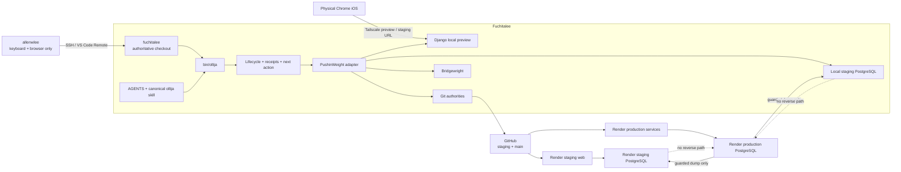
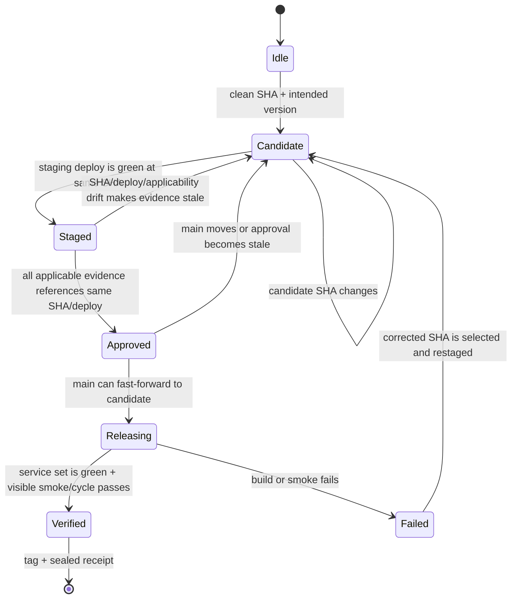
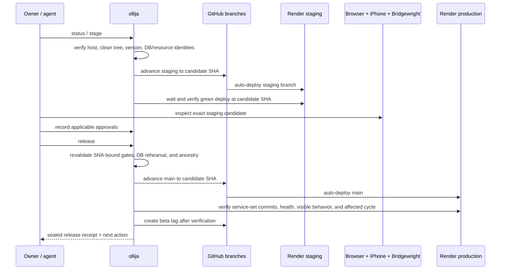

> **Superseded Ollija workflow — historical plan.** This plan records the
> retired stateful release controller. For current behavior, read the
> [Ollija plan guide](../ollija/README.md).

# ollija Staging and Release Workflow - Plan

## Goal Capsule

- **Objective:** Build **ollija**, a PushinWeight-specific, single-developer staging and release workflow that lets the owner preview one exact candidate on `fuchitalee`, verify it in desktop Chrome and physical Chrome on iPhone, deploy it to an isolated Render staging stack, and promote that same commit to production with a durable receipt.
- **Primary authority:** The Product Contract below governs behavior; `AGENTS.md` governs repository policy; `.ollija/project.yaml` governs tracked project configuration; live Git, Render, PostgreSQL, and Bridgewright observations govern current state; ignored ollija receipts record evidence but never overrule those live systems.
- **Authoritative machine:** `fuchitalee` is the only machine that may hold the PushinWeight checkout, project skills, ollija runtime state, database snapshots, proof artifacts, or release receipts. `allenwlee` may only act as a keyboard/browser endpoint connected to `fuchitalee`.
- **Execution profile:** Code, infrastructure configuration, local operations, Render provisioning, credential rotation, documentation, and one complete beta-release rehearsal.
- **Tail ownership:** The executor owns implementation, test repair, staging provisioning, the dress rehearsal, production verification, and cleanup of abandoned implementation attempts. It stops for a product decision only when preserved work cannot be reconciled without choosing which behavior wins, a credential cannot be rotated by the owner, or an external resource identity is ambiguous.
- **Hard stops:** Do not mutate Git, databases, Render, or Bridgewright from a non-authoritative host; do not release from a dirty or diverged candidate; do not restore into an unverified database target; do not release a commit that differs from the successfully staged and approved SHA; do not call Twitter or LLM providers from staging except through the explicit bounded manual-test path with separate test credentials; do not report success until the production service set and user-visible smoke checks pass.

---

## Product Contract

### Summary

ollija will give one developer a small, repeatable path from “I have changes” to “the exact reviewed beta is live.” It will replace chat-memory release instructions with a deterministic command surface that inspects the repository and external systems, tells the owner the next safe action, refuses unsafe transitions, and records evidence against an immutable candidate SHA.

Version 1 is deliberately specific to PushinWeight and runs only from its authoritative checkout on `fuchitalee`. The internal boundaries will nevertheless separate lifecycle logic, project configuration, and PushinWeight adapters so a future standalone `ollija` project can extract the reusable engine without turning this release into a generic framework project.

### Problem Frame

Production currently deploys automatically from `main`, while development state is spread across a root checkout that is behind `origin/main`, substantial uncommitted work, several old worktrees, local SQLite data, a partially prepared local PostgreSQL staging database, Render production services, and Bridgewright evidence. This makes a seemingly simple push risky: the developer can review one tree locally and deploy another, accidentally use production data or credentials in staging, lose track of which phone result belongs to which commit, or confuse a failed build with a successful release.

The workflow also needs to be understandable without professional release-engineering experience. The owner should be able to ask an agent “what’s next?”, “show staging”, “the iPhone looks good”, or “release the next beta” and receive prompt-by-prompt guidance derived from current state. The system must be simple enough for a solo developer while still protecting beta users from ongoing experimentation.

### Key Decisions

- **Use `ollija` as the canonical name everywhere, including prose, commands, paths, configuration, and any future standalone project.** (session-settled: user-directed — one spelling and casing avoids separate display and machine identities.) Governs R5, R13, R15, R17.
- **Keep all PushinWeight artifacts on `fuchitalee`; never synchronize or install them on `allenwlee`.** (session-settled: user-directed — chosen over two-host installation and synchronization: a single physical source of truth is easier to reason about.) Governs R1, R13, R19.
- **Use one permanent `staging` branch and no routine feature worktrees.** (session-settled: user-approved — chosen over GitFlow and per-feature worktrees: the solo workflow needs one obvious pre-production lane.) Governs R2, R4, R7, R16.
- **Use a permanent isolated Render staging web service and PostgreSQL database.** (session-settled: user-approved — chosen over per-PR preview environments and local-only staging: the owner needs a stable URL without Render Pro preview-environment complexity.) Governs R2, R4, R10, R11.
- **Refresh staging from production only on demand and only in the production-to-staging direction.** (session-settled: user-approved — chosen over continuous synchronization: staging should be realistic without becoming coupled to production.) Governs R3, R10, R18.
- **Bind staging evidence and all approvals to the exact candidate commit.** (session-settled: user-approved — chosen over branch-name or conversational approval: any code change must invalidate old evidence.) Governs R4, R6-R9, R14.
- **Keep Bridgewright as the UI contract and proof layer, not the deployment authority.** (session-settled: user-directed — chosen over letting Bridgewright approve or ship product code: the coding workflow owns Git and Render.) Governs R6, R14.
- **Make Version 1 repo-specific but preserve a narrow extraction seam for a future standalone ollija.** (session-settled: user-directed — chosen over either a one-off script pile or a generic multi-provider framework: portability matters later, not at the cost of today’s simplicity.) Governs R13, R15.
- **Do not run staging harvest, headline generation, or recurring provider-backed workers.** (session-settled: user-approved — chosen over production-topology symmetry: the staging purpose is review, not duplicate data collection or API spend.) Governs R11, R18.
- **Keep Codex, Claude Code, and direct human operation on one agent-neutral workflow.** (session-settled: user-directed — `AGENTS.md`, one shared skill, and the CLI must expose the same path in every harness.) Governs R13, R17.
- **Count the first complete production beta as a condition of rollout success.** (session-settled: user-directed — implementation alone is insufficient; production must be error-free and visibly serve the intended headline/homepage.) Governs R9, R20.

### Actors

- **A1 — Product owner:** starts work, reviews local and hosted staging, records desktop/iPhone approval, authorizes a release, and rotates credentials when provider consoles require human interaction.
- **A2 — Coding agent:** Codex, Claude Code, or another agent that reads repository policy, invokes ollija, explains the result, and performs only actions exposed by the deterministic workflow.
- **A3 — ollija core:** derives current state, computes the next valid transition, enforces host/SHA/branch/database gates, and writes non-secret receipts.
- **A4 — PushinWeight adapter:** knows Render resource identities, Django checks, PostgreSQL refresh/scrub rules, Tailscale preview behavior, Bridgewright commands, and user-visible smoke paths.
- **A5 — External authorities:** GitHub, Render, Render PostgreSQL, Google OAuth, Bridgewright, and physical Chrome on the linked iPhone.

### Requirements

**Authority and isolation**

- **R1.** Every mutating ollija command must verify that it is running from the canonical PushinWeight checkout on `fuchitalee`; a run from `allenwlee`, another clone, an unregistered worktree, or an unresolved repository root must refuse and explain how to connect to the authoritative host. Status may report the mismatch but must not create project artifacts there.
- **R2.** Production must remain `main` + `render.yaml` + the existing production services/database, while staging must use the permanent `staging` branch + a separately managed staging Blueprint + uniquely named staging web/database resources and staging-only configuration.
- **R3.** Local review must run Django on `fuchitalee` against a dedicated local PostgreSQL staging database populated by the guarded refresh path, never `data/django_dev.db`, the historical SQLite database, or a production connection.
- **R4.** Hosted staging must deploy the full candidate SHA from `staging`, and ollija must verify the successful Render deployment’s commit identity before it accepts any hosted-stage approval.

**State, guidance, and approvals**

- **R5.** `ollija status` must be read-only and derive a concise current state and one recommended next action from live Git, Render, PostgreSQL, Bridgewright, version, and receipt facts; agents must be able to answer “what’s next?” without relying on conversation memory.
- **R6.** Desktop, physical-iPhone, and applicable Bridgewright approvals must record the candidate SHA, environment, timestamp, approver, and evidence reference; a changed SHA, replaced staging deploy, or changed affected-surface classification must make the prior approval stale.
- **R7.** A release must advance `main` only by fast-forwarding it to the exact staged candidate SHA; if `main` moved, the candidate diverged, or the local tree is dirty, release must stop and require a new staged candidate.
- **R8.** Every candidate must carry its intended version before staging approval. The repository currently declares `0.2.0`; its first beta maps deterministically to PEP 440 package version `0.2.0b1` and release tag `v0.2.0-beta.1` unless that tag already exists. Later beta ordinals must increment in both forms, and a tag is created only after production verification succeeds.
- **R9.** Release success requires every configured production service expected to deploy the candidate to report a green exact-SHA deployment, passing health checks, a passing user-visible authenticated or public smoke path as applicable, and a complete immutable receipt. When the diff affects harvest, headline generation, or another recurring component, one post-release invocation must be observed from start to terminal success at the candidate SHA within that component’s configured timeout and without new error events. A failed, missing, mixed-SHA, timed-out, or visibly incorrect service deployment must leave the release incomplete and preserve the last-known-good service-set identity.

**Data, spend, and secrets**

- **R10.** Production-derived data refresh must use a dedicated read-only dump role and be one-way, read-consistent, checksum-pinned, and target-guarded. It must restore into an additional non-serving logical database in the target staging PostgreSQL instance, scrub or reset authentication, sessions, queued work, and environment-specific rows before activation, validate schema and representative row counts, and refuse any target whose identity could be production. Unscrubbed dump/shadow material must be access-restricted, absent from receipts, and deleted after bounded recovery retention.
- **R11.** Staging must provision only the web surface and its independent PostgreSQL database in Version 1. Harvest cron, headline worker/broker, automatic provider calls, and recurring Twitter/LLM spend must be absent or fail-closed; bounded manual tests require an explicit command and separate test credentials.
- **R12.** `.env` and runtime secrets must not be tracked. Credentials exposed in the current tree or history must be rotated before staging goes live, environment values must remain scoped by service/environment, ollija output must redact them, and the current branch must be sanitized without a destructive history rewrite during this workflow.

**Agent and UI parity**

- **R13.** Codex and Claude Code must receive the same always-on repository policy and the same ollija coaching behavior from one canonical skill source; neither agent may contain a private release path unavailable to the other or to the CLI.
- **R14.** UI-affecting candidates must require Bridgewright validation/status plus physical Chrome iOS approval. Non-UI candidates may mark these gates not applicable only with a recorded affected-surface reason; desktop simulation cannot overrule a physical-device failure.
- **R15.** Lifecycle logic must depend on a small project contract and adapter ports rather than inline Render/PushinWeight assumptions, so a future standalone `ollija` repository can extract the engine and skill while PushinWeight retains its project config and adapter.

**Recovery and operations**

- **R16.** Initial rollout must reconcile the dirty, behind root checkout and all registered worktrees without deleting user work: every change set is either landed, preserved on a named branch/commit, explicitly classified as generated/runtime material, or escalated when two versions require a product choice.
- **R17.** Common owner prompts—start work, show local preview, stage this, record phone approval, release the next beta, verify production, and what’s next—must map to one documented ollija command or an explanatory status result, with prompt-by-prompt guidance and no need to memorize Git or Render internals.
- **R18.** Failed stage, release, refresh, or verification attempts must be resumable from live state. ollija must never infer success from a prior command exit alone, and its recovery guidance must preserve production availability, forbid reverse data synchronization, and identify the last-known-good production service-set identity.
- **R19.** Structured status, logs, receipts, and test fixtures may contain resource IDs, commit SHAs, timestamps, counts, checksums, and normalized error codes, but never secret values, database URLs, OAuth tokens, post content from private snapshots, or provider request/response bodies.
- **R20.** The rollout is not complete until ollija performs one full dress rehearsal and then ships the first beta: the same SHA is locally reviewed, staged, desktop/iPhone/Bridgewright-approved when applicable, promoted, green on production, visibly serving the intended homepage/headline behavior, tagged, and represented by a complete release receipt.
- **R21.** A database-affecting candidate must be detected from migrations, models, restore/scrub policy, or persistent-write paths and must rehearse its forward migration against a fresh production-derived staging shadow. ollija must record pre/post schema and data invariants, require the rehearsal to pass at the candidate SHA, and block release when the snapshot is stale, the migration is destructive without a recovery path, or expected invariants differ.
- **R22.** A database-affecting release must preserve compatibility between the post-migration schema and the currently live application during rollout. Destructive contract changes must follow expand/migrate/contract sequencing and ship only in a later release after the new code is stable. Before promotion, ollija must record the available production recovery point and prove whether the prior service-set SHA can run safely against the migrated schema; recovery may redeploy prior code only when that compatibility is proven, otherwise it must roll forward or use the documented database recovery path.
- **R23.** Hosted staging must be internal to the owner: Google OAuth login and callback routes may remain reachable, but application access must require a staging-only allowlist containing the owner’s Google email. Local device preview must use private tailnet HTTPS through Tailscale Serve/MagicDNS. Neither path may fall back to production OAuth settings or expose a public unauthenticated staging surface.
- **R24.** If `fuchitalee` is unavailable, no second machine becomes authoritative automatically. Recovery must rebuild from Git/Render on an explicitly designated replacement host other than `allenwlee`, update the canonical host marker in one auditable authority-transfer step, and verify the old host is inactive before mutations resume; `allenwlee` remains artifact-free without exception.

### Key Flows

- **F1 — Inspect and choose the next action**
  - **Trigger:** A1 or A2 asks “what’s next?” or invokes status.
  - **Flow:** A3 verifies host/repo identity, reads Git and project config, queries applicable Render/Bridgewright state, validates receipts against live SHA/deploy identities, and reports the current lifecycle state plus one next command.
  - **Outcome:** No mutation occurs; contradictory or unreachable authorities are reported as blockers rather than guessed.
  - **Covers:** R1, R5, R13, R17-R19.

- **F2 — Refresh realistic staging data and preview locally**
  - **Trigger:** A1 requests a fresh data snapshot or local preview.
  - **Flow:** A3 confirms the dedicated read-only source role and target identities, obtains and pins a production logical dump, restores to an additional non-serving logical database in the validated staging target, applies the scrub policy, validates and activates the database binding, and starts Django against local PostgreSQL through private Tailscale HTTPS.
  - **Outcome:** Desktop Chrome and physical Chrome iOS can inspect the candidate without touching production or launching provider work.
  - **Covers:** R1, R3, R10-R12, R18, R19, R21-R23.

- **F3 — Stage and approve a candidate**
  - **Trigger:** A1 selects the current clean commit as the next beta candidate.
  - **Flow:** ollija freezes its intended version and candidate SHA, advances the `staging` branch, waits for the staging web deployment, verifies the deployed SHA, health, database identity, and owner-only access gate, classifies UI impact, and collects the required desktop/iPhone/Bridgewright approvals.
  - **Outcome:** The candidate becomes releasable only when every applicable approval references the same successful staging deploy and SHA.
  - **Covers:** R2, R4, R6, R8, R11, R14, R17-R19.

- **F4 — Release and verify production**
  - **Trigger:** A1 explicitly asks to release a fully approved candidate.
  - **Flow:** ollija revalidates every gate, including the hosted database rehearsal when applicable, fast-forwards `main` to the candidate, observes every configured production service, runs health and user-visible smoke checks plus one affected recurring invocation, records the live service-set identity, then creates the beta tag and final receipt.
  - **Outcome:** The exact reviewed commit and configured service set are live and auditable; any failure leaves the release incomplete with schema-compatible recovery guidance.
  - **Covers:** R7-R9, R12, R17-R22.

- **F5 — Recover from drift or failure**
  - **Trigger:** Candidate SHA changes, `main` moves, an approval becomes stale, Render fails, or production smoke fails.
  - **Flow:** ollija recomputes state from authorities, invalidates affected evidence, identifies the last-known-good service set and database recovery posture, and directs the owner to restage a corrected candidate, redeploy the known-good service set only when schema compatibility is proven, or follow the documented roll-forward/database-recovery path.
  - **Outcome:** No stale receipt is treated as permission and no database content flows from staging back to production.
  - **Covers:** R5-R10, R16-R19.

### Acceptance Examples

- **AE1 — Agent launched on Allen’s Mac.** Given the owner starts Codex or Claude Code on `allenwlee`, when it invokes any ollija mutation, then the command refuses without creating state and tells the agent to operate through the canonical checkout on `fuchitalee`. Covers R1, R13, R17, R19.
- **AE2 — One-line fix after phone approval.** Given SHA A has a green staging deploy and iPhone approval, when any file change produces SHA B, then the approval for A becomes stale and release of B is blocked until B is staged and reapproved. Covers R4, R6-R9.
- **AE3 — Wrong database target.** Given a refresh target resolves to the production database resource, hostname, database name, or protected fingerprint, when refresh starts, then it refuses before any schema or data mutation. Covers R10, R18, R19.
- **AE4 — UI change passes desktop but fails on iPhone.** Given desktop and Bridgewright preflight pass but the physical phone interaction fails, when approval state is evaluated, then the candidate remains unreleasable. Covers R6, R14.
- **AE5 — Backend-only change.** Given the diff does not touch a visible surface, interaction, locale copy, template/static path, or Bridgewright contract, when A1 records desktop review, then ollija records Bridgewright and iPhone as not applicable with the classifier reason instead of demanding empty evidence. Covers R6, R14.
- **AE6 — Production moved after staging.** Given candidate A is approved but `main` advances independently, when release runs, then fast-forward eligibility fails and ollija requires the candidate to be reconciled and staged again. Covers R5, R7-R9, R18.
- **AE7 — Render build fails.** Given `main` advances to the candidate but Render’s new production build fails before going live, when ollija verifies production, then it records an incomplete release, confirms the previous live deploy remains authoritative, creates no beta tag, and directs the owner to fix and restage. Covers R8, R9, R18.
- **AE8 — First complete beta.** Given the intended candidate is clean, staged, approved, and production deploys the same SHA, when homepage/headline smoke checks pass, then ollija creates `v0.2.0-beta.1`, seals the receipt, and status recommends beginning the next change from the synchronized `staging` lane. Covers R8, R9, R17, R20.
- **AE9 — Candidate contains a Django migration.** Given a candidate changes `core/migrations/` or another configured persistent-data surface, when staging readiness is evaluated, then ollija requires a fresh production-derived shadow restore, runs the candidate migration there, records pre/post invariants, and refuses production release if the rehearsal is missing or inconsistent. Covers R10, R18, R21.
- **AE10 — Destructive schema contraction is bundled too early.** Given a candidate removes a column still required by the live service set, when release readiness is evaluated, then ollija blocks promotion and requires the contract migration to move to a later release with a recorded recovery point. Covers R18, R21, R22.
- **AE11 — Non-owner opens hosted staging.** Given a Google account is valid but its normalized email is not on the staging allowlist, when it completes OAuth, then the staging application denies access without revealing product data. Covers R12, R19, R23.
- **AE12 — Authoritative host is unavailable.** Given `fuchitalee` cannot be reached, when an agent runs ollija elsewhere, then mutations remain blocked until an explicit authority-transfer procedure proves the replacement and old-host inactivity. Covers R1, R19, R24.

### Success Criteria

- A solo developer can complete the ordinary staging and release path by following ollija’s one-next-action guidance without issuing direct Git-ref, Render-deploy, or PostgreSQL-restore operations.
- The staging URL, database, credentials, and background-work profile are demonstrably separate from production.
- A stale SHA, wrong host, dirty tree, wrong database, failed deployment, or missing applicable approval is caught before production promotion.
- Codex and Claude Code produce the same workflow behavior because both coach through the same deterministic commands and policy.
- The first full beta release meets R20 with no Render errors and a visible production headline/homepage result.

### Scope Boundaries

**In Version 1**

- One PushinWeight checkout on `fuchitalee`, one `staging` branch, one production `main` branch.
- One local PostgreSQL staging database and one isolated Render staging PostgreSQL database.
- One Render staging web service; production services remain as currently defined.
- Deterministic status, preview, refresh, stage, approve, release, production verification, and recovery guidance.
- Repo-local agent policy and a shared ollija skill for Codex and Claude Code.

**Deferred**

- Extraction into a standalone `ollija` repository, global installer, plugin marketplace package, second-project adapter, or provider-neutral public API.
- Per-PR preview environments, multi-developer approval roles, protected-branch review policy, elaborate CI/CD, or automatic semantic-version changelog generation.
- A permanent staging harvester, headline worker, broker, Twitter/LLM test budget, or continuous production-data synchronization.
- A Version 2 data detail page or analytics UI; ollija only anticipates evidence links and receipts.
- Git-history rewriting. Current values are removed and all exposed credentials are rotated now; any history purge is a separate post-reconciliation maintenance task.

**Human-only boundaries**

- Entering or consenting to OAuth/provider credentials, judging the physical-iPhone result, approving a candidate, and authorizing production release remain owner actions. Agents may prepare, inspect, and explain these gates but cannot infer or fabricate their completion.

### Dependencies

- Working SSH/Tailscale access to `fuchitalee`, local PostgreSQL 18, Git remote access, authenticated Render CLI, GitHub access, Google OAuth administration, and the linked physical iPhone.
- Render capacity for a small staging web service and independent paid PostgreSQL instance with an additional logical shadow database.
- Existing `build.sh` advisory-lock migration behavior, Django health/login routes, production Blueprint, and Bridgewright installation/configuration.
- Human access to rotate Google, TwitterAPI, DeepSeek/LLM, Django, and any exposed database credentials that cannot be rotated through the available CLI.

### Sources

- Repository policy and current deployment: `AGENTS.md`, `render.yaml`, `build.sh`, `project/settings.py`, `bridgewright.yaml`, `pyproject.toml`.
- Existing deployment runbook: `docs/deploy/render.md`.
- Database safety learnings: `docs/solutions/operations/render-shadow-restore-and-cutover.md`, `docs/solutions/data-migration/restore-large-pg-dump-to-render-via-s3-multipart.md`, `docs/solutions/data-migration/posts-raw-denormalize-prod-incident-2026-07-28.md`, `docs/solutions/data-migration/posts-raw-denormalize-staging-verified-2026-07-28.md`.
- UI/device verification learnings: `docs/solutions/ui-bugs/2026-08-10-182057-public-template-commentary-visual-verification.md`, `docs/solutions/workflow-issues/mobile-homepage-mockup-handoff-2026-07-30.md`.
- Render Blueprint, deploy, staging, and database behavior: https://render.com/docs/blueprint-spec, https://render.com/docs/deploys, https://render.com/docs/infrastructure-as-code, https://render.com/docs/preview-environments, https://render.com/docs/projects, https://render.com/docs/postgresql-creating-connecting, https://render.com/articles/how-to-backup-and-restore-postgresql-databases.
- Cross-agent skill/policy behavior: https://developers.openai.com/codex/skills, https://developers.openai.com/codex/guides/agents-md, https://code.claude.com/docs/en/slash-commands, https://code.claude.com/docs/en/features-overview.
- Private device preview and Python version syntax: https://tailscale.com/kb/1242/tailscale-serve, https://packaging.python.org/en/latest/specifications/version-specifiers/#version-specifiers.

---

## Planning Contract

### Context and Research Findings

- The root checkout is on `main` at `fb027c6`, 31 commits behind `origin/main`, with extensive modified and untracked files. Registered worktrees include headline, homepage, iPhone locale, harvester, and metrics branches; some contain uncommitted data or source changes. This makes preservation and reconciliation a prerequisite, not optional cleanup.
- `pyproject.toml` currently declares version `0.2.0`, and no existing `v0.2.0*` tag was found during planning. The first candidate therefore uses the explicit PEP 440/package-to-tag mapping in R8 rather than inferring a version from conversation state.
- `origin/main` tracks `.env`, and current/history documents contain credential-shaped values. The staging rollout must begin with rotation and current-tree sanitization. Rewriting history now would destabilize the already-diverged branches and is therefore deferred until after reconciliation.
- Production is no longer the topology described by the stale root `CLAUDE.md` or parts of `docs/deploy/render.md`. Current `origin/main:render.yaml` defines the web service, harvest cron, headline worker, and headline broker against the production PostgreSQL authority. Agent instructions must stop duplicating this deployment description.
- Render supports branch-specific services and Blueprint validation. Preview environments require Pro and instantiate empty datastores rather than copying production data, so a permanent staging Blueprint is the simpler fit for this solo workflow.
- Render can report and deploy specific commit SHAs, but branch auto-deploy can replace a manually selected commit. ollija therefore uses branch heads for ordinary staging/production triggers and verifies the resulting deployed commit rather than mixing branch auto-deploy with manual specific-commit deployment.
- Prior PostgreSQL incidents establish three non-negotiable patterns: never destructive-restore into an unverified target, pin and verify dump content at the destination, and run realistic regression checks against production-derived PostgreSQL before production changes. The known `fuchitalee` upload path may require S3 multipart plus Render-internal restore.
- Physical Chrome iOS is authoritative for iPhone behavior; desktop mobile simulation is only preflight. Browser-visible verification must exercise the actual route and runtime DOM, not only source assertions.

### Key Technical Decisions

- **KTD1 — The deterministic CLI is the workflow authority; agent skills are thin coaches.** `bin/ollija` invokes a Python package under `scripts/ollija/`. Every state transition is available without an agent, returns structured data plus concise human output, and enforces its own gates. Skills translate natural-language requests into commands and explain results; they do not implement hidden Git, Render, database, or approval logic. Implements R5, R13, R17-R19.
- **KTD2 — `AGENTS.md` and `.agents/skills/ollija/` are canonical across agents.** Root `CLAUDE.md` becomes an `@AGENTS.md` import rather than a copied policy. The canonical skill lives at `.agents/skills/ollija/SKILL.md` for Codex; `.claude/skills/ollija` is a tracked relative symlink to that directory for Claude Code. This preserves one policy and one coaching implementation. Implements R13, R15, R17.
- **KTD3 — Tracked project contract, ignored runtime evidence.** `.ollija/project.yaml` contains non-secret identities and policy: canonical host/repo marker, branch names, version source, resource names/IDs, health and smoke paths, UI-impact rules, database fingerprints, and adapter selection. `.ollija/state/` contains ignored JSON receipts and checksums. Live authorities always revalidate a receipt before use. Implements R1-R6, R12, R18, R19.
- **KTD4 — Use an explicit candidate state machine.** The lifecycle is `idle → candidate → staged → approved → releasing → verified`; `blocked` and `failed` are derived observations, not manually asserted success states. SHA, deployment, version, or UI-impact drift transitions evidence to stale. Mutations are idempotent where possible and resume by re-reading authorities. Implements R4-R9, R17-R20.
- **KTD5 — Keep Git linear and permanent.** `staging` is long-lived and advances to the reviewed candidate; `main` advances only by fast-forward to a commit already at the approved staging identity. Routine ollija use creates no worktrees or merge commits. Existing worktrees are reconciled once under U1, with preservation before removal. Implements R2, R7, R16, R18.
- **KTD6 — Manage staging with its own Blueprint and resource names.** `render-staging.yaml` owns only `pushinweight-staging-web` and `pushinweight-staging-db`, is connected to `staging`, and uses commit auto-deploy. It never manages production resources, and `render.yaml` never manages staging resources. A Blueprint validation and live resource-identity comparison precede provisioning or sync. Implements R2, R4, R11, R18.
- **KTD7 — Database refresh is a guarded logical-database pipeline, not an ad hoc restore command.** A dedicated read-only production role produces a read-consistent logical PostgreSQL dump and records source identity/timestamp/checksum/schema metadata. The adapter restores into an additional non-serving logical database in the target staging PostgreSQL instance, applies the explicit scrub/reset manifest, runs candidate migrations, validates counts and invariants, then switches only the staging application binding to the validated database. The prior logical database remains available for a bounded staging rollback before cleanup. Local and Render targets use the same manifest. Unscrubbed dump/S3/shadow material receives restrictive permissions and bounded cleanup; the proven multipart/Render-internal path is the fallback for large outbound restores from `fuchitalee`. Implements R3, R10, R12, R18, R19, R21.
- **KTD8 — Local preview uses production-derived PostgreSQL and private tailnet HTTPS.** Preview sets only development-safe environment overrides, starts Django on a known available loopback port, exposes it through Tailscale Serve/MagicDNS, reports local and private HTTPS URLs, and verifies that the effective database is the local staging fingerprint before serving. It never starts harvest, Celery, or provider-backed work. Implements R1, R3, R10, R11, R17, R23.
- **KTD9 — Approvals are typed SHA-bound evidence.** Desktop review is always required. Physical iPhone and Bridgewright are required when deterministic diff classification identifies visible UI, interaction, mockup, locale, template/static, or Bridgewright-contract impact. The owner records approval only after inspection; ollija never self-approves. Evidence stores environment and deployed identity, and an applicability decision is itself part of the candidate receipt. Implements R4, R6, R14, R19.
- **KTD10 — Release promotes identity, not a merge narrative.** Immediately before release, ollija verifies a clean tree, candidate/version consistency, successful exact-SHA staging deploy, fresh approvals, `main` ancestry, production resource identity, and a fresh hosted database-rehearsal receipt when applicable. It then advances `main` to that exact SHA and observes Render’s normal branch deploy. A moved or non-fast-forward `main`, stale rehearsal, destructive migration without recovery posture, or invariant mismatch invalidates release readiness. Implements R7-R9, R18, R20-R22.
- **KTD11 — Version before approval, tag after verification.** The candidate includes a PEP 440 package version and beta ordinal before staging so displayed/versioned code is what the owner reviews. For the current `0.2.0` line, beta ordinal `n` maps to package version `0.2.0b<n>` and annotated tag `v0.2.0-beta.<n>`. The tag and final receipt are created only after exact-SHA production health and user-visible checks succeed. Implements R8, R9, R20.
- **KTD12 — Rotate exposed credentials; do not rewrite history in this rollout.** U1 removes `.env` from tracking, adds ignore/test coverage, sanitizes current tracked references, rotates all exposed values, and verifies Render scoping without displaying values. A history purge remains a separate task after old branches are reconciled because rewriting now would magnify the risk of losing work. Implements R12, R16, R19.
- **KTD13 — Bridgewright contributes evidence, never authority to deploy.** The adapter validates and queries the exact pinned Bridgewright project only for applicable UI candidates. Its assessment/evidence reference joins the ollija receipt, but only A1 records approval and only ollija performs release. Implements R6, R13, R14.
- **KTD14 — Preserve a narrow extraction seam.** The reusable layer owns state transitions, receipt validation, next-action calculation, command result schema, and adapter protocols. `.ollija/project.yaml` and `scripts/ollija/adapters/pushinweight.py` own all hostnames, branches, Render/PostgreSQL details, Django checks, and Bridgewright paths. Future extraction moves the engine and canonical skill; it does not force Version 1 to support a second project. Implements R13, R15, R17.
- **KTD15 — Production verification and recovery operate on the configured service set.** Build failure relies on Render’s prior-live behavior and remains untagged. ollija verifies the exact candidate across web, harvest, headline, and any other configured service expected to deploy; a mixed-SHA or partial-success topology is a failure. If a new service set becomes live but smoke/cycle checks fail, prior services may be redeployed only when the database rehearsal proves that the post-migration schema remains compatible; otherwise recovery rolls forward or follows the captured database recovery path. The broken `main` state remains visibly blocked until corrected and restaged. ollija never rewinds shared history or copies staging data into production. Implements R9, R18-R22.
- **KTD16 — Persistent-data impact adds a hosted release profile, not a second release workflow.** Deterministic path/config rules classify migrations, model changes, scrub changes, and persistent-write changes. U4 owns the reusable shadow/validation mechanism; U5 runs the required fresh rehearsal against hosted staging before approval. The receipt proves the candidate migration, explicit pre/post invariants, live-code compatibility, recovery point, and expand/migrate/contract posture before ordinary release gates can pass. Implements R10, R18, R21, R22.
- **KTD17 — Staging access is owner-only at the application boundary.** The staging environment uses its own Google OAuth client and normalized email allowlist. Login and callback routes remain reachable, but all product routes and data require the allowlisted owner. Tests cover valid-but-unlisted accounts and prove there is no production OAuth fallback. Implements R12, R19, R23.
- **KTD18 — Single-host recovery is an explicit authority transfer.** Git and Render remain recovery authorities, but no standby checkout is maintained on `allenwlee`, and `allenwlee` is excluded as a replacement. The runbook designates another replacement host, verifies the old authority is inactive, updates the tracked canonical-host marker in a reviewed commit, and only then permits mutation. Implements R1, R19, R24.

### High-Level Technical Design

These diagrams describe boundaries and state; they do not prescribe exact class or function shapes.

### System-Wide Impact

- **Git lifecycle:** Adds permanent `staging`, linear promotion rules, candidate/version tags, and a one-time reconciliation of current branches/worktrees. Existing user changes remain outside ollija until preserved and classified.
- **Infrastructure:** Adds a staging Blueprint, one web service, and one database. It does not alter the production service topology except for secret hygiene and any corrections required to make `render.yaml` accurately describe live production.
- **Data lifecycle:** Introduces production-derived logical snapshots, non-serving restore shadows, scrub manifests, activation, and bounded deletion on `fuchitalee` and staging. Refresh receipts become sensitive operational metadata even though they contain no credentials or post bodies.
- **Authentication:** Requires a staging OAuth callback/origin and staging-scoped OAuth configuration. Copied production sessions and social-account links are removed during refresh.
- **Agent behavior:** Makes `AGENTS.md` canonical, converts `CLAUDE.md` to an import, and gives both agents the same repo skill. Action parity is complete because every mutation is a CLI command; context parity comes from the same status JSON and project contract.
- **UI verification:** Adds SHA-bound desktop/iPhone/Bridgewright approvals without changing Bridgewright’s authority boundary.
- **Operations and support:** Replaces stale deployment documentation with one owner-oriented ollija runbook, command glossary, failure recovery table, and beta-release checklist.

### Risks and Mitigations

- **Preserved work conflicts with current `origin/main`.** Mitigation: U1 snapshots and classifies each change set before syncing; overlapping behavioral conflicts stop for A1 instead of selecting a winner.
- **Secret values remain in history.** Mitigation: rotate every exposed value, remove current-tree copies, enable regression checks, and defer history rewrite until branch consolidation makes it safe.
- **Restore targets the wrong database.** Mitigation: require multiple independent target fingerprints and an explicit staging marker; make production fingerprints denylisted and test refusal before any destructive restore step.
- **Large dump transfer fails from the home network.** Mitigation: checksum both ends and use the repository’s verified S3 multipart + Render-internal path when direct transfer is not reliable.
- **An unscrubbed production snapshot survives longer than intended.** Mitigation: restrictive file/object permissions, no content in logs/receipts, explicit cleanup after activation, a bounded recovery TTL, and a doctor warning for expired artifacts.
- **Staging accidentally spends provider credits.** Mitigation: omit recurring services, omit production provider groups, set fail-closed flags, and require a separate bounded manual-test path.
- **Render branch deploy races with manual commit deploy.** Mitigation: use normal branch auto-deploy only and verify the deployed commit; do not mix it with manual specific-commit deployment in the happy path.
- **OAuth redirect or host settings block device review.** Mitigation: configure separate staging origins and explicit development Tailscale host overrides, then verify login/callback behavior as part of provisioning.
- **A valid non-owner Google account reaches staging data.** Mitigation: enforce a staging-only normalized email allowlist at the application boundary and test denial after successful OAuth authentication.
- **A new production deploy is green but behavior is wrong.** Mitigation: tag only after user-visible smoke, retain last-known-good deploy identity, and provide an explicit recovery transition.
- **A forward migration makes prior code unsafe to redeploy.** Mitigation: rehearse live-code compatibility, use expand/migrate/contract releases, capture a recovery point, and refuse prior-code rollback unless compatibility is proven.
- **The sole authoritative host is lost.** Mitigation: rebuild from Git/Render using an explicit one-host authority-transfer runbook; never maintain a second active checkout or silently promote `allenwlee`.
- **The extraction seam grows into premature framework work.** Mitigation: test only one PushinWeight adapter in Version 1; deferred portability is represented by boundaries, not a second implementation.

### Sequencing

U1 is a safety prerequisite for all implementation. U2 defines the contract/state model consumed by U3-U7. U3 supplies the command and guard foundation. U4 and U5 can then build local/database and hosted-staging paths. U6 binds staging to human/UI evidence. U7 adds production promotion only after all lower-risk transitions exist. U8 is the required regression-net and full dress rehearsal; it is the only unit allowed to declare the workflow releasable.

---

## Implementation Units

### U1. Reconcile the authoritative checkout and contain exposed secrets

- **Goal:** Establish a clean, current, recoverable `fuchitalee` baseline without losing any existing work, and remove credential exposure before creating staging resources.
- **Requirements:** R1, R12, R16, R19, R24.
- **Planning anchors:** KTD2, KTD5, KTD12, KTD18.
- **Dependencies:** None.
- **Files:** `.gitignore`, `.env.example`, `AGENTS.md`, `CLAUDE.md`, `docs/deploy/render.md`, `docs/operations/ollija-rollout-baseline.md`, current tracked files containing literal secrets, existing branch/worktree metadata, `tests/ollija/test_repository_hygiene.py`.
- **Approach:**
  - Inventory the root and every registered worktree with branch, SHA, upstream distance, dirty paths, and overlap with `origin/main`.
  - Record the inventory, preservation reference, runtime-artifact classification, owner decision, and final disposition for each root/worktree in `docs/operations/ollija-rollout-baseline.md` before changing registrations.
  - Preserve source/document changes in named recovery commits or branches before changing registrations. Classify databases, caches, generated evidence, and runtime files separately; do not commit them merely to make status clean.
  - Escalate only when two preserved versions change the same behavior and evidence cannot determine which is intended. Remove a worktree only after its content is reachable from a preserved ref and its runtime-only files are accounted for.
  - Bring the authoritative baseline to current `origin/main`, then create the permanent `staging` lane from the reconciled baseline.
  - Stop tracking `.env`, ignore it and ollija runtime state, retain a complete placeholder-only `.env.example`, sanitize credential values in current tracked docs, and rotate every credential identified by the audit. Keep values in Render/environment stores and local ignored files only.
  - Replace stale duplicated Claude policy with `@AGENTS.md`; preserve the current authoritative single-stack and Bridgewright rules in `AGENTS.md`. Document the one-host replacement procedure without installing or copying project artifacts to `allenwlee`.
  - Verify the previously trashed `allenwlee` checkout contains no unique work, then permanently remove that exact Trash artifact so no PushinWeight checkout or recovery copy remains on `allenwlee`.
- **Test Scenarios:**
  - A dirty source change is preserved and remains reachable after its old worktree is removed.
  - An untracked SQLite/PostgreSQL artifact is classified as runtime data and is not accidentally committed.
  - A conflicting homepage change remains blocked for owner resolution rather than being overwritten.
  - `.env` is absent from tracked files; placeholder examples remain usable; repository hygiene checks detect a reintroduced non-placeholder credential.
  - Root Claude policy resolves through `@AGENTS.md` and no longer contradicts the single-stack deployment.
  - A simulated host-replacement attempt remains read-only until the canonical marker is changed through the documented authority-transfer procedure, and `allenwlee` is rejected as a replacement.
- **Verification:** The authoritative root is current and clean except for deliberately preserved execution state; the rollout-baseline document accounts for every old worktree and preservation ref; no project checkout/artifact exists on `allenwlee`; current tracked content contains no live credential; rotated Render and local environments boot with the new values.

### U2. Define the ollija project contract, lifecycle, and receipt schema

- **Goal:** Create the stable repo-specific configuration and state model that all commands and agents share.
- **Requirements:** R1-R6, R8, R13, R15, R18, R19, R24.
- **Planning anchors:** KTD3, KTD4, KTD14, KTD18.
- **Dependencies:** U1.
- **Files:** `.ollija/project.yaml`, `scripts/ollija/__init__.py`, `scripts/ollija/config.py`, `scripts/ollija/state.py`, `scripts/ollija/results.py`, `scripts/ollija/adapters/base.py`, `scripts/ollija/adapters/pushinweight.py`, `tests/ollija/test_config.py`, `tests/ollija/test_state.py`, `tests/ollija/test_results.py`.
- **Approach:**
  - Define a versioned, non-secret project contract with canonical-host/repo identity, branches, version source, environment/resource identities, database denylist/staging markers, verification paths, UI-impact inputs, and the PushinWeight adapter name.
  - Model candidate, staging deploy, approvals, production deploy, last-known-good release, refresh, and failure evidence as versioned JSON receipts beneath ignored `.ollija/state/`; require mode `0700` for state directories, `0600` for receipt files, and bounded retention for superseded receipts.
  - Make receipt writes atomic and candidate identity immutable; status recomputes freshness from live authorities.
  - Define one structured command-result envelope for human and agent callers with status, state, next action, evidence references, warnings, and redacted errors.
- **Test Scenarios:**
  - Missing, malformed, or unknown-version config fails read-only with an actionable message.
  - Host/repo mismatch is represented without writing state.
  - A candidate SHA change stales deployment and approval receipts.
  - Interrupted receipt writes leave the prior valid receipt readable.
  - Runtime state creation enforces `0700` directories and `0600` receipt files; doctor warns on broader permissions or expired superseded receipts.
  - Result serialization contains resource IDs and SHAs but rejects secret-shaped fields and database URLs.
- **Verification:** Unit fixtures cover every lifecycle transition and drift rule; config loads from the repo root from any working directory; no runtime receipt is tracked.

### U3. Build the deterministic CLI, status engine, and safety guards

- **Goal:** Expose ollija as the single command authority and make “what’s next?” reliable before adding deployment mutations.
- **Requirements:** R1, R5, R7, R12, R13, R17-R19, R24.
- **Planning anchors:** KTD1, KTD3, KTD4, KTD18.
- **Dependencies:** U2.
- **Files:** `bin/ollija`, `scripts/ollija/__main__.py`, `scripts/ollija/cli.py`, `scripts/ollija/status.py`, `scripts/ollija/git.py`, `scripts/ollija/redaction.py`, `tests/ollija/test_cli.py`, `tests/ollija/test_status.py`, `tests/ollija/test_git_guards.py`, `tests/ollija/test_redaction.py`.
- **Approach:**
  - Follow the repository’s thin-wrapper/Python-package pattern: resolve the repo root safely in `bin/ollija`, then dispatch to the package.
  - Implement read-only `status`/`doctor` first, including host, repository, worktree, dirty-tree, branch ancestry, version, local database, Render reachability, Bridgewright reachability, and receipt freshness checks.
  - Make each mutating command run the same preflight and refuse unknown, contradictory, or unsafe state. Provide structured JSON for agents and concise plain output for A1.
  - Map ordinary coaching intents to command help and one next action; avoid auto-running a downstream mutation from `status`.
- **Test Scenarios:**
  - Status on `fuchitalee` with a clean candidate returns one valid next action.
  - Status on `allenwlee`, a detached checkout, a dirty release candidate, and an unregistered worktree explains the block without state writes.
  - Diverged `main`/`staging` ancestry prevents release readiness.
  - Render or Bridgewright being temporarily unreachable yields “unknown/unreachable,” never “passed.”
  - Doctor reports a missing/incompatible Render CLI, Tailscale CLI, PostgreSQL client, or required authentication before any dependent mutation.
  - Human and JSON outputs represent the same state, and both redact synthetic secrets.
- **Verification:** `ollija doctor` and `ollija status` run from the root and nested directories; mutation guard tests prove fail-closed behavior; agent callers can select the same next action from JSON as the human output recommends.

### U4. Implement guarded data refresh and Tailscale-reachable local preview

- **Goal:** Give desktop and iPhone a realistic local review target backed by production-derived PostgreSQL without risking production or starting provider work.
- **Requirements:** R1, R3, R10-R12, R17-R19, R21-R23.
- **Planning anchors:** KTD7, KTD8, KTD16, KTD17.
- **Dependencies:** U3.
- **Files:** `scripts/ollija/database.py`, `scripts/ollija/preview.py`, `scripts/ollija/adapters/pushinweight.py`, `project/settings.py`, `.env.example`, `tests/ollija/test_database_guard.py`, `tests/ollija/test_refresh.py`, `tests/ollija/test_preview.py`, `docs/operations/ollija.md`.
- **Approach:**
  - Add source/target fingerprinting that combines configured Render resource identity, host, database, role, and a staging marker table/value. Require the production source role to be dedicated and read-only, deny all known production target fingerprints, and require positive staging identity before destructive target work.
  - Create the dump/checksum/additional-logical-database/scrub/validate/activate pipeline for local and hosted staging targets. The scrub manifest resets Django sessions, OAuth/account linkage, queued/background work, and environment-specific site/config rows while preserving product data needed for realistic review. Activation changes only the staging application binding and retains the previous logical database for a bounded rollback window.
  - Detect database-affecting candidates, run their forward migrations in the shadow, compare configured pre/post schema and data invariants, verify currently live code against the post-migration schema, capture the available recovery point, and preserve the prior serving staging state until the candidate shadow passes.
  - Restrict access to raw snapshots and temporary S3/shadow artifacts, exclude their content from logs/receipts, remove them after successful activation, and surface expired recovery artifacts through doctor/status.
  - Record snapshot age, source schema/migration identity, row-count checks, and checksum in a refresh receipt without storing URLs or content.
  - Start local Django only with the local staging PostgreSQL fingerprint, development-safe host/origin overrides, and provider/background controls off. Bind Django locally, expose it through Tailscale Serve/MagicDNS private HTTPS, report local and tailnet URLs, and manage one scoped server process without broad process-kill patterns.
- **Test Scenarios:**
  - Production target fingerprint, missing staging marker, ambiguous resource identity, and checksum mismatch all fail before target mutation.
  - The production dump role can read the required schema/data but cannot create, update, delete, truncate, or alter production objects.
  - A representative production-derived fixture restores, scrubs auth/session/queue rows, preserves product rows, and passes schema/count validation.
  - An interrupted restore remains incomplete and cannot become preview-ready.
  - A candidate migration that drops required data, changes expected counts outside tolerance, breaks currently live code, or lacks a recovery posture fails before shadow activation.
  - Successful activation removes or expires the unscrubbed local/S3/shadow artifacts while retaining only non-content metadata.
  - Preview refuses SQLite and production URLs, handles an occupied port, and exposes a private Tailscale HTTPS URL through the configured MagicDNS name.
  - Starting preview does not enqueue harvest/headline work or require Twitter/LLM credentials.
- **Verification:** A fresh production-derived snapshot loads into local `pushinweight_staging`; Django serves the expected login/home flow in desktop Chrome and physical Chrome iOS; database identity and no-provider-call assertions are captured in the refresh/preview receipts.

### U5. Provision and verify the isolated Render staging stack

- **Goal:** Create one stable hosted review environment that cannot operate on production data or incur recurring provider spend.
- **Requirements:** R2, R4, R10-R12, R17-R19, R21-R23.
- **Planning anchors:** KTD6, KTD7, KTD16, KTD17.
- **Dependencies:** U3, U4.
- **Files:** `render-staging.yaml`, `scripts/ollija/render.py`, `scripts/ollija/adapters/pushinweight.py`, `project/settings.py`, `core/middleware.py`, `tests/ollija/test_render_adapter.py`, `tests/ollija/test_render_staging_topology.py`, `tests/ollija/test_staging_access.py`, `docs/deploy/render.md`, `docs/operations/ollija.md`.
- **Approach:**
  - Define uniquely named staging web/database resources in a separate Blueprint connected to `staging`; use the existing build/start/health patterns where applicable.
  - Provide staging-only Django secret, hosts/origins, OAuth callback credentials, owner email allowlist, and database binding. Do not attach the broad production secret group or provision harvest, worker, broker, cron, or provider credentials.
  - Validate both Blueprints and compare proposed names/IDs with live resources before the owner provisions or syncs. Fail if the staging service resolves a production database or if either Blueprint claims the other environment’s resources.
  - Load a verified scrubbed snapshot through U4’s hosted logical-database path, switch only staging to the validated database, and record the deployed commit, refresh, schema, and recovery identities.
- **Test Scenarios:**
  - Static topology tests fail if staging adds a cron/worker/key-value service, a production resource name, or provider-call enablement.
  - Blueprint validation succeeds for production and staging files independently.
  - Staging boot fails safely when its own required OAuth/Django secret is absent and never falls back to production configuration.
  - A valid Google account not present in the staging allowlist completes authentication but cannot access product routes or data.
  - A staging deploy reports a different SHA from the candidate and remains unapprovable.
  - The staging URL serves the login/home path against the staging database with no recurring jobs present.
- **Verification:** Render lists exactly the intended staging web/database resources under the staging Blueprint; the web service is green at the expected `staging` SHA; owner-only access and database/environment checks prove separation from production; a refresh receipt proves production-derived scrubbed data, representative row counts within configured tolerance, and a source timestamp within the configured refresh window; recurring provider-backed services are absent.

### U6. Bind staged candidates to desktop, iPhone, and Bridgewright approvals

- **Goal:** Make human/device/UI proof explicit, applicable, and impossible to reuse after candidate drift.
- **Requirements:** R4, R6, R13, R14, R17-R19.
- **Planning anchors:** KTD4, KTD9, KTD13.
- **Dependencies:** U3, U5.
- **Files:** `scripts/ollija/approvals.py`, `scripts/ollija/impact.py`, `scripts/ollija/bridgewright.py`, `scripts/ollija/cli.py`, `tests/ollija/test_approvals.py`, `tests/ollija/test_ui_impact.py`, `tests/ollija/test_bridgewright_adapter.py`, `docs/operations/ollija.md`.
- **Approach:**
  - Classify UI applicability from the candidate diff and Bridgewright authorities using deterministic path/rule inputs from the project contract. Surface ambiguous impact for owner confirmation rather than silently skipping proof.
  - Record desktop and physical-iPhone approvals as owner actions against the exact staging deploy/SHA. For UI candidates, attach validated Bridgewright status/evidence from the pinned project.
  - Invalidate approvals when candidate SHA, staging deployment, Bridgewright source revision, or applicability changes.
  - Keep Bridgewright read/validate/assess operations separate from owner approval and release transitions.
- **Test Scenarios:**
  - Template/static/locale/Bridgewright changes require all three proof channels.
  - A backend-only diff records iPhone/Bridgewright as not applicable with a reason and still requires desktop review.
  - A simulated-mobile pass plus physical-iPhone fail remains blocked.
  - An approval for an older staging deploy cannot satisfy the same SHA redeployed with materially changed configuration.
  - Agent and direct CLI approval commands create identical typed receipts; neither can fabricate owner approval from Bridgewright output.
- **Verification:** A known UI candidate cannot become approved until desktop, physical iPhone, and Bridgewright evidence all reference the current staged identity; a known non-UI candidate takes the documented reduced path without bypassing desktop review.

### U7. Implement exact-SHA promotion, beta versioning, production verification, and recovery

- **Goal:** Promote only the reviewed candidate, verify it visibly in production, and leave clear recovery state when anything fails.
- **Requirements:** R5, R7-R10, R12, R17-R22.
- **Planning anchors:** KTD4, KTD10, KTD11, KTD15, KTD16.
- **Dependencies:** U3, U5, U6.
- **Files:** `scripts/ollija/release.py`, `scripts/ollija/versioning.py`, `scripts/ollija/verification.py`, `scripts/ollija/cli.py`, `tests/ollija/test_versioning.py`, `tests/ollija/test_release.py`, `tests/ollija/test_production_verification.py`, `docs/operations/ollija.md`.
- **Approach:**
  - Read the current version source and existing tags before staging approval. For the current `0.2.0` line, select package version `0.2.0b1` and tag `v0.2.0-beta.1`, or increment both forms to the next unused matching beta ordinal.
  - Re-run all host, Git, staging, version, approval, resource, secret-hygiene, and applicable database-rehearsal gates immediately before advancing `main` by fast-forward to the candidate SHA.
  - Observe every configured production service expected to deploy, reject mixed/partial SHA state, run Django health plus user-visible homepage/headline smoke checks, observe one affected recurring invocation from start to terminal success within its configured timeout, and record the live/last-known-good service-set identities.
  - Create the annotated beta tag and seal the release receipt only after verification. On failure, preserve all evidence, create no tag, and compute recovery guidance from whether the candidate ever became live.
- **Test Scenarios:**
  - Missing/stale approval, dirty tree, version mismatch, moved `main`, non-fast-forward ancestry, or wrong production resource blocks before promotion.
  - A database-affecting candidate with a missing/stale hosted rehearsal receipt blocks before `main` advances.
  - A destructive migration without expand/migrate/contract sequencing, a captured recovery point, and a proven recovery posture blocks before `main` advances.
  - A production deploy for the wrong SHA never verifies even if its health route is green.
  - Web green plus harvest/headline failed or on a different SHA remains an incomplete release.
  - Build failure leaves the prior live SHA as last-known-good and no beta tag.
  - Live deploy plus failed headline/home smoke produces a failed release; previous-SHA redeploy is offered only when post-migration schema compatibility was proven.
  - Exact-SHA green deploy plus visible smoke creates one tag and an idempotently readable sealed receipt.
- **Verification:** Release tests exercise every guard and failure boundary; a controlled staging-to-production rehearsal proves commit, version, deploy, smoke, tag, and receipt identity agree.

### U8. Install the agent-neutral coaching layer, regression net, and complete the first beta release

- **Goal:** Make the workflow intuitive in both agent harnesses, prove its differentiators end to end, and ship the first ollija-managed beta.
- **Requirements:** R1-R24; realizes F1-F5 and AE1-AE12.
- **Planning anchors:** KTD1-KTD18.
- **Dependencies:** U1-U7.
- **Files:** `.agents/skills/ollija/SKILL.md`, `.claude/skills/ollija` (relative symlink), `AGENTS.md`, `CLAUDE.md`, `docs/operations/ollija.md`, `docs/deploy/render.md`, `tests/ollija/test_agent_parity.py`, `tests/ollija/test_regression_net.py`, all U2-U7 test files.
- **Approach:**
  - Write one canonical skill that begins with status, coaches one transition at a time, distinguishes read-only inspection from mutations, never claims an unobserved pass, and maps the owner’s ordinary prompts to the deterministic CLI.
  - Add concise always-on policy to `AGENTS.md`; rely on the Claude import and skill symlink for parity. Document direct human use so ollija remains useful without an agent.
  - Build the required regression net around the differentiators: sole-host refusal, production/staging database separation, exact-SHA deploy identity, stale approval invalidation, no staging provider services, fast-forward-only promotion, and post-deploy visible verification.
  - Rehearse the intended beta candidate through local PostgreSQL preview, hosted staging, desktop and physical iPhone review, applicable Bridgewright proof, and a dry promotion check that reruns every release gate without advancing `main`. Inject stale/failure states only through fixtures. Resolve every discovered workflow defect; if the candidate changes, repeat staging and approvals for the new SHA.
  - Run the first real beta release through the same path, verify Render has no deployment errors and the intended homepage/headline is visible, create the final beta tag, and preserve the sealed receipt.
- **Test Scenarios:**
  - Codex and Claude skill discovery reach the same canonical instructions and return the same next command for identical status JSON.
  - “What’s next?”, “show staging”, “iPhone looks good”, and “release the next beta” map to the documented state-dependent transitions.
  - The full regression net fails when any guard is removed or any receipt is rebound to a different SHA.
  - The dress rehearsal catches at least one simulated stale/failed state and resumes without manual receipt editing.
  - The first production release satisfies AE8 and records complete evidence without secret or content leakage.
- **Verification:** The full test suite and deployment checks pass; both agent harnesses can coach the owner from status to completion; `v0.2.0-beta.1` (or the next available beta ordinal proven by tags) is live at the exact approved SHA; the production receipt links the successful deploy and visible smoke evidence.

---

## Verification Contract

### Automated gates

- `pytest tests/ollija -q` — focused ollija contract, guard, adapter, agent-parity, and regression-net coverage.
- `pytest` — full repository regression suite after all workflow and settings changes.
- `python manage.py check --deploy` — Django deployment configuration remains valid.
- `render blueprints validate render.yaml` — production Blueprint remains structurally valid.
- `render blueprints validate render-staging.yaml` — staging Blueprint is structurally valid.
- `./bin/ollija doctor` — authoritative host, dependencies, repository, databases, Render, Bridgewright, and secrets posture are observable.
- `./bin/ollija status --json` — machine-readable state validates against the command result schema and recommends the same transition as human output.

### Repository and secret gates

- `.env` is not returned by `git ls-files`; `.env.example` contains placeholders only.
- Repository hygiene tests scan current tracked text for prohibited literal credential/URL forms without printing matched values.
- The authoritative root and every retained worktree have an explicit U1 disposition; no project path or ollija artifact exists on `allenwlee`.
- `CLAUDE.md` imports `AGENTS.md`, and `.claude/skills/ollija` resolves to the canonical `.agents` skill.

### Staging gates

- Local preview reports the local staging PostgreSQL fingerprint and is reachable in desktop Chrome and physical Chrome iOS over the reported private Tailscale HTTPS URL.
- Hosted staging deploy is green at the candidate SHA; its environment resolves only the staging database and staging OAuth/secret scope, and a valid non-owner Google account cannot access product routes or data.
- Render inventory shows no staging cron, worker, headline broker, Twitter key, DeepSeek key, or provider-call enablement.
- A refresh receipt proves source timestamp/checksum, scrub completion, schema identity, and representative row-count validation without retaining credentials or content.
- For database-affecting candidates, the hosted refresh/rehearsal receipt proves a fresh logical-database shadow, candidate migration, configured pre/post invariants, current-live-code compatibility, recovery point, activation outcome, and cleanup of expired unscrubbed artifacts.

### UI and approval gates

- For an applicable UI candidate, run `bridgewright validate` and `bridgewright status`, then inspect the exact staged SHA in desktop Chrome and physical Chrome iOS.
- Approval receipts must reference the same candidate SHA and staging deploy; tests intentionally change each identity and confirm approval becomes stale.
- Public/authenticated browser smoke exercises the real route and runtime DOM. Source-only and server-response-only evidence cannot satisfy visible verification.

### Production release gates

- `main` advances only to the exact staged candidate and Render reports that commit as the live production deploy.
- For a database-affecting candidate, release refuses before promotion when the hosted rehearsal receipt is missing or stale, a destructive change lacks expand/migrate/contract sequencing or a recovery posture, or any schema/data invariant is outside tolerance.
- Every configured production service expected to deploy reports the candidate SHA and a green terminal state; production health/login succeeds, the intended homepage/headline behavior is visible, and one invocation of each affected recurring component is observed from start to terminal success within its configured timeout and without a new error event.
- The beta tag resolves to the live candidate SHA and is created only after those checks.
- The sealed receipt identifies candidate, version, staging deploy, approvals, production deploy, last-known-good predecessor, verification evidence, and completion time without secrets.

---

## Definition of Done

### Global completion

- All R1-R24 requirements and AE1-AE12 examples are satisfied with evidence.
- `fuchitalee` is the only PushinWeight/ollija artifact host; the previously trashed Allen checkout is permanently removed after its no-unique-work check, and no project artifact remains on `allenwlee`.
- Existing root/worktree changes are preserved and reconciled; no user source or documentation was discarded, and no abandoned experimental ollija code remains.
- Current tracked files contain no live credentials, `.env` is ignored/untracked, and every exposed credential used by production or staging has been rotated.
- Production and staging have distinct branches, Blueprints, services, databases, OAuth configuration, and secret scopes. Staging has no recurring provider-backed services.
- Hosted staging is owner-only after OAuth, and local device preview is private tailnet HTTPS.
- The local and hosted staging paths both display production-derived, scrubbed data and cannot resolve a production database target.
- Codex, Claude Code, and direct human use all reach the same ollija commands, state, and safety gates.
- The focused tests, full tests, Django checks, both Blueprint validations, ollija doctor/status, applicable Bridgewright checks, desktop review, and physical-iPhone review pass.
- The first ollija-managed beta is deployed to production at the exact approved SHA with no Render errors; the intended homepage/headline is visibly present; the beta tag and sealed release receipt agree.
- Operational docs explain the normal path, database refresh, staging provisioning, credential rotation, failure recovery, and future standalone extraction seam without requiring the owner to understand internal Git/Render choreography.
- Operational docs explain explicit replacement-host authority transfer without maintaining a second active checkout or storing project artifacts on `allenwlee`.

### Per-unit completion

- **U1:** Every existing change set is preserved/classified, the baseline is current, agent policy is canonical, and exposed credentials are removed/rotated.
- **U2:** Versioned project config, lifecycle rules, result schema, and atomic non-secret receipts pass their contract tests.
- **U3:** Read-only status and all mutation preflights derive truthful state and fail closed on host/Git/external ambiguity.
- **U4:** A read-only production snapshot, guarded logical-database refresh, and private Tailscale HTTPS preview work against PostgreSQL staging targets with background/provider work off.
- **U5:** The isolated Render staging web/database stack is provisioned, validated, populated, and demonstrably separate from production.
- **U6:** Desktop, iPhone, and Bridgewright applicability/evidence rules are SHA-bound and stale correctly.
- **U7:** Exact-SHA fast-forward release, beta version/tag behavior, production verification, and recovery state work across happy and failure paths.
- **U8:** Agent parity, the regression net, dress rehearsal, first production beta release, documentation, and cleanup are complete.

---

## Appendix

### Initial repository state to preserve during U1

- Root checkout: `main` at `fb027c6`, behind `origin/main`, with modified UI, reference docs, tests, data, skills, and untracked Bridgewright/research/plan artifacts.
- Registered worktrees include `fix/once-metrics-refresh`, `fix/harvester-near-real-time`, `release/v22-shell-match`, `feat/v22-headline-trend-narratives`, `fix/harvester-lang-detected`, `fix/ios-brand-pill-locale-overflow`, and `fix/v22-homepage-parity`, plus a prunable agent registration.
- `fix/ios-brand-pill-locale-overflow` contains uncommitted skill, database, JavaScript, and Bridgewright state; other worktrees contain untracked handoff or runtime database files.
- This inventory is a starting observation, not permission to delete or merge any item without U1’s preservation checks.

### Future standalone ollija seam

The eventual standalone project should receive only the lifecycle engine, result/receipt contracts, canonical coaching skill, and adapter protocol. PushinWeight should continue to own `.ollija/project.yaml`, the PushinWeight adapter, Render resource identities, PostgreSQL scrub policy, Django smoke paths, and Bridgewright project binding. A future extractor should prove the seam by adding a second real project adapter; Version 1 does not fake portability with unused abstractions.
