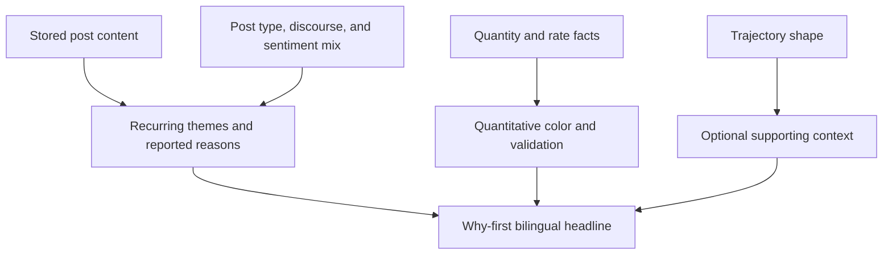
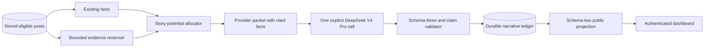
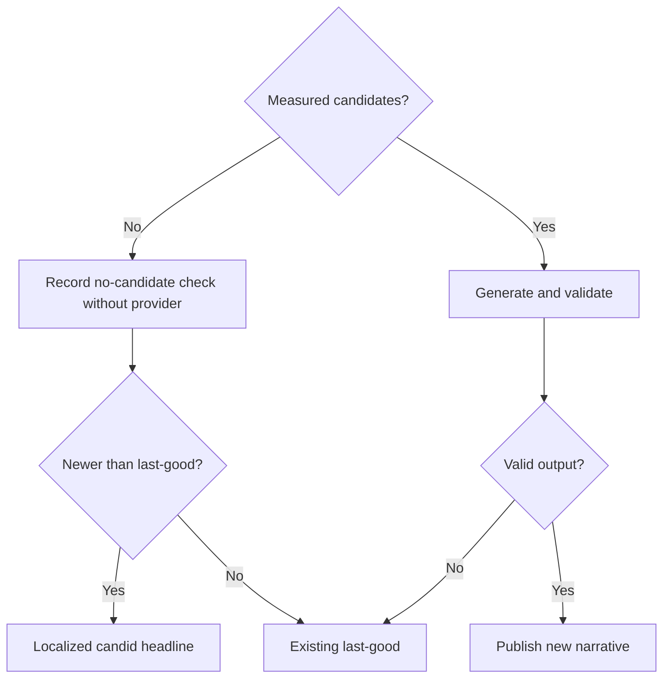
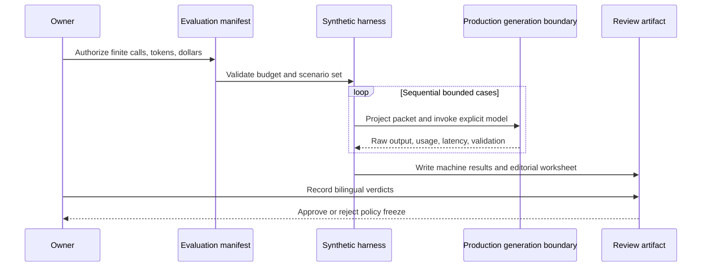

<!-- BEGIN OLLIJA DELIVERY GUIDE -->
## Ollija Delivery Guide

This block is generated guidance. Do not edit it directly. Correct durable facts in `.ollija/project.yaml` or this template, then rerun `./bin/ollija annotate-plan`. Put a user-directed exception in the editable Delivery Exceptions section below.

### Resolved locations

- Authoritative host: `fuchitalee`
- Authoritative repository: `/Users/fuchitalee/development/pushin-weight-v2`
- Ollija release worktree area: `/Users/fuchitalee/development/pushin-weight-v2/.worktrees`
- Active worktree: `/Users/fuchitalee/development/pushin-weight-v2/.worktrees/integrate/why-first-trend-headlines-20260824`
- Plan: `/Users/fuchitalee/development/pushin-weight-v2/.worktrees/integrate/why-first-trend-headlines-20260824/docs/plans/2026-08-14-195746-feat-why-first-trend-headlines-plan.md`
- Change: `why-first-trend-headlines-20260814`
- Branch: `integrate/why-first-trend-headlines-20260824`
- Staging branch and blueprint: `staging`, `/Users/fuchitalee/development/pushin-weight-v2/.worktrees/integrate/why-first-trend-headlines-20260824/render-staging.yaml`
- Production branch and blueprint: `main`, `/Users/fuchitalee/development/pushin-weight-v2/.worktrees/integrate/why-first-trend-headlines-20260824/render.yaml`
- Staging URL: `https://pushinweight-staging-web.onrender.com`
- Production URL: `https://pushinweight-web.onrender.com`

### Placement

This worktree is inside the Ollija release worktree area. Reuse it for the whole change. Do not create a second worktree or plan for this branch.

### Delivery scope

- Workflow: `lfg`
- Delivery target: `on-request`
- Owner selection recorded: `false`

Target is not authorized until the owner selects it. Wait for a later explicit release request; do not commit, push, stage, or promote on this guide alone.

### Failure handling

- Never promote a staging candidate whose automated checks failed.
- Implementation failures return to the parent implementation workflow for diagnosis, correction, recommit, and restaging.
- SSH, shell, environment, or multi-machine failures use the repository infra/multi-machine skill first.
- The change ledger is advisory; do not validate or enforce it.
- Do not run an endless retry loop or start a persistent Ollija process.
<!-- END OLLIJA DELIVERY GUIDE -->

## Delivery Exceptions

None.

# Why-First Trend Headlines - Plan

## Goal Capsule

- **Objective:** Make trend headlines lead with a grounded explanation of what people are discussing and why the brand is notable whenever content supports one, while keeping unsupported and quiet windows candid.
- **Product authority:** The session-settled editorial contract in this plan governs the next headline iteration; the existing V22 contract remains the verified description of current behavior.
- **Execution profile:** Deep, characterization-first implementation with an isolated feature worktree, focused PostgreSQL tests, a finite synthetic live-model evaluation, authenticated bilingual browser proof, and Ollija-governed release.
- **Product Contract preservation:** The Product Contract below is unchanged in meaning from the brainstorm. Planning adds mechanics, traceability, and gates without reopening its settled editorial hierarchy.
- **Stop conditions:** Stop before implementation if the intended base or worktree overlaps another headline effort; stop before live evaluation without finite call, token, and dollar budgets; stop before freezing configuration if historical calibration is under-sampled or the editorial review has a critical failure; stop before release whenever Ollija reports a guard or owner approval is absent.
- **Tail ownership:** The implementation agent owns code, tests, evaluation tooling, and current-state documentation. The owner retains live-evaluation authorization, editorial acceptance of the evidence policy, desktop and physical-iPhone approvals when applicable, and explicit beta-release authorization.

---

## Product Contract

### Summary

Trend headlines will lead with a content-derived explanation when one is supported, connect that explanation to measured changes in conversation makeup, and use numbers as validation and color.
The system will always publish a headline, including quiet windows, and a synthetic live-model evaluation will determine the evidence budget needed for reliable explanations.

### Problem Frame

The current headline contract gives trajectory shape more editorial weight than the reason a conversation matters.
It can describe a sustained rise, spike, reversal, or decline, but that leaves the reader asking what people were discussing and what changed in the substance of the conversation.

Conversation relevance is not stock-price momentum.
A brand can have flat total volume while positive sentiment rises sharply, release buzz gives way to hands-on usage, or users begin repeatedly citing downloads, intelligence improvements, pricing, or another concrete experience.
Those content changes can be the most important story even when the volume line barely moves.

The current provider projection supplies at most four evidence excerpts per candidate.
That is too little to characterize recurring content reliably across brands whose stored volume ranges from a few posts per hour to thousands per day.

### Key Decisions

- **Lead with the content-derived why.** (session-settled: user-directed — chosen over shape-first headlines: readers care first about what changed in the conversation and why.) Governs R2-R6.
- **Always produce a headline.** (session-settled: user-directed — chosen over suppressing quiet windows: the relative leader remains useful when absolute movement is small.) Governs R1, R7.
- **Separate relevance from movement magnitude.** (session-settled: user-directed — chosen over stock-like trend ranking: changes in quantity, rate, or conversation makeup can each create the leading story.) Governs R3, R7, R8.
- **Use window-specific calibrated language.** (session-settled: user-directed — chosen over universal or continuously relative thresholds: descriptive language should reflect each window's historical behavior without defining relevance.) Governs R8, R20.
- **Expand evidence adaptively.** (session-settled: user-approved — chosen over sending 48 excerpts for every candidate: likely headline subjects need deeper content coverage without overwhelming comparison candidates or the provider packet.) Governs R11-R13, R16, R18, R23.
- **Review real model output.** (session-settled: user-approved — chosen over mocked contract tests alone: schema validity cannot prove that the model explains why a brand is trending.) Governs R17-R19, R21-R23.
- **Evaluate the production boundary rather than a parallel demo path.** The evaluation must exercise the same packet, request, and validation contracts that publish headlines. Governs R24, R29.
- **Bound live evaluation before transport.** A live run must declare finite resource budgets and execute sequentially so calibration cannot overtax the provider or interfere with production work. Governs R26-R27.
- **Prove visible bilingual behavior in a browser.** Source and schema tests complement but do not replace assertions against the rendered headline after runtime DOM replacement. Governs R28, R30.

### Actors

- A1. The dashboard reader wants a concise explanation of why an AI brand is notable in the selected window.
- A2. The editorial reviewer evaluates synthetic English and Simplified Chinese outputs for usefulness, grounding, and parity.
- A3. The headline system selects measured candidates, projects bounded evidence and facts, invokes the configured model, validates the response, and publishes the last good result.
- A4. The owner or operator authorizes live evaluation, reviews the exact candidate, records applicable approvals, and explicitly initiates release.

### Requirements

**Editorial contract**

- R1. Every supported time window produces a headline whenever the headline feature is operating, including quiet windows and windows with no qualifying measured candidate.
- R2. When recurring post content supports an explanation, the headline leads with the event, reported experience, concern, comparison, or other concrete reason that makes the selected brand's conversation notable.
- R3. A notable change may come from post quantity, posting rate, post-type mix, discourse mix, sentiment mix, engagement, or a supported combination of those signals.
- R4. The headline connects the content-derived explanation to the relevant structured mix change before discussing trajectory shape.
- R5. Quantitative facts provide scale and validation after the explanation; they do not become the headline's organizing principle merely because their calculation is more precise.
- R6. Content-derived explanations use attributed or inferential language when the evidence establishes a recurring pattern but not causal proof.
- R7. Relative leadership and absolute materiality remain separate, so an available leading brand in a quiet window is named without exaggerating a negligible movement.
- R8. Materiality words such as flat, small, meaningful, and sharp use reviewed, versioned, window-specific bands; those bands calibrate prose and do not determine whether a story is relevant.
- R9. Exact percentages and other supplied quantitative values may appear when they materially sharpen the story, use sensible rounding, and come from validated packet facts.
- R10. English and Simplified Chinese outputs express the same explanation, materiality judgment, quantitative context, and evidentiary confidence.

**Evidence coverage**

- R11. The provider receives enough excerpts for recurring content patterns to emerge, rather than a universal four-excerpt sample per candidate.
- R12. Evidence allocation varies by candidate story potential, stored volume, content diversity, and comparison needs while preserving a bounded floor and ceiling.
- R13. Evidence selection covers time, post type, discourse, sentiment, engagement, and recurring semantic themes while deduplicating reposts and near-identical claims.
- R14. A single strong post may identify a possible event or explanation but cannot characterize the broader conversation without independent supporting content.
- R15. Expanded evidence comes from already stored eligible posts; this work does not increase harvest volume or change collection sources.
- R16. Packet bytes, input tokens, latency, API cost, and model context remain measured constraints, and the final allocation must fit the selected operational envelope.

**Synthetic and live-model evaluation**

- R17. Synthetic provider packets cover pairwise combinations of quantity, rate, mix, content, evidence strength, trajectory shape, data quality, and candidate competition.
- R18. The evaluation varies the likely headline subject's evidence budget across 4, 12, 24, and 48 stratified excerpts while holding the underlying story facts constant.
- R19. Every evaluation records packet bytes, provider-reported input and output tokens, latency, estimated API cost, raw bilingual output, automated contract results, and a human editorial verdict.
- R20. Historical production distributions inform proposed descriptive bands for each supported window; reviewers approve and version the fixed values before release.
- R21. The semantic rubric checks leader selection, content-derived explanation, materiality calibration, quantitative accuracy, mix-driver identification, sentiment use, evidentiary confidence, bilingual parity, and the absence of unsupported claims.
- R22. Mocked schema and validator tests remain a regression net, but passing them cannot substitute for the live-model editorial review.
- R23. The final evidence floor, ceiling, candidate allocation, excerpt length, and packet limit are chosen from the quality-versus-resource results rather than assumed in advance.

**Operational safeguards and proof**

- R24. Synthetic evaluation reuses the production provider-packet projection, request assembly, output validation, and publication-facing contracts rather than creating a parallel headline schema or model caller.
- R25. Every headline and evaluation call explicitly selects the configured `deepseek-v4-pro` route; no provider call may depend on a client-library or environment-inferred default model.
- R26. The initial live evaluation runs with maximum concurrency one and refuses to start without a finite manifest-level call cap, input-token budget, and dollar budget.
- R27. Live evaluation is an explicit operator action that remains separate from the scheduled headline worker and ordinary automated tests, supports clean cancellation, and never invokes harvesting or production writes.
- R28. Any new static fallback or editorial string is added to both English and Simplified Chinese catalogs, and every dynamic headline path continues to publish both languages together.
- R29. The regression net includes production-call-chain coverage from the scheduled task into generation and from generation into a fake provider that captures the model, request controls, and projected packet, alongside focused unit coverage for evidence selection, packet bounds, output validation, and scenario generation.
- R30. Browser verification loads the authenticated rendered headline in both locales after runtime DOM replacement and asserts required why-first content, quantitative context, and forbidden unsupported language.
- R31. Updated reference documentation describes only the shipped current contract; superseded shape-first instructions and retired behavior remain in Git history rather than the live reference.
- R32. Implementation begins only after checking branch divergence, registered worktrees, and unrelated dirty paths; candidate staging, approval, beta release, and production verification use the Ollija command surface rather than direct Git, Render, or database mutations.

### Key Flows

- F1. Why-first headline generation
  - **Trigger:** A supported window is due and its semantic fingerprint changed.
  - **Actors:** A1, A3
  - **Steps:** Select measured candidates; gather recurring content evidence and structured facts; identify the strongest content-backed story; add material quantitative and shape context; validate bilingual output; publish.
  - **Outcome:** The reader sees what changed in the conversation, why it appears to have changed, and the numbers that support that judgment.
  - **Covers:** R1-R16.
- F2. Quiet-window headline
  - **Trigger:** No candidate has a large absolute movement, but the window still requires a headline.
  - **Actors:** A1, A3
  - **Steps:** Select the relatively strongest supported story when one exists; otherwise state that no qualifying conversation emerged; avoid manufacturing a catalyst or exaggerating the movement.
  - **Outcome:** The headline remains informative and candid about the quiet period.
  - **Covers:** R1, R6-R10.
- F3. Evidence-budget evaluation
  - **Trigger:** A synthetic scenario is ready for evaluation.
  - **Actors:** A2-A4
  - **Steps:** Declare the finite run manifest and budgets; generate packet variants at each evidence budget through the production contracts; call the configured live model sequentially; capture resource and contract results; review both languages against the semantic rubric; compare quality gains with resource growth.
  - **Outcome:** Planning and implementation can select a defensible adaptive evidence policy and calibrated language bands.
  - **Covers:** R17-R27.
- F4. Candidate staging and release proof
  - **Trigger:** Implementation, regression tests, and live editorial evaluation are complete on a clean committed candidate.
  - **Actors:** A2-A4
  - **Steps:** Recheck repository state; follow Ollija's reported next action; refresh and review local data; stage the exact candidate; collect applicable desktop and physical-iPhone approval; release only on explicit owner direction; verify the rendered production headline and configured provider.
  - **Outcome:** The exact reviewed candidate is proven in production without bypassing repository or owner authority.
  - **Covers:** R28-R32.

### Acceptance Examples

- AE1. **Covers R2-R6, R9-R10.** Given a synthetic seven-day DeepSeek packet with a supported model release, a 50% post-volume increase, a 60% increase in hands-on usage posts, and rising positive sentiment, the headline leads with the release and reported usage story; the percentages and sentiment follow as supporting context in both languages.
- AE2. **Covers R2-R10, R14.** Given flat DeepSeek volume, a shift from release buzz toward hands-on usage, and multiple independent excerpts reporting more downloads and improved intelligence, the headline explains those reported reasons first, then notes flat volume and the 50% positive-sentiment increase.
- AE3. **Covers R1, R7-R10.** Given a mostly unremarkable week in which every brand is flat except MiniMax at 0.1%, the headline calls the week quiet and describes MiniMax's lead as small rather than presenting it as momentum.
- AE4. **Covers R6, R14.** Given one excerpt alleging an intelligence improvement without independent support, the headline does not characterize that allegation as the reason for the broader conversation; it still publishes the best supported headline from the remaining facts.
- AE5. **Covers R3-R5, R7.** Given unchanged volume but a large, supported shift from buzz releases to hands-on usage, the system can select that content-mix story over another brand with a larger but unremarkable volume change.
- AE6. **Covers R16-R23.** Given the same synthetic story at 4, 12, 24, and 48 lead-candidate excerpts, the review artifact makes the marginal explanation-quality gain, packet growth, token cost, and latency visible at every step.
- AE7. **Covers R6, R9-R10, R21.** Given suppressed comparisons or inadequate coverage for a quantitative family, neither language invents a percentage or directional claim from that family.
- AE8. **Covers R1, R6-R7, R10.** Given a window with no qualifying measured candidate, the system still publishes aligned headlines that candidly report the absence of a supported conversation story without naming a fabricated leader or reason.
- AE9. **Covers R25-R27.** Given a live evaluation request without declared call, token, or dollar limits, the run refuses before provider transport; given a valid manifest, calls remain sequential and stop at the declared boundary.
- AE10. **Covers R24-R25, R29.** Given misleading ambient provider environment values, a scheduled-generation call reaches the fake provider with `deepseek-v4-pro`, the intended non-thinking request controls, and the same projected packet used by the live path.
- AE11. **Covers R28, R30.** Given a published synthetic why-first narrative, authenticated browser checks in English and Simplified Chinese see aligned rendered explanations and quantitative context after DOM replacement, with no unsupported event or causal wording.
- AE12. **Covers R31.** Given the new contract has shipped, the headline reference describes why-first behavior and adaptive evidence as current state without preserving the superseded shape-first contract as an active alternative.
- AE13. **Covers R32.** Given unrelated dirty changes or stale Ollija evidence, implementation or release work stops at the reported guard rather than committing another session's files or bypassing staging authority.

### Success Criteria

- The final live-model scenario set has no critical editorial failures: omitting a supported why, fabricating a reason or number, materially mischaracterizing quiet movement, selecting an unsupported story, or producing divergent English and Chinese judgments.
- Reviewers can trace every substantive headline explanation to recurring synthetic evidence and every quantitative statement to supplied packet facts.
- The evidence-budget report identifies a quality plateau or documents why the highest tested budget remains necessary.
- The chosen operational envelope records expected packet bytes, token cost, and latency for sparse and high-volume brands before release.
- The initial live evaluation completes within its declared call, token, and dollar budgets at concurrency one without invoking harvesting, the scheduled headline worker, or production writes.
- Two production-call-chain tests pin scheduled-task-to-generation and generation-to-provider behavior; focused unit tests pin evidence selection, packet bounds, output validation, and scenario generation.
- Authenticated browser tests prove the rendered why-first headline and aligned quantitative context in both locales after runtime DOM replacement.
- Ollija verifies the exact approved candidate and a visible authenticated production headline before the beta release is considered complete.
- Implementation can proceed without re-deciding the headline hierarchy, quiet-window behavior, evidence-review rubric, or live-evaluation requirement.

### Scope Boundaries

- This work changes headline analysis, provider evidence projection, editorial prompting and validation, synthetic evaluation, and the associated reference documentation.
- It does not change harvest queries, collection cadence, TwitterAPI credit use, or the number of posts stored.
- It does not replace DeepSeek V4 Pro, redesign the dashboard layout, add new taxonomy labels, or implement off-list entity discovery.
- It does not define relevance solely through percentage movement, percentile rank, or a stock-market analogy.
- It does not commit to 48 excerpts for every candidate or to retaining the current 128 KiB packet limit.
- It does not create a second headline-generation pipeline, run live provider calls inside the ordinary test suite, or bypass Ollija for staging and release.

### Dependencies and Assumptions

- Stored post text and existing post-type, discourse, sentiment, engagement, and brand associations remain available for evidence selection.
- The configured provider reports token usage, and the generation boundary records client-observed latency needed for evaluation.
- Synthetic post content is treated as untrusted data through the same boundary used for production excerpts.
- Sparse brands may offer fewer excerpts than the eventual floor; the headline still follows R1 and calibrates its confidence under R6-R8.
- Provider prices and context limits are external operational inputs and must be rechecked when the evaluation runs.
- The initial sequential evaluation favors comparability and safety over throughput; planning may optimize later only after the baseline is measured.

### Resolved During Planning

- Historical calibration is a read-only proposal step, grouped by window and quantitative family, using bounded recent anchors, robust absolute-change quantiles, an explicit near-zero epsilon, and a minimum usable sample count. It never changes production configuration automatically.
- The evaluation generates strict-superset evidence variants at 4, 12, 24, and 48 excerpts for the likely subject. Production allocation remains adaptive and bounded; it is frozen only after editorial review of the results.
- The evidence-count sweep holds excerpt length fixed. A separate fixed-count density sweep varies excerpt length so the effect of excerpt count is not confounded with text volume.
- A deterministic pairwise covering set exercises the contract dimensions, and a small fixed set of sentinel scenarios is repeated once per budget to expose output instability. The manifest, not an unbounded retry loop, sets the final number of calls.

### Sources and Research

- `monitor/trend_narrative_candidates.py` — current candidate, evidence, excerpt-length, ranking-pool, and provider-byte bounds.
- `monitor/trend_narrative_facts.py` — current volume change, metadata count, prevalence, and prevalence-point facts.
- `monitor/trend_narrative_generation.py` — current shape-first system prompt, numeric prose restrictions, request budget, and output validation.
- `monitor/trend_narrative_tasks.py` — semantic-fingerprint call suppression and fixed-window generation lifecycle.
- `x_monitor/config.py` and `config.yaml` — current provider route, timeout, cadence, and headline configuration.
- `docs/reference/headline-trend-narratives.md` — current end-to-end V22 headline contract.
- `docs/plans/2026-08-12-121455-feat-v22-headline-trend-narratives.md` — prior implementation plan and provider-evaluation boundary.
- `.claude/skills/avoiding-recurring-mistakes/SKILL.md` — repository guardrails for resource limits, explicit models, bilingual rendered proof, current-state references, parallel work, and production call-chain regression tests.
- `.agents/skills/ollija/SKILL.md` and `docs/operations/ollija.md` — authoritative candidate staging, owner approval, beta release, and production-verification workflow.
- [DeepSeek models and pricing](https://api-docs.deepseek.com/quick_start/pricing) — current V4 Pro context and token prices.
- [DeepSeek token usage](https://api-docs.deepseek.com/quick_start/token_usage) — current English and Chinese character-to-token guidance.

---

## Planning Contract

### Current Baseline

| Concern | Current behavior | Planned change |
| --- | --- | --- |
| Editorial priority | The prompt emphasizes trajectory across time buckets and bans exact analytical digits. | Put recurring content and the supported reason first; allow only cited, display-ready quantitative facts as supporting context. |
| Evidence | Up to six candidates receive at most four excerpts each; excerpts are capped at 1,000 characters and the provider packet at 128 KiB. | Build a larger bounded reservoir, then adaptively allocate a reviewed floor and ceiling to the candidates with the strongest story potential. |
| Evidence query | Role-specific SQL ranks are capped at eight and final selection stops at four. | Increase bounded query headroom and select across time, source independence, taxonomy, engagement, and recurring text themes. |
| Provider call | One explicit `deepseek-v4-pro` request, thinking disabled, maximum output 1,600 tokens. | Preserve one explicit production request and validate the why-first and quantitative claim contract. |
| Empty candidate set | Generation records a no-call check, while public projection can continue to expose an older last-good narrative. | Let a newer no-candidate check project a localized candid headline ahead of an older story. Provider failures with viable candidates continue to preserve last-good. |
| Stored output | Durable rows accept output schema versions one and two; the browser projection exposes schema version two and omits claim internals. | Add durable provider-output schema version three while keeping schema one and two readable and the public browser DTO at version two. No database migration is expected. |
| Evaluation | Mocked tests prove structure but there is no bounded, reproducible live editorial harness. | Add deterministic synthetic scenarios, budget and density sweeps, historical band proposals, raw result capture, and a human review artifact. |
| Browser proof | Existing tests cover schema-two replacement and both locales but do not prove an authenticated why-first story with validated figures after replacement. | Add authenticated English and Simplified Chinese assertions against the final DOM and forbidden unsupported language. |

### Assumptions

These are planning assumptions, not session-settled product decisions. An implementation review may refine them without reopening the Product Contract if all requirements and acceptance examples remain satisfied.

- Production continues to use one model call. A deterministic allocator deepens evidence for likely subjects before that call; there is no second LLM-ranking pass.
- A candidate-present quiet window still goes through the model so it can name the relative leader candidly. A truly empty candidate window uses deterministic localized projection copy and does not fabricate a provider subject.
- Live evaluation uses pairwise coverage at 4, 12, 24, and 48 excerpts plus bounded sentinel repeats. The reviewed report, rather than this plan, chooses final production evidence limits and materiality bands.
- Recurrent themes are detected with the repository's structured labels, source identity, time, engagement, and deterministic normalized-text similarity. This plan does not add embeddings, another provider, or a new taxonomy.
- Existing JSON columns and integer schema fields are sufficient for provider output schema version three. If implementation proves otherwise, stop and revise the plan before creating a migration.

### Key Technical Decisions

- **KTD1 — Evidence remains stored-post-only and bounded.** Build a deterministic reservoir per candidate from existing eligible posts. Every SQL rank, candidate allotment, excerpt size, packet size, and total input estimate has a hard cap. This preserves R11-R16 without changing harvesting.
- **KTD2 — Story potential controls allocation, not raw popularity alone.** Rank candidates using available family strength, supported mix changes, recurring independent content, evidence diversity, and comparison value. High stored volume can expand the reservoir but cannot by itself win the headline. This preserves R3, R7, and R12.
- **KTD3 — Independence is explicit.** Treat repeated posts from the same author/source cluster and near-identical text as one line of support for explanation confidence. A recurring explanation needs independent supporting content; a single post may only be reported as an isolated signal. This implements R6 and R14.
- **KTD4 — Quantitative prose is cite-by-construction.** Project stable quantitative fact identifiers with family, unit, exact source value, rounding rule, and display-ready English and Chinese strings. Provider claims cite those identifiers. Validation accepts a number only when the exact localized display string belongs to a cited fact for that claim; every other analytical digit remains forbidden. This implements R5, R9, and R10 without free-form number parsing.
- **KTD5 — Version provider output, not the browser contract.** Provider output schema version three adds quantitative fact references and why-first claim metadata. Lifecycle code keeps versions one and two servable. Publication projection continues returning the existing schema-two browser DTO, so no template/API migration is required.
- **KTD6 — Empty-data freshness overrides stale storytelling.** Public projection compares the latest terminal row whose status is checked and reason is `insufficient_data` with the current published narrative, using facts-as-of time as the primary ordering and checked time as the tie-breaker. If that no-candidate check is newer, projection returns “No clear conversation story emerged in this window.” in English and “这一时间段内没有出现明确的讨论主题。” in Simplified Chinese. Invalid or failed candidate-present generations do not erase last-good. This distinguishes absence of a story from generation failure.
- **KTD7 — Calibration proposes; humans activate.** A read-only historical job reconstructs facts at bounded historical anchors from stored production posts through the existing facts builder; it does not treat the sparse narrative ledger as the population. It computes per-window, per-family samples and robust absolute-change distributions, records coverage and sample size, and proposes fixed descriptive bands without writing configuration. Reviewed values are checked into the headline configuration with a policy version included in the semantic fingerprint.
- **KTD8 — Evaluation crosses the production boundary once per case.** Synthetic cases use the production packet projection, request assembly, provider adapter, and response validator. Evaluation-only observation captures raw synthetic output and failures, but it cannot publish, harvest, enqueue scheduled work, or write production facts.
- **KTD9 — Count and density are isolated experiments.** The 4/12/24/48 count sweep uses strict-superset excerpts and a fixed excerpt cap. A separate excerpt-density sweep holds count fixed. The existing output-token cap also stays fixed unless a recorded truncation justifies a separately reviewed experiment. Each result records packet bytes, tokens, latency, and cost so the chosen policy reflects marginal quality rather than a confounded larger prompt.
- **KTD10 — Provider identity is asserted through the call chain.** Configuration, task-to-generation tests, generation-to-provider capture, evaluation manifests, and run reports all identify `deepseek-v4-pro`; thinking remains explicitly disabled. Ambient defaults never choose the model.
- **KTD11 — Configuration freeze is evidence-gated.** Each rubric field records `pass`, `fail`, or `not_applicable` plus reviewer notes. Leader selection, supported why, materiality, quantitative accuracy, evidentiary confidence, bilingual parity, and absence of unsupported claims are critical; mix or sentiment becomes critical when the scenario expects it. The quality plateau is the smallest budget with no critical failures whose applicable rubric results do not improve at higher budgets; otherwise the report must justify the highest budget. Evidence caps, prompt version, output schema version, request output limit, and materiality bands remain inactive until that gate passes.

### System-Wide Impact

- **Data flow:** Stored eligible posts and calculated facts feed the adaptive reservoir and allocator; the projected packet feeds one DeepSeek request; schema-three claims feed validation and the existing durable ledger; the schema-two public projection feeds the dashboard.
- **Error propagation:** Reservoir or packet-bound failures fail closed before transport. Provider/validation failures preserve last-good for candidate-present windows. A newer no-candidate check produces candid localized projection instead of stale last-good. Evaluation failures are recorded per scenario and never reach publication.
- **State and compatibility:** Existing `TrendNarrative` rows remain readable. The semantic fingerprint must include evidence-policy version, quantitative display facts, prompt version, and materiality-policy version so changed contracts are regenerated exactly once.
- **Operational controls:** Production cadence and queue isolation remain unchanged. Live evaluation is a manual sequential command with budget preflight and between-call cancellation checks. Release remains on the Ollija command surface.
- **Observability:** Existing provider usage and latency are retained; evaluation adds per-case packet size, token use, estimated cost, validator outcome, and human rubric fields. Logs and reports must not expose secrets or real post text beyond the existing approved evidence boundary.

### High-Level Technical Design

### Risks and Mitigations

- **Prompt volume hides rather than reveals the story.** Use stratified selection, strict-superset comparisons, density isolation, packet caps, and the live editorial rubric before freezing a larger budget.
- **A repeated claim looks independent.** Collapse same-source and near-duplicate evidence before support counting; test reposts, paraphrases, and independent authors separately.
- **Exact numbers become a hallucination surface.** Expose only display-ready cited facts and reject uncited digits in either language.
- **A no-candidate check accidentally erases a transient provider failure.** Apply candid fallback only to the explicit no-candidate reason and freshness comparison; candidate-present failures retain last-good.
- **Historical bands overfit sparse windows.** Require a declared bounded lookback, minimum usable sample count, coverage report, robust statistics, and owner review; do not activate an under-sampled proposal.
- **Live evaluation burns resources or becomes flaky CI.** Keep it manual, concurrency one, manifest-capped, cancellable, absent from ordinary tests, and fully reproducible from synthetic fixtures.
- **Model alias drift silently changes behavior.** Assert the exact route at configuration, task, provider-request, and report boundaries.
- **English and Chinese diverge after runtime replacement.** Validate paired output, maintain both catalogs for static copy, and prove the final authenticated DOM in both locales.
- **Parallel work or a dirty branch contaminates the change.** Start from a clean isolated feature worktree on the authoritative host after checking divergence, registered worktrees, and overlapping diffs. Never absorb `docs/ollija/README.md` or another session's changes.

### Alternatives Considered

- **Always send 48 excerpts to every candidate:** rejected because it scales packet cost with shortlist size and dilutes attention on weak comparison candidates.
- **Use a second LLM to rank evidence:** deferred because it adds cost, latency, another failure boundary, and a model-selection problem before deterministic selection has been evaluated.
- **Let the model type arbitrary percentages:** rejected because post-hoc parsing cannot prove that a number came from a supplied fact or that both locales use the same value.
- **Publish an empty-subject provider row for no-candidate windows:** rejected because current published-row constraints require a primary brand and a projection-only fallback avoids an unnecessary migration.
- **Derive materiality solely from the current cohort:** rejected because the quietest relative leader would still sound important. Historical window-specific bands preserve the separation between leadership and magnitude.
- **Put live calls in automated tests:** rejected because cost, provider variance, and credentials make them unsuitable as a deterministic regression gate.

---

## Implementation Units

### U1 — Establish the isolated baseline and call-chain regression net

- **Goal:** Begin from a clean, non-overlapping branch and pin the production call chain before changing behavior.
- **Covers:** R25, R29, R32; F4; AE10, AE13.
- **Decisions:** KTD10.
- **Dependencies:** None.
- **Files:** `tests/test_trend_narrative_tasks.py`, `tests/test_trend_narrative_generation.py`.
- **Approach:** On `fuchitalee`, inspect branch divergence, registered worktrees, and dirty paths; create an isolated `feat/why-first-trend-headlines` worktree from the reviewed base. Add or strengthen characterization tests proving scheduled refresh reaches generation and generation reaches a fake provider with the exact model, non-thinking controls, and projected packet. Preserve unrelated `CONCEPTS.md` and `docs/ollija/README.md` changes outside the implementation branch unless explicitly adopted.
- **Patterns:** Follow the existing fake-provider fixtures and durable refresh-task tests. Do not patch only a helper beneath the real production entry point.
- **Test scenarios:** Changed fingerprint invokes generation once; unchanged fingerprint skips transport; no candidates skip transport; scheduled task passes configured `deepseek-v4-pro`; fake provider sees thinking disabled and the production packet; ambient model settings cannot override the explicit route.
- **Verification:** Focused generation and task tests pass against PostgreSQL; the implementation worktree is clean except for the intentional unit diff.

### U2 — Build bounded adaptive evidence selection

- **Goal:** Give likely headline subjects enough independent content to explain why, while keeping comparison coverage and hard resource bounds.
- **Covers:** R2, R3, R4, R6, R11, R12, R13, R14, R15, R16, R23; F1, F3; AE2, AE4, AE5, AE6.
- **Decisions:** KTD1, KTD2, KTD3.
- **Dependencies:** U1.
- **Files:** `monitor/trend_narrative_candidates.py`, `x_monitor/config.py`, `config.yaml`, `tests/test_trend_narrative_candidates.py`, `tests/test_trend_narrative_schema_expansion.py`.
- **Approach:** Replace the universal four-item terminal selection with a versioned policy containing bounded reservoir headroom, sparse-candidate floor behavior, candidate ceiling, excerpt cap, and provider-packet cap. Calculate deterministic story potential from existing facts and evidence attributes, allocate more evidence to likely subjects, retain enough comparison evidence to challenge selection, stratify across the selected window, and deduplicate same-source and near-identical claims. Include policy inputs in the provider projection and fingerprint. Do not increase harvesting or query unbounded rows.
- **Patterns:** Extend the existing repeatable-read snapshot, role-ranked SQL, stable evidence IDs, and packet-size guard. Keep selection deterministic for identical snapshots.
- **Test scenarios:** Sparse candidates return all available eligible evidence; a high-volume candidate never exceeds the configured reservoir or allocation ceiling; likely subjects receive deeper coverage than weak comparisons; early/middle/late time slices survive when available; content/post-type/discourse/sentiment/engagement strata are represented; same-author reposts and near-duplicates do not count as independent support; one strong post remains isolated; packet ordering and bytes are deterministic; every query and final packet respects its hard bound.
- **Verification:** Candidate and schema-expansion tests pass, including worst-case shortlist packet bounds and a regression proving no fetch/harvest code path is invoked.

### U3 — Implement why-first generation and cited quantitative claims

- **Goal:** Make the provider explain the supported conversation reason first and safely add exact quantitative color.
- **Covers:** R2, R3, R4, R5, R6, R7, R8, R9, R10, R14, R24, R25, R29; F1, F2; AE1, AE2, AE3, AE4, AE5, AE7, AE10.
- **Decisions:** KTD4, KTD5, KTD10.
- **Dependencies:** U1-U2.
- **Files:** `monitor/trend_narrative_generation.py`, `monitor/trend_narrative_lifecycle.py`, `monitor/trend_narrative_tasks.py`, `x_monitor/config.py`, `config.yaml`, `tests/test_trend_narrative_generation.py`, `tests/test_trend_narrative_lifecycle.py`, `tests/test_trend_narrative_tasks.py`, `tests/test_trend_narrative_schema_expansion.py`.
- **Approach:** Project display-ready quantitative facts with stable IDs and localized strings; revise the system contract so supported content explanation and mix lead, measurements validate, and shape is optional context. Add provider-output schema version three with claim-level evidence and quantitative-fact references. Validate subject identity, independent support, localized number citations, prohibited uncited digits, causal overstatement, and English/Chinese alignment. Keep one request, zero repair calls, explicit `deepseek-v4-pro`, thinking disabled, and existing durable reservation/publication semantics. Continue serving schema-one and schema-two history.
- **Patterns:** Reuse typed generation output, request payload assembly, semantic fingerprinting, and lifecycle publication validation. Keep claims internal to the durable record; do not widen the public DTO.
- **Test scenarios:** A release plus recurring hands-on/download evidence leads both languages and valid percentages follow; flat volume with a supported mix and sentiment shift can win; 0.1% leadership is rendered as quiet/small; cited rounded facts pass in both languages; altered, uncited, suppressed, or wrong-family numbers fail; digits inside a valid brand name still pass; one-source causation fails; attributed recurring explanations pass; schema versions one and two remain servable; schema three requires quantitative references when numeric prose appears; the fingerprint changes for prompt, allocation, fact-display, and band-policy versions.
- **Verification:** Focused generation, lifecycle, task, and schema tests pass; call-count assertions prove exactly one provider request for a changed candidate-present window.

### U4 — Make quiet and empty windows candid in both locales

- **Goal:** Always return an honest headline without allowing an old story to mask a newer no-candidate window.
- **Covers:** R1, R6, R7, R8, R9, R10, R28, R29, R30; F2; AE3, AE7, AE8, AE11.
- **Decisions:** KTD5, KTD6.
- **Dependencies:** U1 and U3.
- **Files:** `monitor/trend_narrative_projection.py`, `locale/en/LC_MESSAGES/django.po`, `locale/zh_Hans/LC_MESSAGES/django.po`, `tests/test_trend_narrative_projection.py`, `tests/test_home_v22_browser.py`.
- **Approach:** Distinguish disabled, warming-up, explicit newer no-candidate, and candidate-present failure states. Add the exact KTD6 no-story strings to both catalogs. Let only a newer explicit no-candidate check override last-good; keep last-good for provider and validation failures. Candidate-present quiet leaders continue through generation and must use calibrated language.
- **Patterns:** Preserve the existing public schema-two projection and gettext boundary. Because this changes visible copy, read and follow `.claude/skills/fix-ui/SKILL.md` immediately before implementation and drive the authenticated browser path before reasoning from markup.
- **Test scenarios:** No historical row returns warming-up; newer no-candidate returns candid copy; older no-candidate does not replace newer published output; candidate-present transport/validation failure preserves last-good; disabled state stays unavailable; both locale catalogs contain the new static message; schema-two client replacement preserves the fallback.
- **Verification:** Projection tests and authenticated English/Chinese browser tests pass against the final DOM and `Content-Language` behavior.

### U5 — Add the bounded synthetic evaluation and historical calibration harness

- **Goal:** Produce reproducible evidence for the final allocation and materiality policy without creating a parallel generation path.
- **Covers:** R16, R17, R18, R19, R20, R21, R22, R23, R24, R25, R26, R27, R29; F3; AE6, AE7, AE9, AE10.
- **Decisions:** KTD7, KTD8, KTD9, KTD10.
- **Dependencies:** U2-U3.
- **Files:** `monitor/trend_narrative_evaluation.py`, `monitor/management/commands/evaluate_trend_headlines.py`, `tests/fixtures/trend_narrative_evaluation_scenarios.json`, `tests/test_trend_narrative_evaluation.py`, `tests/test_evaluate_trend_headlines_command.py`, `docs/operations/evaluate-trend-headlines.md`.
- **Approach:** Define deterministic synthetic snapshots that pairwise-cover quantity, rate, mix, content, evidence strength, shape, data quality, and candidate competition, then pass them through the production provider-packet projection. Generate strict-superset 4/12/24/48 variants at fixed excerpt length plus a separate fixed-count density sweep. Repeat a fixed sentinel subset once per evidence budget. Require manifest call, input-token, and dollar caps before any provider transport; conservatively reserve the next call's estimated input plus maximum output cost before transport, then reconcile provider-reported usage afterward. Run sequentially, check cancellation between calls, reuse production request/validation, and capture raw synthetic output even when validation fails. Add a read-only historical-calibration mode that reconstructs facts from stored posts at bounded anchors and reports per-window/per-family sample counts, coverage, robust distributions, epsilon, and proposed fixed bands without writing configuration.
- **Patterns:** Keep live transport behind an explicit management command and dependency-injected adapter. Ordinary tests use a fake provider and deterministic clock. The operation guide states that provider pricing and context limits must be rechecked from current official documentation before authorization.
- **Test scenarios:** Pairwise coverage has no missing required pair; higher evidence variants are strict supersets; count sweep holds excerpt and output-token caps fixed; density sweep holds count fixed; missing any manifest budget refuses before transport; conservative reservation crossing a call, token, or dollar limit stops before transport; actual usage reconciles the remaining budget; cancellation stops between calls; concurrency never exceeds one; exact model is captured; each result contains bytes, usage, latency, cost, raw bilingual output, validator result, and rubric fields limited to `pass`, `fail`, or `not_applicable` plus notes; synthetic mode performs no publish, enqueue, harvest, or production-fact writes; calibration groups reconstructed stored-post facts by window/family, rejects insufficient samples, and never mutates config.
- **Verification:** Evaluation and command tests pass with zero live calls; operation documentation includes preflight, cancellation, artifact layout, price recheck, and explicit non-production guarantees.

### U6 — Run the finite evaluation and freeze reviewed policy

- **Goal:** Use real DeepSeek V4 Pro output and historical distributions to choose the production envelope and descriptive bands.
- **Covers:** R8, R16, R17, R18, R19, R20, R21, R22, R23, R25, R26, R27; F3; AE1, AE2, AE3, AE4, AE5, AE6, AE7, AE8, AE9.
- **Decisions:** KTD7, KTD9, KTD11.
- **Dependencies:** U5 and explicit owner authorization for live calls.
- **Files:** `docs/analysis/YYYY-MM-DD-HHMMSS-why-first-headline-evaluation.md`, `docs/analysis/YYYY-MM-DD-HHMMSS-why-first-headline-evaluation.json`, `x_monitor/config.py`, `config.yaml`, `tests/test_trend_narrative_candidates.py`, `tests/test_trend_narrative_generation.py`.
- **Approach:** Preflight the finite manifest against current official model pricing and limits, then execute sequentially. Review every English/Chinese result for leader selection, supported why, materiality, quantitative accuracy, mix and sentiment use, confidence, parity, and unsupported claims. Record critical failures explicitly. Select the smallest evidence policy at the observed quality plateau, or document why the highest tested budget is necessary. Review the historical proposal and check fixed per-window bands into configuration with a new policy version. Bump prompt/fingerprint versions only with the reviewed values and add regression fixtures for the accepted and failed cases.
- **Patterns:** The machine JSON is the reproducible record; the Markdown artifact is the editorial decision record. Raw provider output remains synthetic. Never silently discard failed cases or average away critical failures.
- **Test scenarios:** Re-run mocked focused tests after freezing constants; replay every critical live failure as a deterministic regression fixture; assert reviewed caps cannot exceed packet/context guards; assert materiality boundaries on both sides of every fixed threshold and for exact zero/near-zero values.
- **Verification:** The report accounts for every declared call and budget unit, has no unresolved critical failures, includes owner verdicts, identifies the selected policy and rejected alternatives, and the frozen configuration passes focused tests. If no quality plateau, inadequate historical coverage, or any critical failure remains, this unit stops without activation.

### U7 — Prove the rendered experience and publish current-state documentation

- **Goal:** Verify the shipped contract where readers see it and replace shape-first operational guidance with the reviewed current behavior.
- **Covers:** R1, R2, R3, R4, R5, R6, R7, R8, R9, R10, R28, R29, R30, R31; F1, F2; AE1, AE2, AE3, AE7, AE8, AE11, AE12.
- **Decisions:** KTD4, KTD5, KTD6, KTD11.
- **Dependencies:** U3-U4 and the reviewed configuration from U6.
- **Files:** `tests/test_home_v22_browser.py`, `docs/reference/headline-trend-narratives.md`, `CONCEPTS.md`, `locale/en/LC_MESSAGES/django.po`, `locale/zh_Hans/LC_MESSAGES/django.po`.
- **Approach:** Add authenticated browser cases for the supported DeepSeek why-first story, flat-volume mix story, quiet MiniMax leader, and no-supported-story fallback. Switch locale through the real navigation path and assert the final post-replacement DOM, quantitative context, aligned judgment, and absence of unsupported event/causal language. Rewrite the reference as current state only: adaptive evidence, why-first contract, cited numeric facts, schema compatibility, candid empty windows, evaluation controls, and operator boundaries. Keep concise glossary entries for why-first and relative-leader/absolute-materiality vocabulary.
- **Patterns:** Follow `.claude/skills/fix-ui/SKILL.md`, the existing authenticated browser fixtures, and the locale-debugging documented solution. Do not preserve superseded shape-first instructions as a live alternative.
- **Test scenarios:** Both locales show the same supported reason and number; client-side replacement is awaited; quiet language stays quiet; absent support does not display a fabricated leader; page source alone is insufficient to pass; locale headers and catalogs agree.
- **Verification:** Browser suite passes in both locales; reference content matches code and frozen config; a repository search finds no active shape-first instruction or stale four-excerpt claim outside historical plans/solutions.

### U8 — Stage and promote through the parent delivery workflow

- **Goal:** Deliver only the exact staging-verified candidate and verify production behavior using the current plan guide.
- **Covers:** R25, R27, R28, R29, R30, R31, R32; F4; AE9, AE10, AE11, AE12, AE13.
- **Decisions:** KTD10, KTD11.
- **Dependencies:** U1-U7 complete on a clean committed candidate.
- **Files:** `docs/operations/ollija.md`, `docs/deploy/render.md`, and the shared delivery plan.
- **Approach:** On authoritative host `fuchitalee`, run `./bin/ollija annotate-plan <plan-path> --check`, then read the shared plan guide, delivery target, and Delivery Exceptions before Git or Render mutations. The parent workflow stages the exact candidate SHA, verifies the staging deployment and reviewed provider route, then promotes that unchanged SHA to production only when the plan's recorded target is production. It verifies authenticated English and Chinese windows render why-first, quiet, and fallback behavior as applicable. Shell or multi-machine failures use the repository infra route; no Ollija state or approval command controls recovery.
- **Patterns:** The shared plan guide is authoritative for delivery scope. `allenwlee` remains keyboard/browser-only. Production queries, if requested by the runbook, route through the documented Render CLI path on `fuchitalee`.
- **Test scenarios:** The parent workflow preserves candidate identity from staging through production; staging failure prevents production promotion; production verification checks provider identity and rendered output; delivery exceptions are read before mutation.
- **Verification:** The parent workflow reports the exact staged and promoted candidate; authenticated production proof exists for both locales; no retired Ollija command is used.

---

## Verification Contract

### Automated Gates

| Gate | Command or mechanism | Pass condition |
| --- | --- | --- |
| Focused headline regression | PostgreSQL-backed `pytest` for `tests/test_trend_narrative_facts.py`, `tests/test_trend_narrative_candidates.py`, `tests/test_trend_narrative_generation.py`, `tests/test_trend_narrative_lifecycle.py`, `tests/test_trend_narrative_tasks.py`, `tests/test_trend_narrative_schema_expansion.py`, `tests/test_trend_narrative_projection.py`, and `tests/test_headline_status.py` | All pass; call-count, packet-bound, schema-compatibility, numeric-citation, empty-window, and fingerprint assertions are exercised. |
| Evaluation regression | PostgreSQL-backed `pytest` for `tests/test_trend_narrative_evaluation.py` and `tests/test_evaluate_trend_headlines_command.py` with a fake provider | All pass with no network request or production write; pairwise, budget, cancellation, strict-superset, and artifact fields are deterministic. |
| Queue boundary | PostgreSQL-backed `pytest` for `tests/test_trend_narrative_dispatch.py` and `tests/test_trend_narrative_queue.py` | Headline work remains queue-isolated and harvest scheduling is unchanged. |
| Browser proof | PostgreSQL-backed `pytest` for `tests/test_home_v22_browser.py` | Authenticated final DOM passes in English and Simplified Chinese after runtime replacement. |
| Existing client regression | `node --test tests/test_pw_chart_filter.js` | Existing dashboard replacement/filter behavior remains green. |
| Django consistency | `python manage.py makemigrations --check` and `python manage.py check --deploy` against the test database | No unexpected migration; deployment checks pass. |
| Render topology | `render blueprints validate render.yaml --output json` | Existing single-stack topology remains valid; no headline change activates harvest or beat. |

### Manual and Live Gates

- **Workspace gate:** Before implementation and delivery, inspect branch divergence, registered worktrees, dirty paths, and overlapping headline diffs. Stop on ambiguity.
- **Evaluation preflight:** The management command's dry-run emits scenario count, exact model, fixed concurrency one, maximum calls, input-token budget, dollar budget, packet-size estimates, and current pricing timestamp without transport.
- **Live editorial gate:** The owner explicitly authorizes the finite manifest. Every result receives the R21 bilingual rubric. Any unsupported why/number, missing supported why, quiet-window exaggeration, wrong leader, or divergent locale judgment is critical and blocks policy freeze.
- **Calibration gate:** Each activated window/family band has sufficient sample and coverage evidence in the report; otherwise retain the prior safe wording policy and stop release.
- **Rendered UX gate:** A reviewer sees the expected why-first, quiet, and candid-fallback states in authenticated desktop and physical-iPhone flows when required by the product verification contract.
- **Release gate:** The parent workflow reads the refreshed plan guide, selected delivery target, and Delivery Exceptions; the exact reviewed SHA must match the staging and production candidate identity.
- **Production gate:** The parent workflow confirms the explicit provider configuration, current narrative freshness, and bilingual rendered result.

### Rollback and Failure Handling

- Before release, reject the candidate and retain the current V22 behavior if evaluation or browser gates fail.
- After release, use the parent workflow and deployment runbook to restore the last verified candidate or disable the headline feature according to the runbook; do not invent an unreviewed rollback path.
- Provider or schema-three validation failures preserve last-good candidate-present narratives. Explicit no-candidate state remains candid and does not revive an older story.
- Keep output-schema readers for versions one and two until production history has aged out under a separately reviewed cleanup plan.

---

## Definition of Done

- All R1-R32 requirements and F1-F4 flows are implemented and traceable to at least one implementation unit and verification gate.
- Why-first output leads with a recurring, independently supported content explanation when available; quantity, rate, sentiment, mix, and shape appear only in their contractually appropriate roles.
- Exact quantitative prose is accepted only through cited display-ready facts, with aligned English and Simplified Chinese values and no uncited analytical digits.
- Adaptive evidence selection is deterministic, stored-post-only, diverse, deduplicated, query-bounded, allocation-bounded, packet-bounded, and fingerprinted by policy version.
- Quiet candidate-present windows name the relative leader without exaggeration; newer explicit no-candidate windows return localized candid copy instead of stale last-good; candidate-present failures still preserve last-good.
- Provider output schema version three publishes safely while historical versions one and two and the public schema-two DTO remain compatible; no migration exists unless a revised plan explicitly authorizes it.
- The synthetic harness pairwise-covers the declared dimensions, isolates evidence count from excerpt density, enforces finite budgets and concurrency one, reuses the production boundary, and never runs live in ordinary tests.
- The completed live-evaluation artifacts account for every call, token, cost estimate, latency, raw bilingual output, contract verdict, and human rubric; no critical failure remains and the selected quality plateau or highest-budget justification is recorded.
- Window-specific materiality bands have adequate historical evidence, explicit fixed values, a reviewed version, and boundary tests; under-sampled proposals are not activated.
- Two production call-chain tests and all focused regression gates pass, including exact `deepseek-v4-pro` selection and thinking-disabled request capture.
- Authenticated browser proof passes in both locales against the final DOM after runtime replacement, including supported why-first, quiet-leader, and candid no-story states.
- Both locale catalogs, `CONCEPTS.md`, the operation guide, and `docs/reference/headline-trend-narratives.md` describe only the shipped current contract.
- No harvest, scheduler, taxonomy, provider-family, dashboard-layout, or off-list-discovery behavior changed.
- Abandoned experimental code, obsolete shape-first active instructions, temporary raw artifacts, and dead configuration branches are removed; durable historical plans and solutions remain intact.
- The parent workflow confirms the exact staged and promoted candidate and production result on `fuchitalee`, following the shared plan guide and deployment runbook.
