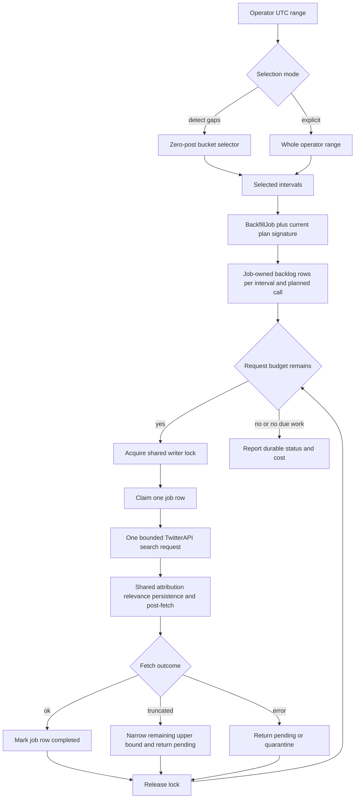

# Selective Gap Backfiller - Plan

## Goal Capsule

- **Objective:** replace the stale whole-window backfill loop with a durable recovery workflow that can inspect a long range, select only clearly empty intervals, and replay those intervals through the current seven-call harvester pipeline under a bounded TwitterAPI request budget.
- **Product authority:** the Product Contract below is the source of truth. Repository harvester rules are higher authority for pipeline reuse, cursor safety, model configuration, and regression coverage.
- **Open blockers:** none. Automatic detection is deliberately conservative because the current database cannot prove partial historical outages.
- **Execution profile:** five dependency-ordered implementation units spanning a Django migration, recovery orchestration, shared `CycleRunner` replay, command UX, tests, and an operator runbook.
- **Stop conditions:** stop if recovery must advance a live `CallState` cursor, reactivate a suspended scheduler, bypass the shared writer lock, or make an unapproved live TwitterAPI call. Stop if the planned-call identity no longer matches the current harvester configuration and the operator has not reset or created a new job.
- **Tail ownership:** the executor owns simplification, code review, test verification, commit, push, PR creation, and CI repair. Production execution and deployment remain explicit owner actions through Ollija.

---

## Product Contract

### Summary

Add a conservative `--detect-gaps` mode that finds long zero-post intervals inside a requested range and turns them into resumable recovery work. Keep explicit `--since` and `--until` windows as the authoritative mode for partial outages or known downtime. Both modes use the current harvester plan and bounded time-window search, not a parallel backfill pipeline.

### Problem Frame

The current backfill command predates the harvester's seven-call plan, durable recall-debt ledger, writer lock, separated post-fetch clients, and one-shot metrics refresh. It stores progress on the local filesystem, holds the writer lock for the whole invocation, and marks a call complete even when the provider reports truncation. A long historical window can therefore look finished while older coverage was never fetched.

The database stores post creation times and each live call's latest cursor, but it does not store a complete historical success ledger per call. It can identify intervals in which no posts were captured. It cannot reliably infer every partial outage. The product therefore needs a hybrid workflow: cheap conservative selection for obvious empty blocks, and explicit operator-selected intervals for everything else.

### Key Decisions

- **Automatic selection means zero captured posts, not proven scheduler downtime.** This keeps the detector explainable and prevents the tool from claiming confidence the data cannot support. Governs R2, R3, R5.
- **Explicit windows remain first-class and authoritative.** An operator can recover a known partial outage that the conservative detector cannot see. Governs R1, R4.
- **A request budget replaces a large result/page sweep.** Each recovery step makes at most one advanced-search request for one planned call and narrows the remaining upper bound from the oldest returned tweet. Governs R8, R9, R10.
- **No production execution is part of this change.** The PR ships a safe operator surface and tests; the owner decides when to spend credits and release it. Governs R14.

### Requirements

**Range selection and preview**

- R1. The command accepts an explicit UTC half-open range and rejects missing, reversed, future, or malformed bounds before any write or provider call.
- R2. `--detect-gaps` inspects only fully elapsed fixed-size buckets in the requested range and selects consecutive zero-post buckets that meet a configurable minimum duration.
- R3. Automatic output labels selected intervals as inferred zero-coverage gaps and states that partial outages are not detectable from current data.
- R4. Without `--detect-gaps`, the complete explicit range becomes the recovery interval even when posts already exist inside it.
- R5. Dry-run and status modes show selected intervals, current seven-call fan-out, remaining work, request bounds, and a credit/USD range loaded from the repository pricing source without fetching or writing.

**Durable and resumable work**

- R6. Recovery jobs and their planned windows persist in PostgreSQL and survive process or Render instance replacement; filesystem JSON is not an authority.
- R7. A job records its requested range, selection mode and thresholds, selected intervals, current planned-call signature, and terminal state so a later invocation can resume or explain why it cannot.
- R8. Each active work row belongs to one recovery job and one complete planned-call identity; scheduled harvesting never claims job-owned rows, and explicit recovery never claims scheduled recall debt.
- R9. A successful untruncated request completes its work row; truncation narrows the remaining upper bound; provider, persistence, lock, and deadline failures leave recoverable work pending or quarantined under existing ceilings.
- R10. `--batch-size` is the maximum number of TwitterAPI advanced-search requests in one invocation, not a count of planned calls that may each paginate.

**Pipeline parity and safety**

- R11. Backfill uses the current shared planner, fetch, attribution, relevance, persistence, translation, and classification paths with explicit configured models.
- R12. Backfill never reads or advances live cursors, never dispatches headline generation, and never runs the one-shot metrics refresh channel.
- R13. The command acquires the shared harvest writer lock only around each bounded recovery request and releases it before any configured pause so the scheduled cron can proceed between units.
- R14. Tests and dry-runs use fakes only; no implementation or verification step spends TwitterAPI or Anthropic credits or mutates production.

**Truthful reporting**

- R15. Completion, retry, truncation, quarantine, and error output reflect durable row state; a truncated or failed request can never be reported as finished.
- R16. `--reset` targets one exact job after preview, removes only that job's work, and cannot delete scheduled recall debt or an unrelated recovery job.
- R17. Minute-precision and second-precision ISO-8601 inputs with an explicit UTC offset are accepted; naive inputs retain the documented UTC interpretation for compatibility.

**Resource and model guards**

- R18. Backfill adds no LLM or database concurrency: the existing enrichment claim/batch ceilings remain in force, and `--max-llm-calls` counts actual relevance, translation, classification, retry, repair, and fallback client invocations before they occur.
- R19. Relevance, translation, and classification receive their explicit model and endpoint configuration from `load_config`; ambient default Anthropic settings cannot redirect a backfill client.
- R20. The existing optional brand filter remains supported, is stored in the recovery job identity, and is applied through the shared planner; omitting it uses the configured full brand set.

### Key Flows

- F1. **Detect and preview gaps**
  - **Trigger:** an operator supplies a long range with `--detect-gaps --dry-run`.
  - **Actors:** operator, Django database, pricing loader.
  - **Steps:** validate the range; inspect fully elapsed buckets; select qualifying zero-post runs; expand each interval across the current planned calls; report request and cost bounds.
  - **Outcome:** the operator sees what would be fetched and the detector's limitation, with no writes or external calls.
  - **Covered by:** R1, R2, R3, R5, R14, R17.
- F2. **Create or resume selective recovery**
  - **Trigger:** the operator runs the same command without `--dry-run`.
  - **Actors:** operator, recovery job ledger, shared harvester, TwitterAPI.
  - **Steps:** create or resolve the exact job; validate the planned-call signature; claim one job-owned row under the writer lock; make one bounded search request; persist through the shared pipeline; finish or narrow the row; repeat up to `--batch-size`.
  - **Outcome:** durable progress advances without touching live cursors or scheduled recall debt.
  - **Covered by:** R6-R13, R15.
- F3. **Recover a known partial outage**
  - **Trigger:** an operator supplies a known downtime range without `--detect-gaps`.
  - **Actors:** operator, recovery job ledger, shared harvester.
  - **Steps:** use the complete explicit range; fan it out to the current calls; process it through F2.
  - **Outcome:** the tool recovers intervals that zero-post detection cannot establish.
  - **Covered by:** R1, R4, R6-R15.
- F4. **Inspect, retry, or reset**
  - **Trigger:** a prior invocation stopped, exhausted its request budget, encountered a failure, or the call plan changed.
  - **Actors:** operator, recovery job ledger.
  - **Steps:** status reports durable row states; a matching invocation resumes; plan drift halts with an explanation; exact reset removes only the selected job after preview.
  - **Outcome:** no failure or configuration drift is mistaken for completion.
  - **Covered by:** R5-R10, R15, R16.

### Acceptance Examples

- AE1. **Given** a seven-day range containing a four-hour interval with no `Post.created_at` values and shorter quiet periods below the threshold, **when** gap detection previews the range, **then** only the four-hour interval is selected and fanned out across the current planned calls. Covers R2, R3, R5.
- AE2. **Given** a known two-hour partial outage whose buckets contain a few posts, **when** the operator uses the explicit range mode, **then** the entire two-hour range is scheduled despite existing posts. Covers R4.
- AE3. **Given** one recovery row returns 20 tweets and continuation coverage, **when** one request is processed, **then** the row remains pending with its upper bound narrowed to one second after the oldest returned timestamp. Covers R9, R10, R15.
- AE4. **Given** the same row later returns an untruncated page, **when** it is processed, **then** the row becomes completed and status reports no remaining coverage for that row. Covers R6, R9, R15.
- AE5. **Given** the regular harvest cron and backfill overlap, **when** one holds the shared writer lock, **then** the other skips that bounded request safely and can proceed later; a configured pause never holds the lock. Covers R13.
- AE6. **Given** the query configuration changes after a job is created, **when** the job resumes, **then** the command stops before a provider call and identifies planned-call drift. Covers R7, R15.
- AE7. **Given** a backfill invocation with a request budget of three, **when** rows remain after three advanced-search requests, **then** the invocation exits with durable pending work and reports how to resume. Covers R6, R10, R15.
- AE8. **Given** a recovery run has due metrics and headline work, **when** its search rows execute, **then** neither metrics refresh nor headline dispatch runs. Covers R12, R14.
- AE9. **Given** `ANTHROPIC_BASE_URL` points at a different provider than the configured translator or classifier, **when** backfill reaches post-fetch, **then** captured client calls use the explicit configured endpoint and model, and actual LLM invocations never exceed `--max-llm-calls`. Covers R18, R19.
- AE10. **Given** an operator creates a job for a subset of brands, **when** the same range is previewed or resumed, **then** the stored filter produces the same shared call plan and a different filter cannot attach to that job. Covers R7, R20.

### Scope Boundaries

- Do not infer partial outages, low-volume degradation, or exact cron health from post counts.
- Do not brute-force every bucket in a long range or use provider cursor pagination for historical collection.
- Do not change the live seven-call plan, scheduled cursor policy, list membership reconciliation, headline topology, or deployed service topology.
- Do not run production backfill, deploy, apply a Render Blueprint, or query production as part of the PR.
- Do not revive the retired v1 SQLite or launchd stack.
- Defer a complete historical per-call success ledger; it would allow higher-confidence outage detection but is not required for this recovery tool.

<!-- ce-section: work-relationships -->
### How This Work Fits Together

This plan updates the existing backfiller and the shared replay seam only. A future historical success ledger can improve automatic detection independently, but it must not be a prerequisite for explicit recovery.

- Historical per-call success ledger — can proceed later and could distinguish partial outages from naturally quiet buckets. It would feed the selector, not replace recovery jobs.
- Automated post-outage recovery — depends on operational policy and approval design. This plan remains operator-triggered to preserve cost control.

### Success Criteria

- A seven-day dry-run selects only qualifying empty intervals and makes zero external calls.
- A live test with a fake provider never exceeds the requested advanced-search request budget.
- Repeated command invocations resume from PostgreSQL and never complete a truncated row.
- Existing scheduled cycle, cursor, backlog, metrics, and post-fetch tests remain green.

---

## Planning Contract

### Key Technical Decisions

- KTD1. **Use a `BackfillJob` record plus job-owned `HarvestBacklogWindow` rows.** A nullable job foreign key with `on_delete=CASCADE` keeps current scheduled recall debt on the existing ledger while giving recovery durable identity and status. Separate conditional uniqueness rules protect unowned scheduled rows and rows inside each job. Governs R6-R9, R16.
- KTD2. **Detect zero coverage with UTC buckets over `Post.created_at`.** The selector uses provider creation time, not insertion time, and considers only fully elapsed buckets. The default bucket is 15 minutes and the default minimum gap is 60 minutes. These defaults match scheduler cadence while requiring four consecutive empty buckets before spending credits. Governs R2, R3.
- KTD3. **Seed complete current call identities and store a deterministic plan signature.** The signature covers the stored brand filter, call IDs, kinds, buckets, query IDs, and effective query strings. Resume rejects drift because silently mapping old job state onto new queries can omit or duplicate coverage. Governs R7, R8, R11, R15, R20.
- KTD4. **Generalize shared backlog replay with an optional job scope and explicit request limit.** Scheduled replay defaults to rows with no job. Backfill replay receives one job and makes one-page, 20-result fetches so each loop iteration maps to one advanced-search request. Existing `return_claim` and `finish_claim` semantics own narrowing and terminal state. Governs R8-R12.
- KTD5. **Retain completed job rows instead of deleting them.** Scheduled rows keep their current delete-on-success behavior. Job rows transition to `completed`, preserving auditable interval, call identity, attempts, and completion state for status and safe reset. Governs R6, R7, R15, R16.
- KTD6. **Acquire the advisory writer lock per replay step in the command.** `CycleRunner` stays lock-agnostic. The command releases the lease before sleeping and treats contention as pending work rather than failure. Governs R13.
- KTD7. **Load cost bounds from `scripts.harvest_cost` pricing.** Preview computes a minimum from per-call floors and a maximum from 20 returned tweets per bounded request. The estimate is a range because returned-tweet billing and the number of truncation steps are data-dependent. Governs R5, R10.
- KTD8. **Do not execute metrics refresh for `cycle_kind="backfill"`.** Backfill search already costs credits; a recovery invocation must not add unrelated one-shot metrics calls. Scheduled behavior remains unchanged and receives a regression test. Governs R12.
- KTD9. **Enforce one shared outbound LLM budget before each client invocation.** The budget is threaded through relevance, translation, classification, and their retry/repair/fallback seams. Budget exhaustion defers unclaimed or unfinished enrichment state instead of making another call or falsely quarantining it. The existing configured enrichment claim size remains the database work ceiling and backfill introduces no parallel client execution. Governs R18.
- KTD10. **Resolve every LLM client and model from explicit config at the production caller.** Call-chain tests use conflicting ambient defaults and capture downstream kwargs so a correct helper with an unwired caller cannot pass. Governs R11, R19.

### High-Level Technical Design

### Assumptions

- A 60-minute global zero-post interval is a useful conservative recovery candidate, but not proof of scheduler downtime. The command makes this caveat visible.
- Fetching `Post.created_at` values for a seven-day range is operationally acceptable at current volume. If the query becomes expensive, bucket aggregation can move into PostgreSQL without changing the product contract.
- TwitterAPI advanced search honors `since_time` and `until_time` for the requested historical range. The current vendor guidance discourages cursor pagination and recommends time-window sliding.
- The repository pricing index is the operator-visible source of truth for estimates. Missing or unparsable pricing is a preflight error before job creation or provider calls; the command never invents fallback rates.

### Binding Harvester Constraints

- `.claude/skills/change-harvester/SKILL.md` is the change contract. Preserve the seven-call shape, `config.yaml` plus `load_config` as runtime SSOT, live cursor policy, metrics delay/cap semantics, and Render service topology. Use the shared planner and `CycleRunner`, keep credit impact visible, and prove the real command-to-provider-to-persistence path.
- `.claude/skills/avoiding-recurring-mistakes/SKILL.md` M7 requires the backfiller to share fetch, attribution, persistence, and post-fetch code with the scheduled cycle; no parallel pipeline is permitted.
- M8 requires the plan to name the TwitterAPI request/page/result cap, the LLM invocation and concurrency cap, the enrichment/database claim ceiling, the shared writer lock, and the cycle deadline before any probe. R10, R13, R18, KTD4, KTD6, and KTD9 own those guards.
- M12 requires explicit relevance, translator, and classifier models/endpoints at the production caller. R19 and KTD10 own this rule.
- M17 does not trigger a halt for this offline implementation because the reported token exhaustion and downtime are historical examples and this pipeline performs no live diagnosis, probe, deploy, or backfill. If the anomaly is found to be ongoing or any production probe becomes necessary, stop before investigation, follow `docs/operations/pause-and-resume-harvest-cron.md` through the Ollija release authority, verify suspension, and do not resume without owner authorization.
- M18 requires an end-to-end regression pin with fake clients and captured kwargs. Helper-only selector, budget, or model-resolution tests cannot satisfy the Verification Contract.

### System-Wide Impact

- **Data lifecycle:** the migration adds recovery job ownership and a completed state to the durable recall-debt ledger. Existing rows remain unowned scheduled rows.
- **Concurrency:** scheduled claim queries must explicitly exclude job-owned rows. Job replay must require the exact job scope. Expired claims recover within their own scope.
- **Failure propagation:** provider and persistence failures leave the row retryable. Configuration drift halts before spend. Backlog ceilings still quarantine repeated failures.
- **Cost posture:** backfill search calls are bounded separately from LLM work. Metrics refresh is disabled for backfill. Preview exposes both the first-invocation request cap and the unknown additional requests caused by dense intervals.
- **Migration safety:** add the nullable ownership column before replacing the old uniqueness rule with separate conditional constraints. Existing rows remain unowned and preserve behavior. Inspect the generated PostgreSQL SQL for table rewrites and lock-heavy operations before merge.
- **Status integrity:** row states are authoritative. Any denormalized job counts or completion timestamp update in the same transaction as the final row transition and can be recomputed from rows after interruption.

### Risks and Mitigations

- **False-positive quiet intervals:** automatic mode may select natural silence. Mitigation: conservative 60-minute default, inferred labeling, dry-run preview, and configurable threshold.
- **False-negative partial outages:** buckets containing some posts are not selected. Mitigation: explicit ranges remain authoritative and the limitation appears in help and runbook text.
- **Call-plan drift:** an old job may refer to changed queries. Mitigation: persist and verify a deterministic signature before every resume.
- **Cross-scope claims:** scheduled harvest could consume recovery rows or vice versa. Mitigation: manager defaults exclude job rows and tests assert both directions.
- **Credit overrun:** dense ranges may need many time slides. Mitigation: one request per replay step, hard per-invocation request budget, truthful remaining-work status, and pricing-derived bounds.
- **Duplicate posts:** one-second boundary overlap intentionally repeats edge tweets. Mitigation: current tweet-ID upsert remains the idempotency boundary.

### Sources and Research

- `README.md` in the referenced headline worktree — current seven-call harvester, shared `CycleRunner`, durable post-fetch, and writer-lock architecture.
- `docs/plans/2026-07-24-002-feat-backfiller-tool-plan.md` — original backfiller intent and outdated filesystem/checkpoint assumptions.
- `docs/solutions/architecture-patterns/backfiller-and-llm-classifier-pipeline-wiring.md` — prior pipeline-reuse guidance and the non-durable Render filesystem warning.
- `docs/solutions/integration-issues/harvest-pipeline-missing-call-queries.md` — config source-of-truth and full-call-chain regression requirement.
- `docs/operations/cursor-vs-insert-gap-diagnosis.md` — cursor, insert, and coverage are different signals.
- `docs/external_vendors/twitterapi_docs/twitterapi_index.md` — local pricing and endpoint reference.
- [TwitterAPI advanced search reference](https://docs.twitterapi.io/api-reference/endpoint/tweet_advanced_search) — official warning to bound requests with `since_time` and `until_time` rather than pagination.
- [TwitterAPI historical search guide](https://twitterapi.io/blog/scrape-twitter-history-tweet) — official time-window sliding guidance for dense history.

---

## Implementation Units

### U1. Add durable recovery job ownership

- **Goal:** represent one resumable operator recovery and its current-call work in PostgreSQL without changing existing scheduled backlog behavior.
- **Requirements:** R6-R9, R15, R16.
- **Dependencies:** none.
- **Files:** `core/models.py`; new migration under `core/migrations/`; model tests in `tests/`.
- **Approach:** add `BackfillJob` with a deterministic job key, requested range, selection metadata, selected interval JSON, plan signature, and state timestamps. Add nullable `on_delete=CASCADE` job ownership plus a `completed` state to `HarvestBacklogWindow`. Replace the existing uniqueness rule with one conditional constraint for unowned scheduled rows and one job-inclusive constraint for owned rows. Make scheduled normalization, expired-claim recovery, and claims filter to unowned rows by default. Seed all rows for a new job in one transaction without creating or mutating live `CallState` records. Make row state authoritative and update any cached job completion field atomically.
- **Patterns to follow:** transaction and `select_for_update` patterns in `HarvestBacklogWindowManager`; model-first migration rules in `core/models.py`; bounded interval checks already on backlog rows.
- **Test scenarios:** existing unowned rows retain normalization and claim behavior; migration preserves an existing claimed row; two jobs can own the same call/range independently; concurrent creation resolves to one deterministic job; scheduled expired-claim recovery and claims ignore job rows; job claims cannot see unowned or other-job rows; completed job rows are not claimable; an interrupted final-state update is recomputed from rows; exact reset cascades only one job.
- **Verification:** migration applies from current main; model constraint and manager tests pass on PostgreSQL; existing backlog tests remain green.

### U2. Add conservative gap selection and job planning

- **Goal:** turn an explicit range or conservative zero-post gaps into deterministic job-owned current-call work without external calls.
- **Requirements:** R1-R8, R16, R17. Covers F1, F3, F4.
- **Dependencies:** U1.
- **Files:** a focused recovery/planning module under `monitor/`; `monitor/management/commands/backfill.py`; tests in `tests/`.
- **Approach:** centralize ISO parsing and UTC range validation. Implement a pure bucket selector over `Post.created_at` that considers fully elapsed buckets, merges qualifying zero runs, and returns half-open intervals. Build complete identities from `plan_calls_for_cycle`, compute the plan signature, derive a deterministic job key from range plus selector parameters, and seed one row per selected interval and call. Dry-run builds the same plan in memory and loads pricing through `scripts.harvest_cost`.
- **Patterns to follow:** `plan_calls_for_cycle` as the only call-plan authority; repository pricing loader; `Post.created_at` as provider time; no settings mutation beyond the bounded runner seam.
- **Test scenarios:** minute and second ISO forms; offset normalization; invalid and future ranges; leading, interior, and trailing zero runs; partial final bucket exclusion; threshold and boundary behavior; posts inside a bucket prevent automatic selection; explicit mode preserves the whole range; current plan produces seven call identities; brand-filtered plans use the shared planner and change the deterministic job identity; stable job/signature hashes; missing pricing fails before writes; dry-run performs no writes or provider calls.
- **Verification:** pure selector tests and command dry-run tests pass; expected calls equal the current shared planner output rather than a literal duplicated list.

### U3. Generalize shared replay for job-scoped one-request recovery

- **Goal:** execute one job-owned historical slice through the current harvester pipeline with exact request accounting and truthful residual state.
- **Requirements:** R8-R12, R14, R15, R18, R19. Covers F2 and AE3-AE4, AE7-AE9.
- **Dependencies:** U1, U2.
- **Files:** `monitor/cycle.py`; `monitor/backlog.py`; `x_monitor/attribution.py` for explicit classifier-model threading; `x_monitor/apify.py` only if a test reveals the existing one-page cap is not request-exact; cycle/backlog integration tests in `tests/`.
- **Approach:** add optional job scope and replay limit to the existing backlog replay entry point. Backfill configures one page and 20 results for each fetch and maps one replay report to one provider request. On success, completed job rows remain durable; scheduled success continues deleting rows. On truncation, preserve the one-second overlap and narrow the remaining upper bound. Run the existing attribution, relevance, persistence, translation, and classification paths. Thread a pre-call LLM budget through every outbound relevance and post-fetch client seam, preserve the configured enrichment claim/batch ceiling, and defer work when the budget is empty. Resolve all three clients from explicit config. Skip metrics refresh for backfill and keep headline dispatch outside this command.
- **Patterns to follow:** current `_replay_backlog`, `return_claim`, `_route_and_persist`, and `_run_post_fetch`; explicit `cycle_kind`; current configured relevance, translation, and classification clients.
- **Test scenarios:** exact one-request cap; truncated pages narrow and remain pending; untruncated pages complete; provider exception and persistence failure remain retryable; actual LLM invocations including retries/repair/fallback stop at the pre-call budget; budget exhaustion leaves enrichment retryable; hostile ambient endpoint/model values cannot override explicit relevance, translator, or classifier config; live `CallState` values never change; metrics refresh and headline dispatch are absent; scheduled cycle metrics behavior remains unchanged.
- **Verification:** end-to-end fake-provider call-chain test proves request count, durable state transitions, seven-call identity compatibility, persistence, and side-channel exclusions.

### U4. Rewrite the backfill command around durable jobs

- **Goal:** expose safe preview, execute, status, resume, quarantine replay, and exact reset workflows to the operator.
- **Requirements:** R1-R20. Covers F1-F4.
- **Dependencies:** U2, U3.
- **Files:** `monitor/management/commands/backfill.py`; command tests in `tests/`.
- **Approach:** remove filesystem state and stale volume/page calculations. Add `--detect-gaps`, bucket and minimum-gap controls, durable job selection, and clear preview/status output. Treat `--batch-size` as a search-request budget. Verify the plan signature before spend. For each replay step, acquire the writer lock, run one request, release the lock, update/report durable state, then pause. Preserve quarantined scheduled replay as an explicit separate mode that cannot claim job rows. Make reset identify one exact job and require an existing matching job.
- **Patterns to follow:** `harvest_writer_lock`; Django `CommandError`; current quarantined replay interface; no direct Render or production mutation.
- **Test scenarios:** missing mode/range errors; automatic and explicit previews; durable resume across command instances; plan drift refusal; lock contention leaves pending work; pause occurs outside the lease; request budget enforced; 402/provider failure truthful; completion only after every row completes; exact reset isolation; quarantined mode remains scheduled-ledger-only.
- **Verification:** command integration suite passes with fake `CycleRunner`/provider and real PostgreSQL ledger state; no test touches the network.

### U5. Add regression net and operator documentation

- **Goal:** make the new safety and cost contract executable and give the owner copyable dry-run, explicit-window, resume, status, and reset workflows.
- **Requirements:** R3, R5, R10-R17.
- **Dependencies:** U1-U4.
- **Files:** `tests/`; `docs/operations/backfill.md`; command help text; any directly stale backfill reference discovered during implementation.
- **Approach:** add a full command-to-planner-to-provider-to-persistence regression test that exercises the current seven-call shape without hard-coding stale query text. Document automatic detection as inferred, show explicit fallback for partial outages, explain request/credit bounds and dense-window continuation, and state that production execution follows Ollija approval/release workflow. Remove references to JSON state and six-call estimates in the touched backfill docs.
- **Patterns to follow:** `.claude/skills/change-harvester/SKILL.md`; `.claude/skills/avoiding-recurring-mistakes/SKILL.md` M7/M8/M12/M17/M18; repository operations docs; pricing output from `scripts.harvest_cost`.
- **Test scenarios:** one seven-day gap preview; one manual partial-outage plan; one truncated two-invocation resume; scheduled/backfill cross-claim guard; current call-chain assertion; `--help` documents UTC and detector limits.
- **Verification:** focused backfill suite, full harvester/cycle suite, complete `pytest`, Django migration check, and deploy system check pass.

---

## Verification Contract

| Gate | Command / method | Applies to | Done signal |
|---|---|---|---|
| Model consistency | `python manage.py makemigrations --check --dry-run` | U1 | no uncommitted migration changes |
| Django checks | `python manage.py check --deploy` | U1-U5 | no new errors; existing environment-only warnings documented |
| Focused recovery tests | `pytest -q tests/test_backfill_command.py tests/test_backfill_quarantined.py tests/test_harvest_backlog.py` | U1-U5 | green on PostgreSQL-marked cases and pure unit cases |
| Harvester regression net | `pytest -q tests/test_cycle_runner.py tests/test_run_cycle_command.py tests/test_harvest_backlog.py` | U3-U5 | scheduled cursors, backlog, metrics, and current calls remain green |
| Full suite | `pytest` | U1-U5 | green with no live network or production writes |
| Diff audit | inspect changed files and migration SQL | U1-U5 | only backfill/shared seams/tests/docs changed; no service topology or live policy drift |
| Cost/request proof | fake-provider integration receipts | U3-U5 | provider calls never exceed `--batch-size`; every call maps to one durable replay report |
| LLM/SSOT call-chain proof | fake relevance, translator, and classifier clients with hostile ambient defaults | U3-U5 | actual invocations never exceed `--max-llm-calls`; captured endpoint/model kwargs match explicit config |

---

## Definition of Done

- U1: recovery jobs and job-owned backlog rows migrate safely, isolate claims in both directions, and persist completed state.
- U2: explicit and conservative automatic selection produce deterministic current-call work and truthful dry-run cost bounds.
- U3: shared replay executes job work one provider request at a time, narrows truncation, preserves cursor safety, and suppresses backfill metrics/headline side channels.
- U4: command preview, execute, resume, status, quarantine, and exact reset behaviors pass integration tests and no longer use JSON state.
- U5: operator documentation describes the seven-day and manual-downtime workflows, detector limits, request budget, cost preview, and release boundary.
- All Verification Contract gates pass, migration files match models, and no live TwitterAPI/Anthropic or production action occurs.
- The final diff contains no abandoned experiments, stale six-call assumptions, duplicate pipeline logic, or unrelated user changes.
