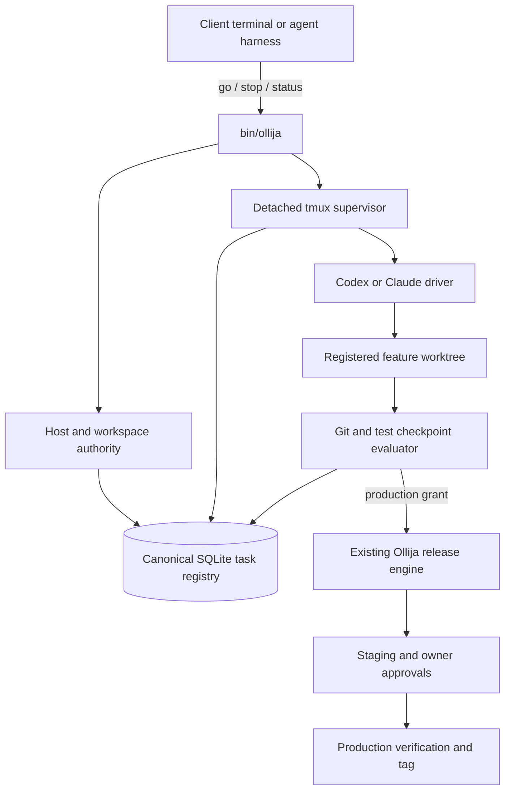
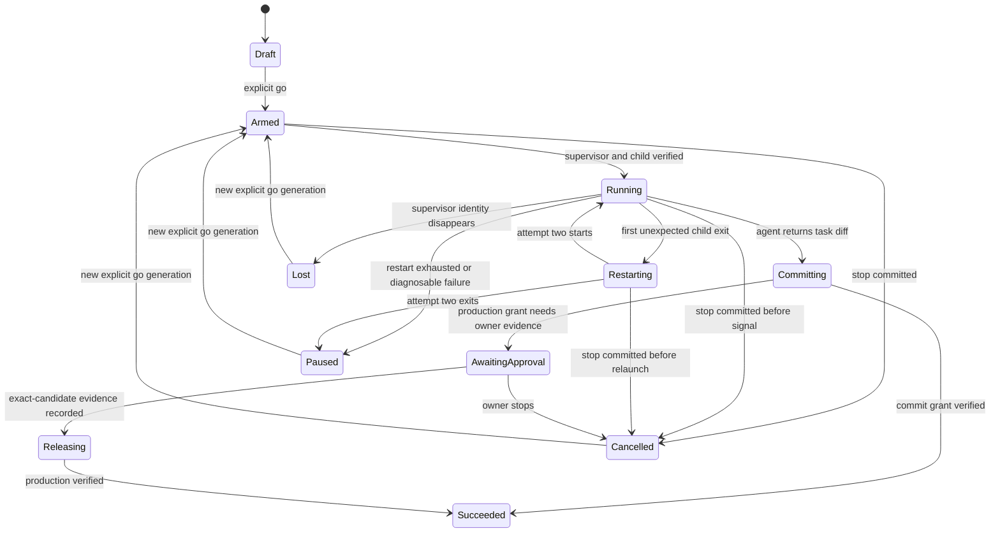
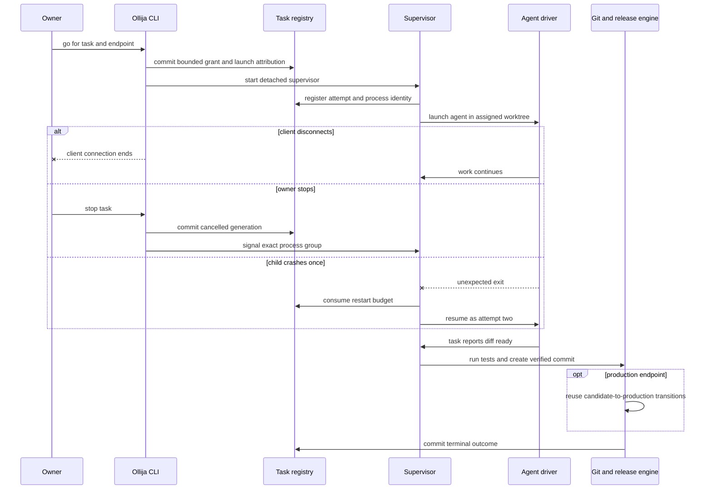

# Ollija Autonomous Task Control - Plan

## Goal Capsule

- **Objective:** Extend Ollija from a release-state coach into an explicit, owner-controlled task runner that can keep agent work running on `fuchitalee` after a terminal disconnect, recover one agent-process crash, create a verified commit, and continue an already-authorized release through staging to production.
- **Primary authority:** The Product Contract in this plan governs task behavior; `AGENTS.md` governs repository and release safety; `.ollija/project.yaml` governs tracked project configuration; live Git, process, tmux, Render, and Ollija registry observations govern current state.
- **Tail ownership:** Ollija owns workspace placement, durable task identity, process supervision, stop semantics, running the required verification gates, creating the checkpoint commit, and the transition into its existing staging/release workflow. The selected coding agent owns the requested code change and tests inside the assigned worktree, but must not commit or push it.
- **Execution profile:** Python CLI and state-machine changes, local process supervision on macOS, agent-driver integration, Git/worktree guards, release-flow integration, structured status, documentation, and regression tests.
- **Hard stops:** Never create PushinWeight artifacts outside `fuchitalee`; never continue without a live owner grant; never restart more than once; never overwrite a durable cancellation; never delete a dirty worktree; never infer a commit from agent exit alone; never bypass exact-candidate staging or owner approvals; never turn OpenClaw adoption into a second agent platform inside Ollija.

---

## Product Contract

### Summary

Ollija will launch and supervise bounded coding tasks from the authoritative PushinWeight repository, continue them after client-terminal loss, and stop them reliably on owner command.
Each task ends at its owner-authorized outcome: normally a verified commit, or verified production when the owner already requested a release.

### Problem Frame

Skills, chat memory, and hand-written authorship notes cannot deterministically preserve ownership or restart behavior after a terminal or agent process disappears.
An always-running autonomous loop would solve disconnection at the cost of recreating the `/goal` problem: intentional termination could be mistaken for failure, and a stale task could repeatedly resurrect itself against a dirty worktree.

The current Ollija implementation also assumes that its configured repository root is the only valid checkout and stores receipts relative to the active checkout.
That blocks registered feature worktrees and fragments state if multiple agents work in isolated trees.
The isolated planning worktree reproduced a related environment handoff failure because `bin/ollija` could not locate the authoritative virtualenv.

GitHub issue [#15](https://github.com/allenwlee/pushin-weight-v2/issues/15) demonstrates the broader control problem.
Ollija moved production to an approved SHA, then contradicted its own result, discovered verification prerequisites too late, and left the owner unable to seal or cleanly resume the release.
The durable task controller must make Ollija more resumable without making its fallible assessment the final owner authority.

### Key Decisions

- **Require an explicit, task-scoped `go` grant before autonomous continuation.** (session-settled: user-approved — chosen over always-on recovery: terminal loss should not create perpetual authority.) Governs R4-R9.
- **Use a verified commit as the normal task checkpoint.** (session-settled: user-directed — chosen over a handoff-only checkpoint: Ollija owns completion through commit rather than returning unfinished work to another agent.) Governs R10, R11.
- **Continue past commit only when the owner already requested release to production.** (session-settled: user-directed — chosen over stopping every task at commit: Ollija is responsible for carrying authorized work through staging and production.) Governs R11-R14.
- **Allow exactly one automatic restart after an unexpected agent-process crash.** (session-settled: user-approved — chosen over unlimited retry and no retry: one retry recovers a transient failure without creating an immortal loop.) Governs R7-R9.
- **Make `stop` durable before terminating the process tree.** (session-settled: user-approved — chosen over process-only cancellation: a killed process must not be mistaken for a crash and restarted.) Governs R8, R9.
- **Keep all repositories, worktrees, state, logs, and recovery artifacts on `fuchitalee`.** (session-settled: user-directed — chosen over local/remote synchronization: `allenwlee` and other clients remain keyboard/browser endpoints.) Governs R1-R3.
- **Store feature worktrees in one enforced repository-local hierarchy.** (session-settled: user-approved — chosen over tool-specific and home-directory worktree locations: every agent must find and share the same work.) Governs R2, R3.
- **Capture agent and terminal attribution at launch, not in every authored document.** (session-settled: user-approved — chosen over manual author fields: launch-time recording is deterministic and agent-neutral.) Governs R3, R18.
- **Borrow OpenClaw's task-ledger and cancellation invariants, not its gateway, messaging, scheduler, or broad agent platform.** (session-settled: user-approved — chosen over wholesale OpenClaw reuse: free code would still impose maintenance outside Ollija's product identity.) Governs R15-R17, R20.
- **Treat Ollija as a guide and evidence recorder with explicit owner authority.** (session-settled: user-directed — chosen over making every automated assessment an unoverrideable gate: tooling defects must be diagnosable and recoverable.) Governs R12-R15.

### Actors

- A1. **Product owner:** authorizes `go`, `stop`, release scope, and exact-candidate human approvals.
- A2. **Client agent session:** Codex, Claude Code, OpenClaw, or another harness that invokes the common Ollija CLI from any terminal.
- A3. **Ollija supervisor:** the `fuchitalee`-resident process that owns the durable run and the selected coding-agent child process.
- A4. **Coding-agent driver:** the narrow adapter that launches or resumes one supported agent CLI without changing core task semantics.
- A5. **Ollija release engine:** the existing candidate, staging, approval, release, and production-verification command surface.
- A6. **Diagnostic skills:** infra-shell for machine/SSH/tmux/environment failures, CE debug/compound workflows for software defects and durable learnings, and Bridgewright for UI assessment evidence.

**Trust boundary:** Version 1 is a single-owner, single-Unix-account tool. A process already running as the owner on `fuchitalee` is inside the trusted principal; launch attribution and approval receipts provide workflow provenance, not cryptographic proof that a human rather than an owner-authorized agent invoked the CLI. Read-only status remains mutation-free, and a future multi-user or hostile-child threat model would require a separate capability design outside this plan.

### Requirements

**Host and workspace authority**

- R1. Every task artifact and mutation must live on `fuchitalee`; a client on `allenwlee` or another machine may request work but may not receive a checkout, worktree, cache, state database, task brief, log, or receipt.
- R2. Each feature task must use a registered worktree under `.worktrees/<branch-name>/` in the authoritative repository, on a non-`main` and non-`staging` branch that is checked out in exactly one worktree.
- R3. Ollija must share one authoritative task registry across the root checkout and all allowed worktrees, and it must automatically record task ID, parent task ID when present, agent kind/version, agent session identity when available, asserted origin terminal/host, observed execution host, worktree, branch, starting SHA, immutable task-source path and digest, attempt number, timestamps, and terminal outcome. Origin attribution is audit metadata, never authorization.

**Arming, continuation, and cancellation**

- R4. `ollija go` must create a bounded continuation grant—or re-arm a terminal task as a new generation—tied to one task, one worktree, one agent driver, one requested endpoint, one declared verification command set or explicit no-test reason, and one restart budget; no grant may apply globally or to a later task.
- R5. Ollija may auto-continue only a process it launched and can identify; it must never claim it can retroactively seize or resume an arbitrary chat process that was started outside Ollija.
- R6. Loss of the originating SSH, VS Code, or terminal client must not stop a currently running granted task, and reconnecting a client must not create a second agent process.
- R7. An unexpected child-agent exit may create one new attempt under the same task and grant; a second unexpected exit must pause the task with preserved work and a diagnostic next action.
- R8. `ollija stop <task>` must commit a durable cancelled state before signaling the exact supervisor and descendant process group; cancellation must cascade to child agents, win against late completion, and preserve the task's worktree and uncommitted files.
- R9. A stopped task, an exhausted restart budget, a lost tmux supervisor, or a `fuchitalee` reboot must require a new explicit `go`; status checks, heartbeats, shell login, and machine startup must never clear cancellation or silently resume work.

**Checkpoint and release outcomes**

- R10. A commit-target task succeeds only when the coding agent returns an uncommitted task diff, Ollija independently runs the declared verification gates, stages only the dedicated worktree's task changes, creates a new clean branch commit, and records the resulting SHA against the task. An agent-created commit, exit code, final message, or claimed test result alone is insufficient.
- R11. A production-target task must treat the verified commit as an intermediate checkpoint, freeze that exact SHA as the candidate, and continue through the existing production-through-staging workflow without creating a parallel Git or Render path.
- R12. Autonomous release continuation may cross only machine-checkable green transitions; exact-candidate desktop and physical-iPhone approvals remain explicit owner actions when applicable, and any required owner review pauses rather than fails the task.
- R13. Once all required exact-candidate approvals exist, an active production grant may continue automatically through release and production verification; a task without that production grant must stop at the commit checkpoint.
- R14. A production SHA that is already live but not sealed must resume at production verification rather than recommend releasing the same SHA again, and release prerequisites must be validated before production changes.

**Failure guidance and evidence**

- R15. Ollija must record safe failure phase, attempt, process identity, exit classification, affected SHA, and a deterministic next action without recording secrets, prompt bodies, private post content, browser storage, or provider responses.
- R16. Shell, environment, SSH, tmux, or multi-machine failures must route the next agent to infra-shell first; software defects must route through CE debugging and then CE compound documentation; UI evidence may use Bridgewright but may not replace owner approval or release authority.
- R17. Tooling-only failures must preserve the product candidate and task work, and they must support an explicit owner decision with provenance when automated assessment is unavailable or defective, consistent with issue #15.

**Agent-neutral control surface**

- R18. Task attribution and lifecycle must have the same CLI and structured JSON shape for every agent driver, and `ollija status` must show the active task, current attempt, last heartbeat, requested endpoint, restart budget, worktree, attribution, and one next action.
- R19. The first implementation must support the installed Codex and Claude Code CLIs through explicit drivers while keeping lifecycle, registry, cancellation, workspace, and release code free of vendor-specific branches.
- R20. OpenClaw integration, if added later, must use the same driver boundary; this plan must not import OpenClaw's gateway, messaging channels, scheduler, remote-control product, or general task ecosystem.

### Key Flows

- F1. **Arm and launch a task**
  - **Trigger:** A1 authorizes `go` for a tracked plan or task brief on `fuchitalee`.
  - **Actors:** A1-A4.
  - **Steps:** Ollija validates host and workspace placement, creates or attaches the registered task worktree, records launch attribution and the grant, starts one detached supervisor, and launches the selected coding driver.
  - **Outcome:** One durable running task exists independently of the originating terminal.
  - **Covers:** R1-R6, R18, R19.

- F2. **Recover an interrupted agent**
  - **Trigger:** The child agent exits unexpectedly while the grant remains live.
  - **Actors:** A3, A4, A6.
  - **Steps:** The supervisor records the first failed attempt, checks durable cancellation, consumes the single restart allowance, and resumes through the same driver; a second crash records a paused failure and the diagnostic route.
  - **Outcome:** One transient crash recovers, while repeated failure cannot loop.
  - **Covers:** R7-R9, R15, R16.

- F3. **Stop without resurrection**
  - **Trigger:** A1 invokes `ollija stop` from any client connected to `fuchitalee`.
  - **Actors:** A1, A3, A4.
  - **Steps:** Ollija atomically records cancellation, signals the exact process group, confirms termination or reports a scoped stop failure, and leaves the worktree intact.
  - **Outcome:** No worker or later heartbeat can restart the cancelled generation.
  - **Covers:** R8, R9, R15, R18.

- F4. **Reach the authorized outcome**
  - **Trigger:** The coding agent finishes its task and returns control to the supervisor.
  - **Actors:** A1, A3-A5.
  - **Steps:** Ollija verifies that the task source has not drifted, runs the declared verification gates, creates and verifies the checkpoint commit from the dedicated worktree, then either succeeds the commit-target task or freezes that exact SHA and follows existing refresh, staging, approval, release, and verification transitions.
  - **Outcome:** The task terminates at a verified commit or verified production, matching its grant.
  - **Covers:** R10-R14.

- F5. **Diagnose and document an Ollija failure**
  - **Trigger:** A workspace, process, verification, release, or UI assessment step fails.
  - **Actors:** A1, A3, A5, A6.
  - **Steps:** Ollija preserves the candidate and worktree, records a safe incident envelope, selects the applicable diagnostic skill, and retains evidence for CE compound documentation or an owner-authorized issue.
  - **Outcome:** The failure is actionable and resumable without making Ollija's defect an unoverrideable gate.
  - **Covers:** R14-R17.

### Acceptance Examples

- AE1. **Client terminal disappears.** Given a Codex task launched by Ollija from an `allenwlee` terminal, when the SSH or VS Code session ends, then the single `fuchitalee` worker continues and the owner can later observe the same task and attempt.
- AE2. **One child crash.** Given a live grant with its full restart budget, when the child agent exits unexpectedly, then Ollija records attempt one and launches exactly one attempt two in the same worktree.
- AE3. **Second child crash.** Given attempt two is running, when it exits unexpectedly, then Ollija preserves the dirty worktree, records the failure, and requires a new `go` instead of launching attempt three.
- AE4. **Owner stop races completion.** Given a running task, when `stop` commits cancellation before the child reports success, then the task remains cancelled and the late report cannot change it to succeeded.
- AE5. **Process finishes before stop.** Given the checkpoint was already durably committed, when the owner sends `stop`, then Ollija reports that the task already completed and does not falsify a cancellation.
- AE6. **Host restarts.** Given a previously armed task and a `fuchitalee` reboot, when Ollija next observes the stale supervisor, then it marks the run lost and waits for a new explicit `go`.
- AE7. **Commit target.** Given a granted agent leaves a task diff ready without committing or pushing, when Ollija runs the declared tests and they pass, then Ollija creates one clean branch commit, records success, and performs no staging or production mutation.
- AE8. **Production target.** Given the owner requested production and exact-candidate human approvals are complete, when all machine checks pass, then Ollija continues through staging, production, verification, and tagging without asking permission again at each green step.
- AE9. **Approval still needed.** Given a UI-affecting candidate reaches hosted staging, when physical-iPhone approval is absent, then Ollija pauses with that owner action and does not treat the pause as an agent crash.
- AE10. **Issue #15 recovery.** Given the candidate SHA already equals live production but lacks a sealed receipt, when status is recomputed, then the next action is production verification and never a duplicate release.
- AE11. **Cross-agent attribution.** Given task `1a` originates in Codex on `allenwlee` and task `1b` originates in Claude on `fuchitalee`, when either agent reads structured status, then both task records expose those launch facts without requiring authorship text in generated documents.

### Success Criteria

- A granted task remains singular and observable after the originating client terminal disconnects.
- A child crash produces exactly one automatic restart, while a second crash produces none.
- A durable stop prevents every restart path and preserves uncommitted work.
- Root and allowed feature worktrees read one authoritative task registry and cannot create task state elsewhere.
- Codex and Claude produce the same lifecycle and status contract through separate drivers.
- A successful commit-target run proves the real Git checkpoint rather than trusting an agent message.
- A production-target run uses the current staging/release engine and passes the issue #15 interrupted-release regression.
- The full Ollija regression suite and a detached-supervisor dogfood run pass without touching production.

### Scope Boundaries

**In scope**

- One authoritative host, one repository, multiple registered feature worktrees, multiple task records, and one supervisor per active task.
- CLI control, structured JSON status, detached tmux execution, Codex and Claude drivers, one restart, exact process-tree stop, commit verification, and existing staging/release integration.
- Local structured incidents and skill routing for diagnosis and durable documentation.

**Deferred to follow-up work**

- A browser dashboard with literal Go and Stop buttons; Version 1 exposes equivalent CLI controls and JSON for a later UI.
- An OpenClaw driver, remote mobile notifications, cloud replication, and cross-host failover.
- Automatic external issue creation; Version 1 may prepare safe local evidence, while posting remains an owner-authorized action.

**Outside this product's identity**

- A general-purpose agent gateway, chat router, scheduler, messaging platform, cloud memory service, or replacement for Codex, Claude Code, OpenClaw, Compound Engineering, or `/goal`.
- Automatic continuation after authoritative-host reboot or authority transfer.
- Taking over a coding session that Ollija did not launch.

### Sources and Research

- `docs/plans/2026-08-14-120533-feat-ollija-staging-release-workflow-plan.md` defines the implemented release-engine boundaries that this plan extends rather than duplicates.
- `scripts/ollija/state.py`, `scripts/ollija/preview.py`, `scripts/ollija/git.py`, `scripts/ollija/status.py`, and `scripts/ollija/release.py` provide the current atomic-write, detached-process, Git-guard, lifecycle, and exact-ref-promotion patterns.
- `~/.agents/skills/infra-shell/SKILL.md` is the installed machine/SSH/tmux/environment diagnostic contract; Compound Engineering's `ce-debug` and `ce-compound` skills are plugin-resolved contracts; `scripts/ollija/bridgewright.py` is the existing UI-assessment adapter. Ollija records these stable route names and evidence references but does not invoke or vendor the external skills.
- [GitHub issue #15](https://github.com/allenwlee/pushin-weight-v2/issues/15) supplies interrupted-release and advisory-authority acceptance cases.
- [OpenClaw task lifecycle documentation](https://github.com/openclaw/openclaw/blob/v2026.7.1/docs/automation/tasks.md) supports a durable task ledger that is distinct from its scheduler and treats cancellation as terminal.
- [OpenClaw subagent documentation](https://github.com/openclaw/openclaw/blob/v2026.7.1/docs/tools/subagents.md) supports cascading stop and guarded orphan recovery.
- [OpenClaw ACP session documentation](https://github.com/openclaw/openclaw/blob/v2026.7.1/docs/tools/acp-agents.md) supports explicit resume and closure of stale unbound sessions.
- [OpenClaw cancellation implementation](https://github.com/openclaw/openclaw/blob/main/src/tasks/task-registry-cancel.ts) supports durable cancellation before runtime-specific termination and race-aware terminal-state updates.
- The planning host currently provides tmux 3.6a, Codex CLI 0.147.0, and Claude Code 2.1.187; both agent CLIs expose persisted-session resume surfaces, while only the driver layer may depend on those vendor contracts.

---

## Planning Contract

### Key Technical Decisions

- KTD1. **Use a tmux-owned supervisor instead of a permanent Ollija daemon.** A detached tmux session survives SSH, VS Code, and terminal loss on the authoritative host, while lack of machine-boot resurrection enforces R9 and keeps Version 1 small. (session-settled: user-approved — chosen over always-on daemon recovery: the owner wants crash continuation with an effective kill boundary.)
- KTD2. **Use a SQLite task registry under the canonical root state directory.** SQLite transactions provide compare-and-set terminal transitions, cancellation ordering, one-restart accounting, and safe concurrent reads without relying on agents to append correctly to a dotfile. The existing immutable release receipts remain unchanged and share the same canonical state root.
- KTD3. **Separate canonical-root identity from active-workspace identity.** The canonical root anchors shared state and validates the common Git directory; the active workspace supplies code, branch, and commands. Registered worktrees are allowed only under the canonical `.worktrees/` hierarchy.
- KTD4. **Treat each retry as a new attempt in the same task generation.** The task owns the grant and outcome; attempts own child PID, process group, driver session ID, heartbeat, exit classification, and logs. Manual `stop` seals the generation, and a later `go` creates a new generation rather than erasing cancellation history.
- KTD5. **Kill by verified process group, never by command-name matching.** The supervisor launches each child in a new session, records PID and process-group identity, verifies that identity before signaling, and cascades termination. Broad `pkill -f` behavior is forbidden because it can kill unrelated Codex, Claude, or Ollija sessions.
- KTD6. **Keep the core driver-neutral and implement explicit Codex and Claude adapters.** Drivers produce argv without shell interpolation, capture vendor session identity when available, provide a bounded resume operation, and explicitly instruct the coding agent not to commit or push. Lifecycle and success evaluation depend on common process, verification, and Git facts rather than vendor output prose.
- KTD7. **Evaluate success from Ollija-owned outcomes.** Ollija accepts a commit checkpoint only after it verifies the task-source digest, runs the declared verification gates itself, creates the commit, and confirms Git state satisfies R10. A zero child exit with no task diff is incomplete; an unexpected agent-created commit pauses for diagnosis instead of being silently adopted.
- KTD8. **Reuse existing release transitions as the production tail.** The task orchestrator calls the same candidate, refresh, stage, approval, release, and verification services used by `bin/ollija`; it does not reproduce Git push, Render polling, receipt, or browser logic.
- KTD9. **Model approval waits as durable nonterminal states.** A missing exact-candidate owner approval pauses forward progress without consuming the crash-restart budget. Recording the approval lets the active production grant continue from live state.
- KTD10. **Route diagnostics through the shared skill contract.** Structured failure categories map to infra-shell, CE debug/compound, or Bridgewright guidance in the canonical Ollija skill. The CLI records evidence and next action but does not embed a second debugging agent or post external issues autonomously.
- KTD11. **Preserve owner authority during verifier defects.** The issue #15 recovery contract is implemented in the existing release lifecycle and cited by task orchestration. Any override is candidate-bound, names the failed assessment and reason, and remains distinct from automated success.

### High-Level Technical Design

### System-Wide Impact

- **Repository authority:** Registered feature worktrees become first-class authorized workspaces, but only under the canonical `.worktrees/` hierarchy and only when they share the root repository's common Git directory.
- **Runtime state:** Task state moves into one ignored SQLite registry under the canonical root; release receipts remain immutable JSON evidence but no longer resolve relative to arbitrary worktrees.
- **Process lifecycle:** Ollija gains detached tmux sessions and exact process-group ownership. It does not install a login daemon or boot service, so an authoritative-host reboot ends active tasks; the next status marks them lost and requires a new explicit `go` after the owner inspects preserved work.
- **Agent behavior:** Codex and Claude receive identical commands, task context, state, and stop semantics. Vendor-specific resume behavior stays inside drivers.
- **Git lifecycle:** Coding work occurs on per-task feature branches. `main` and `staging` remain exact-SHA promotion targets owned by the existing release engine.
- **Release behavior:** An explicit production grant allows green machine transitions to continue automatically, while exact-candidate owner approvals remain human evidence states.
- **Support:** Failures receive structured local incident evidence and deterministic skill routing instead of generic retry loops.

### Risks and Dependencies

- **Interactive agent CLIs may change resume output or flags.** Mitigation: version-probe each driver, keep parsing out of core lifecycle code, fail closed when session identity is unavailable, and pin fake-driver integration tests.
- **tmux exists but the shared Python environment is missing in a new worktree.** Mitigation: workspace preparation verifies and links the canonical virtualenv without copying it; a broken or off-host target blocks before agent launch.
- **PID reuse could target an unrelated process.** Mitigation: record process group plus task-specific launch identity, verify the supervisor/session before signaling, and refuse ambiguous termination.
- **Cancellation can race child completion or restart.** Mitigation: make terminal transitions transactional, check cancellation before every launch and terminal write, and reconcile already-committed success before reporting stop.
- **A driver may commit, push, or claim success despite its contract.** Mitigation: drivers prohibit commit/push, R10 and KTD7 pause on unexpected branch advancement, and Ollija runs gates and creates the checkpoint itself.
- **A dirty tree may contain valuable work after failure.** Mitigation: never clean or delete it automatically; pause with a new `go` or diagnostic next action.
- **Task automation could bypass release safety.** Mitigation: reuse the current release engine, preserve owner approvals, bind every transition to the exact candidate, and add issue #15 call-chain regressions.
- **Shared state can expose prompts or credentials.** Mitigation: store only bounded task metadata and safe diagnostics in the registry; keep task source by repo-relative reference and redact logs with the existing redaction contract.
- **The feature could expand into a general agent platform.** Mitigation: enforce the Scope Boundaries and implement only Codex/Claude drivers, task supervision, and the existing PushinWeight release tail.

### Sequencing

U1 establishes workspace and state authority before any supervisor may launch.
U2 defines the transactional task lifecycle consumed by every later unit.
U3 and U4 implement process ownership and agent drivers against U2.
U5 exposes the shared CLI and skill behavior after the runtime is safe.
U6 joins verified commits to the existing release engine and issue #15 recovery.
U7 adds failure-routing evidence without changing release authority.
U8 supplies end-to-end regression proof and current-state documentation.

---

## Implementation Units

### U1. Establish canonical workspace and shared-state authority

- **Goal:** Allow only the root checkout and registered repository-local feature worktrees to operate while keeping one authoritative state location on `fuchitalee`.
- **Requirements:** R1-R3.
- **Dependencies:** None.
- **Files:** `.ollija/project.yaml`, `.gitignore`, `AGENTS.md`, `scripts/ollija/config.py`, `scripts/ollija/git.py`, `scripts/ollija/adapters/base.py`, `scripts/ollija/adapters/pushinweight.py`, `scripts/ollija/workspaces.py`, `tests/ollija/test_config.py`, `tests/ollija/test_git_guards.py`, `tests/ollija/test_workspaces.py`, `tests/ollija/test_repository_hygiene.py`.
- **Approach:**
  1. Split the active workspace root from the canonical authority/state root in the project contract model.
  2. Accept a workspace only when it is the canonical root or a registered worktree below `.worktrees/` that shares the canonical common Git directory and repository slug.
  3. Add guarded create/attach behavior for task branches, refuse `main`, `staging`, dirty reuse, duplicate checkout, traversal, symlink escape, and paths outside the hierarchy.
  4. Prepare ignored runtime links such as the canonical virtualenv only after validating their resolved targets remain on `fuchitalee`.
  5. Make all task and release state resolve from the canonical root while code commands continue to run from the assigned workspace.
- **Patterns to follow:** `PushinWeightAdapter.assess_authority`, `observe_git`, `ReceiptStore._atomic_write`, and the repository's `.worktrees/` ignore rule.
- **Execution note:** Begin with characterization tests for the current root-only rejection and the reproduced missing-virtualenv worktree failure.
- **Test scenarios:**
  - The canonical root remains authorized and resolves the same state directory as before.
  - A registered worktree below `.worktrees/feat/example` with the same common Git directory is authorized and resolves canonical shared state.
  - A clone with the same GitHub slug outside the canonical hierarchy is rejected.
  - A worktree under `worktrees/`, a symlink escape, a traversal path, and an unregistered directory are rejected.
  - A task cannot use `main`, `staging`, a detached head, or a branch checked out elsewhere.
  - Workspace preparation links the validated canonical virtualenv and refuses a missing or off-host target without copying it.
  - Running status from an allowed worktree no longer fails with `repository_root_mismatch` or `ModuleNotFoundError: environ`.
- **Verification:** Root and allowed-worktree status use one state root; forbidden-host and foreign-checkout guards remain green.

### U2. Add the transactional task registry and lifecycle

- **Goal:** Persist task generations, attempts, grants, attribution, heartbeats, and race-safe terminal outcomes independently of any agent process.
- **Requirements:** R3-R10, R15, R18.
- **Dependencies:** U1.
- **Files:** `scripts/ollija/tasks.py`, `scripts/ollija/results.py`, `scripts/ollija/redaction.py`, `tests/ollija/test_tasks.py`, `tests/ollija/test_redaction.py`.
- **Approach:**
  1. Add a versioned SQLite registry beneath the canonical state directory with explicit task, generation, and attempt records; tasks have a nullable self-referential `parent_task_id` supplied only when `go --parent-task` names an existing task.
  2. Initialize and migrate the schema under an exclusive lock, enable foreign keys, set a bounded busy timeout, use WAL on the local authoritative filesystem, and create the database and sidecars with owner-only permissions.
  3. Make state transitions transactional and compare the expected generation/attempt before updating.
  4. Record a task-scoped grant with endpoint, restart budget, immutable source path and digest, workspace identity, and automatic launch attribution.
  5. Make succeeded, failed, cancelled, and lost attempts immutable; a later `go` creates a new generation while preserving history.
  6. Expose safe structured projections rather than raw database rows or prompt/log content.
- **Patterns to follow:** Existing versioned `Receipt` validation, atomic references, redaction, and `CommandResult` envelopes.
- **Test scenarios:**
  - Two readers see one newly armed generation and the same restart budget.
  - Concurrent initialization and schema reopen leave one valid current schema; locked writes fail with a bounded diagnostic rather than hanging.
  - A stale supervisor cannot update a newer generation.
  - Cancellation committed first rejects late success and restart transitions.
  - Success committed first makes a later stop report already completed.
  - Consuming the restart allowance succeeds once and rejects a second consume.
  - Re-arming a cancelled or lost task creates a new generation without deleting the earlier terminal record.
  - A changed or missing task source cannot be resumed under the existing generation.
  - Unsafe values and prompt bodies cannot enter structured task status or incident fields.
  - Attribution distinguishes Codex from `allenwlee` and Claude from `fuchitalee` without document authorship fields.
  - A valid parent task is recorded and projected; a missing, cyclic, or self parent is rejected without creating the child task.
- **Verification:** Registry tests prove transition ordering, restart accounting, redaction, and state history across process reopen.

### U3. Build detached supervision and exact stop semantics

- **Goal:** Keep one owned agent process running after terminal loss, restart it once after an unexpected crash, and stop its full process tree without resurrection.
- **Requirements:** R4-R9, R15.
- **Dependencies:** U1, U2.
- **Files:** `scripts/ollija/supervisor.py`, `scripts/ollija/processes.py`, `scripts/ollija/__main__.py`, `tests/ollija/fixtures/fake_agent.py`, `tests/ollija/test_supervisor.py`, `tests/ollija/test_processes.py`.
- **Approach:**
  1. Start one named detached tmux session per active task generation and run the supervisor as its sole top-level command.
  2. Launch tmux through a fixed wrapper/module with validated task and generation identifiers only; task-source text and user-controlled shell strings must never enter the tmux command.
  3. Launch each child in a new process session, record PID/process-group and attempt identity, and redirect bounded private logs beneath canonical state.
  4. Distinguish terminal disconnect, normal agent exit, unexpected agent exit, explicit cancellation, approval wait, and missing supervisor.
  5. Check durable cancellation before initial launch, before retry, after child exit, and before every terminal-state write.
  6. On stop, commit cancellation first, signal the verified process group, wait a bounded interval, and report scoped termination failure without using broad name matching.
  7. When tmux identity is missing, inspect the recorded child/process-group identity before declaring the task lost; a surviving owned child must be reattached to supervision or stopped, never duplicated or abandoned.
- **Patterns to follow:** `preview.start_preview`, `preview.stop_preview`, private runtime/log permissions, and task-registry terminal invariants.
- **Execution note:** Use deterministic fake child processes to drive cancellation and crash races before integrating real agent CLIs.
- **Test scenarios:**
  - The supervisor and child remain alive after their launching shell exits.
  - Shell metacharacters in a task title or source path cannot alter the fixed tmux/supervisor argv.
  - Re-running `go` for an active generation observes the existing supervisor and does not launch a duplicate.
  - One unexpected fake-agent exit creates exactly one second attempt.
  - A second unexpected exit pauses without a third process.
  - Stop terminates a child and grandchild in the exact process group and preserves unrelated fake agents.
  - Cancellation between child exit and retry prevents relaunch.
  - A missing tmux session is classified as lost and does not auto-resume.
  - A missing tmux session with a surviving recorded child cannot launch a duplicate generation.
  - Private runtime and log artifacts use restrictive permissions and contain no task-source body.
- **Verification:** Process integration tests prove disconnect survival, singularity, one restart, exact cascading stop, and no boot-style resurrection.

### U4. Implement agent-neutral Codex and Claude drivers

- **Goal:** Launch and resume the installed Codex and Claude Code CLIs through one driver contract while keeping vendor behavior out of the task core.
- **Requirements:** R5, R7, R18-R20.
- **Dependencies:** U2, U3.
- **Files:** `scripts/ollija/agents/__init__.py`, `scripts/ollija/agents/base.py`, `scripts/ollija/agents/codex.py`, `scripts/ollija/agents/claude.py`, `scripts/ollija/agents/registry.py`, `tests/ollija/test_agent_drivers.py`, `tests/ollija/test_agent_parity.py`.
- **Approach:**
  1. Define a driver result that supplies an argv list, version observation, optional persisted session identity, and resume capability without shell strings.
  2. Give each driver the same repo-relative task source, assigned worktree, endpoint, and Ollija completion contract.
  3. Tell each driver to leave its task diff uncommitted and never push; unexpected branch advancement is a checkpoint failure owned by Ollija, not driver success.
  4. Capture Codex and Claude session identity from supported machine-readable surfaces when available and fail closed on ambiguous resume selection.
  5. Resume only the task's recorded vendor session or start a fresh attempt from the durable task source when the driver's documented contract requires it.
  6. Reject unsupported versions and unavailable credentials with a diagnostic failure rather than falling through to another agent vendor.
- **Patterns to follow:** Adapter protocols in `scripts/ollija/adapters/base.py`, explicit executable/version probes in `scripts/ollija/status.py`, and no-shell Git publication in `GitPublisher`.
- **Test scenarios:**
  - Codex and Claude drivers receive the same workspace and endpoint contract.
  - Each driver reports its installed version and produces argv without shell interpolation.
  - A recorded Codex or Claude session resumes only within the same task and worktree.
  - An absent session identity never resumes the globally most recent unrelated session.
  - An unsupported or missing CLI pauses with its own agent attribution and no vendor fallback.
  - An agent-created commit or attempted push pauses without staging, release, or silent adoption.
  - Driver exit events produce the same common attempt classifications and structured status.
- **Verification:** Fake executable fixtures prove launch/resume argument boundaries; parity tests prove lifecycle output contains no vendor-only state.

### U5. Expose `go`, `stop`, task status, and coaching parity

- **Goal:** Give owners and every supported harness one clear command surface for arming, observing, stopping, and re-arming bounded work.
- **Requirements:** R4-R9, R18, R19.
- **Dependencies:** U1-U4.
- **Files:** `bin/ollija`, `scripts/ollija/cli.py`, `scripts/ollija/status.py`, `scripts/ollija/results.py`, `.agents/skills/ollija/SKILL.md`, `.agents/skills/ollija/agents/openai.yaml`, `AGENTS.md`, `tests/ollija/test_cli.py`, `tests/ollija/test_status.py`, `tests/ollija/test_agent_parity.py`.
- **Approach:**
  1. Add `go`, `stop`, and task-inspection commands while keeping `status` as the first read-only observation.
  2. Require a repo-relative tracked plan or task brief, agent driver, endpoint, and one or more no-shell verification argv declarations when arming a behavior-bearing task; allow an explicit bounded no-test reason for documentation-only work and never accept a client-local artifact path.
  3. Accept an optional existing task ID as `--parent-task` for attribution only; it neither shares authority nor causes parent/child scheduling.
  4. Report the active generation, attempt, attribution, workspace, endpoint, restart budget, last heartbeat, and one next action in human and JSON output.
  5. Map common owner language to the same commands in the canonical Ollija skill for Codex, Claude, and direct human operation.
  6. Make re-arming explicit after cancelled, lost, or restart-exhausted states; status remains read-only and cannot extend an existing grant.
- **Patterns to follow:** Current parser/result mapping, `_COACHING`, structured redaction, and canonical skill parity tests.
- **Test scenarios:**
  - `go` refuses a client-local task source, forbidden host, invalid worktree, unsupported driver, invalid endpoint, and already-running duplicate.
  - `go` rejects a missing/invalid parent task and behavior-bearing work without verification argv; an explicit documentation-only no-test reason is stored and shown.
  - Human and JSON status recommend the same next action for armed, running, restarting, awaiting-approval, paused, cancelled, lost, and succeeded tasks.
  - `stop` is idempotent for an already-cancelled generation and truthful for an already-succeeded generation.
  - A new `go` is required after stop, restart exhaustion, supervisor loss, and simulated host restart.
  - Codex and Claude resolve the same canonical skill bytes and common owner prompts have one mapping.
- **Verification:** CLI tests and help-text snapshots make `go`, `stop`, and status discoverable without exposing implementation or secret data.

### U6. Join verified commits to the existing staging and release engine

- **Goal:** Finish commit-target tasks at a real Git checkpoint and carry production-target tasks through the existing exact-SHA release workflow without repeating issue #15.
- **Requirements:** R10-R14, R17.
- **Dependencies:** U2, U5.
- **Files:** `scripts/ollija/tasks.py`, `scripts/ollija/git.py`, `scripts/ollija/checkpoint.py`, `scripts/ollija/release.py`, `scripts/ollija/status.py`, `scripts/ollija/verification.py`, `scripts/ollija/cli.py`, `tests/ollija/test_task_checkpoint.py`, `tests/ollija/test_release.py`, `tests/ollija/test_production_verification.py`, `tests/ollija/test_status.py`, `tests/ollija/test_regression_net.py`.
- **Approach:**
  1. Record the starting SHA, task-source digest, and required verification commands when the task is armed; refuse checkpointing if the source drifts or the agent advances the branch.
  2. Run the declared verification commands with exact argv from the task worktree, stage the dedicated worktree diff, create the commit with a bounded task-derived message, then confirm the branch advanced once and the tree is clean. Never accept an agent claim as test evidence and never use a shell-interpolated commit command.
  3. For a production endpoint, freeze the Ollija-created commit through the existing candidate service and drive only existing release transitions.
  4. Represent missing owner evidence as `awaiting_approval`; after evidence is recorded, resume the same generation without consuming restart budget or asking again at green machine checks.
  5. Preflight browser/session and route/selector prerequisites before advancing production.
  6. Recompute a live-but-unsealed candidate as awaiting production verification and support candidate-bound owner override evidence for a defective automated assessment.
- **Patterns to follow:** `stage_candidate`, `promote_candidate`, `verify_and_tag_candidate`, exact-SHA receipts, and live-authority lifecycle recomputation.
- **Execution note:** Add a production-call-chain regression around issue #15 rather than testing only lifecycle helper return values.
- **Test scenarios:**
  - A zero-exit agent with no task diff is incomplete.
  - An agent-created commit or changed task source pauses and is preserved without adoption.
  - A task diff with a failing or missing declared gate remains uncommitted and preserved.
  - A passing task diff is committed by Ollija, succeeds at a commit endpoint, and makes no staging, Render, production, or tag call.
  - A production endpoint invokes the existing candidate and release services with the exact checkpoint SHA.
  - Missing desktop or iPhone evidence pauses as awaiting approval without consuming retry budget.
  - Recording exact-candidate approval lets the same generation continue automatically.
  - Covers AE10: a live production SHA without final verification recommends verification and never duplicate release.
  - A bad production browser route or missing session is diagnosed before `main` advances.
  - A candidate-bound manual override records who decided, what failed, and why without editing prior receipts.
- **Verification:** Unit tests pin Git outcomes, integration tests capture the real orchestrator-to-release calls, and no test mutates live Git or Render.

### U7. Add safe incident evidence and diagnostic skill routing

- **Goal:** Turn Ollija failures into actionable, durable guidance while preserving owner authority and candidate/worktree state.
- **Requirements:** R15-R17.
- **Dependencies:** U2, U3, U6.
- **Files:** `scripts/ollija/incidents.py`, `scripts/ollija/results.py`, `scripts/ollija/status.py`, `.agents/skills/ollija/SKILL.md`, `docs/operations/ollija.md`, `docs/solutions/workflow-issues/2026-08-17-ollija-task-recovery.md`, `tests/ollija/test_incidents.py`, `tests/ollija/test_redaction.py`, `tests/ollija/test_agent_parity.py`.
- **Approach:**
  1. Classify failures into machine/shell, agent-driver, code/test, UI-assessment, release-verification, cancellation, and unknown categories.
  2. Record a bounded local incident reference with safe phase, code, task/generation/attempt, SHA, and evidence references.
  3. Map machine/shell failures to the stable `infra-shell` route first, code defects to `ce-debug` then `ce-compound`, and UI assessment failures to the existing Bridgewright adapter plus `ce-debug` when implementation is implicated. These are next-action route tokens for the invoking agent/harness, not subprocesses Ollija launches.
  4. Keep external issue creation and owner overrides explicit, while preserving enough evidence to create them without reconstructing the failure from chat history.
  5. Capture the recurring fix protocol as a current-state solution document after implementation validates it.
- **Patterns to follow:** Existing `failure` receipts, `CommandError`, redaction tests, and the issue #15 advisory-authority boundary.
- **Test scenarios:**
  - Missing virtualenv, tmux, SSH reachability, and environment failures select infra-shell as the first diagnostic route.
  - A failing product test selects CE debug and retains CE compound as the post-fix documentation step.
  - A Bridgewright failure remains assessment evidence and never becomes owner approval.
  - Incident projection omits prompt bodies, environment values, URLs with credentials, browser storage, and private content.
  - A tooling defect preserves the product candidate and can reference an explicit owner decision without rewriting receipt JSON.
- **Verification:** Incident tests prove classification, redaction, and deterministic next action; skill parity tests keep the same route for all agents.

### U8. Prove end-to-end recovery and document the current workflow

- **Goal:** Validate the complete task lifecycle under real detached execution and update the operator contract to describe only the shipped behavior.
- **Requirements:** R1-R20.
- **Dependencies:** U1-U7.
- **Files:** `tests/ollija/test_autonomous_task_regression.py`, `tests/ollija/test_regression_net.py`, `tests/ollija/test_agent_parity.py`, `docs/operations/ollija.md`, `docs/operations/ollija-rollout-baseline.md`, `docs/ollija/README.md`, `CONCEPTS.md`, `.agents/skills/ollija/SKILL.md`.
- **Approach:**
  1. Add a full fake-agent run that arms in a registered feature worktree, survives launcher exit, crashes once, resumes, leaves a task diff, and lets Ollija create the checkpoint before terminal success.
  2. Add a second run that stops during work and proves no restart, no worktree deletion, and explicit re-arm.
  3. Add a production-tail simulation that waits for exact-candidate owner evidence, resumes, and completes through fake existing release adapters.
  4. Dogfood the feature on `fuchitalee` with a disposable no-production task and verify the CLI from a second terminal.
  5. Rewrite Ollija docs, skill coaching, and vocabulary to the current behavior; use Git history rather than preserving superseded root-only or always-running guidance.
- **Patterns to follow:** Existing Ollija regression-net tests, current-state reference-doc rule, and canonical skill symlink parity.
- **Test scenarios:**
  - The end-to-end fake task covers arm, detach, one crash, resume, agent-owned diff, Ollija-owned checkpoint, and success.
  - The end-to-end stop task covers durable cancel before signal and no resurrection.
  - The production-tail simulation covers an approval wait without consuming restart budget.
  - A simulated reboot/lost tmux session remains stopped until explicit `go`.
  - Root and feature-worktree status observe the same task history and attribution.
  - No artifact is created outside the canonical repository on `fuchitalee`.
- **Verification:** The full Ollija suite passes, the disposable tmux dogfood completes without production effects, and docs match the tested command/state contract.

---

## Verification Contract

| Gate | Applies to | Evidence required |
|---|---|---|
| Workspace and authority tests | U1 | `pytest tests/ollija/test_config.py tests/ollija/test_git_guards.py tests/ollija/test_workspaces.py tests/ollija/test_repository_hygiene.py` passes from the isolated feature worktree. |
| Task-state tests | U2 | `pytest tests/ollija/test_tasks.py tests/ollija/test_redaction.py` proves transactional terminal ordering and one-restart accounting. |
| Process supervision tests | U3 | `pytest tests/ollija/test_supervisor.py tests/ollija/test_processes.py` proves detach survival, exact process-group stop, and no resurrection. |
| Driver parity tests | U4 | `pytest tests/ollija/test_agent_drivers.py tests/ollija/test_agent_parity.py` passes with fake Codex and Claude executables. |
| CLI and status tests | U5 | `pytest tests/ollija/test_cli.py tests/ollija/test_status.py` pins every task state and next action in human and JSON output. |
| Checkpoint and release call-chain tests | U6 | `pytest tests/ollija/test_task_checkpoint.py tests/ollija/test_release.py tests/ollija/test_production_verification.py tests/ollija/test_regression_net.py` proves Ollija—not an agent message—runs gates and creates the commit, and passes without live external mutation. |
| Incident-routing tests | U7 | `pytest tests/ollija/test_incidents.py tests/ollija/test_redaction.py tests/ollija/test_agent_parity.py` proves safe deterministic guidance. |
| Full regression suite | U8 | `pytest tests/ollija` passes with no unrelated failures and includes the issue #15 call-chain regression. |
| Root/worktree smoke | U1, U5, U8 | `./bin/ollija status --json` works from the canonical root and an allowed feature worktree, reads one task registry, and preserves root release recovery state. |
| Detached dogfood | U3-U5, U8 | A disposable fake-agent task launched on `fuchitalee` remains singular after client detach, is observable from a second terminal, and obeys `stop`. |
| Production safety | U6, U8 | No implementation test pushes `main`, `staging`, a tag, or Render; any later release rehearsal uses Ollija and retains explicit owner approvals. |

---

## Definition of Done

- R1-R20 are implemented and traceable to passing unit, integration, or dogfood evidence.
- `go` cannot grant authority beyond one task, workspace, agent driver, endpoint, generation, and one restart.
- `stop` commits cancellation before process termination, cascades to descendants, and blocks every retry path.
- A lost client terminal does not stop or duplicate a running task.
- One child-agent crash restarts exactly once; a second crash preserves work and waits for a new `go`.
- Commit-target success requires Ollija to run the declared gates and create a new clean commit from an agent-owned diff; it performs no release mutation.
- Production-target success uses the existing candidate-to-production engine, exact-candidate approvals, production verification, and tag receipt.
- The issue #15 live-but-unsealed state resumes at verification, and prerequisites fail before production mutation.
- Root and allowed feature worktrees share canonical state; foreign, off-host, unregistered, misplaced, and unsafe workspaces remain blocked.
- Codex and Claude pass the same agent-neutral task contract and attribution tests.
- infra-shell, CE debug/compound, and Bridgewright routing is deterministic and preserves their authority boundaries.
- The complete Ollija test suite and disposable detached dogfood run pass.
- Documentation describes current behavior only, and abandoned experimental supervisor/driver code is removed from the final diff.
