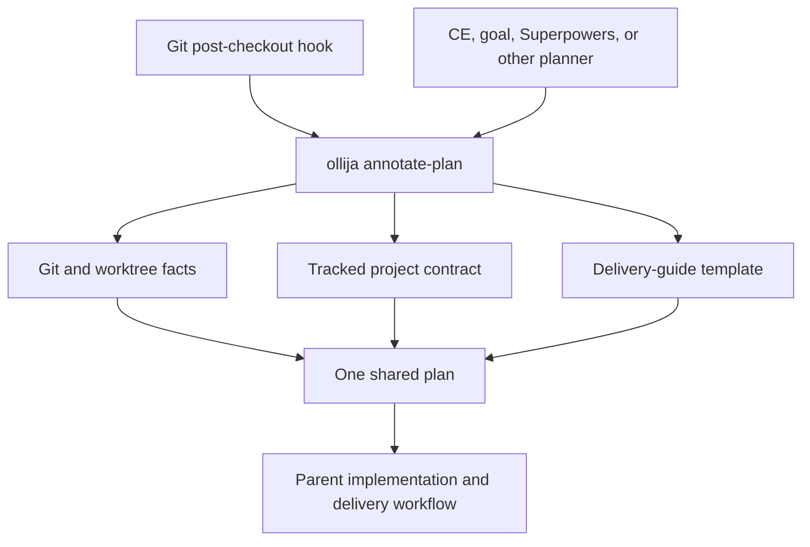
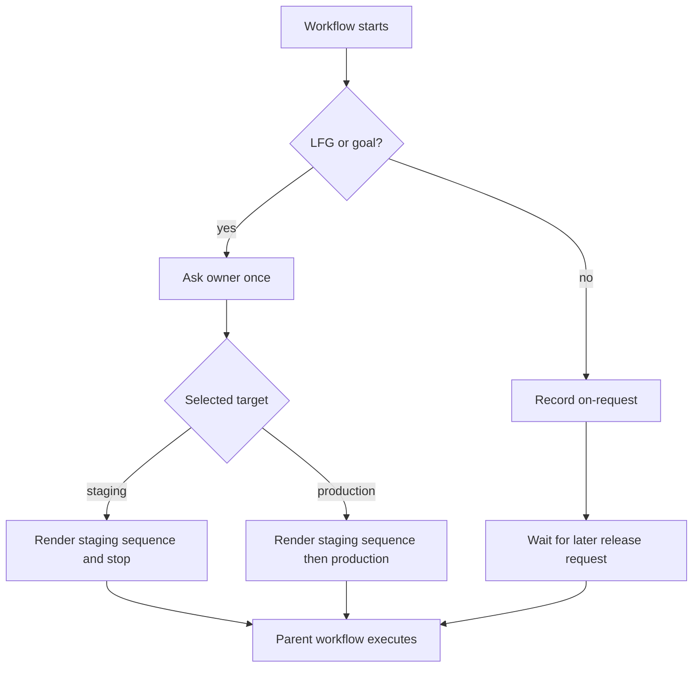

# Ollija Deterministic Plan Annotator - Plan

<!-- BEGIN OLLIJA DELIVERY GUIDE -->
## Ollija Delivery Guide

This block is generated guidance. Do not edit it directly. Correct durable facts in `.ollija/project.yaml` or this template, then rerun `./bin/ollija annotate-plan`. Put a user-directed exception in the editable Delivery Exceptions section below.

### Resolved locations

- Authoritative host: `fuchitalee`
- Authoritative repository: `/Users/fuchitalee/development/pushin-weight-v2`
- Ollija release worktree area: `/Users/fuchitalee/development/pushin-weight-v2/.worktrees`
- Active worktree: `/Users/fuchitalee/development/pushin-weight-v2/.worktrees/feat/ollija-plan-annotator`
- Plan: `/Users/fuchitalee/development/pushin-weight-v2/.worktrees/feat/ollija-plan-annotator/docs/plans/2026-08-19-105405-feat-ollija-plan-annotator-plan.md`
- Change: `ollija-plan-annotator-20260819`
- Branch: `feat/ollija-plan-annotator`
- Staging branch and blueprint: `staging`, `/Users/fuchitalee/development/pushin-weight-v2/.worktrees/feat/ollija-plan-annotator/render-staging.yaml`
- Production branch and blueprint: `main`, `/Users/fuchitalee/development/pushin-weight-v2/.worktrees/feat/ollija-plan-annotator/render.yaml`
- Staging URL: `https://pushinweight-staging-web.onrender.com`
- Production URL: `https://pushinweight-web.onrender.com`

### Placement

This worktree is inside the Ollija release worktree area. Reuse it for the whole change. Do not create a second worktree or plan for this branch.

### Delivery scope

- Workflow: `lfg`
- Delivery target: `production`
- Owner selection recorded: `true`

1. Complete implementation and the plan's verification contract.
2. Run the configured focused checks:
   - `pytest tests/ollija`
3. The parent workflow commits only this plan's changes, pushes the feature branch, and records the candidate SHA.
4. Fetch the remote staging lane: `git fetch origin refs/heads/staging`.
5. Require the unchanged candidate SHA to be a fast-forward of that fetched remote ref, then push the exact candidate SHA to `refs/heads/staging` with the server-enforced fast-forward command `git push origin <candidate-sha>:refs/heads/staging`.
6. Verify the remote staging ref resolves to the candidate SHA and the Render deployment for `pushinweight-staging-web` reports that same SHA.
7. Run staging checks. Stop here if they fail.
8. Only after staging passes, fetch the remote production lane: `git fetch origin refs/heads/main`.
9. Require the same unchanged candidate SHA to be a fast-forward of that fetched remote ref, then push the exact candidate SHA to `refs/heads/main` with the server-enforced fast-forward command `git push origin <candidate-sha>:refs/heads/main`.
10. Verify the remote production ref resolves to the candidate SHA and the Render deployment for `pushinweight-web` reports that same SHA before reporting completion.

### Failure handling

- Never promote a staging candidate whose automated checks failed.
- Implementation failures return to the parent implementation workflow for diagnosis, correction, recommit, and restaging.
- SSH, shell, environment, or multi-machine failures use the repository infra/multi-machine skill first.
- The change ledger is advisory; do not validate or enforce it.
- Do not run an endless retry loop or start a persistent Ollija process.
<!-- END OLLIJA DELIVERY GUIDE -->

## Delivery Exceptions

None.

---

## Goal Capsule

- **Objective:** Make Ollija a low-friction, agent-agnostic delivery guide that keeps one change in the right worktree and plan without controlling implementation or release state.
- **Means:** Replace the stateful workflow engine with one deterministic plan annotation command, a shared plan artifact, and a non-blocking worktree hook (KTD1-KTD5).
- **Authority:** The Product Contract and session-settled decisions in this plan override historical Ollija plans, runbooks, state, and solution documents.
- **Execution profile:** This LFG run proceeds through production because the user selected that target before planning.
- **Stop conditions:** Stop before production when staging checks fail, when the requested candidate identity cannot be preserved, or when recovery requires credentials, new authority, or a product decision.
- **Tail ownership:** The parent workflow implements, tests, commits, stages, and promotes. Ollija only writes guidance into the plan.

---

## Product Contract

### Summary

Ollija becomes a deterministic compiler for one shared plan. It creates a minimal plan stub when needed and maintains a read-only delivery guide with concrete repo, worktree, test, Git, staging, production, and recovery instructions.

### Problem Frame

Ollija began as a safety guide but accumulated task ledgers, detached supervisors, receipts, browser credentials, approvals, database refreshes, release states, and recovery loops. Those mechanisms made routine work slower and harder to stop, and they duplicated capabilities already owned by planning, implementation, Git, Render, and diagnostic tools.

The useful invariant is smaller: agents need one authoritative place to work and one durable document that tells them how the change should move from implementation through staging and, when authorized, production. The instructions must be specific and reproducible, but Ollija must not become the actor that supervises or approves the work.

### Actors

- A1. **Owner:** Chooses an autonomous run's delivery target and may direct a per-plan exception.
- A2. **Planning agent:** Resolves the shared plan stub, enriches that same file, and refreshes its delivery guide.
- A3. **Implementation workflow:** Follows the plan, runs checks, commits, stages, and promotes within the authority granted by the owner.
- A4. **Git worktree hook:** Invokes the same annotator after linked-worktree creation without prompting, moving, or blocking.

### Key Decisions

- **Ollija guides instead of gates.** (session-settled: user-directed — chosen over preserving the stateful release gatekeeper: the existing controls add more friction than value.) Governs R1, R10-R16.
- **One plan is authoritative for each change.** (session-settled: user-approved — chosen over allowing a hook stub and planning skill to create separate documents: duplicate plans lose decisions and delivery context.) Governs R2-R6, R8.
- **Autonomous delivery scope is chosen once, upfront.** (session-settled: user-directed — chosen over assuming production or asking again at later gates: LFG and goal need clear authority without repeated interruptions.) Governs R11-R13.
- **A noncanonical worktree receives mandatory relocation guidance, not a creation gate.** (session-settled: user-approved — chosen over blocking or interactively moving the worktree: the plan should correct placement without reviving gatekeeper behavior.) Governs R7, R9.

### Requirements

**Shared plan artifact**

- R1. Ollija exposes one public command, `./bin/ollija annotate-plan [optional-plan-path]`, with `--check`, workflow, and delivery-target options on that command only.
- R2. A no-path invocation reuses exactly one plan associated with the active branch and worktree or creates a minimal Markdown unified-plan stub when no match exists.
- R3. The stub filename follows the repository's `YYYY-MM-DD-HHMMSS-description` convention and is valid input for CE, Superpowers, goal, and other planning workflows.
- R4. Planning workflows must enrich the resolved stub in place and rerun annotation after their final write or document review.
- R5. Explicit plan paths must remain under the active worktree's configured plan directory; ambiguous matches and malformed plans fail without modifying files.
- R6. Concurrent invocation must not create duplicate stubs for one branch and worktree.

**Generated delivery guide**

- R7. The annotator inserts or replaces one read-only block between the exact `BEGIN OLLIJA DELIVERY GUIDE` and `END OLLIJA DELIVERY GUIDE` markers while preserving every byte outside that span.
- R8. A human-editable `Delivery Exceptions` section remains outside the generated markers and survives every re-annotation.
- R9. The guide resolves the authoritative host, authoritative repository, Ollija release worktree area, active worktree, plan, branch, blueprints, and environment URLs to concrete values from tracked configuration and Git.
- R10. A noncanonical worktree guide makes relocation the first mandatory plan action, shows current and required absolute paths, and requires re-annotation after the move; Ollija does not move or reject the worktree.

**Workflow and delivery intent**

- R11. Ordinary planning records delivery as `on-request`; creating or completing a plan does not authorize a commit, push, staging deployment, or production release.
- R12. LFG and goal integrations ask the owner once whether to stop after staging or continue through production before implementation begins.
- R13. The selected workflow and delivery target are stored as preserved plan metadata and rendered into the guide; the command never infers production authority from conversation or branch state.
- R14. A production guide orders implementation, verification, task-owned commit, feature-branch push, exact-candidate staging, staging checks, same-candidate production promotion, and production confirmation. Each lane fetches its remote ref, permits only a server-enforced fast-forward of the unchanged candidate SHA, pushes that SHA directly to the lane ref, and verifies both the remote ref and Render deployment identity.
- R15. A staging guide stops after staging checks, and an ordinary guide waits for a later explicit release request.
- R16. On failure, the guide prevents promotion, returns code failures to the parent workflow, routes infra failures to the infra/multi-machine skill, and never launches a persistent recovery agent or unlimited retry loop.

**Integration and retirement**

- R17. The tracked Git hook calls `annotate-plan` non-interactively for linked worktrees, reports actionable errors, and never prompts, moves worktrees, deploys, or blocks unrelated checkouts.
- R18. `AGENTS.md`, the canonical Ollija skill, Claude compatibility link, and agent metadata give Codex, Claude, and other instruction-aware agents the same pre-plan and post-plan contract. Before commit or deployment, the parent workflow must read the plan's delivery target, generated guide, and editable exceptions, refresh stale guidance, and stop on any conflict instead of silently skipping the guide.
- R19. Ollija retains no task supervision, vendor-agent adapters, approvals, receipts, browser verification, database copy/refresh engine, release lifecycle, checkpoint ownership, or persistent runtime state.
- R20. Hosted staging remains isolated and owner-only, but its build and migration path no longer waits for an Ollija database-refresh marker or exposes PostgreSQL solely for that retired refresh path.
- R21. `docs/ollija/CHANGES.md` remains a concise append-only human reference for material behavior changes, but no command rejects work because the ledger is missing or malformed.
- R22. Present-tense docs, shared vocabulary, and tests describe only the annotator model; historical artifacts that remain are clearly marked superseded.

### Acceptance Examples

- AE1. **First invocation in a canonical linked worktree.** Given no associated plan exists, when the hook or an agent runs `annotate-plan`, then exactly one timestamped stub is created with canonical placement and `on-request` delivery guidance. Covers R2, R3, R6, R9, R17.
- AE2. **Planner reuses the hook stub.** Given the hook created a stub, when CE or another planner starts and finishes planning, then it enriches that path and final re-annotation preserves the plan while refreshing one guide. Covers R4, R7, R18.
- AE3. **Outside worktree.** Given the active linked worktree is outside `.worktrees/`, when annotation runs, then the guide names both absolute paths and makes relocation plus re-annotation the first task without prompting or moving anything. Covers R10, R17.
- AE4. **Autonomous production run.** Given the owner selects production for LFG, when annotation runs, then plan metadata and the guide say production and the parent workflow continues from green staging without another Ollija authorization prompt. Covers R12-R14.
- AE5. **Human content survives.** Given an agent edits the implementation plan and the owner adds a delivery exception, when annotation is rerun, then only the generated span changes and the exception is byte-identical. Covers R7, R8.
- AE6. **Staging check fails.** Given the selected target is production, when a staging check fails, then the guide prevents promotion and returns control to the parent workflow without creating Ollija state or a background retry. Covers R16, R19.

### Success Criteria

- Any supported agent reaches the same plan and byte-identical generated guide for the same tracked configuration and Git facts.
- Worktree and plan creation no longer produce owner approval prompts, browser codes, receipts, or long-running Ollija processes.
- The focused Ollija implementation and tests are materially smaller than the retired stateful subsystem while covering every acceptance example.
- A fresh staging deployment runs ordinary guarded Django migrations without depending on an Ollija snapshot marker.

### Scope Boundaries

**In scope**

- The repo-local Ollija CLI, template/configuration, hook, canonical skill, agent rules, tests, vocabulary, change ledger, and present-tense runbooks.
- The narrow staging migration and network-config decoupling required after the database-refresh engine is removed.

**Outside this change**

- A general multi-agent orchestrator, session-memory service, authorship tracker, cloud synchronization system, daemon, or OpenClaw replacement.
- Editing installed CE, Superpowers, or other third-party plugin caches; tracked repo instructions are the portable integration boundary.
- PushinWeight product UI, production database schema/data, harvesting, narrative generation, and headline behavior.
- Replacing Render, the existing `staging` and `main` lanes, or owner-only staging authentication.

### Sources and Research

- Existing implementation and historical contract: `scripts/ollija/`, `.ollija/project.yaml`, `.ollija/hooks/post-checkout`, `.agents/skills/ollija/SKILL.md`, `docs/plans/2026-08-14-120533-feat-ollija-staging-release-workflow-plan.md`.
- Durable recovery and worktree lessons: `docs/solutions/workflow-issues/2026-08-17-190429-ollija-task-recovery.md`.
- Staging incident lessons: `docs/solutions/data-migration/posts-raw-denormalize-staging-verified-2026-07-28.md`, `docs/solutions/data-migration/posts-raw-denormalize-prod-incident-2026-07-28.md`.
- Template-driven, agent-agnostic planning precedent: [GitHub Spec Kit](https://github.com/github/spec-kit), [Superpowers writing-plans skill](https://github.com/obra/superpowers/blob/main/skills/writing-plans/SKILL.md), and [OpenSpec](https://github.com/Fission-AI/OpenSpec).
- Worktree hook precedent and hook fragility: [agent-worktree](https://github.com/nekocode/agent-worktree), [Claude Code hook issue 82691](https://github.com/anthropics/claude-code/issues/82691), and [Claude Code post-create hook proposal 27744](https://github.com/anthropics/claude-code/issues/27744).

---

## Planning Contract

### Key Technical Decisions

- KTD1. **Use a deterministic renderer, not an Ollija agent.** (session-settled: user-approved — chosen over a dedicated LLM subagent writing delivery instructions: a pure renderer is faster, portable, testable, and cannot drift in wording.) A thin CLI supplies validated inputs to one annotation module. Implements R1, R7-R9, R19.
- KTD2. **Keep a small tracked project contract and template.** `.ollija/project.yaml` retains only authoritative host/repository, plan/worktree paths, branch/blueprint identities, URLs, test guidance, and failure routes. `.ollija/templates/delivery-guide.md` owns rendered wording. Correcting either source and rerunning annotation repairs every affected guide. Implements R9, R14-R16, R20.
- KTD3. **Store human delivery authority in plan metadata.** The `ollija` frontmatter mapping owns stable change identity, branch, workflow, `on-request|staging|production`, and whether the user selected it. The generated block reflects but does not own those values. Implements R2, R4, R11-R15.
- KTD4. **Resolve one plan under a short common-Git lock.** The annotator distinguishes the active worktree root from the authoritative repository root, matches the current branch plus Ollija metadata, reserves timestamped stubs atomically, and rescans after collisions. The lock prevents two agent or hook invocations from creating parallel stubs without becoming persistent workflow state. Implements R2-R6, R9.
- KTD5. **Use the Git hook plus tracked instructions, not a daemon.** (session-settled: user-approved — chosen over a filesystem watcher or persistent Ollija process: Git gives a deterministic worktree event while repo instructions cover planners without lifecycle or kill-button problems.) The hook calls the same command and exits non-blockingly; planner integrations run before target selection and after final write. Implements R4, R12, R17-R19.
- KTD6. **Retire the stateful engine as one boundary.** Delete its runtime modules and obsolete tests instead of leaving compatibility shims that keep dead commands discoverable. Preserve only the thin entrypoint, minimal config/annotation/worktree facts, staging infrastructure, and focused regression net. Implements R19-R22.

### Assumptions

- Version 1 annotates Markdown plans only. HTML planning remains outside scope until a real repo workflow needs it.
- Fresh clones require the documented one-time Git `core.hooksPath` setup because Git does not activate tracked hooks automatically; this repository's authoritative checkout is already configured.
- Detached linked worktrees do not receive an automatic stub because they lack the stable branch identity required by R2; the hook reports how to create or attach a branch and exits without blocking checkout.
- The exact Render observation commands may evolve, so the tracked template names the configured services, blueprints, URLs, expected candidate identity, and required outcomes while the parent workflow chooses the current Render interface.
- Historical plans and incident documents remain immutable records unless their present-tense wording would misdirect an agent; those receive a short superseded notice instead of being rewritten as if the old events never occurred.

### High-Level Technical Design

### System-Wide Impact

- **Agent behavior:** Every instruction-aware agent receives the same plan-resolution contract; no vendor adapter launches or supervises an agent.
- **Git:** The shared hook remains repo-local and non-blocking. Worktree identity comes from Git common-dir and active-worktree facts rather than the old candidate state.
- **Staging:** The staging service, branch, database, dry-run posture, and owner-only authentication remain. Only the snapshot-marker wait and snapshot-only public database access are removed.
- **Documentation:** Current command tables, glossary terms, and recovery instructions must be rewritten together so removed commands do not remain discoverable.
- **Runtime data:** Existing ignored `.ollija/state` files are obsolete and never read. The implementation does not delete a user's local historical state as part of normal annotation.

### Risks and Mitigations

- **Planner creates a second plan:** Require pre-plan resolution and post-write annotation in tracked instructions; test hook-to-planner reuse across agent surfaces.
- **Concurrent stub creation:** Serialize discovery and exclusive creation under the shared Git directory; test simultaneous invocations.
- **Absolute paths become stale after relocation:** Render both current and required paths, require relocation first, and refresh the guide after any move.
- **Hook failures interrupt Git:** Keep the hook noninteractive and non-blocking while emitting a precise recovery command and testing failing annotation paths.
- **Staging becomes unusable after refresh removal:** Remove the marker dependency and verify ordinary advisory-locked migrations against staging mode before deleting the refresh engine.
- **Scope expands into orchestration again:** Keep `annotate-plan` as the only public command and reject new runtime lifecycle/state concepts in agent-parity and repository-hygiene tests.

---

## Implementation Units

### U1. Build the deterministic annotation core

- **Goal:** Define the minimal tracked inputs and a pure renderer that creates or replaces one delivery guide without disturbing human plan content.
- **Requirements:** R7-R10, R13-R16, R21; KTD2-KTD4.
- **Dependencies:** None.
- **Files:** `.ollija/project.yaml`, `.ollija/templates/delivery-guide.md`, `scripts/ollija/config.py`, `scripts/ollija/annotate_plan.py`, `tests/ollija/test_config.py`, `tests/ollija/test_annotate_plan.py`.
- **Approach:** Reduce the project contract to annotation facts, validate repo-relative configured paths against the authoritative root, parse the Ollija frontmatter mapping with `yaml.safe_load`, render exact runtime locations, and replace only one valid marker span. When markers are absent, insert the generated block immediately after the closing frontmatter delimiter and before the first content heading; create `## Delivery Exceptions` directly after the end marker when it is absent. Keep Delivery Exceptions outside the generated range.
- **Execution note:** Start with characterization cases that preserve arbitrary plan and exception bytes, then replace the legacy configuration model.
- **Patterns to follow:** The existing strict YAML validation in `scripts/ollija/config.py`; the repo's generated-section marker convention; `AGENTS.md` filename rule.
- **Test scenarios:**
  - Given a Markdown plan without markers, annotation inserts one guide immediately after frontmatter and one Delivery Exceptions section immediately after the generated block.
  - Given an existing valid guide plus arbitrary plan and exception text, re-annotation changes only the marker span.
  - Given identical config, Git facts, metadata, and template, repeated annotation produces byte-identical output.
  - Given duplicate or unbalanced markers, annotation reports a deterministic error and leaves the file unchanged.
  - Given production, staging, and on-request metadata, the guide renders the corresponding sequence and never upgrades authority.
  - Given a moved worktree and an explicit plan path, re-annotation replaces every stale resolved path.
- **Verification:** Focused annotation/config tests prove deterministic rendering, validation, and preservation before CLI integration.

### U2. Make `annotate-plan` the complete command surface

- **Goal:** Resolve, create, check, and report the one plan through the sole public Ollija command.
- **Requirements:** R1-R6, R11-R13; KTD1, KTD3, KTD4.
- **Dependencies:** U1.
- **Files:** `bin/ollija`, `scripts/ollija/__init__.py`, `scripts/ollija/__main__.py`, `scripts/ollija/cli.py`, `scripts/ollija/worktrees.py`, `tests/ollija/test_cli.py`, `tests/ollija/test_plan_discovery.py`, `tests/ollija/test_worktrees.py`.
- **Approach:** Keep the thin Python entrypoint, replace legacy subcommands with one parser, separate authoritative root from active worktree, validate explicit paths, match plan metadata, create a valid timestamped stub, and emit a stable result naming created/updated/unchanged state plus resolved paths. Use a short common-Git lock for discovery and creation.
- **Test scenarios:**
  - Given no matching plan on a named branch, the command creates one valid unified-plan stub and reports its path.
  - Given one matching plan, no-path invocation reuses it; given multiple matches, it requires an explicit path and changes nothing.
  - Given two concurrent no-path invocations, both return the same plan and only one file exists.
  - Given `--check`, current content exits successfully without writing and stale content reports failure without writing.
  - Given an explicit path outside the active plan directory or a detached worktree, the command reports an actionable error without creating a file.
  - Given autonomous workflow flags without a user-selected staging or production target, the command refuses to invent the target.
- **Verification:** CLI and discovery tests exercise the actual wrapper and validate stdout/stderr, exit codes, files, and concurrency outcomes.

### U3. Integrate worktree and planning triggers across agents

- **Goal:** Make worktree creation and every instruction-aware planning workflow converge on the same command and plan without prompts or a background process.
- **Requirements:** R4, R10, R12, R17, R18; KTD5.
- **Dependencies:** U2.
- **Files:** `.ollija/hooks/post-checkout`, `AGENTS.md`, `.agents/skills/ollija/SKILL.md`, `.agents/skills/ollija/agents/openai.yaml`, `tests/ollija/test_agent_parity.py`, `tests/ollija/test_worktrees.py`, `tests/ollija/test_repository_hygiene.py`.
- **Approach:** Replace the interactive guard with non-blocking annotation in linked worktrees. Rewrite the canonical skill and root instructions to run annotation before planner target selection and after final plan write. For LFG and goal, require the one upfront target question and pass the answer as metadata. Require every parent executor to read the refreshed guide and exceptions before its first Git or deployment mutation. Keep Claude's tracked link to the canonical skill.
- **Test scenarios:**
  - Given canonical, outside, primary-root, and detached checkout events, the hook creates or updates only the intended linked-worktree plan and never reads stdin or moves a worktree.
  - Given an annotation failure, the hook prints the recovery instruction and returns success to Git.
  - Given Codex and Claude resolve Ollija, both read the same command, marker, worktree-area label, and autonomous-target rules.
  - Given a hook-created stub, the documented planner sequence names that exact path before and after enrichment.
  - Given an ordinary plan, the instructions do not ask a delivery-target question or authorize deployment.
  - Given a stale guide or a delivery exception that conflicts with the selected target, the documented parent workflow refreshes or stops before commit, push, or deployment instead of ignoring the plan.
- **Verification:** Agent-parity and hook integration tests prove identical tracked guidance and non-blocking behavior.

### U4. Remove the stateful engine and decouple staging

- **Goal:** Delete retired runtime behavior and leave hosted staging able to build safely without the removed refresh marker.
- **Requirements:** R19, R20; KTD6.
- **Dependencies:** U2, U3.
- **Files:** `scripts/ollija/agents/`, `scripts/ollija/adapters/`, legacy modules under `scripts/ollija/`, obsolete files under `tests/ollija/`, `scripts/render_migrate.py`, `project/staging.py`, `build.sh`, `render-staging.yaml`, `tests/ollija/test_staging_access.py`, `tests/ollija/test_render_staging_topology.py`.
- **Approach:** Remove task, supervisor, checkpoint, receipt, approval, browser, database-copy, Render-release, and vendor-driver modules plus their behavior-specific tests. Retain only files owned by U1-U3. Simplify staging migration to always use its existing PostgreSQL advisory lock, remove the snapshot-marker gate, and remove database ingress present only for snapshot refresh while preserving dry-run and owner-only access settings.
- **Execution note:** Prove the staging migration path independently before deleting the refresh implementation that previously activated it.
- **Test scenarios:**
  - Given staging mode with no environment marker, the build migration runs under the advisory lock instead of returning early.
  - Given missing staging OAuth credentials or an empty owner allowlist, startup fails closed; an unauthenticated or non-allowlisted request cannot reach a protected staging route.
  - Given the staging Blueprint, owner-only auth, dry-run/provider-off settings, isolated database binding, and one web-service topology remain intact.
  - Given the staging Blueprint, the database has no public IP allowlist or other external PostgreSQL ingress and `DATABASE_URL` reaches only the staging web service through its service-scoped binding.
  - Given repository imports and CLI help, no retired module or command remains reachable.
  - Given the complete focused suite, no test writes receipts, launches tmux or vendor agents, requests browser state, or touches production data.
- **Verification:** Staging configuration tests, Django checks, import checks, focused Ollija tests, and a tracked-file repository-hygiene test prove the surviving boundary. The hygiene test allowlists only historical files carrying a superseded notice; all current instructions and executable paths must be free of retired commands and module references.

#### U4 deletion manifest

| Disposition | Files | Reason |
|---|---|---|
| Keep and rewrite | `bin/ollija`, `scripts/ollija/__init__.py`, `scripts/ollija/__main__.py`, `scripts/ollija/cli.py`, `scripts/ollija/config.py`, `scripts/ollija/worktrees.py` | These form the minimal wrapper, one-command parser, tracked configuration loader, and Git/worktree fact boundary. |
| Add | `scripts/ollija/annotate_plan.py`, `.ollija/templates/delivery-guide.md` | These own plan discovery, stub creation, byte-preserving annotation, and deterministic guide wording. |
| Delete | `scripts/ollija/agents/`, `scripts/ollija/adapters/` | Ollija no longer launches, resumes, selects, or supervises coding agents and needs no project release adapter. |
| Delete | `scripts/ollija/approvals.py`, `scripts/ollija/bridgewright.py`, `scripts/ollija/checkpoint.py`, `scripts/ollija/incidents.py`, `scripts/ollija/processes.py`, `scripts/ollija/supervisor.py`, `scripts/ollija/task_control.py`, `scripts/ollija/tasks.py`, `scripts/ollija/workspaces.py` | These implement the retired owner gates, durable generations, checkpointing, background processes, incident state, and managed workspaces. |
| Delete | `scripts/ollija/database.py`, `scripts/ollija/hosted_database.py`, `scripts/ollija/preview.py`, `scripts/ollija/release.py`, `scripts/ollija/render.py`, `scripts/ollija/state.py`, `scripts/ollija/status.py`, `scripts/ollija/verification.py`, `scripts/ollija/versioning.py` | These implement the retired database-copy, preview, receipt, lifecycle, staging/release, browser-verification, and beta-version engine. |
| Delete | `scripts/ollija/changes.py`, `scripts/ollija/impact.py`, `scripts/ollija/redaction.py`, `scripts/ollija/results.py`, and the legacy `scripts/ollija/git.py` implementation | The ledger is advisory, impact classification is gone, and result/receipt redaction is unnecessary. U2's `scripts/ollija/worktrees.py` replaces the legacy Git module with only active-worktree, authoritative-root, branch, and common-Git-lock facts; no compatibility shim remains. |
| Delete or replace | Every legacy behavior test under `tests/ollija/` | Keep only rewritten annotation, CLI, configuration, worktree/hook, agent-parity, repository-hygiene, and staging-isolation tests named by U1-U4. No test should preserve a retired command as an accidental contract. |

The deletion is complete only when repository search finds no imports, command names, or executable documentation paths into these retired modules. Untracked historical files under `.ollija/state/` are ignored and no longer read; implementation does not destroy the owner's local evidence merely to simplify the codebase.

### U5. Replace present-tense documentation and preserve history

- **Goal:** Make the annotator model the only current Ollija story while retaining a lightweight, non-enforcing record of why it changed.
- **Requirements:** R21, R22; KTD6.
- **Dependencies:** U1-U4.
- **Files:** `docs/ollija/README.md`, `docs/ollija/CHANGES.md`, `docs/ollija/2026-08-15-repeatable-hosted-refresh-fix.md`, `docs/ollija/readme-test-prompt.md`, `docs/ollija/test-prompt-2.md`, `docs/operations/ollija.md`, `docs/operations/ollija-rollout-baseline.md`, `docs/deploy/render.md`, `docs/solutions/workflow-issues/2026-08-17-190429-ollija-task-recovery.md`, `CONCEPTS.md`, `tests/ollija/test_repository_hygiene.py`.
- **Approach:** Rewrite current guidance around the one command, shared plan, exact-path block, upfront autonomous target, noncanonical relocation, parent-owned delivery, and error-correction path. Append one concise change entry without enforcing it. Mark the old stateful plan/solution/baseline as superseded where needed and remove obsolete glossary concepts.
- **Test scenarios:**
  - Current docs mention `annotate-plan` and contain no runnable instruction for retired status, go, stop, refresh, approval, release, verification, receipt, or browser-code commands.
  - The change ledger contains the new behavior, proof, and release impact but no code path imports or enforces ledger validation.
  - The glossary defines the delivery guide, Ollija release worktree area, and delivery target without task-generation or receipt lifecycle terms.
  - Historical documents that retain old commands open with an unambiguous superseded notice and point to the current README.
- **Verification:** Repository-hygiene checks and a human scan of rendered Markdown show one consistent current workflow.

---

## Verification Contract

| Gate | Command or evidence | Applies to | Done signal |
|---|---|---|---|
| Focused annotator behavior | `pytest tests/ollija` | U1-U5 | Creation, reuse, replacement, concurrency, hook, parity, staging, and hygiene tests pass. |
| Full regression suite | `pytest` | U1-U5 | No PushinWeight regression is introduced by module deletion or staging decoupling. |
| Django deployment safety | `python manage.py check --deploy` | U4 | Deployment configuration passes with only known environment-specific warnings documented. |
| Plan freshness | `./bin/ollija annotate-plan --check docs/plans/2026-08-19-105405-feat-ollija-plan-annotator-plan.md` | U1-U5 | The current plan's guide matches tracked sources and selected production target. |
| CLI surface | `./bin/ollija --help` | U2-U3 | `annotate-plan` is the only public command and no retired command is advertised. |
| Retired-surface hygiene | `pytest tests/ollija/test_repository_hygiene.py` | U3-U5 | Current imports, commands, agent instructions, templates, and runbooks contain no executable path into retired behavior; allowlisted history is visibly superseded. |
| Diff hygiene | `git diff --check` | U1-U5 | No whitespace or patch-format errors remain. |
| Staging proof | Exact candidate deployed through `staging` with its Render service healthy and Django login route reachable | U4-U5 | Staging runs the candidate without an Ollija marker or data refresh. |
| Production proof | The staging-verified candidate promoted through `main`; configured production services and health route confirm that candidate | U1-U5 | Production is healthy and no second Ollija authorization was requested. |

---

## Definition of Done

- U1 is done when the tracked contract and template render exact, deterministic, byte-preserving guides for every delivery target and placement state.
- U2 is done when one command safely creates, resolves, checks, and annotates one plan, including concurrent and malformed-input cases.
- U3 is done when the Git hook and tracked agent instructions converge on that same plan without prompts, moves, duplicate artifacts, or a daemon.
- U4 is done when all stateful Ollija runtime surfaces are unreachable or deleted and staging migrates safely without the retired snapshot marker.
- U4's deletion manifest is satisfied without compatibility shims, dormant copies, or tests that preserve retired behavior.
- U5 is done when current docs, vocabulary, and the change manifest describe only the guide model and retained historical artifacts are visibly superseded.
- Every acceptance example and verification gate passes.
- The diff contains no unrelated product changes, generated runtime state, secrets, cached agent artifacts, or abandoned compatibility code.
- The feature branch is delivered through staging and production according to the user-selected target recorded in this plan.
