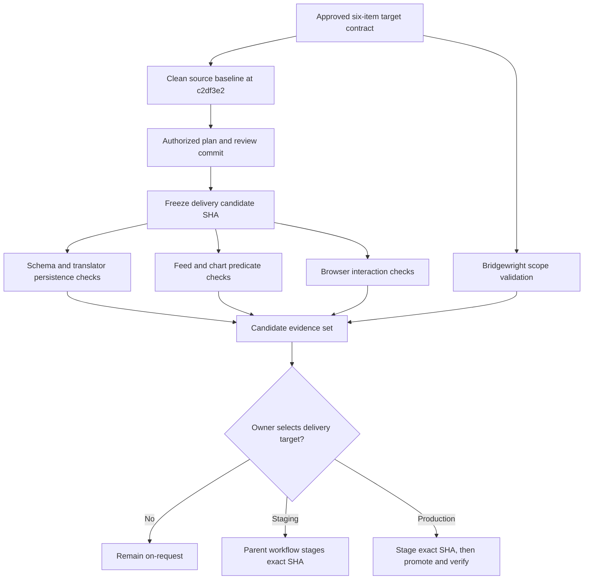

<!-- BEGIN OLLIJA DELIVERY GUIDE -->
## Ollija Delivery Guide

This block is generated guidance. Do not edit it directly. Correct durable facts in `.ollija/project.yaml` or this template, then rerun `./bin/ollija annotate-plan`. Put a user-directed exception in the editable Delivery Exceptions section below.

### Resolved locations

- Authoritative host: `fuchitalee`
- Authoritative repository: `/Users/fuchitalee/development/pushin-weight-v2`
- Ollija release worktree area: `/Users/fuchitalee/development/pushin-weight-v2/.worktrees`
- Active worktree: `/Users/fuchitalee/development/pushin-weight-v2/.worktrees/review/production-filter-feed-six-item`
- Plan: `/Users/fuchitalee/development/pushin-weight-v2/.worktrees/review/production-filter-feed-six-item/docs/plans/2026-08-24-015312-review-production-filter-feed-six-item-plan.md`
- Change: `review-production-filter-feed-six-item-2026-08-24-015312`
- Branch: `review/production-filter-feed-six-item`
- Staging branch and blueprint: `staging`, `/Users/fuchitalee/development/pushin-weight-v2/.worktrees/review/production-filter-feed-six-item/render-staging.yaml`
- Production branch and blueprint: `main`, `/Users/fuchitalee/development/pushin-weight-v2/.worktrees/review/production-filter-feed-six-item/render.yaml`
- Staging URL: `https://pushinweight-staging-web.onrender.com`
- Production URL: `https://pushinweight-web.onrender.com`

### Placement

This worktree is inside the Ollija release worktree area. Reuse it for the whole change. Do not create a second worktree or plan for this branch.

### Delivery scope

- Workflow: `plan`
- Delivery target: `production`
- Owner selection recorded: `true`

1. Complete implementation and the plan's verification contract.
2. Run the configured focused checks:
   - `pytest tests/ollija`
3. The parent workflow commits only this plan's changes, pushes the feature branch, and records the candidate SHA.
4. Fetch the remote staging lane: `git fetch origin refs/heads/staging`.
5. Require the unchanged candidate SHA to be a fast-forward of that fetched remote ref, then push the exact candidate SHA to `refs/heads/staging` with the server-enforced fast-forward command `git push origin <candidate-sha>:refs/heads/staging`.
6. Verify the remote staging ref resolves to the candidate SHA and the Render deployment for `pushinweight-staging-web` reports that same SHA.
7. Run staging checks. Stop here if they fail.
8. Only after staging passes, fetch the remote production lane: `git fetch origin refs/heads/main`.
9. Require the same unchanged candidate SHA to be a fast-forward of that fetched remote ref, then push the exact candidate SHA to `refs/heads/main` with the server-enforced fast-forward command `git push origin <candidate-sha>:refs/heads/main`.
10. Verify the remote production ref resolves to the candidate SHA and the Render deployment for `pushinweight-web` reports that same SHA before reporting completion.

### Failure handling

- Never promote a staging candidate whose automated checks failed.
- Implementation failures return to the parent implementation workflow for diagnosis, correction, recommit, and restaging.
- SSH, shell, environment, or multi-machine failures use the repository infra/multi-machine skill first.
- The change ledger is advisory; do not validate or enforce it.
- Do not run an endless retry loop or start a persistent Ollija process.
<!-- END OLLIJA DELIVERY GUIDE -->

## Delivery Exceptions

None.

# Production Filter and Feed Six-Item Delivery - Plan

## Goal Capsule

- **Objective:** Preserve and deliver the completed six-item localized-filter and feed-interaction candidate without absorbing the separate Chart.js batch or unrelated worktree changes.
- **Means:** Treat `c2df3e2` as the source baseline, commit the finalized plan only after the owner selects a delivery target, then freeze and revalidate the resulting exact delivery-candidate SHA (KTD1, KTD2, KTD6).
- **Authority:** `docs/reference/2026-08-19-174833-production-filter-feed-bridgewright-target.md` owns the approved behavior boundary. The Product Contract below traces that boundary. The Ollija Delivery Guide owns delivery-location and authority guidance.
- **Execution profile:** Review and delivery preparation are ready. Git and deployment mutations remain unauthorized while `delivery_target` is `on-request`.
- **Stop conditions:** Stop on candidate-SHA drift, a stale Ollija guide, a failed required regression, a migration conflict, scope contamination from the deferred Chart.js work, or missing owner delivery authority.
- **Tail ownership:** The parent delivery workflow owns any commit, push, staging refresh, production promotion, and exact-SHA production verification. Ollija and Bridgewright remain advisory.

---

## Product Contract

### Summary

This plan isolates the completed production filter/feed candidate on a clean branch, preserves its approved six-item behavior, and defines the evidence required before any later delivery action. It excludes the uncommitted Chart.js continuation and treats the existing candidate implementation as the review baseline rather than reopening feature development.

### Problem Frame

The six-item batch source baseline is committed at `c2df3e2` and is represented by the staging and mockup-v23 remote-tracking branches. The prior continuity checkout used a retired Ollija release controller, while the other worktree at the baseline SHA contains uncommitted Chart.js work and edits to the older multi-batch plan. A dedicated plan and clean worktree are required so delivery review cannot silently combine those scopes.

The candidate also introduces two nullable database columns and connects existing translator output to one of them. Delivery evidence must therefore cover schema safety, unchanged provider-call shape, filter parity between feed and chart queries, real browser interactions, and the protected production Chart.js surface.

### Key Decisions

- **Keep the substantial Chart.js batch separate** (session-settled: user-directed — chosen over combining the batches: the owner deferred it to keep the six-item regression surface bounded). Governs R10.
- **Reuse the existing `cn_equivalent` translator output for Chinese commentary.** `commentary_en` remains nullable and unpopulated; no prompt, provider call, retry, or historical backfill is added. Governs R4, R8, and R9.
- **Treat Bridgewright as assessment evidence only.** It validates the written target boundary but cannot approve, commit, deploy, or replace owner review. Governs R11.

### Requirements

**Filter behavior and localization**

- R1. The named filter pills appear in the order Brands, Sentiment, Post Type, Lang, Role, Nationalism, followed by the preserved Discourse and Unsanctioned controls.
- R2. Under zh-CN, every visible filter-dropdown label is localized while checkbox values and request keys remain stable machine identifiers.
- R3. Discourse exposes a localized synthetic `uncategorized` choice that matches posts with no discourse classification in both feed and chart filtering and composes as OR with classified selections.

**Commentary and feed interaction**

- R4. `Post.commentary_zh_cn` and `Post.commentary_en` remain nullable; existing `cn_equivalent` output persists only to `commentary_zh_cn`, with blank and `N/A` normalized to `NULL`.
- R5. In zh-CN, the existing text interaction cycles through available Chinese commentary from `commentary_zh_cn`, literal Chinese post text from `text_zh_cn`, and English post text from `text_en`; it skips missing or duplicate layers and never opens X.
- R6. Clicking non-interactive whitespace or content in a feed row opens the row's X post, while clicks on the text-cycle element, handle/link, or signal column do not trigger row navigation.
- R7. English, zh-CN, and Original remain independent locale choices with exactly one active state.

**Candidate and delivery integrity**

- R8. The candidate preserves exactly one existing translator call and one classifier call; `commentary_en` remains `NULL` unless a separately approved future change populates it.
- R9. The candidate adds no historical commentary backfill, live LLM spend, new provider endpoint, retry behavior, or harvest-cadence change.
- R10. The source baseline at `c2df3e2` already makes the production Chart.js component consume the approved `post_types` and synthetic uncategorized discourse predicates; the delivery candidate preserves that runtime tree without the deferred Chart.js batch.
- R11. The target contract, focused automated regressions, real browser evidence, and Bridgewright validation must agree on the exact candidate before delivery proceeds.
- R12. A Git or deployment mutation requires an explicit owner delivery request and a current successful `annotate-plan --check`; the unchanged candidate SHA must pass staging before any production promotion.

### Acceptance Examples

- AE1. **Covers R3.** Given a post with no discourse rows and filters containing `uncategorized`, both the feed matcher and chart queryset include the post. A selection containing `uncategorized` plus a classified key includes either category.
- AE2. **Covers R4 and R5.** Given values in `commentary_zh_cn`, `text_zh_cn`, and `text_en`, repeated text clicks advance through the available distinct layers and wrap. A blank `commentary_en` creates no extra synthesis layer.
- AE3. **Covers R6.** Given a rendered feed row, clicking its shell opens the post URL. Clicking its text, handle, link, or signals leaves row navigation untouched.
- AE4. **Covers R7.** Selecting English marks only English active. Selecting Original marks only Original active, and selecting zh-CN marks only zh-CN active.
- AE5. **Covers R10.** Applying Post Type or Uncategorized filters updates both feed and chart results while one live production Chart.js canvas and its rich payload contract remain present.
- AE6. **Covers R11.** Given a green candidate, the target contract, automated regressions, real browser evidence, and Bridgewright assessment all identify the same candidate SHA. A mismatch stops delivery review.
- AE7. **Covers R1 and R2.** Under zh-CN, the pills retain the approved order and every dropdown displays localized labels while submitted checkbox values and request keys remain unchanged.
- AE8. **Covers R8 and R9.** A production-path cycle performs one existing translator call and one classifier call, leaves `commentary_en` as `NULL`, and adds no backfill, provider endpoint, retry, or cadence change.
- AE9. **Covers R12.** With the target still `on-request`, no Git or deployment mutation occurs. After an explicit owner selection and a successful annotation check, only the exact staging-verified candidate can advance toward production.

### Success Criteria

- The isolated branch begins at `c2df3e2` and contains no uncommitted Chart.js continuation.
- After the authorized plan/review commit, one exact branch-head SHA is frozen as the delivery candidate and owns all current automated, browser, Bridgewright, staging, and production evidence.
- The focused PostgreSQL/Django, JavaScript, browser, migration-drift, and target-contract regressions pass against one candidate SHA.
- Bridgewright validates the approved target and non-target boundary. Any external Bridgewright result is recorded separately from the historical local-harness result.
- If the owner later selects production delivery, the production services, database migration state, authenticated UI behavior, and beta tag or equivalent repository release marker all resolve to the promoted candidate according to the active parent workflow.

### Scope Boundaries

#### Deferred to Follow-Up Work

- The substantial Chart.js performance, axes, rendering, and home-chart changes currently present as uncommitted work in the separate `feat/mockup-v23` worktree.
- Any population strategy, prompt, or historical backfill for `commentary_en`.
- The concurrent backfiller branch remains separate. Before merge, it must rebase across this candidate's `core/migrations/0016_post_commentary_fields.py` and renumber its conflicting migration.

#### Outside This Plan

- Classifier semantics, translator prompts/models, harvest cadence, TwitterAPI calls, headline-worker topology, authentication, and unrelated database schema.
- Unrelated changes in the primary checkout, including documentation and graphic-system work.
- Direct Git, Render, database, approval, receipt, or release-state mutations performed by Ollija or Bridgewright.

### Product Contract Preservation

R1-R11 preserve the behavior approved in `docs/reference/2026-08-19-174833-production-filter-feed-bridgewright-target.md`; this plan restructures that scope into stable requirement and acceptance IDs without changing behavior. R12 adds a plan-local delivery guard and does not expand the product scope.

---

## Planning Contract

### Key Technical Decisions

- KTD1. **Use a dedicated clean branch and worktree from `c2df3e2`** (session-settled: user-approved — chosen over reusing the dirty primary or Chart.js worktree: isolation prevents unrelated changes from entering review). This implements R10-R12.
- KTD2. **Audit and revalidate the existing runtime tree instead of reimplementing it.** The code at `c2df3e2` is the source baseline. The authorized plan/review commit establishes a new delivery-candidate SHA before current evidence is gathered; any later tracked change creates another candidate SHA and invalidates prior SHA-bound evidence.
- KTD3. **Keep commentary persistence inside the existing translator-to-Post path.** `monitor/cycle.py` maps the already-produced value into nullable model fields, and tests pin provider-call counts per R4, R8, and R9.
- KTD4. **Implement Uncategorized as a synthetic predicate, not taxonomy data.** Feed matching and the set-based chart queryset share the same missing-classification meaning per R3.
- KTD5. **Use separate evidence layers for behavior and scope.** Django/JavaScript/browser tests prove runtime behavior; the Bridgewright target contract and validator prove that the reviewed surface matches the approved delta per R11.
- KTD6. **Keep delivery conditional and exact-SHA.** The parent workflow must read the generated guide and Delivery Exceptions, run the annotator freshness check, reconcile current staging state, and advance only the verified candidate per R12.

### High-Level Technical Design

The candidate evidence set is valid only while its SHA, deployment identity, and target contract agree. A code correction invalidates prior staged evidence and requires a new candidate review.

### Sequencing

1. Reconcile the clean branch, target contract, and source-baseline diff.
2. Stop at `on-request` until the owner selects delivery scope. Refresh and check the Ollija guide before the authorized plan/review commit freezes the delivery-candidate SHA.
3. Revalidate schema/persistence and filter/feed behavior against that exact candidate.
4. Run browser and Bridgewright assessment after automated behavior checks are green.
5. Let the parent workflow stage or promote only the unchanged candidate that owns the current evidence.

### System-Wide Impact

- **Data:** Migration `0016` adds two nullable text columns without backfill. Existing rows remain valid.
- **Harvest:** One existing translator result gains a persistence destination. Provider-call count, classifier behavior, and cycle cadence remain unchanged.
- **Web:** Filter option projection, chart/feed predicates, feed payloads, SSR markup, refreshed rows, and locale state participate in the regression net.
- **Operations:** Any delivery must apply migrations before the web and harvest services consume the new columns. Exact-SHA checks protect the multi-service deployment boundary.

### Risks and Dependencies

- Remote branches or hosted staging may have moved since the recorded verification. Reconcile them before treating historical evidence as current.
- The original verification record reports only the local Bridgewright contract harness. A later external executable result must not be backdated or conflated with that record.
- A code correction changes the candidate SHA and invalidates SHA-bound staging or browser evidence.
- This candidate owns `core/migrations/0016_post_commentary_fields.py`. The deferred backfiller branch must rebase and renumber its conflicting migration after this candidate before merge; never rewrite an already-applied production migration.
- Locale regressions can hide behind default-language rendering. Browser tests must exercise the real locale navigation and active-state behavior.

### Sources and Research

- `docs/reference/2026-08-19-174833-production-filter-feed-bridgewright-target.md` — approved target, explicit non-targets, and regression boundary.
- `docs/plans/2026-08-19-043225-feat-mockup-v23-plan.md` — implementation and historical verification record under “Production filter/feed batch (2026-08-19).”
- `docs/solutions/workflow-issues/django-i18n-locale-toggle-debugging-journey.md` — locale tests must traverse the real browser path and validate the active language rather than relying on defaults.
- `docs/solutions/architecture-patterns/posts-raw-denormalization.md` — schema changes require an explicit regression net and operational verification appropriate to PostgreSQL.
- `docs/ollija/README.md` and `docs/operations/ollija.md` — current plan-annotation and parent-owned delivery contract.

---

## Implementation Units

### U1. Reconcile the isolated candidate

- **Goal:** Establish one clean, reviewable candidate and prove that its diff matches the approved six-item boundary.
- **Requirements:** R10-R12.
- **Dependencies:** None.
- **Files:** `docs/reference/2026-08-19-174833-production-filter-feed-bridgewright-target.md`, `docs/plans/2026-08-19-043225-feat-mockup-v23-plan.md`, `docs/plans/2026-08-24-015312-review-production-filter-feed-six-item-plan.md`, `bridgewright.yaml`, `tests/test_bridgewright_v24_target.py`.
- **Approach:** Compare `c2df3e2` with the protected production baseline and classify every changed file against the target contract. Exclude uncommitted Chart.js and primary-checkout changes. After owner selection and the annotation check authorize Git mutation, commit the finalized plan/review artifact and freeze that branch head as the delivery candidate. Any later tracked correction creates a new candidate SHA per KTD2.
- **Patterns to follow:** The target/non-target table in the Bridgewright target contract and the repo's exact-SHA Ollija delivery guidance.
- **Test scenarios:**
  - The candidate contains every load-bearing file named by the target contract and the commentary addendum.
  - The candidate diff contains no substantial Chart.js redesign, mockup-only graph, historical backfill, or new provider-call surface.
  - The Bridgewright configuration pins the protected production baseline and names the six-item delta.
- **Verification:** Before authorization, the worktree is clean apart from this plan and HEAD resolves to the source baseline. After the authorized plan/review commit, the worktree is clean, the frozen delivery-candidate SHA is recorded, and the local target-contract test passes against it.

### U2. Revalidate commentary schema and persistence

- **Goal:** Prove the nullable commentary fields and existing translator path satisfy the persistence contract without new LLM behavior.
- **Requirements:** R4, R5, R8, R9; AE2, AE8.
- **Dependencies:** U1.
- **Files:** `core/models.py`, `core/migrations/0016_post_commentary_fields.py`, `monitor/cycle.py`, `monitor/views.py`, `tests/test_post_schema_denormalization.py`, `tests/test_cycle_error_counters.py`, `tests/test_home_v22_feed_row_shape.py`, `tests/test_home_v22_browser.py`.
- **Approach:** Revalidate model/migration parity, the translator-to-Post mapping, and both SSR and refreshed-feed payloads. Keep `commentary_en` intentionally empty and treat missing layers as absent UI states per KTD3. Retain this candidate's migration as `0016`; the deferred backfiller branch owns any later rebase and renumbering.
- **Execution note:** Start any correction with the failing PostgreSQL or production-path regression that distinguishes persistence from provider behavior.
- **Patterns to follow:** Nullable additive Django migrations and the existing `CycleRunner` translator/classifier call chain.
- **Test scenarios:**
  - Both commentary fields exist as nullable text columns in the model, and the candidate migration graph has one unambiguous `0016` leaf.
  - `cn_equivalent` persists to `commentary_zh_cn`; blank and `N/A` persist as `NULL`.
  - `commentary_en` remains `NULL` after the production-path cycle fixture.
  - The cycle performs exactly one existing translator call and one classifier call.
  - Server-rendered and refreshed feed rows carry both fields without manufacturing a missing layer.
- **Verification:** PostgreSQL-required schema/cycle tests execute with no skips, migration drift is empty, and the call-shape assertions remain green.

### U3. Revalidate filters and feed interactions

- **Goal:** Prove all user-visible filter, commentary-cycle, row-navigation, and locale requirements while preserving the production chart and feed contracts.
- **Requirements:** R1-R7, R10, R11; AE1-AE7.
- **Dependencies:** U1, U2.
- **Files:** `monitor/views.py`, `monitor/templates/monitor/home.html`, `monitor/templates/monitor/_feed_initial_v22.html`, `monitor/static/pw-feed.js`, `monitor/static/pw-locale-toggle.js`, `tests/test_home_v22_filter_pills.py`, `tests/test_home_chart_pulse.py`, `tests/test_home_v22_browser.py`, `tests/test_home_v22_feed_row_shape.py`, `tests/test_pw_feed_formatter.js`.
- **Approach:** Exercise feed and chart predicates with identical filter states, then exercise SSR and client-refreshed rows in a real browser. Keep text cycling, row navigation, and locale selection as independent click/state contracts. Any visible correction must follow `.claude/skills/fix-ui/SKILL.md` and begin with the real browser path.
- **Execution note:** Preserve the existing rich Chart.js canvas and feed metadata as characterization coverage before changing any visible behavior.
- **Patterns to follow:** Existing stable machine keys, localized label projection in `monitor/views.py`, delegated feed hydration in `pw-feed.js`, and real-path locale testing from the documented i18n learning.
- **Test scenarios:**
  - The eight pills render in the approved order, and Post Type filters both feed and chart consumers.
  - Every zh-CN dropdown choice is visibly localized while submitted values stay stable.
  - Classified, uncategorized, mixed, and empty discourse selections agree between feed and chart paths.
  - SSR and refreshed rows cycle commentary, literal Chinese, and English, skip duplicates/missing layers, and wrap.
  - Row whitespace opens X while text, handles, links, and signals do not.
  - English, zh-CN, and Original each produce exactly one active locale button.
  - One live Chart.js canvas, the existing rich payload, pagination, sorting, tinting, and feed metadata remain intact.
- **Verification:** Focused Django/PostgreSQL tests, JavaScript contract assertions, script syntax checks, and desktop/mobile browser modules pass without console errors or horizontal overflow.

### U4. Assess the candidate against the approved target

- **Goal:** Produce scope evidence that the green candidate matches the approved six-item delta and protected non-targets.
- **Requirements:** R10-R12; AE6, AE9.
- **Dependencies:** U2, U3.
- **Files:** `bridgewright.yaml`, `docs/reference/2026-08-19-174833-production-filter-feed-bridgewright-target.md`, `tests/test_bridgewright_v24_target.py`.
- **Approach:** Run the local contract harness and the installed Bridgewright validator/status commands against the same candidate identity. Record historical local-harness evidence and any new external result separately. Do not translate assessment success into approval or delivery authority per KTD5.
- **Patterns to follow:** Bridgewright's target/non-target boundary and the generated Ollija guide's authority separation.
- **Test scenarios:**
  - Validation identifies the protected production baseline and the six approved surfaces.
  - The substantial Chart.js batch remains an explicit non-target.
  - The assessed build identity matches the candidate used by automated and browser checks.
  - A partial or unavailable external assessment remains labeled partial or unavailable rather than reported as success.
- **Verification:** The target harness passes, Bridgewright reports no unresolved target/configuration mismatch, and the evidence names the exact candidate without asserting owner approval.

### U5. Perform conditional exact-SHA delivery

- **Goal:** Let the parent workflow deliver only the owner-selected scope and verify the unchanged candidate at the selected endpoint.
- **Requirements:** R12; AE9.
- **Dependencies:** U1-U4 and an explicit owner delivery request.
- **Files:** `docs/plans/2026-08-24-015312-review-production-filter-feed-six-item-plan.md`, `.ollija/project.yaml`, `render-staging.yaml`, `render.yaml`, `docs/deploy/render.md`.
- **Approach:** Read the selected delivery target, generated guide, and Delivery Exceptions. Refresh and check the plan annotation before mutation. Reconcile whether the exact candidate is already staged, then let the parent workflow stage or promote without substituting direct Ollija, Git, Render, or database shortcuts.
- **Patterns to follow:** `docs/operations/ollija.md` and the existing Render deployment runbook.
- **Test scenarios:**
  - `on-request` causes no commit, push, staging, or production mutation.
  - A staging selection stops after the exact candidate passes staging verification.
  - A production selection promotes only the candidate that passed staging and applies the additive migration before dependent services use the columns.
  - Any SHA or deployment-identity drift invalidates prior evidence and returns to candidate review.
- **Verification:** The selected environment and repository refs resolve to one verified SHA, required services are healthy, the authenticated UI exhibits the six-item behavior, and no deferred Chart.js work is present.

---

## Verification Contract

| Gate | Evidence | Applies to |
| --- | --- | --- |
| Candidate and target boundary | `pytest tests/test_bridgewright_v24_target.py` and candidate diff review against the protected baseline | U1, U4 |
| Schema and cycle persistence | Focused PostgreSQL run of `tests/test_post_schema_denormalization.py` and `tests/test_cycle_error_counters.py` | U2 |
| Django filter/feed behavior | Focused tests in `tests/test_home_v22_filter_pills.py`, `tests/test_home_chart_pulse.py`, `tests/test_home_v22_feed_row_shape.py`, and `tests/test_home_v22_browser.py` | U2, U3 |
| JavaScript contracts | `node tests/test_pw_feed_formatter.js` plus `node --check` on modified feed and locale scripts | U3 |
| Django integrity | `python manage.py check`, `python manage.py makemigrations --check`, and `git diff --check` | U2, U3 |
| Real browser | Desktop and mobile coverage of filter labels, discourse parity, text cycling, row click exclusions, locale active state, one live Chart.js canvas, console errors, and overflow | U3 |
| Bridgewright assessment | `bridgewright validate` and `bridgewright status`, recorded as assessment evidence for the exact candidate | U4 |
| Delivery freshness | `./bin/ollija annotate-plan docs/plans/2026-08-24-015312-review-production-filter-feed-six-item-plan.md --check` before Git or deployment mutation | U5 |
| Environment verification | Parent-workflow staging or production checks against one exact SHA and the active Render topology | U5 |

Historical pass counts in `docs/plans/2026-08-19-043225-feat-mockup-v23-plan.md` establish prior evidence only. Execution must report current results and must not silently reuse stale counts after code, dependency, deployment, or database drift.

---

## Definition of Done

- U1 is done when the clean branch begins from the approved source baseline, contains the finalized plan, freezes one exact delivery-candidate SHA, and contains no unrelated Chart.js or primary-checkout changes.
- U2 is done when nullable commentary persistence, normalization, unchanged call shape, and migration integrity pass on PostgreSQL.
- U3 is done when the approved filter/feed behavior passes through server, refreshed-client, JavaScript, and real-browser paths while protected chart/feed behavior remains intact.
- U4 is done when Bridgewright and the local target harness agree on the exact candidate and their evidence is labeled without implying approval authority.
- U5 is done only after the owner selects a delivery target and the parent workflow completes that exact scope. While the target remains `on-request`, the correct terminal state is a verified, delivery-ready candidate with no mutation.
- Any failed or abandoned corrective attempt is removed from the candidate diff; experimental code and scope-adjacent cleanup do not remain.
- The final handoff states the candidate SHA, current delivery target, current automated/browser/Bridgewright evidence, deployment identity when applicable, migration state, and any remaining owner action.
