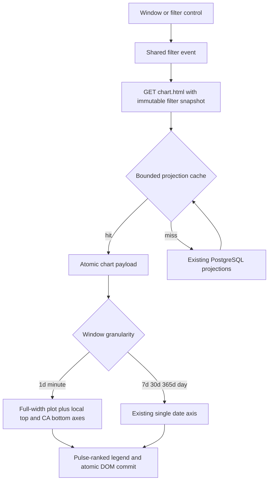

<!-- BEGIN OLLIJA DELIVERY GUIDE -->
## Ollija Delivery Guide

This block is generated guidance. Do not edit it directly. Correct durable facts in `.ollija/project.yaml` or this template, then rerun `./bin/ollija annotate-plan`. Put a user-directed exception in the editable Delivery Exceptions section below.

### Resolved locations

- Authoritative host: `fuchitalee`
- Authoritative repository: `/Users/fuchitalee/development/pushin-weight-v2`
- Ollija release worktree area: `/Users/fuchitalee/development/pushin-weight-v2/.worktrees`
- Active worktree: `/Users/fuchitalee/development/pushin-weight-v2/.worktrees/feat/home-chart-time-axes-performance`
- Plan: `/Users/fuchitalee/development/pushin-weight-v2/.worktrees/feat/home-chart-time-axes-performance/docs/plans/2026-08-24-071938-feat-home-chart-time-axes-performance-plan.md`
- Change: `feat-home-chart-time-axes-performance-2026-08-24-071938`
- Branch: `feat/home-chart-time-axes-performance`
- Staging branch and blueprint: `staging`, `/Users/fuchitalee/development/pushin-weight-v2/.worktrees/feat/home-chart-time-axes-performance/render-staging.yaml`
- Production branch and blueprint: `main`, `/Users/fuchitalee/development/pushin-weight-v2/.worktrees/feat/home-chart-time-axes-performance/render.yaml`
- Staging URL: `https://pushinweight-staging-web.onrender.com`
- Production URL: `https://pushinweight-web.onrender.com`

### Placement

This worktree is inside the Ollija release worktree area. Reuse it for the whole change. Do not create a second worktree or plan for this branch.

### Delivery scope

- Workflow: `plan`
- Delivery target: `staging`
- Owner selection recorded: `true`

1. Complete implementation and the plan's verification contract.
2. Run the configured focused checks:
   - `pytest tests/ollija`
3. The parent workflow commits only this plan's changes, pushes the feature branch, and records the candidate SHA.
4. Fetch the remote staging lane: `git fetch origin refs/heads/staging`.
5. Require the unchanged candidate SHA to be a fast-forward of that fetched remote ref, then push the exact candidate SHA to `refs/heads/staging` with the server-enforced fast-forward command `git push origin <candidate-sha>:refs/heads/staging`.
6. Verify the remote staging ref resolves to the candidate SHA and the Render deployment for `pushinweight-staging-web` reports that same SHA.
7. Run staging checks. Stop here if they fail.

### Failure handling

- Never promote a staging candidate whose automated checks failed.
- Implementation failures return to the parent implementation workflow for diagnosis, correction, recommit, and restaging.
- SSH, shell, environment, or multi-machine failures use the repository infra/multi-machine skill first.
- The change ledger is advisory; do not validate or enforce it.
- Do not run an endless retry loop or start a persistent Ollija process.
<!-- END OLLIJA DELIVERY GUIDE -->

## Delivery Exceptions

None.

# Home Chart Time Axes and Performance - Plan

---

## Goal Capsule

- **Objective:** Home-chart window changes are fast, the one-day plot uses the full chart card, and its time and legend labels match the owner-specified contract.
- **Means:** Extend the existing Chart.js renderer, add a bounded server projection cache around the existing set-based query path, and pin the result through Bridgewright, PostgreSQL, JavaScript, and real-browser regression nets (KTD1-KTD6).
- **Authority:** The requirements in this plan override the older Bridgewright chart exclusion only for the named chart delta. The existing production filter/feed and V24 contracts remain authoritative for every unnamed surface.
- **Execution profile:** Apply characterization-first fixes in the isolated Ollija worktree. Preserve one shared `/chart.html` response and one live canvas.
- **Stop conditions:** Stop if the latency target requires a schema change, a new production service, a changed public payload, or a split chart/pulse/headline request contract.
- **Tail ownership:** LFG may commit, push, open a PR, and watch CI. Staging and production remain `on-request` under the Ollija Delivery Guide.

## Product Contract

Product Contract populated from the owner's regression report and chart instructions; the Ollija placeholder is replaced with no scope expansion.

### Summary

Repair the existing public production chart in place. The change covers long-window responsiveness, the one-day chart's horizontal geometry and dual time axes, and legend ordering. It preserves the chart's data semantics and the surrounding home-page projections.

### Problem Frame

Switching to the 30-day and 365-day windows now takes too long. The one-day chart renders its content in a narrow area at the left instead of using the available card width, and its y-axis region leaves avoidable space on the left. The chart also has only one generic x-axis, so the always-visible local and California timezone context in the top bar does not carry into the 24-hour plot. Finally, the legend order diverges from the pulse-chip order.

### Requirements

**Window performance**

- R1. Switching to either 30d or 365d must commit the matching chart, pulse, trend narrative, and top-voice projection before the existing 12-second client timeout.
- R2. The latency fix must preserve exact window, brand, filter, locale, unsanctioned, series, total, pulse, narrative, and top-voice semantics.
- R3. A stale or failed response must continue to preserve the complete last-good projection, and a newer request must continue to win over an older response.

**One-day geometry**

- R4. The 1d plot must distribute its rolling 24-hour data across the full usable chart area rather than bunching points at the left edge.
- R5. The 1d y-axis title, ticks, and axis region must begin at the left of `section.home-chart-wrap` without an unexplained gutter or clipped labels.
- R6. The 7d, 30d, and 365d chart geometry and single date-axis behavior must remain unchanged.

**One-day time axes**

- R7. The 1d chart must show a top local-time x-axis and a bottom California-time x-axis; no second x-axis appears in other windows.
- R8. Each 1d axis must show exactly 24 fixed hourly positions. Every visible label is an integer from `0` through `23`, with no date, minutes, AM/PM, or timezone suffix; real daylight-saving transitions may repeat or omit a wall-clock value as described in A3.
- R9. The hourly positions must cover the rolling prior 24 hours in chronological order, beginning at the first whole-hour boundary strictly after the 24-hour cutoff. If the current local hour is `5`, the leftmost hourly label is `6` and the rightmost is `5`.
- R10. Local labels must use the browser's local timezone, and California labels must use `America/Los_Angeles` for the same absolute bucket instants.
- R11. The local axis must keep the chart's existing lettering color. The California axis must use the current California timezone-pill tint, `#fbbf24`.

**Legend and preservation**

- R12. `div.legend` must place brands in the same order as the visible pulse chips, then append any chart-only brands in deterministic existing-series order.
- R13. The public home page must retain one live production Chart.js canvas, the existing rich payload, pulse-chip brand filtering, locale refresh, periodic refresh, and the shared `/chart.html` endpoint.
- R14. The internal home, brand chart, feed, filter taxonomy, timezone-pill selection behavior, headline worker, harvester, authentication, data model, and deployment topology must not change.
- R15. Bridgewright must record this owner-approved chart delta as a new additive target while preserving all prior non-targets not superseded by R1-R14.

### Acceptance Examples

- AE1. **1d local/CA axes:** Given a browser in `Asia/Tokyo` with a frozen local time in hour `5`, when 1d renders, then the top hourly labels run from `6` through `5`, the bottom labels represent the same instants in `America/Los_Angeles`, and both axes contain 24 visible hour-only labels.
- AE2. **Full-width plot:** Given deterministic posts in the oldest and newest one-day buckets, when 1d renders at desktop and mobile widths, then their plotted x positions reach the left and right sides of the Chart.js plot area and all y-axis text remains visible.
- AE3. **Other windows:** Given the same page, when 7d, 30d, or 365d renders, then only the existing date x-axis is visible and the dual-axis colors and labels are absent.
- AE4. **Long-window switch:** Given the default filter state, when the owner selects 30d and then 365d, then each matching atomic projection replaces the prior window within the latency contract and no refresh-failure state appears.
- AE5. **Legend order:** Given pulse chips ranked `DeepSeek`, `MiniMax`, then `Qwen`, when the chart renders or refreshes, then the legend begins in that order regardless of the series object's insertion order.

### Scope Boundaries

- Do not copy the V24 mockup graph, static paths, fixture values, or mockup-only attributes into production.
- Do not introduce a new chart renderer, endpoint, client dependency, database table, materialized view, migration, worker, or deployment resource.
- Do not change aggregation meaning, five-minute bucket cardinality, brand filtering, tooltip content, hidden discourse datasets, or feed behavior.
- Do not restyle the timezone pill; its existing California tint is the color authority for the lower axis.
- Do not deploy to staging or production in this LFG run. The Ollija delivery target remains `on-request`.

### Success Criteria

- 30d and 365d stay below the 12-second hard timeout on a cold request and meet the warm interaction target in Assumption A1.
- Real-browser geometry proves the 1d chart uses at least 85% of the canvas width for its plot area and places deterministic first/last data near the corresponding plot edges.
- The 1d browser proof shows exactly two x-axes with 24 hour-only ticks each, correct timezone correspondence, and the required colors.
- All existing chart request-race, last-good restoration, projection atomicity, filter, locale, and non-1d regression nets remain green.

---

## Planning Contract

### Key Technical Decisions

- KTD1. **Keep the existing 288-bucket payload and Chart.js renderer.** Derive 24 fixed tick instants from the one-day absolute timestamp labels, starting at the first whole-hour boundary strictly after the 24-hour cutoff. Do not change server aggregation cardinality or add a new chart representation. Governs R4, R7-R10, and R13.
- KTD2. **Use two Chart.js category scales only for minute granularity.** The primary scale sits at the top and formats in the browser timezone; a secondary scale sits at the bottom and formats the same instants in `America/Los_Angeles`. Both use the KTD1 fixed tick set with automatic tick skipping disabled or an equivalent fixed-tick mechanism. Day granularity keeps the current single scale. Governs R6-R11.
- KTD3. **Correct geometry through measured Chart.js scale/layout configuration plus the smallest scoped CSS adjustment.** Do not hard-code canvas pixels or hide y-axis text. Governs R4-R6.
- KTD4. **Add a bounded, short-lived cache around the complete home-chart projection.** Canonical window, locale, and normalized filters form the key; the TTL aligns with the existing 60-second refresh cadence. A miss retains the current set-based PostgreSQL path, and the cache has a fixed entry cap so user filter combinations cannot grow it without bound. Governs R1-R3 and R13.
- KTD5. **Derive legend order from the payload's pulse ranking.** Intersect pulse nicknames with chart series first, then append remaining series keys. Do not reorder datasets or server aggregation to solve a presentation-only requirement. Governs R12-R13.
- KTD6. **Create a new Bridgewright target contract rather than editing prior approval history.** The new contract explicitly supersedes the older chart non-target only for R1-R15, becomes `last_approved_contract`, and keeps the production canvas and unrelated baseline protected.

### High-Level Technical Design

### Assumptions

- A1. Treat two seconds from window click to committed warm projection as the interaction target. If deterministic production-scale fixtures cannot model production latency, require at least a 50% warm improvement over the captured pre-fix baseline while retaining the 12-second hard ceiling.
- A2. Pulse contains at most eight ranked brands. Any enabled chart series absent from pulse remains visible after the pulse-ranked legend prefix.
- A3. Time labels follow real timezone offsets for each absolute instant. A daylight-saving transition may repeat or skip a California wall-clock hour; correctness to `America/Los_Angeles` takes priority over forcing a synthetic sequence on that exceptional day.
- A4. No Bridgewright executable is installed in this checkout. The repository's target contract, manifest, adapter, and regression test are the available Bridgewright harness; no external Bridgewright run may be claimed unless an executable becomes available during verification.

### Performance Measurement Protocol

- MP1. Record the base commit, changed commit, PostgreSQL fixture identity and row counts, Chromium version, viewport, locale, browser timezone, and cache state with every timing result.
- MP2. Measure through the real `/` window control and shared `/chart.html` caller. For each of 30d and 365d, take one cache-cleared cold measurement, one uncounted warm-up, then five warm switches against the same deterministic fixture on both commits.
- MP3. Use the median of the five warm switches as the comparison statistic and retain the slowest run as timeout evidence. Pass when the changed median is at most two seconds, or—when the fixture cannot reproduce production latency—at most 50% of the base median; every cold and warm run must remain below 12 seconds.
- MP4. Store the before/after timing table in the PR verification evidence. Do not compare runs from different fixtures, browsers, viewports, locales, timezones, or database backends.

### Implementation Constraints

- Reproduce the visible defect in a real browser before editing, with branch/SHA, locale, browser timezone, viewport, and chart runtime geometry recorded.
- Pin each differentiator red before the fix and green after it through the real `/` route and production static assets.
- Use deterministic clocks and payloads for time-axis and edge-position assertions.
- Keep `monitor/static/pw-chart.js` as the sole public home-chart renderer and retain the current request-generation/abort semantics.
- Keep cache keys free of raw untrusted objects by canonicalizing the normalized filter contract.

### Research Anchors

- `monitor/static/pw-chart.js` owns Chart.js scales, canvas lifecycle, atomic refresh, pulse rendering, and legend rendering.
- `monitor/views.py` owns the 288 five-minute one-day payload, day aggregates, pulse, narrative, and top-voice co-timestamping.
- `monitor/static/home-v20.css` owns the chart-card and responsive canvas geometry.
- `tests/test_pw_chart_filter.js`, `tests/test_home_v22_browser.py`, and `tests/test_home_chart_pulse.py` are the existing JavaScript, browser, and PostgreSQL regression nets.
- Commit `f683ce6` established the direct bounded 30-day join and covering index; the new work must preserve that query-shape protection.
- `docs/reference/2026-08-19-174833-production-filter-feed-bridgewright-target.md` deferred this exact substantial chart batch and remains authoritative outside the new target.

---

## Implementation Units

### U1. Record the Bridgewright chart target

- **Goal:** Make the owner's approved chart delta durable without weakening earlier production protections.
- **Requirements:** R13-R15.
- **Dependencies:** None.
- **Files:** `docs/reference/2026-08-24-162449-home-chart-time-axes-bridgewright-target.md`, `bridgewright.yaml`, `tests/test_bridgewright_v24_target.py`.
- **Approach:** Add an approved additive target contract for R1-R15. Point `last_approved_contract` and a new semantic anchor at it. Preserve the V24 mockup and prior filter/feed contract as authorities for unchanged surfaces.
- **Test scenarios:**
  1. The manifest names the new contract as the latest approved contract and retains both earlier contracts.
  2. The new contract contains the exact performance, one-day geometry, dual-axis, color, legend, and preservation targets.
  3. The contract rejects mockup graph replacement, payload simplification, unrelated feed/filter changes, and deployment authority.
  4. The adapter continues to identify the production `v24-home` surface and existing proof environments.
- **Verification:** The local Bridgewright contract test passes and its assertions fail against the pre-change manifest.

### U2. Add one-day axes and legend ordering

- **Goal:** Make the Chart.js runtime express the owner's dual-time and legend contract while preserving atomic refresh behavior.
- **Requirements:** R3-R4, R6-R13; covers AE1, AE3, and AE5.
- **Dependencies:** U1.
- **Files:** `monitor/static/pw-chart.js`, `tests/test_pw_chart_filter.js`.
- **Approach:** Derive explicit one-day scale configuration from `payload.granularity`. Format hourly positions from absolute label timestamps for browser-local and California time. Resolve colors from existing chart/tz tokens. Order legend entries from pulse ranking without altering datasets or payload insertion order.
- **Execution note:** Add failing JavaScript contract assertions before changing renderer behavior.
- **Test scenarios:**
  1. A frozen 1d payload yields top local and bottom California scales with the same fixed 24 tick positions; automatic skipping cannot reduce the visible label count at mobile width.
  2. A 7d, 30d, or 365d payload yields only the existing date scale.
  3. Both scales format the same absolute tick instants, including California date and daylight-saving boundaries, and use the first whole hour strictly after the rolling cutoff.
  4. California ticks use `#fbbf24`; local ticks retain the existing chart lettering color.
  5. Pulse ranking wins legend order, with chart-only brands appended deterministically.
  6. Malformed responses, request races, retries, periodic refresh, and last-good restoration remain unchanged.
- **Verification:** The focused Node contract passes with no removed legacy assertions and JavaScript syntax remains valid.

### U3. Repair one-day chart geometry in the real browser

- **Goal:** Use the available chart-card width and remove the unnecessary left gutter without clipping the y-axis title or ticks.
- **Requirements:** R4-R6, R11, and R13; covers AE1-AE3.
- **Dependencies:** U2.
- **Files:** `monitor/static/pw-chart.js`, `monitor/static/home-v20.css`, `tests/test_home_v22_browser.py`.
- **Approach:** Capture pre-fix Chart.js `chartArea`, scale boxes, canvas box, and plotted point positions. Adjust one-day layout and scoped card padding only where the measurements identify waste. Keep responsive sizing and non-1d layout unchanged.
- **Execution note:** Follow `.claude/skills/fix-ui/SKILL.md`: reproduce first through `/`, then pin the red browser differentiator before product edits.
- **Test scenarios:**
  1. Deterministic oldest/newest one-day points occupy opposite sides of the plot area at desktop, 393px, and 320px widths.
  2. The plot area uses at least 85% of the canvas width and the complete y-axis title/ticks remain on-screen.
  3. The top and bottom axis labels do not overlap the plot, legend, card border, or each other.
  4. English, Chinese chrome, and Original retain identical geometry because axis labels are numeric.
  5. The 7d, 30d, and 365d scale count and chart-area geometry remain at their characterized baseline.
  6. The page retains one canvas, no mockup SVG, nonzero painted pixels, no horizontal overflow, and no console/page errors.
  7. Chromium emulating `Asia/Tokyo` at local hour `5` shows `6` through `5` on the top axis and the corresponding `America/Los_Angeles` hours on the bottom axis for the same absolute instants.
- **Verification:** Real Chromium renders the reported one-day differentiators correctly across required viewports and preserves all existing V24 home behaviors.

### U4. Restore long-window response performance

- **Goal:** Make 30d and 365d switches fast enough for interaction without weakening projection consistency or query semantics.
- **Requirements:** R1-R3, R6, R13-R14; covers AE4.
- **Dependencies:** U1.
- **Files:** `monitor/views.py`, `tests/test_home_chart_pulse.py`, `tests/test_home_v22_browser.py`.
- **Approach:** Characterize cold/warm endpoint latency and SQL ownership first. Preserve the direct bounded aggregate from `f683ce6`. Add the KTD4 cache around the complete payload, with deterministic TTL/cap tests and canonical keys. If the cold path still violates R1, optimize only the measured owning projection without changing schema or response shape.
- **Execution note:** Capture the pre-fix regression through the real `/chart.html` caller and a production-scale PostgreSQL fixture before modifying the cache/query path.
- **Test scenarios:**
  1. Repeating the same window, locale, and canonical filters reuses one complete cached payload inside the TTL.
  2. Different windows, locales, brand sets, or post filters never share cached results.
  3. Cache expiry recomputes all projections at one new timestamp; partial projection mixing is impossible.
  4. The cache entry cap evicts old keys and remains bounded under many filter combinations.
  5. The 30d and 365d cold query retains one bounded post join and no nested post-ID subquery on the default path.
  6. Browser switches meet A1, commit the requested window atomically, and never display the refresh-failure state.
  7. Empty, filtered, uncategorized-discourse, unsanctioned, and selected-brand payload totals remain identical before and after caching.
  8. The base and changed commits are compared with MP1-MP4, including cache-cleared cold runs and five measured warm switches per long window.
- **Verification:** PostgreSQL query-shape and cache-isolation tests pass, and recorded browser timings meet R1/A1 for both long windows.

---

## Verification Contract

| Gate | Evidence | Covers |
| --- | --- | --- |
| Bridgewright target | `pytest tests/test_bridgewright_v24_target.py` passes with the new target and protected non-target assertions | U1 |
| JavaScript renderer | `node tests/test_pw_chart_filter.js` and `node --check monitor/static/pw-chart.js` pass with dual-axis, color, legend, race, and restoration assertions | U2 |
| PostgreSQL projection | Required-PostgreSQL `tests/test_home_chart_pulse.py` executes with zero skips/errors and proves query shape, cache bounds, key isolation, and payload parity | U4 |
| Real browser | `tests/test_home_v22_browser.py` executes required desktop/mobile flows plus explicit `Asia/Tokyo`, California date-boundary, and daylight-saving cases with 24 fixed ticks, no skips, page errors, console errors, or failed assets | U2-U4 |
| Latency protocol | MP1-MP4 records comparable base/changed cold and five-run warm evidence for both 30d and 365d, including median, slowest run, and cache state | U4 |
| Django integrity | `python manage.py check`, `python manage.py makemigrations --check`, and affected view/template tests report clean results | U1-U4 |
| Visual assessment | Same deterministic fixture, fixed clock, locale, and viewport produce reviewed before/after screenshots plus Chart.js geometry measurements | U3 |
| Diff hygiene | `git diff --check` passes and product source contains no plan/agent commentary | U1-U4 |

Bridgewright's external executable is not currently available. Do not report an external assessment unless command discovery succeeds during implementation; the local target/configuration harness is mandatory either way.

Before the first Git mutation and again after review changes, run `./bin/ollija annotate-plan docs/plans/2026-08-24-071938-feat-home-chart-time-axes-performance-plan.md --check` and resolve any guidance conflict.

---

## Definition of Done

- R1-R15 and AE1-AE5 are proven through their named production call paths.
- The one-day chart visibly uses the card width, keeps its y-axis region left-aligned, and shows correct local/California axes and colors.
- The legend matches pulse-chip order on initial render and refresh.
- Both long windows meet the measured latency target without changing payload meaning or the shared endpoint.
- The new Bridgewright contract is the latest approved target and preserves all prior unnamed non-targets.
- Required PostgreSQL, JavaScript, Django, browser, and contract tests execute with zero unexpected skips or errors.
- No abandoned experiment, unused cache path, alternate renderer, debug instrumentation, fixture-only shortcut, or unrelated cleanup remains in the diff.
- The final branch is committed, pushed, and represented by an open PR with CI watched to a decided state.
- Staging and production remain untouched until the owner gives a later explicit delivery instruction.
