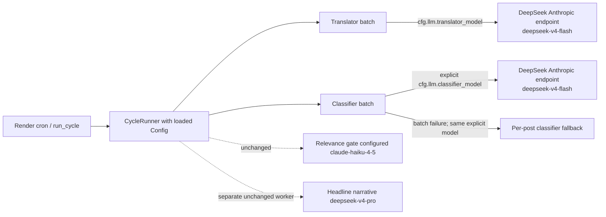

# DeepSeek V4 Flash Enrichment Models

## Goal Capsule

Reduce routine enrichment cost by routing the production translator and classifier to the explicit `deepseek-v4-flash` model while preserving the enrichment pipeline's prompts, endpoint, batching, token budgets, retries, parser validation, and fail-soft behavior. The low-volume headline narrative remains pinned to `deepseek-v4-pro`; the relevance gate's configured model and existing client path remain unchanged.

## Product Contract

### Summary

The owner approved a role-scoped model change after DeepSeek credits were replenished: translation and classification move from V4 Pro to V4 Flash. This is a model-routing change, not a prompt, taxonomy, harvest-policy, concurrency, or deployment change.

### Problem Frame

The committed defaults currently name `deepseek-v4-pro` for both enrichment roles. Translation already threads `cfg.llm.translator_model` into its outbound call, but production classification does not thread `cfg.llm.classifier_model`: `CycleRunner._run_post_fetch` calls the batch classifier without a model, so the request falls back to the module-level `_SIGNAL_MODEL` captured at import time. Merely editing YAML would therefore leave production classification on the wrong model and reproduce the call-chain gap described by recurring-mistake M18.

DeepSeek's current API documentation lists `deepseek-v4-flash` as the exact callable model on the existing Anthropic-compatible endpoint. Both V4 roles default to thinking mode, so the existing `thinking={"type": "disabled"}` behavior must remain on DeepSeek requests. The Anthropic-compatible API does not document an OpenAI-style `response_format`; the existing prompt-driven JSON and parser/schema checks remain authoritative.

### Requirements

1. The committed translator default and DeepSeek endpoint inference resolve to exactly `deepseek-v4-flash`.
2. The committed classifier default and DeepSeek endpoint inference resolve to exactly `deepseek-v4-flash`.
3. The production `CycleRunner` explicitly passes `cfg.llm.classifier_model` through batch classification, including the per-post fallback path.
4. Translator and classifier requests sent to DeepSeek retain `thinking={"type": "disabled"}` and their existing output-token budgets.
5. Headline narrative configuration and validation remain pinned to `deepseek-v4-pro`.
6. Relevance configuration remains `claude-haiku-4-5`, and its existing client construction/call path is not altered in this batch. This is a configuration pin, not a claim that the DeepSeek endpoint remotely executes Haiku.
7. No paid LLM probe, production deploy, cron mutation, prompt change, batch-size change, concurrency change, retry change, taxonomy change, or parser relaxation is part of this work.

### Scope Boundaries

In scope: `config.yaml`, `LlmConfig` defaults/descriptions, translator/classifier model resolution, explicit classifier call-chain wiring, regression tests, and current-state operator/reference documentation.

Out of scope: changing YAML-over-environment configuration precedence, headline worker behavior, relevance-provider separation, live API quality testing, Render configuration or deployment, database schema/data, Chart.js/UI work, historical benchmark/plan artifacts, and PR #16's selective-backfill implementation.

Open PR #16 (`feat/backfiller-selective-gaps`) overlaps several implementation files and independently introduces classifier-model threading alongside unrelated backfill work. The owner was informed of that overlap and then directed this Flash work to continue. This branch stays based on clean `origin/main`, imports none of PR #16, and will identify the future reconciliation requirement in its PR.

## Planning Contract

### Key Technical Decisions

1. **Use the exact unversioned API identifier `deepseek-v4-flash`.** DeepSeek exposes that callable ID; `DeepSeek-V4-Flash-0731` is a version label, not the request model name. Legacy `deepseek-chat` and `deepseek-reasoner` aliases are retired.
2. **Thread an explicit optional `model` argument through classifier entry points.** `CycleRunner` supplies `self.cfg.llm.classifier_model`; compatibility callers may continue using the existing resolver fallback. The explicit value is also forwarded into the batch-to-single-post fallback.
3. **Keep thinking disabled for bounded enrichment output.** Flash and Pro both default to thinking. Existing DeepSeek endpoint detection remains the mechanism; tests capture the outbound kwarg.
4. **Preserve parser-driven structured-output validation.** Do not add undocumented Anthropic-endpoint `response_format` behavior or treat an empty/malformed response as success.
5. **No automatic Pro fallback.** A silent fallback would obscure Flash quality/cost observations and could double spend during errors. Existing retry and fail-soft queue behavior remains unchanged.

### Settled Decisions

- **Role-scoped model swap** — `session-settled: user-approved`. Translation and classification use Flash; headline narrative stays Pro; relevance remains outside this model swap. Rejected alternative: changing every LLM role.
- **Standalone branch after collision disclosure** — `session-settled: user-approved`. Continue from `origin/main`; do not merge or cherry-pick PR #16. Rejected alternative: importing the unrelated selective-backfill branch into this change.
- **Rejected:** changing only configuration. It would not reach the production classifier request because the current call chain ignores `classifier_model`.
- **Rejected:** changing every LLM role. Headline generation is low-volume and quality-sensitive; relevance-provider correction is a separate concern.

### Assumptions and Risks

- **Rollback constraint:** committed non-null YAML model values win over the corresponding environment variables. Rollback therefore means reverting one or both committed model values to `deepseek-v4-pro` and redeploying; this batch does not change configuration precedence.
- **Provider-routing caveat:** the relevance gate currently builds its client through the classifier client factory. DeepSeek documents that unsupported/Claude-style model names on its Anthropic endpoint may silently map to Flash, so `relevancy_model: claude-haiku-4-5` does not prove the remote provider executed Haiku when the client URL is DeepSeek. This is pre-existing, not changed or represented as fixed here.
- **Quality risk:** official API feature parity does not establish parity for this repository's translation and classification taxonomy. The first natural post-deploy cycle should be compared with a healthy Pro cohort for non-empty translation coverage, classifier-field coverage, retries/errors, malformed/empty responses, 429s, and length failures. Deployment is outside this PR, and production promotion remains blocked until the owner identifies the Pro baseline window and quantitative rollback thresholds; the PR handoff must make that unresolved release decision explicit.
- **Merge risk:** PR #16 may conflict textually. If it merges first, rebase onto the new `main`, adopt its classifier-model threading shape, and retain this change's Flash defaults and role-boundary regression tests. Otherwise, later reconciliation preserves whichever shared-budget/backfill structure wins while retaining the explicit `classifier_model` call-chain and Flash defaults.

## Runtime Flow

## Implementation Units

### Unit 1 — Pin role defaults and compatibility inference

- Change `config.yaml` and `x_monitor/config.py` translator/classifier defaults to `deepseek-v4-flash`.
- Change only the DeepSeek branches of `_resolve_translator_model` and `_resolve_signal_model` to return Flash when no explicit config/env model is supplied.
- Preserve existing YAML-over-environment precedence, env behavior for YAML-omitted/null fields and compatibility resolvers, MiniMax routing, direct-Anthropic defaults, `signal_model`, `relevancy_model`, and headline configuration.

### Unit 2 — Repair production classifier model propagation

- Add an optional `model` keyword to `_call_signal_with_retry`, `classify_pragmatics_full`, and `classify_batch_pragmatics_full`.
- Use the explicit model for the outbound request when provided; otherwise retain the compatibility fallback.
- Forward the same model and thinking setting through batch failure into every per-post fallback request.
- Pass `self.cfg.llm.classifier_model` from `CycleRunner._run_post_fetch` without changing client construction, batch size, pause, output budget, retries, or error accounting.

### Unit 3 — Update current-state documentation

- Update README, `CONCEPTS.md`, classifier reference, deploy runbook, and classifier factory/docstrings so they describe Flash for translation/classification and Pro for headline narratives.
- Leave historical plans, benchmark observations, probes, and incident records unchanged.

### Unit 4 — Add the regression net

- Update default-resolution assertions to exact Flash IDs while retaining explicit override coverage.
- Capture translator request kwargs through the real cfg-threaded batch call and assert exact Flash plus thinking-disabled even when ambient model configuration disagrees.
- Capture classifier request kwargs through the production `CycleRunner._run_post_fetch` call chain in `tests/test_cycle_classifier_model_propagation.py` and assert exact Flash plus thinking-disabled.
- Force a batch failure and capture per-post fallback calls to prove they retain the explicit Flash model.
- Pin headline narrative to Pro and relevance configuration to Haiku so the scope cannot drift.
- Retain malformed/empty/shape-drift tests and unchanged token/batch assertions; no paid provider call is needed.

## Verification Contract

Run from the feature worktree with the repository virtual environment:

1. Focused config/routing tests: `tests/test_llm_config.py`, `tests/test_translator_model_resolution.py`, `tests/test_translator_cfg_pass_through.py`, `tests/test_factory_credentials.py`, and classifier resolver tests in `tests/test_attribution.py`.
2. Classifier batch/fallback tests: `tests/test_classify_batch_pragmatics_full.py` plus the production-cycle classifier call-chain regression in `tests/test_cycle_classifier_model_propagation.py`.
3. Translation production-call-chain tests covering exact outbound model, thinking mode, max-token selection, and cfg-over-env precedence.
4. Negative-scope tests for headline Pro and relevance-config Haiku.
5. Django `manage.py check`, static lint/type/syntax checks configured by the repository, `git diff --check`, and the full test suite.
6. Browser verification is expected to report skipped/not applicable because this batch changes no visible UI surface; still run the LFG browser-test gate to document that determination.
7. Review the final diff for unchanged prompts, batch sizes, token budgets, retry counts, endpoint URLs, headline role, relevance call path, and absence of secrets.

## Definition of Done

- The translator's production fake-client regression captures `model="deepseek-v4-flash"` and `thinking={"type": "disabled"}` from `messages_create`, with a mismatched ambient model proving cfg precedence.
- The classifier's actual `CycleRunner` post-fetch path captures `model="deepseek-v4-flash"` and `thinking={"type": "disabled"}` from `messages_create`.
- The classifier batch-failure path captures the same explicit Flash model in per-post fallback requests.
- Default/inference tests name Flash exactly; existing YAML/env precedence and compatibility override tests remain green.
- Headline configuration/validator remains exactly `deepseek-v4-pro`; relevance configuration remains exactly `claude-haiku-4-5`.
- Existing batch sizes, token budgets, retry/fail-soft behavior, prompts, parser allowlists, and endpoint URLs are unchanged.
- README, `CONCEPTS.md`, the classifier reference, deploy runbook, and classifier factory/docstrings describe Flash for translation/classification and Pro for headline narratives.
- Focused and full tests, Django checks, repository lint/static checks, and diff hygiene pass with no paid model request.
- Changes are committed, pushed to a feature branch, described in a PR with the PR #16 reconciliation caveat and unresolved production quality-threshold gate, and CI is observed to completion under the LFG shipping tail.

## References

- DeepSeek V4 migration and exact model IDs: https://api-docs.deepseek.com/news/news260424/
- DeepSeek models and pricing: https://api-docs.deepseek.com/quick_start/pricing/
- DeepSeek Anthropic-compatible API and model mapping: https://api-docs.deepseek.com/guides/anthropic_api/
- DeepSeek thinking-mode behavior: https://api-docs.deepseek.com/guides/thinking_mode/
- DeepSeek JSON-output caveats: https://api-docs.deepseek.com/guides/json_mode/
- DeepSeek updates/deprecations: https://api-docs.deepseek.com/updates/
- Prior translator swap context: `docs/plans/2026-08-04-001-swap-translator-to-deepseek-v4-plan.md`
- Required harvester safeguards: `.claude/skills/change-harvester/SKILL.md` and `.claude/skills/avoiding-recurring-mistakes/SKILL.md`
