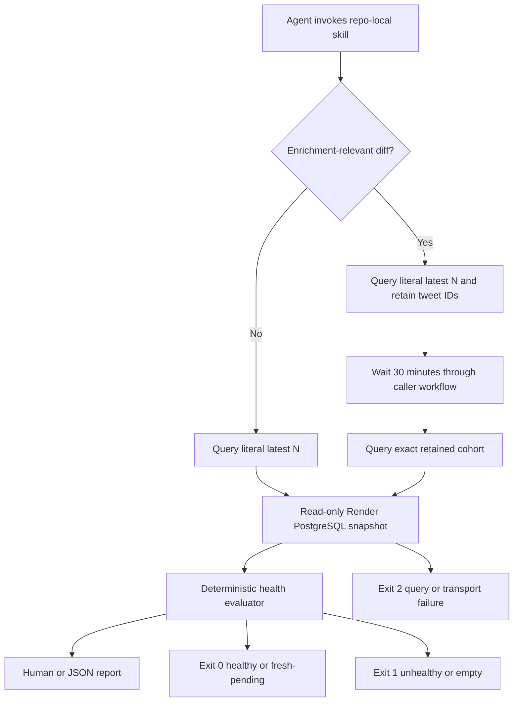

<!-- BEGIN OLLIJA DELIVERY GUIDE -->
## Ollija Delivery Guide

This block is generated guidance. Do not edit it directly. Correct durable facts in `.ollija/project.yaml` or this template, then rerun `./bin/ollija annotate-plan`. Put a user-directed exception in the editable Delivery Exceptions section below.

### Resolved locations

- Authoritative host: `fuchitalee`
- Authoritative repository: `/Users/fuchitalee/development/pushin-weight-v2`
- Ollija release worktree area: `/Users/fuchitalee/development/pushin-weight-v2/.worktrees`
- Active worktree: `/Users/fuchitalee/development/pushin-weight-v2/.worktrees/feat/harvester-latest-n-health-check-skill`
- Plan: `/Users/fuchitalee/development/pushin-weight-v2/.worktrees/feat/harvester-latest-n-health-check-skill/docs/plans/2026-08-25-005403-feat-harvester-latest-n-health-check-skill-plan.md`
- Change: `feat-harvester-latest-n-health-check-skill-2026-08-25-005403`
- Branch: `feat/harvester-latest-n-health-check-skill`
- Staging branch and blueprint: `staging`, `/Users/fuchitalee/development/pushin-weight-v2/.worktrees/feat/harvester-latest-n-health-check-skill/render-staging.yaml`
- Production branch and blueprint: `main`, `/Users/fuchitalee/development/pushin-weight-v2/.worktrees/feat/harvester-latest-n-health-check-skill/render.yaml`
- Staging URL: `https://pushinweight-staging-web.onrender.com`
- Production URL: `https://pushinweight-web.onrender.com`

### Placement

This worktree is inside the Ollija release worktree area. Reuse it for the whole change. Do not create a second worktree or plan for this branch.

### Delivery scope

- Workflow: `plan`
- Delivery target: `production`
- Owner selection recorded: `true`

1. Complete implementation and the plan's verification contract.
2. Run the configured focused checks:
   - `pytest tests/ollija`
3. The parent workflow commits only this plan's changes, pushes the feature branch, and records the candidate SHA.
4. Fetch the remote staging lane: `git fetch origin refs/heads/staging`.
5. Require the unchanged candidate SHA to be a fast-forward of that fetched remote ref, then push the exact candidate SHA to `refs/heads/staging` with the server-enforced fast-forward command `git push origin <candidate-sha>:refs/heads/staging`.
6. Verify the remote staging ref resolves to the candidate SHA and the Render deployment for `pushinweight-staging-web` reports that same SHA.
7. Run staging checks. Stop here if they fail.
8. Only after staging passes, fetch the remote production lane: `git fetch origin refs/heads/main`.
9. Require the same unchanged candidate SHA to be a fast-forward of that fetched remote ref, then push the exact candidate SHA to `refs/heads/main` with the server-enforced fast-forward command `git push origin <candidate-sha>:refs/heads/main`.
10. Verify the remote production ref resolves to the candidate SHA and the Render deployment for `pushinweight-web` reports that same SHA before reporting completion.

### Failure handling

- Never promote a staging candidate whose automated checks failed.
- Implementation failures return to the parent implementation workflow for diagnosis, correction, recommit, and restaging.
- SSH, shell, environment, or multi-machine failures use the repository infra/multi-machine skill first.
- The change ledger is advisory; do not validate or enforce it.
- Do not run an endless retry loop or start a persistent Ollija process.
<!-- END OLLIJA DELIVERY GUIDE -->

## Delivery Exceptions

None.

# Harvester Latest-N Health Check Skill - Plan

## Goal Capsule

- **Objective:** The repository has a lightweight agent-invokable health check that proves whether the literal latest production posts persisted and completed the expected translation and per-brand classification stages without changing production state or spending API credits.
- **Means:** Add a repo-local skill backed by a bounded read-only Render PostgreSQL snapshot and an exact-cohort retest flow. (KTD1, KTD2, KTD5)
- **Authority:** User-settled product decisions and this Product Contract govern behavior. The current Django models and `monitor/cycle.py` govern persisted-state semantics. The harvester and recurring-mistakes skills govern operational safety. The Ollija Delivery Guide governs delivery.
- **Execution profile:** Standard code plan with no user-interface surface and no browser runtime.
- **Stop conditions:** Stop before any database mutation, TwitterAPI call, LLM call, harvest execution, cron suspension, or unapproved delivery action. Stop before implementation or Git mutation while `ollija.delivery_selected_by_user` is `false`.
- **Tail ownership:** The Compound Engineering LFG pipeline owns implementation, review, non-browser verification, PR delivery, and CI. Ollija owns the selected staging or production delivery sequence after the owner records a target.

---

## Product Contract

### Summary

Create a discoverable repo-local skill that inspects a bounded cohort of the newest production `Post` rows and reports post-fetch health from persisted facts. The skill reports ingestion and persistence, translations, per-brand sentiment, post type, and discourse. It supports a fast immediate check and a conditional exact-cohort retest for changes that affect enrichment behavior.

### Problem Frame

The existing `scripts/post_fetch_smoketest.py` and global PushinWeight smoketest skill belong to the retired v1 SQLite stack. They can invoke translation and classification again, so they neither prove the v2 production persistence path nor meet a read-only, no-credit health-check contract. Cycle summaries can also look healthy while fail-soft enrichment leaves incomplete rows. Operators and implementation agents need one bounded production-state check that treats fresh pending work as evidence instead of an automatic alarm.

### Key Decisions

- **Inspect the literal latest cohort.** (session-settled: user-directed — chosen over selecting only completed posts: fresh pending rows are useful queue evidence) Governs R1 and R3.
- **Treat fresh pending work as neutral.** (session-settled: user-directed — chosen over alarming on every pending row: asynchronous enrichment normally spans cycles) Governs R3 and R9.
- **Retest only enrichment-relevant changes.** (session-settled: user-directed — chosen over waiting after every change: unrelated changes should keep the check fast) Governs R10 and R11.
- **Observe production without repairing it.** (session-settled: user-directed — chosen over active re-enrichment or a probe harvest: health verification must not mutate data or spend credits) Governs R2.
- **Verify the full post-fetch result.** (session-settled: user-directed — chosen over a narrower cycle-completion check: missing translation, sentiment, post type, or discourse must remain visible) Governs R4 through R7.

### Requirements

**Cohort and safety**

- R1. The default cohort is the literal latest 20 production `Post` rows ordered by `fetched_at DESC, tweet_id DESC`, with a caller-selectable bound from 1 through 200.
- R2. The health check must use the canonical Render PostgreSQL route inside a verified read-only transaction and must not write database state, run harvesting, call TwitterAPI, invoke an LLM, or expose credentials.
- R3. Every selected post must appear in the result even when its enrichment state is pending, and pending is neutral until it exceeds the configured enrichment `max_age_hours`.

**Persisted health facts**

- R4. Ingestion and persistence are healthy only when the post has a nonblank identifier, fetch timestamp, source text, enrichment-state row, and at least one `PostBrand` association.
- R5. A succeeded translation is healthy only when `lang_detected`, `text_en`, and `text_zh_cn` are all nonblank.
- R6. A succeeded classification is healthy only when every associated brand has at least one `PostBrandSignal` with nonblank post type and sentiment plus at least one `PostBrandDiscourse` row.
- R7. A failed stage, missing required fact, invalid status combination, or pending stage older than the configured grace period must make the cohort unhealthy and identify the affected post, brand, stage, and reason.

**Output and automation**

- R8. The command must provide a concise human report and a stable JSON mode with the same cohort, stage states, reasons, complete and pending counts, thresholds, and exact tweet IDs; neither mode prints full post text by default.
- R9. Exit code 0 means all rows are complete or fresh-pending, exit code 1 means the cohort is empty or unhealthy, and exit code 2 means invocation, Render, query, timeout, or parse failure.
- R10. When a plan changes enrichment persistence, translation, sentiment, post type, or discourse behavior, verification must preserve the first run's tweet IDs, wait 30 minutes, and recheck that exact cohort; fresh pending remains neutral health evidence but does not complete the regression gate.
- R11. When a plan does not change those behaviors, verification must run one immediate latest-N check without a wait.
- R12. The new skill must be discoverable by its description and the harvester-change skill must route applicable plans and LFG runs through it automatically.
- R13. The evaluator and command construction must be testable offline through injected query output or a fake command runner, without Render credentials or production access.
- R14. An exact-cohort check must compare requested and returned tweet IDs and report every missing requested post as unhealthy.

### Acceptance Examples

- AE1. **Covers R1, R3, R9.** Given a literal latest-20 cohort with complete rows and a row pending for less than `max_age_hours`, when the check runs, then it includes the pending row and exits 0 with a neutral pending count.
- AE2. **Covers R5, R7, R9.** Given a row whose translation state is succeeded but `lang_detected` or either localized text is blank, when the check runs, then it exits 1 and names the missing translation fact.
- AE3. **Covers R6, R7, R9.** Given a succeeded classification whose associated brand lacks a signal or discourse row, when the check runs, then it exits 1 and names the brand and missing fact.
- AE4. **Covers R10.** Given an enrichment-relevant change and fresh pending rows in the first run, when 30 minutes elapse, then the second run checks the original tweet IDs rather than a newer latest cohort. It completes the regression gate only when all rows are healthy with zero pending; fresh pending produces a visible inconclusive gate result without becoming a health alarm.
- AE5. **Covers R2, R9.** Given Render authentication failure, a PostgreSQL timeout, malformed JSON, or an interrupted query, when the check runs, then it exits 2 without starting any recovery harvest or database write.
- AE6. **Covers R8.** Given normal or unhealthy rows, when either output mode runs, then the report includes identifiers and bounded failure context but omits full post text.
- AE7. **Covers R14.** Given an exact cohort whose requested post disappeared, when the check runs, then it exits 1 and names the missing tweet ID instead of evaluating only the surviving rows.

### Scope Boundaries

**In scope**

- A repo-local health-check skill, deterministic helper, agent metadata, tests, and harvester-skill routing.
- Read-only inspection of the current Django/PostgreSQL production schema.
- Conditional exact-cohort retesting for enrichment-relevant changes.

**Outside this change**

- Harvest policy, cursor, backfill, translator, classifier, prompt, model, database schema, migration, Render scheduler, and credit-volume changes.
- Changes to the retired v1 `scripts/post_fetch_smoketest.py`, historical SQLite data, or the global v1 smoketest skill.
- UI, dashboard, alerting, automated remediation, re-enrichment, and cron suspension.

### Sources

- `core/models.py` defines the production `Post`, `PostEnrichmentState`, `PostBrand`, `PostBrandSignal`, and `PostBrandDiscourse` facts.
- `monitor/cycle.py` defines the durable enrichment queue, stage completion, fail-soft behavior, and persisted per-brand outputs.
- `config.yaml` and `x_monitor/config.py` define the 20-row claim size, 24-hour enrichment age cap, 13-minute cycle deadline, and 2-minute next-slot reserve.
- `.claude/skills/change-harvester/SKILL.md` and `.claude/skills/avoiding-recurring-mistakes/SKILL.md` define the harvester guardrails, including M7, M8, M12, M17, and M18.
- `docs/solutions/runtime-errors/2026-08-10-translator-lang-detected-llm-compliance.md` records why a cycle-level success signal cannot replace persisted translation checks.
- `docs/solutions/runtime-errors/cmd-run-summary-fidelity-three-fixes.md` records why operator summaries must be verified against database facts.

---

## Planning Contract

### Key Technical Decisions

- KTD1. **Build a separate v2 skill instead of adapting the retired smoketest.** The new package lives at `.agents/skills/harvester-latest-n-health-check/` and leaves the SQLite/LLM path untouched. This prevents legacy-stack coupling and avoids a second harvest or enrichment pipeline under M7.
- KTD2. **Use one bounded PostgreSQL snapshot through `render psql`.** The helper resolves the current production resource by the unique name `pushinweight-db-shadow`, invokes it with an argument list, and verifies `transaction_read_only=on` inside the fixed transaction. The transaction sets local statement and lock timeouts and returns one aggregate JSON result. The query limits its seed cohort before joins and caps N at 200 to satisfy M8. The skill does not provision or change database roles.
- KTD3. **Evaluate health in deterministic Python.** SQL returns bounded persisted facts while the helper owns state classification, counts, human rendering, JSON rendering, and exit codes. The helper loads `harvest.enrichment.max_age_hours` from `config.yaml` and accepts a test-only or operator override.
- KTD4. **Do not create or select an LLM model.** The checker consumes existing database facts and never classifies or translates. This makes M12's explicit-model boundary inapplicable instead of ambiguous.
- KTD5. **Represent retesting as two exact-cohort observations.** The first JSON result carries ordered tweet IDs that a later invocation can consume as a cohort. `SKILL.md` assigns the 30-minute wait and second invocation to the caller workflow, so the bundled command stays fast and does not hold an opaque sleep process open.
- KTD6. **Route relevant work from the existing harvester skill.** Add a small validation section to `.claude/skills/change-harvester/SKILL.md` that cites the new skill, defines the enrichment-relevant path gate, and preserves the no-wait path for unrelated changes.
- KTD7. **Test the real command and query boundary without production credentials.** Tests inject subprocess results, assert the exact safe command shape and SQL guardrails, and evaluate representative result documents. A live read-only run before delivery supplies M18 production-call-chain evidence.
- KTD8. **Treat Bridgewright as an assessment gate, not an approval authority.** The Compound Engineering LFG pipeline records `capabilities` and project `validate` before implementation and repeats validation during final review. Newly introduced findings return to implementation; unrelated pre-existing findings stay identified as residual evidence. Ollija remains the sole delivery authority.

### High-Level Technical Design



### Implementation Constraints

- Refresh the isolated worktree from current `origin/main` only after the owner selects a delivery target and `./bin/ollija annotate-plan --check` passes. Revalidate this plan after the refresh because the worktree began nine commits behind.
- Preserve the single-stack Django/PostgreSQL architecture and the single Render harvest cron.
- Apply M17 literally: this planned read-only diagnostic does not justify halting the cron. A live anomaly discovered by the check is reported, not remediated within this scope.
- Keep production output bounded. Exit-2 paths emit only a stable failure class and error code. Do not emit source text, database URLs, environment values, tracebacks, query text, filesystem paths, stack frames, or raw subprocess and Render diagnostics.
- Do not add an automatic retry, polling loop, or recurring invocation. The immediate path runs once and the enrichment-relevant path runs exactly twice under KTD5.
- Use the skill-creator package layout and validate the finished skill with its bundled validator.

### Output Structure

```text
.agents/skills/harvester-latest-n-health-check/
├── SKILL.md
├── agents/
│   └── openai.yaml
└── scripts/
    └── check.py
tests/
└── test_harvester_latest_n_health_check.py
```

### Risks & Dependencies

- The local operator must have authenticated Render CLI access to the authoritative production database route. Transport or authentication failures are operational errors with exit code 2, not unhealthy data.
- PostgreSQL table or field names can drift with Django migrations. Tests lock the current schema contract, and future model changes must update the skill in the same change.
- A classification can currently be marked succeeded after unsanctioned-flag persistence even when `by_brand` is empty. R4 makes a zero-brand post unhealthy, and R6 checks every persisted brand's classification facts instead of trusting status alone.
- The 30-minute retest window depends on the 15-minute cron cadence plus the 13-minute run deadline and 2-minute reserve. Relevant scheduler changes must update this contract.

---

## Implementation Units

### U1. Build the bounded production snapshot and health evaluator

- **Goal:** Provide the deterministic command that selects, evaluates, and renders a latest or exact production cohort.
- **Requirements:** R1 through R11, R13, R14; AE1 through AE7
- **Dependencies:** None
- **Files:**
  - `.agents/skills/harvester-latest-n-health-check/scripts/check.py`
  - `tests/test_harvester_latest_n_health_check.py`
- **Approach:**
  1. Define validated CLI inputs for latest-N selection, exact tweet-ID cohorts, JSON output, and a grace-hours override.
  2. Build the safe `render psql` argument list and bounded read-only aggregate query under KTD2.
  3. Normalize the result into per-post and per-brand stage facts, then apply R3 through R9 under KTD3.
  4. Compare requested and returned IDs for exact cohorts under R14, and include ordered cohort tweet IDs in JSON so KTD5 can perform a later exact-cohort check.
  5. Keep diagnostic excerpts bounded to identifiers, stage names, brand names, and reason codes.
- **Patterns to follow:** Mirror the concise JSON and side-effect-free operator contract in `monitor/management/commands/headline_status.py`, while using the canonical production Render route from the repository operations guidance.
- **Test scenarios:**
  - Covers AE1. A complete cohort plus a fresh pending row renders both and exits 0.
  - Covers AE2. Translation succeeded with each required localized fact missing in turn exits 1 with the correct reason.
  - Covers AE3. Classification succeeded with zero brands or with a missing signal, sentiment, post type, or discourse for one associated brand exits 1 with the correct persistence or brand-specific reason.
  - Covers AE4. An exact cohort preserves the first run's tweet-ID order and does not substitute newly fetched posts.
  - Covers AE5. Command failure, timeout, empty stdout, and malformed JSON each exit 2 without a fallback action, traceback, raw stderr, query fragment, schema name, or filesystem path.
  - Covers AE6. Human and JSON output omit full source text and credential-like environment values.
  - Boundary values 1 and 200 are accepted while zero, 201, malformed tweet IDs, and mutually exclusive cohort modes are rejected.
  - An empty production cohort exits 1 and an overdue pending row exits 1 using the configured grace period.
  - Covers AE7. An exact-cohort result missing one requested ID exits 1 and reports that ID.
  - The constructed SQL seeds and limits posts before joining fan-out tables, declares read-only mode, and sets timeouts.
- **Verification:** Offline tests prove selection, health rules, rendering, exit codes, redaction, and query construction. A live JSON run returns a bounded parseable document without changing production facts.

### U2. Package the skill and conditional retest workflow

- **Goal:** Make the checker discoverable and give agents a complete automatic workflow for immediate and delayed verification.
- **Requirements:** R2, R8 through R13; AE4 through AE6
- **Dependencies:** U1
- **Files:**
  - `.agents/skills/harvester-latest-n-health-check/SKILL.md`
  - `.agents/skills/harvester-latest-n-health-check/agents/openai.yaml`
  - `tests/test_harvester_latest_n_health_check.py`
- **Approach:**
  1. Write a trigger-focused description that activates for post-fetch health, production latest-post inspection, and enrichment verification.
  2. Define immediate, JSON, and exact-cohort invocations while citing R2's safety boundary.
  3. Define the enrichment-relevant diff gate and the 30-minute caller-managed wait under KTD5, including the inconclusive fresh-pending result from R10.
  4. Require the caller to report fresh pending separately from unhealthy results and never to repair data within the skill.
  5. Generate minimal agent metadata from the final skill content and validate the package.
- **Patterns to follow:** Follow the system skill-creator structure and progressive-disclosure rules. Keep procedural detail in `SKILL.md` and deterministic behavior in `scripts/check.py`.
- **Test scenarios:**
  - The skill metadata and directory pass the skill-creator validator.
  - The description includes concrete activation contexts without depending on the user naming the skill.
  - The instructions distinguish relevant and unrelated changes, retain exact tweet IDs, and forbid harvest, LLM, API, and mutation fallbacks.
  - The documented commands resolve to the bundled helper from any repository working directory.
- **Verification:** The package validates, its metadata agrees with `SKILL.md`, and a fresh agent can select the correct immediate or retest path without inventing policy.

### U3. Integrate the health check into harvester-change verification

- **Goal:** Ensure relevant plans and LFG runs invoke the new skill automatically without broadening harvest behavior.
- **Requirements:** R10 through R12
- **Dependencies:** U2
- **Files:**
  - `.claude/skills/change-harvester/SKILL.md`
  - `tests/test_harvester_latest_n_health_check.py`
- **Approach:**
  1. Add one verification section to the existing harvester skill under KTD6.
  2. Enumerate the persistence and enrichment paths that require the delayed exact-cohort route.
  3. Route other harvester changes through the immediate route and preserve all existing credit and production guardrails.
  4. Cite the recurring-mistakes skill instead of duplicating M7, M8, M12, M17, or M18.
- **Patterns to follow:** Preserve the current harvester skill's invariant, workflow, and test-contract structure.
- **Test scenarios:**
  - The harvester skill names the new skill and routes enrichment-relevant files to the exact-cohort retest.
  - Unrelated harvester paths select the immediate check and do not wait.
  - The integration does not instruct agents to halt the cron, call TwitterAPI, invoke an LLM, or mutate production.
- **Verification:** An agent following only the harvester skill reaches the health-check skill and selects the correct route for representative relevant and unrelated diffs.

---

## Verification Contract

| Gate | Applies to | Evidence required |
|---|---|---|
| Focused regression suite | U1-U3 | `pytest tests/test_harvester_latest_n_health_check.py` passes with boundary, failure, redaction, and routing cases. |
| Skill package validation | U2 | The installed skill-creator `quick_validate.py` accepts `.agents/skills/harvester-latest-n-health-check/`, and `agents/openai.yaml` matches the final instructions. |
| Django project checks | U1-U3 | `python manage.py check --deploy` and `python manage.py makemigrations --check --dry-run` pass. |
| Full regression suite | U1-U3 | `pytest` passes, including the existing production call-chain and harvester deadline tests required by M18. |
| Live production snapshot | U1-U3 | The helper's `--latest 20 --json` path returns bounded parseable output through `render psql`; record healthy, fresh-pending, unhealthy, or operational-error evidence without repair. |
| Conditional cohort retest | U1-U3 | Run only when the final diff changes enrichment-relevant behavior. Preserve the initial tweet IDs, wait 30 minutes, and recheck the exact cohort. Zero pending completes the regression gate; fresh pending is inconclusive and non-alarming. |
| Bridgewright assessment | U1-U3 | `bridgewright capabilities` and `bridgewright validate --project-root .` report the project assessment. Fix newly introduced findings and rerun; identify unrelated findings as residual evidence rather than release approval. |
| Ollija delivery gate | U1-U3 | After the owner selects staging or production, the plan records that target and `./bin/ollija annotate-plan --check docs/plans/2026-08-25-005403-feat-harvester-latest-n-health-check-skill-plan.md` passes before Git or delivery mutation. |
| Browser verification | U1-U3 | Not applicable because the diff has no visible UI or browser interaction surface; LFG records the browser-test skip rather than inventing a page flow. |

---

## Definition of Done

- U1 is done when the bounded read-only helper passes offline tests and a live production snapshot proves the Render/PostgreSQL call chain without mutation.
- U2 is done when the repo-local package validates and its instructions produce the correct immediate or exact-cohort workflow.
- U3 is done when the existing harvester skill routes relevant plans and LFG runs through the health check while preserving every prior guardrail.
- All R-IDs and applicable AE-IDs have passing evidence from the Verification Contract.
- The old v1 smoketest, harvest behavior, LLM routing, database schema, Render topology, and UI remain unchanged.
- Bridgewright has no newly introduced findings, the selected Ollija target is recorded, the PR is merge-ready, and the authorized delivery tail completes under Ollija guidance.
- No credentials, full post text, temporary cohort files, generated caches, abandoned experiments, or dead-end implementation code remain in the diff.
