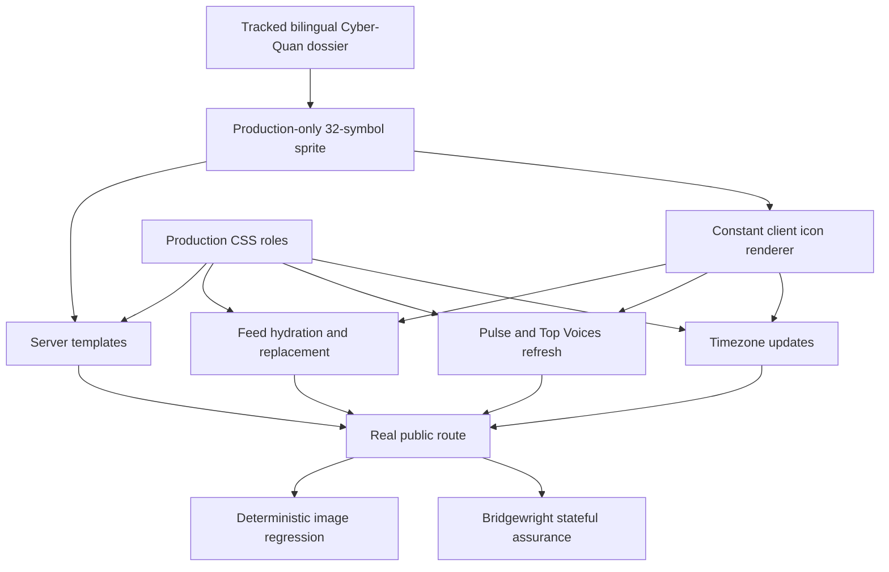

<!-- BEGIN OLLIJA DELIVERY GUIDE -->
## Ollija Delivery Guide

This block is generated guidance. Do not edit it directly. Correct durable facts in `.ollija/project.yaml` or this template, then rerun `./bin/ollija annotate-plan`. Put a user-directed exception in the editable Delivery Exceptions section below.

### Resolved locations

- Authoritative host: `fuchitalee`
- Authoritative repository: `/Users/fuchitalee/development/pushin-weight-v2`
- Ollija release worktree area: `/Users/fuchitalee/development/pushin-weight-v2/.worktrees`
- Active worktree: `/Users/fuchitalee/development/pushin-weight-v2/.worktrees/docs/qin-quan-ideation`
- Plan: `/Users/fuchitalee/development/pushin-weight-v2/.worktrees/docs/qin-quan-ideation/docs/plans/2026-08-26-085543-docs-qin-quan-ideation-plan.md`
- Change: `docs-qin-quan-ideation-2026-08-26-085543`
- Branch: `docs/qin-quan-ideation`
- Staging branch and blueprint: `staging`, `/Users/fuchitalee/development/pushin-weight-v2/.worktrees/docs/qin-quan-ideation/render-staging.yaml`
- Production branch and blueprint: `main`, `/Users/fuchitalee/development/pushin-weight-v2/.worktrees/docs/qin-quan-ideation/render.yaml`
- Staging URL: `https://pushinweight-staging-web.onrender.com`
- Production URL: `https://pushinweight-web.onrender.com`

### Placement

This worktree is inside the Ollija release worktree area. Reuse it for the whole change. Do not create a second worktree or plan for this branch.

### Delivery scope

- Workflow: `plan`
- Delivery target: `production`
- Owner selection recorded: `true`

1. Complete implementation and the plan's verification contract.
2. Run the configured focused checks:
   - `pytest tests/ollija`
3. The parent workflow commits only this plan's changes, pushes the feature branch, and records the candidate SHA.
4. Fetch the remote staging lane: `git fetch origin refs/heads/staging`.
5. Require the unchanged candidate SHA to be a fast-forward of that fetched remote ref, then push the exact candidate SHA to `refs/heads/staging` with the server-enforced fast-forward command `git push origin <candidate-sha>:refs/heads/staging`.
6. Verify the remote staging ref resolves to the candidate SHA and the Render deployment for `pushinweight-staging-web` reports that same SHA.
7. Run staging checks. Stop here if they fail.
8. Only after staging passes, fetch the remote production lane: `git fetch origin refs/heads/main`.
9. Require the same unchanged candidate SHA to be a fast-forward of that fetched remote ref, then push the exact candidate SHA to `refs/heads/main` with the server-enforced fast-forward command `git push origin <candidate-sha>:refs/heads/main`.
10. Verify the remote production ref resolves to the candidate SHA and the Render deployment for `pushinweight-web` reports that same SHA before reporting completion.
11. After step 10 succeeds, perform worktree cleanup as the final filesystem action:
    - From `/Users/fuchitalee/development/pushin-weight-v2`, require `/Users/fuchitalee/development/pushin-weight-v2/.worktrees/docs/qin-quan-ideation` to remain registered, clean, unlocked, and at the verified candidate SHA. If any guard fails, retain it and report the reason.
    - Run `git -C /Users/fuchitalee/development/pushin-weight-v2 worktree remove /Users/fuchitalee/development/pushin-weight-v2/.worktrees/docs/qin-quan-ideation` without `--force`.
    - Preserve the local and remote feature branches. Continue final reporting from the authoritative repository root.

### Failure handling

- Never promote a staging candidate whose automated checks failed.
- Implementation failures return to the parent implementation workflow for diagnosis, correction, recommit, and restaging.
- SSH, shell, environment, or multi-machine failures use the repository infra/multi-machine skill first.
- The change ledger is advisory; do not validate or enforce it.
- Never force-remove a worktree. Retain staging-only, failed, dirty, locked,
  noncanonical, or candidate-mismatched worktrees for diagnosis or later
  delivery.
- Do not run an endless retry loop or start a persistent Ollija process.
<!-- END OLLIJA DELIVERY GUIDE -->

## Delivery Exceptions

None.

# Cyber-Quan Production Icon Replacement - Plan

## Goal Capsule

- **Objective:** DevRel users can scan the same production homepage on a phone and recognize every existing visual signal through the approved Cyber-Quan SVG family without losing any current behavior or readability.
- **Means:** Promote the locked design dossier, render one production-only SVG sprite through the existing server and client paths, and close the change with Bridgewright state assurance plus deterministic image regression evidence (KTD1, KTD2, KTD5).
- **Authority:** The Product Contract governs visible behavior. The Cyber-Quan dossier governs icon geometry. The V24 target and current `origin/main` govern every surface outside the approved icon and masthead deltas.
- **Execution profile:** Code change on the public Django homepage with staging and production delivery governed by the Ollija guide.
- **Stop conditions:** Stop before release if an approved symbol is missing, a required SVG has zero geometry, any non-target region changes, a required browser or Bridgewright obligation fails, staging cannot prove the candidate SHA, or the owner has not explicitly approved that staged SHA on desktop and a physical iPhone.
- **Tail ownership:** The LFG parent owns automated review, browser verification, staging, and exact-SHA closeout. The owner retains the existing explicit staged visual-approval action before production promotion.

---

## Product Contract

### Summary

Replace the public homepage's existing emoji, text glyphs, and icon-like monograms with the approved Cyber-Quan SVGs. Add mark A to the masthead and re-proportion that lockup inside its current space while keeping `Pushin'` and `Weight` on separate lines.

### Problem Frame

The production homepage is more readable and usable than the Qin-Quan visual redesign, but its emoji and mixed glyph vocabulary is inconsistent and platform-dependent. The approved Cyber-Quan dossier retains familiar pictograms while giving them one rough, uneven visual language. The work must improve signal recognition without importing the dossier's layout, type, whitespace, controls, or broader color scheme.

### Product Contract Preservation

Changed: the prior archive-only requirements are replaced because the owner redirected this same Qin artifact to a confirmed, icon-only production integration with one masthead-logo exception.

### Key Decisions

- **Icon-only production integration with one logo exception** (session-settled: user-directed — chosen over a broader Cyber-Quan redesign: production readability and utility must remain intact). Governs R1-R4, R13.
- **Mark A in the compact masthead** (session-settled: user-directed — chosen over no production mark and the shelved mark B: mark A is the final Qin-weight company mark). Governs R2, R13.
- **Rough familiar pictograms** (session-settled: user-directed — chosen over small-seal character forms: the symbols must be intuitive without knowledge of Chinese script). Governs R1, R5, R8.
- **Follower magnitude through people count and luminance** (session-settled: user-directed — chosen over the blue follower treatment and a rescaled emoji: account reach must read at a glance while blue stays out of the icon palette). Governs R6.
- **Qin hammer for hands-on use** (session-settled: user-directed — chosen over the chisel, keyboard, wrench, and stop-hand forms: the hammer reads as active tool use at phone size). Governs R5.
- **Existing semantic sentiment colors** (session-settled: user-directed — chosen over a uniform neutral icon palette: sentiment must remain immediately distinguishable). Governs R7.
- **California outline and rough 京 comparison marks** (session-settled: user-directed — chosen over the `CA` monogram and plain 京 glyph: locale comparison needs the same icon family). Governs R5, R10.

### Requirements

**Approved source and scope**

- R1. Replace the public `/` route's existing emoji, text glyphs, and icon-like monograms only where the approved mapping in R5 supplies a Cyber-Quan symbol.
- R2. Add `mark-quiet` to the existing masthead, keep `走个量` before the English name, and preserve separate `Pushin'` and `Weight` lines inside the current masthead region.
- R3. Keep `/internal/`, single-brand pages, authentication, endpoints, persistence, taxonomy, and backend data behavior unchanged.
- R4. Preserve production typography, spacing, controls, non-icon colors, content order, interaction semantics, and company-name rendering outside the masthead.

**Approved icon mapping**

- R5. The production mapping is the table below; symbols not listed remain dossier studies and do not ship in the runtime sprite.

| Production meaning | Cyber-Quan symbol |
| --- | --- |
| Masthead company mark | `mark-quiet` |
| Followers: `0-1k`, `1k-10k`, `10k-50k`, `50k-plus` | `icon-followers-1`, `icon-followers-2`, `icon-followers-3`, `icon-followers-4` |
| Likes, reposts, replies | `icon-heart`, `icon-repost`, `icon-reply` |
| Pulse rising, flat, falling | `icon-rise`, `icon-flat`, `icon-fall` |
| Positive, neutral, negative, mixed sentiment | `icon-sentiment`, `icon-sentiment-neutral`, `icon-sentiment-negative`, `icon-sentiment-mixed` |
| Hands-on use | `icon-hands-on-hammer` |
| Performance comparison | `icon-compare` |
| Release or buzz | `icon-announce` |
| Feedback question | `icon-question` |
| Advertising or marketing | `icon-marketing` |
| Event announcement | `icon-event` |
| Discourse, nationalism, unsanctioned | `icon-discourse`, `icon-nationalism`, `icon-unsanctioned` |
| Dropdown disclosure | `icon-caret` |
| Top voice score | `icon-star` |
| Sunrise, day, dusk, night | `icon-sunrise`, `icon-day`, `icon-dusk`, `icon-night` |
| California and Beijing comparison | `icon-california`, `icon-beijing` |

**Visual semantics and compatibility**

- R6. Keep the four current follower-bin boundaries and fixed lead-column geometry while applying one-to-four human forms in `#64748b`, `#8492a6`, `#cbd5e1`, and `#f8fafc` order.
- R7. Render positive, neutral, negative, and mixed sentiment icons with the current green, slate, red, and amber semantic families.
- R8. Render every non-semantic icon from the surrounding production text or muted color rather than introducing a new application palette.
- R9. Preserve the visible distinction between Chinese and United States nationalism and preserve the case where both classifications are present.
- R10. Preserve the current dynamic comparison behavior: Tokyo and other non-Los-Angeles browsers compare with California, while Los Angeles browsers compare with Beijing; the four day-part boundaries remain unchanged.
- R11. Keep server-rendered rows and client-created or refreshed rows on the same symbol, order, sizing, color, and empty-state contract.
- R12. Treat decorative SVGs as hidden from assistive technology while retaining the current accessible names on follower magnitude, timezone controls, pulse state, and linked content.
- R13. Keep every non-target region within the current desktop and mobile geometry; only the masthead may be re-proportioned to fit mark A without overflow.
- R14. Unknown or absent signal keys must render no icon and must not produce a broken `<use>` reference, JavaScript error, or collapsed reserved row.
- R15. Bind this change to an approved Cyber-Quan Bridgewright target. Before the first product edit, capture the exact `origin/main` English-desktop and zh-CN 390px-emulation baselines; compare the final candidate against those full protected frames with allow masks limited to the exact icon and masthead boxes, then retain candidate goldens for future regressions.
- R16. Ship the runtime icon assets through the current Django static and WhiteNoise provenance path with no dependency on ignored prototype files.
- R17. Before production promotion, require explicit owner approval of the exact staged SHA in desktop Chromium and on a physical iPhone in zh-CN. The review must confirm that representative follower magnitude, sentiment, post type, nationalism, timezone, trend, and masthead meanings remain recognizable at a glance and that protected hierarchy and readability did not regress; absent approval stops the delivery at staging.

### Success Criteria

- Every mapped icon is visible, nonzero, and recognizable on the real public route in the initial response and after dynamic replacement.
- Each targeted UI function behaves as it did before the icon change, and the Bridgewright assessment reports zero failed, skipped, errored, missing, or unknown obligations.
- Deterministic image comparisons show changes only in approved icon regions and the masthead lockup region.
- The owner explicitly approves the exact staged desktop and physical-iPhone render for at-a-glance recognition before production promotion.
- No horizontal overflow, clipped control, reordered signal, lost accessible name, broken static reference, console error, or page error appears in the required desktop and phone variants.
- Staging and production both serve the exact reviewed candidate SHA after their required checks pass.

### Acceptance Examples

- AE1. Given a server-rendered feed row in the highest follower bin, when `/` loads, then the four-person near-white follower symbol appears above the unchanged count and the row geometry matches other bins. Covers R5, R6, R11.
- AE2. Given the same post returned by a feed refresh, when the client replaces the row, then its follower, engagement, sentiment, post-type, nationalism, and unsanctioned icons match the server-rendered row. Covers R5, R9, R11, R14.
- AE3. Given a Tokyo browser and then a Los Angeles browser, when the timezone widget renders, then the comparison mark is the California outline and then rough 京 while all clocks, labels, persistence, and accessible names remain correct. Covers R10, R12.
- AE4. Given English desktop and zh-CN mobile-emulation variants, when the homepage renders deterministic fixture data, then only exact approved icon and masthead boxes differ from the captured pre-change baseline and neither page overflows; given the same staged SHA on desktop and a physical iPhone, the owner can identify representative signals at a glance before approving production. Covers R2, R4, R13, R15, R17.
- AE5. Given valid multiple signals plus an unknown signal key, when a row hydrates, then valid icons retain their established order and the unknown key adds no broken or empty SVG. Covers R11, R14.
- AE6. Given a window change that refreshes pulse and Top Voices, when the atomic chart projection commits, then trend and star symbols remain present without changing selection, ordering, fallback, or rollback behavior. Covers R4, R5, R11.

### Scope Boundaries

**In scope**

- The anonymous public homepage masthead, pulse, filter carets, timezone widget, headline Top Voices, and feed rows.
- Server HTML, incremental feed rendering, chart projection refreshes, static collection, accessibility, and deterministic visual evidence for those icon surfaces.
- A tracked copy of the final English and zh-CN Cyber-Quan dossier plus its CSS and Bridgewright target contract.

**Out of scope**

- `/internal/`, single-brand pages, backend classification, data models, migrations, harvesting, authentication, or deployment topology.
- Company-name copy changes outside the masthead, a page redesign, new typography, new spacing, new buttons, general palette changes, or chart/model data-series color changes.
- Emoji prefixes inside filter dropdown options, account-role badges, text cycling changes, headline detail disclosure, handle truncation, and chart hover-freeze.

#### Deferred to Follow-Up Work

- The approved Qin chisel remains in the tracked dossier as an alternate but does not map to production.
- Mark B, the other mark studies, small-seal studies, and unused moderation study remain preserved as design history and do not enter the runtime sprite.
- Filter-option icon parity and new role markers belong to the subsequent feed/headline usability plan.

### Sources and Research

- `.context/compound-engineering/ce-prototype/2026-08-28-cyber-quan-svg-study-production/decisions.md` records the locked dossier decisions and prototype-only status. The exact inputs are `02-rough-svg-family/screens/005-PushinWeight-Cyber-Quan-SVG-System-Study.html` (`8c63f9c357cbe576e8ef5fc63b607820dfd0039125aeeacbc7ba668e14106f52`), `02-rough-svg-family/screens/006-PushinWeight-Cyber-Quan-SVG-System-Study-zh-CN.html` (`cc09e5c98be2cd1a42f81a143071cd63313b80691fd82ea00187e6e1a6ed7eaa`), and `02-rough-svg-family/screens/PushinWeight-Cyber-Quan-SVG-System.css` (`021a3d4bad44bdccc0bf3ae0579a17403c17608565170d1f8b6b26493c622eb1`), with SHA-256 digests shown in parentheses.
- `docs/reference/2026-08-26-202742-pulse-feed-timezone-polish-bridgewright-target.md` protects current production pulse, feed, follower, and timezone behavior.
- `monitor/templates/monitor/home.html`, `monitor/templates/monitor/_feed_initial_v22.html`, `monitor/static/pw-feed.js`, `monitor/static/pw-chart.js`, and `monitor/static/pw-tz.js` are the current server and client rendering seams on `origin/main`.
- `docs/solutions/workflow-issues/2026-08-05-115349-mockup-06-dropdown-agent-failure-postmortem.md` requires visible geometry and real-browser proof rather than selector-only confidence.
- `docs/solutions/workflow-issues/django-i18n-locale-toggle-debugging-journey.md` requires locale verification through the real user path.

---

## Planning Contract

### Key Technical Decisions

- KTD1. **Track the final dossier and extract a production subset.** Verify the three exact source-file hashes in Sources and Research, preserve the final bilingual studies and CSS under `docs/ideation/mockups/qin-quan/`, pin their provenance and shared `9a5fd90add8e5d60baf87796054b0211fbb94d9ad92e952fc5133465eb9da658` full-sprite hash, and expose only the 32 R5 symbols to runtime.
- KTD2. **Use one inline sprite and one client icon renderer.** Include a hidden production sprite once on `/`, then let templates and a constant-only helper render same-document `<use>` references for server and dynamic surfaces.
- KTD3. **Apply color and size through production CSS roles.** Symbol geometry stays source-identical while follower, sentiment, muted, and current-text classes supply the R6-R8 presentation rules.
- KTD4. **Preserve dynamic rendering safety.** Map known semantic keys to constant symbol IDs and keep all data-derived labels escaped; unknown keys return no markup per R14.
- KTD5. **Keep V24 as layout authority and add a scoped Bridgewright target.** Retain `docs/ideation/mockups/v24.html` as `approved_mockup`, add the Cyber-Quan contract as the latest approved delta, and close visual changes with pre-change-to-candidate protected-frame comparisons, retained candidate goldens, the updated stateful assurance gate, and the explicit staged visual approval required by R17.
- KTD6. **Implement from current production.** Bring the isolated branch to the latest `origin/main` before product edits so the updated Bridgewright contract, current renderers, and current regression net remain authoritative.

### Assumptions

- A1. The production nationalism rendering uses `icon-nationalism` with compact `中` and `美` text modifiers so the R9 regional distinction survives without inventing unapproved SVG geometry.
- A2. Picture regression uses a deterministic full protected frame plus exact element-box masks for masthead, pulse, timezone, and representative feed rows; volatile content is fixture-controlled rather than hidden behind broad masks.
- A3. The tracked dossier filenames adopt the repository timestamp convention even if their internal stylesheet references need a mechanical update; symbol geometry and the full-sprite hash remain unchanged.

### High-Level Technical Design

### Sequencing and Constraints

1. Establish and capture the exact current `origin/main` browser baselines and tracked source contract before changing product rendering.
2. Add the shared sprite and renderer before migrating individual surfaces.
3. Convert feed and chrome surfaces against the same helper and CSS roles.
4. Update Bridgewright authority, deterministic images, and candidate evidence only after the complete visible delta exists.
5. Follow the Ollija production guide without changing the reviewed candidate between staging and production, and stop at staging until R17's explicit visual approval is recorded for that SHA.

---

## Implementation Units

### U1. Promote the locked dossier and target contract

- **Goal:** Make the approved Cyber-Quan source and its production boundary durable before runtime integration.
- **Requirements:** R1, R3-R5, R15-R17.
- **Dependencies:** None.
- **Files:** `docs/ideation/mockups/qin-quan/2026-08-28-134649-cyber-quan-svg-system-en.html`, `docs/ideation/mockups/qin-quan/2026-08-28-134649-cyber-quan-svg-system-zh-cn.html`, `docs/ideation/mockups/qin-quan/2026-08-28-134649-cyber-quan-svg-system.css`, `docs/reference/2026-08-28-134649-cyber-quan-icons-bridgewright-target.md`, `tests/test_cyber_quan_icon_contract.py`, `tests/golden/bridgewright/cyber-quan/prechange-desktop-en.png`, `tests/golden/bridgewright/cyber-quan/prechange-mobile-zh-cn.png`.
- **Approach:**
  1. Start from the latest production baseline per KTD6.
  2. Verify the three exact input hashes, then promote the final bilingual rough-SVG studies and CSS with timestamped names.
  3. Render the unmodified production route from the exact baseline SHA with deterministic fixtures, locale, timezone, and viewports; store the two pre-change protected frames before any product-source edit.
  4. Record the R5 mapping, protected non-targets, source hashes, baseline SHA, mask boxes, and shelved studies in the scoped Bridgewright target.
  5. Pin the full 38-symbol source inventory and the exact 32-symbol runtime allowlist.
- **Execution note:** Add the source and symbol-contract regression before extracting runtime markup.
- **Patterns to follow:** Existing dated files under `docs/ideation/mockups/qin-quan/` and the prior pulse/feed/timezone Bridgewright target.
- **Test scenarios:**
  - The English and zh-CN source studies expose the same 38 symbol IDs and the shared full-sprite hash.
  - All 38 source symbols preserve the dossier's uniform `viewBox="0 0 24 24"` invariant, so the production subset can preserve every view box exactly.
  - The production allowlist contains every R5 symbol once and excludes the chisel, mark B studies, and unused moderation symbol.
  - Renamed source files resolve their local stylesheet and contain no missing `<use>` target.
  - The tracked target contract names V24 and the exact captured production SHA as protected non-target authorities and records the deterministic frame metadata.
- **Verification:** The dossier is self-contained, its icon geometry is traceable to the approved prototype, and no ignored `.context` path is required at runtime.

### U2. Add the production sprite, renderer, and static contract

- **Goal:** Provide one safe icon source that both server and client renderers can consume.
- **Requirements:** R1, R4-R8, R11-R12, R14, R16.
- **Dependencies:** U1.
- **Files:** `monitor/templates/monitor/_cyber_quan_sprite.html`, `monitor/static/pw-icons.js`, `monitor/static/home-v20.css`, `monitor/templates/monitor/home.html`, `tests/test_cyber_quan_icon_contract.py`, `tests/test_static_refs_resolve.py`, `tests/test_collected_static_provenance.py`.
- **Approach:**
  1. Extract the 32 allowed symbols without changing their paths or view boxes.
  2. Include the hidden sprite once and load the constant icon helper before dependent deferred scripts.
  3. Add shared size, alignment, semantic-tone, and hidden-sprite rules without changing non-icon production tokens.
  4. Add the helper and any runtime asset to static provenance and WhiteNoise collection coverage.
- **Execution note:** Treat missing, duplicate, and zero-size symbols as failures before migrating visible surfaces.
- **Patterns to follow:** Current deferred-script ordering in `home.html`, constant escaped renderers in `pw-feed.js`, and source/static provenance tests.
- **Test scenarios:**
  - Every allowlisted symbol appears once in the inline sprite with a `24 24` view box and nonempty geometry.
  - Every helper-produced icon references an allowlisted ID and marks decorative output `aria-hidden`.
  - An unknown semantic key produces no SVG markup.
  - Clean static collection manifest-hashes and serves the exact current icon helper bytes through WhiteNoise.
- **Verification:** The real homepage resolves all icon assets from tracked product source and has no broken `<use>` references before surface conversion.

### U3. Replace feed-row icons with server and client parity

- **Goal:** Replace follower, engagement, classification, nationalism, and unsanctioned glyphs without changing feed behavior or geometry.
- **Requirements:** R1, R3-R9, R11-R14, AE1, AE2, AE5.
- **Dependencies:** U2.
- **Files:** `monitor/templates/monitor/_feed_initial_v22.html`, `monitor/static/pw-feed.js`, `monitor/static/home-v20.css`, `tests/test_home_v22_feed_row_shape.py`, `tests/test_pw_feed_formatter.js`, `tests/test_home_v22_browser.py`, `tests/test_cyber_quan_icon_contract.py`.
- **Approach:**
  1. Replace the server follower and engagement glyphs with R5 references while preserving the follower count and lead-column contract.
  2. Replace client row construction and signal painting with the same constant mapping and order.
  3. Preserve Chinese, United States, both-region, empty, and unknown nationalism states under R9, R14, and A1.
  4. Keep row clicks, text cycling, locale selection, timestamps, pagination, tints, and request-race behavior untouched.
- **Execution note:** Pin server response and incremental replacement parity before removing the legacy emoji map.
- **Patterns to follow:** `_feed_initial_v22.html` plus `renderRowHtml`, `paintSignals`, and `hydrateRows` in `pw-feed.js`.
- **Test scenarios:**
  - Covers AE1. Each follower boundary selects the correct one-to-four-person SVG and exact grayscale color while every row body begins at the same horizontal position.
  - Covers AE2. Identical server and JSON rows render the same symbol IDs, ordering, classes, follower label, and counts.
  - Positive, neutral, negative, and mixed signals use the expected semantic color class for single and multiple values.
  - China-only, United-States-only, both-region, and no-nationalism rows remain visibly distinct and accessible without flag emoji.
  - Covers AE5. Unknown sentiment or post-type keys render nothing and do not create console errors or malformed SVG.
  - Row navigation, link exclusion, text cycling, loading, empty state, and latest-request-wins tests remain green.
- **Verification:** Initial and refreshed rows show the complete approved icon family with no feed-function regression, geometry drift, or forbidden legacy emoji.

### U4. Replace masthead, pulse, disclosure, voice, and timezone icons

- **Goal:** Complete the public chrome conversion and fit mark A inside the existing compact masthead.
- **Requirements:** R1-R5, R7-R14, AE3, AE4, AE6.
- **Dependencies:** U2.
- **Files:** `monitor/templates/monitor/home.html`, `monitor/static/pw-chart.js`, `monitor/static/pw-tz.js`, `monitor/static/home-v20.css`, `tests/test_home_v22_topbar_layout.py`, `tests/test_home_chart_pulse.py`, `tests/test_pw_chart_filter.js`, `tests/test_pw_tz.js`, `tests/test_home_v22_browser.py`, `tests/test_cyber_quan_icon_contract.py`.
- **Approach:**
  1. Add mark A and re-proportion only the masthead name region under R2 and R13.
  2. Replace server and refreshed pulse direction, Top Voices star, and filter caret glyphs.
  3. Replace day-part and comparison marks in the timezone pill and feed timestamps without changing mode or preference values.
  4. Remove the corresponding CSS pseudo-content and text glyph fallbacks after both render paths use the shared helper.
- **Execution note:** Keep the current accessible text as the behavioral oracle; the SVGs are decorative presentation.
- **Patterns to follow:** Atomic projection replacement in `pw-chart.js`, dynamic comparison selection in `pw-tz.js`, and mobile topbar geometry tests.
- **Test scenarios:**
  - Covers AE4. Mark A, `走个量`, `Pushin'`, and `Weight` fit the current masthead at desktop, 390px, and 320px without changing locale-control geometry.
  - Covers AE6. Server and refreshed pulse entries use rise, flat, and fall symbols while retaining model order, selected color, and rollback behavior.
  - Server and refreshed Top Voices use the star SVG with unchanged links, follower score, separators, and empty state.
  - Filter carets retain pointer, keyboard, expanded-state, and dropdown geometry behavior.
  - Covers AE3. Hour boundaries select sunrise, day, dusk, and night symbols and both comparison zones retain their IANA zone, text, persistence, and accessible name.
  - The public route contains none of the replaced caret, star, trend, day-part, `CA`, or plain 京 glyph implementations outside accessible copy and test fixtures.
- **Verification:** Public chrome shows the mapped SVGs at nonzero size with no control, locale, chart, headline, timezone, or responsive-layout regression.

### U5. Close Bridgewright and image-regression assurance

- **Goal:** Make the icon-only visual delta durable and fail closed against behavioral or pictorial drift.
- **Requirements:** R3-R4, R11-R17, AE1-AE6.
- **Dependencies:** U1, U3, U4.
- **Files:** `bridgewright.yaml`, `tests/fixtures/ui_assurance/declaration.json`, `tests/ui_assurance/gate.py`, `tests/test_ui_assurance_contract.py`, `tests/test_ui_assurance_reference.py`, `tests/test_ui_assurance_browser.py`, `tests/test_cyber_quan_visual_regression.py`, `tests/golden/bridgewright/cyber-quan/prechange-desktop-en.png`, `tests/golden/bridgewright/cyber-quan/prechange-mobile-zh-cn.png`, `tests/golden/bridgewright/cyber-quan/desktop-en.png`, `tests/golden/bridgewright/cyber-quan/mobile-zh-cn.png`, `docs/reference/2026-08-28-134649-cyber-quan-icons-bridgewright-target.md`.
- **Approach:**
  1. Add the target contract and semantic anchor while retaining V24 as the approved mockup.
  2. Keep existing control values and state invariants unless the assurance schema requires an icon-specific visual invariant.
  3. Render candidate frames with the baseline's fixed fixtures and metadata, require every pre-change-to-candidate difference to remain inside the exact approved element boxes, and retain candidate goldens for future regressions.
  4. Add icon contract, real-browser, and image tests to affected and candidate gate scopes.
  5. Update source-revision bindings and produce candidate evidence only from the final product-source SHA.
  6. Stage that SHA and record the explicit desktop and physical-iPhone recognition approval required by R17 before production promotion.
- **Execution note:** Establish deterministic fixture, locale, timezone, viewport, and crop metadata before accepting any golden image.
- **Patterns to follow:** `bridgewright.yaml`, `tests/ui_assurance/gate.py`, the current desktop-en and iphone-zh-cn variants, and strict browser artifact handling in `tests/test_home_v22_browser.py`.
- **Test scenarios:**
  - Covers AE4. Desktop English and mobile-emulation zh-CN image comparisons pass with every transition difference confined to exact approved element boxes and with future candidate-golden comparisons inside a narrow reviewed tolerance.
  - An icon removed, changed to zero size, recolored outside its approved role, or shifted outside its region fails the visual or symbol contract.
  - Locale, timezone, window, pulse, filters, feed, headline, and request-race obligations all remain covered after the declaration revision.
  - A missing or skipped required browser environment, fixture digest mismatch, stale candidate revision, or unknown obligation fails the gate.
  - The candidate evidence assessment reports complete clean coverage with zero failed, skipped, errored, missing, or unknown obligations.
  - The exact staged SHA has an explicit owner approval record for desktop and physical-iPhone at-a-glance recognition; an absent record stops promotion.
- **Verification:** Bridgewright, deterministic images, and the real browser agree that every intended icon changed and every other protected behavior and region did not.

---

## Verification Contract

| Gate | Commands or evidence | Required outcome |
| --- | --- | --- |
| Source and static contract | `pytest -q tests/test_cyber_quan_icon_contract.py tests/test_static_refs_resolve.py tests/test_collected_static_provenance.py` | Exact approved inventory, no broken references, and current WhiteNoise bytes |
| Feed and client contract | `pytest -q tests/test_home_v22_feed_row_shape.py tests/test_home_v22_browser.py` and `node tests/test_pw_feed_formatter.js` | Initial and refreshed icon parity with no feed regression |
| Chart and timezone contract | `pytest -q tests/test_home_chart_pulse.py tests/test_home_v22_topbar_layout.py` plus `node tests/test_pw_chart_filter.js` and `node tests/test_pw_tz.js` | Masthead, pulse, voice, caret, day-part, and comparison behavior remains correct |
| Bridgewright preflight | `uv run --extra dev bridgewright assurance-validate --project-root .` and `uv run --extra dev bridgewright assurance-prescribe --project-root .` | Pinned build identity, valid target, valid declaration, and no unknown control |
| Affected assurance | `uv run --extra dev python -m tests.ui_assurance.gate --scope affected` | Real state model, image regression, and icon contract pass with no skip or error |
| Candidate assurance | `uv run --extra dev python -m tests.ui_assurance.gate --scope candidate --candidate-revision <product-source-sha>` | Generated assessment has zero failed, skipped, errored, missing, or unknown obligations |
| Django and repository checks | `python manage.py check --deploy`, `pytest tests/ollija`, and `git diff --check` | Deploy checks, delivery-guide checks, and patch hygiene pass |
| Staging proof | Execute Ollija Delivery Guide steps 4-7, including the exact-SHA fast-forward staging push and Render SHA verification; then run deterministic desktop/mobile-emulation comparisons and obtain explicit owner review in desktop Chromium plus a physical iPhone in zh-CN | Candidate functions correctly, only approved regions differ, and representative meanings remain recognizable at a glance |
| Production proof | After staged owner approval, execute Ollija Delivery Guide steps 8-10 for the unchanged SHA, then verify static assets and smoke the public route in both locales | The unchanged staged candidate is live with no console, page, static, or responsive regression |

Required browser evidence records the route, locale, viewport or device, timezone, authentication state, branch, candidate SHA, control-model identity, obligation totals, required-test counts, image-diff result, console errors, page errors, and replay or artifact IDs.

---

## Definition of Done

- U1 is done when the exact source hashes, final bilingual dossier, scoped target contract, pre-change protected frames, exact 38-symbol source inventory, and 32-symbol runtime allowlist are tracked.
- U2 is done when the public route owns one valid sprite and all helper/static provenance checks pass from tracked source.
- U3 is done when every initial and refreshed feed icon matches R5-R9 with unchanged feed behavior and geometry.
- U4 is done when mark A and all mapped chrome icons render correctly across locales, timezones, refreshes, and required widths without changing protected behavior.
- U5 is done when affected and candidate Bridgewright gates, pre-change-to-candidate and future-golden image comparisons, real-browser scenarios, source-revision evidence, and the exact-SHA staged owner approval all pass without skips or unknowns.
- The full targeted and project regression suites pass, including one real caller-to-browser regression for every changed rendering path.
- The diff contains no abandoned experiments, ignored runtime dependencies, forbidden legacy glyph implementation, duplicate icon maps, stale generated output, or unrelated cleanup.
- The exact reviewed candidate passes staging, promotes unchanged to production, and is verified at the production URL before guarded worktree cleanup.
