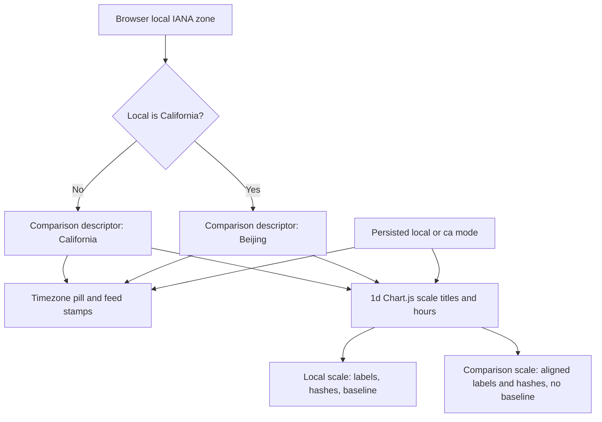
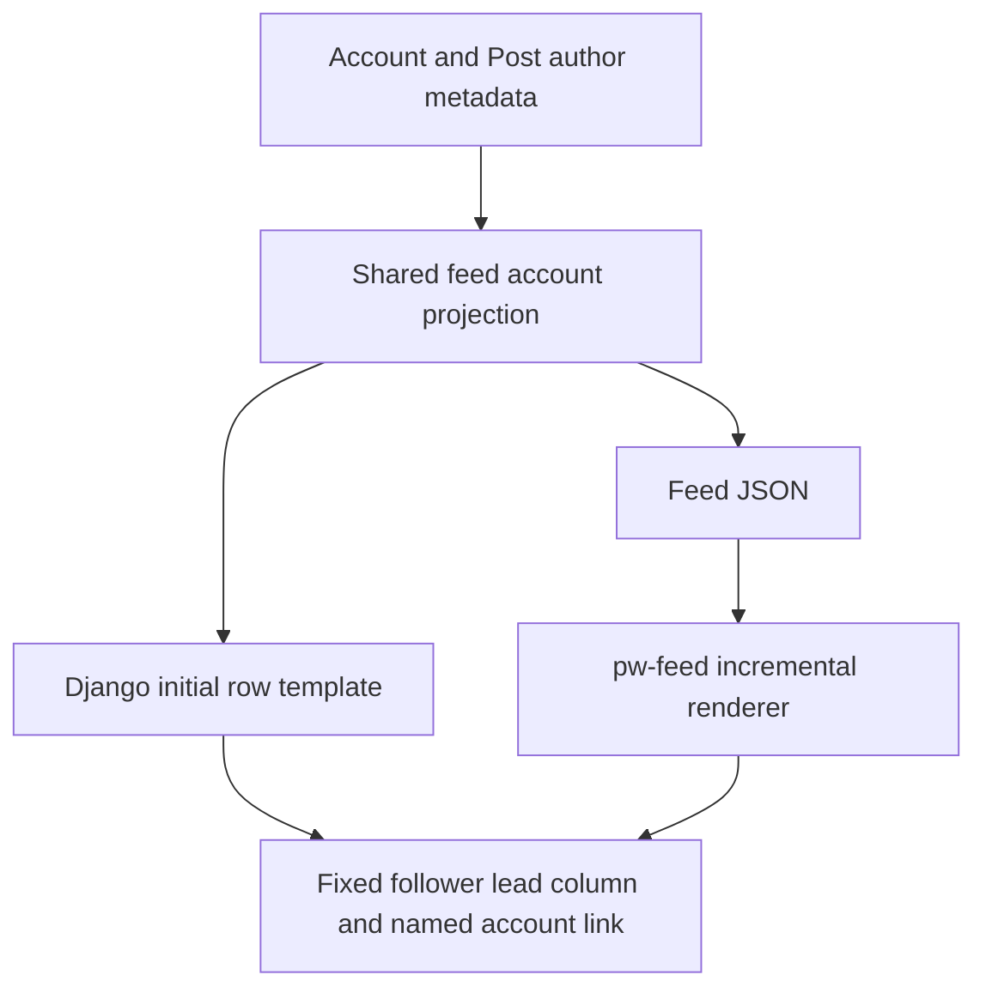

<!-- BEGIN OLLIJA DELIVERY GUIDE -->
## Ollija Delivery Guide

This block is generated guidance. Do not edit it directly. Correct durable facts in `.ollija/project.yaml` or this template, then rerun `./bin/ollija annotate-plan`. Put a user-directed exception in the editable Delivery Exceptions section below.

### Resolved locations

- Authoritative host: `fuchitalee`
- Authoritative repository: `/Users/fuchitalee/development/pushin-weight-v2`
- Ollija release worktree area: `/Users/fuchitalee/development/pushin-weight-v2/.worktrees`
- Active worktree: `/Users/fuchitalee/development/pushin-weight-v2/.worktrees/feat/pulse-feed-timezone-polish`
- Plan: `/Users/fuchitalee/development/pushin-weight-v2/.worktrees/feat/pulse-feed-timezone-polish/docs/plans/2026-08-26-090146-feat-pulse-feed-timezone-polish-plan.md`
- Change: `feat-pulse-feed-timezone-polish-2026-08-26-090146`
- Branch: `feat/pulse-feed-timezone-polish`
- Staging branch and blueprint: `staging`, `/Users/fuchitalee/development/pushin-weight-v2/.worktrees/feat/pulse-feed-timezone-polish/render-staging.yaml`
- Production branch and blueprint: `main`, `/Users/fuchitalee/development/pushin-weight-v2/.worktrees/feat/pulse-feed-timezone-polish/render.yaml`
- Staging URL: `https://pushinweight-staging-web.onrender.com`
- Production URL: `https://pushinweight-web.onrender.com`

### Placement

This worktree is inside the Ollija release worktree area. Reuse it for the whole change. Do not create a second worktree or plan for this branch.

### Delivery scope

- Workflow: `lfg`
- Delivery target: `production`
- Owner selection recorded: `true`

1. Complete implementation and the plan's verification contract.
2. Run the configured focused checks:
   - `pytest tests/ollija`
3. The parent workflow commits only this plan's changes, pushes the feature branch, and records the candidate SHA.
4. Fetch the remote staging lane: `git fetch origin refs/heads/staging`.
5. Require the unchanged candidate SHA to be a fast-forward of that fetched remote ref, then push the exact candidate SHA to `refs/heads/staging` with the server-enforced fast-forward command `git push origin <candidate-sha>:refs/heads/staging`.
6. Verify the remote staging ref resolves to the candidate SHA and the Render deployment for `pushinweight-staging-web` reports that same SHA.
7. Run staging checks. Stop here if they fail.
8. Only after staging passes, fetch the remote production lane: `git fetch origin refs/heads/main`.
9. Require the same unchanged candidate SHA to be a fast-forward of that fetched remote ref, then push the exact candidate SHA to `refs/heads/main` with the server-enforced fast-forward command `git push origin <candidate-sha>:refs/heads/main`.
10. Verify the remote production ref resolves to the candidate SHA and the Render deployment for `pushinweight-web` reports that same SHA before reporting completion.
11. After step 10 succeeds, perform worktree cleanup as the final filesystem action:
    - From `/Users/fuchitalee/development/pushin-weight-v2`, require `/Users/fuchitalee/development/pushin-weight-v2/.worktrees/feat/pulse-feed-timezone-polish` to remain registered, clean, unlocked, and at the verified candidate SHA. If any guard fails, retain it and report the reason.
    - Run `git -C /Users/fuchitalee/development/pushin-weight-v2 worktree remove /Users/fuchitalee/development/pushin-weight-v2/.worktrees/feat/pulse-feed-timezone-polish` without `--force`.
    - Preserve the local and remote feature branches. Continue final reporting from the authoritative repository root.

### Failure handling

- Never promote a staging candidate whose automated checks failed.
- Implementation failures return to the parent implementation workflow for diagnosis, correction, recommit, and restaging.
- SSH, shell, environment, or multi-machine failures use the repository infra/multi-machine skill first.
- The change ledger is advisory; do not validate or enforce it.
- Never force-remove a worktree. Retain staging-only, failed, dirty, locked,
  noncanonical, or candidate-mismatched worktrees for diagnosis or later
  delivery.
- Do not run an endless retry loop or start a persistent Ollija process.
<!-- END OLLIJA DELIVERY GUIDE -->

## Delivery Exceptions

None.

# Pulse, Feed, and Timezone Polish - Plan

## Goal Capsule

- **Objective:** Make the desktop model pulse, one-day timezone chart, and feed identity column easy to scan and operate without changing the underlying data or longer-window behavior.
- **Means:** Extend the existing V24 CSS, Chart.js scales, timezone controller, and shared SSR/client feed projection; bind the approved visual delta in a new Bridgewright target contract (KTD1-KTD7).
- **Authority:** User requirements in this Product Contract override the Planning Contract. The Planning Contract governs implementation mechanism. The Ollija Delivery Guide governs release sequencing.
- **Execution profile:** Code changes with real-browser verification on the public homepage at desktop and mobile widths, in English and Chinese, with Tokyo and California browser timezones.
- **Stop conditions:** Stop before promotion if focused tests, the browser regression net, staging deployment-SHA verification, desktop owner review, or physical-iPhone owner review fails.
- **Tail ownership:** The LFG pipeline owns implementation, review, staging, explicit approval gates, production verification, and guarded worktree cleanup.

---

## Product Contract

### Summary

Polish the existing production homepage without replacing its Chart.js, filter, preference, feed, or deployment architecture. The desktop pulse gains a native horizontal affordance; one-day timezone rows become labeled, mode-aware, and less visually redundant; follower reach becomes a fixed-width emoji-and-count column; and account names replace handles as visible feed identity.

### Problem Frame

The production pulse contains all 20 models but hides the desktop scrollbar, so the clipped models have no visible mouse-operated path. Selected chips also replace the per-model edge color with the common blue selection color.

The one-day chart uses two complete bottom axes. It does not label which row is local or California time, and it gives the comparison row an unnecessary second baseline. The chart also repeats California when the browser itself is in California instead of showing a useful comparison timezone.

Follower circles have variable widths, so the text body shifts horizontally from row to row. The follower total is separated from the marker and duplicated among engagement counters, while the visible account identity is the handle even when the stored account name is available.

### Requirements

**Pulse interaction and identity**

- R1. On desktop, an overflowing `.pulse-bar` must expose a visible native horizontal scrolling affordance while preserving the current mobile touch-scroll behavior.
- R2. A selected pulse chip may use the shared blue background, but its left edge must continue to render its own `--chip-color` in SSR and refreshed pulse markup.

**One-day chart and comparison timezone**

- R3. The 1d chart must label the two time rows at the left as `local` and `CA`, with `本地` and `加州` in Chinese; when California is the browser-local timezone, the comparison label must become Beijing.
- R4. The row matching the selected timezone-pill mode must use full-opacity tick, hash, and title lettering; the inactive local row must use the chart-lettering color at 55% alpha and the inactive comparison row must retain the current 45% alpha treatment.
- R5. Both 1d time-label rows must remain below the plot with local immediately above the comparison row, share the same 24 fixed hourly x positions, label only even hours as `0:00` through `22:00`, and retain an unlabeled hash at every odd hour.
- R6. The comparison row must not draw a second horizontal axis baseline. Its aligned labels and hourly positions must remain and move upward into the space released by that line.
- R7. When `Intl.DateTimeFormat().resolvedOptions().timeZone` is `America/Los_Angeles`, the comparison zone must be `Asia/Shanghai`; every other browser-local timezone must continue to compare against `America/Los_Angeles`.
- R8. The timezone pill and sub-24-hour feed stamps must follow the same dynamic comparison-zone decision as the chart. Beijing must use a `tz-bj-icon` with a red gradient, yellow `京`, and localized Beijing accessibility text in English and Chinese.
- R9. Toggling the timezone pill or locale must update chart row prominence, row titles, clocks, icons, accessible names, and feed timestamps without losing the persisted homepage settings.

**Feed identity and geometry**

- R10. Every public V22 feed row must reserve one fixed-width lead column sized for the largest follower emoji plus its compact count, so the body begins at the same horizontal coordinate for every follower bin.
- R11. The lead column must render the existing followers emoji at four increasing sizes for 0-999, 1,000-9,999, 10,000-49,999, and 50,000+ followers, with the compact count directly below it.
- R12. The follower total must no longer appear in `.engagement`; likes, reposts, and replies must retain their current behavior and order.
- R13. `.feed-handle-link` must keep linking to the X handle but display the account name. If no account name exists, it must fall back to the handle and then the existing unknown-account label.
- R14. Server-rendered rows and rows rendered or replaced by `pw-feed.js` must have the same name fallback, follower lead column, count, accessibility, engagement, and geometry contract.

**Compatibility and delivery**

- R15. Non-1d chart scales, chart aggregation, request-race protection, last-good restoration, 20-model ordering, filter state, browser preference persistence, locale navigation, mobile layout, `/internal/`, auth, and harvest behavior must remain unchanged.
- R16. A new approved Bridgewright target must supersede the prior preferences/UI target only for these named surfaces and must continue to use production, not the pre-existing hosted staging appearance, as the comparison baseline.
- R17. The exact reviewed candidate must pass staging before the same SHA is promoted to production under the generated Ollija Delivery Guide.

### Key Decisions

- **Production is the delivery target** `(session-settled: user-directed — chosen over staging-only: the owner selected production for this LFG run)`. Governs R17.
- **The comparison timezone is conditional on browser-local California**. Governs R3, R7-R9.
- **The follower marker becomes a fixed column, not another engagement statistic**. Governs R10-R14.

### Acceptance Examples

- AE1. **Covers R1-R2.** Given a 1440px desktop viewport where the 20 chips overflow, the user can operate the visible horizontal scrollbar to reach the last chip; selecting orange Qwen leaves an orange left edge while the rest of the chip is blue.
- AE2. **Covers R3-R6 and R9.** Given a Tokyo browser in 1d local mode, the local row is fully opaque above a dim CA row, both rows share 24 x positions, only even hours have `H:00` labels, odd hours keep hashes, and only the local row draws a baseline; selecting CA reverses the prominence without moving the labels out of alignment.
- AE3. **Covers R3 and R7-R9.** Given an `America/Los_Angeles` browser, the comparison pill and chart row say Beijing, use `Asia/Shanghai`, render the red/yellow `京` icon, and show localized accessible copy after English or Chinese locale changes.
- AE4. **Covers R10-R14.** Given four feed rows at follower-bin boundaries, each body has the same x coordinate, each lead column shows a progressively larger followers emoji with the compact count below it, and none repeats followers in engagement.
- AE5. **Covers R13-R14.** Given an account with display name `Example Name` and handle `example_handle`, both SSR and refreshed rows display `Example Name` but link to `https://x.com/example_handle`; a missing name displays the handle.
- AE6. **Covers R15.** Given 7d, 30d, or 365d, the chart retains one date x-axis and the existing request/refresh behavior; the legacy `/internal/` feed retains its current markup.

### Scope Boundaries

#### In Scope

- The public V24 homepage pulse, one-day Chart.js configuration, timezone pill, sub-24-hour public feed timestamps, public feed wire projection, SSR/client row renderers, and their regression coverage.
- A new Bridgewright target contract and manifest regression pin for this approved delta.

#### Deferred to Follow-Up Work

- Account-synced default brands, named saved views, and any server-side preference model.
- A generic timezone picker beyond the Local/California-or-Beijing comparison pair.

#### Outside This Change

- Database models or migrations, harvester/headline behavior, Render topology, authenticated access rules, the legacy `/internal/` UI, and a replacement chart library.

---

## Planning Contract

### Key Technical Decisions

- KTD1. **Use the existing native overflow container for desktop pulse scrolling.** Reveal a compact desktop scrollbar and keep the mobile scrollbar treatment unchanged; do not intercept vertical wheel motion or introduce navigation arrows for this batch. Supports R1.
- KTD2. **Restore the selected chip edge after the shorthand border color.** The selected rule owns the blue fill and non-leading borders, while an equal-or-more-specific rule reasserts `border-left-color: var(--chip-color)`. Supports R2.
- KTD3. **Keep two Chart.js scale objects but render one baseline.** The comparison scale remains because it guarantees pixel-aligned labels and fixed tick positions, while Chart.js 4 `border.display` suppresses only its baseline and its grid continues to draw hourly hashes. Supports R3-R6.
- KTD4. **Resolve one shared comparison-zone descriptor in `pw-tz.js` and load it before the chart controller.** It supplies the IANA zone, mode-compatible `ca` storage value, short chart label, localized pill/accessibility label, icon class/content, and hour formatter to both timezone and chart code. Existing stored `local|ca` preferences remain valid. Supports R7-R9 and R15.
- KTD5. **Use start-aligned scale titles and a timezone-change redraw.** Chart scale titles carry `local`/`CA` or Beijing copy at the left; scale padding keeps each title visually attached to its time row and moves the borderless comparison row upward. A dedicated timezone change notification makes Chart.js update row colors and titles immediately without fetching new data. Supports R3-R6 and R9.
- KTD6. **Project account display name once and share fallback semantics.** Add `display_name` to the existing account wire object from `Account.display_name`, falling back through the post author snapshot and handle; both feed renderers consume that field while the href remains handle-derived. Supports R13-R14.
- KTD7. **Make the follower marker a fixed lead component.** CSS reserves one column based on the largest emoji and compact-count width; follower-bin classes vary emoji size and presentation inside it, and SSR/client markup removes the engagement follower span. Supports R10-R12 and R14.
- KTD8. **Bind only the intentional delta in Bridgewright.** Add a timestamped approved target, make it the manifest's last approved contract, retain all prior authorities, and update the regression pin. Supports R16.
- KTD9. **Use only plan-annotator Ollija for delivery** `(session-settled: user-directed — chosen over the retired stateful controller: the repository worktree workflow is the release authority)`. The feature worktree and generated delivery guide remain canonical through production verification and cleanup. Supports R17.

### High-Level Technical Design

### Assumptions

- “Remove the 2nd x axes” means remove the comparison row's horizontal baseline, not the comparison labels, scale object, or odd-hour hashes; this interpretation is required to preserve the user's aligned CA/Beijing times.
- The existing `ca` preference value represents the comparison choice for backward compatibility even when that comparison resolves to Beijing in a California browser.
- The native followers emoji already used by the engagement row is the intended replacement marker. Its visual size changes by the existing four bins, and the compact count remains text for scanability and accessibility.
- A missing account display name falls back to the stored handle so historical rows remain usable without a migration or backfill.
- English chart row labels are `local`, `CA`, and `Beijing`; Chinese labels are `本地`, `加州`, and `北京`.

### Implementation Constraints

- Preserve the fixed 24 real-hour tick instants across daylight-saving transitions; only label visibility changes at odd hours.
- Keep Chart.js 4.4.0 and its canvas; use supported scale `title`, `weight`, `grid`, and `border` options.
- Keep the timezone-pill geometry stable across mode, comparison-zone, and locale changes at desktop and 320-390px mobile widths.
- Keep account links and row-click post links independently clickable with their existing propagation guards.
- Apply visible copy to both English and Simplified Chinese locale sources and to the live client-side chrome dictionary where immediate locale switching requires it.

### Research Sources

- `monitor/static/home-v20.css` defines the current hidden pulse scrollbar, selected chip border shorthand, variable follower circles, timezone icon, and feed geometry.
- `monitor/static/pw-chart.js` owns the 24 fixed hourly positions, dual 1d category scales, pulse refresh renderer, and legend ordering.
- `monitor/static/pw-tz.js` owns the persisted Local/CA mode, timezone clocks, and sub-24-hour feed timestamps.
- `monitor/views.py`, `monitor/templates/monitor/_feed_initial_v22.html`, and `monitor/static/pw-feed.js` form the public feed projection/SSR/client parity path.
- `docs/reference/2026-08-26-141113-home-preferences-ui-regressions-bridgewright-target.md` protects the current production baseline and prior approved UI behavior.
- Chart.js 4 official axis documentation confirms scale titles, scale weights, grid tick controls, and `border.display` for suppressing one baseline.

---

## Implementation Units

### U1. Bind the approved Bridgewright delta

- **Goal:** Make the new owner-approved UI delta the latest Bridgewright target without weakening prior production authorities.
- **Requirements:** R16.
- **Dependencies:** None.
- **Files:** `docs/reference/<timestamp>-pulse-feed-timezone-polish-bridgewright-target.md`, `bridgewright.yaml`, `tests/test_bridgewright_v24_target.py`.
- **Approach:**
  1. Write the target against the current production baseline and list only R1-R15 as approved visual/behavioral deltas.
  2. Preserve all earlier approved product-intent documents and semantic anchors, then add one new semantic anchor and set the new document as `last_approved_contract`.
  3. Extend the manifest regression test so drift in the new target's key statements fails deterministically.
- **Patterns to follow:** `docs/reference/2026-08-26-141113-home-preferences-ui-regressions-bridgewright-target.md` and the existing manifest pin.
- **Test scenarios:**
  - The manifest loads the new contract as the latest authority while retaining the prior V24, filter/feed, chart, and preferences contracts.
  - The contract names production as baseline and excludes staging appearance, `/internal/`, migrations, harvest, auth, and chart-library replacement.
- **Verification:** The Bridgewright manifest regression test passes and its source strings match the approved Product Contract.

### U2. Restore desktop pulse navigation and selected brand edges

- **Goal:** Make every model reachable on desktop and preserve each chip's visual identity when selected.
- **Requirements:** R1-R2, R15.
- **Dependencies:** U1.
- **Files:** `monitor/static/home-v20.css`, `monitor/templates/monitor/home.html`, `monitor/static/pw-chart.js`, `tests/test_home_v22_browser.py`, `tests/test_pw_chart_filter.js`.
- **Approach:**
  1. Add a desktop-only native scrollbar treatment to the existing overflow container while leaving mobile touch overflow rules intact.
  2. Reassert the selected chip's leading border from `--chip-color` after the blue selection shorthand.
  3. Keep initial and refreshed pulse markup on the same inline custom-property contract.
- **Execution note:** Characterize overflow and selected-Qwen computed styles in a real browser before styling.
- **Patterns to follow:** Existing `.pulse-bar`, `.filter-bar-scroller`, pulse renderer, and 20-model accessibility browser coverage.
- **Test scenarios:**
  - At desktop width, 20 overflowing chips expose a non-hidden horizontal scrollbar and scrolling changes `scrollLeft` enough to reveal the final chip.
  - At mobile width, the bar remains horizontally touch-scrollable without a desktop scrollbar taking layout space.
  - Selecting a non-blue chip gives it the accent background while computed `border-left-color` continues to equal its `--chip-color`, before and after a chart refresh rerenders the pulse.
- **Verification:** Desktop Chromium reaches the last model through the visible horizontal control, selected colors survive refresh, and existing 20-model order/accessibility assertions pass.

### U3. Unify dynamic comparison zones and one-day axis presentation

- **Goal:** Make local/comparison time rows self-identifying, mode-aware, aligned, and useful in California-local browsers.
- **Requirements:** R3-R9, R15.
- **Dependencies:** U1.
- **Files:** `monitor/static/pw-tz.js`, `monitor/static/pw-chart.js`, `monitor/static/pw-locale-toggle.js`, `monitor/static/home-v20.css`, `monitor/templates/monitor/home.html`, `locale/en/LC_MESSAGES/django.po`, `locale/zh_Hans/LC_MESSAGES/django.po`, `tests/test_pw_chart_filter.js`, `tests/test_home_v22_browser.py`.
- **Approach:**
  1. Centralize the conditional California/Beijing descriptor in the timezone controller, load that controller before the chart script, and expose a read-only comparison-zone API for the chart.
  2. Render the pill and feed stamps from that descriptor while retaining the persisted `local|ca` mode and stable control geometry.
  3. Configure both 1d scales from the same hourly instants, add start-aligned localized titles, preserve even-hour labels and odd-hour hashes, and hide only the comparison border.
  4. Derive tick/title/hash colors from the active mode and redraw the chart on timezone or locale changes without issuing a chart data request.
  5. Leave the non-1d scale path and refresh/race behavior untouched.
- **Execution note:** Start with deterministic Node scale-contract tests, then validate exact scale geometry and computed colors in Chromium with Tokyo and Los Angeles contexts.
- **Patterns to follow:** Existing `fixedHourlyTicks`, `hourlyScale`, `window.__pwTz`, `pw:chrome-change`, preference-store, and V24 timezone browser tests.
- **Test scenarios:**
  - Tokyo local mode renders `local` above `CA`, 24 aligned positions, twelve even-hour labels per row, odd-hour hashes, one baseline, full local opacity, and 45%-alpha CA styling.
  - Tokyo comparison mode renders CA ticks, hashes, and title at full opacity while local lettering uses the chart color at 55% alpha.
  - Clicking the pill selects comparison mode, reverses row prominence, changes sub-24-hour feed timestamps, and keeps chart/pill geometry stable without a network refresh.
  - A Los Angeles browser uses `Asia/Shanghai`, `Beijing`/`北京`, and the `tz-bj-icon` with `京` in the pill, chart, and feed timestamps.
  - Chinese and English locale changes update `本地`/`加州`/`北京` and `local`/`CA`/`Beijing` visible and accessible text while preserving filters, window, lenses, pulse selections, and timezone mode.
  - The California fall-back DST day retains 24 real instants and correct label suppression; 7d, 30d, and 365d retain one x-axis.
- **Verification:** Node scale tests and real Chromium geometry/state assertions pass with no console or page errors in both timezone contexts and both locales.

### U4. Project account names and a fixed follower lead column

- **Goal:** Stabilize feed text alignment and make account reach plus identity scannable in initial and refreshed rows.
- **Requirements:** R10-R15.
- **Dependencies:** U1.
- **Files:** `monitor/views.py`, `monitor/templates/monitor/_feed_initial_v22.html`, `monitor/static/pw-feed.js`, `monitor/static/home-v20.css`, `tests/test_views.py`, `tests/test_home_v22_feed_row_shape.py`, `tests/test_pw_feed_formatter.js`, `tests/test_home_v22_browser.py`, `tests/v22_support.py`.
- **Approach:**
  1. Add the resolved account display name to both ORM-to-wire paths without changing models or queries.
  2. Replace the empty circle span with a lead component that contains the follower emoji and compact count, and remove the follower span from engagement in both renderers.
  3. Fix the lead component's width to the largest-bin/count envelope while follower-bin classes vary only the inner emoji size and presentation.
  4. Display the resolved account name in the existing X handle link and retain handle-derived hrefs and click-propagation behavior.
- **Execution note:** Add SSR and client-renderer parity assertions before changing the row markup.
- **Patterns to follow:** `_v22_feed_display_fields`, account wire objects, `_feed_initial_v22.html`, `renderRowHtml`, and metadata parity browser tests.
- **Test scenarios:**
  - Follower counts at 0, 999, 1,000, 9,999, 10,000, 49,999, and 50,000 select the established bins and render the compact count below progressively sized emoji.
  - Four different bins produce equal lead-column widths and equal body x coordinates in SSR rows and refreshed rows.
  - Engagement contains likes, reposts, and replies in the existing order and contains no follower statistic.
  - An available account display name is visible while the link href uses the handle; missing display name falls back to handle, then unknown.
  - Row-click, text-cycle, handle-link, and signal-column click propagation remains unchanged; `/internal/` retains legacy markup.
- **Verification:** Projection, SSR-shape, client-renderer, metadata parity, and browser geometry tests pass for initial load, filter replacement, and paginated rows.

---

## Verification Contract

| Gate | Command or evidence | Done signal |
| --- | --- | --- |
| Static/system | `python manage.py check` | Django reports no issues. |
| JS contracts | `node tests/test_pw_chart_filter.js` and `node tests/test_pw_feed_formatter.js` | Axis, pulse refresh, feed renderer, and request-race contracts pass. |
| Focused Django | `pytest tests/test_bridgewright_v24_target.py tests/test_views.py tests/test_home_v22_feed_row_shape.py tests/test_home_v22_topbar_layout.py tests/test_home_v22_filter_pills.py` | Projection, SSR, Bridgewright, locale, and legacy-boundary coverage passes. |
| Real browser | Targeted `tests/test_home_v22_browser.py` cases, followed by the full file when PostgreSQL browser prerequisites are available | Desktop/mobile, English/Chinese, Tokyo/Los Angeles, initial/refresh geometry and behavior pass without browser errors. |
| Regression net | `python tests/regression_net.py` and `pytest tests/ollija` | Project regression invariants and delivery annotations pass. |
| Full suite | `pytest` | No unrelated regression remains before staging. |
| Staging | Deploy the exact candidate SHA to `staging`; verify Render reports that SHA; run desktop Chromium and owner physical-iPhone checks against the new Bridgewright contract | Candidate looks like production plus only R1-R14 deltas and all interactive checks pass. |
| Production | Promote the unchanged staged SHA to `main`; verify Render reports that SHA; repeat homepage smoke checks | Production serves the approved candidate with working pulse scroll, dynamic timezone presentation, and fixed feed identity geometry. |

---

## Definition of Done

- U1 is done when the new target is the latest Bridgewright authority and all prior target contracts remain bound.
- U2 is done when desktop users can visibly scroll through all 20 chips and selected chips retain their model-colored leading edge across refresh.
- U3 is done when the 1d rows are labeled, aligned, single-baseline, mode-prominent, localized, and dynamically California-or-Beijing while longer windows remain unchanged.
- U4 is done when SSR and refreshed feed rows show the same fixed follower column, compact count, display-name fallback, engagement set, and click behavior.
- The focused JS, Django, browser, Ollija, and regression-net checks pass; the full suite has no change-caused failures.
- Desktop and physical-iPhone staging approvals are explicit owner actions and are recorded before production promotion.
- The same verified candidate SHA reaches staging and production; no commit is amended or substituted between lanes.
- No abandoned experiments, duplicate render paths, stale CSS selectors, obsolete cache-bust labels, or unrelated cleanup remains in the diff.
- After production verification, guarded worktree removal is the final filesystem action; local and remote feature branches remain preserved.
