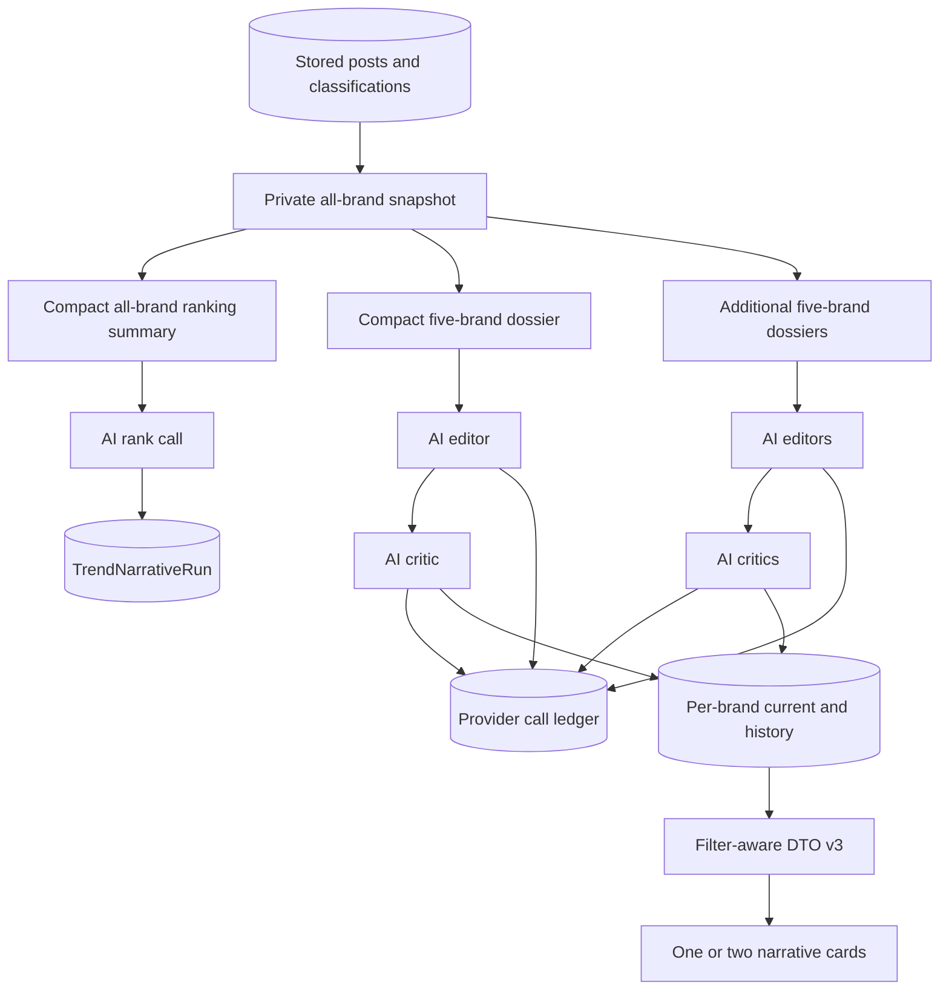
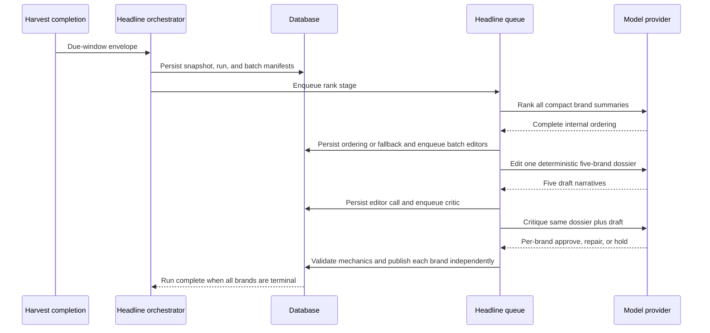
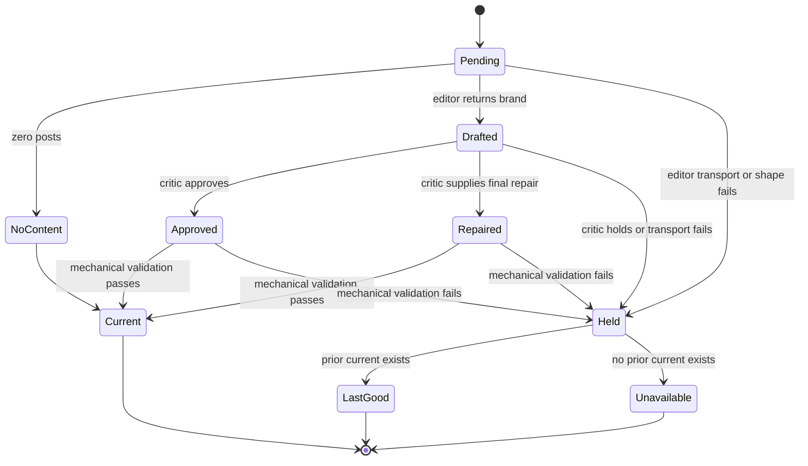

<!-- BEGIN OLLIJA DELIVERY GUIDE -->
## Ollija Delivery Guide

This block is generated guidance. Do not edit it directly. Correct durable facts in `.ollija/project.yaml` or this template, then rerun `./bin/ollija annotate-plan`. Put a user-directed exception in the editable Delivery Exceptions section below.

### Resolved locations

- Authoritative host: `fuchitalee`
- Authoritative repository: `/Users/fuchitalee/development/pushin-weight-v2`
- Ollija release worktree area: `/Users/fuchitalee/development/pushin-weight-v2/.worktrees`
- Active worktree: `/Users/fuchitalee/development/pushin-weight-v2/.worktrees/integrate/why-first-trend-headlines-20260824`
- Plan: `/Users/fuchitalee/development/pushin-weight-v2/.worktrees/integrate/why-first-trend-headlines-20260824/docs/plans/2026-08-26-173100-feat-per-brand-ai-trend-narratives-plan.md`
- Change: `per-brand-ai-trend-narratives-20260826`
- Branch: `integrate/why-first-trend-headlines-20260824`
- Staging branch and blueprint: `staging`, `/Users/fuchitalee/development/pushin-weight-v2/.worktrees/integrate/why-first-trend-headlines-20260824/render-staging.yaml`
- Production branch and blueprint: `main`, `/Users/fuchitalee/development/pushin-weight-v2/.worktrees/integrate/why-first-trend-headlines-20260824/render.yaml`
- Staging URL: `https://pushinweight-staging-web.onrender.com`
- Production URL: `https://pushinweight-web.onrender.com`

### Placement

This worktree is inside the Ollija release worktree area. Reuse it for the whole change. Do not create a second worktree or plan for this branch.

### Delivery scope

- Workflow: `ce-plan`
- Delivery target: `on-request`
- Owner selection recorded: `false`

Target is not authorized until the owner selects it. Wait for a later explicit release request; do not commit, push, stage, or promote on this guide alone.

### Failure handling

- Never promote a staging candidate whose automated checks failed.
- Implementation failures return to the parent implementation workflow for diagnosis, correction, recommit, and restaging.
- SSH, shell, environment, or multi-machine failures use the repository infra/multi-machine skill first.
- The change ledger is advisory; do not validate or enforce it.
- Do not run an endless retry loop or start a persistent Ollija process.
<!-- END OLLIJA DELIVERY GUIDE -->

## Delivery Exceptions

None.

# Per-Brand AI Trend Narratives - Plan

## Goal Capsule

- **Objective:** Give every tracked brand a current, content-led trend narrative for every supported time window, so the default dashboard and any saved brand filter can explain what people are discussing and why it is notable.
- **Means:** Replace the current shortlist packet and regex-heavy publication gate with compact per-brand dossiers, fixed five-brand AI editor and critic batches, proof-carrying propositions, durable per-brand publication, and filter-aware projection (KTD1-KTD12).
- **Product authority:** The Product Contract in this plan supersedes the top-two/shared-publication behavior in `docs/plans/2026-08-14-195746-feat-why-first-trend-headlines-plan.md`. Existing rows remain a rollout fallback only.
- **Execution profile:** Deep, migration-bearing, external-model work. Implement characterization-first in the existing Ollija release worktree. Keep provider evaluation finite and explicit.
- **Stop conditions:** Stop if implementation requires harvesting changes, exposes ordinary-user identity, adds the deferred Pro comparison surface, or cannot publish one brand independently of failures for another brand.
- **Tail ownership:** The implementing agent owns code, migrations, tests, real-data evaluation artifacts, current-state documentation, and cleanup of superseded validator code. Delivery beyond a committed candidate occurs only on owner request through the generated Ollija guide.

---

## Product Contract

### Summary

The headline system will analyze every tracked non-sentinel brand for each supported window and cache one bilingual narrative per brand.
Each narrative will lead with the post content that best explains why the conversation is notable, then use exact quantitative facts as supporting evidence.
An internal all-brand ranking will decide which narratives appear by default, while brand filters will select the requested brands without waiting for generation.

### Problem Frame

The current system treats one shared window headline as both the generation result and the publication cache.
It shortlists at most six candidates, asks one model call to choose one or two, and then applies dozens of Python lexical and regex checks to infer whether the prose is supported.
This architecture loses good model output when metadata is incomplete, can attach a valid event phrase to the wrong proposition, and cannot serve a cached narrative for a brand that did not make the shortlist.

The current provider packet is also close to its 128 KiB ceiling and measured at about 40,000 input tokens in a real evaluation.
It sends long raw arrays and server-derived metadata that the model must reinterpret.
The replacement must send calculated summaries and a bounded dated evidence collection while retaining exact facts and source text for grounding.

### Key Decisions

- **Generate every tracked brand before serving.** (session-settled: user-directed — chosen over top-two generation plus on-demand fill: a saved MiniMax or other brand view must open with its narrative ready.) Governs R1-R3, R18.
- **Use fixed deterministic batches of five.** (session-settled: user-directed — chosen over one call per brand or dynamic semantic batches: five-brand batches balance context, isolation, and provider overhead.) Governs R15-R17.
- **Let AI own meaning and Python own integrity.** (session-settled: user-directed — chosen over lexical event, entity, causality, and digit validators: semantic regex checks rejected good output and misattributed evidence.) Governs R9-R12, R16.
- **Keep every secondary paragraph substantive.** (session-settled: user-directed — chosen over empty or insufficient-data copy: when no striking event appears, the narrative must still explain what posts discuss.) Governs R5-R7.
- **Allow trusted first-party evidence to support an event.** (session-settled: user-directed — chosen over requiring independent repetition: official and staff account roles are validated and may support a dated announcement when timing and text align.) Governs R11, R12.
- **Keep ranking private.** (session-settled: user-directed — chosen over public rank labels: ranking controls selection but is not itself a user-facing score.) Governs R2-R4.
- **Defer the Pro comparison surface but preserve its inputs.** (session-settled: user-approved — chosen over adding the locked comparison accordion now: the current iteration stays focused while preserving peer facts, event identity, account role, and evidence IDs.) Governs R23.

### Actors

- A1. A dashboard reader sees up to two narratives that explain why the selected conversation scope is notable.
- A2. A brand or DevRel user opens a saved one-brand or two-brand filter and immediately sees those brands' cached narratives.
- A3. The headline worker builds immutable facts, schedules bounded model calls, publishes successful brands independently, and retains last-good copy for failed brands.
- A4. An operator reviews real-data outputs, provider cost, rejection reasons, and per-brand freshness before activation or release.
- A5. A future Pro subscriber may expand a separate comparison surface that consumes preserved peer-compatible facts but does not alter the narrative contract in this iteration.

### Requirements

**Brand coverage and selection**

- R1. Each generation run covers every `Brand` row with `is_sentinel=False` for each supported window of 1, 7, 30, and 365 days.
- R2. The system stores a complete internal ordering of the run's brand universe without exposing ordinal rank in the public DTO or UI.
- R3. The public projection returns one requested brand when one is selected, both requested brands when two are selected, and the two highest internally ranked brands within the selected set when more than two or all brands are selected.
- R4. Time window and brand selection are the only filters that affect narrative choice; post type, discourse, role, language, sentiment, and other feed filters do not regenerate or re-rank narratives.

**Editorial output**

- R5. Each nonempty brand result contains a bilingual headline and a substantive bilingual secondary paragraph; neither field may use `insufficient data` as its editorial content.
- R6. The headline leads with a supported event, reported experience, concern, comparison, topic, or conversation-mix change when one is present, and uses quantity or rate as corroborating color rather than the definition of relevance.
- R7. When no major event is apparent, the secondary paragraph describes the bounded post collection, recurring subjects, reactions, or measured mix; a one-post brand says `the available discussion` rather than implying recurrence.
- R8. Quiet and flat brands receive proportionate language, including small relative leadership such as `a small 0.1% rise`, without suppressing the narrative.
- R9. Exact percentages and other quantitative claims may appear in either paragraph when they cite supplied fact IDs and use the supplied display value.
- R10. English and Simplified Chinese convey the same conclusion, confidence, facts, events, and quoted meaning.
- R11. Each event, number, quote, and other externally checkable proposition maps to exact fact IDs, evidence IDs, or both; the model supplies this mapping as part of its output.
- R12. Trusted official or staff evidence may establish a dated first-party announcement, while ordinary-user evidence may establish reaction, use, comparison, or corroboration; the AI critic decides semantic support from the cited proposition and evidence.
- R13. A quote translated from stored source text uses the stored localized translation and visibly discloses the source language, such as `translated from Korean`.

**Facts, baselines, and evidence**

- R14. The provider packet replaces raw time-series and metadata arrays with Python-calculated summaries that retain totals, baseline changes, dominant transition, change concentration, peak or trough, mix shifts, and exact fact IDs.
- R15. The private immutable snapshot retains the full raw series and source provenance, while each editor packet contains exactly one deterministic batch of up to five nonempty brands plus bounded evidence selected from already stored posts.
- R16. One compact all-brand call ranks every brand, zero-post brands become deterministic no-content outcomes, and each remaining deterministic brand batch receives one editor call and one critic call; Python performs only schema, ID ownership, exact-value, cardinality, lifecycle, and size checks.
- R17. A critic may approve, repair, or hold each brand independently; a repair is the critic's final complete narrative and does not trigger an unbounded third call.
- R18. Baseline facts declare `prior_period`, `rolling_historical_norm`, or `unavailable`; the initial implementation uses an immediately preceding equal window only and never labels that one period as a historic norm.
- R19. Missing or suppressed prior-period comparison lowers confidence but does not remove the brand from ranking; fallback ordering uses within-window movement, then current mix and content signals, then canonical brand key as the final tie-break.
- R20. Evidence rows preserve timestamp, source language, original text, stored English and Chinese translations, classification context, interaction counts, and first-party role; ordinary-user identity remains opaque.
- R21. Evidence selection remains deterministic, bounded, deduplicated for reposts and near-identical text, and measured by bytes and tokens; semantic theme and event grouping belongs to the model.

**Publication, freshness, and operations**

- R22. Publication is independent per brand: approve or repair advances that brand's current row, hold preserves its last-good row, and a first failure without last-good copy projects a localized unavailable state with the latest attempt time.
- R23. Per-brand records preserve stable fact IDs, evidence IDs, model-created event identity, and official or staff role so a later Pro comparison feature can calculate peer benchmarks without adding its UI, entitlement, action recommendations, or comparison copy now.
- R24. A successful verification timestamp advances only when that brand is successfully approved or repaired; stale copy displays `Stale · last verified 10 min ago` with a localized absolute timestamp available to tooltip and assistive technology.
- R25. A zero-post brand is the sole deterministic no-content state and consumes no editor or critic capacity; it remains represented in the run and public selection instead of disappearing.
- R26. The workflow records each rank, editor, and critic transport separately with its model, prompt version, request hash, response hash, tokens, latency, outcome, batch key, and error code.
- R27. Model calls run as durable bounded stages on the isolated headline queue, survive retries without duplicate transport, and do not extend the monolithic harvest-envelope task.
- R28. This work does not change harvest policy, collection volume, translator or classifier behavior, Render harvest cron, or the production scheduler boundary.
- R29. Existing activation, enqueue, provider-call, and serving controls remain fail-closed; disabled serving returns localized disabled copy without exposing an unreviewed per-brand row.

### Key Flows

- F1. Window generation
  - **Trigger:** A committed harvest completion makes a supported window due.
  - **Actors:** A3
  - **Steps:** Build one private all-brand snapshot; resolve ranking through the model or deterministic fallback; persist deterministic nonempty batches; publish or hold each brand; close the run when every brand has a terminal outcome.
  - **Outcome:** Every tracked brand has a current result, last-good fallback, unavailable attempt, or deterministic no-content result for the same facts cutoff.
  - **Covered by:** R1, R2, R15-R19, R22, R25-R28
- F2. Filter-aware serving
  - **Trigger:** A1 or A2 loads the page or changes the time or brand filter.
  - **Actors:** A1, A2
  - **Steps:** Resolve the selected brand set; apply the current internal ordering; project one or two persisted brand results; replace the narrative DOM atomically in the selected locale.
  - **Outcome:** Narrative selection matches brand filters without a provider call or DB lookup by the model.
  - **Covered by:** R3, R4, R22, R24
- F3. Brand-isolated review
  - **Trigger:** An editor returns a five-brand draft.
  - **Actors:** A3
  - **Steps:** Run the critic on the same packet and draft; validate mechanical invariants; publish approved or repaired brands; hold only rejected brands.
  - **Outcome:** One weak narrative cannot discard four acceptable narratives.
  - **Covered by:** R11, R16, R17, R22, R26

### Acceptance Examples

- AE1. **Covers R5-R12, R18.** Given DeepSeek has 45% more posts than the prior week and a trusted staff announcement plus discussion of DSv4-Flash, when its batch is approved, then its headline may say the release most likely spurred the increase and every event and number cites exact packet IDs.
- AE2. **Covers R5-R8, R19.** Given DeepSeek volume is flat but positive sentiment rises 50% and posts move from release buzz to hands-on reports, when no single external event dominates, then the narrative leads with reported usage and reactions rather than calling the brand unremarkable.
- AE3. **Covers R3, R4.** Given the internal order is DeepSeek, MiniMax, GLM, Qwen, when the selected brands are only GLM, only DeepSeek and GLM, or DeepSeek plus three peers, then the projection returns GLM; DeepSeek and GLM; or DeepSeek and MiniMax respectively.
- AE4. **Covers R13, R20.** Given a Korean post has stored English and Chinese translations, when the editor quotes its localized text, then the public copy marks the quote as translated from Korean and its proposition cites that evidence ID.
- AE5. **Covers R17, R22, R24.** Given the critic approves four brands and holds MiniMax, when all outcomes persist, then those four brands advance independently and MiniMax continues serving its last-good copy as `Stale · last verified 1 hr ago`.
- AE6. **Covers R18, R19.** Given prior-period coverage is insufficient for MiMo, when ranking runs, then its baseline fields are unavailable but a within-window late spike and release discussion may still rank it above a brand with complete but flat data.
- AE7. **Covers R25.** Given one brand has zero eligible posts and another has one, when the run executes, then the zero-post brand gets deterministic no-content without a model call while the one-post brand receives a narrative that says `the available discussion`.
- AE8. **Covers R2, R19, R27.** Given the all-brand ranking call fails, when fixed batches run, then narrative generation continues and selection uses the last-good internal order or the deterministic fallback when no prior order exists.

### Success Criteria

- Every non-sentinel brand has a terminal per-brand outcome for every completed due-window run.
- A malformed or held result changes no other brand's current publication.
- A real-data evaluation demonstrates that approved narratives cite only packet-owned facts and evidence, contain no invented numeric values, and read as useful in both locales.
- The measured editor packet stays below the hard 128 KiB boundary and its calibrated target budget is recorded before activation.
- Browser proof covers one-brand, two-brand, and more-than-two-brand selection plus stale relative time in English and Simplified Chinese.

### Scope Boundaries

#### In Scope

- Replacement packet and prompt contracts.
- All-brand internal ranking and deterministic five-brand batching.
- AI editor and critic calls with proof-carrying propositions.
- New durable run, call, and per-brand publication state.
- Filter-aware one-or-two narrative projection and visible stale time.
- Removal of superseded semantic regex and lexical publication gates.
- Finite real-data evaluation and current-state documentation.

#### Deferred to Follow-Up Work

- The locked collapsed Pro comparison div below the narrative summary.
- Entitlement enforcement and unlock interaction.
- Public peer benchmarks, market-median copy, event-announcement counts, account-activity comparisons, and AI-generated action recommendations.
- A rolling historical norm longer than the immediately preceding equal window.
- Backfilling incomplete historical data.

#### Outside this Product's Identity

- On-demand narrative generation during a page request.
- An LLM that queries the database or external news sources while composing a narrative.
- Stock-like trend ranking based only on percentage movement.
- Public league tables or ordinal rank labels in the default narrative UI.
- Changes to harvesting, translation, classification, or source acquisition.

### Sources

- `monitor/trend_narrative_candidates.py` — current private snapshot, shortlist, evidence allocation, and 128 KiB provider limit.
- `monitor/trend_narrative_facts.py` — current prior-period facts, series, metadata families, and coverage gates.
- `monitor/trend_narrative_generation.py` — current prompt, one-call output, server-derived event anchor, and semantic validators to replace.
- `core/models.py` — current `TrendNarrative` publication-cache and call-ledger coupling.
- `monitor/trend_narrative_tasks.py` — current sequential four-call envelope task and lifecycle seams.
- `monitor/trend_narrative_projection.py`, `monitor/views.py`, `monitor/templates/monitor/home.html`, and `monitor/static/pw-chart.js` — current shared DTO and single-strip rendering path.
- `docs/reference/2026-08-25-135300-why-first-headline-validation-and-event-anchors-reference.md` — detailed account of the mixed-evidence event-anchor failure and 43 rejection codes.
- `docs/solutions/architecture-patterns/2026-08-12-205000-cached-bilingual-trend-narratives.md` — immutable snapshot, isolated worker, last-good publication, and Redis coordination constraints.
- `docs/solutions/logic-errors/2026-08-10-002-trend-narrative-translator-max-tokens-truncation.md` — measured output-budget calibration lesson.
- `docs/solutions/logic-errors/2026-08-10-004-fix-translator-lang-detected-llm-compliance.md` — bounded AI repair precedent.

---

## Planning Contract

### Key Technical Decisions

- KTD1. **Use a version-2 compact dossier as the only provider packet.** (session-settled: user-directed — chosen over trimming the existing packet: the old arrays and candidate metadata are not a compatibility contract.) Keep full raw series in the immutable private snapshot, then project calculated summaries and exact evidence for each call. Implements R14, R15, R20, R21.
- KTD2. **Build fixed nonempty-brand batches by canonical brand key, not rank or semantic similarity.** (session-settled: user-directed — chosen over dynamic grouping: deterministic groups are reproducible, retryable, and do not reshuffle when rankings change.) Resolve zero-post outcomes before batching; the final nonempty batch may contain fewer than five brands. Implements R15-R17, R25.
- KTD3. **Use a durable call graph instead of one long task.** Persist one run manifest, resolve one ranking-or-fallback stage, then run editor and critic stages per batch. Each provider transport receives its own lease and idempotency identity. Implements R16, R26, R27.
- KTD4. **Move semantic judgment into editor and critic contracts.** (session-settled: user-directed — chosen over Python regex and keyword validators: the current server confused unrelated evidence and rejected acceptable prose.) The critic sees the same evidence and draft and returns an independent decision per brand. Python validates only closed mechanical invariants. Implements R9-R12, R16, R17.
- KTD5. **Represent support as proof-carrying propositions.** Each exact claim text is linked to packet-owned fact and evidence IDs, and headline or secondary fields list the proposition IDs they use. Model-created event records group the propositions and evidence that identify one distinct event. Implements R9-R13, R23.
- KTD6. **Separate run, transport, and publication persistence.** Add `TrendNarrativeRun` for one window snapshot, `TrendNarrativeProviderCall` for each outbound transport, and `BrandTrendNarrative` for immutable per-brand outcomes and current publication. Keep legacy `TrendNarrative` read-only during rollout. Implements R1, R2, R22, R24-R27.
- KTD7. **Publish per brand with last-good continuity.** Critic outcomes persist independently. An approved or repaired brand atomically supersedes only its prior current row. A held brand records the failed attempt without clearing its prior current row. Implements R17, R22, R24.
- KTD8. **Make ranking failure nonblocking.** Resolve ranking before projecting editor packets. The compact ranking input contains every brand's derived facts plus at most two dated evidence previews. The output contains every manifest brand key exactly once in order, a confidence value, and packet-owned reason fact or evidence IDs. A failed rank call immediately uses the last successful ordering for overlapping brands, appends missing brands through the deterministic fact-based fallback, and uses the same fallback for a cold start. Implements R2, R19, R27.
- KTD9. **Introduce public DTO schema version 3 with `items`.** The server resolves selection from normalized brand filters and returns up to two localized per-brand items. The browser performs only schema validation and atomic rendering. Implements R3, R4, R22, R24.
- KTD10. **Calibrate resource targets while preserving hard ceilings.** Keep the 128 KiB hard packet bound, make evidence and output budgets versioned configuration, and use the existing real-data evaluator to set a lower target based on tokens, latency, quality, and cost before activation. Implements R15, R21, R26.
- KTD11. **Use a dual-read, single-write rollout.** Write only the new per-brand schema after activation. Projection prefers new rows and may read the legacy shared current row only while the migration flag is enabled, no new result exists, and the legacy row contains the requested brand. Remove the legacy generation path and semantic validators in the same implementation, then retire the read fallback after production evidence in a follow-up cleanup. Implements R22, R27.
- KTD12. **Allow one provider transport per stage per run.** Broker redelivery or lease recovery resumes from durable state without another transport after completion. A provider failure makes that stage terminal for the run, and the next due run is the next provider-attempt boundary. Implements R22, R26, R27.

### High-Level Technical Design

#### Component and data flow



#### Durable stage sequence



#### Per-brand publication state



#### Filter selection modes

| Selected brand count | Narrative items | Provider work at request time |
|---|---|---|
| 1 | The selected brand | None |
| 2 | Both selected brands | None |
| More than 2 | The highest two in the current internal order within the selected set | None |
| All | The highest two in the current internal order | None |

### Persistence Shape

`TrendNarrativeRun` owns the immutable window cutoff, full private snapshot, packet schema version, brand universe, deterministic batch manifest, internal ordering, lifecycle status, and aggregate call/cost totals.
Its uniqueness boundary is the source cycle and window, and only one run may be the latest completed run per window.

`TrendNarrativeProviderCall` is an append-only ledger for `rank`, `editor`, and `critic` transports.
Its idempotency boundary is run, stage, and batch key.
It stores request and response hashes plus bounded raw response or durable object reference according to the existing retention policy.

`BrandTrendNarrative` stores one immutable brand outcome for a run.
It snapshots display identity, bilingual headline and secondary copy, proof propositions, model-created events, cited fact and evidence IDs, critic decision, freshness, and failure code.
A partial unique constraint permits one current published or deterministic no-content row per window and brand.

### Mechanical Validation Boundary

Python accepts or rejects only conditions that do not require interpreting language:

- The response is valid JSON of the active schema version.
- The returned brand set matches the batch manifest exactly.
- A ranking response contains every run-manifest brand exactly once and cites only ranking-packet facts or evidence.
- Required bilingual strings and per-field character bounds are satisfied.
- Proposition IDs are unique and every referenced proposition exists.
- Every fact and evidence ID belongs to that brand's packet dossier.
- Any supplied exact display value equals the cited packet fact.
- Every proposition's declared claim string occurs exactly in its declared output field.
- Editor and critic call, lease, retry, status, and publication transitions are legal.

Python does not infer event anchors, discover entities in prose, decide causality, ban digits, compare paraphrase meaning, classify recurrence, or keyword-match a proposition against unrelated cited evidence.

### Sequencing and Rollout

1. Characterize current query counts, packet bounds, and legacy projection before changing behavior.
2. Land the new data model and compact dossier behind a disabled publication epoch.
3. Land editor, critic, mechanical validation, and staged orchestration with fake-provider coverage.
4. Land DTO v3 and browser rendering while retaining the legacy read fallback.
5. Run finite synthetic and real-data evaluations against the production request assembly without publishing.
6. Activate new writes only after packet, editorial, cost, and browser evidence pass.
7. Remove the old generation entry point and the superseded semantic rejection paths from active code and tests; keep legacy rows and read fallback for rollback.

### Project-Level Skills and Instructions

- `.agents/skills/ollija/SKILL.md` governs worktree placement, plan annotation, and any later staging or release action. Use the generated guide instead of direct Git, Render, or database release mutations.
- `.claude/skills/fix-ui/SKILL.md` is mandatory before U6 because that unit changes visible bilingual UI and browser behavior.
- `.claude/skills/avoiding-recurring-mistakes/SKILL.md` applies throughout, especially its requirements for production-boundary proof, real call-chain tests, bounded resources, and regression nets.
- `.claude/skills/change-harvester/SKILL.md` is not active because R28 prohibits harvest changes. If execution discovers that a harvest or enrichment change is necessary, stop and re-scope before reading or applying that skill.
- `compound-engineering:ce-work` is the intended executor. Use `compound-engineering:ce-code-review` after implementation and `compound-engineering:ce-test-browser` for the affected page before any release request.

### Risks and Mitigations

| Risk | Consequence | Mitigation |
|---|---|---|
| Call amplification | About 20 nonempty brands imply `1 + 2 * ceil(M / 5)`, or 9 calls per changed window, where `M` is the nonempty brand count | Durable one-call tasks, isolated queue concurrency one, per-run call and token caps, cadence coalescing, and measured activation budget |
| Batch JSON damage | One malformed provider response could obscure five brands | Critic may reconstruct from the same packet; Python validates closed shape; terminal outcome is isolated per brand |
| Model approves unsupported prose | False event, reason, number, or quote reaches users | Proof propositions, independent critic, exact fact/evidence ownership, raw output retention, real-data human review |
| Migration coupling | Existing table constraints cannot represent per-brand currents or multi-call runs | Add normalized tables instead of repurposing `TrendNarrative`; dual-read legacy fallback; no destructive data rewrite |
| Stale ranking | New brands or changed conversation order may not appear by default | Ranking failure is visible in run telemetry; deterministic fallback appends or orders all brands without blocking narratives |
| Oversized evidence | Five high-volume brands exceed provider context | Per-brand floor and ceiling, shared packet byte allocator, compact calculated summaries, hard 128 KiB refusal, calibration report |
| UI race during filter changes | Headline cards no longer match chart/filter state | Keep one atomic chart payload and one DOM replacement transaction; browser-test rapid filter changes and malformed responses |
| Incomplete staging data | Stale data can hide regressions in live UI review | Use deterministic fixtures plus real-data evaluation artifacts; staging acceptance checks behavior and timestamps, not recency alone |

---

## Implementation Units

### U1. Replace shortlist projection with compact all-brand dossiers

- **Goal:** Build a private all-brand snapshot and deterministic compact projections for ranking and five-brand editor batches.
- **Requirements:** R1, R14, R15, R18-R21, R25, R28; KTD1, KTD2, KTD10.
- **Dependencies:** None.
- **Files:** `monitor/trend_narrative_facts.py`, `monitor/trend_narrative_candidates.py`, `monitor/trend_narrative_evaluation.py`, `tests/test_trend_narrative_facts.py`, `tests/test_trend_narrative_candidates.py`, `tests/test_trend_narrative_evaluation.py`.
- **Approach:**
  1. Add characterization coverage for current prior-period facts, metadata denominators, evidence identity, query bounds, and full-series snapshot behavior.
  2. Replace candidate shortlist construction with the complete sorted non-sentinel brand universe, including sparse and zero-post brands.
  3. Keep raw zero-filled series and source rows private, then calculate compact shape and mix summaries with stable fact IDs.
  4. Project a bounded all-brand ranking summary with derived facts and at most two dated evidence previews per brand, plus deterministic editor batches of up to five nonempty canonical brand keys.
  5. Preserve source-language text and stored translations while omitting ordinary-user handles and raw post identifiers.
  6. Measure packet bytes before transport and trim evidence through the shared deterministic allocator without removing exact cited facts.
- **Patterns to follow:** Repeatable-read snapshot and size guards in `monitor/trend_narrative_candidates.py`; fixed set-based query bounds in `monitor/trend_narrative_facts.py`; production projection reuse in `monitor/trend_narrative_evaluation.py`.
- **Test scenarios:**
  - All non-sentinel brands appear exactly once even when they do not meet the current 20-post and 10-author thresholds.
  - The ranking projection contains every brand, no more than two evidence previews per nonempty brand, and no ordinary-user identity.
  - Twenty-one nonempty brands produce five deterministic batches with counts 5, 5, 5, 5, and 1 regardless of ranking result, while zero-post brands become no-content outcomes before batching.
  - Raw arrays `[1, 1, 1, 1, 10]` remain private while the dossier reports the total change and that the dominant net change occurred in the final transition.
  - A prior period below coverage threshold emits `baseline_kind=unavailable` and no prior comparison value, while within-window summaries remain populated.
  - A Korean source row contains original, English, and Chinese text plus translation disclosure fields but no ordinary-user handle.
  - Trusted staff and official rows retain role and handle snapshots.
  - Reposts and near-identical text do not consume multiple independent evidence slots.
  - A worst-case five-brand packet stays under 128 KiB or fails before provider construction with a safe bounded error.
  - Query-count tests prove the full brand universe does not create per-brand database query growth.
- **Verification:** The new projector can reproduce the complete Appendix A sample shape, the old shortlist limit is absent from the provider path, and no network or harvesting import enters the fact builder.

### U2. Add normalized run, call, and per-brand publication models

- **Goal:** Persist multi-call generation and independent per-brand current state without mutating legacy narrative history.
- **Requirements:** R1, R2, R22-R27; KTD3, KTD6-KTD8, KTD11.
- **Dependencies:** U1.
- **Files:** `core/models.py`, `core/migrations/0017_per_brand_trend_narratives.py`, `monitor/trend_narrative_lifecycle.py`, `tests/test_trend_narrative_schema_expansion.py`, `tests/test_trend_narrative_lifecycle.py`.
- **Approach:**
  1. Add the three normalized models and database constraints described in the Persistence Shape section.
  2. Preserve immutable brand display snapshots and nullable FKs so deleting a brand cannot corrupt history.
  3. Add fenced reservations and terminal transitions per call, plus independent current-row replacement per window and brand.
  4. Record held and unavailable attempts without clearing last-good current rows.
  5. Extend retention to keep current rows, active runs, recent calls, and a bounded history per window and brand.
- **Execution note:** Start with migration-state and concurrent-publication tests because the existing shared-current constraint cannot characterize the new behavior.
- **Patterns to follow:** Claim fencing, transport markers, monotonic freshness, and retention in `monitor/trend_narrative_lifecycle.py`; nullable identity snapshots in `TrendNarrativeSubject`.
- **Test scenarios:**
  - One source cycle and window creates one run, one rank-call identity, and one editor and critic identity per deterministic batch.
  - Concurrent workers cannot consume the same transport identity twice after a lease expires or a task is redelivered.
  - Publishing DeepSeek supersedes only DeepSeek for that window and leaves MiniMax current.
  - A held MiniMax attempt retains prior copy and its prior successful verification timestamp.
  - A first held attempt with no prior row records the attempt time used by unavailable projection.
  - Twenty brand outcomes can share one run while each has at most one current row per window.
  - A brand deletion nulls its FK but preserves key and bilingual display snapshots.
  - Invalid stage transitions, current held rows, duplicate batch identities, and publication without completed transport fail at the database or lifecycle boundary.
  - Migration forward and reverse state checks do not alter existing `trend_narratives` rows.
- **Verification:** Database constraints encode the lifecycle invariants, legacy history is unchanged, and concurrency tests show brand-local atomic publication.

### U3. Replace semantic gates with editor, critic, and proof contracts

- **Goal:** Generate useful five-brand narratives through AI semantic judgment and closed mechanical validation.
- **Requirements:** R5-R13, R16, R17, R20, R23, R26, R29; KTD4, KTD5, KTD10.
- **Dependencies:** U1, U2.
- **Files:** `monitor/trend_narrative_generation.py`, `x_monitor/config.py`, `config.yaml`, `tests/test_trend_narrative_generation.py`, `tests/test_headlines.py`.
- **Approach:**
  1. Version separate all-brand rank, five-brand editor, and five-brand critic request and output schemas.
  2. Require the editor to return five complete bilingual drafts and proof-carrying propositions in the Appendix B shape.
  3. Give the critic the identical packet plus editor output and require one `approve`, `repair`, or `hold` decision per brand.
  4. Accept the critic's complete repaired narrative as final and isolate its decision per brand.
  5. Replace `_derive_event_anchor`, entity scans, causality regex, digit bans, recurrence inference, and related validators with the Mechanical Validation Boundary.
  6. Preserve safe provider host, credential, model, timeout, token, and JSON-envelope controls.
  7. Size editor and critic output budgets from complete five-brand responses rather than copying the current 1,600-token limit.
- **Execution note:** Characterize the provider boundary and existing safe transport controls before deleting validators. Keep the transport safety tests even when their editorial expectations change.
- **Patterns to follow:** Explicit DeepSeek model routing and provider error normalization in `monitor/trend_narrative_generation.py`; one bounded repair precedent in the translator compliance solution.
- **Test scenarios:**
  - The editor request carries exactly the manifest's five brands, exact model, prompt version, nonthinking control, and bounded packet.
  - The critic receives the same packet hash and all editor drafts without any database lookup or outside evidence.
  - An editor claim about a release with correct event evidence passes even when no `event_anchor` scalar exists.
  - A proposition that cites an evidence ID from another brand fails mechanical ownership validation.
  - A proposition with display `45%` passes only when its cited fact supplies `45%`; an altered value fails.
  - Numbers in either headline are accepted when cited.
  - An undeclared organization or causal phrase is not rejected by Python; the critic decision governs semantic acceptability.
  - Four valid brands publish when the fifth is held or mechanically invalid.
  - Malformed editor JSON can be repaired by a valid critic reconstruction, while malformed critic JSON holds only the affected batch and records safe error codes.
  - Provider refusal, timeout, auth failure, soft task timeout, unsafe host, or wrong model remains fail-closed and bounded.
  - Complete English and Chinese responses fit calibrated output limits without truncation.
- **Verification:** No active publication path calls semantic regex or keyword matchers, Appendix B round-trips through the schema, and provider safety regression tests remain green.

### U4. Orchestrate durable ranking and five-brand stages

- **Goal:** Execute the multi-call graph on the isolated worker without overloading one Celery task or coupling it to harvest success.
- **Requirements:** R1, R2, R15-R19, R22, R25-R29; KTD2, KTD3, KTD7, KTD8, KTD12.
- **Dependencies:** U1-U3.
- **Files:** `monitor/tasks.py`, `monitor/trend_narrative_tasks.py`, `monitor/trend_narrative_dispatch.py`, `monitor/trend_narrative_queue.py`, `render.yaml`, `tests/test_trend_narrative_tasks.py`, `tests/test_trend_narrative_dispatch.py`, `tests/test_trend_narrative_queue.py`, `tests/test_verify_headline_worker_boundary.py`.
- **Approach:**
  1. Keep harvest completion as a small envelope dispatcher that creates or coalesces a due-window run.
  2. Split snapshot initialization, ranking, editor, critic, and finalization into idempotent bounded tasks on the existing headline queue.
  3. Resolve the rank stage to model output or fallback before building editor packets, so each packet has one stable ranking context.
  4. Enqueue a critic only after its editor terminal result and finalize each brand immediately after critic validation.
  5. Close the run after every manifest brand reaches published, held, unavailable, or no-content.
  6. Record counters and costs per stage and run without enabling beat or changing the harvest cron.
- **Patterns to follow:** Watermark coalescing, queue isolation, no automatic Celery retry, and provider control reloads in the current task modules.
- **Test scenarios:**
  - Twenty brands schedule one rank, four editor, and four critic transports for one changed window.
  - A redelivered stage task makes zero duplicate provider calls after completed transport and does not convert a terminal provider failure into an in-run retry.
  - Rank failure resolves to last-good or deterministic fallback, then schedules every editor batch without suppression.
  - One editor timeout makes that batch terminal for the run without an in-run provider retry, while other batches continue and the next due run may try again.
  - One critic with mixed decisions publishes approved and repaired brands and retains held brands independently.
  - An expired harvest envelope starts no run, while a newer coalesced envelope supersedes older unstarted work.
  - Provider disablement starts no new transport but leaves existing reviewed publications servable; serving disablement returns localized disabled copy.
  - The dedicated worker remains queue-only with concurrency one and does not run beat, harvesting, translation, or classification.
  - Call, token, and dollar caps stop scheduling before the next transport and leave a resumable run state.
- **Verification:** No task exceeds one provider transport, the formula `1 + 2 * ceil(M / 5)` is enforced for a successful window where `M` is the nonempty brand count, and queue topology remains additive to the single harvest cron.

### U5. Project filter-aware per-brand DTOs with honest freshness

- **Goal:** Select one or two persisted narratives from brand filters and expose brand-local fresh, stale, unavailable, or no-content state.
- **Requirements:** R2-R4, R22-R25, R29; KTD7-KTD9, KTD11.
- **Dependencies:** U2, U4.
- **Files:** `monitor/trend_narrative_projection.py`, `monitor/views.py`, `tests/test_trend_narrative_projection.py`, `tests/test_home_v22_feed_row_shape.py`.
- **Approach:**
  1. Add normalized selected brand keys to the projection call without allowing other filters to affect narrative lookup.
  2. Resolve the current run ordering and apply the selection table from KTD9.
  3. Return DTO v3 `items` with localized headline, secondary, brand identity, state, relative verification text, and absolute timestamp metadata.
  4. Prefer per-brand rows and retain a bounded legacy shared-row fallback behind the migration flag.
  5. Keep provider and private evidence data out of the browser DTO.
- **Patterns to follow:** Provider-free projection, localized fallback strings, deleted-brand snapshots, and atomic chart payload construction in the current projection and view code.
- **Test scenarios:**
  - Covers AE3. One selected brand returns one item; two return both in selected-set ranking order; four return the highest two among those four; all return the global two.
  - Non-brand filter changes preserve the same narrative IDs and order.
  - A held brand serves last-good copy and derives relative freshness from the last successful verification, not the failed attempt.
  - A brand with no last-good row projects localized unavailable copy and the relative latest-attempt time.
  - A zero-post current row projects deterministic no-content and is not replaced by another brand.
  - Serving disabled returns localized disabled copy and no unreviewed per-brand payload even when current rows exist.
  - A deleted brand retains its display name and loses only its URL.
  - English and Chinese relative times use the same absolute timestamp and expose a localized absolute label.
  - During rollout, new per-brand data wins over a newer legacy shared row; a legacy row that does not contain the selected brand is never served for that brand; disabling the fallback makes absence explicit.
  - Query-count tests stay bounded as selected brand count and total brand count grow.
- **Verification:** DTO v3 contains no rank number, claims, evidence text, or provider metadata, and every selection mode is proven through the real view payload.

### U6. Render one or two bilingual narrative cards atomically

- **Goal:** Replace the single shared headline strip with accessible per-brand headline and secondary content that tracks live brand filters.
- **Requirements:** R3-R8, R10, R13, R24, R25; KTD9.
- **Dependencies:** U5.
- **Files:** `.claude/skills/fix-ui/SKILL.md`, `monitor/templates/monitor/home.html`, `monitor/static/pw-chart.js`, `monitor/static/home-v20.css`, `locale/en/LC_MESSAGES/django.po`, `locale/zh_Hans/LC_MESSAGES/django.po`, `tests/test_pw_chart_filter.js`, `tests/test_home_v22_browser.py`.
- **Approach:**
  1. Read and follow the repo UI skill before changing the visible surface.
  2. Render a stable list container with one card per DTO item, each containing linked brand identity, headline, secondary paragraph, and freshness state.
  3. Keep the current narrative region in the same chart response and replace all cards atomically after payload validation.
  4. Format relative time from server-projected data, expose the absolute timestamp through title and accessible text, and preserve last rendered cards on malformed refresh.
  5. Add every static state and error string to both locale catalogs.
- **Execution note:** Drive the real page with Playwright before editing and preserve before-and-after screenshots for desktop and mobile in both locales.
- **Patterns to follow:** Atomic `renderHeadline` replacement and stale-response guards in `monitor/static/pw-chart.js`; existing brand links, locale toggles, and headline browser fixtures.
- **Test scenarios:**
  - Covers AE3. Browser-visible card count and brand names change correctly for one, two, and more-than-two selected brands.
  - Two cards show independent available and stale states without sharing timestamps.
  - `Stale · last verified 10 min ago` has a localized absolute tooltip and accessible label.
  - A translated Korean quote visibly includes the English or Chinese translation disclosure.
  - Rapid brand and window changes cannot paint a stale response over the newest filter state.
  - A malformed or failed replacement preserves the prior cards and shows the localized refresh status.
  - English and Simplified Chinese render equivalent headline, secondary, state, and no-content structures.
  - Desktop and mobile layouts retain chart, top voices, and feed geometry with two cards and long bilingual copy.
- **Verification:** Authenticated browser artifacts prove the live Django route and JavaScript replacement path, not only a static fixture or source assertion.

### U7. Evaluate, document, activate, and remove the superseded path

- **Goal:** Prove the new production boundary on synthetic and real stored data, document it, and remove active legacy generation safely.
- **Requirements:** R5-R13, R15-R17, R21-R28; KTD10, KTD11.
- **Dependencies:** U1-U6.
- **Files:** `monitor/management/commands/evaluate_trend_headlines.py`, `monitor/management/commands/headline_status.py`, `monitor/trend_narrative_evaluation.py`, `config.yaml`, `docs/reference/headline-trend-narratives.md`, `CONCEPTS.md`, `docs/analysis/`, `tests/test_evaluate_trend_headlines_command.py`, `tests/test_headline_status.py`, `tests/test_trend_narrative_evaluation.py`, `tests/test_trend_narrative_generation.py`.
- **Approach:**
  1. Extend preflight and manifests for rank, editor, and critic call counts, token ceilings, dollar ceiling, concurrency one, cancellation, and no-publication mode.
  2. Run complete synthetic five-brand fixtures and bounded read-only real-data windows through the same dossier and provider request builders used by production.
  3. Write raw packets, raw model responses, per-brand critic decisions, mechanical results, tokens, latency, cost, and human bilingual verdicts to timestamped analysis artifacts.
  4. Update status output with run completeness, held brands, per-stage failures, last verification, stale duration, and last-good availability.
  5. Activate a new prompt, packet, and publication epoch only after the Success Criteria pass.
  6. Delete active legacy prompt paths, semantic validators, server-derived event-anchor code, and obsolete tests while preserving provider safety and legacy read compatibility.
  7. Rewrite the current-state reference and glossary so they describe the shipped architecture rather than retaining plan-era language.
- **Execution note:** Use the repo's prior real-data study format, but do not publish, harvest, or make unbounded provider calls during evaluation.
- **Patterns to follow:** Finite evaluation manifests, sequential provider calls, raw-output retention, and historical calibration in the existing command and evaluation module.
- **Test scenarios:**
  - Preflight reports exact calls for the real brand count and refuses missing or exceeded call, token, or dollar caps.
  - Evaluation uses the production dossier, editor, critic, and mechanical validation functions while writing no publication rows.
  - A cancellation between calls records partial artifacts and starts no further transport.
  - Every evaluated nonempty brand has quantitative evidence and proof proposition ownership results.
  - Status distinguishes editor failure, critic hold, mechanical failure, stale last-good, unavailable first attempt, and incomplete run.
  - Static checks show deleted semantic rejection codes and helpers are not imported by active code.
  - Current-state documentation names all models, stages, DTO schema, fallback behavior, and operational bounds accurately.
  - The regression suite retains safe model routing, credential, queue, migration, publication, filter, and browser coverage after obsolete tests are removed.
- **Verification:** A reviewer can inspect one timestamped real-data artifact end to end, reconcile all provider usage, and confirm that the current-state reference matches the active code and database schema.

---

## Verification Contract

| Gate | Applies to | Evidence and completion signal |
|---|---|---|
| Django model checks | U2 | `python manage.py makemigrations core --check --dry-run` reports no missing migration after the planned migration, and `python manage.py check` passes |
| Focused backend tests | U1-U5, U7 | `pytest tests/test_trend_narrative_facts.py tests/test_trend_narrative_candidates.py tests/test_trend_narrative_generation.py tests/test_trend_narrative_lifecycle.py tests/test_trend_narrative_tasks.py tests/test_trend_narrative_projection.py tests/test_trend_narrative_evaluation.py tests/test_evaluate_trend_headlines_command.py tests/test_headline_status.py` passes against PostgreSQL-backed test settings |
| Queue boundary tests | U4 | `pytest tests/test_trend_narrative_dispatch.py tests/test_trend_narrative_queue.py tests/test_verify_headline_worker_boundary.py` proves queue isolation and the single harvest scheduler |
| Client unit tests | U5-U6 | `node --test tests/test_pw_chart_filter.js` passes DTO v3 validation, atomic rendering, and stale-response behavior |
| Browser regression | U6 | The repo browser suite for `tests/test_home_v22_browser.py` passes focused narrative cases in both locales and captures desktop and mobile artifacts |
| Finite provider evaluation | U3, U7 | A preflighted operator-run evaluation completes within declared call, token, and dollar budgets and writes a timestamped artifact with the full production-boundary inputs and outputs |
| Real-data editorial review | U7 | Every sampled nonempty brand has a useful why-first headline and substantive secondary, with unsupported outputs held and rejection reasons visible |
| Repo regression net | All | `pytest` and `python manage.py check --deploy` pass; no harvest, translator, classifier, feed, chart, or top-voices regression is introduced |
| Release workflow | All | Only when the owner requests delivery, follow the generated Ollija guide and its focused checks; do not replace it with direct release mutations |

Provider evaluation is not part of ordinary automated tests and requires an explicit finite operator action.
The test must exercise the differentiator: the real compact packet, editor, critic, proof mapping, brand isolation, and filter-aware projection.

---

## Definition of Done

- U1 is done when every non-sentinel brand appears in deterministic compact packets, private arrays stay out of provider input, and packet/query bounds are proven.
- U2 is done when migrations, constraints, concurrent reservations, independent current rows, retention, and legacy preservation are proven.
- U3 is done when full five-brand editor and critic schemas work, semantic Python gates are absent from the active path, and provider safety controls remain.
- U4 is done when each task makes at most one provider transport, ranking failure is nonblocking, retries are idempotent, and the isolated worker remains queue-only.
- U5 is done when DTO v3 applies every brand-selection mode, exposes honest brand-local freshness, and leaks no private packet data.
- U6 is done when the live bilingual page atomically renders one or two accessible cards across desktop, mobile, and filter races.
- U7 is done when finite synthetic and real-data artifacts pass review, status tooling explains every brand outcome, configuration activates the new epoch, and current-state docs match code.
- All acceptance examples are covered by named tests or evaluation evidence.
- The deferred Pro feature has usable data extension points but no UI, entitlement, benchmark copy, or action recommendation in the diff.
- Harvesting, translation, classification, and the single Render harvest cron are unchanged.
- Dead-end experiments, obsolete semantic validator code, superseded prompt code, unused imports, and obsolete tests are removed rather than left beside the new path.
- No launch-blocking question remains. Delivery proceeds only if the owner later selects a target through Ollija.

---

## Appendix

The examples below are synthetic and non-production.
They are complete contract examples with no omitted brands, evidence rows, fields, or placeholder ellipses.

### Appendix A: Complete hypothetical five-brand editor packet

```json
{
  "packet_schema_version": 2,
  "packet_id": "hypo:7d:2026-08-26T00:00:00Z:batch-01",
  "window": {
    "days": 7,
    "start_at": "2026-08-19T00:00:00Z",
    "end_at": "2026-08-26T00:00:00Z",
    "as_of": "2026-08-26T00:00:00Z"
  },
  "brand_universe": {
    "tracked_non_sentinel_count": 20,
    "batch_index": 1,
    "batch_count": 4,
    "batch_sort": "canonical_brand_key_ascending",
    "batch_brand_keys": [
      "deepseek",
      "glm",
      "minimax",
      "mimo",
      "qwen"
    ]
  },
  "baseline_policy": {
    "allowed_kinds": [
      "prior_period",
      "rolling_historical_norm",
      "unavailable"
    ],
    "active_kind": "prior_period",
    "minimum_coverage": "0.75",
    "historic_norm_wording_allowed": false
  },
  "ranking_context": {
    "source": "ai_rank_call",
    "ranking_packet_id": "hypo:7d:2026-08-26T00:00:00Z:rank",
    "market_medians": {
      "post_count_change_pct": "5.0",
      "positive_share_change_pp": "2.0",
      "buzz_release_share_change_pp": "1.0",
      "official_staff_post_count_change_pct": "0.0"
    }
  },
  "evidence_policy": {
    "version": "compact-dossier-v2",
    "ordinary_author_identity": "opaque",
    "trusted_first_party_handle_allowed": true,
    "dedupe": "repost_and_near_duplicate",
    "hard_packet_bytes": 131072,
    "excerpt_character_limit": 600
  },
  "brands": [
    {
      "brand": {
        "key": "deepseek",
        "display_name_en": "DeepSeek",
        "display_name_zh_cn": "DeepSeek"
      },
      "internal_ranking": {
        "global_position": 1,
        "confidence": "high",
        "reason_fact_ids": [
          "deepseek:volume_change",
          "deepseek:buzz_release_share_change",
          "deepseek:official_staff_posts"
        ]
      },
      "data_quality": {
        "current_coverage": "1.00",
        "baseline_coverage": "1.00",
        "eligible_post_count": 145,
        "distinct_author_count": 91,
        "comparison_allowed": true,
        "notes": []
      },
      "baseline": {
        "kind": "prior_period",
        "start_at": "2026-08-12T00:00:00Z",
        "end_at": "2026-08-19T00:00:00Z",
        "label_en": "the prior week",
        "label_zh_cn": "前一周"
      },
      "facts": [
        {
          "fact_id": "deepseek:volume_change",
          "family": "volume",
          "metric": "post_count_change_pct",
          "current_value": "145",
          "baseline_value": "100",
          "source_value": "45.0",
          "unit": "percent",
          "display_en": "45%",
          "display_zh_cn": "45%"
        },
        {
          "fact_id": "deepseek:positive_share_change",
          "family": "sentiment",
          "metric": "positive_share_change_pp",
          "current_value": "55.0",
          "baseline_value": "42.0",
          "source_value": "13.0",
          "unit": "percentage_points",
          "display_en": "13 percentage points",
          "display_zh_cn": "13个百分点"
        },
        {
          "fact_id": "deepseek:buzz_release_share_change",
          "family": "post_type",
          "metric": "buzz_release_share_change_pp",
          "current_value": "36.0",
          "baseline_value": "12.0",
          "source_value": "24.0",
          "unit": "percentage_points",
          "display_en": "24 percentage points",
          "display_zh_cn": "24个百分点"
        },
        {
          "fact_id": "deepseek:official_staff_posts",
          "family": "account_role",
          "metric": "official_staff_post_count",
          "current_value": "4",
          "baseline_value": "1",
          "source_value": "3",
          "unit": "posts",
          "display_en": "4 posts",
          "display_zh_cn": "4条帖子"
        }
      ],
      "shape_summary": {
        "direction": "increase",
        "start_segment_post_count": 12,
        "end_segment_post_count": 33,
        "dominant_transition": {
          "from": "2026-08-22",
          "to": "2026-08-23",
          "net_change_share_pct": "71.4"
        },
        "peak": {
          "at": "2026-08-24",
          "post_count": 34
        },
        "trough": {
          "at": "2026-08-20",
          "post_count": 11
        }
      },
      "mix_summary": {
        "largest_current_post_type": "buzz_release",
        "largest_current_post_type_share_pct": "36.0",
        "largest_change_fact_id": "deepseek:buzz_release_share_change",
        "sentiment_change_fact_id": "deepseek:positive_share_change"
      },
      "evidence_coverage": {
        "available_after_dedupe": 117,
        "sent": 4,
        "first_party_sent": 1,
        "ordinary_sent": 3
      },
      "evidence": [
        {
          "evidence_id": "ev:deepseek:01",
          "created_at": "2026-08-23T02:00:00Z",
          "source_language": "en",
          "text_original": "DSv4-Flash is now available with open weights and a lower-latency inference path.",
          "text_en": "DSv4-Flash is now available with open weights and a lower-latency inference path.",
          "text_zh_cn": "DSv4-Flash现已发布，提供开放权重和更低延迟的推理路径。",
          "translation_label_en": null,
          "translation_label_zh_cn": "译自英语",
          "author": {
            "kind": "trusted_first_party",
            "role": "staff",
            "handle": "@deepseek"
          },
          "post_type": "buzz_release",
          "discourses": ["open_source"],
          "sentiment": "positive",
          "metrics": {"likes": 480, "reposts": 122, "replies": 36}
        },
        {
          "evidence_id": "ev:deepseek:02",
          "created_at": "2026-08-23T11:20:00Z",
          "source_language": "en",
          "text_original": "Tried DSv4-Flash locally; token throughput is phenomenal for the memory footprint.",
          "text_en": "Tried DSv4-Flash locally; token throughput is phenomenal for the memory footprint.",
          "text_zh_cn": "在本地试用了DSv4-Flash；以这样的内存占用来看，令牌吞吐量非常出色。",
          "translation_label_en": null,
          "translation_label_zh_cn": "译自英语",
          "author": {"kind": "public_opaque"},
          "post_type": "hands_on",
          "discourses": ["technical_capability"],
          "sentiment": "positive",
          "metrics": {"likes": 96, "reposts": 18, "replies": 9}
        },
        {
          "evidence_id": "ev:deepseek:03",
          "created_at": "2026-08-24T07:45:00Z",
          "source_language": "zh",
          "text_original": "新版本下载很快，代码任务比上一版稳定，但长上下文还要再测。",
          "text_en": "The new version downloaded quickly and was steadier on coding tasks than the prior version, but long context still needs testing.",
          "text_zh_cn": "新版本下载很快，代码任务比上一版稳定，但长上下文还要再测。",
          "translation_label_en": "translated from Chinese",
          "translation_label_zh_cn": null,
          "author": {"kind": "public_opaque"},
          "post_type": "hands_on",
          "discourses": ["technical_capability"],
          "sentiment": "mixed",
          "metrics": {"likes": 71, "reposts": 12, "replies": 14}
        },
        {
          "evidence_id": "ev:deepseek:04",
          "created_at": "2026-08-24T18:05:00Z",
          "source_language": "ko",
          "text_original": "오픈 웨이트가 이 정도 속도면 실제 서비스 후보로 볼 만하다.",
          "text_en": "With open weights at this speed, it is worth considering for a production service.",
          "text_zh_cn": "开放权重达到这样的速度，值得作为实际服务的候选方案。",
          "translation_label_en": "translated from Korean",
          "translation_label_zh_cn": "译自韩语",
          "author": {"kind": "public_opaque"},
          "post_type": "hands_on",
          "discourses": ["open_source", "technical_capability"],
          "sentiment": "positive",
          "metrics": {"likes": 54, "reposts": 7, "replies": 4}
        }
      ]
    },
    {
      "brand": {
        "key": "glm",
        "display_name_en": "GLM",
        "display_name_zh_cn": "智谱GLM"
      },
      "internal_ranking": {
        "global_position": 13,
        "confidence": "medium",
        "reason_fact_ids": [
          "glm:volume_change",
          "glm:feedback_share_change"
        ]
      },
      "data_quality": {
        "current_coverage": "1.00",
        "baseline_coverage": "1.00",
        "eligible_post_count": 72,
        "distinct_author_count": 51,
        "comparison_allowed": true,
        "notes": []
      },
      "baseline": {
        "kind": "prior_period",
        "start_at": "2026-08-12T00:00:00Z",
        "end_at": "2026-08-19T00:00:00Z",
        "label_en": "the prior week",
        "label_zh_cn": "前一周"
      },
      "facts": [
        {
          "fact_id": "glm:volume_change",
          "family": "volume",
          "metric": "post_count_change_pct",
          "current_value": "72",
          "baseline_value": "72",
          "source_value": "0.0",
          "unit": "percent",
          "display_en": "0%",
          "display_zh_cn": "0%"
        },
        {
          "fact_id": "glm:feedback_share_change",
          "family": "post_type",
          "metric": "feedback_question_share_change_pp",
          "current_value": "14.0",
          "baseline_value": "8.0",
          "source_value": "6.0",
          "unit": "percentage_points",
          "display_en": "6 percentage points",
          "display_zh_cn": "6个百分点"
        },
        {
          "fact_id": "glm:positive_share_change",
          "family": "sentiment",
          "metric": "positive_share_change_pp",
          "current_value": "48.0",
          "baseline_value": "47.0",
          "source_value": "1.0",
          "unit": "percentage_points",
          "display_en": "1 percentage point",
          "display_zh_cn": "1个百分点"
        },
        {
          "fact_id": "glm:official_staff_posts",
          "family": "account_role",
          "metric": "official_staff_post_count",
          "current_value": "0",
          "baseline_value": "1",
          "source_value": "-1",
          "unit": "posts",
          "display_en": "0 posts",
          "display_zh_cn": "0条帖子"
        }
      ],
      "shape_summary": {
        "direction": "flat",
        "start_segment_post_count": 10,
        "end_segment_post_count": 11,
        "dominant_transition": {
          "from": "2026-08-21",
          "to": "2026-08-22",
          "net_change_share_pct": "40.0"
        },
        "peak": {"at": "2026-08-22", "post_count": 13},
        "trough": {"at": "2026-08-20", "post_count": 8}
      },
      "mix_summary": {
        "largest_current_post_type": "hands_on",
        "largest_current_post_type_share_pct": "30.0",
        "largest_change_fact_id": "glm:feedback_share_change",
        "sentiment_change_fact_id": "glm:positive_share_change"
      },
      "evidence_coverage": {
        "available_after_dedupe": 61,
        "sent": 4,
        "first_party_sent": 0,
        "ordinary_sent": 4
      },
      "evidence": [
        {
          "evidence_id": "ev:glm:01",
          "created_at": "2026-08-20T05:15:00Z",
          "source_language": "en",
          "text_original": "GLM handled the refactor, but I had to clarify the repository layout twice.",
          "text_en": "GLM handled the refactor, but I had to clarify the repository layout twice.",
          "text_zh_cn": "GLM完成了重构，但我不得不两次说明代码库布局。",
          "translation_label_en": null,
          "translation_label_zh_cn": "译自英语",
          "author": {"kind": "public_opaque"},
          "post_type": "hands_on",
          "discourses": ["technical_capability"],
          "sentiment": "mixed",
          "metrics": {"likes": 24, "reposts": 3, "replies": 7}
        },
        {
          "evidence_id": "ev:glm:02",
          "created_at": "2026-08-21T09:30:00Z",
          "source_language": "zh",
          "text_original": "有人测试过GLM的新工具调用吗？多步骤任务会不会丢参数？",
          "text_en": "Has anyone tested GLM's new tool calling? Does it lose parameters on multi-step tasks?",
          "text_zh_cn": "有人测试过GLM的新工具调用吗？多步骤任务会不会丢参数？",
          "translation_label_en": "translated from Chinese",
          "translation_label_zh_cn": null,
          "author": {"kind": "public_opaque"},
          "post_type": "feedback_question",
          "discourses": ["technical_capability"],
          "sentiment": "neutral",
          "metrics": {"likes": 19, "reposts": 2, "replies": 11}
        },
        {
          "evidence_id": "ev:glm:03",
          "created_at": "2026-08-23T14:10:00Z",
          "source_language": "en",
          "text_original": "The coding answers are concise and mostly correct; the web citations still need checking.",
          "text_en": "The coding answers are concise and mostly correct; the web citations still need checking.",
          "text_zh_cn": "编码回答简洁且大多正确；网页引用仍需核查。",
          "translation_label_en": null,
          "translation_label_zh_cn": "译自英语",
          "author": {"kind": "public_opaque"},
          "post_type": "hands_on",
          "discourses": ["technical_capability"],
          "sentiment": "mixed",
          "metrics": {"likes": 31, "reposts": 5, "replies": 6}
        },
        {
          "evidence_id": "ev:glm:04",
          "created_at": "2026-08-25T03:40:00Z",
          "source_language": "zh",
          "text_original": "这周关于GLM主要还是代码体验和工具调用问题，没有看到大的发布消息。",
          "text_en": "This week's GLM discussion is still mainly coding experience and tool-calling questions; I did not see a major release announcement.",
          "text_zh_cn": "这周关于GLM主要还是代码体验和工具调用问题，没有看到大的发布消息。",
          "translation_label_en": "translated from Chinese",
          "translation_label_zh_cn": null,
          "author": {"kind": "public_opaque"},
          "post_type": "commentary",
          "discourses": ["technical_capability"],
          "sentiment": "neutral",
          "metrics": {"likes": 17, "reposts": 1, "replies": 3}
        }
      ]
    },
    {
      "brand": {
        "key": "minimax",
        "display_name_en": "MiniMax",
        "display_name_zh_cn": "MiniMax"
      },
      "internal_ranking": {
        "global_position": 8,
        "confidence": "medium",
        "reason_fact_ids": [
          "minimax:volume_change",
          "minimax:hands_on_share_change"
        ]
      },
      "data_quality": {
        "current_coverage": "1.00",
        "baseline_coverage": "1.00",
        "eligible_post_count": 98,
        "distinct_author_count": 69,
        "comparison_allowed": true,
        "notes": []
      },
      "baseline": {
        "kind": "prior_period",
        "start_at": "2026-08-12T00:00:00Z",
        "end_at": "2026-08-19T00:00:00Z",
        "label_en": "the prior week",
        "label_zh_cn": "前一周"
      },
      "facts": [
        {
          "fact_id": "minimax:volume_change",
          "family": "volume",
          "metric": "post_count_change_pct",
          "current_value": "98",
          "baseline_value": "92",
          "source_value": "6.5",
          "unit": "percent",
          "display_en": "6.5%",
          "display_zh_cn": "6.5%"
        },
        {
          "fact_id": "minimax:hands_on_share_change",
          "family": "post_type",
          "metric": "hands_on_share_change_pp",
          "current_value": "31.0",
          "baseline_value": "24.0",
          "source_value": "7.0",
          "unit": "percentage_points",
          "display_en": "7 percentage points",
          "display_zh_cn": "7个百分点"
        },
        {
          "fact_id": "minimax:positive_share_change",
          "family": "sentiment",
          "metric": "positive_share_change_pp",
          "current_value": "52.0",
          "baseline_value": "50.0",
          "source_value": "2.0",
          "unit": "percentage_points",
          "display_en": "2 percentage points",
          "display_zh_cn": "2个百分点"
        },
        {
          "fact_id": "minimax:official_staff_posts",
          "family": "account_role",
          "metric": "official_staff_post_count",
          "current_value": "2",
          "baseline_value": "2",
          "source_value": "0",
          "unit": "posts",
          "display_en": "2 posts",
          "display_zh_cn": "2条帖子"
        }
      ],
      "shape_summary": {
        "direction": "small_increase",
        "start_segment_post_count": 13,
        "end_segment_post_count": 16,
        "dominant_transition": {
          "from": "2026-08-23",
          "to": "2026-08-24",
          "net_change_share_pct": "50.0"
        },
        "peak": {"at": "2026-08-24", "post_count": 17},
        "trough": {"at": "2026-08-20", "post_count": 12}
      },
      "mix_summary": {
        "largest_current_post_type": "hands_on",
        "largest_current_post_type_share_pct": "31.0",
        "largest_change_fact_id": "minimax:hands_on_share_change",
        "sentiment_change_fact_id": "minimax:positive_share_change"
      },
      "evidence_coverage": {
        "available_after_dedupe": 82,
        "sent": 4,
        "first_party_sent": 1,
        "ordinary_sent": 3
      },
      "evidence": [
        {
          "evidence_id": "ev:minimax:01",
          "created_at": "2026-08-20T01:10:00Z",
          "source_language": "en",
          "text_original": "We published a new H3 deployment guide with streaming and tool-use examples.",
          "text_en": "We published a new H3 deployment guide with streaming and tool-use examples.",
          "text_zh_cn": "我们发布了新的H3部署指南，包含流式输出和工具使用示例。",
          "translation_label_en": null,
          "translation_label_zh_cn": "译自英语",
          "author": {
            "kind": "trusted_first_party",
            "role": "staff",
            "handle": "@MiniMax_AI"
          },
          "post_type": "buzz_release",
          "discourses": ["technical_capability"],
          "sentiment": "positive",
          "metrics": {"likes": 132, "reposts": 28, "replies": 9}
        },
        {
          "evidence_id": "ev:minimax:02",
          "created_at": "2026-08-21T06:30:00Z",
          "source_language": "en",
          "text_original": "The H3 guide finally made streaming setup obvious; my test app worked on the first try.",
          "text_en": "The H3 guide finally made streaming setup obvious; my test app worked on the first try.",
          "text_zh_cn": "H3指南终于把流式设置讲清楚了；我的测试应用第一次就运行成功。",
          "translation_label_en": null,
          "translation_label_zh_cn": "译自英语",
          "author": {"kind": "public_opaque"},
          "post_type": "hands_on",
          "discourses": ["developer_experience"],
          "sentiment": "positive",
          "metrics": {"likes": 47, "reposts": 6, "replies": 5}
        },
        {
          "evidence_id": "ev:minimax:03",
          "created_at": "2026-08-23T10:00:00Z",
          "source_language": "zh",
          "text_original": "H3的工具调用延迟不错，但复杂参数的错误提示还可以更明确。",
          "text_en": "H3 tool-call latency is good, but error messages for complex parameters could be clearer.",
          "text_zh_cn": "H3的工具调用延迟不错，但复杂参数的错误提示还可以更明确。",
          "translation_label_en": "translated from Chinese",
          "translation_label_zh_cn": null,
          "author": {"kind": "public_opaque"},
          "post_type": "hands_on",
          "discourses": ["developer_experience", "technical_capability"],
          "sentiment": "mixed",
          "metrics": {"likes": 39, "reposts": 4, "replies": 8}
        },
        {
          "evidence_id": "ev:minimax:04",
          "created_at": "2026-08-24T16:25:00Z",
          "source_language": "en",
          "text_original": "More H3 examples are showing up this week, mostly people comparing setup time with other APIs.",
          "text_en": "More H3 examples are showing up this week, mostly people comparing setup time with other APIs.",
          "text_zh_cn": "本周出现了更多H3示例，主要是人们将其设置时间与其他API进行比较。",
          "translation_label_en": null,
          "translation_label_zh_cn": "译自英语",
          "author": {"kind": "public_opaque"},
          "post_type": "commentary",
          "discourses": ["developer_experience", "competition"],
          "sentiment": "neutral",
          "metrics": {"likes": 28, "reposts": 3, "replies": 4}
        }
      ]
    },
    {
      "brand": {
        "key": "mimo",
        "display_name_en": "MiMo",
        "display_name_zh_cn": "MiMo"
      },
      "internal_ranking": {
        "global_position": 3,
        "confidence": "medium",
        "reason_fact_ids": [
          "mimo:within_window_late_change",
          "mimo:buzz_release_share",
          "mimo:official_staff_posts"
        ]
      },
      "data_quality": {
        "current_coverage": "1.00",
        "baseline_coverage": "0.43",
        "eligible_post_count": 34,
        "distinct_author_count": 23,
        "comparison_allowed": false,
        "notes": ["prior_period_coverage_below_minimum"]
      },
      "baseline": {
        "kind": "unavailable",
        "start_at": null,
        "end_at": null,
        "label_en": "prior comparison unavailable",
        "label_zh_cn": "前期对比不可用"
      },
      "facts": [
        {
          "fact_id": "mimo:volume_current",
          "family": "volume",
          "metric": "post_count",
          "current_value": "34",
          "baseline_value": null,
          "source_value": "34",
          "unit": "posts",
          "display_en": "34 posts",
          "display_zh_cn": "34条帖子"
        },
        {
          "fact_id": "mimo:within_window_late_change",
          "family": "shape",
          "metric": "last_two_segment_change_pct",
          "current_value": "17",
          "baseline_value": "8",
          "source_value": "112.5",
          "unit": "percent",
          "display_en": "113%",
          "display_zh_cn": "113%"
        },
        {
          "fact_id": "mimo:buzz_release_share",
          "family": "post_type",
          "metric": "buzz_release_share_pct",
          "current_value": "29.0",
          "baseline_value": null,
          "source_value": "29.0",
          "unit": "percent",
          "display_en": "29%",
          "display_zh_cn": "29%"
        },
        {
          "fact_id": "mimo:official_staff_posts",
          "family": "account_role",
          "metric": "official_staff_post_count",
          "current_value": "4",
          "baseline_value": null,
          "source_value": "4",
          "unit": "posts",
          "display_en": "4 posts",
          "display_zh_cn": "4条帖子"
        }
      ],
      "shape_summary": {
        "direction": "late_spike",
        "start_segment_post_count": 3,
        "end_segment_post_count": 17,
        "dominant_transition": {
          "from": "2026-08-24",
          "to": "2026-08-25",
          "net_change_share_pct": "78.6"
        },
        "peak": {"at": "2026-08-25", "post_count": 17},
        "trough": {"at": "2026-08-20", "post_count": 2}
      },
      "mix_summary": {
        "largest_current_post_type": "buzz_release",
        "largest_current_post_type_share_pct": "29.0",
        "largest_change_fact_id": null,
        "sentiment_change_fact_id": null
      },
      "evidence_coverage": {
        "available_after_dedupe": 28,
        "sent": 4,
        "first_party_sent": 2,
        "ordinary_sent": 2
      },
      "evidence": [
        {
          "evidence_id": "ev:mimo:01",
          "created_at": "2026-08-25T01:00:00Z",
          "source_language": "zh",
          "text_original": "MiMo-8B开放权重现已发布，支持商业使用和本地部署。",
          "text_en": "MiMo-8B open weights are now released, with commercial use and local deployment supported.",
          "text_zh_cn": "MiMo-8B开放权重现已发布，支持商业使用和本地部署。",
          "translation_label_en": "translated from Chinese",
          "translation_label_zh_cn": null,
          "author": {
            "kind": "trusted_first_party",
            "role": "official",
            "handle": "@XiaomiMiMo"
          },
          "post_type": "buzz_release",
          "discourses": ["open_source"],
          "sentiment": "positive",
          "metrics": {"likes": 211, "reposts": 74, "replies": 18}
        },
        {
          "evidence_id": "ev:mimo:02",
          "created_at": "2026-08-25T03:20:00Z",
          "source_language": "en",
          "text_original": "The MiMo team published weights, a model card, and local deployment examples today.",
          "text_en": "The MiMo team published weights, a model card, and local deployment examples today.",
          "text_zh_cn": "MiMo团队今天发布了权重、模型卡和本地部署示例。",
          "translation_label_en": null,
          "translation_label_zh_cn": "译自英语",
          "author": {
            "kind": "trusted_first_party",
            "role": "staff",
            "handle": "@mimo_engineer"
          },
          "post_type": "buzz_release",
          "discourses": ["open_source", "developer_experience"],
          "sentiment": "positive",
          "metrics": {"likes": 88, "reposts": 22, "replies": 6}
        },
        {
          "evidence_id": "ev:mimo:03",
          "created_at": "2026-08-25T08:45:00Z",
          "source_language": "en",
          "text_original": "Downloaded MiMo-8B; the local setup was straightforward and memory use was lower than expected.",
          "text_en": "Downloaded MiMo-8B; the local setup was straightforward and memory use was lower than expected.",
          "text_zh_cn": "下载了MiMo-8B；本地设置很直接，内存占用也低于预期。",
          "translation_label_en": null,
          "translation_label_zh_cn": "译自英语",
          "author": {"kind": "public_opaque"},
          "post_type": "hands_on",
          "discourses": ["developer_experience", "technical_capability"],
          "sentiment": "positive",
          "metrics": {"likes": 43, "reposts": 8, "replies": 5}
        },
        {
          "evidence_id": "ev:mimo:04",
          "created_at": "2026-08-25T16:10:00Z",
          "source_language": "zh",
          "text_original": "参数量不大，先看真实代码和推理测试，发布当天的热度不能说明全部。",
          "text_en": "The parameter count is modest; wait for real coding and reasoning tests, because launch-day attention does not tell the whole story.",
          "text_zh_cn": "参数量不大，先看真实代码和推理测试，发布当天的热度不能说明全部。",
          "translation_label_en": "translated from Chinese",
          "translation_label_zh_cn": null,
          "author": {"kind": "public_opaque"},
          "post_type": "commentary",
          "discourses": ["technical_capability"],
          "sentiment": "mixed",
          "metrics": {"likes": 37, "reposts": 5, "replies": 10}
        }
      ]
    },
    {
      "brand": {
        "key": "qwen",
        "display_name_en": "Qwen",
        "display_name_zh_cn": "通义千问"
      },
      "internal_ranking": {
        "global_position": 5,
        "confidence": "medium",
        "reason_fact_ids": [
          "qwen:volume_change",
          "qwen:nationalism_share_change"
        ]
      },
      "data_quality": {
        "current_coverage": "1.00",
        "baseline_coverage": "1.00",
        "eligible_post_count": 120,
        "distinct_author_count": 83,
        "comparison_allowed": true,
        "notes": []
      },
      "baseline": {
        "kind": "prior_period",
        "start_at": "2026-08-12T00:00:00Z",
        "end_at": "2026-08-19T00:00:00Z",
        "label_en": "the prior week",
        "label_zh_cn": "前一周"
      },
      "facts": [
        {
          "fact_id": "qwen:volume_change",
          "family": "volume",
          "metric": "post_count_change_pct",
          "current_value": "120",
          "baseline_value": "110",
          "source_value": "9.1",
          "unit": "percent",
          "display_en": "9.1%",
          "display_zh_cn": "9.1%"
        },
        {
          "fact_id": "qwen:nationalism_share_change",
          "family": "discourse",
          "metric": "nationalism_share_change_pp",
          "current_value": "12.0",
          "baseline_value": "5.0",
          "source_value": "7.0",
          "unit": "percentage_points",
          "display_en": "7 percentage points",
          "display_zh_cn": "7个百分点"
        },
        {
          "fact_id": "qwen:buzz_release_share_change",
          "family": "post_type",
          "metric": "buzz_release_share_change_pp",
          "current_value": "10.0",
          "baseline_value": "9.0",
          "source_value": "1.0",
          "unit": "percentage_points",
          "display_en": "1 percentage point",
          "display_zh_cn": "1个百分点"
        },
        {
          "fact_id": "qwen:official_staff_posts",
          "family": "account_role",
          "metric": "official_staff_post_count",
          "current_value": "1",
          "baseline_value": "1",
          "source_value": "0",
          "unit": "posts",
          "display_en": "1 post",
          "display_zh_cn": "1条帖子"
        }
      ],
      "shape_summary": {
        "direction": "increase",
        "start_segment_post_count": 15,
        "end_segment_post_count": 19,
        "dominant_transition": {
          "from": "2026-08-21",
          "to": "2026-08-22",
          "net_change_share_pct": "44.4"
        },
        "peak": {"at": "2026-08-22", "post_count": 20},
        "trough": {"at": "2026-08-20", "post_count": 14}
      },
      "mix_summary": {
        "largest_current_post_type": "commentary",
        "largest_current_post_type_share_pct": "34.0",
        "largest_change_fact_id": "qwen:nationalism_share_change",
        "sentiment_change_fact_id": null
      },
      "evidence_coverage": {
        "available_after_dedupe": 103,
        "sent": 4,
        "first_party_sent": 0,
        "ordinary_sent": 4
      },
      "evidence": [
        {
          "evidence_id": "ev:qwen:01",
          "created_at": "2026-08-20T04:00:00Z",
          "source_language": "en",
          "text_original": "Qwen keeps appearing in discussions about whether Chinese open models are closing the coding gap.",
          "text_en": "Qwen keeps appearing in discussions about whether Chinese open models are closing the coding gap.",
          "text_zh_cn": "在有关中国开放模型是否正在缩小编码差距的讨论中，Qwen不断被提及。",
          "translation_label_en": null,
          "translation_label_zh_cn": "译自英语",
          "author": {"kind": "public_opaque"},
          "post_type": "commentary",
          "discourses": ["competition", "nationalism_cn"],
          "sentiment": "neutral",
          "metrics": {"likes": 65, "reposts": 12, "replies": 15}
        },
        {
          "evidence_id": "ev:qwen:02",
          "created_at": "2026-08-21T12:30:00Z",
          "source_language": "zh",
          "text_original": "不必把每次模型对比都变成国家输赢，Qwen这次代码表现确实更稳。",
          "text_en": "Not every model comparison needs to become a national win-or-loss story; Qwen's coding performance is genuinely steadier this time.",
          "text_zh_cn": "不必把每次模型对比都变成国家输赢，Qwen这次代码表现确实更稳。",
          "translation_label_en": "translated from Chinese",
          "translation_label_zh_cn": null,
          "author": {"kind": "public_opaque"},
          "post_type": "commentary",
          "discourses": ["constructive_nationalism_cn", "technical_capability"],
          "sentiment": "positive",
          "metrics": {"likes": 58, "reposts": 9, "replies": 13}
        },
        {
          "evidence_id": "ev:qwen:03",
          "created_at": "2026-08-23T08:20:00Z",
          "source_language": "en",
          "text_original": "I compared Qwen and two US models on the same repo; Qwen was faster, but missed one test failure.",
          "text_en": "I compared Qwen and two US models on the same repo; Qwen was faster, but missed one test failure.",
          "text_zh_cn": "我在同一代码库上比较了Qwen和两个美国模型；Qwen更快，但漏掉了一个测试失败。",
          "translation_label_en": null,
          "translation_label_zh_cn": "译自英语",
          "author": {"kind": "public_opaque"},
          "post_type": "hands_on",
          "discourses": ["competition", "technical_capability"],
          "sentiment": "mixed",
          "metrics": {"likes": 49, "reposts": 6, "replies": 12}
        },
        {
          "evidence_id": "ev:qwen:04",
          "created_at": "2026-08-24T19:45:00Z",
          "source_language": "en",
          "text_original": "The Qwen thread turned into US-China scorekeeping even though the original post was a normal benchmark comparison.",
          "text_en": "The Qwen thread turned into US-China scorekeeping even though the original post was a normal benchmark comparison.",
          "text_zh_cn": "尽管原帖只是普通的基准比较，Qwen讨论串却变成了中美胜负争论。",
          "translation_label_en": null,
          "translation_label_zh_cn": "译自英语",
          "author": {"kind": "public_opaque"},
          "post_type": "commentary",
          "discourses": ["nationalism_us", "nationalism_cn", "competition"],
          "sentiment": "negative",
          "metrics": {"likes": 42, "reposts": 5, "replies": 19}
        }
      ]
    }
  ]
}
```

### Appendix B: Complete hypothetical five-brand editor call and response

This is the normalized application-level request contract.
The provider adapter serializes `system_prompt` and `user_payload` into the selected API's message format without changing their content.

```json
{
  "operation": "batch_editor",
  "request_version": "headline-editor-v1",
  "provider": "deepseek",
  "base_url": "https://api.deepseek.com/anthropic",
  "model": "deepseek-v4-pro",
  "timeout_seconds": 45,
  "max_output_tokens": 6000,
  "thinking": {
    "type": "disabled"
  },
  "system_prompt": "You are Push In Weight's bilingual why-first trend editor. Produce exactly one complete narrative for every brand in the supplied batch. Read only the static packet; do not query a database, browse, or introduce outside facts. Lead with what the dated post content most plausibly says is notable. Use quantity, rate, mix, sentiment, and shape as supporting evidence. Do not treat the largest percentage as the definition of relevance. Use proportionate language for flat or small changes. A prior-period baseline is not a historic norm. Every headline and every secondary paragraph must be substantive in English and Simplified Chinese. If there is no apparent major event, describe what the available posts discuss. For one-post evidence, say 'the available discussion' and do not imply recurrence. Trusted official and staff posts may support a dated first-party announcement. Ordinary-user identity is opaque. Quotes must use the stored localized text and visibly disclose a translated source language. Link every event, number, quote, and externally checkable claim to packet-owned fact_ids, evidence_ids, or both through proof propositions. Each proposition's claim_en and claim_zh_cn must occur exactly in its paired English and Chinese output fields. Do not output public ranks. Return only JSON matching output_contract.",
  "user_payload": {
    "task": "Write the five per-brand narratives for this deterministic batch.",
    "analysis_packet": {
      "packet_schema_version": 2,
      "packet_id": "hypo:7d:2026-08-26T00:00:00Z:batch-01",
      "window": {
        "days": 7,
        "start_at": "2026-08-19T00:00:00Z",
        "end_at": "2026-08-26T00:00:00Z",
        "as_of": "2026-08-26T00:00:00Z"
      },
      "brand_universe": {
        "tracked_non_sentinel_count": 20,
        "batch_index": 1,
        "batch_count": 4,
        "batch_sort": "canonical_brand_key_ascending",
        "batch_brand_keys": [
          "deepseek",
          "glm",
          "minimax",
          "mimo",
          "qwen"
        ]
      },
      "baseline_policy": {
        "allowed_kinds": [
          "prior_period",
          "rolling_historical_norm",
          "unavailable"
        ],
        "active_kind": "prior_period",
        "minimum_coverage": "0.75",
        "historic_norm_wording_allowed": false
      },
      "ranking_context": {
        "source": "ai_rank_call",
        "ranking_packet_id": "hypo:7d:2026-08-26T00:00:00Z:rank",
        "market_medians": {
          "post_count_change_pct": "5.0",
          "positive_share_change_pp": "2.0",
          "buzz_release_share_change_pp": "1.0",
          "official_staff_post_count_change_pct": "0.0"
        }
      },
      "evidence_policy": {
        "version": "compact-dossier-v2",
        "ordinary_author_identity": "opaque",
        "trusted_first_party_handle_allowed": true,
        "dedupe": "repost_and_near_duplicate",
        "hard_packet_bytes": 131072,
        "excerpt_character_limit": 600
      },
      "brands": [
        {
          "brand": {
            "key": "deepseek",
            "display_name_en": "DeepSeek",
            "display_name_zh_cn": "DeepSeek"
          },
          "internal_ranking": {
            "global_position": 1,
            "confidence": "high",
            "reason_fact_ids": [
              "deepseek:volume_change",
              "deepseek:buzz_release_share_change",
              "deepseek:official_staff_posts"
            ]
          },
          "data_quality": {
            "current_coverage": "1.00",
            "baseline_coverage": "1.00",
            "eligible_post_count": 145,
            "distinct_author_count": 91,
            "comparison_allowed": true,
            "notes": []
          },
          "baseline": {
            "kind": "prior_period",
            "start_at": "2026-08-12T00:00:00Z",
            "end_at": "2026-08-19T00:00:00Z",
            "label_en": "the prior week",
            "label_zh_cn": "前一周"
          },
          "facts": [
            {
              "fact_id": "deepseek:volume_change",
              "family": "volume",
              "metric": "post_count_change_pct",
              "current_value": "145",
              "baseline_value": "100",
              "source_value": "45.0",
              "unit": "percent",
              "display_en": "45%",
              "display_zh_cn": "45%"
            },
            {
              "fact_id": "deepseek:positive_share_change",
              "family": "sentiment",
              "metric": "positive_share_change_pp",
              "current_value": "55.0",
              "baseline_value": "42.0",
              "source_value": "13.0",
              "unit": "percentage_points",
              "display_en": "13 percentage points",
              "display_zh_cn": "13个百分点"
            },
            {
              "fact_id": "deepseek:buzz_release_share_change",
              "family": "post_type",
              "metric": "buzz_release_share_change_pp",
              "current_value": "36.0",
              "baseline_value": "12.0",
              "source_value": "24.0",
              "unit": "percentage_points",
              "display_en": "24 percentage points",
              "display_zh_cn": "24个百分点"
            },
            {
              "fact_id": "deepseek:official_staff_posts",
              "family": "account_role",
              "metric": "official_staff_post_count",
              "current_value": "4",
              "baseline_value": "1",
              "source_value": "3",
              "unit": "posts",
              "display_en": "4 posts",
              "display_zh_cn": "4条帖子"
            }
          ],
          "shape_summary": {
            "direction": "increase",
            "start_segment_post_count": 12,
            "end_segment_post_count": 33,
            "dominant_transition": {
              "from": "2026-08-22",
              "to": "2026-08-23",
              "net_change_share_pct": "71.4"
            },
            "peak": {
              "at": "2026-08-24",
              "post_count": 34
            },
            "trough": {
              "at": "2026-08-20",
              "post_count": 11
            }
          },
          "mix_summary": {
            "largest_current_post_type": "buzz_release",
            "largest_current_post_type_share_pct": "36.0",
            "largest_change_fact_id": "deepseek:buzz_release_share_change",
            "sentiment_change_fact_id": "deepseek:positive_share_change"
          },
          "evidence_coverage": {
            "available_after_dedupe": 117,
            "sent": 4,
            "first_party_sent": 1,
            "ordinary_sent": 3
          },
          "evidence": [
            {
              "evidence_id": "ev:deepseek:01",
              "created_at": "2026-08-23T02:00:00Z",
              "source_language": "en",
              "text_original": "DSv4-Flash is now available with open weights and a lower-latency inference path.",
              "text_en": "DSv4-Flash is now available with open weights and a lower-latency inference path.",
              "text_zh_cn": "DSv4-Flash现已发布，提供开放权重和更低延迟的推理路径。",
              "translation_label_en": null,
              "translation_label_zh_cn": "译自英语",
              "author": {
                "kind": "trusted_first_party",
                "role": "staff",
                "handle": "@deepseek"
              },
              "post_type": "buzz_release",
              "discourses": [
                "open_source"
              ],
              "sentiment": "positive",
              "metrics": {
                "likes": 480,
                "reposts": 122,
                "replies": 36
              }
            },
            {
              "evidence_id": "ev:deepseek:02",
              "created_at": "2026-08-23T11:20:00Z",
              "source_language": "en",
              "text_original": "Tried DSv4-Flash locally; token throughput is phenomenal for the memory footprint.",
              "text_en": "Tried DSv4-Flash locally; token throughput is phenomenal for the memory footprint.",
              "text_zh_cn": "在本地试用了DSv4-Flash；以这样的内存占用来看，令牌吞吐量非常出色。",
              "translation_label_en": null,
              "translation_label_zh_cn": "译自英语",
              "author": {
                "kind": "public_opaque"
              },
              "post_type": "hands_on",
              "discourses": [
                "technical_capability"
              ],
              "sentiment": "positive",
              "metrics": {
                "likes": 96,
                "reposts": 18,
                "replies": 9
              }
            },
            {
              "evidence_id": "ev:deepseek:03",
              "created_at": "2026-08-24T07:45:00Z",
              "source_language": "zh",
              "text_original": "新版本下载很快，代码任务比上一版稳定，但长上下文还要再测。",
              "text_en": "The new version downloaded quickly and was steadier on coding tasks than the prior version, but long context still needs testing.",
              "text_zh_cn": "新版本下载很快，代码任务比上一版稳定，但长上下文还要再测。",
              "translation_label_en": "translated from Chinese",
              "translation_label_zh_cn": null,
              "author": {
                "kind": "public_opaque"
              },
              "post_type": "hands_on",
              "discourses": [
                "technical_capability"
              ],
              "sentiment": "mixed",
              "metrics": {
                "likes": 71,
                "reposts": 12,
                "replies": 14
              }
            },
            {
              "evidence_id": "ev:deepseek:04",
              "created_at": "2026-08-24T18:05:00Z",
              "source_language": "ko",
              "text_original": "오픈 웨이트가 이 정도 속도면 실제 서비스 후보로 볼 만하다.",
              "text_en": "With open weights at this speed, it is worth considering for a production service.",
              "text_zh_cn": "开放权重达到这样的速度，值得作为实际服务的候选方案。",
              "translation_label_en": "translated from Korean",
              "translation_label_zh_cn": "译自韩语",
              "author": {
                "kind": "public_opaque"
              },
              "post_type": "hands_on",
              "discourses": [
                "open_source",
                "technical_capability"
              ],
              "sentiment": "positive",
              "metrics": {
                "likes": 54,
                "reposts": 7,
                "replies": 4
              }
            }
          ]
        },
        {
          "brand": {
            "key": "glm",
            "display_name_en": "GLM",
            "display_name_zh_cn": "智谱GLM"
          },
          "internal_ranking": {
            "global_position": 13,
            "confidence": "medium",
            "reason_fact_ids": [
              "glm:volume_change",
              "glm:feedback_share_change"
            ]
          },
          "data_quality": {
            "current_coverage": "1.00",
            "baseline_coverage": "1.00",
            "eligible_post_count": 72,
            "distinct_author_count": 51,
            "comparison_allowed": true,
            "notes": []
          },
          "baseline": {
            "kind": "prior_period",
            "start_at": "2026-08-12T00:00:00Z",
            "end_at": "2026-08-19T00:00:00Z",
            "label_en": "the prior week",
            "label_zh_cn": "前一周"
          },
          "facts": [
            {
              "fact_id": "glm:volume_change",
              "family": "volume",
              "metric": "post_count_change_pct",
              "current_value": "72",
              "baseline_value": "72",
              "source_value": "0.0",
              "unit": "percent",
              "display_en": "0%",
              "display_zh_cn": "0%"
            },
            {
              "fact_id": "glm:feedback_share_change",
              "family": "post_type",
              "metric": "feedback_question_share_change_pp",
              "current_value": "14.0",
              "baseline_value": "8.0",
              "source_value": "6.0",
              "unit": "percentage_points",
              "display_en": "6 percentage points",
              "display_zh_cn": "6个百分点"
            },
            {
              "fact_id": "glm:positive_share_change",
              "family": "sentiment",
              "metric": "positive_share_change_pp",
              "current_value": "48.0",
              "baseline_value": "47.0",
              "source_value": "1.0",
              "unit": "percentage_points",
              "display_en": "1 percentage point",
              "display_zh_cn": "1个百分点"
            },
            {
              "fact_id": "glm:official_staff_posts",
              "family": "account_role",
              "metric": "official_staff_post_count",
              "current_value": "0",
              "baseline_value": "1",
              "source_value": "-1",
              "unit": "posts",
              "display_en": "0 posts",
              "display_zh_cn": "0条帖子"
            }
          ],
          "shape_summary": {
            "direction": "flat",
            "start_segment_post_count": 10,
            "end_segment_post_count": 11,
            "dominant_transition": {
              "from": "2026-08-21",
              "to": "2026-08-22",
              "net_change_share_pct": "40.0"
            },
            "peak": {
              "at": "2026-08-22",
              "post_count": 13
            },
            "trough": {
              "at": "2026-08-20",
              "post_count": 8
            }
          },
          "mix_summary": {
            "largest_current_post_type": "hands_on",
            "largest_current_post_type_share_pct": "30.0",
            "largest_change_fact_id": "glm:feedback_share_change",
            "sentiment_change_fact_id": "glm:positive_share_change"
          },
          "evidence_coverage": {
            "available_after_dedupe": 61,
            "sent": 4,
            "first_party_sent": 0,
            "ordinary_sent": 4
          },
          "evidence": [
            {
              "evidence_id": "ev:glm:01",
              "created_at": "2026-08-20T05:15:00Z",
              "source_language": "en",
              "text_original": "GLM handled the refactor, but I had to clarify the repository layout twice.",
              "text_en": "GLM handled the refactor, but I had to clarify the repository layout twice.",
              "text_zh_cn": "GLM完成了重构，但我不得不两次说明代码库布局。",
              "translation_label_en": null,
              "translation_label_zh_cn": "译自英语",
              "author": {
                "kind": "public_opaque"
              },
              "post_type": "hands_on",
              "discourses": [
                "technical_capability"
              ],
              "sentiment": "mixed",
              "metrics": {
                "likes": 24,
                "reposts": 3,
                "replies": 7
              }
            },
            {
              "evidence_id": "ev:glm:02",
              "created_at": "2026-08-21T09:30:00Z",
              "source_language": "zh",
              "text_original": "有人测试过GLM的新工具调用吗？多步骤任务会不会丢参数？",
              "text_en": "Has anyone tested GLM's new tool calling? Does it lose parameters on multi-step tasks?",
              "text_zh_cn": "有人测试过GLM的新工具调用吗？多步骤任务会不会丢参数？",
              "translation_label_en": "translated from Chinese",
              "translation_label_zh_cn": null,
              "author": {
                "kind": "public_opaque"
              },
              "post_type": "feedback_question",
              "discourses": [
                "technical_capability"
              ],
              "sentiment": "neutral",
              "metrics": {
                "likes": 19,
                "reposts": 2,
                "replies": 11
              }
            },
            {
              "evidence_id": "ev:glm:03",
              "created_at": "2026-08-23T14:10:00Z",
              "source_language": "en",
              "text_original": "The coding answers are concise and mostly correct; the web citations still need checking.",
              "text_en": "The coding answers are concise and mostly correct; the web citations still need checking.",
              "text_zh_cn": "编码回答简洁且大多正确；网页引用仍需核查。",
              "translation_label_en": null,
              "translation_label_zh_cn": "译自英语",
              "author": {
                "kind": "public_opaque"
              },
              "post_type": "hands_on",
              "discourses": [
                "technical_capability"
              ],
              "sentiment": "mixed",
              "metrics": {
                "likes": 31,
                "reposts": 5,
                "replies": 6
              }
            },
            {
              "evidence_id": "ev:glm:04",
              "created_at": "2026-08-25T03:40:00Z",
              "source_language": "zh",
              "text_original": "这周关于GLM主要还是代码体验和工具调用问题，没有看到大的发布消息。",
              "text_en": "This week's GLM discussion is still mainly coding experience and tool-calling questions; I did not see a major release announcement.",
              "text_zh_cn": "这周关于GLM主要还是代码体验和工具调用问题，没有看到大的发布消息。",
              "translation_label_en": "translated from Chinese",
              "translation_label_zh_cn": null,
              "author": {
                "kind": "public_opaque"
              },
              "post_type": "commentary",
              "discourses": [
                "technical_capability"
              ],
              "sentiment": "neutral",
              "metrics": {
                "likes": 17,
                "reposts": 1,
                "replies": 3
              }
            }
          ]
        },
        {
          "brand": {
            "key": "minimax",
            "display_name_en": "MiniMax",
            "display_name_zh_cn": "MiniMax"
          },
          "internal_ranking": {
            "global_position": 8,
            "confidence": "medium",
            "reason_fact_ids": [
              "minimax:volume_change",
              "minimax:hands_on_share_change"
            ]
          },
          "data_quality": {
            "current_coverage": "1.00",
            "baseline_coverage": "1.00",
            "eligible_post_count": 98,
            "distinct_author_count": 69,
            "comparison_allowed": true,
            "notes": []
          },
          "baseline": {
            "kind": "prior_period",
            "start_at": "2026-08-12T00:00:00Z",
            "end_at": "2026-08-19T00:00:00Z",
            "label_en": "the prior week",
            "label_zh_cn": "前一周"
          },
          "facts": [
            {
              "fact_id": "minimax:volume_change",
              "family": "volume",
              "metric": "post_count_change_pct",
              "current_value": "98",
              "baseline_value": "92",
              "source_value": "6.5",
              "unit": "percent",
              "display_en": "6.5%",
              "display_zh_cn": "6.5%"
            },
            {
              "fact_id": "minimax:hands_on_share_change",
              "family": "post_type",
              "metric": "hands_on_share_change_pp",
              "current_value": "31.0",
              "baseline_value": "24.0",
              "source_value": "7.0",
              "unit": "percentage_points",
              "display_en": "7 percentage points",
              "display_zh_cn": "7个百分点"
            },
            {
              "fact_id": "minimax:positive_share_change",
              "family": "sentiment",
              "metric": "positive_share_change_pp",
              "current_value": "52.0",
              "baseline_value": "50.0",
              "source_value": "2.0",
              "unit": "percentage_points",
              "display_en": "2 percentage points",
              "display_zh_cn": "2个百分点"
            },
            {
              "fact_id": "minimax:official_staff_posts",
              "family": "account_role",
              "metric": "official_staff_post_count",
              "current_value": "2",
              "baseline_value": "2",
              "source_value": "0",
              "unit": "posts",
              "display_en": "2 posts",
              "display_zh_cn": "2条帖子"
            }
          ],
          "shape_summary": {
            "direction": "small_increase",
            "start_segment_post_count": 13,
            "end_segment_post_count": 16,
            "dominant_transition": {
              "from": "2026-08-23",
              "to": "2026-08-24",
              "net_change_share_pct": "50.0"
            },
            "peak": {
              "at": "2026-08-24",
              "post_count": 17
            },
            "trough": {
              "at": "2026-08-20",
              "post_count": 12
            }
          },
          "mix_summary": {
            "largest_current_post_type": "hands_on",
            "largest_current_post_type_share_pct": "31.0",
            "largest_change_fact_id": "minimax:hands_on_share_change",
            "sentiment_change_fact_id": "minimax:positive_share_change"
          },
          "evidence_coverage": {
            "available_after_dedupe": 82,
            "sent": 4,
            "first_party_sent": 1,
            "ordinary_sent": 3
          },
          "evidence": [
            {
              "evidence_id": "ev:minimax:01",
              "created_at": "2026-08-20T01:10:00Z",
              "source_language": "en",
              "text_original": "We published a new H3 deployment guide with streaming and tool-use examples.",
              "text_en": "We published a new H3 deployment guide with streaming and tool-use examples.",
              "text_zh_cn": "我们发布了新的H3部署指南，包含流式输出和工具使用示例。",
              "translation_label_en": null,
              "translation_label_zh_cn": "译自英语",
              "author": {
                "kind": "trusted_first_party",
                "role": "staff",
                "handle": "@MiniMax_AI"
              },
              "post_type": "buzz_release",
              "discourses": [
                "technical_capability"
              ],
              "sentiment": "positive",
              "metrics": {
                "likes": 132,
                "reposts": 28,
                "replies": 9
              }
            },
            {
              "evidence_id": "ev:minimax:02",
              "created_at": "2026-08-21T06:30:00Z",
              "source_language": "en",
              "text_original": "The H3 guide finally made streaming setup obvious; my test app worked on the first try.",
              "text_en": "The H3 guide finally made streaming setup obvious; my test app worked on the first try.",
              "text_zh_cn": "H3指南终于把流式设置讲清楚了；我的测试应用第一次就运行成功。",
              "translation_label_en": null,
              "translation_label_zh_cn": "译自英语",
              "author": {
                "kind": "public_opaque"
              },
              "post_type": "hands_on",
              "discourses": [
                "developer_experience"
              ],
              "sentiment": "positive",
              "metrics": {
                "likes": 47,
                "reposts": 6,
                "replies": 5
              }
            },
            {
              "evidence_id": "ev:minimax:03",
              "created_at": "2026-08-23T10:00:00Z",
              "source_language": "zh",
              "text_original": "H3的工具调用延迟不错，但复杂参数的错误提示还可以更明确。",
              "text_en": "H3 tool-call latency is good, but error messages for complex parameters could be clearer.",
              "text_zh_cn": "H3的工具调用延迟不错，但复杂参数的错误提示还可以更明确。",
              "translation_label_en": "translated from Chinese",
              "translation_label_zh_cn": null,
              "author": {
                "kind": "public_opaque"
              },
              "post_type": "hands_on",
              "discourses": [
                "developer_experience",
                "technical_capability"
              ],
              "sentiment": "mixed",
              "metrics": {
                "likes": 39,
                "reposts": 4,
                "replies": 8
              }
            },
            {
              "evidence_id": "ev:minimax:04",
              "created_at": "2026-08-24T16:25:00Z",
              "source_language": "en",
              "text_original": "More H3 examples are showing up this week, mostly people comparing setup time with other APIs.",
              "text_en": "More H3 examples are showing up this week, mostly people comparing setup time with other APIs.",
              "text_zh_cn": "本周出现了更多H3示例，主要是人们将其设置时间与其他API进行比较。",
              "translation_label_en": null,
              "translation_label_zh_cn": "译自英语",
              "author": {
                "kind": "public_opaque"
              },
              "post_type": "commentary",
              "discourses": [
                "developer_experience",
                "competition"
              ],
              "sentiment": "neutral",
              "metrics": {
                "likes": 28,
                "reposts": 3,
                "replies": 4
              }
            }
          ]
        },
        {
          "brand": {
            "key": "mimo",
            "display_name_en": "MiMo",
            "display_name_zh_cn": "MiMo"
          },
          "internal_ranking": {
            "global_position": 3,
            "confidence": "medium",
            "reason_fact_ids": [
              "mimo:within_window_late_change",
              "mimo:buzz_release_share",
              "mimo:official_staff_posts"
            ]
          },
          "data_quality": {
            "current_coverage": "1.00",
            "baseline_coverage": "0.43",
            "eligible_post_count": 34,
            "distinct_author_count": 23,
            "comparison_allowed": false,
            "notes": [
              "prior_period_coverage_below_minimum"
            ]
          },
          "baseline": {
            "kind": "unavailable",
            "start_at": null,
            "end_at": null,
            "label_en": "prior comparison unavailable",
            "label_zh_cn": "前期对比不可用"
          },
          "facts": [
            {
              "fact_id": "mimo:volume_current",
              "family": "volume",
              "metric": "post_count",
              "current_value": "34",
              "baseline_value": null,
              "source_value": "34",
              "unit": "posts",
              "display_en": "34 posts",
              "display_zh_cn": "34条帖子"
            },
            {
              "fact_id": "mimo:within_window_late_change",
              "family": "shape",
              "metric": "last_two_segment_change_pct",
              "current_value": "17",
              "baseline_value": "8",
              "source_value": "112.5",
              "unit": "percent",
              "display_en": "113%",
              "display_zh_cn": "113%"
            },
            {
              "fact_id": "mimo:buzz_release_share",
              "family": "post_type",
              "metric": "buzz_release_share_pct",
              "current_value": "29.0",
              "baseline_value": null,
              "source_value": "29.0",
              "unit": "percent",
              "display_en": "29%",
              "display_zh_cn": "29%"
            },
            {
              "fact_id": "mimo:official_staff_posts",
              "family": "account_role",
              "metric": "official_staff_post_count",
              "current_value": "4",
              "baseline_value": null,
              "source_value": "4",
              "unit": "posts",
              "display_en": "4 posts",
              "display_zh_cn": "4条帖子"
            }
          ],
          "shape_summary": {
            "direction": "late_spike",
            "start_segment_post_count": 3,
            "end_segment_post_count": 17,
            "dominant_transition": {
              "from": "2026-08-24",
              "to": "2026-08-25",
              "net_change_share_pct": "78.6"
            },
            "peak": {
              "at": "2026-08-25",
              "post_count": 17
            },
            "trough": {
              "at": "2026-08-20",
              "post_count": 2
            }
          },
          "mix_summary": {
            "largest_current_post_type": "buzz_release",
            "largest_current_post_type_share_pct": "29.0",
            "largest_change_fact_id": null,
            "sentiment_change_fact_id": null
          },
          "evidence_coverage": {
            "available_after_dedupe": 28,
            "sent": 4,
            "first_party_sent": 2,
            "ordinary_sent": 2
          },
          "evidence": [
            {
              "evidence_id": "ev:mimo:01",
              "created_at": "2026-08-25T01:00:00Z",
              "source_language": "zh",
              "text_original": "MiMo-8B开放权重现已发布，支持商业使用和本地部署。",
              "text_en": "MiMo-8B open weights are now released, with commercial use and local deployment supported.",
              "text_zh_cn": "MiMo-8B开放权重现已发布，支持商业使用和本地部署。",
              "translation_label_en": "translated from Chinese",
              "translation_label_zh_cn": null,
              "author": {
                "kind": "trusted_first_party",
                "role": "official",
                "handle": "@XiaomiMiMo"
              },
              "post_type": "buzz_release",
              "discourses": [
                "open_source"
              ],
              "sentiment": "positive",
              "metrics": {
                "likes": 211,
                "reposts": 74,
                "replies": 18
              }
            },
            {
              "evidence_id": "ev:mimo:02",
              "created_at": "2026-08-25T03:20:00Z",
              "source_language": "en",
              "text_original": "The MiMo team published weights, a model card, and local deployment examples today.",
              "text_en": "The MiMo team published weights, a model card, and local deployment examples today.",
              "text_zh_cn": "MiMo团队今天发布了权重、模型卡和本地部署示例。",
              "translation_label_en": null,
              "translation_label_zh_cn": "译自英语",
              "author": {
                "kind": "trusted_first_party",
                "role": "staff",
                "handle": "@mimo_engineer"
              },
              "post_type": "buzz_release",
              "discourses": [
                "open_source",
                "developer_experience"
              ],
              "sentiment": "positive",
              "metrics": {
                "likes": 88,
                "reposts": 22,
                "replies": 6
              }
            },
            {
              "evidence_id": "ev:mimo:03",
              "created_at": "2026-08-25T08:45:00Z",
              "source_language": "en",
              "text_original": "Downloaded MiMo-8B; the local setup was straightforward and memory use was lower than expected.",
              "text_en": "Downloaded MiMo-8B; the local setup was straightforward and memory use was lower than expected.",
              "text_zh_cn": "下载了MiMo-8B；本地设置很直接，内存占用也低于预期。",
              "translation_label_en": null,
              "translation_label_zh_cn": "译自英语",
              "author": {
                "kind": "public_opaque"
              },
              "post_type": "hands_on",
              "discourses": [
                "developer_experience",
                "technical_capability"
              ],
              "sentiment": "positive",
              "metrics": {
                "likes": 43,
                "reposts": 8,
                "replies": 5
              }
            },
            {
              "evidence_id": "ev:mimo:04",
              "created_at": "2026-08-25T16:10:00Z",
              "source_language": "zh",
              "text_original": "参数量不大，先看真实代码和推理测试，发布当天的热度不能说明全部。",
              "text_en": "The parameter count is modest; wait for real coding and reasoning tests, because launch-day attention does not tell the whole story.",
              "text_zh_cn": "参数量不大，先看真实代码和推理测试，发布当天的热度不能说明全部。",
              "translation_label_en": "translated from Chinese",
              "translation_label_zh_cn": null,
              "author": {
                "kind": "public_opaque"
              },
              "post_type": "commentary",
              "discourses": [
                "technical_capability"
              ],
              "sentiment": "mixed",
              "metrics": {
                "likes": 37,
                "reposts": 5,
                "replies": 10
              }
            }
          ]
        },
        {
          "brand": {
            "key": "qwen",
            "display_name_en": "Qwen",
            "display_name_zh_cn": "通义千问"
          },
          "internal_ranking": {
            "global_position": 5,
            "confidence": "medium",
            "reason_fact_ids": [
              "qwen:volume_change",
              "qwen:nationalism_share_change"
            ]
          },
          "data_quality": {
            "current_coverage": "1.00",
            "baseline_coverage": "1.00",
            "eligible_post_count": 120,
            "distinct_author_count": 83,
            "comparison_allowed": true,
            "notes": []
          },
          "baseline": {
            "kind": "prior_period",
            "start_at": "2026-08-12T00:00:00Z",
            "end_at": "2026-08-19T00:00:00Z",
            "label_en": "the prior week",
            "label_zh_cn": "前一周"
          },
          "facts": [
            {
              "fact_id": "qwen:volume_change",
              "family": "volume",
              "metric": "post_count_change_pct",
              "current_value": "120",
              "baseline_value": "110",
              "source_value": "9.1",
              "unit": "percent",
              "display_en": "9.1%",
              "display_zh_cn": "9.1%"
            },
            {
              "fact_id": "qwen:nationalism_share_change",
              "family": "discourse",
              "metric": "nationalism_share_change_pp",
              "current_value": "12.0",
              "baseline_value": "5.0",
              "source_value": "7.0",
              "unit": "percentage_points",
              "display_en": "7 percentage points",
              "display_zh_cn": "7个百分点"
            },
            {
              "fact_id": "qwen:buzz_release_share_change",
              "family": "post_type",
              "metric": "buzz_release_share_change_pp",
              "current_value": "10.0",
              "baseline_value": "9.0",
              "source_value": "1.0",
              "unit": "percentage_points",
              "display_en": "1 percentage point",
              "display_zh_cn": "1个百分点"
            },
            {
              "fact_id": "qwen:official_staff_posts",
              "family": "account_role",
              "metric": "official_staff_post_count",
              "current_value": "1",
              "baseline_value": "1",
              "source_value": "0",
              "unit": "posts",
              "display_en": "1 post",
              "display_zh_cn": "1条帖子"
            }
          ],
          "shape_summary": {
            "direction": "increase",
            "start_segment_post_count": 15,
            "end_segment_post_count": 19,
            "dominant_transition": {
              "from": "2026-08-21",
              "to": "2026-08-22",
              "net_change_share_pct": "44.4"
            },
            "peak": {
              "at": "2026-08-22",
              "post_count": 20
            },
            "trough": {
              "at": "2026-08-20",
              "post_count": 14
            }
          },
          "mix_summary": {
            "largest_current_post_type": "commentary",
            "largest_current_post_type_share_pct": "34.0",
            "largest_change_fact_id": "qwen:nationalism_share_change",
            "sentiment_change_fact_id": null
          },
          "evidence_coverage": {
            "available_after_dedupe": 103,
            "sent": 4,
            "first_party_sent": 0,
            "ordinary_sent": 4
          },
          "evidence": [
            {
              "evidence_id": "ev:qwen:01",
              "created_at": "2026-08-20T04:00:00Z",
              "source_language": "en",
              "text_original": "Qwen keeps appearing in discussions about whether Chinese open models are closing the coding gap.",
              "text_en": "Qwen keeps appearing in discussions about whether Chinese open models are closing the coding gap.",
              "text_zh_cn": "在有关中国开放模型是否正在缩小编码差距的讨论中，Qwen不断被提及。",
              "translation_label_en": null,
              "translation_label_zh_cn": "译自英语",
              "author": {
                "kind": "public_opaque"
              },
              "post_type": "commentary",
              "discourses": [
                "competition",
                "nationalism_cn"
              ],
              "sentiment": "neutral",
              "metrics": {
                "likes": 65,
                "reposts": 12,
                "replies": 15
              }
            },
            {
              "evidence_id": "ev:qwen:02",
              "created_at": "2026-08-21T12:30:00Z",
              "source_language": "zh",
              "text_original": "不必把每次模型对比都变成国家输赢，Qwen这次代码表现确实更稳。",
              "text_en": "Not every model comparison needs to become a national win-or-loss story; Qwen's coding performance is genuinely steadier this time.",
              "text_zh_cn": "不必把每次模型对比都变成国家输赢，Qwen这次代码表现确实更稳。",
              "translation_label_en": "translated from Chinese",
              "translation_label_zh_cn": null,
              "author": {
                "kind": "public_opaque"
              },
              "post_type": "commentary",
              "discourses": [
                "constructive_nationalism_cn",
                "technical_capability"
              ],
              "sentiment": "positive",
              "metrics": {
                "likes": 58,
                "reposts": 9,
                "replies": 13
              }
            },
            {
              "evidence_id": "ev:qwen:03",
              "created_at": "2026-08-23T08:20:00Z",
              "source_language": "en",
              "text_original": "I compared Qwen and two US models on the same repo; Qwen was faster, but missed one test failure.",
              "text_en": "I compared Qwen and two US models on the same repo; Qwen was faster, but missed one test failure.",
              "text_zh_cn": "我在同一代码库上比较了Qwen和两个美国模型；Qwen更快，但漏掉了一个测试失败。",
              "translation_label_en": null,
              "translation_label_zh_cn": "译自英语",
              "author": {
                "kind": "public_opaque"
              },
              "post_type": "hands_on",
              "discourses": [
                "competition",
                "technical_capability"
              ],
              "sentiment": "mixed",
              "metrics": {
                "likes": 49,
                "reposts": 6,
                "replies": 12
              }
            },
            {
              "evidence_id": "ev:qwen:04",
              "created_at": "2026-08-24T19:45:00Z",
              "source_language": "en",
              "text_original": "The Qwen thread turned into US-China scorekeeping even though the original post was a normal benchmark comparison.",
              "text_en": "The Qwen thread turned into US-China scorekeeping even though the original post was a normal benchmark comparison.",
              "text_zh_cn": "尽管原帖只是普通的基准比较，Qwen讨论串却变成了中美胜负争论。",
              "translation_label_en": null,
              "translation_label_zh_cn": "译自英语",
              "author": {
                "kind": "public_opaque"
              },
              "post_type": "commentary",
              "discourses": [
                "nationalism_us",
                "nationalism_cn",
                "competition"
              ],
              "sentiment": "negative",
              "metrics": {
                "likes": 42,
                "reposts": 5,
                "replies": 19
              }
            }
          ]
        }
      ]
    },
    "output_contract": {
      "schema_version": 1,
      "brands": [
        {
          "brand_key": "string; exactly one packet brand key",
          "headline_en": "nonempty string",
          "headline_zh_cn": "nonempty string",
          "secondary_en": "nonempty string",
          "secondary_zh_cn": "nonempty string",
          "narrative_kind": [
            "event_led",
            "content_shift",
            "mix_shift",
            "quiet_context",
            "sparse_context"
          ],
          "confidence": [
            "high",
            "medium",
            "low"
          ],
          "headline_proposition_ids": [
            "one or more proposition_id strings"
          ],
          "secondary_proposition_ids": [
            "one or more proposition_id strings"
          ],
          "propositions": [
            {
              "proposition_id": "brand-local unique string",
              "output_field": [
                "headline_en",
                "secondary_en"
              ],
              "output_field_semantics": "headline_en denotes the paired headline_en and headline_zh_cn fields; secondary_en denotes the paired secondary_en and secondary_zh_cn fields",
              "claim_en": "exact English substring in the corresponding English field",
              "claim_zh_cn": "exact Chinese substring in the corresponding Chinese field",
              "claim_type": [
                "event",
                "quantity",
                "mix",
                "sentiment",
                "quote",
                "content_summary",
                "absence"
              ],
              "fact_ids": [
                "zero or more packet-owned fact IDs"
              ],
              "evidence_ids": [
                "zero or more packet-owned evidence IDs"
              ]
            }
          ],
          "events": [
            {
              "event_id": "brand-local unique string",
              "label_en": "string",
              "label_zh_cn": "string",
              "occurred_at": "ISO-8601 timestamp or null",
              "support_kind": [
                "first_party",
                "first_party_plus_discussion",
                "discussion_inference"
              ],
              "evidence_ids": [
                "one or more packet-owned evidence IDs"
              ],
              "proposition_ids": [
                "one or more proposition IDs"
              ]
            }
          ]
        }
      ]
    }
  }
}
```

#### Hypothetical editor response

```json
{
  "schema_version": 1,
  "brands": [
    {
      "brand_key": "deepseek",
      "headline_en": "DeepSeek's DSv4-Flash release most likely spurred a 45% rise in posts this week.",
      "headline_zh_cn": "DeepSeek发布DSv4-Flash很可能推动本周帖子量增长45%。",
      "secondary_en": "A trusted staff post announced open weights and lower-latency inference on August 23, followed by hands-on reports praising throughput and local downloads. Positive sentiment rose 13 percentage points, and one user called the speed production-worthy (translated from Korean), while another still wanted more long-context testing.",
      "secondary_zh_cn": "8月23日，一条可信的员工帖子宣布开放权重和更低延迟的推理，随后出现了赞扬吞吐量和本地下载体验的实测帖子。正面情绪上升13个百分点，一位用户称这种速度值得用于实际服务（译自韩语），同时也有人表示仍需更多长上下文测试。",
      "narrative_kind": "event_led",
      "confidence": "high",
      "headline_proposition_ids": [
        "deepseek:p1"
      ],
      "secondary_proposition_ids": [
        "deepseek:p2",
        "deepseek:p3",
        "deepseek:p4"
      ],
      "propositions": [
        {
          "proposition_id": "deepseek:p1",
          "output_field": "headline_en",
          "claim_en": "DeepSeek's DSv4-Flash release most likely spurred a 45% rise in posts this week.",
          "claim_zh_cn": "DeepSeek发布DSv4-Flash很可能推动本周帖子量增长45%。",
          "claim_type": "event",
          "fact_ids": [
            "deepseek:volume_change"
          ],
          "evidence_ids": [
            "ev:deepseek:01",
            "ev:deepseek:02",
            "ev:deepseek:03"
          ]
        },
        {
          "proposition_id": "deepseek:p2",
          "output_field": "secondary_en",
          "claim_en": "A trusted staff post announced open weights and lower-latency inference on August 23, followed by hands-on reports praising throughput and local downloads.",
          "claim_zh_cn": "8月23日，一条可信的员工帖子宣布开放权重和更低延迟的推理，随后出现了赞扬吞吐量和本地下载体验的实测帖子。",
          "claim_type": "content_summary",
          "fact_ids": [
            "deepseek:official_staff_posts"
          ],
          "evidence_ids": [
            "ev:deepseek:01",
            "ev:deepseek:02",
            "ev:deepseek:03"
          ]
        },
        {
          "proposition_id": "deepseek:p3",
          "output_field": "secondary_en",
          "claim_en": "Positive sentiment rose 13 percentage points",
          "claim_zh_cn": "正面情绪上升13个百分点",
          "claim_type": "sentiment",
          "fact_ids": [
            "deepseek:positive_share_change"
          ],
          "evidence_ids": [
            "ev:deepseek:02",
            "ev:deepseek:03",
            "ev:deepseek:04"
          ]
        },
        {
          "proposition_id": "deepseek:p4",
          "output_field": "secondary_en",
          "claim_en": "one user called the speed production-worthy (translated from Korean), while another still wanted more long-context testing.",
          "claim_zh_cn": "一位用户称这种速度值得用于实际服务（译自韩语），同时也有人表示仍需更多长上下文测试。",
          "claim_type": "quote",
          "fact_ids": [],
          "evidence_ids": [
            "ev:deepseek:03",
            "ev:deepseek:04"
          ]
        }
      ],
      "events": [
        {
          "event_id": "deepseek:event:dsv4-flash-release",
          "label_en": "DSv4-Flash open-weight release",
          "label_zh_cn": "DSv4-Flash开放权重发布",
          "occurred_at": "2026-08-23T02:00:00Z",
          "support_kind": "first_party_plus_discussion",
          "evidence_ids": [
            "ev:deepseek:01",
            "ev:deepseek:02",
            "ev:deepseek:03"
          ],
          "proposition_ids": [
            "deepseek:p1",
            "deepseek:p2"
          ]
        }
      ]
    },
    {
      "brand_key": "glm",
      "headline_en": "GLM conversation stayed centered on coding and tool-use questions this week, while post volume was flat versus the prior week.",
      "headline_zh_cn": "本周GLM讨论仍集中在编码和工具调用问题上，帖子量与前一周持平。",
      "secondary_en": "The posts highlighted concise coding answers alongside repeated questions about tool-call parameters and citation reliability. Feedback and question posts rose 6 percentage points, giving an otherwise quiet week a more evaluative tone.",
      "secondary_zh_cn": "帖子一方面提到简洁的编码回答，另一方面反复询问工具调用参数和引用可靠性。反馈和提问类帖子上升6个百分点，使原本平静的一周更偏向评测与质疑。",
      "narrative_kind": "quiet_context",
      "confidence": "medium",
      "headline_proposition_ids": [
        "glm:p1"
      ],
      "secondary_proposition_ids": [
        "glm:p2",
        "glm:p3"
      ],
      "propositions": [
        {
          "proposition_id": "glm:p1",
          "output_field": "headline_en",
          "claim_en": "GLM conversation stayed centered on coding and tool-use questions this week, while post volume was flat versus the prior week.",
          "claim_zh_cn": "本周GLM讨论仍集中在编码和工具调用问题上，帖子量与前一周持平。",
          "claim_type": "content_summary",
          "fact_ids": [
            "glm:volume_change"
          ],
          "evidence_ids": [
            "ev:glm:01",
            "ev:glm:02",
            "ev:glm:03",
            "ev:glm:04"
          ]
        },
        {
          "proposition_id": "glm:p2",
          "output_field": "secondary_en",
          "claim_en": "The posts highlighted concise coding answers alongside repeated questions about tool-call parameters and citation reliability.",
          "claim_zh_cn": "帖子一方面提到简洁的编码回答，另一方面反复询问工具调用参数和引用可靠性。",
          "claim_type": "content_summary",
          "fact_ids": [],
          "evidence_ids": [
            "ev:glm:01",
            "ev:glm:02",
            "ev:glm:03"
          ]
        },
        {
          "proposition_id": "glm:p3",
          "output_field": "secondary_en",
          "claim_en": "Feedback and question posts rose 6 percentage points",
          "claim_zh_cn": "反馈和提问类帖子上升6个百分点",
          "claim_type": "mix",
          "fact_ids": [
            "glm:feedback_share_change"
          ],
          "evidence_ids": [
            "ev:glm:02"
          ]
        }
      ],
      "events": []
    },
    {
      "brand_key": "minimax",
      "headline_en": "A new MiniMax H3 deployment guide drew more hands-on setup discussion as posts rose a modest 6.5% this week.",
      "headline_zh_cn": "新的MiniMax H3部署指南带来了更多实测设置讨论，本周帖子量小幅增长6.5%。",
      "secondary_en": "Users said streaming setup worked quickly and praised tool-call latency, while also asking for clearer complex-parameter errors. Hands-on posts gained 7 percentage points versus the prior week, suggesting the guide translated into practical experimentation rather than release buzz alone.",
      "secondary_zh_cn": "用户表示流式设置很快即可运行，并肯定工具调用延迟，同时也希望复杂参数的错误提示更清楚。实测帖子占比较前一周上升7个百分点，表明该指南带来了实际试用，而不只是发布热度。",
      "narrative_kind": "content_shift",
      "confidence": "medium",
      "headline_proposition_ids": [
        "minimax:p1"
      ],
      "secondary_proposition_ids": [
        "minimax:p2",
        "minimax:p3"
      ],
      "propositions": [
        {
          "proposition_id": "minimax:p1",
          "output_field": "headline_en",
          "claim_en": "A new MiniMax H3 deployment guide drew more hands-on setup discussion as posts rose a modest 6.5% this week.",
          "claim_zh_cn": "新的MiniMax H3部署指南带来了更多实测设置讨论，本周帖子量小幅增长6.5%。",
          "claim_type": "event",
          "fact_ids": [
            "minimax:volume_change",
            "minimax:hands_on_share_change"
          ],
          "evidence_ids": [
            "ev:minimax:01",
            "ev:minimax:02",
            "ev:minimax:03"
          ]
        },
        {
          "proposition_id": "minimax:p2",
          "output_field": "secondary_en",
          "claim_en": "Users said streaming setup worked quickly and praised tool-call latency, while also asking for clearer complex-parameter errors.",
          "claim_zh_cn": "用户表示流式设置很快即可运行，并肯定工具调用延迟，同时也希望复杂参数的错误提示更清楚。",
          "claim_type": "content_summary",
          "fact_ids": [],
          "evidence_ids": [
            "ev:minimax:02",
            "ev:minimax:03"
          ]
        },
        {
          "proposition_id": "minimax:p3",
          "output_field": "secondary_en",
          "claim_en": "Hands-on posts gained 7 percentage points versus the prior week",
          "claim_zh_cn": "实测帖子占比较前一周上升7个百分点",
          "claim_type": "mix",
          "fact_ids": [
            "minimax:hands_on_share_change"
          ],
          "evidence_ids": [
            "ev:minimax:02",
            "ev:minimax:03"
          ]
        }
      ],
      "events": [
        {
          "event_id": "minimax:event:h3-deployment-guide",
          "label_en": "H3 deployment guide publication",
          "label_zh_cn": "H3部署指南发布",
          "occurred_at": "2026-08-20T01:10:00Z",
          "support_kind": "first_party_plus_discussion",
          "evidence_ids": [
            "ev:minimax:01",
            "ev:minimax:02",
            "ev:minimax:03"
          ],
          "proposition_ids": [
            "minimax:p1"
          ]
        }
      ]
    },
    {
      "brand_key": "mimo",
      "headline_en": "MiMo discussion spiked late in the week after the MiMo-8B open-weight release, with posts in the final segment up 113% from the preceding segment.",
      "headline_zh_cn": "MiMo-8B开放权重发布后，MiMo讨论在本周后段激增，最后一个时段的帖子量较前一时段上升113%。",
      "secondary_en": "Official and staff posts announced commercial-use weights, a model card, and local deployment examples, followed by early reports of straightforward setup and lower-than-expected memory use. The week contained 34 posts; a prior-week comparison was unavailable, so the late spike is the stronger quantitative context.",
      "secondary_zh_cn": "官方和员工帖子宣布了可商用权重、模型卡和本地部署示例，随后出现了设置直接、内存占用低于预期的早期体验。本周共有34条帖子；前一周对比不可用，因此后段激增是更可靠的量化背景。",
      "narrative_kind": "event_led",
      "confidence": "medium",
      "headline_proposition_ids": [
        "mimo:p1"
      ],
      "secondary_proposition_ids": [
        "mimo:p2",
        "mimo:p3"
      ],
      "propositions": [
        {
          "proposition_id": "mimo:p1",
          "output_field": "headline_en",
          "claim_en": "MiMo discussion spiked late in the week after the MiMo-8B open-weight release, with posts in the final segment up 113% from the preceding segment.",
          "claim_zh_cn": "MiMo-8B开放权重发布后，MiMo讨论在本周后段激增，最后一个时段的帖子量较前一时段上升113%。",
          "claim_type": "event",
          "fact_ids": [
            "mimo:within_window_late_change"
          ],
          "evidence_ids": [
            "ev:mimo:01",
            "ev:mimo:02",
            "ev:mimo:03"
          ]
        },
        {
          "proposition_id": "mimo:p2",
          "output_field": "secondary_en",
          "claim_en": "Official and staff posts announced commercial-use weights, a model card, and local deployment examples, followed by early reports of straightforward setup and lower-than-expected memory use.",
          "claim_zh_cn": "官方和员工帖子宣布了可商用权重、模型卡和本地部署示例，随后出现了设置直接、内存占用低于预期的早期体验。",
          "claim_type": "content_summary",
          "fact_ids": [
            "mimo:official_staff_posts"
          ],
          "evidence_ids": [
            "ev:mimo:01",
            "ev:mimo:02",
            "ev:mimo:03"
          ]
        },
        {
          "proposition_id": "mimo:p3",
          "output_field": "secondary_en",
          "claim_en": "The week contained 34 posts; a prior-week comparison was unavailable",
          "claim_zh_cn": "本周共有34条帖子；前一周对比不可用",
          "claim_type": "quantity",
          "fact_ids": [
            "mimo:volume_current"
          ],
          "evidence_ids": []
        }
      ],
      "events": [
        {
          "event_id": "mimo:event:mimo-8b-release",
          "label_en": "MiMo-8B open-weight release",
          "label_zh_cn": "MiMo-8B开放权重发布",
          "occurred_at": "2026-08-25T01:00:00Z",
          "support_kind": "first_party_plus_discussion",
          "evidence_ids": [
            "ev:mimo:01",
            "ev:mimo:02",
            "ev:mimo:03"
          ],
          "proposition_ids": [
            "mimo:p1",
            "mimo:p2"
          ]
        }
      ]
    },
    {
      "brand_key": "qwen",
      "headline_en": "Qwen discussion became more focused on US-China model competition this week as posts rose 9.1%.",
      "headline_zh_cn": "本周Qwen讨论更集中于中美模型竞争，帖子量增长9.1%。",
      "secondary_en": "Posts compared coding performance across Chinese and US models, often mixing practical results with national scorekeeping. Nationalism's share rose 7 percentage points, while one hands-on comparison said Qwen was faster but still missed a test failure.",
      "secondary_zh_cn": "帖子将中国和美国模型的编码表现进行比较，并常把实际结果与国家输赢叙事混在一起。民族主义内容占比上升7个百分点，同时一条实测对比称Qwen更快，但仍漏掉了一个测试失败。",
      "narrative_kind": "mix_shift",
      "confidence": "medium",
      "headline_proposition_ids": [
        "qwen:p1"
      ],
      "secondary_proposition_ids": [
        "qwen:p2",
        "qwen:p3"
      ],
      "propositions": [
        {
          "proposition_id": "qwen:p1",
          "output_field": "headline_en",
          "claim_en": "Qwen discussion became more focused on US-China model competition this week as posts rose 9.1%.",
          "claim_zh_cn": "本周Qwen讨论更集中于中美模型竞争，帖子量增长9.1%。",
          "claim_type": "mix",
          "fact_ids": [
            "qwen:volume_change",
            "qwen:nationalism_share_change"
          ],
          "evidence_ids": [
            "ev:qwen:01",
            "ev:qwen:02",
            "ev:qwen:04"
          ]
        },
        {
          "proposition_id": "qwen:p2",
          "output_field": "secondary_en",
          "claim_en": "Posts compared coding performance across Chinese and US models, often mixing practical results with national scorekeeping.",
          "claim_zh_cn": "帖子将中国和美国模型的编码表现进行比较，并常把实际结果与国家输赢叙事混在一起。",
          "claim_type": "content_summary",
          "fact_ids": [],
          "evidence_ids": [
            "ev:qwen:01",
            "ev:qwen:02",
            "ev:qwen:03",
            "ev:qwen:04"
          ]
        },
        {
          "proposition_id": "qwen:p3",
          "output_field": "secondary_en",
          "claim_en": "Nationalism's share rose 7 percentage points, while one hands-on comparison said Qwen was faster but still missed a test failure.",
          "claim_zh_cn": "民族主义内容占比上升7个百分点，同时一条实测对比称Qwen更快，但仍漏掉了一个测试失败。",
          "claim_type": "mix",
          "fact_ids": [
            "qwen:nationalism_share_change"
          ],
          "evidence_ids": [
            "ev:qwen:03"
          ]
        }
      ],
      "events": []
    }
  ]
}
```

### Appendix C: Critic decision contract

The critic receives the same packet object and the editor response above. It returns the exact batch brand set with one decision per brand: `approve` with the final editor narrative, `repair` with a complete replacement narrative in the same schema, or `hold` with a closed error code and no publishable body. The critic may reconstruct malformed editor JSON from the packet, but there is no automatic third provider call. Python then applies only the Mechanical Validation Boundary before persisting each brand independently.
