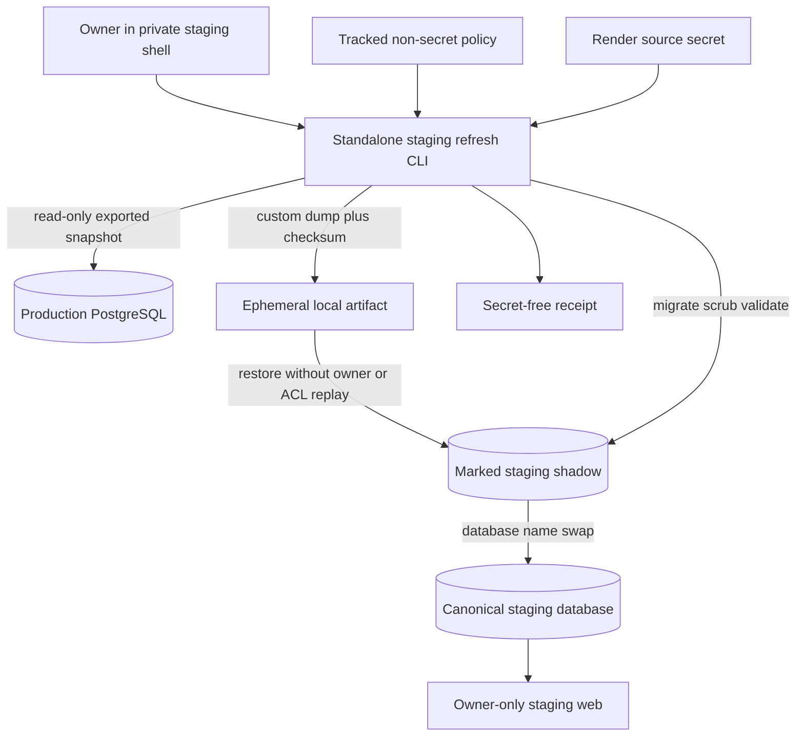
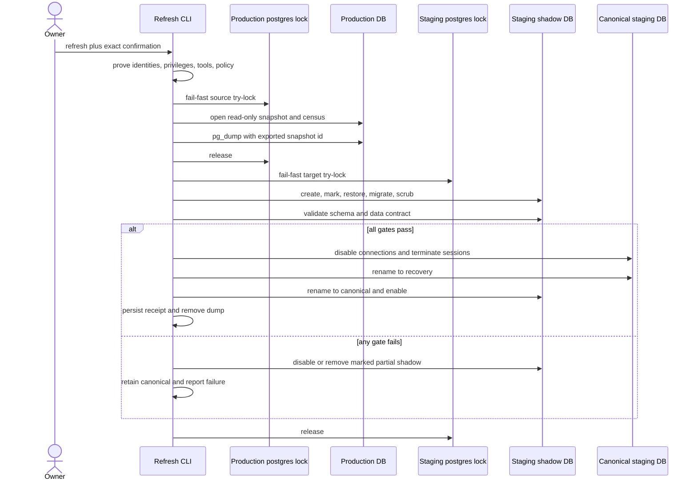
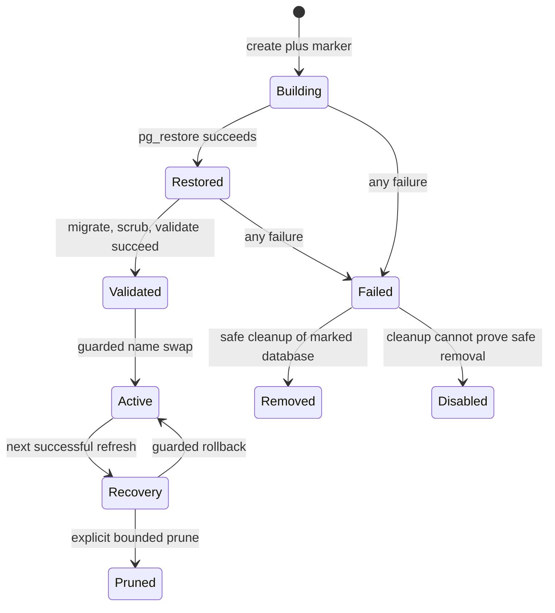
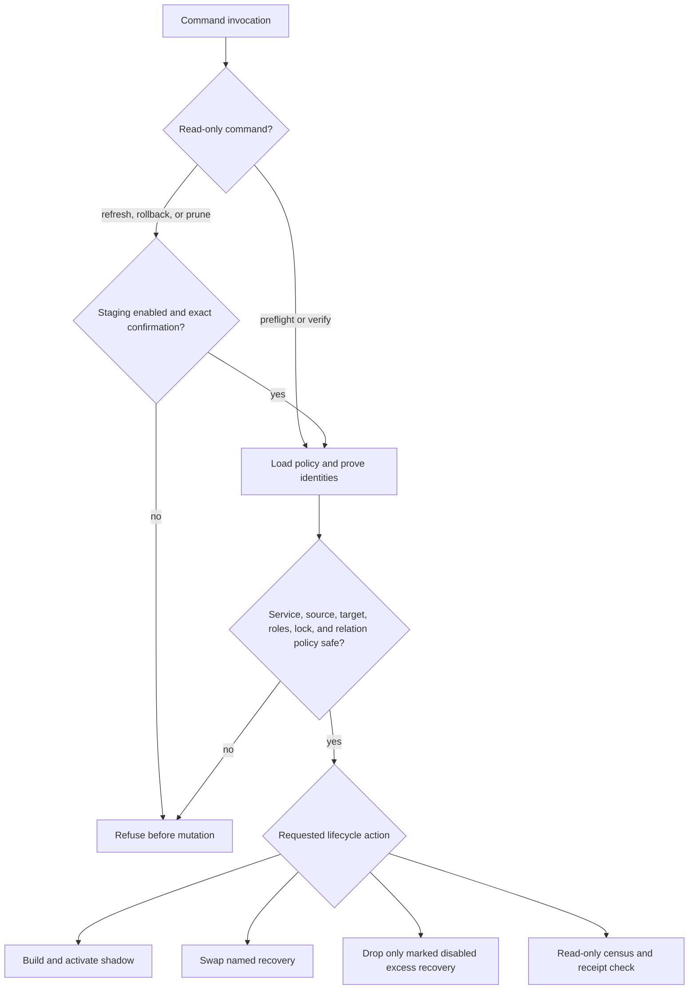
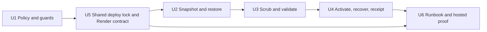

<!-- BEGIN OLLIJA DELIVERY GUIDE -->
## Ollija Delivery Guide

This block is generated guidance. Do not edit it directly. Correct durable facts in `.ollija/project.yaml` or this template, then rerun `./bin/ollija annotate-plan`. Put a user-directed exception in the editable Delivery Exceptions section below.

### Resolved locations

- Authoritative host: `fuchitalee`
- Authoritative repository: `/Users/fuchitalee/development/pushin-weight-v2`
- Ollija release worktree area: `/Users/fuchitalee/development/pushin-weight-v2/.worktrees`
- Active worktree: `/Users/fuchitalee/development/pushin-weight-v2/.worktrees/staging-data-refresh`
- Plan: `/Users/fuchitalee/development/pushin-weight-v2/.worktrees/staging-data-refresh/docs/plans/2026-08-27-014708-staging-data-refresh-plan.md`
- Change: `staging-data-refresh-2026-08-27-014708`
- Branch: `staging-data-refresh`
- Staging branch and blueprint: `staging`, `/Users/fuchitalee/development/pushin-weight-v2/.worktrees/staging-data-refresh/render-staging.yaml`
- Production branch and blueprint: `main`, `/Users/fuchitalee/development/pushin-weight-v2/.worktrees/staging-data-refresh/render.yaml`
- Staging URL: `https://pushinweight-staging-web.onrender.com`
- Production URL: `https://pushinweight-web.onrender.com`

### Placement

This worktree is inside the Ollija release worktree area. Reuse it for the whole change. Do not create a second worktree or plan for this branch.

### Delivery scope

- Workflow: `plan`
- Delivery target: `production`
- Owner selection recorded: `true`

1. Complete implementation and the plan's verification contract.
2. Run the configured focused checks:
   - `pytest tests/ollija`
3. The parent workflow commits only this plan's changes, pushes the feature branch, and records the candidate SHA.
4. Fetch the remote staging lane: `git fetch origin refs/heads/staging`.
5. Require the unchanged candidate SHA to be a fast-forward of that fetched remote ref, then push the exact candidate SHA to `refs/heads/staging` with the server-enforced fast-forward command `git push origin <candidate-sha>:refs/heads/staging`.
6. Verify the remote staging ref resolves to the candidate SHA and the Render deployment for `pushinweight-staging-web` reports that same SHA.
7. Run staging checks. Stop here if they fail.
8. Only after staging passes, fetch the remote production lane: `git fetch origin refs/heads/main`.
9. Require the same unchanged candidate SHA to be a fast-forward of that fetched remote ref, then push the exact candidate SHA to `refs/heads/main` with the server-enforced fast-forward command `git push origin <candidate-sha>:refs/heads/main`.
10. Verify the remote production ref resolves to the candidate SHA and the Render deployment for `pushinweight-web` reports that same SHA before reporting completion.
11. After step 10 succeeds, perform worktree cleanup as the final filesystem action:
    - From `/Users/fuchitalee/development/pushin-weight-v2`, require `/Users/fuchitalee/development/pushin-weight-v2/.worktrees/staging-data-refresh` to remain registered, clean, unlocked, and at the verified candidate SHA. If any guard fails, retain it and report the reason.
    - Run `git -C /Users/fuchitalee/development/pushin-weight-v2 worktree remove /Users/fuchitalee/development/pushin-weight-v2/.worktrees/staging-data-refresh` without `--force`.
    - Preserve the local and remote feature branches. Continue final reporting from the authoritative repository root.

### Failure handling

- Never promote a staging candidate whose automated checks failed.
- Implementation failures return to the parent implementation workflow for diagnosis, correction, recommit, and restaging.
- SSH, shell, environment, or multi-machine failures use the repository infra/multi-machine skill first.
- The change ledger is advisory; do not validate or enforce it.
- Never force-remove a worktree. Retain staging-only, failed, dirty, locked,
  noncanonical, or candidate-mismatched worktrees for diagnosis or later
  delivery.
- Do not run an endless retry loop or start a persistent Ollija process.
<!-- END OLLIJA DELIVERY GUIDE -->

## Delivery Exceptions

None.

# Staging Data Refresh Mechanism - Plan

## Goal Capsule

- **Objective:** The owner can replace stale staging data with a current, representative production snapshot without exposing production access, copying private identity state, or activating an unverified database.
- **Means:** Add an operator-run staging refresh tool that creates a consistent logical dump through a read-only production credential, restores and sanitizes a non-serving staging shadow database, validates it, and performs a guarded same-instance name swap (KTD1-KTD7).
- **Authority:** The Product Contract owns observable behavior. The Planning Contract owns implementation choices. The generated Ollija Delivery Guide owns Git and environment promotion order. Runtime identity and safety checks may stop execution but may not relax this plan.
- **Execution profile:** Code is delivered through staging and production. Data mutation is restricted to the isolated staging PostgreSQL instance.
- **Stop conditions:** Stop before target mutation when source identity, read-only posture, target identity, service identity, tool version, free space, table policy, or concurrency ownership cannot be proven. Stop before activation when migrations, scrubbing, validation, or receipt persistence fails.
- **Tail ownership:** The implementation workflow owns staging deployment, one hosted refresh, staging evidence, unchanged-SHA production promotion, and final CI/PR health.

---

## Product Contract

### Summary

Add a current production-to-staging refresh path outside Ollija. The path is operator-triggered, fail-closed, independently testable, and safe to retry because the serving staging database changes only after a verified shadow restore.

### Problem Frame

The isolated Render staging database is healthy but stale: its newest post is from 2026-08-18 while production is current through 2026-08-27. The home page defaults to a one-day window, so the stale copy makes staging appear empty and prevents meaningful validation.

The previous hosted refresh lived inside a stateful Ollija release engine. That engine was intentionally retired. Ollija now annotates plans only, so restoring its former database commands would violate the current tool boundary.

### Key Decisions

- **Independent refresh ownership** (session-settled: user-directed — chosen over restoring the retired stateful Ollija refresh: Ollija must remain an annotator-only tool). Governs R1, R2, R13.
- **Production delivery target** (session-settled: user-directed — chosen over stopping after a staging-only delivery: the owner selected production for this LFG run). Governs R14.

### Actors

- A1. The owner initiates refresh, rollback, and pruning from the private staging service shell and reviews the resulting evidence.
- A2. The staging web service runs the refresh tool with an isolated target binding, an explicit enable flag, and a separately provisioned production read credential.
- A3. The production PostgreSQL database serves a transactionally consistent, SELECT-only snapshot and never accepts writes from the refresh path.
- A4. The staging PostgreSQL cluster holds the serving database, build database, shadow database, recovery database, and the shared advisory lock.

### Requirements

**Authority and isolation**

- R1. The refresh runtime must live outside `scripts/ollija` and must not add a new Ollija command, state file, background process, or approval surface.
- R2. The staging web service must remain the only application service bound to the private staging database, with owner-only access and all provider, enqueue, and headline-serving switches disabled.
- R3. A mutating command must require the staging service identity, an explicit enable flag, the expected source and target identities, and an exact operator confirmation; it must refuse any target that matches production.
- R4. The source credential must be a dedicated login role forced to read-only transactions, with schema access plus SELECT only for copied product tables and sequence state; excluded sensitive and operational tables must not be readable through that credential.

**Snapshot and sanitization**

- R5. Each refresh must dump one exported PostgreSQL snapshot and must refuse a source base or partitioned table that is not classified by the committed table-data policy.
- R6. Authentication, sessions, allauth identity data, queued work, enrichment state, harvest/list cursors, applied environment snapshots, and transient narrative attempts must be absent from the candidate database before activation.
- R7. Product data needed to exercise the site must remain representative, including posts, social-media accounts, brands, translations, classifications, and published narrative history.
- R8. The candidate must run current migrations and Django checks, then validate schema state, scrubbed tables, aggregate counts, latest timestamps, translations, classifications, and current published narratives against the exported source census.

**Activation, recovery, and evidence**

- R9. A failed dump, restore, migration, scrub, or validation must leave the serving staging database unchanged and must leave no enabled partial database.
- R10. Activation must keep the canonical `DATABASE_URL` stable by swapping logical database names inside the staging PostgreSQL instance and retaining the displaced database as a disabled recovery point.
- R11. The tool must provide a guarded rollback to the named recovery database and bounded cleanup that never drops an unmarked or active database.
- R12. Refresh, rollback, prune, and deployment migrations must use the same bounded PostgreSQL cluster lock on each affected source or target cluster so schema and database lifecycle critical sections cannot overlap.
- R13. Every command must produce concise secret-free output, and a completed refresh must persist a secret-free receipt outside ephemeral local storage with identities, timestamps, checksum, source/candidate census, scrub results, activation names, and rollback guidance.
- R14. The unchanged candidate SHA must pass staging deployment and hosted refresh verification before promotion to the production branch; the production service must remain unable to execute a refresh.

### Key Flows

- F1. Hosted refresh
  - **Trigger:** A1 runs the mutating refresh command from A2 with the exact confirmation.
  - **Actors:** A1, A2, A3, A4.
  - **Steps:** Preflight proves identities and locks; A3 exports one snapshot; A4 receives a marked shadow; migrations, sanitization, and validation run; the canonical and shadow database names swap; the old canonical database becomes the recovery point; the tool writes a receipt and removes the dump.
  - **Outcome:** Staging serves current, scrubbed data and the previous staging database remains available for bounded rollback.
  - **Covered by:** R3-R13.
- F2. Guarded rollback
  - **Trigger:** A1 identifies a post-cutover staging defect and names the recovery database from the receipt.
  - **Actors:** A1, A2, A4.
  - **Steps:** The tool proves service, target, marker, lock, and exact confirmation; it disables new connections, terminates active sessions, and swaps the canonical and recovery names.
  - **Outcome:** The prior staging database is restored without changing the service database binding, and the failed candidate remains disabled for diagnosis.
  - **Covered by:** R3, R10-R13.

### Acceptance Examples

- AE1. **Covers R3-R5.** Given the command runs on production, with a writable source role, with a source database name mismatch, or with a target that matches production, when preflight runs, then it exits nonzero before creating or modifying a target database and prints no credential material.
- AE2. **Covers R5-R10, R13.** Given a valid staging invocation and a current production snapshot, when refresh succeeds, then staging keeps the same application database URL, serves the verified snapshot, has zero sensitive and queued rows, retains a disabled recovery database, and emits a secret-free receipt.
- AE3. **Covers R8-R10.** Given restore, migration, scrub, or validation fails, when the run exits, then the original canonical staging database remains active and the failed shadow is disabled or removed according to its marker state.
- AE4. **Covers R12.** Given refresh, rollback, or prune owns an affected cluster lock, when a deploy migration starts, then the migration waits only to its bounded deadline outside the critical section; given a deploy migration owns the lock, when a lifecycle command runs, then it fails fast without mutation.
- AE5. **Covers R10-R13.** Given the owner names the receipt's marked recovery database and confirms rollback, when rollback succeeds, then that database becomes canonical and the displaced candidate becomes a disabled recovery database with updated receipt evidence.
- AE6. **Covers R5-R6.** Given production adds a base table that is absent from the committed data policy, when preflight compares relations, then it refuses to dump until the table is explicitly classified.
- AE7. **Covers R14.** Given the same code is deployed to production, when a mutating refresh command runs there, then service and target guards reject it before connecting with target mutation authority.

### Success Criteria

- After the hosted refresh, staging's latest post timestamp is from the same exported snapshot as the receipt and the one-day home view contains representative data.
- The hosted receipt and database census prove that private identity and operational queue tables contain zero rows while product counts stay within the plan's source-to-target validation rules.
- A forced pre-activation failure and the rollback test both prove that recovery does not require changing the Render database binding.

### Scope Boundaries

**In scope**

- One on-demand production-to-staging refresh mechanism, its safety policy, tests, operator documentation, Render configuration, hosted execution, and rollback proof.
- The small migration-lock change required to serialize deploy migrations with refresh cutover.
- Removal of retired refresh environment names from current example configuration.

#### Deferred to Follow-Up Work

- Scheduled or automatic refresh cadence, alerts, and a freshness service-level objective.
- Disabling the retired `ollija_dump` role after a separate consumer audit; the refresh mechanism provisions and uses its own narrower role.
- Automated deletion of unmarked recovery databases created by the retired Ollija workflow.

**Outside this product's identity**

- Reintroducing stateful Ollija execution, approval, release, or refresh behavior.
- Writing to production, copying production secrets into tracked files or receipts, or binding staging web traffic to the production database.
- Making staging public, enabling external provider calls, or altering production content as part of refresh.

### Sources

- Current topology and guards: `render-staging.yaml`, `render.yaml`, `project/staging.py`, `tests/ollija/test_render_staging_topology.py`, and `tests/ollija/test_staging_access.py`.
- Current deploy migration path: `build.sh` and `scripts/render_migrate.py`.
- Current data model: `core/models.py`, `core/migrations/0014_expand_trend_narrative.py`, and `docs/reference/headline-trend-narratives.md`.
- Retired implementation archaeology: commits `76ceeb9`, `fba9cfd`, `70e4019`, and `62a50ad`; use their safety invariants, not their Ollija package boundary.
- Existing recovery guidance: `docs/solutions/data-migration/restore-large-pg-dump-to-render-via-s3-multipart.md` and `docs/solutions/operations/render-shadow-restore-and-cutover.md`.
- PostgreSQL 18 dump, restore, database rename, and advisory lock semantics: [pg_dump](https://www.postgresql.org/docs/18/app-pgdump.html), [pg_restore](https://www.postgresql.org/docs/18/app-pgrestore.html), [ALTER DATABASE](https://www.postgresql.org/docs/current/sql-alterdatabase.html), and [advisory locks](https://www.postgresql.org/docs/18/functions-admin.html).
- Render private connectivity, Blueprint secret behavior, and single-variable API updates: [PostgreSQL connections](https://render.com/docs/postgresql-creating-connecting), [private network](https://render.com/docs/private-network), [Blueprint specification](https://render.com/docs/blueprint-spec), [environment variables](https://render.com/docs/environment-variables), and [update environment variable](https://api-docs.render.com/reference/update-env-var).

---

## Planning Contract

### Key Technical Decisions

- KTD1. **Create a standalone operations package and executable.** Implement the mechanism under `scripts/staging_refresh` with `bin/refresh-staging-data` as its operator entry point. It may share ordinary project dependencies but must not import `scripts.ollija` (R1).
- KTD2. **Commit exact non-secret policy and inject only the source secret.** A tracked policy names the expected Render service ID and name, normalized source and target host/database tuples, production deny tuples, relation classifications, scrub rules, validation modes, storage budget, and marker prefix. Runtime checks compare both Render service metadata and database-reported identities. `STAGING_REFRESH_SOURCE_DATABASE_URL` remains an untracked Render secret; target authority comes only from the service's existing `DATABASE_URL` (R2-R5).
- KTD3. **Export one synchronized custom-format snapshot.** Hold a read-only repeatable-read transaction, export its snapshot, collect the source census from that transaction, and pass the exported identifier to the PostgreSQL 18 `pg_dump` snapshot option. Exclude classified sensitive and operational table data at dump time, write the artifact with mode `0600`, compute SHA-256, and restore with owner and privilege replay disabled (R4-R7).
- KTD4. **Use an exhaustive relation policy with defense-in-depth scrubbing.** Fail on every unclassified source base or partitioned table. Restore product and schema data, then truncate sensitive/operational tables again, rewrite `django_site` for staging, and retain only published or superseded narrative rows. Preserve their constraint-valid terminal ledger metadata (R5-R8).
- KTD5. **Restore and validate a marked non-serving logical database.** Create the shadow on the staging instance, mark it with a database comment before restore, run current migrations and checks against its URL, and validate it independently. Never migrate or restore into the canonical staging name (R8-R10).
- KTD6. **Activate by same-instance logical name swap with a bounded cutover.** Disable new connections, terminate sessions, rename canonical to a timestamped recovery name, rename shadow to canonical, and re-enable only the new canonical database under a 30-second administration-statement deadline. If the second rename fails or times out, immediately rename the recovery database back to canonical and re-enable it; any state that cannot be repaired automatically stops with both object identities and permitted manual action recorded (R9-R11).
- KTD7. **Coordinate every critical section on each cluster's administration database.** `scripts/render_migrate.py` acquires the shared advisory lock on the current environment's `postgres` database with a 15-minute statement deadline. Refresh fail-fast acquires the source-cluster lock for snapshot export and dump, releases it, then fail-fast acquires the target-cluster lock from shadow creation through cleanup or activation. Rollback and prune fail-fast acquire the target lock. Sequential acquisition prevents cross-cluster deadlock while blocking production source DDL and staging target DDL at the relevant phases (R12).
- KTD8. **Persist evidence in database metadata and make secrets impossible to serialize.** Receipt fields are allowlisted typed values rather than redacted arbitrary payloads. Store the compact receipt in the canonical and recovery database comments, emit the same JSON to Render logs, and treat any local receipt file as a convenience copy only. Omit connection strings and subprocess environments, remove the dump in a guaranteed cleanup path, and remove stale mechanism-owned artifacts during the next preflight (R13).
- KTD9. **Expose explicit lifecycle commands and typed database identifiers.** `preflight`, `refresh`, `verify`, `rollback`, and `prune` share the same policy and guards. Each mutating command requires an exact policy-derived confirmation string containing its action and source/target or recovery identity; a generic yes response never authorizes mutation. `refresh` is the only forward mutation path; `rollback` and `prune` accept only receipt-derived names that match the policy grammar. SQL values remain parameterized and identifiers use the database driver's identifier composition (R3, R9-R13).

### High-Level Technical Design

The diagrams are directional design guidance. The Product Contract and KTDs remain authoritative.

**Component and data-flow topology**



**Refresh protocol**



**Database lifecycle**



**Command and guard surface**



### Output Structure

```text
bin/
  refresh-staging-data
config/
  staging_refresh.yaml
scripts/
  database_lock.py
  staging_refresh/
    __init__.py
    __main__.py
    cli.py
    database.py
    policy.py
    receipt.py
tests/
  test_database_lock.py
  staging_refresh/
    test_cli.py
    test_database.py
    test_policy.py
    test_receipt.py
docs/
  operations/
    staging-data-refresh.md
```

### Assumptions

- The refresh remains an on-demand owner operation launched through the private staging service shell; no schedule or freshness alert is added in this change.
- A dedicated `staging_refresh_reader` role is provisioned before the hosted run. It receives CONNECT on the source and its `postgres` administration database, USAGE on the application schema, SELECT on copied product tables and required sequences, only the minimum non-data privilege required to include excluded-table schema, and `default_transaction_read_only=on`.
- The source secret uses a same-region Render connection endpoint reachable from staging. Provisioning verifies the resolved host rather than transforming a hostname by convention.
- The tracked target capacity matches Render's current 15 GB staging disk. Hosted preflight compares it with current Render metadata, requires a 20% reserve after the existing databases plus one projected shadow, and separately requires local ephemeral space of at least twice the source database size.
- The target role retains its currently verified `CREATEDB` capability. The tool does not grant itself privileges.
- Keep one marked recovery database after success. Prune only additional databases created by this mechanism; leave the existing unmarked legacy recovery databases for manual review.
- Clearing staging users and sessions is acceptable because the allowlisted owner can authenticate again through staging's separate OAuth client.

### Implementation Constraints

- Use PostgreSQL 18 client tools against the PostgreSQL 18 source and target.
- Pass connection fields through a sanitized child environment. Never put a URL or password in process arguments, logs, exceptions, receipts, tests, or tracked fixtures.
- Require TLS for the production source connection and fail preflight when the negotiated connection is not encrypted.
- Treat tables, views, and sequences by relation kind. The exhaustive data policy applies to base and partitioned tables; schema-only views such as `trend_narrative_versions` must remain valid after restore.
- Use serial restore with `--exit-on-error`, `--no-owner`, and `--no-privileges`. The disposable shadow is the transaction boundary for restore failure.
- Use positive marker recognition for every cleanup or rollback target. A prefix-shaped database name without the expected comment is unsafe.
- Preserve the staging Blueprint's single service, single private database binding, owner-only middleware, and provider-off assertions.

### System-Wide Impact

- **Application availability:** Cutover terminates staging database sessions and can fail an in-flight owner request. The application database name and Render binding stay stable, so new requests reconnect without a service configuration change.
- **Deploy path:** `build.sh` continues to invoke `scripts/render_migrate.py`. That entry point gains the bounded current-cluster lock before its existing database-local migration lock; shadow migrations run directly under the refresh-owned target lock and must not re-enter the deploy wrapper.
- **Authentication boundary:** Every copied user, session, admin log, allauth identity, email, and token row is absent. Staging's separate allowlist and OAuth client recreate only the owner identity after refresh.
- **Narrative lifecycle:** Published and superseded narratives remain product history. Nonterminal, failed, abandoned, suppressed, checked, claimed, or retry-eligible attempts do not become staging work. The compatibility view must remain valid after migration.
- **Operational state:** Harvest cursors, backlog windows, enrichment leases, call-state rows, list-sync state, and applied configuration snapshots restart empty so staging cannot resume production work.
- **Observability:** The mechanism emits lifecycle progress and one typed receipt, not source content or environment dumps. Render deploy health, independent SQL census, and browser behavior remain the external evidence surfaces.

### Sequencing



### Alternative Approaches Considered

- **Restore the retired Ollija refresh:** Rejected because it violates the annotator-only boundary and recreates stateful release behavior the repository intentionally removed.
- **Restore directly into canonical staging:** Rejected because restore, migration, or validation failure would corrupt the serving target and eliminate a trustworthy rollback point.
- **Switch the Render `DATABASE_URL` binding to a separate database resource:** Rejected because Blueprint and dashboard state can drift, connection-string updates can redeploy services, and the current staging instance already supports safe logical database swaps.
- **Physical backup or streaming replication:** Rejected because the staging tier and on-demand workflow do not justify persistent replication infrastructure, and logical dump policy provides the required table-data exclusions.
- **Copy through application ORM queries:** Rejected because it would be slower, harder to make transactionally consistent across all relations, and more likely to drift from schema changes.

### Risks and Mitigations

| Risk | Mitigation | Proof |
|---|---|---|
| Source credential can write or target resolves to production | Check transaction read-only setting, role capabilities, host/database identity, and production denylist before target mutation | Guard unit tests and hosted preflight receipt |
| Sensitive or newly added data crosses environments | Exclude classified table data during dump, scrub again after restore, and fail on unclassified source tables | Manifest drift test and zero-row validation |
| Production or staging migration races snapshot, cutover, rollback, or prune | Use KTD7's phased cluster locks and bounded deploy wait, then test the real `build.sh` migration call path | Concurrency and call-chain tests |
| Partial database-name swap strands staging | Record each transition, reconcile names and markers on failure, and keep one side disabled until ownership is unambiguous | Fault-injection activation tests and hosted rollback |
| Dump or shadow exhausts service or database storage | Check local space and the Render-verified 15 GB target budget with a 20% reserve before creation, then guarantee artifact cleanup | Preflight boundary test and hosted run metrics |
| A receipt disappears on service restart | Store the allowlisted receipt in database comments and emit it to Render logs; never make the ephemeral file authoritative | Receipt recovery and restart tests |
| Receipt or exceptions expose credentials | Construct evidence from allowlisted scalar fields and test representative failure strings | Secret-leak regression tests |
| Product snapshot is technically restored but unusable | Validate source-to-target counts and timestamps, then exercise the one-day owner-only home page | Data validation tests and browser staging proof |

### Operational Rollout Notes

1. **Provision:** Create the dedicated source role with the grants in R4, require TLS, and set its URL through Render's single-variable API before deploying the candidate. Do not use the bulk replacement endpoint. Confirm only variable presence and the preflight identity/privilege result, never its stored value.
2. **Stage:** Push the candidate through the generated staging lane and require Render to report the candidate SHA with a healthy deploy before any refresh command.
3. **Preflight go/no-go:** Require PostgreSQL 18 tools, exact service/source/target identities, TLS, narrow read-only source privileges, table-policy completeness, Render capacity metadata, local and target storage margins, no competing cluster lock, and an unchanged canonical target census. Any mismatch is no-go before database creation.
4. **Refresh go/no-go:** Activate only when dump checksum, restore, current migrations, scrub transaction, schema validation, exact preserved-table counts, latest timestamps, relational invariants, and receipt construction all pass. Otherwise keep canonical staging unchanged.
5. **Post-cutover:** Recover the receipt from the canonical database comment, run read-only canonical census immediately, verify the one-day owner view, confirm anonymous redirect and provider-off state, and record the recovery name. A failed check invokes guarded rollback or retains both databases for diagnosis; it never promotes production.
6. **Production promotion:** Promote the unchanged candidate SHA only after staging proof passes. Verify production deploy health and refresh refusal; do not copy the staging source secret or enable flag to production.
7. **Retention:** Keep the one marked recovery named by the receipt until the next successful refresh. Prune only excess marked databases after independent verification; legacy unmarked recoveries remain untouched.
8. **Credential lifecycle:** Rotate the dedicated source password through a no-log path, update only the one staging secret, require preflight to pass with the replacement, then revoke the previous credential. Do not record password age or material in the receipt.

---

## Implementation Units

### U1. Establish the independent policy, identity guards, and CLI boundary

- **Goal:** Provide a standalone command surface that can prove whether a refresh invocation is authorized before mutation.
- **Requirements:** R1-R5, R13-R14; independent refresh ownership and production delivery Key Decisions.
- **Dependencies:** None.
- **Files:** `bin/refresh-staging-data`, `config/staging_refresh.yaml`, `scripts/staging_refresh/__init__.py`, `scripts/staging_refresh/__main__.py`, `scripts/staging_refresh/cli.py`, `scripts/staging_refresh/policy.py`, `.env.example`, `tests/staging_refresh/test_cli.py`, `tests/staging_refresh/test_policy.py`, `tests/ollija/test_repository_hygiene.py`.
- **Approach:**
  1. Add the executable wrapper and lifecycle subcommands from KTD9 without importing Ollija.
  2. Load KTD2 policy with strict schema validation and explicit relation classifications.
  3. Parse source and target URLs without logging them, prove both Render and database-reported identity tuples, inspect role capabilities and read-only defaults, require TLS, and apply the production target denylist.
  4. Require the explicit enable flag and KTD9's action-specific confirmation string before any mutating database call.
- **Patterns to follow:** `bin/ollija` for worktree-safe Python resolution; `scripts/ollija/config.py` only for strict configuration parsing style, not as a runtime dependency; `tests/ollija/test_repository_hygiene.py` for boundary and credential scanning.
- **Test scenarios:**
  - Covers AE1. A valid staging identity with a read-only source and expected target passes preflight without a mutating call.
  - Covers AE1. Production service identity, a writable source, a source mismatch, a target mismatch, or a production target each fails before the fake database adapter records mutation.
  - A source role that can read an excluded authentication or operational table fails least-privilege preflight even when it is transaction-read-only.
  - A generic yes response, substring match, malformed database name, or replayed confirmation for another action fails before mutation.
  - Covers AE6. An unknown base table fails policy comparison and names only the relation.
  - Covers AE7. Production deployment settings reject every mutating subcommand even when a source secret is present.
  - A URL-bearing subprocess exception is converted to a typed secret-free failure.
- **Verification:** Focused tests prove the independent package boundary, complete guard matrix, strict policy loading, secret hygiene, and absence of new Ollija runtime commands.

### U2. Export a consistent snapshot and restore a marked shadow database

- **Goal:** Create a verifiable non-serving candidate without changing canonical staging.
- **Requirements:** R4-R5, R7, R9-R10, R13.
- **Dependencies:** U1, U5.
- **Files:** `scripts/staging_refresh/database.py`, `scripts/staging_refresh/receipt.py`, `tests/staging_refresh/test_database.py`, `tests/staging_refresh/test_receipt.py`.
- **Approach:**
  1. Acquire KTD7's refresh lock and open KTD3's exported read-only snapshot for both census and dump.
  2. Verify PostgreSQL client versions, KTD3's snapshot binding, local space, KTD2's target capacity budget, artifact permissions, table policy, and source checksum inputs before creating the target.
  3. Create a uniquely named shadow in A4, add a building marker comment, and restore serially with owner and ACL replay disabled.
  4. On failure, preserve canonical staging and clean only the positively marked shadow according to KTD5.
- **Execution note:** Start with subprocess and database fakes that characterize command ordering and prove no target mutation occurs before all source-side gates pass.
- **Patterns to follow:** `scripts/ops/shadow_restore.sh` for checksum and no-clobber intent; historical commit `fba9cfd` for exported-snapshot and same-instance shadow invariants.
- **Test scenarios:**
  - Covers AE2. A valid exported snapshot produces one checksum and restores into the expected marked shadow with serial, no-owner, no-ACL flags.
  - Covers AE3. Dump failure, checksum mismatch, restore failure, and operator interruption leave canonical untouched and remove or disable only the marked candidate.
  - An older PostgreSQL client or insufficient free space fails before target database creation.
  - Child environments contain only required libpq values and captured command/error output never contains source or target credentials.
  - Source census and dump both reference the same exported snapshot identifier.
  - Existing target database sizes plus the projected shadow and required reserve exceeding the Render-verified capacity fails before shadow creation.
- **Verification:** Adapter-level tests prove snapshot cohesion, exact side-effect ordering, shadow-only restore, safe cleanup, artifact mode and checksum, and secret-free failures.

### U3. Sanitize and validate the candidate data contract

- **Goal:** Ensure the shadow contains representative product data but no identity or active operational state.
- **Requirements:** R5-R9, R13.
- **Dependencies:** U2.
- **Files:** `config/staging_refresh.yaml`, `scripts/staging_refresh/database.py`, `tests/staging_refresh/test_database.py`.
- **Approach:**
  1. Run current migrations and Django deploy checks against the shadow URL without changing process-global production settings.
  2. Apply KTD4's explicit scrub transaction, reset sequences where needed, and rewrite the staging site record.
  3. Compare migration leaves, relation kinds, required columns, source/candidate counts, latest timestamps, translation coverage, classification joins, current narrative uniqueness, and scrubbed zero-row conditions.
  4. Mark the database validated only after every result is added to the typed receipt.
- **Execution note:** Add the source and candidate census contract before implementing the scrub so every destructive statement has a named postcondition.
- **Patterns to follow:** Django migration and model metadata in `core/models.py`; narrative invariants in `core/migrations/0014_expand_trend_narrative.py` and `tests/test_trend_narrative_schema_expansion.py`.
- **Test scenarios:**
  - Covers AE2. Representative posts, brands, translated fields, classifications, and published narratives pass validation while all sensitive and operational tables are empty.
  - Covers AE3. A missing migration, invalid view, stale latest timestamp, excessive count drift, orphaned classification, untranslated required field, or duplicate current narrative blocks activation.
  - Covers AE6. A newly introduced sensitive table fails the exhaustive policy instead of defaulting to copied data.
  - Transient and retry-eligible narrative rows are removed while published and superseded history remains internally consistent with its database constraints.
  - Scrub failure rolls back its transaction and leaves the database marked non-serving.
- **Verification:** Database-backed tests prove every scrub postcondition and every validation blocker, including the `trend_narrative_versions` view after migrations.

### U4. Add guarded activation, rollback, pruning, and durable receipts

- **Goal:** Switch staging to the validated candidate with a bounded, auditable recovery path.
- **Requirements:** R9-R13.
- **Dependencies:** U3.
- **Files:** `scripts/staging_refresh/database.py`, `scripts/staging_refresh/cli.py`, `scripts/staging_refresh/receipt.py`, `tests/staging_refresh/test_cli.py`, `tests/staging_refresh/test_database.py`, `tests/staging_refresh/test_receipt.py`.
- **Approach:**
  1. Implement KTD6 as a recorded state transition with connection disabling, backend termination, database renames, marker updates, and reconciliation.
  2. Persist KTD8's receipt in both database comments and Render logs only after the new canonical database is enabled and independently verified.
  3. Implement rollback against one exact marked recovery database under the target lock and leave the displaced candidate disabled for diagnosis.
  4. Implement prune under the target lock with retention from policy, positive marker checks, active-database refusal, and no automatic handling of legacy unmarked recoveries.
- **Test scenarios:**
  - Covers AE2. Successful activation preserves the canonical database name, marks the prior canonical as recovery, enables only the new canonical, and emits the complete receipt.
  - Covers AE3. Fault injection after either rename reconciles a single active canonical or returns a precise manual recovery state without dropping either database.
  - Covers AE5. Rollback swaps only the receipt-named marked recovery and refuses wrong, active, unmarked, or ambiguous databases.
  - Prune retains the configured recovery count and refuses canonical, current candidate, unmarked legacy, and prefix-only impostor databases.
  - Rollback and prune fail before mutation when a deploy migration or another lifecycle command owns the target lock.
  - Receipt serialization rejects arbitrary URLs, passwords, environment mappings, and unknown fields; verification recovers the receipt from database comments after local files are absent.
  - A stale mechanism-owned dump from a killed prior process is removed on the next preflight without touching unrelated files.
- **Verification:** State-machine tests cover every activation edge, rollback and prune guards, atomic receipt write, retention, and partial-cutover diagnostics.

### U5. Share the cluster lock and declare the staging runtime contract

- **Goal:** Prevent deploy migrations from racing refresh and give staging only the configuration it needs.
- **Requirements:** R2-R4, R12, R14.
- **Dependencies:** U1.
- **Files:** `scripts/database_lock.py`, `scripts/render_migrate.py`, `render-staging.yaml`, `tests/test_database_lock.py`, `tests/ollija/test_staging_access.py`, `tests/ollija/test_render_staging_topology.py`, `.env.example`.
- **Approach:**
  1. Add the shared KTD7 lock helper, move the deploy migration lock connection to the current cluster's `postgres` database, and retain the existing Django migration lock around `migrate`.
  2. Declare the non-secret refresh enable and policy values in the staging Blueprint and add the source URL as `sync: false`.
  3. Keep production Blueprint free of the enable flag and source secret, and preserve all existing isolation and provider-off assertions.
  4. Replace retired refresh example variables with the generic source secret contract.
- **Execution note:** Test the actual `main` call chain so production code cannot bypass the new cluster-lock connection through a mocked helper-only path.
- **Patterns to follow:** Existing `run_migrations` cleanup behavior and topology assertions in `tests/ollija/test_staging_access.py` and `tests/ollija/test_render_staging_topology.py`.
- **Test scenarios:**
  - Covers AE4. Source refresh ownership makes a production deploy wait, target lifecycle ownership makes a staging deploy wait, and deploy ownership makes the corresponding lifecycle command fail fast before mutation.
  - A deploy wait that reaches 15 minutes exits nonzero with a retryable operator message and releases every acquired connection; refresh never waits for a deploy lock.
  - Migration success and failure both release cluster and migration locks in reverse acquisition order.
  - The `main` entry point derives an admin-database connection without logging the application URL and invokes `migrate` only while locked.
  - Covers AE7. Staging Blueprint has exactly one sync-false source secret and enable flag; production Blueprint has neither and retains disjoint bindings.
- **Verification:** Focused lock and topology suites prove the real build path, failure cleanup, staging-only configuration, and unchanged owner/provider boundaries.

### U6. Document and execute the hosted refresh and recovery proof

- **Goal:** Leave an operator-repeatable runbook and prove the mechanism on the live isolated staging environment before production promotion.
- **Requirements:** R2-R14; production delivery Key Decision.
- **Dependencies:** U4, U5.
- **Files:** `docs/operations/staging-data-refresh.md`, `docs/deploy/render.md`, `docs/production-runbook.md`.
- **Approach:**
  1. Document dedicated-role creation and rotation, Render's single-variable update path, preflight, refresh, verification, rollback, pruning, interruption handling, database-comment receipt recovery, and manual legacy-recovery review.
  2. Deploy the candidate to staging through the generated Ollija guide and provision the source secret without reading it back into logs.
  3. Run preflight and one refresh, compare the hosted receipt with read-only source/canonical queries, and exercise the one-day owner-only home page.
  4. Perform a rollback rehearsal only if it can be completed without losing the fresh candidate; otherwise prove rollback through fault-injection tests and retain the recovery named in the hosted receipt.
  5. Promote the unchanged candidate SHA to production only after staging evidence passes, then verify production remains healthy and refresh-inert.
- **Test scenarios:**
  - Covers AE2. Hosted staging shows current representative data, zero scrubbed state, a valid current narrative per window, and an owner-only one-day home view with content.
  - Covers AE5. The rollback procedure identifies exactly one marked recovery and either completes a reversible rehearsal or records why the non-mutating automated proof is the safe evidence.
  - Covers AE7. A production preflight reports refresh disabled without target mutation or secret disclosure.
- **Verification:** The runbook matches observed CLI output; the staging service and database receipt agree; browser evidence covers the default home window and access boundary; production deploy health and guard output match the unchanged candidate SHA.

---

## Verification Contract

| Gate | Commands or evidence | Units | Passing signal |
|---|---|---|---|
| Refresh behavior | `pytest tests/staging_refresh -q` | U1-U4 | Guard, snapshot, scrub, validation, activation, rollback, prune, and receipt scenarios pass. |
| Shared lock behavior | `pytest tests/test_database_lock.py tests/ollija/test_staging_access.py -q` | U4-U5 | Source/target phase locks, lifecycle locking, bounded deploy waits, and real migration entry-point cleanup pass. |
| Deployment and Ollija boundary | `pytest tests/ollija/test_render_staging_topology.py tests/ollija/test_staging_access.py tests/ollija/test_repository_hygiene.py -q` | U1, U5 | Topology remains isolated and provider-off; real migration lock path and annotator-only boundary pass. |
| Full regression | `pytest -q` | U1-U6 | No existing application, migration, pipeline, or Ollija regression. |
| Python quality | `ruff check scripts/database_lock.py scripts/staging_refresh scripts/render_migrate.py tests/test_database_lock.py tests/staging_refresh tests/ollija/test_staging_access.py tests/ollija/test_render_staging_topology.py` | U1-U5 | No lint errors in affected Python surfaces. |
| Django integrity | `python manage.py makemigrations --check --dry-run` and `python manage.py check --deploy` | U3, U5 | No model drift and no new deploy-check failure. |
| Diff hygiene | `git diff --check` and tracked credential scan | U1-U6 | No whitespace defects, secrets, generated dumps, receipts, or unrelated changes enter the candidate. |
| Hosted preflight | Staging `preflight` plus read-only production and staging census | U6 | Identities, privileges, PostgreSQL 18 tools, free space, relation policy, and cluster lock pass before mutation. |
| Hosted refresh | Staging `refresh` followed by `verify` and independent SQL census | U6 | Canonical staging is current and scrubbed, the recovery is disabled, receipt checksum and counts agree, and the dump is absent. |
| Browser evidence | Owner and unauthenticated staging sessions on the default one-day home view | U6 | Owner sees current content; anonymous access redirects to login; provider-off state remains unchanged. |
| Production promotion | Ollija guide SHA checks, Render deployment state, health endpoint, and production refresh refusal | U6 | The same candidate SHA is healthy in production and cannot mutate a refresh target. |

`release:validate` is not configured in this repository. The full regression, Django integrity, hosted refresh, browser, and unchanged-SHA promotion gates replace it for this change.

---

## Definition of Done

- U1 is done when every unauthorized identity and configuration fails before mutation, the independent executable works from a linked worktree, and Ollija remains annotation-only.
- U2 is done when one source snapshot drives both census and dump, a marked shadow restores without owner/ACL replay, and every pre-activation failure preserves canonical staging.
- U3 is done when the exhaustive policy, sanitization transaction, migrations, Django checks, and representative-data validations pass against a database-backed fixture.
- U4 is done when activation, partial-cutover reconciliation, rollback, pruning, and secret-free receipts satisfy the lifecycle test matrix.
- U5 is done when deploy migrations and all lifecycle mutations share bounded source/target cluster locks through their real entry points and staging-only configuration preserves every existing boundary.
- U6 is done when the candidate is deployed to staging, one current refresh completes, independent database and browser evidence passes, and the unchanged SHA is promoted and healthy in production.
- All automated gates in the Verification Contract pass without suppressing unrelated failures.
- The final diff contains no credentials, dump files, runtime receipts, dead-end experiments, retired Ollija runtime, or unrelated user work.
- The operator documentation names the active recovery database, exact rollback guard, bounded pruning rule, and secret-safe failure procedure.
