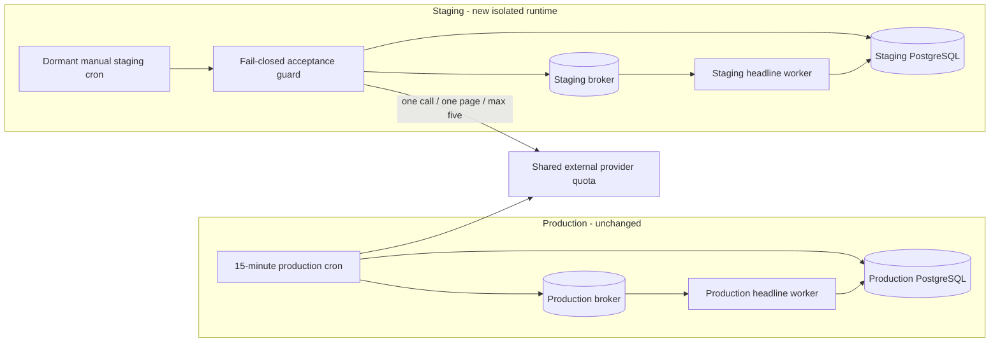
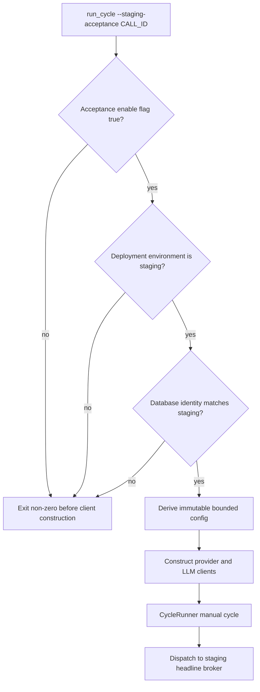
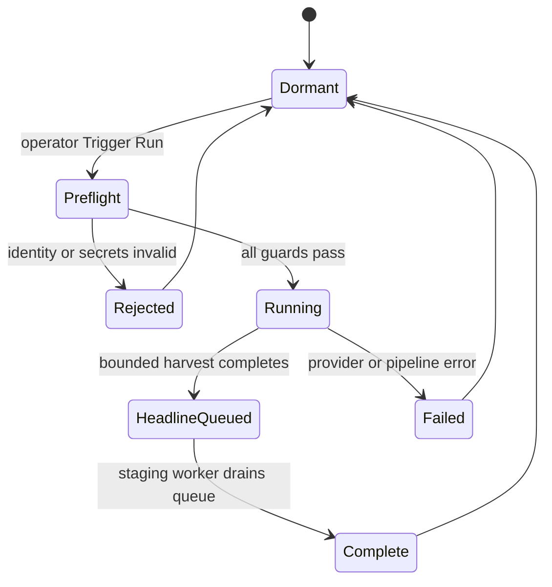

<!-- BEGIN OLLIJA DELIVERY GUIDE -->
## Ollija Delivery Guide

This block is generated guidance. Do not edit it directly. Correct durable facts in `.ollija/project.yaml` or this template, then rerun `./bin/ollija annotate-plan`. Put a user-directed exception in the editable Delivery Exceptions section below.

### Resolved locations

- Authoritative host: `fuchitalee`
- Authoritative repository: `/Users/fuchitalee/development/pushin-weight-v2`
- Ollija release worktree area: `/Users/fuchitalee/development/pushin-weight-v2/.worktrees`
- Active worktree: `/Users/fuchitalee/development/pushin-weight-v2/.worktrees/feat/staging-harvester-isolation`
- Plan: `/Users/fuchitalee/development/pushin-weight-v2/.worktrees/feat/staging-harvester-isolation/docs/plans/2026-08-27-073628-main-plan.md`
- Change: `staging-harvester-isolation-2026-08-27-073628`
- Branch: `feat/staging-harvester-isolation`
- Staging branch and blueprint: `staging`, `/Users/fuchitalee/development/pushin-weight-v2/.worktrees/feat/staging-harvester-isolation/render-staging.yaml`
- Production branch and blueprint: `main`, `/Users/fuchitalee/development/pushin-weight-v2/.worktrees/feat/staging-harvester-isolation/render.yaml`
- Staging URL: `https://pushinweight-staging-web.onrender.com`
- Production URL: `https://pushinweight-web.onrender.com`

### Placement

This worktree is inside the Ollija release worktree area. Reuse it for the whole change. Do not create a second worktree or plan for this branch.

### Delivery scope

- Workflow: `lfg`
- Delivery target: `production`
- Owner selection recorded: `true`

1. Complete implementation and the plan's verification contract.
2. Run the configured focused checks:
   - `pytest tests/ollija`
3. The parent workflow commits only this plan's changes, pushes the feature branch, and records the candidate SHA.
4. Fetch the remote staging lane: `git fetch origin refs/heads/staging`.
5. Require the unchanged candidate SHA to be a fast-forward of that fetched remote ref, then push the exact candidate SHA to `refs/heads/staging` with the server-enforced fast-forward command `git push origin <candidate-sha>:refs/heads/staging`.
6. Verify the remote staging ref resolves to the candidate SHA and the Render deployment for `pushinweight-staging-web` reports that same SHA.
7. Run staging checks. Stop here if they fail.
8. Only after staging passes, fetch the remote production lane: `git fetch origin refs/heads/main`.
9. Require the same unchanged candidate SHA to be a fast-forward of that fetched remote ref, then push the exact candidate SHA to `refs/heads/main` with the server-enforced fast-forward command `git push origin <candidate-sha>:refs/heads/main`.
10. Verify the remote production ref resolves to the candidate SHA and the Render deployment for `pushinweight-web` reports that same SHA before reporting completion.
11. After step 10 succeeds, perform worktree cleanup as the final filesystem action:
    - From `/Users/fuchitalee/development/pushin-weight-v2`, require `/Users/fuchitalee/development/pushin-weight-v2/.worktrees/feat/staging-harvester-isolation` to remain registered, clean, unlocked, and at the verified candidate SHA. If any guard fails, retain it and report the reason.
    - Run `git -C /Users/fuchitalee/development/pushin-weight-v2 worktree remove /Users/fuchitalee/development/pushin-weight-v2/.worktrees/feat/staging-harvester-isolation` without `--force`.
    - Preserve the local and remote feature branches. Continue final reporting from the authoritative repository root.

### Failure handling

- Never promote a staging candidate whose automated checks failed.
- Implementation failures return to the parent implementation workflow for diagnosis, correction, recommit, and restaging.
- SSH, shell, environment, or multi-machine failures use the repository infra/multi-machine skill first.
- The change ledger is advisory; do not validate or enforce it.
- Never force-remove a worktree. Retain staging-only, failed, dirty, locked,
  noncanonical, or candidate-mismatched worktrees for diagnosis or later
  delivery.
- Do not run an endless retry loop or start a persistent Ollija process.
<!-- END OLLIJA DELIVERY GUIDE -->

## Delivery Exceptions

1. Keep the authoritative root checkout in place. Create the isolated linked
   worktree at `.worktrees/feat/staging-harvester-isolation` instead of moving
   the root checkout to the generated canonical location.
2. The existing committed
   `.worktrees/fix/harvester-translation-commentary-completeness` candidate is
   outside this change. Do not modify, rebase, or deploy it; audit overlapping
   files before implementation and again before delivery.
3. On 2026-08-27, after exact-SHA staging verification, the owner explicitly
   authorized promotion through production. Merge and exact-SHA production
   deployment are authorized; production service suspension, rescheduling,
   or an unrelated Blueprint/topology change remain forbidden.

# Isolated Staging Harvester Runtime

## Goal Capsule

Build a genuinely independent staging data-processing stack so harvester and
headline changes can make tightly bounded live provider calls while production
continues its normal 15-minute harvest schedule. Staging must own its database,
harvest cursors, enrichment claims, broker, queues, and headline worker state.
The first release is deliberately operator-triggered and budget-limited; it is
not a second continuous harvester.

The change succeeds when an exact candidate SHA can be deployed to staging,
run one bounded acceptance cycle, and prove all resulting state is confined to
staging while production posts continue to arrive on schedule. After those
gates pass, that same unchanged candidate is promoted to production without
suspending, rescheduling, or applying a Blueprint to production.

## Context and Problem Statement

The 12:30-14:30 production post gap was caused by suspending the production
harvest service while staging work was tested. The staging Blueprint currently
defines only `pushinweight-staging-web` and `pushinweight-staging-db`; there is
no staging harvester, broker, or worker. The `XMONITOR_DRY_RUN=True` environment
variable creates a false sense of protection because the `run_cycle` command
only honors its explicit `--dry-run` CLI flag.

The architecture must separate stateful runtimes while acknowledging that the
external provider account and its quota remain shared. Separate databases and
queues prevent cursor and claim corruption; hard command-level limits and
manual triggering prevent staging from consuming an unbounded share of the
provider budget.

## Product Contract

### Settled decisions

- **PD1 — Production remains live (user-directed).** Staging work never
  requires suspending or rescheduling `pushinweight-harvest`.
- **PD2 — Staging owns its runtime state (user-approved).** Staging uses its
  own database, cursors, backlog windows, enrichment claims, broker, queues,
  headline work slots, provider-call ledger, and visible-run pointers.
- **PD3 — Staging may call providers (user-directed).** Calls are real but
  permitted only through the guarded staging acceptance profile for this
  release.
- **PD4 — Delivery target is production (owner-updated).** Implement, test,
  deploy, and verify staging first; open the PR and observe CI; then promote
  the same unchanged candidate through main and verify its exact SHA in
  production.
- **PD5 — Staging runs are manual.** The staging harvester resource exists as a
  dormant cron job and is started with Render's manual Trigger Run workflow.
  It does not run periodically in the initial release.
- **PD6 — Provider quota remains shared (user-directed).** Staging uses a
  service-scoped credential for the same provider account/quota as production;
  a distinct revocable key is preferred when the provider supports multiple
  keys, but it does not imply separate quota.

### Requirements

- **R1 — No production interruption.** No implementation or delivery step may
  suspend or reschedule production or apply a Blueprint to it. Exact-SHA code
  promotion uses the existing rolling deployment path while the production
  harvester retains its normal schedule.
- **R2 — Independent database state.** All staging writes, including
  `call_state`, `harvest_backlog_windows`, `post_enrichment_states`, Twitter
  list sync state, headline run/work/provider ledgers, and visible pointers,
  use `pushinweight-staging-db` through service-scoped `DATABASE_URL`.
- **R3 — Independent queue state.** Staging gets a dedicated Redis-compatible
  broker and a queue-only headline worker. Neither staging nor production may
  consume the other's queue.
- **R4 — Refresh-safe ownership.** Staging refresh copies user-visible product
  data needed for realistic testing but clears or reinitializes every cursor,
  claim, pending-work, provider-call, and queue-coordination table. A refresh
  may start only after the staging harvester is idle, the staging headline
  worker is stopped, and the owned broker queue/envelope is purged; processing
  resumes only after candidate activation and zero-state verification.
- **R5 — Fail-closed identity.** The live acceptance command refuses to start
  unless a dedicated staging-acceptance enable flag is true, an explicit
  deployment-environment value is `staging`, the Render service identity is
  the staging harvester, and the live PostgreSQL connection matches the
  configured staging target while matching no production-deny identity. A
  missing or ambiguous identity is an error, not a warning. The web-only
  `OLLIJA_STAGING_MODE` flag is not reused by worker/cron processes because it
  intentionally requires owner-login and Google OAuth secrets at Django boot.
- **R6 — Tiny harvest budget.** One acceptance run selects exactly one
  configured A/B/C call, makes at most one search request with no truncation
  walk, requests and retains at most five posts, uses `cycle_kind="manual"`,
  disables metrics refresh, and does not reconcile production lists or replay
  the scheduled backlog.
- **R7 — Tiny enrichment budget.** A staging acceptance run claims at most five
  posts for translation/classification, using existing persisted claim and
  retry machinery.
- **R8 — Guarded headline calls.** Staging headline provider calls run only on
  the staging headline worker and retain the existing concurrency, token,
  request-count, and monetary guardrails. The harvester and worker use a stage-
  local non-pending activation state so enqueue/provider flags are actually
  active, while headline serving remains disabled on the staging web service.
  Provider-call state remains in the staging database.
- **R9 — Disjoint Render resources.** Every new staging resource has an
  unmistakable `pushinweight-staging-*` name and references only staging DB and
  broker resources. Existing production resource definitions remain byte-for-
  byte unchanged.
- **R10 — Evidence at the candidate SHA.** Verification records the deployed
  commit, service names, database identity, one bounded live-run result, queue
  isolation, and production post continuity over the same interval.
- **R11 — Reviewable exact-SHA delivery.** The change is committed to an
  isolated feature branch, staged through the authorized staging path, and
  handed off as a PR with passing local checks and terminal CI. After staging
  succeeds, the same unchanged candidate is fast-forwarded to main and its
  production deployment is verified at that exact SHA.

### Acceptance examples

- **AE1 — Wrong database:** running the acceptance command against a URL whose
  database name is not the configured staging database exits before provider
  clients are constructed and writes nothing.
- **AE2 — Missing stage flag:** running with an absent or false dedicated
  staging-acceptance
  flag exits before provider clients are constructed and writes nothing.
- **AE3 — Bounded success:** a valid manual run plans one call, runs no more
  than one call and one page, returns at least one and no more than five posts,
  passes at least one result into persistence and the bounded enrichment path,
  and persists cursors and enrichment state only in staging PostgreSQL. A
  zero-result or fully filtered run is safe but inconclusive, not acceptance
  evidence, and is never retried automatically.
- **AE4 — Queue isolation:** harvest completion enqueues headline work onto the
  staging broker, the staging queue-only worker consumes it, and production's
  broker receives no staging task.
- **AE5 — Production continuity:** production's service remains available and
  its post timestamps advance normally before, during, and after the staging
  acceptance run.

## Scope

### In scope

- A guarded staging acceptance execution profile for `run_cycle`.
- A staging-only dormant/manual Render harvester resource.
- A staging-only broker and queue-only headline worker.
- Correct staging-refresh handling for current harvester and headline state.
- Automated tests for fail-closed guards, hard limits, Blueprint isolation,
  refresh policy, and production Blueprint non-regression.
- Operations documentation, staging deployment, one bounded live acceptance
  run, continuity evidence, PR creation, and CI observation.
- Exact-SHA production promotion and verification after every staging gate
  passes.

### Out of scope

- Production service suspension or rescheduling, an unrelated production
  Blueprint/topology change, and manual production data-state mutation.
- A continuously scheduled staging harvester.
- A cross-environment distributed rate-limit coordinator.
- Production cursor migration, production backfill, or replaying the observed
  two-hour gap.
- Changes to harvester search semantics, A/B/C query construction, translation
  prompts, classification prompts, or headline editorial behavior.
- Merging the existing dirty harvester candidate into this branch.

## Constraints and Assumptions

- The owner authorizes one five-result, one-page, one-search-request staging
  attempt against the shared TwitterAPI.io account. This does not assert an
  account tier or guaranteed headroom: a provider rate/quota response aborts
  staging acceptance, advances no cursor, and is never retried automatically.
  Vendor marketing pages are not account-state evidence.
- Staging provider credentials can be added as Render secrets without copying
  secret values into the repository or logs.
- The existing headline request-count, token, cost, and single-worker guards
  are acceptable for one manually triggered staging cycle.
- Additional staging Render resources and their cost are acceptable for the
  verification period. They remain staging-owned and may be suspended by the
  owner after acceptance, without affecting production.
- Render manual Trigger Run is the operator entry point. Render documents that
  only one run of a cron job is active at a time and that a manual trigger
  replaces an active run, which supplies resource-level serialization in
  addition to the application advisory lock.

## Architecture

### Environment boundaries



Separate stores eliminate shared cursors, claims, and queues. The remaining
shared boundary is provider quota, controlled in the first release by a manual
run plus immutable acceptance caps.

### Fail-closed execution path



### Staging resource states



## System-Wide Impact

### Entry points and configuration

The change adds one explicit operator surface to the existing management
command. Ordinary `run_cycle`, the production Render cron, and the Celery task
entry point keep their current behavior. Acceptance overrides are process-local
and derived before `CycleRunner` construction, which is safe for Render's
one-process cron execution and prevents the profile from becoming ambient
application state.

The staging Blueprint supplies an explicit deployment-environment value and
service identity to the web, harvester, and worker. A separate acceptance flag
exists only on the harvester. The guard checks that service identity
specifically; a staging web shell cannot accidentally become an unbounded
alternate invocation path, and non-web processes do not need owner-login OAuth
secrets merely to prove staging identity.

### State lifecycle and integrity

The staging PostgreSQL connection is the ownership root for the harvest writer
advisory lock, cursor advancement, backlog windows, enrichment claims, and all
headline lifecycle rows. Because PostgreSQL advisory locks are connection- and
database-scoped, staging and production do not serialize each other. The
environment label remains distinct as defense in depth and for diagnostics.

Refresh has two data classes: durable product evidence that is safe to copy,
and environment-local coordination state that must start empty. The refresh
preflight must reject every unclassified source table, so a future migration
cannot silently import new work-state tables. Candidate validation proves that
environment-local rows are zero before activation and that retained product
rows have no dangling foreign keys.

The broker and database form one logical work-state boundary during refresh.
Stopping the staging worker and purging its owned queue/envelope before the
database swap prevents an old task from retrying against a new empty database.
Production is not involved in this stage-only maintenance window.

### Queue and failure propagation

Harvest completion remains transport-neutral: an eligible staging completion
dispatches through the existing `trend-narratives` logical queue, but the
staging broker endpoint makes the message physically stage-owned. A broker or
headline-provider failure does not roll back inserted harvest posts; it is
reported as a separate staging acceptance outcome and leaves durable headline
ledger state for diagnosis/retry.

A harvest provider failure must not advance the selected cursor. A truncated
five-result response is persisted but keeps the cursor pinned under the
existing lifecycle contract. A process crash releases the PostgreSQL advisory
lock automatically; expired enrichment and headline claims remain recoverable
through existing TTL/reconciliation behavior in the staging database.

### Security and observability

Provider and broker credentials are service-scoped Render secrets. Structured
acceptance output includes service name, deployment environment, database name,
selected call ID, applied caps, outcome counts, and dispatch status; it excludes
hosts with credentials, connection strings, request payloads, and secret values.
Production continuity evidence is read-only and collected independently from
the staging run, so a green staging result cannot by itself satisfy R10.

## Key Technical Decisions

- **KTD1 — Additive staging resources only.** Modify `render-staging.yaml`; do
  not modify `render.yaml`. Add a staging cron, broker, and queue-only worker
  wired by explicit Blueprint references. This keeps the production topology
  outside both the deploy blast radius and the review diff. Sharing the
  production broker was rejected because staging must be able to purge,
  inspect, retain, credential, and recover its queue without touching the
  production broker; a separate endpoint also contains routing mistakes.
  Governs R1, R3, and R9.
- **KTD2 — Reuse `CycleRunner`.** Extend the `run_cycle` command with a
  `--staging-acceptance` profile and place validation/config derivation in a
  small additive `monitor/staging_acceptance.py` module. Do not fork or copy the
  harvest pipeline. The profile uses the runner's existing call-selection seam
  already exercised by backfill, avoiding changes to `monitor/cycle.py` while
  the separate committed harvester candidate is under approval. A second
  runner was rejected because cursor, attribution, and failure semantics would
  drift. Governs R5-R7.
- **KTD3 — Dormant cron with manual trigger.** Define the staging harvester as
  a cron resource with a never-occurring calendar schedule used elsewhere in
  the repository, while documenting Render Dashboard Trigger Run as the sole
  initial invocation path. A normal 15-minute staging schedule was rejected
  until combined provider consumption is measured; manual runs make staging
  spend intentional and auditable. Governs R1 and R6.
- **KTD4 — Budget by construction.** The acceptance profile overrides normal
  operator settings with an immutable derived configuration: one explicit call
  ID, result and page-size cap five, one page, one total search pass
  (`max_truncation_walks=1`, so there is no follow-up truncation walk), metrics
  disabled, manual-cycle behavior, and enrichment claim cap five. User-supplied
  arguments cannot raise these limits. A warning-only budget and reliance on
  the existing `--limit-per-call` flag were rejected because they do not cap
  truncation walking, metrics calls, or enrichment claims. Governs R6 and R7.
- **KTD5 — Refresh policy is table-classified.** Extend the refresh manifest
  and validation so legacy published `trend_narratives` product rows may be
  copied, while the entire per-brand headline graph introduced in migrations
  `0017`-`0018` starts empty: runs, brand narratives, work slots, provider-call
  ledgers, and visible pointers. Cursor, backlog, list-sync, and enrichment
  state also start empty. These tables remain schema-present because the
  refresh dump excludes their data and the candidate runs Django migrations.
  Selectively copying the foreign-key-linked per-brand graph was rejected
  because partial rows would be incoherent and could import production-owned
  activation/work state. Governs R2 and R4.
- **KTD6 — The broker is the queue boundary.** A distinct staging broker is
  required even if the logical Celery queue name is unchanged. Correct Celery
  queue routing can prevent cross-consumption on a shared broker, but it cannot
  give staging independent broker credentials, purge/recovery operations,
  retention state, or failure domain. Retaining the existing queue label avoids
  code-level routing divergence while the endpoint supplies the ownership
  boundary required by PD2. Governs R3 and R8.
- **KTD7 — Collision audit is mandatory.** Before edits and delivery, compare
  planned paths with the committed harvester candidate. Its current diff is
  limited to translator code, related tests, and documentation, while this
  plan avoids those paths. If that changes, stop and isolate the overlap rather
  than incorporating candidate work. Governs R11.
- **KTD8 — Headline activation is stage-local.** Enable enqueue/provider flags
  only on the staging harvester/worker services needed for acceptance; leave
  production flags and topology unchanged. Enqueue belongs on the staging
  harvester and provider permission belongs on the staging worker. Both use an
  explicit stage-local non-pending activation state because the config treats
  raw flags as inactive while activation is `pending`. Headline serving stays
  false on the web service, preserving least privilege and the existing queue-
  only worker contract. Governs R8 and R9.

## Implementation Units

### U1 — Guarded staging acceptance profile

**Depends on:** none. This establishes the only live command the staging
resource in U2 is allowed to invoke.

Before editing this or any later unit, compare the committed harvester
candidate's current branch diff with every planned path and record that no
overlap exists, as required by KTD7.

**Files**

- `monitor/management/commands/run_cycle.py`
- `monitor/staging_acceptance.py` (new)
- `scripts/database_lock.py`
- `tests/test_staging_harvest_acceptance.py` (new)
- `tests/test_database_lock.py`
- `.env.example`

**Changes**

- Add `--staging-acceptance CALL_ID` as a synchronous-only mode incompatible
  with `--dry-run`, `--async`, `--skip-fetch`, and any argument that would
  widen limits.
- Validate the dedicated acceptance flag, deployment/service identity,
  database engine, live database name/role against the staging refresh target
  and production-deny policy, required provider secrets, and explicit
  configured call selection before building network clients.
- Derive a frozen/bounded config for one call, one search request, one page,
  page/result cap five, one total search pass with no follow-up truncation walk,
  no metrics refresh, and five enrichment claims, then run the existing manual
  `CycleRunner` path.
- Emit structured JSON fields that make caps and environment identity
  verifiable without logging credentials or full connection strings.
- Acquire the staging refresh/harvest coordination lock on PostgreSQL's
  administration database after fail-closed preflight and hold it through the
  full acceptance run. Restrict the bounded provider wrapper to the exact
  attributes consumed by `CycleRunner`, and convert runner, database, and
  dispatch exceptions into secret-free acceptance outcomes.
- Keep the existing command path behavior unchanged when the acceptance option
  is absent.

**Test scenarios**

- For each missing/incorrect enable flag, service, environment, PostgreSQL,
  database/role, credential, or call-ID input, expect a non-zero refusal before
  the mocked Twitter or LLM client factory is called and before a writer lock
  is acquired.
- Given wider normal config and operator values, expect the runner to receive
  the KTD4 configuration and exactly one selected planned call; a fake
  truncated response still produces only one `run_search` invocation.
- Given a valid fake response with more than five items, expect at most five
  items to enter persistence/enrichment and a structured result that reports
  every applied cap without a URL or secret.
- Given ordinary live, dry-run, and enqueued invocations without the new
  option, expect the current argument threading, lock, dispatch, and output
  contracts to remain unchanged.
- Given refresh contention, a database connection exception, runner exception,
  or dispatch exception, expect a stable refusal/result with no secret-bearing
  exception text; prove the coordination lock contends across real PostgreSQL
  connections.

**Traceability:** R5, R6, R7, AE1, AE2, AE3; KTD2, KTD4.

### U2 — Isolated staging Render topology

**Depends on:** U1.

**Files**

- `render-staging.yaml`
- `tests/ollija/test_render_staging_topology.py`
- `tests/test_render_headline_topology.py`

**Changes**

- Add `pushinweight-staging-harvest` as a dormant/manual cron that invokes only
  the guarded acceptance profile.
- Add `pushinweight-staging-headlines-broker` and
  `pushinweight-staging-headlines` as an owned broker plus queue-only worker,
  with concurrency one and no beat/scheduler behavior.
- Wire the staging DB and broker by Blueprint references and add secrets as
  `sync: false`; never embed credentials.
- Set an explicit staging deployment environment, staging harvester service
  identity, dedicated acceptance enable flag, and a non-secret selected-call
  environment value consumed by the guarded command. Do not set the web-only
  staging access flag on the cron or worker.
- Set staging-only headline enqueue/provider flags and a non-pending stage-local
  activation state on the appropriate services; leave web serving disabled.
- Remove or replace the misleading `XMONITOR_DRY_RUN` staging value.
- Add structural tests asserting disjoint service names, staging-only resource
  references, queue-only worker command, dormant cron command/schedule, and an
  unchanged production Blueprint.

**Test scenarios**

- Parse the staging Blueprint and expect exactly one stage-named web, cron,
  worker, broker, and database resource, with all DB/broker bindings pointing
  to stage-named resources.
- Inspect the cron command and expect the guarded option and selected-call
  value; reject any plain live `run_cycle` path or any schedule other than the
  repository's exact dormant calendar expression.
- Inspect the worker and expect queue-only Celery execution with concurrency
  one, no beat, provider permission only on the worker, and enqueue permission
  only on the harvester.
- Compare production resource definitions to the branch base and expect no
  change and no staging environment keys.

**Traceability:** R1, R2, R3, R8, R9, AE4; KTD1, KTD3, KTD6, KTD8.

### U3 — Refresh-safe staging state

**Depends on:** none for implementation; must complete before U5 live
acceptance so refreshed staging cannot inherit production-owned work.

**Files**

- `config/staging_refresh.yaml`
- `scripts/staging_refresh/database.py`
- `scripts/staging_refresh/policy.py`
- `scripts/database_lock.py`
- `tests/staging_refresh/test_database.py`
- `tests/staging_refresh/test_policy.py`
- `docs/operations/staging-data-refresh.md`

**Changes**

- Inventory all tables in the current Django migration graph (`0019` at
  planning time), including
  `trend_narrative_runs`, `trend_narrative_work_slots`,
  `trend_narrative_visible_runs`, `trend_narrative_provider_calls`, and
  `brand_trend_narratives`.
- Classify durable visible product rows separately from runtime cursors,
  pending/claimed work, provider-call ledgers, and visible activation pointers.
- Update copy/exclude/truncate lists, grants, sequences, schema census, and
  validation so no current table is silently omitted.
- Preserve the policy's exhaustive classification invariant: every source base
  table is copied or excluded, with unknown tables refusing preflight.
- Require zero `unacked`, `unacked_index`, queue depth, envelope watermark, and
  additional `trend-narratives*` keys. Acquire the shared staging
  harvest-coordination lock on the administration database and hold it across
  dump, validation, and activation so database renaming cannot open a race.

**Test scenarios**

- Load the current migration-derived table census and expect every base table,
  view, and sequence to be classified in the policy and grants runbook.
- Seed cursor, backlog, enrichment, per-brand run/narrative, work-slot,
  provider-call, and visible-pointer rows in the source; after restore and
  inspection expect all environment-local counts to be zero and no dangling
  foreign keys.
- Seed terminal published legacy `trend_narratives` product rows; expect those
  explicitly retained visible records to survive with required relationships
  intact.
- Add an unclassified fake source table; expect preflight to refuse activation
  with the relation name and no target swap.
- Exercise/document the quiescence gate with a non-empty staging queue or
  active-worker signal and expect refresh to stop before candidate activation;
  with the worker stopped and queue/envelope empty, expect activation to
  proceed.
- Refuse preflight/refresh before snapshot work when another staging harvest
  owns the coordination lock; prove the lock remains held until after target
  activation and artifact cleanup.

**Traceability:** R2, R4, AE3, AE4; KTD5.

### U4 — Operator runbook and safety evidence format

**Depends on:** U1-U3, so the runbook describes tested commands and actual
resource/state ownership.

**Files**

- `docs/deploy/render.md`
- `docs/operations/staging-data-refresh.md`
- `docs/operations/2026-08-27-171845-staging-harvester-acceptance.md` (new)

**Changes**

- Document resource ownership, secret setup, manual Trigger Run, refusal
  conditions, bounded profile, expected JSON, queue drain/status checks, and
  rollback/suspension of staging resources.
- Record the owner and rotation procedure for each stage-scoped provider
  credential: install the replacement in Render without logging it, verify the
  guarded stage path with the replacement, then revoke the prior value. Rotate
  immediately after suspected exposure or access changes and follow the
  provider/account's standing cadence otherwise.
- Extend the staging-refresh runbook with the required stage-only quiescence
  sequence: stop harvester triggers, stop the headline worker, purge the owned
  queue/envelope, refresh and verify zero runtime state, then resume the worker.
- Document owner-only reactivation after suspension: re-check candidate SHA,
  refresh receipt, database identity, zero queue/envelope state, and provider
  budget authorization before resuming the worker or triggering the harvester.
- State plainly that database/queue isolation does not create a separate
  provider quota and that operators must not bypass the profile with plain
  `run_cycle` on the staging cron.
- Provide commands/queries for candidate SHA, staging DB identity, cursor and
  claim state, headline ledger state, and production post continuity, with
  secrets redacted.
- Require independent live database/role evidence from the web, harvester, and
  headline worker, plus separate owner authorization and observed-call/token
  evidence for the bounded Twitter and headline-provider budgets.

**Test scenarios**

- Follow the runbook in a no-provider preflight and expect each identity check
  to name its pass/fail signal without exposing credentials.
- Deliberately fail one identity check and expect the documented stop path to
  leave all provider-client and deployment steps unexecuted.
- Review the evidence template and expect separate staging-success and
  production-continuity sections, each tied to timestamps and commit identity.
- Walk the documented secret replacement path with a non-secret fixture and
  expect verification to precede prior-value revocation, with no secret value
  appearing in output.

**Traceability:** R1-R10; all acceptance examples.

### U5 — Staging-first production delivery and exact-SHA verification

**Depends on:** U1-U4 and every automated/static gate in the Verification
Contract.

**Artifacts**

- Git feature branch and staging candidate SHA
- Render staging deploy/event evidence
- bounded acceptance output and redacted database/queue evidence
- production cycle/post continuity evidence for the acceptance interval
- PR description and CI results

**Steps**

1. Re-run Ollija `--check`, collision-audit the committed candidate, and create
   the isolated feature branch at
   `.worktrees/feat/staging-harvester-isolation` without moving the root
   checkout.
2. Run the unit, integration, schema, configuration, and deploy checks in the
   verification contract below.
3. Commit and push the feature branch, then apply only `render-staging.yaml` to
   staging through the repository's authorized staging workflow.
4. Verify the staging web, harvester, and headline worker report the exact
   candidate SHA before making any provider call. Run the documented manual
   refresh/quiescence path when the current staging database lacks a valid
   refresh receipt, then verify live database identity and zero cursor, claim,
   pending-work, per-brand headline, provider-ledger, queue, and envelope state.
5. Record the latest production post/cycle timestamp, manually trigger exactly
   one staging acceptance run, and capture its bounded JSON result.
6. Verify staging-only cursors, enrichment claims, provider-call ledger, queue
   consumption, and headline output; verify production timestamps advanced and
   no production service event was caused by this change.
7. Open/update the PR, observe CI to a terminal state, and resolve actionable
   feedback. If every staging gate remains green, rerun Ollija `--check`, fetch
   the production lane, require an unchanged fast-forward candidate, push that
   exact SHA to main, and verify the production ref and Render deployment at
   the same SHA without suspending or rescheduling production.
8. After exact-SHA production verification and continuity checks succeed,
   perform Ollija's guarded canonical-worktree cleanup as the final filesystem
   action while preserving the feature branch.

**Acceptance outcomes**

- If exact SHA, resource identity, preflight, focused/full checks, or production
  baseline evidence is missing, or the refresh receipt/zero-state checks fail,
  do not make the provider call.
- If the bounded run exceeds any R6/R7 cap, queue isolation cannot be proved,
  or production continuity fails, mark staging verification failed, stop stage
  resources as needed, and retain the candidate for diagnosis.
- If all gates pass, retain the redacted evidence, open/update the PR, observe
  CI, promote the same unchanged candidate through the Ollija production path,
  and verify production at the exact candidate SHA. Stop before promotion on
  any ref, candidate, check, or staging-deployment mismatch.

**Traceability:** R1, R10, R11, AE3-AE5.

## Verification Contract

### Automated checks

```bash
pytest tests/test_staging_harvest_acceptance.py
pytest tests/ollija/test_render_staging_topology.py tests/test_render_headline_topology.py
pytest tests/staging_refresh/test_policy.py tests/staging_refresh/test_database.py
pytest tests/test_cycle_run_lock.py tests/test_cycle_search_caps.py
pytest tests/test_trend_narrative_dispatch.py
python manage.py check --deploy
python -m scripts.harvest_cost --help
```

Run the repository's full configured test and lint suite before staging if the
focused tests pass. Use a stable repository-local or approved host temp base if
macOS cleans the default temporary directory during long pytest runs.

### Static invariants

- `render.yaml` has no diff from the branch base.
- No service command in `render-staging.yaml` invokes plain live `run_cycle`.
- No staging resource references a production database or broker resource.
- No secret values, database URLs, provider keys, or OAuth tokens appear in
  committed files, command output, or the acceptance artifact.
- The change does not touch the committed candidate worktree or incorporate its
  branch diff.

### Live staging checks

- Candidate SHA matches on staging web, harvester, and headline worker.
- One manual acceptance run reports one selected call, at most one page, at
  most five fetched/inserted posts, at least one result entering persistence
  and enrichment, metrics disabled, and staging identity. A safe zero-result
  run is recorded as inconclusive and does not pass acceptance.
- Staging cursor/enrichment/headline state changes are visible only in staging.
- Staging broker drains to zero after the queue-only worker completes.
- Production post/cycle timestamps advance across the staging run and there is
  no matching production suspend/deploy event.

### Rollback

- Stop or suspend only the new staging harvester and staging headline worker.
- Disable staging headline enqueue/provider flags if queue processing is the
  failure source.
- Restore the prior staging Blueprint candidate if any staging resource
  regresses, then verify the staging web remains healthy. Do not change
  production as part of rollback.
- Retain failed/dirty/mismatched worktrees and evidence for diagnosis; never
  force-remove them.

## Risks and Mitigations

- **Shared provider quota exhaustion.** Manual trigger, one selected call, one
  page, five-result cap, no metrics calls, and five enrichment claims keep the
  acceptance footprint deterministic. Do not schedule staging continuously.
- **A mislabeled environment writes to production.** Validate mode,
  service identity, database engine, live DB name/role, and production-deny
  identity before client creation; fail on uncertainty. Keep worker identity
  independent from web-only OAuth staging mode.
- **Refresh imports live work.** Explicit table census and state-classification
  tests cover migrations `0017`-`0019` and all cursor/claim tables. Worker stop
  plus owned-broker purge prevents pre-refresh tasks from crossing the database
  swap.
- **Queue cross-consumption.** A separate broker endpoint plus queue-only
  command prevents cross-environment consumption and accidental beat startup.
- **Candidate collision.** Additive files and the command boundary minimize
  overlap; mandatory path/diff audit protects the committed harvester candidate.
- **False continuity proof.** Evidence uses timestamps/events before and after
  the staging run and exact candidate SHAs, not service health alone.

## Definition of Done

- All R1-R11 requirements and AE1-AE5 examples have automated or recorded
  evidence.
- Staging owns separate DB, cursors, enrichment state, broker, queues, headline
  ledger, and worker resources.
- The only authorized live staging harvest path is fail-closed and hard-capped.
- Focused and full relevant tests pass; deploy checks pass; secrets are absent
  from the diff and artifacts.
- Exact-SHA staging deployment and one bounded live acceptance cycle succeed.
- Production remains up and continues harvesting through the acceptance window.
- A PR records terminal CI status and staging evidence.
- The unchanged staging candidate is fast-forwarded to main, production Render
  services report that exact SHA, and normal production harvesting continues.
- The canonical feature worktree is removed only after all Ollija guards pass;
  the local and remote feature branches are preserved.

## References

- [Render cron jobs and manual Trigger Run](https://render.com/docs/cronjobs)
- [Render Blueprint specification](https://render.com/docs/blueprint-spec)
- [TwitterAPI.io pricing](https://twitterapi.io/pricing)
- [TwitterAPI.io plans and request-rate tiers](https://twitterapi.io/subscribe)
- `docs/solutions/architecture-patterns/backfiller-and-llm-classifier-pipeline-wiring.md`
- `docs/solutions/integration-issues/harvest-pipeline-missing-call-queries.md`
- `docs/solutions/developer-experience/running-the-pipeline-effectively.md`
- `docs/solutions/operations/render-shadow-restore-and-cutover.md`
- `docs/solutions/runtime-errors/translator-env-override-clobbered-by-yaml-null.md`
- `docs/deploy/render.md`
- `CONCEPTS.md`
