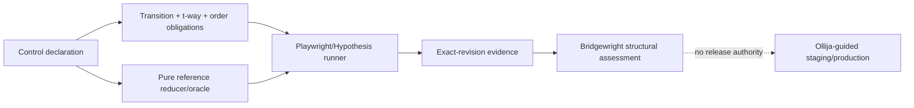

<!-- BEGIN OLLIJA DELIVERY GUIDE -->
## Ollija Delivery Guide

This block is generated guidance. Do not edit it directly. Correct durable facts in `.ollija/project.yaml` or this template, then rerun `./bin/ollija annotate-plan`. Put a user-directed exception in the editable Delivery Exceptions section below.

### Resolved locations

- Authoritative host: `fuchitalee`
- Authoritative repository: `/Users/fuchitalee/development/pushin-weight-v2`
- Ollija release worktree area: `/Users/fuchitalee/development/pushin-weight-v2/.worktrees`
- Active worktree: `/Users/fuchitalee/development/pushin-weight-v2/.worktrees/feat/stateful-ui-assurance-adoption`
- Plan: `/Users/fuchitalee/development/pushin-weight-v2/.worktrees/feat/stateful-ui-assurance-adoption/docs/plans/2026-08-27-110512-feat-stateful-ui-assurance-adoption-plan.md`
- Change: `feat-stateful-ui-assurance-adoption-2026-08-27-110512`
- Branch: `feat/stateful-ui-assurance-adoption`
- Staging branch and blueprint: `staging`, `/Users/fuchitalee/development/pushin-weight-v2/.worktrees/feat/stateful-ui-assurance-adoption/render-staging.yaml`
- Production branch and blueprint: `main`, `/Users/fuchitalee/development/pushin-weight-v2/.worktrees/feat/stateful-ui-assurance-adoption/render.yaml`
- Staging URL: `https://pushinweight-staging-web.onrender.com`
- Production URL: `https://pushinweight-web.onrender.com`

### Placement

This worktree is inside the Ollija release worktree area. Reuse it for the whole change. Do not create a second worktree or plan for this branch.

### Delivery scope

- Workflow: `plan`
- Delivery target: `production`
- Owner selection recorded: `true`

1. Complete implementation and the plan's verification contract.
2. Run the configured focused checks:
   - `pytest tests/ollija`
3. The parent workflow commits only this plan's changes, pushes the feature branch, and records the candidate SHA.
4. Fetch the remote staging lane: `git fetch origin refs/heads/staging`.
5. Require the unchanged candidate SHA to be a fast-forward of that fetched remote ref, then push the exact candidate SHA to `refs/heads/staging` with the server-enforced fast-forward command `git push origin <candidate-sha>:refs/heads/staging`.
6. Verify the remote staging ref resolves to the candidate SHA and the Render deployment for `pushinweight-staging-web` reports that same SHA.
7. Run staging checks. Stop here if they fail.
8. Only after staging passes, fetch the remote production lane: `git fetch origin refs/heads/main`.
9. Require the same unchanged candidate SHA to be a fast-forward of that fetched remote ref, then push the exact candidate SHA to `refs/heads/main` with the server-enforced fast-forward command `git push origin <candidate-sha>:refs/heads/main`.
10. Verify the remote production ref resolves to the candidate SHA and the Render deployment for `pushinweight-web` reports that same SHA before reporting completion.
11. After step 10 succeeds, perform worktree cleanup as the final filesystem action:
    - From `/Users/fuchitalee/development/pushin-weight-v2`, require `/Users/fuchitalee/development/pushin-weight-v2/.worktrees/feat/stateful-ui-assurance-adoption` to remain registered, clean, unlocked, and at the verified candidate SHA. If any guard fails, retain it and report the reason.
    - Run `git -C /Users/fuchitalee/development/pushin-weight-v2 worktree remove /Users/fuchitalee/development/pushin-weight-v2/.worktrees/feat/stateful-ui-assurance-adoption` without `--force`.
    - Preserve the local and remote feature branches. Continue final reporting from the authoritative repository root.

### Failure handling

- Never promote a staging candidate whose automated checks failed.
- Implementation failures return to the parent implementation workflow for diagnosis, correction, recommit, and restaging.
- SSH, shell, environment, or multi-machine failures use the repository infra/multi-machine skill first.
- The change ledger is advisory; do not validate or enforce it.
- Never force-remove a worktree. Retain staging-only, failed, dirty, locked,
  noncanonical, or candidate-mismatched worktrees for diagnosis or later
  delivery.
- Do not run an endless retry loop or start a persistent Ollija process.
<!-- END OLLIJA DELIVERY GUIDE -->

## Delivery Exceptions

None.

# Goal

Adopt Bridgewright `stateful-ui-assurance/v1` as PushinWeight's executable UI regression contract, repair the three escaped filter/chart defects, make `fix-ui` invoke the pinned protocol, and deliver the exact verified candidate through populated staging to production.

## Product Contract

### Decisions

- **Bridgewright owns the DNA** `(session-settled: user-approved)`: PushinWeight declares controls and owns executable tests; it does not duplicate Bridgewright's normative protocol. Rejected: maintaining equivalent rules in each repository.
- **Bridgewright first, adopter second** `(session-settled: user-directed)`: pin the reviewed protocol source revision `e94b04a9511b3ef494478b84a970035861ab4400`. Rejected: inventing the PushinWeight harness before the standalone contract.
- **Layered finite coverage** `(session-settled: user-approved)`: exhaustive transitions/inverses, pairwise and selected three-way combinations, ordered events, stateful shrinking/replay, and controlled races. Rejected: full Cartesian enumeration or manual staging checks.
- **Production delivery** `(session-settled: user-directed)`: staging is a mandatory proving step, not the stopping point. Rejected: staging-only delivery.

### Requirements

- **R1.** Pin Bridgewright build identity `0.1.0`, source revision `e94b04a9511b3ef494478b84a970035861ab4400`, schema-set digest `b0d89d3fadb4ccd8d736af2375bc98d1fd50070fe38f3da9ec25fa0558007509`, skill digest `2504868d2eacb21828ac0b68487cd760f9741c9955810f932e4c9c915d9abc37`, and profile `stateful-ui-assurance/v1` in `bridgewright.yaml`.
- **R2.** Declare every production UI dimension: all selectable open/closed brands, sentiment, post type, language, role, CN nationalism, US nationalism, discourse, unsanctioned off/only, locale, window, timezone, open/closed lens, and all/clear actions. Runtime brand discovery must fail on unexplained drift and must not treat fixture-only `test_brand` as a selectable production model.
- **R3.** Preserve product semantics: OR within a multiselect dimension, AND across dimensions, deselect-last-brand returns to `__all__`, locale changes preserve all settings, unsanctioned `off` excludes flagged posts, and `only` returns exactly flagged posts.
- **R4.** Use deterministic PostgreSQL/Django fixtures and a pure reference reducer to derive expected active controls, persisted settings, feed IDs/counts, chart series/window, accessibility state, and latest applicable request generation.
- **R5.** Generate stable obligation IDs and deterministic pairwise/selected three-way plus ordered-event coverage. Every individual option has a transition/inverse case. Escaped defects remain named seeds.
- **R6.** Execute browser cases in isolated Playwright contexts. Use Hypothesis state machines for legal sequences, invariants after every step, shrinking, and replay. Delayed, failed, duplicate, aborted, and out-of-order requests must not let stale state overwrite the latest user intent.
- **R7.** Permanently pin: DeepSeek select then deselect restores all brands; Xiaomi Mimo plus 7d→1d commits the 1d result under old/new response races without an obsolete warning; unsanctioned-only and off form the exact flagged/unflagged partition.
- **R8.** Provide an affected-control fast gate and full candidate gate. Required failures, skips, errors, unknown obligations, and missing obligations all fail. Independent cases may shard only with clean fixture/browser isolation and merged stable coverage.
- **R9.** Make `.claude/skills/fix-ui/SKILL.md` a thin Bridgewright invoker: Playwright-first reproduction, target-specific gates, Bridgewright structural assessment, and no duplicated protocol or implied release authority.
- **R10.** Preserve current recent UI contracts including brand/legend order, locale/browser persistence, hourly time-axis behavior, and feed row identity while repairing only the reported interactions.
- **R11.** Verify the exact candidate locally, on populated staging, and on production. Bridgewright evidence is structural and non-authoritative; the parent workflow separately observes test/CI/deployment execution.

### Acceptance Cases

- **AE1.** Selecting DeepSeek makes it the active brand filter; deselecting it removes selected/pressed/filter state and restores the all-brand chart/feed/count projection.
- **AE2.** A delayed seven-day response arriving after a successful one-day Xiaomi Mimo response cannot change the one-day toggle/chart or surface “pulse refresh failed, showing last result.”
- **AE3.** Unsanctioned-only returns exactly flagged fixture post IDs; off returns exactly unflagged IDs; repeated toggles remain reversible and projections agree.
- **AE4.** Locale changes preserve selected brands, filters, window, and timezone in controls and browser storage.
- **AE5.** Removing one generated coverage result makes Bridgewright assessment fail with its stable obligation ID.
- **AE6.** Staging and production report the exact candidate SHA and pass read-only seeded browser smoke checks; an unpopulated staging source or SHA mismatch blocks promotion.

## Planning Contract

### Design

Browser state is accepted only when controls, accessibility, storage, feed, chart, counts, and request generation all match one reference state. A batch may be parallelized, but each failure must reduce to one deterministic replay.

### Scope

- **In:** target declaration/fixtures/oracle/generators/browser harness/evidence; minimal JS or Django repairs; `fix-ui` integration; local/staging/production proof.
- **Deferred:** account-level preference sync, hosted cross-repository dashboards, full generated physical-iPhone runs.
- **Out:** Bridgewright editing/approving/deploying PushinWeight, full Cartesian enumeration, screenshot-only proof, or production data as the only oracle.

## Implementation Units

### U5. Pin Bridgewright and declare PushinWeight controls

- **Files:** `bridgewright.yaml`, `tests/fixtures/ui_assurance/declaration.json`, `tests/test_bridgewright_v24_target.py`, new assurance conformance tests.
- **Approach:** Add the profile reference and exact build pins. Encode all control values, groups, constraints, invariants, races, environments, fast/full gates, and the three regression seeds as non-executable JSON.
- **Test first:** Current empty-scenario/catalog-only conformance fails because no assurance declaration exists; target validation passes only against the pinned Bridgewright worktree/build.
- **Test scenarios:** complete inventory; duplicate/unknown option rejection; fixture-only brand rejection; source/schema/skill digest mismatch; generated obligation-family counts.
- **Verification:** Bridgewright validate/prescribe plus focused target tests.

### U6. Add deterministic reducer, fixtures, and coverage generation

- **Files:** `tests/ui_assurance/`, `tests/fixtures/ui_assurance/`, development dependencies/lock only when required.
- **Approach:** Build a compact fixture corpus that distinguishes all filter values and chart windows. Keep a pure reducer separate from browser/runtime code. Generate stable covering rows and ordered obligations compatible with the Bridgewright declaration.
- **Test first:** Direct reducer/oracle tests fail for deselect-last, unsanctioned partition, locale preservation, and latest-intent generation under the current behavior model.
- **Test scenarios:** OR-within/AND-across exact IDs; all brand transitions; flagged/unflagged partition; 1/7/30/365-day extent; locale persistence; missing-row coverage failure.
- **Verification:** PostgreSQL-backed Django query/oracle and deterministic coverage tests.

### U7. Add isolated stateful browser and race harness

- **Files:** `tests/ui_assurance/`, `tests/browser/` or existing browser-test homes, Playwright support.
- **Approach:** Drive real home-page controls through reusable Playwright actions/probes. Give every Hypothesis example a fresh browser context and deterministic fixture reset. Intercept chart/feed requests to delay/fail/reorder responses, assert invariants after each action, and emit replay/evidence JSON.
- **Test first:** Prove an injected stale-commit/reference mismatch shrinks to a useful replay before using the harness as the repair gate.
- **Test scenarios:** repeat actions; select/deselect; locale/window/filter sequences; storage isolation; delayed-old/fast-new; old failure/new success; old success/new failure; duplicate/abort; no pending-route leakage.
- **Verification:** repeated fast and bounded stateful/race browser runs with zero required skip/error.

### U8. Reproduce and repair escaped regressions

- **Files:** `monitor/static/pw-chart.js`, `monitor/static/pw-feed.js` or actual traced state owner, views only if the real chain proves a server defect, and focused tests.
- **Approach:** Reproduce each reported defect in a real browser before product edits, retain its failing named seed, trace the request/state generation, then make the smallest coherent repair.
- **Test scenarios:** AE1–AE4 plus each seed paired with locale and another filter; existing chart/legend/order/timezone/persistence contracts remain green.
- **Verification:** named red-before/green-after seeds, affected-control gate, existing JS/Django/browser suites.

### U9. Make `fix-ui` a thin protocol invoker

- **Files:** `.claude/skills/fix-ui/SKILL.md`, target-specific skill tests/assertions.
- **Approach:** Keep existing TOUCH/PRESERVE, Playwright-first, mockup, i18n, source-hygiene, and geometry rules. Add the pinned Bridgewright validate/prescribe/assess flow plus affected/full target gates, without copying the canonical protocol.
- **Test scenarios:** changed-control fast selection; race defect coverage; required skip blocks handoff; no Bridgewright Git/deploy claim.
- **Verification:** skill quick validation and target skill-contract tests.

### U10. Review and deliver exact candidate

- **Files:** no new product scope; evidence and deployment receipts stay in approved locations.
- **Approach:** Simplify/review, run full local gates, commit/push/PR, watch CI, verify staging data source and candidate SHA, run staging gate, promote unchanged SHA, and run bounded read-only production smoke. Follow the generated Ollija Delivery Guide and make guarded worktree removal the final filesystem action.
- **Failure cases:** any required skip/error, unpopulated staging source, candidate/Render SHA mismatch, browser smoke failure, dirty/locked/mismatched worktree.
- **Verification:** all quality gates below and exact-SHA Render evidence.

## Verification Contract

- `./bin/ollija annotate-plan docs/plans/2026-08-27-110512-feat-stateful-ui-assurance-adoption-plan.md --check` before Git/deployment mutation.
- Bridgewright `assurance-validate`, `assurance-prescribe`, and `assurance-assess` against the pinned local protocol revision.
- Focused declaration, reducer/oracle, coverage, seeded regression, stateful, race, skill, and existing affected Django/JavaScript/browser tests.
- Full repository-required pytest/static/Django checks selected from the clean worktree, with literal pass/fail/skip/error counts.
- Full candidate obligation closure: 100% required passed; zero required failed/skipped/errored/missing/unknown.
- Staging data-source health, exact Render SHA, and browser proof before production.
- Exact unchanged production SHA plus read-only DeepSeek reversal, Mimo latest-wins, unsanctioned partition, locale persistence, and window smoke.

## Implementation and verification status

- Bridgewright's standalone protocol is reviewed and pinned to build `0.1.0`, source `e94b04a9511b3ef494478b84a970035861ab4400`, schema-set digest `b0d89d3fadb4ccd8d736af2375bc98d1fd50070fe38f3da9ec25fa0558007509`, and skill digest `2504868d2eacb21828ac0b68487cd760f9741c9955810f932e4c9c915d9abc37`.
- PushinWeight's reviewed product-source revision is `0b95431b0d931073fba460a78acad7ae56c68200`, which includes the adoption source and current `origin/main`; the declaration and generated evidence bind to this revision.
- The target inventory contains 15 control dimensions and 31 selectable brands. The deterministic compiler emits 1,823 obligations: 107 transitions, 90 inverses, 1,588 t-way combinations, 24 ordered sequences, 6 invariants, 5 races, and 3 permanent regression seeds.
- The full local candidate gate passed 64 Python tests, including 42 PostgreSQL-required executions with zero skips/errors, plus 77 JavaScript chart-runtime assertions and 1,823/1,823 Bridgewright obligations with zero failed, skipped, errored, missing, or unknown results.
- The repository Ollija suite passed 71 tests. Django's deployment check retained three pre-existing configuration warnings and reported no errors.
- Independent Claude Opus review findings were reconciled: ordered permutations now have last-write-wins oracles, every declared race fault has a distinct execution path, the flagged partition is exact, evidence is rewritten fail-fresh, and the legacy HTTP test setting is isolated from Bridgewright assessment.
- Staging population, exact deployed SHA, seeded browser smoke, production promotion, production smoke, and guarded worktree cleanup remain delivery steps owned by the parent workflow.

## Definition of Done

- U5–U9 are implemented and locally verified with red-before/green-after evidence for the three escaped defects.
- PushinWeight emits exact-revision coverage evidence that the pinned Bridgewright build structurally assesses as clean without changing approval state.
- `fix-ui` automatically requires the relevant fast gate and the full candidate gate before release handoff.
- Both repositories' local checks and PR CI pass; all review findings are resolved or explicitly recorded.
- Populated staging and production serve the unchanged candidate SHA and pass the required browser flows.
- Delivery and final cleanup follow the generated Ollija guide; unrelated root/worktree files remain untouched.
