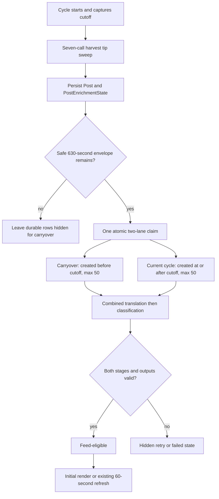
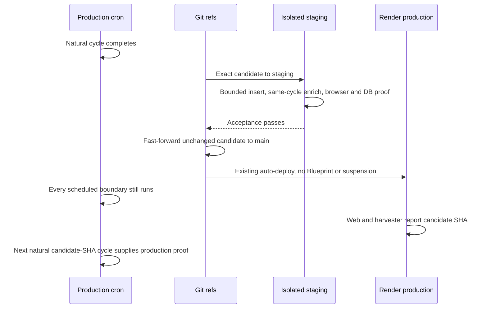

<!-- BEGIN OLLIJA DELIVERY GUIDE -->
## Ollija Delivery Guide

This block is generated guidance. Do not edit it directly. Correct durable facts in `.ollija/project.yaml` or this template, then rerun `./bin/ollija annotate-plan`. Put a user-directed exception in the editable Delivery Exceptions section below.

### Resolved locations

- Authoritative host: `fuchitalee`
- Authoritative repository: `/Users/fuchitalee/development/pushin-weight-v2`
- Ollija release worktree area: `/Users/fuchitalee/development/pushin-weight-v2/.worktrees`
- Active worktree: `/Users/fuchitalee/development/pushin-weight-v2/.worktrees/feat/same-cycle-enrichment`
- Plan: `/Users/fuchitalee/development/pushin-weight-v2/.worktrees/feat/same-cycle-enrichment/docs/plans/2026-08-27-111439-feat-same-cycle-enrichment-plan.md`
- Change: `feat-same-cycle-enrichment-2026-08-27-111439`
- Branch: `feat/same-cycle-enrichment`
- Staging branch and blueprint: `staging`, `/Users/fuchitalee/development/pushin-weight-v2/.worktrees/feat/same-cycle-enrichment/render-staging.yaml`
- Production branch and blueprint: `main`, `/Users/fuchitalee/development/pushin-weight-v2/.worktrees/feat/same-cycle-enrichment/render.yaml`
- Staging URL: `https://pushinweight-staging-web.onrender.com`
- Production URL: `https://pushinweight-web.onrender.com`

### Placement

This worktree is inside the Ollija release worktree area. Reuse it for the whole change. Do not create a second worktree or plan for this branch.

### Delivery scope

- Workflow: `lfg`
- Delivery target: `production`
- Owner selection recorded: `true`

1. Complete implementation and the plan's verification contract.
2. Run the configured focused checks:
   - `pytest tests/ollija`
3. The parent workflow commits only this plan's changes, pushes the feature branch, and records the candidate SHA.
4. Fetch the remote staging lane: `git fetch origin refs/heads/staging`.
5. Require the unchanged candidate SHA to be a fast-forward of that fetched remote ref, then push the exact candidate SHA to `refs/heads/staging` with the server-enforced fast-forward command `git push origin <candidate-sha>:refs/heads/staging`.
6. Verify the remote staging ref resolves to the candidate SHA and the Render deployment for `pushinweight-staging-web` reports that same SHA.
7. Run staging checks. Stop here if they fail.
8. Only after staging passes, fetch the remote production lane: `git fetch origin refs/heads/main`.
9. Require the same unchanged candidate SHA to be a fast-forward of that fetched remote ref, then push the exact candidate SHA to `refs/heads/main` with the server-enforced fast-forward command `git push origin <candidate-sha>:refs/heads/main`.
10. Verify the remote production ref resolves to the candidate SHA and the Render deployment for `pushinweight-web` reports that same SHA before reporting completion.
11. After step 10 succeeds, perform worktree cleanup as the final filesystem action:
    - From `/Users/fuchitalee/development/pushin-weight-v2`, require `/Users/fuchitalee/development/pushin-weight-v2/.worktrees/feat/same-cycle-enrichment` to remain registered, clean, unlocked, and at the verified candidate SHA. If any guard fails, retain it and report the reason.
    - Run `git -C /Users/fuchitalee/development/pushin-weight-v2 worktree remove /Users/fuchitalee/development/pushin-weight-v2/.worktrees/feat/same-cycle-enrichment` without `--force`.
    - Preserve the local and remote feature branches. Continue final reporting from the authoritative repository root.

### Failure handling

- Never promote a staging candidate whose automated checks failed.
- Implementation failures return to the parent implementation workflow for diagnosis, correction, recommit, and restaging.
- SSH, shell, environment, or multi-machine failures use the repository infra/multi-machine skill first.
- The change ledger is advisory; do not validate or enforce it.
- Never force-remove a worktree. Retain staging-only, failed, dirty, locked,
  noncanonical, or candidate-mismatched worktrees for diagnosis or later
  delivery.
- Do not run an endless retry loop or start a persistent Ollija process.
<!-- END OLLIJA DELIVERY GUIDE -->

## Delivery Exceptions

1. Use the isolated staging harvester from merged PR #25 without widening its provider envelope. Each candidate acceptance attempt may claim at most five current-cycle rows and zero carryover rows.
2. Do not suspend, reschedule, manually trigger, or apply a Blueprint to production. Promote immediately after a completed natural production cycle and require uninterrupted `00/15/30/45` cron history across the deployment window.
3. Preserve and do not merge the stale `feat/deepseek-v4-flash-enrichment`, `fix/enrichment-queue-starvation`, and `fix/harvester-translation-commentary-completeness` worktrees. Current `origin/main` is the only implementation base.
4. A zero-result or update-only staging attempt is inconclusive and blocks production promotion. The owner's 2026-08-28 continuation authorizes sequential, operator-observed bounded staging attempts until one nonempty exact-candidate cohort proves same-cycle enrichment and the required quality floors. Do not use a persistent retry loop, overlap attempts, or exceed one search request, one page, five results, zero HTTP retries, five current-cycle claims, and zero carryover claims per attempt.
5. The owner's 2026-08-28 continuation selects production delivery. Promote only the unchanged staged code candidate, preserve every natural production boundary, and stop on any continuity, SHA, cohort, feed, or quality-gate failure.
6. Keep a timestamped success-or-failure rollout ledger at `docs/operations/2026-08-28-083648-same-cycle-enrichment-production-rollout.md`. A read-only monitoring subagent owns incremental evidence writes during delivery; it must not mutate Git refs, Render services, schedules, databases, or provider state.

# Same-Cycle Enrichment and Enriched-Only Feed

## Goal Capsule

- **Objective:** New posts become visible in the public feed only after their durable translation and classification are complete, normally within the same harvest cycle, while production keeps every scheduled harvest boundary.
- **Means:** Add current-cycle and carryover allocations to the existing durable enrichment claimant, then gate shared feed queries on durable completion and valid persisted output (KTD1, KTD3).
- **Authority:** The Product Contract controls observable behavior. The Planning Contract controls implementation. The generated Ollija Delivery Guide controls staging-first and exact-SHA production sequencing unless a Delivery Exception narrows it.
- **Execution profile:** Test-first changes in one canonical worktree, one bounded live staging acceptance, exact-candidate promotion, and one natural exact-SHA production-cycle acceptance.
- **Stop conditions:** Stop before production on any failed required test, inconclusive staging attempt, candidate-SHA mismatch, environment/config mismatch, production continuity gap, or quality-floor miss.
- **Tail ownership:** LFG owns review, staging, promotion, production verification, and Ollija's guarded final worktree cleanup.

## Product Contract

### Summary

The harvest cycle will drain two disjoint enrichment lanes after persistence: a bounded carryover lane and a bounded lane for eligible enrichment states created at or after the captured cycle-start cutoff. Both lanes use the existing translation and classification path. Public feeds will omit pending, failed, and incomplete rows until durable enrichment makes them eligible. Inserted-post identity remains separate evidence used by staging acceptance.

Product Contract preservation: expanded from the Ollija requirements placeholder; no prior requirements or stable IDs existed in this artifact.

### Problem Frame

Production currently creates enrichment state for new posts, but the claimant puts every pre-cycle row ahead of current-cycle inserts within one 50-row budget. A measured cohort waited 15:06 for the next cron and then needed only 1:19 for enrichment. The scheduled queue wait, not provider execution, dominates freshness.

The public feed immediately returns those new rows and labels them pending. A timer-based display delay cannot guarantee completion because provider latency, retries, and failures vary. The release must remove the artificial one-cycle handoff without increasing Twitter search frequency or hiding a missed production cycle behind manual recovery.

### Key Decisions

- **Production is the delivery target.** (session-settled: user-directed — chosen over staging-only delivery: success requires the same candidate to complete a natural production harvest.) Governs R16-R20.
- **Production stays continuously scheduled.** (session-settled: user-directed — chosen over suspending the cron during testing: a prior staging test caused a two-hour production post gap.) Governs R16-R18.
- **The candidate proves behavior in isolated staging first.** (session-settled: user-directed — chosen over direct production deployment: PR #25 supplies independent state and bounded provider access.) Governs R12-R15.
- **Feed visibility follows durable state.** (session-settled: user-approved — chosen over a fixed display timer: elapsed time cannot prove that enrichment completed.) Governs R8-R11.
- **Harvest and provider envelopes remain bounded.** (session-settled: user-approved — chosen over a faster cron or more search calls: search-credit use must not increase.) Governs R4-R7.
- **Existing enrichment quality floors remain release gates.** (session-settled: user-directed — chosen over accepting a latency win with lower completeness: translation and bilingual commentary are primary product data.) Governs R19-R20.

### Requirements

**Same-cycle enrichment**

- R1. A normal cycle may claim up to 50 eligible states created at or after its start time before that cycle exits.
- R2. The same claim transaction reserves a separate allocation of up to 50 eligible pre-cycle carryover states.
- R3. Current-cycle work cannot consume the carryover allocation, and carryover work cannot consume the current-cycle allocation.
- R4. Carryover keeps the existing newest-pre-cycle ordering, retry tie-break, lease recovery, attempt exhaustion, age quarantine, and `skip_locked` behavior.
- R5. Both lanes enter one existing translation/classification path under one shared harvest writer lock.
- R6. Translation and classification keep batch size 20, provider concurrency 3, 90-second request limits, 300-second stage budgets, and 660-second claim leases. The outer cycle deadline remains 780 seconds from cycle start, and the following 120 seconds remain reserved before the next quarter-hour boundary.
- R7. A claim requires the two 300-second stage budgets plus a named 30-second post-fetch terminalization reserve inside the 780-second outer deadline. A cycle with less than that 630-second safe envelope defers without claiming or spending an attempt; its new rows remain durable for carryover. Later external consumers, including metrics refresh, honor the same outer deadline and defer before starting a request that cannot fit.

**Feed eligibility**

- R8. A post with enrichment state is feed-eligible only when translation and classification both succeeded and `lang_detected`, `text_en`, `text_zh_cn`, `commentary_en`, and `commentary_zh_cn` satisfy the shared persisted-output policy: language is canonical; required text is nonblank; no required value is an `N/A` sentinel; and commentaries are not copied from source/translation or from each other.
- R9. A legacy post without enrichment state remains feed-eligible only when the same required language, translation, and bilingual commentary fields are valid.
- R10. Pending, failed, invalid, and incomplete rows are excluded in the shared database query before feed limits, filtering, sorting, and pagination.
- R11. The existing first-page refresh reveals a row after it becomes eligible without changing the 60-second browser interval.

**Staging acceptance**

- R12. Staging keeps one search, one page, five results, no retry, no metrics refresh, and an aggregate enrichment cap of five current-cycle rows and zero carryover rows.
- R13. Staging passes only when at least one newly inserted current-cycle post completes both stages with valid persisted output.
- R14. Zero-result, update-only, pending, failed, or incomplete staging outcomes are inconclusive or failed and cannot authorize production.
- R15. Staging evidence proves the exact candidate SHA on web and harvester, staging-only database ownership, per-lane counters, post-level completion, feed visibility after success, and advancing production continuity during the attempt.

**Production continuity and quality**

- R16. Promotion fast-forwards the unchanged staged candidate to `main` without a production Blueprint application, service suspension, schedule change, or manual production run.
- R17. Promotion starts immediately after a completed natural production cycle and must preserve one non-aborted job at every expected `00/15/30/45` boundary across deployment.
- R18. Production acceptance begins only after both web and harvester report the candidate SHA, then uses the next natural scheduled cycle through the same `CycleRunner` path as staging under production caps.
- R19. In the exact candidate-cycle cohort, at least 99% of posts whose `lang_detected` is not canonical Simplified Chinese have nonblank `text_zh_cn`.
- R20. In that same cohort, at least 99% of all posts have valid, nonblank, distinct `commentary_en` and `commentary_zh_cn`; with a 50-post cohort, either 99% gate requires 50 of 50.
- R21. Search planning remains seven A/B/C calls with unchanged schedule, query semantics, result/page caps, and search-credit consumption.
- R22. Safe structured summaries expose total, current-cycle, carryover, succeeded, pending, failed, deferred, and quarantined enrichment counts without exposing queries, payloads, provider responses, or secrets.
- R23. Backlog-only and backfill entrypoints preserve their existing no-cutoff claim capacity and do not gain the additive current-cycle allocation.
- R24. A candidate-SHA production cycle with zero inserts or updates only is inconclusive, not a behavioral pass. Acceptance may wait through at most two natural candidate-SHA cycles for the first nonempty inserted cohort; a cohort that inserts current-cycle posts but misses enrichment, feed, or quality gates fails and cannot be replaced by a later cohort.

### Acceptance Examples

- AE1. **Covers R1-R5.** Given 75 carryover states and 75 current-cycle states, when a normal cycle claims enrichment, then it owns exactly the first 50 eligible rows from each lane in one combined downstream run.
- AE2. **Covers R4, R7.** Given expired, exhausted, leased, and deadline-deferred rows, when the claimant runs, then existing quarantine, recovery, exclusion, and no-attempt-on-defer semantics remain unchanged.
- AE3. **Covers R8-R11.** Given the newest row is pending, when the home or brand feed loads, then that row is absent; after both stages succeed with valid output, the next full load or scheduled first-page refresh shows it without a pending label.
- AE4. **Covers R8-R10.** Given a ledger says succeeded but a required field is blank, `N/A`, invalid, or copied from source/translation, when the feed query runs, then the row remains hidden and the existing completeness repair path may reopen it.
- AE5. **Covers R12-R15.** Given an isolated staging run inserts between one and five posts, when same-cycle enrichment completes, then current-cycle claimed and succeeded counts match, carryover claimed is zero, and the inserted rows are visible only after completion.
- AE6. **Covers R13-R14.** Given staging returns zero results or only updates existing posts, when acceptance is classified, then it is inconclusive and production promotion stops.
- AE7. **Covers R16-R18.** Given promotion begins after a natural cron completion, when the candidate deploys, then cron history contains one non-aborted job for every expected boundary and the next candidate-SHA cycle completes without a manual substitute.
- AE8. **Covers R19-R22.** Given the exact candidate-cycle production IDs, when the health check inspects that same cohort, then both 99% floors, the seven-call invariant, lane counters, and persisted terminal states pass.
- AE9. **Covers R18, R24.** Given the first candidate-SHA production cycle inserts no posts, when its natural execution and continuity evidence pass, then acceptance waits for at most one more natural cycle without a manual substitute; once a cycle inserts posts, those exact IDs are the immutable acceptance cohort whether they pass or fail.

### Scope Boundaries

**In scope**

- Durable two-lane selection and lane-aware summary counters in the existing `CycleRunner` path.
- Hard-capped staging acceptance assertions and secret-free evidence.
- State-and-output-gated home, internal, brand, JSON feed, and shared chart projections that already consume the feed queryset.
- Staging-first exact-SHA delivery and uninterrupted natural production-cycle verification.

**Deferred to Follow-Up Work**

- A dedicated enrichment worker or queue topology for latency below the cycle's existing provider runtime.
- New alerting or dashboards beyond the canonical harvest summary and health report.

**Out of scope**

- A 5-minute production cron, extra Twitter search calls, broader query/result/page caps, prompt/model changes, or backfill throughput changes.
- Replaying prior production gaps, changing headline topology, or merging stale harvester/model branches.
- A fixed-age display delay or new browser polling interval.

---

## Planning Contract

### Key Technical Decisions

- KTD1. **Partition inside the existing claimant through an explicit cutoff contract.** (session-settled: user-approved — chosen over a second runner or worker: one durable claimant preserves lock, lease, retry, and deadline semantics.) Ordinary management-command runs and isolated staging pass the captured cycle-start cutoff regardless of their current `"manual"` cycle label. Backfill and backlog replay omit that cutoff and retain the legacy single-lane limit. The claimant evaluates quarantine and eligibility once, locks the exhaustive and disjoint `< cutoff` and `>= cutoff` sets using one timestamp, and commits or rolls back all ownership and attempt mutations together. Implements R1-R7 and R23.
- KTD2. **Use explicit lane caps plus an aggregate hard cap.** Production config sets current-cycle and carryover caps to 50 each with a combined maximum of 100. Staging overrides them to 5 and 0 with an aggregate maximum of 5. Lane sums may not exceed the aggregate cap and lanes never borrow unused capacity. Implements R1-R3 and R12.
- KTD3. **Gate visibility on state and one persisted-output policy.** (session-settled: user-directed — chosen over elapsed-time gating: only persisted terminal facts prove readiness.) A dependency-light enrichment policy module owns both the scalar post validator used by terminalization and staging evidence and the equivalent ORM predicate used by feed eligibility. Translator response repair remains a separate pre-persistence contract. This keeps views independent of the large cycle module and prevents three definitions of completeness from drifting. Implements R8-R11.
- KTD4. **Preserve search, concurrency, and cycle guardrails while measuring increased LLM volume.** (session-settled: user-approved — chosen over increasing cron frequency or unbounded provider pressure: the measured wait is scheduler-induced.) Twitter search frequency, calls, credits, LLM concurrency, timeouts, models, stage budgets, and the shared writer lock remain pinned. The additive claim can increase translation and classification work from three to five 20-row batches per stage, so batch counts and wall-clock duration are explicit staging and production evidence. Implements R4-R7 and R21.
- KTD5. **Make lane identity observable at safe boundaries.** Lane counts live on the claim result, flow into post-fetch counters, cross the versioned counts-only `HARVEST_SUMMARY` v2 allowlist, and appear in staging acceptance JSON. Exact nonempty-cycle post IDs and lane facts cross only a separate bounded, hashed `HARVEST_COHORT` receipt correlated to the same service, deploy, run, and summary hash; historical summary v1 remains parseable only under its narrower allowlists. Implements R13-R15 and R22.
- KTD6. **Promote between natural production boundaries and close the continuity ledger.** (session-settled: user-directed — chosen over stopping or manually running production: success requires zero scheduled disruption.) The exact staged SHA moves to `main` after a completed job, both services converge on it, and the next natural candidate-SHA job supplies behavioral proof. Evidence spans the completed pre-promotion boundary, every deployment boundary, the candidate-SHA acceptance boundary, and one following natural boundary; a later run cannot repair a missing one. Implements R16-R18.
- KTD7. **Treat staging and production as identical semantics under different caps.** Both environments execute the same claimant, translation, classification, persistence, and feed eligibility code. Staging's single-call/five-row limits remain intentionally smaller than production. Implements R12-R18.

### High-Level Technical Design

### Assumptions

- The existing 300-second per-stage budgets can process the added second wave of 20-row batches under concurrency three; staging and production wall-clock evidence must confirm this rather than weakening R6.
- Current-cycle overflow beyond 50 is acceptable durable carryover and remains hidden until completion.
- Legacy no-ledger rows that pass the full persisted-output predicate remain trustworthy enough for historical feed continuity.
- Render deployments normally complete inside one 15-minute interval when promotion starts immediately after a natural cycle; missing any expected job boundary fails R17 instead of triggering a manual repair.

### System-Wide Impact

- **Data lifecycle:** Claim ownership and terminal states stay in `post_enrichment_states`; no schema migration or backfill is required.
- **External APIs:** Translation/classification may process up to 100 scheduled rows, increasing total LLM batches and requests while concurrency remains three. TwitterAPI search execution and credits do not change; deadline-aware metrics refresh may defer work it previously would have started after the cycle budget.
- **Presentation:** Home, internal, brand, and JSON feed rows become conditional on successful enrichment. The browser keeps its existing refresh cadence; separate home aggregate charts, pulse, top-voices, and trend-narrative projections remain unchanged.
- **Operations:** Staging acceptance becomes stricter, and production continuity uses cron history plus canonical summaries rather than post timestamps alone.
- **Compatibility:** Explicit backlog/backfill paths retain the pre-change 50-row claim behavior. Historical no-ledger posts require complete output to remain visible.

### Risks and Mitigations

| Risk | Mitigation |
|---|---|
| Up to 100 rows exceed the safe enrichment window | Preserve the existing start/deadline gates, capture stage wall clock, and stop promotion if staging cannot finish its bounded cohort. |
| Current rows displace recovery work | Use disjoint allocations and keep all existing carryover ordering, attempt, age, lease, and quarantine tests. |
| A succeeded flag hides incomplete output | Reuse the strict completeness contract in feed and acceptance, then run the exact-cohort health check. |
| Staging isolation is widened accidentally | Override aggregate/current/carryover caps together and keep the zero-state preflight plus Blueprint topology tests. |
| Feed filtering returns fewer than 50 rows | Apply eligibility before the database limit so older eligible rows fill the page. |
| Eligibility filtering slows the ordered feed query | On one production-shaped PostgreSQL snapshot, capture five warm baseline and five warm candidate requests plus query plans. Candidate median must be no more than baseline plus the greater of 25% or 50 ms, every request must remain below 2 seconds, and SQL round trips must not increase. |
| Deployment skips a cron boundary | Start after a completed job and fail the release on any missing, skipped, manually substituted, or aborted expected boundary. |
| Same SHA resolves different provider routing | Pin explicit DeepSeek V4 Flash config-to-client propagation and compare redacted effective model/host facts in staging and production. |

### Alternative Approaches Considered

- **Run production every five minutes:** rejected because it hides the allocation defect and roughly triples search executions.
- **Delay the feed by a fixed duration:** rejected because provider completion is variable and failures have no safe fixed timeout.
- **Use one shared 50-row pool with priority changes:** rejected because one cohort can still starve the other and current-cycle capacity would fall below 50.
- **Create a dedicated enrichment worker now:** deferred because it adds broker, worker, scheduler, and concurrency topology that is unnecessary for the 1-3 minute target.

---

## Implementation Units

### U1. Two-lane durable claim allocation

- **Goal:** Claim current-cycle and carryover states in one bounded, lease-safe transaction and process them through the existing post-fetch path.
- **Requirements:** R1-R7, R23; KTD1, KTD2, KTD4.
- **Dependencies:** None.
- **Files:** `x_monitor/config.py`, `config.yaml`, `monitor/cycle.py`, `monitor/metrics_refresh.py`, `monitor/post_enrichment.py`, `tests/test_post_enrichment_queue.py`, `tests/test_post_enrichment_policy.py`, `tests/test_harvester_config_contract.py`, `tests/test_cycle_error_counters.py`, `tests/test_metrics_refresh.py`.
- **Approach:**
  1. Keep `claim_per_cycle` as the aggregate cap, add current-cycle and carryover caps, and validate production 100/50/50 and staging 5/5/0 without cross-lane borrowing.
  2. Refuse work before requeue, quarantine, or claim unless both 300-second stages and the 30-second post-fetch terminalization reserve fit inside the outer deadline; otherwise transition exhausted rows once and partition at the explicit cutoff.
  3. Lock both disjoint lane selections with one timestamp inside one transaction, honor the aggregate remainder, retain immutable IDs grouped by lane, and concatenate exactly once for the existing translator and classifier stages.
  4. Carry bounded inserted post IDs from persistence through the in-process result and retain per-ID lane and terminal facts before claim release clears ownership provenance.
  5. Pass the cutoff from normal command and staging callers regardless of the `"manual"` label; omit it for backfill and backlog replay so their existing 50-row behavior remains intact.
  6. Make metrics refresh consult the same outer deadline before each request and defer remaining work when a request envelope cannot fit.
  7. Establish the shared persisted-output validator and equivalent ORM predicate in the dependency-light enrichment policy module.
- **Execution note:** Start with failing PostgreSQL call-chain coverage through `CycleRunner.run()` and captured translator/classifier inputs; helper-only tests are insufficient.
- **Patterns to follow:** `_claim_enrichment_states`, `_run_post_fetch`, `EnrichmentAttemptDeadline`, `harvest_writer_lock`, and `docs/solutions/architecture-patterns/backfiller-and-llm-classifier-pipeline-wiring.md`.
- **Test scenarios:**
  - Covers AE1. More than 50 due rows in each lane claims exactly 50 carryover and 50 current rows with disjoint IDs.
  - A 37-row current cohort plus 50 carryover rows claims all 87 and sends them once through the combined production caller.
  - Current-cycle overflow remains pending and becomes eligible for the carryover lane on the next cutoff.
  - Expired leases remain recoverable, active leases remain excluded, and attempt/age exhaustion remains explicit failed state outside the claim budget.
  - A forced failure rolls back ownership and attempts in both lanes; concurrent claimers receive disjoint IDs.
  - A remaining budget below 630 seconds claims nothing, increments deferred evidence, and spends no attempt; stage-budget exhaustion leaves terminalization inside its reserve and metrics refresh starts no late request.
  - Captured downstream calls retain 20-row batches, maximum worker concurrency three, explicit configured models, and existing deadline objects.
  - Backfill and no-cutoff calls retain a maximum of 50 rather than receiving the additive current-cycle allocation.
  - Scalar and ORM completeness agree for null, blank, whitespace, `N/A`/`NA`, invalid language, copied commentary, valid output, succeeded/pending/failed ledger rows, and complete/incomplete no-ledger rows.
- **Verification:** The real `CycleRunner` call chain proves both lane allocation and unchanged downstream guardrails on PostgreSQL.

### U2. Safe lane observability and strict staging acceptance

- **Goal:** Make same-cycle completion provable from redacted summaries and prevent old, incomplete, or merely claimed staging rows from passing.
- **Requirements:** R12-R15, R22; KTD2, KTD5, KTD7.
- **Dependencies:** U1.
- **Files:** `monitor/harvest_summary.py`, `monitor/staging_acceptance.py`, `monitor/management/commands/run_cycle.py`, `monitor/post_enrichment.py`, `tests/test_harvest_latency_summary.py`, `tests/test_post_enrichment_policy.py`, `tests/test_staging_harvest_acceptance.py`, `tests/test_staging_harvest_runbook.py`.
- **Approach:**
  1. Carry exact total/current-cycle/carryover claimed, succeeded, pending, and failed counts plus total deferred and quarantined counts through canonical redacted summary schema v2; keep post IDs out of that global envelope, retain strict historical v1 parsing, and reject cross-version field claims.
  2. Override staging to aggregate five, current five, and carryover zero without changing its Twitter or metrics envelope.
  3. Evaluate staging beside `PreparedStagingAcceptance` from the exact nonempty intersection of inserted IDs and current-cycle claimed IDs. Every inserted ID must be terminal-complete under the shared policy and carryover must be zero.
  4. Retain bounded per-ID evidence in staging output and, for every nonempty production-shaped cycle, emit one independently hashed `HARVEST_COHORT` receipt correlated to its counts-only summary. Keep command code as orchestration and distinguish accepted, inconclusive, and failed outcomes.
- **Execution note:** Pin command-to-runner-to-summary behavior before changing acceptance classification.
- **Patterns to follow:** `build_summary_envelope`, `PreparedStagingAcceptance`, `_acceptance_status`, and the fail-closed identity checks from PR #25.
- **Test scenarios:**
  - Covers AE5. One to five inserted current-cycle rows that all finish produces accepted output with carryover zero.
  - Covers AE6. Zero results, update-only results, carryover-only claims, pending states, failed states, or incomplete outputs cannot produce accepted.
  - As defense in depth against a broken staging cap, an update plus an accidentally claimed carryover row cannot produce accepted; neither can a stale succeeded row or one failed ID among otherwise successful inserts.
  - An attempt to widen any aggregate or lane cap beyond the staging profile fails before provider construction.
  - Raw result through summary construction, serialization, and parsing retains every named numeric field and rejects unknown, negative, multiline, or sensitive values; historical v1 and current v2 are validated against separate exact allowlists.
  - Nonempty cycles emit exactly one canonical cohort receipt whose inserted/current/carryover IDs and facts reconcile with counts; zero-insert cycles emit none, and malformed or uncorrelated receipts fail closed.
  - Staging JSON names the selected call and safe counts but contains no URL, query, provider body, database URL, token, or secret.
- **Verification:** A deterministic command-level run proves the staging cap and terminal-output contract without live provider calls.

### U3. Enriched-only shared feed query

- **Goal:** Keep unfinished rows out of user-visible feeds and reveal each row automatically after durable completion.
- **Requirements:** R8-R11; KTD3.
- **Dependencies:** U1.
- **Files:** `monitor/views.py`, `monitor/post_enrichment.py`, `tests/test_views.py`, `tests/test_post_enrichment_policy.py`, `tests/test_home_v22_browser.py`, `tests/test_home_v22_feed_row_shape.py`.
- **Approach:**
  1. Build one reusable eligibility predicate from durable stage status and canonical persisted-output validity.
  2. Apply it inside `_get_feed_posts()` before limits so home, internal, brand, JSON feed, and shared chart callers agree.
  3. Preserve fully complete legacy no-ledger rows while excluding incomplete legacy, pending, and failed rows.
  4. Replace the existing pending-visible browser contract, while keeping `pw-feed.js` behavior and the 60-second interval unchanged.
- **Execution note:** Reproduce the production pending-row behavior first, then add real route/browser regression coverage before changing the query.
- **Patterns to follow:** `_translation_output_complete`, `_get_feed_posts`, the real `/feed/` JSON replacement path, and `.claude/skills/fix-ui/SKILL.md`.
- **Test scenarios:**
  - Covers AE3. The newest pending and failed rows are absent from initial home, internal, brand, and JSON feed responses while older eligible rows fill the requested page.
  - A complete no-ledger historical row remains visible, while an incomplete no-ledger row is absent.
  - Covers AE4. A succeeded ledger with blank, sentinel, invalid-language, or copied commentary output remains absent.
  - In an unpatched PostgreSQL-backed route, newest pending/failed rows are absent, older eligible rows fill the limit, and after the exact hidden row reaches complete terminal success the real first-page refresh callback shows it with nonzero geometry and no status label.
  - Existing brand, locale, filter, sort, cursor pagination, query-count, and chart projection tests remain green against eligible rows.
  - On an identical production-shaped PostgreSQL snapshot, five warm candidate requests have a median no more than the five-request baseline plus the greater of 25% or 50 ms, every request stays below 2 seconds, SQL round trips do not increase, and query plans are retained; patched row-shape tests remain template-contract coverage only.
- **Verification:** A real PostgreSQL-backed browser test exercises URL, view, template, static JavaScript, `/feed/`, and DOM replacement without waiting 60 wall-clock seconds.

### U4. Acceptance runbook and continuity evidence

- **Goal:** Make staging and production verification capture the exact facts required by R12-R22.
- **Requirements:** R12-R22, R24; KTD5-KTD7.
- **Dependencies:** U1-U3.
- **Files:** `docs/operations/2026-08-27-171845-staging-harvester-acceptance.md`, `docs/deploy/render.md`, `tests/test_staging_harvest_runbook.py`.
- **Approach:**
  1. Add per-lane and exact-post completion fields to the staging evidence template.
  2. Define a closed continuity ledger from the completed pre-promotion boundary through every deployment boundary, the first candidate-SHA natural cycle, and one following natural boundary. Correlate each Render scheduled execution with one terminal canonical summary; post timestamps are supplemental only.
  3. Define staging/production semantic parity as the same code and effective provider routing under intentionally different caps.
  4. Bind post-release quality proof to the exact immutable candidate-cycle IDs from its correlated `HARVEST_COHORT` receipt and keep the latest-50 harvester report as supplemental evidence rather than a replacement cohort.
  5. Record the pre-promotion SHA, scheduler-preserving rollback route, release operator, read-only continuity observer, rollback decider, and incident owner before promotion. A rollback uses ordinary deploy and natural cron paths; it never substitutes a manual harvest.
- **Patterns to follow:** The PR #25 staging runbook, `docs/deploy/render.md`, and `.claude/skills/harvester-latest-n-health-check/SKILL.md`.
- **Test scenarios:**
  - Runbook regression requires lane counts, inserted-ID completion, exact SHAs, environment identities, cron-boundary continuity, quality floors, and stop conditions.
  - Each continuity entry requires the scheduled boundary, Render execution identity and trigger, start/finish/status/SHA, and correlated summary service/run/SHA/timestamps/status/hash; each nonempty acceptance cycle additionally requires one correlated cohort receipt and missing or uncorrelatable evidence fails.
  - Runbook regression forbids production suspension, rescheduling, manual trigger, Blueprint application, and automatic retry after an inconclusive staging attempt.
  - Documentation keeps provider secrets and URLs out of evidence examples.
- **Verification:** The operational document gives one unambiguous pass/fail route from candidate staging through natural production acceptance.

---

## Verification Contract

### Automated checks

| Scope | Required check | Pass signal |
|---|---|---|
| Claim and call chain | `pytest tests/test_post_enrichment_queue.py tests/test_harvester_config_contract.py tests/test_cycle_error_counters.py tests/test_metrics_refresh.py --basetemp=.pytest-tmp/same-cycle-claim` | Both lane and no-cutoff/backfill scenarios and the late-metrics defer path pass with zero skips or errors. |
| Summary and staging | `pytest tests/test_harvest_latency_summary.py tests/test_staging_harvest_acceptance.py tests/test_staging_harvest_runbook.py --basetemp=.pytest-tmp/same-cycle-staging` | Strict accepted/inconclusive/failed outcomes and redaction pass. |
| Feed and browser | `pytest tests/test_views.py tests/test_home_v22_feed_row_shape.py tests/test_home_v22_browser.py --basetemp=.pytest-tmp/same-cycle-browser` | Real routes and the refresh replacement path show only eligible rows with zero skips or setup errors. |
| Translation/classification regression | `pytest tests/test_translator_commentary_completeness.py tests/test_translator_lang_detected_compliance.py tests/test_cycle_classifier_model_propagation.py tests/test_translator_cfg_pass_through.py --basetemp=.pytest-tmp/same-cycle-quality` | Completeness, canonical language, explicit model, and config-to-client pins pass. |
| Harvest invariants | `pytest tests/test_cycle_search_caps.py tests/test_harvest_cursor_regression_net.py tests/test_cycle_run_lock.py --basetemp=.pytest-tmp/same-cycle-harvest` | Seven-call search behavior, cursor coverage, caps, and writer-lock behavior remain unchanged. |
| Project checks | `pytest --basetemp=.pytest-tmp/same-cycle-full` and `python manage.py check --deploy` | Full suite has zero failures, required skips, or errors; only documented deploy-setting warnings may remain. |
| Ollija | `pytest tests/ollija --basetemp=.pytest-tmp/same-cycle-ollija` | Delivery-guide and repository safety tests pass. |

### Live staging gates

1. The feature ref, remote staging ref, staging web, and staging harvester all resolve to the same candidate SHA.
2. Production remains on its unchanged `*/15 * * * *` schedule and its Render execution/summary ledger advances naturally before, during, and after staging, including cycles that insert no rows.
3. One bounded manual staging attempt returns at least one newly inserted post and no more than five.
4. The exact inserted IDs show current-cycle creation, same-run attempt timestamps, two succeeded stages, valid bilingual output, and carryover claimed equal to zero.
5. The staging feed excludes each ID before success and includes it after success on reload or the existing refresh path.
6. Redacted effective translation/classification model and host facts match the candidate configuration and are retained for production comparison.
7. Any inconclusive or failed gate stops production promotion without an automatic retry.

### Live production gates

1. Ollija's regenerated guide and frontmatter agree that production was owner-selected; promotion otherwise stops. Promotion begins immediately after a completed natural cron job and uses the unchanged staged candidate.
2. Let B0 be that completed pre-promotion boundary, B1...Bn every quarter-hour through the first completed candidate-SHA natural cycle, and Bn+1 the following natural boundary. Each must correlate exactly one scheduled Render execution with one terminal `HARVEST_SUMMARY`; duplicate, missing, aborted, lock-skipped, manual, or uncorrelatable entries fail permanently and cannot be repaired by a later run.
3. Both production web and harvester report the candidate SHA before behavioral acceptance starts.
4. The next natural candidate-SHA cycle reports seven planned calls, persisted new posts, current-cycle claims, terminal successes, and no deadline, translator, classifier, parse, or truncation regression.
5. Select the first of at most two natural candidate-SHA cycles that inserts at least one row. Zero/update-only is inconclusive and only advances the continuity ledger; once a nonempty cohort exists, query those exact IDs immediately and after at most the health checker's single 30-minute enrichment grace. Disappearing IDs, fresh pending, or a quality miss fails acceptance and cannot be replaced by a later cohort.
6. Run the harvester latest-N checker for `N=50`, retain the literal cohort IDs, use its enrichment grace path if needed, and save the detailed report under `docs/analysis/harvester/`.
7. Confirm search/metrics volume and credit accounting are unchanged from the pre-release baseline.
8. Compare production's redacted effective translation/classification model and host facts with the staging evidence; any divergence fails acceptance.
9. Re-run the five-request warm feed benchmark and query-plan capture against the production-shaped snapshot. Apply the U3 numeric threshold before promotion and record it in the release evidence.
10. If a post-promotion stop trigger fires, advance `main` through the prepared feature-only rollback while ordinary auto-deploy and natural cron continue. Completion requires both services on the rollback SHA, an unbroken ledger through the first rollback-SHA natural cycle, and restored seven-call/error/credit/feed baselines; any emergency suspension transfers to incident handling and makes zero-disruption success impossible.

---

## Definition of Done

- U1-U4 are implemented with their named call-chain, command, route, browser, and runbook tests.
- All focused and full required checks report executed, skipped, and error counts; a required skip or setup error is not green.
- The diff contains no schema migration, search-plan expansion, model/prompt change, production schedule/topology change, or unrelated worktree content.
- Exact-SHA staging produces at least one newly inserted, same-cycle, fully enriched and feed-visible post under the five-current/zero-carryover cap.
- Production has no missing expected cron boundary before, during, or after promotion.
- One natural exact-SHA production cycle inserts at least one row and proves the same lane and enrichment semantics under production caps.
- The exact production cohort passes R19-R20 and the detailed latest-50 health report records the post text, persisted output, stage facts, and provider-call evidence required by the harvester skill.
- The feature branch is merged to `main`, production web and harvester report the merged candidate SHA, and no production cycle was manually replayed.
- Abandoned experiments and temporary product-code paths are absent from the final diff.
- After exact-SHA production verification, Ollija's guarded canonical-worktree removal is the final filesystem action; feature branches remain preserved.

---

## Sources and Research

- `monitor/cycle.py` — durable claimant, persistence boundary, deadlines, and production `CycleRunner` call chain.
- `x_monitor/config.py` and `config.yaml` — current enrichment and provider guardrails.
- `monitor/staging_acceptance.py` and `docs/operations/2026-08-27-171845-staging-harvester-acceptance.md` — merged PR #25 isolation and bounded acceptance contract.
- `monitor/views.py` and `monitor/static/pw-feed.js` — shared feed query and existing first-page refresh.
- `docs/solutions/architecture-patterns/backfiller-and-llm-classifier-pipeline-wiring.md` — single-pipeline rule.
- `docs/solutions/runtime-errors/2026-08-10-translator-lang-detected-llm-compliance.md` — canonical language and repair behavior.
- `docs/solutions/runtime-errors/translator-env-override-clobbered-by-yaml-null.md` — config-to-client routing contract.
- `docs/solutions/runtime-errors/translator-max-tokens-8192-cap-truncation.md` — batch-size and output-budget regression risk.
- GitHub PR #25, `feat(staging): isolate harvester runtime from production` — exact staging topology and continuity evidence.
