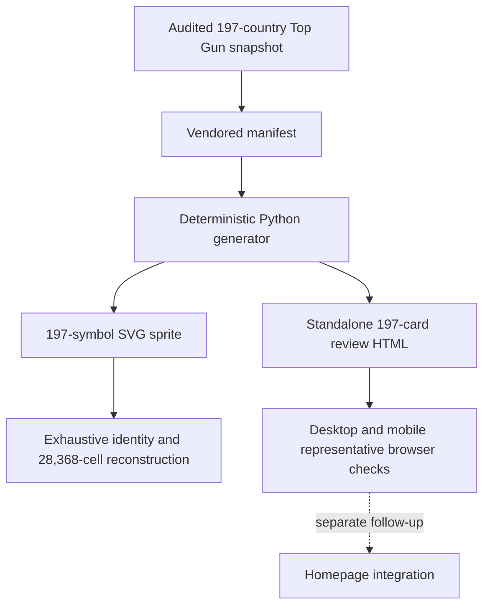

<!-- BEGIN OLLIJA DELIVERY GUIDE -->
## Ollija Delivery Guide

This block is generated guidance. Do not edit it directly. Correct durable facts in `.ollija/project.yaml` or this template, then rerun `./bin/ollija annotate-plan`. Put a user-directed exception in the editable Delivery Exceptions section below.

### Resolved locations

- Authoritative host: `fuchitalee`
- Authoritative repository: `/Users/fuchitalee/development/pushin-weight-v2`
- Ollija release worktree area: `/Users/fuchitalee/development/pushin-weight-v2/.worktrees`
- Active worktree: `/Users/fuchitalee/development/pushin-weight-v2/.worktrees/feat/country-flag-svg-reference`
- Plan: `/Users/fuchitalee/development/pushin-weight-v2/.worktrees/feat/country-flag-svg-reference/docs/plans/2026-08-29-072441-feat-country-flag-svg-reference-plan.md`
- Change: `feat-country-flag-svg-reference-2026-08-29-072441`
- Branch: `feat/country-flag-svg-reference`
- Staging branch and blueprint: `staging`, `/Users/fuchitalee/development/pushin-weight-v2/.worktrees/feat/country-flag-svg-reference/render-staging.yaml`
- Production branch and blueprint: `main`, `/Users/fuchitalee/development/pushin-weight-v2/.worktrees/feat/country-flag-svg-reference/render.yaml`
- Staging URL: `https://pushinweight-staging-web.onrender.com`
- Production URL: `https://pushinweight-web.onrender.com`

### Placement

This worktree is inside the Ollija release worktree area. Reuse it for the whole change. Do not create a second worktree or plan for this branch.

### Delivery scope

- Workflow: `lfg`
- Delivery target: `production`
- Owner selection recorded: `true`

1. Complete implementation and the plan's verification contract.
2. Run the configured focused checks:
   - `pytest tests/ollija`
3. The parent workflow commits only this plan's changes, pushes the feature branch, and records the candidate SHA.
4. Fetch the remote staging lane: `git fetch origin refs/heads/staging`.
5. Require the unchanged candidate SHA to be a fast-forward of that fetched remote ref, then push the exact candidate SHA to `refs/heads/staging` with the server-enforced fast-forward command `git push origin <candidate-sha>:refs/heads/staging`.
6. Verify the remote staging ref resolves to the candidate SHA and the Render deployment for `pushinweight-staging-web` reports that same SHA.
7. Run staging checks. Stop here if they fail.
8. Only after staging passes, fetch the remote production lane: `git fetch origin refs/heads/main`.
9. Require the same unchanged candidate SHA to be a fast-forward of that fetched remote ref, then push the exact candidate SHA to `refs/heads/main` with the server-enforced fast-forward command `git push origin <candidate-sha>:refs/heads/main`.
10. Verify the remote production ref resolves to the candidate SHA and the Render deployment for `pushinweight-web` reports that same SHA before reporting completion.
11. After step 10 succeeds, perform worktree cleanup as the final filesystem action:
    - From `/Users/fuchitalee/development/pushin-weight-v2`, require `/Users/fuchitalee/development/pushin-weight-v2/.worktrees/feat/country-flag-svg-reference` to remain registered, clean, unlocked, and at the verified candidate SHA. If any guard fails, retain it and report the reason.
    - Run `git -C /Users/fuchitalee/development/pushin-weight-v2 worktree remove /Users/fuchitalee/development/pushin-weight-v2/.worktrees/feat/country-flag-svg-reference` without `--force`.
    - Preserve the local and remote feature branches. Continue final reporting from the authoritative repository root.

### Failure handling

- Never promote a staging candidate whose automated checks failed.
- Implementation failures return to the parent implementation workflow for diagnosis, correction, recommit, and restaging.
- SSH, shell, environment, or multi-machine failures use the repository infra/multi-machine skill first.
- The change ledger is advisory; do not validate or enforce it.
- Never force-remove a worktree. Retain staging-only, failed, dirty, locked,
  noncanonical, or candidate-mismatched worktrees for diagnosis or later
  delivery.
- Do not run an endless retry loop or start a persistent Ollija process.
<!-- END OLLIJA DELIVERY GUIDE -->

## Delivery Exceptions

None.

# Complete Country Flag SVG Reference

## Goal Capsule

- **Objective:** Give the owner one production-matched browser artifact where every country flag in the approved Top Gun source set can be reviewed at inspection and feed scale before live integration.
- **Means:** Expand the approved SVG conversion and review dossier from three flags to all 197 verified 16×9 country matrices while preserving the same rendering and color treatments (KTD1–KTD7).
- **Authority:** The user request and this Product Contract govern scope. The audited Top Gun mapping governs country identity. The vendored manifest governs pixel identity. The approved three-flag dossier governs presentation.
- **Execution profile:** Work only in the canonical isolated feature worktree. Do not modify the homepage, feed serializer, templates, runtime CSS, database, or deployed application behavior.
- **Stop conditions:** Stop if the source inventory is not exactly 197 country entries, either `WW` or `HF` enters the country inventory, a source-name/code assignment changes, or any generated symbol cannot reproduce its source cells exactly.
- **Tail ownership:** LFG owns commit, PR, CI, and the owner-selected production delivery path in the generated Ollija Delivery Guide.

---

## Product Contract

### Summary

Expand the approved China, United States, and South Korea SVG trial to the other 194 country flags. The result remains a reusable SVG symbol sprite plus a standalone HTML dossier modeled on the Cyber-Quan icon reference. The dossier preserves the approved full-color, recommended subdued, and quieter comparisons without adding the flags to the live feed.

### Problem Frame

The approved three-flag trial proves that SVG preserves the 16×9 pixel art with far less feed DOM than the original 144-cell CSS grid. The owner now needs the complete source inventory in the same review format so color, legibility, and coverage can be assessed across the full set before runtime integration.

### Key Decisions

- PD1. **Use SVG instead of a CSS pixel grid** (session-settled: user-directed — chosen over retaining the CSS pixel grid: SVG avoids per-flag cell DOM and is reusable at feed scale). Governs R3–R5.
- PD2. **Keep this run review-only** (session-settled: user-directed — chosen over live homepage integration: the owner confirmed this work does not touch live behavior). Governs R5–R8a and R10.
- PD3. **Carry the LFG run through the production delivery path** (session-settled: user-directed — chosen over stopping at staging: repository-only artifacts do not change the live feed). Governs R9–R10.
- PD4. **Expand the approved design to all 197 country entries** (session-settled: user-directed — chosen over stopping after the three-flag trial: the owner approved the trial and requested the other 194). Governs R1–R8a.

### Requirements

**Inventory and identity**

- R1. The canonical inventory contains exactly the 197 country entries shared by the audited Top Gun `COUNTRY_MAP` and `FLAG_PIXELS_RAW`; it excludes the `WW` and `HF` application sentinels.
- R2. Each entry preserves the audited source filename, its assigned uppercase two-letter country code, and a human-readable English name. The set uses ISO 3166-1 alpha-2 codes except for source-assigned `XK` for Kosovo, which remains unchanged rather than being represented as an official ISO assignment.
- R3. Each flag preserves all source 16×9 colors and transparent cells exactly in a namespaced SVG symbol with a `0 0 16 9` viewBox.

**Reusable output**

- R4. One standalone SVG sprite exposes exactly 197 lowercase `flag-xx` symbols with fixed source fills and crisp-edge rendering.
- R5. The committed SVG and HTML outputs are reproducible from `docs/ideation/assets/2026-08-29-162947-country-flag-pixels.json` without network access or a sibling Top Gun checkout.

**Review experience**

- R6. One timestamped standalone HTML reference retains the approved PushinWeight `#0b1220` / `#111827` palette and the information hierarchy of `docs/ideation/mockups/qin-quan/2026-08-28-134649-cyber-quan-svg-system-en.html`.
- R7. The reference compares unmodified source color, the approved recommended `saturate(0.72) brightness(0.90)` plus `opacity: 0.90` treatment, and the quieter alternative while leaving symbol fills unchanged.
- R8. The reference shows every country at inspection scale and in a representative PushinWeight feed header under all three treatments. Each header compares the 16×9 native-pixel candidate and the exact 14 px-wide candidate at its natural 16:9 height beside the current 12×12 role badge.
- R8a. Every repeated specimen SVG is hidden from assistive technology and keyboard focus. The adjacent visible country code and name provide the accessible identity.

**Provenance and delivery**

- R9. The sprite and review reference clearly credit R74n, record the audited Top Gun and R74n source revisions, and retain the owner-confirmed license clearance without presenting legal advice.
- R10. This run does not add the sprite to `monitor/static`, serialize account country data, or modify homepage source, production database state, or deployment configuration.

### Acceptance Examples

- AE1. **Covers R1–R4.** Given the vendored manifest, generation produces exactly the 197 audited country symbols in code order and produces neither `flag-ww` nor `flag-hf`.
- AE2. **Covers R2–R5.** Given every country entry, reconstruction matches all 144 source positions and exact colors, totaling 28,368 checked cells.
- AE3. **Covers R2 and R6–R8a.** Given the review page, every country appears once with its code and name, three inspection treatments, and two feed-size candidates per treatment, totaling 197 cards, 591 treatment panels, and 1,773 flag specimens.
- AE4. **Covers R3 and R7.** Given any source symbol, changing the review treatment changes only the rendered instance filter and opacity; the sprite's fixed fills remain byte-identical.
- AE5. **Covers R6–R8.** Given desktop and mobile Chromium viewports, the standalone reference loads without page or request errors, reaches the first and last country cards, renders representative flags with nonzero geometry, and introduces no horizontal document overflow.

### Scope Boundaries

**In scope**

- The complete 197-entry vendored country manifest with source and license metadata.
- The deterministic generator, SVG sprite, and standalone HTML review artifact already approved in the three-country trial.
- Full structural and pixel-fidelity assertions plus bounded real-browser regression coverage.

### Deferred to Follow-Up Work

- Normalize `accounts.country_code` and backfill it from profile location data.
- Add the approved sprite to Django static assets and extend the homepage feed wire format.
- Select the final feed size and muted treatment after full-inventory review.
- Define runtime unknown-country and non-country sentinel fallbacks.

**Outside this run**

- Changes to `monitor/`, `core/`, migrations, the production database, or homepage assurance declarations.
- Expanding beyond the original 197-country source set.
- Redrawing, correcting, or politically reclassifying source flags.

### Success Criteria

- The owner can inspect all 197 country flags in one browser document without running Django.
- The generator reproduces committed outputs byte-for-byte and proves exact symbol-to-manifest fidelity across 28,368 cells.
- The approved `CN`, `KR`, and `US` symbols and presentation remain unchanged after the expansion.
- The branch contains no live homepage, feed, database, or deployment-configuration change.

### Product Contract Preservation

Changed R1, R2, R4, R8, and their linked acceptance and scope text to expand the user-approved three-flag trial to all 197 country entries. All review treatments, source fidelity rules, runtime exclusions, provenance, and delivery choices remain unchanged.

---

## Planning Contract

### Key Technical Decisions

- KTD1. **Generate one dedicated 197-symbol sprite.** Keep one symbol per country in the existing sprite rather than separate requestable files or additions to the monochrome Cyber-Quan sprite. This preserves one cacheable multicolor asset boundary. Implements PD1, PD4, and R3–R5.
- KTD2. **Preserve exact pixels with grouped SVG paths.** Group same-color horizontal pixel runs into fill-specific path subpaths. Keep integer 16×9 geometry and `shape-rendering="crispEdges"`; do not trace or smooth the artwork. Implements R3–R4.
- KTD3. **Keep color adjustment at the presentation layer.** Store original fixed fills in the sprite. Apply saturation, brightness, and opacity only on rendered review instances so later feed tuning never requires flag regeneration. Implements R7.
- KTD4. **Vendor one portable full-inventory manifest.** Store each source name, assigned code, display name, 16×9 cells, source revisions, and attribution in JSON. Derive the English review labels once from Node's built-in `Intl.DisplayNames` region data, retain `Kosovo` for `XK`, and vendor the results so regeneration has no Node or locale dependency. Pin the exact code set and a deterministic identity digest so count-preserving mapping drift fails closed. Generation and tests must not depend on network access or a sibling Top Gun checkout. Implements R1–R5 and R9.
- KTD5. **Keep the candidate under ideation.** Write the sprite beside the reference in `docs/ideation/assets/`, embed the same generated symbols in the standalone page, and leave runtime static assets untouched. Implements PD2 and R6–R10.
- KTD6. **Keep regeneration path-stable.** Use the Python 3 standard library in `scripts/build_country_flag_svg_reference.py`, retain the approved `2026-08-29-162947` output basenames, sort entries by code, and emit stable UTF-8/newline formatting without runtime timestamps or locale-dependent values. Implements R5.
- KTD7. **Separate exhaustive structure from bounded browser geometry.** Structural tests verify every identity, symbol, pixel, card, treatment, and specimen. Browser tests verify aggregate counts and scroll to representative first, middle, and last cards at desktop and mobile viewports. This keeps full coverage without making rendering assertions scale linearly with 1,773 specimens. Implements R1–R8a.

### High-Level Technical Design



The vendored manifest is the only pixel source at generation time. The generator owns ordering, path compaction, attribution, review markup, and deterministic formatting. Structural tests exhaustively trace the full inventory, while Chromium validates the standalone document and representative geometry without walking every repeated specimen.

### Output Structure

```text
docs/ideation/
├── 2026-08-29-162947-country-flag-svg-reference.html
└── assets/
    ├── 2026-08-29-162947-country-flag-pixels.json
    └── 2026-08-29-162947-country-flag-sprite.svg
scripts/
└── build_country_flag_svg_reference.py
tests/
└── test_country_flag_svg_reference.py
```

### Assumptions

- The owner confirmed that license clearance is squared away. The artifacts still carry clear R74n attribution and source revisions.
- The audited Top Gun matrices at commit `5ad0dbda9140ffa52ea791a0ec51c975b8c9a97b` and R74n main revision `a1f3a5db7e97961e3e515db192ac7d2c7fa1a8bf` remain the source snapshot.
- The approved three-country dossier establishes the presentation contract. Expansion does not reopen its layout or color-treatment choices.
- Human-readable names are review labels. Source identity remains the audited `source_name` to two-letter-code assignment, including the explicit `XK` exception in R2.

### Sequencing

U1 expands and pins the portable source contract. U2 scales the approved dossier without changing its visual language. U3 closes exhaustive determinism and bounded real-browser verification before shipping.

---

## Implementation Units

### U1. Expand the manifest and SVG sprite to 197 countries

- **Goal:** Replace the three-entry inventory with the complete audited country set while preserving the existing SVG conversion contract.
- **Requirements:** R1–R5, R9; AE1–AE2.
- **Dependencies:** None.
- **Files:**
  - Modify `docs/ideation/assets/2026-08-29-162947-country-flag-pixels.json`.
  - Modify `scripts/build_country_flag_svg_reference.py`.
  - Regenerate `docs/ideation/assets/2026-08-29-162947-country-flag-sprite.svg`.
  - Modify `tests/test_country_flag_svg_reference.py`.
- **Approach:**
  1. Read `COUNTRY_MAP` and `FLAG_PIXELS_RAW` from the exact audited Top Gun commit during the one-time import. Join all 197 country entries by assigned code and explicitly reject `WW` and `HF`.
  2. Resolve each review name once per KTD4. Record the code, review name, original source name, and 144 source cells in deterministic code order. Keep the existing source revisions and attribution.
  3. Replace the three-entry inventory guard with the exact 197-code set and a pinned identity digest covering code, source name, and review name.
  4. Reuse KTD2's existing run compaction and symbol renderer for all entries. Preserve the approved `CN`, `KR`, and `US` manifest rows and generated symbols byte-for-byte.
- **Execution note:** Expand the inventory assertions before regenerating committed outputs so missing, extra, or reassigned entries fail first.
- **Patterns to follow:** `scripts/build_country_flag_svg_reference.py` for deterministic generation and `tests/test_country_flag_svg_reference.py` for reconstruction and fail-closed validation.
- **Test scenarios:**
  - Covers AE1. The manifest and sprite contain the same exact 197-code set in sorted order and contain neither sentinel.
  - Covers AE2. Reconstructed fills for every symbol match all 144 manifest cells, totaling 28,368 checked positions.
  - A duplicate code, missing code, extra code, changed source-name assignment, malformed code, invalid color, or non-16×9 matrix fails manifest validation.
  - The source identity digest matches the audited source-name/code/name mapping, including `XK` for Kosovo.
  - The `CN`, `KR`, and `US` manifest cells and rendered symbols match the approved three-flag baseline.
  - A second generation run produces byte-identical sprite and HTML output.
- **Verification:** The vendored manifest has 197 valid entries, the sprite has 197 exact symbols, and offline check mode reports no drift.

### U2. Scale the approved review dossier to the full inventory

- **Goal:** Render every country through the approved color and feed-scale comparison without changing the dossier's visual hierarchy.
- **Requirements:** R6–R10; AE3–AE5.
- **Dependencies:** U1.
- **Files:**
  - Modify `scripts/build_country_flag_svg_reference.py`.
  - Regenerate `docs/ideation/2026-08-29-162947-country-flag-svg-reference.html`.
  - Modify `tests/test_country_flag_svg_reference.py`.
- **Approach:**
  1. Generalize the remaining three-country copy and example-handle logic so all 197 entries render deterministically without per-country branching.
  2. Keep the approved card, treatment, inspection, role-badge, feed-header, native-size, compact-size, responsive, and print structures unchanged.
  3. Render cards in code order with visible source keys, country codes, and review names. Update totals and scope copy to describe the complete inventory.
  4. Embed the 197-symbol sprite once. Reuse each symbol through `<use>` and retain the presentation-only color filters and accessibility attributes.
- **Execution note:** Inspect the expanded artifact in Chromium early enough to catch long-page performance or mobile overflow before closing structural tests.
- **Patterns to follow:** The approved generated `docs/ideation/2026-08-29-162947-country-flag-svg-reference.html`; `monitor/static/home-v20.css` for the current palette and 12×12 role geometry.
- **Test scenarios:**
  - Covers AE3. The document has 197 uniquely coded cards, 591 treatment panels, and 1,773 flag specimens, with one visible code/name identity per card.
  - Covers AE4. Original, recommended, and quiet instances retain their exact computed filters and opacity while embedded symbol definitions equal the standalone sprite.
  - Covers AE5. Desktop 1440×960 and mobile 390×844 Chromium sessions load without page or request errors, reach representative first, middle, and last cards, render nonzero flag geometry, and have no horizontal document overflow.
  - The standalone `file://` page makes no external asset request.
  - Every specimen SVG remains non-focusable and hidden from assistive technology while visible code/name text identifies its card.
  - The page contains R74n attribution and no agent/process commentary.
- **Verification:** The owner-facing HTML is standalone, responsive, complete, and keeps subdued flags below role and sentiment accents across the full source set.

### U3. Full-inventory determinism and browser regression net

- **Goal:** Make country loss, identity reassignment, pixel drift, broken standalone rendering, and live-scope expansion fail loudly.
- **Requirements:** R1–R10; AE1–AE5.
- **Dependencies:** U1, U2.
- **Files:**
  - Modify `tests/test_country_flag_svg_reference.py`.
  - Regenerate `docs/ideation/assets/2026-08-29-162947-country-flag-sprite.svg`.
  - Regenerate `docs/ideation/2026-08-29-162947-country-flag-svg-reference.html`.
- **Approach:**
  1. Assert exhaustive manifest-to-symbol-to-page traceability, exact identity, deterministic output, attribution, and sentinel exclusion.
  2. Keep real Chromium checks bounded per KTD7 while scrolling through the complete long document in both target viewports.
  3. Review the generated artifact at actual size and record browser evidence without committing screenshots or iteration notes.
  4. Inspect the branch diff against `origin/main` so runtime files cannot enter this review-only change.
- **Patterns to follow:** `tests/test_cyber_quan_visual_regression.py` for Playwright error capture and deterministic viewports; `tests/test_fix_ui_skill_assurance.py` for loud zero-match and skipped-test failures.
- **Test scenarios:**
  - Every requirement and acceptance example has a structural or browser assertion.
  - Missing Playwright, a browser launch error, a zero-card selector, any page/request error, or failure to reach the last card fails instead of skipping.
  - Generator check mode passes after regeneration and fails after controlled output drift.
  - The final diff contains only the plan, vendored manifest, generator, sprite, review HTML, and focused test changes.
- **Verification:** Focused tests pass with zero skips and errors, browser assertions pass in both viewports, and the final diff contains no runtime integration.

---

## Verification Contract

| Gate | Command | Required evidence |
|---|---|---|
| Deterministic generation | `python scripts/build_country_flag_svg_reference.py --check` | The 197-entry manifest validates and the sprite and HTML match generator output byte-for-byte. |
| Focused contract | `pytest tests/test_country_flag_svg_reference.py -q` | Exact inventory, 28,368-cell fidelity, treatments, accessibility, determinism, and standalone browser rendering pass with zero skips or errors. |
| Ollija project gate | `pytest tests/ollija` | Project delivery guidance remains valid; any known unrelated baseline failure is identified rather than silently attributed to this branch. |
| Django safety | `python manage.py check --deploy` | No framework or deployment configuration regression is introduced. |
| Browser review | Open the committed HTML in Chromium at 1440×960 and 390×844 | The long document reaches representative first, middle, and last cards, the recommended treatment remains visibly quieter, and no page error or horizontal overflow occurs. |
| Diff scope | Inspect the branch diff against `origin/main` | No `monitor/`, `core/`, migration, locale, or deployment file changes exist. |

Bridgewright homepage assurance is not applicable because R10 forbids homepage controls, feed code, runtime static assets, and request-lifecycle changes. The focused standalone browser contract is the behavioral proof for this review artifact.

---

## Definition of Done

- U1 is complete when the manifest has exactly 197 audited country identities, the sprite has one exact symbol per entry, and all 28,368 source positions reconstruct without drift.
- U2 is complete when the standalone reference shows all 197 country cards, three approved treatments, both feed-size candidates, and source attribution on PushinWeight's current dark palette.
- U3 is complete when deterministic generation and focused Chromium tests pass with zero skips or errors at desktop and mobile viewports.
- The approved `CN`, `KR`, and `US` data, symbols, and visual treatments remain unchanged.
- No `WW` or `HF` sentinel, live feed integration, database change, deployment change, or undocumented code classification enters the outputs.
- The committed diff contains no abandoned generator experiments, duplicate sprites, stale generated files, or unrelated root-checkout changes.
- The canonical plan retains `delivery_target: production` and passes the Ollija pre-mutation check before shipping.
- The LFG shipping tail records the candidate SHA, PR, CI result, exact-SHA staging and production verification required by the Delivery Guide, and guarded final worktree cleanup only after every production condition is satisfied.
