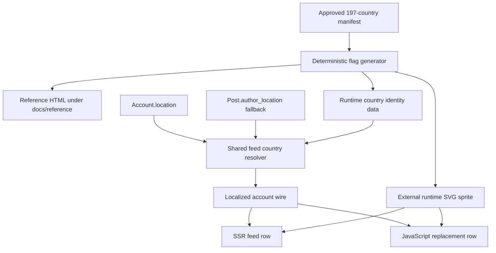
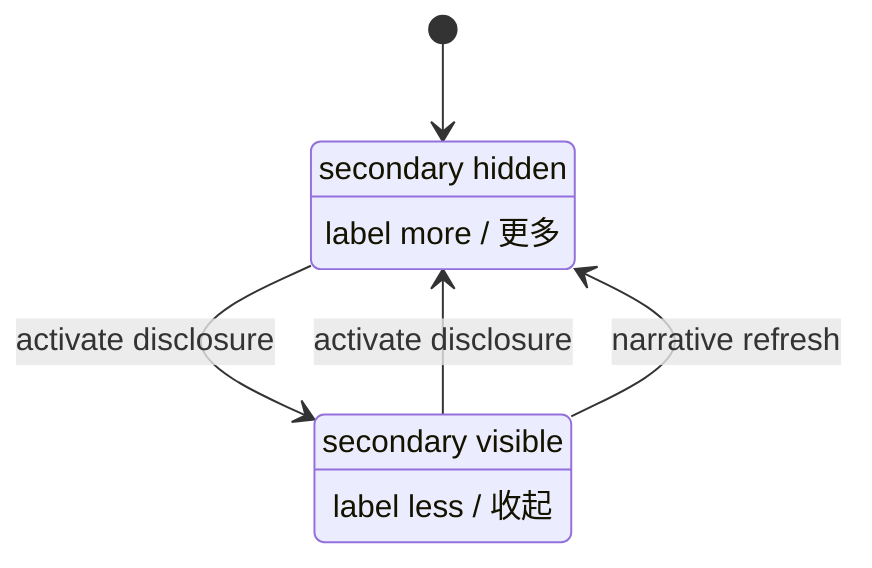

<!-- BEGIN OLLIJA DELIVERY GUIDE -->
## Ollija Delivery Guide

This block is generated guidance. Do not edit it directly. Correct durable facts in `.ollija/project.yaml` or this template, then rerun `./bin/ollija annotate-plan`. Put a user-directed exception in the editable Delivery Exceptions section below.

### Resolved locations

- Authoritative host: `fuchitalee`
- Authoritative repository: `/Users/fuchitalee/development/pushin-weight-v2`
- Ollija release worktree area: `/Users/fuchitalee/development/pushin-weight-v2/.worktrees`
- Active worktree: `/Users/fuchitalee/development/pushin-weight-v2/.worktrees/feat/feed-country-flags-disclosure`
- Plan: `/Users/fuchitalee/development/pushin-weight-v2/.worktrees/feat/feed-country-flags-disclosure/docs/plans/2026-08-29-093958-feat-feed-country-flags-disclosure-plan.md`
- Change: `feat-feed-country-flags-disclosure-2026-08-29-093958`
- Branch: `feat/feed-country-flags-disclosure`
- Staging branch and blueprint: `staging`, `/Users/fuchitalee/development/pushin-weight-v2/.worktrees/feat/feed-country-flags-disclosure/render-staging.yaml`
- Production branch and blueprint: `main`, `/Users/fuchitalee/development/pushin-weight-v2/.worktrees/feat/feed-country-flags-disclosure/render.yaml`
- Staging URL: `https://pushinweight-staging-web.onrender.com`
- Production URL: `https://pushinweight-web.onrender.com`

### Placement

This worktree is inside the Ollija release worktree area. Reuse it for the whole change. Do not create a second worktree or plan for this branch.

### Delivery scope

- Workflow: `lfg`
- Delivery target: `staging`
- Owner selection recorded: `true`

1. Complete implementation and the plan's verification contract.
2. Run the configured focused checks:
   - `pytest tests/ollija`
3. The parent workflow commits only this plan's changes, pushes the feature branch, and records the candidate SHA.
4. Fetch the remote staging lane: `git fetch origin refs/heads/staging`.
5. Require the unchanged candidate SHA to be a fast-forward of that fetched remote ref, then push the exact candidate SHA to `refs/heads/staging` with the server-enforced fast-forward command `git push origin <candidate-sha>:refs/heads/staging`.
6. Verify the remote staging ref resolves to the candidate SHA and the Render deployment for `pushinweight-staging-web` reports that same SHA.
7. Run staging checks. Stop here if they fail.

### Failure handling

- Never promote a staging candidate whose automated checks failed.
- Implementation failures return to the parent implementation workflow for diagnosis, correction, recommit, and restaging.
- SSH, shell, environment, or multi-machine failures use the repository infra/multi-machine skill first.
- The change ledger is advisory; do not validate or enforce it.
- Never force-remove a worktree. Retain staging-only, failed, dirty, locked,
  noncanonical, or candidate-mismatched worktrees for diagnosis or later
  delivery.
- Do not run an endless retry loop or start a persistent Ollija process.
<!-- END OLLIJA DELIVERY GUIDE -->

## Delivery Exceptions

None.

# Feed Country Flags and Reversible Headline Disclosure

## Goal Capsule

- **Objective:** Let homepage readers identify an account's country at a glance and expand or collapse each trend explanation through one clear localized control.
- **Means:** Reuse the feed's existing account-location projection, normalize it against the approved 197-country manifest, render the approved subdued SVG flag, and replace the dual headline controls with one `more`/`less` toggle (KTD1-KTD6).
- **Authority:** The user's visible-behavior instructions govern the product. The approved country manifest and sprite govern country identity and artwork. The latest Bridgewright target chain governs protected homepage behavior. The Ollija Delivery Guide governs delivery location and staging scope.
- **Execution profile:** Work only in the canonical feature worktree. Prove the real authenticated homepage in English and zh-CN through the initial HTML and JavaScript refresh paths. Do not query or mutate production data to rediscover the country source.
- **Stop conditions:** Stop if implementation needs a new country provider, geocoder, database schema, or production deployment; if the 197-code manifest changes identity; if `/internal/` changes; or if required Bridgewright obligations are skipped, missing, errored, unknown, or failed.
- **Tail ownership:** LFG owns commits, PR creation, CI observation, and exact-SHA staging delivery. The worktree remains after staging-only delivery.

---

## Product Contract

### Summary

Move the completed flag review page into reference documentation, make each headline explanation use a reversible `more`/`less` disclosure, and add the account's localized country flag to the homepage follower column. Preserve the current feed, role, locale, and refresh behavior outside these named deltas.

### Problem Frame

The trend headline currently exposes separate `detail` and `hide` controls, and the secondary copy itself also behaves like a collapse control. Readers cannot predict one stable control or label across the collapsed and expanded states.

The homepage feed already persists the account location used by the post's real feed path, but it does not project a normalized country identity. The approved 197-country SVG set and English names now exist, yet the live follower column still reserves only the follower and role slots. Readers therefore cannot see account origin or obtain a locale-matched country name without leaving the feed.

### Key Decisions

- PD1. **Use one headline disclosure control.** (session-settled: user-directed — chosen over the current separate `detail` and `hide` controls: one control should describe and reverse its own state.) Governs R2-R5.
- PD2. **Place the flag relative to the official-role slot.** (session-settled: user-directed — chosen over a fixed flag slot: an official account's flag belongs under its credential badge, while an account without that badge needs the flag directly under followers.) Governs R9-R10.
- PD3. **Localize the full country-name hover text.** (session-settled: user-directed — chosen over a country code or English-only tooltip: the locale toggle should govern the name the reader sees.) Governs R7, R10, and R11.
- PD4. **Reuse the existing feed country source.** (session-settled: user-directed — chosen over repeating the production-data investigation or adding a second source: the session already established where the account location reaches the homepage data path.) Governs R6-R8 and R12.
- PD5. **Use the approved subdued SVG treatment.** (session-settled: user-approved — chosen over the CSS pixel grid and full-brightness artwork: the reviewed SVG stays compact and visually subordinate in the feed.) Governs R8-R10.
- PD6. **Promote only to staging.** (session-settled: user-directed — chosen over production delivery: this run is authorized to stop after exact-SHA staging verification.) Governs R15.
- PD7. **Promote the completed review page to reference documentation.** (session-settled: user-directed — chosen over leaving it under ideation: the artifact is now an approved implementation reference.) Governs R1.
- PD8. **Use official zh-CN territory display names.** (session-settled: user-directed — chosen over agent-written translations: the 197 Chinese names must be imported from the standard entries in Unicode CLDR 48 `common/main/zh.xml`, with the upstream release, URL, and source digest pinned.) Governs R7-R8 and R11.

### Requirements

**Reference artifact**

- R1. Move `docs/ideation/2026-08-29-162947-country-flag-svg-reference.html` to `docs/reference/2026-08-29-162947-country-flag-svg-reference.html`, and update deterministic generation and tests so no stale ideation copy remains.

**Headline disclosure**

- R2. A collapsed headline item shows one disclosure button labeled `more` in English and `更多` in zh-CN, with its secondary copy hidden and `aria-expanded="false"`.
- R3. Activating that button expands only its item, changes the same button to `less` or `收起`, reveals the secondary copy, and sets `aria-expanded="true"`.
- R4. Activating `less` or `收起` collapses the item, restores the collapsed label and ARIA state, and leaves keyboard focus on the disclosure button.
- R5. Server-rendered and JavaScript-rendered headline items use the same one-button contract; a narrative refresh resets replacement items to the collapsed state.

**Country identity and flag rendering**

- R6. Country resolution uses `Account.location` and falls back to `Post.author_location` when the account snapshot is absent; it accepts a supported two-letter code or an exact canonical country name without guessing arbitrary free-form locations.
- R7. Each recognized feed account carries the normalized uppercase code and the full locale-selected country name through the shared wire projection; zh locales use the standard Simplified Chinese territory name imported from Unicode CLDR 48, while English or original locales use the existing English name.
- R8. Runtime country data and the external SVG sprite derive from the approved 197-entry manifest, retain the `XK` exception, exclude `WW` and `HF`, pin the CLDR 48 Chinese-name provenance, and render no flag for an unsupported or missing value.
- R9. An official account renders follower magnitude, the `account-role role-official` badge, then the country flag; without `role-official`, the flag is the first item directly below follower magnitude.
- R10. Every country flag uses the approved sprite symbol's standardized `0 0 16 9` pixel grid at 14 pixels wide within the existing lead column and the review document's exact Recommended presentation (`saturate(0.72) brightness(0.90)` and `opacity: 0.90`); no runtime flag may use the Original or Quieter treatment, distort the audited pixel grid, or displace follower or role semantics.
- R11. Hovering the flag shows the full locale-selected country name through `title`, and assistive technology receives the same name through `aria-label` on a non-focusable image; initial HTML and client-refreshed rows produce identical identity and geometry without adding one tab stop per feed row.

**Boundaries and assurance**

- R12. The change adds no model field, migration, database backfill, geocoding, provider call, harvester behavior, or production-data mutation.
- R13. `/internal/`, feed ordering, pagination, filters, row navigation, headline storage, role filtering, and all unnamed homepage surfaces remain unchanged.
- R14. A new Bridgewright target extends the existing feed/headline contract with the one-button transition and country-flag placement, locale, static-asset, accessibility, and SSR/refresh obligations.
- R15. LFG may push the exact candidate to the feature branch and staging lane, but it must not promote or deploy that candidate to production.

### Acceptance Examples

- AE1. **Reference move.** Given deterministic generation, when outputs are checked, then the reference HTML exists only under `docs/reference/`, the generator writes that path, and all 197 cards remain byte-reproducible.
- AE2. **English headline toggle.** Given a collapsed English headline, when the reader clicks `more`, then the secondary copy appears and the same button reads `less`; clicking `less` hides it and returns focus to `more`.
- AE3. **Chinese headline toggle.** Given a zh-CN headline rendered initially or after refresh, the equivalent labels are `更多` and `收起`, with the same hidden, visible, ARIA, and focus transitions as AE2.
- AE4. **Official account.** Given country `US` and role `official`, the follower column orders follower magnitude, official badge, then a subdued 14-pixel flag whose English accessible name and hover title are `United States`.
- AE5. **No official role.** Given country `CN`, no official role, and zh-CN locale, the flag appears immediately below follower magnitude with accessible name and title `中国`.
- AE5a. **Official Chinese names.** Given the approved `CN`, `US`, `KR`, and `XK` codes in zh-CN, the display names are the CLDR 48 standard values `中国`, `美国`, `韩国`, and `科索沃`; the importer rejects missing, duplicate, inherited-arrow, or alternate-form values.
- AE6. **Unknown location.** Given an empty or unsupported free-form location, the row emits no country code, name, flag, broken SVG request, or non-country sentinel.
- AE7. **Refresh parity.** Given the same account returned by the initial page and `/feed/` refresh, both paths render the same flag symbol, localized name, placement, size, and filter treatment without horizontal overflow at 320, 390, or desktop widths.
- AE8. **Staging boundary.** Given a clean candidate whose local, browser, and Bridgewright gates pass, the feature and staging refs and `pushinweight-staging-web` report that exact SHA while `main` remains unchanged.

### Scope Boundaries

**In scope**

- The reference HTML move and its deterministic path contract.
- Approved country manifest enrichment from pinned Unicode CLDR 48 standard Simplified Chinese territory names and runtime derivation.
- Homepage country projection, external SVG sprite, follower-column presentation, and localized tooltip.
- The one-button headline disclosure across SSR and JavaScript-rendered narratives.
- A new Bridgewright target, assurance declaration coverage, real browser evidence, PR, and staging delivery.

**Deferred to Follow-Up Work**

- Persisting a normalized `accounts.country_code` field or broadening recognition beyond supported exact codes and country names.
- Adding geocoding, fuzzy city or region inference, operator corrections, or account-country analytics.
- Redrawing flags, changing the approved 197-code inventory, or changing the Recommended color treatment.

**Outside this product change**

- Production deployment, database mutation, provider traffic, harvester changes, and `/internal/` redesign.

### Success Criteria

- A reader can reveal and hide each headline explanation using one label that always describes the next reversible state.
- Recognized account origin is readable at a glance without making the feed brighter or changing row alignment.
- English and zh-CN browser sessions expose the correct full country name and preserve the existing feed and headline behavior at desktop and narrow mobile widths.
- The exact candidate produces zero failed, skipped, errored, missing, or unknown Bridgewright obligations and deploys successfully to staging only.

### Product Contract Preservation

The Ollija placeholder is replaced with the complete user-directed product contract. No earlier requirement IDs existed to preserve.

---

## Planning Contract

### Key Technical Decisions

- KTD1. **Normalize at the existing projection boundary.** Convert the persisted account or post location to a supported code while building the shared feed row, rather than adding schema or a second data-loading path. This implements PD4 and R6-R8, R11-R12.
- KTD2. **Import official Chinese names once, then generate runtime identity from the approved manifest.** Import only standard (no `alt`) territory values for the approved 197 codes from Unicode CLDR release 48 at `https://raw.githubusercontent.com/unicode-org/cldr/release-48/common/main/zh.xml`, reject inheritance markers and missing or duplicate values, record that upstream URL/release/SHA-256 (`b1ef8bcadcf19fa8914d9ba812a7bcec124c72fecbf4acea02e4c8bd2fe51866`) plus the Unicode License v3 source notice in manifest metadata, and vendor the resulting `name_zh_cn` values. A one-time generator option accepts a local XML file only after verifying that digest; ordinary generation and tests use the vendored values without network or Babel. Generate a small Python country-data module and validate it against the existing identity and pixel digests. Implements PD3, PD5, PD8, and R7-R8.
- KTD3. **Serve one external multicolor sprite through Django static resolution.** Generate a runtime SVG under `monitor/static/` whose bytes match the committed reference sprite, resolve its fingerprinted URL once with Django's `static` template tag, and expose that URL on the feed root so both the server include and JavaScript replacement renderer append the same symbol fragment. This avoids hard-coded `/static/` paths and injecting the 497 KB sprite or per-pixel paths into every page or row. Implements PD5 and R8-R11.
- KTD4. **Let the server own localized identity.** Add normalized country fields to the existing account wire object and escape them in the JavaScript formatter; both renderers consume the same code and selected name rather than duplicating locale or normalization logic in the browser. Implements PD3-PD4 and R6-R7, R11.
- KTD5. **Make disclosure a two-state button.** Keep one button in the headline title and make its label, `aria-expanded`, and controlled secondary region derive from the collapsed or expanded state. Remove the secondary-copy button semantics and separate hide control. Implements PD1 and R2-R5.
- KTD6. **Use DOM order for flag placement.** Emit the official badge before the flag only for `role-official`; otherwise emit the flag before any preserved non-official badge. Keep the lead column as a vertical flex stack without absolute positioning. Implements PD2 and R9-R10.
- KTD7. **Extend the approved Bridgewright chain.** Create `docs/reference/2026-08-29-184556-feed-country-flags-disclosure-bridgewright-target.md`, make it the latest approved contract, and add the country-flag presentation state to the declaration and executable model. Implements R14.
- KTD8. **Bind assurance to the product-source commit.** Land behavior and regression pins first, record that product-source SHA in the assurance declaration, then run the full candidate gate before shipping the resulting candidate. Bridgewright is a required evidence gate but does not authorize a deployment; Ollija's owner-selected staging guide remains the release authority. Implements R14-R15.
- KTD9. **Keep the reference basename stable.** Move the generated HTML without renaming it, then update the generator and tests to the reference path. Implements PD7 and R1.

### High-Level Technical Design

### Assumptions

- The earlier session finding remains valid: `Account.location`, with `Post.author_location` fallback, is the persisted account-location source to reuse for homepage country resolution.
- Unsupported free-form values fail closed by omitting the flag; this run does not infer countries from cities, regions, prose, or partial matches.
- The `original` locale uses the English country display name because the requested localized variants are English and zh-CN.
- Staff and community role badges remain visible. When `role-official` is absent, the flag is placed before those badges so it remains directly below follower magnitude.
- Native `title` behavior is the hover presentation, paired with an accessible name; no custom tooltip component is introduced.

### System-Wide Impact

- **Request lifecycle:** The existing homepage and feed endpoints gain country identity in their account wire object without another query or persistence path.
- **Static delivery:** WhiteNoise serves one generated SVG sprite. Browsers fetch it once and reuse fragments across visible and refreshed rows.
- **Localization:** Country identity data carries English and Chinese names. The `more` and `less` interface strings enter both Django catalogs and the JavaScript-rendered narrative path.
- **Assurance:** The Bridgewright declaration gains a country-flag state dimension combined with locale, headline disclosure, and role-badge coverage.
- **Operations:** No migration, cron, provider, database, or production action is required. Staging uses the ordinary exact-SHA web deployment path.

### Risks and Mitigations

| Risk | Mitigation |
| --- | --- |
| Raw profile location is not a country | Match only exact supported codes and names; omit unknown values and test no-sentinel behavior. |
| External SVG fragments fail or have zero geometry | Resolve the static URL through the real page and assert the `<use>` target, nonzero bounds, and no request errors in Chromium. |
| SSR and refresh markup diverge | Add the same fields to the shared row projection and assert both renderers in unit and real-browser tests. |
| The flag makes the follower column too bright or tall | Pin the approved 14-pixel size and exact Recommended filter/opacity; verify every rendered flag uses it at 320, 390, and desktop geometry without overflow. |
| Chinese country names drift or become ad hoc translations | Import CLDR 48 standard territory values once, pin provenance and digest in the manifest, and exhaustively require one valid value for every approved code. |
| Locale changes leave stale English titles | Exercise English and zh-CN initial and refreshed rows, including `title`, accessible name, and response locale. |
| Disclosure retains competing collapse targets | Remove the separate hide control and secondary-copy button semantics; test the single-button focus and ARIA transition. |
| Assurance evidence names the wrong revision | Record the product-source commit in the declaration and run the candidate gate against that exact revision before shipping. |

### Sequencing

U1 establishes the moved reference and deterministic runtime country source. U2 uses that source in the shared feed projection and both row renderers. U3 replaces the headline disclosure state machine and localized copy. U4 binds the complete visible delta into Bridgewright and proves the authenticated browser surface before LFG ships to staging.

---

## Implementation Units

### U1. Promote the flag reference and generate runtime country assets

- **Goal:** Make the approved 197-country source usable by both reference documentation and the Django runtime without identity drift.
- **Requirements:** R1, R7-R8, R10, R12; AE1, AE6.
- **Dependencies:** None.
- **Files:**
  - Move `docs/ideation/2026-08-29-162947-country-flag-svg-reference.html` to `docs/reference/2026-08-29-162947-country-flag-svg-reference.html`.
  - Modify `docs/ideation/assets/2026-08-29-162947-country-flag-pixels.json`.
  - Modify `scripts/build_country_flag_svg_reference.py`.
  - Create `monitor/country_flags.py`.
  - Create `monitor/static/pw-country-flags.svg`.
  - Modify `tests/test_country_flag_svg_reference.py`.
  - Create `tests/test_country_flags.py`.
- **Approach:**
  1. Add an explicit one-time `--import-cldr-zh <local-xml>` generator path that verifies the pinned release-48 digest, imports one standard zh-CN display name per existing code, records its provenance, and preserves the audited code, source-name, English-name, and pixel identities.
  2. Change the generator's HTML output path per KTD9 and emit the runtime identity module and static sprite per KTD2-KTD3.
  3. Keep normalization exact and fail closed for blank, malformed, unsupported, `WW`, and `HF` inputs.
- **Execution note:** Add the moved-path, localized-name, and normalization assertions before changing generator outputs; retain the approved pixel and symbol digests.
- **Patterns to follow:** `scripts/build_country_flag_svg_reference.py` for deterministic output and `tests/test_country_flag_svg_reference.py` for exhaustive identity and pixel reconstruction.
- **Test scenarios:**
  - Covers AE1. One generation run writes the reference path and no ideation HTML; check mode passes only when all committed outputs match.
  - Every one of the 197 codes has a nonempty English and zh-CN display name from the pinned CLDR standard territory entries while code, source name, and pixel digests remain pinned; uniqueness is required for the code, not for human display strings.
  - CLDR provenance records release 48, the exact upstream URL, SHA-256, and Unicode License v3 notice; a fixture-driven importer test rejects `alt` entries, inheritance markers, missing codes, duplicate standard entries, and an upstream digest mismatch without network access.
  - `us`, `US`, and `United States` resolve to `US`; `China` and `中国` resolve to `CN`.
  - Empty, arbitrary city text, malformed code, `WW`, and `HF` resolve to no country.
  - The runtime sprite has exactly the approved 197 symbols and matches the reference sprite byte-for-byte.
- **Verification:** The reference move is complete, generation is deterministic, all names are present, and runtime artifacts contain no independent hand-edited identity source.

### U2. Project and render localized account country flags

- **Goal:** Show recognized account origin in the follower column with identical SSR and refresh behavior.
- **Requirements:** R6-R13; AE4-AE7.
- **Dependencies:** U1.
- **Files:**
  - Modify `monitor/views.py`.
  - Modify `monitor/templates/monitor/_feed_initial_v22.html`.
  - Modify `monitor/static/pw-feed.js`.
  - Modify `monitor/static/home-v20.css`.
  - Modify `tests/test_views.py`.
  - Modify `tests/test_home_v22_feed_row_shape.py`.
  - Modify `tests/test_pw_feed_formatter.js`.
  - Modify `tests/test_home_v22_browser.py`.
- **Approach:**
  1. Add `location` to the account enrichment snapshot, then resolve and localize country identity in both the ORM serializer and the enriched-dictionary serializer using `Account.location` with `Post.author_location` fallback per KTD1 and KTD4.
  2. Resolve the fingerprinted sprite URL once on the homepage feed root, then render one accessible fragment reference in each server and client row per KTD3.
  3. Order the official badge and flag per KTD6 and apply the exact Recommended size, filter, and opacity to every runtime flag in the existing follower-column flex stack.
- **Execution note:** Start with failing real caller-to-template and refresh-path tests; do not accept a helper-only normalization test as the regression net.
- **Patterns to follow:** `_v22_feed_display_fields`, `_post_to_wire`, `_feed_initial_v22.html`, `renderRowHtml`, and the role-badge browser assertions in `tests/test_home_v22_browser.py`.
- **Test scenarios:**
  - Covers AE4. An ORM-backed official US account renders the official badge before a `flag-us` fragment with `United States` in English.
  - Covers AE5. An ORM-backed no-role China account renders `flag-cn` immediately below followers and exposes `中国` in zh-CN.
  - A staff or community account preserves its role badge while the recognized flag remains the first item below followers.
  - Covers AE6. Blank and unsupported locations omit all flag markup and country wire values without reserving a broken target.
  - Covers AE7. `/feed/` replacement markup equals the initial row's code, localized title, accessible name, order, computed width, aspect ratio, and exact Recommended filter and opacity; no Original or Quieter treatment is present.
  - The server include and JavaScript formatter use the same Django-resolved fingerprinted sprite URL; no renderer hard-codes `/static/` or emits a missing fragment request.
  - Country, role, and title strings are escaped in client-created markup.
  - `/internal/` retains the legacy table and contains no new V22 flag markup.
- **Verification:** Real ORM rows traverse URL, view, wire projection, template or formatter, and Chromium with nonzero flag geometry and no request, console, page, or overflow errors.

### U3. Replace headline detail and hide controls with one reversible toggle

- **Goal:** Give every trend narrative one localized disclosure button whose label and ARIA state match the next action.
- **Requirements:** R2-R5, R13; AE2-AE3, AE7.
- **Dependencies:** None.
- **Files:**
  - Modify `monitor/templates/monitor/home.html`.
  - Modify `monitor/static/pw-chart.js`.
  - Modify `monitor/static/home-v20.css`.
  - Modify `locale/en/LC_MESSAGES/django.po`.
  - Modify `locale/zh_Hans/LC_MESSAGES/django.po`.
  - Modify `tests/test_i18n_catalog_pinned.py`.
  - Modify `tests/test_home_v22_browser.py`.
- **Approach:**
  1. Render one initially collapsed button and plain secondary copy in the server template.
  2. Make the client renderer emit the same structure and let the shared state transition update visibility, label, ARIA, and focus per KTD5.
  3. Remove the separate hide button and secondary-click or keyboard-collapse behavior so the visible toggle is the sole collapse target.
- **Execution note:** Pin the current real-browser differentiator red first in English and zh-CN, then change product source and compile catalogs.
- **Patterns to follow:** The existing `setHeadlineDetail` state owner, cookie-driven locale behavior, and the locale regression guidance in `docs/solutions/workflow-issues/django-i18n-locale-toggle-debugging-journey.md`.
- **Test scenarios:**
  - Covers AE2. English SSR and refreshed cards transition `more` → `less` → `more`, hide and reveal one secondary, synchronize `aria-expanded`, and return focus after collapse.
  - Covers AE3. zh-CN cards perform the same transition with `更多` and `收起`, and the response language agrees with the visible text.
  - Expanding one item leaves sibling items collapsed.
  - Refreshing narratives replaces an expanded item with a collapsed item labeled for its locale.
  - The secondary copy has no button role or tab stop, and no separate hide control remains.
  - Keyboard activation of the native button follows the same transition without duplicate event handling.
- **Verification:** The authenticated homepage proves one stable disclosure control across locale, initial render, client replacement, focus, and refresh state.

### U4. Bind the delta into Bridgewright and prove the release candidate

- **Goal:** Make the country-flag and headline transitions a durable, exact-revision homepage assurance contract before staging delivery.
- **Requirements:** R11, R13-R15; AE2-AE8.
- **Dependencies:** U1-U3.
- **Files:**
  - Create `docs/reference/2026-08-29-184556-feed-country-flags-disclosure-bridgewright-target.md`.
  - Modify `bridgewright.yaml`.
  - Modify `tests/fixtures/ui_assurance/declaration.json`.
  - Modify `tests/ui_assurance/reference.py`.
  - Modify `tests/ui_assurance/evidence.py`.
  - Modify `tests/test_ui_assurance_browser.py`.
  - Modify `tests/test_bridgewright_v24_target.py`.
  - Modify `tests/test_home_v22_browser.py`.
- **Approach:**
  1. Add the approved delta and protected boundaries to the target chain per KTD7.
  2. Extend the presentation model with recognized, absent, and unsupported country-flag states combined with locale, headline detail, and role badge.
  3. Freeze the product-source commit and run affected and full candidate assessment per KTD8.
  4. Capture desktop English and narrow zh-CN staging evidence without committing screenshots or treating assessment as deployment authority.
- **Execution note:** Run Bridgewright validate and prescribe before product edits, affected assurance during the fix loop, and the exact-revision candidate gate only after the product-source commit exists.
- **Patterns to follow:** `docs/reference/2026-08-28-164425-feed-headline-usability-bridgewright-target.md`, `tests/fixtures/ui_assurance/declaration.json`, and `.claude/skills/fix-ui/SKILL.md`.
- **Test scenarios:**
  - Every declared country-flag value is mapped in the reference model and executable browser harness; unmapped values fail loudly.
  - Pairwise coverage combines country flag, role badge, headline detail, and locale, while the ordered headline sequence remains collapsed → expanded → collapsed.
  - Removing a country-flag or headline evidence row produces a stable missing obligation rather than a skip.
  - The affected and candidate gates report exact executed, skipped, errored, failed, missing, and unknown totals, with every non-executed or unsuccessful total equal to zero.
  - Covers AE8. The feature, staging ref, and staging Render web deployment match the candidate SHA while production remains at its pre-run SHA.
- **Verification:** The target chain names this delta, the full candidate assessment is clean at the recorded product-source revision, and exact-SHA staging health and browser checks pass.

---

## Verification Contract

| Gate | Command | Required evidence |
| --- | --- | --- |
| Bridgewright preflight | `uv run --extra dev bridgewright assurance-validate --project-root .` and `uv run --extra dev bridgewright assurance-prescribe --project-root .` | Pinned build identity, declaration, fixture digest, controls, and obligations are valid before edits. |
| Flag generation | `uv run python scripts/build_country_flag_svg_reference.py --check` | Reference path, 197-country identity, localized names, reference sprite, runtime sprite, and runtime data are deterministic. |
| Focused Python | `uv run --extra dev pytest tests/test_country_flag_svg_reference.py tests/test_country_flags.py tests/test_views.py tests/test_home_v22_feed_row_shape.py tests/test_i18n_catalog_pinned.py -q` | Country source, real feed call chain, SSR shape, and catalog copy pass with zero skips or errors. |
| Focused JavaScript | `node tests/test_pw_feed_formatter.js` | Client replacement escapes and renders country identity and preserves existing row behavior. |
| Real browser | `uv run --extra dev pytest tests/test_home_v22_browser.py -q` | Authenticated initial and refresh paths prove headline transitions, role-aware flag placement, localized hover names, nonzero geometry, and no page, console, request, or overflow errors. |
| Affected assurance | `uv run --extra dev python -m tests.ui_assurance.gate --scope affected` | Every prescribed affected obligation executes and all unsuccessful or missing totals are zero. |
| Candidate assurance | `uv run --extra dev python -m tests.ui_assurance.gate --scope candidate --candidate-revision <product-source-sha>` | Full normalized obligation set and Bridgewright assessment are clean at the declaration's recorded source revision. |
| Django and locale | `uv run python manage.py compilemessages` and `uv run python manage.py check --deploy` | Catalogs compile and Django reports no new deployment errors. |
| Ollija | `uv run --extra dev pytest tests/ollija -q` and `./bin/ollija annotate-plan docs/plans/2026-08-29-093958-feat-feed-country-flags-disclosure-plan.md --check` | Delivery guidance remains unchanged and selects staging with owner authorization. |
| Staging | Exact-SHA ref, Render deployment, health route, and authenticated browser checks | `pushinweight-staging-web` reports the candidate SHA, health returns 200, named UI behavior passes, and production is unchanged. |

---

## Definition of Done

- U1 is done when the HTML exists only in `docs/reference`, the runtime and reference assets regenerate byte-for-byte, and all 197 English and official CLDR 48 Chinese names are present with pinned provenance without changing audited pixels or identities.
- U2 is done when recognized country identity crosses the real ORM-to-wire-to-SSR and refresh call chains, role-aware placement and localized hover names pass, and unknown location produces no flag.
- U3 is done when one native disclosure button owns the localized collapsed and expanded transition for server and client narratives with correct visibility, ARIA, focus, and refresh reset.
- U4 is done when the new Bridgewright target is latest, every affected and candidate obligation is successful, and desktop and narrow zh-CN browser evidence names the product-source revision.
- All required checks run with zero required skips and zero test errors. Any pre-existing warning is identified precisely and is not described as newly green.
- The final diff contains no migration, production data mutation, harvester change, `/internal/` redesign, duplicate ideation HTML, abandoned generated artifact, temporary screenshot, or unrelated root-checkout file.
- The plan retains `delivery_target: staging` and `delivery_selected_by_user: true`; feature, staging, and Render staging identities match the unchanged candidate SHA while `main` and production remain unchanged.
- LFG leaves the staging-only worktree registered for later review or promotion.
