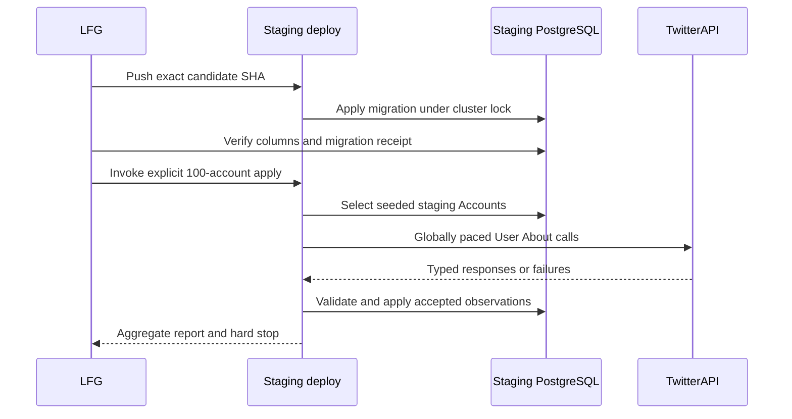
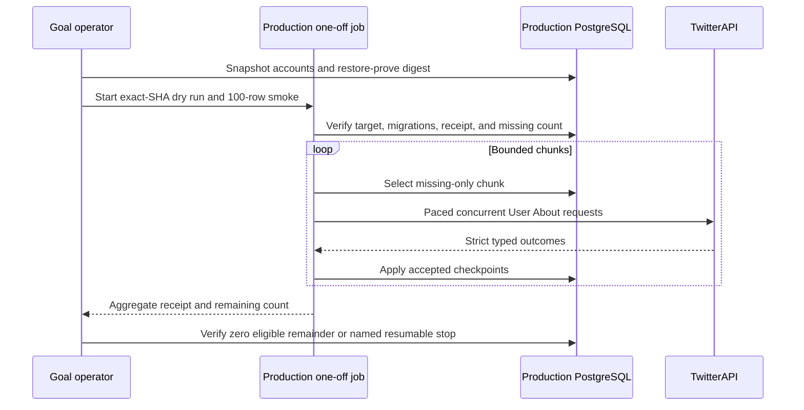
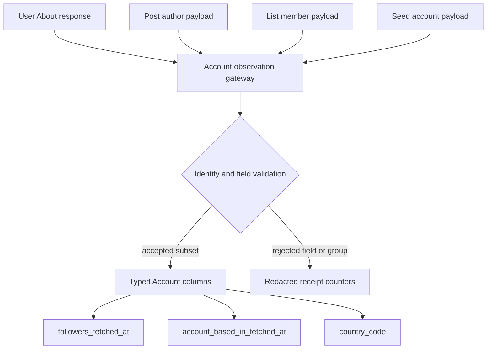
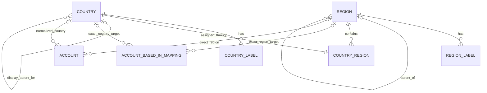
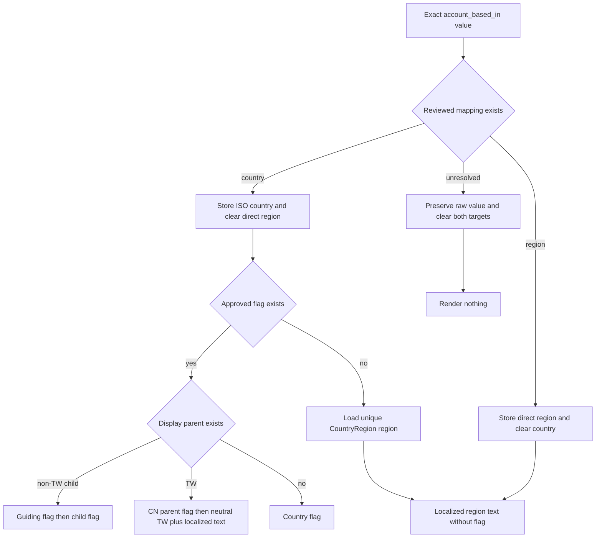
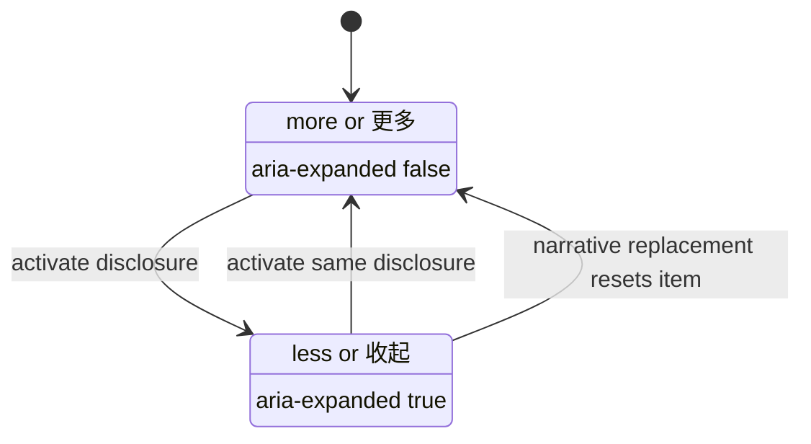

<!-- BEGIN OLLIJA DELIVERY GUIDE -->
## Ollija Delivery Guide

This block is generated guidance. Do not edit it directly. Correct durable facts in `.ollija/project.yaml` or this template, then rerun `./bin/ollija annotate-plan`. Put a user-directed exception in the editable Delivery Exceptions section below.

### Resolved locations

- Authoritative host: `fuchitalee`
- Authoritative repository: `/Users/fuchitalee/development/pushin-weight-v2`
- Ollija release worktree area: `/Users/fuchitalee/development/pushin-weight-v2/.worktrees`
- Active worktree: `/Users/fuchitalee/development/pushin-weight-v2/.worktrees/feat/feed-country-flags-disclosure`
- Plan: `/Users/fuchitalee/development/pushin-weight-v2/.worktrees/feat/feed-country-flags-disclosure/docs/plans/2026-08-29-093958-feat-feed-country-flags-disclosure-plan.md`
- Change: `feat-feed-country-flags-disclosure-2026-08-29-093958`
- Branch: `feat/feed-country-flags-disclosure`
- Staging branch and blueprint: `staging`, `/Users/fuchitalee/development/pushin-weight-v2/.worktrees/feat/feed-country-flags-disclosure/render-staging.yaml`
- Production branch and blueprint: `main`, `/Users/fuchitalee/development/pushin-weight-v2/.worktrees/feat/feed-country-flags-disclosure/render.yaml`
- Staging URL: `https://pushinweight-staging-web.onrender.com`
- Production URL: `https://pushinweight-web.onrender.com`

### Placement

This worktree is inside the Ollija release worktree area. Reuse it for the whole change. Do not create a second worktree or plan for this branch.

### Delivery scope

- Workflow: `lfg`
- Delivery target: `production`
- Owner selection recorded: `true`

1. Complete implementation and the plan's verification contract.
2. Run the configured focused checks:
   - `pytest tests/ollija`
3. The parent workflow commits only this plan's changes, pushes the feature branch, and records the candidate SHA.
4. Fetch the remote staging lane: `git fetch origin refs/heads/staging`.
5. Require the unchanged candidate SHA to be a fast-forward of that fetched remote ref, then push the exact candidate SHA to `refs/heads/staging` with the server-enforced fast-forward command `git push origin <candidate-sha>:refs/heads/staging`.
6. Verify the remote staging ref resolves to the candidate SHA and the Render deployment for `pushinweight-staging-web` reports that same SHA.
7. Run staging checks. Stop here if they fail.
8. Only after staging passes, fetch the remote production lane: `git fetch origin refs/heads/main`.
9. Require the same unchanged candidate SHA to be a fast-forward of that fetched remote ref, then push the exact candidate SHA to `refs/heads/main` with the server-enforced fast-forward command `git push origin <candidate-sha>:refs/heads/main`.
10. Verify the remote production ref resolves to the candidate SHA and the Render deployment for `pushinweight-web` reports that same SHA before reporting completion.
11. After step 10 succeeds, perform worktree cleanup as the final filesystem action:
    - From `/Users/fuchitalee/development/pushin-weight-v2`, require `/Users/fuchitalee/development/pushin-weight-v2/.worktrees/feat/feed-country-flags-disclosure` to remain registered, clean, unlocked, and at the verified candidate SHA. If any guard fails, retain it and report the reason.
    - Run `git -C /Users/fuchitalee/development/pushin-weight-v2 worktree remove /Users/fuchitalee/development/pushin-weight-v2/.worktrees/feat/feed-country-flags-disclosure` without `--force`.
    - Preserve the local and remote feature branches. Continue final reporting from the authoritative repository root.

### Failure handling

- Never promote a staging candidate whose automated checks failed.
- Implementation failures return to the parent implementation workflow for diagnosis, correction, recommit, and restaging.
- SSH, shell, environment, or multi-machine failures use the repository infra/multi-machine skill first.
- The change ledger is advisory; do not validate or enforce it.
- Never force-remove a worktree. Retain staging-only, failed, dirty, locked,
  noncanonical, or candidate-mismatched worktrees for diagnosis or later
  delivery.
- Do not run an endless retry loop or start a persistent Ollija process.
<!-- END OLLIJA DELIVERY GUIDE -->

## Delivery Exceptions

- This plan is the authoritative combined delivery. The former requirements-only successor at `docs/plans/2026-08-29-223000-feed-country-flags-disclosure-successor-plan.md` is an input preserved for traceability; its flag and headline scope is folded into this LFG run.
- Apply and verify the Django migration on the isolated staging database before making a paid User About call.
- Run the first paid population only from the staging environment against 100 unique staging `Account` rows with callable handles. Permit at most 110 attempts and at most 1,980 credits. Apply accepted values only to the staging database.
- Owner follow-up on 2026-08-30 authorizes one schema-diagnostic staging call, a parser correction backed by redacted path/type evidence, and one replacement 100-Account staging pilot. Across the original failed call, diagnostic call, and replacement pilot, remain within the original cumulative ceiling of 110 attempts and 1,980 projected credits. Schema diagnostics may contain JSON paths, field names, and JSON types only; they must not contain response values, handles, Account IDs, URLs, credentials, headers, connection strings, or raw payloads. Correct the mirrored external-vendor endpoint reference from the observed schema before the replacement pilot.
- Owner follow-up on 2026-08-31 selects purpose-based TwitterAPI credentials named `TWITTERAPI_IO_SCHEDULED_API_KEY` and `TWITTERAPI_IO_ON_DEMAND_API_KEY`. Implement and verify the fail-closed repository cutover without adding secret values; its first deployment remains staging before the later production promotion authorized below.
- Owner follow-up on 2026-08-31 authorized the completed production migration and missing-only Account population phase while excluding feed UI from that phase. Preserve the scheduled harvester and do not add recurring User About collection. The later 2026-08-31 directions below supersede only that phase boundary by adding geography and feed UI to this same authoritative delivery.
- Owner follow-up on 2026-08-31 supersedes the earlier per-Account hard-stop policy: strict schema and returned-ID validation still rejects the complete affected observation with no write or checkpoint, but records an aggregate-only quarantine and continues admitting other Accounts. Ten consecutive Account quarantines are treated as systemic drift and stop new admissions; authentication, circuit, database, and hard-budget failures remain global stops. `--require-complete` requires zero retryable Accounts while permitting explicitly quarantined residue for later parser review.
- Owner follow-up on 2026-08-31 adds a post-population geography phase. Use the completed `aboutuserbackfill` state with its existing exclusions and per-Account identity/schema quarantine. Make no additional provider calls for geography. Seed the country/region taxonomy, reconcile persisted `account_based_in` values through exact mappings, and stage and production-verify the integrated migration and feed candidate.
- Owner follow-up on 2026-08-31 constrains country-to-region cardinality to one mapping row per country because TwitterAPI exposes one scalar `account_based_in` value per Account. Use physical table `country_codes_region` with unique `country_code`; many countries may reference one Region, and broader geography derives through `Region.parent` rather than duplicate memberships.
- Owner follow-up on 2026-08-31 selects a hierarchical feed presentation for every currently observed ISO country or area missing from the 197-symbol set. Retain each ISO identity, store one typed directional guiding-country relationship, render the guiding flag first and the child flag second, and import all 18 additional assets through the exact prior R74n pixel-to-SVG conversion and Recommended subdued treatment. Taiwan retains the `TW -> CN` guiding relationship but remains the sole no-child-flag exception: render persistent localized `TW · Taiwan` / `TW · 台湾` intelligence attributed to X and retain but do not feed-render the existing TW symbol.
- Owner follow-up on 2026-08-31 declares `aboutuserbackfill` complete for this delivery. Freeze the current production census as the normalization input, make no more User About calls, and treat remaining quarantined or unresolved rows as explicit residue rather than a launch blocker.
- Owner follow-up on 2026-08-31 authorizes LFG to implement and deliver the remaining geography, flag, feed, and headline-disclosure work through the existing production target. Fold the requirements-only successor into this same authoritative plan; do not create or select a parallel plan.

# Account Geography, Country Flags, and Feed Disclosure - Plan

## Goal Capsule

- **Objective:** Let homepage readers identify X-reported account geography at a glance and expand or collapse each trend explanation through one predictable localized control.
- **Means:** Freeze the completed About-user census, seed normalized country and region data, reconcile Accounts without provider I/O, expand the approved flag set to 215 symbols, and render one localized geography stack plus one reversible headline disclosure.
- **Authority:** The Product Contract governs stored data and write semantics. The official TwitterAPI User About schema and current pricing govern the provider boundary. The Ollija Delivery Guide and Delivery Exceptions govern exact-SHA staging and production delivery.
- **Execution profile:** Implement one reviewed candidate, prove the migration and DB-only reconciliation on staging, verify both homepage render paths in a real browser, then promote the unchanged SHA and repeat the reconciliation and browser proof on production.
- **Stop conditions:** Stop if an existing code is outside the seeded ISO inventory, one provider value maps to multiple targets, an Account has both country and direct region, a country lacks its single fallback region, region ancestry cycles, a guiding relationship differs from the pinned contract, a locale label is absent, an added symbol fails exact reconstruction, staging reconciliation differs from dry-run, or any feed path renders `flag-tw`.
- **Tail ownership:** This LFG run owns the normalized geography schema, one DB-only staging and production reconciliation, the 215-symbol flag reference and runtime sprite, feed rendering, headline disclosure, browser assurance, exact-SHA delivery, and guarded cleanup. Recurring User About collection remains excluded.

---

## Product Contract

### Summary

Normalize the completed TwitterAPI User About data through queryable geography tables, preserve every accepted raw value, and render the resulting country, guiding-country hierarchy, or region in both homepage feed paths. Move the approved flag reference to durable documentation and replace the two-control headline interaction with one localized `more`/`less` button.

### Problem Frame

`Account.location` and `Post.author_location` are optional free-form profile text. `Post.place.country_code` is a rare post geotag. Neither represents the About-this-account value selected for country flags. X documents that About this Account may expose either a country or a region, so a country-only normalizer cannot represent every valid response.

TwitterAPI exposes `about_profile.account_based_in` through `/twitter/user_about`, one handle per call. The production-sized population is roughly 59,225 calls before retries. The endpoint also returns profile identity, creation, verification, affiliate-label, About, and identity-label values. Storing only country would discard account data already paid for; storing a raw response would weaken queryability and validation.

The current 197-entry normalizer also uses the approved flag inventory as its country-validity boundary. That coupling rejects valid ISO countries and areas such as Hong Kong, Macao, and Puerto Rico merely because they lack an approved asset. Aggregate regions cannot be stored in a two-letter ISO field. A separate region namespace, one reviewed region assignment per country, and an optional region-parent hierarchy are required before the feed can fall back without fabricating codes or flags. The provider returns one scalar country-or-region value per Account, not an array or multiple simultaneous regions.

The Django harvester formerly wrote Account snapshots directly with `update_or_create`. The model gateway added in the completed foundation protects good values, but the geography migration and feed projection must retain the same last-valid-write and strict identity semantics. The current server-rendered and JavaScript-replacement feed rows duplicate account metadata behavior, and the current headline uses separate `detail` and `hide` controls, so parity and state behavior must be changed together.

### Key Decisions

- PD1. **Use one headline disclosure control.** (session-settled: user-directed — chosen over separate detail and hide controls: one control should describe and reverse its own state.) Governs R2-R5.
- PD2. **Place the geography signal relative to the official-role slot.** (session-settled: user-directed — chosen over a fixed flag slot: official accounts place geography below the badge; other accounts place it directly below followers.) Governs R9-R10.
- PD3. **Localize full geography hover text.** (session-settled: user-directed — chosen over a code or English-only tooltip: the locale toggle should govern the visible name.) Governs R7, R10-R11, and R38.
- PD4. **Use About-this-account as the account-geography source.** (session-settled: user-approved — chosen over profile location and post geotags: `account_based_in` is the selected X-reported account signal.) Governs R6 and R21.
- PD5. **Use the approved subdued SVG treatment.** (session-settled: user-approved — chosen over CSS pixels and full-brightness artwork: the flag should stay subordinate in the feed.) Governs R8-R10.
- PD7. **Promote the approved review page to reference documentation.** (session-settled: user-directed — chosen over leaving it under ideation: it is the implementation reference.) Governs R1.
- PD8. **Use official zh-CN country and area display names.** (session-settled: user-directed — chosen over improvised translations: names come from the pinned CLDR/M49 source.) Governs R7-R8, R11, and R33.
- PD6. **Prove the first paid write only on staging.** (session-settled: user-directed — chosen over direct production delivery: migration, paid calls, and writes had to be proven on the isolated staging database before the later production authorization.) Governs R15-R18.
- PD9. **Persist typed fields, not raw JSON.** (session-settled: user-directed — chosen over one raw response column: every account-valued response leaf should be queryable with an appropriate type.) Governs R12 and R19.
- PD10. **Evaluate about 100 calls before a larger run.** (session-settled: user-directed — chosen over immediate population of every Account: actual schema, yield, time, and credit burn must be confirmed first.) Governs R16-R18 and R20.
- PD11. **Allow valid post observations to refresh shared mutable fields.** (session-settled: user-directed — chosen over freezing the User About snapshot or adding history now: post author payloads are generally fresher.) Governs R22 and R24.
- PD12. **Validate at the Django model boundary.** (session-settled: user-directed — chosen over parser-only validation and direct ORM defaults: faulty observations must not clobber good Account values.) Governs R22-R24.
- PD13. **Name credentials by execution policy.** (session-settled: user-selected — scheduled collection uses `TWITTERAPI_IO_SCHEDULED_API_KEY`; explicitly launched bulk and backfill work uses `TWITTERAPI_IO_ON_DEMAND_API_KEY`.) Neither credential is a fallback for the other. Governs R27.
- PD14. **Continue through one production missing-only population.** (session-settled: user-directed — chosen after the 100-account staging pilot succeeded: migrate the exact reviewed candidate, prove recovery, smoke-test the production call chain, then populate every currently eligible Account without scheduling refreshes.) Governs R28-R32.
- PD15. **Give each country one provider-compatible region through a constrained mapping table and model broader geography through region ancestry.** (session-settled: user-directed — chosen over a many-to-many country-region join: observed TwitterAPI responses contain one scalar country-or-region value per Account.) The physical `country_codes_region` table permits many countries per Region but enforces exactly one row per country; `Region.parent` represents broader hierarchy without duplicate country memberships. ISO identity stays country-only and regions remain the text fallback. Governs R6 and R33-R37.
- PD16. **Keep each country or area as its own ISO identity with one typed directional guiding country.** (session-settled: user-directed — chosen over rewriting child codes to their guiding country or treating guiding countries as regions.) The feed renders the guiding flag first and the child signal second. `HK`, `MO`, and `TW` point to `CN`; `PR` and `VI` to `US`; `RE`, `PF`, `MQ`, `NC`, and `GF` to `FR`; `KY`, `JE`, `AI`, `BM`, `GI`, `GG`, and `IM` to `GB`; and `AW` and `BQ` to `NL`. The stored relationship kind distinguishes special administrative regions, US insular areas, French overseas arrangements, British Overseas Territories, Crown Dependencies, a Kingdom constituent country, Netherlands public bodies, and the owner-selected Taiwan display context. Governs R34 and R38.

### Requirements

**Reference and feed geography**

- R1. Move `docs/ideation/2026-08-29-162947-country-flag-svg-reference.html` to `docs/reference/2026-08-29-162947-country-flag-svg-reference.html` and extend deterministic generation from 197 to 215 approved symbols with the 18 pinned R74n sources.
- R7. Resolve every normalized country or direct region through the seeded locale labels, using `en` and official Simplified Chinese names selected by the homepage locale.
- R8. Render only an accepted normalized geography target: use a country flag when approved, localized region text when the normalized target has no flag, and no signal or reserved gap for unresolved data.
- R9. Render every flag with the Recommended presentation treatment at the same 14-pixel width as the account-role icons.
- R10. Order official accounts as followers, official badge, then geography; without `role-official`, put geography directly below followers and before any preserved non-official badge.
- R11. Initial HTML and JavaScript replacement rows must expose the same identity, hierarchy, locale-selected name, hover text, and accessible text without adding a tab stop.
- R13. Preserve feed ordering, pagination, role logic, filters, chart behavior, cookies, `/internal/`, and all unnamed homepage surfaces.
- R14. Extend the active Bridgewright contract with geography presence, absence, locale, hierarchy, role placement, headline transitions, and protected-boundary scenarios.

**Headline disclosure**

- R2. A collapsed headline shows one English `more` or zh-CN `更多` button, hides secondary copy, and sets `aria-expanded="false"`.
- R3. Activating the button expands only its item, reveals secondary copy, changes the same button to English `less` or zh-CN `收起`, and sets `aria-expanded="true"`.
- R4. Activating `less` collapses the same item, restores the collapsed label and ARIA state, and leaves focus on that same button.
- R5. Server-rendered and JavaScript-replacement narratives use the same one-button contract; replacing narrative items resets them to collapsed.

**Typed persistence**

- R6. Resolve `Account.account_based_in` only through an exact, reviewed provider mapping. A country target writes an official ISO 3166-1 alpha-2 code. A region target writes a separate region key. Preserve the exact provider value and do not infer from profile location, post geotags, cities, case folding, whitespace repair, or fuzzy matching.
- R12. Give every documented leaf under a successful User About `data` object one typed Account destination in the field map below. Reuse semantically identical existing fields and add only missing columns.
- R19. Add no raw User About JSON column. Flatten nested label objects into typed nullable fields, convert camelCase leaves to snake_case, and keep concise provider terminology.
- R21. Reject the full User About observation on returned-ID mismatch, unknown response leaf, or documented type mismatch. Record the failure without an Account write. An otherwise valid response whose exact `account_based_in` value has no reviewed mapping still checkpoints and stores that exact value, but derives neither a country nor a region.

**Account write ownership and freshness**

- R22. Apply serialized last-valid-write semantics to shared mutable fields. An explicitly present, valid post or list value may replace the current value. A missing or invalid value may not clear, false-coerce, or replace it. `created_at` is fill-once and conflicts are reported.
- R23. Every current Django Account writer must submit source, observation time, field presence, and candidates through one model-owned gateway. Reject identity mismatch for the whole observation. Reject malformed independent fields or coupled label groups without blocking other valid Account fields or the related Post write.
- R24. An accepted explicit post `followers_count` observation updates `followers_fetched_at` in the same transaction even when the count is unchanged. Missing or rejected follower values update neither field.

**Bounded staging pilot**

- R15. Deploy only to the exact-SHA staging lane. Apply the migration to staging and verify its database schema before paid calls. Do not mutate `main`, production services, or the production database.
- R16. Select 100 unique staging Accounts with nonblank handles using a recorded seed. Call `/twitter/user_about` once per selected handle. Permit at most 110 attempts, a projected spend of 1,980 credits under the published profile rate, 30 minutes of wall time, and the lower of 5 QPS or the verified balance-derived provider allowance.
- R17. Apply only accepted responses to their matching staging Account rows. Produce timestamped JSON and Markdown reports with sample definition, response distribution, leaf coverage, country yield, `location_accurate` and `source` distributions, rejections, retries, latency percentiles, wall time, effective QPS, credits, and projected full-run cost and duration.
- R18. The 100-account staging pilot stopped for owner review before production or UI work; the later PD14 and 2026-08-31 delivery directions satisfy that gate.
- R20. The command is default-dry-run, explicit-apply, resumable, idempotent for successful empty results, globally rate-limited, bounded by account, attempt, credit, and wall-time budgets, and absent from cron, Celery beat, and `run_cycle`.
- R25. The completed production User About apply required a current encrypted pre-write Account snapshot, row count, digest, and disposable restore proof. The remaining geography production apply requires the newer, narrower recovery proof in R39.
- R26. Read the TwitterAPI credential only from the staging service's managed environment. Fail closed when it is absent or invalid. Never accept it as a command argument or write it, request headers, connection strings, handles, Account IDs, or raw provider payloads to tracked reports or normal logs.
- R27. Every TwitterAPI caller must declare scheduled or on-demand intent at its construction boundary. Recurring `run_cycle` and its search/metrics calls require `TWITTERAPI_IO_SCHEDULED_API_KEY`; About-user, backfill, reconciliation, probe, smoke-test, and other explicitly launched calls require `TWITTERAPI_IO_ON_DEMAND_API_KEY`. The legacy `TWITTERAPI_IO_API_KEY` is not read, and neither designated variable may fall back to the other.

**Production population**

- R28. Production apply must require both `X_MONITOR_DEPLOYMENT_ENVIRONMENT=production` and PostgreSQL `current_database() = 'pushinweight_shadow'`; staging apply must retain its existing dual identity guard. A local process, wrong service, wrong database, or missing explicit target fails before credential access or HTTP.
- R29. Production apply must require a fresh pre-write snapshot receipt naming the Account row count, SHA-256 digest, encrypted-at-rest snapshot location, restore-proof database or schema, restore row count/digest, and completion timestamp. The command validates a receipt digest and freshness before HTTP; the runbook retains the full untracked receipt and recovery commands without account data or credentials.
- R30. The production runner is default-dry-run, explicit-apply, missing-only unless `--refresh` is separately supplied, and restart-safe through database checkpoints. It processes bounded chunks, applies each completed chunk before fetching the next, reselects eligible rows between chunks, and never depends on Render's ephemeral filesystem for progress.
- R31. One production invocation must hold a nonblocking PostgreSQL advisory lock and enforce explicit global ceilings for Accounts, attempts, projected credits, wall time, QPS, and concurrency. It may use bounded concurrent HTTP over one reusable session to approach the lower of operator and verified provider QPS, but reservations must prevent attempt or credit overshoot and a stop signal must prevent new requests.
- R32. Run an exact-SHA production smoke of at most 100 previously unfetched Accounts before expansion. Stratify it across old/middle/new X-account age, small/medium/large/unknown follower size, and US/EU/Japan/other/unknown public profile-location proxies; the location proxy diversifies the test only and never supplies `country_code`. Continue only when migration/schema identity, checkpoint counts, provider outcomes, raw `account_based_in` yield, current exact-country yield, projected credits, and scheduled-harvester health reconcile. The full run ends only when the eligible missing-only count reaches zero or emits a named hard stop and resumable remainder. After the missing-only population finishes, reconcile already-checkpointed rows for the current reviewed exact country aliases with one bounded exact-value update and verify that no supported country alias remains with a null `country_code`; leave region and unresolved values raw and unnormalized until R36.

**Post-population geography**

- R33. Seed queryable `Country`, localized country label, `Region`, localized region label, constrained `CountryRegion`, and exact `AccountBasedInMapping` records from one pinned, digest-checked manifest. Map `CountryRegion` to physical table `country_codes_region`, enforce `country_code` uniqueness, and permit many countries to reference one Region. Include every ISO alpha-2 country or area in the pinned UN M49 dataset, its one reviewed provider-compatible region assignment, the parent-linked region hierarchy, official English and Chinese M49 labels, and only reviewed provider-specific regions with owner-reviewed zh-CN labels.
- R34. Keep the physical `accounts.country_code` column nullable and restricted to official alpha-2 values. Add one nullable direct-region foreign key. An Account may have a country, a direct region, or neither, but never both for one accepted About value. Country stores nullable `display_parent_country` and `display_parent_relationship_type` metadata for the reviewed country/area mappings in PD16. The relationship is directional presentation context, never a country-code rewrite or an assertion that every child is constitutionally part of the guiding state. A child may have at most one guiding country; guiding countries have no reciprocal child pointer.
- R35. Store exactly one reviewed `CountryRegion` row per Country, with `country_code` unique and `region` a foreign key. Store broader geography only through an acyclic nullable `Region.parent` chain; do not duplicate ancestor memberships. A country without an approved flag resolves directly through its mapping row to the assigned localized region. Country-backed Accounts derive that fallback and do not store a second region pointer.
- R36. Treat the owner's 2026-08-31 completion direction as the terminal `aboutuserbackfill` boundary. Freeze the current distinct-value census, classify every nonblank raw value as exact country, exact region, or explicitly unresolved, and reconcile through a default-dry-run, explicit-apply, idempotent DB-only command that performs zero TwitterAPI calls.
- R37. When a later accepted About observation changes classification, update the raw value and normalized target atomically. Clear a stale country when the new target is a region or unresolved. Clear a stale direct region when the new target is a country or unresolved.
- R38. Render the guiding flag first with a clear subordinate connector or offset whenever `display_parent_country` exists, then render the child's own flag from the expanded approved sprite. Apply this to every reviewed PD16 mapping except `TW`: never render the Taiwan flag and instead render a persistent neutral `TW · Taiwan` / `TW · 台湾` child signal. Its accessible and hover copy is `X reports this account is based in Taiwan` in English and `X 显示此账号所在地为台湾` in zh-CN. Preserve the exact child code and X-derived `account_based_in`, expose the relationship type when useful, and never present this signal as nationality or self-identification.
- R39. Before production geography apply, create a fresh encrypted snapshot of the affected Account geography columns, row count, and deterministic digest. Restore-prove it on a disposable relation and require the receipt before any reconciliation write.

### Acceptance Examples

- AE1. **Deterministic flag reference and runtime sprite**
  - **Given:** The pinned 215-entry pixel manifest and generator.
  - **When:** Reference and runtime outputs are generated twice.
  - **Then:** Both runs produce byte-identical 215-symbol outputs, and the approved HTML exists only under `docs/reference`.
- AE2. **English headline disclosure reverses through one control**
  - **Given:** A collapsed English headline item.
  - **When:** The user activates `more`, then activates `less`.
  - **Then:** The same focused button moves `aria-expanded` from false to true to false while secondary copy reveals and hides.
- AE3. **Chinese headline disclosure mirrors English**
  - **Given:** A collapsed zh-CN headline item.
  - **When:** The user activates `更多`, then activates `收起`.
  - **Then:** The same button and secondary-copy state follow AE2.
- AE4. **Official country account stacks role before geography**
  - **Given:** An English official Account normalized to `US`.
  - **When:** Its post appears in the initial or replacement feed.
  - **Then:** Followers, official badge, and the Recommended 14-pixel US flag appear in order with `United States` hover and accessible text.
- AE5. **No-official-role country account puts geography below followers**
  - **Given:** A zh-CN Account normalized to `CN` without `role-official`.
  - **When:** Its post appears in the feed.
  - **Then:** The flag appears directly below followers with `中国` hover and accessible text before any non-official role badge.
- AE6. **Unresolved evidence does not invent geography**
  - **Given:** An Account with profile location or post geotag data but no normalized About target.
  - **When:** Its post renders.
  - **Then:** No flag, region text, placeholder, or reserved gap appears.
- AE7. **Initial and replacement feed parity**
  - **Given:** Country-only, guiding-country, Taiwan-neutral, region-only, and unresolved Accounts in both locales.
  - **When:** The page first renders and later replaces the feed through JavaScript.
  - **Then:** Identity, hierarchy, order, dimensions, treatment, text, escaping, and accessibility match at narrow and desktop widths.
- AE8. **Bridgewright protects the approved homepage delta**
  - **Given:** The affected and candidate assurance gates.
  - **When:** Geography and headline scenarios run against the staged candidate.
  - **Then:** No required obligation is missing, skipped, errored, failed, or unknown.
- AE9. **Capped staging population**
  - **Covers:** R15-R18 and R20.
  - **Given:** The exact candidate migration is applied to staging and 100 unique staging Accounts are selected with a recorded seed.
  - **When:** The operator runs explicit apply and two calls retry.
  - **Then:** The report records 100 selected Accounts, 102 attempts, exact writes and rejections, wall time, and credits without any production write.
- AE10. **Identity or schema drift**
  - **Covers:** R21.
  - **Given:** A response returns another user ID, an undocumented leaf, or a documented field with the wrong type.
  - **When:** The strict parser evaluates it.
  - **Then:** No Account field or fetched timestamp changes; the affected observation is rejected without a write or checkpoint, an aggregate-only quarantine is recorded, and other Accounts continue. Ten consecutive quarantines stop new admissions; authentication, circuit, database, and hard-budget failures remain global stops.
- AE17. **Unmapped geography value remains observable**
  - **Covers:** R6 and R21.
  - **Given:** A structurally valid matching response contains an exact `account_based_in` value that is absent from the reviewed provider mapping.
  - **When:** The strict parser and Account gateway accept the response.
  - **Then:** The exact provider value and fetched timestamp are stored, both normalized targets are cleared or null, the outcome is counted as unmapped, and the row is not retried merely because normalization failed.
- AE11. **Typed deduplicated persistence**
  - **Covers:** R6, R12, and R19.
  - **Given:** A complete documented response.
  - **When:** The Account observation gateway accepts it.
  - **Then:** Shared fields and every missing typed destination are populated, exact geography resolution derives either `country_code`, a direct region, or neither for an unresolved value, and no Account JSON field exists.
- AE12. **Successful empty lookup is resumable**
  - **Covers:** R20.
  - **Given:** A successful response omits optional About and label values.
  - **When:** The command checkpoints the row and restarts.
  - **Then:** `account_based_in_fetched_at` records completion and default missing-only selection does not charge for it again.
- AE13. **Newer post values can win safely**
  - **Covers:** R22-R23.
  - **Given:** User About populated shared mutable fields and About-only country fields.
  - **When:** A later post explicitly carries a new valid handle, display name, blue-verification value, and affiliate label.
  - **Then:** Shared values change while About-only values and their fetched time remain intact.
- AE14. **Missing post fields do not erase**
  - **Covers:** R22-R23.
  - **Given:** An Account has non-null shared values.
  - **When:** A later author payload omits blue verification or affiliate label.
  - **Then:** Existing values remain unchanged.
- AE15. **Faulty post fields are contained**
  - **Covers:** R22-R23.
  - **Given:** A post carries a malformed handle, negative count, invalid URL, or future creation time alongside one valid display-name update.
  - **When:** The production post-to-Account call chain runs.
  - **Then:** The gateway preserves rejected fields, accepts the display name, records redacted rejection reasons, and still persists the Post.
- AE16. **Follower observation freshness**
  - **Covers:** R23-R24.
  - **Given:** An Account has follower count 1,000 observed at T1.
  - **When:** A post at T2 explicitly supplies 1,000 and a post at T3 omits or malforms the count.
  - **Then:** The count remains 1,000, `followers_fetched_at` advances to T2, and T3 changes neither field.
- AE18. **Credential-purpose isolation**
  - **Covers:** R27.
  - **Given:** Scheduled, on-demand, and legacy variables contain distinct sentinel values.
  - **When:** The production `run_cycle` caller and the About-user management command construct their TwitterAPI requests.
  - **Then:** The scheduled caller receives only the scheduled sentinel, the About-user caller receives only the on-demand sentinel, and deleting either required variable fails that path even when the other two remain set.
- AE19. **Wrong production identity fails before spend**
  - **Covers:** R28-R29.
  - **Given:** Production apply is requested with the staging database, a non-production deployment marker, an absent/stale snapshot receipt, or a receipt whose restored digest does not match.
  - **When:** Command preflight runs.
  - **Then:** It performs zero credential reads, HTTP calls, and Account writes and names only the failed gate.
- AE20. **Chunk crash resumes from durable checkpoints**
  - **Covers:** R30.
  - **Given:** The first two chunks are accepted and written, then the process exits before the third.
  - **When:** The same missing-only production command restarts.
  - **Then:** It excludes both completed chunks, retries only rows without a successful checkpoint, and needs no local state file.
- AE21. **Concurrent pacing cannot overshoot budgets**
  - **Covers:** R31.
  - **Given:** Several workers finish and retry out of order near the attempt, credit, or wall-time boundary.
  - **When:** The shared reservation and pace gates admit requests.
  - **Then:** Actual attempts and projected credits never exceed their explicit ceilings, no request begins after the stop signal, and connector concurrency stays at or below the operator cap.
- AE22. **Smoke-to-full production expansion**
  - **Covers:** R32.
  - **Given:** The exact production SHA and migrations are verified and the recovery receipt is fresh.
  - **When:** A 100-account smoke completes and reconciles.
  - **Then:** The missing-only full run continues under the same SHA and policies, aggregate reports reconcile each checkpointed chunk, and final SQL reports zero remaining callable Accounts without a checkpoint.
- AE23. **Country and region are distinct normalized outcomes**
  - **Covers:** R6, R33-R34, and R37.
  - **Given:** One Account returns `United States`, one returns `Europe`, and one later changes from `Europe` to `United States`.
  - **When:** Exact mapping and the model gateway apply the observations.
  - **Then:** The first and changed Accounts store `US` with no direct region, the second stores the Europe region with no country, and no stale pointer survives.
- AE24. **Country without an approved flag falls back through its assigned region**
  - **Covers:** R33, R35, and R38.
  - **Given:** An Account stores `PR`, the approved flag manifest has no `PR` symbol, Puerto Rico's unique `CountryRegion` row points to Caribbean, and Caribbean has any broader geography through `Region.parent`.
  - **When:** The feed resolver evaluates the Account in either locale.
  - **Then:** It exposes Caribbean's English or zh-CN label as text without any flag or invented code; the one-to-many mapping requires no priority arbitration.
- AE25. **Special territory composition preserves identity**
  - **Covers:** R34 and R38.
  - **Given:** Three Accounts store `HK`, `MO`, and `TW`.
  - **When:** The feed resolver evaluates each Account.
  - **Then:** Each retains its own country identity and belongs to East Asia. All three render the `CN` guiding flag first; HK and MO then render their subordinate flags, while TW renders the persistent neutral `TW · Taiwan` or `TW · 台湾` signal with no Taiwan flag. `CN` alone remains one flag and no country-to-region rewrite occurs.
- AE28. **Observed ISO territories preserve identity under guiding-country composition**
  - **Covers:** R34 and R38.
  - **Given:** Accounts normalize to `PR`, `RE`, `KY`, `JE`, `AW`, and `BQ`, and each Country row carries the reviewed guiding-country code and relationship type.
  - **When:** The feed resolver evaluates each Account in either locale.
  - **Then:** It renders US→Puerto Rico, France→Réunion, UK→Cayman Islands, UK→Jersey, Netherlands→Aruba, and Netherlands→Caribbean Netherlands as guiding flag followed by subordinate territory flag, preserves the child ISO code and localized name, and does not describe Crown Dependencies or constituent countries as part of the guiding state.
- AE26. **Post-run geography reconciliation is deterministic**
  - **Covers:** R33-R37.
  - **Given:** `aboutuserbackfill` is complete and the final census contains country aliases, direct regions, and reviewed unresolved values.
  - **When:** Reconciliation dry-run and apply run against the same database state, then apply runs again.
  - **Then:** Dry-run counts equal the first apply, the second apply changes zero rows, every mapped row satisfies the country/direct-region constraint, unresolved raw values remain unchanged, and no provider call occurs.
- AE27. **Geography rollback evidence is current and narrow**
  - **Covers:** R39.
  - **Given:** The geography candidate is ready for production and the earlier paid-population snapshot predates the final About rows.
  - **When:** Production preflight runs.
  - **Then:** It refuses apply until a new encrypted geography snapshot is restored to a disposable relation with matching row count and digest; no stale paid-run receipt is accepted.

### Scope Boundaries

**In scope**

- The completed User About protocol, typed Account columns, exact country-or-region resolution, and model-owned observation gateway as the foundation to preserve.
- A pinned country/region taxonomy, localized labels, one region assignment per country, parent-linked region ancestry, typed guiding-country relationships, exact provider mappings, and an Account direct-region pointer.
- One DB-only geography reconciliation through staging and production with no provider I/O.
- Deterministic 215-symbol reference and runtime SVG outputs using the approved Recommended treatment.
- Homepage ORM-to-wire-to-server/client geography rendering and one reversible localized headline disclosure.
- Bridgewright, browser, migration, harvester-regression, staging, and production verification for the unchanged candidate SHA.

### Deferred to Follow-Up Work

- Account observation history or per-field timestamps beyond `followers_fetched_at` and `account_based_in_fetched_at`.
- Scheduling or recurring refresh of User About.

**Outside this plan**

- Treating `account_based_in` as nationality, citizenship, permanent residence, or a guarantee of physical location.
- Assigning aggregate regions synthetic or user-assigned ISO alpha-2 codes, giving regions flags, or using Apple/Google storefront buckets as the geography authority.
- Guessing ambiguous exact values such as `Korea`, `Australasia`, `Eastern Europe (Non-EU)`, or `Bonaire` without reviewed provider semantics and a pinned mapping entry.
- Making any new TwitterAPI call, restarting `aboutuserbackfill`, or changing its completed data-collection behavior.
- Changing the seven-call search plan, live cursors, metrics refresh, headline worker, production scheduler, or retired v1 stack.

### Product Contract Preservation

Changed by explicit owner direction: the completed enrichment requirements, stable R/AE/KTD/U IDs, typed field map, and validation semantics retain their prior meaning. The 2026-08-31 direction adds R33-R39 and AE23-AE28 for normalized geography, treats U10 as complete, and folds the successor's preserved R1-R5, R7-R11, R13-R14, and AE1-AE8 into this delivery. Country-to-Region remains one mapping row per Country, all 18 added country/area identities receive typed guiding-country composition, and Taiwan keeps the neutral no-flag exception.

---

## Planning Contract

### Key Technical Decisions

- KTD10. **Flatten every documented User About `data` leaf into a typed Account destination.** (session-settled: user-directed — chosen over raw JSON and redundant account-prefixed names: provider-shaped fields should remain queryable and type-safe.) Reuse semantic matches, snake-case camelCase, and drop structural wrappers. Implements PD9, R12, and R19.
- KTD11. **Extend the hardened TwitterAPI caller instead of creating a parallel client.** Reuse one `aiohttp` session, a bounded connector, Retry-After, jitter, split timeouts, and circuit breaking from `monitor/twitterapi/caller.py`. Add one aggregate pace gate capped by the current balance-derived provider QPS and by the command's lower operator cap. Implements R16 and R20.
- KTD12. **Make Account own observation validation and application.** (session-settled: user-directed — chosen over parser-only validation and direct `update_or_create` defaults: every writer needs the same protection.) A transactional model gateway accepts explicitly present fields, validates the proposed subset and cross-field invariants, locks only the target row during comparison and apply, and returns structured applied, unchanged, and rejected outcomes. Implements PD12 and R22-R24.
- KTD13. **Checkpoint successful responses, including success-empty.** Set `account_based_in_fetched_at` after an accepted provider success even when optional About fields are absent. Leave transport, provider, identity, or schema failures retryable. Implements R20-R21.
- KTD14. **Use a migration-first staging pilot.** (session-settled: user-directed — chosen over testing migration or API writes on production: both must be proven against the isolated staging database.) The candidate deploy applies its migration through `build.sh` before the command can select or update staging Accounts. Implements PD6 and R15-R18.
- KTD15. **Use field presence and serialized last-valid-write ownership.** (session-settled: user-directed — chosen over preserving User About snapshots or adding change history: later valid post values should refresh overlapping mutable facts.) “Latest” means the most recently accepted database commit, not event-time arbitration. `created_at` is fill-once. Implements PD11 and R22.
- KTD16. **Activate the existing follower freshness field.** Update `followers_fetched_at` for each accepted explicit follower observation, including an unchanged count. PostgreSQL does not provide a durable per-column last-write timestamp. Implements R24.
- KTD17. **Keep request envelopes out of Account.** Store `status`, `msg`, HTTP status, attempt, latency, and error reason in the run report or dead letter. They describe a call, not an account. Implements R19-R21.
- KTD18. **Reconcile paid usage with provider evidence.** Before each call, refuse an attempt whose published-rate projection would exceed 1,980 credits. Record application attempts and expected pricing, then reconcile the exact UTC pilot window to the TwitterAPI Recent API Calls ledger when dashboard credentials are available. A missing or inconsistent ledger makes the cost result inconclusive and stops the run after staging writes; it never authorizes expansion. Implements PD10 and R17-R18.
- KTD19. **Replace flag-derived country validity with one pinned geography manifest.** Generate the exact resolver and frozen seed payload from a digest-checked manifest based on ISO alpha-2 and UN M49, then add reviewed provider aliases and provider-only regions as explicit entries. The approved SVG manifest remains an independent presentation inventory: it retains source-assigned `flag-xk`, but `XK` is not seeded as an official Country or accepted by geography normalization. Implements R6 and R33.
- KTD20. **Make credential purpose explicit and fail closed.** Centralize the two environment names and require callers to choose a typed scheduled/on-demand purpose; provide no default purpose and no legacy or cross-purpose fallback. Rename current configuration and Render declarations, classify every executable caller, and pin the real `run_cycle` and About-command call chains with different sentinels. Implements PD13 and R27.
- KTD21. **Guard apply with explicit environment plus database identity.** Add no generic “allow production” escape hatch. The requested target, managed deployment marker, and `current_database()` must all agree before the command loads the on-demand credential. Implements PD14 and R28.
- KTD22. **Use database checkpoints, not a local progress file.** Select a bounded missing-only chunk, fetch it outside transactions, apply accepted outcomes one Account at a time through KTD12, aggregate the receipt, and repeat. A restart naturally excludes rows with `account_based_in_fetched_at`; transport and strict-validation failures remain eligible. Implements PD14 and R30.
- KTD23. **Bound concurrency behind one run lock, pace gate, and reservation gate.** Acquire one nonblocking PostgreSQL advisory lock for the command, verify the receipt's recovery relation still exists with the expected row count, reuse one HTTP session within each durable chunk, cap persistent connections explicitly, and reserve attempt/credit capacity atomically before sending. A second runner fails before credential access; schema, identity, and authentication stops prevent new admissions while allowing already-reserved requests to finish safely. The full invocation uses `--require-complete` so any eligible residue fails the release job after writing its resumable aggregate report. Implements PD14 and R31.
- KTD24. **Prove a narrow recoverable snapshot before paid production calls.** Snapshot the production `accounts` table in one repeatable-read transaction inside Render-managed encrypted PostgreSQL, compute a deterministic row digest, restore it to a disposable proof table/schema, compare count and digest, and retain a receipt digest consumed by command preflight. The advisory lock excludes another User About runner; the scheduled harvester remains active unless recovery is actually required. Implements PD14 and R29-R32.
- KTD25. **Use normalized lookup, label, constrained country-region mapping, and exact-mapping tables.** (session-settled: user-directed — chosen over both a flat code map and a many-to-many membership table: TwitterAPI exposes one scalar country-or-region value per Account.) Model `Country` and `Region` as separate namespaces, map them through physical table `country_codes_region` with `country_code` unique and many rows allowed per Region, represent broader hierarchy through `Region.parent`, use locale label tables, and map each exact provider value to exactly one country or direct region. Implements PD15 and R33-R35.
- KTD26. **Keep one normalized direct target on Account without renaming the database column or wire field.** Model country as a real Django `ForeignKey` to `Country.code` with `db_column="country_code"`, expose the raw two-letter value at observation and feed boundaries, and update ORM callers to use the relationship or raw ID deliberately. Add a nullable direct-region foreign key and an at-most-one constraint. Country-backed fallback derives through the country's unique `CountryRegion` mapping instead of duplicating a region on Account. Implements R34-R35 and R37.
- KTD27. **Make fallback and guiding-country selection data-driven and presentation-safe.** The feed resolver reads the country's unique mapped Region only when the country lacks an approved symbol. Region results expose localized text and never a flag. Store an optional directional self-foreign-key `display_parent_country` plus a constrained `display_parent_relationship_type` on Country; seed the complete PD16 mapping, leave guiding countries without reciprocal pointers, prevent self-reference, and render the guiding country before the child. Relationship type keeps Crown Dependencies, constituent countries, overseas territories, and the Taiwan display policy semantically distinct even though they share one visual composition. Implements R34-R35 and R38.
- KTD28. **Reconcile only after the paid population freezes.** (session-settled: user-directed — chosen over changing the running `aboutuserbackfill`: finish collecting raw values first, then normalize them without more API calls.) Gate the command on the final eligible-count receipt, produce a distinct-value classification report, require exact dry-run/apply count equality, lock each Account only during compare-and-apply, and make a second apply a zero-change proof. Implements R36-R37.
- KTD29. **Use a fresh narrow recovery proof for geography.** Snapshot only the Account identity and geography columns needed to restore reconciliation, encrypt it at rest, restore-prove count and digest, and reject the older paid-run receipt because it predates the final population. Implements R39.
- KTD30. **Extend the approved flag sprite through the proven deterministic conversion, not ad hoc artwork.** Import the 18 exact R74n sources pinned in the Guiding-Country and Asset Contract, vendor their 16×9 pixel matrices beside the existing 197-entry manifest, and reuse the prior same-color horizontal-run SVG path generator, integer geometry, fixed source fills, `shape-rendering="crispEdges"`, reconstruction tests, and presentation-only Recommended filter. The new `flag-xx` symbols expand the runtime inventory to 215 without altering the existing symbols. The existing `flag-tw` remains in the reference inventory but R38 prohibits it in feed rendering. Implements R1, R8-R9, and R38.
- KTD31. **Generate one inline runtime flag sprite from the reviewed pixel manifest.** Extend the current flag generator to emit a dedicated Django template include beside the durable reference artifacts, include it once in `home.html`, and render only validated `flag-xx` identifiers from the server-owned wire projection. This mirrors the existing Cyber-Quan sprite pattern and prevents arbitrary SVG references. Implements R1 and R7-R11.
- KTD32. **Project geography into feed rows in bulk.** Normalize the active homepage locale once to `en` or `zh-cn`, then extend the existing feed enrichment boundary to bulk-load normalized country, guiding country, relationship type, fallback region, and labels without per-row queries. Serialize one presentation-ready geography object used unchanged by the template and JavaScript renderer. Implements R7-R11, R13, and R38.
- KTD33. **Use one stateful headline button in both render paths.** Keep one disclosure button adjacent to the headline, update its label and `aria-expanded` in the shared state transition, and make replacement narratives start collapsed. Secondary copy is content, not a separate button or collapse target. Implements R2-R5 and R13-R14.

### Geography Schema and Resolution Contract

| Model | Identity and fields | Purpose |
| --- | --- | --- |
| `Country` | `code` alpha-2 primary key; unique three-digit `m49_code`; nullable directional `display_parent_country`; nullable constrained `display_parent_relationship_type` | Represents every pinned ISO country or area independently of flag availability and stores typed guiding-country presentation context without changing identity. Both display-parent fields are null or nonnull together; self-reference is forbidden. |
| `CountryLabel` | composite key `(country, lang)`; `label` | Provides complete `en` and `zh-cn` display names through the existing localized-vocabulary pattern. |
| `Region` | stable key primary key; nullable unique `m49_code`; source; hierarchy level; optional parent | Represents official M49 regions plus reviewed provider-only regions without using ISO alpha-2; the acyclic parent chain supplies broader geography. |
| `RegionLabel` | composite key `(region, lang)`; `label` | Provides complete `en` and `zh-cn` region names. |
| `CountryRegion` | `country` one-to-one/primary key; `region` foreign key; mapping source; physical table `country_codes_region` | Gives every Country exactly one provider-compatible fallback Region while permitting one Region to contain many countries. |
| `AccountBasedInMapping` | case-sensitive, whitespace-preserving exact provider value primary key; nullable country; nullable region; review note | Maps one exact `account_based_in` value to exactly one normalized target under an XOR constraint. |
| `Account` | existing raw `account_based_in`; Django country relationship stored in physical `country_code`; new nullable direct-region relationship | Stores the provider evidence and at most one direct normalized target. Observation and feed boundaries continue to expose the raw alpha-2 code. Country-backed region and display parent remain derived from Country. |

The pinned manifest is the only authored taxonomy source. Generated code and migration seed rows are derived artifacts checked by digest. Official UN M49 hierarchy and codes provide the baseline. Provider-only regions exist only when an observed exact value cannot be represented by an official M49 region. The final census is the completeness boundary for exact provider mappings, not an invitation to fuzzy matching.

### Guiding-Country and Asset Contract

`display_parent_country` is a directional presentation relationship, not a substitute ISO identity. The relationship type preserves material constitutional differences. `BQ` uses the Caribbean Netherlands artwork because the official ISO entity is Bonaire, Sint Eustatius and Saba; the exact provider value `Bonaire` remains raw and is a reviewed alias to `BQ`.

| Child | Guiding country | Relationship type | R74n source |
| --- | --- | --- | --- |
| `HK` | `CN` | `special_administrative_region` | `png/country/hong_kong.png` |
| `MO` | `CN` | `special_administrative_region` | `png/subdivision/macau.png` |
| `TW` | `CN` | `owner_display_context` | Existing `flag-tw`; retained but prohibited in feed rendering |
| `PR` | `US` | `us_insular_area` | `png/subdivision/puerto_rico.png` |
| `VI` | `US` | `us_insular_area` | `png/subdivision/us_virgin_islands.png` |
| `RE` | `FR` | `french_overseas` | `png/subdivision/reunion.png` |
| `PF` | `FR` | `french_overseas` | `png/country/french_polynesia.png` |
| `MQ` | `FR` | `french_overseas` | `png/subdivision/martinique.png` |
| `NC` | `FR` | `french_overseas` | `png/subdivision/new_caledonia.png` |
| `GF` | `FR` | `french_overseas` | `png/subdivision/french_guiana.png` |
| `KY` | `GB` | `british_overseas_territory` | `png/subdivision/cayman_islands.png` |
| `AI` | `GB` | `british_overseas_territory` | `png/subdivision/anguilla.png` |
| `BM` | `GB` | `british_overseas_territory` | `png/subdivision/bermuda.png` |
| `GI` | `GB` | `british_overseas_territory` | `png/subdivision/gibraltar.png` |
| `JE` | `GB` | `crown_dependency` | `png/country/jersey.png` |
| `GG` | `GB` | `crown_dependency` | `png/country/guernsey.png` |
| `IM` | `GB` | `crown_dependency` | `png/country/isle_of_man.png` |
| `AW` | `NL` | `kingdom_constituent_country` | `png/country/aruba.png` |
| `BQ` | `NL` | `netherlands_public_body` | `png/subdivision/caribbean_netherlands.png` |

### Typed Account Column and Writer Map

A successful profile `data.id` must match `Account.author_id`. The live unavailable success variant has no ID and may update only its two availability leaves plus the fetch checkpoint, on the originally selected row, while that row still owns the requested handle. Nullable types reflect optional provider objects. URL fields use a 2,048-character limit. `Post` means the tweet author payload in `x_monitor/apify.py` and `monitor/cycle.py`. `List` means `monitor/list_membership.py`.

| TwitterAPI path | Account column | Django type | Valid writers |
| --- | --- | --- | --- |
| `data.id` | `author_id` | existing `TextField(primary_key=True)` | Identity key; About validates only |
| `data.name` | `display_name` | existing `TextField(null=True)` | About, Post, List |
| `data.userName` | `handle` | existing `CharField(64, null=True)` | About, Post, List |
| `data.createdAt` | `created_at` | `DateTimeField(null=True)` | About or Post fills null |
| `data.isVerified` | `verified` | existing `BooleanField` | About or explicit Post; deduplicated shared field |
| `data.isBlueVerified` | `is_blue_verified` | existing `BooleanField(null=True)` | About or explicit Post |
| `data.protected` | `protected` | `BooleanField(null=True)` | About or explicit Post |
| `data.profilePicture` | `profile_picture` | existing `TextField(null=True)` | About or explicit Post; deduplicated shared field |
| `data.verification_info.id` | `verification_info_id` | `CharField(128, null=True)` | About only |
| `data.verification_info.is_identity_verified` | `verification_info_is_identity_verified` | `BooleanField(null=True)` | About only |
| `data.verification_info.reason.verified_since_msec` | `verification_info_reason_verified_since_msec` | `PositiveBigIntegerField(null=True)` | About only; strictly parse numeric-string epoch milliseconds |
| `data.unavailable` | `unavailable` | `BooleanField(null=True)` | About only; unavailable success variant |
| `data.unavailableReason` | `unavailable_reason` | `TextField(null=True)` | About only; unavailable success variant |
| `data.affiliates_highlighted_label.label.badge.url` | `affiliate_label_badge_url` | `URLField(2048, null=True)` | About or explicit Post label |
| `data.affiliates_highlighted_label.label.description` | `affiliate_label_description` | `TextField(null=True)` | About or explicit Post label |
| `data.affiliates_highlighted_label.label.url.url` | `affiliate_label_url` | `URLField(2048, null=True)` | About or explicit Post label |
| `data.affiliates_highlighted_label.label.url.urlType` | `affiliate_label_url_type` | `CharField(128, null=True)` | About or explicit Post label |
| `data.affiliates_highlighted_label.label.userLabelDisplayType` | `affiliate_label_user_label_display_type` | `CharField(128, null=True)` | About or explicit Post label |
| `data.affiliates_highlighted_label.label.userLabelType` | `affiliate_label_user_label_type` | `CharField(128, null=True)` | About or explicit Post label |
| `data.about_profile.account_based_in` | `account_based_in` | `TextField(null=True)` | About only |
| `data.about_profile.location_accurate` | `location_accurate` | `BooleanField(null=True)` | About only |
| `data.about_profile.created_country_accurate` | `created_country_accurate` | `BooleanField(null=True)` | About only |
| `data.about_profile.learn_more_url` | `learn_more_url` | `URLField(2048, null=True)` | About only |
| `data.about_profile.affiliate_username` | `affiliate_username` | `CharField(64, null=True)` | About only |
| `data.about_profile.source` | `source` | `CharField(128, null=True)` | About only |
| `data.about_profile.username_changes.count` | `username_changes_count` | `PositiveIntegerField(null=True)` | About only; strictly parse numeric string |
| `data.about_profile.username_changes.last_changed_at_msec` | `username_changes_last_changed_at_msec` | `PositiveBigIntegerField(null=True)` | About only; strictly parse numeric-string epoch milliseconds |
| `data.identity_profile_labels_highlighted_label.label.badge.url` | `identity_profile_label_badge_url` | `URLField(2048, null=True)` | About only |
| `data.identity_profile_labels_highlighted_label.label.description` | `identity_profile_label_description` | `TextField(null=True)` | About only |
| `data.identity_profile_labels_highlighted_label.label.long_description.text` | `identity_profile_label_long_description` | `TextField(null=True)` | About only; entity offsets and nested presentation cache are type-validated but not persisted as Account facts |
| `data.identity_profile_labels_highlighted_label.label.url.url` | `identity_profile_label_url` | `URLField(2048, null=True)` | About only |
| `data.identity_profile_labels_highlighted_label.label.url.urlType` | `identity_profile_label_url_type` | `CharField(128, null=True)` | About only |
| `data.identity_profile_labels_highlighted_label.label.userLabelDisplayType` | `identity_profile_label_user_label_display_type` | `CharField(128, null=True)` | About only |
| `data.identity_profile_labels_highlighted_label.label.userLabelType` | `identity_profile_label_user_label_type` | `CharField(128, null=True)` | About only |
| Exact mapped country derived from About | wire/gateway `country_code`; model country relation | Existing two-character indexed `country_code` column with a Django/PostgreSQL foreign key to `Country.code` | Derived with accepted About only |
| Exact mapped direct region derived from About | `based_in_region` | nullable `ForeignKey(Region)` with an indexed key column | Derived with accepted About only; mutually exclusive with country |
| Successful About observation time | `account_based_in_fetched_at` | `DateTimeField(null=True)` | About only |

### Account Observation Validation

| Field family | Model rule | Rejection behavior |
| --- | --- | --- |
| Identity | Profile response: nonblank immutable `author_id` must match the selected row. Unavailable response: no profile fields and selected row must still own the requested handle under case-insensitive comparison | Reject the whole observation |
| Handle | Trimmed nonblank string without `@`, whitespace, or controls; fits the field | Preserve the current handle |
| Display/profile text | Correct string type, valid Unicode, control-free, and field-length safe | Preserve the affected field |
| Counts | Integer but not Boolean, nonnegative, and database-range safe | Preserve the affected count |
| Booleans | Exact Boolean when present; no string or integer coercion | Preserve the affected Boolean |
| URLs | Null or absolute HTTP(S) URL within 2,048 characters | Preserve the affected URL or label group |
| `created_at` | Timezone-aware, not before X launch, not beyond observation time plus tolerance, and fill-once | Preserve current value and report conflict |
| Affiliate/identity labels | Validate six affiliate leaves and seven identity leaves as atomic groups; explicit empty object may clear its group | Preserve the whole current group |
| About provider strings | Correct type, trimmed, control-free, and within pilot-observed limits | Preserve the affected field |
| Geography target | Exact mapping resolves to one seeded Country or Region; country and direct region are mutually exclusive; a changed raw value clears stale normalized targets atomically | Preserve the exact raw value and checkpoint; clear both normalized targets for a reviewed unresolved value; reject mapping/schema inconsistency |

### High-Level Technical Design

### Assumptions

- Staging contains at least 100 unique Accounts with nonblank handles. If not, use the existing guarded staging refresh procedure before the pilot; never read handles directly from production inside the command.
- The public endpoint example checked on 2026-08-29 omitted nine leaves present across value-free live schema probes on 2026-08-30. One conditional verification leaf appeared only on a verified account, and the final two leaves form an unavailable success variant with no profile ID. The corrected field map and `docs/external_vendors/twitterapi_docs/endpoint/get_user_about.md` are the current project reference; strict parsing remains the drift detector.
- TwitterAPI pricing checked on 2026-08-29 is 18 credits per returned profile, with a 15-credit minimum per call and USD 1 per 100,000 credits. The 110-attempt cap therefore budgets at most 1,980 credits under the profile-rate assumption.
- The provider QPS ceiling depends on account balance. The command uses the lower of its explicit operator cap and the verified provider allowance. It never relies on the stale 200-QPS note in repository research.
- `account_based_in` is stored as the provider reports it. This plan does not independently verify how X calculates the value.
- X may expose either a country or a region for About this Account. The production distinct-value census frozen after the owner's completion direction defines which exact provider strings require review.
- An accepted normalized `account_based_in` target remains feed-eligible when `location_accurate` is false or null. The feed attributes the signal to X and does not restate it as verified physical location, nationality, or self-identification.
- UN M49 supplies the baseline country/area hierarchy and has official English and Chinese views. Provider strings that do not exactly match an official M49 concept stay provider-specific or unresolved; they are not coerced into the nearest-looking region.
- `Korea`, `Australasia`, and `Eastern Europe (Non-EU)` remain in the review ledger until their exact provider semantics are confirmed. `Bonaire` is the reviewed exact alias for official `BQ` under the Guiding-Country and Asset Contract.
- A successful response with absent optional objects is a completed lookup. Transport, HTTP, provider-status, identity, and schema failures are not.

### System-Wide Impact

- **Schema:** The completed User About foundation spans migrations 0020 through 0025. Geography adds normalized lookup tables, one Account direct-region key, and referential integrity without renaming the physical `accounts.country_code` column.
- **Geography identity:** Country validity expands from the 197-symbol asset list to the pinned ISO/M49 inventory. Region identity uses its own key namespace. Localized country and region labels become queryable data.
- **Account shape:** The physical `accounts.country_code` column remains two characters and gains referential integrity. A new nullable direct-region key represents provider-returned regions. A database constraint prevents both targets from being set together.
- **Feed:** The current enrichment and wire boundaries gain one presentation-ready geography object loaded without N+1 queries; initial-template and JavaScript-replacement rows consume it in parity.
- **Static presentation:** The approved inventory expands from 197 to 215 symbols and adds one inline runtime sprite; Recommended treatment remains CSS-only so source pixels do not change.
- **Headline:** The current two-control interaction becomes one localized disclosure state machine in both server and replacement paths.
- **Writers:** Post, list, seed, and User About inputs share one Account write boundary.
- **Freshness:** `followers_fetched_at` becomes active. `account_based_in_fetched_at` records successful About lookup completion. Other fields do not gain timestamps.
- **Harvester:** Existing seven-call search, cursors, post columns, classification, translation, metrics, headlines, cron, and concurrency remain unchanged.
- **Cost:** Remaining geography and UI work performs zero TwitterAPI calls and burns no provider credits.
- **Production execution:** One explicit DB-only reconciliation runs after the migration; it is absent from cron and does not change the seven scheduled search calls.
- **Recovery:** Production gets a fresh encrypted-at-rest snapshot of the coupled Account geography fields plus a disposable restore proof before reconciliation.

### Risks and Mitigations

| Risk | Mitigation |
| --- | --- |
| Live schema differs from docs | Strict leaf inventory stops on the first unknown or wrong type before that Account write. |
| Handle now belongs to another account | Require returned ID equality. |
| Missing post booleans become false | Preserve key presence through normalization and validate exact booleans. |
| Malformed post data clobbers good values | Route all current writers through KTD12 and preserve rejected fields. |
| Provider I/O holds database locks | Fetch and parse outside transactions; lock one row only for compare-and-apply. |
| Parallel workers exceed QPS | Use one shared limiter and one bounded session for the command. |
| Concurrent requests overshoot a stop | Atomically reserve attempts/credits before transport and close admissions on the first fatal stop. |
| Retries exceed spend | Enforce attempt, credit, wall-time, and circuit limits before each outbound call. |
| A long Render job exits mid-population | Apply every completed chunk, then reselect missing rows; never rely on an ephemeral state file. |
| Full population contends with the scheduled harvester | Use the separate on-demand key, bounded DB chunks, no long transaction, and inspect the literal next scheduled cycle; pause only for the short snapshot proof if needed. |
| Report leaks account identity | Commit aggregates only; keep handles, IDs, credentials, and raw payloads out of tracked reports. |
| Credential crosses an environment, purpose, or logging boundary | Read only the purpose-specific Render-managed variable, provide no fallback, reject CLI-provided secrets, and redact request headers and connection strings. |
| Migration and staging data are out of sync | Verify deployed SHA, Django migration leaf, actual columns, types, and row counts before the pilot. |
| Existing country codes fail the new foreign key | Seed all pinned ISO rows before adding referential enforcement; preflight every distinct existing code and hard-stop on residue. |
| Constraint creation blocks scheduled writes | Add nullable columns without defaults, create and validate foreign-key/check constraints in PostgreSQL-safe phases under the existing migration lock, measure lock time on staging, and retain the scheduled harvester unless an explicitly authorized pause is required. |
| One raw provider value maps to two targets | Enforce an XOR mapping constraint and reject duplicate exact values in manifest generation and migration tests. |
| A refreshed About value leaves stale normalized geography | Apply raw value, country, and direct region as one coupled group through the Account gateway. |
| A no-flag country resolves inconsistently | Require exactly one reviewed `country_codes_region` row for every country, enforce `country_code` uniqueness, and reject missing assignments before staging apply. |
| Region ancestry creates duplicate or cyclic geography | Store only one `CountryRegion` row per Country, validate the `Region.parent` graph as acyclic, and derive ancestors instead of storing duplicate memberships. |
| A display parent becomes reciprocal, mistyped, or self-referential | Seed only the reviewed Guiding-Country contract, constrain relationship types, reject self-reference, and test that guiding countries have no reciprocal pointer. |
| Additional country/area assets drift from the approved pixel source | Vendor all 18 additional 16×9 matrices, reuse the existing grouped-run generator, and reconstruct every source cell in deterministic tests before runtime use. |
| A feed path exposes the Taiwan flag or hides the Taiwan signal | Prohibit `flag-tw` in server and replacement-row rendering while requiring visible `TW · Taiwan` / `TW · 台湾` plus source-attributed accessible text on both paths. |
| Locale labels drift or are missing | Seed both `en` and `zh-cn`, verify exact row counts, and test locale aliases through the real authenticated feed path. |
| The frozen census contains ambiguous provider values | Keep them unresolved and report them by exact raw value; do not make another provider call or guess a target. |
| Geography apply needs rollback after later Account writes | Require the fresh narrow R39 snapshot, record the apply cutoff/digest, and restore only the coupled geography fields through the model gateway after an explicit recovery decision. |
| Vendor ledger is unavailable | Mark actual cost inconclusive, retain the hard published-rate projection as the spend ceiling, and do not claim exact provider burn. |
| SSR and replacement rows drift | Serialize one presentation-ready geography object, pin equivalent DOM tests, and exercise both paths in Bridgewright and Chromium. |
| Locale tests pass through a non-user path | Drive the real authenticated cookie-toggle and navigation flow before asserting English or zh-CN labels. |
| A seed migration repeats the prior destructive ordering failure | Follow migration 0025, seed before referential constraints, avoid source-column drops, and prove the full ordered path on production-sized staging data before promotion. |
| Cached CSS or JavaScript produces mixed old/new markup behavior | Bump the homepage asset revision tokens with the code change and verify deployed responses request the candidate assets before browser assurance. |

### Sequencing

U5-U9 produced the validated About-user foundation, and the owner accepts U10 as complete. U11 freezes the current census and adds normalized geography. U12 adds DB-only reconciliation. U13 creates the 215-symbol reference and runtime sprite. U14 and U15 implement the feed and disclosure surfaces. U16 stages the integrated candidate, proves migration, reconciliation, and browser behavior, then promotes the unchanged SHA to production.

---

## Implementation Units

| Unit | Outcome | Primary files | Depends on |
| --- | --- | --- | --- |
| U5 | Strict User About protocol and bounded command | `monitor/twitterapi/user_about.py`, `monitor/management/commands/backfill_account_based_in.py` | None |
| U6 | Typed Account persistence and writer validation | `core/models.py`, migrations 0020-0025 | U5 |
| U7 | 100-account staging pilot | staging reports and runbook | U5-U6 |
| U8 | Scheduled/on-demand credential split | `monitor/twitterapi/caller.py`, Render config | U7 |
| U9 | Production-safe resumable population | `monitor/management/commands/backfill_account_based_in.py` | U8 |
| U10 | Completed production About population | production aggregate evidence | U9 |
| U11 | Normalized geography schema and resolver | `core/models.py`, `monitor/data/account_geography.json` | U10 |
| U12 | DB-only geography reconciliation | `monitor/management/commands/reconcile_account_geography.py` | U11 |
| U13 | Deterministic 215-symbol reference and runtime sprite | flag manifest, generator, sprite template | U11 |
| U14 | Geography in both feed render paths | `monitor/views.py`, feed template and JavaScript | U11-U13 |
| U15 | One-button disclosure and UI assurance | `home.html`, `pw-chart.js`, Bridgewright contract | U14 |
| U16 | Exact-SHA staging and production delivery | operations and aggregate evidence | U12-U15 |

### U5. Add the User About protocol and bounded command

- **Goal:** Provide one strict, globally paced User About client and a default-dry-run Account population command.
- **Requirements:** R16-R21 and R26; AE9-AE12 and AE17. Implements KTD10-KTD11, KTD13, KTD17-KTD18.
- **Dependencies:** None.
- **Files:**
  - Modify `monitor/twitterapi/caller.py`.
  - Create `monitor/twitterapi/user_about.py`.
  - Create `monitor/management/commands/backfill_account_based_in.py`.
  - Create `tests/test_twitterapi_user_about.py`.
  - Modify `tests/test_twitterapi_caller_shape.py`.
  - Create `tests/test_backfill_account_based_in.py`.
- **Approach:**
  1. Add strict response-envelope and leaf parsing against the field map.
  2. Extend the existing caller with an aggregate pace gate and pre-call budget checks.
  3. Make selection deterministic, missing-first, resumable, default-dry-run, and explicit-apply.
  4. Keep detailed runtime receipts outside the repository. Emit tracked aggregate JSON and Markdown after the pilot.
- **Execution note:** Pin parser, pacing, retry, circuit, and zero-write behavior with fake HTTP and a real ORM call chain before any live request.
- **Patterns to follow:** `monitor/twitterapi/caller.py`, `monitor/management/commands/resolve_lonely_placeholders.py`, and `scripts/harvest_cost/emit.py`.
- **Test scenarios:**
  - A complete documented response produces every mapped candidate and no unknown leaf.
  - Missing optional objects produce present/absent metadata without implicit clears.
  - Covers AE10. Unknown leaf, invalid count or datetime, returned-ID mismatch, or provider error performs no write.
  - Covers AE17. An exact but unsupported country string stores the provider value, checkpoints success, and derives no code.
  - Aggregate request timestamps remain within the selected QPS under concurrent completion.
  - One 429 honors Retry-After; repeated 429/5xx opens the circuit; 401/403 stops immediately.
  - Default invocation performs zero HTTP calls and zero Account writes.
  - Covers AE12. Accepted success-empty checkpoints once; a restart skips it unless refresh is explicit.
  - Account, attempt, projected-credit, 30-minute wall-time, and effective-QPS budgets are checked before the next request and cannot overshoot.
  - The credential is sourced only from `TWITTERAPI_IO_ON_DEMAND_API_KEY`; command arguments, reports, and ordinary logs never expose it or request headers.
- **Verification:** Focused tests prove the command-to-caller boundary, strict schema, budgets, redaction, and no recurring scheduler edge.

### U6. Add typed Account persistence and validated writer ownership

- **Goal:** Add every missing typed destination and make all current Django Account writers use one last-valid-write gateway.
- **Requirements:** R6, R12, R19, R21-R25; AE10-AE16. Implements KTD10, KTD12-KTD16.
- **Dependencies:** U5.
- **Files:**
  - Modify `core/models.py`.
  - Create `core/account_validation.py` only if reusable validators do not fit cleanly in the model module.
  - Preserve the completed migration sequence `0020` through `0025`; the original additive Account fields began after `core/migrations/0019_guard_per_brand_narrative_reverse.py` and later hardening changes produced the remaining migrations.
  - Modify `monitor/twitterapi/user_about.py`.
  - Modify `x_monitor/apify.py`.
  - Modify `monitor/cycle.py`.
  - Modify `monitor/list_membership.py`.
  - Modify `monitor/management/commands/load_seed.py`.
  - Modify `monitor/harvest_summary.py` only if it is the existing structured rejection owner.
  - Create `monitor/country_codes.py`.
  - Create `scripts/build_country_codes.py`.
  - Create `docs/operations/2026-08-29-223000-account-user-about-backfill.md`.
  - Create `tests/test_account_user_about_model.py`.
  - Create `tests/test_account_field_freshness.py`.
  - Create `tests/test_load_seed_account_observation.py`.
  - Modify `tests/test_list_membership_reconciliation.py`.
  - Modify `tests/test_post_schema_denormalization.py`.
  - Modify `tests/test_backfill_account_based_in.py`.
  - Create `tests/test_country_codes.py`.
- **Approach:**
  1. Preserve the completed `0020` through `0025` Account migration sequence; do not regenerate or squash it while adding the geography migration at `0026`.
  2. Add the KTD12 gateway and model validators before changing writer call sites.
  3. Preserve provider-key presence through post normalization. Flatten explicit post affiliate labels into the shared Account label fields while retaining existing typed Post fields.
  4. Route About, post, list, and seed Account mutations through the gateway. Keep provider I/O outside its transaction.
  5. Generate the KTD19 backend-only country map and derive country only from accepted exact About values, including the three enumerated provider aliases. Do not move or regenerate visual flag artifacts in this plan.
  6. Record bounded rejection counts and redacted reasons without rolling back a valid Post.
  7. Document the R25 production snapshot and restore gate without executing it.
- **Execution note:** Begin with model and production-caller regression tests. Helper-only validation tests are insufficient.
- **Patterns to follow:** `_normalize_tweet` in `x_monitor/apify.py`, `_upsert_account` in `monitor/cycle.py`, and `_upsert_account` in `monitor/list_membership.py`.
- **Test scenarios:**
  - Covers AE11. A complete About response populates shared and new typed fields with no Account JSON field.
  - Exact provider values `Turkey`, `Russian Federation`, and `Macedonia` derive `TR`, `RU`, and `MK` through the real User About parser while canonical display names remain unchanged and fuzzy variants remain unsupported.
  - Account creation and update use the same validation semantics.
  - `created_at` fills null, accepts equality, and preserves/report conflicts.
  - Covers AE13. Explicit valid post values refresh shared mutable and affiliate-label fields without changing About-only fields.
  - Covers AE14. Missing post/list values preserve current fields.
  - Covers AE15. Malformed independent values are rejected field-by-field while a valid sibling value and the Post persist.
  - A malformed coupled label preserves the whole current label group.
  - Exact supported codes and canonical English names normalize; cities, regions, fuzzy names, `WW`, `HF`, and unsupported values do not. Unsupported exact values still store and checkpoint the accepted About observation.
  - Covers AE16. Accepted equal follower counts advance freshness; omitted or rejected counts do not.
  - List handle collision remains degraded rather than corrupting identity.
  - Seed loading remains idempotent and cannot bypass validation.
  - Migration applies from current main, reverses on a disposable database, and leaves existing Account rows intact.
- **Verification:** Model tests and real post/list/seed/About call-chain tests prove the mapped schema, validation containment, writer ownership, and timestamp rules.

### U7. Deploy, migrate, and populate the 100-account staging pilot

- **Goal:** Prove the exact candidate's migration and paid write path on isolated staging, then stop with decision-grade evidence.
- **Requirements:** R15-R18 and R20; AE9-AE12. Implements KTD14 and KTD18.
- **Dependencies:** U5-U6 and all local verification gates.
- **Files:**
  - Create `docs/analysis/YYYY-MM-DD-HHMMSS-twitterapi-user-about-staging-pilot.json` at pilot runtime.
  - Create `docs/analysis/YYYY-MM-DD-HHMMSS-twitterapi-user-about-staging-pilot.md` at pilot runtime with the same timestamp.
  - Modify `docs/operations/2026-08-29-223000-account-user-about-backfill.md` with verified staging evidence and recovery notes.
- **Approach:**
  1. Isolate the existing flag/disclosure working diff and exclude it from the candidate.
  2. Push the exact candidate to the staging lane and wait for `build.sh` migration success.
  3. Verify staging service identity, candidate SHA, database identity, migration row, actual columns/types, and at least 100 callable Accounts.
  4. Run dry-run selection and confirm zero HTTP and database writes.
  5. Run one explicit apply as `python manage.py backfill_account_based_in --apply --limit 100 --max-attempts 110 --max-credits 1980 --max-wall-seconds 1800 --max-qps 5 --seed <recorded-seed> --json-report <timestamped-path> --markdown-report <timestamped-path>`; the command must lower QPS further when the verified provider allowance requires it.
  6. Compare before/after staging rows, reconcile provider usage, emit aggregate reports, and stop.
- **Execution note:** This is the only live-call unit. Do not run it locally or against production. Do not refresh staging unless its verified Account sample is insufficient and the guarded refresh preflight succeeds.
- **Patterns to follow:** `build.sh`, `scripts/render_migrate.py`, `docs/deploy/render.md`, and `docs/operations/staging-data-refresh.md`.
- **Test scenarios:**
  - Candidate SHA and staging deployment SHA match before the command runs.
  - Migration row and all mapped columns/types exist on staging; production migration state is unchanged.
  - Dry run chooses the same seeded 100 Accounts as apply and performs no calls or writes.
  - Covers AE9. Apply stays within 100 Accounts, 110 attempts, a 1,980-credit projected budget, 30 minutes, and the lower of 5 QPS or the authorized provider QPS.
  - Covers AE10. Drift or identity mismatch quarantines the affected Account without changing it; other Accounts continue unless the systemic or global stop threshold is reached.
  - Covers AE12. Successful empty and populated responses both checkpoint; transient failures remain eligible.
  - Before/after SQL reconciles selected, attempted, accepted, rejected, changed, unchanged, success-empty, and remaining counts.
  - Reports contain no handle, Account ID, credential, connection string, or raw payload.
- **Verification:** Staging reports the exact SHA and migration, the 100-account receipt reconciles to staging SQL and provider evidence, and production remains unchanged.

### U8. Split scheduled and on-demand TwitterAPI credentials

- **Goal:** Make the selected credential pair enforceable across every current executable caller without changing provider behavior or making a live request.
- **Requirements:** R26-R27; AE18. Implements PD13 and KTD20.
- **Dependencies:** Completed U5-U7 staging pilot.
- **Files:**
  - Create one dependency-light credential-purpose module shared by Django and `x_monitor` callers.
  - Modify `x_monitor/apify.py`, `monitor/cycle.py`, current management commands, and maintained scripts that construct a TwitterAPI client.
  - Modify `project/settings.py`, `render-staging.yaml`, `render.yaml` comments, `AGENTS.md`, the current TwitterAPI reference, and active operations runbooks.
  - Modify or add focused credential-routing and production-call-chain tests.
- **Approach:**
  1. Define `TWITTERAPI_IO_SCHEDULED_API_KEY` and `TWITTERAPI_IO_ON_DEMAND_API_KEY` once behind a typed purpose selector with no default and no fallback.
  2. Classify `run_cycle` and its search/metrics path as scheduled. Classify User About, maintenance backfills, probes, and API-backed smoke tests as on-demand.
  3. Remove executable reads of `TWITTERAPI_IO_API_KEY`; retain historical plan/evidence text only where rewriting it would falsify the record.
  4. Declare both staging secret names with `sync: false`; document that existing Render services require manual secret entry because Blueprint updates do not inject values.
- **Test scenarios:**
  - Covers AE18 with all three environment variables set to different sentinels.
  - Scheduled construction fails when only on-demand and legacy variables exist.
  - On-demand construction fails when only scheduled and legacy variables exist.
  - The `run_cycle` caller passes the scheduled sentinel to its fake transport.
  - The About-user command passes the on-demand sentinel to its fake transport.
  - Static scans find no executable legacy-variable reads or credential-value logging.
- **Verification:** Focused credential tests plus the existing harvester and About-command regression suites pass with zero provider calls; no secret, database, Git, or deployment mutation occurs.

### U9. Add production-safe resumable population mode

- **Goal:** Extend the proven command from a staging-only pilot into an explicit production mode that is crash-resumable, spend-bounded, concurrency-safe, and recovery-gated.
- **Requirements:** R28-R31; AE19-AE21. Implements PD14 and KTD21-KTD24.
- **Dependencies:** Completed U5-U8.
- **Files:**
  - Modify `monitor/management/commands/backfill_account_based_in.py` and `monitor/twitterapi/user_about.py`.
  - Modify `render.yaml` to declare the production deployment marker on the web and harvest services.
  - Add or modify focused tests in `tests/test_backfill_account_based_in.py` and `tests/test_twitterapi_user_about.py`.
  - Update `docs/operations/2026-08-29-223000-account-user-about-backfill.md` and current TwitterAPI/deploy references.
- **Approach:**
  1. Require an explicit apply target and verify its managed environment plus exact PostgreSQL database identity before credential access.
  2. Require a fresh, digest-addressed recovery receipt for production apply; preserve the existing strict staging pilot caps.
  3. Move selection/fetch/apply/reporting into bounded chunks. Apply each fetched chunk before selecting the next, and use `account_based_in_fetched_at` as the durable missing-only checkpoint.
  4. Reuse one client session, shared pace gate, stop signal, and atomic request-budget reservation across bounded workers. Expose explicit concurrency and chunk-size caps without changing endpoint semantics.
  5. Emit one aggregate production receipt with per-chunk counts, total budgets/usage, stop reason, and remaining eligible count; never emit handles, IDs, response values, keys, or connection strings.
- **Execution note:** Strengthen the real management-command and HTTP call-chain tests first and observe failures for production identity, restart, and concurrent budget cases before changing product code.
- **Patterns to follow:** Existing `fetch_user_about_batch`, `Account.apply_observation`, `GlobalPaceGate`, and the database-identity guards in staging refresh and reconciliation tooling.
- **Test scenarios:**
  - Covers AE19 across wrong marker, wrong database, missing receipt, stale receipt, mismatched restore digest, and missing migration; every failure precedes credential access and HTTP.
  - Existing staging apply remains capped at 100/110/1,980/1,800/5 and rejects production-sized arguments.
  - Covers AE20 with two committed chunks, a simulated crash, and a restart that selects only remaining rows.
  - A fatal schema/auth/identity stop applies already completed valid outcomes but admits no new request after the stop signal.
  - Covers AE21 at attempt, credit, wall, QPS, and concurrency boundaries with out-of-order fake transports.
  - Two simultaneous command instances contend on the production database; exactly one acquires the advisory lock and the loser performs no credential read or provider call.
  - Default invocation and production dry-run perform zero HTTP and writes and report the exact eligible count.
  - Reports and logs contain no three distinct sentinel keys, handles, Account IDs, database URL, request headers, or raw response values.
- **Verification:** PostgreSQL-backed command tests and fake-transport concurrency tests prove the production call chain, bounded admissions, durable checkpoints, and staging regression net with no live provider calls.

### U10. Deliver and run the production population

- **Goal:** Apply the exact reviewed schema and runner to production, prove recovery, smoke the live on-demand path, run the production population referred to throughout this plan as `aboutuserbackfill`, populate all currently eligible Accounts, and verify the scheduled lane remains healthy.
- **Requirements:** R28-R32; AE19-AE22. Implements PD14 and KTD21-KTD24.
- **Dependencies:** U9 plus all local verification and review gates.
- **Files:**
  - Update `docs/operations/2026-08-29-223000-account-user-about-backfill.md` with aggregate production evidence and recovery receipt metadata only.
  - Create timestamped aggregate JSON and Markdown production reports under `docs/analysis/`; keep the detailed recovery receipt and snapshot untracked.
  - Append pause/resume events to `docs/operations/pause-and-resume-harvest-cron.md` only if the cron is actually paused.
- **Approach:**
  1. Commit and push the feature branch, fast-forward the exact candidate to staging, verify staging SHA/config/migrations, and run a small on-demand-key smoke without refreshing completed pilot rows.
  2. Re-measure production callable/missing counts and provider allowance, set explicit attempt/credit/time/QPS/concurrency ceilings, and record the dry-run output.
  3. Create the encrypted-at-rest Account snapshot, compute its digest, restore it to a disposable proof relation, compare count/digest, and produce the fresh receipt consumed by the command.
  4. Promote the unchanged reviewed SHA to `main`; verify Render web and harvester SHAs plus migrations 0020-0025 and both credential lanes.
  5. Run at most 100 missing production Accounts. Reconcile SQL, aggregate report, provider outcomes, and projected spend before continuing.
  6. Continue the missing-only population under the same global ceilings. If the one-off job stops, rerun only after reconciling its receipt; durable checkpoints skip accepted rows.
  7. Verify final eligible remainder, typed-field/raw `account_based_in`/current exact-country yield, total attempts/credits, and one literal post-deploy scheduled cycle in Render logs and PostgreSQL. Remove the legacy key only after both credential lanes are proven.
- **Execution note:** This is the only unit authorized for production provider calls and writes. Fail closed at every preflight boundary; do not refresh previously completed rows or schedule recurring About calls.
- **Patterns to follow:** Ollija exact-SHA delivery guide, `build.sh`/`scripts/render_migrate.py`, the verified staging pilot reconciliation, and `docs/operations/pause-and-resume-harvest-cron.md`.
- **Test scenarios:**
  - Candidate SHA is identical across reviewed commit, staging ref/deploy, `main`, production web, and production harvester.
  - Snapshot and disposable restore counts/digests match before the first paid production request.
  - Covers AE22: the 100-row smoke checkpoints only matching missing rows and its report reconciles exactly to SQL.
  - Full-run attempts and projected credits remain inside explicit ceilings; each interrupted receipt plus final receipt reconciles to database checkpoints without duplicate successful calls.
  - Final SQL reports zero callable missing checkpoints, or a named resumable remainder if a hard stop occurred.
  - The next scheduled harvest uses only the scheduled key, exits without credential errors, and has a normal persisted cycle summary.
- **Verification:** Exact-SHA Render evidence, migration/schema SQL, snapshot restore proof, smoke/full aggregate receipts, final production SQL, provider usage evidence when available, and a literal scheduled-harvester health check satisfy the production Definition of Done.

### U11. Add normalized country and region taxonomy

- **Goal:** Replace flag-derived country validity with a queryable, localized country/region model and an exact provider-value resolver.
- **Requirements:** R6, R21, and R33-R35; AE17 and AE23-AE25. Implements PD15-PD16 and KTD19, KTD25-KTD27.
- **Dependencies:** The owner has accepted U10 as complete under R36; freeze the current distinct `account_based_in` census before authoring mappings.
- **Files:**
  - Modify `core/models.py`.
  - Create `core/migrations/0026_account_geography_taxonomy.py` and a separate follow-on constraint/data migration if PostgreSQL-safe ordering requires it.
  - Create `monitor/data/account_geography.json` as the pinned authored manifest.
  - Create `scripts/build_account_geography.py`.
  - Create `monitor/account_geography.py` as the generated exact country-or-region resolver.
  - Modify `monitor/country_codes.py` and `scripts/build_country_codes.py` into compatibility surfaces derived from the same geography manifest until all callers move.
  - Modify `monitor/twitterapi/user_about.py`.
  - Create `tests/test_account_geography.py`.
  - Create `tests/test_account_geography_migration.py`.
  - Modify `tests/test_country_codes.py` and `tests/test_twitterapi_user_about.py`.
- **Approach:**
  1. Pin source version, retrieval date, source URLs, and digests for the ISO/M49 baseline plus the reviewed provider mapping layer.
  2. Generate exact resolver data and frozen migration seed tuples from the same manifest. Reject duplicate codes or labels, missing or multiple `CountryRegion` rows per country, cyclic region parents, invalid or self-referential display parents, duplicate exact provider values, and ambiguous mapping targets.
  3. Add country, region, localized-label, self-parent, constrained `CountryRegion`, directional display-parent, and provider-mapping models following the existing vocabulary/label composite-key pattern. Map `CountryRegion` to `country_codes_region`; make `country` its one-to-one/primary-key side and `region` its many-to-one side.
  4. Seed countries and regions before changing Django state from the existing string field to a country relationship backed by the unchanged `country_code` column. Preflight existing codes, add foreign-key and at-most-one constraints in low-lock PostgreSQL phases, and keep model state aligned with the final database schema.
  5. Route new About parsing through a typed exact resolution that returns country, region, or unresolved. Keep raw value, fetched checkpoint, and normalized targets in one coupled model-gateway observation.
- **Execution note:** Add migration and production-parser call-chain characterization before replacing the 197-entry validation boundary.
- **Patterns to follow:** `Role`/`RoleLabel` and composite label keys in `core/models.py`, frozen Django data migrations under `core/migrations/`, and the existing generated-country-map checks.
- **Test scenarios:**
  - The manifest contains every pinned ISO alpha-2 country or area, unique M49 codes, complete `en` and `zh-cn` labels, and a valid hierarchy path.
  - Every country has exactly one `CountryRegion` row; many countries may reference the same Region, and broader geography is reachable only through an acyclic `Region.parent` chain.
  - Exact `United States` resolves to country `US`; exact `Europe` resolves to a region; lowercase, padded, city, and unknown inputs resolve to neither.
  - Covers AE23. A country-to-region transition and a region-to-country transition clear the stale target in the real parser-to-ORM call chain.
  - Covers AE25 and AE28. Every Guiding-Country and Asset Contract child exists as a Country row, has the exact parent and constrained relationship type, retains its own ISO identity, and leaves the guiding Country without a reciprocal pointer. `HK`, `MO`, and `TW` each belongs to East Asia and none is normalized to `CN`.
  - An `AccountBasedInMapping` row with both or neither target fails its database constraint.
  - A preexisting valid country code survives the migration with the same physical column value and resolves through the Django relationship; an injected invalid code causes preflight to hard-stop before referential enforcement.
  - `on_delete=PROTECT` prevents Country or direct Region deletion while an Account references it and prevents Region or display-parent Country deletion while `CountryRegion` or Country references it; deleting a derived label or exact-value mapping follows the explicit taxonomy cascade policy without orphaning an Account.
  - Migration applies from migration 0025 on disposable PostgreSQL, reverses without losing preexisting Account data, and replays without importing mutable current model code.
- **Verification:** Generated artifacts match the pinned manifest digest; migration tests prove seed order, constraints, row preservation, labels, and exact resolution; the real User About call chain writes mutually exclusive normalized targets.

### U12. Add deterministic DB-only geography reconciliation

- **Goal:** Classify the completed About population and provide a guarded, idempotent geography reconciliation that performs no provider I/O.
- **Requirements:** R21 and R33-R39; AE17 and AE23-AE27. Implements KTD26-KTD29.
- **Dependencies:** U11 and the owner-accepted U10 terminal boundary in R36.
- **Files:**
  - Create `monitor/management/commands/reconcile_account_geography.py`.
  - Modify `monitor/management/commands/prepare_account_user_about_recovery.py` or create a geography-specific recovery command if reuse would blur receipt scope.
  - Modify `core/models.py` only if the coupled geography gateway cannot be expressed by the U11 boundary.
  - Create `tests/test_reconcile_account_geography.py`.
  - Modify `tests/test_account_user_about_model.py` and `tests/test_backfill_account_based_in.py`.
  - Modify `docs/operations/2026-08-29-223000-account-user-about-backfill.md` with current-state geography reconciliation and rollback guidance.
  - Create matching timestamped aggregate JSON and Markdown census/reconciliation reports under `docs/analysis/` at execution time.
- **Approach:**
  1. Verify the paid population's terminal receipt and query the database for the final distinct raw-value census. Do not read provider logs or issue TwitterAPI calls.
  2. Emit a reviewed classification report with exact country, exact region, and unresolved buckets. Require all newly mapped values to exist in the pinned U11 manifest.
  3. Make the command default-dry-run and explicit-apply. Capture start-state counts/digest, acquire a nonblocking geography advisory lock, apply bounded rows through the model gateway, and emit country, region, unresolved, changed, unchanged, and rejected counts.
  4. Create and restore-prove the R39 encrypted snapshot before production apply. Keep it outside the repository and bind its digest and freshness to the production preflight.
  5. Expose aggregate preflight and post-apply evidence that U16 can reconcile against schema, seed digests, target identity, and the next scheduled harvest.
- **Execution note:** Treat the final census as migration input. Any new or ambiguous raw value remains unresolved until its mapping is reviewed and added through source control.
- **Patterns to follow:** Production identity guards, nonblocking advisory locks, aggregate-only receipts, and row-level compare-and-apply from the existing Account recovery and `aboutuserbackfill` tooling.
- **Test scenarios:**
  - Apply fails before writes when the environment/database identity is wrong, migrations or seed digests differ, the frozen census does not reconcile, or another reconciliation holds the lock.
  - Covers AE27. A missing, stale, or mismatched geography recovery receipt performs zero writes; a fresh restore-proved receipt passes.
  - Covers AE26. Dry-run and first apply report identical classification totals; the second apply changes zero rows and performs zero provider calls.
  - Covers AE17. An unresolved exact value retains raw text and checkpoint while both normalized targets are null.
  - Covers AE24. A stored no-flag ISO code resolves through its unique `CountryRegion` row and both labels exist; no region asset is requested and no membership priority is consulted.
  - Concurrent post ingestion may refresh shared Account fields but cannot overwrite About-only raw, country, direct-region, or fetched-at values.
  - Report totals reconcile to SQL counts and contain no handle, Account ID, credential, connection string, or raw provider payload.
  - Staging and production expose the same schema, seed digest, mapping counts, constraint definitions, and exact candidate SHA before apply.
- **Verification:** PostgreSQL-backed tests prove exact classification totals, identity and recovery gates, idempotence, zero provider calls, and safe interaction with concurrent post observations.

### U13. Generate the 215-symbol reference and runtime sprite

- **Goal:** Extend the approved flag artwork with the 18 reviewed R74n country/area sources and generate one deterministic runtime sprite.
- **Requirements:** R1, R7-R9, and R38; AE1 and AE25. Implements PD5, PD7-PD8, KTD30-KTD31, and the Guiding-Country and Asset Contract.
- **Dependencies:** U11 supplies the complete country inventory and locale labels.
- **Files:**
  - Modify `docs/ideation/assets/2026-08-29-162947-country-flag-pixels.json`.
  - Modify `docs/ideation/assets/2026-08-29-162947-country-flag-sprite.svg`.
  - Move `docs/ideation/2026-08-29-162947-country-flag-svg-reference.html` to `docs/reference/2026-08-29-162947-country-flag-svg-reference.html`.
  - Modify `scripts/build_country_flag_svg_reference.py`.
  - Create `monitor/templates/monitor/_country_flag_sprite.html`.
  - Modify `tests/test_country_flag_svg_reference.py`.
- **Approach:**
  1. Fetch only the 18 exact URLs in the pinned contract and record retrieval metadata and digests without changing the approved source colors.
  2. Convert every 16×9 matrix through the existing grouped horizontal-run generator and update inventory digests from 197 to 215.
  3. Generate the reference HTML, standalone sprite, and inline Django sprite from the same validated manifest.
  4. Preserve the existing `flag-tw` symbol for reference completeness while making its runtime prohibition testable under R38.
- **Execution note:** Start with failing inventory, source-reconstruction, and output-parity tests; the source PNG is evidence and the pixel matrix is the deterministic authored input.
- **Patterns to follow:** `scripts/build_country_flag_svg_reference.py`, `tests/test_country_flag_svg_reference.py`, and `monitor/templates/monitor/_cyber_quan_sprite.html`.
- **Test scenarios:**
  - Covers AE1. Two generation runs produce byte-identical 215-symbol outputs and only the durable reference path contains the approved HTML.
  - Every added code reconstructs all 144 source cells exactly, uses integer geometry and fixed fills, and includes `shape-rendering="crispEdges"`.
  - Existing 197 symbol digests do not change; all 18 added codes and only those codes expand the inventory.
  - The runtime template and standalone sprite expose the same 215 unique IDs with no executable content or external references.
  - Recommended specimens compute to `saturate(0.72) brightness(0.9)` and opacity `0.9` at 14-pixel width in Chromium.
- **Verification:** Generator check mode, deterministic reconstruction tests, and desktop/mobile Chromium rendering prove the reference and runtime assets.

### U14. Project and render account geography in the feed

- **Goal:** Render one localized country hierarchy or region signal beneath account metadata with identical server and replacement-row behavior.
- **Requirements:** R6-R11, R13, and R38; AE4-AE7, AE24-AE25, and AE28. Implements PD2-PD5, PD8, KTD27, and KTD31-KTD32.
- **Dependencies:** U11 and U13.
- **Files:**
  - Modify `monitor/views.py`.
  - Modify `monitor/templates/monitor/home.html`.
  - Modify `monitor/templates/monitor/_feed_initial_v22.html`.
  - Modify `monitor/static/pw-feed.js`.
  - Modify `monitor/static/home-v20.css`.
  - Modify `tests/test_pw_feed_formatter.js`.
  - Modify `tests/test_home_v22_browser.py`.
  - Modify `tests/regression_net.py`.
- **Approach:**
  1. Batch-load geography and requested-locale labels at the existing feed enrichment boundary, then serialize one escaped presentation object containing validated symbol IDs and localized text.
  2. Include the generated runtime sprite once in `home.html` and keep all SVG instances non-focusable and presentation-only inside a named geography wrapper.
  3. Render direct country, guiding-country plus child, Taiwan-neutral, country-to-region fallback, direct region, and unresolved outcomes according to R8 and R38.
  4. Place the wrapper after `role-official`; otherwise place it directly after followers and before a non-official role badge.
  5. Reuse the same wire object and DOM structure in the initial template and `pw-feed.js` replacement renderer.
  6. Bump the homepage CSS and JavaScript asset revision tokens with the markup contract so cached clients cannot combine old renderers with new DOM.
- **Execution note:** Add serializer, JavaScript formatter, query-count, and real-browser characterization before changing the feed markup.
- **Patterns to follow:** `_build_feed_enrichment`, `_post_to_wire`, `_feed_initial_v22.html`, `accountRoleHtml`, and the existing Cyber-Quan sprite include.
- **Test scenarios:**
  - Covers AE4-AE5. Official US and no-official-role CN rows have the required order, 14-pixel treatment, and locale-selected text in both render paths.
  - Covers AE6. Free-form profile location, post geotag, blank About value, and unresolved exact values reserve no geography gap.
  - Covers AE7. Country-only, every guiding relationship type, Taiwan-neutral, region-only, and unresolved rows match across SSR and replacement DOM in English and zh-CN.
  - Covers AE25 and AE28. Guiding flag precedes each child flag; `TW` shows CN plus neutral text and no DOM reference to `flag-tw`.
  - Country fallback and direct region render localized text with no invented region flag.
  - Unknown or malformed symbol IDs never reach an SVG `use` href, and all user-visible strings remain escaped.
  - Feed query count remains bounded as row count and geography variety increase.
  - Existing feed ordering, filtering, pagination, role selection, text cycling, signals, engagement, and narrow-width layout remain unchanged.
- **Verification:** Django serializer tests, Node formatter tests, bounded query assertions, and real Chromium screenshots prove parity, hierarchy, locale, accessibility, and protected boundaries.

### U15. Replace headline detail/hide with one reversible disclosure

- **Goal:** Make every current headline item expand and collapse through the same localized button while preserving focus and replacement behavior.
- **Requirements:** R2-R5 and R13-R14; AE2-AE3 and AE8. Implements PD1 and KTD33.
- **Dependencies:** U14 so one browser assurance pass covers the complete homepage delta.
- **Files:**
  - Modify `monitor/templates/monitor/home.html`.
  - Modify `monitor/static/pw-chart.js`.
  - Modify `monitor/static/home-v20.css` only where the one-button state changes styling.
  - Modify `tests/test_home_v22_browser.py`.
  - Modify `tests/ui_assurance/evidence.py`.
  - Modify `tests/fixtures/ui_assurance/declaration.json`.
  - Create `docs/reference/2026-08-31-221955-feed-country-geography-bridgewright-target.md`.
  - Modify `bridgewright.yaml`.
- **Approach:**
  1. Remove the secondary-copy button semantics and the second hide button from both render paths.
  2. Make the headline-adjacent disclosure toggle its own item, label, `aria-expanded`, and controlled secondary element.
  3. Keep focus on the disclosure after both transitions and reset newly replaced narrative items to collapsed.
  4. Extend Bridgewright with the combined geography and headline flows plus the existing protected homepage boundaries.
  5. Bump the homepage CSS and JavaScript revision tokens with the disclosure markup so cached clients cannot combine the pre-change control model with the candidate assets; verify deployed HTML requests those revisions before browser assurance.
- **Execution note:** Drive the visible interaction with Playwright first through the same authentication and locale path used by real users.
- **Patterns to follow:** Current `setHeadlineDetail`, locale resolution in `pw-chart.js`, the active Bridgewright target chain, and `docs/solutions/workflow-issues/django-i18n-locale-toggle-debugging-journey.md`.
- **Test scenarios:**
  - Covers AE2-AE3. The same button cycles `more`/`less` and `更多`/`收起`, secondary visibility, and `aria-expanded` while retaining focus.
  - Expanding one item does not alter sibling items.
  - Replacement narratives always start collapsed and use the active locale.
  - Secondary copy is selectable content with no button role, tab stop, or click-to-collapse behavior.
  - Covers AE8. Bridgewright affected and candidate gates return no required missing, skipped, errored, failed, or unknown obligations.
- **Verification:** Real-browser keyboard and pointer tests prove both locales, focus, per-item isolation, replacement reset, and the approved Bridgewright contract.

### U16. Deliver the integrated candidate through staging and production

- **Goal:** Apply the normalized geography and homepage candidate to staging, then promote the unchanged verified SHA to production and prove the final user-visible result.
- **Requirements:** R1-R14 and R33-R39; AE1-AE8 and AE23-AE28. Implements the production Ollija target.
- **Dependencies:** U12-U15 and all local verification/review gates.
- **Files:**
  - Modify `docs/operations/2026-08-29-223000-account-user-about-backfill.md` with DB-only geography reconciliation and rollback evidence.
  - Create matching timestamped aggregate reconciliation reports under `docs/analysis/` without account identifiers or provider payloads.
  - Update the active Bridgewright evidence artifacts through their configured commands.
- **Approach:**
  1. Run Ollija's fresh delivery check, commit the reviewed candidate, and deploy the exact SHA to staging.
  2. Verify migration 0026 and any ordered follow-on migration, seed digests, constraints, labels, mapping counts, static assets, and service health before applying data changes.
  3. Run staging geography dry-run, apply, and zero-change repeat; then execute the complete desktop-English and narrow-zh-CN browser assurance flows.
  4. Promote the unchanged SHA only after staging passes, create and restore-prove the fresh production geography snapshot, and repeat dry-run, apply, and idempotence evidence.
  5. Verify production browser behavior, candidate asset revisions, exact service SHA, no provider usage, and the next literal scheduled harvest.
  6. If code or browser verification fails, redeploy the prior SHA and leave the additive geography schema in place; if normalized data is wrong, restore only the R39 geography columns and verify the digest before retrying.
  7. Run guarded worktree cleanup only after every exact-SHA production and data check passes.
- **Execution note:** Keep migration/data/UI promotion one exact-SHA chain; never repair production directly or restart About-user collection.
- **Patterns to follow:** The Ollija Delivery Guide, `docs/deploy/render.md`, the migration incident learnings under `docs/solutions/data-migration/`, and the current Bridgewright runner.
- **Test scenarios:**
  - Staging and production schema, seed digests, constraints, mappings, sprites, and application SHA match exactly.
  - Staging and production dry-run totals equal first-apply totals, and the second apply changes zero rows.
  - A missing or mismatched recovery receipt, schema leaf, digest, or target identity performs no production write.
  - Browser assurance covers direct, guided, Taiwan-neutral, region, unresolved, official, non-official, both locales, both disclosure states, and both feed render paths.
  - No TwitterAPI call occurs, scheduled harvesting remains healthy, and its next Account observations preserve geography.
- **Verification:** Exact-SHA Render evidence, recovery and reconciliation receipts, SQL invariants, Bridgewright gates, production browser screenshots, and the next persisted harvest cycle satisfy the Definition of Done.

---

## Verification Contract

| Gate | Command | Required evidence |
| --- | --- | --- |
| Protocol and command | `pytest tests/test_twitterapi_user_about.py tests/test_twitterapi_caller_shape.py tests/test_backfill_account_based_in.py -q` | Strict schema, pacing, retries, circuit, budgets, redaction, dry-run, apply, and restart pass. |
| Model and writer ownership | `pytest tests/test_account_user_about_model.py tests/test_account_field_freshness.py tests/test_load_seed_account_observation.py tests/test_list_membership_reconciliation.py tests/test_post_schema_denormalization.py tests/test_country_codes.py -q` | Typed fields, exact geography normalization, invalid-value containment, and About/post/list/seed call chains pass. |
| Migration | `python manage.py makemigrations --check --dry-run` and `python manage.py migrate --plan` | No model drift; the geography migration follows `0025`, seeds lookup rows before constraints, and plans cleanly. |
| Geography manifest and schema | `pytest tests/test_account_geography.py tests/test_account_geography_migration.py tests/test_twitterapi_user_about.py -q` plus `python scripts/build_account_geography.py --check` | Pinned digests, ISO/M49 inventory, complete locale labels, one `country_codes_region` row per Country, many-countries-to-one-Region cardinality, acyclic Region parents, exact guiding-country/relationship-type mappings, exact provider mappings, physical country-column preservation, constraints, and parser-to-ORM target clearing pass. |
| DB-only geography reconciliation | `pytest tests/test_reconcile_account_geography.py tests/test_account_user_about_model.py tests/test_backfill_account_based_in.py -q` | Terminal-population gate, wrong-target failures, lock contention, dry-run/apply parity, zero-call behavior, idempotence, unresolved preservation, and aggregate redaction pass. |
| Flag generation | `pytest tests/test_country_flag_svg_reference.py -q` plus `python scripts/build_country_flag_svg_reference.py --check` | All 215 matrices reconstruct exactly; existing symbols are unchanged; reference, standalone, and runtime outputs are deterministic; Recommended treatment passes browser checks. |
| Feed serialization and formatter | `pytest tests/test_home_v22_browser.py -q` plus `node tests/test_pw_feed_formatter.js` | Bounded query count, escaped presentation objects, placement, hierarchy, region fallback, Taiwan prohibition, locale, and SSR/replacement parity pass. |
| Headline disclosure | Focused `tests/test_home_v22_browser.py` interaction cases | One button performs both transitions in English and zh-CN, retains focus, isolates sibling items, and resets replacement items to collapsed. |
| UI assurance | Active Bridgewright affected and candidate gates | The geography and disclosure target has no required missing, skipped, errored, failed, or unknown obligations on desktop English or narrow zh-CN. |
| Harvester regression | `pytest tests/test_cycle_regression_net.py tests/test_cycle_search_caps.py tests/test_cycle_cursor_wiring.py tests/test_cycle_error_counters.py tests/test_list_membership_reconciliation.py tests/test_post_schema_denormalization.py -q` | Seven-call shape, cursors, post persistence, Account isolation, and rejection behavior remain correct. |
| Django | `python manage.py check --deploy` | No new deployment errors; existing environment warnings are named. |
| Ollija | `pytest tests/ollija -q` and `./bin/ollija annotate-plan docs/plans/2026-08-29-093958-feat-feed-country-flags-disclosure-plan.md --check` | Guidance remains unchanged and target remains owner-selected production. |
| Staging migration | Render build log plus staging SQL | Candidate SHA, migration row, all column names/types, and existing row preservation are verified before calls. |
| Staging pilot | Explicit U7 command and before/after SQL | Exactly 100 selected staging Accounts, at most 110 attempts and 1,980 credits, complete aggregate evidence, and no production write. |
| Credential routing | `pytest` focused credential, cycle, and About-command tests plus an executable-source `rg` scan | Distinct sentinels reach the correct production call chains; missing designated variables fail closed; no executable legacy read remains. |
| Production runner | PostgreSQL-backed command tests plus fake concurrent transport tests | Wrong identity/recovery state spends nothing; chunk restart skips accepted rows; attempt, credit, wall, QPS, and concurrency ceilings cannot overshoot. |
| Production recovery | Snapshot receipt, disposable restore SQL, and digest comparison | Production Account snapshot is encrypted at rest, row count/digest match the restored proof, and the receipt is fresh before the smoke. |
| Production smoke and full run | Aggregate reports plus before/after/final production SQL | The 100-row smoke reconciles before expansion; every completed chunk reconciles; the final callable missing count is zero or a named resumable hard stop remains; after completion, all current reviewed exact country-alias rows have their expected code while region and unresolved values remain raw for U12. |
| Staging geography apply | Exact-SHA Render evidence, migration/constraint SQL, seed digests, and two reconciliation receipts | The first apply matches dry-run, the second apply changes zero rows, all nonblank raw values partition exactly, every no-flag country has a unique fallback, and no provider usage changes. |
| Geography recovery | Encrypted snapshot receipt, disposable restore SQL, and count/digest comparison | The receipt covers the final Account geography state, is newer than population completion, and must pass before production reconciliation. |
| Production geography apply | Exact-SHA Render evidence, migration/constraint SQL, before/after digests, and aggregate reconciliation receipts | Production matches the staging schema and seed digest; rows partition into country, direct region, or reviewed unresolved; a repeated apply changes zero rows; About fields remain intact after the next harvest. |
| Production homepage | Authenticated Chromium verification against the deployed exact SHA | Direct country, guiding hierarchy, Taiwan-neutral, region, unresolved, role placement, locale, and headline transitions match the staged candidate with no console or request errors. |
| Scheduled-lane health | Exact-SHA Render service state, next literal cron logs, and persisted cycle SQL | Scheduled harvesting uses its designated credential and remains healthy after the on-demand run. |

---

## Definition of Done

- U5 is done when fake caller and command tests prove strict response parsing, aggregate pacing, retry/circuit behavior, all four concrete budgets, environment-only credential loading, default dry-run, explicit apply, idempotent success-empty checkpointing, and aggregate-only reports.
- U6 is done when the migration contains every missing typed destination and no raw response field; every current Django Account writer uses the model gateway; invalid observations cannot clobber good data; post ingestion remains successful; and `followers_fetched_at` follows R24.
- U7 is done when the exact candidate deploys to staging, the migration and schema are verified there before calls, the 100-account apply completes or stops safely within all caps, and reports reconcile to staging rows and provider evidence.
- U8 is done when every maintained executable caller declares scheduled or on-demand purpose, both production call chains are regression-pinned with distinct sentinels, the legacy variable is unread, and current configuration/runbooks name the selected pair without containing values.
- U9 is done when production apply is identity- and recovery-gated before credential access, chunks checkpoint durably, bounded concurrency cannot overshoot, and the existing staging behavior remains pinned.
- U10 is done when the unchanged reviewed SHA is live on production, migrations and recovery proof are verified, the production smoke reconciles, every callable missing Account is checkpointed or belongs to the owner-approved synthetic/identity quarantine, current reviewed exact country-alias rows are reconciled to their expected codes, region and unresolved values remain raw for U12, and the scheduled lane is healthy.
- U11 is done when the pinned manifest generates complete ISO/M49 country, localized label, one-to-many `country_codes_region`, acyclic region hierarchy, exact typed guiding-country relationships, and exact-provider mapping data; the migration preserves `accounts.country_code`; database constraints reject ambiguous targets; and the real User About call chain atomically clears stale geography.
- U12 is done when the frozen production census is classified without guesses and PostgreSQL tests prove guarded dry-run/apply parity, idempotence, aggregate-only evidence, and zero provider calls.
- U13 is done when the manifest contains 215 exact matrices, all 18 additions reconstruct from their pinned R74n sources, all prior symbol digests remain unchanged, the approved HTML lives under `docs/reference`, and the runtime sprite is generated from the same source.
- U14 is done when both feed render paths show the same localized geography hierarchy, region fallback, placement, treatment, and accessibility without N+1 queries or any `flag-tw` reference.
- U15 is done when one localized button owns both headline disclosure transitions, focus remains stable, replacement items reset collapsed, and Bridgewright plus real-browser tests protect the complete UI delta.
- U16 is done when the unchanged reviewed SHA passes staging migration, reconciliation, and browser gates; production snapshot and apply evidence reconcile; production browser behavior matches; no provider call occurs; and the next scheduled harvest preserves geography.
- Every behavior change has at least one production-caller-to-ORM regression test. Helper-only coverage is insufficient.
- The candidate diff contains the normalized geography, deterministic flag, feed, disclosure, assurance, and documentation work only; unrelated working-tree changes remain excluded.
- Required checks have zero unexpected failures or skips. Pre-existing warnings and unrelated suite failures are named precisely.
- No recurring schedule, new provider call, raw response payload, credential, handle, or Account ID is committed.
- Production changes are limited to the exact reviewed geography migrations, DB-only Account reconciliation, static/feed/disclosure surfaces, and aggregate evidence; unrelated services and the seven-call harvest policy remain unchanged.
- Abandoned experimental code and temporary runtime data are removed. After exact-SHA production verification, the canonical clean worktree follows Ollija's guarded cleanup guidance as the final filesystem action.

## Staging Implementation Evidence — 2026-08-30

- Pilot-executed exact staging code SHA: `c4197fbd22def1a5934bf9a824f02093128a29d3`.
- Migrations 0020 through 0023 and all 29 typed nullable Account additions are applied on `pushinweight_staging`.
- The deterministic 100-Account replacement sample checkpointed 99 Accounts; one provider error remains eligible. It produced 97 nonempty `account_based_in` values and 84 normalized country codes.
- Across the original stop, diagnostic, and replacement, usage was 104 calls, zero retries, and 1,872 projected credits. Exact provider credits remain inconclusive without the dashboard session token.
- Aggregate evidence: `docs/analysis/2026-08-30-065017-twitterapi-user-about-replacement-staging-pilot.md` and matching JSON.
- Read-only production verification found migrations 0020–0023 absent and no sampled User About columns. No production write occurred.
- This receipt marked the original staging stop. PD14 later authorized production population, and the current owner direction authorizes the integrated geography and feed delivery; recurring scheduling remains unauthorized.

## Credential Routing Evidence — 2026-08-31

- Added the purpose-specific names `TWITTERAPI_IO_SCHEDULED_API_KEY` and `TWITTERAPI_IO_ON_DEMAND_API_KEY`; executable code no longer reads the legacy variable and never falls back between purposes.
- The scheduled cycle and on-demand About-user production call chains are pinned with distinct sentinel credentials. Focused credential tests passed (`85 passed`), PostgreSQL-backed cycle/About tests passed (`81 passed`), and the broader harvester regression selection passed (`99 passed`).
- Ollija tests passed (`74 passed`), `makemigrations --check --dry-run` reports no changes, and static scans found neither executable legacy-variable reads nor credential-prefix logging.
- No provider call, credential-value write, database write, commit, push, or deployment occurred. Both Render secret values must exist before this candidate is released.

## Production Runner Verification — 2026-08-31

- The production path is restricted to the production deployment marker and `pushinweight_shadow`, requires the completed User About migration chain through 0025, validates a fresh recovery receipt and its live snapshot relation before credential access, and holds a nonblocking PostgreSQL advisory lock.
- The first full-run attempt stopped safely after 17 calls when a conditional identity-label `long_description` appeared. Sixteen accepted rows checkpointed, one drift response wrote nothing, and only 306 projected credits were consumed. The value-free shape evidence adds the typed long-description field and explicit annotation-envelope validation before any continuation.
- Missing-only work checkpoints accepted observations after every bounded chunk. The full invocation uses `--require-complete`, so a named stop or eligible residue writes its aggregate resume report and exits nonzero.
- The changed-test regression net passed (`365 passed`), including 118 required PostgreSQL verifications with zero skips or errors. Focused recovery/backfill tests passed (`21 passed`), Ruff passed for the new production command surfaces, `makemigrations --check --dry-run` reported no changes, `manage.py check` reported no issues, and `git diff --check` passed.
- A whole-repository collection attempt reached 509 required PostgreSQL verifications but stopped on two unchanged baseline import errors: `tests/test_brand_search_terms_hybrid.py` expects `_log_brand_search_terms_drift`, and `tests/test_relevance.py` expects `load_filter`. Neither affected module or test differs from the production candidate's base SHA.
- The external read-only Claude adversarial review timed out without schema-shaped output and was excluded. The inline correctness, project-standards, testing, maintainability, security, performance, data-migration, reliability, agent-native, learnings, and deployment passes found and resolved two release gates: verify the receipt's current snapshot relation, and fail an incomplete full invocation.

## Geography and Feed Implementation Evidence — 2026-09-01

- U11-U13 are checkpointed in commits `e5b75e3`, `f338b0c`, and `f1dc39d`: the typed taxonomy, guarded DB-only reconciliation, and deterministic 215-symbol reference/runtime sprite are complete.
- U14 is checkpointed in commit `641144f`. Focused geography, serializer, query-count, browser-parity, existing feed/view, and Node formatter verification passed (`32`, `202`, and `89` tests or checks respectively), with no feed DOM reference to `flag-tw`.
- U15 replaces the two-control headline interaction with one localized `more` / `less` or `更多` / `收起` button. Pointer, Enter, Space, focus, sibling isolation, inert secondary copy, and replacement-reset behavior pass in real Chromium at desktop and 390-pixel mobile widths.
- Pipeline browser assurance found the new region fallback at 4.48:1 on a positive-tint row; a one-step muted-color adjustment now keeps region and Taiwan text at or above 4.5:1 without changing the subdued flag treatment, and the real SSR/replacement browser regression pins that contrast.
- The combined Bridgewright declaration validates and prescribes cleanly with 2,919 required obligations. Its affected gate passed (`63` Python tests, `14` browser subtests, and the chart/feed/timezone Node contracts), and fresh expanded/collapsed English and zh-CN screenshots were visually inspected.
- U16 staging migration, reconciliation, exact-SHA browser assurance, unchanged-SHA production promotion, production reconciliation, and final health verification remain pending.

---

## Appendix

### Research Sources

- `core/models.py` — current Account fields and the unused `followers_fetched_at`.
- `x_monitor/apify.py` — post author normalization, including `createdAt` and affiliate labels.
- `monitor/cycle.py` — direct post-driven Account `update_or_create`.
- `monitor/list_membership.py` — list-driven handle and display-name updates.
- `monitor/twitterapi/caller.py` — reusable session, connector, retry, timeout, and circuit patterns.
- `monitor/country_codes.py` and `scripts/build_country_codes.py` — current 197-flag-derived validity boundary that the geography phase replaces.
- `monitor/views.py`, `monitor/templates/monitor/_feed_initial_v22.html`, and `monitor/static/pw-feed.js` — initial and replacement feed surfaces that this plan must keep in parity.
- `docs/plans/2026-08-29-223000-feed-country-flags-disclosure-successor-plan.md` — requirements-only UI source folded into this authoritative plan.
- `docs/plans/2026-08-29-072441-feat-country-flag-svg-reference-plan.md` and `scripts/build_country_flag_svg_reference.py` — approved 16×9 manifest, grouped horizontal-run SVG conversion, exact reconstruction, and presentation-only color-treatment contract reused for all 18 added country/area symbols.
- `docs/external_vendors/twitterapi_docs/twitterapi_index.md` — local pricing and dashboard-ledger research.
- `docs/deploy/render.md` and `docs/operations/staging-data-refresh.md` — isolated staging and migration behavior.
- [TwitterAPI User About](https://docs.twitterapi.io/api-reference/endpoint/get_user_about) — official query parameter and response schema checked 2026-08-29.
- [TwitterAPI pricing](https://twitterapi.io/pricing) — official credit and USD rates checked 2026-08-29.
- [TwitterAPI QPS limits](https://twitterapi.io/qps-limits) — official balance-derived ceiling checked 2026-08-29.
- [X Help: country setting and About this Account](https://help.x.com/en/managing-your-account/how-to-change-country-settings) — official distinction between profile location, private country setting, and public country-or-region About signal; checked 2026-08-31.
- [R74n PixelFlags](https://r74n.com/pixelflags/#subdivision) — source page for the 18 exact country/subdivision artworks pinned in the Guiding-Country and Asset Contract; checked 2026-08-31. The owner confirmed license clearance earlier in this plan's delivery session.
- [Unicode CLDR Simplified Chinese territories](https://github.com/unicode-org/cldr/blob/main/common/main/zh.xml) — standard zh-Hans territory label `台湾` for `TW`; checked 2026-08-31.
- [UN M49 methodology](https://unstats.un.org/unsd/methodology/m49/overview/) — official country/area codes, ISO alpha-2 crosswalk, region hierarchy, and Chinese view; checked 2026-08-31.
- [ISO 3166 country codes](https://www.iso.org/iso-3166-country-codes.html) and [ISO 3166 glossary](https://www.iso.org/glossary-for-iso-3166.html) — alpha-2 scope and user-assigned ranges; checked 2026-08-31. User-assigned codes are rejected for region buckets.
- [GOV.UK Crown Dependencies](https://www.gov.uk/government/publications/crown-dependencies-jersey-guernsey-and-the-isle-of-man) — Jersey, Guernsey, and the Isle of Man are self-governing dependencies of the Crown and are not part of the UK; checked 2026-08-31.
- [GOV.UK British Overseas Territories citizenship](https://www.gov.uk/types-of-british-nationality/british-overseas-territories-citizen) — authoritative territory list supporting the `GB` guiding-country mappings; checked 2026-08-31.
- [Government of the Netherlands: Caribbean parts of the Kingdom](https://www.government.nl/themes/government-and-democracy/caribbean-parts-of-the-kingdom) — distinguishes Aruba's Kingdom-country status from the Caribbean Netherlands public bodies represented by `BQ`; checked 2026-08-31.
- [U.S. Department of the Interior: Definitions of Insular Area Political Organizations](https://www.doi.gov/oia/islands/politicatypes) — Puerto Rico and the U.S. Virgin Islands as U.S. insular areas; checked 2026-08-31.
- [Vie-publique: les collectivités d'outre-mer](https://www.vie-publique.fr/fiches/20146-les-collectivites-doutre-mer-com) — official French public-information context for distinct overseas arrangements; checked 2026-08-31.

### Sizing Baseline

| Measure | Current planning value | Use |
| --- | --- | --- |
| Callable production-sized population | about 59,225 | Re-measure before later production authorization |
| 100 successful profiles | 1,800 credits / USD 0.018 | Pilot expectation |
| 110-attempt maximum | 1,980 credits / USD 0.0198 | Hard pilot cap under profile pricing |
| 59,225 successful profiles | 1,066,050 credits / USD 10.6605 | Nominal full run before retries |
| Provider QPS | 3, 6, 10, or 20 by balance | Command uses the verified lower ceiling |
