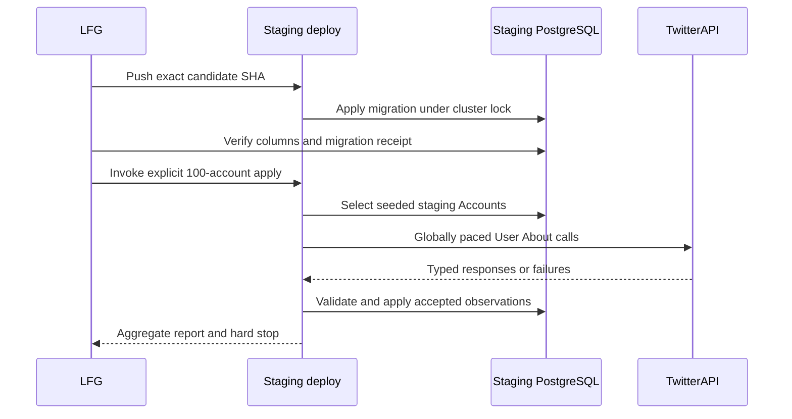
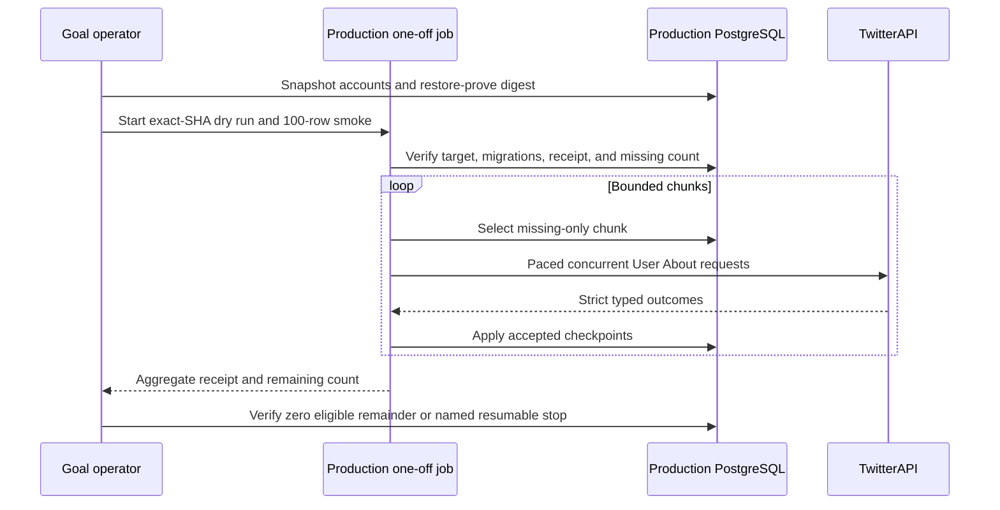
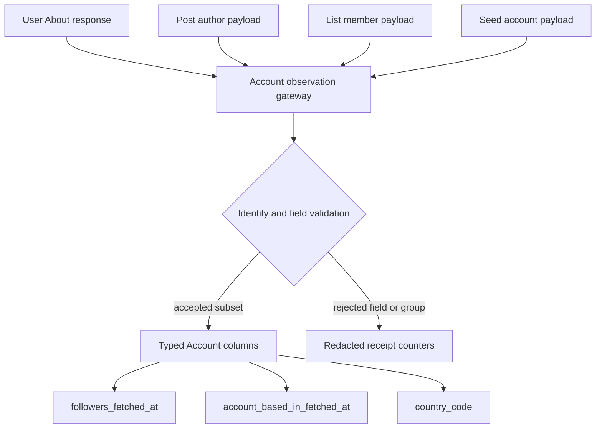

<!-- BEGIN OLLIJA DELIVERY GUIDE -->
## Ollija Delivery Guide

This block is generated guidance. Do not edit it directly. Correct durable facts in `.ollija/project.yaml` or this template, then rerun `./bin/ollija annotate-plan`. Put a user-directed exception in the editable Delivery Exceptions section below.

### Resolved locations

- Authoritative host: `fuchitalee`
- Authoritative repository: `/Users/fuchitalee/development/pushin-weight-v2`
- Ollija release worktree area: `/Users/fuchitalee/development/pushin-weight-v2/.worktrees`
- Active worktree: `/Users/fuchitalee/development/pushin-weight-v2/.worktrees/feat/feed-country-flags-disclosure`
- Plan: `/Users/fuchitalee/development/pushin-weight-v2/.worktrees/feat/feed-country-flags-disclosure/docs/plans/2026-08-29-093958-feat-feed-country-flags-disclosure-plan.md`
- Change: `feat-feed-country-flags-disclosure-2026-08-29-093958`
- Branch: `feat/feed-country-flags-disclosure`
- Staging branch and blueprint: `staging`, `/Users/fuchitalee/development/pushin-weight-v2/.worktrees/feat/feed-country-flags-disclosure/render-staging.yaml`
- Production branch and blueprint: `main`, `/Users/fuchitalee/development/pushin-weight-v2/.worktrees/feat/feed-country-flags-disclosure/render.yaml`
- Staging URL: `https://pushinweight-staging-web.onrender.com`
- Production URL: `https://pushinweight-web.onrender.com`

### Placement

This worktree is inside the Ollija release worktree area. Reuse it for the whole change. Do not create a second worktree or plan for this branch.

### Delivery scope

- Workflow: `lfg`
- Delivery target: `production`
- Owner selection recorded: `true`

1. Complete implementation and the plan's verification contract.
2. Run the configured focused checks:
   - `pytest tests/ollija`
3. The parent workflow commits only this plan's changes, pushes the feature branch, and records the candidate SHA.
4. Fetch the remote staging lane: `git fetch origin refs/heads/staging`.
5. Require the unchanged candidate SHA to be a fast-forward of that fetched remote ref, then push the exact candidate SHA to `refs/heads/staging` with the server-enforced fast-forward command `git push origin <candidate-sha>:refs/heads/staging`.
6. Verify the remote staging ref resolves to the candidate SHA and the Render deployment for `pushinweight-staging-web` reports that same SHA.
7. Run staging checks. Stop here if they fail.
8. Only after staging passes, fetch the remote production lane: `git fetch origin refs/heads/main`.
9. Require the same unchanged candidate SHA to be a fast-forward of that fetched remote ref, then push the exact candidate SHA to `refs/heads/main` with the server-enforced fast-forward command `git push origin <candidate-sha>:refs/heads/main`.
10. Verify the remote production ref resolves to the candidate SHA and the Render deployment for `pushinweight-web` reports that same SHA before reporting completion.
11. After step 10 succeeds, perform worktree cleanup as the final filesystem action:
    - From `/Users/fuchitalee/development/pushin-weight-v2`, require `/Users/fuchitalee/development/pushin-weight-v2/.worktrees/feat/feed-country-flags-disclosure` to remain registered, clean, unlocked, and at the verified candidate SHA. If any guard fails, retain it and report the reason.
    - Run `git -C /Users/fuchitalee/development/pushin-weight-v2 worktree remove /Users/fuchitalee/development/pushin-weight-v2/.worktrees/feat/feed-country-flags-disclosure` without `--force`.
    - Preserve the local and remote feature branches. Continue final reporting from the authoritative repository root.

### Failure handling

- Never promote a staging candidate whose automated checks failed.
- Implementation failures return to the parent implementation workflow for diagnosis, correction, recommit, and restaging.
- SSH, shell, environment, or multi-machine failures use the repository infra/multi-machine skill first.
- The change ledger is advisory; do not validate or enforce it.
- Never force-remove a worktree. Retain staging-only, failed, dirty, locked,
  noncanonical, or candidate-mismatched worktrees for diagnosis or later
  delivery.
- Do not run an endless retry loop or start a persistent Ollija process.
<!-- END OLLIJA DELIVERY GUIDE -->

## Delivery Exceptions

- This plan supersedes the enrichment portion of the former combined feed-country plan. The flag and headline work is deferred to `docs/plans/2026-08-29-223000-feed-country-flags-disclosure-successor-plan.md` and is not part of this LFG run.
- Apply and verify the Django migration on the isolated staging database before making a paid User About call.
- Run the first paid population only from the staging environment against 100 unique staging `Account` rows with callable handles. Permit at most 110 attempts and at most 1,980 credits. Apply accepted values only to the staging database.
- Owner follow-up on 2026-08-30 authorizes one schema-diagnostic staging call, a parser correction backed by redacted path/type evidence, and one replacement 100-Account staging pilot. Across the original failed call, diagnostic call, and replacement pilot, remain within the original cumulative ceiling of 110 attempts and 1,980 projected credits. Schema diagnostics may contain JSON paths, field names, and JSON types only; they must not contain response values, handles, Account IDs, URLs, credentials, headers, connection strings, or raw payloads. Correct the mirrored external-vendor endpoint reference from the observed schema before the replacement pilot.
- Owner follow-up on 2026-08-31 selects purpose-based TwitterAPI credentials named `TWITTERAPI_IO_SCHEDULED_API_KEY` and `TWITTERAPI_IO_ON_DEMAND_API_KEY`. Implement and verify the fail-closed repository cutover without adding secret values; its first deployment remains staging before the later production promotion authorized below.
- Owner follow-up on 2026-08-31 authorizes continuing this goal through the production migration and one full missing-only Account population after the successful staging pilot. Preserve the scheduled harvester, do not add recurring User About collection, and do not ship the deferred feed UI in this delivery.
- Owner follow-up on 2026-08-31 supersedes the earlier per-Account hard-stop policy: strict schema and returned-ID validation still rejects the complete affected observation with no write or checkpoint, but records an aggregate-only quarantine and continues admitting other Accounts. Ten consecutive Account quarantines are treated as systemic drift and stop new admissions; authentication, circuit, database, and hard-budget failures remain global stops. `--require-complete` requires zero retryable Accounts while permitting explicitly quarantined residue for later parser review.

# Account User About Enrichment and Production Backfill

## Goal Capsule

- **Objective:** Populate every currently callable production Account that has not completed a TwitterAPI User About lookup, preserving typed validation and producing auditable, restart-safe evidence for the roughly 60,000-account run.
- **Means:** Retain the proven typed Account gateway and strict provider parser; split scheduled/on-demand credentials; add a production-identity-guarded, chunk-checkpointed mode; verify rollback evidence; then run the missing-only production population under hard call, credit, time, concurrency, and schema-drift limits.
- **Authority:** The Product Contract governs stored data and write semantics. The official TwitterAPI User About schema and current pricing govern the provider boundary. The Ollija Delivery Guide and Delivery Exceptions govern exact-SHA staging and production delivery.
- **Execution profile:** Finish and stage the credential cutover, add production-safe chunking with fake-network and PostgreSQL call-chain tests, create and restore-prove a pre-write Account snapshot, deploy the unchanged reviewed SHA, run a bounded production smoke, then continue missing-only until no eligible Account remains or a hard stop fires.
- **Stop conditions:** Stop before a provider call if the service, database identity, exact SHA, migration state, on-demand credential, snapshot receipt, balance-derived QPS, dry-run count, or budgets are not verified. Stop during a run on schema drift, returned-ID mismatch, authentication failure, open circuit, exhausted budget, expired snapshot, or a reconciliation mismatch.
- **Tail ownership:** The active goal owns implementation, review, commits, exact-SHA staging and production delivery, the production migration, one missing-only full population, post-run reconciliation, and legacy-key retirement. Feed UI and recurring User About scheduling remain excluded.

---

## Product Contract

### Summary

Persist TwitterAPI User About account data in typed `Account` fields without a raw JSON column. Route User About, post-author, list-member, and seed observations through one model-owned validation path. Preserve the completed staging proof, then deliver the exact reviewed candidate through production and run one recovery-gated, missing-only Account population.

### Problem Frame

`Account.location` and `Post.author_location` are optional free-form profile text. `Post.place.country_code` is a rare post geotag. Neither represents the About-this-account value selected for country flags.

TwitterAPI exposes `about_profile.account_based_in` through `/twitter/user_about`, one handle per call. The production-sized population is roughly 59,225 calls before retries. The endpoint also returns profile identity, creation, verification, affiliate-label, About, and identity-label values. Storing only country would discard account data already paid for; storing a raw response would weaken queryability and validation.

The Django harvester currently writes Account snapshots directly with `update_or_create`. Missing booleans can be coerced to false, malformed values can replace good values, and `followers_fetched_at` is not advanced by the Django post path. A paid backfill must not amplify those defects.

### Key Decisions

- PD4. **Use About-this-account as the account-country source.** (session-settled: user-approved — chosen over profile location and post geotags: `account_based_in` is the selected X-reported account signal.) Governs R6 and R21.
- PD6. **Prove the first paid write only on staging.** (session-settled: user-directed — chosen over direct production delivery: migration, paid calls, and writes had to be proven on the isolated staging database before the later production authorization.) Governs R15-R18.
- PD9. **Persist typed fields, not raw JSON.** (session-settled: user-directed — chosen over one raw response column: every account-valued response leaf should be queryable with an appropriate type.) Governs R12 and R19.
- PD10. **Evaluate about 100 calls before a larger run.** (session-settled: user-directed — chosen over immediate population of every Account: actual schema, yield, time, and credit burn must be confirmed first.) Governs R16-R18 and R20.
- PD11. **Allow valid post observations to refresh shared mutable fields.** (session-settled: user-directed — chosen over freezing the User About snapshot or adding history now: post author payloads are generally fresher.) Governs R22 and R24.
- PD12. **Validate at the Django model boundary.** (session-settled: user-directed — chosen over parser-only validation and direct ORM defaults: faulty observations must not clobber good Account values.) Governs R22-R24.
- PD13. **Name credentials by execution policy.** (session-settled: user-selected — scheduled collection uses `TWITTERAPI_IO_SCHEDULED_API_KEY`; explicitly launched bulk and backfill work uses `TWITTERAPI_IO_ON_DEMAND_API_KEY`.) Neither credential is a fallback for the other. Governs R27.
- PD14. **Continue through one production missing-only population.** (session-settled: user-directed — chosen after the 100-account staging pilot succeeded: migrate the exact reviewed candidate, prove recovery, smoke-test the production call chain, then populate every currently eligible Account without scheduling refreshes.) Governs R28-R32.

### Requirements

**Typed persistence**

- R6. Derive `Account.country_code` only from an exact supported two-letter code or exact canonical English country name in the approved 197-country source. Preserve the exact provider value separately. Do not infer from free-form profile location, post geotags, cities, regions, or fuzzy matches.
- R12. Give every documented leaf under a successful User About `data` object one typed Account destination in the field map below. Reuse semantically identical existing fields and add only missing columns.
- R19. Add no raw User About JSON column. Flatten nested label objects into typed nullable fields, convert camelCase leaves to snake_case, and keep concise provider terminology.
- R21. Reject the full User About observation on returned-ID mismatch, unknown response leaf, or documented type mismatch. Record the failure without an Account write. An otherwise valid response whose exact `account_based_in` value is unsupported still checkpoints and stores that exact value, but derives no `country_code`.

**Account write ownership and freshness**

- R22. Apply serialized last-valid-write semantics to shared mutable fields. An explicitly present, valid post or list value may replace the current value. A missing or invalid value may not clear, false-coerce, or replace it. `created_at` is fill-once and conflicts are reported.
- R23. Every current Django Account writer must submit source, observation time, field presence, and candidates through one model-owned gateway. Reject identity mismatch for the whole observation. Reject malformed independent fields or coupled label groups without blocking other valid Account fields or the related Post write.
- R24. An accepted explicit post `followers_count` observation updates `followers_fetched_at` in the same transaction even when the count is unchanged. Missing or rejected follower values update neither field.

**Bounded staging pilot**

- R15. Deploy only to the exact-SHA staging lane. Apply the migration to staging and verify its database schema before paid calls. Do not mutate `main`, production services, or the production database.
- R16. Select 100 unique staging Accounts with nonblank handles using a recorded seed. Call `/twitter/user_about` once per selected handle. Permit at most 110 attempts, a projected spend of 1,980 credits under the published profile rate, 30 minutes of wall time, and the lower of 5 QPS or the verified balance-derived provider allowance.
- R17. Apply only accepted responses to their matching staging Account rows. Produce timestamped JSON and Markdown reports with sample definition, response distribution, leaf coverage, country yield, `location_accurate` and `source` distributions, rejections, retries, latency percentiles, wall time, effective QPS, credits, and projected full-run cost and duration.
- R18. Stop after the 100-account staging report. Continuing to a production migration, a larger provider run, or the UI successor requires a later owner decision.
- R20. The command is default-dry-run, explicit-apply, resumable, idempotent for successful empty results, globally rate-limited, bounded by account, attempt, credit, and wall-time budgets, and absent from cron, Celery beat, and `run_cycle`.
- R25. A later production apply requires a current encrypted pre-write Account snapshot, row count, digest, and disposable restore proof. This staging plan documents that gate but does not execute it.
- R26. Read the TwitterAPI credential only from the staging service's managed environment. Fail closed when it is absent or invalid. Never accept it as a command argument or write it, request headers, connection strings, handles, Account IDs, or raw provider payloads to tracked reports or normal logs.
- R27. Every TwitterAPI caller must declare scheduled or on-demand intent at its construction boundary. Recurring `run_cycle` and its search/metrics calls require `TWITTERAPI_IO_SCHEDULED_API_KEY`; About-user, backfill, reconciliation, probe, smoke-test, and other explicitly launched calls require `TWITTERAPI_IO_ON_DEMAND_API_KEY`. The legacy `TWITTERAPI_IO_API_KEY` is not read, and neither designated variable may fall back to the other.

**Production population**

- R28. Production apply must require both `X_MONITOR_DEPLOYMENT_ENVIRONMENT=production` and PostgreSQL `current_database() = 'pushinweight_shadow'`; staging apply must retain its existing dual identity guard. A local process, wrong service, wrong database, or missing explicit target fails before credential access or HTTP.
- R29. Production apply must require a fresh pre-write snapshot receipt naming the Account row count, SHA-256 digest, encrypted-at-rest snapshot location, restore-proof database or schema, restore row count/digest, and completion timestamp. The command validates a receipt digest and freshness before HTTP; the runbook retains the full untracked receipt and recovery commands without account data or credentials.
- R30. The production runner is default-dry-run, explicit-apply, missing-only unless `--refresh` is separately supplied, and restart-safe through database checkpoints. It processes bounded chunks, applies each completed chunk before fetching the next, reselects eligible rows between chunks, and never depends on Render's ephemeral filesystem for progress.
- R31. One production invocation must hold a nonblocking PostgreSQL advisory lock and enforce explicit global ceilings for Accounts, attempts, projected credits, wall time, QPS, and concurrency. It may use bounded concurrent HTTP over one reusable session to approach the lower of operator and verified provider QPS, but reservations must prevent attempt or credit overshoot and a stop signal must prevent new requests.
- R32. Run an exact-SHA production smoke of at most 100 previously unfetched Accounts before expansion. Stratify it across old/middle/new X-account age, small/medium/large/unknown follower size, and US/EU/Japan/other/unknown public profile-location proxies; the location proxy diversifies the test only and never supplies `country_code`. Continue only when migration/schema identity, checkpoint counts, provider outcomes, country yield, projected credits, and scheduled-harvester health reconcile. The full run ends only when the eligible missing-only count reaches zero or emits a named hard stop and resumable remainder.

### Acceptance Examples

- AE9. **Capped staging population**
  - **Covers:** R15-R18 and R20.
  - **Given:** The exact candidate migration is applied to staging and 100 unique staging Accounts are selected with a recorded seed.
  - **When:** The operator runs explicit apply and two calls retry.
  - **Then:** The report records 100 selected Accounts, 102 attempts, exact writes and rejections, wall time, and credits without any production write.
- AE10. **Identity or schema drift**
  - **Covers:** R21.
  - **Given:** A response returns another user ID, an undocumented leaf, or a documented field with the wrong type.
  - **When:** The strict parser evaluates it.
  - **Then:** No Account field or fetched timestamp changes and the pilot stops with a redacted reason.
- AE17. **Unsupported country value remains observable**
  - **Covers:** R6 and R21.
  - **Given:** A structurally valid matching response contains an exact `account_based_in` value that is absent from the approved country source.
  - **When:** The strict parser and Account gateway accept the response.
  - **Then:** The exact provider value and fetched timestamp are stored, `country_code` remains unchanged or null, the outcome is counted as unmapped, and the row is not retried merely because normalization failed.
- AE11. **Typed deduplicated persistence**
  - **Covers:** R6, R12, and R19.
  - **Given:** A complete documented response.
  - **When:** The Account observation gateway accepts it.
  - **Then:** Shared fields and every missing typed destination are populated, exact country normalization derives `country_code`, and no Account JSON field exists.
- AE12. **Successful empty lookup is resumable**
  - **Covers:** R20.
  - **Given:** A successful response omits optional About and label values.
  - **When:** The command checkpoints the row and restarts.
  - **Then:** `account_based_in_fetched_at` records completion and default missing-only selection does not charge for it again.
- AE13. **Newer post values can win safely**
  - **Covers:** R22-R23.
  - **Given:** User About populated shared mutable fields and About-only country fields.
  - **When:** A later post explicitly carries a new valid handle, display name, blue-verification value, and affiliate label.
  - **Then:** Shared values change while About-only values and their fetched time remain intact.
- AE14. **Missing post fields do not erase**
  - **Covers:** R22-R23.
  - **Given:** An Account has non-null shared values.
  - **When:** A later author payload omits blue verification or affiliate label.
  - **Then:** Existing values remain unchanged.
- AE15. **Faulty post fields are contained**
  - **Covers:** R22-R23.
  - **Given:** A post carries a malformed handle, negative count, invalid URL, or future creation time alongside one valid display-name update.
  - **When:** The production post-to-Account call chain runs.
  - **Then:** The gateway preserves rejected fields, accepts the display name, records redacted rejection reasons, and still persists the Post.
- AE16. **Follower observation freshness**
  - **Covers:** R23-R24.
  - **Given:** An Account has follower count 1,000 observed at T1.
  - **When:** A post at T2 explicitly supplies 1,000 and a post at T3 omits or malforms the count.
  - **Then:** The count remains 1,000, `followers_fetched_at` advances to T2, and T3 changes neither field.
- AE18. **Credential-purpose isolation**
  - **Covers:** R27.
  - **Given:** Scheduled, on-demand, and legacy variables contain distinct sentinel values.
  - **When:** The production `run_cycle` caller and the About-user management command construct their TwitterAPI requests.
  - **Then:** The scheduled caller receives only the scheduled sentinel, the About-user caller receives only the on-demand sentinel, and deleting either required variable fails that path even when the other two remain set.
- AE19. **Wrong production identity fails before spend**
  - **Covers:** R28-R29.
  - **Given:** Production apply is requested with the staging database, a non-production deployment marker, an absent/stale snapshot receipt, or a receipt whose restored digest does not match.
  - **When:** Command preflight runs.
  - **Then:** It performs zero credential reads, HTTP calls, and Account writes and names only the failed gate.
- AE20. **Chunk crash resumes from durable checkpoints**
  - **Covers:** R30.
  - **Given:** The first two chunks are accepted and written, then the process exits before the third.
  - **When:** The same missing-only production command restarts.
  - **Then:** It excludes both completed chunks, retries only rows without a successful checkpoint, and needs no local state file.
- AE21. **Concurrent pacing cannot overshoot budgets**
  - **Covers:** R31.
  - **Given:** Several workers finish and retry out of order near the attempt, credit, or wall-time boundary.
  - **When:** The shared reservation and pace gates admit requests.
  - **Then:** Actual attempts and projected credits never exceed their explicit ceilings, no request begins after the stop signal, and connector concurrency stays at or below the operator cap.
- AE22. **Smoke-to-full production expansion**
  - **Covers:** R32.
  - **Given:** The exact production SHA and migrations are verified and the recovery receipt is fresh.
  - **When:** A 100-account smoke completes and reconciles.
  - **Then:** The missing-only full run continues under the same SHA and policies, aggregate reports reconcile each checkpointed chunk, and final SQL reports zero remaining callable Accounts without a checkpoint.

### Scope Boundaries

**In scope**

- User About protocol, strict parsing, shared pacing, typed Account columns, exact country normalization, and the model-owned observation gateway.
- Current Account writers in post ingestion, list reconciliation, and seed loading.
- A default-dry-run management command and one 100-account staging apply.
- Exact-SHA staging and production delivery, production migration, recovery proof, a 100-account production smoke, and one missing-only full Account population.

### Deferred to Follow-Up Work

- Country-flag rendering, localized country names, headline disclosure, Bridgewright UI assurance, and reference-page movement. These belong to `docs/plans/2026-08-29-223000-feed-country-flags-disclosure-successor-plan.md`.
- Account observation history or per-field timestamps beyond `followers_fetched_at` and `account_based_in_fetched_at`.
- Scheduling or recurring refresh of User About.

**Outside this plan**

- Treating `account_based_in` as nationality, citizenship, permanent residence, or a guarantee of physical location.
- Changing the seven-call search plan, live cursors, metrics refresh, headline worker, production scheduler, or retired v1 stack.

### Product Contract Preservation

Changed by explicit owner direction: the former combined plan's UI requirements and units moved to the successor plan. The enrichment requirements, stable R/AE/KTD/U IDs, typed field map, and validation semantics retain their prior meaning. The staging pilot remains completed evidence; the 2026-08-31 direction adds the separately gated production migration and one full missing-only population.

---

## Planning Contract

### Key Technical Decisions

- KTD10. **Flatten every documented User About `data` leaf into a typed Account destination.** (session-settled: user-directed — chosen over raw JSON and redundant account-prefixed names: provider-shaped fields should remain queryable and type-safe.) Reuse semantic matches, snake-case camelCase, and drop structural wrappers. Implements PD9, R12, and R19.
- KTD11. **Extend the hardened TwitterAPI caller instead of creating a parallel client.** Reuse one `aiohttp` session, a bounded connector, Retry-After, jitter, split timeouts, and circuit breaking from `monitor/twitterapi/caller.py`. Add one aggregate pace gate capped by the current balance-derived provider QPS and by the command's lower operator cap. Implements R16 and R20.
- KTD12. **Make Account own observation validation and application.** (session-settled: user-directed — chosen over parser-only validation and direct `update_or_create` defaults: every writer needs the same protection.) A transactional model gateway accepts explicitly present fields, validates the proposed subset and cross-field invariants, locks only the target row during comparison and apply, and returns structured applied, unchanged, and rejected outcomes. Implements PD12 and R22-R24.
- KTD13. **Checkpoint successful responses, including success-empty.** Set `account_based_in_fetched_at` after an accepted provider success even when optional About fields are absent. Leave transport, provider, identity, or schema failures retryable. Implements R20-R21.
- KTD14. **Use a migration-first staging pilot.** (session-settled: user-directed — chosen over testing migration or API writes on production: both must be proven against the isolated staging database.) The candidate deploy applies its migration through `build.sh` before the command can select or update staging Accounts. Implements PD6 and R15-R18.
- KTD15. **Use field presence and serialized last-valid-write ownership.** (session-settled: user-directed — chosen over preserving User About snapshots or adding change history: later valid post values should refresh overlapping mutable facts.) “Latest” means the most recently accepted database commit, not event-time arbitration. `created_at` is fill-once. Implements PD11 and R22.
- KTD16. **Activate the existing follower freshness field.** Update `followers_fetched_at` for each accepted explicit follower observation, including an unchanged count. PostgreSQL does not provide a durable per-column last-write timestamp. Implements R24.
- KTD17. **Keep request envelopes out of Account.** Store `status`, `msg`, HTTP status, attempt, latency, and error reason in the run report or dead letter. They describe a call, not an account. Implements R19-R21.
- KTD18. **Reconcile paid usage with provider evidence.** Before each call, refuse an attempt whose published-rate projection would exceed 1,980 credits. Record application attempts and expected pricing, then reconcile the exact UTC pilot window to the TwitterAPI Recent API Calls ledger when dashboard credentials are available. A missing or inconsistent ledger makes the cost result inconclusive and stops the run after staging writes; it never authorizes expansion. Implements PD10 and R17-R18.
- KTD19. **Generate a backend-only country map from the already approved source.** Build code and canonical English-name normalization from `docs/ideation/assets/2026-08-29-162947-country-flag-pixels.json` without moving the review page, generating the runtime SVG sprite, or changing feed code. This keeps R6 executable while preserving the UI successor boundary.
- KTD20. **Make credential purpose explicit and fail closed.** Centralize the two environment names and require callers to choose a typed scheduled/on-demand purpose; provide no default purpose and no legacy or cross-purpose fallback. Rename current configuration and Render declarations, classify every executable caller, and pin the real `run_cycle` and About-command call chains with different sentinels. Implements PD13 and R27.
- KTD21. **Guard apply with explicit environment plus database identity.** Add no generic “allow production” escape hatch. The requested target, managed deployment marker, and `current_database()` must all agree before the command loads the on-demand credential. Implements PD14 and R28.
- KTD22. **Use database checkpoints, not a local progress file.** Select a bounded missing-only chunk, fetch it outside transactions, apply accepted outcomes one Account at a time through KTD12, aggregate the receipt, and repeat. A restart naturally excludes rows with `account_based_in_fetched_at`; transport and strict-validation failures remain eligible. Implements PD14 and R30.
- KTD23. **Bound concurrency behind one run lock, pace gate, and reservation gate.** Acquire one nonblocking PostgreSQL advisory lock for the command, verify the receipt's recovery relation still exists with the expected row count, reuse one HTTP session within each durable chunk, cap persistent connections explicitly, and reserve attempt/credit capacity atomically before sending. A second runner fails before credential access; schema, identity, and authentication stops prevent new admissions while allowing already-reserved requests to finish safely. The full invocation uses `--require-complete` so any eligible residue fails the release job after writing its resumable aggregate report. Implements PD14 and R31.
- KTD24. **Prove a narrow recoverable snapshot before paid production calls.** Snapshot the production `accounts` table in one repeatable-read transaction inside Render-managed encrypted PostgreSQL, compute a deterministic row digest, restore it to a disposable proof table/schema, compare count and digest, and retain a receipt digest consumed by command preflight. The advisory lock excludes another User About runner; the scheduled harvester remains active unless recovery is actually required. Implements PD14 and R29-R32.

### Typed Account Column and Writer Map

A successful profile `data.id` must match `Account.author_id`. The live unavailable success variant has no ID and may update only its two availability leaves plus the fetch checkpoint, on the originally selected row, while that row still owns the requested handle. Nullable types reflect optional provider objects. URL fields use a 2,048-character limit. `Post` means the tweet author payload in `x_monitor/apify.py` and `monitor/cycle.py`. `List` means `monitor/list_membership.py`.

| TwitterAPI path | Account column | Django type | Valid writers |
| --- | --- | --- | --- |
| `data.id` | `author_id` | existing `TextField(primary_key=True)` | Identity key; About validates only |
| `data.name` | `display_name` | existing `TextField(null=True)` | About, Post, List |
| `data.userName` | `handle` | existing `CharField(64, null=True)` | About, Post, List |
| `data.createdAt` | `created_at` | `DateTimeField(null=True)` | About or Post fills null |
| `data.isVerified` | `verified` | existing `BooleanField` | About or explicit Post; deduplicated shared field |
| `data.isBlueVerified` | `is_blue_verified` | existing `BooleanField(null=True)` | About or explicit Post |
| `data.protected` | `protected` | `BooleanField(null=True)` | About or explicit Post |
| `data.profilePicture` | `profile_picture` | existing `TextField(null=True)` | About or explicit Post; deduplicated shared field |
| `data.verification_info.id` | `verification_info_id` | `CharField(128, null=True)` | About only |
| `data.verification_info.is_identity_verified` | `verification_info_is_identity_verified` | `BooleanField(null=True)` | About only |
| `data.verification_info.reason.verified_since_msec` | `verification_info_reason_verified_since_msec` | `PositiveBigIntegerField(null=True)` | About only; strictly parse numeric-string epoch milliseconds |
| `data.unavailable` | `unavailable` | `BooleanField(null=True)` | About only; unavailable success variant |
| `data.unavailableReason` | `unavailable_reason` | `TextField(null=True)` | About only; unavailable success variant |
| `data.affiliates_highlighted_label.label.badge.url` | `affiliate_label_badge_url` | `URLField(2048, null=True)` | About or explicit Post label |
| `data.affiliates_highlighted_label.label.description` | `affiliate_label_description` | `TextField(null=True)` | About or explicit Post label |
| `data.affiliates_highlighted_label.label.url.url` | `affiliate_label_url` | `URLField(2048, null=True)` | About or explicit Post label |
| `data.affiliates_highlighted_label.label.url.urlType` | `affiliate_label_url_type` | `CharField(128, null=True)` | About or explicit Post label |
| `data.affiliates_highlighted_label.label.userLabelDisplayType` | `affiliate_label_user_label_display_type` | `CharField(128, null=True)` | About or explicit Post label |
| `data.affiliates_highlighted_label.label.userLabelType` | `affiliate_label_user_label_type` | `CharField(128, null=True)` | About or explicit Post label |
| `data.about_profile.account_based_in` | `account_based_in` | `TextField(null=True)` | About only |
| `data.about_profile.location_accurate` | `location_accurate` | `BooleanField(null=True)` | About only |
| `data.about_profile.created_country_accurate` | `created_country_accurate` | `BooleanField(null=True)` | About only |
| `data.about_profile.learn_more_url` | `learn_more_url` | `URLField(2048, null=True)` | About only |
| `data.about_profile.affiliate_username` | `affiliate_username` | `CharField(64, null=True)` | About only |
| `data.about_profile.source` | `source` | `CharField(128, null=True)` | About only |
| `data.about_profile.username_changes.count` | `username_changes_count` | `PositiveIntegerField(null=True)` | About only; strictly parse numeric string |
| `data.about_profile.username_changes.last_changed_at_msec` | `username_changes_last_changed_at_msec` | `PositiveBigIntegerField(null=True)` | About only; strictly parse numeric-string epoch milliseconds |
| `data.identity_profile_labels_highlighted_label.label.badge.url` | `identity_profile_label_badge_url` | `URLField(2048, null=True)` | About only |
| `data.identity_profile_labels_highlighted_label.label.description` | `identity_profile_label_description` | `TextField(null=True)` | About only |
| `data.identity_profile_labels_highlighted_label.label.long_description.text` | `identity_profile_label_long_description` | `TextField(null=True)` | About only; entity offsets and nested presentation cache are type-validated but not persisted as Account facts |
| `data.identity_profile_labels_highlighted_label.label.url.url` | `identity_profile_label_url` | `URLField(2048, null=True)` | About only |
| `data.identity_profile_labels_highlighted_label.label.url.urlType` | `identity_profile_label_url_type` | `CharField(128, null=True)` | About only |
| `data.identity_profile_labels_highlighted_label.label.userLabelDisplayType` | `identity_profile_label_user_label_display_type` | `CharField(128, null=True)` | About only |
| `data.identity_profile_labels_highlighted_label.label.userLabelType` | `identity_profile_label_user_label_type` | `CharField(128, null=True)` | About only |
| Exact supported country derived from About | `country_code` | `CharField(2, null=True, db_index=True)` | Derived with accepted About only |
| Successful About observation time | `account_based_in_fetched_at` | `DateTimeField(null=True)` | About only |

### Account Observation Validation

| Field family | Model rule | Rejection behavior |
| --- | --- | --- |
| Identity | Profile response: nonblank immutable `author_id` must match the selected row. Unavailable response: no profile fields and selected row must still own the requested handle under case-insensitive comparison | Reject the whole observation |
| Handle | Trimmed nonblank string without `@`, whitespace, or controls; fits the field | Preserve the current handle |
| Display/profile text | Correct string type, valid Unicode, control-free, and field-length safe | Preserve the affected field |
| Counts | Integer but not Boolean, nonnegative, and database-range safe | Preserve the affected count |
| Booleans | Exact Boolean when present; no string or integer coercion | Preserve the affected Boolean |
| URLs | Null or absolute HTTP(S) URL within 2,048 characters | Preserve the affected URL or label group |
| `created_at` | Timezone-aware, not before X launch, not beyond observation time plus tolerance, and fill-once | Preserve current value and report conflict |
| Affiliate/identity labels | Validate six affiliate leaves and seven identity leaves as atomic groups; explicit empty object may clear its group | Preserve the whole current group |
| About provider strings | Correct type, trimmed, control-free, and within pilot-observed limits | Preserve the affected field |
| `country_code` | Uppercase supported two-letter code | Preserve the current code or null; count an exact-but-unsupported About value as unmapped without rejecting the otherwise valid observation |

### High-Level Technical Design

### Assumptions

- Staging contains at least 100 unique Accounts with nonblank handles. If not, use the existing guarded staging refresh procedure before the pilot; never read handles directly from production inside the command.
- The public endpoint example checked on 2026-08-29 omitted nine leaves present across value-free live schema probes on 2026-08-30. One conditional verification leaf appeared only on a verified account, and the final two leaves form an unavailable success variant with no profile ID. The corrected field map and `docs/external_vendors/twitterapi_docs/endpoint/get_user_about.md` are the current project reference; strict parsing remains the drift detector.
- TwitterAPI pricing checked on 2026-08-29 is 18 credits per returned profile, with a 15-credit minimum per call and USD 1 per 100,000 credits. The 110-attempt cap therefore budgets at most 1,980 credits under the profile-rate assumption.
- The provider QPS ceiling depends on account balance. The command uses the lower of its explicit operator cap and the verified provider allowance. It never relies on the stale 200-QPS note in repository research.
- `account_based_in` is stored as the provider reports it. This plan does not independently verify how X calculates the value.
- A successful response with absent optional objects is a completed lookup. Transport, HTTP, provider-status, identity, and schema failures are not.

### System-Wide Impact

- **Schema:** `Account` gains 30 typed fields across migrations 0020 through 0024. Live-only additions are additive and nullable; `isVerified` and `profilePicture` reuse existing shared fields.
- **Country identity:** A generated backend-only code/name map supports R6. It carries no SVG, zh-CN display name, template, CSS, or client rendering.
- **Writers:** Post, list, seed, and User About inputs share one Account write boundary.
- **Freshness:** `followers_fetched_at` becomes active. `account_based_in_fetched_at` records successful About lookup completion. Other fields do not gain timestamps.
- **Harvester:** Existing seven-call search, cursors, post columns, classification, translation, metrics, headlines, cron, and concurrency remain unchanged.
- **Cost:** Only the explicit command performs User About calls. Staging and production share the provider quota, so the command enforces global pacing and fixed budgets.
- **Production execution:** The full population is an explicit one-off job using the on-demand credential; it is absent from cron and does not change the seven scheduled search calls.
- **Recovery:** Production gets a pre-write encrypted-at-rest Account snapshot and disposable restore proof before the smoke. Chunk checkpoints make process failure resumable without rolling back successful validated observations.

### Risks and Mitigations

| Risk | Mitigation |
| --- | --- |
| Live schema differs from docs | Strict leaf inventory stops on the first unknown or wrong type before that Account write. |
| Handle now belongs to another account | Require returned ID equality. |
| Missing post booleans become false | Preserve key presence through normalization and validate exact booleans. |
| Malformed post data clobbers good values | Route all current writers through KTD12 and preserve rejected fields. |
| Provider I/O holds database locks | Fetch and parse outside transactions; lock one row only for compare-and-apply. |
| Parallel workers exceed QPS | Use one shared limiter and one bounded session for the command. |
| Concurrent requests overshoot a stop | Atomically reserve attempts/credits before transport and close admissions on the first fatal stop. |
| Retries exceed spend | Enforce attempt, credit, wall-time, and circuit limits before each outbound call. |
| A long Render job exits mid-population | Apply every completed chunk, then reselect missing rows; never rely on an ephemeral state file. |
| Full population contends with the scheduled harvester | Use the separate on-demand key, bounded DB chunks, no long transaction, and inspect the literal next scheduled cycle; pause only for the short snapshot proof if needed. |
| Report leaks account identity | Commit aggregates only; keep handles, IDs, credentials, and raw payloads out of tracked reports. |
| Credential crosses an environment, purpose, or logging boundary | Read only the purpose-specific Render-managed variable, provide no fallback, reject CLI-provided secrets, and redact request headers and connection strings. |
| Migration and staging data are out of sync | Verify deployed SHA, Django migration leaf, actual columns, types, and row counts before the pilot. |
| Vendor ledger is unavailable | Mark actual cost inconclusive, retain the hard published-rate projection as the spend ceiling, and do not claim exact provider burn. |

### Sequencing

U5-U7 produced the completed staging pilot, and U8 cuts credentials over by purpose. U9 adds production identity, recovery-receipt, chunking, and concurrency proofs. Commit and stage the exact candidate, run the on-demand credential smoke, then U10 snapshots, migrates, performs the 100-row production smoke, continues missing-only under the same SHA, verifies scheduled-harvester health, and retires the legacy key.

---

## Implementation Units

### U5. Add the User About protocol and bounded command

- **Goal:** Provide one strict, globally paced User About client and a default-dry-run Account population command.
- **Requirements:** R16-R21 and R26; AE9-AE12 and AE17. Implements KTD10-KTD11, KTD13, KTD17-KTD18.
- **Dependencies:** None.
- **Files:**
  - Modify `monitor/twitterapi/caller.py`.
  - Create `monitor/twitterapi/user_about.py`.
  - Create `monitor/management/commands/backfill_account_based_in.py`.
  - Create `tests/test_twitterapi_user_about.py`.
  - Modify `tests/test_twitterapi_caller_shape.py`.
  - Create `tests/test_backfill_account_based_in.py`.
- **Approach:**
  1. Add strict response-envelope and leaf parsing against the field map.
  2. Extend the existing caller with an aggregate pace gate and pre-call budget checks.
  3. Make selection deterministic, missing-first, resumable, default-dry-run, and explicit-apply.
  4. Keep detailed runtime receipts outside the repository. Emit tracked aggregate JSON and Markdown after the pilot.
- **Execution note:** Pin parser, pacing, retry, circuit, and zero-write behavior with fake HTTP and a real ORM call chain before any live request.
- **Patterns to follow:** `monitor/twitterapi/caller.py`, `monitor/management/commands/resolve_lonely_placeholders.py`, and `scripts/harvest_cost/emit.py`.
- **Test scenarios:**
  - A complete documented response produces every mapped candidate and no unknown leaf.
  - Missing optional objects produce present/absent metadata without implicit clears.
  - Covers AE10. Unknown leaf, invalid count or datetime, returned-ID mismatch, or provider error performs no write.
  - Covers AE17. An exact but unsupported country string stores the provider value, checkpoints success, and derives no code.
  - Aggregate request timestamps remain within the selected QPS under concurrent completion.
  - One 429 honors Retry-After; repeated 429/5xx opens the circuit; 401/403 stops immediately.
  - Default invocation performs zero HTTP calls and zero Account writes.
  - Covers AE12. Accepted success-empty checkpoints once; a restart skips it unless refresh is explicit.
  - Account, attempt, projected-credit, 30-minute wall-time, and effective-QPS budgets are checked before the next request and cannot overshoot.
  - The credential is sourced only from `TWITTERAPI_IO_ON_DEMAND_API_KEY`; command arguments, reports, and ordinary logs never expose it or request headers.
- **Verification:** Focused tests prove the command-to-caller boundary, strict schema, budgets, redaction, and no recurring scheduler edge.

### U6. Add typed Account persistence and validated writer ownership

- **Goal:** Add every missing typed destination and make all current Django Account writers use one last-valid-write gateway.
- **Requirements:** R6, R12, R19, R21-R25; AE10-AE16. Implements KTD10, KTD12-KTD16.
- **Dependencies:** U5.
- **Files:**
  - Modify `core/models.py`.
  - Create `core/account_validation.py` only if reusable validators do not fit cleanly in the model module.
  - Create the next migration after `core/migrations/0019_guard_per_brand_narrative_reverse.py`.
  - Modify `monitor/twitterapi/user_about.py`.
  - Modify `x_monitor/apify.py`.
  - Modify `monitor/cycle.py`.
  - Modify `monitor/list_membership.py`.
  - Modify `monitor/management/commands/load_seed.py`.
  - Modify `monitor/harvest_summary.py` only if it is the existing structured rejection owner.
  - Create `monitor/country_codes.py`.
  - Create `scripts/build_country_codes.py`.
  - Create `docs/operations/2026-08-29-223000-account-user-about-backfill.md`.
  - Create `tests/test_account_user_about_model.py`.
  - Create `tests/test_account_field_freshness.py`.
  - Create `tests/test_load_seed_account_observation.py`.
  - Modify `tests/test_list_membership_reconciliation.py`.
  - Modify `tests/test_post_schema_denormalization.py`.
  - Modify `tests/test_backfill_account_based_in.py`.
  - Create `tests/test_country_codes.py`.
- **Approach:**
  1. Add only missing nullable fields from the field map and generate one additive migration from the current leaf.
  2. Add the KTD12 gateway and model validators before changing writer call sites.
  3. Preserve provider-key presence through post normalization. Flatten explicit post affiliate labels into the shared Account label fields while retaining existing typed Post fields.
  4. Route About, post, list, and seed Account mutations through the gateway. Keep provider I/O outside its transaction.
  5. Generate the KTD19 backend-only country map and derive country only from accepted exact About values. Do not move or regenerate visual flag artifacts in this plan.
  6. Record bounded rejection counts and redacted reasons without rolling back a valid Post.
  7. Document the R25 production snapshot and restore gate without executing it.
- **Execution note:** Begin with model and production-caller regression tests. Helper-only validation tests are insufficient.
- **Patterns to follow:** `_normalize_tweet` in `x_monitor/apify.py`, `_upsert_account` in `monitor/cycle.py`, and `_upsert_account` in `monitor/list_membership.py`.
- **Test scenarios:**
  - Covers AE11. A complete About response populates shared and new typed fields with no Account JSON field.
  - Account creation and update use the same validation semantics.
  - `created_at` fills null, accepts equality, and preserves/report conflicts.
  - Covers AE13. Explicit valid post values refresh shared mutable and affiliate-label fields without changing About-only fields.
  - Covers AE14. Missing post/list values preserve current fields.
  - Covers AE15. Malformed independent values are rejected field-by-field while a valid sibling value and the Post persist.
  - A malformed coupled label preserves the whole current label group.
  - Exact supported codes and canonical English names normalize; cities, regions, fuzzy names, `WW`, `HF`, and unsupported values do not. Unsupported exact values still store and checkpoint the accepted About observation.
  - Covers AE16. Accepted equal follower counts advance freshness; omitted or rejected counts do not.
  - List handle collision remains degraded rather than corrupting identity.
  - Seed loading remains idempotent and cannot bypass validation.
  - Migration applies from current main, reverses on a disposable database, and leaves existing Account rows intact.
- **Verification:** Model tests and real post/list/seed/About call-chain tests prove the mapped schema, validation containment, writer ownership, and timestamp rules.

### U7. Deploy, migrate, and populate the 100-account staging pilot

- **Goal:** Prove the exact candidate's migration and paid write path on isolated staging, then stop with decision-grade evidence.
- **Requirements:** R15-R18 and R20; AE9-AE12. Implements KTD14 and KTD18.
- **Dependencies:** U5-U6 and all local verification gates.
- **Files:**
  - Create `docs/analysis/YYYY-MM-DD-HHMMSS-twitterapi-user-about-staging-pilot.json` at pilot runtime.
  - Create `docs/analysis/YYYY-MM-DD-HHMMSS-twitterapi-user-about-staging-pilot.md` at pilot runtime with the same timestamp.
  - Modify `docs/operations/2026-08-29-223000-account-user-about-backfill.md` with verified staging evidence and recovery notes.
- **Approach:**
  1. Isolate the existing flag/disclosure working diff and exclude it from the candidate.
  2. Push the exact candidate to the staging lane and wait for `build.sh` migration success.
  3. Verify staging service identity, candidate SHA, database identity, migration row, actual columns/types, and at least 100 callable Accounts.
  4. Run dry-run selection and confirm zero HTTP and database writes.
  5. Run one explicit apply as `python manage.py backfill_account_based_in --apply --limit 100 --max-attempts 110 --max-credits 1980 --max-wall-seconds 1800 --max-qps 5 --seed <recorded-seed> --json-report <timestamped-path> --markdown-report <timestamped-path>`; the command must lower QPS further when the verified provider allowance requires it.
  6. Compare before/after staging rows, reconcile provider usage, emit aggregate reports, and stop.
- **Execution note:** This is the only live-call unit. Do not run it locally or against production. Do not refresh staging unless its verified Account sample is insufficient and the guarded refresh preflight succeeds.
- **Patterns to follow:** `build.sh`, `scripts/render_migrate.py`, `docs/deploy/render.md`, and `docs/operations/staging-data-refresh.md`.
- **Test scenarios:**
  - Candidate SHA and staging deployment SHA match before the command runs.
  - Migration row and all mapped columns/types exist on staging; production migration state is unchanged.
  - Dry run chooses the same seeded 100 Accounts as apply and performs no calls or writes.
  - Covers AE9. Apply stays within 100 Accounts, 110 attempts, a 1,980-credit projected budget, 30 minutes, and the lower of 5 QPS or the authorized provider QPS.
  - Covers AE10. Drift or identity mismatch stops without changing that Account.
  - Covers AE12. Successful empty and populated responses both checkpoint; transient failures remain eligible.
  - Before/after SQL reconciles selected, attempted, accepted, rejected, changed, unchanged, success-empty, and remaining counts.
  - Reports contain no handle, Account ID, credential, connection string, or raw payload.
- **Verification:** Staging reports the exact SHA and migration, the 100-account receipt reconciles to staging SQL and provider evidence, and production remains unchanged.

### U8. Split scheduled and on-demand TwitterAPI credentials

- **Goal:** Make the selected credential pair enforceable across every current executable caller without changing provider behavior or making a live request.
- **Requirements:** R26-R27; AE18. Implements PD13 and KTD20.
- **Dependencies:** Completed U5-U7 staging pilot.
- **Files:**
  - Create one dependency-light credential-purpose module shared by Django and `x_monitor` callers.
  - Modify `x_monitor/apify.py`, `monitor/cycle.py`, current management commands, and maintained scripts that construct a TwitterAPI client.
  - Modify `project/settings.py`, `render-staging.yaml`, `render.yaml` comments, `AGENTS.md`, the current TwitterAPI reference, and active operations runbooks.
  - Modify or add focused credential-routing and production-call-chain tests.
- **Approach:**
  1. Define `TWITTERAPI_IO_SCHEDULED_API_KEY` and `TWITTERAPI_IO_ON_DEMAND_API_KEY` once behind a typed purpose selector with no default and no fallback.
  2. Classify `run_cycle` and its search/metrics path as scheduled. Classify User About, maintenance backfills, probes, and API-backed smoke tests as on-demand.
  3. Remove executable reads of `TWITTERAPI_IO_API_KEY`; retain historical plan/evidence text only where rewriting it would falsify the record.
  4. Declare both staging secret names with `sync: false`; document that existing Render services require manual secret entry because Blueprint updates do not inject values.
- **Test scenarios:**
  - Covers AE18 with all three environment variables set to different sentinels.
  - Scheduled construction fails when only on-demand and legacy variables exist.
  - On-demand construction fails when only scheduled and legacy variables exist.
  - The `run_cycle` caller passes the scheduled sentinel to its fake transport.
  - The About-user command passes the on-demand sentinel to its fake transport.
  - Static scans find no executable legacy-variable reads or credential-value logging.
- **Verification:** Focused credential tests plus the existing harvester and About-command regression suites pass with zero provider calls; no secret, database, Git, or deployment mutation occurs.

### U9. Add production-safe resumable population mode

- **Goal:** Extend the proven command from a staging-only pilot into an explicit production mode that is crash-resumable, spend-bounded, concurrency-safe, and recovery-gated.
- **Requirements:** R28-R31; AE19-AE21. Implements PD14 and KTD21-KTD24.
- **Dependencies:** Completed U5-U8.
- **Files:**
  - Modify `monitor/management/commands/backfill_account_based_in.py` and `monitor/twitterapi/user_about.py`.
  - Modify `render.yaml` to declare the production deployment marker on the web and harvest services.
  - Add or modify focused tests in `tests/test_backfill_account_based_in.py` and `tests/test_twitterapi_user_about.py`.
  - Update `docs/operations/2026-08-29-223000-account-user-about-backfill.md` and current TwitterAPI/deploy references.
- **Approach:**
  1. Require an explicit apply target and verify its managed environment plus exact PostgreSQL database identity before credential access.
  2. Require a fresh, digest-addressed recovery receipt for production apply; preserve the existing strict staging pilot caps.
  3. Move selection/fetch/apply/reporting into bounded chunks. Apply each fetched chunk before selecting the next, and use `account_based_in_fetched_at` as the durable missing-only checkpoint.
  4. Reuse one client session, shared pace gate, stop signal, and atomic request-budget reservation across bounded workers. Expose explicit concurrency and chunk-size caps without changing endpoint semantics.
  5. Emit one aggregate production receipt with per-chunk counts, total budgets/usage, stop reason, and remaining eligible count; never emit handles, IDs, response values, keys, or connection strings.
- **Execution note:** Strengthen the real management-command and HTTP call-chain tests first and observe failures for production identity, restart, and concurrent budget cases before changing product code.
- **Patterns to follow:** Existing `fetch_user_about_batch`, `Account.apply_observation`, `GlobalPaceGate`, and the database-identity guards in staging refresh and reconciliation tooling.
- **Test scenarios:**
  - Covers AE19 across wrong marker, wrong database, missing receipt, stale receipt, mismatched restore digest, and missing migration; every failure precedes credential access and HTTP.
  - Existing staging apply remains capped at 100/110/1,980/1,800/5 and rejects production-sized arguments.
  - Covers AE20 with two committed chunks, a simulated crash, and a restart that selects only remaining rows.
  - A fatal schema/auth/identity stop applies already completed valid outcomes but admits no new request after the stop signal.
  - Covers AE21 at attempt, credit, wall, QPS, and concurrency boundaries with out-of-order fake transports.
  - Two simultaneous command instances contend on the production database; exactly one acquires the advisory lock and the loser performs no credential read or provider call.
  - Default invocation and production dry-run perform zero HTTP and writes and report the exact eligible count.
  - Reports and logs contain no three distinct sentinel keys, handles, Account IDs, database URL, request headers, or raw response values.
- **Verification:** PostgreSQL-backed command tests and fake-transport concurrency tests prove the production call chain, bounded admissions, durable checkpoints, and staging regression net with no live provider calls.

### U10. Deliver and run the production population

- **Goal:** Apply the exact reviewed schema and runner to production, prove recovery, smoke the live on-demand path, populate all currently eligible Accounts, and verify the scheduled lane remains healthy.
- **Requirements:** R28-R32; AE19-AE22. Implements PD14 and KTD21-KTD24.
- **Dependencies:** U9 plus all local verification and review gates.
- **Files:**
  - Update `docs/operations/2026-08-29-223000-account-user-about-backfill.md` with aggregate production evidence and recovery receipt metadata only.
  - Create timestamped aggregate JSON and Markdown production reports under `docs/analysis/`; keep the detailed recovery receipt and snapshot untracked.
  - Append pause/resume events to `docs/operations/pause-and-resume-harvest-cron.md` only if the cron is actually paused.
- **Approach:**
  1. Commit and push the feature branch, fast-forward the exact candidate to staging, verify staging SHA/config/migrations, and run a small on-demand-key smoke without refreshing completed pilot rows.
  2. Re-measure production callable/missing counts and provider allowance, set explicit attempt/credit/time/QPS/concurrency ceilings, and record the dry-run output.
  3. Create the encrypted-at-rest Account snapshot, compute its digest, restore it to a disposable proof relation, compare count/digest, and produce the fresh receipt consumed by the command.
  4. Promote the unchanged reviewed SHA to `main`; verify Render web and harvester SHAs plus migrations 0020-0024 and both credential lanes.
  5. Run at most 100 missing production Accounts. Reconcile SQL, aggregate report, provider outcomes, and projected spend before continuing.
  6. Continue the missing-only population under the same global ceilings. If the one-off job stops, rerun only after reconciling its receipt; durable checkpoints skip accepted rows.
  7. Verify final eligible remainder, typed-field/country yield, total attempts/credits, and one literal post-deploy scheduled cycle in Render logs and PostgreSQL. Remove the legacy key only after both credential lanes are proven.
- **Execution note:** This is the only unit authorized for production provider calls and writes. Fail closed at every preflight boundary; do not refresh previously completed rows or schedule recurring About calls.
- **Patterns to follow:** Ollija exact-SHA delivery guide, `build.sh`/`scripts/render_migrate.py`, the verified staging pilot reconciliation, and `docs/operations/pause-and-resume-harvest-cron.md`.
- **Test scenarios:**
  - Candidate SHA is identical across reviewed commit, staging ref/deploy, `main`, production web, and production harvester.
  - Snapshot and disposable restore counts/digests match before the first paid production request.
  - Covers AE22: the 100-row smoke checkpoints only matching missing rows and its report reconciles exactly to SQL.
  - Full-run attempts and projected credits remain inside explicit ceilings; each interrupted receipt plus final receipt reconciles to database checkpoints without duplicate successful calls.
  - Final SQL reports zero callable missing checkpoints, or a named resumable remainder if a hard stop occurred.
  - The next scheduled harvest uses only the scheduled key, exits without credential errors, and has a normal persisted cycle summary.
- **Verification:** Exact-SHA Render evidence, migration/schema SQL, snapshot restore proof, smoke/full aggregate receipts, final production SQL, provider usage evidence when available, and a literal scheduled-harvester health check satisfy the production Definition of Done.

---

## Verification Contract

| Gate | Command | Required evidence |
| --- | --- | --- |
| Protocol and command | `pytest tests/test_twitterapi_user_about.py tests/test_twitterapi_caller_shape.py tests/test_backfill_account_based_in.py -q` | Strict schema, pacing, retries, circuit, budgets, redaction, dry-run, apply, and restart pass. |
| Model and writer ownership | `pytest tests/test_account_user_about_model.py tests/test_account_field_freshness.py tests/test_load_seed_account_observation.py tests/test_list_membership_reconciliation.py tests/test_post_schema_denormalization.py tests/test_country_codes.py -q` | Typed fields, exact country normalization, invalid-value containment, and About/post/list/seed call chains pass. |
| Migration | `python manage.py makemigrations --check --dry-run` and `python manage.py migrate --plan` | No model drift; the additive migration follows `0019` and plans cleanly. |
| Harvester regression | `pytest tests/test_cycle_regression_net.py tests/test_cycle_search_caps.py tests/test_cycle_cursor_wiring.py tests/test_cycle_error_counters.py tests/test_list_membership_reconciliation.py tests/test_post_schema_denormalization.py -q` | Seven-call shape, cursors, post persistence, Account isolation, and rejection behavior remain correct. |
| Django | `python manage.py check --deploy` | No new deployment errors; existing environment warnings are named. |
| Ollija | `pytest tests/ollija -q` and `./bin/ollija annotate-plan docs/plans/2026-08-29-093958-feat-feed-country-flags-disclosure-plan.md --check` | Guidance remains unchanged and target remains owner-selected production. |
| Staging migration | Render build log plus staging SQL | Candidate SHA, migration row, all column names/types, and existing row preservation are verified before calls. |
| Staging pilot | Explicit U7 command and before/after SQL | Exactly 100 selected staging Accounts, at most 110 attempts and 1,980 credits, complete aggregate evidence, and no production write. |
| Credential routing | `pytest` focused credential, cycle, and About-command tests plus an executable-source `rg` scan | Distinct sentinels reach the correct production call chains; missing designated variables fail closed; no executable legacy read remains. |
| Production runner | PostgreSQL-backed command tests plus fake concurrent transport tests | Wrong identity/recovery state spends nothing; chunk restart skips accepted rows; attempt, credit, wall, QPS, and concurrency ceilings cannot overshoot. |
| Production recovery | Snapshot receipt, disposable restore SQL, and digest comparison | Production Account snapshot is encrypted at rest, row count/digest match the restored proof, and the receipt is fresh before the smoke. |
| Production smoke and full run | Aggregate reports plus before/after/final production SQL | The 100-row smoke reconciles before expansion; every completed chunk reconciles; the final callable missing count is zero or a named resumable hard stop remains. |
| Scheduled-lane health | Exact-SHA Render service state, next literal cron logs, and persisted cycle SQL | Scheduled harvesting uses its designated credential and remains healthy after the on-demand run. |

---

## Definition of Done

- U5 is done when fake caller and command tests prove strict response parsing, aggregate pacing, retry/circuit behavior, all four concrete budgets, environment-only credential loading, default dry-run, explicit apply, idempotent success-empty checkpointing, and aggregate-only reports.
- U6 is done when the migration contains every missing typed destination and no raw response field; every current Django Account writer uses the model gateway; invalid observations cannot clobber good data; post ingestion remains successful; and `followers_fetched_at` follows R24.
- U7 is done when the exact candidate deploys to staging, the migration and schema are verified there before calls, the 100-account apply completes or stops safely within all caps, and reports reconcile to staging rows and provider evidence.
- U8 is done when every maintained executable caller declares scheduled or on-demand purpose, both production call chains are regression-pinned with distinct sentinels, the legacy variable is unread, and current configuration/runbooks name the selected pair without containing values.
- U9 is done when production apply is identity- and recovery-gated before credential access, chunks checkpoint durably, bounded concurrency cannot overshoot, and the existing staging behavior remains pinned.
- U10 is done when the unchanged reviewed SHA is live on production, migrations and recovery proof are verified, the production smoke reconciles, every callable missing Account is checkpointed or a named resumable stop is reported, and the scheduled lane is healthy.
- Every behavior change has at least one production-caller-to-ORM regression test. Helper-only coverage is insufficient.
- The candidate diff excludes the deferred flag/disclosure implementation and unrelated working-tree changes.
- Required checks have zero unexpected failures or skips. Pre-existing warnings and unrelated suite failures are named precisely.
- No recurring schedule, UI successor work, raw response payload, credential, handle, or Account ID is committed.
- Production changes are limited to the exact reviewed migrations, validated Account observations, purpose-specific environment names, and aggregate evidence; unrelated services and the seven-call harvest policy remain unchanged.
- Abandoned experimental code and temporary runtime data are removed. After exact-SHA production verification, the canonical clean worktree follows Ollija's guarded cleanup guidance as the final filesystem action.

## Staging Implementation Evidence — 2026-08-30

- Pilot-executed exact staging code SHA: `c4197fbd22def1a5934bf9a824f02093128a29d3`.
- Migrations 0020 through 0023 and all 29 typed nullable Account additions are applied on `pushinweight_staging`.
- The deterministic 100-Account replacement sample checkpointed 99 Accounts; one provider error remains eligible. It produced 97 nonempty `account_based_in` values and 84 normalized country codes.
- Across the original stop, diagnostic, and replacement, usage was 104 calls, zero retries, and 1,872 projected credits. Exact provider credits remain inconclusive without the dashboard session token.
- Aggregate evidence: `docs/analysis/2026-08-30-065017-twitterapi-user-about-replacement-staging-pilot.md` and matching JSON.
- Read-only production verification found migrations 0020–0023 absent and no sampled User About columns. No production write occurred.
- This receipt marked the original staging stop. The later owner direction in PD14 authorizes the separately gated production migration and missing-only population; recurring scheduling and feed UI remain unauthorized.

## Credential Routing Evidence — 2026-08-31

- Added the purpose-specific names `TWITTERAPI_IO_SCHEDULED_API_KEY` and `TWITTERAPI_IO_ON_DEMAND_API_KEY`; executable code no longer reads the legacy variable and never falls back between purposes.
- The scheduled cycle and on-demand About-user production call chains are pinned with distinct sentinel credentials. Focused credential tests passed (`85 passed`), PostgreSQL-backed cycle/About tests passed (`81 passed`), and the broader harvester regression selection passed (`99 passed`).
- Ollija tests passed (`74 passed`), `makemigrations --check --dry-run` reports no changes, and static scans found neither executable legacy-variable reads nor credential-prefix logging.
- No provider call, credential-value write, database write, commit, push, or deployment occurred. Both Render secret values must exist before this candidate is released.

## Production Runner Verification — 2026-08-31

- The production path is restricted to the production deployment marker and `pushinweight_shadow`, requires migrations 0020–0024, validates a fresh recovery receipt and its live snapshot relation before credential access, and holds a nonblocking PostgreSQL advisory lock.
- The first full-run attempt stopped safely after 17 calls when a conditional identity-label `long_description` appeared. Sixteen accepted rows checkpointed, one drift response wrote nothing, and only 306 projected credits were consumed. The value-free shape evidence adds the typed long-description field and explicit annotation-envelope validation before any continuation.
- Missing-only work checkpoints accepted observations after every bounded chunk. The full invocation uses `--require-complete`, so a named stop or eligible residue writes its aggregate resume report and exits nonzero.
- The changed-test regression net passed (`365 passed`), including 118 required PostgreSQL verifications with zero skips or errors. Focused recovery/backfill tests passed (`21 passed`), Ruff passed for the new production command surfaces, `makemigrations --check --dry-run` reported no changes, `manage.py check` reported no issues, and `git diff --check` passed.
- A whole-repository collection attempt reached 509 required PostgreSQL verifications but stopped on two unchanged baseline import errors: `tests/test_brand_search_terms_hybrid.py` expects `_log_brand_search_terms_drift`, and `tests/test_relevance.py` expects `load_filter`. Neither affected module or test differs from the production candidate's base SHA.
- The external read-only Claude adversarial review timed out without schema-shaped output and was excluded. The inline correctness, project-standards, testing, maintainability, security, performance, data-migration, reliability, agent-native, learnings, and deployment passes found and resolved two release gates: verify the receipt's current snapshot relation, and fail an incomplete full invocation.

---

## Appendix

### Research Sources

- `core/models.py` — current Account fields and the unused `followers_fetched_at`.
- `x_monitor/apify.py` — post author normalization, including `createdAt` and affiliate labels.
- `monitor/cycle.py` — direct post-driven Account `update_or_create`.
- `monitor/list_membership.py` — list-driven handle and display-name updates.
- `monitor/twitterapi/caller.py` — reusable session, connector, retry, timeout, and circuit patterns.
- `docs/external_vendors/twitterapi_docs/twitterapi_index.md` — local pricing and dashboard-ledger research.
- `docs/deploy/render.md` and `docs/operations/staging-data-refresh.md` — isolated staging and migration behavior.
- [TwitterAPI User About](https://docs.twitterapi.io/api-reference/endpoint/get_user_about) — official query parameter and response schema checked 2026-08-29.
- [TwitterAPI pricing](https://twitterapi.io/pricing) — official credit and USD rates checked 2026-08-29.
- [TwitterAPI QPS limits](https://twitterapi.io/qps-limits) — official balance-derived ceiling checked 2026-08-29.

### Sizing Baseline

| Measure | Current planning value | Use |
| --- | --- | --- |
| Callable production-sized population | about 59,225 | Re-measure before later production authorization |
| 100 successful profiles | 1,800 credits / USD 0.018 | Pilot expectation |
| 110-attempt maximum | 1,980 credits / USD 0.0198 | Hard pilot cap under profile pricing |
| 59,225 successful profiles | 1,066,050 credits / USD 10.6605 | Nominal full run before retries |
| Provider QPS | 3, 6, 10, or 20 by balance | Command uses the verified lower ceiling |
