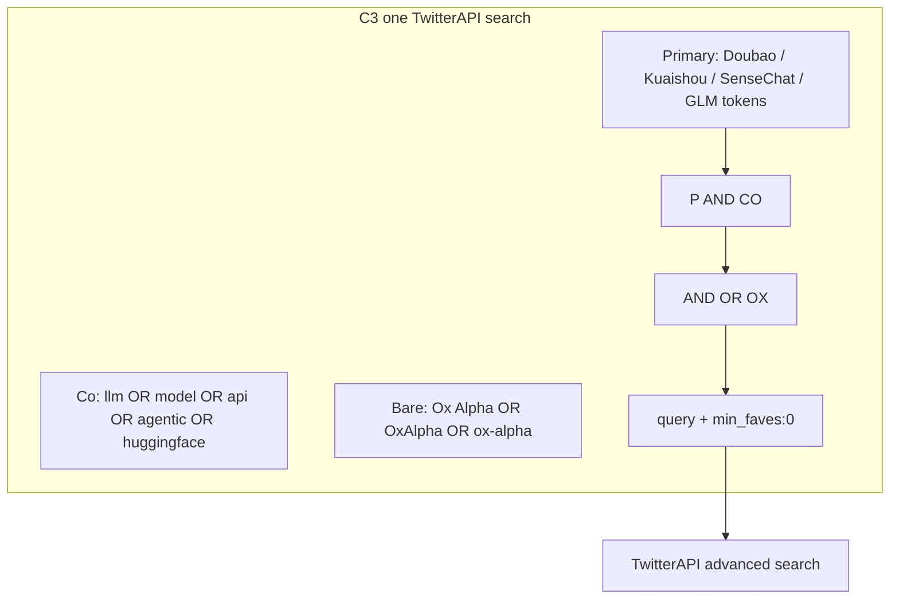
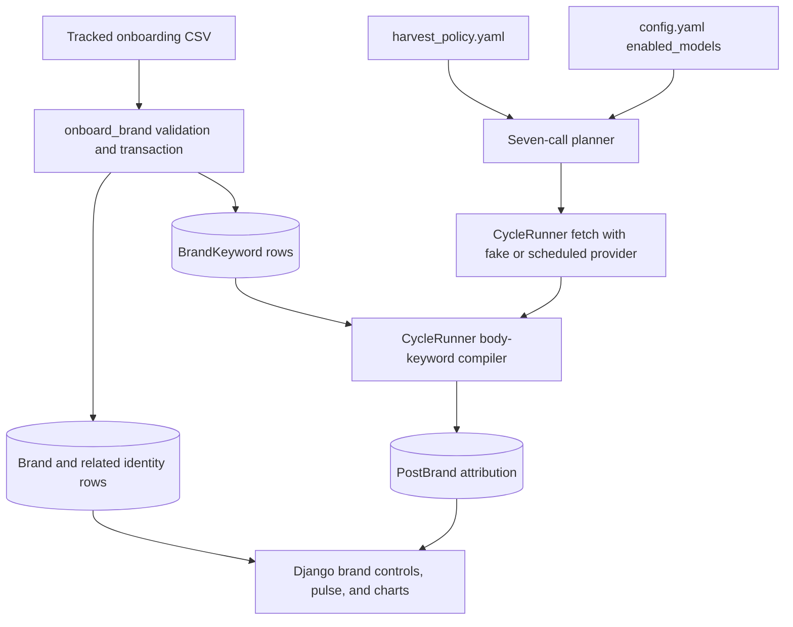

# Harvester quality upgrade - Plan

<!-- BEGIN OLLIJA DELIVERY GUIDE -->
## Ollija Delivery Guide

This block is generated guidance. Do not edit it directly. Correct durable facts in `.ollija/project.yaml` or this template, then rerun `./bin/ollija annotate-plan`. Put a user-directed exception in the editable Delivery Exceptions section below.

### Resolved locations

- Authoritative host: `fuchitalee`
- Authoritative repository: `/Users/fuchitalee/development/pushin-weight-v2`
- Ollija release worktree area: `/Users/fuchitalee/development/pushin-weight-v2/.worktrees`
- Active worktree: `/Users/fuchitalee/development/pushin-weight-v2/.worktrees/feat/harvester-quality-upgrade`
- Plan: `/Users/fuchitalee/development/pushin-weight-v2/.worktrees/feat/harvester-quality-upgrade/docs/plans/2026-08-31-013447-feat-harvester-quality-upgrade-plan.md`
- Change: `feat-harvester-quality-upgrade-2026-08-31-013447`
- Branch: `feat/harvester-quality-upgrade`
- Staging branch and blueprint: `staging`, `/Users/fuchitalee/development/pushin-weight-v2/.worktrees/feat/harvester-quality-upgrade/render-staging.yaml`
- Production branch and blueprint: `main`, `/Users/fuchitalee/development/pushin-weight-v2/.worktrees/feat/harvester-quality-upgrade/render.yaml`
- Staging URL: `https://pushinweight-staging-web.onrender.com`
- Production URL: `https://pushinweight-web.onrender.com`

### Placement

This worktree is inside the Ollija release worktree area. Reuse it for the whole change. Do not create a second worktree or plan for this branch.

### Delivery scope

- Workflow: `lfg`
- Delivery target: `staging`
- Owner selection recorded: `true`

1. Complete implementation and the plan's verification contract.
2. Run the configured focused checks:
   - `pytest tests/ollija`
3. The parent workflow commits only this plan's changes, pushes the feature branch, and records the candidate SHA.
4. Fetch the remote staging lane: `git fetch origin refs/heads/staging`.
5. Require the unchanged candidate SHA to be a fast-forward of that fetched remote ref, then push the exact candidate SHA to `refs/heads/staging` with the server-enforced fast-forward command `git push origin <candidate-sha>:refs/heads/staging`.
6. Verify the remote staging ref resolves to the candidate SHA and the Render deployment for `pushinweight-staging-web` reports that same SHA.
7. Run staging checks. Stop here if they fail.

### Failure handling

- Never promote a staging candidate whose automated checks failed.
- Implementation failures return to the parent implementation workflow for diagnosis, correction, recommit, and restaging.
- SSH, shell, environment, or multi-machine failures use the repository infra/multi-machine skill first.
- The change ledger is advisory; do not validate or enforce it.
- Never force-remove a worktree. Retain staging-only, failed, dirty, locked,
  noncanonical, or candidate-mismatched worktrees for diagnosis or later
  delivery.
- Do not run an endless retry loop or start a persistent Ollija process.
<!-- END OLLIJA DELIVERY GUIDE -->

## Delivery Exceptions

- On 2026-08-31, the owner explicitly authorized committing and pushing the corrected M17 production pause-authorization rule to `main` before this plan is completed. This one-time exception is limited to `.claude/skills/change-harvester/SKILL.md`, `.claude/skills/avoiding-recurring-mistakes/SKILL.md`, and the corresponding incident entry in `docs/operations/pause-and-resume-harvest-cron.md`; it does not authorize deployment, cron mutation, other plan implementation, or changes to `feat/backfiller-selective-gaps`.

## Goal Capsule

- **Objective:** Adding a tracked brand is filling one CSV template row (company, Hugging Face org/URL, keywords, display metadata) and loading it. The seven-call harvest then collects Hunyuan Hy-generation slang, Zhipu GLM keyword posts including Ox Alpha, and Xiaohongshu dots3-note talk, without an eighth TwitterAPI search call.
- **Means:** Operator fills the brand-onboard CSV template; `onboard_brand` loads it before harvest-token work; then version-family tokens and GLM on C3 with a bare Ox Alpha OR (KTD7, KTD2, KTD3).
- **Authority:** This plan, then `AGENTS.md` / change-harvester skill, then `config/brands/` identity files and `config/harvest_policy.yaml`.
- **Stop conditions:** A new eighth call; pausing or mutating the production cron; unauthorized production writes; merging `feat/backfiller-selective-gaps`.
- **Execution profile:** `staging`. The owner selected staging-only delivery on 2026-09-02. No live provider probe or manual production `run_cycle` is part of verification.
- **Tail ownership:** Parent workflow after an explicit delivery request. Ollija does not ship.

---

## Product Contract

Product Contract preservation: the user-set harvest and onboarding behavior is unchanged. This enrichment corrects implementation targets and closes current-runtime gaps discovered against `origin/main`.

### Summary

First make brand onboarding a CSV template the operator fills (company, Hugging Face org/URL, keywords, display) plus `onboard_brand`. Then close three capture holes on the existing seven-call harvest: Hunyuan Hy-generation nicknames, Zhipu GLM keyword coverage, and Xiaohongshu’s `dots3-note` model as brand `dots`. Keep every brand on one keyword call. Do not harvest the Xiaohongshu social app.

### Problem Frame

Brand identity is not one process today. `load_seed` upserts brand and company from Python dicts. It does not write `hf_orgs` or `brand_keywords`. The live Django dashboard still has hardcoded brand labels, colors, pulse inventory, and single-brand chart projections. `KNOWN_MODELS` also blocks configured brands outside its frozen list. An older SQLite CSV seeder already had company + HF URL columns; v2 dropped them. Adding `dots` by hand would repeat that split.

The live Django cycle has a second gap: it compiles only each enabled nickname for body attribution. It does not compile the `BrandKeyword` aliases that this onboarding flow writes. Without correcting that path, `Hy4`, `dots3-note`, and `Ox Alpha` can be fetched but discarded as unattributed.

Read-only production evidence from 2026-09-02 confirms that this is already a live Kimi attribution hole, not a new workstream. In `pushinweight-db-shadow`, `moonshot_kimi` had no insert after 2026-08-19 (`Kimi_Moonshot`), while 2,115 fetched posts in the same seven-day window contained the word `kimi` and none had `posts_brands.brand_id=moonshot_kimi`. Tweet `2094999721551225267` ("Moonshot AI's Kimi K3 climbed to third place…") was attributed only to `deepseek` and `qwen`. For C1 in cycle `20260902T043025`, `n_results=3`, `n_kept=2`, `n_inserted=0`, and `not_include_drops=0`, so the F1 exclusion was not the live cause. Current `main` emits the right C1 tokens but `_build_brand_index` compiles enabled nicknames instead of database aliases such as `Kimi`, `MoonshotAI`, and `月之暗面`; because `CycleRunner` also passes `search_query=[]`, `BrandSearchTerm` does not stamp the alias and the fetched Kimi-only post falls into `_unattributed`.

Separately, Hunyuan B1 tokens are `Hunyuan` / `混元` / `腾讯混元`, so posts that only say `Hy4` never match. Adding only `Hy4` would miss `Hy5`. GLM is handle-only (`@Zai_org` on B2). Bare `glm` is also Genelec, fandom GLM/SLM, stats GLM, and handle-substring junk. Xiaohongshu shipped `dots3-note Preview`. Ox Alpha was confirmed as GLM-5.3-Flash.

### Key Decisions

- GLM leaves B2 and joins one existing C pack. `(session-settled: user-directed — chosen over handle-only GLM and over a GLM-only eighth call: keyword glm is the gap, and brands stay grouped.)` Governs R3, R4, R5.
- Bare `glm` stays behind the five shared AI words. `(session-settled: user-directed — chosen over bare glm on B1: the acronym is dirty.)` Governs R4.
- Ox Alpha / OxAlpha / ox-alpha is OR’d bare on that same C query. `(session-settled: user-directed — chosen over putting Ox Alpha inside the co AND: alias-only posts were the hole; it is still one call.)` Governs R5.
- Hunyuan short names are a version family (previous / current / next major), not a one-off `Hy4`. `(session-settled: user-directed — chosen over listing Hy4 only: Hy5 must not need a launch-day edit.)` Governs R1, R2.
- New brand `dots` with distinctive tokens only. `(session-settled: user-approved — chosen over a Xiaohongshu/RedNote/小红书 company brand: avoid social-app flood.)` Governs R6, R7.
- Keep the seven-call shape. A new call is allowed only if a later 512-char check fails. `(session-settled: user-directed — chosen over a dedicated GLM call: existing C packs have headroom.)` Governs R8.
- Brand identity is a CSV template the operator fills, loaded by `onboard_brand`. `(session-settled: user-directed — chosen over YAML-as-the-form the operator edits: one spreadsheet row instantiates company, HF URL, keywords, and related metadata.)` Governs R11, R12, R13, R14, R15.

### Requirements

**Hunyuan version family**

- R1. Hunyuan’s distinctive-token call includes `Hy` plus previous, current, and next major numbers, with current major 4 (Hy3, Hy4, Hy5).
- R2. The same family also emits `Hy4-preview` and `Hy5-preview`. Official product strings use that suffix.

**GLM keyword path**

- R3. GLM has no handle path on B2. Official `@Zai_org` tweets remain reachable only if they already appear on Call A or in body text that matches R4/R5.
- R4. GLM’s C-pack tokens include `glm`, GLM-4 / GLM-5 / GLM-6, ChatGLM, Zhipu, 智谱, and Z.ai, AND-filtered by `llm OR model OR api OR agentic OR huggingface`.
- R5. The same C call also matches `"Ox Alpha" OR OxAlpha OR ox-alpha` with no co-occurrence requirement.

**dots brand**

- R6. `dots` is an enabled brand. Search tokens are `dots3-note`, `dots3`, `dots4`, and `dots studio`. Bare `dots`, Xiaohongshu, RedNote, and 小红书 are not search tokens.
- R7. Matching posts attribute to brand `dots` and appear under that brand on the dashboard.

**Harvest shape and cost**

- R8. The cycle still plans exactly seven logical search calls (A, B1, B2, B3, C1, C2, C3). Pagination or truncation recovery may make more than seven provider HTTP requests, but each call remains bounded by the existing search caps and every rendered query stays under 512 characters.
- R9. Every search token emitted for an enabled brand—including version-family expansions, C-pack tokens, and `c_bare_aliases`—has a normalized matching `BrandKeyword` row. The live Django cycle validates that coverage before any provider fetch and compiles those database rows for body attribution, so a fetched post is not discarded as unattributed; additional attribution-only aliases remain allowed.
- R10. `harvest_preview` is the operator check that the AFTER query strings in the Appendix match what the planner will send.
- R16. Config validation, policy derivation, planning, and degraded-budget handling recognize exactly `A`, `B1`, `B2`, `B3`, `C1`, `C2`, and `C3`; an added co-pack cannot silently emit `C4`, and legacy `Q*` IDs do not appear in current defaults or tests.

**Brand onboarding**

- R11. The operator instantiates a new brand by copying `config/brands/brand-onboard.template.csv` (Appendix exhibit), filling one row, and saving it. The row covers display names, accent, optional company, Hugging Face org URL or namespace, optional product repo ids, attribution keywords, metadata-only X handles, and harvest-path hints.
- R12. `python manage.py onboard_brand --csv <file>` atomically upserts `brands`, `companies` (when `company_nickname` is set), `brands_companies`, `hf_orgs`, `brand_keywords`, and optional `products`. Re-running is a no-op for unchanged rows. Empty `brand_nickname` and rows starting with `_` are skipped.
- R13. The command validates the whole file before writes and fails loud if harvest search is incomplete, an HF org lacks a company, a product natural key conflicts, a country/color/value is malformed, or the nickname is missing from `harvest_policy.yaml` and `config.yaml` `enabled_models`.
- R14. Every live Django brand label, accent, feed wire row, pulse, control, and single-brand chart projection reads `Brand` rows. `Brand.is_sentinel` is the sole runtime exclusion from production brand projections; a newly onboarded brand does not require a hardcoded display-name, color, selectable-inventory entry, or nickname blacklist edit.
- R15. `dots`, hunyuan metadata, and glm metadata ship in a tracked filled CSV and are applied through `onboard_brand`, not through `load_seed`, a migration, or an untracked local file. The loader is applied only to the delivery target selected by the owner.
- R17. `config.yaml` `enabled_models` is the live v2 allowlist. Adding a valid configured nickname does not require adding it to the legacy `KNOWN_MODELS` frozenset.

### Acceptance Examples

- AE1. Covers R1, R2. Given a post that says only `hy4 is genuinely unltd`, when the next cycle runs, the post is fetched on B1 and attributed to hunyuan.
- AE2. Covers R1. Given Hy5 ships and people say `hy5` without Hunyuan, when current_major is still 4, B1 already contains `Hy5` and the post is fetched.
- AE3. Covers R4. Given a post that says `switched to glm` with the word `model` nearby, when C3 runs, the post is fetched and attributed to glm.
- AE4. Covers R4. Given a Genelec GLM Kit post or an idol-fandom `glm`/`slm` post with none of the five AI words, when C3 runs, the post is not fetched.
- AE5. Covers R5. Given a post that says only `Ox Alpha is no longer available`, when C3 runs, the post is fetched and attributed to glm.
- AE6. Covers R6, R7. Given ChaoQiao42’s dots3-note launch post, when B1 runs, the post is fetched and attributed to `dots`.
- AE7. Covers R6. Given a Xiaohongshu shopping post with no dots3 tokens, when any call runs, the post is not attributed to `dots`.
- AE8. Covers R8. Given `python manage.py harvest_preview`, when policy is loaded, it prints seven logical calls and every length is under 512.
- AE9. Covers R11, R12. Given a CSV row for `dots` with company Xiaohongshu and HF `https://huggingface.co/dots-studio`, when `onboard_brand --csv` runs, `brands.nickname=dots`, a `companies` row, a `brands_companies` link, `hf_orgs.namespace=dots-studio`, and `brand_keywords` for `dots3-note` exist.
- AE10. Covers R13. Given a CSV row for a brand that is not in `harvest_policy.yaml`, when `onboard_brand --csv` runs without a skip-search flag, it exits non-zero and writes no partial identity (transaction rolls back).
- AE11. Covers R14. Given `dots` exists only in DB + CSV-onboard + policy, when dashboard controls, pulse/chart payloads, and feed wire rows are rendered, `dots` appears with the CSV display name and accent. No `MODEL_DISPLAY_NAMES['dots']` edit is required.
- AE12. Covers R13. Given an HF org or HF product URL but no company, when `onboard_brand --csv` runs, it exits non-zero before any row is written.
- AE13. Covers R9. Given enabled-brand `BrandKeyword` rows for `Hy4`, `dots3-note`, and `Ox Alpha`, when the real `CycleRunner.run()` path scans matching bodies, each post receives the expected brand; removing any one mapping fails preflight before the fake provider is called.
- AE14. Covers R16. Given default config and policy, when the derived call set and degraded skip order are validated, all seven current call IDs appear exactly once, C3 is skippable, no `Q*` ID appears, and a fourth co-pack is rejected instead of producing C4.
- AE15. Covers R12, R15. Given the tracked three-row CSV, when it is applied twice to the selected target database, the second run reports no duplicate identity, link, keyword, HF org, or product rows.
- AE16. Covers R9. Given a fetched body that says `Moonshot AI's Kimi K3 climbed to third place` and only the `moonshot_kimi` database aliases match (the nickname itself does not appear), when the real `CycleRunner.run()` path attributes and persists it, `PostBrand(post, moonshot_kimi)` exists.

### Success Criteria

- `onboard_brand --csv` on the tracked filled CSV is the only way `dots` identity rows are created in this change.
- After one authorized post-deploy cycle, new hunyuan / glm / dots inserts exist whose body uses the new tokens and not only official handles.
- `harvest_preview` AFTER strings match the Appendix exhibit (byte-stable aside from Call A list id).
- Logical call count stays at seven per cycle. Provider HTTP requests remain governed by the existing pagination and truncation caps; result volume may rise on B1 and C3.
- The new body aliases survive the live Django attribution path, and every live dashboard and feed brand projection renders `dots` from DB data.

### Scope Boundaries

**In this change**

- Brand-onboard CSV template + `onboard_brand --csv` (brand, company, HF org/URL, keywords, optional product).
- Live Django dashboard brand chrome, feed wire metadata, and pulse/chart projections read `brands` / `companies`.
- Live Django cycle compiles enabled-brand `BrandKeyword` rows for attribution.
- Seven-call config validation and degraded skip order include C3.
- Policy schema, query renderer, GLM pack membership, Hunyuan/dots token families, regression pins.

**Deferred for later**

- Yi apostrophe / Turkish suffix false-positive handling from the 2026-08-31 incident.
- Stamping `source_query_id` / cycle_kind fidelity (`scheduled` vs `manual`).
- Auto-discovery of the next unnamed stealth model (Ox Alpha’s successor).
- `@dotsstudioai` / `@ChaoQiao42` on B2/B3 or the curated list.
- Expanding the LLM relevancy gate beyond Call A.
- `feat/backfiller-selective-gaps`.
- Historical false-positive deletes or reattributes.
- Backfilling CSV rows for all 20 existing brands in one pass (this change needs rows for `dots`, `hunyuan`, and `glm`; others may keep `load_seed` until a follow-up).
- Admin UI for onboarding (harvest policy 4/5).
- Scraping the full HF product catalog for a new org (optional `repo_id` only).
- Reworking the retired Flask/SQLite dashboard, legacy `x_monitor.store` registry, or historical CLI seeding paths.
- Resolving X handles to account IDs or writing `BrandAccount` / `CompanyAccount` rows. The CSV handle columns remain metadata-only in this change.

**Outside this product**

- Harvesting Xiaohongshu / RedNote / 小红书 as a social app.
- An eighth TwitterAPI search call unless a 512-char check proves an existing pack cannot fit.

### Assumptions

- GLM neighborhood is C3 (Doubao / SenseChat / Kuaishou). Measured AFTER length 247 / headroom 265. C1 also fits (399 / 113) but is tighter.
- `dots` is B1-only this change. No official-handle path.
- Version-family lookback for dots is 0 (no `dots2`).
- Call A list membership is unchanged. Dropping `@Zai_org` from B2 may miss third-party mentions that contain neither GLM tokens nor Ox Alpha.

---

## Planning Contract

### Key Technical Decisions

- KTD1. Author live search paths only in `config/harvest_policy.yaml`. The live Django cycle requires that file and fails preflight when it is missing or invalid; it does not fall back to `config.yaml` `x_query_specs`. The checked-in legacy field may remain for explicitly deferred CLI consumers but is not a production search source. Governs how R8 is built.
- KTD2. Add a policy `version_family` block that expands to tokens at spec derivation, not a hand-listed Hy4. `(session-settled: user-directed — chosen over a one-off Hy4 token: Hy5 must not require a launch-day edit.)` Instantiates R1, R2, R6.
- KTD3. Add spec-level `c_bare_aliases` rendered as `(constrained) OR (aliases)` on the same C call. `(session-settled: user-directed — chosen over a second GLM keyword call: brands stay grouped and the 512-cap still holds.)` Instantiates R5, R8.
- KTD4. Do not emit `-term` excludes for Genelec/fandom. The five-word co list already drops those classes. Residual leak is stats posts that contain both `glm` and `model`.
- KTD5. Search SSOT remains policy. Attribution SSOT remains `BrandKeyword`: the live Django cycle requires a normalized database mapping for every active policy token, then compiles enabled-brand rows into the body-keyword index. It does not manufacture nickname fallbacks or create a parallel `BrandSearchTerm` write path. Governs R9.
- KTD6. Keep seven logical calls. If preview length exceeds 512, the LFG implementer stops before any provider call, reports the exact call ID, query, and measured length to the owner, and records the owner-approved resolution in this plan before continuing. Do not silently drop tokens or split a new call.
- KTD7. Operator authoring surface is the CSV template in the Appendix (shipped as `config/brands/brand-onboard.template.csv`). `onboard_brand --csv` loads it. Harvest search SSOT stays `config/harvest_policy.yaml`. Multi-value cells use `|`. HF cells accept a namespace or a `https://huggingface.co/...` URL; the loader stores `hf_orgs.namespace` only. `(session-settled: user-directed — chosen over YAML as the form the operator edits: one spreadsheet row instantiates the brand.)` Instantiates R11, R12, R13.
- KTD8. The live v2 enable-gate is `config.yaml` `enabled_models`. Config validates unique nickname-shaped values and cross-field overrides against that list; live `CycleRunner` does not filter through `KNOWN_MODELS`. The frozen registry remains only for explicitly deferred legacy consumers. Instantiates R13, R17.
- KTD9. The seven-call contract is a logical planner invariant, not an HTTP-request count. Existing pagination and truncation caps remain the provider-spend boundary. Instantiates R8, R16.

### Assumptions

- The `official_x_handles` and `staff_x_handles` CSV columns are metadata-only in this change. The loader normalizes them for dry-run/policy comparison but does not create accounts or role links because handles do not provide the required account IDs.
- The tracked filled input is `config/brands/2026-08-31-013447-harvester-quality-upgrade.csv`. This makes the intended identity rows reviewable and deployable while keeping the reusable template instruction-only.
- C3 is inserted before C2 and C1 in the degraded skip order: `B3`, `B2`, `B1`, `C3`, `C2`, `C1`, `A`. C3 has the broadest new result-volume risk among the constrained calls.
- Identity rows are applied only to the owner-selected delivery target. Code rollback does not delete durable identity rows; the operational rollback is to disable the brand in policy/config and use an explicit data correction only if the loaded rows are proven wrong.
- Tests use a fake TwitterAPI client. Delivery inspects the first natural scheduled cycle and does not trigger a manual provider call or pause the Render cron.
- `Brand.is_sentinel` is the sole runtime brand-projection exclusion. Fixture-only brands must set that field; production code does not carry a nickname exclusion list.
- The active policy-derived call IDs must equal `{A, B1, B2, B3, C1, C2, C3}` after expansion. Missing IDs, duplicates, unknown IDs, or an added `C4` fail before planning or fetching.
- Active policy tokens and enabled-brand `BrandKeyword` rows are compared through the same case/whitespace/quote normalization used by attribution. A missing active mapping is a hard preflight failure, not a warning or nickname fallback; additional database aliases may still attribute posts reached through another path such as Call A.

### High-Level Technical Design

C3 after this change is one TwitterAPI `query` string with two disjuncts. GLM-pack tokens still require the shared co list. Ox Alpha does not.



Version family expansion happens in spec derivation before `_build_query`. Hunyuan/dots expanded tokens join B1 `primary_keywords`. GLM-n majors join C3 `brands['glm']`. Ox Alpha aliases do not join `brands['glm']`; they join `c_bare_aliases` so they skip the co AND.

The identity and runtime path stays split by responsibility while sharing the same nickname.



Directional renderer grammar (not implementation specification):

```text
C_query := "(" constrained " OR " bare ")" " min_faves:" N
constrained := primary " " "(" co_or_list ")"
bare := "(" alias_or_list ")"
When c_bare_aliases is empty, emit the current primary + co shape with no outer OR.
```

### Sequencing

Reconcile this worktree with `origin/main` before editing because the branch predates the current Django geography/feed changes. Then execute U6 CSV command and U7 dashboard/feed projections, followed by U1 expander, U2 renderer, U3 policy data, U9 config governance, U4 tracked identity rows, U8 live attribution, and U5 end-to-end pins. U7 and the U1–U3 chain may proceed independently after reconciliation; harvest-token units must not invent a parallel seed path.

### Sources

- Live `harvest_preview` (2026-08-31): B1 136/376, C3 136/376, C1 288/224, B2 317/195. GLM is coverage `['B2']` only.
- `docs/how-to/add-tracked-brand.md` — current checklist; this change replaces it with the CSV template + `onboard_brand --csv`.
- `scripts/2026-06-25-005-seed-companies-brands-from-csv.py` — prior identity columns including HF orgs (SQLite).
- `core.models.HFOrg` / `Company` / `BrandKeyword` — existing tables; no new table.
- `docs/solutions/integration-issues/harvest-pipeline-missing-call-queries.md` — pin the production caller and call count.
- `monitor/cycle.py` `_build_brand_index` / `_attribute_items` — current live attribution seam that must consume `BrandKeyword`.
- `monitor/views.py` `_build_home_pulse_payload`, chart projections, and `_build_brands_context` — current production dashboard surfaces; retired Flask modules are excluded.
- X samples: Hy4 slang without Hunyuan; Genelec GLM Kit; fandom GLM vs SLM; Ox Alpha still discussed after the 2026-08-26 reveal.

---

## Implementation Units

### U6. CSV template and onboard_brand command

- **Goal:** The operator fills the Appendix CSV template; one command upserts brand, company (when given), HF org/URL, keywords, and optional product rows.
- **Requirements:** R11, R12, R13, R15
- **Dependencies:** none
- **Files:** `config/brands/brand-onboard.template.csv`, `monitor/management/commands/onboard_brand.py`, `tests/test_onboard_brand.py`, `docs/how-to/add-tracked-brand.md`
- **Approach:**
  1. Ship the template byte-identical to the Appendix exhibit (header + `_TEMPLATE` instruction row). Filled inputs use a separate tracked, dated file owned by U4.
  2. `onboard_brand --csv` reads RFC4180 CSV. Multi-value cells split on `|`. `hf_orgs` accepts `dots-studio` or `https://huggingface.co/dots-studio/` and stores namespace `dots-studio`. `https://huggingface.co/<ns>/<repo>` in `hf_product_repo_ids` stores `products.repo_id`.
  3. Skip rows with empty `brand_nickname` or nickname starting with `_`.
  4. Parse and validate the entire file before writes. Require `company_nickname` when `hf_orgs` or an HF product URL is present. Validate country, color, integer fields, handle syntax, unique product ownership, policy membership, `enabled_models` membership, and coverage of every active policy token by the post-transaction keyword set.
  5. Use one transaction per file and natural-key upserts for `Brand`, `Company`, `BrandCompany`, `HFOrg`, `BrandKeyword`, and `Product`. A bad later row rolls back earlier rows. Empty `company_nickname` skips company only when no HF row needs it.
  6. Treat X handle columns as metadata-only per the Planning Contract Assumptions. Normalize an optional leading `@`, warn on mismatch with policy handles, print them in `--dry-run`, and write no `Account` or role-link rows.
  7. `--dry-run` prints the complete row plan and every gate result without writes or external calls.
  8. Rewrite `docs/how-to/add-tracked-brand.md`: copy template, fill a dated input, review dry-run, apply it to the selected target, and verify idempotency. `load_seed` stays for roles and the original bootstrap until a follow-up.
  9. Harvest-path columns (`harvest_paths`, `co_pack`, version-family fields) remain operator metadata. The command fails when a mismatch would leave an active policy token without attribution, warns on other descriptive metadata drift, and never silently rewrites `harvest_policy.yaml`.
- **Patterns to follow:** `load_seed.py` atomic `update_or_create`. Old CSV column O (`hf_orgs`) URL-or-namespace semantics. `HFOrg` existing table.
- **Test scenarios:**
  - Covers AE9. Fixture CSV row creates brand, company, link, hf_org, primary keyword.
  - Covers AE10. Missing harvest_policy key exits non-zero; no brand row remains.
  - Edge: `_TEMPLATE` row is skipped.
  - Edge: `https://huggingface.co/dots-studio` and `dots-studio` produce the same `hf_orgs.namespace`.
  - Edge: second run with the same CSV does not duplicate keywords.
  - Edge: empty `company_nickname` with no HF cells still creates the brand and keywords; no company row is inserted.
  - Covers AE12. HF org or HF product with empty company fails before writes.
  - Error: a product `repo_id` already owned by another brand/HF org fails without reassignment.
  - Error: an invalid second data row rolls back the valid first row.
  - Edge: handles with or without `@` normalize in dry-run and create no account/link rows.
  - Edge: a blank row or row with an empty nickname is skipped; an invalid HQ country on a named row fails before writes.
- **Verification:** `onboard_brand --csv config/brands/brand-onboard.template.csv --dry-run` skips `_TEMPLATE` and writes nothing. How-to names the template first.
- **Execution note:** Land this before any dots harvest-token work.

### U7. Dashboard and feed brand projections from DB

- **Goal:** A newly onboarded brand shows in every live dashboard and feed projection from `brands` rows, not from a Python dict edit.
- **Requirements:** R14
- **Dependencies:** U6
- **Files:** `monitor/views.py`, `tests/test_home_chart.py`, `tests/test_home_chart_pulse.py`, `tests/test_single_brand_chart.py`, `tests/test_home_v22_feed_row_shape.py`, `tests/test_ui_assurance_brand_inventory.py`
- **Approach:**
  1. Introduce one live Django brand projection for nickname, locale-aware display name, accent, and ordering from non-sentinel `Brand` rows.
  2. Reuse it for home controls, `_build_home_pulse_payload`, home chart colors, brand detail labels/colors, single-brand chart payloads, and both feed serialization paths (`_post_to_wire` plus `_enrich_posts_with_classifications` / `_serialize_feed_row`). Fallback for missing display is nickname; fallback for missing accent is the neutral default.
  3. Remove production dependence on `MODEL_DISPLAY_NAMES`, `MODEL_ACCENT_COLORS`, `HOME_SELECTABLE_BRAND_NICKNAMES`, and `_HOME_EXCLUDED_BRAND_NICKNAMES`. Keep deterministic Bridgewright fixture data in tests, mark fixture-only brands `is_sentinel=True`, and use that field as the sole runtime exclusion.
  4. Preserve the four-brand open/closed presentation lens; no new persistence field is introduced.

  | Legacy surface | Disposition | Reason |
  |---|---|---|
  | `monitor/views.py` Django home/chart/detail | PORT | This is the Render production UI and owns R14. |
  | `x_monitor/dashboard.py` | EXCLUDE | Retired Flask/SQLite surface. |
  | `x_monitor/_home_routes.py` | EXCLUDE | Retired Flask/SQLite routes. |
  | Legacy registry/store cleanup | DEFER | It does not drive the v2 Render dashboard. |

- **Patterns to follow:** `_build_brands_context` already queries `Brand`; extend that DB-first projection across all live consumers.
- **Test scenarios:**
  - Covers AE11. Insert only a `Brand(nickname=dots, display_name=dots, accent_color=#0ea5e9)` row; home controls include it without a dict edit.
  - Integration: the same DB-only dots row appears in home pulse, multi-brand chart color data, brand detail, single-brand chart payloads, and both live feed wire shapes with the same locale-aware display metadata.
  - Edge: brand with null display_name renders nickname.
  - Edge: brand with null accent renders the neutral default.
  - Error: a fixture-only row marked `is_sentinel=True` remains absent from production controls and feed brand metadata; a non-sentinel `test_brand` is not silently excluded by nickname.
- **Verification:** Live Django dashboard and feed projections render a DB-only dots brand, and no production view requires a `dots` constant or nickname exclusion.

### U1. Version-family expansion in harvest policy

- **Goal:** Policy can declare a prefix plus current major and expand previous/current/next tokens instead of listing Hy4 by hand.
- **Requirements:** R1, R2, R6
- **Dependencies:** none
- **Files:** `x_monitor/harvest_policy.py`, `x_monitor/specs_from_policy.py`, `tests/test_harvest_policy_load.py`, `tests/test_version_family_expand.py`
- **Approach:**
  1. Add an optional `version_family` structure on a brand: prefix, current_major, lookback, lookahead, extra_suffixes.
  2. Expand at `primary_keywords_from_policy` / C-pack token assembly so B1 and C brands share one expander.
  3. Hunyuan: prefix `Hy`, current_major 4, lookback 1, lookahead 1, extra_suffixes `[-preview]` on current and lookahead only.
  4. dots: prefix `dots`, current_major 3, lookback 0, lookahead 1. Distinctive extras `dots3-note` and `dots studio` stay as ordinary tokens.
  5. GLM majors on C: prefix `GLM-`, current_major 5, lookback 1, lookahead 1, producing GLM-4 / GLM-5 / GLM-6 beside ChatGLM / Zhipu / 智谱 / Z.ai / `glm`.
- **Patterns to follow:** `BrandPolicy` optional fields and `_bare_token_list` in `specs_from_policy.py`.
- **Test scenarios:**
  - Happy path: Hunyuan current_major 4 expands to Hy3, Hy4, Hy5, Hy4-preview, Hy5-preview.
  - Edge: dots lookback 0 does not emit dots2.
  - Edge: bumping Hunyuan current_major to 5 in a fixture emits Hy4, Hy5, Hy6, Hy5-preview, Hy6-preview without a code change.
  - Error: empty prefix or negative current_major raises at load time.
- **Verification:** Loader tests green. No production search yet.
- **Execution note:** Pin expander output before wiring live policy data in U3.

### U2. Mixed C query renderer for bare aliases

- **Goal:** One C call can be `(pack tokens AND co) OR (bare aliases)` without a new call_id.
- **Requirements:** R5, R8
- **Dependencies:** U1
- **Files:** `x_monitor/query_plan.py`, `x_monitor/harvest_policy.py`, `x_monitor/specs_from_policy.py`, `tests/test_query_plan_c_bare_aliases.py`
- **Approach:**
  1. Add `c_bare_aliases` on the brand (glm only in this change) and union them onto the C spec.
  2. When the list is non-empty, `_build_query` wraps `(primary co OR (aliases)) min_faves:N`.
  3. When empty, keep the current C shape so C1/C2 do not change.
  4. Quoted multiword aliases (`"Ox Alpha"`) stay quoted in the rendered string.
  5. `assert_under_length_cap` remains the hard stop (KTD6).
- **Patterns to follow:** empty-co omit path in `_build_query` (hybrid funnel U2). One renderer, no second pipeline (M7).
- **Test scenarios:**
  - Happy path: fixture C spec with glm tokens + Ox Alpha aliases renders the Appendix C3 shape (modulo pack mates).
  - Covers AE5. A query with only `Ox Alpha` and no `model` still contains the bare disjunct.
  - Edge: C spec with empty `c_bare_aliases` byte-matches today’s C1/C2/C3 constrained form.
  - Error: over-512 query raises `length_cap_exceeded` and does not call TwitterAPI.
  - Integration: `plan_calls` captures `query_string` from a fake cycle caller (M18), not only `_build_query` in isolation.
- **Verification:** Renderer tests plus one call-chain pin.
- **Execution note:** Start with a failing assertion on the exact C3 AFTER string in the Appendix.

### U3. Hunyuan, GLM, and dots search policy data

- **Goal:** Live policy emits the Appendix AFTER queries (except Call A list id).
- **Requirements:** R1, R2, R3, R4, R5, R6, R8
- **Dependencies:** U1, U2
- **Files:** `config/harvest_policy.yaml`, `tests/test_harvest_policy_regression_net.py`, `tests/test_hybrid_harvest_regression_net.py`
- **Approach:**
  1. Hunyuan keeps `paths: [bare, handle]`. Add version_family per U1. Keep `Hunyuan` / `混元` / `腾讯混元`.
  2. GLM `paths: [co]` only. Remove `Zai_org` from glm handles. Put glm on the third co_pack (C3) with Doubao / SenseChat / Kuaishou. Tokens per R4. `c_bare_aliases` per R5.
  3. dots `paths: [bare]` with distinctive tokens per R6 plus version_family.
  4. Update coverage pins: glm `{C3}`, hunyuan `{B1,B2}`, dots `{B1}`. B2 handle set no longer includes `Zai_org`.
- **Patterns to follow:** `docs/how-to/add-tracked-brand.md`. Existing co_packs lists.
- **Test scenarios:**
  - Covers AE8. Preview has seven logical calls. C3 length is 247 as in the Appendix (allow token-order variance only if a unit documents a stable sort; prefer byte-stable).
  - glm is absent from B2 handles.
  - B1 query contains Hy4, Hy5, dots3-note.
  - C3 query contains both the co-constrained glm group and the bare Ox Alpha group.
- **Verification:** `python manage.py harvest_preview --fail-on-invariant-violation` matches the Appendix.

### U9. Dynamic v2 brand gate and seven-call config governance

- **Goal:** Config accepts newly onboarded v2 brands and governs all seven logical calls, including C3.
- **Requirements:** R8, R13, R16, R17
- **Dependencies:** U3
- **Files:** `x_monitor/config.py`, `x_monitor/specs_from_policy.py`, `monitor/cycle.py`, `config.yaml`, `tests/test_config.py`, `tests/test_cycle_runtime_constants.py`, `tests/test_harvest_surface_regression_net.py`, `tests/test_cmd_run_query_id.py`
- **Approach:**
  1. Validate `enabled_models` as non-empty, unique nickname-shaped values rather than membership in the frozen legacy registry.
  2. Validate per-model overrides against the same instance's `enabled_models` list.
  3. Set the current call-ID set to `A`, `B1`, `B2`, `B3`, `C1`, `C2`, `C3` and update the default plus checked-in degraded skip order per the Planning Contract Assumptions.
  4. Remove unused current-path `Q*` constants and update stale tests/summaries that still claim six calls or Q-based defaults. Do not broaden this into retired SQLite store refactoring.
  5. Make the live Django `_resolve_x_query_specs` require the policy file and surface load/validation failure before planning; do not use the checked-in `config.yaml` `x_query_specs` as a production fallback.
  6. Validate the fully derived policy call IDs against the exact seven-ID set. A fourth co-pack or any other policy edit that would emit `C4` or an eighth logical call fails preflight.
- **Patterns to follow:** existing Pydantic field/model validators and call-ID regression nets.
- **Test scenarios:**
  - Covers AE14. Default config contains each of the seven IDs once, including C3, and rejects an omission, duplicate, or unknown ID.
  - Happy path: config accepts `dots` in `enabled_models` without editing `KNOWN_MODELS`.
  - Error: duplicate or malformed enabled nickname fails validation.
  - Error: a per-model threshold key outside `enabled_models` fails validation.
  - Regression: current planner/cmd summaries use only A/B/C IDs and report C3.
  - Error: missing or invalid `harvest_policy.yaml` fails before the fake provider is called; `config.yaml` `x_query_specs` does not mask it.
  - Error: a fixture policy with a fourth co-pack is rejected before it can emit C4.
- **Verification:** Config, surface, and command tests agree on one seven-logical-call vocabulary.

### U4. Onboard dots, hunyuan aliases, and glm aliases via the command

- **Goal:** Identity rows for this change are created only by `onboard_brand --csv` from filled template rows.
- **Requirements:** R6, R7, R9, R15
- **Dependencies:** U3, U6, U9
- **Files:** `config/brands/2026-08-31-013447-harvester-quality-upgrade.csv`, `config.yaml`
- **Approach:**
  1. Add the three Appendix rows (`dots`, hunyuan keyword update, glm keyword update) to the tracked dated CSV. Keep `official_x_handles` empty for dots.
  2. `dots3-note` is the dots primary keyword. Hy-family / GLM-family / Ox Alpha aliases are `keyword_aliases` or `c_bare_aliases` with `is_primary=false`. Do not promote `glm` or `混元` to primary (migration 0007).
  3. Add `dots` to `enabled_models`. Harvest policy for `dots` is U3. Dry-run and apply the CSV only against the database selected by the delivery target.
  4. Do not add `@dotsstudioai`. Do not add a `MODEL_DISPLAY_NAMES['dots']` key. Do not add a one-off BrandKeyword data migration.
  5. Re-run the command after apply and assert zero duplicate natural-key rows. If the delivery target is production, staging dry-run/apply/verification precedes production apply at the same candidate SHA.
- **Patterns to follow:** U6 CSV contract. `0007` dirty-primary list.
- **Test scenarios:**
  - Covers AE6. Attribution on `dots3-note Preview` body maps to `dots`.
  - Covers AE1. Attribution on `hy4` maps to hunyuan.
  - Covers AE5. Attribution on `Ox Alpha` maps to glm.
  - Edge: body `xiaohongshu` alone does not map to `dots`.
  - Error: running `onboard_brand --csv` for dots before U3 policy exists fails the harvest-policy gate (AE10).
- **Verification:** Covers AE15. Command output lists inserted/updated/unchanged counts; the second apply is idempotent and `hf_orgs.namespace=dots-studio`.

### U8. Live Django BrandKeyword attribution

- **Goal:** Every enabled-brand keyword loaded by `onboard_brand` participates in the actual v2 body-attribution path.
- **Requirements:** R7, R9, R17
- **Dependencies:** U4
- **Files:** `monitor/cycle.py`, `tests/test_cycle_regression_net.py`, `tests/test_brand_search_terms_hybrid.py`
- **Approach:**
  1. Build the compiled body-keyword index from all `BrandKeyword` rows whose brands are enabled, including primary, alias, literal, and regex rows.
  2. Derive the complete active token set from policy, including version-family expansions and `c_bare_aliases`, normalize it through the attribution compiler's literal-token rules, and require matching enabled-brand database rows before the first provider call.
  3. Do not synthesize nickname fallback rows. A missing mapping blocks the cycle with the brand and token named; additional database aliases remain valid for posts reached through other collection paths.
  4. Keep `BrandSearchTerm` limited to search-query provenance. Do not duplicate new aliases into that table to compensate for the compiler input.
  5. Remove the live `CycleRunner` filter through `KNOWN_MODELS`; U9 owns config validation.
  6. Treat the 2026-09-02 production Kimi miss as the concrete live regression that this unit closes: compile `Kimi`, `MoonshotAI`, and `月之暗面` from `BrandKeyword`; do not add a nickname/search-term fallback.
- **Patterns to follow:** `compile_keyword_index` already accepts `(brand_id, pattern, is_regex)` rows and `Store.read_brand_keywords` documents the intended shape.
- **Test scenarios:**
  - Covers AE13. A fake-provider `CycleRunner.run()` persists `PostBrand(dots)` for a body containing `dots3-note` after the keyword is seeded only in DB.
  - Covers AE1. The same full path persists hunyuan for a body containing `Hy4` without the word Hunyuan.
  - Covers AE5. The same full path persists glm for a body containing `Ox Alpha` without a co word.
  - Covers AE16. The same full path persists `moonshot_kimi` for `Moonshot AI's Kimi K3 climbed to third place` using DB keywords only, with no `moonshot_kimi` nickname in the body.
  - Edge: a keyword belonging to a disabled brand is not compiled or attributed.
  - Edge: a regex keyword is compiled with its existing `is_regex` semantics.
  - Error: remove only the `Ox Alpha` database mapping while policy still emits it; preflight names glm/Ox Alpha and the fake provider receives zero calls.
  - Error: DB keyword-load failure follows the current degraded/logged behavior and does not invent a second source.
- **Verification:** The full fake-provider cycle proves fetch-to-`PostBrand` attribution; a helper-only `_attribute_items` test is not accepted as the regression net.

### U5. Preview exhibit pin and production call-chain net

- **Goal:** The Appendix AFTER strings cannot drift from the planner the cron uses.
- **Requirements:** R8, R9, R10, R16
- **Dependencies:** U2, U3, U4, U8, U9
- **Files:** `tests/test_harvest_policy_regression_net.py`, `tests/test_harvest_surface_regression_net.py`, `tests/test_harvest_query_exhibit.py`, `tests/test_cycle_regression_net.py`, `tests/test_cmd_run_query_id.py`, `docs/how-to/add-tracked-brand.md`
- **Approach:**
  1. Golden-pin B1, B2, C3 AFTER strings from the Appendix.
  2. Fake TwitterAPI on the real `plan_calls_for_cycle` / `CycleRunner.run()` path captures `query=` kwargs for all logical calls and persists the three new attribution examples plus the production-derived Kimi-only example (M18).
  3. Pin logical call count == 7, current IDs only, per-call pagination/search caps, and length cap. Do not assert that the provider receives only seven HTTP requests.
  4. Pin the active policy-token set as a normalized subset of enabled-brand `BrandKeyword` rows and prove that a missing mapping stops before the fake provider call while attribution-only aliases remain allowed.
  5. Run `scripts.harvest_cost` against representative summary fixtures to record the expected B1/C3 result-volume sensitivity without consuming provider credits.
  6. Do not run live `run_cycle` against production or staging. Inspect the first natural scheduled cycle only after authorized delivery.
- **Patterns to follow:** `tests/test_harvest_policy_regression_net.py` coverage map; harvest-pipeline-missing-call-queries lesson.
- **Test scenarios:**
  - Integration: production planning path emits seven logical queries. C3 equals the Appendix C3 string.
  - Edge: removing Ox Alpha from policy makes the C3 pin fail.
  - Edge: adding a token that pushes C3 over 512 fails the length cap test, not a silent truncate.
  - Edge: adding a fourth co-pack fails the exact call-set preflight, not a C4 provider request.
  - Edge: deleting a database mapping for any active version-family or bare-alias token prevents every provider request in that cycle.
  - Regression: the production-derived Kimi-only body persists `PostBrand(moonshot_kimi)` from DB keywords, proving the fetched result no longer falls into `_unattributed`.
  - Cost: fixture comparison keeps seven logical calls and makes any B1/C3 result-count increase visible in estimated credits.
- **Verification:** Named tests, preview output, fake-provider captures, and fixture cost report agree.

---

## Verification Contract

| Gate | Command / check | Applies |
|---|---|---|
| Onboard identity | `python manage.py onboard_brand --csv config/brands/brand-onboard.template.csv --dry-run`, then dry-run/apply/re-run the tracked filled CSV on a test DB | U6, U4 |
| Policy load + coverage | `python manage.py harvest_preview --fail-on-invariant-violation` | U3, U5 |
| Config vocabulary | `pytest tests/test_config.py tests/test_cycle_runtime_constants.py tests/test_harvest_surface_regression_net.py tests/test_cmd_run_query_id.py` | U9 |
| Unit / call-chain | `pytest tests/test_harvest_policy_load.py tests/test_version_family_expand.py tests/test_query_plan_c_bare_aliases.py tests/test_harvest_policy_regression_net.py tests/test_harvest_query_exhibit.py tests/test_cycle_regression_net.py tests/test_brand_search_terms_hybrid.py` | U1–U5, U8 |
| Dashboard/feed DB projection | `pytest tests/test_home_chart.py tests/test_home_chart_pulse.py tests/test_single_brand_chart.py tests/test_home_v22_feed_row_shape.py tests/test_ui_assurance_brand_inventory.py` | U7 |
| System check | `python manage.py check` | U4, U7–U9 |
| Credit | `python -m scripts.harvest_cost` against representative summary fixtures; after authorized delivery, compare the first natural cycle's B1/C3 `n_results` with baseline | U5, post-delivery |
| Target data apply | Dry-run, apply, and idempotent re-run of the tracked CSV on staging; repeat on production only when production is the recorded delivery target | U4, post-delivery |
| Runtime health | change-harvester latest-N health check after the first natural scheduled cycle on the authorized target. No cron pause or manual provider call. | post-delivery |

Do not treat Render `cron_job_run_ended status="successful"` as done.

---

## Definition of Done

- R11–R17 hold: the tracked CSV plus `onboard_brand --csv` is the identity path; live cycle attribution and dashboard/feed rendering do not need a new static registry entry or nickname exclusion for `dots`.
- R1–R10 hold on `harvest_preview`, the full fake-provider cycle, and the named pytest files.
- Appendix AFTER strings are the strings `plan_calls` would send (Call A list id excluded).
- GLM is not on B2. glm coverage is `{C3}`.
- `dots` is enabled, attributed, and visible as its own brand.
- The policy resolves to exactly the seven allowed logical calls and every active search token has a database attribution mapping before fetch. No production pause. No manual live provider probe. Production rows are written only when production is the owner-selected target.
- Abandoned experimental policy keys are not left in `harvest_policy.yaml`.
- Delivery stops after staging verification; production promotion requires a separate owner instruction.

Per unit: U6 CSV template + command; U7 live dashboard-from-DB; U1 expander pins; U2 mixed-query pins; U3 coverage map; U9 seven-call config; U4 tracked rows; U8 live keyword attribution; U5 exhibit + full call-chain.

---

## Risks & Dependencies

- C3 volume and credit rise because GLM keywords and bare Ox Alpha are new matches on an existing call.
- Seven logical calls can still produce more provider HTTP requests through pagination and truncation recovery; existing search caps and observed `n_results` are the spend controls.
- Dropping `@Zai_org` from B2 loses mention-only posts that never say GLM or Ox Alpha.
- Metaphorical “Ox Alpha moment” posts will match R5.
- Stats GLM posts that also say `model` can match R4.
- `not_include` is stored on specs today but does not appear in live rendered queries. Do not rely on it for Genelec.
- Parallel branch `feat/backfiller-selective-gaps` overlaps `monitor/cycle.py`. Do not merge it here.
- The feature worktree is behind `origin/main`; reconcile before code changes and preserve the current geography/feed work in `monitor/views.py`.
- Durable identity rows outlive code rollback. Disable policy/config first and perform an explicit targeted correction rather than deleting rows as part of an application rollback.

---

## Appendix

### Exhibit: brand-onboard CSV template

Shipped path: `config/brands/brand-onboard.template.csv`.

Copy the file. Delete or keep the `_TEMPLATE` row. Add one data row per brand. This change's reviewed rows ship at `config/brands/2026-08-31-013447-harvester-quality-upgrade.csv`. Load with `python manage.py onboard_brand --csv <filled.csv>`.

Rules the loader must honor:

- RFC4180 quoting. Commas inside a cell are quoted.
- Multi-value cells split on `|` (not comma).
- `hf_orgs` and `hf_product_repo_ids` accept a namespace/repo id or a full `https://huggingface.co/...` URL.
- Empty `company_nickname` means no company row only when both HF cells are empty; an HF org or HF product requires a company.
- Empty `brand_nickname`, or nickname starting with `_`, is skipped.
- `keyword_primary` becomes `brand_keywords.is_primary=true`. `keyword_aliases` and version-family expansions are `is_primary=false`. `c_bare_aliases` are attribution aliases and also the C-query bare OR list for that brand.
- X handle cells accept values with or without `@`, are normalized for policy comparison, and are metadata-only in this change. They create no account or role-link rows.
- `harvest_paths` / `co_pack` / version-family columns document the intended search shape. U3 still edits `harvest_policy.yaml`. The command warns on mismatch; it does not silently rewrite policy in U6.

```csv
brand_nickname,brand_display_name,brand_display_name_en,brand_display_name_zh_cn,accent_color,company_nickname,company_display_name,company_display_name_en,company_display_name_zh_cn,company_hq_country,hf_orgs,hf_product_repo_ids,keyword_primary,keyword_aliases,c_bare_aliases,official_x_handles,staff_x_handles,harvest_paths,co_pack,version_family_prefix,version_family_current_major,version_family_lookback,version_family_lookahead,version_family_extra_suffixes,notes
_TEMPLATE,required display,English display,Chinese display,#RRGGBB,company slug or empty,company display,company English,company Chinese,ISO-3166-1-alpha-2,hf namespace or URL pipe-separated,org/model pipe-separated,primary patterns pipe-separated,non-primary patterns pipe-separated,bare C-query aliases pipe-separated,x handles no @,staff handles no @,"bare|co|handle pipe-separated",C1 or C2 or C3 or empty,Hy or dots or GLM- or empty,integer or empty,integer default 1,integer default 1,-preview or empty,operator notes; this row is skipped
dots,dots,dots,dots,#0ea5e9,xiaohongshu,Xiaohongshu,Xiaohongshu / RedNote,小红书,CN,https://huggingface.co/dots-studio,dots-studio/dots3-note-prev,dots3-note,dots3|dots4|dots studio,,,,bare,,dots,3,0,1,,Xiaohongshu social-app names are not search tokens
hunyuan,Hunyuan,Hunyuan,混元,#ec4899,tencent,Tencent,Tencent,腾讯,CN,https://huggingface.co/tencent,,"Hunyuan",腾讯混元|Hy3|Hy4|Hy5|Hy4-preview|Hy5-preview,,TencentHunyuan,,"bare|handle",,Hy,4,1,1,-preview,Do not set 混元 as keyword_primary
glm,Zhipu GLM,Zhipu GLM,智谱 GLM,#a855f7,zhipu,Zhipu AI,Zhipu AI,智谱,CN,https://huggingface.co/zai-org,,ChatGLM,glm|GLM-4|GLM-5|GLM-6|Zhipu|智谱|Z.ai,Ox Alpha|OxAlpha|ox-alpha,,,co,C3,GLM-,5,1,1,,Do not set glm as keyword_primary; Ox Alpha is c_bare_aliases
```

Worked `dots` row maps to existing tables:

| CSV field | DB |
|---|---|
| `brand_nickname` + displays + `accent_color` | `brands` |
| `company_*` | `companies` |
| both nicknames | `brands_companies` |
| `hf_orgs` | `hf_orgs.namespace` + `company_id` |
| `hf_product_repo_ids` | `products.repo_id` |
| `keyword_primary` / `keyword_aliases` | `brand_keywords` |
| `c_bare_aliases` | `brand_keywords` (non-primary) and C-query bare OR |
| `official_x_handles` / `staff_x_handles` | metadata-only policy comparison; no account or role-link writes in this change |

### Exhibit: proposed verbatim TwitterAPI search queries

These are the `query` strings the planner should send after this change. Call A is unchanged. C1 and C2 are unchanged. Lengths are literal character counts against the 512 cap.

**Call A (unchanged)**

```text
(list:2067062923525275922) min_faves:0
```

Length 38. Headroom 474. The list id is environment-specific; do not churn it.

**Call B1 AFTER — distinctive tokens including Hunyuan family and dots**

```text
((DeepSeek OR 深度求索) OR (dots3-note OR dots3 OR dots4 OR dots studio) OR (Hunyuan OR 混元 OR 腾讯混元 OR Hy3 OR Hy4 OR Hy5 OR Hy4-preview OR Hy5-preview) OR (Hailuo OR MiniMax OR 海螺) OR (Qwen OR Qwen3 OR 通义千问) OR (StepFun OR 阶跃星辰)) min_faves:0
```

Length 236. Headroom 276. Before: 136 / 376.

**Call B2 AFTER — Zai_org removed**

```text
(@MiniMaxAgent OR @MiniMax_AI OR @hailuo_ai OR @Ali_TongyiLab OR @Alibaba_Qwen OR @deepseek_ai OR @AntLingAGI OR @TheInclusionAI OR @ZhihuFrontier OR @robbyant_brain OR @MistralAI OR @StepFun_ai OR @stepfunai OR @TencentHunyuan OR @NVIDIAAI OR @NVIDIAAIDev OR @LG_AI_Research OR @SakanaAILabs) min_faves:0
```

Length 305. Headroom 207. Before: 317 / 195.

**Call B3 (unchanged)**

```text
(@XiaomiMiMo OR @XiaomiMiMoDevs OR @Kimi_Moonshot OR @ErnieforDevs OR @PaddlePaddle OR @AIatMeta OR @BytePlusGlobal OR @bytedanceoss OR @doubaoai OR @01AI_Yi OR @Kling_ai OR @SenseTime_AI OR @upstageai) min_faves:0
```

Length 214. Headroom 298.

**Call C1 (unchanged)**

```text
((Llama OR Llama 3 OR Llama 4 OR Meta Llama OR Code Llama) OR (MiMo OR Xiaomi MiMo OR 小米 MiMo) OR (Mistral OR Mixtral) OR (Kimi OR Moonshot AI OR 月之暗面 OR 暗面 OR MoonshotAI) OR (Yi OR 01.AI OR 零一万物 OR Yi LLM OR Yi-VL OR Yi-Coder)) (llm OR model OR api OR agentic OR huggingface) min_faves:0
```

Length 288. Headroom 224.

**Call C2 (unchanged)**

```text
((ERNIE OR 文心一言) OR (Upstage OR Solar Pro OR Solar LLM OR 업스테이지)) (llm OR model OR api OR agentic OR huggingface OR baidu OR 文心) min_faves:0
```

Length 140. Headroom 372.

**Call C3 AFTER — GLM in the pack, Ox Alpha bare OR**

```text
(((Doubao OR ByteDance) OR (Kuaishou OR KwaiYii) OR (SenseChat OR SenseTime) OR (glm OR GLM-4 OR GLM-5 OR GLM-6 OR ChatGLM OR Zhipu OR 智谱 OR Z.ai)) (llm OR model OR api OR agentic OR huggingface) OR ("Ox Alpha" OR OxAlpha OR ox-alpha)) min_faves:0
```

Length 247. Headroom 265. Before: 136 / 376.

If brand-group order inside a paren is alpha-sorted by the planner, keep the exhibit in lockstep with that sort in U5. Do not ship a query that differs in operators or tokens from this exhibit.
