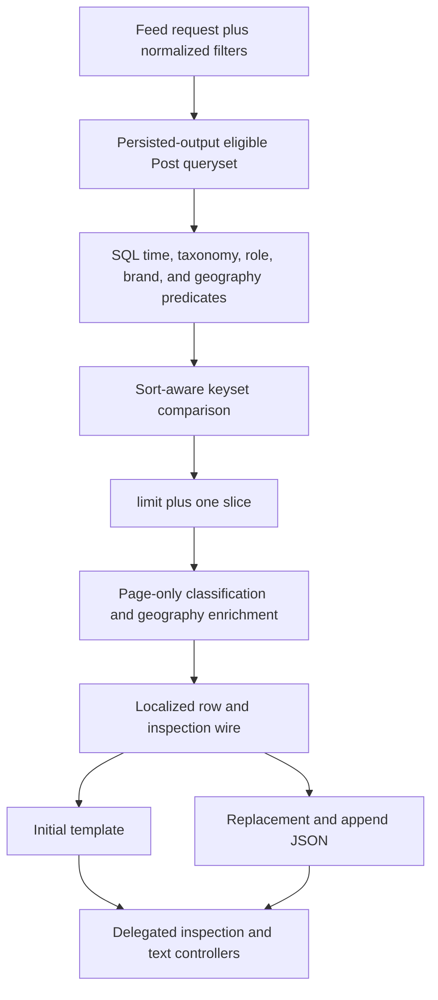
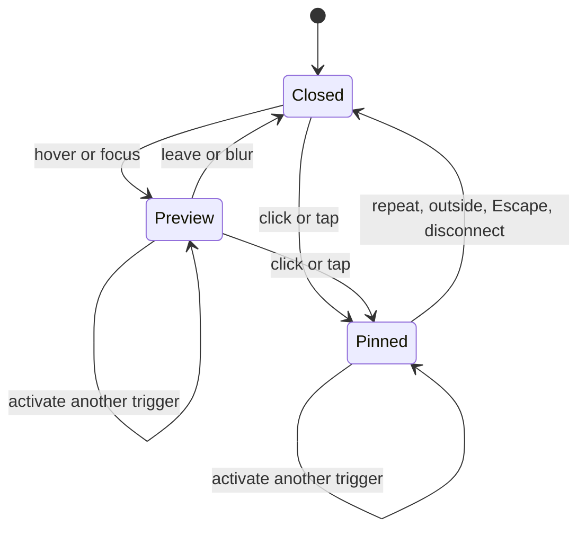
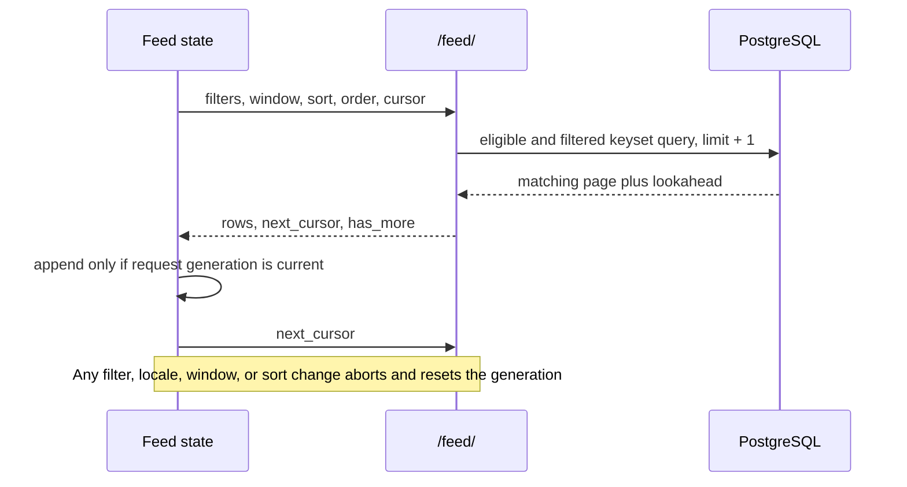

<!-- BEGIN OLLIJA DELIVERY GUIDE -->
## Ollija Delivery Guide

This block is generated guidance. Do not edit it directly. Correct durable facts in `.ollija/project.yaml` or this template, then rerun `./bin/ollija annotate-plan`. Put a user-directed exception in the editable Delivery Exceptions section below.

### Resolved locations

- Authoritative host: `fuchitalee`
- Authoritative repository: `/Users/fuchitalee/development/pushin-weight-v2`
- Ollija release worktree area: `/Users/fuchitalee/development/pushin-weight-v2/.worktrees`
- Active worktree: `/Users/fuchitalee/development/pushin-weight-v2/.worktrees/feat/feed-country-geography-followups`
- Plan: `/Users/fuchitalee/development/pushin-weight-v2/.worktrees/feat/feed-country-geography-followups/docs/plans/2026-09-01-014054-feat-feed-country-geography-followups-plan.md`
- Change: `feat-feed-country-geography-followups-2026-09-01-014054`
- Branch: `feat/feed-country-geography-followups`
- Staging branch and blueprint: `staging`, `/Users/fuchitalee/development/pushin-weight-v2/.worktrees/feat/feed-country-geography-followups/render-staging.yaml`
- Production branch and blueprint: `main`, `/Users/fuchitalee/development/pushin-weight-v2/.worktrees/feat/feed-country-geography-followups/render.yaml`
- Staging URL: `https://pushinweight-staging-web.onrender.com`
- Production URL: `https://pushinweight-web.onrender.com`

### Placement

This worktree is inside the Ollija release worktree area. Reuse it for the whole change. Do not create a second worktree or plan for this branch.

### Delivery scope

- Workflow: `plan`
- Delivery target: `staging`
- Owner selection recorded: `true`

1. Complete implementation and the plan's verification contract.
2. Run the configured focused checks:
   - `pytest tests/ollija`
3. The parent workflow commits only this plan's changes, pushes the feature branch, and records the candidate SHA.
4. Fetch the remote staging lane: `git fetch origin refs/heads/staging`.
5. Require the unchanged candidate SHA to be a fast-forward of that fetched remote ref, then push the exact candidate SHA to `refs/heads/staging` with the server-enforced fast-forward command `git push origin <candidate-sha>:refs/heads/staging`.
6. Verify the remote staging ref resolves to the candidate SHA and the Render deployment for `pushinweight-staging-web` reports that same SHA.
7. Run staging checks. Stop here if they fail.

### Failure handling

- Never promote a staging candidate whose automated checks failed.
- Implementation failures return to the parent implementation workflow for diagnosis, correction, recommit, and restaging.
- SSH, shell, environment, or multi-machine failures use the repository infra/multi-machine skill first.
- The change ledger is advisory; do not validate or enforce it.
- Never force-remove a worktree. Retain staging-only, failed, dirty, locked,
  noncanonical, or candidate-mismatched worktrees for diagnosis or later
  delivery.
- Do not run an endless retry loop or start a persistent Ollija process.
<!-- END OLLIJA DELIVERY GUIDE -->

## Delivery Exceptions

None.

# Feed Country Geography Follow-ups - Plan

## Goal Capsule

- **Objective:** Homepage-feed users can inspect dense account and post metadata without accidental outbound navigation, and every filtered post in the selected time window remains reachable.
- **Means:** Use one localized inspection-popover controller, SQL-complete keyset pagination, shared server wire projections, and narrowly scoped CSS and Chart.js changes (KTD1-KTD8).
- **Authority:** The Product Contract below governs user behavior; the Planning Contract governs implementation mechanics; the approved Bridgewright target governs unnamed visual behavior.
- **Execution profile:** Code change with test-first browser coverage and staging-only delivery.
- **Stop conditions:** Stop at staging verification failure, an unresolved product-contract contradiction, or evidence that the planned query cannot meet window-complete behavior without a schema change.
- **Tail ownership:** The LFG workflow owns implementation, review, exact-SHA staging deployment, and staging evidence; production promotion is outside this run.

---

## Product Contract

### Summary

The public homepage feed gains immediate, accessible inspection popovers for follower magnitude, account role, account geography, and signal icons, an explicit X-post link, compact post-language and region labels, a clearer flag hierarchy, and a lighter one-day chart. Feed pagination becomes complete across the selected time window by applying active filters before page slicing.

### Problem Frame

Native `title` tooltips are delayed and do not provide a dependable touch interaction. Whole-row navigation competes with metadata inspection, especially on mobile. The feed also filters only the newest 500 candidates in Python, which makes older matching posts unreachable even while the chart proves activity exists in the selected window.

### Key Decisions

- **Use explicit X navigation instead of whole-row navigation** (session-settled: user-directed — chosen over delegated row-body navigation: row clicks obscure inspection interactions on desktop and mobile). Governs R5-R6.
- **Use immediate visual inspection cards instead of native `title` tooltips** (session-settled: user-directed — chosen over browser-native tooltips: native delay and tap behavior do not support the intended inspection flow). Governs R1-R4.
- **Use a normal pointer for every inspection target** (session-settled: user-directed — chosen after browser verification showed `cursor: help` as a large question-mark cursor). Governs R1-R4.
- **Render guiding-country flags as a vertical parent/child tree** (session-settled: user-directed — chosen over the horizontal flag pair: the vertical elbow makes the hierarchy visually explicit). Governs R15-R18.

### Requirements

**Inspection and navigation**

- R1. Preserve the approved country-flag SVGs, 14 × 7.875px dimensions, subdued treatment, and normalized hierarchy while replacing native titles with the dark bordered and shadowed treatment in `docs/ideation/2026-08-31-092211-country-flag-svg-reference.html`; every inspection target uses the normal pointer cursor, never the help/question-mark cursor.
- R2. A geography trigger shows only its active-locale full name and supports immediate hover/focus, click/tap pinning, repeated activation, outside dismissal, Escape dismissal, and single-open transfer.
- R3. Every visible sentiment, post-type, China/US nationalism, and unsanctioned icon uses the R2 interaction and active-locale family/value copy while preserving every contributing brand for a deduplicated icon.
- R4. Follower magnitude, every account-role badge, geography, and feed-signal inspection triggers have truthful keyboard semantics and accessible names, no native `title`, and one viewport-clamped popover that survives scroll safely and closes when its owning row is replaced or removed.
- R5. A monochrome theme-aware X logo immediately right of replies opens the exact post URL in a safe new tab.
- R6. The X logo is the only original-post outbound control; row bodies never navigate and existing handle, selection, scrolling, text-cycle, and inspection behaviors keep their ownership.

**Chart and compact metadata**

- R7. On the public homepage `1d` minute chart only, set the visible total-series stroke to `4 / 3` and its point radius to `1` while preserving point hit radius.
- R8. Preserve `7d`, `30d`, `365d`, single-brand chart, bucketing, data, tooltip, freeze, timezone, refresh, and filter behavior.
- R9. Every feed text layer begins with `.post-language-tag`, before any `.text-layer-tag`, including source-only rows.
- R10. English chrome shows normalized lowercase ISO 639-1 primary codes; zh-CN shows centralized Simplified-Chinese labels that distinguish Simplified and Traditional Chinese when persisted data does.
- R11. Explicit `other` renders `other` / `其他`, blank `lang_detected` renders `undetected` / `未检测`, and render time never infers language from text.
- R12. The language tag remains correct across SSR, append, replacement, locale change, refresh, and every text-layer cycle.
- R13. English `.account-geography-text` abbreviates leading North/Northern, South/Southern, East/Eastern, West/Western, and compound or hyphenated directions to N, S, E, W, NE, NW, SE, or SW.
- R14. R13 is presentation-only; canonical geography, full accessible names, country/territory labels, and zh-CN region text remain unchanged.

**Geography hierarchy and spacing**

- R15. A two-flag `geography.kind == "hierarchy"` renders as a vertical parent-first tree using normalized wire order without ISO inference.
- R16. Geography uses a fixed 38px lane; parent and standalone flags share an exact centerline, and the child renders lower and slightly right without changing approved flag size or treatment.
- R17. A presentation-only CSS/vector elbow connects parent to child without a font glyph, while accessible and inspection text retains full names.
- R18. Preserve Taiwan text treatment and region fallback, and apply the two-flag tree only to an approved parent and approved child.
- R19. Increase the follower-count-to-first-metadata boundary by 2px for role-first and geography-first accounts without changing later metadata gaps or creating an empty spacer.

**Window-complete pagination**

- R20. For `1d`, `7d`, `30d`, and `365d`, every feed-eligible post matching active filters remains reachable until the cursor exhausts the window.
- R21. PostgreSQL applies time bounds and brand, role, sentiment, post type, language, nationalism, discourse, unsanctioned, country, and region filters before ordering, cursor comparison, and slicing.
- R22. Requests remain bounded to 50 rows by default, use stable keyset pagination for every supported sort, have no cumulative 500-row ceiling, and derive `has_more` from one additional matching row.
- R23. Ordering has a deterministic tweet-ID tie-breaker in ascending and descending directions, and changes to filters, locale, window, or sort atomically reset page state.
- R24. Empty and end states appear only after exhaustive database results prove zero matches or final-page exhaustion.
- R25. Loading remains incremental; any later DOM windowing must preserve reachability and cannot introduce another total-row ceiling.
- R26. Preserve feed eligibility, anonymous `/`, `/internal/`, brand routes, row serialization, locale, auto-refresh, and chart freeze outside these approved changes.

**Assurance and delivery**

- R27. Real caller-to-browser tests fail before implementation and cover inspection, X navigation, language projection, region abbreviation, hierarchy geometry, metadata spacing, chart options, and SSR/replacement parity in English and zh-CN.
- R28. Bridgewright affected and candidate gates run at the exact source SHA with desktop/mobile evidence and zero failed, skipped, errored, missing, or unknown obligations.
- R29. Staging compares deterministic SQL counts to full cursor traversal for every window and repeats the MiniMax role-filter reproduction; production is not promoted in this run.

### Acceptance Examples

- AE1. Covers R2-R6. Given a mobile feed row, hovering or tapping follower magnitude, its role badge, its geography flag, or a signal uses the same localized card and normal pointer; tapping another target transfers the card, tapping the row body does nothing, and tapping the X logo opens only that post.
- AE2. Covers R3. Given one sentiment key contributed by two brands, the visible icon appears once and its localized card names both brands.
- AE3. Covers R9-R14. Given an English source-only `zh-Hant` post from an `Eastern Asia` fallback account, the row begins with `zh` and displays `E Asia`; after switching to zh-CN it begins with `繁体中文` and retains the full Chinese region label.
- AE4. Covers R15-R19. Given standalone and CN/HK rows, both parent centerlines match within 0.5px, HK is lower and rightward behind a CSS elbow, and role-first and flag-first metadata start 2px farther below followers.
- AE5. Covers R20-R24. Given 625 matching seven-day posts with equal timestamps and a selective target older than the 500th global post, 50-row requests return all IDs exactly once and end only after the 625th match.
- AE6. Covers R7-R8. Given the same homepage chart fixture at `1d` and `7d`, only the `1d` total dataset uses stroke `4 / 3` and point radius `1`, while its hit radius and all `7d` options remain unchanged.

### Scope Boundaries

**In scope**

- Public homepage feed rendering, JSON replacement rows, filter-aware query pagination, and the shared browser interaction controller.
- Approved Bridgewright declarations, evidence, and exact-SHA staging verification.

**Outside this delivery**

- Production promotion, flag artwork changes, geography normalization policy changes, database backfills, and `/internal/` redesign.
- Single-brand chart styling and changes to classification, translation, or harvesting pipelines.

**Deferred to follow-up work**

- DOM virtualization unless staging measurements show that retaining the full traversed window is unsafe.
- New database indexes or cursor signing unless PostgreSQL evidence shows the existing schema cannot support KTD3-KTD4 safely.

### Sources

- `docs/reference/2026-08-31-221955-feed-country-geography-bridgewright-target.md` owns the existing geography and disclosure baseline.
- `docs/ideation/2026-09-01-112352-country-flag-svg-reference.html` owns the approved 215-flag inventory and visual inspection-card treatment carried forward from the owner-reviewed artifact.
- `docs/solutions/workflow-issues/django-i18n-locale-toggle-debugging-journey.md` requires testing the real locale path rather than a bypassed render path.
- `monitor/views.py`, `monitor/static/pw-feed.js`, and `monitor/templates/monitor/_feed_initial_v22.html` expose the current 500-candidate and whole-row-navigation behavior.

---

## Planning Contract

### Product Contract Preservation

The requirements-only Product Contract was preserved in substance; planning adds stable IDs, implementation mechanics, verification, and the staging delivery boundary without changing its outcomes.

### Key Technical Decisions

- KTD1. **Render one body-level inspection card.** A delegated controller in `pw-feed.js` owns a single detached popover, computes fixed viewport-clamped coordinates from the active trigger, and closes when its trigger disconnects. This implements R1-R4 without `.feed-scroll` clipping.
- KTD2. **Project localized inspection data on the server.** The feed wire carries structured inspection entries per rendered signal, including contributing brands, so template and replacement-row paths consume one locale-aware representation rather than rebuilding provenance in JavaScript. This implements R3, R10-R14, and R27.
- KTD3. **Filter one eligible Post queryset before enrichment.** Reusable Django `Q`/`Exists` predicates translate the normalized filter payload into relational constraints before cursor and `limit + 1`; only the selected page is enriched and serialized. This implements R20-R26.
- KTD4. **Use a sort-aware opaque keyset cursor.** The server cursor includes the active sort value and tweet ID, applies tuple-equivalent comparison in the queryset, and validates sort/order compatibility. `like_count` no longer falls back to a cumulative offset scan. This implements R22-R24.
- KTD5. **Keep presentation projections centralized in Python.** Server wire fields own compact language and English region text, while full canonical and accessible geography labels remain untouched. This implements R9-R14.
- KTD6. **Use semantic trigger markup with delegated behavior.** Follower magnitude, role badges, flags, and generated signal controls expose data-backed inspection content, real focus behavior, normal pointer cursors, and ARIA state; the controller handles SSR and appended rows without per-row listener state. This implements R2-R6 and R12.
- KTD7. **Use CSS geometry for the hierarchy lane.** Kind-specific spans place parent, elbow, and child in a 38px lane while standalone and parent flags share the same center coordinate. This implements R15-R19.
- KTD8. **Ship the exact candidate only to staging** (session-settled: user-directed — chosen over production delivery: the owner selected staging for this LFG run). The candidate must fast-forward the staging lane and pass exact-SHA browser and SQL checks before this workflow stops. This implements R28-R29.

### High-Level Technical Design

### Implementation Constraints

- Begin each feature-bearing unit with a failing real-caller or runtime-option regression as required by `.claude/skills/fix-ui/SKILL.md`.
- Keep the approved 215-symbol inline flag sprite and geography normalization wire unchanged.
- Do not fetch or enrich an entire multi-day window to build one page.
- Preserve request-generation cancellation and auto-refresh ownership in `pw-feed.js`.
- Add a migration only if staging-like PostgreSQL `EXPLAIN` evidence proves a missing index is required; if so, stop and amend this plan before schema mutation.

### Risks and Mitigations

- **Relational filter fan-out:** Multiple `PostBrand` and classification joins can duplicate posts. Use correlated `Exists` predicates or controlled `distinct`, and prove exact-once traversal with equal timestamps.
- **Cursor compatibility:** Old clients can send legacy cursors during deploy. Treat malformed or incompatible cursors as an atomic first-page reset and pin that behavior.
- **Popover races:** Rows can disappear during refresh. Validate trigger connectivity on scroll/reposition and close before replacement.
- **Locale drift:** Do not duplicate labels in template and JavaScript. Assert SSR and JSON parity through the real locale cookie path.
- **Long DOMs:** Measure beyond 500 rows on staging. Implement virtualization only if evidence triggers the deferred path.

### Sequencing

U1 establishes the approved target and red tests. U2 fixes page reachability before UI consumers depend on replacement behavior. U3 provides the shared localized wire. U4-U6 implement independent visible changes. U7 closes browser and Bridgewright assurance. U8 delivers the exact candidate to staging.

---

## Implementation Units

### U1. Freeze the interaction and pagination assurance contract

- **Goal:** Bind the approved deltas to a new Bridgewright authority and prove current production-shaped callers fail the new obligations.
- **Requirements:** R1-R29.
- **Dependencies:** None.
- **Files:** `docs/ideation/2026-09-01-112352-country-flag-svg-reference.html`, `docs/reference/2026-09-01-114311-feed-inspection-pagination-bridgewright-target.md`, `bridgewright.yaml`, `tests/fixtures/ui_assurance/declaration.json`, `tests/test_ui_assurance_contract.py`, `tests/test_home_v22_browser.py`, `tests/test_pw_feed_formatter.js`, `tests/test_pw_chart_filter.js`.
- **Approach:**
  1. Add the owner-approved reference artifact to this branch and bind only its inspection-card visual treatment.
  2. Extend the Bridgewright state model for preview, pinned, transferred, dismissed, X-owned navigation, and exhaustive pagination.
  3. Add focused caller/browser/runtime assertions that fail on native titles, row navigation, absent localized metadata, capped traversal, old hierarchy geometry, and old `1d` dataset options.
- **Execution note:** Capture the failing evidence before production code changes; attribute-only tests do not satisfy this unit.
- **Test scenarios:**
  - Covers AE1. Desktop and 390px mobile callers exercise hover/focus/tap, pin transfer, repeat, outside, Escape, and edge clamping.
  - Covers AE5. The real `/feed/` route cannot reach a selective match behind 500 global candidates before U2.
  - Covers AE6. The runtime Chart.js fixture exposes the current `2` and `1.5` values before U6.
- **Verification:** The new tests fail for the expected behavioral reasons and the Bridgewright declaration parses with the added controls and invariants.

### U2. Make feed pagination SQL-complete

- **Goal:** Return complete, stable pages from the filtered database result rather than a 500-row in-memory candidate pool.
- **Requirements:** R20-R26, R29.
- **Dependencies:** U1.
- **Files:** `monitor/views.py`, `monitor/static/pw-feed.js`, `tests/test_views.py`, `tests/test_home_v22_browser.py`, `tests/test_pw_feed_formatter.js`.
- **Approach:**
  1. Extract query predicates from normalized filters and compose them with persisted-output eligibility and time bounds before ordering.
  2. Apply KTD4 for both created-time and like-count sorts, select `limit + 1`, then enrich and serialize only the returned page.
  3. Make both home and brand feed callers consume only the server-returned `next_cursor`; remove DOM cursor reconstruction and the browser cumulative cap while retaining the 50-row request default, request-generation reset, and abort behavior.
  4. Record representative queryset plans for unfiltered and selective brand/role/geography calls without adding a schema change unless the plan constraint fires.
- **Execution note:** Implement from DB-backed failing route tests, not the legacy list pagination helper tests.
- **Test scenarios:**
  - Covers AE5. A target older than 500 global candidates is returned when its brand, role, and geography filters are active.
  - Traverse 625 matching posts in 50-row pages in ascending and descending order and assert exact-once stable order.
  - Traverse equal timestamps and equal like counts and assert tweet-ID tie-breaking without omissions.
  - Send a legacy, malformed, or sort-incompatible cursor and assert a safe first-page reset.
  - Change filters/window/sort while an older request is pending and assert only the latest generation mutates the DOM.
  - Return zero rows and a final partial page and assert truthful empty/end state and cursor values.
- **Verification:** Route-level tests pass, the browser can traverse beyond ten batches, and query evaluation reads only one page plus lookahead before enrichment.

### U3. Add one localized metadata projection

- **Goal:** Give SSR and JSON rows identical compact language, region, and per-brand signal inspection data.
- **Requirements:** R3, R9-R14, R27.
- **Dependencies:** U2.
- **Files:** `monitor/views.py`, `monitor/templates/monitor/_feed_initial_v22.html`, `monitor/templates/monitor/_account_geography.html`, `monitor/static/pw-feed.js`, `tests/test_feed_geography.py`, `tests/test_home_v22_feed_row_shape.py`, `tests/test_home_v22_browser.py`, `tests/test_pw_feed_formatter.js`.
- **Approach:**
  1. Add centralized locale projections for compact language and English-only leading region direction.
  2. Serialize ordered signal inspection entries from localized per-brand classifications before visual deduplication.
  3. Render the same fields in the Django template and JavaScript row formatter, keeping the language token outside text-cycle replacement content.
- **Execution note:** Characterize existing geography labels and multi-brand classification wire before changing projections.
- **Test scenarios:**
  - Covers AE2. Two contributing brands produce one sentiment icon with both localized brand lines.
  - Covers AE3. Known variants, explicit `other`, and blank language values render correctly in both locales across SSR and replacement.
  - Text-cycle transitions preserve the first language token when no text-layer label exists.
  - Directional region forms abbreviate only in English visible text and retain full accessible/canonical labels.
- **Verification:** Template, JSON, and browser DOM expose identical localized values without duplicating locale mapping logic in JavaScript.

### U4. Add shared inspection popovers and explicit X navigation

- **Goal:** Make follower magnitude, role badges, flags, and feed signals inspectable on pointer, keyboard, and touch while ending accidental row-body navigation.
- **Requirements:** R1-R6, R12, R27.
- **Dependencies:** U1, U3.
- **Files:** `monitor/templates/monitor/_feed_initial_v22.html`, `monitor/templates/monitor/_account_geography.html`, `monitor/static/pw-feed.js`, `monitor/static/home-v20.css`, `monitor/templates/monitor/home.html`, `tests/test_home_v22_feed_row_shape.py`, `tests/test_home_v22_browser.py`, `tests/test_pw_feed_formatter.js`.
- **Approach:**
  1. Emit semantic inspection triggers for follower magnitude, role badges, flags, and generated signals with KTD2 payloads and without native titles or help/question-mark cursors.
  2. Implement KTD1 and KTD6 through delegated events that cover existing and appended rows.
  3. Add the X anchor after replies, remove row-link binding and cursor affordance, and preserve handle-link ownership.
- **Execution note:** Use the real Chromium caller before CSS refinement and assert the exact opened URL rather than only anchor presence.
- **Test scenarios:**
  - Covers AE1. Hover/focus previews and click/tap pins, transfers, and dismisses one viewport-clamped card.
  - A refresh that removes the active trigger closes the card without a detached ARIA relationship.
  - Follower magnitude, every role badge, every signal family, and every geography kind exposes truthful active-locale text and keyboard activation.
  - Row body, selection, text cycle, and signal activation never open X; the X anchor does so with `noopener noreferrer`.
- **Verification:** Desktop/mobile browser tests pass with one live popover, zero native tooltip duplicates, and X-only original-post navigation.

### U5. Render geography hierarchy and metadata spacing

- **Goal:** Show parent/child flag relationships as an aligned file tree and regularize the first account-metadata gap.
- **Requirements:** R15-R19, R27.
- **Dependencies:** U3-U4.
- **Files:** `monitor/templates/monitor/_account_geography.html`, `monitor/templates/monitor/_feed_initial_v22.html`, `monitor/static/home-v20.css`, `tests/test_feed_geography.py`, `tests/test_home_v22_browser.py`.
- **Approach:**
  1. Project deterministic parent, elbow, child, and optional text spans from normalized wire order.
  2. Use KTD7 to align standalone and parent centerlines and offset only the child.
  3. Apply the 2px increase to the first non-empty metadata element rather than each metadata type.
- **Execution note:** Measure computed rectangles and styles at desktop and 390px, not source declarations alone.
- **Test scenarios:**
  - Covers AE4. Standalone and hierarchy parent centers differ by at most 0.5px; the child is lower and rightward and the elbow uses CSS borders.
  - CN/HK, CN/MO, and guiding-crown territory pairs retain normalized parent-first order and approved symbols.
  - Taiwan-neutral and region-only rows preserve their existing presentation.
  - Role-first and flag-first rows gain 2px at the first boundary with no empty-account spacer.
- **Verification:** Computed geometry, mobile overflow, visible art, and accessible names satisfy the approved hierarchy contract.

### U6. Reduce one-day chart visual density

- **Goal:** Reduce only the public `1d` total-series stroke and visible point size by one third.
- **Requirements:** R7-R8, R27.
- **Dependencies:** U1.
- **Files:** `monitor/static/pw-chart.js`, `tests/test_combined_chart_js.py`, `tests/test_pw_chart_filter.js`.
- **Approach:** Apply the two runtime dataset-option deltas at the minute-granularity branch while preserving hit radius and all other datasets and windows.
- **Test scenarios:**
  - Covers AE6. Inspect runtime datasets for `1d` and `7d` and compare exact stroke, radius, and hit-radius values.
  - Exercise hover freeze on the smaller point and assert its interaction state is unchanged.
- **Verification:** Chart runtime tests prove exactly the two requested visible values changed.

### U7. Close the regression net and Bridgewright assurance

- **Goal:** Prove the integrated behavior across real request, browser, locale, pagination, and visual-state boundaries.
- **Requirements:** R27-R28.
- **Dependencies:** U2-U6.
- **Files:** `tests/test_home_v22_browser.py`, `tests/test_ui_assurance_browser.py`, `tests/ui_assurance/reference.py`, `tests/ui_assurance/evidence.py`, `tests/ui_assurance/gate.py`, `tests/fixtures/ui_assurance/declaration.json`, `bridgewright.yaml`.
- **Approach:**
  1. Drive SSR, replacement, append, locale, filter, window, sort, refresh, and mobile/desktop paths through production-shaped callers.
  2. Generate affected evidence, bind candidate evidence to the exact product-source SHA, and run both Bridgewright gates.
  3. Run the focused Django, JavaScript, UI assurance, and full regression suites; remove abandoned experiment code before handoff.
- **Test scenarios:**
  - Exercise every AE through the integrated caller and browser path.
  - Traverse beyond 500 rows via the actual sentinel and continue to deterministic exhaustion.
  - Verify zero failed, skipped, errored, missing, or unknown obligations in affected and candidate evidence.
- **Verification:** All focused and full suites pass, Bridgewright is exact-SHA clean, and the diff contains no stale title, row-link, hard-cap, or abandoned helper paths.

### U8. Deliver and verify the exact candidate on staging

- **Goal:** Stop with the verified candidate deployed to the staging lane and no production mutation.
- **Requirements:** R28-R29.
- **Dependencies:** U7.
- **Files:** `docs/plans/2026-09-01-014054-feat-feed-country-geography-followups-plan.md`.
- **Approach:** Follow KTD8 and the generated Ollija Delivery Guide, including preflight `annotate-plan --check`, exact candidate SHA push, Render SHA verification, SQL traversal comparisons, and the MiniMax role/geography reproduction.
- **Execution note:** Retain this canonical worktree because the delivery target is staging-only.
- **Test scenarios:**
  - Compare full cursor traversal with deterministic SQL counts for `1d`, `7d`, `30d`, and `365d`.
  - Select the `7d` window, apply MiniMax Official/Staff/Community filters, and assert `@Hailuo_AI` is reachable without chart-point freeze.
  - Verify desktop English and mobile zh-CN inspection, X navigation, language tag, hierarchy, and chart behavior against the deployed candidate SHA.
- **Verification:** Remote staging and Render report the candidate SHA, all staging checks pass, and production refs and services remain unchanged.

---

## Verification Contract

| Gate | Scope | Required outcome |
|---|---|---|
| Focused Django | `pytest` targets for views, geography, row shape, browser, and UI assurance | All selected tests pass with no skipped plan obligations |
| JavaScript runtime | `node tests/test_pw_feed_formatter.js` plus chart/filter runtime tests | Formatter, controller, request state, and Chart.js option assertions pass |
| Django configuration | `python manage.py check --deploy` | No new deployment errors |
| Full regression | `pytest` | Existing behavior remains green |
| Ollija focused check | `pytest tests/ollija` | Delivery metadata and guard tests pass |
| Bridgewright affected | Configured affected profile at candidate source | Zero failed, skipped, errored, missing, or unknown obligations |
| Bridgewright candidate | Full candidate profile at exact candidate SHA | Zero failed, skipped, errored, missing, or unknown obligations |
| Staging exact-SHA | Remote staging ref, Render deploy, browser, and SQL checks | All point to the candidate SHA and satisfy R29 |

The test-first proof for U1 is retained in the execution record. Any test unavailable in the local environment must run in the staging-capable environment before U8 can complete.

---

## Definition of Done

- U1-U8 satisfy their listed requirements and verification outcomes.
- Every feed inspection target works through pointer, keyboard, and touch with one localized unclipped card.
- The X logo alone owns original-post navigation, and all former row-link behavior is removed.
- Language, region, hierarchy, spacing, and chart changes match the Product Contract in SSR and replacement rows.
- Every matching post in all supported windows is reachable through stable 50-row pages without a 500-row ceiling.
- Focused tests, full regression, Bridgewright affected/candidate gates, and Ollija checks pass.
- The exact candidate is verified on staging, production is untouched, and the staging-only worktree is retained.
- Abandoned experiments, dead helpers, duplicate label maps, stale native titles, and stale hard-cap paths are absent from the final diff.
