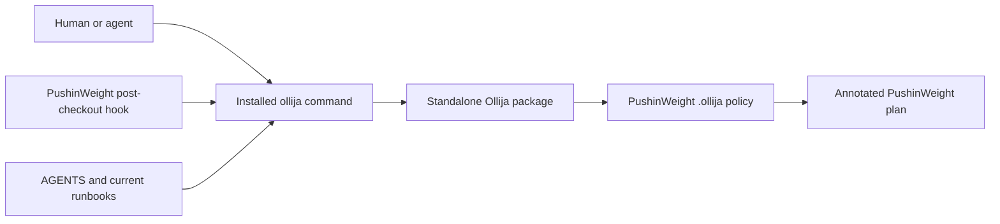
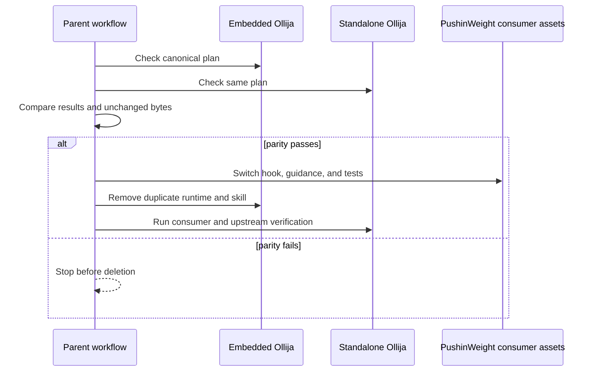

<!-- BEGIN OLLIJA DELIVERY GUIDE -->
## Ollija Delivery Guide

This block is generated guidance. Do not edit it directly. Correct durable facts in `.ollija/project.yaml` or this template, then rerun `ollija annotate-plan`. Put a user-directed exception in the editable Delivery Exceptions section below.

### Resolved locations

- Authoritative host: `fuchitalee`
- Authoritative repository: `/Users/fuchitalee/development/pushin-weight-v2`
- Ollija release worktree area: `/Users/fuchitalee/development/pushin-weight-v2/.worktrees`
- Active worktree: `/Users/fuchitalee/development/pushin-weight-v2/.worktrees/feat/use-standalone-ollija`
- Plan: `/Users/fuchitalee/development/pushin-weight-v2/.worktrees/feat/use-standalone-ollija/docs/plans/2026-09-04-055757-feat-use-standalone-ollija-plan.md`
- Change: `feat-use-standalone-ollija-2026-09-04-055757`
- Branch: `feat/use-standalone-ollija`
- Staging branch and blueprint: `staging`, `/Users/fuchitalee/development/pushin-weight-v2/.worktrees/feat/use-standalone-ollija/render-staging.yaml`
- Production branch and blueprint: `main`, `/Users/fuchitalee/development/pushin-weight-v2/.worktrees/feat/use-standalone-ollija/render.yaml`
- Staging URL: `https://pushinweight-staging-web.onrender.com`
- Production URL: `https://pushinweight-web.onrender.com`

### Placement

This worktree is inside the Ollija release worktree area. Reuse it for the whole change. Do not create a second worktree or plan for this branch.

### Delivery scope

- Workflow: `lfg`
- Delivery target: `production`
- Owner selection recorded: `true`

1. Complete implementation and the plan's verification contract.
2. Run the configured focused checks:
   - `pytest tests/ollija`
3. The parent workflow commits only this plan's changes, pushes the feature branch, and records the candidate SHA.
4. Fetch the remote staging lane: `git fetch origin refs/heads/staging`.
5. Require the unchanged candidate SHA to be a fast-forward of that fetched remote ref, then push the exact candidate SHA to `refs/heads/staging` with the server-enforced fast-forward command `git push origin <candidate-sha>:refs/heads/staging`.
6. Verify the remote staging ref resolves to the candidate SHA and the deployment for `pushinweight-staging-web` reports that same SHA.
7. Run staging checks. Stop here if they fail.
8. Only after staging passes, fetch the remote production lane: `git fetch origin refs/heads/main`.
9. Require the same unchanged candidate SHA to be a fast-forward of that fetched remote ref, then push the exact candidate SHA to `refs/heads/main` with the server-enforced fast-forward command `git push origin <candidate-sha>:refs/heads/main`.
10. Verify the remote production ref resolves to the candidate SHA and the deployment for `pushinweight-web` reports that same SHA before reporting completion.
11. After step 10 succeeds, perform worktree cleanup as the final filesystem action:
    - From `/Users/fuchitalee/development/pushin-weight-v2`, require `/Users/fuchitalee/development/pushin-weight-v2/.worktrees/feat/use-standalone-ollija` to remain registered, clean, unlocked, and at the verified candidate SHA. If any guard fails, retain it and report the reason.
    - Run `git -C /Users/fuchitalee/development/pushin-weight-v2 worktree remove /Users/fuchitalee/development/pushin-weight-v2/.worktrees/feat/use-standalone-ollija` without `--force`.
    - Preserve the local and remote feature branches. Continue final reporting from the authoritative repository root.

### Failure handling

- Never promote a staging candidate whose automated checks failed.
- Implementation failures return to the parent implementation workflow for diagnosis, correction, recommit, and restaging.
- SSH, shell, environment, or multi-machine failures use the repository infra/multi-machine skill first.
- The change ledger is advisory; do not validate or enforce it.
- Never force-remove a worktree. Retain staging-only, failed, dirty, locked,
  noncanonical, or candidate-mismatched worktrees for diagnosis or later
  delivery.
- Do not run an endless retry loop or start a persistent Ollija process.
<!-- END OLLIJA DELIVERY GUIDE -->

## Delivery Exceptions

None.

# Use Standalone Ollija - Plan

## Goal Capsule

**Objective:** PushinWeight contributors and agents use one maintained Ollija installation from every checkout, while PushinWeight retains only its own delivery policy and runtime state.

**Means:** Replace the repository-owned Ollija runtime with the installed standalone `ollija` console command, preserve the consumer contract in `.ollija/`, and remove duplicated implementation and skill ownership (Key Decision 1, KTD1).

**Authority hierarchy:** The Product Contract owns the outcome and retained consumer behavior. The Planning Contract owns the migration mechanism. The generated Ollija Delivery Guide and editable Delivery Exceptions govern delivery. If these disagree, stop and resolve the plan before a Git or deployment mutation.

**Stop conditions:** Stop before deletion if the standalone command fails the retained consumer contract or the old-to-new characterization reveals an unexplained behavioral delta. Stop delivery if the consumer checks, staging checks, exact-SHA checks, or worktree cleanup guards fail.

**Execution profile:** Code and documentation refactor with characterization-first migration, production delivery, and no application behavior or database changes.

**Tail ownership:** The parent LFG workflow owns commit, staging, production verification, and guarded final worktree cleanup. Ollija remains advisory.

---

## Product Contract

### Summary

PushinWeight will consume the standalone Ollija command and retain only project-specific policy, templates, hook integration, and ignored state. Current operational guidance and tests will describe that ownership boundary.

### Problem Frame

PushinWeight currently carries an Ollija Python package, a repository wrapper, a repo-local skill, duplicate unit tests, and documentation that tells agents to invoke `./bin/ollija`. A standalone Ollija repository now owns that product. Keeping both copies creates command ambiguity and lets behavior drift.

The migration must prove compatibility before removing the embedded copy. It must also preserve PushinWeight's advanced delivery profile, authoritative-host rules, exact-SHA release guidance, and canonical worktree behavior.

### Key Decisions

- **Key Decision 1 — Standalone Ollija is the sole runtime.** (session-settled: user-directed — chosen over retaining or dual-running the embedded copy: the owner designated the new standalone repository as Ollija's home.) Governs R1, R2, R4, R5, R6.
- **Key Decision 2 — Deliver through production.** (session-settled: user-directed — chosen over stopping after staging: the owner selected production for this LFG run.) Governs R8.

### Requirements

#### Invocation and consumer integration

- R1. After the consumer guide's supported installation step, humans and agents invoke `ollija` through `PATH`, and that command resolves to the standalone distribution installed from the designated checkout.
- R2. The post-checkout hook invokes the standalone command without forwarding caller stdin, remains non-blocking when the command is unavailable or fails, and prints a recovery command that also uses `ollija`.
- R3. PushinWeight retains `.ollija/project.yaml`, `.ollija/templates/delivery-guide.md`, `.ollija/hooks/post-checkout`, and ignored `.ollija/state/` as consumer-owned project policy and state.

#### Ownership and documentation

- R4. The tracked repository contains no embedded Ollija entrypoint, Python runtime package, repo-local Ollija skill, or duplicate engine-unit tests after compatibility is proved.
- R5. Current agent instructions, concepts, runbooks, templates, and deployment guidance use the standalone command and state the standalone-versus-consumer ownership boundary.
- R6. Upstream Ollija owns annotator unit behavior, while PushinWeight keeps a focused regression net for its hook, delivery profile, application topology, active-reference hygiene, and standalone command integration.

#### Delivery safety

- R7. The migration does not change Django, database, UI, harvester, staging topology, or production topology behavior.
- R8. The same verified candidate SHA passes staging before it reaches production, and canonical worktree removal occurs only after exact-SHA production verification under the generated guide's guards.

### Key Flows

- F1. **Manual plan annotation:** a contributor runs `ollija annotate-plan`; the standalone executable reads the checkout's `.ollija/project.yaml` and updates or checks the selected plan. Covers R1, R3, R5.
- F2. **Linked-worktree bootstrap:** Git runs the tracked post-checkout hook; the hook resolves the active checkout and project root, then calls `ollija annotate-plan` with the existing environment contract. Covers R2, R3.
- F3. **Migration proof:** the parent workflow records pre-deletion parity, switches consumer integration, removes the duplicate implementation, and runs post-deletion consumer plus upstream checks. Covers R4, R6, R7.
- F4. **Production delivery:** the parent workflow freezes one candidate, stages that exact SHA, verifies it, promotes the unchanged SHA to production, verifies it again, and applies guarded cleanup last. Covers R8.

### Acceptance Examples

- AE1. **Standalone resolution.** Given the migration is complete, when a contributor inspects the installed tool path and runs `ollija --help` inside the PushinWeight checkout, then the command resolves outside the repository and its installation provenance names the designated standalone checkout. Covers R1, R4.
- AE2. **Plan compatibility.** Given the embedded baseline and the standalone candidate, when their focused suites and advanced-profile annotation paths run before deletion, then the standalone candidate preserves the project delivery facts and all behavioral differences match the documented standalone generalization; after deletion, it still checks and annotates the canonical plan successfully. Covers R3, R4, R6.
- AE3. **Hook success and failure.** Given a linked checkout, when a PATH-provided Ollija succeeds, fails, or is absent, then the hook calls the PATH command without consuming stdin and never blocks checkout; failure output names the standalone recovery command. Covers R2, R6.
- AE4. **Repository ownership.** Given the final tracked tree, when hygiene checks inspect current runtime and guidance paths, then no embedded implementation or actionable `./bin/ollija` reference remains; explicitly historical records may retain their original commands. Covers R4, R5.
- AE5. **Unchanged application.** Given the final branch, when the PushinWeight checks and staging acceptance checks run, then application and topology behavior match the pre-migration baseline. Covers R7.
- AE6. **Exact-SHA production delivery.** Given a green staging candidate, when production delivery completes, then the remote production branch and Render deployment report that same SHA before guarded cleanup. Covers R8.

### Scope Boundaries

**In scope**

- Consumer invocation, hook integration, delivery template, project instructions, current operating documentation, focused tests, embedded runtime removal, and repo-local skill removal.
- Reconciliation with current `main` while the concurrent DeepSeek work proceeds.

**Out of scope**

- Changes to standalone Ollija source, packaging, or release policy.
- Changes to application code, database state, Render topology, harvester behavior, or user-visible UI.
- Deletion of `.ollija/project.yaml`, templates, hooks, ignored `.ollija/state/`, or other PushinWeight-owned delivery facts.

#### Deferred to Follow-Up Work

- Historical and superseded plans, retrospectives, and advisory records keep the command text that was true when written. A future documentation-history cleanup may add more archival labels, but this migration will not rewrite evidence in place.

---

## Planning Contract

### Key Technical Decisions

- KTD1. Refresh the installed `ollija` console script from the designated standalone checkout, then use it directly; do not retain a repository wrapper or add a Python package dependency to PushinWeight. This keeps runtime ownership in the standalone distribution and project policy in `.ollija/`. Implements Key Decision 1 and R1, R3, R4.
- KTD2. Keep the advanced schema-version-one delivery profile unchanged unless integration tests reveal a standalone compatibility defect. The standalone parser already supports profiles without an `init`-generated profile field. Implements R3, R7.
- KTD3. Establish parity before deletion, then divide test ownership by boundary: standalone unit tests remain upstream and PushinWeight keeps consumer integration and repository hygiene tests. Implements R4, R6.
- KTD4. Remove both repo-local skill paths so the globally installed, agent-neutral standalone skill is canonical; retain PushinWeight-specific release constraints in `AGENTS.md` and `.ollija/`. Implements R3, R4, R5.
- KTD5. Treat current actionable guidance as migration scope and preserve historical evidence verbatim. Implements R5 and the deferred boundary.
- KTD6. Reconcile alongside the concurrent DeepSeek branch rather than waiting for it. (session-settled: user-directed — chosen over pausing until the parallel branch lands: the owner asked this migration to proceed alongside it.) Preserve its substantive edits when updating overlapping documentation and reconcile current `main` before candidate freeze.

### Assumptions

- The standalone main revision recorded at planning time, `4214dd8`, is the intended migration baseline; execution must record the actual installed revision if it advances before candidate freeze.
- Historical documents are evidence, not current invocation instructions, so R5 excludes them from mechanical replacement.
- Ollija stays an operator tool installed outside the Django application dependency graph; production services do not need the CLI at runtime.
- No data migration, compatibility shim, or UI/browser change is required because the consumer profile and generated guide contract remain compatible.

### High-Level Technical Design

The final ownership topology has one executable owner and one consumer-policy boundary:

The migration sequence makes deletion contingent on evidence:

### Legacy Disposition

`PORT` means retain or adapt as consumer-owned behavior. `EXCLUDE` means remove because standalone owns it. `DEFER` means preserve as historical evidence outside the active migration.

| Legacy path | Disposition | Destination or treatment |
|---|---|---|
| `.ollija/project.yaml` | PORT | Retain PushinWeight delivery facts and focused check configuration. |
| `.ollija/hooks/post-checkout` | PORT | Invoke `ollija` from `PATH` while retaining the environment and non-blocking hook contract. |
| `.ollija/templates/delivery-guide.md` | PORT | Retain the project delivery guide and replace its self-reference with `ollija`. |
| `.ollija/state/` | PORT | Preserve ignored local runtime state. |
| `bin/ollija` | EXCLUDE | Delete the embedded wrapper after parity proof. |
| `scripts/ollija/__init__.py` | EXCLUDE | Delete the embedded package. |
| `scripts/ollija/__main__.py` | EXCLUDE | Delete the embedded package entrypoint. |
| `scripts/ollija/annotate_plan.py` | EXCLUDE | Delete duplicate annotator logic. |
| `scripts/ollija/cli.py` | EXCLUDE | Delete duplicate CLI logic. |
| `scripts/ollija/config.py` | EXCLUDE | Delete duplicate configuration logic. |
| `scripts/ollija/worktrees.py` | EXCLUDE | Delete duplicate worktree logic. |
| `.claude/skills/ollija/SKILL.md` | EXCLUDE | Delete the repo-local skill in favor of the installed standalone skill. |
| `.agents/skills/ollija` | EXCLUDE | Delete the repo-local alias to the removed skill. |
| `tests/ollija/test_annotate_plan.py` | EXCLUDE | Delete unit coverage now owned by standalone. |
| `tests/ollija/test_cli.py` | EXCLUDE | Delete unit coverage now owned by standalone. |
| `tests/ollija/test_config.py` | EXCLUDE | Delete unit coverage now owned by standalone. |
| `tests/ollija/test_plan_discovery.py` | EXCLUDE | Delete unit coverage now owned by standalone. |
| `tests/ollija/test_worktrees.py` | PORT | Replace embedded-module tests with PATH-based hook integration tests. |
| `tests/ollija/test_agent_parity.py` | PORT | Assert standalone command guidance and absence of repo-local skill ownership. |
| `tests/ollija/test_repository_hygiene.py` | PORT | Assert the consumer boundary and classify current versus historical references. |
| `tests/ollija/test_render_staging_topology.py` | PORT | Retain application-specific staging topology coverage unchanged. |
| `tests/ollija/test_staging_access.py` | PORT | Retain application-specific staging access coverage unchanged. |
| `AGENTS.md`, `CONCEPTS.md` | PORT | Point active agent and domain guidance at standalone Ollija. |
| `docs/ollija/README.md`, `docs/operations/ollija.md`, `docs/deploy/render.md` | PORT | Document installation, invocation, ownership, and current checks. |
| `docs/operations/2026-08-27-171845-staging-harvester-acceptance.md` | PORT | Update its live pre-trigger command; despite its dated name, the deploy runbook still designates it as the current runbook and evidence template. |
| `docs/ollija/CHANGES.md` | PORT | Add the consumer-migration boundary and direct future engine history upstream. |
| Historical and superseded Ollija artifacts | DEFER | Preserve original commands and archival labels. |

### System-Wide Impact

- **Agent and human parity:** both use the same installed command and the same consumer policy.
- **Git lifecycle:** linked-worktree annotation still runs through the tracked hook; missing CLI behavior stays non-blocking.
- **Application runtime:** Django and Render services remain independent of Ollija. No production dependency or environment variable is added.
- **Documentation ownership:** PushinWeight documents consumption and delivery policy; standalone Ollija documents engine behavior and packaging.

### Risks & Dependencies

- The migration depends on the standalone executable remaining installed and discoverable on `PATH` for contributors who use Ollija. Refresh it from the designated standalone checkout and record its provenance before deletion.
- Updating `CONCEPTS.md` and `docs/deploy/render.md` overlaps a concurrent branch. Limit changes to Ollija-specific lines, then reconcile current `main` without discarding either branch's substantive content.
- Historical `./bin/ollija` strings can look stale to a naive repository-wide search. Hygiene coverage must distinguish current executable guidance from explicitly historical records.
- A generated delivery guide can retain the old command until the template is updated and the plan is re-annotated. The final annotation must use standalone Ollija and leave no stale generated block in this plan.

### Documentation and Operational Notes

- `docs/ollija/README.md` becomes the PushinWeight consumer guide and points engine maintainers to standalone Ollija.
- `docs/operations/ollija.md` documents installation verification, hook setup, plan annotation, checks, and recovery with the standalone command.
- `docs/ollija/CHANGES.md` records this final consumer-side migration; later Ollija engine changes belong in the standalone changelog.
- The generated Ollija Delivery Guide remains the release authority for this LFG run.

---

## Implementation Units

### U1. Establish the Consumer Regression Net

**Goal:** Characterize the embedded-versus-standalone boundary before removal and reshape tests around PushinWeight-owned behavior.

**Requirements:** R1, R2, R3, R6, R7; KTD2, KTD3.

**Dependencies:** None.

**Files:** `tests/ollija/test_worktrees.py`, `tests/ollija/test_agent_parity.py`, `tests/ollija/test_repository_hygiene.py`.

**Approach:**

1. Run the complete embedded suite as the behavior baseline before changing or deleting its source.
2. Refresh the standalone installation from the designated checkout, run its complete upstream suite, and record the installed provenance.
3. Exercise both advanced-profile annotation paths and review the output delta; accept only the standalone command, provider-neutral deployment wording, profile reporting, and documented resilience or plan-only additions.
4. Replace imports of the embedded Python package with black-box assertions at the consumer boundary.
5. Drive hook tests with a temporary PATH-provided `ollija` executable so success, failure, missing-command, stdin, and active-worktree behavior remain deterministic.
6. Retain application-specific staging tests and security hygiene checks.

**Execution note:** Capture the parity evidence before deleting any embedded source, then make the consumer tests fail against stale embedded assumptions before switching the assets.

**Test scenarios:**

- Covers AE1. The installed executable's tool metadata traces to the designated standalone checkout before the consumer switches.
- Covers AE2. The embedded baseline and standalone candidate both pass their suites, and the advanced-profile annotation delta contains only documented standalone changes.
- Covers AE3. A PATH-provided Ollija receives the active worktree and project-root environment, cannot read caller stdin, and lets checkout complete.
- Covers AE3. A failing or absent PATH command produces actionable recovery text and still lets checkout complete.
- Covers AE4. The hygiene suite rejects an embedded runtime, local skill, wrapper, or active operational `./bin/ollija` reference.
- Existing staging topology, staging access, secret-path, and credential-scanner tests remain green.

**Verification:** The focused suite proves consumer behavior without importing `scripts.ollija`, and pre-deletion parity evidence is retained in the LFG execution record.

### U2. Switch PushinWeight to the Standalone Command

**Goal:** Route every current PushinWeight invocation and instruction through standalone Ollija while preserving project delivery policy.

**Requirements:** R1, R2, R3, R5, R7; KTD1, KTD2, KTD4, KTD5.

**Dependencies:** U1.

**Files:** `.ollija/hooks/post-checkout`, `.ollija/templates/delivery-guide.md`, `AGENTS.md`, `CONCEPTS.md`, `docs/ollija/README.md`, `docs/ollija/CHANGES.md`, `docs/operations/ollija.md`, `docs/deploy/render.md`, `docs/operations/2026-08-27-171845-staging-harvester-acceptance.md`, `docs/plans/2026-09-04-055757-feat-use-standalone-ollija-plan.md`.

**Approach:**

1. Adopt the standalone hook pattern while retaining PushinWeight's existing environment variables and non-blocking failure semantics.
2. Update current agent instructions, glossary entries, operational runbooks, deploy guidance, and delivery template to use `ollija`.
3. Rewrite the Ollija README as a consumer guide that covers supported installation from the standalone checkout, ownership boundaries, initialization, and command verification.
4. Re-annotate this exact plan with standalone Ollija so its generated guide reflects the new template.

**Test scenarios:**

- Covers AE1. Active guidance leads a contributor to an external PATH command that reports the standalone CLI.
- Covers AE3. Hook behavior is unchanged except for command ownership.
- Covers AE4. All current actionable guidance uses `ollija`, while historical artifacts remain classified as history.
- The advanced project profile regenerates an equivalent production delivery guide after the template command changes.

**Verification:** Current documentation agrees on one command and one ownership boundary, the hook integration tests pass, and standalone annotation accepts the retained profile.

### U3. Remove Embedded Ollija Ownership

**Goal:** Delete the superseded implementation, wrapper, local skill, and upstream-owned duplicate tests after compatibility is established.

**Requirements:** R4, R6, R7; KTD1, KTD3, KTD4.

**Dependencies:** U1, U2.

**Files:** `bin/ollija`, `scripts/ollija/__init__.py`, `scripts/ollija/__main__.py`, `scripts/ollija/annotate_plan.py`, `scripts/ollija/cli.py`, `scripts/ollija/config.py`, `scripts/ollija/worktrees.py`, `.claude/skills/ollija/SKILL.md`, `.agents/skills/ollija`, `tests/ollija/test_annotate_plan.py`, `tests/ollija/test_cli.py`, `tests/ollija/test_config.py`, `tests/ollija/test_plan_discovery.py`.

**Approach:** Remove only paths whose ownership moved to standalone. Preserve `.ollija/`, consumer integration tests, application staging tests, and historical records per the disposition table.

**Test scenarios:**

- Covers AE2. The standalone command still checks and annotates the exact plan after all embedded source is absent.
- Covers AE4. The tracked tree contains none of the excluded paths, and Python cannot resolve Ollija from this repository's source tree.
- The standalone upstream test suite remains green against the installed source revision.
- The PushinWeight focused suite remains green without embedded modules or local skill fixtures.

**Verification:** Tracked-file and import-boundary checks prove deletion, while both upstream and consumer suites pass.

### U4. Reconcile and Prove the Production Candidate

**Goal:** Integrate current upstream changes without losing concurrent work and deliver one unchanged candidate through staging and production.

**Requirements:** R7, R8; Key Decision 2, KTD6.

**Dependencies:** U1, U2, U3.

**Files:** `CONCEPTS.md`, `docs/deploy/render.md`, `docs/plans/2026-09-04-055757-feat-use-standalone-ollija-plan.md`.

**Approach:** Reconcile the latest production branch before candidate freeze, preserve concurrent non-Ollija edits in overlapping files, run the full verification contract, then follow the generated guide without changing the candidate between environments.

**Test scenarios:**

- Covers AE5. The rebased or merged candidate retains both the Ollija migration and concurrent substantive documentation changes, with no application diff outside scope.
- Covers AE6. Remote staging, staging Render deployment, remote production, and production Render deployment all report the frozen candidate SHA in the required order.
- If any worktree cleanup guard fails, the worktree is retained and the reason is reported.

**Verification:** The final diff is scope-clean, all checks pass at the frozen SHA, production reports that SHA, and guarded cleanup is the final filesystem action.

---

## Verification Contract

| Gate | Command or evidence | Pass condition |
|---|---|---|
| Embedded baseline | `pytest tests/ollija` before any embedded source is deleted | The complete pre-migration suite passes and records the legacy consumer contract. |
| Pre-deletion compatibility | Embedded and standalone advanced-profile annotation results plus a reviewed old-to-new guide diff | Both preserve authority, branch, delivery target, canonical worktree, test commands, and cleanup gates; every output delta is one of the documented standalone generalizations. |
| Standalone installation | `command -v ollija`, `uv tool list --show-paths`, installed distribution provenance, and `ollija --help` | The executable resolves outside PushinWeight, traces to the designated standalone checkout, and exposes the expected CLI. |
| Consumer regression | `pytest tests/ollija` | Hook, profile, hygiene, staging topology, and staging access coverage pass without embedded imports. |
| Upstream ownership | `pytest` in the standalone Ollija checkout | The standalone package's complete test suite passes at the installed source revision. |
| Repository boundary | `git ls-files` plus targeted `rg` checks | Excluded paths are absent and no current actionable guidance references `./bin/ollija` or `scripts.ollija`. |
| Plan contract | `ollija annotate-plan docs/plans/2026-09-04-055757-feat-use-standalone-ollija-plan.md --check` | The standalone command accepts the final annotated plan and current generated guide. |
| Django safety | `python manage.py check --deploy` | No deploy-system regression is reported beyond already documented environment-dependent warnings. |
| Diff scope | Compare the candidate with its updated production base | No application, schema, harvester, UI, or Render topology behavior changed; overlapping concurrent edits remain intact. |
| Delivery | Generated Ollija Delivery Guide | Focused checks pass, one candidate SHA reaches and is verified on staging before the unchanged SHA reaches and is verified on production. |
| Cleanup | Generated guide's registered, clean, unlocked, candidate-matched worktree guards | The canonical worktree is removed without force only after production verification; otherwise it is retained with a reason. |

No browser-specific test is required because the diff has no user-visible surface. Staging and production health verification still confirm that the unchanged application remains available.

---

## Definition of Done

- R1–R8 and AE1–AE6 are satisfied with recorded verification evidence.
- U1–U4 are complete, and the focused consumer suite plus standalone upstream suite pass.
- The standalone command checks the exact canonical plan after embedded source and local skill removal.
- PushinWeight tracks only consumer-owned `.ollija` policy, hook, template, ignored state boundary, integration tests, and current documentation.
- No current actionable reference points at the embedded wrapper or Python package; historical records remain truthful and classified.
- No application, schema, UI, harvester, or Render topology behavior changed.
- Concurrent overlapping documentation changes are preserved after reconciliation with current `main`.
- The exact candidate SHA is verified on staging and production under the generated guide.
- Abandoned experiments, temporary compatibility shims, generated caches, and dead-end code are absent from the final diff.
- Guarded canonical worktree cleanup is the final filesystem action, or the worktree is retained and the failed guard is reported.
