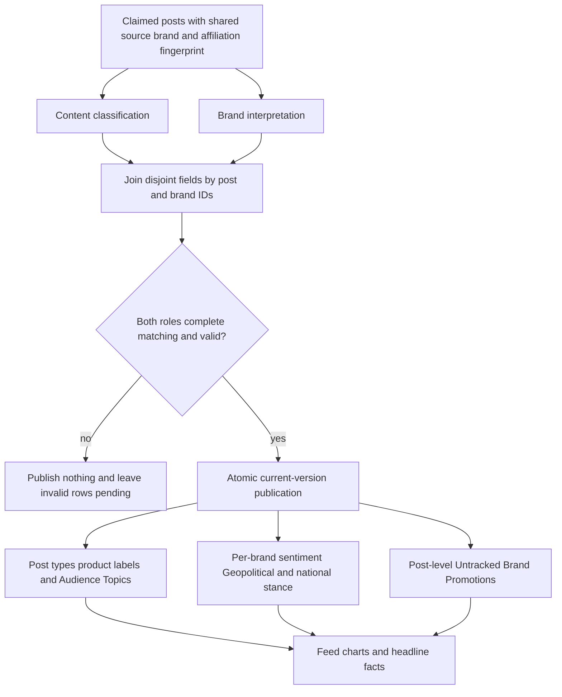
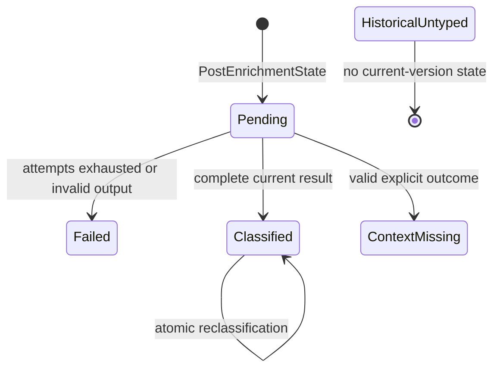
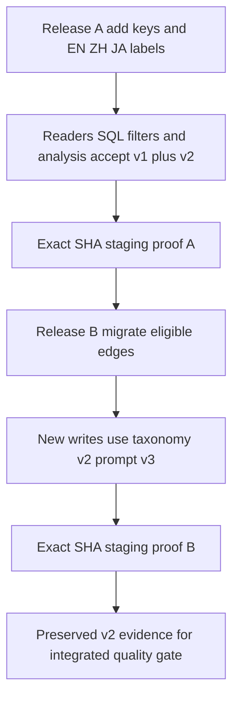
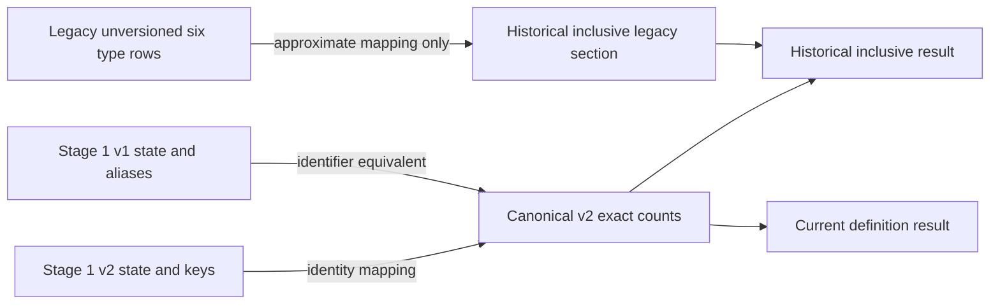
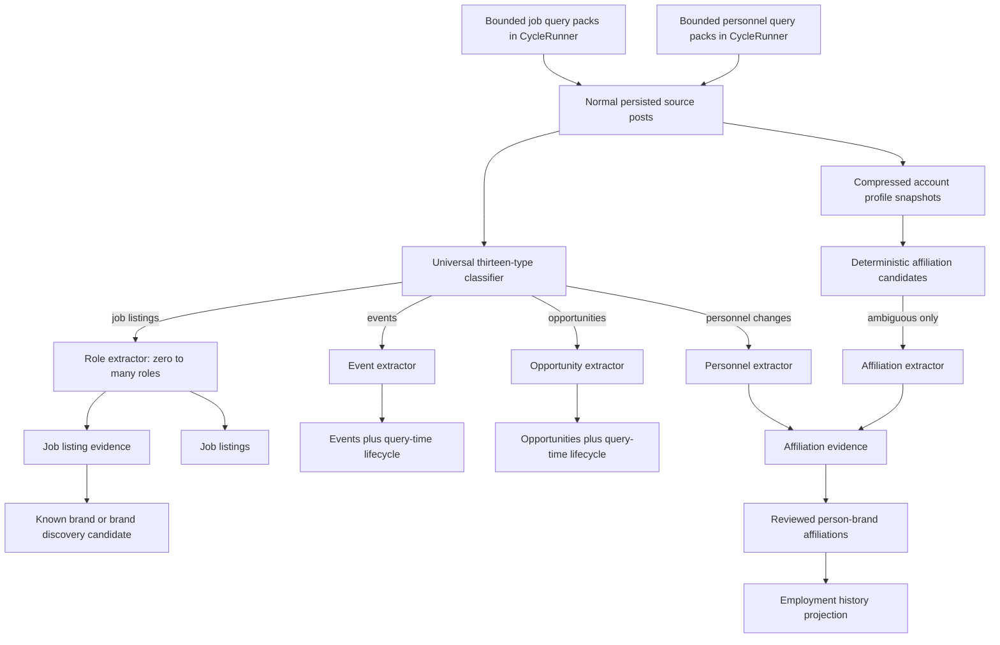
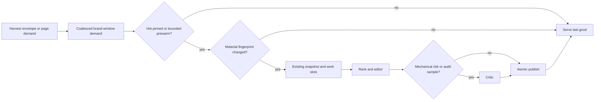
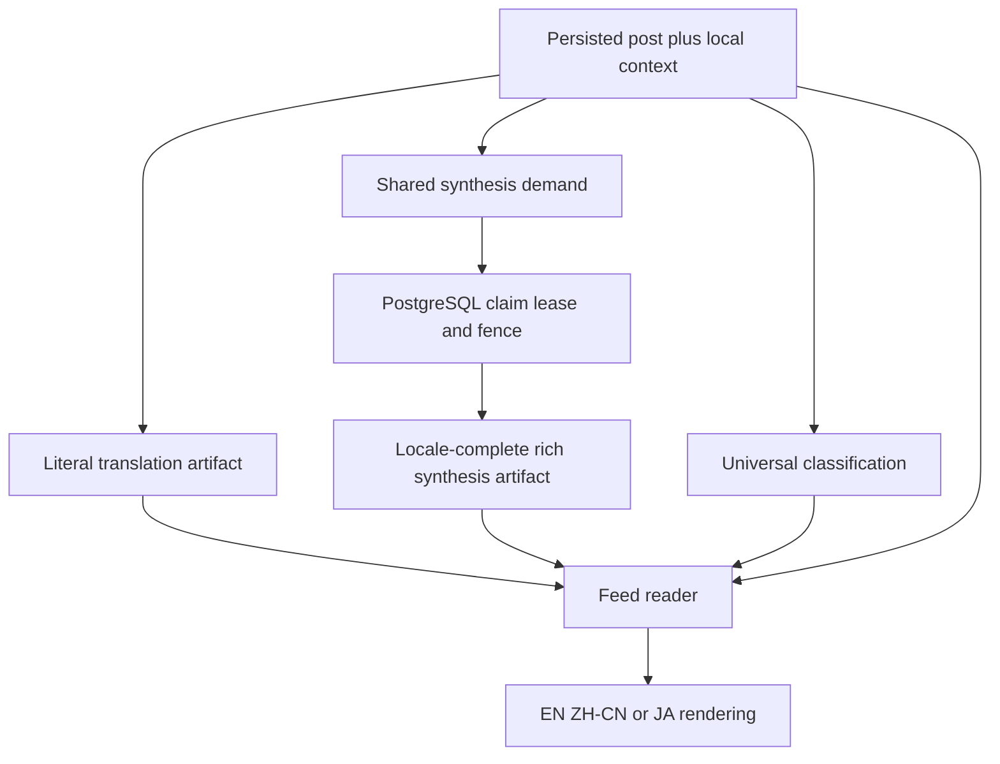
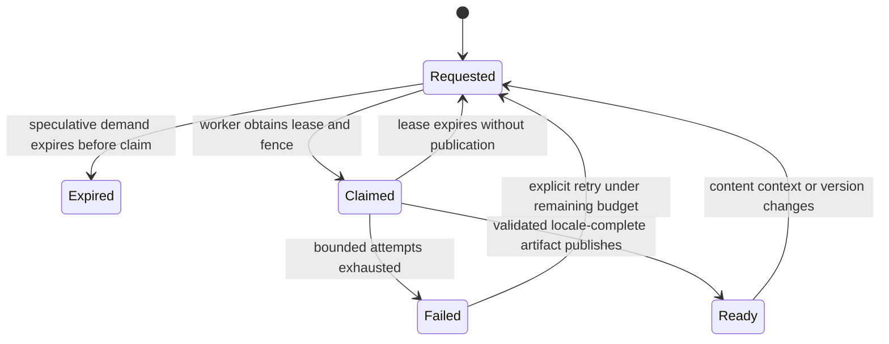
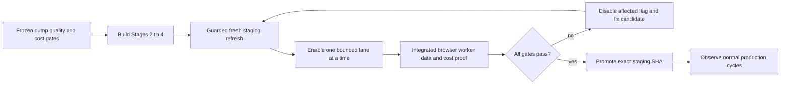

<!-- BEGIN OLLIJA DELIVERY GUIDE -->
## Ollija Delivery Guide

This block is generated guidance. Do not edit it directly. Correct durable facts in `.ollija/project.yaml` or this template, then rerun `ollija annotate-plan`. Put a user-directed exception in the editable Delivery Exceptions section below.

### Resolved locations

- Authoritative host: `fuchitalee`
- Authoritative repository: `/Users/fuchitalee/development/pushin-weight-v2`
- Ollija release worktree area: `/Users/fuchitalee/development/pushin-weight-v2/.worktrees`
- Active worktree: `/Users/fuchitalee/development/pushin-weight-v2/.worktrees/feat/ai-enrichment-stage1`
- Plan: `/Users/fuchitalee/development/pushin-weight-v2/.worktrees/feat/ai-enrichment-stage1/docs/plans/2026-09-08-134925-feat-ai-enrichment-stage1-plan.md`
- Change: `feat-ai-enrichment-stage1-2026-09-08-134925`
- Branch: `feat/ai-enrichment-stage1`
- Staging branch and blueprint: `staging`, `/Users/fuchitalee/development/pushin-weight-v2/.worktrees/feat/ai-enrichment-stage1/render-staging.yaml`
- Production branch and blueprint: `main`, `/Users/fuchitalee/development/pushin-weight-v2/.worktrees/feat/ai-enrichment-stage1/render.yaml`
- Staging URL: `https://pushinweight-staging-web.onrender.com`
- Production URL: `https://pushinweight-web.onrender.com`

### Placement

This worktree is inside the Ollija release worktree area. Reuse it for the whole change. Do not create a second worktree or plan for this branch.

### Delivery scope

- Workflow: `lfg`
- Delivery target: `production`
- Owner selection recorded: `true`

1. Complete implementation and the plan's verification contract.
2. Run the configured focused checks:
   - `pytest tests/ollija`
3. The parent workflow commits only this plan's changes, pushes the feature branch, and records the candidate SHA.
4. Fetch the remote staging lane: `git fetch origin refs/heads/staging`.
5. Require the unchanged candidate SHA to be a fast-forward of that fetched remote ref, then push the exact candidate SHA to `refs/heads/staging` with the server-enforced fast-forward command `git push origin <candidate-sha>:refs/heads/staging`.
6. Verify the remote staging ref resolves to the candidate SHA and the Render deployment for `pushinweight-staging-web` reports that same SHA.
7. Run staging checks. Stop here if they fail.
8. Only after staging passes, fetch the remote production lane: `git fetch origin refs/heads/main`.
9. Require the same unchanged candidate SHA to be a fast-forward of that fetched remote ref, then push the exact candidate SHA to `refs/heads/main` with the server-enforced fast-forward command `git push origin <candidate-sha>:refs/heads/main`.
10. Verify the remote production ref resolves to the candidate SHA and the Render deployment for `pushinweight-web` reports that same SHA before reporting completion.
11. After step 10 succeeds, perform worktree cleanup as the final filesystem action:
    - From `/Users/fuchitalee/development/pushin-weight-v2`, require `/Users/fuchitalee/development/pushin-weight-v2/.worktrees/feat/ai-enrichment-stage1` to remain registered, clean, unlocked, and at the verified candidate SHA. If any guard fails, retain it and report the reason.
    - Run `git -C /Users/fuchitalee/development/pushin-weight-v2 worktree remove /Users/fuchitalee/development/pushin-weight-v2/.worktrees/feat/ai-enrichment-stage1` without `--force`.
    - Preserve the local and remote feature branches. Continue final reporting from the authoritative repository root.

### Failure handling

- Never promote a staging candidate whose automated checks failed.
- Implementation failures return to the parent implementation workflow for diagnosis, correction, recommit, and restaging.
- SSH, shell, environment, or multi-machine failures use the repository infra/multi-machine skill first.
- The change ledger is advisory; do not validate or enforce it.
- Never force-remove a worktree. Retain staging-only, failed, dirty, locked,
  noncanonical, or candidate-mismatched worktrees for diagnosis or later
  delivery.
- Do not run an endless retry loop or start a persistent Ollija process.
<!-- END OLLIJA DELIVERY GUIDE -->

## Delivery Exceptions

1. Stage 0 was promoted and verified in production at `af272b6fe0b43be3276429792508749b9ddc8194` across the web, harvest cron, and headline worker; PR 40 is merged. Its production fake-provider probe passed at `2026-09-08T13:51:51Z`, and web health passed. Preserve its provider telemetry fields and identity derivation, scheduling, retry, and call-cardinality behavior while implementing Stage 1. Stage 1 classifier and headline prompt changes receive new prompt identities rather than reusing old hashes.
2. The owner authorized Stage 1 development and staging delivery after Stage 0 production promotion. Stage 1 production promotion is not authorized.
3. Review the passive Stage 0 production telemetry window `2026-09-08T13:51:00Z` through `2026-09-08T15:21:00Z` before Stage 1 staging deployment. This is the owner-selected 90-minute window within the accepted 1–2 hour range. Development need not wait for the window to close.
4. Do not trigger a paid harvest or provider acceptance run merely to fill the baseline. Use naturally occurring production events and bounded offline fixtures. A later bounded real-label evaluation is a production activation gate, not evidence required to claim Stage 1 contract and staging readiness.
5. Retain the canonical Stage 1 worktree after staging. Production is unauthorized, so the generated production cleanup path does not apply.
6. After the explicit staging hold, the owner resumed with “cocontinue” on September 9 JST. This authorizes one replacement latest-20 production capture and one recheck of those same ordered IDs after 30 minutes. The original failed capture saved no IDs. This is a narrow exception to the diagnostic skill's no-retry rule; it does not authorize further retries, a new baseline window, production writes, harvesting, or provider calls.
7. Continue Stage 1 by resolving the two remaining code findings from review `20260909-044149-aa012156`: aggregate headline scalar facts in PostgreSQL before returning rows, and separate classifier instructions from untrusted post/context data using the existing provider system field. Preserve the settled taxonomy, output semantics, provider configuration, batch/concurrency limits, retry/fallback behavior, and telemetry. Verify these changes with local call-chain and database regressions. R17's real semantic-quality assessment remains a preproduction gate; production promotion remains unauthorized.
8. The owner authorized this versioned taxonomy follow-up through staging. Add Japanese labels for the active classification vocabulary, rename only the five identifiers in R19, and add explicit historical analysis without historical LLM reclassification. Use the compatibility-first two-release staging sequence in KTD9; do not run a new paid call, passive baseline, production cohort capture, or production deployment. The completed Stage 1 receipts remain immutable historical evidence, and this follow-up receives new candidate and staging proof.
9. On 2026-09-11, after reviewing the staging receipt and remaining production gates, the owner selected production delivery for Stage 1 before Stages 2–4. Complete the taxonomy-v2 baseline, taxonomy-v3 three-stratum assessment, job/personnel discovery assessments, role/affiliation extraction assessments, and incremental cost measurement before promotion. If those gates pass, promote Stage 1 and verify normal production harvest cycles while keeping job discovery, personnel discovery, targeted extraction, profile backfill, and public MCP/API access disabled. This supersedes the production prohibition in exceptions 2, 7, and 8 only after the named gates pass; it does not authorize activating those disabled features or manually mutating production data.
10. Later on 2026-09-11, the owner superseded exception 9's release sequence: complete the remaining Stage 1 quality gates and Stages 2–4 on this same candidate, refresh staging through the guarded scrubbed-production procedure, activate and debug the integrated feature set on staging, and then promote that exact passing candidate to production. This authorizes bounded paid staging evaluations and feature activation within the explicit caps and stop conditions in U18–U24. It does not authorize a production pause, an ad hoc production provider run, bypassing the single harvester scheduler, publishing the future public MCP/API, or weakening any migration, quality, cost, or exact-SHA gate.
11. On 2026-09-11 the owner clarified that Anthropic is not an active PushinWeight provider: scheduled translation, classification, relevancy, and signal work use DeepSeek, while MiniMax remains available only to separately configured roles. The v22/v22b direct-Haiku attempts remain historical zero-quality-result evidence and no longer block delivery on a credential. This does not convert the failed DeepSeek semantic score into a pass or weaken the U18 floors. The integrated candidate may deploy to staging with the new paid discovery, extraction, and synthesis lanes disabled so schema, data-refresh, UI, and worker isolation can be debugged while U18 quality remains open; production promotion still requires every named gate.
12. On 2026-09-12 the owner reviewed the 16 disagreements highlighted by the independent Grok audit and directed a new prompt identity with stricter visible-evidence, target-brand, customer-cost, testimonial-overlap, unavailable-media, and hackathon rules. Because the owner saw the model judgments before commenting, this calibration is consumed development evidence and cannot count as either blinded reviewer or adjudicator under R81–R82. The owner also required cross-post event identity that distinguishes canonical occurrences from their source observations and preserves recurring same-name editions rather than silently merging them.
13. On 2026-09-13 the owner completed all 45 cases in the U18 ambiguity study, assumed responsibility for the judgments, and directed that this be the only human review for this classifier delivery. Treat the 45 ordered rows as a sole, unblinded owner reference; blank case entries accept the packet proposal and explicit comments plus earlier recorded corrections define the overrides. This supersedes R81–R82 and KTD37 only where they require two independent reviewers, a distinct adjudicator, an inter-reviewer agreement floor, or a later zero-overlap human cohort. Mark the study `complete_by_owner_acceptance` and its human gate `waived_by_owner`; do not describe the reference as blinded human gold, claim inter-reviewer agreement, or turn agreement with it into production accuracy. The original owner message is preserved byte-for-byte as the prefix of `docs/analysis/2026-09-13-203542-u18-owner-human-review-comments.md` (original-prefix SHA-256 `bb1dca6b9f4d2b931ef93e9d79946ca41c2cbc8efacd2618ac12b8c550cd49ab`; amended-file SHA-256 `b0eb3d9c5e1be474e75498fad7e9b15c95cc3a9be5f2707f03e8b1b3fff91b9e`). The consolidated decisions are at `docs/analysis/2026-09-13-225451-u18-owner-review-decision-summary.md` (SHA-256 `33341fa0983bae9b6a518f8d11d9ee9a8a13c4665771ce9780ef7c48a4695cd1`), and machine-readable prevalence evidence is at `docs/analysis/2026-09-14-075314-u18-owner-edge-prevalence.json` (SHA-256 `d0cb2163f79f9baf993f845e265c7d26859897c934033bf36fde1458350954f1`). Provider, request, retry, token, cost, extraction, migration, staging, rollback, and exact-SHA production gates remain unchanged.
14. On 2026-09-14 the owner prohibited a routine second classifier LLM call. One successful semantic request per batch of at most 20 posts must return the complete per-brand post types, product labels, Audience Topics, sentiment, Geopolitical modes, China/U.S. national stance, and the post-level Untracked Brand Promotions result. Do not run a candidate-aware completeness reviewer, independent topic pass, consensus/adjudication pass, or semantic repair after a usable primary response. A bounded transport retry may repeat the identical request only after a timeout or transport failure that produced no usable response; an invalid semantic row remains pending for a later normal attempt rather than triggering an immediate per-post provider fallback. Supersede R79–R80 and KTD35–KTD36 as production architecture, and supersede KTD40's separate topic-pass decision. Preserve every prior multi-pass run as historical experiment evidence. Replace those calls with a compact, versioned primary prompt, deterministic schema and invariant checks, and a fixed replay against the existing ordered owner reference. This changes classifier call topology only; separately gated rare-positive structured extraction remains governed by U16.

15. Later on 2026-09-14, after reviewing the alternatives, the owner accepted a bounded trial of two focused classification calls in parallel and instructed that it be written into this plan. This supersedes exception 14's one-call requirement for the R95–R96 trial and a candidate that passes its gates. Content classification owns post types, Audience Topics, and post-level Untracked Brand Promotions; brand interpretation owns product labels, sentiment, Geopolitical modes, and national stance. The same configured model may serve both roles. Combine their disjoint fields in code; do not add a reviewer, vote, judge, third classifier call, or semantic repair. Measure total cost per 1,000 source posts and complete-result latency under a frozen budget rather than assuming two calls double cost. Preserve exception 13's completed sole human review, prior single-call and reviewer evidence, and all existing staging/production gates. This plan amendment alone starts no implementation, paid evaluation, or deployment; freeze the numeric trial caps and candidate identities before later execution. A small dedicated classifier is a deferred replacement experiment, not a prerequisite for this delivery.

16. The owner then requested an OpenRouter comparison of three models at different sizes, including one free model, selected using current prices and special offers. R97 and the U18 shortlist define this bounded comparison. OpenRouter is an explicit evaluation-provider exception to exception 11's current production provider configuration. Each of the three candidates serves both R95 roles in its own run; this does not add three models to each live classification, an ensemble, a judge, or automatic provider switching. Keep production credentials and defaults unchanged while selecting the cheapest tested candidate that meets all quality, coverage, latency, and operating-capacity gates. Public catalog research and this plan amendment do not constitute an inference run or a deployment.

17. After the frozen R97 comparison failed, the owner authorized a separately
    frozen follow-up using the existing direct `deepseek-v4-flash` classifier
    as the control and preapproved additional candidates. R98 governs this
    experiment. Preserve every R97 request and result as immutable failure
    evidence; do not replay it or describe this consumed 45-case owner
    reference as unseen validation. Keep the same two prompts, 20/20/5 packet
    order, output ceiling, retry rule, parser, merge, quality floors, and
    latency gate. Run the direct control first, then use the frozen cost order
    to call only enough candidates to identify the cheapest passing result.
    The maximum five-candidate envelope, exact routes, and $0.5629859322 hard
    cap are frozen in
    `docs/analysis/2026-09-14-213123-u18-r98-control-fallback-pilot-contract.json`.
    A catalog, price, provider, service-tier, secret, or policy mismatch blocks
    that candidate before transport. This exception authorizes only the bounded
    public-X evaluation; it does not activate a classifier, change production
    defaults, weaken a gate, add semantic repair, or deploy.

18. After R98 completed without a passing candidate, the owner authorized one
    separately frozen DeepSeek-only batch-size experiment. R99 preserves the
    exact 45-row order, two role prompts, direct `deepseek-v4-flash` route,
    reasoning-disabled policy, parser, merge, and quality floors. It changes
    the ordered batches from 20/20/5 to 40/5 and follows the existing
    production output-budget rule, `_max_tokens_for_batch(40)`, by allowing
    8,000 output tokens per role request. This is four initial logical requests
    and at most eight transports with one identical transport retry each,
    under the frozen $0.22642488 ceiling. Do not replay R97/R98 responses or
    add another model, prompt revision, repair call, fallback, or changed floor.
    The test may select DeepSeek only if every existing gate passes; otherwise
    retain another terminal failure. This exception authorizes no classifier
    activation or staging/production deployment.

19. On September 15 the owner explicitly requested “let's try the 3rd
    conditional call.” R100 supersedes the no-third-call/no-further-trial
    restrictions in Exception 15 and KTD50 only for this bounded diagnostic.
    Reuse the saved R98 20/20/5 DeepSeek answers without buying the first two
    roles again; preserve R97–R99 as immutable evidence. A deterministic
    multilingual source/context screen and prior content labels select rows
    for one additional four-predicate specialist request per nonempty original
    batch. Freeze 23 selected rows in 12/8/3 batches, three requests/transports,
    no retries, concurrency one, 65,259 conservative input tokens, 18,000
    output tokens, zero reasoning tokens, and a $0.05247396 reserved ceiling
    before inference. The outer refusal ceiling is $0.15. Use the pinned
    direct DeepSeek route and legacy Flash request name; record the provider's
    September 15 notice that this alias now serves V4.1 Flash. Thus this tests
    a practical add-on to fixed old answers, not an isolated same-model
    architecture comparison. Add only supported missing job listings,
    personnel changes, events, and opportunities; preserve other axes and
    original labels. Record false additions, screen misses, specialist misses,
    costs, and latency against the sole completed owner reference. This
    authorizes the trial, its artifact checkpoint, and feature-branch evidence;
    it does not activate a classifier or waive any staging/production gate.
20. The owner then authorized the simpler R101 architecture: one full primary
    call plus one conditional rare-type follow-up. R101 supersedes the
    two-parallel-primary requirement only for this bounded comparison. The
    primary uses the existing full production prompt and owns every current-v3
    field. A sequential specialist may add only jobs, personnel changes,
    events, and opportunities to a classified primary row. Freeze 20/20/5
    primary batches; reserve up to three matching conditional batches because
    their source/primary screen cannot be known before transport; set six
    maximum serial calls, zero retries, zero reasoning tokens, 6,000 output
    tokens per call, and a $0.13244000 conservative cap under the separate
    R101 contract. Compare all axes, rare-label errors, actual routing and
    costs against R98+R100. This authorizes only the private evaluation and
    feature-branch artifacts; runtime activation, database publication, and
    staging/production deployment remain prohibited.

# Integrated AI Enrichment Taxonomy and Demand-Shaped Synthesis

## Plain-English Summary

Stage 1C will classify new posts into thirteen types. It separates attendance-bearing events from time-bounded opportunities, and adds specific job-listing and personnel-change types. It also stores structured people, affiliations, jobs, events, and opportunities so future analysis and MCP/API clients can use the facts without rereading prompt output.

The completed owner review also defines a separately versioned next taxonomy:
`news_reporting`, seven changeable Audience Topics, the `investigate_claim`
product label,
and one Geopolitical family that distinguishes reporting, state-level frameworks,
and author-adopted nationalistic stances. Frozen-corpus prevalence supports each
of those additions. Repeated b.ai/Qwen-clip promotion and official-account false
spam flags will be handled through source-aware promotion rules rather than new
post types.

The classifier experiment splits the work into two focused calls that run
in parallel on the same configured batch. R98 measured 20/20/5 batches; the
completed R99 diagnostic measured 40/5 batches with the output budget scaled
to 8,000 tokens for the 40-row requests. One call classifies content:
post types, Audience Topics, and Untracked Brand Promotions. The other judges
product labels, sentiment, and Geopolitical or national stance for each brand.
Each field has one owner, and code combines the two valid responses. The
owner-authorized R100 diagnostic now tests an optional third call on broadly
screened posts to recover missing jobs, personnel changes, events, and
opportunities. It reuses R98's saved answers and measures the additional cost
and false additions. It does not assume that splitting the work guarantees
better labels or doubles cost.

The trial must improve agreement with the completed owner review and satisfy
fixed spending and processing-time limits before becoming the delivery
candidate. It reuses the 45 cases in their original order and requires no new
human review. Failed or incomplete pairs publish no partial replacement and
retain the last good result. Prior single-call and reviewer runs remain
historical evidence. Replacing a proven portion with a small dedicated
classifier is deferred so training and new model hosting do not block delivery.

The first OpenRouter comparison tested a small Qwen, a free Gemma, and a large
Qwen; all three failed complete-pair coverage, so none was selected. The
separately frozen follow-up then ran the existing direct DeepSeek classifier as
a control plus four preapproved OpenRouter alternatives. DeepSeek completed all
45 rows but failed the unchanged semantic gates, while none of the alternatives
produced a passing complete result. No classifier was selected. SetFit remains
a later option for replacing a proven task with a trained small classifier. A
final DeepSeek-only diagnostic now tests the production-scaled 40-post batch
shape using 40/5 batches and an 8,000-token ceiling while preserving the same
prompts, model, parser, merge, and quality gates.

Every classifier dimension remains strict to the attributed brand. A
multi-brand post may therefore have different post types, product labels,
sentiment, and Geopolitical or national-stance judgments for each brand. A
brand that appears only as a comparison or foil does not inherit another
brand's release or advertising label. Existing post-brand associations and
per-brand signals are sufficient to find cross-brand comparisons and mentions
inside another brand's promotion, so this rule adds no semantic-role or
`external_party` taxonomy.

The Grok job-search research shows that a tracked-brand-only search would miss most of this product: 47 of its 55 listing records came from organizations outside the current catalog, and 18 source posts expanded into 55 distinct roles. The plan therefore adds a disabled-by-default global job-discovery lane inside the existing 15-minute harvest runner, with organization-centric and role-centric EN/ZH-CN/JA query packs. New organizations enter a review queue; one source post may support many job rows; application links, email, QR/media evidence, and later careers-page enrichment retain their provenance.

A separate disabled-by-default personnel-discovery lane finds explicit appointments, departures, and before/after employment statements that ordinary tracked-brand harvesting misses. A first-person statement such as “I worked at Google DeepMind and now at Anthropic” is a personnel change even when it does not state when the move occurred: the post timestamp records when PushinWeight observed the claim, while both employment dates remain unknown. Organization-facing brands such as Anthropic and Google DeepMind remain distinct from product brands such as Gemini.

Profile affiliation discovery uses evidence rather than treating every brand mention alike. Existing `brands_accounts` edges and the owner-curated Call A list are positive evidence; absence from either is unknown rather than community. Explicit employee titles, official organization posts, X business-affiliate badges, ambassador/creator-program wording, bare handles, and conflicting or former-status language remain separately queryable so a review can distinguish staff, community, former, and unresolved relationships without discarding the source facts.

Schema changes remain additive and preserve all existing data and version
meaning. U18A adds correctly named national-stance fields and tables while the
old current-state and discourse nationalism fields remain compatibility data
during an expand-and-contract window. Existing
taxonomy-v2 `events_opportunities` rows keep their original combined meaning
and version; they are never silently rewritten into the two new categories.
The remaining roadmap reduces recurring model work: headlines refresh only for
hot, materially changed windows; literal translation stays available
independently; richer synthesis is generated once per versioned post context
when the feed actually needs it; and EN, ZH-CN, and JA become equal product
locales.

The full candidate will be tested against two deliberately different data sources. The verified September 10 production dump is the frozen source for reproducible offline cohorts. Near final integration, the guarded staging refresh will create a fresh, scrubbed production-shaped database so migrations, feeds, queues, jobs, personnel changes, events, opportunities, and locale behavior are exercised against current data. The candidate reaches production only after the taxonomy, discovery, extraction, headline, translation, synthesis, cost, browser, rollback, and exact-SHA staging gates pass. Public MCP/API publication remains deferred, but the same internal read and request contracts must be usable by both the UI and agents.

Repeated mentions of an event will attach as evidence to one canonical occurrence when a strong source identifier or compatible organizer, normalized title, and source-stated time window support the match. A recurring hackathon keeps a shared human-readable series name while each dated edition remains a separate occurrence. Unknown dates stay unknown; observation time and a resolver search window never become invented event dates.

## Goal Capsule

- **Objective:** Readers, operators, and internal agents can use version-exact classification, structured employment/job/event/opportunity facts, demand-shaped headlines, literal translations, and cached rich synthesis across EN, ZH-CN, and JA without fabricated provenance or repeated model work for unchanged content. Public MCP/API publication remains deferred.
- **Means:** Preserve the completed Stage 0 and Stage 1 evidence, complete the taxonomy-v2/v3 quality gates, then add hot/material-change headline demand, separate versioned translation and synthesis artifacts, a durable PostgreSQL synthesis queue, full Japanese locale parity, and bounded UI/agent demand contracts (KTD1–KTD33). Validate the integrated system against frozen and fresh production-shaped data before one exact-candidate production promotion.
- **Authority:** This plan's Product Contract owns the complete Stage 1 product semantics carried from the owner-selected ideation. `docs/plans/2026-09-08-194415-feat-staged-ai-enrichment-roadmap-plan.md` owns the staged roadmap, and `docs/reference/2026-09-08-194415-enrichment-contracts.md` owns Stage 0 telemetry invariants and receives the bounded durable Stage 1 taxonomy excerpt in U1.
- **Execution profile:** U1–U17 are implemented through provider-denied local proof and the taxonomy-v3 staging receipt. U18 closes the current-v3 owner-reference and cost gates. U18A implements the separately versioned Audience Topics, news-reporting, claim, Geopolitical, and source-aware refinement. U19 implements Stage 2 headline demand. U20 implements Stage 3 split translation/synthesis and Japanese parity. U21–U22 implement Stage 4 durable demand and feed behavior. U23 refreshes, activates, and debugs staging. U24 promotes and observes the unchanged passing candidate in production.
- **Stop conditions:** Stop if a migration changes original provenance, rewrites v2 combined rows, requires historical model inference, invents dates/application routes/brand authority, bypasses `CycleRunner`, hides relevant pending posts, couples page rendering to a provider response, allows speculative work to grow without a bound, blends approximate and exact populations, or exceeds a preregistered provider/credit/token cap.
- **Tail ownership:** The parent LFG workflow owns the complete implementation, reviews, commits, exact-SHA staging and production delivery, bounded activation, monitoring, and guarded final worktree cleanup.

## Product Contract

### Summary

Stage 1 replaced the active six-type-plus-discourse classifier with ten reader-facing post types and five independent product labels. This follow-up keeps those meanings and the response shape, renames five identifiers, adds Japanese display-label rows for every active classification family, and makes mixed-era analysis explicit. Classification stays universal and per brand; no stored record is reclassified merely because an identifier changed.

Product Contract amendment: R1 and R3 preserve the ten-type and five-product meanings while the user-directed R19 identifier crosswalk supersedes five machine keys. R20–R26 add the Japanese label foundation, provenance-preserving compatibility, explicit history-policy contract, and latest-state limit. Universal classification and response shape remain unchanged. The completed U1–U5 evidence describes taxonomy v1; U6–U11 own the v2 follow-up candidate.

Stage 1C amendment: R27–R57 and U13–U17 supersede the earlier twelve-type rare-signal draft. Taxonomy v3 has thirteen post types, separates events from opportunities, persists their source-stated lifecycle facts, adds global AI-job and personnel-change discovery through the existing bounded harvester, and stores reviewed organization candidates plus source-bound affiliation and job evidence. Taxonomy-v2 history remains an exact separate population; the Grok job-search artifact is calibration evidence only.

Product Contract preservation: the owner-approved Stage 1C amendments change R29, R31, R33, and R35–R37 and add R33A and R54–R57 for personnel discovery and source-aware affiliation evidence. R1–R28 and R40–R53 keep their previously settled meanings except where the plan explicitly names a superseding requirement.

Integrated-roadmap amendment: R58–R76 complete the quality gates and the original Stages 2–4 on the same candidate. They make headline work demand-shaped, split literal translation from rich synthesis, add equal Japanese product behavior, serve posts while synthesis is pending, and deliver the fully tested stack through staging to production. The public recruiter MCP/API remains a later publication surface; this candidate supplies stable internal contracts and agent parity without exposing it publicly.

### Problem Frame

The production classifier asks for six post types, sentiment, discourse, and two nationalism axes. Its parsers silently turn missing or invalid types into `hands_on_usage`, its Django writer never removes stale type rows, and nationalism can be stored only through `PostBrandDiscourse`. Active feed and trend-narrative readers also join discourse directly. Those couplings would make a prompt-only taxonomy change fabricate labels, strand nationalism, and leave old discourse behavior active.

### Requirements

**Reader and product taxonomy**

- R1. The ten post-type meanings remain Releases & Updates, Hands-On Usage, Results and Evaluations, Questions & Requests, Advertising & Marketing, Events & Opportunities, Opinions & Reactions, Research & Explanations, Business & Finance, and Other. Taxonomy v2 emits the canonical keys `releases_updates`, `hands_on_usage`, `results_evaluations`, `questions_requests`, `advertising_marketing`, `events_opportunities`, `opinions_reactions`, `research_explanations`, `business_finance`, and `other`; v1 aliases are defined only by R19.
- R2. Post types are independent per brand and may contain every supported type justified by the post. The contract imposes no arbitrary count cap. Duplicate values are removed, and `other` is valid only as an exclusive confident residual judgment.
- R3. Product-label keys are `bug`, `complaint`, `testimonial`, `ideas_requests`, and `misinformation`, with display labels Bug, Complaint, Testimonial, Ideas & requests, and Misinformation. The v1 alias for Ideas & requests is defined by R19. Labels are independent per brand; zero, one, or several may be valid.
- R4. The type rules use the final boundaries represented by this Product Contract and its acceptance examples, including experience/results redistribution, genuine questions and requests, concrete events and opportunities, event recaps with substantive occasion outcomes, and available quote or locally persisted parent context. Brand relevance, truth, usefulness, and priority remain separate judgments.

**State, preservation, and failure semantics**

- R5. A `classified` outcome requires one existing four-value sentiment per brand. A `context_missing` outcome may retain an independently supported valid sentiment or nationalism judgment, but stores null for any unknown scalar rather than fabricating a value or type. China and US nationalism retain the existing six-value vocabulary, where explicit `none` is a judgment and null means unknown or unavailable.
- R6. Discourse is absent from the active classifier request and response, new persistence writes, public and protected UI controls, chart families, and headline inputs. No posture, sincerity, or substitute discourse taxonomy is introduced.
- R7. Each newly processed post-brand records classification contract, taxonomy, and prompt versions; model identity; a non-reversible input/context fingerprint; source language; and one semantic outcome: `classified` or `context_missing`. Pending and failed transport/parser work remains owned by `PostEnrichmentState`; malformed or incomplete provider output is a retryable/failing operation, not a persisted model judgment. Persist no raw prompt or added context in this state.
- R8. A current-version `classified` outcome plus a stored `other` row is the only representation of Other. No current-version state means historical-untyped; `context_missing`, pending, failed, invalid, and historical-untyped must remain distinguishable from Other.
- R9. A post is classification-complete only when every expected attributed brand has a valid `classified` or `context_missing` result. Product-label emptiness is valid. Missing brands, unknown keys, illegal `other` combinations, or incomplete required dimensions leave the affected post pending for a later normal attempt without partial current-version publication. They never trigger an immediate per-post semantic fallback. Identical transport retries remain allowed only when an invocation fails without yielding a usable response and stay inside the frozen R96 budget and retry caps.
- R10. New post-brand type, product-label, sentiment, nationalism, outcome, and version rows replace that post-brand's prior current classification atomically. Reclassification cannot leave stale type or product rows. Current sentiment is owned by the per-brand state; the required legacy sentiment column on each classified `PostBrandSignal` edge mirrors the same value until a later cleanup.

**Compatibility and reader behavior**

- R11. Stage 1 does not relabel historical posts, manufacture missing discourse, or copy an arbitrary nationalism value from conflicting legacy rows. The first release retains discourse tables read-only and may use them only as a historical nationalism fallback when no current-version state exists.
- R12. Feeds, charts, filters, and trend narratives continue to include all otherwise eligible posts. Product-label emptiness and absent current-version classification do not remove a post from discovery.
- R13. Existing UI layout and navigation remain intact. Replace discourse controls and badges with the new product-label family, expose all ten post types with localized current-surface labels, preserve the existing nationalism lens, and avoid unrelated page redesign.
- R14. Headline facts, evidence selection, and rank/editor prompts stop consuming discourse. Post-type diversity may occupy the existing deterministic diversity role, and product labels may be passed as explicitly scoped metadata; `misinformation` never asserts that a claim is false.

**Operational invariants and evaluation**

- R15. Preserve collection policy, the 15-minute production schedule, classifier batches of 20, production `max_workers=3`, universal classification, and all Stage 0 transport telemetry fields. R95–R97 explicitly supersede the earlier single-role provider topology: the recurring classifier uses exactly two independent role calls per batch, one shared concurrency ceiling, bounded identical transport retries, and no reviewer, consensus, semantic-repair, or per-post-fallback call.
- R16. Deterministic synthetic fixtures prove schema, parser, state, context, and compatibility contracts but are labeled non-gold. The 599-post analyst material remains calibration evidence and cannot support an accuracy claim.
- R17. After the prompt and taxonomy version freeze, assess a fresh provenance-bearing heldout cohort offline from stored candidate output. The assessment covers all ten types, five product labels, empty/multiple labels, `other`, sentiment, nationalism `none` versus unknown, EN/ZH-CN/JA source text, quote/local-parent context, and context-missing cases. Numeric semantic floors are set from cohort size and adjudicated baseline before any Stage 1 production proposal.
- R18. Stage 1 staging deployment requires the passive 90-minute Stage 0 baseline review, the fixed-cohort latest-20 production health observation, migration and data-integrity proof, contract tests, real browser proof, headline regression proof, and exact-SHA staging health. Staging verification may establish contract readiness but must not claim real classifier accuracy before R17 is complete.

**Versioned identifiers, Japanese labels, and analysis**

- R19. The only identifier renames are `buzz_releases` to `releases_updates`, `performance_comparisons` to `results_evaluations`, `feedback_questions` to `questions_requests`, `event_announcement` to `events_opportunities`, and `product_request` to `ideas_requests`. The mapping is identifier-only: meanings and the provider response shape do not change. New classifications use `stage1-taxonomy-v2` and `stage1-prompt-v3`; the classification contract remains `stage1-v1`.
- R20. Seed exactly three display-label locales (`en`, `zh-cn`, `ja`) for the active ten post types, five product labels, four sentiments, and six nationalism values. The Japanese strings below are an agent-authored implementation proposal adopted by this amendment and are the exact migration/test values; they are not pre-existing approved product copy, so any change requires Product Contract review before U6 freezes them. Keys and counts are locale-independent. Release A does not expose Japanese selection or content; U20 later completes that parity under R69.
- R21. Preserve each existing Stage 1 state's original taxonomy version, prompt version, model, and `classified_at` while mechanically renaming its eligible type/product edges. Do not stamp an old row as a v2 classification, infer classification era from publication date, invoke an LLM for historical rows, or rewrite immutable headline snapshots or provider-request ledgers.
- R22. One shared crosswalk treats v1 aliases and v2 keys as current-compatible inputs and emits canonical v2 keys. New provider output is strict v2 only. Canonicalization occurs before filtering, deduplication, distinct counts, and grouping; current explicit nulls continue to block historical fallback. Any post-brand with a state row whose contract or taxonomy version is unrecognized is excluded from exact and legacy-approximate populations, blocks scalar fallback, and increments an explicit exclusion/warning rather than being treated as state-absent.
- R23. A shared read-only analysis query and management CLI require `--history-policy current_definition` or `--history-policy historical_inclusive`, an explicit half-open UTC range over `Post.created_at`, and optional brand scope. Output states `range_basis: post_created_at`; null post timestamps are excluded and counted with a warning, while `classified_at` remains provenance only. `current_definition` reports recognized versioned Stage 1 state with canonical keys. `historical_inclusive` adds a separately labeled `legacy_unversioned_approximate` section and never mixes approximate legacy rows into exact Stage 1 denominators. Its six-type mapping is `buzz_releases` to `releases_updates`, `hands_on_usage` to itself, `performance_comparisons` to `results_evaluations`, `feedback_questions` to `questions_requests`, `advertising_marketing` to itself, and `event_announcement` to `events_opportunities`; the section remains approximate because those rows have no Stage 1 version state and used older definitions. This mapping is pinned to the six-key dashboard vocabulary at `af272b6fe0b43be3276429792508749b9ddc8194:monitor/views.py`.
- R24. Deterministic analysis JSON reports schema version, requested policy and range, output taxonomy version, identifier-only mapping equivalence and crosswalk, distinct post-brand-key memberships, unique post count, distinct classified post-brand denominator, exact counts by stored v1/v2 provenance, excluded/unknown provenance, and warnings. Legacy product-label availability is `unavailable`, not zero. Empty valid results exit zero; invalid inputs or mapping collisions fail nonzero without partial aggregates. Saved outputs carry source revision and query identity for reproducibility.
- R25. Feed, chart, DOM, icon, headline, and analysis outputs emit canonical v2 keys. The old-filter compatibility window starts in Release A and remains through Release B and its Release A rollback support; U6–U11 never remove aliases. A later explicitly authorized cleanup may end it only after Release B reaches production, instrumented alias-use telemetry records zero old-alias requests for 30 consecutive days, and Release A is no longer an approved rollback target. Inputs normalize before ORM predicates and cache identity. Old key/label rows remain for unversioned legacy references, while active headline taxonomy and new prompt inputs use closed canonical allowlists.
- R26. `PostBrandClassificationState` is the latest state per post-brand, not an append-only event ledger. The analysis contract distinguishes stored populations and provenance visible at query time but does not claim to reconstruct an arbitrary historical classification state; later genuine reclassification may replace state and edges.

**Owner-approved Stage 1C taxonomy and structured-intelligence extension**

- R27. After U12 supplies the evaluator and freezes the exact ten-type taxonomy-v2 assessment protocol and prompt identity, add taxonomy `stage1-taxonomy-v3` and prompt `stage1-prompt-v4` with thirteen post types. Replace the combined v2 key `events_opportunities` with separate `events` / Events and `opportunities` / Opportunities keys, and add `job_listings` / Job Listings plus `personnel_changes` / Personnel Changes. This is a semantic split plus two additions, not an identifier alias migration; taxonomy-v2 rows retain their combined key and provenance.
- R28. `job_listings` requires a concrete role or vacancy plus an actionable application route, including a direct or careers-page URL, email, source-stated QR code, or explicit direct-message instruction. A role list in one source post may produce several listings. General recruiting-brand promotion, workplace culture, employee spotlights, unnamed employers, unverified job-board claims, unrelated jobs carrying AI hashtags, and vague “we are growing” claims do not qualify. Preserve an unresolved or truncated route instead of inventing a URL.
- R29. `personnel_changes` covers a named person joining, leaving, or explicitly describing a before/after employment transition involving a known or discovered AI lab or brand. The author may be the official brand, staff member, named person, or a third party; account role and handle mentions are evidence features rather than hard gates. A first-person statement such as “I worked at Google DeepMind and now at Anthropic” qualifies even when it is offered as background and gives no effective date. A mere static biography, employee spotlight, quote, or reference to an unchanged position does not qualify.
- R30. Seed EN, ZH-CN, and JA labels for the four v3-only keys: `events` = `Events` / `活动` / `イベント`; `opportunities` = `Opportunities` / `机会` / `機会`; `job_listings` = `Job Listings` / `招聘信息` / `求人情報`; and `personnel_changes` = `Personnel Changes` / `人事变动` / `人事異動`. Retain the existing taxonomy-v2 `events_opportunities` labels and original provenance for stored v2 rows. Historical reclassification into the new types requires separate authorization.
- R31. Add ten distinct durable layers: `AccountProfileSnapshot` captures observed source facts; `PersonBrandAffiliation` stores an interpreted person-to-organization relationship owned by either a known brand or a pending organization candidate; `PersonBrandAffiliationEvidence` explains why that interpretation exists; `BrandDiscoveryCandidate` holds a reviewable organization/handle found outside the tracked catalog; `JobListing` stores one public role or requisition; `JobListingEvidence` links that listing to one or more source posts, URLs, or media observations; `JobDiscoveryRun` and `PersonnelDiscoveryRun` record bounded query executions for their separate lanes; `Event` stores an attendance-bearing occurrence; and `Opportunity` stores a bounded action-for-benefit offer. A profile observation, employment claim, organization candidate, job opening, source observation, search run, event, and opportunity are never represented by the same row.
- R32. Use `Person` / `people` with a stable UUID primary key, canonical display-name fields, nullable `date_of_birth`, `date_of_birth_precision` (`day`, `month`, `year`, `unknown`), the owner-selected `sexs` field, `nationality`, `ethnicity`, and `primary_language`. Store `date_of_birth` as a reduced-precision ISO value whose shape matches its precision (`YYYY-MM-DD`, `YYYY-MM`, or `YYYY`) so partial dates never require a fabricated month or day; null represents unknown. Preserve the stored text for `sexs`, nationality, ethnicity, and primary language without forcing a closed vocabulary in this stage. Use `PersonAccount` / `people_accounts` as a pure person-account junction whose Django field is `account = ForeignKey(Account, to_field="author_id", db_column="author_id")`; its database identity is composite `(person_id, author_id)`, while Django exposes the FK value as `account_id`. Store `is_primary`, first/last-observed timestamps, confidence, and resolution/review status. Enforce at most one confirmed person for an account and at most one primary account per person; conflicting candidate links remain explicit, unconfirmed review records rather than silent merges.
- R33. Use `PersonBrandAffiliation` / `people_brand_affiliations` with a surrogate primary key, a required person FK, and a database-enforced exclusive organization owner: either a known-brand FK or a pending `BrandDiscoveryCandidate` FK. Store `affiliation_type` (`employment`, `founder`, `advisor`, `board_member`, `contractor`, `ambassador`, `creator_partner`, `affiliate`, `investor`, `community`, `other`), observed organization name and handle, raw and normalized title, department, team, job function, seniority, employment type, status (`current`, `former`, `future`, `unknown`), nullable start/end dates plus precision (`day`, `month`, `year`, `unknown`), location, workplace type, description, confidence, review status, optional source-system/external identifiers, a deterministic claim identity, and created/updated timestamps. A known brand is authoritative; a candidate remains explicitly reviewable and cannot silently create a brand. Company is derived through the reviewed brand-company relationship rather than duplicated as an affiliation FK. An internship is employment with an internship employment type; a former employee or intern remains a former employment affiliation rather than becoming community. Multiple legitimate periods or roles for one person and organization remain separate rows; only the same normalized claim identity deduplicates.
- R33A. Resolve account-brand roles through a source-aware evidence hierarchy instead of a binary bio rule. A current reviewed `brands_accounts` edge is authoritative positive evidence; its absence is unknown, not community. Current owner-curated Call A membership is a high-confidence organizational-affiliation candidate and enters a reconciliation queue when no brand-role edge exists. Official brand personnel statements outrank self-profile inference. Explicit job titles or work verbs connected to a brand are probable staff evidence; explicit `ambassador`, `creator partner`, `CPP`, `ECP`, `affiliate`, paid-promotion, or collaboration-program language is community evidence with its precise affiliation subtype; a bare brand handle remains unresolved without corroboration. Conflicts create reviewable evidence and never silently overwrite a reviewed relationship. Only confirmed current official/staff/community relationships project into the coarse operational `brands_accounts` roles.
- R34. Use `PersonBrandAffiliationEvidence` / `people_brand_affiliation_evidence` with a surrogate primary key, required affiliation FK, nullable source-post and source-profile-snapshot FKs, optional source URL, bounded evidence text, observed timestamp, extracted claim data, extraction method/model/prompt version, confidence, review metadata, evidence hash, and creation timestamp. A database check requires at least one of `source_post_id`, `source_profile_snapshot_id`, or a nonblank validated `source_url`; a URL alone qualifies as a durable source. Service validation rejects a reference that cannot be resolved or normalized. Use the full model name in code and `evidence` / `affiliation` related names; `PBAE` is documentation shorthand only.
- R35. Use `AccountProfileSnapshot` / `account_profile_snapshots` with a surrogate primary key, account FK, profile hash, first/last-observed timestamps, observation count, first source kind/post/run, handle, display name, description, extended profile-bio text, location, profile image, verification fields, and normalized X business-affiliate-label facts: affiliate target username/URL, label description, badge image URL, label type, and display type. Preserve explicit `present_fields`, normalized `profile_data`, the raw profile payload, and recorded timestamp. Create a new row only when the latest profile hash changes; otherwise advance the observation window and count. A sequence A → B → A creates three rows. Backfill and live writers must distinguish absent fields from explicit nulls. Badge metadata is deterministic organization evidence but does not alone prove legal employment; retain it separately from a bio mention and relationship interpretation.
- R35A. Reconcile rather than conflate Call A and `brands_accounts`. A dated 2026-09-10 production check found 62 active Call A accounts, 42 with a database brand-role edge, and 20 missing one; the MiniMax subset included list-only `@olive_jy_song` and `@RenLeanna`, while reviewed staff `@VictorSuOrtiz` was not active on the list. The implementation reports current drift afresh, maps person-controlled list accounts to reviewable staff candidates and brand-controlled accounts to official candidates, and never interprets list removal as a departure or demotes a reviewed database edge automatically.
- R36. Use `BrandDiscoveryCandidate` / `brand_discovery_candidates` for a non-authoritative organization found outside the tracked catalog. Store its observed name, aliases, candidate handles, organization-AI relationship, source post/query identities, confidence, verification status, reviewer facts, and nullable reviewed-to `Brand` FK. A qualifying listing or personnel claim may reference either a known brand or a discovery candidate while retaining the observed organization text; third-party evidence never silently creates or updates an authoritative `Brand`, `Company`, or account relationship.
- R36A. Use `JobListing` / `job_listings` with a surrogate primary key, nullable reviewed brand FK, nullable brand-discovery-candidate FK, and required observed hiring-organization name. Store source/ATS name and listing ID, canonical and application URLs, application route kind (`direct_url`, `careers_page`, `email`, `qr`, `direct_message`, `other`, `unresolved`), application contact and resolution status, title, HTML/plain descriptions, department, team, job function, seniority, employment type, workplace type, original and structured locations, remote-applicant restrictions, original salary text, minimum/maximum, currency and period, posted/updated/first-seen/last-seen/expiry/closed timestamps, listing status, campaign-level openings separately from per-role openings, skills, responsibilities, qualifications, education/experience requirements, benefits, eligibility, source language, organization-AI relationship, role-AI relationship, deterministic listing identity, content hash, extraction version/confidence, and raw payload. Deadline, location, workplace type, openings, and direct URL remain nullable because the source may not state them. Permit partial rows from social announcements and later enrichment from a canonical applicant-tracking-system page without erasing the original source. Prefer `(source, source_listing_id)`, then canonical URL, then a normalized organization/role/location/application identity; enforce the chosen role-level identity against concurrent duplicate writes.
- R36B. Use `JobListingEvidence` / `job_listing_evidence` with a surrogate primary key, required listing FK, nullable source-post FK, optional source URL, observed author handle/display name, source relationship (`official`, `staff`, `third_party`), bounded evidence text, linked URLs, observed timestamp, optional media URL/hash, extraction method (`structured_text`, `ocr`, `vision`, `manual`), image-derived field names, confidence, raw/truncated evidence, extraction identity, and evidence hash. Require at least one resolvable post, URL, or media source. One source post may support many role rows and one listing may retain several source observations, including a parent/reply pair or later ATS enrichment.
- R37. Observation timestamps bound what PushinWeight saw; they never become employment start/end dates or job-posted dates unless the source explicitly states those facts. Unknown, year-only, and month-only dates remain distinguishable. “Now at Anthropic” produces current employment with a null start date and unknown precision plus an exact evidence observation time; “worked at Google DeepMind” produces former employment with null start/end dates and unknown precision. The MCP/API exposes `employment_history` as the subset of affiliations whose `affiliation_type` is `employment`, while retaining broader affiliations separately and exposing jobs under `job_listings` with employer-facing names such as `hiring_organization`.
- R38. Detect all thirteen types in the universal classifier, then run targeted structured extraction only for positive `events`, `opportunities`, `job_listings`, or `personnel_changes` posts. Profile discovery first uses deterministic brand-handle and known-name candidates and sends only ambiguous candidates to a targeted extractor. Every targeted call receives its own Stage 0 role/prompt/version telemetry, deduplicates by source and content identity, and preserves existing batch, retry, and failure semantics for the universal classifier. Event/opportunity extraction volume and cost are measured separately from the two rare-type extractors.
- R39. The one-time historical profile pass reads existing account and post-author profile facts chronologically, collapses consecutive identical profiles, and is restartable and idempotent. It may create profile evidence and reviewable affiliation candidates, but it never invents an effective employment date, treats a fetch timestamp as a bio-change timestamp, or rewrites historical classifier judgments.
- R40. Evaluate taxonomy v3 on three frozen strata: a prevalence sample that estimates false-positive behavior at natural rates; a targeted rare-positive sample with enough job/personnel positives to measure per-type precision and recall; and an event/opportunity boundary sample covering attendance, asynchronous submissions, routine registration, releases, discounts, contests, hackathons, bounties, past items, and missing dates. Before scoring, record a versioned floor policy with minimum coverage, minimum positive support per required type and language/source slice, per-type precision/recall floors, and a maximum prevalence-stratum false-positive rate; missing support or any failed required floor blocks promotion. Preserve the taxonomy-v2 R17 result as the before-change baseline; it cannot approve taxonomy v3.
- R41. `events` requires an organized occurrence whose participants attend in person, through a live online channel, or in a hybrid mode at a scheduled time or during a bounded attendance window. The event may be upcoming, underway, completed, cancelled, postponed, or otherwise past when the post is published or queried. The event must be a substantial subject of the post; an incidental historical mention does not qualify.
- R42. Attendance means presence at a scheduled physical or live-online venue/session. Merely submitting, applying, claiming, purchasing, voting, referring, or completing an asynchronous task before a deadline is not attendance. A bare product release time is `releases_updates`; it becomes `events` only when the post describes an attendance-bearing launch stream, gathering, workshop, or similar occurrence.
- R43. `opportunities` requires an action within a bounded or ending availability condition in exchange for a concrete benefit or a chance to receive one. Qualifying actions include applying, submitting, claiming, referring, building, competing, purchasing, or joining a limited program; benefits include money, prizes, tokens, credits, discounts, grants, access, credentials, allocations, or collaborations. An exact closing timestamp may be unknown when the source states a limited window, finite capacity/supply, or an open program that can close. Jobs use `job_listings`, and routine registration that only enables attendance at an event does not independently qualify as an opportunity.
- R44. Types describe subject matter independently of lifecycle. A past event remains `events`, and a closed or completed offer remains `opportunities`. Store source-stated dates/status separately and derive temporal state at query time, optionally under an explicit `as_of`: events = `upcoming`, `live`, `past`, `cancelled`, or `unknown`; opportunities = `upcoming`, `open`, `closed`, `cancelled`, or `unknown`. Never persist a stale `is_past` truth, substitute `Post.created_at` for an occurrence/open/close date, or invent a missing boundary.
- R45. Use `Event` / `events` with a surrogate primary key, brand FK, nullable source-post FK, durable source URL, title, observed organizer name/handle, attendance mode (`in_person`, `online_live`, `hybrid`, `unknown`), physical/virtual location data, live or attendance URL, nullable start/end values with date precision and timezone, source schedule text, source-stated status, first/last-seen timestamps, deterministic event identity, content hash, extraction version/confidence, review status, and raw payload. `ends_at` may be unknown; absence of an exact end does not disqualify an otherwise scheduled attendance-bearing event.
- R46. Use `Opportunity` / `opportunities` with a surrogate primary key, brand FK, nullable related-event and source-post FKs, durable source URL, observed sponsor name/handle, opportunity type (`giveaway`, `discount`, `free_credits`, `beta_access`, `grant`, `bounty`, `contest`, `referral`, `collaboration`, `other`), action type and URL, benefit type/value/currency/raw text, eligibility and geographic restrictions, nullable open/close values with precision and timezone, source availability text, source-stated status, first/last-seen timestamps, deterministic opportunity identity, content hash, extraction version/confidence, review status, and raw payload. Reuse the source post's independent Untracked Brand Promotions metadata rather than duplicating or collapsing those keys into opportunity status; historical `marketing_spam` remains readable through the compatibility contract.
- R47. Readers and analysis preserve exact version meaning. Taxonomy-v2 `events_opportunities` remains a labeled legacy combined population; it cannot be mapped truthfully to `events`, `opportunities`, or both without reclassification. A compatibility filter using the old combined key may select legacy combined rows plus both v3 families, but every emitted row and aggregate reports its stored taxonomy version/key and never presents the broad filter as an exact semantic crosswalk.
- R48. Treat `docs/research/2026-09-10-154845-grok-ai-company-job-search.json` as discovery and schema calibration evidence, not a prevalence sample, gold set, or recall claim. It contains 55 listing records from 18 source posts and 12 organizations; 47 listings belong to 10 organizations outside the tracked catalog, one source post expands to as many as 23 roles, and the corpus is concentrated in four organizations. Every report distinguishes source posts, deduplicated listings/requisitions, and organizations.
- R49. Add a bounded job-discovery lane inside the existing `CycleRunner` and `plan_calls_for_cycle` harvest path. It has two independently measured query families: organization-centric queries for known or candidate AI organizations/accounts, and role-centric semantic queries for AI work across broader employers. Query packs include EN, ZH-CN, and JA; discovery is not limited to the current brand list. Search results enter the normal post ingestion, attribution, classification, and targeted-extraction path rather than writing `JobListing` rows directly.
- R50. Job discovery is configuration-driven and disabled until its offline/provider-denied tests, query bakeoff, and cost gate pass. Every scheduled query has a stable query ID, language, lane, mechanically enforced half-open search window, cursor/checkpoint, maximum pages/results, cadence, timeout, per-cycle and daily credit ceilings, concurrency ownership, and a stop rule. It shares the single production harvest scheduler and current run lock; no second cron, Celery beat path, standalone ingestion loop, or unbounded historical search is introduced.
- R51. Register stable job-query identities through the existing `SearchQuery` control-plane table and add `JobDiscoveryRun` / `job_discovery_runs` as the per-query execution ledger. Store run/cycle ID, query FK and text/hash, query-pack version, provider/tool boundary, language/lane, requested date bounds, input/output cursor, reviewed source-post count, accepted source-post count, extracted listing count, excluded count/reasons, discovered-organization count, call/credit telemetry, truncation or capability limitations, started/completed timestamps, status, and completion/stop reason. Unique run/query/window identity makes retries converge. The eight Grok-proposed query strings are seed hypotheses only; normalize and test them against actual TwitterAPI syntax, length/operator limits, false positives, cost, and multilingual yield before activation.
- R52. Job discovery and extraction use separate quality measures. Discovery reports post-level precision and estimated recall/coverage against an independently assembled cohort; extraction reports role-level precision/recall, field completeness, deduplication, and provenance retention. Evaluation includes official, staff, corroborated third-party, multi-role, parent/reply, image/QR, truncated-link, missing-deadline/location, broader-employer AI-role, EN/ZH-CN/JA, and untracked-organization cases plus the R28 exclusions.
- R53. Record media/tool capability per run rather than assuming vision or QR support. Downloaded media, optical-character-recognition or vision output, redirect resolution, and manually verified application routes remain linked evidence with method and confidence; fields absent from the X response remain unknown. `Post.created_at`, fetch time, and first-seen time never substitute for a job-posted date, deadline, employment date, or event/opportunity boundary.
- R54. Audit and seed canonical organization-facing brand identities required by personnel intelligence before extraction promotion, including distinct Anthropic and Google DeepMind brands and their company relationships. Product brands remain separate: a Gemini relationship never substitutes for employment at Google DeepMind, and observed source wording survives normalization. A genuinely unknown AI organization enters `BrandDiscoveryCandidate` rather than being silently attached to a similarly named existing brand.
- R55. Add a bounded personnel-discovery lane inside the existing `CycleRunner` and `plan_calls_for_cycle` harvest path because the universal classifier can only classify posts that harvesting has already persisted. Use separately measured organization-centric and transition-centric query families across EN, ZH-CN, and JA. Candidate language includes appointments and departures (`joined`, `joining`, `appointed`, `hired`, `leaving`, `left`, `departed`, `stepped down`) plus before/after employment constructions (`worked at … now at`, `formerly/previously/prev/ex … now`, and language equivalents). Queries admit plain organization names as well as handles and require bounded windows; the classifier/extractor, rather than the search query alone, decides whether a named person and organizational transition are actually present.
- R56. Personnel discovery is configuration-driven, disabled by default, and governed by the same single scheduler, run lock, stable query identity, half-open windows, cursors/checkpoints, page/result caps, timeout, stop rules, and per-cycle/daily credit ceilings as job discovery. Add `PersonnelDiscoveryRun` / `personnel_discovery_runs` with query/run/window identity, language and query-family provenance, reviewed/accepted post counts, extracted affiliation/evidence counts, discovered-organization count, exclusion reasons, provider capability, call/credit telemetry, status, timestamps, and completion reason. Results enter normal post persistence, attribution, universal classification, and targeted personnel extraction; the search lane never writes reviewed affiliations directly.
- R57. Evaluate personnel discovery separately from personnel classification and affiliation extraction. Discovery reports source-post precision and estimated coverage for known-lab, untracked-lab, current, former, future, first-person, official/staff, and corroborated-third-party cases across EN/ZH-CN/JA. Classification reports `personnel_changes` precision/recall, while extraction reports person/organization resolution, relationship type/status, date non-invention, evidence retention, and review routing. Include hard negatives such as static biographies, employee spotlights, job listings, model/team changes without a person, and bare organization mentions. No live lane activates before its offline query bakeoff, maximum cost report, frozen U18 assessment, and the bounded U23 authorization in exception 10.

**Integrated delivery and measurement**

- R58. Complete the remaining Stage 1 gates and Stages 2–4 on one candidate before production. The order is quality baseline, demand-shaped headlines, split translation/synthesis with Japanese parity, lazy synthesis, current-data staging refresh and activation, integrated debugging, then exact-SHA production promotion. A later unit may depend on an earlier contract, but no intermediate candidate is promoted to production.
- R59. Before each paid evaluation or live lane, write a machine-readable budget record naming the cohort/query count, maximum provider requests, maximum retries, maximum input/output tokens where the provider exposes them, maximum TwitterAPI credits, model/rate identity, expected cost, and stop behavior. Each lane has its own counter and fails closed at its cap; unused budget from one lane cannot be spent by another. Private source/gold packets stay ignored, while aggregate metrics, hashes, decisions, and cost remain durable.
- R60. Use the verified `pushinweight-prod-20260910-165134.dump` only as a frozen offline analysis source. Before integrated staging activation, run the guarded `refresh-staging-data` procedure from the staging web service against a new scrubbed production snapshot, preserve its secret-free receipt and recovery database, and rerun the independent census. Never restore the local dump directly over the active staging database or treat a stale staging census as a current production proxy.

**Stage 2: demand-shaped headlines**

- R61. Persist one headline-demand row per `(brand, window_days)` in `TrendNarrativeDemand` / `trend_narrative_demands`, carrying the target contract/prompt/model identities, demand reason, priority, first/last requested times, request count, `hot_until`, last material input fingerprint, last enqueued time, and state. Repeated page views or harvest envelopes converge on that row and one active refresh; a version change updates the target identity without making old work publishable.
- R62. A headline refresh requires both eligible demand (`hot`, operator-pinned, or the bounded prewarm set) and a material change to the deterministic narrative fingerprint, unless an operator explicitly requests a refresh. Cold or unchanged windows serve the last good narrative without a model call. Page rendering records demand and returns immediately; it never waits for rank, editor, or critic transport.
- R63. Mechanical validation remains mandatory for every headline candidate. Run the model critic only for deterministic risk signals—unsupported causal language, quotations, contested or event-led claims, insufficient evidence coverage, editor/fact disagreement, or an explicit deterministic audit sample. A mechanically valid low-risk candidate may publish through the same durable last-good lifecycle without a critic call, and its bypass reason plus audit eligibility remain queryable.
- R64. Headline telemetry reports eligible demand, material-change rate, refresh suppression, queue age, last-good age, editor calls, critic escalations, audit results, tokens, cost, failures, and publications by brand/window and prompt/model version. Stage 2 must demonstrate lower provider work on a fixed replay while preserving output validity and last-good availability.

**Stage 3: split translation, synthesis, and Japanese parity**

- R65. Separate literal translation from rich synthesis at the function, prompt, provider-role, retry, persistence, and telemetry boundaries. Language detection and the literal rendering needed to read a post may remain eager; synthesis never reruns classification or literal translation and cannot change their success state.
- R66. Store literal output in `PostTranslationArtifact` / `post_translation_artifacts` with child `PostTranslationText` / `post_translation_texts` rows for `en`, `zh-cn`, and `ja`. The parent identity includes post, immutable source/content fingerprint, source language, and translation prompt/model/provider-role versions; each child is unique by `(artifact, target_locale)`. Persist state, attempts, latency, token usage, error code, timestamps, and a current projection without overwriting older artifacts.
- R67. Store rich output in `PostSynthesisArtifact` / `post_synthesis_artifacts` with child `PostSynthesisText` / `post_synthesis_texts` rows for EN, ZH-CN, and JA generated and published as one locale-complete artifact. Identity includes post, source plus locally persisted quote/parent context fingerprint, synthesis prompt/model/provider-role versions, and output schema. Persist evidence/provenance, attempts, latency, tokens, errors, review/validation state, and last-good/current projection.
- R68. During migration, existing `Post.text_en`, `Post.text_zh_cn`, and `commentary_*` columns remain readable compatibility projections. Shared readers prefer the current normalized artifact and fall back to legacy fields without claiming a normalized version. New writes update normalized storage and only the smallest compatibility projection required by the current templates and rollback binary; destructive legacy-column cleanup is deferred.
- R69. Japanese becomes an equal selectable product locale across Django locale negotiation, cookie/toggle behavior, gettext and JavaScript catalogs, taxonomy and metadata labels, literal translation, synthesis, headline content, feed rendering, pending/error copy, cache identity, and browser tests. A locale may fall back to the original source text when that source is already the requested language, but no supported UI path silently falls back to English because Japanese output was omitted.

**Stage 4: lazy, shared synthesis**

- R70. Persist requested work in `PostSynthesisDemand` / `post_synthesis_demands`, uniquely keyed by post/content-context fingerprint/prompt/model/output-schema identity. Store reason (`visible`, `expanded`, `lookahead`, `prewarm`, `operator`), priority, request count, first/last requested times, not-before/expiry times, state, lease owner/expiry/fence, attempts, last error, and linked artifact. Concurrent requests converge; stale leases can be reclaimed; a fenced or obsolete worker cannot publish.
- R71. Add authenticated, CSRF-protected `/api/v2/post-synthesis-demands/` batch create/read semantics with a bounded post-ID count, per-user/IP throttling, idempotent responses, and no user identity in the shared artifact key. Each requested post must pass the same authenticated visibility scope as its feed row, and responses expose only demand/artifact status plus already-authorized content. The same service and read shapes are callable from management commands and future agents; UI-only hidden actions are forbidden. Public recruiter/job/personnel MCP/API exposure remains deferred.
- R72. Feed queries return relevant posts even when rich synthesis is pending or failed. The initial visible slice requests synthesis after the page becomes visible; one bounded lookahead may request the next posts; explicit expansion has higher priority. Filter/window changes debounce and cancel unsent lookahead, expired speculative demand becomes ineligible before claim, and browser rendering shows source or literal text plus an explicit pending/failed state until last-good synthesis exists. While the document is visible, one batched status poll uses bounded exponential backoff and stops at ready, terminal failure, navigation, or a fixed timeout.
- R73. Add a dedicated `pushinweight-synthesis` Render background worker and staging counterpart that poll PostgreSQL, claim due rows with `SELECT FOR UPDATE SKIP LOCKED`, call the synthesis provider, and publish through fenced atomic transactions. The worker has no beat, harvest command, TwitterAPI key, or headline broker dependency; a web process only creates demand and reads status. Provider calls require an explicit synthesis activation-state revision and `X_MONITOR_SYNTHESIS_PROVIDER_CALLS_ENABLED`; missing or false values fail closed while preserving demand rows.
- R74. The harvester may create only a configured small prewarm set after successful persistence/classification/translation. Prewarm has the lowest priority, an explicit per-cycle and daily cap, and expires before claim when superseded. It never expands the harvest result set, blocks cycle completion, or bypasses the single scheduler and Stage 0 provider telemetry.
- R75. Synthesis cache identity is shared across users and navigation and changes only when source/context, prompt, model, or schema identity changes. Instrument demand-to-ready latency, duplicate suppression, cancellations/expiry, cache reuse, queue depth/age, attempts, calls, tokens, cost, validation failures, last-good use, and locale completeness. The measured staging target is at most the preregistered demand/cost envelope and materially below the eager all-post synthesis replay; missing instrumentation blocks activation.
- R76. Integrated staging activation may enable the bounded job, personnel, targeted-extraction, headline-demand, translation, and synthesis lanes only after their individual offline gates and machine caps pass. Production receives the unchanged staging candidate and the same or tighter caps; activation proceeds through reversible configuration flags, one lane at a time, with normal-cycle observation after each dependency. Any quality, budget, backlog-age, error-rate, data-integrity, or locale-completeness breach disables the affected lane while retaining durable source facts and last-good output.
- R77. Before the next integrated staging deployment, implement the seven owner-locked Column A post-type glyphs from `/Users/fuchitalee/development/pushin-weight-v2/.context/compound-engineering/ce-prototype/2026-09-11-130557-post-type-glyphs/decisions.md` exactly as drawn in its linked comparison screen. Map `opportunities`, `job_listings`, `personnel_changes`, `opinions_reactions`, `research_explanations`, `business_finance`, and `other` to `a-opportunity`, `a-jobs`, `a-personnel`, `a-opinions`, `a-research`, `a-finance`, and `a-other` respectively. Preserve every existing glyph and all other UI behavior, retain the 24 × 24 `currentColor` system and exact 15 × 15 CSS runtime size, update focused icon/rendering tests, and use no Column B geometry. The locked decisions file has SHA-256 `bcfcc9bfc515cb06524afaa90b826631f46365ca6b500bddd0d6265680c807da`; the SVG comparison screen has SHA-256 `2f93dc0cd4279ea16d957f35041c211ac5fe59e4dae7ca0f10ea7ed092a71c15`.
- R78 (superseded). The frozen three-pass v18 selector was the selected
  development candidate. Its exact runtime reached only 63.3% post-type exact
  sets, and the following batch-size and grouped-label probes also failed. R79
  therefore replaces this topology; retain R78 only as historical experiment
  provenance and do not activate or extend it.
- R79 (superseded by Delivery Exception 14). Replace the failed v18-v21 topology with one complete primary
  classification followed by one candidate-aware completeness review. The
  reviewer receives the source packet and the valid canonical primary
  judgment, checks every taxonomy-v3 type independently for omissions and
  unsupported additions, and returns one complete replacement classification
  plus `accept|replace`, a closed set of change reasons, and exact source
  evidence for every changed decision. The deterministic selector publishes
  the complete reviewer classification and derives `accept|replace` plus the
  ordered closed change reasons from the canonical primary-versus-review diff.
  It records when redundant reviewer metadata required normalization, and
  still rejects unknown reason values or insufficient exact evidence for the
  derived changes. It never unions labels, chooses results by language, or
  silently falls back to the primary result. Both
  passes must be complete and valid, and only malformed post-brand rows may be
  retried. Keep DeepSeek as the scheduled classifier provider, preserve
  explicit model/thinking/deadline/repair/call-budget controls, and cap
  concurrency at three transport calls. Persist canonical primary, review,
  and selected-final judgments under one revision identity, with stage,
  contract/taxonomy/prompt/model/provider role, input fingerprint, selector
  version, validation state, and parent provenance. The current
  `PostBrandClassificationState` and signal/product edges remain the selected
  final projection. Prove the exact path provider-free, freeze one 120-row
  consumed-development pilot and its budget before transport, and require its
  unchanged overall and per-language exact-set floors before spending on the
  500-row development run or opening a new zero-overlap release cohort.
- R80 (superseded by Delivery Exception 14). After the v25 reviewer-authoritative pilot failed to improve the
  primary's complete-set accuracy, require the reviewer to return exhaustive
  boolean verdict maps for all thirteen post types and all five product
  labels before returning its complete classification. The maps must contain
  exactly the canonical keys and booleans, and must agree with the complete
  classification; `context_missing` requires every verdict to be false. A
  mismatch is malformed and receives only the existing one-packet repair
  before failing closed. These maps validate the reviewer's own judgment and
  are retained as bounded review metadata; they never inject, union, or select
  labels. Keep every other R79 authority, provenance, evidence, batching,
  concurrency, provider, and budget boundary unchanged. Freeze and run this
  final DeepSeek Flash prompt-topology test on the same consumed 120-row
  cohort. If it misses any unchanged continuation floor, stop Flash prompt
  tuning and make the next classifier architecture decision between a
  stronger configured model and a fresh human review of taxonomy/gate
  ambiguity before opening the sealed release cohort.
- R81 (superseded by Delivery Exception 13 for this delivery). Treat every existing U18 taxonomy-v3 reference and score as
  model-generated development evidence. The references were candidate-blind,
  but their two annotators were model passes and their adjudicator was another
  model pass; they are not human ground truth and cannot support a human-label
  accuracy or release-quality claim. Before any further provider call, build a
  deterministic candidate-blind 45-case human ambiguity study from the
  consumed 120-row cohort: 15 EN, 15 JA, and 15 ZH-CN, with five stable
  model-versus-reference disagreements, five model-run conflicts, and five
  model/reference agreement controls per language. Two qualified humans per
  language independently label the complete v3 contract and a distinct human
  adjudicates disagreements without seeing model outputs. Keep source text,
  reviewer packets, identities, answers, and selection details ignored; track
  only the protocol, aggregate result, hashes, and decision.
- R82 (superseded by Delivery Exception 13 for this delivery). Freeze the human ambiguity gate before opening the packets. Exact
  `outcome` plus complete post-type-set agreement between the independent human
  reviews must reach 80% overall and 70% in each language, and no unresolved
  taxonomy boundary code may recur in three or more cases. Failure requires a
  taxonomy/example revision and focused human re-review before provider spend.
  Passing authorizes only one separately budgeted 30-row DeepSeek Pro
  candidate-aware reviewer pilot against the adjudicated human reference. The
  45 rows remain consumed development evidence and cannot replace the final
  zero-overlap, human-reviewed release cohort.
- R83. The next classifier prompt identity incorporates the owner's review of
  the 16 Grok disagreements without treating that review as blinded gold.
  Every post type, product label, sentiment value, and nationalism value is
  judged independently for the current attributed brand. A field supported
  only for another brand in the same post cannot transfer through co-mention,
  comparison, authorship, or shared context. A comparison may still support
  `results_evaluations` or `opinions_reactions` for every brand that the claim
  actually evaluates; this does not make a comparison foil the subject of the
  other brand's release or advertising campaign. In a post from an account
  with a reviewed DeepSeek affiliation that says “DSV4 performed better than
  MiniMax; subscribe here,” DeepSeek may receive
  `advertising_marketing`, `results_evaluations`, and
  `opinions_reactions`, while MiniMax may receive `results_evaluations` and
  `opinions_reactions` but not `advertising_marketing`. Sentiment and
  nationalism follow the same attributed-brand evidence boundary.
  `results_evaluations` requires source-visible product performance or quality
  evidence; generic praise, admiration, customer value, or unavailable linked
  media cannot supply it. `business_finance` is limited to company, business,
  or investor perspective, so customer affordability, cloud-billing,
  electricity-cost, subscription-cost, or usage-expense comments alone do not
  qualify. Testimonial is judged strictly for the current attributed brand,
  includes clear admiration of that brand's product achievement, and may
  coexist with advertising, usage, results, or opinion types. Praise for an
  event participant or another product/organization does not transfer to the
  attributed brand. When visible text supports a post type but gives no clear
  valence and linked media is unavailable, the current four-value sentiment
  contract uses `neutral` and omits testimonial rather than inferring praise.
  A hackathon with organized participation plus a bounded submission, prize,
  or winning track is both `events` and `opportunities`, including in a
  retrospective post, when the attributed brand is its organizer, sponsor,
  host, or otherwise responsible.
- R84. Treat an `Event` as a canonical occurrence and retain every source post
  or URL in separate event-evidence rows. Resolve cross-post mentions by a
  source-stated external event identifier plus its provider namespace first, a
  canonical event URL second, then known brand/organizer plus normalized title
  and compatible explicit start/end values and precision. Conflicting explicit
  dates or canonical URLs prevent an external-ID match. Normalize Unicode,
  case, punctuation, and whitespace only for candidate matching; preserve
  observed titles verbatim.
  A typo, localized title, or fuzzy match without a strong identifier and
  compatible occurrence window remains separate or reviewable rather than
  silently merging. Same-name editions with different source-stated windows
  are separate occurrences. An undated observation cannot acquire dates from
  the post timestamp, fetch timestamp, first-seen time, or a resolver search
  gate. Repeated extraction of one unchanged observation converges, and each
  event/opportunity link targets the resolved occurrence rather than a title
  string alone. The migration reconciles legacy rows only when brand,
  normalized organizer/title, an explicit date window, and the same normalized
  source URL or source post agree exactly; it retains other historical rows
  separately. Source posts used as event provenance are protected from
  deletion.
- R85. Do not add or persist a `use_case` product label. Define the versioned
  derived segment `product_evidence/v1` as a current recognized post-brand
  classification containing `results_evaluations` and not containing the
  `ideas_requests` product label. Define its narrower
  `observed_use_cases/v1` subset by additionally requiring
  `hands_on_usage`. Compute both through the shared canonical read/query layer;
  never send them to the classifier, write them to
  `posts_brands_product_labels`, or infer them from publication dates. Return
  the segment key, definition version, matched brand, and contributing stored
  labels so UI, agent, and later MCP/API consumers can explain membership.
  Benchmarks and other evaluations may belong to `product_evidence/v1`
  without being called use cases. “High value” is an audience-ranking question,
  not taxonomy membership; a future relevance score requires its own measured,
  versioned contract rather than a hidden boolean rule.
- R86. Close the 45-case U18 human-review exercise through Delivery Exception
  13. Preserve all rows in manifest order, record the reference as unblinded
  owner calibration, retain null agreement and `human_grounded=false`, and
  validate the complete six-field v3 contract provider-free. Rebuild any pilot
  cohort and immutable budget against the resulting reference hash before
  transport. A pilot measures agreement with the owner reference and cannot
  create an accuracy or release-quality claim.
- R87. Do not revive or repurpose `discourse`. Add a versioned per-post-brand
  Audience Topics facet whose concepts and localized EN/ZH-CN/JA labels are
  independent of post types, product labels, sentiment, Geopolitical, claim
  detection, and source relationship. The initial `ai_audience_topics/v1` manifest
  contains `local_inference`, `cost_performance`, `model_distillation`,
  `evals_benchmarks`, `openness_license`, `agents_tools`,
  and `api_developer_surface`. Geopolitical content is not an Audience Topic.
  Store assignment evidence, prompt/model/provider role, scheme revision, and
  final judgment provenance; adding or retiring a concept changes the manifest
  and prompt identity rather than database shape.
- R88. Add `news_reporting` as the fourteenth post type in the next semantic
  taxonomy revision. It primarily relays a current development, sourced report,
  announcement, or news roundup and may coexist with release, business,
  research, result, or opinion types. A first-party product announcement alone
  is not third-party reporting. Keep `releases_updates` limited to a concrete
  release, feature, integration, availability, or pricing change involving the
  attributed brand so product-specific update filters remain exact.
- R89. Retire the misleading `misinformation` product-label meaning through a
  versioned compatibility window and replace it in the next product-label
  manifest with the single key `investigate_claim`. Apply it to a visible claim
  about the current attributed brand that, if true, could materially affect its
  product, reputation, or company. It covers an author's assertion, a neutrally
  reported allegation, or an explicitly disputed claim without judging the
  claim true or false. Ordinary criticism, minor support complaints, and broad
  predictions without a material brand claim do not qualify. Store exact source
  provenance; do not add claim-presentation subtypes or truth-review states in
  this delivery. Distillation remains the independent `model_distillation`
  Audience Topic.
- R90. Supply a per-brand source relationship to every
  classifier envelope from reviewed account-brand role evidence. Official
  self-praise does not become a stored customer testimonial. A promotion of the
  same tracked brand by its reviewed official or staff account is not an
  Untracked Brand Promotion. A separate untracked subject promoted in the same
  post may still qualify. An untracked-brand advertisement receives `general`
  when none of the narrower promotion keys applies. `spam` requires repeated or
  substantially duplicated promotion evidence and cannot be inferred from one
  call to action alone; an ordinary comparison or mention is not an
  untracked-brand promotion. Keep these judgments at post level: their
  `post_id` joins through
  `posts_brands` to every tracked brand mentioned by the post, and through
  `posts_brands_signals` when the query also needs that brand's classification.
  Never present a post-level `general`, `spam`, `scam`, `crypto`, or
  `unauthorized` tag as a property of a tracked brand. Source relationship is
  evidence that an account can speak for a brand; it never auto-assigns
  `job_listings`, `events`, `opportunities`, or `personnel_changes`. Each type's
  content requirements still apply.
- R91. Keep cryptic posts `context_missing` when source text and stored
  quote/parent context do not support a brand-specific judgment; never infer
  linked media. Track the measured media-dependency proxy and repeated
  source/domain promotions before adding media enrichment or a harvester ban.
  Retain spam source posts as evidence and hide them through Untracked Brand Promotions
  filtering. Preserve `crypto` for crypto/token promotion; a neutral blockchain
  subject, if later needed, belongs in Audience Topics.
- R92. Replace the future-facing Nationalism taxonomy with one versioned
  **Geopolitical** family. Store per-post-brand `geopolitical_modes` as a
  multi-label set containing zero or more of `reporting`, `framework`, and
  `nationalistic_stance`; zero modes means assessed non-geopolitical, while a
  pre-v4 row has unavailable mode coverage. `reporting` attributes a
  geopolitical claim or stance without adopting it. `framework` explains or
  predicts relationships among states, policy, markets, security, or national
  systems, including instrumental claims that one strategy is more effective.
  `nationalistic_stance` requires the author to assign broader moral, civic,
  cultural, or systemic superiority or inferiority to a state or national
  group. Modes may coexist. Add correctly named
  `china_national_stance`/`us_national_stance` current-state fields plus
  `national_stance_keys`/`national_stance_labels`; retain the existing
  six-value direction/intensity vocabulary. During the compatibility window,
  copy v3 current-state values exactly and dual-read/write without changing
  their historical meaning. New v4 judgments populate non-`none` national
  stance only from author-adopted nationalistic stance. Preserve the old
  current-state and discourse `china_nationalism`/`us_nationalism` fields and
  `nationalism_*` tables as compatibility state; never infer a geopolitical
  mode from them or silently rewrite old discourse rows. Remove those old
  names only in a later cleanup release after old-binary rollback is no longer
  required. If countries beyond China and the U.S. become first-class filters,
  replace the two current axes with actor/stance rows rather than adding more
  columns. Keep Geopolitical live activation disabled until a bounded shadow
  comparison demonstrates acceptable per-mode support, owner-reference
  agreement on selected examples, token/latency cost, and error rate.
- R93. Preserve strict attributed-brand isolation in the next semantic
  revision. For each expected `(post, brand)` pair, every post type, product
  label, sentiment, Geopolitical mode, and China/U.S. national stance must be
  supported with respect to that brand; no value may be copied from another
  brand's classification on the same post. `posts_brands` continues to record
  that a post is associated with a brand even when a particular type does not
  apply to that brand, while `posts_brands_signals` stores only the types that
  do apply. Cross-brand views derive context by joining existing per-brand
  rows: a MiniMax mention inside a promotion posted by an account with reviewed
  DeepSeek affiliation is a post with a MiniMax association, a DeepSeek
  `advertising_marketing` signal, and that account-brand relationship. A strict DeepSeek-versus-
  MiniMax evaluation filter requires both brand associations plus
  `results_evaluations`; a broader exploratory filter may include
  `opinions_reactions`. Do not add a communicative-role, `external_party`, or
  cross-brand label family for this requirement.
- R94. Replace the user-facing and current-write `unsanctioned` family with
  **Untracked Brand Promotions**. Its exact current keys are `general`, `spam`,
  `scam`, `crypto`, and `unauthorized`. `general` is an exclusive fallback used
  only when an untracked-brand promotion is detected and none of the four
  narrower keys applies; the narrower keys may coexist when independently
  supported. Preserve historical `marketing_spam` values under their legacy
  meaning instead of silently converting them to the narrower recurrence-based
  `spam`. Store the new family once per post. Find every mentioned tracked brand
  by joining that post through `posts_brands`, then join
  `posts_brands_signals` only when its classifications are also needed. Do not yet
  persist the untracked brand's identity, aliases, handles, domains, products,
  hashtags, or account relationships. Defer a normalized
  `brand_discovery_candidate_tokens` vocabulary, candidate-account join,
  deterministic handle/domain/name resolver, recurrence ranking, and reviewed
  promotion into `brand_search_terms`, `brand_keywords`, `brand_hashtags`, and
  `brands_accounts`. The deferred resolver must prioritize exact account ID or
  handle, then exact domain, then name plus handle/domain co-occurrence, then a
  reviewed distinctive alias; product-only, generic, acronym, and fuzzy matches
  remain reviewable evidence and never auto-merge candidates.
- R94A. Apply one explicit activation policy to every new U18A family without
  reopening the closed human review. Each family must pass 100% of its
  owner-directed positive, negative, overlap, and target-brand boundary
  fixtures; produce 100% schema-complete rows with zero unknown keys, illegal
  combinations, or cross-brand transfers; and pass a documented, source-visible
  agent audit of at least ten predicted positives and ten matched negative or
  boundary rows with no more than one clearly unsupported assignment in either
  set. Before candidate output is revealed, a separately versioned evaluation
  agent receives only the frozen source/context/brand packets, the applicable
  field definitions, and a strict evidence-citation schema; it records expected
  positive/negative boundaries and exact visible evidence without access to the
  candidate result, provider identity, owner answer keys, repository tools, or
  network. A deterministic comparator later scores the hidden candidate against
  that frozen agent artifact. Record source, selection, evaluator model/harness,
  prompt, schema, candidate, and comparator hashes. This is a bounded offline
  evaluation procedure, never a third runtime classifier/reviewer call and never
  a human cohort. Apply the floor separately to each Audience Topic and separately to
  `news_reporting`, `investigate_claim`, Geopolitical, and Untracked Brand
  Promotions. If the frozen corpus cannot supply the minimum support or a family
  misses any floor, keep only that family shadow-only and mark it unavailable in
  user-facing filters while the rest may proceed. The audit is development
  evidence, not new human gold or a population-accuracy claim; preserve every
  sampled ID, expected boundary, result, reviewer identity, and limitation.
- R95. Trial two focused classifiers with disjoint field ownership under
  Delivery Exception 15. For each initial batch of at most 20 source posts,
  send the same source/context and expected attributed-brand packet to both
  roles concurrently. Content classification owns `outcome`, `post_types`,
  Audience Topics, and the once-per-post promotion result. Brand interpretation
  owns `product_labels`, sentiment, Geopolitical modes, and China/U.S. national
  stance. During U18 use only the existing v3 keys; U18A adds the new topic,
  promotion, claim, news, and Geopolitical definitions under a new semantic
  revision. Every schema field has exactly one owner. Each role sees only its
  relevant definitions plus the same visible-evidence, target-brand, and
  reviewed-account relationship rules. Neither role sees or is gated by the
  other's response; positive content labels never determine which judgment
  fields are evaluated. Use the same explicitly configured provider and model
  for both roles within each R97 candidate run. Each of the three models has
  its own frozen configuration, price, and version identity; no implicit
  default change or mixing of different candidates' cached role results occurs.
  Both responses use sparse positive arrays and required scalars; do not add
  free-form reasoning, exhaustive boolean maps, interest ranking, or duplicate
  complete classifications to the production response.
  Join responses by stable post ID and brand ID, never by array position.
  Validate the complete expected brand set, field ownership, source/context
  and affiliation fingerprint, schema/taxonomy versions, closed vocabularies,
  `other`, `context_missing`, national-stance eligibility, and `general`
  exclusivity before publication. Content owns the outcome; any conflict
  between that outcome and the other role's labels fails validation rather
  than silently deleting labels or guessing a new outcome. Publish all current
  fields for a post atomically only when both role results are valid. A missing,
  stale, mismatched, or malformed result leaves that post pending and preserves
  its last good state; other complete posts in the batch may publish. Retain
  each role's prompt/model/input identity and the merge version as provenance.
  This is a field assembly operation, not a union, vote, reviewer, judge, or
  semantic repair. Introduce no third routine classifier request or immediate
  per-post fallback. An identical transport retry is allowed only within the
  existing bounds after a failure with no usable response. A valid sibling
  result may be reused on a later normal attempt only for an identical input
  and contract identity; source, affiliation, or version changes invalidate it.
- R96. Freeze the two-role trial's quality, cost, and latency contract before
  provider transport. Record the exact ordered 45-case owner reference and
  candidate inputs, both prompts/models, ownership manifest, merge version,
  configured prices, and immutable numeric caps for total trial spend,
  provider requests and retries, input/output/reasoning tokens, cost per 1,000
  source posts, and p95 time from ready input to a complete validated result.
  Publish the raw per-role and combined measurements, cache-hit/miss accounting,
  duplicated source-token overhead, incomplete-pair rate, and per-post-brand
  denominators alongside the source-post cost denominator. Keep the stable
  system prefixes cacheable and target at most 9,000 combined UTF-8 system-prompt
  bytes; exceeding the former 13,221-byte baseline envelope needs measured
  owner-reference benefit and explicit budget justification. Account for
  different output/reasoning usage and model prices; never infer cost or speed
  from call count alone. Reserve the pair's worst-case allowance before either
  dispatch and use one shared transport semaphore with the existing maximum of
  three concurrent calls across both roles, retries, and overlapping batches.
  Compare with a valid baseline scored against the same taxonomy, owner
  reference, and inputs; keep historical model-generated-reference scores
  separate. Require the existing applicable overall and language floors plus
  a preregistered improvement and per-label regression tolerance, including
  false additions, missed labels, brand leakage, and rare-label support.
  Unsupported categories remain unmeasured; do not manufacture labels or
  obtain a new human cohort. New U18A fields receive their own versioned
  examples and bounded shadow evidence, not retroactive v3 gold. If quality or
  economics fail, retain a failed trial report and keep activation disabled;
  do not add a judge, increase caps, or lower floors to manufacture a pass.
  Provider-free call-chain tests must prove `2 * ceil(posts / 20)` initial
  logical requests, zero third semantic calls, actual concurrency bounds,
  atomic publication, and safe later reuse or invalidation of a sibling result.
- R97. Compare exactly the three OpenRouter model/provider configurations in
  U18, including one explicit `:free` model, against the same ordered 45-case
  owner reference. Freeze common role prompts, schema, source/context and
  affiliation packets, sampling policy, output caps, and reasoning policy.
  Each model serves both roles; 45 posts in batches of 20/20/5 require six
  initial logical requests per model, or 18 for the comparison. Budget any
  baseline replay and permitted transport retries separately. These are 45
  distinct source posts and 135 post-model evaluations, not 135 reviewed posts.
  Use the shared maximum of three concurrent transports across the experiment.
  Validate every output locally and score malformed or missing rows as coverage
  failures. No semantic repair, extra reviewer, provider fallback, or paid
  substitution for the free model may hide a failure.
  Record exact model and provider IDs, observed precision, endpoint context and
  output limits, request IDs, JSON capability, reasoning/cache usage, actual
  charges, and regular versus promotional prices with observation timestamps.
  Pin routing with `provider.only` and `allow_fallbacks: false`, require the
  selected request parameters, and apply frozen price ceilings. Avoid `auto`,
  `latest`, `:floor`, and the random free router. A stale offer or unavailable
  route produces a recorded unavailable/cost failure, not an implicit switch.
  Select the cheapest production-capable candidate that passes the frozen
  owner-reference-fit, invariant, cost, and complete-result latency gates,
  measured per 1,000 source posts and including failed attempts and duplicated
  input. This means closest acceptable fit to the owner's labeling policy at the
  lowest measured cost; it is not a claim that the selected model is the most
  accurate classifier in the population. Report current-offer and
  regular-price projections, free-service quotas, and deployment-volume
  feasibility separately. A free pilot pass does not prove production capacity;
  the free candidate is ineligible for live selection unless its documented
  quotas and measured operating capacity cover the staging-proven production
  volume with the same caps. If it does not, select the cheapest passing paid
  candidate; if no tested candidate is both passing and production-capable,
  keep the classifier lane disabled. Price alone cannot overcome missing labels
  or unavailable service. State the result as cheapest among the tested passing,
  production-capable configurations. Preserve the
  current production route until the remaining staging and production gates pass.
- R98. Treat the completed R97 comparison as a terminal failed experiment and
  run a separately frozen direct-control/fallback comparison under Delivery
  Exception 17. The control is the existing production-configured
  `deepseek-v4-flash` Anthropic-compatible route with thinking disabled. The
  preapproved OpenRouter alternatives, in increasing hard-cap cost order, are
  Qwen3 30B A3B Instruct on StreamLake, Mistral Small 3.2 24B on Parasail BF16,
  GPT-5.6 Luna on OpenAI Flex, and Gemini 3.8 Flash on Google AI Studio Flex.
  Pin the full provider slug and, for Flex candidates, send and attest the
  `flex` service tier. Preserve the public-X-only data boundary and each
  provider's frozen `data_collection`/ZDR decision.
  Execute direct DeepSeek first as the diagnostic control, then evaluate the
  alternatives in cost order. Stop when all candidates cheaper than the
  cheapest passing result have terminal reports; never call a more expensive
  candidate merely to complete the table. Thus a passing Qwen stops the
  ladder, while a passing DeepSeek skips Gemini after all three cheaper routes
  fail. If no lower-cost route and no control passes, Gemini is the final
  fallback. A candidate passes only with 45/45 complete pairs, all frozen
  quality and regression checks, measured spend within its cap, and p95
  complete-result latency no greater than 180 seconds. Do not replay R97,
  change prompt or batch shape, retry a semantic failure, repair an output,
  substitute a route, or transfer unused allowance. Preserve raw outputs only
  in the private `.context` directory and publish a secret-free terminal report
  for every attempted candidate. Selection remains agreement with the consumed
  owner reference, not an unseen-accuracy claim.
- R99. Treat R97 and R98 as immutable terminal evidence and run only the
  owner-authorized direct-DeepSeek batch-size diagnostic under Delivery
  Exception 18. Preserve the 45 ordered public-X packets, role prompts,
  taxonomy, parser, merge, scoring, floors, direct route, disabled reasoning,
  retry policy, and 180-second latency gate. Change batches to 40/5 and set
  `max_tokens=8000` per role request, matching the existing production
  `_max_tokens_for_batch(40)` policy rather than carrying the 20-row 4,096
  budget forward. Freeze four initial logical requests, eight maximum
  transports, 322,602 conservative retry-envelope input tokens, 64,000 output
  tokens, zero reasoning tokens, and $0.22642488 before transport. Publish a
  separate result that compares R99 with R98 without describing the consumed
  owner reference as unseen validation. Select DeepSeek only if every existing
  gate passes; otherwise keep the classifier disabled and stop.

- R100. Execute only the conditional rare-type diagnostic in Exception 19.
  Freeze the runner, prompt, routing, input fingerprints, base answers, owner
  reference, existing scoring floors, and numeric caps in
  `docs/analysis/2026-09-15-103348-u18-r100-conditional-rare-type-contract.json`.
  Route from visible source/context cues or prior relevant labels, never owner
  answers or a gold-positive list. Ask all four independent Boolean predicates
  on each routed row and require an exact evidence substring for each positive.
  Include retrospective occurrences; preserve unknown dates; retain strict
  target-brand and affiliation semantics. Merge additions only on already
  classified rows, preserving all other fields; remove `other` only when a
  supported addition makes it nonexclusive. A malformed response, bad identity,
  missing predicate, or unsupported span preserves the original batch and
  counts as a conditional failure; no retry or repair. Stop after any failed
  request. Report correct and incorrect added labels, each type's support,
  precision/recall, screen versus specialist misses, selected fraction, added
  requests/tokens/cost/latency, and all unchanged full quality gates. At least
  one recovered label, zero false additions, complete conditional responses,
  and respected caps constitute diagnostic success only; classifier activation
  still requires every existing gate. No personnel-positive quality claim is
  possible with zero positives in this cohort. Preserve original R98 cost and
  timing from `adaptive-result.json`; its replayed candidate file contains
  unchanged labels but zeroed replay cost/latency and must not price the base.

#### Current v3 compatibility labels

The following table remains the exact current-v3 vocabulary. Its Nationalism
name is historical compatibility and does not name the future U18A family.

| Family | Key | Exact Japanese label |
| --- | --- | --- |
| Post type | `releases_updates` | リリース・アップデート |
| Post type | `hands_on_usage` | 使用体験 |
| Post type | `results_evaluations` | 結果・評価 |
| Post type | `questions_requests` | 質問・要望 |
| Post type | `advertising_marketing` | 広告・マーケティング |
| Post type | `events_opportunities` | イベント・機会 |
| Post type | `events` | イベント |
| Post type | `opportunities` | 機会 |
| Post type | `opinions_reactions` | 意見・反応 |
| Post type | `research_explanations` | 研究・解説 |
| Post type | `business_finance` | ビジネス・金融 |
| Post type | `other` | その他 |
| Post type | `job_listings` | 求人情報 |
| Post type | `personnel_changes` | 人事異動 |
| Product | `bug` | バグ |
| Product | `complaint` | 苦情 |
| Product | `testimonial` | 推奨の声 |
| Product | `ideas_requests` | アイデア・要望 |
| Product | `misinformation` | 誤情報の可能性 |
| Sentiment | `positive` | ポジティブ |
| Sentiment | `negative` | ネガティブ |
| Sentiment | `neutral` | 中立 |
| Sentiment | `mixed` | 賛否混在 |
| Nationalism | `none` | なし |
| Nationalism | `mild_pro` | 控えめな支持 |
| Nationalism | `pro` | 支持 |
| Nationalism | `constructive_critical` | 建設的な批判 |
| Nationalism | `anti` | 反対 |
| Nationalism | `mixed` | 賛否混在 |

### Key Decisions

- **The final ten post types supersede every earlier taxonomy variant.** Governs R1, R2, R4. (session-settled: user-directed — chosen over earlier variants because the final selection is the desired reader organization.)
- **Product Ideas and requests remain one independent label.** Governs R3. (session-settled: user-directed — chosen over separate idea/request labels because the distinction does not justify classifier complexity.)
- **Discourse is removed while sentiment and the v3 nationalism compatibility fields remain; U18A replaces the future-facing taxonomy with Geopolitical modes and national stance.** Governs R5, R6, R11, R14, R92. (session-settled: user-directed — the current-v3 evidence stays readable while the next semantic revision uses the owner-selected name and boundaries.)
- **Classification and needed translation remain universal.** Governs R9, R12, R15. (session-settled: user-directed — chosen over classifying only synthesized or product-labeled posts because discovery and charts require all posts.)
- **Stages validate separately and promote together.** Governs R18, R58, R76. (session-settled: user-directed — the owner superseded the earlier separate-production sequence so the full roadmap is debugged as one integrated staging candidate before production.)
- **Five identifiers change without changing their meanings.** Governs R1, R3, R19, R22, R25. (session-settled: user-directed — chosen to make the machine keys match the approved reader labels without reopening semantic classification.)
- **Japanese taxonomy labels land first, then full Japanese parity completes in Stage 3.** Governs R20, R66–R69. (session-settled: user-directed — Japanese is equivalent to EN and ZH-CN throughout the completed product.)
- **Historical analysis always names its population and policy.** Governs R21–R24, R26. (session-settled: user-directed — chosen over publication-date inference or blended totals because the three populations have different provenance and precision.)
- **The next classifier version has thirteen types.** Governs R27–R30, R38, R40–R47. (session-settled: user-directed — split the combined v2 family into attendance-bearing `events` and action-for-benefit `opportunities`, then add `job_listings` and `personnel_changes`.)
- **Affiliation is the broad storage relationship; employment and community relationships are explicit subtypes.** Governs R31–R37. (session-settled: user-approved — chosen because observed bios can support employment, founder, advisor, contractor, ambassador, creator-partner, affiliate, investor, or other relationships without treating them all as staff.)
- **People attach to brands first.** Governs R32–R37. (session-settled: user-directed — company is derived through the existing brand-company relationship, while source wording is preserved for audit and API consumers.)
- **Role resolution is source-aware and tri-state.** Governs R33A–R35A. (session-settled: user-approved — `brands_accounts` and the curated Call A list provide positive evidence, explicit ambassador/CPP language supports community, and an absent edge or bare handle remains unknown rather than being forced into either class.)
- **X business-affiliate badges are preserved as structured evidence.** Governs R35. (evidence-backed — production post snapshots for `@Bonne301` and `@olive_jy_song` carried the same MiniMax badge target, description, type, and image URL; the owner confirmed both are staff, while the badge alone remains organizational rather than legal-employment proof.)
- **Rare structured extraction is gated by classification.** Governs R38–R40. (planning decision — chosen to keep recurring token use proportional to the expected rare positive rate.)
- **Global job discovery uses the existing scheduler but is not limited to tracked brands.** Governs R36, R48–R53. (user-directed and evidence-backed — the Grok calibration found 47 of 55 listings outside the tracked catalog, so organization-centric and role-centric query lanes feed normal post ingestion while new organizations remain review candidates.)
- **Personnel discovery is a separate bounded lane.** Governs R29, R36, R54–R57. (session-settled: user-approved — the Anna Wang example was absent from production even though it explicitly states Google DeepMind-to-Anthropic employment, proving that classifier coverage alone cannot recover posts missed by Call A and the existing brand queries.)
- **Organization employment and product use remain distinct.** Governs R33, R36, R54. (session-settled: user-approved — Anthropic and Google DeepMind require canonical organization-facing brands; Gemini cannot stand in for employment at Google DeepMind.)
- **A source post and a job listing are different counting units.** Governs R28, R36A–R36B, R48, R51–R52. (evidence-backed — 18 source posts expanded into 55 role records, including one 23-role post, so deduplication and evaluation report posts, listings, and organizations separately.)
- **Headline work requires demand and material change.** Governs R61–R64. (session-settled: user-approved — unchanged or cold windows keep last-good output instead of paying for another editor/critic pass.)
- **Literal translation and rich synthesis have independent durable lifecycles.** Governs R65–R68. (session-settled: user-approved — readers need literal access even when richer commentary has not been requested or has failed.)
- **Synthesis is shared work created by bounded demand.** Governs R70–R75. (session-settled: user-approved — one versioned post/context result serves all users while visible, expanded, lookahead, prewarm, and operator requests differ only in priority and expiry.)
- **Frozen evaluation and fresh staging refresh serve different purposes.** Governs R59–R60. (session-settled: user-approved — the verified local dump keeps measurements reproducible while a fresh guarded snapshot exposes current-data integration failures.)
- **The seven new post-type glyphs use the locked Column A set.** Governs R77. (session-settled: user-directed — exact prototype geometry is required; existing glyphs, the 24 × 24 `currentColor` system, 15 × 15 runtime size, and all non-icon UI behavior remain unchanged.)

### Acceptance Examples

- AE1. Covers R2, R3, R10. A brand-specific post reporting a failure and asking for help may store Results and Evaluations plus Questions & Requests, and Bug plus Complaint; a later valid result with only Questions & Requests removes the stale Result, Bug, and Complaint rows.
- AE2. Covers R2, R7, R8. A complete current response that fits no defined type stores only `other` with outcome `classified`; a legacy row with no current version and a new reply lacking necessary context display as historical-untyped and context-missing respectively, never Other.
- AE3. Covers R5, R9. Explicit nationalism `none` persists the `none` key, while an absent or invalid nationalism field makes the operation incomplete and never silently writes `none`.
- AE4. Covers R4, R7. An event recap with a named occasion and concrete outcomes may be Events & Opportunities. A vague reply saying “see you there” uses a stored parent or quote when available and becomes context-missing when that context is absent.
- AE5. Covers R3, R14. A post may carry `misinformation` as a review signal, while headline text and UI labels describe it as potentially misleading rather than confirmed falsehood.
- AE6. Covers R11–R13. A historical post with nationalism only on a discourse row remains filterable by nationalism after cutover, but no discourse pill, chart tab, feed badge, or headline field is rendered.
- AE7. Covers R9, R15. A malformed semantic row leaves the affected post pending for a later normal attempt; it does not trigger a per-post provider call. No partial current-version rows become visible, and Stage 0 emits one event per actual application transport invocation, including any separately counted identical transport retry.
- AE8. Covers R19, R22. A v1 `buzz_releases` edge and a v2 `releases_updates` edge for the same post-brand emit one `releases_updates` membership; a new provider result containing `buzz_releases` is rejected rather than silently canonicalized.
- AE9. Covers R20. Seed verification finds one `en`, one `zh-cn`, and one `ja` label for every active type, product, sentiment, and nationalism key, while no Japanese locale toggle or translated content field is introduced.
- AE10. Covers R21, R22. A migration rewrites an eligible v1 edge to its canonical key but leaves that row's state at taxonomy v1/prompt v2 with unchanged model and classification time; an unversioned legacy edge remains untouched.
- AE11. Covers R23, R24. The same UTC range under `current_definition` returns exact v1/v2 provenance totals only; `historical_inclusive` returns those totals unchanged plus a distinct approximate legacy section whose product-label availability is unavailable.
- AE12. Covers R22, R25. An old filter URL for `feedback_questions` selects canonical `questions_requests` rows and emits only the canonical key in the response and cache identity.
- AE13. Covers R26. A saved analysis snapshot can be reproduced from its revision and query identity, but a request for the classification state as of an earlier date returns no invented point-in-time history.
- AE14. Covers R27–R29, R43. “Apply for our research-engineer opening” receives `job_listings`, not `opportunities` solely because it is a job; a separate qualifying grant or attendance-bearing hiring event in the same post may justify additional labels.
- AE15. Covers R29, R33–R35. “Lee Jiyin has joined OpenAI” may produce `personnel_changes` and reviewable person/brand evidence even when the author and text contain no known account handle. Its post timestamp is observation provenance, not an asserted start date.
- AE16. Covers R33–R35, R39. A current profile saying “Researcher @OpenAI” supports a current employment candidate with unknown start date. A later profile without that text creates a new snapshot but does not by itself prove a departure; a departure announcement can supply separate evidence and an asserted end date.
- AE17. Covers R35, R39. Re-running the historical profile pass produces no duplicate snapshots or evidence. Identical consecutive bios extend one observation window, while A → B → A remains three ordered versions.
- AE18. Covers R36. A social post with a role title and application link creates a partial listing; later ATS ingestion enriches its location, compensation, requirements, and lifecycle without changing its original source post or first-seen time.
- AE19. Covers R37. An MCP employment-history query returns only `affiliation_type=employment`; an advisor remains available through the broader affiliations resource and is never presented as an employee.
- AE20. Covers R38, R40. A normal post without any of the four structured entity types causes no targeted extraction call. Frozen prevalence, rare-positive, and event/opportunity-boundary cohorts report coverage, support, precision, recall, and artifact identities before taxonomy-v3 promotion is proposed.
- AE21. Covers R41–R43. “We are holding an online essay contest; submit an essay before Friday to win 300 tokens” receives `opportunities` only. The asynchronous submission window is not attendance and therefore is not an event.
- AE22. Covers R41–R43. A scheduled live webinar receives `events`. A routine registration link that only provides admission does not add `opportunities`; a separate attendee prize, scarce grant, or discount may justify both.
- AE23. Covers R41–R46. A hackathon with a scheduled physical or live-online participant session and a prize-bearing submission deadline receives both types and creates distinct linked event and opportunity records. An asynchronous coding challenge without attendance receives only `opportunities`.
- AE24. Covers R41, R44. A substantive recap of last month's conference remains `events` with derived temporal state `past`; an incidental “we met at NeurIPS” mention does not qualify.
- AE25. Covers R43, R44, R46. An expired coupon, completed grant, or past token giveaway remains `opportunities` with derived temporal state `closed`; an ordinary standing price with no action window, capacity, or program is advertising or pricing information rather than an opportunity.
- AE26. Covers R44–R47. Missing event end or opportunity close values serialize as unknown and never borrow the post timestamp. The same saved entity can be queried as open/live under one explicit `as_of` and closed/past under a later one without rewriting stored facts.
- AE27. Covers R28, R36A–R36B, R48, R52. One official post naming 23 distinct roles produces one accepted source post, 23 deduplicated listing rows, and at least 23 source-evidence links; reports do not call this 23 discovered posts.
- AE28. Covers R28, R36A–R36B, R53. A concrete DeepSeek role whose application route is an attached QR code may qualify with `application_route_kind=qr` and media/OCR or review evidence even when `application_url` is null; the system never fabricates a decoded link.
- AE29. Covers R36, R48–R50. A role-centric query finds a qualifying AI job at an untracked organization. The normal post pipeline persists and classifies the post, creates a reviewable brand candidate and linked partial listing, and does not silently add an authoritative brand or company.
- AE30. Covers R49–R51. A query seed whose syntax exceeds TwitterAPI limits or whose date window is absent fails offline planning and makes zero provider calls; an enabled scheduled query cannot run without its configured cadence, bounds, cursor, and credit ceiling.
- AE31. Covers R51–R52. Search reporting states that a run reviewed 18 distinct posts, retained a subset of those posts, extracted 55 listings, and observed 12 organizations; expanded role rows never inflate reviewed or accepted post counts.
- AE32. Covers R32. A person whose source gives only birth year 1987 stores `date_of_birth="1987"` with `date_of_birth_precision="year"`; a full 1987-04-12 value uses `day`, and an unknown date stores null rather than a placeholder. Sex, nationality, ethnicity, and primary language retain the supplied text.
- AE33. Covers R29, R33–R37, R54. Anna Wang’s first-person post “I worked at Google DeepMind and now at Anthropic” receives `personnel_changes` and creates source-bound candidates for current Anthropic employment and former Google DeepMind employment. Both affiliations retain null effective dates with unknown precision; the post time is only `observed_at`, and Gemini is never substituted for Google DeepMind.
- AE34. Covers R33A, R35. `@Bonne301` and `@olive_jy_song` profile snapshots retain the X business label whose target is `MiniMax_AI`, description is `MiniMax (official)`, type is `BusinessLabel`, display type is `Badge`, and badge URL ends in `VxHk9HyU_bigger.jpg`. Deterministic extraction emits compact badge evidence without sending the raw nested object or image URL to the affiliation model; owner-confirmed review may resolve each to staff.
- AE35. Covers R33A. “Head of DevRel @MiniMax_AI” supports probable staff, “Global Ambassador of @Hailuo_AI” supports community/ambassador, “Ex Intern @MiniMax_AI” supports former employment, and a bare `@MiniMax_AI` mention remains unknown. Absence from `brands_accounts` never supplies a community label.
- AE36. Covers R33A, R35A. A current Call A person account without a `brands_accounts` edge enters a staff reconciliation queue with list provenance; a brand-controlled account enters an official queue. List removal or a missing list observation never closes or demotes a reviewed affiliation.
- AE37. Covers R55–R57. With the personnel query pack disabled, existing Call A/B/C planning and cost remain byte-for-byte unchanged. With one bounded fixture query enabled, the Anna Wang source post follows normal persistence, receives `personnel_changes`, writes two affiliation-evidence candidates, records one personnel-discovery run, and makes no reviewed brand or affiliation mutation.
- AE38. Covers R61–R64. Ten page views for the same unchanged hot brand/window create one demand identity and no duplicate provider call; a later material fingerprint change schedules one refresh, while a cold window continues to serve its last-good narrative.
- AE39. Covers R63. A mechanically valid low-risk headline publishes with a recorded critic-bypass reason; a causal or quotation-bearing candidate enters the critic lane, and a failed critic preserves the prior last-good narrative.
- AE40. Covers R65–R69. A Japanese post can be classified and shown immediately in its original text, can receive literal EN/ZH-CN translations independently, and later publishes one locale-complete EN/ZH-CN/JA synthesis artifact without rerunning classification or translation.
- AE41. Covers R70–R72, R75. Two signed-in readers opening the same feed concurrently receive pending state while one shared synthesis demand is claimed; both later read the same artifact, and neither user ID changes its cache identity.
- AE42. Covers R70, R72–R74. A filter change before claim expires an obsolete lookahead request. A worker that finishes after its lease fence changed cannot publish, while an explicit expansion request remains eligible ahead of bounded prewarm.
- AE43. Covers R58–R60, R76. Frozen evaluation results reproduce against the September 10 dump, then a guarded fresh staging refresh migrates and scrubs current data, all enabled lanes remain within their separate caps during integrated observation, and only the exact passing staging SHA is promoted.
- AE44. Covers R77. A feed or filter containing all seven added post types renders the exact Column A opportunity, briefcase, personnel-shift, reaction-bubble, study-book, dollar-plus-yuan, and open-ellipsis SVGs at 15 × 15 CSS pixels, inherits the current text color, preserves every pre-existing glyph, and contains no Column B path geometry.
- AE45. Covers R83, R93, R95. A supported product endorsement can receive `opinions_reactions` from content classification and positive sentiment plus `testimonial` from brand interpretation. Neither role must wait for or see the other's result. For the reviewed DeepSeek-account advertising foil, the code preserves the separate DeepSeek and MiniMax judgments without transferring advertising or praise between brands.
- AE46. Covers R95. If content returns valid rows but brand interpretation times out, returns a different input fingerprint, supplies another role's field, or omits an expected brand, the affected post keeps its last good published state and remains pending. No default-negative fields, partial current-state replacement, judge, or semantic repair is generated. A later matching attempt can reuse the valid sibling; changed source or affiliation invalidates that reuse.
- AE47. Covers R95–R96. Twenty posts produce two initial logical classifier requests and 21 posts produce four, regardless of brand count per post. Transport failures are separately counted within frozen retry caps. Concurrent batches never exceed the shared transport limit, and a pair whose full reserved cost would exceed its budget is not started. A quality or cost failure leaves the candidate disabled and does not trigger extra model calls.
- AE48. Covers R97. The fake-provider comparison runs three distinct configured models over the same ordered 45 posts and makes exactly 18 initial logical requests. Missing OpenRouter credentials, an unsupported required parameter, a free route becoming paid, or an exceeded price/request cap fails before the affected request. Provider/model mismatches cannot enter another candidate's result or reuse its role cache. An invalid response remains a scored failure without a semantic repair call.
- AE49. Covers R98. Provider-free tests run the direct control first, preserve
  its exact DeepSeek route and thinking-disabled request, then prove the frozen
  cost-order stop rule without replaying an R97 request. The five-candidate
  maximum permits at most 30 logical requests and 60 transport attempts, while
  the adaptive path stops before every unnecessary higher-cost request. Tests
  reject a wrong provider/model, OpenRouter endpoint tag, Flex service tier,
  price, data policy, source hash, or cap before the affected transport. Direct
  DeepSeek responses retain safe request/model/usage attestation; no secret or
  raw post appears in the durable report.

### Scope Boundaries

**Included in this integrated candidate**

- The active Django/PostgreSQL classifier contract, schema, writer, feed/filter/chart readers, trend-narrative readers, localized labels, and focused retired-caller compatibility.
- Deterministic contract fixtures, frozen real-label evaluation, regression coverage, passive baseline review, guarded current-data staging refresh, bounded live staging activation, and exact-candidate production delivery.
- A shared v1-to-v2 crosswalk, compatibility-first staged cutover, scoped mechanical edge migration, three-locale active taxonomy labels, canonical UI/headline outputs, and a provenance-aware read-only analysis CLI/reference.
- After the current Release B and U12 evaluator/protocol freeze, an additive Stage 1C extension for the thirteen-type taxonomy v3, split event/opportunity persistence and lifecycle filters, people/account identity, compressed profile history, brand affiliations and evidence, global AI-job discovery, reviewed brand candidates, multi-source job-listing persistence, targeted positive extraction, historical profile discovery, and recruiter-ready read contracts.
- Stage 2 demand and material-change gating for per-brand headline narratives, including conditional critic escalation, deterministic audit sampling, last-good serving, and cost telemetry.
- Stage 3 independent versioned literal-translation and rich-synthesis artifacts, compatibility reads, and complete EN/ZH-CN/JA product parity.
- Stage 4 shared synthesis demand, PostgreSQL queueing, dedicated worker isolation, bounded visible/expanded/lookahead/prewarm triggers, feed pending behavior, agent-callable internal contracts, and integrated rollout metrics.

**Deferred to follow-up work**

- Dropping `PostBrandDiscourse`, discourse lookup/label models, legacy indexes, or historical discourse data after the compatibility window.
- Historical taxonomy relabeling, broad nationalism backfill, or repair of the pre-existing missing-discourse population.
- Automatic model swaps, specialist cascades, and voting/judge systems beyond the explicitly budgeted R95–R97 two-role, three-model comparison and conditional headline critic policy.
- Replacing either classifier role with a dedicated small classification model, embedding-based classifier, or trained multi-head model. Preserve this option under KTD48; new training data and model hosting are not dependencies of the current trial.
- Broad summary, navigation, or page redesign; product-label prioritization or response workflows; truth adjudication for misinformation.
- A classification event ledger, arbitrary point-in-time reconstruction of classifier judgments, semantic reinterpretation of renamed categories, or historical model reclassification. Query-time event/opportunity lifecycle derived from source-stated dates under an explicit `as_of` remains included and does not imply historical classifier reconstruction.
- Candidate/application pipeline management, recruiter write access, automated outreach, compensation history for people, and public MCP/API publication. The stable internal read and synthesis-demand services required for UI/agent parity remain included.

---

## Planning Contract

### Key Technical Decisions

- KTD1. **Use a strict versioned per-brand result.** The active result contains deduplicated `post_types`, independent `product_labels`, scalar sentiment, nullable nationalism axes, and an explicit semantic outcome. It accepts every supported type rather than inheriting the old prompt's cap. This implements R1–R9 without a generic dimension framework.
- KTD2. **Add one classification-state table and one product-label junction.** `PostBrandClassificationState` owns `(post, brand)`, contract/prompt/taxonomy versions, model and source-language identity, a non-reversible input/context fingerprint, outcome, nullable sentiment, and nullable China/US nationalism. `ProductLabelKey`, `ProductLabelLabel`, and `PostBrandProductLabel` own the five-label vocabulary and multi-label edges. `PostBrandSignal` remains the type-edge store and mirrors the classified sentiment in its required legacy column; `PostEnrichmentState` remains the post-level attempt state.
- KTD3. **Publish a complete post atomically.** Validate every expected brand before replacing its current rows. Within one database transaction, replace exact type and product-label sets, upsert state and nationalism, and mark `PostEnrichmentState` succeeded only after the complete post commits. This prevents stale and partial results under R9 and R10.
- KTD4. **Keep legacy discourse data as read-only compatibility state.** Stop new discourse writes immediately and use one bounded shared reader for current state plus historical fallback. Current sentiment and nationalism come from `PostBrandClassificationState`; historical-untyped values fall back only when legacy rows have one distinct non-null value per scalar. Zero or conflicting values remain unknown. Do not copy or collapse conflicts in the first release.
- KTD5. **Use one canonical context envelope with two disjoint role prompts.** Both role calls receive the same ordered source/context/brand envelope and independently versioned prompt identity. Inputs may add stored quote text and locally available parent text with provenance markers; they never fetch a parent, link, or media during classification. The prompts remove discourse, keep batches of 20 and the shared production concurrency ceiling, use the R95–R97 provider and budget contract, and never make a semantic-repair or per-post-fallback call.
- KTD6. **Replace discourse-dependent headline diversity with post-type diversity.** Keep the existing deterministic candidate slots and provider-call topology. Product labels enter packets only as scoped metadata, and coverage/status rules prevent claims from unavailable classifications.
- KTD7. **Use expand-and-cut-over staging delivery.** The migration creates and seeds new tables and keys before the new writer/readers run. The first release retains old tables so older data remains readable and rollback is a normal forward application revert. Destructive schema cleanup requires a later plan and production authorization.
- KTD8. **Keep one versioned crosswalk and separate read compatibility from the write target.** `stage1-taxonomy-v1` and `stage1-taxonomy-v2` are current-compatible stored versions, but the parser for new classifications accepts only the active write version. The shared crosswalk drives Python readers, SQL alias relations, request normalization, analysis output, health reporting, and tests; it canonicalizes before database limits, grouping, or distinct operations. This implements R19, R22, and R25. (session-settled: user-approved — chosen over parallel per-surface maps because canonical counts and current-null precedence must agree.)
- KTD9. **Use two staging releases for an application-only rollback.** Release A adds canonical lookup/EN-ZH-JA label rows and makes readers, SQL, filters, health, and analysis accept v1/v2 while continuing to write taxonomy v1/prompt v2 and leaving existing edges/state unchanged. Exact-SHA staging proof of A is required before Release B rewrites eligible Stage 1 edges and enables taxonomy v2/prompt v3 writes. Release A remains the rollback binary after B; neither release reverses a migration. This implements R18–R22 and R25. (session-settled: user-approved — chosen over a one-release rewrite because the immediately previous binary must understand Release B data.)
- KTD10. **Migrate identifiers only for provenance-bearing Stage 1 state.** The forward migration retains old lookup keys/labels, rewrites type/product edges only when the post-brand has recognized v1 state, preserves state provenance, and leaves unversioned legacy edges plus immutable headline and request-ledger JSON untouched. It collapses old/new collisions before uniqueness enforcement; a type edge uses the authoritative current-state sentiment. The operation is explicitly irreversible so Django cannot mark it unapplied while canonical data remains. This implements R21 and R22.
- KTD11. **Count canonical memberships before aggregation.** Every compatible SQL path maps aliases before `DISTINCT`, limits, or `GROUP BY`. The membership unit is one `(post_id, brand_id, canonical_key)`; unique posts and distinct classified post-brand denominators are separate fields. This implements R22–R24.
- KTD12. **Make historical scope an explicit read contract.** The management CLI and its shared query require a named policy and half-open UTC range, return deterministic safe JSON, preserve exact v1/v2 provenance, and isolate approximate unversioned legacy output. Saved output records revision/query identity but does not imply an append-only history. This implements R23, R24, and R26. (session-settled: user-directed — chosen over date inference and blended counts because they would present approximate history as exact.)
- KTD13. **Treat Japanese taxonomy labels as locale-independent reference data.** Release A adds `ja` rows only for the active 10/5/4/6 vocabularies. It does not add a selectable locale, translation/synthesis columns, catalogs, routes, templates, or completeness gates. This implements R20 and preserves the roadmap boundary.
- KTD14. **Version the taxonomy split and additions as one classifier release.** Freeze the exact taxonomy-v2 prompt, evaluator, and assessment protocol as the ten-type before-change reference, then replace its combined event/opportunity family with two exact v3 meanings and add jobs/personnel under taxonomy v3/prompt v4. Run the paid/adjudicated v2 baseline before any production proposal; implementation and staging do not wait on that separately authorized run. Do not reinterpret taxonomy-v2 records or present its combined key as an exact alias for either new family. This implements R27–R30 and R40–R47.
- KTD15. **Separate source facts from interpreted entities.** `AccountProfileSnapshot` is compressed observed history, `PersonBrandAffiliation` is a reviewed relationship claim, `PersonBrandAffiliationEvidence` is affiliation provenance, `BrandDiscoveryCandidate` is a review queue rather than a brand, `JobListing` is one opening, `JobListingEvidence` is its many-source provenance, and `Event`/`Opportunity` are distinct structured subjects. This implements R31–R37 and R41–R47 and prevents a bio, post, fetch time, or organization mention from becoming a fabricated fact.
- KTD16. **Use stable person identity and brand-first relationships.** `Person` receives a UUID because no natural cross-platform person key exists and directly stores its current name, reduced-precision birth date, owner-selected `sexs`, nationality, ethnicity, and primary-language values; `PersonAccount` links platform accounts; affiliations point to brands and derive companies through the existing brand-company relationship. Preserve the wording observed in source data. This implements R32–R37.
- KTD17. **Keep uncertainty queryable.** Store relationship type, current/former/unknown status, date precision, observed windows, confidence, review state, and source evidence separately. API consumers can request employment history without receiving advisors or investors as employees. This implements R33–R37.
- KTD18. **Gate expensive extraction behind positive-type detection.** Universal classification gains the four v3 keys; structured event, opportunity, job, personnel, and ambiguous-profile extraction runs only for applicable positive candidates, with independent telemetry and idempotent writes. This implements R38–R40 while keeping the token cost of ordinary negative posts unchanged.
- KTD19. **Separate job discovery from role extraction.** The existing scheduler discovers and persists source posts through bounded organization-centric and role-centric query packs; the universal classifier then gates role extraction, and the extractor may emit several listing rows from one post. This implements R48–R53 without creating a parallel harvest system.
- KTD20. **Keep organization authority and counting units explicit.** Newly observed companies/handles enter `BrandDiscoveryCandidate` review instead of silently mutating `Brand`, while reports separately count source posts, listings/requisitions, and organizations. This implements R36 and R48–R52 and prevents one multi-role post from distorting search yield or deduplication.
- KTD21. **Resolve affiliation from ranked evidence, not bio membership alone.** Keep `brands_accounts` as reviewed operational truth, Call A drift as a reconciliation source, X business labels and explicit role language as typed evidence, ambassador/creator-program language as community evidence, and bare mentions as unresolved. Status and relationship type remain independent, so former staff never becomes community merely because employment ended. This implements R33A–R35A.
- KTD22. **Separate personnel discovery, classification, and extraction.** A disabled bounded EN/ZH-CN/JA lane discovers and normally persists candidate posts; the universal classifier decides `personnel_changes`; the targeted extractor creates reviewable person, organization, affiliation, status, and evidence claims without inventing dates. Organization-facing brands remain distinct from product brands. This implements R29, R36–R37, and R54–R57.
- KTD23. **Use one integrated staging candidate and one production promotion.** Preserve unit-level flags, measurements, and rollback boundaries, but complete U18, U18A, and U19–U23 and debug all enabled dependencies together before U24 promotes the unchanged SHA. This implements R58 and R76. (session-settled: user-directed — chosen over the earlier Stage-1-first production sequence so cross-stage behavior is proven before users see it.)
- KTD24. **Use two data snapshots for two different proofs.** The verified September 10 dump supplies immutable offline cohorts; the guarded refresh command supplies a newly captured, scrubbed production-shaped staging database and recovery receipt. This implements R59–R60. (session-settled: user-approved — chosen over directly restoring the old dump because reproducibility and current integration need different data ages.)
- KTD25. **Extend the existing narrative lifecycle with durable demand.** `TrendNarrativeDemand` coalesces hot, pinned, prewarm, and operator requests before the current snapshot/work-slot/task pipeline; the deterministic input fingerprint remains the material-change authority and last-good output remains readable. This implements R61–R64 without adding a second headline queue.
- KTD26. **Make critic use risk-based and auditable.** Application validation always runs; deterministic risk predicates and a stable hash-based audit sample decide whether to call the critic. Both reviewed and bypassed candidates use the same atomic publication and last-good protection. This implements R63–R64.
- KTD27. **Normalize translation and synthesis as separate immutable artifacts.** Parent artifacts own source/context and provider identities; locale child rows own EN/ZH-CN/JA text and locale-completeness. Current pointers select readable output without overwriting prior evidence. This implements R65–R69.
- KTD28. **Keep compatibility projections during the integrated release.** Readers prefer normalized artifacts and explicitly identify legacy fallback; new writes maintain only the legacy columns needed by the immediately previous binary. Destructive cleanup follows a later data-retention plan. This implements R68.
- KTD29. **Use PostgreSQL as the synthesis work queue.** Web and harvest paths insert bounded demand rows; a dedicated Render worker claims them with `SKIP LOCKED`, leases, and publication fences. This avoids sharing the headline broker and keeps harvesting out of workers. This implements R70 and R73.
- KTD30. **Key synthesis by content context, not audience.** Post, source/quote/parent fingerprint, prompt, model, schema, and locale bundle determine the artifact; user, page, filter, and navigation determine demand priority only. This implements R67, R70–R72, and R75.
- KTD31. **Serve feed rows independently of synthesis readiness.** Feed selection no longer requires completed legacy commentary. The browser requests only visible, expanded, and bounded lookahead work and renders original/literal/last-good content with explicit state. This implements R71–R72.
- KTD32. **Promote Japanese to a complete product locale in Stage 3.** Locale routing, catalogs, labels, content artifacts, headlines, caches, pending states, and browser evidence receive the same completeness contract as EN and ZH-CN. This implements R66–R69. (session-settled: user-directed — Japanese must be equivalent to the existing two product languages.)
- KTD33. **Activate one bounded lane at a time while preserving the integrated candidate.** Offline proof unlocks staging flags; measured staging proof unlocks equal-or-tighter production flags. A failing lane is disabled through configuration without reverting additive data or changing the candidate SHA. This implements R59 and R76.
- KTD34 (superseded). **The measured three-pass selector remains historical
  evidence.** Its saved-output analysis did not reproduce through the exact
  runtime, so no language-specific or per-label selector from that experiment
  may enter production.
- KTD35 (superseded by Delivery Exception 14). **Use one candidate-aware completeness review and preserve every
  judgment.** Exact-set failures are chiefly incomplete overlapping type sets,
  while micro F1 shows that many individual judgments remain useful. One full
  primary pass supplies a concrete proposal; one full reviewer must either
  accept it or replace it with a complete canonical judgment and evidence for
  each change. The fixed reviewer-authoritative selector derives decision and
  closed reason metadata from the actual canonical diff and records whether it
  normalized contradictory redundant fields; it never injects classification
  labels. This avoids post-hoc union, majority, and language-specific choice.
  Durable primary/review/final records make later analysis able to separate
  primary model errors, reviewer changes, selector behavior, and the published
  state.
- KTD36 (superseded by Delivery Exception 14). **Make the completeness review prove its per-label audit.** V25
  accepted 111/120 primary rows, changed no product-label exact sets, and
  reduced post-type exact sets from 64 to 63. The review therefore returns an
  exhaustive boolean verdict for each allowed post type and product label and
  a matching complete canonical classification. Parser equality is a
  fail-closed consistency check; the reviewer classification remains
  authoritative and no deterministic label merge is introduced. This is the
  last bounded Flash prompt topology justified before a model/taxonomy
  decision.
- KTD37 (superseded by Delivery Exception 13). **Establish human taxonomy reliability before changing models.** The
  earlier candidate-blind reference was still made entirely by models, so its
  exact-set scores cannot distinguish classifier error from reference error.
  Use the frozen, balanced 45-case ambiguity study to measure whether qualified
  humans can apply the definitions consistently. Keep all prior model outputs
  hidden until independent review and adjudication are complete. Only a passing
  human gate can authorize the small DeepSeek Pro architecture pilot; a failed
  gate sends the work back to taxonomy wording and examples without another
  provider call.
- KTD38. **Surface product evidence as a derived audience segment.** Reuse the
  canonical post-brand classifications to expose `product_evidence/v1` and its
  `observed_use_cases/v1` subset under R85. This avoids duplicate stored labels
  and makes the audience definition reproducible while keeping any later
  relevance ranking separate from classifier truth. (session-settled:
  user-approved — chosen over an automatically applied `use_case` label because
  the proposed membership is already derivable from existing classifications.)
- KTD39. **Finish the current v3 review before expanding its label space.** Use
  the sole ordered owner reference under R86 for the bounded v27 diagnostic,
  then implement `news_reporting`, Audience Topics, `investigate_claim`,
  Geopolitical, and source relationships as a separately versioned U18A
  contract. Never retroactively score new fields against the 45-case v3 review.
- KTD40. **Treat audience subjects as stable concepts, not columns or revived
  discourse.** Separate scheme/concept/locale-label/assignment storage, expose
  `current_definition` and revision-separated `historical_inclusive` analysis,
  and report pre-concept rows as unavailable rather than false. Return topic
  assignments inside the content-classification response under R95 while
  retaining independent topic versioning, persistence, filters, and analysis.
  Taxonomy independence must not create a third provider call.
- KTD41. **Use one consequential-claim marker without truth adjudication.** The
  next product-label version replaces current writes of `misinformation` with
  `investigate_claim` under R89. Keep historical `misinformation` readable under
  its recorded version, and add no presentation subtype or truth-review state.
- KTD42. **Use per-brand speaker context at classification time.** Resolve
  official/staff/third-party from reviewed account-brand edges, include it in
  the shared input fingerprint supplied to both roles, and use it to distinguish a tracked brand's
  own promotion from promotion of an untracked subject. Keep Untracked Brand
  Promotions post-level, then join through `posts_brands` for a tracked-brand
  view. Do not assign self-testimonials and filter them out after storage.
- KTD43. **Measure before adding media or source bans.** The 45/120/500 proxy
  observed 6.7%/8.3%/4.2% short URL-bearing rows without stored context; the
  full frozen dump placed the comparable short media/URL upper bounds at
  3.18%/4.38%. Retain `context_missing` and post-level Untracked Brand
  Promotions evidence now; add a
  separate bounded media lane only after reviewed dependency and cost evidence
  justifies it. Do not harvest-ban repeated promotions: default-hide qualifying
  rows while retaining them as evidence. Add explicit recurrence rules for the
  1.95% `@BAI_AGI` population and the 372-post Qwen-clip collision burst.
- KTD44. **Use one Geopolitical family with a small multi-label mode set.** The
  narrow frozen-corpus framework screen found 0.91% of branded posts and 68.4%
  had no historical country stance; the broad screen found 5.07% and 80.0% had
  no stance. Store `reporting`, `framework`, and `nationalistic_stance` as
  independently selectable modes and keep China/U.S. national direction only
  for an author-adopted stance. This replaces the earlier separate
  `geopolitics_state` Audience Topic and Nationalism family without fabricating
  modes for historical rows. Lexical prevalence selects the shadow candidate;
  only the bounded prompt/cost/error comparison in U18A can activate it.
- KTD45. **Enforce per-brand meaning with the existing post-brand model.** A
  post may mention several brands while applying different types, product
  labels, sentiment, and Geopolitical or national-stance judgments to each.
  Keep the mentioned brand in `posts_brands`, persist only supported signals
  for that brand, and derive “mentioned in another brand's promotion” by
  joining the existing per-brand signals and reviewed account-brand
  relationship. This is simpler than a new semantic-role taxonomy and keeps
  every visible label faithful to the brand whose page or filter displays it.
- KTD46. **Defer candidate identity resolution behind the post-level promotion
  family.** U18A records the applicable Untracked Brand Promotions key set once
  per post and uses the
  existing post-brand join to find mentioned tracked brands. Candidate tokens,
  candidate-account edges, cross-post entity resolution, recurrence ranking,
  and conversion into active harvest/attribution vocabulary are a later unit;
  provisional evidence must never become an authoritative tracked-brand token
  automatically.
- KTD47. **Give two concurrent classifiers fixed ownership and assemble their
  fields in code.** The content and brand-interpretation roles consume identical
  source/context and brand-role facts, but different compact definitions and
  disjoint output schemas. Content owns the outcome and content facets; brand
  interpretation owns product and stance judgments. Neither consumes a proposed
  answer or votes on the other's fields. Keep the same model within each R97
  candidate run; reuse the existing provider interface, parser, telemetry, and atomic-publication
  boundaries, and give the two role prompts plus deterministic merge their own
  version identities. R95–R96 and Delivery Exception 15 replace KTD47's earlier
  one-call decision. The trial is not passed or implemented by this amendment.
- KTD48. **Keep a small classifier as a later replaceable component.** After the
  two-role trial establishes which labels are dependable and what each role
  costs, a separately budgeted experiment may replace one role with a pretrained
  multi-label model such as GLiClass or SetFit's multilingual Sentence Transformer
  plus a trained multi-label head. SetFit is an explicit candidate after the
  OpenRouter trial: it can predict labels without a generative provider call,
  but requires training and measured serving cost. Inventory positive/negative
  support per label and language first, include target-brand and source-role
  context, and separate training from evaluation by source/duplicate group.
  Once reviewed examples train or tune the model, agreement on those examples
  is development evidence, not held-out accuracy. This adds no new human-review
  requirement and does not assume the 45 cases cover every rare label.
  Preserve the application-facing output and provenance contracts. Measure each
  label and EN/JA/ZH-CN slice, source/brand attribution, hosting cost, and complete-
  result latency before adoption. Similarity scores are not calibrated confidence,
  multilingual branding is not proof of Japanese quality, and the existing 45
  cases do not establish coverage for all rare or newly introduced labels. This
  is deferred work, not permission to train, add hosting, or run another provider
  call in the two-role trial.
- KTD49. **Use one explicit OpenRouter adapter for the bounded comparison.**
  Authenticate with `OPENROUTER_API_KEY` from the existing owner-only
  `/Users/fuchitalee/.env.secrets` file on fuchitalee and call
  `https://openrouter.ai/api/v1/chat/completions`. Normalize responses and usage
  into the existing classifier/provider contract. The current
  `x_monitor/reattribute.py:_build_client_for_base_url` falls back to Anthropic
  credentials for unrecognized hosts; do not reuse that fallback for OpenRouter
  or repoint production's DeepSeek/MiniMax environment variables. Missing
  credentials must fail without another provider or logging a secret. Separate
  the three model configurations and evaluation artifacts from live defaults.
  Use the common JSON-object mode described in U18 and deterministic validation;
  provider-enforced schema support is recorded separately from semantic quality.
- KTD50. **Preserve completed topology experiments; R100 is the explicit
  owner-authorized exception.** The superseded
  single-call, primary/reviewer, exhaustive-verdict, and selector experiments
  remain historical evidence only. R95–R99 defined the two-role classifier
  architecture evaluated for this delivery: R97 and R98 are immutable failed
  evidence. R99 is also immutable failed evidence. The subsequent owner
  instruction authorizes R100's separately frozen third conditional call in
  this same shared plan. Do not expand R100 into voting, another model ladder,
  repeated tuning runs, or a fourth call. The new classifier lane remains
  disabled until every full activation gate passes.
- KTD51. **Use direct DeepSeek as the control and stop the fallback ladder as
  soon as selection is decided.** The first comparison lacked a live run of the
  already-configured classifier and therefore could not show whether the new
  two-role contract worked on the current transport. R98 corrects that gap
  without changing the role topology or erasing R97. Running the control first
  gives the fastest production-shaped diagnosis; retaining a separate
  hard-cap cost order prevents that execution order from biasing selection.
  Preapproval removes another owner check-in while the adaptive stop rule avoids
  paying for a candidate that cannot be selected over a cheaper passing result.
- KTD52. **Test the production-scaled 40-row DeepSeek batch without carrying
  forward the 20-row output budget.** The 4,096 setting is the current floor
  for a 20-row batch, not the DeepSeek endpoint limit. The existing application
  rule allocates `200 * batch_size` output tokens between a 4,096 minimum and
  8,192 maximum, so R99 uses 8,000 for 40 rows. This deliberately changes batch
  size and its corresponding production output allocation together while all
  semantic inputs and gates remain fixed. R99 measures whether two fewer
  initial calls improve cost or latency without causing truncation, omission,
  cross-row interference, or quality regression.
- KTD53. **Retain the 20-row runtime default while semantic quality is
  blocked.** R99 proves that 40/5 batches with the scaled 8,000-token allowance
  can complete all 45 rows and reduce calls, but it does not establish a
  shippable classifier. The larger batch increases individual-request latency
  and the number of rows affected by one failed role response. Make no runtime
  or configuration change from R99. If a later semantic design passes its
  separate gate, reconsider a token-budgeted maximum of 40 that closes a batch
  earlier for long source/context packets and keeps 20 as a rollback setting.
  Do not reactively split and resend a completed semantic failure.
- KTD54. **Measure the conditional specialist as an incremental intervention.**
  R100's broad screen intentionally favors recall and may select many posts;
  a rare final label does not imply a rare extra request. Preserve original
  batch boundaries and report the actual 12/8/3 additional calls against the
  six saved R98 base calls. The add-only merge can recover omissions but cannot
  repair wrong base labels, context outcomes, sentiment, or nationalism. The
  model-alias change is an explicit confounder; a positive result cannot prove
  that sequence alone caused the improvement or establish production accuracy.

### High-Level Technical Design

The R95 trial has two independent calls and one strict publication boundary:

Classification state stays explicit across current and historical data:

The compatibility window separates readable expansion from the write switch:

The analysis contract keeps the three stored populations distinct:

The Stage 1C extension keeps discovery, observed evidence, and interpreted records separate:

Headline demand extends the current lifecycle without putting provider work on the request path:

Translation and synthesis become separate versioned products:

Lazy synthesis has one durable state machine across web, worker, and retry paths:

The integrated release keeps validation boundaries while promoting one candidate:

### Port, Exclude, and Defer Map

| Disposition | Files or surfaces | Integrated treatment |
| --- | --- | --- |
| Port | `x_monitor/attribution.py`, `monitor/cycle.py`, `core/models.py`, `core/migrations/`, `core/classification_labels.py`, `core/management/commands/seed_i18n_labels.py` | Implement the current classifier, schema, labels, and atomic Django writer. |
| Port | `monitor/views.py`, `monitor/templates/monitor/`, relevant `monitor/static/` filter/feed/chart modules | Replace visible discourse with product labels and preserve nationalism in existing layouts. |
| Port | `monitor/trend_narrative_candidates.py`, `monitor/trend_narrative_facts.py`, `monitor/trend_narrative_evaluation.py`, `monitor/trend_narrative_generation.py` | Remove discourse facts/prompts and preserve deterministic headline behavior through post-type diversity. |
| Compatibility only | `x_monitor/run.py` | Accept the shared result without attempting a discourse write; do not add product storage to the retired SQLite path. |
| Exclude | `x_monitor/store.py`, `x_monitor/_home_routes.py`, `x_monitor/dashboard.py`, `x_monitor/__main__.py` | Retired SQLite/Flask surfaces receive no feature port or writes. Preserve shared imports and Stage 0 telemetry. |
| Defer | `PostBrandDiscourse`, `DiscourseKey`, `DiscourseLabel`, their indexes/migration removal, and retired UI/data cleanup | Keep historical storage readable during the compatibility window; remove only under a later cleanup plan. |
| Port | `core/classification_contract.py`, `core/classification_readers.py`, `core/classification_labels.py`, `core/management/commands/seed_i18n_labels.py`, new additive migrations | Define one v1/v2 crosswalk, active 10/5/4/6 EN/ZH/JA labels, compatible reads, and the scoped identifier migration. |
| Port | Current-version predicates and grouping in `monitor/views.py`, `monitor/trend_narrative_facts.py`, `monitor/trend_narrative_candidates.py`, and the latest-N health helper | Accept recognized v1/v2 state and canonicalize in SQL before limits, grouping, and distinct counts. |
| Port | A shared classification-analysis query, management command, tests, and an agent-facing reference linked from `AGENTS.md` | Expose explicit `current_definition` and `historical_inclusive` JSON without silent blending or point-in-time claims. |
| Compatibility only | Existing UI filter query values and cache identity | Accept the five old aliases for one window, normalize before querying/caching, and emit canonical keys only. |
| Port in U20–U22 | `x_monitor/translator.py`, locale settings/middleware/catalogs, feed templates/static modules, headline schemas/readers, and normalized artifact readers | Separate literal translation from synthesis and complete EN/ZH-CN/JA product parity while preserving compatibility projections. |
| Port in U13–U17 | `core/models.py`, additive migrations, classifier/label contracts, `docs/reference/classifier-prompts.md`, v3 fixtures, feed/filter/headline consumers | Add the thirteen-type taxonomy v3, split `events_opportunities` into exact `events` and `opportunities` meanings for new writes, and preserve all v2 combined rows and provenance. |
| Add in U14–U16 | `people`, `people_accounts`, `account_profile_snapshots`, `people_brand_affiliations`, `people_brand_affiliation_evidence`, `brand_discovery_candidates`, `job_listings`, `job_listing_evidence`, `job_discovery_runs`, `personnel_discovery_runs`, `events`, and `opportunities` models, migrations, services, commands, and tests | Preserve observations, reviewed relationships, unreviewed organization discoveries, multi-source role evidence, openings, query-run provenance, attendance-bearing events, and bounded opportunities as distinct records. |
| Port in U15A | `config.yaml`, `monitor/cycle.py`, shared query planner/cursor/cost telemetry, post persistence and attribution, and harvest regression tests | Add disabled-by-default bounded organization-centric and role-centric job query packs inside the existing scheduler; no standalone cron or direct job-table writer. |
| Port in U15B | `config.yaml`, `monitor/cycle.py`, shared query planner/cursor/cost telemetry, post persistence and attribution, and harvest regression tests | Add disabled-by-default bounded organization-centric and transition-centric personnel query packs inside the existing scheduler; no standalone cron or direct affiliation writer. |
| Add in U15–U17 | Restartable historical-profile command, gated extractors, lifecycle projections/serializers, evaluation artifacts, and staging receipt | Backfill without date invention, expose recruiter-ready and event/opportunity shapes, measure discovery and extraction quality/cost independently, and prove idempotency. |
| Port in U19 | `monitor/trend_narrative_dispatch.py`, `monitor/trend_narrative_tasks.py`, `monitor/trend_narrative_lifecycle.py`, `monitor/trend_narrative_generation.py`, `monitor/tasks.py`, configuration, migrations, and tests | Coalesce brand-window demand, gate refresh on material change, escalate critics by risk/audit policy, preserve last-good output, and measure avoided calls. |
| Add in U20–U22 | Translation/synthesis artifact and demand models, shared services, `/api/v2/post-synthesis-demands/`, management commands, JavaScript demand controller, tests, and reference docs | Persist locale-complete reusable artifacts and bounded demand independently of feed requests and user identity. |
| Add in U21 | `pushinweight-synthesis` and `pushinweight-staging-synthesis` Render workers plus a polling management command | Claim PostgreSQL demand with leases/fences and no beat, harvesting, TwitterAPI credential, or headline-broker dependency. |
| Operate in U23–U24 | `bin/refresh-staging-data`, staging refresh policy/runbook, activation controls, receipts, monitoring queries, and Ollija delivery | Refresh current scrubbed data, activate/debug staging lane by lane, promote the exact candidate, and observe normal production cycles. |

### Sequencing and Parallel Ownership

U1–U5 and their exact-SHA staging receipt are immutable historical evidence for the first Stage 1 delivery. The follow-up begins at U6. U6 owns the crosswalk, future version constants, and label contract. After U6 commits, U7 owns its migration, seed, reader, view, headline, and health files while U8 may build only its new shared-analysis module, management command, new analysis tests, new reference, and `AGENTS.md` link. U8 completion and all Release A candidate/staging gates depend on U7. Only after Release A passes staging may U9 own activation of taxonomy v2/prompt v3, the edge migration, and the single-owner classifier-prompt exhibit update. U10 updates canonical output consumers. U11 reconciles and verifies the v2 cutover. U12 supplies the evaluator and freezes the exact v2 protocol. U12A records the historical blinded-assessment design that Delivery Exception 13 superseded; it is not an executable gate in this delivery. U14 owns additive identity, history, discovery-candidate, job/evidence, personnel-run, event, and opportunity schema. After U14, U15 owns profile history, U15A job discovery, U15B personnel discovery, U16 targeted extraction, and U17 read/evaluation contracts plus the v3 staging proof.

The active continuation begins at U18. U18 must close the owner-reference diagnostic before U18A expands the taxonomy, and both must pass before any feature lane is enabled. U19 then owns headline demand and critic policy. U20 owns normalized locale artifacts, split provider roles, compatibility projections, and Japanese parity. U21 owns synthesis demand, its service/command contract, and the isolated database worker. U22 owns feed selection, browser demand, pending/last-good rendering, and agent parity against U20–U21. U23 is the only unit allowed to refresh and activate staging; it uses a new scrubbed snapshot, enables one lane at a time, and returns failures to the owning unit without changing the candidate lineage. U24 alone owns production promotion and observation. Shared-file changes move forward through that order; each unit finishes its focused tests before the next unit reconciles them.

---

## Implementation Units

U1–U5 below are the completed taxonomy-v1 baseline and retain their original
commands, identifiers, and evidence meaning. Executors of this amendment start
at U6; they do not rewrite U1–U5 receipts or treat those units as v2 proof.

### U1. Freeze the taxonomy, context, and parser contract

- **Goal:** Produce one canonical Stage 1 prompt/result contract that cannot fabricate a classification.
- **Requirements:** R1–R9, R15–R17; KTD1 and KTD5.
- **Dependencies:** None.
- **Files:** `x_monitor/attribution.py`; `docs/reference/2026-09-08-194415-enrichment-contracts.md`; `tests/fixtures/classification_stage1_contract_v1.json`; `tests/test_classify_pragmatics_full_prompt.py`; `tests/test_classify_pragmatics_full.py`; `tests/test_classify_pragmatics_full_arrays.py`; `tests/test_classify_batch_pragmatics_full.py`; `tests/test_classification_stage1_contract.py`.
- **Approach:**
  1. Define the ten keys, five product labels, sentiment, nullable nationalism, and outcomes once and make both batch and per-post fallback prompt builders use that definition.
  2. Include source text, stored quote text, and locally persisted parent text only when available, with explicit context provenance. Preserve input order and the existing list of attributed brands.
  3. Validate all expected brands and dimensions before returning a publishable result. Remove `hands_on_usage`, `neutral`, and nationalism `none` coercions for missing or unknown values; invalid responses enter existing fallback/failure handling.
  4. Preserve multi-type and multi-product arrays without a count cap, remove duplicates, enforce exclusive `other`, and represent `context_missing` without classification rows.
  5. Version the prompt/taxonomy identity without changing Stage 0 telemetry ownership, provider selection, batches, workers, token budget, or retries.
  6. Copy the bounded R1–R9 taxonomy, label, context, and state semantics into the tracked enrichment contract so implementers do not depend on the untracked planning source.
- **Execution note:** Add characterization coverage for batch/fallback cardinality and output alignment before changing the shared parser.
- **Commit note:** U1 is not independently commit-ready because its result shape would make the current writer silently omit signals. The same worker must complete, verify, and commit U1 together with U2, without a transitional duplicate prompt or compatibility default.
- **Patterns to follow:** `_PRAGMATICS_FULL_SYSTEM_PROMPT`, `build_batch_pragmatics_full_prompt`, `_classify_one_batch_to_by_brand`, `classify_batch_pragmatics_full`, and the Stage 0 fake direct-HTTP caller tests.
- **Test scenarios:**
  - All ten types and five product labels parse from exact keys, remain per brand, deduplicate, and preserve valid overlaps.
  - Empty product labels succeed; `other` alone succeeds; `other` plus another type is invalid and invokes fallback/failure.
  - Missing, unknown, wrong-type, or incomplete required fields never become Hands-On Usage, neutral, nationalism none, or Other.
  - A complete explicit `context_missing` result publishes no type/product rows but remains distinguishable from parser invalidity.
  - Stored quote and local-parent context appear with correct provenance; absent context causes no network lookup and can support `context_missing`.
  - A multi-post batch failure retains current three-attempt and per-post fallback counts, result ordering, model/config, and one telemetry event per application invocation.
  - Synthetic fixture rows declare non-gold provenance, and analyst calibration records cannot be loaded as heldout truth.
- **Verification:** One canonical contract drives both call modes; every malformed case fails closed; provider and telemetry regression assertions remain unchanged.

### U2. Add versioned storage and atomically cut over the Django writer

- **Goal:** Persist current Stage 1 judgments without coupling nationalism to discourse or leaving stale labels.
- **Requirements:** R1–R3, R5–R12, R15; KTD2–KTD4 and KTD7.
- **Dependencies:** U1.
- **Files:** `core/models.py`; `core/migrations/0028_ai_enrichment_stage1_taxonomy.py`; `core/classification_labels.py`; `core/classification_readers.py`; `core/management/commands/seed_i18n_labels.py`; `monitor/cycle.py`; `tests/test_classification_labels.py`; `tests/test_classification_readers.py`; `tests/test_migration_028_ai_enrichment_stage1_taxonomy.py`; `tests/test_run_post_fetch.py`; `tests/test_provider_telemetry_call_chain.py`.
- **Approach:**
  1. Add and index the per-brand classification state, product-label vocabulary/labels, and post-brand product edge from KTD2. Seed all ten type keys and five product keys during migration, and keep the idempotent management command aligned for current EN/ZH-CN surfaces.
  2. Leave discourse models and rows intact. Add no data migration that infers current versions, new types, product labels, context outcomes, nationalism, or completion identity.
  3. Build classification inputs from claimed `PostEnrichmentState` rows and add bounded local quote/parent context without changing collection.
  4. Validate the complete post result, then replace type and product rows and upsert per-brand state, sentiment, and nationalism in one transaction. Mirror a classified state's sentiment onto each required legacy signal column. Context-missing writes no type/product edge and may keep independently supported state sentiment/nationalism while leaving unknown scalars null. Do not mark post-level success before commit.
  5. Stop all new `PostBrandDiscourse` writes, retain legacy rows untouched, and replace misleading discourse counters with classification counters while keeping any operator-facing compatibility alias clearly labeled.
  6. Add one bounded reader helper for current-state sentiment/nationalism precedence and historical-untyped unique-value fallback. U3 and U4 consume this helper rather than duplicating conflict rules; it is not a generalized classification-axis framework.
- **Execution note:** Prove migration reversibility and atomic failure behavior before switching the writer.
- **Commit note:** Commit only the verified U1+U2 packet; do not expose the new parser shape to the old cycle writer at any intermediate branch head.
- **Patterns to follow:** Django composite-key models in `core/models.py`, additive migrations in `core/migrations/`, `CycleRunner._run_post_fetch`, and `_finish_enrichment_stage` claim ownership.
- **Test scenarios:**
  - A valid multi-brand result creates exact state, signal, product, sentiment, and nationalism rows for every brand and marks the post succeeded after commit; every type edge mirrors its state's sentiment.
  - Reclassifying a brand with fewer types/labels removes stale rows and leaves other brands untouched.
  - Explicit nationalism `none` stores the key; unknown remains null; no discourse row is created or modified.
  - Empty product labels and context-missing are successful semantic outcomes; context-missing stores no type/product edge and preserves only independently valid state sentiment/nationalism, while missing expected brands and invalid values keep the post pending/failed through existing policy with no partial current publication.
  - A forced database error rolls back every Stage 1 row and leaves `PostEnrichmentState` retryable.
  - The shared reader prefers current state, accepts one distinct historical fallback value, returns unknown for zero/conflicting legacy values, and reports conflicts without changing stored rows.
  - Migration forward creates and seeds exact keys/labels/indexes without changing existing discourse/signal rows. Reverse is exercised only on an empty disposable pre-publication database, preserves shared post-type keys, and is not represented as a safe rollback after Stage 1 rows exist.
  - The true `CycleRunner` factory path preserves batch 20, three workers, model/provider routing, retries, and Stage 0 event cardinality.
- **Verification:** Fresh and existing PostgreSQL test databases migrate cleanly; writer rows match the complete validated result exactly; no production database or provider is contacted.

### U3. Replace discourse with product labels across existing feed and chart UI

- **Goal:** Make the current public and protected reader surfaces display and filter the selected taxonomy without changing their layout or access rules.
- **Requirements:** R1–R3, R5–R8, R11–R13, R18; KTD2 and KTD4.
- **Dependencies:** U1 and U2.
- **Files:** `monitor/views.py`; `monitor/templates/monitor/home.html`; `monitor/templates/monitor/home_internal.html`; `monitor/templates/monitor/brand_home.html`; `monitor/templates/monitor/_feed_initial_v22.html`; `monitor/templates/monitor/_feed_initial_legacy.html`; `monitor/static/pw-filter-store.js`; `monitor/static/pw-filter-pills.js`; `monitor/static/pw-feed.js`; `monitor/static/pw-brand-chart.js`; `monitor/static/pw-chart.js`; `monitor/static/pw-locale-toggle.js`; `monitor/static/pw-icons.js`; `monitor/static/home-v20.css`; `monitor/static/dashboard.css`; `tests/fixtures/ui_assurance/declaration.json`; `tests/fixtures/ui_assurance/data.json`; `tests/golden/v22_mockup_fixture.json`; `tests/test_home_v22_filter_pills.py`; `tests/test_home_v22_feed_row_shape.py`; `tests/test_feed_page.py`; `tests/test_views.py`; `tests/test_home_v22_browser.py`; `tests/test_ui_assurance_browser.py`.
- **Approach:**
  1. Update label catalogs, server filter families, feed payloads, and chart datasets for ten post types and five product labels; remove discourse from serialized UI state and visible controls.
  2. Read current sentiment and nationalism from the new state. For historical-untyped rows only, use a legacy sentiment or nationalism axis when its rows have one distinct non-null value; treat zero or conflicting distinct values as unknown and count conflicts for review.
  3. Replace the existing discourse control/badge/chart slot with product labels while preserving control order, nationalism lens, anonymous `/`, protected `/internal/` and brand routes, locale toggle, and responsive layout.
  4. Use distinct post IDs and pre-aggregated relations so joining multiple types and product labels cannot multiply counts or duplicate feed rows.
  5. Update the Bridgewright declarations and deterministic fixtures as product-contract changes, not as looser expectations.
- **Execution note:** Follow `.claude/skills/fix-ui/SKILL.md`: pin the real URL-to-browser behavior first and run affected assurance before editing visible output.
- **Patterns to follow:** `core/classification_readers.py`, `_dashboard_filter_entries`, `_load_feed_classifications`, `_post_matches_filters`, existing post-type multi-select controls, and the `pw-filter-store.js` reducer contract.
- **Test scenarios:**
  - Anonymous English and Chinese public pages render all ten localized types and five product labels, render no discourse control or badge, and preserve nationalism controls.
  - Product-label filtering supports one and several selected labels; posts with an empty label set remain visible under the all/default state.
  - Multi-type and multi-product posts appear once and chart/feed counts use distinct posts rather than relation products.
  - Current explicit Other, context-missing, failed, pending, and historical-untyped states render distinctly without assigning a false type.
  - Current nationalism and unambiguous historical fallback filter correctly; conflicting legacy values never become a chosen nationalism judgment.
  - Public, internal, and brand-page filter state round-trips through JavaScript without stale discourse keys; locale switching preserves selections.
  - Real browser assurance proves controls are visible, interactive, reversible, and nonzero geometry with zero required skips/errors.
- **Verification:** Server-rendered and runtime feed paths agree on keys and labels; affected and candidate Bridgewright obligations pass; screenshots or DOM assertions show only the requested taxonomy substitution.

### U4. Remove discourse from headline facts and prompts

- **Goal:** Preserve headline generation and evidence quality using the current call graph without discourse-derived facts or ranking.
- **Requirements:** R5–R7, R11, R12, R14, R15, R18; KTD4 and KTD6.
- **Dependencies:** U1 and U2.
- **Files:** `monitor/trend_narrative_candidates.py`; `monitor/trend_narrative_facts.py`; `monitor/trend_narrative_evaluation.py`; `monitor/trend_narrative_generation.py`; `tests/fixtures/trend_narrative_co_dominance_v1.json`; `tests/test_trend_narrative_candidates.py`; `tests/test_trend_narrative_facts.py`; `tests/test_trend_narrative_evaluation.py`; `tests/test_trend_narrative_projection.py`; `tests/test_trend_narrative_orchestration.py`.
- **Approach:**
  1. Remove discourse vocabulary, counts, dominant labels, evidence arrays, coverage families, and prompt instructions from active trend snapshots and closed provider packets.
  2. Reuse post-type coverage and diversity for the deterministic evidence slot previously influenced by discourse; do not add a new classifier dimension or provider call.
  3. Read nationalism from current state with the same historical-only fallback as U3. Add product-label facts only with explicit coverage and semantic wording that keeps Misinformation provisional.
  4. Preserve snapshot immutability, fingerprints, work slots, last-good fallback, provider-call entitlements, rank/editor/critic batch sizes, and current telemetry/ledger identity.
  5. Update rank/editor prompts so unavailable or partial classification cannot support taxonomy claims and raw post content remains untrusted evidence.
- **Execution note:** Characterize candidate ordering, provider packets, and last-good behavior before removing discourse fields.
- **Patterns to follow:** `core/classification_readers.py`, `_metadata_taxonomy`, `_metadata_counts`, candidate evidence streams, closed projection schemas, `RANK_SYSTEM_PROMPT_V1`, and `EDITOR_SYSTEM_PROMPT_V2`.
- **Test scenarios:**
  - Snapshots and provider packets contain post types, sentiment, nationalism, and scoped product labels but no discourse family or role.
  - Post-type diversity preserves deterministic ordering and bounded evidence when discourse rows exist historically, are absent, or conflict.
  - Product-label coverage is partial/unavailable when classification is incomplete, and Misinformation cannot become an asserted factual conclusion.
  - Existing visible/last-good results survive a held or failed new run; work-slot, fingerprint, and provider-call counts do not change.
  - New and historical nationalism use the same precedence as feeds without duplicate counts from multiple relations.
  - Rank/editor/critic prompts receive no discourse text and retain prompt-injection, numeric ownership, bilingual, and evidence-coverage safeguards.
- **Verification:** Existing headline lifecycle tests pass with unchanged provider-call topology; serialized snapshots and packets have no active discourse field.

### U5. Reconcile shared callers, evaluate contracts, and verify staging readiness

- **Goal:** Close cross-unit drift, preserve the retired caller boundary, and produce a reviewable Stage 1 staging receipt.
- **Requirements:** R9–R18; KTD3–KTD7.
- **Dependencies:** U1–U4.
- **Files:** `x_monitor/run.py`; `.claude/skills/harvester-latest-n-health-check/scripts/check.py`; `scripts/post_fetch_smoketest.py`; `tests/test_run.py`; `tests/test_run_pipeline_live_wiring.py`; `tests/regression_net.py`; `tests/test_post_fetch_smoketest.py`; `tests/test_post_fetch_smoketest_renderer.py`; `tests/test_harvester_latest_n_health_check.py`; `tests/test_classification_stage1_contract.py`; `docs/analysis/2026-09-08-134925-ai-enrichment-stage1-evaluation.md`; `docs/analysis/2026-09-08-134925-ai-enrichment-stage1-staging.md`; `docs/plans/2026-09-08-134925-feat-ai-enrichment-stage1-plan.md`.
- **Approach:**
  1. Adjust only the retired `x_monitor.run` shared-result adapter so it accepts the Stage 1 result without indexing or writing discourse. Do not add product-label schema, migrations, or writes to legacy SQLite modules.
  2. Audit imports, SQL, templates, JavaScript state, fixtures, prompts, and active tests for stale discourse dependencies. Classify every remaining occurrence using the Port/Exclude/Defer map rather than global deletion.
  3. Reconcile shared taxonomy constants and result shapes across U1–U4, with one source per rule and no compatibility default that fabricates a judgment.
  4. Run the deterministic contract evaluator from stored JSON. Record schema and boundary results separately from the future adjudicated heldout quality assessment.
  5. Review the passive Stage 0 telemetry window before staging. Compare observed classifier usage, invocation counts, errors, and latency without treating unknowns as zero or tiny samples as percentiles.
  6. Make latest-N and post-fetch diagnostics schema-aware: use the current state, type/product labels, sentiment, and nationalism after Stage 1 schema exists, while retaining a safe legacy query before those tables exist. A successful Stage 1 row without discourse must not be diagnosed as unhealthy.
  7. After local regression checks and before staging, capture the literal latest 20 production posts in exact order, retain their IDs, wait 30 minutes, and recheck those same IDs once. Do not substitute a new cohort or retry the observation. Record attribution, enrichment state, and the pre-existing missing-discourse condition as Stage 0 production health evidence, not Stage 1 semantic proof.
  8. Execute migration, focused PostgreSQL, headline, UI browser/Bridgewright, Stage 0 telemetry, and aggregate regression gates; then record exact candidate SHA, staging deploy SHA, health, migration state, and observed limitations. Run Stage 1 table diagnostics only after the staging migration exists; never query nonexistent Stage 1 tables in production before deployment.
- **Execution note:** This is the sole reconciliation unit. Resolve cross-import conflicts here after the component owners finish; do not let parallel units silently edit each other's files.
- **Patterns to follow:** `tests/regression_net.py`, Stage 0 true-caller telemetry tests, `docs/analysis/2026-09-08-194415-enrichment-stage0-baseline.md`, and the generated Ollija staging guide.
- **Test scenarios:**
  - The retired run adapter handles classified, context-missing, and invalid shared results without discourse writes or new legacy schema.
  - Repository audit finds no active Django UI/headline prompt, write, filter, or packet dependence on discourse; retained model/migration/retired references match the disposition table.
  - Health and smoke diagnostics choose the legacy query before Stage 1 schema exists and the current-version query afterward; a valid discourse-free Stage 1 classification reports healthy.
  - Aggregate tests prove collection scheduling, batch/workers, provider routes, retries, fallback, telemetry cardinality/privacy, and headline call entitlements remain unchanged.
  - Offline contract evaluation reports 100% structural validity and zero invalid-to-fallback coercions without labeling synthetic or analyst cases as gold.
  - The baseline receipt contains a bounded 1–2 hour production window and reports observed role usage/latency/errors plus explicit unknowns; material unexplained regression blocks staging.
  - The latest-20 receipt preserves one ordered production cohort across the 30-minute recheck, performs no substitution or retry, and distinguishes existing missing-discourse rows from new failures.
  - Exact candidate SHA staging deployment passes web health, migration checks, deterministic feed/filter/headline probes, and required browser obligations without a paid harvest trigger.
- **Verification:** All five unit contracts agree; required tests execute with zero skips/errors; the staging receipt separates deterministic contract proof from unmeasured semantic accuracy and confirms no production promotion occurred.

### U6. Freeze the taxonomy v2 crosswalk and three-locale label contract

- **Goal:** Establish one canonical identifier and label source before any reader, migration, or prompt changes.
- **Requirements:** R1–R5, R19, R20, R22, R25; KTD8 and KTD13.
- **Dependencies:** Completed U1–U5 baseline.
- **Files:** `core/classification_contract.py`; `core/classification_labels.py`; `tests/test_classification_stage1_contract.py`; `tests/test_classification_labels.py`.
- **Approach:**
  1. Define taxonomy v2 and prompt v3 as future write targets while retaining taxonomy v1 as a recognized compatible stored version. Keep `stage1-v1` and the exact provider response fields unchanged.
  2. Add the five R19 aliases to one ordered crosswalk; all unchanged v2 keys map to themselves. Expose one canonicalization representation suitable for Python and parameterized SQL rather than copying maps across modules.
  3. Add reviewed English, Simplified Chinese, and Japanese labels for exactly the active ten types, five products, four sentiments, and six nationalism values. Do not add Japanese fallback rows for retired discourse/role families.
- **Test scenarios:**
  - Every old alias maps to the named v2 key, every unchanged canonical key is identity, and no two aliases map to conflicting canonical values.
  - The v2 output sets contain exactly ten types and five products; parser field names, sentiment/nationalism/outcome vocabularies, and classification contract version are unchanged.
  - Each active key has exactly one nonblank `en`, `zh-cn`, and `ja` label; retired families do not gain accidental Japanese rows.
  - Unknown keys fail canonical validation rather than falling through to a display label.
- **Verification:** Contract and label tests pin ordered allowlists, version roles, crosswalk totality, uniqueness, and exact 10/5/4/6 locale coverage.

### U7. Ship Release A compatible storage and readers

- **Goal:** Make the previous write format and future canonical format readable together before any edge rewrite or writer switch.
- **Requirements:** R11, R12, R18–R22, R25; KTD8, KTD9, KTD11, and KTD13.
- **Dependencies:** U6.
- **Files:** `core/migrations/0029_ai_enrichment_stage1_taxonomy_v2_labels.py`; `core/management/commands/seed_i18n_labels.py`; `core/classification_readers.py`; `monitor/views.py`; `monitor/trend_narrative_facts.py`; `monitor/trend_narrative_candidates.py`; `.claude/skills/harvester-latest-n-health-check/scripts/check.py`; related migration, reader, view, fact, candidate, and health tests.
- **Approach:**
  1. Add canonical lookup keys and EN/ZH-CN/JA active-family labels without changing any classification state or type/product edge. Retain v1 keys and labels so unversioned legacy foreign keys remain valid and an older application tolerates the additive rows.
  2. Replace exact-v1 currency predicates with recognized v1/v2 predicates. Canonicalize through the shared SQL relation before window limits, grouping, or distinct operations, while preserving current-state explicit-null precedence and unversioned historical fallback.
  3. Keep the writer and provider parser on taxonomy v1/prompt v2 throughout Release A. Queue completion remains version-agnostic and recognized v1 rows are never requeued for this rename.
  4. Report actual stored taxonomy/prompt provenance in health output, label both recognized versions current-compatible, and identify the latest write target separately.
- **Execution note:** Characterize mixed v1/v2 and current-null behavior before replacing any exact-version predicate. This unit follows `.claude/skills/change-harvester/SKILL.md` only for its bounded health/call-chain verification; it does not change collection or invoke providers.
- **Test scenarios:**
  - A fresh database and a database with v1 rows gain canonical lookup/three-locale labels while all existing states and edges remain byte-for-byte semantically unchanged.
  - Mixed alias/canonical edges collapse to one post-brand-key membership before grouping; two attributed brands remain two memberships and one unique post.
  - A v1 or v2 current state wins over legacy fallback, including explicit null; conflicting legacy scalars remain unknown.
  - A post-brand with an unknown contract or taxonomy state is excluded with provenance counts/warnings and cannot fall through to its legacy type or scalar rows.
  - Every raw SQL reader accepts both recognized versions, rejects unknown versions, and returns row counts bounded by aggregate dimensions rather than post-brand edge count.
  - Health distinguishes stored v1/v2 provenance, treats both as current-compatible, and does not report v1 as pending or trigger reclassification.
- **Verification:** Focused PostgreSQL tests cover migration forward/idempotence, mixed versions, empty strings/nulls, conflicts, deduplication, query bounds, and rollback to the Release A binary without reversing the additive migration.

### U8. Add explicit historical analysis and canonical compatibility surfaces

- **Goal:** Give humans and agents one reproducible analysis contract while preserving old filter links and canonicalizing all new outputs.
- **Requirements:** R19, R22–R26; KTD8, KTD11, and KTD12.
- **Dependencies:** U6 for the isolated new-file analysis packet; U7 for shared-surface integration, database/browser validation, completion, and Release A delivery.
- **Files:** a shared classification-analysis query module under `core/`; a management command under `core/management/commands/`; `monitor/views.py`; relevant feed/filter/chart JavaScript and icon maps; `monitor/trend_narrative_facts.py`; `monitor/trend_narrative_candidates.py`; `AGENTS.md`; a new `docs/reference/` analysis contract; analysis, view, headline, command, and browser tests.
- **Approach:**
  1. Implement one query service used by the management command and available to agent adapters. Require a named history policy, half-open UTC `Post.created_at` timestamps, and optional canonical brand scope; never infer classification era from publication time. Exclude and count null post timestamps, emit `range_basis: post_created_at`, and expose `classified_at` only as provenance.
  2. Emit the deterministic R24 schema. `historical_inclusive` nests approximate unversioned legacy results beside, never inside, exact v1/v2 counts. Snapshot output includes source revision/query identity and states the latest-state limitation from R26.
  3. Normalize old filter aliases before ORM predicates and cache-key construction. Responses, DOM state, charts, icon lookup, and headline facts emit canonical keys only and canonicalize before aggregation.
  4. Link the agent-facing reference from `AGENTS.md`, including copyable CLI examples, provenance/count units, empty/error behavior, and the identifier-equivalence table.
- **Execution note:** Before U7 commits, limit parallel work to the new analysis module, command, tests, reference, and `AGENTS.md` link named above; do not edit or validate through U7-owned database/UI/headline surfaces. After the parent transfers ownership, integrate against committed U7 and follow `.claude/skills/fix-ui/SKILL.md` for old-link and canonical-output browser checks. The work changes machine keys but does not add Japanese UI controls or copy.
- **Test scenarios:**
  - `current_definition` reports canonical exact counts with separate stored v1/v2 provenance; `historical_inclusive` leaves those counts unchanged and adds a labeled approximate legacy section.
  - Empty ranges exit zero with `status: empty`; invalid policy/range/brand/schema or crosswalk collision exits nonzero with a structured safe error and no partial counts.
  - Rows exactly at the inclusive start and exclusive end boundary behave correctly; null `Post.created_at` rows are excluded, counted, and warned without consulting `classified_at`.
  - Unversioned legacy types map only in the approximate section and product labels report unavailable; unknown provenance is counted as excluded with a warning.
  - An old alias URL and its canonical URL produce equivalent filtering and one normalized cache identity, while responses expose only the canonical key.
  - Mixed aliases cannot duplicate feed rows, chart counts, headline facts, or CLI memberships.
- **Verification:** Deterministic JSON/golden tests, PostgreSQL count parity, management-command subprocess tests, and bounded browser tests prove the two policies and compatibility window. Release A then receives its own clean aggregate, exact-SHA staging deploy, migration/seed check, and rollback-only probe before U9 starts.

### U9. Migrate eligible edges and switch new writes in Release B

- **Goal:** Canonicalize stored Stage 1 memberships and make new classifier results use taxonomy v2/prompt v3 without changing semantics or provenance.
- **Requirements:** R7–R10, R15, R19, R21, R22, R25; KTD8–KTD10.
- **Dependencies:** U8 and successful Release A staging proof.
- **Files:** `core/classification_contract.py`; `core/migrations/0030_ai_enrichment_stage1_taxonomy_v2_edges.py`; `x_monitor/attribution.py`; `monitor/cycle.py`; `docs/reference/classifier-prompts.md` through its existing single-owner formatter; migration, parser, prompt, cycle, publisher, provider-route, retry, and telemetry tests.
- **Approach:**
  1. In one forward-only migration, select edges only for post-brand pairs with recognized v1 Stage 1 state. Rewrite the five aliases, collapse old/new collisions, and rebuild each type membership with authoritative state sentiment; leave unversioned pairs and state provenance untouched.
  2. Preserve old lookup rows, all state taxonomy/prompt/model/classified-at values, immutable headline snapshots, request ledgers, and enrichment success. Supply no reverse callable: an attempted Django reverse raises `IrreversibleError` before migration-recorder or row changes.
  3. Activate the U6 future constants only in Release B, switching the canonical prompt/parser/write target to taxonomy v2/prompt v3. The provider response stays the same shape, uses only canonical keys, and rejects v1 aliases as invalid new output through the existing batch/fallback/failure semantics.
  4. Preserve batch 20, workers 3, provider/model route, max tokens, retry/backoff, fallback, telemetry identity/cardinality/privacy, atomic all-brand publication, and zero added recurring calls.
- **Execution note:** Coordinate `docs/reference/classifier-prompts.md` with its current owner; mechanically regenerate its literal prompt/example evidence after the prompt version change rather than concurrent manual edits.
- **Test scenarios:**
  - Mixed v1 alias plus canonical collision produces one canonical type/product edge; type sentiment comes from state and no uniqueness error or duplicate remains.
  - Eligible v1 state retains taxonomy v1/prompt v2/model/classified-at after edge rewrite; unversioned legacy and existing v2 rows remain untouched.
  - Attempting to reverse migration 0030 raises `IrreversibleError` and leaves the migration recorder and canonical rows unchanged.
  - New valid v2 results publish atomically; a result containing any v1 alias fails strict parsing and cannot partially replace rows.
  - Context-missing/current-null, multi-brand completion, stale-row replacement, claim loss, database rollback, retries, and deadline behavior match the completed Stage 1 contract.
  - Provider route, role isolation, application-call telemetry, batch/workers, and call cardinality remain unchanged.
- **Verification:** Fresh/upgrade PostgreSQL migration tests, irreversible-reverse and collision fixtures, exact prompt/version pins, true HTTP-wrapper call-chain tests, and publisher failure injection pass without paid calls.

### U10. Reconcile canonical UI, headline, health, and provenance fixtures

- **Goal:** Close cross-import and closed-taxonomy drift after Release B without broadening Japanese UI or historical semantics.
- **Requirements:** R12–R16, R19–R26; KTD8–KTD13.
- **Dependencies:** U9.
- **Files:** current feed/chart/filter templates and JavaScript; `monitor/views.py`; `monitor/trend_narrative_facts.py`; `monitor/trend_narrative_candidates.py`; health/smoke diagnostics; UI assurance declarations; headline fixtures; classifier reference; analysis reference; affected tests.
- **Approach:** Audit every active v1 literal and exact-version predicate, then classify it as accepted compatibility input, stored-provenance output, immutable historical evidence, or stale current output. Canonicalize current outputs and closed headline taxonomy while retaining v1 provenance and historical artifacts. Do not edit the Stage 0 baseline, completed Stage 1 staging receipt, headline snapshots, or request ledgers; new candidate evidence goes only to the dated follow-up receipt owned by U11.
- **Test scenarios:**
  - Feed, chart, DOM, icons, headline packets, and new URLs contain only canonical keys; v1 appears only in compatibility input or explicit provenance fields.
  - Headline evidence built from mixed v1/v2 state has canonical distinct counts and unchanged provider-call topology, cache/last-good behavior, and immutable old snapshots.
  - English and Chinese existing UI remains localized; Japanese label persistence is verified without exposing a Japanese locale option.
  - Health, smoke, analysis, prompt reference, and version fixtures agree on contract v1, compatible v1/v2, write target v2, and prompt v3.
- **Verification:** Focused current-surface/browser, headline, health, documentation-literal, and provenance suites pass with no obsolete current-key expectation or accidental Japanese UI path.

### U11. Run the follow-up regression net and verify Release B on staging

- **Goal:** Prove the amended contract end to end and preserve the old Stage 1 evidence as historical rather than rerunning production observations.
- **Requirements:** R15–R26; KTD8–KTD13.
- **Dependencies:** U10.
- **Files:** `tests/fixtures/ai_enrichment_stage1_test_scope.json`; regression manifests/runners; a new `docs/analysis/YYYY-MM-DD-HHMMSS-ai-enrichment-stage1-taxonomy-v2-staging.md`; Release A/B ignored receipts promoted only where the new receipt requires durable evidence. The parent workflow alone may append final execution state to this plan after implementation.
- **Approach:** Reconcile shared imports and ownership, run focused and aggregate local gates on the frozen Release B source, independently review the migration/history contract, and deploy the exact candidate to staging under the existing Ollija guide. Exercise only transaction-local probe fixtures and authenticated/local browser flows already allowed by the staging runbook; do not run provider work, production reads, a new baseline, or a new cohort capture.
- **Test scenarios:**
  - The active aggregate includes every new migration, crosswalk, analysis CLI, call-chain, old-filter alias, canonical-output, headline, health, and three-locale label node with zero required failures/skips/errors.
  - Release A receipt proves the exact compatible binary before Release B; Release B receipt proves migration 0030, retained v1 provenance, canonical edges, analysis policy outputs, current-null behavior, and exact Release A compatibility with retained Release B data.
  - Local browser proof covers old alias input and canonical emission in EN/ZH; Japanese remains a storage/reference assertion and is not reported as selectable parity.
  - Staging probe creates bounded v1/v2/legacy transaction-local rows, checks both history policies and canonical aggregate SQL, then rolls back without touching existing data or invoking a queue/provider.
- **Verification:** Formal review, required aggregate, candidate/browser/headline gates, source/artifact identity checks, and exact-SHA Release B staging verification pass. For the rollback proof, archive exact M_A sources with `git archive` into a hashed ignored bundle, run that bundle's Django readers through the existing absolute virtualenv against an owned disposable database after actual migration 0030, and prove v1/v2 reads without creating a branch or worktree. Keep staging on M_B. The final receipt names Release A and B identities, historical receipt boundaries, live-auth limitations, R17 as preproduction-only, and no production deployment.

### U12. Make the R17 semantic-quality gate reproducible

- **Goal:** Provide a deterministic, provider-free evaluator and blinded review packet contract before acquiring or scoring the fresh heldout cohort.
- **Requirements:** R1–R9, R16, R17; KTD1 and KTD5.
- **Dependencies:** U11 and the frozen taxonomy v2/prompt v3 contract.
- **Files:** `core/classification_evaluation.py`; `core/management/commands/evaluate_classifications.py`; `tests/fixtures/classification_evaluation_v1.json`; focused evaluator/command tests; a new `docs/reference/` evaluation runbook; this plan.
- **Approach:**
  1. Score only explicit candidate and adjudicated-gold JSON artifacts paired by `(example_id, brand_id)`. Require the gold artifact to declare heldout, gold, cohort, reviewer, and adjudication provenance; reject synthetic and analyst-calibration material as truth.
  2. Preserve missing and invalid candidate rows as separate coverage failures. Never turn either into a semantic label or include it in a semantic denominator.
  3. Report post-type and product-label TP/FP/FN, precision/recall/F1, exact-set accuracy, and Jaccard; outcome and scalar confusion matrices; explicit `none` versus null-unknown errors; per-language and context-provenance slices; support gaps; artifact hashes; and a deterministic evaluation identity.
  4. Accept an explicit preregistered floor policy rather than embedding changeable product thresholds in code. Without a policy, or with under-supported required labels/slices, report the production decision as unassessed or blocked.
  5. Keep live cohort material and source/context text outside ordinary tracked fixtures. The tracked fixture proves arithmetic and rejection boundaries only and declares itself synthetic/non-gold.
- **Test scenarios:**
  - Multi-label arithmetic, exact sets, empty products, multiple products, exclusive `other`, scalar confusion, and `none`/unknown separation are deterministic.
  - Missing and malformed candidate rows reduce coverage, remain outside semantic denominators, and block a production pass.
  - Low-support labels are named rather than omitted; EN, ZH-CN, JA and context slices retain their own denominators.
  - Invalid, incomplete, synthetic, or non-gold adjudication artifacts fail before scoring.
  - Repeated inputs produce byte-identical JSON and identity; changing candidate, gold, or floor policy changes the identity.
  - The management command reads files only and emits structured errors without opening a database or provider transport.
- **Verification:** Focused unit and command tests pass under denied provider/network credentials. The runbook separates evaluator readiness from semantic evidence. Delivery Exception 13 supersedes the former fresh-cohort, independent-annotation, and adjudication requirements; U18 instead requires the frozen ordered owner reference, preregistered supported floors, bounded candidate transport, and an explicit account of unmeasured categories before activation.

### U12A. Historical taxonomy-v2 R17 assessment design — superseded

- **Goal:** Preserve the former blinded-assessment design as historical planning evidence. Delivery Exception 13 supersedes its independent-annotation, adjudication, and production-gate requirements for this delivery.
- **Requirements:** R16, R17, R26; KTD1, KTD5, and KTD12.
- **Dependencies:** U12 evaluator and runbook complete; taxonomy v2/prompt v3 frozen; exception 10 authorizes bounded candidate transport after the R59 role/config/cost budget record is written.
- **Files:** ignored frozen source/context, candidate, and reviewer packets; versioned floor policy; a durable `docs/analysis/YYYY-MM-DD-HHMMSS-ai-enrichment-stage1-taxonomy-v2-r17.md` containing only permitted evidence, aggregate metrics, artifact hashes, and limitations; this plan's execution state.
- **Approach:** Do not execute a new cohort, independent annotation, adjudication, or provider run under this unit. Preserve any existing files under their original historical identities. The executable U18 gate uses the ordered 45-case, unblinded owner reference under R86 and R96; unsupported labels remain explicitly unmeasured and cannot be presented as population accuracy.
- **Test scenarios:** Candidate/gold/floor artifacts match exact identities; annotation order cannot affect the result; missing candidates lower coverage; under-supported labels/slices remain blocking gaps; failed floors cannot be restated as a pass; rerunning the same artifacts produces byte-identical output; changing any input changes the assessment identity.
- **Verification:** The plan and execution receipt state that U12A was superseded by owner direction and never claim its absent blinded assessment was completed. U18 identifies the exact owner-reference hash, limitations, measured support, and any unmeasured categories.

### U13. Freeze taxonomy v3 and rare-type boundaries

- **Goal:** Extend the classifier from ten to thirteen types by splitting events from opportunities and adding jobs and personnel, without changing the meaning or provenance of taxonomy-v2 data.
- **Requirements:** R27–R30, R38, R40–R47; KTD14 and KTD18.
- **Dependencies:** U12 complete with the exact taxonomy-v2 prompt identity and evaluator frozen. U12A is historical and no longer blocks U18 under Delivery Exception 13.
- **Files:** `core/classification_contract.py`; `core/classification_labels.py`; `x_monitor/attribution.py`; `docs/reference/classifier-prompts.md`; deterministic job/personnel and event/opportunity boundary fixtures; label seed/migration; parser, prompt, label, version, and consumer tests.
- **Approach:** Define the thirteen-key v3 allowlist once; add the exact EN/ZH-CN/JA labels; preserve the taxonomy-v2 `events_opportunities` key and rows only as versioned historical data; pin taxonomy v3/prompt v4; update batch and single-post prompts from the same source; and make all readers accept v2/v3 provenance while emitting the exact stored-version key. The old broad filter may select the v2 combined population plus both v3 families but cannot present an exact crosswalk. Do not relabel taxonomy-v2 rows.
- **Test scenarios:** Concrete roles/application routes qualify as jobs; vague hiring promotion does not. Named joining/leaving statements qualify regardless of author role or handle presence; Anna Wang’s first-person Google DeepMind-to-Anthropic statement qualifies despite unknown effective dates; unchanged bios and employee spotlights do not. The R41–R46 cases distinguish attendance from asynchronous action, allow event/opportunity co-labels, retain past/closed subjects, and preserve missing dates. A job is not automatically an opportunity, while a separate grant or attendance-bearing hiring event may justify another type. Batch fallback, multi-brand atomicity, sentiment/nationalism, product labels, telemetry, and `other` exclusivity retain the existing contract.
- **Verification:** Closed-key prompt/parser tests, exact label tests, mixed-v2/v3 reader tests, and current call-chain regressions pass without a provider call.

### U14. Add people, profile-history, affiliation, discovery, job, event, and opportunity schemas

- **Goal:** Add normalized storage for durable personnel, job, event, and opportunity intelligence while keeping observations, review candidates, evidence, and interpreted facts separate.
- **Requirements:** R31–R37, R41–R47, R54, R56; KTD15–KTD17 and KTD20–KTD22.
- **Dependencies:** U13 contract freeze.
- **Files:** `core/models.py`; new additive `core/migrations/`; `docs/reference/db-schema.md`; model factories and focused PostgreSQL migration/model tests.
- **Approach:**
  1. Add `Person` / `people` with UUID PK, canonical display-name fields, and the R32 nullable birth-date/precision, `sexs`, nationality, ethnicity, and primary-language fields; add `PersonAccount` / `people_accounts` with composite person/account identity and resolution metadata.
  2. Add `AccountProfileSnapshot` / `account_profile_snapshots` with the R35 observed-profile fields, normalized X business-affiliate-label facts, and hash-compression contract.
  3. Add `PersonBrandAffiliation` / `people_brand_affiliations` with the R33 recruiter-ready employment and community relationship types and `PersonBrandAffiliationEvidence` / `people_brand_affiliation_evidence` with the R34 source contract. Preserve the R33A role-resolution confidence, review state, source kind, and conflict state rather than forcing unknown mentions into staff or community.
  4. Add `BrandDiscoveryCandidate` / `brand_discovery_candidates` with the R36 review-state and observed-identity fields. Audit and seed distinct organization-facing brands and company edges required by R54, including Anthropic and Google DeepMind; a candidate may resolve to a brand after review, but discovery never auto-creates or mutates authoritative organization records.
  5. Add `JobListing` / `job_listings` and `JobListingEvidence` / `job_listing_evidence` with the R36A–R36B identity, organization, role, application-route, lifecycle, provenance, media, and extraction fields. Deduplicate listings at the role/requisition level while retaining many evidence rows and the shared source post for a multi-role announcement.
  6. Extend existing `SearchQuery` rows with versioned job/personnel-lane identity where needed; add `JobDiscoveryRun` / `job_discovery_runs` with the R51 per-query execution contract and `PersonnelDiscoveryRun` / `personnel_discovery_runs` with the R56 equivalent personnel counts, provenance, cost, and stop-reason fields.
  7. Add `Event` / `events` and `Opportunity` / `opportunities` with R45–R46 fields and an optional opportunity-to-event link; store source-stated times/statuses and derive lifecycle during reads.
  8. Use `CASCADE` for owned account/person junctions, `PROTECT` for reviewed evidence-bearing entities, and `SET_NULL` for optional source posts so deleting a source wrapper cannot erase a durable reviewed fact. Add database constraints for the R32 confirmed/primary person-account rules and birth-date/precision shape, R34/R36B source-reference invariants, known-brand-or-candidate listing ownership, deterministic affiliation/listing/event/opportunity and run/query/window identities, observed/effective date order where comparable, allowed status/type/precision/application-route values, positive opening counts, nonnegative counters/costs, and coherent salary ranges; use service validation only where PostgreSQL cannot express normalization or partial-date rules.
- **Test scenarios:** Fresh and upgrade migrations preserve every existing row; exact, month-only, and year-only birth dates round-trip with matching precision while unknown remains null; `sexs`, nationality, ethnicity, and primary language preserve supplied values; one person can have several accounts and repeated employment, ambassador, or creator-partner roles at one brand; two concurrent confirmed-person or primary-account claims cannot violate R32; conflicting person/account, role, or organization identity enters review rather than silent merge; evidence accepts each valid post/URL/media/profile source form and rejects all-null or blank references; full X affiliate-label facts round-trip independently of verification; one post can support 23 distinct role identities without becoming 23 source posts; one listing can retain several evidence sources; partial listings allow unknown deadline/location/workplace/openings and QR/email routes; duplicate job/personnel-discovery execution identities converge while distinct bounded windows remain separate; repeated affiliation/listing/event/opportunity writes converge while legitimate repeats remain separate; invalid birth-date/precision, date, salary, status, or counter combinations fail.
- **Verification:** `makemigrations --check --dry-run`, forward migration, model checks, constraints, deletion behavior, and fresh/upgrade PostgreSQL tests pass with no rewrite of `accounts`, `posts`, or existing classification rows.

### U15. Build compressed profile capture and historical discovery

- **Goal:** Convert existing account/post profile facts into auditable snapshots and affiliation candidates without claiming employment dates the sources do not provide.
- **Requirements:** R32–R35A, R39; KTD15–KTD17 and KTD21.
- **Dependencies:** U14.
- **Files:** a shared `core/profile_snapshots.py`; `core/management/commands/backfill_account_profile_snapshots.py`; deterministic brand-handle/name candidate rules; backfill checkpoint/report format; focused service, command, idempotency, and PostgreSQL tests.
- **Approach:** Process account and post-author observations in stable chronological order; retain explicit field presence; deterministically normalize business-label target, description, badge URL/type, and verification fields; normalize only for hashing/matching; collapse consecutive identical versions; create a new row when content changes or returns after an intervening version; and checkpoint by stable source identity. Generate reviewable candidates from known brand handles/names, business labels, existing account/brand relationships, explicit employment/community phrases, and Call A drift. Apply the R33A hierarchy: trusted positive sources remain positive, explicit nonemployee relationships remain typed community evidence, former status stays independent, and bare mentions remain unresolved. Do not call a model in this unit. Backfill output remains unreviewed; a bad rule version is disabled and its candidates are quarantined or marked rejected by recorded rule/run identity while immutable source snapshots remain available for a corrected replay.
- **Test scenarios:** Empty/partial payloads do not erase present facts; reruns create no duplicates; interruption resumes after the last committed batch; A → A → B → A yields three versions with correct observation windows/counts; fetch dates remain observation metadata; the MiniMax badge fixture extracts its target and label without image processing; staff, ambassador/CPP, former-intern, and bare-handle fixtures route to distinct candidate states; Call A additions enter reconciliation while list removals do not close affiliations; ambiguous names and missing brands remain reviewable/unmatched.
- **Verification:** Provider-denied unit/command tests and a bounded disposable-database backfill prove deterministic row counts, hashes, checkpoints, and zero fabricated effective dates. Production execution requires separate authorization and a recorded dry-run estimate.

### U15A. Build and calibrate the bounded global job-discovery lane

- **Goal:** Find job announcements across AI-related organizations and broader employers without limiting discovery to tracked brands or creating a second harvest system.
- **Requirements:** R36, R48–R53; KTD19–KTD20.
- **Dependencies:** U14 schema; the current `CycleRunner` cursor, run-lock, credit, and persistence contracts remain authoritative.
- **Files:** `config.yaml`; `monitor/cycle.py`; the shared query planner/cursor and harvest-cost reporting; job query-pack schema and fixtures; fake-client planner, call-chain, cursor, cap, attribution, deduplication, and regression-net tests; a provider-free calibration report derived from the Grok research artifact.
- **Approach:** Add disabled-by-default organization-centric and role-centric query packs for EN, ZH-CN, and JA through `plan_calls_for_cycle`. Assign each query a stable identity, bounded window, cadence, cursor/checkpoint, result/page ceiling, timeout, stop rule, and per-cycle/daily credit ownership. Feed returned posts through normal persistence and attribution; organization discoveries enter the review queue, and only later positive classifications can schedule job extraction. Normalize the eight Grok seed queries against provider limits and false-positive exclusions before any bounded live trial. Preserve the single 15-minute scheduler and run lock.
- **Test scenarios:** Missing date bounds, cadence, cursor identity, query ID, or credit ceilings fail planning with zero calls; disabled packs plan zero calls; provider pagination respects every cap and checkpoint; restarts neither skip nor duplicate posts; multi-role posts remain one fetched post; tracked and untracked organizations follow the same post path; third-party results cannot create authoritative brands; EN/ZH-CN/JA and both lanes retain independent yield/cost counters; existing A/B/C calls and metrics refresh remain unchanged when the lane is disabled.
- **Verification:** Provider-denied/fake-client call-chain and regression tests pass; `python -m scripts.harvest_cost` or its extended report shows the maximum per-cycle/day call and credit delta; the calibration report names query hypotheses, known false positives, syntax/capability gaps, and separate post/listing/organization counts. U23 may run only the exception-10-authorized bounded staging trial after U18 passes.

### U15B. Build and calibrate the bounded personnel-discovery lane

- **Goal:** Find explicit AI-lab appointments, departures, and before/after employment statements that Call A and the existing tracked-brand queries do not collect, without creating a second harvest system or assigning employment dates from observation time.
- **Requirements:** R29, R36–R37, R54–R57; KTD20 and KTD22.
- **Dependencies:** U14 schema; the current `CycleRunner` cursor, run-lock, credit, and persistence contracts remain authoritative. U15A may proceed independently after U14, but shared planner/config edits have one owner at a time and reconcile before U16.
- **Files:** `config.yaml`; `config/harvest_policy.yaml` where organization aliases belong; `monitor/cycle.py`; the shared query planner/cursor and harvest-cost reporting; personnel query-pack schema; EN/ZH-CN/JA transition and exclusion fixtures; fake-client planner, call-chain, cursor, cap, attribution, deduplication, and regression-net tests; a provider-free calibration report that includes the Anna Wang miss and the current Call A/`brands_accounts` drift snapshot as evidence rather than fixed production invariants.
- **Approach:** Add disabled-by-default organization-centric and transition-centric query packs through `plan_calls_for_cycle`. Include canonical lab handles and plain names, with distinct Anthropic, Google DeepMind, and Gemini identities, plus bounded transition constructions such as joined/left and “worked at … now at” in EN/ZH-CN/JA. Assign every query a stable identity, bounded window, cadence, cursor/checkpoint, result/page ceiling, timeout, stop rule, and per-cycle/daily credit ownership. Feed results through normal persistence and classification; targeted extraction may create only reviewable person/brand/affiliation evidence. Unknown organizations enter `BrandDiscoveryCandidate`. Preserve the single 15-minute scheduler and run lock, and keep all query packs disabled until their separate cost and quality gates pass.
- **Test scenarios:** The Anna Wang fixture is discovered, persisted once, classified `personnel_changes`, and extracted as current Anthropic plus former Google DeepMind with all effective dates null and one exact observation timestamp. A static “researcher at” biography, job vacancy, model-team announcement without a named person, and generic “now available at” post remain discovery/classification negatives as appropriate. Missing query bounds, cadence, identity, cursor, or credit ceilings fail with zero calls; pagination and retries converge; disabled packs leave A/B/C calls and cost unchanged; plain names work without handles; untracked organizations remain review candidates.
- **Verification:** Provider-denied/fake-client call-chain and regression tests pass; the extended harvest-cost report states the maximum personnel-lane call and credit delta separately from jobs and existing A/B/C calls; the calibration report gives per-language and per-query-family reviewed/accepted post counts, false-positive reasons, syntax/capability limits, and the exact disabled configuration. U23 may run only the exception-10-authorized bounded staging trial after U18 passes.

### U16. Persist rare post signals through targeted extraction

- **Goal:** Turn event, opportunity, job, personnel, and ambiguous-profile candidates into structured, provenance-bearing records while adding model cost only for applicable positives.
- **Requirements:** R28–R57 and R84; KTD15–KTD22.
- **Dependencies:** U13–U15B.
- **Files:** targeted extraction contracts/services under `core/`; `monitor/cycle.py`; provider-role configuration; `PostEnrichmentState` integration or a dedicated idempotent targeted-work state; event/opportunity/job/personnel/profile extraction prompts; media/redirect adapters; publisher and call-chain tests.
- **Approach:** Queue targeted extraction only after a valid applicable v3 type or an ambiguous deterministic profile candidate. Use separate `event_extraction`, `opportunity_extraction`, `job_listing_extraction`, `personnel_change_extraction`, and `profile_affiliation_extraction` roles and version identities. A job extractor emits zero or more role records and evidence links from one source post; an event/opportunity pair remains two linked records. Persist an event occurrence separately from its many source observations, resolve only through R84's strong or date-compatible identities, and link an opportunity to the resolved occurrence. Validate source-bound structured output before one transaction upserts entities and evidence. Preserve partial values, date precision, unknown status, application-route state, raw/truncated evidence, and source text; never promote extractor inference to reviewed truth. Deduplicate concurrent/retried work by source and versioned content identity, and record media/redirect capabilities rather than assuming them.
- **Test scenarios:** Negative posts cause zero targeted calls; multi-label positives route once to each applicable extractor; one 23-role fixture creates 23 listing rows linked to one source post; retries do not duplicate jobs, people, affiliations, evidence, events, or opportunities; two strongly matched event mentions retain two evidence rows on one occurrence while an undated ambiguous mention and a later same-name dated edition do not silently merge; parent/reply and later ATS evidence attach to one listing; third-party “X joined Y” and first-person “worked at X and now at Y” can produce reviewable candidates; explicit current/former status survives with null effective dates; bio mention removal alone cannot mark a departure; null deadlines/locations and unresolved or QR/email application routes survive; invalid identities/dates/URLs fail safely; telemetry has one event per targeted transport attempt without source text or secrets.
- **Verification:** Fake-provider true-caller tests prove routing, validation, atomicity, idempotency, retry/fallback, privacy, and incremental call cardinality. A bounded dry-run report estimates positive rate and cost before any live activation.

### U17. Publish recruiter-ready read contracts and verify Stage 1C

- **Goal:** Make stored employment, job, event, and opportunity data intelligible to future MCP/API clients, freeze separate discovery/classification/extraction evaluation contracts, and establish provider-free staging evidence.
- **Requirements:** R30, R33–R57 and R84; KTD14–KTD22.
- **Dependencies:** U16.
- **Files:** shared employment-history, job-listing, event, and opportunity query/projection modules; deterministic JSON schemas/examples; agent-facing reference; evaluation strata and floor policy; discovery/extraction reports; test manifest; dated Stage 1C staging receipt.
- **Approach:** Define stable read shapes for person identity and the R32 birth-date/precision, `sexs`, nationality, ethnicity, and primary-language fields; broad affiliations; filtered `employment_history`; staff/community/unknown evidence resolution; business-label and profile-observation provenance; organization review state; `job_listings` using `hiring_organization` terminology; and event/opportunity lifecycle under explicit `as_of`. Keep public MCP/API routing and recruiter write access deferred. Extend the U12 evaluator and freeze provider-free fixtures, schemas, strata, identities, and floor-policy formats for taxonomy v3, job and personnel discovery, listing extraction, and affiliation extraction. U18 owns the authorized owner-reference diagnostic and separate discovery/extraction measurements under Delivery Exception 13. Reconcile classifier, feed, filter, headline, health, and analysis consumers before exact-SHA staging delivery.
- **Test scenarios:** Person projections preserve supplied `sexs`, nationality, ethnicity, and primary-language text and serialize reduced-precision birth dates without inventing components; employment history excludes non-employment affiliations; community subtypes and unknown evidence never appear as employees; observed employer text survives a changed normalization mapping; unknown dates/precision serialize without invented values; jobs expose all evidence and application routes while preserving one-post-to-many-listing structure; personnel claims expose observation time separately from effective dates; event/opportunity temporal state changes only with source facts and `as_of`; v2 combined and v3 exact analyses remain separate. Provider-free fixtures prove that prevalence false positives, targeted per-type precision/recall, job/personnel discovery yield, extraction completeness, and post/listing/affiliation/organization counts are reported independently; missing support produces a blocking preproduction result rather than a false zero or staging failure.
- **Verification:** JSON-schema/golden tests, query-count and PostgreSQL tests, full affected classifier/headline/UI/health/harvest regressions, migration/backfill replay, data-integrity review, separate provider-free job/personnel calibration and maximum token/call delta reports, deterministic evaluation-contract fixtures, and exact-SHA staging proof pass. The three-stratum adjudicated classification evaluation and real-label post-discovery, role-extraction, and affiliation-extraction evaluations move to U18; taxonomy-v3 and bounded discovery/extraction production activation move to U23–U24 under the owner's integrated-delivery authorization. Public MCP/API activation remains separately deferred.

### U18. Complete the owner-reference quality and cost gates

- **Goal:** Preserve the completed R97–R100 comparisons, including R100's
  six recovered rare labels and one false addition. No classifier is selected
  while the unchanged full quality and regression gates fail; keep the new
  live lane disabled.
- **Requirements:** R16–R17, R40, R48–R59, R81–R86, R95–R101; KTD14, KTD18–KTD22, KTD24, KTD37–KTD39, KTD47–KTD54.
- **Dependencies:** U12 evaluator and U17 implementation; the verified September 10 dump; the completed ordered owner reference under R86; exact prompt/model/provider-role identities. U12A is superseded and is not executed. Delivery Exceptions 15–19 define the bounded architecture/model experiments; R97, R98, and R99 remain terminal failed evidence. R100 purchases only the conditional third calls using saved R98 base answers.
- **Files:** `x_monitor/attribution.py`, `x_monitor/reattribute.py` provider selection and the existing provider-client module, `monitor/cycle.py`, `core/classification_contract.py`, existing classification artifact/state models and migrations only if needed for role provenance, `docs/reference/classifier-prompts.md`; versioned floor/budget/ownership/model-configuration JSON under `docs/analysis/` or `docs/reference/`; ignored source/context and candidate packets; existing classification/discovery/extraction evaluators and commands; focused prompt/parser/real-caller/publication/evaluator/provider-adapter tests; dated durable reports; this plan's execution state.
- **Approach:**
  1. Preserve the completed taxonomy-v2 baseline, historical v18–v27 reviewer experiments, and any captured single-call results under their original identities. Under Delivery Exception 13 the ordered 45-case owner reference is the sole completed human review. No independent reviewer, new adjudicator, agreement study, or later human cohort is required.
  2. Reuse the frozen source/context packets and keep current-v3 evaluation distinct from new U18A semantics. The verified dump may be read through an access-restricted disposable local PostgreSQL database for existing discovery/prevalence needs; never serve it through the application. Retain hash/provenance controls and source-post versus extracted-role denominators.
  3. Implement content and brand-interpretation envelopes with one explicit owner per field and one common input/brand/affiliation fingerprint. Use current v3 vocabularies for this trial, concise role-specific definitions, and the explicit KTD49 OpenRouter adapter. Within each of the three candidate runs use the same model for both roles. Neither role consumes the other's predictions. R83 visible-evidence and target-brand rules remain mandatory.
  4. Run the roles concurrently through the shared limiter, then assemble their disjoint fields by stable IDs and validate the full current contract. Preserve role artifacts and composite prompt/model/merge provenance. Extend `PostBrandClassificationJudgment` with distinct `content` and `brand_interpretation` stages and give each new assembled `final` row explicit self-FK links to exactly one matching judgment from each role. Historical primary/review/final lineage remains readable. Database nullability/shape checks plus publisher validation enforce matching post, brand, source fingerprint, role revision, and merge revision; a final row cannot point to a role from another classification identity. Publish complete matching pairs atomically; retain last-good state and normal pending handling for incomplete or invalid pairs. Replace the existing uncommitted single-call migration with this role-aware shape; do not ship both call topologies as active competing defaults.
  5. Preserve the frozen R97 budget and terminal report. For R98, complete the
     provider-free adaptive-runner regression net and use the same conservative
     exact-packet size distribution. Freeze one new machine-readable budget
     containing the direct control plus four fallback model/provider/price/
     precision identities, exact input and ownership hashes, baseline identity,
     quality floors, total and per-candidate spend/request/retry/token caps,
     per-1,000-post cost, and complete-result p95 limit. The maximum allowance
     is 30 logical requests across five candidates, but the adaptive stop rule
     can only reduce it. Reserve both role calls before dispatch. Record a dated
     policy decision for the public-X packet; any missing or changed identity,
     price, service tier, policy, or limit blocks that route before transport.
  6. Execute only R98's frozen adaptive pilot, giving each attempted model all
     45 owner cases in their original order. Run the direct control first, then
     stop as soon as the cheapest passing result is decided. Compare each
     complete assembled result with the same baseline/reference/taxonomy and
     report overall and per-language/per-label agreement, false additions,
     missed labels, cross-brand errors, source gaps, rare-label support, missing
     pairs, calls, cache use, all measured tokens, total/normalized cost, and
     complete-result latency. Include regular-price and promotional projections.
     Do not claim population accuracy or score new U18A fields as human gold.
  7. Select the cheapest tested pair only if all preregistered quality, coverage, cost, latency, capacity, and invariant gates pass. Both roles use that candidate model in this first comparison; report per-role strengths without silently constructing mixed-model candidates. Failure produces a retained report and an architecture decision; do not automatically add another role, judge, repair, fourth model, or larger budget. Keep SetFit and other dedicated classifiers and training/hosting work deferred under KTD48. Discovery and targeted extraction retain their separately frozen caps and invariants.
  8. Preserve R99's terminal direct-DeepSeek result with 40/5 batches and 8,000
     output tokens per role call. It records complete pairs, truncation or
     omission, per-axis agreement, latency, all tokens, calls, retries, and cost
     beside the R98 20/20/5 control. Do not replay prior responses or interpret
     a batch-shape effect as unseen model validation.
  9. Run R100 from its frozen contract and saved R98 answers. Its standalone
     evaluator adds three conditional requests only and never invokes either
     base role, the harvest pipeline, or database publication. Freeze the
     prompt/screen/caps before transport and retain its own terminal evidence.
- **R100 regression net:** Exercise the actual specialist caller with a fake
  provider: only selected rows cross the boundary, all four predicates are
  explicit, multiple positives survive, other axes and unrouted rows remain
  unchanged, malformed/duplicate/missing/foreign-brand responses fail closed,
  failed transports never retry, changed frozen inputs refuse transport, and
  an existing run marker prevents repeat spend. The focused suite includes
  17 new tests, the existing 29 two-role pilot tests, and 36 Ollija checks.
- **Regression net:** Drive the actual cycle-to-classifier caller with fake transports and PostgreSQL publication where applicable. Prove two initial logical calls for 20 posts and four for 21, all attributed brands present, no call for an empty batch, real parallel execution when capacity permits, a shared maximum of three concurrent transports across batches/retries, and zero reviewer/topic-only/consensus/semantic-repair/per-post-fallback calls. Reject wrong-role fields, missing/duplicate IDs, mismatched source or role revisions, and incompatible `context_missing` combinations. Exercise sibling failure, exact-identity later reuse, source/affiliation invalidation, race/stale-writer fencing, all-or-nothing publication per post, last-good preservation, role telemetry, and pair-budget refusal before the first call.
- **Semantic test scenarios:** Preserve the R83 boundaries for generic praise versus results, customer cost versus investor-oriented business/finance, advertising-plus-testimonial overlap, unavailable media, ambiguous valence, and retrospective hackathons. Both roles receive the reviewed DeepSeek account's relationship in the DeepSeek/MiniMax advertising-foil fixture. A favorable endorsement can retain both content labels and an independently supported testimonial. Job/personnel discovery support, 18-post/55-listing denominators, unknown dates, source provenance, safe event occurrence matching, and no silent brand creation remain required. Missing candidate rows remain coverage failures and cannot be removed from the denominator.
- **Verification:** Retain the immutable taxonomy-v2 baseline and the valid,
  ordered, explicitly unblinded 45-row owner reference with
  `complete_by_owner_acceptance`, `waived_by_owner`, `human_grounded=false`,
  and null inter-reviewer agreement. Retain R97's frozen budget and durable
  three-model failed report. Record the exact commands and passing counts for
  the focused real-caller/parser/publication/evaluator/adapter suites including
  AE48–AE49, R98 and R99 frozen budget and output hashes, the direct control result,
  each attempted fallback result, skipped-candidate reasons, and final
  selection or no-selection decision. R98's three batches per candidate and
  R99's two batches provide only pilot latency observations. A failed quality/economics/capacity
  gate prevents classifier activation and promotion. U18A begins only after the
  current-v3 gate passes; U19/U23 activation and U24 production retain their
  independent gates.

#### U18 OpenRouter shortlist — researched September 14, 2026

This tests Eric's suggestion to try smaller API-hosted models and different
instructions. It retains the accepted two-role division; his multiple-voter
and larger-judge suggestion remains outside this trial. Selection below is a
hypothesis about useful candidates, not a classification-quality result.

Prices are USD per **one million input / output tokens** at the named endpoint,
before credit-purchase fees. Parameter sizes describe different architectures;
a mixture-of-experts model activates only part of its total weights per token.

| Candidate | Size | OpenRouter ID and pinned provider | Observed price and precision | Purpose |
| --- | --- | --- | --- | --- |
| Small paid | 9B dense | `qwen/qwen3.5-9b`; `deepinfra/bf16` | $0.10 / $0.15; BF16 | Test whether a recent small multilingual model can handle the complete label task after splitting the instructions. |
| Medium free | 30.7B dense | `google/gemma-4-31b-it:free`; `google-ai-studio` | $0 / $0; precision undisclosed | Directly test the roughly 35B model idea with a different model family and no token charge. |
| Large discounted | 235B total / 22B active | `qwen/qwen3-235b-a22b-2507`; `gmicloud/fp8` | $0.0875 / $0.35; FP8; 75% off $0.35 / $1.40 | Test whether a larger non-thinking instruction model improves difficult brand/stance judgments at an acceptable promotional and regular cost. |

Endpoint sources: [Qwen9](https://openrouter.ai/api/v1/models/qwen/qwen3.5-9b/endpoints),
[Gemma31 free](https://openrouter.ai/api/v1/models/google/gemma-4-31b-it:free/endpoints),
and [Qwen235](https://openrouter.ai/api/v1/models/qwen/qwen3-235b-a22b-2507/endpoints).
The [discount collection](https://openrouter.ai/collections/discounted-models)
and individual model pages were also checked. Preserve the public-source
selection receipt at `docs/research/2026-09-14-171515-openrouter-classifier-model-selection.json`.

**Why these three:** Qwen9 supplies the small-model test without the cheaper
Darkbloom FP4 endpoint ($0.08 / $0.13), so an aggressively compressed version
does not determine the initial small-model result. BF16 is a 16-bit weight
format, not a claim of FP32 inference. Gemma31 supplies the dense mid-size and
free tests together; the serving precision is unknown, so do not describe it
as a verified full-precision experiment. Qwen235 supplies the larger
comparison and a substantial observed discount. The [Qwen9 model card](https://huggingface.co/Qwen/Qwen3.5-9B),
[Gemma31 model card](https://huggingface.co/google/gemma-4-31B-it), and
[Qwen235 model card](https://huggingface.co/Qwen/Qwen3-235B-A22B-Instruct-2507)
support the multilingual selection rationale; none proves the project's
EN/JA/ZH-CN, target-brand, or rare-label performance.

**Common request contract:** Freeze non-thinking inference for Qwen9 and
Gemma31; Qwen235 Instruct-2507 has no thinking mode. All three selected
endpoints advertise `response_format`, but the free Gemma endpoint does not
advertise strict JSON Schema enforcement. Use the same
`response_format: {"type": "json_object"}` mode, JSON instructions, and local
schema/invariant validation across the three. Do not quietly add schema-guided
decoding to only one candidate or repair invalid Gemma responses with another
LLM. Resolve any unsupported parameter before inference; use
`provider.require_parameters: true`. The observed contexts are 262,144 tokens;
the smallest endpoint output ceiling is Gemma's 32,768. Freeze much smaller
task-specific caps under R96 after tokenizing the actual packets. Pin provider
and precision through the documented routing controls, and record any
undisclosed precision as unknown. [Routing](https://openrouter.ai/docs/guides/routing/provider-selection)
and [structured-output support](https://openrouter.ai/docs/guides/features/structured-outputs).

**Offers and alternatives considered, not extra scheduled tests:**

- Mistral Nemo 12B at DeepInfra is cheaper in raw tokens ($0.019 / $0.03)
  and advertises JSON support. Keep it as the low-price reserve; the initial
  small-model slot tests the more recent Qwen9's ability to handle these subtle
  multilingual labels. This is a selection judgment, not evidence that Nemo
  would fail. [Endpoint](https://openrouter.ai/api/v1/models/mistralai/mistral-nemo/endpoints).
- Qwen3-30B-A3B-Instruct-2507 is 55% off at StreamLake ($0.04815 / $0.19305),
  but has only 3.3B active parameters and undisclosed serving precision. Gemma
  already occupies the mid-size slot; this discounted MoE is a reserve, not
  evidence for a dense 35B model. [Endpoint](https://openrouter.ai/api/v1/models/qwen/qwen3-30b-a3b-instruct-2507/endpoints).
- Nemotron 3 Super 120B-A12B free is the strongest reserve when strict
  server-side JSON Schema is essential. Its advertised EN/JA/ZH and structured
  output support are useful, but the free NVIDIA endpoint's logging and
  training/product-improvement terms require attention to the complete input
  packet. Gemma is selected for the dense mid-size comparison. [Free endpoint](https://openrouter.ai/nvidia/nemotron-3-super-120b-a12b:free).
- Ling 3.0 Flash is 65% off at Novita ($0.021 / $0.063), but that discounted
  endpoint does not advertise `response_format`; the more expensive DeepInfra
  route has different capabilities. Do not combine one endpoint's low price
  with another's JSON features. [Endpoint](https://openrouter.ai/api/v1/models/inclusionai/ling-3.0-flash/endpoints).
- Mercury 2.5 is 80% off ($0.04 / $0.15) and exposes structured outputs, but
  its parameter count is undisclosed and advertised token throughput does not
  establish our complete-result latency. Keep it as a later speed-focused
  alternative rather than replacing a named size tier. [Model and offer](https://openrouter.ai/inception/mercury-2.5).
- DeepSeek V4 Flash 0731 is 92% off at Baidu ($0.0352 / $0.1056); OpenInference
  instead lists $0.04 / $0.07 without a discount. The cheaper choice depends on
  input/output/cache usage. Keep the existing configured DeepSeek baseline
  explicit rather than spending one of these three alternative-model slots
  on it or assuming its historical route/revision matches either offer.
  [Endpoints](https://openrouter.ai/api/v1/models/deepseek/deepseek-v4-flash-0731/endpoints).

No promotion expiry was disclosed in the inspected price records; recheck
immediately before freezing the run. Recalculate regular-price economics for
the Qwen235 offer and include OpenRouter's credit-purchase fee separately from
inference charges. Do not double-apply the displayed 75% discount. Free calls
have a documented 20 requests/minute and 50/day allowance, rising to 1,000/day
after at least $10 in purchases. The six initial Gemma requests fit that base
allowance if unused, but failures and other activity can consume it. A changed
or exhausted quota is recorded, with no automatic paid fallback. Check the
selected provider's current data terms before sending the frozen public-post
packet; never send owner judgments or answer keys as candidate input.
[Fees](https://openrouter.ai/docs/faq) and [free limits](https://openrouter.ai/docs/api_reference/limits).

**Secret placement:** On fuchitalee, add
`export OPENROUTER_API_KEY="<key>"` to `/Users/fuchitalee/.env.secrets`.
This existing file has owner-only mode `0600` and is referenced by the shell
startup configuration. The adapter must explicitly read the exported value;
adding it does not itself enable OpenRouter in the application or Render. The
receipt may record only a non-secret key identifier, active/revoked status, and
rotation timestamps. If OpenRouter is not selected, revoke the evaluation key
after the bounded trial. If it is selected, provision a separately managed
Render production secret before activation and revoke the local evaluation key
after exact-SHA production verification; suspected exposure requires immediate
revocation and a new key.

### U18A. Add Audience Topics, news reporting, Geopolitical, `investigate_claim`, and source-aware policy

- **Goal:** Implement the owner-directed audience taxonomy without reopening or silently rewriting the completed v3 owner review.
- **Requirements:** R87–R97; KTD39–KTD50.
- **Dependencies:** U18 owner-reference diagnostic and all current-v3 invariant checks pass; the taxonomy-v2/v3 historical analysis contract remains authoritative.
- **Files:** `core/models.py`; additive `core/migrations/`; the taxonomy manifest and EN/ZH-CN/JA seed labels; `core/classification_contract.py`; `x_monitor/attribution.py`; classifier prompt/version exhibits; canonical analysis/query services; feed/filter/chart readers; health and cost telemetry; focused schema, prompt, writer, reader, analysis, migration, and browser tests; a dated shadow-prevalence report.
- **Approach:** Add normalized topic scheme/concept/locale-label/assignment tables and the versioned `investigate_claim` product label. Add normalized Geopolitical mode keys/labels/assignments and correctly named China/U.S. national-stance fields/tables; copy current v3 state values exactly, dual-read/write during the expand-and-contract window, and keep old current-state and discourse nationalism fields behind the version-aware compatibility reader. Advance the post-type taxonomy for `news_reporting` while keeping v2/v3 reads and the historical `misinformation` compatibility key explicit. Resolve source relationship per attributed brand from reviewed account-brand edges, include it in the compact input fingerprint, use it to distinguish a tracked brand's own promotion from promotion of an untracked subject, and never auto-assign a rare post type from account role alone. Replace the user-facing and current-write unsanctioned family with the post-level Untracked Brand Promotions family and exact keys `general`, `spam`, `scam`, `crypto`, and `unauthorized`; keep legacy `marketing_spam` readable under its old meaning, and derive mentioned tracked brands through `posts_brands` without per-brand copies of the promotion judgment. Enforce the R93 brand boundary in both role-specific prompts, the deterministic merge, parser, persistence, readers, and analysis queries; preserve every mentioned brand association while writing only the types and scalar judgments supported for that brand. Derive cross-brand promotion/comparison views from existing per-brand signals and account-brand relationships instead of adding a semantic-role taxonomy. Return Audience Topics and the post-level promotion result through content classification, and product labels and all stance fields through brand interpretation. Both roles use the same post/context/brand/relationship packet and together count against one R96 budget. Introduce no third topic-only, reviewer, consensus, or semantic-repair call. Give the expanded two-role contract new role and merge identities, rerun the call-chain regression net, and measure only supported owner-example mappings plus separately identified shadow evidence for new fields; do not retrofit the 45-case v3 reference. Keep candidate token/account resolution, media fetch, and harvest-time source bans deferred while adding the exact recurrence/context-missing metrics required by R91.
- **Test scenarios:** Current v3 rows retain their exact values and query meaning; pre-topic and pre-Geopolitical rows report unavailable for the new dimensions; no v3 `none` value is recast as a framework; label-only topic edits preserve concept identity; material definition changes require a revision; the seven initial topics allow multiple assignments per post-brand with exact evidence; geopolitical reporting, framework, and nationalistic stance can be separated and can coexist; “China's AI strategy is more effective” is a framework unless broader national superiority is adopted, while “the U.S. will win because capitalism makes America inherently superior” is a U.S. nationalistic stance; `news_reporting` distinguishes third-party reports, product releases, official announcements, and mixed news/release posts; a reported distillation allegation is not adjudicated false; neither classifier role adjudicates claim truth; official self-praise is not a testimonial; an official or staff account establishes per-brand source context but a job, event, opportunity, or personnel change still requires its content predicate; a tracked brand's official self-promotion is outside Untracked Brand Promotions, while the same account's promotion of a separate untracked subject may qualify; an ordinary XYZ Harness promotion mentioning DeepSeek receives `general`; repeated substantially duplicated promotion may receive `spam`, while a single call to action does not; `general` never coexists with a narrower key; joining the post through `posts_brands` finds DeepSeek without attributing the promotion key to DeepSeek; “DSV4 performed better than MiniMax; subscribe here” gives DeepSeek advertising/results/opinion but gives MiniMax results/opinion without advertising, and the MiniMax association remains queryable; a two-brand evaluation filter requires both brand associations and results while the broader opinion-inclusive filter is explicitly approximate; multi-brand fixtures prove that sentiment, testimonial, complaint, claim, Geopolitical, and national-stance values never transfer between brands; a global view applies its explicit aggregation policy; role changes alter the input fingerprint; unavailable media produces `context_missing`; no candidate token/account resolver, semantic-role/cross-brand taxonomy, per-topic database columns, historical date inference, or automatic harvest ban appears. A shadow-only family renders no selectable control; a stale URL using it is canonicalized by removing the parameter and shows one localized, accessible “classification unavailable” notice. It never looks like a valid filter with zero matching posts, and the API returns its structured unavailable state.
- **Verification:** Fresh and upgrade PostgreSQL tests, exact 14-post-type, 7-topic, 3-Geopolitical-mode, and five-key Untracked Brand Promotions manifests with EN/ZH-CN/JA labels where applicable; v2/v3/v4 analysis-policy tests; provider-denied/fake-client call-chain tests; legacy `marketing_spam` compatibility and new `spam` recurrence tests; cross-family target-brand/source-role/promotion regressions; derived post-to-brand promotion/comparison query tests; and affected browser filters pass. At least one production-shaped fake-client call-chain test must carry two attributed brands through the two role requests, deterministic merge, writer, and reader, assert the exact different per-brand outputs, and prove no third classifier request occurred. A bounded frozen-corpus shadow report gives per-topic/news/claim/Geopolitical support, overlaps, false-positive samples, media proxy, repeated-promoter counts, prompt bytes, tokens, calls, latency, and maximum cost before v4 live activation. Apply R94A independently and record an enabled or shadow-only decision for each new family/concept; one family's missing support cannot be hidden by aggregate accuracy or silently lower another family's gate. A v3 shortlist pass does not establish quality or cost for the expanded U18A prompts. Failures return to U18A and do not reopen the completed v3 owner review.

#### U18A locked locale labels

These exact display strings are the v1 copy contract. A copy change requires a
new label revision; code, seeded catalogs, filters, charts, API output, and
browser tests all use these values.

| Family/key | EN | ZH-CN | JA |
| --- | --- | --- | --- |
| Audience Topic `local_inference` | Local Inference | 本地推理 | ローカル推論 |
| Audience Topic `cost_performance` | Cost & Performance | 成本与性能 | コスト・性能 |
| Audience Topic `model_distillation` | Model Distillation | 模型蒸馏 | モデル蒸留 |
| Audience Topic `evals_benchmarks` | Evaluations & Benchmarks | 评测与基准 | 評価・ベンチマーク |
| Audience Topic `openness_license` | Openness & Licensing | 开放性与许可证 | オープン性・ライセンス |
| Audience Topic `agents_tools` | Agents & Tools | 智能体与工具 | エージェント・ツール |
| Audience Topic `api_developer_surface` | API & Developer Surface | API 与开发者平台 | API・開発者向け機能 |
| Post Type `news_reporting` | News Reporting | 新闻报道 | ニュース報道 |
| Product Label `investigate_claim` | Claim to Investigate | 待核实声明 | 要確認の主張 |
| Geopolitical `reporting` | Reporting | 地缘政治报道 | 地政学的報道 |
| Geopolitical `framework` | Framework | 地缘政治框架 | 地政学的フレームワーク |
| Geopolitical `nationalistic_stance` | Nationalistic Stance | 民族主义立场 | ナショナリズム的立場 |
| Promotion family | Untracked Brand Promotions | 未跟踪品牌推广 | 未追跡ブランドのプロモーション |
| Promotion `general` | General | 一般推广 | 一般 |
| Promotion `spam` | Spam | 垃圾推广 | スパム |
| Promotion `scam` | Scam | 欺诈 | 詐欺 |
| Promotion `crypto` | Crypto | 加密货币 | 暗号資産 |
| Promotion `unauthorized` | Unauthorized | 未经授权 | 無許可 |

### U19. Make headline generation demand-shaped and critics conditional

- **Goal:** Stop regenerating cold or unchanged brand/window narratives while preserving valid last-good headlines and review where risk warrants it.
- **Requirements:** R61–R64; KTD25–KTD26.
- **Dependencies:** U18 and U18A pass their gates; current trend-narrative lifecycle and Stage 0 telemetry stay authoritative.
- **Files:** `core/models.py`; an additive migration; `monitor/trend_narrative_dispatch.py`; `monitor/trend_narrative_tasks.py`; `monitor/trend_narrative_lifecycle.py`; `monitor/trend_narrative_generation.py`; `monitor/tasks.py`; narrative configuration, health/metrics, fixtures, and focused orchestration/evaluation tests.
- **Approach:** Add `TrendNarrativeDemand` and one service that records/coalesces demand. Compute demand eligibility before initializing work slots. Reuse the existing material fingerprint, queue, provider transport, ledgers, and last-good publisher. Add deterministic critic-risk codes and stable audit sampling; reserve the critic ledger only when required. Store bypass, escalation, audit, and suppression reasons so replay explains every call or non-call. Keep the current headline worker queue isolated and idempotent.
- **Test scenarios:** Repeated identical harvest/page events coalesce; cold and unchanged windows make zero model calls and retain last-good output; a changed hot window schedules once; an explicit operator refresh bypasses only the material-change gate and remains budgeted; invalid editor output cannot bypass mechanical validation; causal, quotation, contested, event-led, low-coverage, and disagreement fixtures invoke the critic; low-risk fixtures bypass it; audit sampling is stable across processes; retries and duplicate Celery delivery cannot double-publish or double-count calls; critic failure leaves last-good intact.
- **Verification:** Focused lifecycle, task, dispatch, candidate/facts, provider-call, and PostgreSQL concurrency tests pass. A fixed replay compares the old always-eligible policy with the new policy and reports eligible windows, suppressed editor/critic calls, tokens/cost, publications, output validity, and last-good coverage; the new path must reduce provider calls without losing a valid previously served narrative.

### U20. Split translation and synthesis, and complete Japanese parity

- **Goal:** Make literal readability reliable independently of rich commentary and give EN, ZH-CN, and JA the same stored and visible product contract.
- **Requirements:** R65–R69; KTD27–KTD28 and KTD32.
- **Dependencies:** U19 contract settled; current translation/classification call-chain characterized.
- **Files:** `core/models.py`; additive migrations; normalized artifact readers/publishers; `x_monitor/translator.py`; `monitor/cycle.py`; settings, locale middleware, Python/JavaScript catalogs, taxonomy/metadata seeds, headline schemas/prompts, templates/static locale controls; migration, provider-call, locale, and browser tests; updated reference docs.
- **Approach:** Characterize the current combined translator first. Extract shared source/context preparation, then implement independent literal-translation and rich-synthesis provider roles. Persist immutable parent artifacts and locale child rows with current/last-good readers. Write all required locales atomically for synthesis; translation may skip the source locale while recording an identity result. Keep legacy field fallback explicit and maintain the minimum rollback projection. Add Japanese locale negotiation, catalogs, text/headline fields through normalized children, cache keys, completeness checks, and UI controls using the same route as EN/ZH-CN. Before locale activation, freeze a source-visible evaluation of at least 15 available posts per source language across EN, ZH-CN, and JA and blind the evaluator to provider/model identity. Record source/output/evaluator/prompt/rubric hashes; require 100% preservation of entities, numbers, URLs, and negation/polarity, zero critical meaning inversions, and at least 90% fidelity/readability pass per target locale. This bounded evaluation is separate from runtime translation and classifier calls.
- **Test scenarios:** Translation succeeds while synthesis is absent or failed; synthesis retries do not rerun translation/classification; a context change invalidates synthesis but not an unchanged literal translation; concurrent publication converges; partial locale synthesis cannot become current; existing legacy-only posts remain readable with identified fallback; EN/ZH-CN behavior does not regress; `ja`, `ja-JP`, cookie, query, and default-locale flows resolve consistently; Japanese source text avoids pointless same-language translation; Japanese labels, headline, post text, pending/error copy, and cache identity render without English leakage or overflow. A target-locale quality failure leaves that locale's new artifact lane disabled, serves identified original or last-good content, and exposes an explicit unavailable state instead of publishing the failed output.
- **Verification:** Fresh/upgrade migrations, strict artifact/version tests, Stage 0 call-cardinality/privacy regressions, all current translation/classification tests, gettext/JavaScript catalog checks, query-count tests, and authenticated browser matrices for EN/ZH-CN/JA pass. The frozen language-quality report records per-direction support, invariant failures, fidelity/readability rates, critical errors, and the enabled/disabled decision against the exact numeric floors. No page request calls a provider, and legacy rollback readers work on the new database.

### U21. Add durable lazy-synthesis demand and an isolated worker

- **Goal:** Generate rich post synthesis once per versioned content context only after bounded user or prewarm demand.
- **Requirements:** R70–R71, R73–R75; KTD29–KTD30.
- **Dependencies:** U20 normalized synthesis contract.
- **Files:** `core/models.py`; additive migration; synthesis demand/service/worker modules; `/api/v2/` URL/view/serializer surface; a polling management command; `render.yaml`; `render-staging.yaml`; health/metrics; database concurrency, API, provider-call, worker-isolation, and Blueprint tests; agent-facing reference.
- **Approach:** Add the unique demand identity, priority/reason, expiry, retry, lease, and fence fields from R70. Insert/upsert through one authenticated service used by the API and management command. Claim small batches inside short database transactions with `SELECT FOR UPDATE SKIP LOCKED`; perform provider work outside locks; publish only if the identity/fence remains current and the locale-complete artifact validates. Add dedicated production/staging background workers with only database and synthesis-provider access. Use database state for work; do not attach the worker to Celery or the headline broker.
- **Test scenarios:** Concurrent visible/expanded requests create one demand; user identity does not change artifact identity; a higher-priority reason upgrades an existing row; expired lookahead is never claimed; abandoned leases recover; stale fences cannot publish; attempts stop at configured limits; malformed or partial output preserves last-good; two workers claim disjoint rows; the web/API remains fast while the provider is slow/down; unauthenticated, cross-site, oversized, malformed, or throttled requests fail without demand; Blueprint inspection proves no beat, harvest command, TwitterAPI secret, or headline-broker link.
- **Verification:** PostgreSQL concurrency and lease/fence tests, API/security/rate tests, fake-provider true-caller tests, `render.yaml`/`render-staging.yaml` topology checks, health/readiness checks, and agent command parity pass. Failure injection proves database reconnect, provider timeout, process death, retry exhaustion, and deploy restart do not duplicate artifacts or block feed reads.

### U22. Drive bounded synthesis demand from the feed and install the locked post-type glyphs

- **Goal:** Keep every relevant post visible while requesting only the synthesis the reader is likely to consume.
- **Requirements:** R69, R71–R72, R74–R75, R77; KTD30–KTD32.
- **Dependencies:** U20–U21.
- **Files:** `monitor/views.py`; feed JSON/query services; `monitor/templates/monitor/`; `monitor/static/pw-icons.js`; feed/locale static modules; CSS for explicit pending/error/last-good states and the existing icon size; optional harvester prewarm hook/config; focused icon tests; view/query-count/JavaScript/browser/accessibility tests; user and agent reference docs.
- **Approach:** Remove the completed-commentary predicate from feed membership and annotate each row with original, literal, synthesis, and last-good status. Request the first visible slice only after document visibility; use intersection/expansion signals and one capped lookahead batch; debounce navigation/filter changes and expire unsent speculation. Poll only the current batch while visible with bounded exponential backoff, aborting on navigation, ready/terminal state, or timeout. Render from the best available locale-aware layer without reordering or hiding the post. Add a low-priority, separately capped prewarm hook only after cycle success. Keep the demand endpoint and shared service as the one action surface for browser and agents. Following `.claude/skills/fix-ui/SKILL.md`, copy the exact SVG geometry for the seven R77 Column A symbol IDs from the locked comparison screen into the established icon registry; do not redraw, simplify, or substitute Column B paths. Preserve existing icon entries, 24 × 24 view boxes, `currentColor`, and 15 × 15 rendered sizing.
- **Test scenarios:** Pending and failed posts remain in chronological feed order; original/literal text is readable before synthesis; ready content replaces pending state without full reload; last-good remains during refresh; initial hidden tabs request nothing; rapid filter changes create no obsolete unbounded queue; scroll/expansion raises priority; lookahead never exceeds its configured count; two tabs coalesce; a provider outage leaves navigation usable; EN/ZH-CN/JA each show correct content and status; keyboard and screen-reader users can discover state; management-command requests produce the same demand/result contract as browser requests. Focused icon tests pin each canonical key to its locked Column A SVG, assert 24 × 24 and `currentColor`, assert the existing 15 × 15 runtime rule, prove old glyphs are unchanged, and reject every Column B alternative.
- **Verification:** Focused view/query-count, icon, and JavaScript tests pass, then the repository browser skill covers default feed, brand feed, all seven new glyphs in filters and rows, filtering, scrolling, expansion, locale switching, slow provider, failed provider, and recovery on a production-shaped local database. The measured request count, queue depth, duplicate suppression, demand-to-ready latency, cache reuse, and provider cost stay inside the U18/U23 envelope. Capture the exact locked glyph rendering in the next U23 staging evidence before production promotion.

### U23. Refresh, activate, and debug the integrated staging system

- **Goal:** Prove the complete candidate against a fresh scrubbed production-shaped database and real bounded external calls before production.
- **Requirements:** R58–R60, R76–R77; KTD23–KTD24 and KTD33.
- **Dependencies:** U18–U22 focused and aggregate gates pass; candidate is committed and pushed; Ollija check passes.
- **Files:** provider-aware classifier configuration and factory code; the explicit OpenRouter adapter; `render-staging.yaml`; `render.yaml`; `config/staging_refresh.yaml`; `docs/operations/staging-data-refresh.md`; ignored refresh/activation receipts; dated durable integrated-staging report under `docs/analysis/`; monitoring/cost output; this plan's execution state.
- **Approach:** Update the exhaustive refresh copy/scrub policy and least-privilege grant documentation for every new table/sequence. Quiesce only the staging-owned headline and synthesis work boundary, purge only its queues/state, run preflight, create a new source snapshot, refresh, verify the same receipt, and run the independent census. Deploy the exact candidate with all new paid lanes disabled. After U18 selects a candidate, keep DeepSeek as the disabled/default rollback route and provision `OPENROUTER_API_KEY` only as a staging secret. Configure the exact selected OpenRouter model/provider pair, role prompts, routing controls, and frozen equal-or-tighter caps without automatic fallback; a provider/model mismatch or missing secret keeps classification disabled. Enable and observe in dependency order: the selected two-role classifier, headline demand, literal translation/JA reads, lazy synthesis, targeted extraction, then one capped job and personnel discovery trial. Run profile history first as a dry-run, then as a bounded checkpointed staging backfill. After each step, inspect data integrity, quality samples, calls/tokens/credits, retries, queue age, UI, and logs; disable and fix any failing lane before continuing.
- **Test scenarios:** Refresh refuses unknown relations, an active worker, a nonempty owned queue, wrong role/database/TLS/version, missing space, or unavailable lock; source/private/operational tables are scrubbed per policy; migrations and sequences validate; recovery receipt remains usable. Each disabled lane makes zero calls; each enabled trial stops at its cap; classification/extraction/translation/synthesis rows retain versions and provenance; job/personnel results remain reviewable; pending feed and all three locales work under slow/failing providers; headline/synthesis workers cannot consume each other's work; repeated normal staging cycles converge without credit, backlog, or row-count spikes.
- **Verification:** Exact Render SHA, migrations, web/headline/synthesis health, refresh receipt/census, aggregate tests, authenticated browser matrix, live bounded quality sample, cost report, queue/backlog telemetry, and rollback-disable drills pass. The selected classifier route must prove the exact pinned provider/model in real caller telemetry, respect the pair reservation and capacity ceilings, and fall back operationally only by disabling the lane; it never silently reroutes. Observe at least two complete normal-equivalent staging cycle intervals after the final activation with no unresolved error, budget breach, or data-integrity anomaly. Preserve a dated secret-free report with exact candidate/config/prompt/model identities and the production flag/cap proposal.

### U24. Promote the unchanged candidate and verify production

- **Goal:** Release the complete, staging-proven system without changing code or widening cost caps during promotion.
- **Requirements:** R58–R60, R76; KTD23 and KTD33.
- **Dependencies:** U23 passes with no unresolved blocker; final code/data/security/simplicity reviews pass; candidate worktree is clean; Ollija `--check` passes.
- **Files:** existing Ollija plan metadata and Delivery Guide; `render.yaml`; durable production release report under `docs/analysis/`; no production data-edit script.
- **Approach:** Promote the exact staging candidate SHA to `main` under the generated fast-forward guide. Before classifier activation, provision the production OpenRouter secret separately from the local evaluation key and apply the same selected provider/model configuration with equal-or-tighter caps and no implicit fallback. Verify web, headline worker, synthesis worker, harvest cron, and migrations report that SHA. Start with the staging-proven flags and caps; observe normal scheduled cycles rather than triggering an ad hoc paid harvest. Check latest persisted posts, classifications, translations, synthesis demands/artifacts, headlines, extraction records, job/personnel discovery ledgers, credits/tokens, queue ages, errors, and EN/ZH-CN/JA browser flows. Disable only the affected reversible lane if a stop condition fires and preserve all source/provenance rows for a forward fix.
- **Test scenarios:** Remote main and every deployed service agree on the candidate; old or mixed worker code cannot process new work; normal harvest produces visible posts while synthesis is pending; cap enforcement and single-scheduler behavior match staging; no lane silently uses an on-demand key for scheduled work; locale switching and last-good output survive provider failure; disabling one lane leaves classification, literal feed access, and unrelated workers healthy.
- **Verification:** Ollija exact-SHA checks, production service/migration health, literal latest-N persisted-post health, read-only data/ledger/cost/queue queries, authenticated browser smoke in all three locales, and normal-cycle observation pass. Write the release evidence, update PR title/body to the final integrated scope, merge/close as appropriate, and perform guarded worktree removal only as the final filesystem action required by the Delivery Guide.

---

## Verification Contract

| Gate | Applies to | Required evidence |
| --- | --- | --- |
| Schema and Django integrity | U2, U3 | `python manage.py makemigrations --check --dry-run`, migration forward tests, an empty disposable pre-publication reverse proof, `python manage.py check --deploy`, and focused PostgreSQL tests. Post-publication rollback retains migrations and data. |
| Classifier contract | U1, U2 | Focused prompt/parser/batch/cycle suites prove exact keys, state semantics, atomic replacement, real factory wiring, retry/fallback counts, and no paid provider call. |
| Headline regression | U4 | Candidate/facts/evaluation/projection/orchestration suites prove closed packet schemas, deterministic evidence, unchanged provider-call topology, and last-good behavior. |
| UI behavior | U3 | URL/view/template tests plus Bridgewright affected and candidate gates from `.claude/skills/fix-ui/SKILL.md`; every required obligation executes with zero failed, skipped, errored, missing, or unknown results. |
| Stage 0 invariants | U1, U2, U4, U5 | Existing provider telemetry call-chain tests retain role/model/provider host, one-event-per-application-invocation cardinality, privacy, retries, and nullable usage semantics. |
| Reconciliation and aggregate | U5 | Scoped Ruff on changed Python, `pytest tests/ollija`, the impacted regression manifest, and the active Django/shared-runtime aggregate selected by `tests/fixtures/ai_enrichment_stage1_test_scope.json`. Every selected test must pass with zero failures, skips, errors, or missing results. Retain the complete mixed-stack pytest result and paired Stage 0 comparison as separate evidence. Project-wide pre-existing lint debt is reported separately. |
| Offline evaluation | U1, U5, U12, U18 | Stored fixture/candidate JSON yields 100% contract validity and zero fabricated defaults. The provider-free evaluator rejects non-gold truth, preserves coverage failures, and deterministically reports dimensioned metrics and support gaps. U12 freezes the exact taxonomy-v2 prompt identity and evaluator before U13; U18 records owner-reference agreement plus separate discovery/extraction evidence under Delivery Exception 13, while U12A remains a superseded historical design. |
| Staging delivery | U5 | Passive baseline reviewed; remote staging and Render report the unchanged candidate SHA; migrations and web health pass; deterministic UI/headline probes pass; no manual paid harvest is required. |
| Latest-N production health | U5 | Before staging, capture the literal latest 20 production IDs in order and recheck the identical cohort once after 30 minutes. No substitution, retry, production write, or semantic-accuracy claim is allowed; existing missing-discourse evidence stays labeled as pre-existing. |
| Crosswalk and label foundation | U6, U7 | Exact key/version tests prove the five aliases, unchanged identities, and the exact R20 Japanese strings; migration/seed tests prove one nonblank `en`, `zh-cn`, and `ja` row for each active 10/5/4/6 value, exactly 25 Japanese rows among active keys, and no Japanese UI/catalog claim. |
| Release A compatibility | U7, U8 | PostgreSQL and call-chain tests prove writers remain v1/prompt-v2, readers and SQL accept v1/v2, aliases canonicalize before limits/distinct/grouping, current-null precedence survives, and no row is requeued or rewritten. Run the current aggregate and candidate gates, then deploy and probe exact P_A/M_A on staging before U9. |
| Analysis contract | U8 | Command/query tests prove explicit policies, half-open UTC `Post.created_at` boundaries, null-timestamp exclusion/warning, deterministic JSON, separate exact/approximate populations, unknown-state fallback blocking, canonical count units, provenance/exclusion counts, unavailable legacy products, empty success, safe failures, and the latest-state limitation. |
| Release B migration and writer | U9 | Fresh and upgrade PostgreSQL tests cover eligible-only rewrite, alias collisions, current-state sentiment, unchanged v1 provenance, untouched unversioned rows, `IrreversibleError` without recorder/data change, strict v2 provider output, atomic publication, retries, role isolation, and telemetry without a paid call. |
| Canonical consumers | U8, U10 | View/API/browser and headline tests prove old filter aliases work for one window, cache keys normalize, new outputs use canonical keys, mixed aliases count once, immutable snapshots/ledgers stay unchanged, and Japanese selection/content is absent. |
| Release B regression and staging | U10, U11 | Run focused checks and the current/shared aggregate manifest with zero required failures/skips/errors/missing nodes. Run candidate, browser, headline, migration, analysis, and rollback-only probes, then verify exact P_B/M_B on staging. No production or provider action. |
| Taxonomy-v3 contract | U13 | Exact prompt/parser/label/version tests prove thirteen closed keys, the v3 `events`/`opportunities` boundary and four exact v3-only label rows, preserve taxonomy-v2 `events_opportunities` rows/provenance, and exercise batch plus single-post fallback without a paid call. |
| People, jobs, events, and opportunities schema | U14 | Fresh and upgrade PostgreSQL tests prove the additive tables, keys, constraints, deletion behavior, person birth-date precision and supplied demographic/language values, employment/community relationship types, business-label facts, partial and multi-source social-job rows, reviewed brand candidates, separate job/personnel run ledgers, repeated affiliations, event/opportunity links, query-time lifecycle, and no rewrite of existing posts, accounts, or classifications. |
| Profile history and discovery | U15 | Provider-denied service/command tests and a bounded disposable-database replay prove field-presence semantics, consecutive-hash compression, A → B → A history, business-label normalization, source-aware staff/community/unknown candidate routing, Call A reconciliation, restart checkpoints, deterministic output, idempotency, and zero invented dates. |
| Global job discovery | U15A | Provider-denied and fake-client tests prove disabled-by-default planning, mandatory query/window/cursor/cadence/cost bounds, normal post ingestion, independent EN/ZH-CN/JA lane telemetry, no automatic brand creation, no change to existing calls when disabled, and an explicit maximum credit delta. |
| Personnel discovery | U15B | Provider-denied and fake-client tests prove disabled-by-default organization/transition query families, mandatory query/window/cursor/cadence/cost bounds, plain-name and handle coverage, normal post ingestion, independent EN/ZH-CN/JA telemetry, no automatic reviewed affiliation or brand creation, no change to existing calls when disabled, and an explicit maximum credit delta. |
| Targeted structured extraction | U16 | Fake-provider true-caller tests prove negative posts incur zero targeted calls; positives route once per applicable event/opportunity/job/personnel/profile extractor; one post may produce many role rows; retries remain idempotent; source/media-bound validation, atomic writes, telemetry, privacy, and cost estimates remain explicit. |
| Stage 1C read and staging gate | U17 | JSON/golden, query-count, classifier/headline/UI/health/harvest regression, migration/backfill replay, provider-free calibration/cost reports, and deterministic evaluation-contract fixtures prove stable employment, community, job, event, opportunity, evidence, lifecycle, and counting contracts before exact-SHA staging delivery. Real-label classification, discovery, and extraction assessments remain preproduction gates. |
| Owner-reference quality and budgets | U18 | The two-role pilot reuses all 45 ordered v3 cases under the sole unblinded owner reference with explicit waiver/no-accuracy limitations; baseline/input/role/merge identities and numeric request/retry/token/credit/trial-cost/per-1,000-post-cost/p95-completion-latency caps are frozen before transport. Both role and combined reports show quality, support, coverage, limitations, and pass/fail. The earlier 30-row diagnostic remains historical evidence. Discovery/extraction retain separate budgets. |
| Parallel classifier regression | U18, U18A | Real cycle/caller tests prove disjoint ownership, identical source/brand/affiliation input, two concurrent logical calls per initial at-most-20-post batch, the shared three-transport limit, pair-budget reservation, no third semantic call, exact-identity sibling reuse/invalidation, complete merged validation, atomic publication, and last-good preservation on any incomplete pair. |
| Audience taxonomy refinement | U18A | Fresh/upgrade schema, exact 14-type/7-topic/3-Geopolitical-mode three-locale manifests, historical-policy, both source-aware role prompts and their deterministic merge, `investigate_claim`, Untracked Brand Promotions, browser, and bounded shadow-prevalence tests pass without rewriting v3 history or treating unavailable old dimensions as false. |
| Demand-shaped headlines | U19 | PostgreSQL concurrency and current narrative suites prove coalesced demand, material-change suppression, last-good serving, deterministic critic risk/audit routing, idempotent queue behavior, and a fixed-replay call/token/cost reduction without lost valid output. |
| Split enrichment and Japanese parity | U20 | Additive migration, artifact identity, provider call-chain, compatibility-reader, locale catalog, cache, headline, and authenticated browser matrices prove independent translation/synthesis and equal EN/ZH-CN/JA behavior with no provider call on a request thread. |
| Lazy synthesis backend | U21 | Database concurrency, lease/fence, expiry/retry, authenticated `/api/v2/`, management-command parity, provider failure, health, and Render topology tests prove shared bounded work through an isolated PostgreSQL worker. |
| Feed demand and pending behavior | U22 | Query-count, JavaScript, browser, accessibility, slow/failing-provider, locale, navigation, expansion, and prewarm tests prove relevant posts never disappear for missing synthesis and demand remains within visible/lookahead caps. |
| Integrated staging | U23 | Guarded refresh receipt plus census, exact service SHA, migrations, focused/aggregate gates, bounded live calls, lane-by-lane quality/cost/data checks, three-locale browser proof, rollback-disable drills, and two normal-equivalent cycle intervals pass on fresh scrubbed production-shaped data. |
| Production promotion | U24 | Ollija fast-forward/exact-SHA checks, every service revision, migration/health, literal latest-N persistence, read-only ledgers/cost/queue data, normal scheduled cycles, and authenticated EN/ZH-CN/JA smoke prove the unchanged staging candidate is operating within equal-or-tighter caps. |

### Aggregate Scope Clarification

The repository's single-stack instructions retire Flask and the historical
SQLite stack. The broad pytest collection still includes their migrations,
CLI paths, dashboards, and one-time data tools. U5's aggregate Django gate
therefore uses the portable scope manifest above, derived from current runtime
callsites and the Port/Exclude/Defer map. The default includes every test;
explicit rules identify retired whole files, retired nodes within mixed files,
and optional live checks. Shared provider, normalization, query-boundary,
classification, and translation tests remain required, as do U5's named
retired-caller compatibility tests.

Record every collected node's disposition independently of its outcome,
including passing retired tests. Preserve the full mixed-stack log and JUnit
result, the paired baseline comparison, and the exact selected aggregate
command. A failure shared with Stage 0 remains a failure; current/shared
failures must be repaired before this gate passes. The five explicit live
exclusions and 28 guarded historical production-snapshot tests are outside
local aggregate execution. R18's separate immutable-cohort health check
retains its existing requirements; U23–U24 own the superseding integrated
staging and production delivery gates.

For this follow-up, the completed baseline and fixed latest-20 cohort remain
archived evidence and are not repeated. Each Release A/B runner uses a unique
output prefix and owned database names, rejects preexisting owned databases,
closes only its own ports 8763/8764, verifies zero owned sessions, and drops
only its recorded base/test databases without `FORCE`; port 8765 and foreign
sessions are untouched. Test and preview subprocesses receive a minimal
allowlisted environment with provider credentials, tokens, proxies, Redis,
and dotenv-loaded secrets denied. No runner prints environment values.

Record separate product and metadata chains P_A/M_A and P_B/M_B. Bridgewright
declarations and literal pins identify P; the local preview and response
header identify M. Bridgewright package source
`0390f3c42195856a67afcb1d62464052cebf3476` and the installed
performance package identity remain separate tool identities and must not be
replaced by a product SHA. The staging probe is phase-aware rather than fixed
to migration 0028/v1. The Release A-on-B-data proof uses a hashed `git archive`
of exact M_A plus an owned disposable post-0030 database on the authoritative
host; it does not move a Git ref, create a worktree, or roll staging backward.
Staging remains on and finishes with exact M_B.

### Preproduction Quality Gate

The taxonomy-v2 frozen heldout design remains historical evidence; Delivery Exception 13 closed the human-review gate without executing its independent annotation and adjudication procedure. U18 scores the frozen current-v3 candidates only against the ordered 45-case, unblinded owner reference under R86 and R96. It records per-label support and every unsupported dimension as unmeasured, and may claim agreement with that reference only. An unsupported category cannot be silently omitted or described as validated, but its absence alone does not recreate the superseded U12A blocker.

Taxonomy v3 never inherits a taxonomy-v2 score. The completed owner reference, frozen prevalence material, targeted rare-positive fixtures, and event/opportunity boundary fixtures remain separate evidence with their own source identities, support, and coverage. They do not become blinded gold. U18 requires the preregistered agreement and invariant gates that the available owner evidence supports and reports other population-quality questions as unmeasured rather than inventing adjudication.

The Grok job-search artifact calibrates schema, query hypotheses, and hard cases only. Its 55 records are non-exhaustive, concentrated in four organizations, selected through a limited search budget, and partly expanded from multi-role posts; they cannot satisfy classification precision/recall, discovery coverage, or prevalence gates. Freeze a source-visible provider-free evaluation corpus and independently versioned agent-audit artifact under R94A's no-candidate-output procedure; do not add a human reviewer or adjudicator. Report job discovery precision/coverage in source-post units and extraction precision/recall/completeness in role/requisition units, with organization counts shown separately. If the available evidence cannot satisfy the frozen lane floor, keep job discovery disabled. Query seeds require provider-syntax and cost validation before any production activation.

Personnel discovery receives its own frozen source-visible provider-free corpus and independently versioned agent audit; it cannot borrow the job or taxonomy assessment and requires no new human reviewer or adjudicator. Measure organization-centric and transition-centric query families separately, including the known production miss for Anna Wang’s plain-name Google DeepMind-to-Anthropic statement, and report current/former/future, effective-date-known/unknown, source-role, tracked/untracked organization, and EN/ZH-CN/JA slices. Evaluate staff/community/unknown profile resolution separately from post discovery: the current database contains positive official/staff edges but no community edges, so absence from `brands_accounts` is unlabeled rather than a negative training example. If its frozen floor cannot be supported, keep personnel discovery disabled. Query packs require provider-syntax and cost validation before any production activation.

### Rollback and Data Safety

The original Stage 1 release and follow-up Release A are additive. Release B rewrites only provenance-bearing Stage 1 edges after Release A proves it can read both identifier sets. Rollback is application-only: run or deploy Release A against retained Release B migrations/data; never reverse migration 0030, restore aliases, alter provenance, move staging backward during verification, force-push, or resume a retired service. The mandatory rollback proof uses the hashed exact-M_A archive and disposable post-0030 database described above; staging remains on M_B. A forward fix may reprocess only explicitly authorized posts. Historical discourse and old taxonomy keys remain until a later cleanup plan proves every reader and rollback window no longer needs them.

Stage 1C migrations are additive and its writers retain v2 readers and data. A Stage 1C application rollback disables taxonomy-v3 writes, job- and personnel-discovery query packs, targeted extraction, and the profile command while leaving v3 classifications, people, snapshots, affiliations, evidence, brand candidates, job rows, events, opportunities, and job/personnel search-run ledgers intact for a forward fix. Suspect extracted or backfill-created interpretations are quarantined by extraction/rule/query-pack/run identity and marked rejected; immutable profile/source/search observations remain. Taxonomy-v2 combined rows remain a separate historical population, and rollback never fabricates `events` or `opportunities` from them. Never reverse or truncate populated Stage 1C tables, infer missing dates during rollback, or reclassify historical posts without separate authorization. Before staging activation, prove that the taxonomy-v2 binary reads the post-Stage-1C database without crashing or misreporting v3 data; the rollback receipt names the exact binary and migration identities.

Stages 2–4 also use additive state and reversible activation. Disable headline demand to return to the existing eligible-window dispatcher and last-good reads; disable synthesis demand/prewarm to stop new rows while retaining artifacts; disable the synthesis worker before any application rollback; and keep normalized translation/synthesis artifacts plus legacy projections readable. A rollback never deletes demand, artifacts, provider ledgers, profile history, or extraction evidence. Lease fences prevent an old worker from publishing after disablement or redeploy. The immediately previous production binary must be proven against the fully migrated disposable database before U24, and any forward fix preserves the exact failed candidate/config identities.

---

## Definition of Done

- U1: One versioned, discourse-free classifier contract covers the final ten types, five product labels, context provenance, strict parsing, and deterministic non-gold fixtures.
- U2: Additive schema and seed migration work on fresh and existing databases; the production Django writer publishes complete per-brand results atomically and never writes discourse or stale rows.
- U3: Public, internal, and brand reader surfaces replace discourse with product labels, preserve nationalism and discoverability, and pass real browser assurance in supported current locales without layout redesign.
- U4: Headline facts, evidence selection, packet schemas, and prompts contain no active discourse dependency and preserve current queue, ledger, last-good, fingerprint, and provider-call behavior.
- U5: Shared callers and constants are reconciled, the retired SQLite path receives no feature port or write, contract and aggregate gates pass with required execution counts, and the passive baseline plus exact-SHA staging receipt are recorded.
- U6: One total, collision-free crosswalk defines taxonomy v2 while preserving the response contract, and every active 10/5/4/6 value has reviewed EN/ZH-CN/JA labels.
- U7: Release A adds only compatible lookup/label data, reads and groups v1/v2 canonically across every current predicate, preserves current-null and queue semantics, and keeps writes on v1/prompt v2.
- U8: The history-policy CLI/reference and old-filter compatibility emit canonical deterministic results over explicit `Post.created_at` ranges without blending legacy approximations; exact P_A/M_A staging proof is complete before Release B.
- U9: Release B irreversibly migrates only eligible Stage 1 edges, preserves original state provenance and immutable artifacts, and switches new strict output to taxonomy v2/prompt v3 without changing calls, retries, or telemetry.
- U10: UI, headline, health, diagnostic, and reference surfaces agree on canonical output, compatible provenance, closed taxonomies, and the Japanese foundation boundary.
- U11: New focused/aggregate/browser/headline gates and exact P_B/M_B staging probes pass; Release A can read Release B data; staging ends on M_B; no production, provider, baseline, or cohort action occurs.
- U12: One provider-free file evaluator and runbook define cohort, coverage, support, metrics, identity, and floor-policy boundaries without claiming that synthetic arithmetic proves semantic quality; its former blinded-adjudication path is historical under Delivery Exception 13.
- U12A: Preserved as a superseded historical assessment design. It creates no executable independent-review or adjudication gate; U18 uses the exact ordered, unblinded owner reference and reports unsupported dimensions as unmeasured.
- U13: One taxonomy-v3/prompt-v4 contract defines exactly thirteen post types with exact EN/ZH-CN/JA labels, splits attendance-bearing events from action-for-benefit opportunities, preserves taxonomy-v2 combined provenance, and keeps jobs semantically distinct.
- U14: Additive people, person-account, profile-snapshot, affiliation/evidence, brand-candidate, job/evidence, job/personnel-discovery-run, event, and opportunity schemas preserve reduced-precision DOB, `sexs`, nationality, ethnicity, primary language, source observations, business-label facts, uncertainty, reviewed brand identity, recruiter-ready fields, query provenance, lifecycle facts, and all existing data.
- U15: Historical and live profile capture is deterministic, restartable, idempotent, field-presence aware, preserves X business-label evidence, distinguishes staff/community/unknown candidates, reconciles Call A drift, and never invents employment dates or departure events.
- U15A: Disabled-by-default EN/ZH-CN/JA organization-centric and role-centric job queries run only through the bounded existing harvest planner, preserve post/listing/organization counts and search provenance, cannot auto-create brands, and have a verified maximum call/credit delta before any live activation.
- U15B: Disabled-by-default EN/ZH-CN/JA organization-centric and transition-centric personnel queries run only through the bounded existing harvest planner, preserve post/affiliation/organization counts and search provenance, cannot auto-create reviewed brands or affiliations, correctly retain unknown effective dates, and have a verified maximum call/credit delta before any live activation.
- U16: Applicable positive classifications route through source/media-bound event, opportunity, job, personnel, and profile extractors with independent version/telemetry identities, atomic idempotent persistence, one-post-to-many-role support, zero negative-post calls, and a measured incremental cost.
- U17: Stable affiliation, `employment_history`, evidence, `job_listings`, event, opportunity, and explicit-`as_of` lifecycle projections plus provider-free evaluation contracts, calibration/cost reports, and exact-SHA staging proof pass. U18 retains owner-reference, discovery/extraction evidence, cost, and invariant gates under Delivery Exception 13; public MCP/API activation remains deferred.
- U18: Taxonomy-v2 remains the immutable historical baseline; the 45-case taxonomy-v3 owner reference remains complete, ordered, valid, explicitly unblinded/non-gold, and measured only as owner-reference agreement. The R95–R98 two-role trials record reproducible price/precision/provider comparisons; both ended without a candidate passing the frozen quality, per-label/locale regression, total-spend, per-1,000-post-cost, complete-result latency, capacity, and real-caller/publication gates. Free or promotional pilot economics do not establish production viability. Job/personnel discovery and role/affiliation extraction retain reproducible reports, invariant checks, separate units, and provider/credit/token/cost budgets.
- U18A: The separately versioned refinement adds `news_reporting`, seven Audience Topics, three Geopolitical modes with China/U.S. national stance, `investigate_claim`, and per-brand speaker policy with EN/ZH-CN/JA labels through the two disjoint classifier roles and one code-only merge, with revision-aware analysis, bounded cost/latency, and no rewrite of completed v3 evidence.
- U19: Headline demand coalesces per brand/window, refreshes only hot/pinned/prewarmed materially changed inputs, serves last-good output otherwise, routes deterministic risk/audit cases through the critic, and demonstrates a measured provider-call/token/cost reduction on a fixed replay.
- U20: Literal translation and rich synthesis have independent immutable artifacts, identities, states, telemetry, and compatibility reads; locale-complete synthesis and the entire product UI/headline/cache surface support EN, ZH-CN, and JA equally.
- U21: A bounded authenticated demand contract, management-command parity, PostgreSQL lease/fence queue, and dedicated Render synthesis workers generate one shared synthesis artifact without blocking web requests or sharing harvest/headline execution infrastructure.
- U22: Feed membership no longer depends on completed commentary; original/literal/last-good content and explicit pending/error state render while visible/expanded/lookahead/prewarm demand remains capped, cancellable, measurable, accessible, and agent-callable. The seven added post types use their exact locked Column A SVG geometry at the preserved 24 × 24 `currentColor` source and 15 × 15 runtime size, with every existing glyph and other UI behavior unchanged.
- U23: A fresh guarded scrubbed-production staging refresh, migration/census, lane-by-lane activation, real bounded calls, profile replay, three-locale browser QA, worker isolation, cost/queue/error/data checks, disable drills, and two normal-equivalent cycle intervals all pass on one exact candidate.
- U24: The unchanged staging candidate is promoted by fast-forward to production; every service reports its SHA; normal scheduled cycles and latest-post, ledger, queue, cost, locale, last-good, and cap checks pass; the durable release receipt and final PR describe the integrated implementation.
- The selected classifier has exactly the two budgeted roles and no active reviewer, topic-only third pass, consensus, judge, semantic repair, abandoned prompt variants, temporary adapters beyond the named retired-caller compatibility seam, duplicate taxonomy sources, dead migrations, or test-only product behavior. A dedicated small classifier remains deferred under KTD48.
- Production receives no public recruiter MCP/API, destructive legacy cleanup, historical LLM reclassification, second harvester scheduler, Celery beat, or unbounded speculative/provider work.

---

## Sources and Research

- `docs/research/2026-09-14-171515-openrouter-classifier-model-selection.json` — public catalog and endpoint receipt for R97's three-model shortlist, observed offers and precision, considered alternatives, and fixed request counts; no inference results.
- [OpenRouter model catalog](https://openrouter.ai/api/v1/models), [discounted models](https://openrouter.ai/collections/discounted-models), [provider routing](https://openrouter.ai/docs/guides/routing/provider-selection), and [API authentication](https://openrouter.ai/docs/api_reference/authentication) — current selection, explicit routing, and credential contract; endpoint-specific records take precedence over aggregate headline prices.
- [SetFit multilingual training](https://huggingface.co/docs/setfit/main/en/index) and [multi-label classification](https://huggingface.co/docs/setfit/main/en/how_to/multilabel) — the explicit deferred KTD48 experiment; library support does not establish this project's sample adequacy or accuracy.
- [Parallel task sectioning](https://www.anthropic.com/engineering/building-effective-agents) — source for independent concurrent subtasks with programmatic assembly; this model-agnostic pattern does not select Anthropic as a provider or prove quality on the owner cohort.
- [GLiClass paper](https://arxiv.org/abs/2508.07662) and [SetFit classification heads](https://huggingface.co/docs/setfit/how_to/classification_heads) — deferred KTD48 candidates for label-conditioned classification or embeddings with a trained head; neither establishes this project's brand-specific, rare-label, or EN/JA/ZH-CN performance.
- `docs/analysis/2026-09-12-024922-u18-v26-classification-quality-assessment.md` — the complete-result reviewer did not improve post-type agreement against its model-generated reference. This is historical evidence about a reviewer, not a test of the R95 division of field ownership.
- `docs/plans/2026-09-08-194415-feat-staged-ai-enrichment-roadmap-plan.md` — staged sequence, settled decisions, Stage 0 boundaries, and later-stage deferrals.
- `docs/reference/2026-09-08-194415-enrichment-contracts.md` — Stage 0 telemetry and semantic-state boundary contract.
- `docs/analysis/2026-09-08-194415-enrichment-stage0-baseline.md` — pre-instrumentation baseline and unknown-spend discipline.
- `docs/analysis/2026-09-13-203542-u18-owner-human-review-comments.md` — the owner's original 45-case comments preserved byte-for-byte above a dated prevalence appendix that answers every requested corpus-frequency question and records the Geopolitical decision.
- `docs/analysis/2026-09-13-225451-u18-owner-review-decision-summary.md` — consolidated current-v3 owner decisions and the separately versioned next-taxonomy contract.
- `docs/analysis/2026-09-14-075314-u18-owner-edge-prevalence.json` — machine-readable frozen-dump counts, rates, cohort diagnostics, interpretations, and limitations for questions versus requests, distillation allegations, news, Geopolitical modes, media dependency, repeated promotion, official/staff policy, Qwen-clip collisions, and limited access.
- `core/models.py`, `monitor/cycle.py`, `x_monitor/attribution.py`, `monitor/views.py`, and `monitor/trend_narrative_candidates.py` — current schema, writer, parser defaults, active feed, and headline discourse coupling.
- `core/classification_contract.py`, `core/classification_readers.py`, `core/classification_labels.py`, and `core/management/commands/seed_i18n_labels.py` — current version pins, latest-state precedence, generic locale-key storage, and bilingual seed boundary.
- `project/settings.py`, `project/locale_cookie.py`, `monitor/static/pw-locale-toggle.js`, and the bilingual fields in `core/models.py` — evidence that Japanese label rows can be additive while selectable/global content parity remains future work.
- `docs/solutions/workflow-issues/django-i18n-locale-toggle-debugging-journey.md` — locale middleware, cookie, catalog, and browser risks that keep Japanese UI parity out of this follow-up.
- `docs/solutions/data-migration/posts-raw-denormalize-prod-incident-2026-07-28.md` — additive migration sequencing and exact-environment verification discipline.
- `docs/research/2026-09-10-154845-grok-ai-company-job-search.json` (`sha256:48d2a0d206df7aeb2858a8e1e9f2f8cf52388c3a5a8d29ce1867d7df182c0a42`) — non-exhaustive calibration evidence containing 55 role records from 18 source posts and 12 organizations, 47 records outside the tracked catalog, multi-role expansion, exclusions, search ledger, capability gaps, and eight unvalidated TwitterAPI query hypotheses; it is not gold, prevalence, or recall evidence.
- Read-only production account/list audit on 2026-09-10 — `brands_accounts` contained 52 official and 46 staff edges across 40 and 36 unique accounts respectively, with no community edges; active Call A membership contained 62 accounts, including 20 without a database role edge. In the 50-account exact MiniMax-handle profile cohort, `@MiniMax_AI`, `@RyanLeeMiniMax`, and `@VictorSuOrtiz` had reviewed database roles, while list-only `@olive_jy_song` and `@RenLeanna` exposed the reconciliation gap. These are dated calibration facts, not permanent cardinality assertions.
- Read-only production profile audit on 2026-09-10 — post snapshots for owner-confirmed staff `@Bonne301` and `@olive_jy_song` retained `author_affiliates_highlighted_label` with target `MiniMax_AI`, description `MiniMax (official)`, `BusinessLabel`/`Badge` types, and badge image `VxHk9HyU_bigger.jpg`; the normalized account row did not retain that structured label. This supports R35’s snapshot fields and R33A’s evidence separation.
- Read-only production lookup for the supplied Anna Wang (`@a_nnawang`) source on 2026-09-10 — neither the account nor exact post text was present, and the active brand catalog had Gemini but no distinct Anthropic or Google DeepMind rows. This is discovery/catalog gap evidence for R29 and R54–R57, not proof of provider-wide recall.
- `docs/external_vendors/x_twitter/compliance/xai-x-search-terms.md` — existing X/Grok research constraints and evidence-handling boundary.
- `monitor/cycle.py`, `monitor/list_membership.py`, `config.yaml`, `config/harvest_policy.yaml`, and `scripts/harvest_cost/` — the required single-scheduler query planner, Call A evidence boundary, configuration source of truth, cursor/cap behavior, and credit-accounting path for job and personnel discovery.
- `docs/operations/prod-dump-log.md` and `/Users/fuchitalee/Downloads/pushinweight-dumps/pushinweight-prod-20260910-165134.dump` (`sha256:618f31498b94a42e54940c4e5bf90d7bb09a122b72f1406181b4e029f9b25e06`) — the verified PostgreSQL 18 frozen analysis source; it is not the final staging refresh source.
- `docs/operations/staging-data-refresh.md`, `config/staging_refresh.yaml`, and `bin/refresh-staging-data` — guarded source allowlist, scrub policy, shadow restore/migrate/validate/swap workflow, recovery receipt, and staging-only authority.
- `monitor/trend_narrative_dispatch.py`, `monitor/trend_narrative_tasks.py`, `monitor/trend_narrative_lifecycle.py`, `monitor/trend_narrative_generation.py`, and `core/models.py` — existing headline envelope, PostgreSQL work-slot, provider-ledger, fingerprint, validation, publication, and last-good boundaries extended by U19.
- `/Users/fuchitalee/development/pushin-weight-v2/.context/compound-engineering/ce-prototype/2026-09-11-130557-post-type-glyphs/decisions.md` and its linked `01-seven-post-type-glyphs/screens/001-glyph-comparison.html` — owner-locked Column A symbol IDs, exact SVG geometry, preserved icon-system constraints, and explicit rejection of Column B for U22/U23.
- `x_monitor/translator.py`, `monitor/cycle.py`, `monitor/views.py`, feed templates/static modules, and `PostEnrichmentState` — current combined eager translation/commentary flow, completed-output feed predicate, compatibility columns, and browser fallback behavior split by U20–U22.
- [Render background workers](https://render.com/docs/background-workers) — long-running queue consumers run outside request-serving web processes.
- [PostgreSQL 18 `SELECT`](https://www.postgresql.org/docs/18/sql-select.html) — `SKIP LOCKED` is suitable for multiple consumers accessing a queue-like table when normal consistent views are not required.
- [Celery task guidance](https://docs.celeryq.dev/en/stable/userguide/tasks.html) — late acknowledgements require idempotent tasks; the existing headline worker retains that contract while synthesis uses a separate PostgreSQL queue.
- [Schema.org `OrganizationRole`](https://schema.org/OrganizationRole) and [`EmployeeRole`](https://schema.org/EmployeeRole) — broad affiliation modeling with an explicit employment subtype and temporal role fields.
- [Schema.org `JobPosting`](https://schema.org/JobPosting) — interoperable public-job vocabulary including hiring organization, employment type, location, compensation, requirements, and lifecycle dates.
- [Schema.org `Event`](https://schema.org/Event), [`Offer`](https://schema.org/Offer), and [RFC 5545](https://www.rfc-editor.org/rfc/rfc5545.html) — event attendance/schedule, offer availability, status, recurrence, and timezone vocabulary used to check the event/opportunity fields and query-time lifecycle contract.
- [JobSpy job model](https://github.com/speedyapply/JobSpy/blob/main/jobspy/model.py) — open-source normalized fields for source identity, location, compensation, work arrangement, description, skills, and application data.
- [Lever Postings API](https://github.com/lever/postings-api) — applicant-tracking-system posting fields and stable source identifiers useful for later canonical-page enrichment.
- [Frappe HRMS Job Opening](https://github.com/frappe/hrms/blob/develop/hrms/hr/doctype/job_opening/job_opening.json) and [ERPNext external work history](https://github.com/frappe/erpnext/blob/develop/erpnext/setup/doctype/employee_external_work_history/employee_external_work_history.json) — open-source recruiting and employment-history schemas used to check recruiter-facing field coverage.

## Confidence and Review State

Planning confidence is high for the five-key crosswalk, latest-state provenance boundary, compatible-reader inventory, label storage, two-release staging design, thirteen-key count, event/opportunity semantic boundary, one-post-to-many-listing identity, and the need for discovery beyond tracked brands because those points are grounded in completed Stage 1 proof, owner decisions, repository structure, or the validated Grok artifact. Confidence is medium for provider-compatible query syntax, global job-discovery recall, multilingual yield, identity resolution, media/QR extraction, and incremental cost until U18's bounded provider trial, realistic adjudication, and cost measurement pass. The Grok artifact cannot approve semantic quality or production economics, and the taxonomy-v2 R17 assessment cannot approve taxonomy v3.

The amendment confidence check strengthened crosswalk ownership, canonicalization before SQL aggregation, the latest-state analysis limitation, Release A/B identity and rollback proof, runner isolation, and Japanese parity boundaries. The plan includes data-flow, state, two-release rollout, and three-population analysis diagrams; every new feature-bearing unit has concrete files, failure cases, integration proof, and observable completion criteria.

Independent non-interactive document review on 2026-09-08 found four material issues in the original plan; all were resolved before U1–U5. The September 9 amendment adds U6–U11 without rewriting that historical proof. Its design review selected compatibility-first staging, original-provenance retention, canonical-before-aggregation semantics, and explicit non-blended analysis. A second independent amendment review resolved nine implementation blockers covering exact Japanese copy, range basis, unknown-version fallback, version activation ownership, migration irreversibility, rollback proof, alias lifetime, receipt ownership, and legacy-map provenance; closure review found no remaining blocker.

Independent review of the September 10 Stage 1C extension resolved its remaining blockers by assigning the taxonomy-v2 R17 assessment to U12A, completing U13–U17 verification and Definition of Done criteria, making rollback and quarantine explicit, pinning evidence/source-post invariants, clarifying the `PersonAccount` FK and conditional uniqueness rules, defining concurrent deduplication, and requiring a preregistered rare-class floor policy. The event/opportunity amendment then corrected the v3 count to thirteen, added attendance and action-for-benefit boundaries, separate persistence, lifecycle derivation, and a third evaluation stratum. Two independent reviews of the Grok job-search artifact added the bounded global-discovery lane, reviewed organization candidates, one-post-to-many-role storage, application-route and media evidence, explicit post/listing/organization counts, and separate discovery/extraction gates while rejecting the artifact as gold or coverage evidence. No remaining material planning blocker is known.

The September 11 integrated amendment resolves the owner-selected delivery sequence, the distinct roles of the frozen dump and fresh staging refresh, headline demand/coalescing, risk-based critic use, translation/synthesis separation, normalized locale-complete artifacts, Japanese parity, database-backed synthesis leases/fences, feed pending behavior, worker isolation, and lane-by-lane activation. Confidence is high in the architecture because it extends current durable lifecycle and refresh patterns. Confidence is medium in achievable semantic floors, live query yield, provider cost, queue latency, and Japanese prose quality until U18 and U23 produce measured evidence. Those uncertainties are explicit blocking gates rather than assumptions hidden in production rollout.

The required September 11 non-interactive document review applied five corrections across coherence, feasibility, design, security, scope, product, and adversarial lenses: it made headline-demand uniqueness and version rollover exact, separated translation parent identity from target-locale child identity, required feed-equivalent authorization on the demand API, bounded visible-page status polling, and isolated the full production dump from application serving during cohort extraction. Cross-reference, identifier, Markdown-fence, and Ollija checks then passed with no unresolved plan decision.

## Execution State — Taxonomy v2 Follow-up

U6–U11 are complete through the owner-authorized staging target. Release A
product revision `a1b72acb8a146092d933c49a54e79aca2ce873d7` and metadata
revision `a698504e43134064b5d000dbe2f96f78d7aa56f0` first established compatible
v1/v2 reads on staging. Release B product revision
`6bc9fd952eff558dc9f7c2e26a86b8967230331b` and metadata revision
`a6599bcacc360879cc8037b429fa151613eccbd6` then activated the canonical
taxonomy-v2/prompt-v3 writer and migration 0030.

The Release B focused, aggregate, candidate, browser, headline, migration,
analysis, and exact-M_A-on-post-0030 compatibility gates passed. Staging web and
the headline worker report exact M_B. The erroneous staging harvest cron
remains suspended on older code with its dormant schedule and did not run.
Staging finishes on M_B; the application-only rollback proof did not reverse
migration 0030 or move staging backward.

The durable evidence is
`docs/analysis/2026-09-09-175200-ai-enrichment-stage1-taxonomy-v2-staging.md`.
The completed Stage 0 baseline and original taxonomy-v1 Stage 1 receipts remain
immutable historical evidence. No provider call, production database read, new
baseline, or new cohort capture occurred during this follow-up. Production
promotion is still unauthorized, and R17's heldout semantic-quality assessment
remains a preproduction gate.

## Execution State — Stage 1C Candidate

U13–U17 implementation is complete through local provider-denied verification.
The candidate activates the thirteen-type taxonomy-v3/prompt-v4 contract, adds
EN/ZH-CN/JA lookup labels, and preserves taxonomy-v2 combined-event provenance.
Additive migrations 0031–0036 create people/account/profile/affiliation,
organization-candidate, job/evidence, discovery-ledger, event, opportunity, and
targeted-extraction state with database-level source, range, status, confidence,
opening-count, and comparable-date checks.

The optional EN/ZH-CN/JA job and personnel discovery lanes remain disabled in
`config.yaml`. They share the existing `CycleRunner` lock, planner, durable
cursors, backlog, normal post persistence, runtime daily-credit recheck, and
run ledgers. Targeted extraction remains disabled, uses independent role/model/
prompt identities, accepts only source-bound structured rows, and converges
profile evidence, self-authored personnel posts, and official announcements
that name the person's X handle on the same account-linked person. The staging
refresh copy policy includes every new intelligence table and sequence. The
internal read contract exposes explicit observation/effective times, evidence,
review state, counting units, and caller-supplied lifecycle `as_of`.

Provider-free tests cover classifier cardinality and strict parsing, migration
constraints, compressed profile history, restartable discovery cursors,
one-request truncation handling, runtime credit ceilings, candidate source
preservation, order-independent person identity, canonical job convergence,
atomic targeted writes, and stable read/evaluation shapes. Staging web and the
headline worker now report exact metadata revision
`2d4e50f5b6a9d185190d2cf8919ad2b8664f9ae0`, which pins reviewed product
revision `84377b43d5938a07fbc6e95b1b7a4cf2212ceba1`; the read-only deployed probe,
database migrations, disabled controls, and service health all passed. The
staging harvest cron remains suspended on its older revision and did not run.
The durable receipt is
`docs/analysis/2026-09-10-231858-ai-enrichment-stage1c-staging.md`. No provider
call, production database write, discovery activation, targeted-extraction
activation, public MCP/API route, or taxonomy production promotion occurred.
U12A and every real-label taxonomy, discovery, role, and affiliation assessment
remain preproduction gates.

## Execution State — Integrated Roadmap Continuation

On 2026-09-11 the owner confirmed that the blank one-day staging view was
caused by stale data; the seven-day view renders the new taxonomy and posts.
The read-only staging census found no posts in the last day and healthy
application behavior, so no UI fix is required for that symptom. The selected
delivery target is now production after U18–U23 complete.

The verified September 10 local dump remains the frozen offline evaluation
source. At this checkpoint U23 was still expected to use
`bin/refresh-staging-data` for a new scrubbed snapshot rather than restoring the
local dump directly into the active staging database. The later execution
entries record that refresh and the implemented U19–U22 work. Job/personnel
discovery, targeted extraction, profile backfill, synthesis provider calls,
prewarm, and other new live activation flags remain off until their owning
gates pass.

U18 is now in progress. Development prompt iterations ended at the frozen
taxonomy-v3/prompt-v10 production candidate. The first final reviewer preflight
exposed 16 duplicated post IDs among 700 post-brand rows and was stopped before
producing a complete reviewer, candidate, or gold artifact. Its partial private
packets are excluded, and its bounded usage is recorded in the replacement
budget. A corrected deterministic 700-row cohort contains 700 unique post IDs,
310 prevalence rows, 300 multilingual rare-term candidates, 90
event/opportunity boundary candidates, 30 official-account rows, and 12
staff-account rows. Its SHA-256 is
`3c7ddbe896f0fc5b5f163f7ac300af4431d8aacac2c3da615b6e239960f1598b`, and it
has zero overlap with the 500-row development cohort. The final reviewer and
auditor envelope excludes `stratum`, `source_role`, and `source_hint`, because
those selection fields are not production evidence and their inclusion in the
development review packet could bias gold labels. The isolated replacement
budget is frozen in
`docs/analysis/2026-09-11-125833-u18-final-provider-budgets-v2.json`; later
budget amendments preserve its cohort and original lane caps. The original
machine-readable quality floors remain unchanged. U19–U24 and every live
activation flag remain gated on the complete U18 decision.

The corrected cohort's two blinded reviewers completed 700/700 with 78.1%
exact post-type-set agreement. The frozen candidate then produced 695 valid
rows after consuming both ordinary fallback attempts on five deterministic
namespace/exclusivity failures. The production classifier now owns one
separately versioned semantic-repair call for an invalid single-post fallback,
with a shared maximum of 20 repairs per classifier invocation, strict parsing,
the existing deadline, and repair telemetry. The matching final-evaluation
lane and its independent cost cap are frozen in
`docs/analysis/2026-09-11-132312-u18-final-provider-budgets-v4.json`. The five
saved invalid responses will be repaired without rerunning the other 695
candidate rows. The candidate-blind Pro gold audit is separately resumable and
does not read any candidate artifact.

The corrected candidate and gold audit subsequently completed 700/700. The
first unseen taxonomy-v3 score passed micro post-type F1, every rare type except
`other`, product labels, sentiment, and overall nationalism, but blocked on
58.43% exact post-type sets, per-language exact sets, `other`, and
`context_missing`/unknown recall. This cohort is now consumed development
evidence; its floors remain unchanged and it cannot be reused as the next final
gate. Bounded development probes rejected Pro, high- and low-effort thinking,
an explicit thirteen-boolean prompt, a second large-batch pass, and a
twenty-post reviewer-shaped pass. The measured passing development composition
uses two independent ten-post reviews for general types/products, preserves the
more precise personnel decision, and treats context rejection as overriding.
R78/KTD34 convert that finding into a cheaper production shape by replacing the
full third classification with narrow rare-label adjudication and by retrying
only malformed rows. The next step is to prove that exact implementation on
consumed development data before freezing a new unseen cohort.

The first exact runtime-v11 development run completed 500/500 rows in 117
transport attempts, using 282,759 reported input tokens and 79,702 reported
output tokens. It failed the unchanged gate: post-type exact-set accuracy was
56.2%, personnel and Other each scored 0.50 F1, and the stronger context rule
created 34 false `context_missing` outcomes, although jobs scored 0.933 F1,
events 0.857, opportunities 0.800, post-type micro F1 0.844, and every
product-label floor passed. This confirms that repeating the publication-shaped
prompt does not reproduce the measured reviewer recall. The final cohort stays
sealed. R78/KTD34 now bind the production candidate to the per-brand review
wire that reached 78.6% exact sets before rare-label filtering. The frozen
120-row runtime-v12 probe completed 120/120 with 24 requests but failed its
continuation rule: post-type exact-set accuracy was 56.7%, product-label
exact-set accuracy was 79.2%, outcome accuracy was 95.8%, and
`context_missing` recall was 1.0 with five false positives. On the identical
rows, the two previously measured byte-exact candidate-blind reviews scored
70.8% and 68.3% individually and 79.2% when unioned. This isolates the
regression to extra context and unsanctioned-flag duties added to the base
prompt. Runtime v13 therefore restores that byte-exact 9,403-byte review prompt
and moves unsanctioned flags into the conditional narrow audit. Its separate
frozen probe completed all 120 rows in 37 attempts with 107,521 reported input
tokens and 22,575 reported output tokens. It removed the context false-positive
regression but still failed the continuation rule: post-type exact sets were
60.0% and product-label exact sets were 80.0%, while outcome accuracy was 98.3%,
`context_missing` recall was 60%, jobs scored 1.00 F1, events 0.909, and
opportunities 0.952. Raw pass and no-call consensus analysis found that
arbitrary batch peers changed the two review outputs and that every deterministic
per-label selection remained below 62.5% exact sets. Existing candidate-blind
development evidence provides the next measured shape: adjudicating differing
classified judgments, while retaining either-pass `context_missing`, reached
77.5% post-type exact sets and 93.3% product-label exact sets. Runtime v14 binds
that conditional consensus into the exact production path under a new frozen
120-row budget. This probe still cannot approve release.

Runtime v14 completed all 120 rows but failed its continuation rule: post-type
exact-set accuracy was 61.7%, product-label exact-set accuracy was 76.7%,
outcome accuracy was 97.5%, and `context_missing` recall was 40%. Jobs scored
1.00 F1, events 0.909, and opportunities 0.952. The raw saved responses show
that 42 of the 46 wrong post-type sets occurred when both base reviews agreed,
so disagreement-only consensus cannot correct the dominant error. Union,
majority, and intersection merges of the saved answers all remained below
63.4% exact sets. Pro, thinking mode, and another from-scratch label pass are
therefore still rejected. The frozen v15 consumed-development probe instead
audits every row in five-row batches, treats both saved v14 reviews as fallible,
requires source-verifiable quotes, and makes no new base-classification call.
Its independent transport cap is recorded in
`docs/analysis/2026-09-11-162500-u18-v15-full-audit-probe-budget.json`. It must
pass overall and per-language continuation floors before this shape can enter
the production path or consume the full development cohort; it still cannot
approve release.

The v15 Flash audit completed 120/120 rows in 26 attempts with 82,753
reported input tokens and 25,627 reported output tokens. It improved outcome
accuracy to 99.2% and `context_missing` recall to 80%, but failed the label
gates: post-type exact sets were 62.5%, product-label exact sets were 76.7%,
and EN/ZH-CN post-type exact sets were 50.0%/60.0%. The complete audit shape
therefore does not solve the repeated Flash judgment ceiling. A Pro classifier
from scratch remains rejected by the earlier 43.6% result. The next bounded
test is a different role: a six-request, 30-row Pro evidence audit of the saved
prompt-v10 proposal, frozen in
`docs/analysis/2026-09-11-164000-u18-v16-pro-audit-probe-budget.json`. It stops
at 30 rows unless it clears the exact-set continuation floors; no production
code or unseen cohort changes before that result.

The v16 Pro evidence audit completed its predeclared 30 rows in six attempts,
using 23,265 reported input tokens and 7,966 reported output tokens. It passed
product-label exactness at 86.7%, outcome accuracy at 100%, and sentiment at
83.3%, but post-type exact sets reached only 60.0% and the one supported event
was missed. The Pro judge role is rejected and the remaining 90 rows will not
be purchased. The next test is a shorter Flash check pass limited to the eight
common overlapping post types and `ideas_requests`, because the saved
prompt-v10 base already passes the rare-type and product exactness floors. Its
direct replacement rule, prompt bytes, and $0.35 hard cap are frozen in
`docs/analysis/2026-09-11-170000-u18-v17-common-checks-probe-budget.json`.
The probe forbids choosing per-language or per-label sources after scoring.

The v17 common-label check completed 120/120 rows in 12 attempts with 61,596
reported input tokens and 9,933 reported output tokens. Its preregistered
direct replacement rule failed: post-type exact sets fell to 50.0%, while
product-label exact sets reached 85.8%, outcome accuracy reached 98.3%, and
`context_missing` recall remained 60%. The direct replacement shape is
rejected. A provider-free analysis of the already saved prompt-v10, v12, and
v14 candidate-blind responses then found one fixed three-pass selector that
reached 72.5% post-type exact sets, 90.3% post-type micro F1, 85.8%
product-label exact sets, 77.5% product-label micro F1, and 98.3% outcome
accuracy on the same locked rows. Locale post-type exact sets were 70.0% EN,
75.0% JA, and 72.5% ZH-CN; `context_missing` precision was 100% and recall was
60%. Every supported per-label floor passed, but this 120-row probe has no
support for `other`, `personnel_changes`, or product `bug`, so it cannot satisfy
a release gate.

R78/KTD34 now freeze that exact v18 topology and selector. The code and
regression tests require all three pass rows plus every selected narrow audit,
pin the twenty-/ten-post call pattern, and keep the existing strict fallback
and atomic publication boundaries. The paid exact-runtime development probe is
bounded by
`docs/analysis/2026-09-11-171500-u18-runtime-v18-three-pass-probe-budget.json`.
It must reproduce the continuation floors before the full 500-row consumed
development assessment. Neither development result may approve release; a new
unique-ID zero-overlap cohort remains mandatory.

The exact v18 runtime probe completed all 120 rows in 42 attempts, using
56,577 reported input tokens and 33,014 reported output tokens, but failed its
continuation rule: post-type exact sets were 63.3%, EN/JA/ZH-CN exact sets were
55.0%/70.0%/65.0%, and product-label exact sets were 83.3%. A search over all
saved base, secondary, and review runs found no fixed per-label merge whose
worst saved English and Chinese runs clear the 70% locale floor; the best
worst-case scores were 57.5% and 67.5%. The dominant remaining variable is
batch-peer sensitivity in the exact base prompt, whose score fell from 63.3%
to 56.7% when the same 120 posts were merely repacked. The next bounded test
therefore changes only the base batch size from 20 to 5 on 30 frozen English
development rows. Its prompt identity, cohort, cost ceiling, and stop rule are
frozen in
`docs/analysis/2026-09-11-172500-u18-runtime-v19-en-batch5-pilot-budget.json`.
A pass permits an all-locale development probe; a failure rejects batch size 5
and permits one preregistered singleton pilot. Neither can approve release.

The v19 batch-5 pilot completed all 30 rows in six attempts with 17,463
reported input tokens and 2,418 reported output tokens. It failed at 56.7%
post-type exact sets even though product-label exact sets reached 90%, outcome
accuracy reached 100%, and sentiment reached 90%. Reducing batch peers from 19
to four therefore did not improve the common-type judgment. The one permitted
singleton isolation test is frozen in
`docs/analysis/2026-09-11-173000-u18-runtime-v20-en-singleton-pilot-budget.json`.
It uses the same 30 rows and exact base prompt with one post per call. Failure
rejects further batch-size tuning and requires a decomposed classification task
before any more provider transport.

The v20 singleton transport completed the 30 base requests plus one ordinary
single-row fallback, using 19,845 reported input tokens and 2,603 output
tokens. A runner-only error initially rejected that valid fallback while
assembling the candidate; the runner was corrected and all saved provider
responses replayed without new transport. The resulting singleton candidate
failed at 40.0% post-type exact sets, 80.0% product-label exact sets, and 96.7%
outcome accuracy. Batch size is therefore rejected as the cause or remedy. The
v21 pilot replaces the eight common post-type decisions with three short,
independent, candidate-blind judgment groups requiring exact source evidence;
it preserves the stronger v19 base fields outside those eight labels. Its
nine-request envelope and $0.28 hard ceiling are frozen in
`docs/analysis/2026-09-11-174000-u18-runtime-v21-grouped-label-pilot-budget.json`.
A pass permits one all-locale development probe; a failure blocks further
transport until the architecture and gate are reconsidered.

The v21 grouped probe used nine attempts, 55,854 reported input tokens, and
6,212 output tokens, but failed its strict response contract when one false
action decision omitted its required null evidence key. Provider-free
normalization of only that omitted null was retained as diagnostic evidence,
not a passing candidate; the grouped decisions scored 33.3% post-type exact
sets. DeepSeek Flash has now failed the full, review, consensus, evidence,
common-check, three-pass, smaller-batch, singleton, and grouped architectures.
The next reconsidered candidate holds the byte-exact candidate-blind review
contract constant and changes the provider role to direct Claude Haiku 4.5,
which the repository already uses for relevance and signal judgments. The
30-row English pilot, current $1/$5 per-million-token standard list prices,
and $0.61 hard ceiling are frozen in
`docs/analysis/2026-09-11-175000-u18-runtime-v22-haiku-review-pilot-budget.json`.
A pass permits one all-locale development probe; a failure requires an
owner-visible decision about provider quality, taxonomy ambiguity, or the
exact-set gate before more classifier transport.

The following direct-Haiku attempts are superseded historical dead ends, not
current instructions. The v22 attempt made zero successful provider calls: the local
`ANTHROPIC_API_KEY_AL` credential returned HTTP 401, then the frozen 18-attempt
cap stopped the production fallback loop. This is an infrastructure failure
and supplies no quality result. Both existing local Anthropic credential slots
have the expected secret shape; the replacement v22b lane changes only the
credential slot to `ANTHROPIC_API_KEY_CO_JP` while preserving the exact cohort,
prompt, model, pricing, and caps. It is frozen in
`docs/analysis/2026-09-11-180000-u18-runtime-v22b-haiku-review-pilot-budget.json`.
At that checkpoint, a second authentication failure would have blocked the
direct-Haiku evaluation; the later owner correction cancelled this provider
path entirely.

The v22b replacement also made zero successful provider calls: the local
`ANTHROPIC_API_KEY_CO_JP` credential returned HTTP 401 on every permitted
attempt, after which the frozen 18-attempt cap stopped transport. Both local
direct-Anthropic credential slots were rejected by Anthropic, and the Haiku
quality pilot remained unmeasured. This did not establish a current U18 next
step; the owner correction below supersedes it.

That provider path was superseded by owner correction later on September 11:
Anthropic is not part of the active stack. The 401 attempts are retained only
as historical evidence that no quality result was produced. U18 is now open on
the measured DeepSeek quality decision itself: the exact runtime remains below
the frozen exact-set floor, while further direct-Haiku work is cancelled. A
saved-response diagnostic also rejected the existing MiniMax review output as
a drop-in classifier. Staging may receive the integrated code and refreshed
scrubbed data with paid feature lanes disabled; no failed classification result
is relabeled as passing, and production remains gated.

U19–U21 and most of U22 have implementation commits and provider-free local
verification on this branch:
demand-shaped headlines, normalized translation/synthesis artifacts, Japanese
locale support, PostgreSQL synthesis demand, the isolated worker, authenticated
demand API, and visible/lookahead feed requests. They remain unaccepted and
their paid/live controls remain disabled until U18 passes. The U22 locked
Column A glyph unit is now implemented: all seven exact prototype bodies use
24 × 24 `currentColor` symbols, the semantic registry maps the seven canonical
post types to Column A, and all 33 pre-existing runtime symbols remain
byte-normalized-identical.
Focused sprite and JavaScript tests pass (4 and 102 tests respectively), and a
real homepage browser test passes at 1440 × 960, 390 × 844, and 320 × 700 while
asserting every affected filter icon renders at exactly 15 × 15 CSS pixels.
The integrated U22 browser/cost proof remains required after U18 passes and
before U23 may refresh and activate staging.

The first aggregate U19–U22 local pass executed 199 focused tests, including
82 PostgreSQL-required checks, with zero skips or errors. A fresh disposable
PostgreSQL database then applied the complete migration chain through `0038`,
reported no model drift, and passed Django system checks. The affected
Bridgewright UI assurance gate initially exposed four stale pre-U20/U22 pins:
pending posts were still expected to be hidden, translation and synthesis
status shared an overly broad selector, the query ceiling omitted five bounded
normalized-artifact queries, and the visual mask did not include the approved
Japanese locale control. Those pins now express the current contract. The
rerun passed all 3,598 declared obligations with 171 Python/browser tests (44
required PostgreSQL checks and zero skips/errors), 108 chart JavaScript tests,
and 102 feed JavaScript tests.

The first U19 production-dump replay exposed that the configured 5% materiality
band was not used: volatile evidence ranks, engagement counters, and sliding
bucket timestamps changed every dossier fingerprint. The corrected
`headline-materiality-v2` projection retains semantic facts/evidence/topics,
bands numeric jitter, and ignores those volatile fields. Its fixed seven-day,
160-run replay suppressed 2,106 of 5,280 unchanged dossiers. Under an
all-brands-visible upper bound where every retained editor batch still receives
a critic, provider calls fell 6.81%, total tokens fell 2.34%, and estimated
cost fell 2.54%; the risk-routed estimate reduced calls 7.98% and cost 3.38%.
Historical and replayed last-good coverage were both 77.5947%, and replayed
publication validity was 100%. The machine-readable and plain-English evidence
is in `docs/analysis/2026-09-11-180315-headline-demand-replay.json` and its
Markdown sibling. The provider-free U19 replay gate now passes. The
production-shaped integrated U22 proof remains open after U18.

The integrated data, migration, concurrency, and security review is complete
on product revision `1b3d73e6a36c5e053c70942fc7e9c786d2de8d8f`. It closes six
candidate defects before activation: untracked personnel affiliations now
retain a pending organization owner and evidence; impossible or backwards
source dates and timezone-free job timestamps fail atomically; fallback job
identity normalizes text and unordered locations; later canonical job evidence
fills missing listing facts without erasing first-seen provenance; an older
headline run cannot satisfy a newer provider/version or operator request; and
synthesis rate-limit identities use a secret-keyed digest. Extraction prompt
identities advance to v2 for every replay-sensitive role. Migration `0039`
applied cleanly to the frozen 211,245-post production copy, where the new
affiliation table remains empty, and the exact-one-organization constraint is
present. The focused review suite passes 55 PostgreSQL-required tests with no
skips or errors. Full findings, SQL, rollback boundaries, and remaining gates
are recorded in
`docs/analysis/2026-09-11-214911-integrated-candidate-integrity-review.md`.
The selected aggregate and exact-candidate replays passed. The current routing
correction now pins scheduled translator, classifier, relevancy, and signal
roles to the explicit DeepSeek endpoint and credential even when a stale shared
Anthropic environment value is present. U18 still blocks paid lane activation
and production on classification quality, not authentication. The next staging
candidate keeps discovery, targeted extraction, synthesis, and staging harvest
provider calls disabled while the guarded data refresh and integration checks
run.

The guarded U23 data refresh and disabled-lane integration pass is now complete
on candidate `cb715ce205b2e5417d981981971a7cb9c14d0334`. Production snapshot
`2026-09-11T15:21:42.081758+00:00` restored 217,402 posts and 261,233
post-brand edges into the canonical staging database, applied the additive
migrations through core 0039, scrubbed all 29 private and operational tables,
and retained disabled recovery database
`pushinweight_staging_recovery_20260911t154614z`. The database-stored receipt,
independent census, exact service revisions, controls, and browser evidence are
recorded in
`docs/analysis/2026-09-12-010055-integrated-staging-refresh-verification.md`.

Authenticated staging renders the seven-day chart and feed in EN, ZH-CN, and
JA. All 13 localized post-type labels are present; every locked Column A symbol
uses its exact ID, 24 by 24 `currentColor` source, and 15 by 15 runtime size on
desktop and mobile. Historical rows remain visible under the all-types state
and are excluded by a narrowed post-type filter because staging has zero
current versioned classification states; that is the intentional no-silent-
reclassification boundary, not a failed compatibility read. The staging
headline worker is live on the candidate with provider calls, demand shaping,
and critic routing disabled. The synthesis worker and staging harvester remain
suspended. This closes only the refresh, migration, scrub, service-isolation,
and browser portions of U23. U18 classification quality and every dependent
live-lane, interval, disable-drill, and production gate remain open.

Metadata revision `d3ad0f0141a0a8d6a1105270b2330ffa4041eba7` adds only this
execution record, the staging report, the runbook correction, and screenshots.
It does not supersede `cb715ce205b2e5417d981981971a7cb9c14d0334` as the deployed
product revision. A later U18 implementation will establish and stage a new
exact product candidate before any live-lane or production decision.

The September 12 U18 architecture audit distinguishes label-level usefulness
from complete-set correctness. The v18 runtime produced 63.3% exact post-type
sets despite 0.868 micro F1, so the release problem is chiefly incomplete or
over-complete label sets. Its language-specific selector is rejected because
the saved-output gain did not reproduce through the exact call path. Batch-5,
singleton, and v21 grouped-label probes also failed; v21's normalized
diagnostic reached only 33.3% exact sets. R79/KTD35 therefore supersede
R78/KTD34 for future implementation while retaining every failed experiment as
evidence. The next candidate is one complete primary classification plus one
candidate-aware completeness review with a reviewer-authoritative selector and
durable primary/review/final provenance. No new provider call is permitted
until that path passes provider-free tests and a new 120-row budget freezes the
cohort hash, prompt/parser/model identities, selector, attempt/token/cost caps,
and stop rule.

The R79 provider-free implementation is complete in the working candidate.
The production call path now runs one complete primary classification in
20-post batches followed by one candidate-aware completeness review in
10-post-brand batches. A valid reviewer judgment is the complete final result;
an invalid reviewer is repaired only for its malformed packet and never falls
back to publishing the primary. The runtime records the actual normal or
repair prompt identity, and migration `0040` adds versioned primary, review,
and final judgment rows linked to the current classification projection.
Publisher validation enforces matching post, brand, revision, selector, and
canonical final output before the transaction writes anything. The affected
PostgreSQL suite passes 257 tests, including all 21 required PostgreSQL checks,
with no failures, skips, or errors.

The consumed-development pilot is frozen before transport in
`docs/analysis/2026-09-12-015231-u18-runtime-v23-completeness-review-pilot-budget.json`.
It reuses the unchanged 120-row, 40-per-locale cohort, pins the complete
primary, primary repair, review, and review repair hashes, and expects 18
normal calls. The hard envelope permits at most 38 logical requests, 58
transport attempts, 900,000 reserved input tokens, 237,568 reserved output
tokens, and $0.72 at the recorded DeepSeek rates. The runner now preserves
primary/review/final trace data in its ignored candidate artifact while
retaining `classification` as the final-output compatibility field.

The v23 paid development transport completed 26 successful DeepSeek calls: six
primary calls, twelve completeness-review calls, and eight review repairs. It
used 130,406 observed input tokens and 24,725 observed output tokens with no
transport errors. Candidate assembly then stopped because eight review rows had
valid complete classifications and exact evidence but contradicted those
classifications in redundant `decision` or `change_reasons` fields. Five of the
repair requests also exposed a runtime defect: each repair received the entire
invalid batch response instead of the one matching row. No candidate or quality
decision was produced from v23.

Selector v23 corrects that development failure without another provider call.
It keeps the complete validated reviewer classification authoritative, derives
the decision and ordered closed reasons from the canonical diff, requires the
evidence array to contain at least as many exact rows as derived change
categories, and records `metadata_normalized` in the review trace and durable
judgment. The wire format does not map rows to individual reasons, so this is a
structural count guard rather than proof of one-to-one association. Unknown
reasons and invalid or insufficient changed-case evidence still fail closed.
Repair requests now receive only the response fragment attributable to their
one post-brand packet. The prompt bytes remain unchanged; the selector identity is
`stage1-selector-v23-review-authoritative-derived-metadata-v1`.

The replay budget at
`docs/analysis/2026-09-12-020703-u18-runtime-v24-derived-metadata-replay-budget.json`
pins the 26-response corpus by manifest hash and permits zero requests, retries,
transport attempts, tokens, and dollars. This parser was designed after
inspecting consumed-development output, so its replay can guide the next
development iteration but cannot approve release. The affected regression net
passes 333 tests across two disjoint groups, including all 47 required
PostgreSQL checks with no skips or errors. Schema generation, Django system
checks, Python compilation, focused Ruff undefined-name/import checks, and diff
whitespace checks also pass. A separate read-only review found and closed three
provenance gaps: replay now ignores unpinned local response files, persistence
accepts `metadata_normalized` only as a boolean, and label arrays with identical
members retain the primary canonical order. It also documented the evidence
wire format's lack of reason-to-row mapping. The resulting 67-test focused net,
including nine required PostgreSQL checks, passes. Commit
`f8cbf5546ed95fcda38c9e0ccf4b5e076611c6d7` pins and pushes that exact
selector and replay budget.

The v24 replay then resolved 119 rows from 18 pinned cache hits, used zero
provider transports and tokens, and stopped before candidate publication on
one `context_missing`-to-`classified` review. The parser had counted the type,
sentiment, and nationalism fields required by the new outcome as separate
decisions, demanding repeated evidence rows without any corresponding wire
mapping. Selector v24 treats a transition into or out of `context_missing` as
one coupled `outcome` reason; when the outcome is unchanged, it continues to
derive dimension-specific reasons and enforce the evidence count guard.

The second zero-transport replay budget at
`docs/analysis/2026-09-12-021845-u18-runtime-v25-coupled-outcome-replay-budget.json`
pins the same 26-response manifest, the new
`stage1-selector-v24-review-authoritative-derived-metadata-v1` identity, and
zero request, attempt, token, and dollar caps. Its result remains
consumed-development evidence that cannot approve release.

The v25 replay completed 120/120 rows from 18 pinned cache hits with zero new
provider transport, tokens, or cost. It failed the unchanged continuation
gate: overall post-type exact sets were 52.5%, with EN/JA/ZH-CN at
52.5%/62.5%/42.5%, and overall product-label exact sets were 82.5%. Outcome
accuracy was 95.8%; `context_missing` precision/recall were 50%/100%; every
supported per-label F1 passed. The cohort still lacks positive support for
`other`, `personnel_changes`, and product `bug`. The reviewer accepted 111/120
rows, improved one post-type exact set, regressed two, and changed no product
exact sets. Its selected output scored 63/120 post-type exact sets versus
64/120 for the primary. The complete aggregate evidence and artifact hashes
are recorded in
`docs/analysis/2026-09-12-022841-u18-v25-classification-quality-assessment.md`.
The 500-row assessment is forbidden.

R80/KTD36 define the final bounded DeepSeek Flash prompt-topology test. Its
reviewer must return all thirteen post-type and all five product-label boolean
verdicts plus a matching complete classification. Parser equality validates
the reviewer's own audit and cannot inject labels. The primary, batching,
reviewer authority, derived metadata, evidence, failure behavior, provider,
and concurrency remain unchanged. Provider transport is forbidden until the
provider-free tests pass and a new budget pins the exact prompt, parser,
selector, cohort, request, retry, token, and dollar identities. Failure on any
unchanged 120-row continuation floor stops Flash prompt tuning before a
stronger-model or taxonomy/gate decision.

The R80 provider-free implementation is complete. Review and repair identities
advance to `stage1-prompt-v26-completeness-review-v1` and
`stage1-prompt-v26-completeness-review-repair-v1`; the selector identity is
`stage1-selector-v26-review-authoritative-verdict-audit-v1`. The parser
requires exact boolean maps for all thirteen post types and five product
labels and equality with the reviewer's complete classification. The trace and
durable review judgment retain only validated, canonical-order maps; arbitrary,
malformed, or classification-mismatched map metadata is rejected. The maps
never change the selected labels. The prompt exhibit is updated at
`docs/reference/classifier-prompts.md` with browser-wrapped display text and
runtime-verified byte counts and hashes.

The final wider classifier regression net passed 244 checks, including all 66
PostgreSQL-required checks, with no failures, skips,
or errors. One overlapping local rerun temporarily lost its disposable test
database while another test process recreated the same default database; a
subsequent isolated `--create-db` run passed and supplies the recorded result.

The paid pilot budget is frozen at
`docs/analysis/2026-09-12-023646-u18-runtime-v26-exhaustive-verdict-review-budget.json`.
It keeps the fixed 120-row multilingual consumed-development cohort, six
expected primary requests, twelve expected review requests, three-call maximum
concurrency, the existing shared repair/retry ceilings, and the $0.72 hard cap.
Expected cost is $0.27. No provider call may occur until this candidate and
budget are committed and pushed and the Ollija delivery check passes.

Revision `4f9405b7872edbd1078357198f32b14e2c0b25ae` committed and pushed the
v26 runtime, durable verdict provenance, prompt exhibit, failure evidence, and
budget before transport. The paid pilot then completed 120/120 rows in 26
successful DeepSeek calls with no errors. It observed 64,384 input and 36,174
output tokens, approximately $0.0761 at the frozen rates, and stayed within
every request, retry, token, concurrency, and dollar cap.

V26 failed the continuation gate. Overall post-type exact sets were 50.8%,
with EN/JA/ZH-CN at 45.0%/60.0%/47.5%. Overall product-label exact sets were
83.3%. Outcome accuracy was 93.3%, but `context_missing` precision was 38.5%.
The exhaustive reviewer reached 61/120 exact post-type sets versus 62/120 for
its primary, while product exact sets improved only from 99 to 100. The full
aggregate result and artifact hashes are in
`docs/analysis/2026-09-12-024922-u18-v26-classification-quality-assessment.md`.
The 500-row run and sealed release cohort remain closed. Per R80/KTD36, all
further DeepSeek Flash prompt-topology tuning is stopped. The next classifier
work requires a recorded architecture decision between a preregistered
stronger-DeepSeek reviewer pilot and fresh candidate-blind human review of the
taxonomy/gold boundary; no provider call precedes that decision and budget.

The provenance audit then established that the v18/v25 reference and its
500-row parent were made by two candidate-blind DeepSeek Flash reviews and a
DeepSeek Pro audit, with no human annotator. R81–R82/KTD37 therefore select the
human-first path. Existing classifier scores are development agreement against
a model-generated reference and cannot be presented as human-grounded
accuracy.

The provider-free human-study builder froze 45 consumed-development cases:
15 each for EN, JA, and ZH-CN, and within each language five stable
model-versus-reference disagreements, five model-run conflicts, and five
agreement controls. The private manifest SHA-256 is
`50f46d0d8583f91c316583704efe314ddf98c6306032d9dfd3e0543da1497c91`;
the two independently shuffled blinded packet hashes are
`f69557a8467579d49d601a37b8204768c597a635466a9b42dde788945bbded35`
and `4ce7330d5976a0b968b6db7fb2271a441e540a59e0b3332cd749acc58a20ec1f`.
Automated checks confirm that reviewer packets omit source IDs, selection
hints, prior labels, candidate labels, and model identities. The protocol,
validator, adjudication packet, finalizer, and locked floors are tracked; the
source and human answers remain ignored. Zero provider calls or dollars were
used. U18 now waits on two independent qualified human reviews per language
and a distinct human adjudicator before any new model budget or transport.
Finalization requires a private per-language attestation of proficiency,
independence, no model assistance, and three distinct human references; a
failed reliability gate emits only a non-gold diagnostic artifact.

The owner then supplied a candidate-blind Grok 4.6 audit of all 45 cases. Its
private artifact SHA-256 is
`0618cf78e44773ae5c58dda9ec35cbc262f37443f06bfec36fa5acf536a0ead0`;
all 45 expected IDs and closed-schema invariants passed. Grok agreed with the
model-generated reference on only 31.1% of exact outcome-plus-post-type sets,
including 40.0% of the 15 prior agreement controls. Its post-type micro F1
against that reference was 73.2%, showing substantial individual-label overlap
despite different complete sets. Grok reported 14 taxonomy issues, led by six
brand-attribution cases. Within the 15 stable model-versus-reference
disagreements, it matched the old candidate consensus three times, the
reference twice, and neither ten times. This is useful independent model
evidence but cannot satisfy R81–R82, select a ground truth, or authorize more
transport. The durable aggregate is in
`docs/analysis/2026-09-12-125824-u18-grok-independent-model-audit.md`.

The owner then reviewed the 16 highlighted Grok disagreements with model
answers visible. R83 records those decisions as taxonomy and prompt
calibration, never as blinded human labels. The primary, repair, review, and
review-repair prompts advance to v27 and the selector advances to the v27
owner-calibrated identity. The immutable budget at
`docs/analysis/2026-09-12-220424-u18-runtime-v27-owner-calibrated-blocked-budget.json`
pins those exact bytes but sets request, transport, token, and dollar caps to
zero. It preserves R82: no provider call is authorized until the independent
human review and adjudication gate passes, after which any permitted 30-row
DeepSeek Pro pilot requires a separate budget.

On September 13 the owner reviewed the entire ordered 45-case packet, supplied
case corrections and cross-cutting taxonomy decisions, assumed responsibility,
and directed that no additional human reviewer or adjudicator be used for this
delivery. Delivery Exception 13 supersedes the earlier human-review gate while
retaining its history and preventing human-gold, agreement, or accuracy claims.
The original owner-message prefix has SHA-256
`bb1dca6b9f4d2b931ef93e9d79946ca41c2cbc8efacd2618ac12b8c550cd49ab`.
After the requested prevalence appendix, the complete source file has SHA-256
`b0eb3d9c5e1be474e75498fad7e9b15c95cc3a9be5f2707f03e8b1b3fff91b9e`;
the consolidated decision record has SHA-256
`33341fa0983bae9b6a518f8d11d9ee9a8a13c4665771ce9780ef7c48a4695cd1`;
and the machine-readable prevalence exhibit has SHA-256
`d0cb2163f79f9baf993f845e265c7d26859897c934033bf36fde1458350954f1`.
The ignored 45-row owner reference is now `owner_accepted_unblinded` with
`complete_by_owner_acceptance`, `waived_by_owner`, null agreement, and SHA-256
`d1c390c0f689e5aae4648a60f5a8878a82e5471fda1c9d6bfe72cee4ab215f80`.
Its manifest order, 15/15/15 language counts, and every six-field v3 row passed
provider-free validation; the focused v27 pilot runner suite passed 5 tests.
The rebuilt 30-row cohort and immutable budget have SHA-256
`07690a807fa7d68f75db9ca8b943b875e06fd5ed59c500e11cafa194396c83c1`
and `b8fd9abcf04c3f92424f0e0ed07eaf0b8af1b7fd58da84d1f1ed0ad778f2c84a`.
The human-review exercise is closed. The bounded v27 owner-reference diagnostic
described below is complete and failed its post-type and product-label
agreement floors. Current-v3 prompt correction and a new immutable candidate
are the next U18 actions. R87–R92/KTD39–KTD44 and U18A then add
`news_reporting`, seven Audience Topics, claim metadata, Geopolitical modes,
and per-brand source policy as a new semantic revision without reopening or
re-scoring the v3 review.

The bounded v27 owner-reference diagnostic then consumed its six authorized
logical review requests and seven transport attempts. It observed 28,412
input and 11,243 output tokens at approximately $0.082 under the frozen rates.
Candidate assembly initially failed because two otherwise valid replacements
used two exact source quotes to support three changed classification
dimensions, while the parser incorrectly required one evidence row per
derived change reason. One exact source-bound quote can support several
changed fields, so selector
`stage1-selector-v27-owner-calibrated-evidence-reuse-v2` removes that false
cardinality rule while retaining the requirement for at least one exact,
packet-bound quote on every replacement. The provider prompt bytes are
unchanged.

The immutable zero-transport replay budget and failure report are
`docs/analysis/2026-09-13-232000-u18-runtime-v27-evidence-reuse-replay-budget.json`
(SHA-256
`cb78dda9dad7de581a261d6242d63858c5f7ca35af02f1e4880c180250c7b132`)
and
`docs/analysis/2026-09-13-232100-u18-v27-evidence-reuse-failure-replay.md`
(SHA-256
`db009ca156b1fa4b91ab1f511598053397e9408d607d9c4cd92f22e55fbdf29b`).
The replay verified every cohort, reference, usage, and response hash, never
constructed the provider transport, and parsed 30/30 saved rows. Post-type
exact-set agreement was 19/30 (63.33%) against the 70% floor, product-label
exact-set agreement was 23/30 (76.67%) against the 85% floor, and outcome
accuracy was 29/30 (96.67%) against the 90% floor. EN/JA/ZH-CN post-type exact
agreement was 30%/80%/70%. The owner review remains closed, but the current-v3
model diagnostic is blocked. Its disagreements return to U18 prompt work under
R86 before U18A or live activation; no additional human review of this 45-case
cohort is required.

`docs/reference/classifier-prompts.md` now records the v2 selector identity and
the exact evidence rule: every replacement needs exact packet-bound evidence,
and one quote may support more than one changed classification field.

On September 14 the requested prevalence audit ran against the verified frozen
production dump: 211,245 posts, 210,587 distinct branded posts, and 252,579
post-brand pairs. It found 1.69% general-news candidates without a historical
release; a 0.91% narrow geopolitical-framework population whose majority
(68.4%) had no stored national stance; a 0.22% historical to 0.46% tight-screen
distillation-allegation range; 1.95% `@BAI_AGI` recurrence; 11.88% of official
posts carrying legacy marketing-spam flags; a 3.18%/4.38% short media/URL
no-context upper bound; 0.08% limited-access posts with an action route; and a
372-post Qwen-clip collision burst concentrated in eight accounts over four
days. Historical labels and lexical screens remain model-derived bounds, not
human truth or forward forecasts.

Those results select the U18A shadow scope: add `news_reporting`; keep seven Audience
Topics including `model_distillation`; replace `misinformation` with the single
`investigate_claim` product label and add no claim subtypes or truth state; replace
the separate `geopolitics_state` topic and Nationalism family with one
Geopolitical family containing `reporting`, `framework`, and
`nationalistic_stance`; pass per-brand source relationship and promotion policy;
add repeat-promoter/relevance handling while retaining source evidence; keep
media enrichment deferred; and keep limited-access action inside the existing
`opportunities` boundary. Geopolitical live activation still requires the
bounded prompt/cost/error comparison in U18A. The owner source plus analysis and machine-readable
evidence are `docs/analysis/2026-09-13-203542-u18-owner-human-review-comments.md`
and `docs/analysis/2026-09-14-075314-u18-owner-edge-prevalence.json`.

### September 14 — Single-call decision, superseded by Delivery Exception 15

Later on September 14 the owner rejected every routine second classifier LLM
call. Delivery Exception 14 therefore supersedes the reviewer-authoritative
R79/R80 runtime and the planned independent Audience Topics pass. Those runs
remain historical evidence: the reviewer added substantial requests and failed
to improve complete post-type sets. The shipping path must now remove that
reviewer from `classify_batch_pragmatics_full`, return every current and U18A
classification family from one sparse primary response, and leave malformed
semantic rows pending rather than making an immediate repair or per-post
fallback request. The first compact prompt targets at most 9,000 UTF-8 bytes,
keeps only the owner-proven semantic boundaries in natural language, moves
mechanical invariants into deterministic validation, and is measured against
the existing ordered owner reference. This architecture decision authorizes no
new provider transport by itself; a new immutable single-call replay budget is
required before any paid candidate run.

### September 14 — Two focused parallel classifiers accepted for a bounded trial

After considering Eric's suggestions, prompt limitations, ensembles, and
embedding-based classifiers, the owner accepted the recommendation to try two
focused calls in parallel and said, "ok write that into the plan". Delivery
Exception 15 and R95–R96 now govern the next classifier experiment. They
supersede the single-call requirement above while retaining the ban on a
reviewer, vote, judge, third semantic call, and immediate semantic repair.

Content classification owns the outcome, post types, Audience Topics, and the
post-level promotion family. Brand interpretation owns product labels,
sentiment, Geopolitical modes, and national stance. Both use the same source,
brand, and reviewed affiliation evidence; a versioned code-only merge publishes
only complete valid pairs. Start with the same configured model and evaluate
the initial division without adding a model-selection service or new training
dependency. Cost per 1,000 source posts and p95 complete-result latency, together
with quality and coverage, decide whether the pair is selected. KTD48 retains
a dedicated small classifier as a later replacement experiment.

The human-review exercise remains closed under Delivery Exception 13. Reuse
all 45 cases in their original order and do not turn historical model-reference
scores or unreviewed new U18A fields into human accuracy. U18's next execution
steps are provider-free implementation/regression proof and a frozen numeric
pilot budget, followed by its bounded comparison. A failed comparison remains
a failure; it does not authorize additional calls or weaker thresholds.

This entry records a plan amendment only. No two-role implementation, paid
trial, new semantic-quality pass, staging activation, or production deployment
has occurred as part of this amendment. The existing uncommitted single-call
prototype must be reconciled under U18 before any shipping implementation is
claimed. The selected production delivery target and full staging-first
U18–U24 sequence remain unchanged.

### September 14 — Three OpenRouter candidates selected, including a free model

The owner requested live price/offer research before selecting the three
candidate sizes, explicitly required one free model, and asked whether SetFit
is an option. The researched U18 shortlist is Qwen3.5-9B on DeepInfra BF16,
Gemma 4 31B on the free Google AI Studio route, and Qwen3-235B-A22B-Instruct-2507
on GMICloud FP8 at the observed 75% discount. The endpoint receipt records
prices, capabilities, precision, observation times, and alternative offers.
R97 and Delivery Exception 16 supersede the earlier same-provider starting
assumption for this comparison. Each candidate still uses one model for both
roles and the same 45 ordered owner cases: six initial requests per candidate,
18 total, under the shared three-transport limit and frozen R96 budget.

SetFit is now named explicitly under KTD48 as a subsequent multilingual trained
classifier experiment, with training/evaluation separation and no new human
review. No SetFit training or OpenRouter inference was performed for this plan
amendment. The API secret belongs in `/Users/fuchitalee/.env.secrets` as
`OPENROUTER_API_KEY`; the explicit adapter remains implementation work. Existing
DeepSeek/MiniMax configuration, closed human-review status, and staging-first
production delivery gates remain in place.

### September 14 — Frozen OpenRouter comparison completed and blocked

The R95–R97 comparison ran under the frozen budget at
`docs/analysis/2026-09-14-190649-u18-r97-two-role-pilot-contract.json`. The
provider-free runner and source-receipt checkpoint is commit `ee7ab3a`; commit
`1aa9257` retains billable usage when future semantic content is malformed.
Neither commit changes the frozen prompts, candidates, floors, or transport
caps.

No candidate passed the mandatory complete-pair gate. Qwen3.5 9B returned
malformed JSON on its first pair and received no semantic retry. Free Gemma 4
31B exhausted the one allowed identical transport retry for both roles. Qwen3
235B completed all six calls, used 47,873 input and 7,803 output tokens at
$0.0068668775 with a 79.277-second complete-batch p95, but its content batches
returned 19/20, 20/20, and 5/5 rows while brand interpretation returned only
1/20, 1/20, and 1/5. Deterministic assembly therefore published zero partial
pairs. Total evaluation-key usage immediately after the bounded experiment was
$0.009550375, below the $0.042190175 cap.

The durable report is
`docs/analysis/2026-09-14-194529-u18-openrouter-two-role-pilot-results.md` with
its machine-readable JSON companion. R97 now requires the two-role classifier
to stay disabled. No OpenRouter candidate is selected, U18A remains blocked,
and no staging activation or production promotion is authorized by this
failed gate. A changed prompt, output contract, batch shape, model set, or
budget is a separately frozen experiment and cannot turn this consumed owner
cohort into unseen validation evidence.

### September 14 — Direct control and fallback ladder frozen

The owner identified the missing live DeepSeek control and authorized it plus
preapproved alternatives. Delivery Exception 17 and R98 open one separate
bounded experiment without altering the terminal R97 failure. The provider and
data-use receipt is
`docs/research/2026-09-14-213123-u18-r98-control-fallback-receipt.md`. The
machine-readable contract is
`docs/analysis/2026-09-14-213123-u18-r98-control-fallback-pilot-contract.json`
(SHA-256 `b7eacdefbcf59c125fe796ef1585cbce2f2e3cbcb00193f0c23bf61bd531be6c`).

The maximum envelope is five candidates, 30 logical requests, 60 transport
attempts, 1,672,220 conservatively bounded input tokens, 245,760 output tokens,
zero reasoning tokens, and $0.5629859322. Actual execution is adaptive and can
only use less: direct DeepSeek runs first, then Qwen3 30B, Mistral Small 3.2,
GPT-5.6 Luna, and Gemini 3.8 Flash are considered in frozen cost order until the
cheapest passing result is known. All source, prompt, parser, merge, quality,
latency, and no-repair conditions remain the same as R97. This amendment made
no inference request and changed no staging or production setting.

### September 14 — Direct control and fallback ladder completed and blocked

The R98 adaptive pilot ran from `2026-09-14T13:07:27Z` through
`2026-09-14T13:08:14Z` using the exact frozen contract. Commit `46ca9cd`
froze the control, candidates, and caps; commit `7898981` made a live catalog
mismatch terminal for only that candidate, as required by R98, without sending
it a request. The durable results are
`docs/analysis/2026-09-14-221023-u18-r98-control-fallback-pilot-results.json`
(SHA-256 `be736ee1d1144cd917288009ab3f57aae6fc4577356797646a6efad437aba8c4`)
and its readable Markdown companion
`docs/analysis/2026-09-14-221023-u18-r98-control-fallback-pilot-results.md`
(SHA-256 `9f35252fbfa055393f7d108bea16a87dfe561085edade4c4bd22d598df92b196`).

Direct DeepSeek completed all 45 post-brand pairs with six requests, no retry,
zero reasoning tokens, an 8.793-second complete-result p95, and an estimated
$0.03512344 cost. It failed the unchanged semantic gates: post-type exact-set
accuracy was 0.244, product-label exact-set accuracy was 0.822, sentiment
accuracy was 0.622, China and U.S. nationalism accuracy were each 0.156, and
the improvement composite was 0.485 against the required 0.864. The model used
`null` for most assessable no-nationalism rows instead of `none`, and it also
missed substantial event, opportunity, research-explanation, and
results/evaluation coverage.

Qwen3 30B returned invalid content, Mistral Small 3.2 exhausted both allowed
transport attempts, GPT-5.6 Luna was blocked with zero requests because its
live Flex endpoint did not support the frozen temperature parameter, and
Gemini 3.8 Flash returned HTTP 400. The run used 12 logical requests and 14
transport attempts overall. The conservative ledger was $0.04334947570;
settled OpenRouter billing was $0.001552160, producing a combined direct
estimate plus router billing of $0.036675600 under the $0.5629859322 cap.

No candidate was selected. At the R98 conclusion U18 remained blocked under
the frozen gate, U18A and all classifier-dependent activation remained blocked,
and neither staging activation nor production promotion was authorized. R97
and R98 remain immutable consumed-owner-reference evidence; R99 below is the
one separately frozen batch-size experiment authorized afterward.

### September 15 — DeepSeek 40-row batch diagnostic frozen

The owner authorized R99 to determine whether the direct DeepSeek two-role
classifier behaves better with fewer, larger requests and clarified that the
4,096 output setting should not be treated as a model limit. The current
application budget rule assigns 8,000 output tokens to a 40-row batch, so R99
freezes two batches of 40/5 and four initial role requests while preserving the
same 45-row order, prompts, route, parser, merge, and quality gates used by R98.

The provider-free receipt is
`docs/research/2026-09-15-071753-u18-r99-deepseek-batch-size-pilot-receipt.md`
(SHA-256 `9f52b1da4cbf7fa005680387016bb6ee65e2228833d0506e42bf0da877452c56`).
The machine-readable contract is
`docs/analysis/2026-09-15-071753-u18-r99-deepseek-batch-size-pilot-contract.json`
(SHA-256 `8d2525901e6a8508e44cec2cc1d97785a4ee2a9bda81f581063c231eff048d0a`).
Its maximum is four logical requests, eight transport attempts, 322,602
conservatively bounded input tokens, 64,000 output tokens, zero reasoning
tokens, and $0.22642488.

R99 then completed all 45 rows with four logical requests and four transports,
no retries, 21,415 reported non-cache input tokens, 22,144 cache-read input
tokens, 12,215 output tokens, zero reasoning tokens, and a 14.427-second p95.
The 40-row responses used 5,462 and 5,355 output tokens, confirming that the
old 4,096 floor would have been too small for this batch. The runner ledger
estimated $0.02554640; pricing every reported cache-read token at the full
frozen input rate gives a conservative $0.03528976 comparison estimate.

The larger batch improved every top-level classification score over R98, but
it still failed every semantic release-gate family. Post-type exact-set
accuracy was 0.311, product-label exact-set accuracy was 0.844, sentiment
accuracy was 0.667, China-nationalism accuracy was 0.178, U.S.-nationalism
accuracy was 0.222, and the improvement composite was 0.522 against the
required 0.864. No candidate was selected. U18A, classifier activation,
staging activation, and production promotion remain blocked.

The durable machine result is
`docs/analysis/2026-09-15-073517-u18-r99-deepseek-batch-size-pilot-results.json`
(SHA-256 `ed8d2bbed14680063a601321fd24842b5a9054d069bfa3801ac822ee614a839a`).
The readable report is
`docs/analysis/2026-09-15-073517-u18-r99-deepseek-batch-size-pilot-results.md`
(SHA-256 `6e59a6887b3d9c3ccb74fee6e206900eab968b363677d8f0b90b6ef972f9af86`).
An independent agent reconciled the contract, all four request signatures,
route attestations, caps, score, gate result, private evidence shape, and R98
comparison with no findings. Raw outputs remain ignored under
`.context/u18/openrouter-two-role-pilot-r99-deepseek-batch-size-v1`. This is
agreement with a consumed owner reference, not unseen validation. No staging
or production change occurred.

After reviewing the 20-versus-40 tradeoff, the owner retained the 20-row
runtime default under KTD53. The semantic failure analysis and all tested-model
cost estimates are recorded in
`docs/analysis/2026-09-15-094428-u18-deepseek-semantic-failure-and-model-costs.md`
(SHA-256 `164a9b08bc80eb2ec74436966e91daed8c5bb58749ada3cb833c3f047a990af7`).
DeepSeek's dominant defect was multi-label post-type recall: it emitted 66
labels against 95 in the owner reference, with 57 true positives, 38 misses,
and nine extras. A second independent analysis confirmed that the failures are
semantic rather than truncation, row coverage, structural target-brand ID, or
late-batch position failures. The same analysis distinguishes observed,
settled, ledger, same-token, and worst-case model costs instead of presenting
failed partial runs as production prices.

### September 15 — R100 conditional specialist trial frozen

The owner requested a third conditional call. The versioned contract is
`docs/analysis/2026-09-15-103348-u18-r100-conditional-rare-type-contract.json`;
the experiment receipt is
`docs/research/2026-09-15-103348-u18-r100-conditional-rare-type-receipt.md`.
The screen selects 23/45 rows (10 English, 5 Japanese, 8 Simplified Chinese),
preserving original batch boundaries as 12/8/3. No owner labels enter the
provider packet. Current provider documentation says the retained Flash alias
now serves V4.1; preserve that limitation in every causal interpretation.

Verification before inference:
`python -m pytest tests/test_u18_conditional_rare_type_pilot.py tests/test_u18_openrouter_two_role_pilot.py tests/ollija -q`
passed 82 tests with zero skips or errors. The paid run is authorized only
under the frozen three-request, zero-retry, $0.05247396 envelope. No new
classifier activation, database writes, or deployment is part of R100.

### September 15 — R100 complete; recall improved, opportunity boundary still fails

R100 executed at frozen implementation commit
`73339fc6f876dd95faf183b842655ccc9a5e4a53`, from 10:43:24 through 10:43:35 JST.
All three requests returned valid results for all 23 selected rows, with zero
retries. It recovered six of seven missing rare labels: events rose from 0/3
to 3/3, opportunities from 1/5 to 4/5, and jobs remained 1/1. There were no
personnel positives to assess. It incorrectly added one opportunity to an
ongoing free-access promotion and still missed Hunyuan's opportunity in a
multi-model b.ai promotion. Every reference rare-positive passed the screen;
the remaining miss is inside the specialist. The frozen zero-false-addition
diagnostic gate failed. Do not alter the owner reference to make it pass.

The trial used 14,521 non-cache input, 768 cache-read input, and 2,635 output
tokens. Estimated marginal spend is $0.007522908 at the current published peak
rates, or $0.01020536 under the older conservative frozen rates, safely within
the $0.05247396 reserved ceiling. On a consistent conservative-rate basis,
the add-on increases the measured R98 cohort cost by 28.5%. Individual extra
requests took 4.268, 4.121, and 2.492 seconds. This does not measure the full
end-to-end pipeline because the base responses were saved. Retain the model
alias caveat: the provider now documents V4.1 behind the legacy Flash name.

All-post-type exact agreement rose from 11/45 to 14/45 and micro F1 from 0.654
to 0.700, but the full quality gates still fail. Other axes, original labels,
and 45-row order were verified unchanged. The original human review remains
complete; classifier activation, U18A execution, and production promotion stay
blocked by machine quality gates, not by another requested human review.

The durable report is
`docs/analysis/2026-09-15-104335-u18-r100-conditional-rare-type-results.md`;
the machine result is
`docs/analysis/2026-09-15-104335-u18-r100-conditional-rare-type-results.json`
(SHA-256 `47d3896a42e5976edd12de5dfa6eb300568c19fb640c4dd2d111ff2dccf711e3`).
The contract hash is
`f98180427034e695ec43520751e579e9ad9a80ae9b3109e166a5306aa153e49a`.
Raw requests and responses remain ignored under
`.context/u18/conditional-rare-type-pilot-r100-v1/`. R100 is terminal evidence;
its run marker prevents another spend. No staging/production change occurred.

### September 15 — R101 complete; choose one primary plus one follow-up

R101 tested the owner-authorized alternative to two parallel primary calls:
one full primary request and one conditional rare-type specialist per original
20/20/5 batch. All six serial requests were valid, with 45 primary and 21
conditional rows; there were zero retries. It improved post-type exact-set
agreement from R98+R100's 31.1% to 48.9% and micro F1 from 0.700 to 0.807,
while lowering consistent conservative token cost from $0.04600464 to
$0.02705736. Product-label exactness fell from 82.2% to 75.6%, while sentiment
and both nationalism axes improved. The conditional pass recovered two events
and two opportunities, but added two unsupported opportunities and left one
Hunyuan opportunity un-routed because its primary outcome was
`context_missing`. R101 therefore fails its own zero-false-addition condition
and all existing full activation gates. It nevertheless establishes the
preferred next topology: one primary plus one bounded follow-up. The durable
report is `docs/analysis/2026-09-15-111545-u18-r101-single-primary-conditional-results.md`;
the machine result hash is
`4ad0fe6267a74c560a5870b29e50bf9bd20eaa42976a27694e7f7aecb343e5ab`.
No staging or production mutation occurred.
