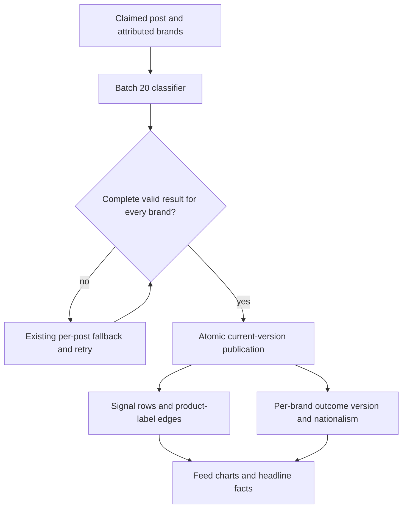
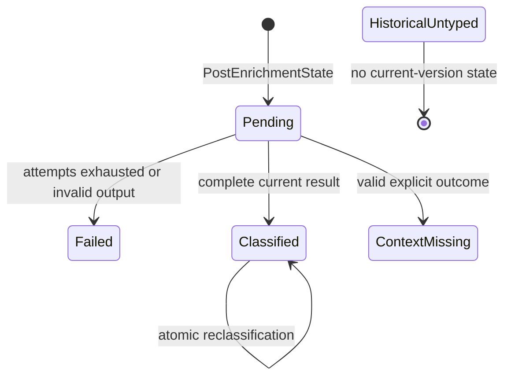
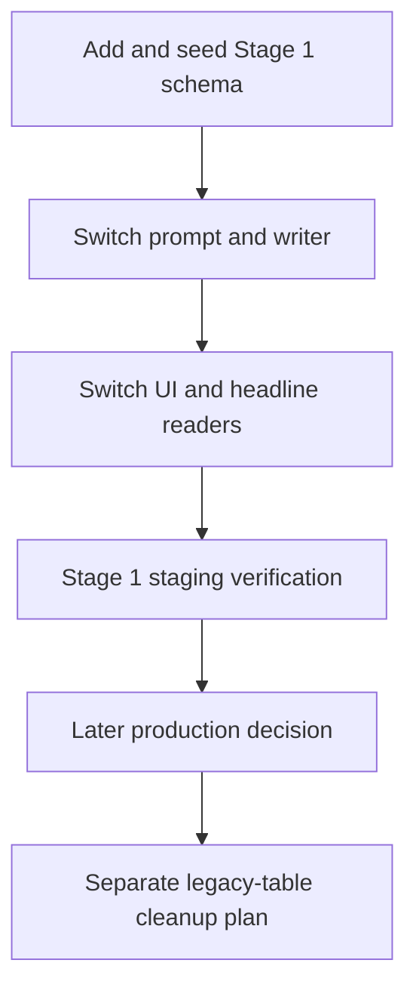

<!-- BEGIN OLLIJA DELIVERY GUIDE -->
## Ollija Delivery Guide

This block is generated guidance. Do not edit it directly. Correct durable facts in `.ollija/project.yaml` or this template, then rerun `ollija annotate-plan`. Put a user-directed exception in the editable Delivery Exceptions section below.

### Resolved locations

- Authoritative host: `fuchitalee`
- Authoritative repository: `/Users/fuchitalee/development/pushin-weight-v2`
- Ollija release worktree area: `/Users/fuchitalee/development/pushin-weight-v2/.worktrees`
- Active worktree: `/Users/fuchitalee/development/pushin-weight-v2/.worktrees/feat/ai-enrichment-stage1`
- Plan: `/Users/fuchitalee/development/pushin-weight-v2/.worktrees/feat/ai-enrichment-stage1/docs/plans/2026-09-08-134925-feat-ai-enrichment-stage1-plan.md`
- Change: `feat-ai-enrichment-stage1-2026-09-08-134925`
- Branch: `feat/ai-enrichment-stage1`
- Staging branch and blueprint: `staging`, `/Users/fuchitalee/development/pushin-weight-v2/.worktrees/feat/ai-enrichment-stage1/render-staging.yaml`
- Production branch and blueprint: `main`, `/Users/fuchitalee/development/pushin-weight-v2/.worktrees/feat/ai-enrichment-stage1/render.yaml`
- Staging URL: `https://pushinweight-staging-web.onrender.com`
- Production URL: `https://pushinweight-web.onrender.com`

### Placement

This worktree is inside the Ollija release worktree area. Reuse it for the whole change. Do not create a second worktree or plan for this branch.

### Delivery scope

- Workflow: `lfg`
- Delivery target: `staging`
- Owner selection recorded: `true`

1. Complete implementation and the plan's verification contract.
2. Run the configured focused checks:
   - `pytest tests/ollija`
3. The parent workflow commits only this plan's changes, pushes the feature branch, and records the candidate SHA.
4. Fetch the remote staging lane: `git fetch origin refs/heads/staging`.
5. Require the unchanged candidate SHA to be a fast-forward of that fetched remote ref, then push the exact candidate SHA to `refs/heads/staging` with the server-enforced fast-forward command `git push origin <candidate-sha>:refs/heads/staging`.
6. Verify the remote staging ref resolves to the candidate SHA and the Render deployment for `pushinweight-staging-web` reports that same SHA.
7. Run staging checks. Stop here if they fail.

### Failure handling

- Never promote a staging candidate whose automated checks failed.
- Implementation failures return to the parent implementation workflow for diagnosis, correction, recommit, and restaging.
- SSH, shell, environment, or multi-machine failures use the repository infra/multi-machine skill first.
- The change ledger is advisory; do not validate or enforce it.
- Never force-remove a worktree. Retain staging-only, failed, dirty, locked,
  noncanonical, or candidate-mismatched worktrees for diagnosis or later
  delivery.
- Do not run an endless retry loop or start a persistent Ollija process.
<!-- END OLLIJA DELIVERY GUIDE -->

## Delivery Exceptions

1. Stage 0 was promoted and verified in production at `af272b6fe0b43be3276429792508749b9ddc8194` across the web, harvest cron, and headline worker; PR 40 is merged. Its production fake-provider probe passed at `2026-09-08T13:51:51Z`, and web health passed. Preserve its provider telemetry fields and identity derivation, scheduling, retry, and call-cardinality behavior while implementing Stage 1. Stage 1 classifier and headline prompt changes receive new prompt identities rather than reusing old hashes.
2. The owner authorized Stage 1 development and staging delivery after Stage 0 production promotion. Stage 1 production promotion is not authorized.
3. Review the passive Stage 0 production telemetry window `2026-09-08T13:51:00Z` through `2026-09-08T15:21:00Z` before Stage 1 staging deployment. This is the owner-selected 90-minute window within the accepted 1–2 hour range. Development need not wait for the window to close.
4. Do not trigger a paid harvest or provider acceptance run merely to fill the baseline. Use naturally occurring production events and bounded offline fixtures. A later bounded real-label evaluation is a production activation gate, not evidence required to claim Stage 1 contract and staging readiness.
5. Retain the canonical Stage 1 worktree after staging. Production is unauthorized, so the generated production cleanup path does not apply.

# AI Enrichment Stage 1 Taxonomy Migration

## Goal Capsule

- **Objective:** Readers and lab operators can classify every newly enriched brand mention with the selected reader taxonomy and independent product signals without fabricated fallback judgments, while sentiment, nationalism, discovery, and headline behavior remain trustworthy.
- **Means:** Replace the active discourse dimension with a versioned per-brand classification contract, independent product-label relations, and coordinated writer/reader migration (KTD1–KTD7).
- **Authority:** This plan's Product Contract owns the complete Stage 1 product semantics carried from the owner-selected ideation. `docs/plans/2026-09-08-194415-feat-staged-ai-enrichment-roadmap-plan.md` owns the staged roadmap, and `docs/reference/2026-09-08-194415-enrichment-contracts.md` owns Stage 0 telemetry invariants and receives the bounded durable Stage 1 taxonomy excerpt in U1.
- **Execution profile:** U1 and U2 are one coupled authoring, verification, and commit packet owned by the same worker, with linear internal steps. U3 and U4 may run in parallel only after that combined packet commits. U5 reconciles cross-import and retired-caller compatibility before staging.
- **Stop conditions:** Stop for evidence that a settled ten-type or five-label decision is infeasible, a migration would relabel historical rows, a consumer cannot preserve nationalism without active discourse, or the Stage 0 baseline shows a material regression that Stage 1 would obscure.
- **Tail ownership:** The parent workflow owns commits, pushes, staging deployment, exact-SHA verification, and any later production authorization.

## Product Contract

### Summary

Stage 1 replaces the active six-type-plus-discourse classifier with the selected ten reader-facing post types and five independent product labels. Classification stays universal and per brand. The change preserves sentiment and both nationalism axes, removes discourse from current prompts, writes, feeds, filters, charts, and headline packets, and leaves historical rows intact.

Product Contract preservation: the selected taxonomy, label semantics, staged delivery, universal classification, and deferrals are unchanged from the owner-selected ideation and tracked roadmap. The ideation file was a planning input on the authoritative root and is not tracked in this worktree, so every implementation-relevant semantic is carried into R1–R18 and AE1–AE7 rather than left behind an unavailable citation. This plan resolves only the storage, parser, compatibility, and rollout mechanics required to implement them.

### Problem Frame

The production classifier asks for six post types, sentiment, discourse, and two nationalism axes. Its parsers silently turn missing or invalid types into `hands_on_usage`, its Django writer never removes stale type rows, and nationalism can be stored only through `PostBrandDiscourse`. Active feed and trend-narrative readers also join discourse directly. Those couplings would make a prompt-only taxonomy change fabricate labels, strand nationalism, and leave old discourse behavior active.

### Requirements

**Reader and product taxonomy**

- R1. The canonical post-type keys and display labels are `buzz_releases` / Releases & Updates, `hands_on_usage` / Hands-On Usage, `performance_comparisons` / Results and Evaluations, `feedback_questions` / Questions & Requests, `advertising_marketing` / Advertising & Marketing, `event_announcement` / Events & Opportunities, `opinions_reactions` / Opinions & Reactions, `research_explanations` / Research & Explanations, `business_finance` / Business & Finance, and `other` / Other.
- R2. Post types are independent per brand and may contain every supported type justified by the post. The contract imposes no arbitrary count cap. Duplicate values are removed, and `other` is valid only as an exclusive confident residual judgment.
- R3. Product-label keys are `bug`, `complaint`, `testimonial`, `product_request`, and `misinformation`, with display labels Bug, Complaint, Testimonial, Ideas & requests, and Misinformation. Labels are independent per brand; zero, one, or several may be valid.
- R4. The type rules use the final boundaries represented by this Product Contract and its acceptance examples, including experience/results redistribution, genuine questions and requests, concrete events and opportunities, event recaps with substantive occasion outcomes, and available quote or locally persisted parent context. Brand relevance, truth, usefulness, and priority remain separate judgments.

**State, preservation, and failure semantics**

- R5. A `classified` outcome requires one existing four-value sentiment per brand. A `context_missing` outcome may retain an independently supported valid sentiment or nationalism judgment, but stores null for any unknown scalar rather than fabricating a value or type. China and US nationalism retain the existing six-value vocabulary, where explicit `none` is a judgment and null means unknown or unavailable.
- R6. Discourse is absent from the active classifier request and response, new persistence writes, public and protected UI controls, chart families, and headline inputs. No posture, sincerity, or substitute discourse taxonomy is introduced.
- R7. Each newly processed post-brand records classification contract, taxonomy, and prompt versions; model identity; a non-reversible input/context fingerprint; source language; and one semantic outcome: `classified` or `context_missing`. Pending and failed transport/parser work remains owned by `PostEnrichmentState`; malformed or incomplete provider output is a retryable/failing operation, not a persisted model judgment. Persist no raw prompt or added context in this state.
- R8. A current-version `classified` outcome plus a stored `other` row is the only representation of Other. No current-version state means historical-untyped; `context_missing`, pending, failed, invalid, and historical-untyped must remain distinguishable from Other.
- R9. A post is classification-complete only when every expected attributed brand has a valid `classified` or `context_missing` result. Product-label emptiness is valid. Missing brands, unknown keys, illegal `other` combinations, or incomplete required dimensions use existing batch-to-per-post fallback and retry/failure handling without partial current-version publication.
- R10. New post-brand type, product-label, sentiment, nationalism, outcome, and version rows replace that post-brand's prior current classification atomically. Reclassification cannot leave stale type or product rows. Current sentiment is owned by the per-brand state; the required legacy sentiment column on each classified `PostBrandSignal` edge mirrors the same value until a later cleanup.

**Compatibility and reader behavior**

- R11. Stage 1 does not relabel historical posts, manufacture missing discourse, or copy an arbitrary nationalism value from conflicting legacy rows. The first release retains discourse tables read-only and may use them only as a historical nationalism fallback when no current-version state exists.
- R12. Feeds, charts, filters, and trend narratives continue to include all otherwise eligible posts. Product-label emptiness and absent current-version classification do not remove a post from discovery.
- R13. Existing UI layout and navigation remain intact. Replace discourse controls and badges with the new product-label family, expose all ten post types with localized current-surface labels, preserve the existing nationalism lens, and avoid unrelated page redesign.
- R14. Headline facts, evidence selection, and rank/editor prompts stop consuming discourse. Post-type diversity may occupy the existing deterministic diversity role, and product labels may be passed as explicitly scoped metadata; `misinformation` never asserts that a claim is false.

**Operational invariants and evaluation**

- R15. Preserve collection policy, the 15-minute production schedule, classifier batches of 20, production `max_workers=3`, provider/model configuration, retry and per-post fallback behavior, universal classification, and all Stage 0 transport telemetry fields and cardinality. Stage 1 adds no recurring LLM call.
- R16. Deterministic synthetic fixtures prove schema, parser, state, context, and compatibility contracts but are labeled non-gold. The 599-post analyst material remains calibration evidence and cannot support an accuracy claim.
- R17. After the prompt and taxonomy version freeze, assess a fresh provenance-bearing heldout cohort offline from stored candidate output. The assessment covers all ten types, five product labels, empty/multiple labels, `other`, sentiment, nationalism `none` versus unknown, EN/ZH-CN/JA source text, quote/local-parent context, and context-missing cases. Numeric semantic floors are set from cohort size and adjudicated baseline before any Stage 1 production proposal.
- R18. Stage 1 staging deployment requires the passive 90-minute Stage 0 baseline review, the fixed-cohort latest-20 production health observation, migration and data-integrity proof, contract tests, real browser proof, headline regression proof, and exact-SHA staging health. Staging verification may establish contract readiness but must not claim real classifier accuracy before R17 is complete.

### Key Decisions

- **The final ten post types supersede every earlier taxonomy variant.** Governs R1, R2, R4. (session-settled: user-directed — chosen over earlier variants because the final selection is the desired reader organization.)
- **Product Ideas and requests remain one independent label.** Governs R3. (session-settled: user-directed — chosen over separate idea/request labels because the distinction does not justify classifier complexity.)
- **Discourse is removed while sentiment and nationalism remain.** Governs R5, R6, R11, R14. (session-settled: user-directed — chosen over a replacement posture/sincerity taxonomy because no replacement was selected.)
- **Classification and needed translation remain universal.** Governs R9, R12, R15. (session-settled: user-directed — chosen over classifying only synthesized or product-labeled posts because discovery and charts require all posts.)
- **Stages ship separately.** Governs R18. (session-settled: user-approved — chosen over a combined mega-refactor for causal verification and rollback.)

### Acceptance Examples

- AE1. Covers R2, R3, R10. A brand-specific post reporting a failure and asking for help may store Results and Evaluations plus Questions & Requests, and Bug plus Complaint; a later valid result with only Questions & Requests removes the stale Result, Bug, and Complaint rows.
- AE2. Covers R2, R7, R8. A complete current response that fits no defined type stores only `other` with outcome `classified`; a legacy row with no current version and a new reply lacking necessary context display as historical-untyped and context-missing respectively, never Other.
- AE3. Covers R5, R9. Explicit nationalism `none` persists the `none` key, while an absent or invalid nationalism field makes the operation incomplete and never silently writes `none`.
- AE4. Covers R4, R7. An event recap with a named occasion and concrete outcomes may be Events & Opportunities. A vague reply saying “see you there” uses a stored parent or quote when available and becomes context-missing when that context is absent.
- AE5. Covers R3, R14. A post may carry `misinformation` as a review signal, while headline text and UI labels describe it as potentially misleading rather than confirmed falsehood.
- AE6. Covers R11–R13. A historical post with nationalism only on a discourse row remains filterable by nationalism after cutover, but no discourse pill, chart tab, feed badge, or headline field is rendered.
- AE7. Covers R9, R15. A malformed batch result falls back per post through existing retry boundaries; no partial current-version rows become visible and Stage 0 emits one event per application transport invocation.

### Scope Boundaries

**Included in Stage 1**

- The active Django/PostgreSQL classifier contract, schema, writer, feed/filter/chart readers, trend-narrative readers, localized labels, and focused retired-caller compatibility.
- Deterministic contract fixtures, a frozen-cohort evaluation format, regression coverage, passive baseline review, and staging-only delivery.

**Deferred to follow-up work**

- Stage 1 production promotion and its numeric real-label quality decision.
- Dropping `PostBrandDiscourse`, discourse lookup/label models, legacy indexes, or historical discourse data after the compatibility window.
- Historical taxonomy relabeling, broad nationalism backfill, or repair of the pre-existing missing-discourse population.
- Model swaps, conditional critics, specialist cascades, headline demand policy, split translation/synthesis modules, lazy synthesis, and EN/ZH-CN/JA synthesis parity.
- Broad summary, navigation, or page redesign; product-label prioritization or response workflows; truth adjudication for misinformation.

---

## Planning Contract

### Key Technical Decisions

- KTD1. **Use a strict versioned per-brand result.** The active result contains deduplicated `post_types`, independent `product_labels`, scalar sentiment, nullable nationalism axes, and an explicit semantic outcome. It accepts every supported type rather than inheriting the old prompt's cap. This implements R1–R9 without a generic dimension framework.
- KTD2. **Add one classification-state table and one product-label junction.** `PostBrandClassificationState` owns `(post, brand)`, contract/prompt/taxonomy versions, model and source-language identity, a non-reversible input/context fingerprint, outcome, nullable sentiment, and nullable China/US nationalism. `ProductLabelKey`, `ProductLabelLabel`, and `PostBrandProductLabel` own the five-label vocabulary and multi-label edges. `PostBrandSignal` remains the type-edge store and mirrors the classified sentiment in its required legacy column; `PostEnrichmentState` remains the post-level attempt state.
- KTD3. **Publish a complete post atomically.** Validate every expected brand before replacing its current rows. Within one database transaction, replace exact type and product-label sets, upsert state and nationalism, and mark `PostEnrichmentState` succeeded only after the complete post commits. This prevents stale and partial results under R9 and R10.
- KTD4. **Keep legacy discourse data as read-only compatibility state.** Stop new discourse writes immediately and use one bounded shared reader for current state plus historical fallback. Current sentiment and nationalism come from `PostBrandClassificationState`; historical-untyped values fall back only when legacy rows have one distinct non-null value per scalar. Zero or conflicting values remain unknown. Do not copy or collapse conflicts in the first release.
- KTD5. **Use one canonical prompt and context envelope.** Batch and single-post fallback share the same taxonomy definition. Inputs may add stored quote text and locally available parent text with provenance markers; they never fetch a parent, link, or media during classification. The prompt removes discourse and preserves the existing provider route, batching, token budget, and retry envelope.
- KTD6. **Replace discourse-dependent headline diversity with post-type diversity.** Keep the existing deterministic candidate slots and provider-call topology. Product labels enter packets only as scoped metadata, and coverage/status rules prevent claims from unavailable classifications.
- KTD7. **Use expand-and-cut-over staging delivery.** The migration creates and seeds new tables and keys before the new writer/readers run. The first release retains old tables so older data remains readable and rollback is a normal forward application revert. Destructive schema cleanup requires a later plan and production authorization.

### High-Level Technical Design

The active data flow has one strict publication boundary:

Classification state stays explicit across current and historical data:

The compatibility window separates additive deployment from destructive cleanup:

### Port, Exclude, and Defer Map

| Disposition | Files or surfaces | Stage 1 treatment |
| --- | --- | --- |
| Port | `x_monitor/attribution.py`, `monitor/cycle.py`, `core/models.py`, `core/migrations/`, `core/classification_labels.py`, `core/management/commands/seed_i18n_labels.py` | Implement the current classifier, schema, labels, and atomic Django writer. |
| Port | `monitor/views.py`, `monitor/templates/monitor/`, relevant `monitor/static/` filter/feed/chart modules | Replace visible discourse with product labels and preserve nationalism in existing layouts. |
| Port | `monitor/trend_narrative_candidates.py`, `monitor/trend_narrative_facts.py`, `monitor/trend_narrative_evaluation.py`, `monitor/trend_narrative_generation.py` | Remove discourse facts/prompts and preserve deterministic headline behavior through post-type diversity. |
| Compatibility only | `x_monitor/run.py` | Accept the shared result without attempting a discourse write; do not add product storage to the retired SQLite path. |
| Exclude | `x_monitor/store.py`, `x_monitor/_home_routes.py`, `x_monitor/dashboard.py`, `x_monitor/__main__.py`, `x_monitor/translator.py` | Retired SQLite/Flask or unaffected translation surfaces receive no Stage 1 feature port or writes. Preserve shared imports and Stage 0 telemetry. |
| Defer | `PostBrandDiscourse`, `DiscourseKey`, `DiscourseLabel`, their indexes/migration removal, and retired UI/data cleanup | Keep historical storage readable during the compatibility window; remove only under a later cleanup plan. |

### Sequencing and Parallel Ownership

U1 freezes the result and fixture contract, then U2 adds the schema and active writer. Because the current cycle consumes the legacy parser shape, one worker owns both units as a single authoring, verification, and commit packet; there is no intermediate U1 commit or candidate. U3 and U4 depend on that committed combined packet and may then proceed concurrently because they own disjoint reader surfaces. U5 owns all cross-import reconciliation, the compatibility-only `x_monitor.run` adjustment, regression aggregation, baseline gate, and staging evidence. No unit edits another unit's primary files without routing the conflict through U5.

---

## Implementation Units

### U1. Freeze the taxonomy, context, and parser contract

- **Goal:** Produce one canonical Stage 1 prompt/result contract that cannot fabricate a classification.
- **Requirements:** R1–R9, R15–R17; KTD1 and KTD5.
- **Dependencies:** None.
- **Files:** `x_monitor/attribution.py`; `docs/reference/2026-09-08-194415-enrichment-contracts.md`; `tests/fixtures/classification_stage1_contract_v1.json`; `tests/test_classify_pragmatics_full_prompt.py`; `tests/test_classify_pragmatics_full.py`; `tests/test_classify_pragmatics_full_arrays.py`; `tests/test_classify_batch_pragmatics_full.py`; `tests/test_classification_stage1_contract.py`.
- **Approach:**
  1. Define the ten keys, five product labels, sentiment, nullable nationalism, and outcomes once and make both batch and per-post fallback prompt builders use that definition.
  2. Include source text, stored quote text, and locally persisted parent text only when available, with explicit context provenance. Preserve input order and the existing list of attributed brands.
  3. Validate all expected brands and dimensions before returning a publishable result. Remove `hands_on_usage`, `neutral`, and nationalism `none` coercions for missing or unknown values; invalid responses enter existing fallback/failure handling.
  4. Preserve multi-type and multi-product arrays without a count cap, remove duplicates, enforce exclusive `other`, and represent `context_missing` without classification rows.
  5. Version the prompt/taxonomy identity without changing Stage 0 telemetry ownership, provider selection, batches, workers, token budget, or retries.
  6. Copy the bounded R1–R9 taxonomy, label, context, and state semantics into the tracked enrichment contract so implementers do not depend on the untracked planning source.
- **Execution note:** Add characterization coverage for batch/fallback cardinality and output alignment before changing the shared parser.
- **Commit note:** U1 is not independently commit-ready because its result shape would make the current writer silently omit signals. The same worker must complete, verify, and commit U1 together with U2, without a transitional duplicate prompt or compatibility default.
- **Patterns to follow:** `_PRAGMATICS_FULL_SYSTEM_PROMPT`, `build_batch_pragmatics_full_prompt`, `_classify_one_batch_to_by_brand`, `classify_batch_pragmatics_full`, and the Stage 0 fake direct-HTTP caller tests.
- **Test scenarios:**
  - All ten types and five product labels parse from exact keys, remain per brand, deduplicate, and preserve valid overlaps.
  - Empty product labels succeed; `other` alone succeeds; `other` plus another type is invalid and invokes fallback/failure.
  - Missing, unknown, wrong-type, or incomplete required fields never become Hands-On Usage, neutral, nationalism none, or Other.
  - A complete explicit `context_missing` result publishes no type/product rows but remains distinguishable from parser invalidity.
  - Stored quote and local-parent context appear with correct provenance; absent context causes no network lookup and can support `context_missing`.
  - A multi-post batch failure retains current three-attempt and per-post fallback counts, result ordering, model/config, and one telemetry event per application invocation.
  - Synthetic fixture rows declare non-gold provenance, and analyst calibration records cannot be loaded as heldout truth.
- **Verification:** One canonical contract drives both call modes; every malformed case fails closed; provider and telemetry regression assertions remain unchanged.

### U2. Add versioned storage and atomically cut over the Django writer

- **Goal:** Persist current Stage 1 judgments without coupling nationalism to discourse or leaving stale labels.
- **Requirements:** R1–R3, R5–R12, R15; KTD2–KTD4 and KTD7.
- **Dependencies:** U1.
- **Files:** `core/models.py`; `core/migrations/0028_ai_enrichment_stage1_taxonomy.py`; `core/classification_labels.py`; `core/classification_readers.py`; `core/management/commands/seed_i18n_labels.py`; `monitor/cycle.py`; `tests/test_classification_labels.py`; `tests/test_classification_readers.py`; `tests/test_migration_028_ai_enrichment_stage1_taxonomy.py`; `tests/test_run_post_fetch.py`; `tests/test_provider_telemetry_call_chain.py`.
- **Approach:**
  1. Add and index the per-brand classification state, product-label vocabulary/labels, and post-brand product edge from KTD2. Seed all ten type keys and five product keys during migration, and keep the idempotent management command aligned for current EN/ZH-CN surfaces.
  2. Leave discourse models and rows intact. Add no data migration that infers current versions, new types, product labels, context outcomes, nationalism, or completion identity.
  3. Build classification inputs from claimed `PostEnrichmentState` rows and add bounded local quote/parent context without changing collection.
  4. Validate the complete post result, then replace type and product rows and upsert per-brand state, sentiment, and nationalism in one transaction. Mirror a classified state's sentiment onto each required legacy signal column. Context-missing writes no type/product edge and may keep independently supported state sentiment/nationalism while leaving unknown scalars null. Do not mark post-level success before commit.
  5. Stop all new `PostBrandDiscourse` writes, retain legacy rows untouched, and replace misleading discourse counters with classification counters while keeping any operator-facing compatibility alias clearly labeled.
  6. Add one bounded reader helper for current-state sentiment/nationalism precedence and historical-untyped unique-value fallback. U3 and U4 consume this helper rather than duplicating conflict rules; it is not a generalized classification-axis framework.
- **Execution note:** Prove migration reversibility and atomic failure behavior before switching the writer.
- **Commit note:** Commit only the verified U1+U2 packet; do not expose the new parser shape to the old cycle writer at any intermediate branch head.
- **Patterns to follow:** Django composite-key models in `core/models.py`, additive migrations in `core/migrations/`, `CycleRunner._run_post_fetch`, and `_finish_enrichment_stage` claim ownership.
- **Test scenarios:**
  - A valid multi-brand result creates exact state, signal, product, sentiment, and nationalism rows for every brand and marks the post succeeded after commit; every type edge mirrors its state's sentiment.
  - Reclassifying a brand with fewer types/labels removes stale rows and leaves other brands untouched.
  - Explicit nationalism `none` stores the key; unknown remains null; no discourse row is created or modified.
  - Empty product labels and context-missing are successful semantic outcomes; context-missing stores no type/product edge and preserves only independently valid state sentiment/nationalism, while missing expected brands and invalid values keep the post pending/failed through existing policy with no partial current publication.
  - A forced database error rolls back every Stage 1 row and leaves `PostEnrichmentState` retryable.
  - The shared reader prefers current state, accepts one distinct historical fallback value, returns unknown for zero/conflicting legacy values, and reports conflicts without changing stored rows.
  - Migration forward creates and seeds exact keys/labels/indexes without changing existing discourse/signal rows. Reverse is exercised only on an empty disposable pre-publication database, preserves shared post-type keys, and is not represented as a safe rollback after Stage 1 rows exist.
  - The true `CycleRunner` factory path preserves batch 20, three workers, model/provider routing, retries, and Stage 0 event cardinality.
- **Verification:** Fresh and existing PostgreSQL test databases migrate cleanly; writer rows match the complete validated result exactly; no production database or provider is contacted.

### U3. Replace discourse with product labels across existing feed and chart UI

- **Goal:** Make the current public and protected reader surfaces display and filter the selected taxonomy without changing their layout or access rules.
- **Requirements:** R1–R3, R5–R8, R11–R13, R18; KTD2 and KTD4.
- **Dependencies:** U1 and U2.
- **Files:** `monitor/views.py`; `monitor/templates/monitor/home.html`; `monitor/templates/monitor/home_internal.html`; `monitor/templates/monitor/brand_home.html`; `monitor/templates/monitor/_feed_initial_v22.html`; `monitor/templates/monitor/_feed_initial_legacy.html`; `monitor/static/pw-filter-store.js`; `monitor/static/pw-filter-pills.js`; `monitor/static/pw-feed.js`; `monitor/static/pw-brand-chart.js`; `monitor/static/pw-chart.js`; `monitor/static/pw-locale-toggle.js`; `monitor/static/pw-icons.js`; `monitor/static/home-v20.css`; `monitor/static/dashboard.css`; `tests/fixtures/ui_assurance/declaration.json`; `tests/fixtures/ui_assurance/data.json`; `tests/golden/v22_mockup_fixture.json`; `tests/test_home_v22_filter_pills.py`; `tests/test_home_v22_feed_row_shape.py`; `tests/test_feed_page.py`; `tests/test_views.py`; `tests/test_home_v22_browser.py`; `tests/test_ui_assurance_browser.py`.
- **Approach:**
  1. Update label catalogs, server filter families, feed payloads, and chart datasets for ten post types and five product labels; remove discourse from serialized UI state and visible controls.
  2. Read current sentiment and nationalism from the new state. For historical-untyped rows only, use a legacy sentiment or nationalism axis when its rows have one distinct non-null value; treat zero or conflicting distinct values as unknown and count conflicts for review.
  3. Replace the existing discourse control/badge/chart slot with product labels while preserving control order, nationalism lens, anonymous `/`, protected `/internal/` and brand routes, locale toggle, and responsive layout.
  4. Use distinct post IDs and pre-aggregated relations so joining multiple types and product labels cannot multiply counts or duplicate feed rows.
  5. Update the Bridgewright declarations and deterministic fixtures as product-contract changes, not as looser expectations.
- **Execution note:** Follow `.claude/skills/fix-ui/SKILL.md`: pin the real URL-to-browser behavior first and run affected assurance before editing visible output.
- **Patterns to follow:** `core/classification_readers.py`, `_dashboard_filter_entries`, `_load_feed_classifications`, `_post_matches_filters`, existing post-type multi-select controls, and the `pw-filter-store.js` reducer contract.
- **Test scenarios:**
  - Anonymous English and Chinese public pages render all ten localized types and five product labels, render no discourse control or badge, and preserve nationalism controls.
  - Product-label filtering supports one and several selected labels; posts with an empty label set remain visible under the all/default state.
  - Multi-type and multi-product posts appear once and chart/feed counts use distinct posts rather than relation products.
  - Current explicit Other, context-missing, failed, pending, and historical-untyped states render distinctly without assigning a false type.
  - Current nationalism and unambiguous historical fallback filter correctly; conflicting legacy values never become a chosen nationalism judgment.
  - Public, internal, and brand-page filter state round-trips through JavaScript without stale discourse keys; locale switching preserves selections.
  - Real browser assurance proves controls are visible, interactive, reversible, and nonzero geometry with zero required skips/errors.
- **Verification:** Server-rendered and runtime feed paths agree on keys and labels; affected and candidate Bridgewright obligations pass; screenshots or DOM assertions show only the requested taxonomy substitution.

### U4. Remove discourse from headline facts and prompts

- **Goal:** Preserve headline generation and evidence quality using the current call graph without discourse-derived facts or ranking.
- **Requirements:** R5–R7, R11, R12, R14, R15, R18; KTD4 and KTD6.
- **Dependencies:** U1 and U2.
- **Files:** `monitor/trend_narrative_candidates.py`; `monitor/trend_narrative_facts.py`; `monitor/trend_narrative_evaluation.py`; `monitor/trend_narrative_generation.py`; `tests/fixtures/trend_narrative_co_dominance_v1.json`; `tests/test_trend_narrative_candidates.py`; `tests/test_trend_narrative_facts.py`; `tests/test_trend_narrative_evaluation.py`; `tests/test_trend_narrative_projection.py`; `tests/test_trend_narrative_orchestration.py`.
- **Approach:**
  1. Remove discourse vocabulary, counts, dominant labels, evidence arrays, coverage families, and prompt instructions from active trend snapshots and closed provider packets.
  2. Reuse post-type coverage and diversity for the deterministic evidence slot previously influenced by discourse; do not add a new classifier dimension or provider call.
  3. Read nationalism from current state with the same historical-only fallback as U3. Add product-label facts only with explicit coverage and semantic wording that keeps Misinformation provisional.
  4. Preserve snapshot immutability, fingerprints, work slots, last-good fallback, provider-call entitlements, rank/editor/critic batch sizes, and current telemetry/ledger identity.
  5. Update rank/editor prompts so unavailable or partial classification cannot support taxonomy claims and raw post content remains untrusted evidence.
- **Execution note:** Characterize candidate ordering, provider packets, and last-good behavior before removing discourse fields.
- **Patterns to follow:** `core/classification_readers.py`, `_metadata_taxonomy`, `_metadata_counts`, candidate evidence streams, closed projection schemas, `RANK_SYSTEM_PROMPT_V1`, and `EDITOR_SYSTEM_PROMPT_V2`.
- **Test scenarios:**
  - Snapshots and provider packets contain post types, sentiment, nationalism, and scoped product labels but no discourse family or role.
  - Post-type diversity preserves deterministic ordering and bounded evidence when discourse rows exist historically, are absent, or conflict.
  - Product-label coverage is partial/unavailable when classification is incomplete, and Misinformation cannot become an asserted factual conclusion.
  - Existing visible/last-good results survive a held or failed new run; work-slot, fingerprint, and provider-call counts do not change.
  - New and historical nationalism use the same precedence as feeds without duplicate counts from multiple relations.
  - Rank/editor/critic prompts receive no discourse text and retain prompt-injection, numeric ownership, bilingual, and evidence-coverage safeguards.
- **Verification:** Existing headline lifecycle tests pass with unchanged provider-call topology; serialized snapshots and packets have no active discourse field.

### U5. Reconcile shared callers, evaluate contracts, and verify staging readiness

- **Goal:** Close cross-unit drift, preserve the retired caller boundary, and produce a reviewable Stage 1 staging receipt.
- **Requirements:** R9–R18; KTD3–KTD7.
- **Dependencies:** U1–U4.
- **Files:** `x_monitor/run.py`; `.claude/skills/harvester-latest-n-health-check/scripts/check.py`; `scripts/post_fetch_smoketest.py`; `tests/test_run.py`; `tests/test_run_pipeline_live_wiring.py`; `tests/regression_net.py`; `tests/test_post_fetch_smoketest.py`; `tests/test_post_fetch_smoketest_renderer.py`; `tests/test_harvester_latest_n_health_check.py`; `tests/test_classification_stage1_contract.py`; `docs/analysis/2026-09-08-134925-ai-enrichment-stage1-evaluation.md`; `docs/analysis/2026-09-08-134925-ai-enrichment-stage1-staging.md`; `docs/plans/2026-09-08-134925-feat-ai-enrichment-stage1-plan.md`.
- **Approach:**
  1. Adjust only the retired `x_monitor.run` shared-result adapter so it accepts the Stage 1 result without indexing or writing discourse. Do not add product-label schema, migrations, or writes to legacy SQLite modules.
  2. Audit imports, SQL, templates, JavaScript state, fixtures, prompts, and active tests for stale discourse dependencies. Classify every remaining occurrence using the Port/Exclude/Defer map rather than global deletion.
  3. Reconcile shared taxonomy constants and result shapes across U1–U4, with one source per rule and no compatibility default that fabricates a judgment.
  4. Run the deterministic contract evaluator from stored JSON. Record schema and boundary results separately from the future adjudicated heldout quality assessment.
  5. Review the passive Stage 0 telemetry window before staging. Compare observed classifier usage, invocation counts, errors, and latency without treating unknowns as zero or tiny samples as percentiles.
  6. Make latest-N and post-fetch diagnostics schema-aware: use the current state, type/product labels, sentiment, and nationalism after Stage 1 schema exists, while retaining a safe legacy query before those tables exist. A successful Stage 1 row without discourse must not be diagnosed as unhealthy.
  7. After local regression checks and before staging, capture the literal latest 20 production posts in exact order, retain their IDs, wait 30 minutes, and recheck those same IDs once. Do not substitute a new cohort or retry the observation. Record attribution, enrichment state, and the pre-existing missing-discourse condition as Stage 0 production health evidence, not Stage 1 semantic proof.
  8. Execute migration, focused PostgreSQL, headline, UI browser/Bridgewright, Stage 0 telemetry, and aggregate regression gates; then record exact candidate SHA, staging deploy SHA, health, migration state, and observed limitations. Run Stage 1 table diagnostics only after the staging migration exists; never query nonexistent Stage 1 tables in production before deployment.
- **Execution note:** This is the sole reconciliation unit. Resolve cross-import conflicts here after the component owners finish; do not let parallel units silently edit each other's files.
- **Patterns to follow:** `tests/regression_net.py`, Stage 0 true-caller telemetry tests, `docs/analysis/2026-09-08-194415-enrichment-stage0-baseline.md`, and the generated Ollija staging guide.
- **Test scenarios:**
  - The retired run adapter handles classified, context-missing, and invalid shared results without discourse writes or new legacy schema.
  - Repository audit finds no active Django UI/headline prompt, write, filter, or packet dependence on discourse; retained model/migration/retired references match the disposition table.
  - Health and smoke diagnostics choose the legacy query before Stage 1 schema exists and the current-version query afterward; a valid discourse-free Stage 1 classification reports healthy.
  - Aggregate tests prove collection scheduling, batch/workers, provider routes, retries, fallback, telemetry cardinality/privacy, and headline call entitlements remain unchanged.
  - Offline contract evaluation reports 100% structural validity and zero invalid-to-fallback coercions without labeling synthetic or analyst cases as gold.
  - The baseline receipt contains a bounded 1–2 hour production window and reports observed role usage/latency/errors plus explicit unknowns; material unexplained regression blocks staging.
  - The latest-20 receipt preserves one ordered production cohort across the 30-minute recheck, performs no substitution or retry, and distinguishes existing missing-discourse rows from new failures.
  - Exact candidate SHA staging deployment passes web health, migration checks, deterministic feed/filter/headline probes, and required browser obligations without a paid harvest trigger.
- **Verification:** All five unit contracts agree; required tests execute with zero skips/errors; the staging receipt separates deterministic contract proof from unmeasured semantic accuracy and confirms no production promotion occurred.

---

## Verification Contract

| Gate | Applies to | Required evidence |
| --- | --- | --- |
| Schema and Django integrity | U2, U3 | `python manage.py makemigrations --check --dry-run`, migration forward tests, an empty disposable pre-publication reverse proof, `python manage.py check --deploy`, and focused PostgreSQL tests. Post-publication rollback retains migrations and data. |
| Classifier contract | U1, U2 | Focused prompt/parser/batch/cycle suites prove exact keys, state semantics, atomic replacement, real factory wiring, retry/fallback counts, and no paid provider call. |
| Headline regression | U4 | Candidate/facts/evaluation/projection/orchestration suites prove closed packet schemas, deterministic evidence, unchanged provider-call topology, and last-good behavior. |
| UI behavior | U3 | URL/view/template tests plus Bridgewright affected and candidate gates from `.claude/skills/fix-ui/SKILL.md`; every required obligation executes with zero failed, skipped, errored, missing, or unknown results. |
| Stage 0 invariants | U1, U2, U4, U5 | Existing provider telemetry call-chain tests retain role/model/provider host, one-event-per-application-invocation cardinality, privacy, retries, and nullable usage semantics. |
| Reconciliation and aggregate | U5 | Scoped Ruff on changed Python, `pytest tests/ollija`, the impacted regression manifest, and the repository's aggregate Django test suite. Project-wide pre-existing lint debt is reported separately rather than waived or attributed to Stage 1. |
| Offline evaluation | U1, U5 | Stored fixture/candidate JSON yields 100% contract validity and zero fabricated defaults. Fresh heldout gold assessment and numeric semantic floors are recorded before any production proposal. |
| Staging delivery | U5 | Passive baseline reviewed; remote staging and Render report the unchanged candidate SHA; migrations and web health pass; deterministic UI/headline probes pass; no manual paid harvest is required. |
| Latest-N production health | U5 | Before staging, capture the literal latest 20 production IDs in order and recheck the identical cohort once after 30 minutes. No substitution, retry, production write, or semantic-accuracy claim is allowed; existing missing-discourse evidence stays labeled as pre-existing. |

### Preproduction Quality Gate

The frozen heldout cohort is adjudicated only after the prompt, taxonomy version, and context envelope are fixed. Record cohort selection, source/context provenance, adjudication method, per-label support, disagreements, and multi-label metrics. Choose numeric type, product-label, sentiment, and nationalism floors only when sample support makes them meaningful. A missing or under-supported label remains an explicit evaluation gap and blocks a Stage 1 production recommendation; it does not block contract implementation or staging verification.

### Rollback and Data Safety

The first release is additive at the database layer. Rollback is application-only: deploy the prior application against retained legacy tables and leave Stage 1 migrations, shared keys, and data in place. It does not reverse production migrations, relabel posts, force-push, or resume a retired service. A forward fix may reprocess only explicitly authorized posts. Historical discourse stays available until a later cleanup plan proves every active reader and rollback window no longer needs it.

---

## Definition of Done

- U1: One versioned, discourse-free classifier contract covers the final ten types, five product labels, context provenance, strict parsing, and deterministic non-gold fixtures.
- U2: Additive schema and seed migration work on fresh and existing databases; the production Django writer publishes complete per-brand results atomically and never writes discourse or stale rows.
- U3: Public, internal, and brand reader surfaces replace discourse with product labels, preserve nationalism and discoverability, and pass real browser assurance in supported current locales without layout redesign.
- U4: Headline facts, evidence selection, packet schemas, and prompts contain no active discourse dependency and preserve current queue, ledger, last-good, fingerprint, and provider-call behavior.
- U5: Shared callers and constants are reconciled, the retired SQLite path receives no feature port or write, contract and aggregate gates pass with required execution counts, and the passive baseline plus exact-SHA staging receipt are recorded.
- The implementation contains no abandoned prompt variants, temporary adapters beyond the named retired-caller compatibility seam, duplicate taxonomy sources, dead migrations, or test-only product behavior.
- Stage 1 production remains unpromoted. Any production proposal cites the separately completed heldout semantic-quality assessment and receives explicit owner authorization.

---

## Sources and Research

- `docs/plans/2026-09-08-194415-feat-staged-ai-enrichment-roadmap-plan.md` — staged sequence, settled decisions, Stage 0 boundaries, and later-stage deferrals.
- `docs/reference/2026-09-08-194415-enrichment-contracts.md` — Stage 0 telemetry and semantic-state boundary contract.
- `docs/analysis/2026-09-08-194415-enrichment-stage0-baseline.md` — pre-instrumentation baseline and unknown-spend discipline.
- `core/models.py`, `monitor/cycle.py`, `x_monitor/attribution.py`, `monitor/views.py`, and `monitor/trend_narrative_candidates.py` — current schema, writer, parser defaults, active feed, and headline discourse coupling.

## Confidence and Review State

Planning confidence is high for the active call chain, schema boundaries, consumer inventory, and staged compatibility design because each is grounded in current production code and the completed Stage 0/taxonomy audits. Confidence is medium for real semantic quality and production economics because the frozen adjudicated cohort and Stage 0 production window are not yet complete. Those gaps are explicit staging/production gates and do not make the Stage 1 implementation contract ambiguous.

The confidence check strengthened the state model, shared historical fallback, coupled U1/U2 commit boundary, health diagnostics, migration rollback, and latest-N proof. The plan contains one diagram each for the data flow, classification state lifecycle, and rollout sequence; all feature-bearing units have concrete files, failure cases, integration proof, and observable completion criteria.

Independent non-interactive document review on 2026-09-08 found four material issues: stale Ollija delivery guidance, an unavailable ideation citation, no sentiment home for context-missing, and unsafe post-publication reverse-migration wording. All were resolved in place. The parent additionally required one U1/U2 commit packet and one shared current-versus-historical reader; both are now explicit. No settled decision was invalidated, and no actionable review finding remains.
