<!-- BEGIN OLLIJA DELIVERY GUIDE -->
## Ollija Delivery Guide

This block is generated guidance. Do not edit it directly. Correct durable facts in `.ollija/project.yaml` or this template, then rerun `ollija annotate-plan`. Put a user-directed exception in the editable Delivery Exceptions section below.

### Resolved locations

- Authoritative host: `fuchitalee`
- Authoritative repository: `/Users/fuchitalee/development/pushin-weight-v2`
- Ollija release worktree area: `/Users/fuchitalee/development/pushin-weight-v2/.worktrees`
- Active worktree: `/Users/fuchitalee/development/pushin-weight-v2/.worktrees/feat/ai-enrichment-stage1`
- Plan: `/Users/fuchitalee/development/pushin-weight-v2/.worktrees/feat/ai-enrichment-stage1/docs/plans/2026-09-08-134925-feat-ai-enrichment-stage1-plan.md`
- Change: `feat-ai-enrichment-stage1-2026-09-08-134925`
- Branch: `feat/ai-enrichment-stage1`
- Staging branch and blueprint: `staging`, `/Users/fuchitalee/development/pushin-weight-v2/.worktrees/feat/ai-enrichment-stage1/render-staging.yaml`
- Production branch and blueprint: `main`, `/Users/fuchitalee/development/pushin-weight-v2/.worktrees/feat/ai-enrichment-stage1/render.yaml`
- Staging URL: `https://pushinweight-staging-web.onrender.com`
- Production URL: `https://pushinweight-web.onrender.com`

### Placement

This worktree is inside the Ollija release worktree area. Reuse it for the whole change. Do not create a second worktree or plan for this branch.

### Delivery scope

- Workflow: `lfg`
- Delivery target: `production`
- Owner selection recorded: `true`

1. Complete implementation and the plan's verification contract.
2. Run the configured focused checks:
   - `pytest tests/ollija`
3. The parent workflow commits only this plan's changes, pushes the feature branch, and records the candidate SHA.
4. Fetch the remote staging lane: `git fetch origin refs/heads/staging`.
5. Require the unchanged candidate SHA to be a fast-forward of that fetched remote ref, then push the exact candidate SHA to `refs/heads/staging` with the server-enforced fast-forward command `git push origin <candidate-sha>:refs/heads/staging`.
6. Verify the remote staging ref resolves to the candidate SHA and the Render deployment for `pushinweight-staging-web` reports that same SHA.
7. Run staging checks. Stop here if they fail.
8. Only after staging passes, fetch the remote production lane: `git fetch origin refs/heads/main`.
9. Require the same unchanged candidate SHA to be a fast-forward of that fetched remote ref, then push the exact candidate SHA to `refs/heads/main` with the server-enforced fast-forward command `git push origin <candidate-sha>:refs/heads/main`.
10. Verify the remote production ref resolves to the candidate SHA and the Render deployment for `pushinweight-web` reports that same SHA before reporting completion.
11. After step 10 succeeds, perform worktree cleanup as the final filesystem action:
    - From `/Users/fuchitalee/development/pushin-weight-v2`, require `/Users/fuchitalee/development/pushin-weight-v2/.worktrees/feat/ai-enrichment-stage1` to remain registered, clean, unlocked, and at the verified candidate SHA. If any guard fails, retain it and report the reason.
    - Run `git -C /Users/fuchitalee/development/pushin-weight-v2 worktree remove /Users/fuchitalee/development/pushin-weight-v2/.worktrees/feat/ai-enrichment-stage1` without `--force`.
    - Preserve the local and remote feature branches. Continue final reporting from the authoritative repository root.

### Failure handling

- Never promote a staging candidate whose automated checks failed.
- Implementation failures return to the parent implementation workflow for diagnosis, correction, recommit, and restaging.
- SSH, shell, environment, or multi-machine failures use the repository infra/multi-machine skill first.
- The change ledger is advisory; do not validate or enforce it.
- Never force-remove a worktree. Retain staging-only, failed, dirty, locked,
  noncanonical, or candidate-mismatched worktrees for diagnosis or later
  delivery.
- Do not run an endless retry loop or start a persistent Ollija process.
<!-- END OLLIJA DELIVERY GUIDE -->

## Delivery Exceptions

1. Stage 0 was promoted and verified in production at `af272b6fe0b43be3276429792508749b9ddc8194` across the web, harvest cron, and headline worker; PR 40 is merged. Its production fake-provider probe passed at `2026-09-08T13:51:51Z`, and web health passed. Preserve its provider telemetry fields and identity derivation, scheduling, retry, and call-cardinality behavior while implementing Stage 1. Stage 1 classifier and headline prompt changes receive new prompt identities rather than reusing old hashes.
2. The owner authorized Stage 1 development and staging delivery after Stage 0 production promotion. Stage 1 production promotion is not authorized.
3. Review the passive Stage 0 production telemetry window `2026-09-08T13:51:00Z` through `2026-09-08T15:21:00Z` before Stage 1 staging deployment. This is the owner-selected 90-minute window within the accepted 1–2 hour range. Development need not wait for the window to close.
4. Do not trigger a paid harvest or provider acceptance run merely to fill the baseline. Use naturally occurring production events and bounded offline fixtures. A later bounded real-label evaluation is a production activation gate, not evidence required to claim Stage 1 contract and staging readiness.
5. Retain the canonical Stage 1 worktree after staging. Production is unauthorized, so the generated production cleanup path does not apply.
6. After the explicit staging hold, the owner resumed with “cocontinue” on September 9 JST. This authorizes one replacement latest-20 production capture and one recheck of those same ordered IDs after 30 minutes. The original failed capture saved no IDs. This is a narrow exception to the diagnostic skill's no-retry rule; it does not authorize further retries, a new baseline window, production writes, harvesting, or provider calls.
7. Continue Stage 1 by resolving the two remaining code findings from review `20260909-044149-aa012156`: aggregate headline scalar facts in PostgreSQL before returning rows, and separate classifier instructions from untrusted post/context data using the existing provider system field. Preserve the settled taxonomy, output semantics, provider configuration, batch/concurrency limits, retry/fallback behavior, and telemetry. Verify these changes with local call-chain and database regressions. R17's real semantic-quality assessment remains a preproduction gate; production promotion remains unauthorized.
8. The owner authorized this versioned taxonomy follow-up through staging. Add Japanese labels for the active classification vocabulary, rename only the five identifiers in R19, and add explicit historical analysis without historical LLM reclassification. Use the compatibility-first two-release staging sequence in KTD9; do not run a new paid call, passive baseline, production cohort capture, or production deployment. The completed Stage 1 receipts remain immutable historical evidence, and this follow-up receives new candidate and staging proof.
9. On 2026-09-11, after reviewing the staging receipt and remaining production gates, the owner selected production delivery for Stage 1 before Stages 2–4. Complete the taxonomy-v2 baseline, taxonomy-v3 three-stratum assessment, job/personnel discovery assessments, role/affiliation extraction assessments, and incremental cost measurement before promotion. If those gates pass, promote Stage 1 and verify normal production harvest cycles while keeping job discovery, personnel discovery, targeted extraction, profile backfill, and public MCP/API access disabled. This supersedes the production prohibition in exceptions 2, 7, and 8 only after the named gates pass; it does not authorize activating those disabled features or manually mutating production data.
10. Later on 2026-09-11, the owner superseded exception 9's release sequence: complete the remaining Stage 1 quality gates and Stages 2–4 on this same candidate, refresh staging through the guarded scrubbed-production procedure, activate and debug the integrated feature set on staging, and then promote that exact passing candidate to production. This authorizes bounded paid staging evaluations and feature activation within the explicit caps and stop conditions in U18–U24. It does not authorize a production pause, an ad hoc production provider run, bypassing the single harvester scheduler, publishing the future public MCP/API, or weakening any migration, quality, cost, or exact-SHA gate.
11. On 2026-09-11 the owner clarified that Anthropic is not an active PushinWeight provider: scheduled translation, classification, relevancy, and signal work use DeepSeek, while MiniMax remains available only to separately configured roles. The v22/v22b direct-Haiku attempts remain historical zero-quality-result evidence and no longer block delivery on a credential. This does not convert the failed DeepSeek semantic score into a pass or weaken the U18 floors. The integrated candidate may deploy to staging with the new paid discovery, extraction, and synthesis lanes disabled so schema, data-refresh, UI, and worker isolation can be debugged while U18 quality remains open; production promotion still requires every named gate.
12. On 2026-09-12 the owner reviewed the 16 disagreements highlighted by the independent Grok audit and directed a new prompt identity with stricter visible-evidence, target-brand, customer-cost, testimonial-overlap, unavailable-media, and hackathon rules. Because the owner saw the model judgments before commenting, this calibration is consumed development evidence and cannot count as either blinded reviewer or adjudicator under R81–R82. The owner also required cross-post event identity that distinguishes canonical occurrences from their source observations and preserves recurring same-name editions rather than silently merging them.
13. On 2026-09-13 the owner completed all 45 cases in the U18 ambiguity study, assumed responsibility for the judgments, and directed that this be the only human review for this classifier delivery. Treat the 45 ordered rows as a sole, unblinded owner reference; blank case entries accept the packet proposal and explicit comments plus earlier recorded corrections define the overrides. This supersedes R81–R82 and KTD37 only where they require two independent reviewers, a distinct adjudicator, an inter-reviewer agreement floor, or a later zero-overlap human cohort. Mark the study `complete_by_owner_acceptance` and its human gate `waived_by_owner`; do not describe the reference as blinded human gold, claim inter-reviewer agreement, or turn agreement with it into production accuracy. The original owner message is preserved byte-for-byte as the prefix of `docs/analysis/2026-09-13-203542-u18-owner-human-review-comments.md` (original-prefix SHA-256 `bb1dca6b9f4d2b931ef93e9d79946ca41c2cbc8efacd2618ac12b8c550cd49ab`; amended-file SHA-256 `b0eb3d9c5e1be474e75498fad7e9b15c95cc3a9be5f2707f03e8b1b3fff91b9e`). The consolidated decisions are at `docs/analysis/2026-09-13-225451-u18-owner-review-decision-summary.md` (SHA-256 `33341fa0983bae9b6a518f8d11d9ee9a8a13c4665771ce9780ef7c48a4695cd1`), and machine-readable prevalence evidence is at `docs/analysis/2026-09-14-075314-u18-owner-edge-prevalence.json` (SHA-256 `d0cb2163f79f9baf993f845e265c7d26859897c934033bf36fde1458350954f1`). Provider, request, retry, token, cost, extraction, migration, staging, rollback, and exact-SHA production gates remain unchanged.
14. On 2026-09-14 the owner prohibited a routine second classifier LLM call. One successful semantic request per batch of at most 20 posts must return the complete per-brand post types, product labels, Audience Topics, sentiment, Geopolitical modes, China/U.S. national stance, and the post-level Untracked Brand Promotions result. Do not run a candidate-aware completeness reviewer, independent topic pass, consensus/adjudication pass, or semantic repair after a usable primary response. A bounded transport retry may repeat the identical request only after a timeout or transport failure that produced no usable response; an invalid semantic row remains pending for a later normal attempt rather than triggering an immediate per-post provider fallback. Supersede R79–R80 and KTD35–KTD36 as production architecture, and supersede KTD40's separate topic-pass decision. Preserve every prior multi-pass run as historical experiment evidence. Replace those calls with a compact, versioned primary prompt, deterministic schema and invariant checks, and a fixed replay against the existing ordered owner reference. This changes classifier call topology only; separately gated rare-positive structured extraction remains governed by U16.

15. Later on 2026-09-14, after reviewing the alternatives, the owner accepted a bounded trial of two focused classification calls in parallel and instructed that it be written into this plan. This supersedes exception 14's one-call requirement for the R95–R96 trial and a candidate that passes its gates. Content classification owns post types, Audience Topics, and post-level Untracked Brand Promotions; brand interpretation owns product labels, sentiment, Geopolitical modes, and national stance. The same configured model may serve both roles. Combine their disjoint fields in code; do not add a reviewer, vote, judge, third classifier call, or semantic repair. Measure total cost per 1,000 source posts and complete-result latency under a frozen budget rather than assuming two calls double cost. Preserve exception 13's completed sole human review, prior single-call and reviewer evidence, and all existing staging/production gates. This plan amendment alone starts no implementation, paid evaluation, or deployment; freeze the numeric trial caps and candidate identities before later execution. A small dedicated classifier is a deferred replacement experiment, not a prerequisite for this delivery.

16. The owner then requested an OpenRouter comparison of three models at different sizes, including one free model, selected using current prices and special offers. R97 and the U18 shortlist define this bounded comparison. OpenRouter is an explicit evaluation-provider exception to exception 11's current production provider configuration. Each of the three candidates serves both R95 roles in its own run; this does not add three models to each live classification, an ensemble, a judge, or automatic provider switching. Keep production credentials and defaults unchanged while selecting the cheapest tested candidate that meets all quality, coverage, latency, and operating-capacity gates. Public catalog research and this plan amendment do not constitute an inference run or a deployment.

17. After the frozen R97 comparison failed, the owner authorized a separately
    frozen follow-up using the existing direct `deepseek-v4-flash` classifier
    as the control and preapproved additional candidates. R98 governs this
    experiment. Preserve every R97 request and result as immutable failure
    evidence; do not replay it or describe this consumed 45-case owner
    reference as unseen validation. Keep the same two prompts, 20/20/5 packet
    order, output ceiling, retry rule, parser, merge, quality floors, and
    latency gate. Run the direct control first, then use the frozen cost order
    to call only enough candidates to identify the cheapest passing result.
    The maximum five-candidate envelope, exact routes, and $0.5629859322 hard
    cap are frozen in
    `docs/analysis/2026-09-14-213123-u18-r98-control-fallback-pilot-contract.json`.
    A catalog, price, provider, service-tier, secret, or policy mismatch blocks
    that candidate before transport. This exception authorizes only the bounded
    public-X evaluation; it does not activate a classifier, change production
    defaults, weaken a gate, add semantic repair, or deploy.

18. After R98 completed without a passing candidate, the owner authorized one
    separately frozen DeepSeek-only batch-size experiment. R99 preserves the
    exact 45-row order, two role prompts, direct `deepseek-v4-flash` route,
    reasoning-disabled policy, parser, merge, and quality floors. It changes
    the ordered batches from 20/20/5 to 40/5 and follows the existing
    production output-budget rule, `_max_tokens_for_batch(40)`, by allowing
    8,000 output tokens per role request. This is four initial logical requests
    and at most eight transports with one identical transport retry each,
    under the frozen $0.22642488 ceiling. Do not replay R97/R98 responses or
    add another model, prompt revision, repair call, fallback, or changed floor.
    The test may select DeepSeek only if every existing gate passes; otherwise
    retain another terminal failure. This exception authorizes no classifier
    activation or staging/production deployment.

19. On September 15 the owner explicitly requested “let's try the 3rd
    conditional call.” R100 supersedes the no-third-call/no-further-trial
    restrictions in Exception 15 and KTD50 only for this bounded diagnostic.
    Reuse the saved R98 20/20/5 DeepSeek answers without buying the first two
    roles again; preserve R97–R99 as immutable evidence. A deterministic
    multilingual source/context screen and prior content labels select rows
    for one additional four-predicate specialist request per nonempty original
    batch. Freeze 23 selected rows in 12/8/3 batches, three requests/transports,
    no retries, concurrency one, 65,259 conservative input tokens, 18,000
    output tokens, zero reasoning tokens, and a $0.05247396 reserved ceiling
    before inference. The outer refusal ceiling is $0.15. Use the pinned
    direct DeepSeek route and legacy Flash request name; record the provider's
    September 15 notice that this alias now serves V4.1 Flash. Thus this tests
    a practical add-on to fixed old answers, not an isolated same-model
    architecture comparison. Add only supported missing job listings,
    personnel changes, events, and opportunities; preserve other axes and
    original labels. Record false additions, screen misses, specialist misses,
    costs, and latency against the sole completed owner reference. This
    authorizes the trial, its artifact checkpoint, and feature-branch evidence;
    it does not activate a classifier or waive any staging/production gate.
20. The owner then authorized the simpler R101 architecture: one full primary
    call plus one conditional rare-type follow-up. R101 supersedes the
    two-parallel-primary requirement only for this bounded comparison. The
    primary uses the existing full production prompt and owns every current-v3
    field. A sequential specialist may add only jobs, personnel changes,
    events, and opportunities to a classified primary row. Freeze 20/20/5
    primary batches; reserve up to three matching conditional batches because
    their source/primary screen cannot be known before transport; set six
    maximum serial calls, zero retries, zero reasoning tokens, 6,000 output
    tokens per call, and a $0.13244000 conservative cap under the separate
    R101 contract. Compare all axes, rare-label errors, actual routing and
    costs against R98+R100. This authorizes only the private evaluation and
    feature-branch artifacts; runtime activation, database publication, and
    staging/production deployment remain prohibited.
21. On September 15 the owner clarified that DeepSeek V4.1 Flash is the
    incumbent and the objective is approximately ten times lower LLM cost
    per inference, under $150/month across all LLM operations; TwitterAPI
    and hosting are outside this budget. The owner authorized testing
    Mistral NeMo first, then Ling 3.0 Flash. R104 reuses R101's frozen full
    primary prompt, public packets, 20/20/5 batches, parser, and sole owner
    reference; the saved R101 primary is the Flash control. Each alternative
    gets one small route/JSON smoke and three primary requests, with no
    retry, repair, fallback, or secondary classifier. Routes are
    `mistralai/mistral-nemo` on `dekallm/fp8` and
    `inclusionai/ling-3.0-flash` on `novita`; Novita omits its unsupported
    JSON-format API parameter but retains the same JSON prompt and parser.
    Freeze exact requests and prices in
    `.context/u18/low-cost-single-primary-r104-v1/contract.json` before calls:
    concurrency one, at most eight transports, 64 smoke output tokens,
    6,000 output tokens per benchmark request, 180-second timeout, zero
    reasoning tokens, and $0.006311319 total conservative reservation under
    a $0.10 refusal ceiling. Preserve raw responses before parsing. Measure
    billed cost per completed post-brand row, including failed attempts,
    plus one-time smoke overhead, peak/off-peak Flash comparison, regular
    Ling pricing, and OpenRouter fees. Keep the original quality floors;
    independently valid rows from an invalid batch are diagnostic only.
    This authorizes offline experiments and their evidence, not activation
    or deployment. The fresh 45-post packet is not scored before owner
    answers exist and creates no additional mandatory human-review gate.
22. On September 15 the owner authorized a bounded NeMo adaptation trial
    after the unchanged-prompt R104 comparison. R105 keeps the same 45 ordered
    public posts, stored context, current-v3 definitions, owner reference,
    and saved R101 DeepSeek primary control. Compare schema-only enforcement,
    a shorter equivalent prompt with compact identifiers/output, five-post
    batches, temperature 0.3 versus 0, and the same NeMo model on DeepInfra
    versus DekaLLM. Reserve a six-post singleton diagnostic if five-post
    batches remain invalid. Freeze the request matrix before paid inference;
    maximum 30 transports, one in flight, no automatic retries, repairs,
    provider fallbacks, or extra classifier/judge calls; 180-second request
    timeout, 35-minute transport-loop limit, and $0.10 total conservative
    reservation ceiling. Recheck each endpoint's price, supported parameters,
    and data policy. Preserve raw usage before parsing; report strict batch
    validity separately from individually valid diagnostic rows and semantic
    agreement, with missing rows wrong on every exact-agreement axis.
    Schema constraints and compact identity reconstruction cannot supply
    missing semantic labels. No owner answers enter model requests; the
    unreviewed fresh 45 remain excluded. All changes are experiment scripts,
    tests, and evidence in this existing checkout, with no Git, deployment,
    production configuration, or database mutation. The completed owner
    review remains the sole human review; this is development-set tuning,
    not a claim of unseen accuracy or a waiver of the quality/cost gates.
23. On September 15 the owner requested GPT-5.6 Sol as a frontier classifier
    test and asked whether reasoning effort matters. R106 compares `low`
    with `xhigh` on the same frozen 45 reviewed posts, full R101 primary
    prompt, strict response schema, and 20/20/5 batches. Pin
    `openai/gpt-5.6-sol` to OpenRouter's standard `openai` endpoint and verify
    its advertised dated response alias. Omit unsupported temperature and
    explicit reasoning-disable flags; request the effort natively and retain
    billed reasoning-token counts. Each of six maximum sequential requests
    receives 28,000 total completion tokens (reasoning plus final output),
    a 300-second timeout, zero retries/repairs/fallbacks/tools, and a frozen
    aggregate reservation below $2.50 including 5.5% fee sensitivity.
    The current endpoint advertises 50%-discounted rates of $2/$10 per
    million input/output tokens; record normal-price and cache-normalized
    sensitivities separately. Reuse the existing OpenRouter secret and
    approved public-post transport policy; owner answer sheets stay local.
    The standard OpenAI provider declares no training but may retain prompts,
    as already recorded for the R98 OpenAI trial; do not claim zero retention.
    Freeze request/source identities and provider receipts before calls.
    Score format coverage and all existing axes/quality floors separately;
    a frontier result does not waive the tenfold savings goal or authorize
    production activation. This authorizes only evaluation scripts, checks,
    and evidence in the existing feature checkout, with no Git, database,
    staging, or production mutation and no additional human-review gate.

24. On September 16 the owner selected cloud-hosted DeepSeek V4 Flash 0731 as
    the default classifier model and the two-role, two-call design as the
    planned runtime method. Pin OpenRouter model
    `deepseek/deepseek-v4-flash-0731` to DeepInfra FP8 with provider fallback
    disabled, reasoning disabled, the tested fixed-slot JSON contract, and a
    20-post runtime batch default. For each batch, dispatch the independent
    content and brand-interpretation calls concurrently when capacity permits,
    then assemble their disjoint fields deterministically; do not add a third
    semantic call, reviewer, judge, repair, or automatic model fallback. The
    owner also locked the next semantic revision: rename current-write
    `results_evaluations` to `results_analysis` through versioned compatibility;
    keep `research_explanations` technical and product-focused; keep
    `news_reporting` broad; widen `business_finance` to company-value signals
    relevant to a financial analyst; and persist the identity and matched
    account, when available, of every detected untracked promoted brand through
    `BrandDiscoveryCandidate` evidence. This supersedes the earlier open model
    selection and the deferred-identity clause in R94. Historical model runs,
    taxonomy keys, and scores retain their recorded meaning. Selection does not
    waive the revised prompt/schema acceptance fixtures, cost instrumentation,
    staging proof, or exact-SHA production gates.

25. Later on September 16 the owner broadened the third Geopolitical mode from
    `nationalistic_stance` to `nationalism`. For this project, nationalism does
    not require a claim of national superiority. It means that the author
    adopts an evaluative sentiment toward a nation, national system, or national
    group, or extends/rationalizes an evaluation of a company, product, or group
    through its national origin. Mere mention, attributed reporting, and a
    neutral causal framework do not qualify. A non-`none` China or U.S. national
    stance requires `nationalism`; when `nationalism` is absent from an assessed
    classified row, both country stances must be `none`. `framework` and
    `nationalism` may coexist. The reviewed N03 case is the explicit boundary:
    it is `framework + nationalism`, China `pro`, and U.S. `none` because the
    author positively evaluates Chinese AI as a national ecosystem without
    declaring China morally or categorically superior. Preserve earlier
    `nationalistic_stance` packets and results under their recorded identity.
26. On September 16 the owner changed this LFG run's delivery target to
    staging. Complete U18–U23 so staging is as close as the approved candidate
    can be to the intended production system, including the selected two-role
    classifier and each bounded, gated lane. U24 production promotion is
    excluded from this run and requires new explicit owner authority. This
    supersedes prior production-delivery authorization only for the current
    run; it does not relax any quality, cost, migration, provider, staging, or
    exact-SHA gate.

27. On September 17 the owner requested independent, model-specific optimization plans for the snapshot-derived shortlist. R109–R114 and U25–U29 reopen offline research and trial design despite KTD55's earlier closed selection. They permit different prompts, reasoning, output representations, batch sizes, and bounded call shapes for each candidate. These permissions concern new experiment identities only; R107 remains the runtime default until a separately verified staging integration adopts a passing alternative. This planning request starts no paid inference, deployment, or production change. Prices come only from frozen snapshots; official web documentation supplies capability evidence.

28. The owner authorized autonomous execution of the model-specific trials, starting with Qwen3.7 Flash, with up to three total configuration attempts per model/task. If an attempt exceeds 1% errors, diagnose it, delegate a durable findings report, amend the next frozen configuration, and continue without another approval request. This supersedes the four-variant proposal and zero-error acceptance threshold only for R109–R114/U25–U29. Aim for zero, but accept at most 1% erroneous source-post results in each qualification cohort; count a post with any confirmed semantic, structural, missing-output, transport, or pre-call-coverage failure once. Keep component/output rates visible separately. Unknown or unreviewed results cannot count as correct. The $3/model-task and $30 portfolio ceilings, official-documentation prerequisite, snapshot-only pricing, no hidden fallback, and staging-only delivery remain in force. Paid diagnostic attempts are authorized within these caps; production activation is not.

29. Later on September 17 the owner explicitly directed continued Qwen optimization after the initial three translation configurations: refactor prompts and configuration, rerun the diagnostic cohort, and then test more widely. A failed small diagnostic is evidence for the next correction, not a declaration that the model cannot perform the task. Authorize a further bounded block of three Qwen configurations per task (six total), retaining the existing $3/model-task and $30 portfolio ceilings. This is development-set tuning; broader qualification remains necessary. Use substantive request/prompt changes and keep every prior failure visible. Other models retain the three-configuration bound. Wider diagnostic runs may proceed despite residual errors on the intentionally difficult smoke cohort, to characterize generalization and avoid treating that cohort as a production-prevalence estimate; they remain diagnostic and cannot waive the qualification threshold.

30. The owner directed: “change success to when a model equals or beats 4.1”. For R109–R114/U25–U29, replace the former fixed 1% acceptance threshold with task-specific incumbent quality parity or superiority, measured on matching source/context and required outputs under one adjudicated rubric. Apply this to subsequent decisions and append versioned reassessments of completed runs; preserve all original frozen contracts, outputs and historical scores. Stop tuning a task when the matched qualification evidence meets R113, without demanding zero or 1% absolute errors. Existing configuration/spend/concurrency caps, source completeness, no hidden retries, operating limits and staging-only delivery remain unchanged. This change does not make incumbent predictions gold or authorize a production release.

31. The owner selected cloud 0731 as the classifier candidate based on the existing reviewed comparison and directed that remaining model trials cover translation and commentary only. Stop alternative classifier experiments immediately, including prepared/unspent Gemini revisions and classifier uses of GPT-OSS-120B/GPT-5 Nano. Do not require another paid classifier model comparison to reopen this settled selection. Retain completed results and unused contracts without deletion. The selected route remains `deepseek/deepseek-v4-flash-0731` through pinned DeepInfra FP8, the documented two-role method and bounded mechanical output normalization. Ordinary regression/integration checks for the selected classifier and staging delivery remain required; this decision does not authorize production activation.

32. The owner added `openai/gpt-5.6-luna` through OpenRouter as a translation and commentary control, with model-specific configuration. Use the September 17 saved catalog for prices and the additive immutable `docs/research/2026-09-17-172422-luna-openrouter-endpoint-snapshot/` for route/capability evidence. Research official model documentation before transport; omit unsupported temperature/top_p and explicitly freeze reasoning, output headroom, structured-output shape and provider route. The prior Luna attempt made zero inference requests because of an unsupported temperature requirement; it is not evidence of semantic failure. Apply the existing three-configuration, spend, concurrency, no-retry and matched-review constraints to each task. This adds no classifier trial and does not use the Codex subscription for inference.

33. On September 17, after inspecting Gemini commentary quality and actual reasoning-token charges, the owner directed: “run last test without reasoning”. Authorize one fourth Gemini commentary configuration on the exact retained random100 cohort: copy the latest v3 source-bound prompt, model/provider/Flex route, schema, output ceiling, timeouts and concurrency, changing only reasoning to disabled. Preserve the prior reasoning-enabled contract and outputs. This narrowly extends the Gemini commentary configuration count to four; other model/task bounds, $3/model-task and $30 portfolio ceilings, no retries/fallbacks and staging-only delivery remain unchanged. Verify identical source/context and request content apart from reasoning, and verify zero reasoning tokens in returned usage rather than assuming the flag was honored. Review all required outputs against source evidence under R113, compare with the retained v3 and incumbent outputs, and report actual billed cost and latency. This paired diagnostic does not itself authorize runtime activation or waive other qualification cohorts.

34. On September 17 the owner authorized adding Qwen3-235B-A22B-Instruct-2507, Hy-MT2-30B-A3B and Gemma 4 31B to this existing plan and running each through a separate subagent with model-specific configuration. These are translation trials first; cloud 0731 classification remains settled. Qwen235/Gemma commentary are possible subsequent task assignments, not required paid work in this amendment. Use the September 17 saved catalog price ceilings: Qwen235 $0.0875/$0.35, HY30B $0.074/$0.295, Gemma31B $0.09/$0.34 per million input/output tokens. This raises the candidate screening range to roughly twice the selected 0731 translation cost, not the $3/model-task or $30 portfolio experimental caps. Capture missing endpoint capabilities in additive immutable supplements; original pricing snapshots remain unchanged and no more-expensive live price silently replaces a saved ceiling. Official-documentation research and fake-transport verification precede inference. Three model agents own separate research, configuration hypotheses and reports; serialize shared harness edits and paid runs under the existing portfolio lock, with at most three in-flight requests globally. Authorize up to three configurations per new model/task, with evidence-linked corrections and repeat diagnostics without asking again. Reuse matching incumbent outputs and apply R113, including unknowns and missing results. Each model must receive a complete diagnostic attempt unless its route is unavailable; diagnose configuration/transport failures and use remaining attempts for concrete, evidence-linked corrections; an unused allowance alone does not require another variant. A promising frozen configuration advances through existing matched regression/qualification gates within KTD59. Keep all artifacts, record actual billed cost separately from reservations, and append results to the existing experiment report. No production settings, database rows, classifier choice or deployment authority change.

35. After the Gemma rate-limit investigation the owner instructed “2 subagents: re run gemma and qwen.” Authorize one separate recovery-aware rerun per candidate: Gemma v1 on the retained random100 and Qwen235 v3 on diagnostic24, preserving source rows, model, prompts, token ceilings, provider and snapshot price caps. This explicitly permits bounded transport retries for HTTP 429/503 only (maximum three total attempts per target), respecting Retry-After or exponential backoff with jitter and a provider-wide cooldown; no semantic retries, fallback routes or new prompt variants. Capture sanitized response error bodies/metadata, retry/rate-limit headers, exact send times, every attempt, usage and missing receipts. Keep originals immutable and distinguish first-attempt versus recovered results. Two independent experiment processes may run concurrently for this owner request, limited to Gemma two in-flight requests plus Qwen one; all other inference experiments must remain idle. Reserve the full worst-case three-attempt spend under the existing shared ledger lock before sending; preserve $3 per model/task and $30 portfolio caps. If Retry-After exceeds the bounded run deadline, retain an incomplete result rather than violate it. Use isolated experiment helpers without production/runtime changes, test retry/cooldown/redaction mechanics with fake responses, then review every returned translation against source evidence and compare to incumbent. These reruns are a narrow exception to prior no-retry/three-configuration and single-paid-process rules, not authorization for an open-ended sweep. Staging delivery is unchanged.

36. On September 18 the owner supplied a direct DeepInfra credential and instructed a direct Gemma test after the OpenRouter upstream-overload diagnosis. Authorize one isolated direct-provider rerun of Gemma v1 on the same retained random100 translation corpus, using DeepInfra's official OpenAI-compatible endpoint and exact model ID `google/gemma-4-31B-it-turbo`. Preserve every source row, caller prompt, target-language request and output ceiling from the frozen OpenRouter Gemma v1 contract; transform only the provider envelope by removing OpenRouter routing, price, reasoning and metadata fields. Use DeepInfra's standard tier at the official saved ceiling of $0.09/M input and $0.34/M output; omit JSON mode, temperature, top-p and reasoning fields. Send one real retained request as a transport probe, reuse its result in the full run, and continue only after authentication, model identity, `stop` completion, nonempty text and usage/cost parsing pass. Run one request at a time with a 300-second socket timeout and a 60-minute wall deadline. Retry only HTTP 429 or 503, at most three total attempts per target, honoring `Retry-After` or using 10- then 30-second provider-wide cooldowns; never retry a timeout, ambiguous transport result, semantic defect or structurally usable answer. Reserve the three-attempt worst-case spend under the existing $3/model-task and $30 portfolio caps, preserve every sanitized attempt and DeepInfra `estimated_cost`, and expose no credential. Test the direct adapter's success, auth-stop, retry, incomplete-output and redaction paths with fake responses before spending. Compare delivery, latency, billed cost and source-grounded errors with both the OpenRouter Gemma run and incumbent V4.1. This experiment changes no shared runtime, database, deployment or production setting; staging delivery remains the target.

37. On September 18 the owner instructed: “let's test gemma431b/deepinfra on commentary.” Authorize one isolated direct-provider commentary run on the exact retained random100 commentary cohort, paired with the already saved V4.1 commentary outputs. Use DeepInfra's official OpenAI-compatible endpoint, exact model ID `google/gemma-4-31B-it-turbo`, standard tier and $0.09/M input plus $0.34/M output price ceiling. Preserve the frozen source rows, context and latest source-bound commentary prompt; change only the model/provider envelope and model-specific controls. Request strict `json_schema` output for the exact four application fields, set `reasoning_effort` to `none`, use temperature `0.2`, omit top-p and other samplers, and cap output at 1,024 tokens. These choices follow DeepInfra's current structured-output guidance to prefer strict schemas for code-dependent fields, validate every response, keep temperature below 0.7, and disable reasoning for summarization. Send one retained request as a paid probe and reuse it in the run only after authentication, exact model identity, `stop`, schema, post identity, locale completeness and usage/cost validation pass. Then run at most three requests concurrently with a 300-second request timeout and 30-minute wall deadline. Retry only HTTP 429 or 503, at most three attempts per request, honoring `Retry-After` or provider-wide 10- then 30-second cooldowns; do not retry ambiguous transport outcomes, timeouts, semantic defects or structurally valid answers. Reserve worst-case spend before the probe under the existing $3 model/task and $30 portfolio caps, retain sanitized request/attempt receipts, and expose no credential. Fake-transport tests must cover schema success, wrong identity, locale duplication/incompleteness, non-stop completion, retry and secret redaction. Review every output against source evidence under R113 through two independent half-corpus reviews and parent reconciliation, then report paired wins, losses, shared defects, uncertainty, delivery, latency and billed cost against V4.1. The run does not activate the route or change runtime, database, staging or production configuration.

38. Exception 37's first paid probe returned the exact model with HTTP 200 and `finish_reason: stop`, but the supposedly strict schema response omitted the closing quote on its final locale value and failed JSON parsing. Preserve that consumed probe as configuration v1 and do not retry it. Under Exception 34's existing three-configuration allowance, authorize configuration v2 on the same cohort and semantic prompt using four explicit tagged text fields instead of provider JSON mode; mechanically parse, validate and wrap those values into the application object. Keep the same model, direct route, reasoning disabled, temperature, source/context, timeouts, retry rules, budgets and review method. Raise the output ceiling to 4,096 because the paired incumbent reached 1,840 tokens, and use one request at a time to isolate direct-route quality from provider-load effects. A new paid probe must prove exact tag multiplicity/order, no extra text, copied post identity, three nonempty distinct locales, exact model, `stop` and usage/cost before the remaining 99 requests run. This correction addresses only serialization and cannot repair or retry semantic output.

39. On September 18 the owner reopened one alternative classifier test and instructed: “let's test gemma4/deepinfra on classification.” Authorize up to three evidence-linked Gemma classifier configurations on the frozen expanded-taxonomy diagnostic24 cohort, paired with the retained direct V4.1 two-role singleton control. Use DeepInfra's direct standard endpoint, exact model `google/gemma-4-31B-it-turbo`, and the saved $0.09/M input plus $0.34/M output ceiling. Preserve the current semantic definitions, source/context, tracked-brand catalog, two roles and one-post-per-request shape; adapt the serialization and model-specific controls when a consumed attempt exposes a mechanical failure. Start with reasoning disabled, temperature 0.2, a 4,096-token ceiling, serial requests, and a strict parser that never invents omitted labels. Send one retained request as a paid probe and reuse it only after exact model identity, `stop`, required slot coverage, taxonomy validity and usage/cost validation pass. Retry only HTTP 429 or 503 at most three transport attempts, honoring provider cooldowns; never retry timeouts, ambiguous transport outcomes, structural or semantic defects. Reserve worst-case spend under the existing $3 model/task and $30 portfolio caps, retain sanitized requests and response-reported charges, and expose no credential. If the first configuration does not deliver the complete two-role contract, diagnose and spend the next allowed configuration without pausing for owner approval. Review every delivered source against visible evidence under R113 and compare paired confirmed failures, uncertainty, coverage, latency and actual charges with the retained V4.1 control. This narrow exception supersedes Exception 31 only for this Gemma diagnostic; it does not change the selected 0731 route or activate any runtime, database, staging or production setting.

42. On September 21 the owner explicitly directed “deploy to production.”
    This authorizes U24 and supersedes Delivery Exception 26 and the
    staging-only boundary in Delivery Exception 41. Promote the exact passing
    staging product candidate
    `3456f2fdc1529f3f5eec87a56a7df6ae3c575375` to `main`; the later
    documentation-only commit is not part of the production product SHA.
    Preserve the current production harvest schedule and single-scheduler
    topology, use only natural scheduled cycles for post-deploy evidence, keep
    discovery and targeted-extraction lanes at the checked-in fail-closed
    production settings, and apply the owner-selected direct DeepInfra routes
    and existing production controls from `render.yaml`. This authorization
    does not include an ad hoc paid harvest, a production pause, destructive
    data edits, or public MCP/API activation.

43. On September 21 the owner directed that all seven canonical Audience
    Topics appear in the homepage filter dropdown and be deployed. This owner
    activation supersedes the R94A shadow-only display decisions for
    `cost_performance`, `evals_benchmarks`, `openness_license`, and
    `agents_tools`; it does not activate `news_reporting`,
    `investigate_claim`, Geopolitical, or Untracked Brand Promotions. Preserve
    the stored v4 judgments and existing EN/ZH-CN/JA labels, expose the seven
    topics in canonical order through the existing filter path, update the
    stateful UI declaration, and verify the same candidate in staging before
    promoting it to production.

44. On September 21, after production deployment and verification, the owner
    directed: “let's consider this plan complete.” Treat the integrated plan
    as delivered at production candidate
    `98dee23eda0e5c47b5a39f9c4a384c981285a1e1`. The normal enrichment retry
    queue remains operational state rather than unfinished implementation:
    the first two natural post-deploy cycles recovered most carryover work
    while retaining provider timeouts and invalid model responses for bounded
    later retries. Do not convert those observations into a claim of zero
    provider errors or zero pending rows.

# Integrated AI Enrichment Taxonomy and Demand-Shaped Synthesis

## Plain-English Summary

The September 17 model work gives each shortlisted model a separate path toward matching or exceeding incumbent 4.1 quality for translation or commentary. Research its documented interface first, adapt its prompts and request shape, then check old failures and fresh posts. Choose an affordable passing configuration for each task; an identical-prompt ranking is not the objective. U25–U29 own this work, with [official-documentation findings](../research/2026-09-17-145314-model-specific-optimization-research.md). The existing staging target and production defaults remain in force while these experiments are planned and evaluated.

Stage 1C will classify new posts into thirteen types. It separates attendance-bearing events from time-bounded opportunities, and adds specific job-listing and personnel-change types. It also stores structured people, affiliations, jobs, events, and opportunities so future analysis and MCP/API clients can use the facts without rereading prompt output.

The completed owner review also defines a separately versioned next taxonomy:
`news_reporting`, seven changeable Audience Topics, the `investigate_claim`
product label,
and one Geopolitical family that distinguishes reporting, state-level frameworks,
and author-adopted nationalism. Frozen-corpus prevalence supports each
of those additions. Repeated b.ai/Qwen-clip promotion and official-account false
spam flags will be handled through source-aware promotion rules rather than new
post types.

The same revision renames current-write `results_evaluations` to
`results_analysis` while preserving old rows under their recorded taxonomy
version. `research_explanations` covers technical product/model/system
knowledge; broad company reporting remains `news_reporting`; and
`business_finance` covers company-value signals such as competition, strategy,
organization structure, strategic hiring, key personnel, financing, and capital
allocation. Every detected untracked promotion also creates or links a
reviewable brand candidate with visible identity evidence and an exact matched
account when one is available.

The classifier uses `deepseek-ai/DeepSeek-V4-Flash-0731` through DeepInfra's
direct OpenAI-compatible endpoint. Translation and commentary use
`google/gemma-4-31B-it-turbo` through the same direct provider. Each classifier
batch uses two focused calls: content owns post types, Audience Topics,
Untracked Brand Promotions, and the promoted candidate identity; brand
interpretation owns product labels, sentiment, Geopolitical modes, and
national stance. The independent calls may run in parallel, and code combines
their disjoint fields only after both validate. The runtime default remains 20
posts per batch. There is no routine third call, reviewer, judge, semantic
repair, gateway, or provider fallback.

The trial must improve agreement with the completed owner review and satisfy
fixed spending and processing-time limits before becoming the delivery
candidate. It reuses the 45 cases in their original order and requires no new
human review. Failed or incomplete pairs publish no partial replacement and
retain the last good result. Prior single-call and reviewer runs remain
historical evidence. Replacing a proven portion with a small dedicated
classifier is deferred so training and new model hosting do not block delivery.

The model bakeoffs remain historical development evidence. The owner selected
cloud V4 Flash 0731 after reviewing the direct, OpenRouter, frontier, and local
results. Local MXFP4 is not the runtime candidate. SetFit remains a later option
for replacing a proven task with a trained small classifier; it does not block
this delivery. Remaining classifier work now concerns the revised taxonomy,
prompt boundaries, candidate-identity persistence, acceptance fixtures, and
staging behavior. The later R109–R114 experiments may recommend replacements, but their results do not activate a new runtime route.

Every classifier dimension remains strict to the attributed brand. A
multi-brand post may therefore have different post types, product labels,
sentiment, and Geopolitical or national-stance judgments for each brand. A
brand that appears only as a comparison or foil does not inherit another
brand's release or advertising label. Existing post-brand associations and
per-brand signals are sufficient to find cross-brand comparisons and mentions
inside another brand's promotion, so this rule adds no semantic-role or
`external_party` taxonomy.

The Grok job-search research shows that a tracked-brand-only search would miss most of this product: 47 of its 55 listing records came from organizations outside the current catalog, and 18 source posts expanded into 55 distinct roles. The plan therefore adds a disabled-by-default global job-discovery lane inside the existing 15-minute harvest runner, with organization-centric and role-centric EN/ZH-CN/JA query packs. New organizations enter a review queue; one source post may support many job rows; application links, email, QR/media evidence, and later careers-page enrichment retain their provenance.

A separate disabled-by-default personnel-discovery lane finds explicit appointments, departures, and before/after employment statements that ordinary tracked-brand harvesting misses. A first-person statement such as “I worked at Google DeepMind and now at Anthropic” is a personnel change even when it does not state when the move occurred: the post timestamp records when PushinWeight observed the claim, while both employment dates remain unknown. Organization-facing brands such as Anthropic and Google DeepMind remain distinct from product brands such as Gemini.

Profile affiliation discovery uses evidence rather than treating every brand mention alike. Existing `brands_accounts` edges and the owner-curated Call A list are positive evidence; absence from either is unknown rather than community. Explicit employee titles, official organization posts, X business-affiliate badges, ambassador/creator-program wording, bare handles, and conflicting or former-status language remain separately queryable so a review can distinguish staff, community, former, and unresolved relationships without discarding the source facts.

Schema changes remain additive and preserve all existing data and version
meaning. U18A adds correctly named national-stance fields and tables while the
old current-state and discourse nationalism fields remain compatibility data
during an expand-and-contract window. Existing
taxonomy-v2 `events_opportunities` rows keep their original combined meaning
and version; they are never silently rewritten into the two new categories.
The remaining roadmap reduces recurring model work: headlines refresh only for
hot, materially changed windows; literal translation stays available
independently; richer synthesis is generated once per versioned post context
when the feed actually needs it; and EN, ZH-CN, and JA become equal product
locales.

The full candidate will be tested against two deliberately different data sources. The verified September 10 production dump is the frozen source for reproducible offline cohorts. Near final integration, the guarded staging refresh will create a fresh, scrubbed production-shaped database so migrations, feeds, queues, jobs, personnel changes, events, opportunities, and locale behavior are exercised against current data. The candidate reaches production only after the taxonomy, discovery, extraction, headline, translation, synthesis, cost, browser, rollback, and exact-SHA staging gates pass. Public MCP/API publication remains deferred, but the same internal read and request contracts must be usable by both the UI and agents.

Repeated mentions of an event will attach as evidence to one canonical occurrence when a strong source identifier or compatible organizer, normalized title, and source-stated time window support the match. A recurring hackathon keeps a shared human-readable series name while each dated edition remains a separate occurrence. Unknown dates stay unknown; observation time and a resolver search window never become invented event dates.

## Goal Capsule

- **Objective:** Readers, operators, and internal agents can use version-exact classification, structured employment/job/event/opportunity facts, demand-shaped headlines, literal translations, and cached rich synthesis across EN, ZH-CN, and JA without fabricated provenance or repeated model work for unchanged content. Public MCP/API publication remains deferred.
- **Means:** Preserve the completed Stage 0 and Stage 1 evidence, complete the taxonomy-v2/v3 quality gates, then add hot/material-change headline demand, separate versioned translation and synthesis artifacts, a durable PostgreSQL synthesis queue, full Japanese locale parity, and bounded UI/agent demand contracts (KTD1–KTD33). Validate the integrated system against frozen and fresh production-shaped data before one exact-candidate production promotion.
- **Authority:** This plan's Product Contract owns the complete Stage 1 product semantics carried from the owner-selected ideation. `docs/plans/2026-09-08-194415-feat-staged-ai-enrichment-roadmap-plan.md` owns the staged roadmap, and `docs/reference/2026-09-08-194415-enrichment-contracts.md` owns Stage 0 telemetry invariants and receives the bounded durable Stage 1 taxonomy excerpt in U1.
- **Execution profile:** U1–U17 are implemented through provider-denied local proof and the taxonomy-v3 staging receipt. U18 closes the current-v3 owner-reference and cost gates. U18A implements the separately versioned Audience Topics, news-reporting, claim, Geopolitical, and source-aware refinement. U19 implements Stage 2 headline demand. U20 implements Stage 3 split translation/synthesis and Japanese parity. U21–U22 implement Stage 4 durable demand and feed behavior. U23 refreshes, activates, and debugs staging. U24 promotes and observes the unchanged passing candidate in production.
- **Stop conditions:** Stop if a migration changes original provenance, rewrites v2 combined rows, requires historical model inference, invents dates/application routes/brand authority, bypasses `CycleRunner`, hides relevant pending posts, couples page rendering to a provider response, allows speculative work to grow without a bound, blends approximate and exact populations, or exceeds a preregistered provider/credit/token cap.
- **Tail ownership:** The parent LFG workflow owns implementation, reviews,
  commits, exact-SHA staging delivery, bounded activation, and monitoring.
  Production delivery and final worktree cleanup remain outside this run until
  the owner supplies new explicit authority.

## Product Contract

### Summary

Stage 1 replaced the active six-type-plus-discourse classifier with ten reader-facing post types and five independent product labels. This follow-up keeps those meanings and the response shape, renames five identifiers, adds Japanese display-label rows for every active classification family, and makes mixed-era analysis explicit. Classification stays universal and per brand; no stored record is reclassified merely because an identifier changed.

Product Contract amendment: R1 and R3 preserve the ten-type and five-product meanings while the user-directed R19 identifier crosswalk supersedes five machine keys. R20–R26 add the Japanese label foundation, provenance-preserving compatibility, explicit history-policy contract, and latest-state limit. Universal classification and response shape remain unchanged. The completed U1–U5 evidence describes taxonomy v1; U6–U11 own the v2 follow-up candidate.

Stage 1C amendment: R27–R57 and U13–U17 supersede the earlier twelve-type rare-signal draft. Taxonomy v3 has thirteen post types, separates events from opportunities, persists their source-stated lifecycle facts, adds global AI-job and personnel-change discovery through the existing bounded harvester, and stores reviewed organization candidates plus source-bound affiliation and job evidence. Taxonomy-v2 history remains an exact separate population; the Grok job-search artifact is calibration evidence only.

Product Contract preservation: the owner-approved Stage 1C amendments change R29, R31, R33, and R35–R37 and add R33A and R54–R57 for personnel discovery and source-aware affiliation evidence. R1–R28 and R40–R53 keep their previously settled meanings except where the plan explicitly names a superseding requirement.

Integrated-roadmap amendment: R58–R76 complete the quality gates and the original Stages 2–4 on the same candidate. They make headline work demand-shaped, split literal translation from rich synthesis, add equal Japanese product behavior, serve posts while synthesis is pending, and deliver the fully tested stack through staging to production. The public recruiter MCP/API remains a later publication surface; this candidate supplies stable internal contracts and agent parity without exposing it publicly.

### Problem Frame

The production classifier asks for six post types, sentiment, discourse, and two nationalism axes. Its parsers silently turn missing or invalid types into `hands_on_usage`, its Django writer never removes stale type rows, and nationalism can be stored only through `PostBrandDiscourse`. Active feed and trend-narrative readers also join discourse directly. Those couplings would make a prompt-only taxonomy change fabricate labels, strand nationalism, and leave old discourse behavior active.

### Requirements

**Reader and product taxonomy**

- R1. The ten post-type meanings remain Releases & Updates, Hands-On Usage, Results and Evaluations, Questions & Requests, Advertising & Marketing, Events & Opportunities, Opinions & Reactions, Research & Explanations, Business & Finance, and Other. Taxonomy v2 emits the canonical keys `releases_updates`, `hands_on_usage`, `results_evaluations`, `questions_requests`, `advertising_marketing`, `events_opportunities`, `opinions_reactions`, `research_explanations`, `business_finance`, and `other`; v1 aliases are defined only by R19.
- R2. Post types are independent per brand and may contain every supported type justified by the post. The contract imposes no arbitrary count cap. Duplicate values are removed, and `other` is valid only as an exclusive confident residual judgment.
- R3. Product-label keys are `bug`, `complaint`, `testimonial`, `ideas_requests`, and `misinformation`, with display labels Bug, Complaint, Testimonial, Ideas & requests, and Misinformation. The v1 alias for Ideas & requests is defined by R19. Labels are independent per brand; zero, one, or several may be valid.
- R4. The type rules use the final boundaries represented by this Product Contract and its acceptance examples, including experience/results redistribution, genuine questions and requests, concrete events and opportunities, event recaps with substantive occasion outcomes, and available quote or locally persisted parent context. Brand relevance, truth, usefulness, and priority remain separate judgments.

**State, preservation, and failure semantics**

- R5. A `classified` outcome requires one existing four-value sentiment per brand. A `context_missing` outcome may retain an independently supported valid sentiment or nationalism judgment, but stores null for any unknown scalar rather than fabricating a value or type. China and US nationalism retain the existing six-value vocabulary, where explicit `none` is a judgment and null means unknown or unavailable.
- R6. Discourse is absent from the active classifier request and response, new persistence writes, public and protected UI controls, chart families, and headline inputs. No posture, sincerity, or substitute discourse taxonomy is introduced.
- R7. Each newly processed post-brand records classification contract, taxonomy, and prompt versions; model identity; a non-reversible input/context fingerprint; source language; and one semantic outcome: `classified` or `context_missing`. Pending and failed transport/parser work remains owned by `PostEnrichmentState`; malformed or incomplete provider output is a retryable/failing operation, not a persisted model judgment. Persist no raw prompt or added context in this state.
- R8. A current-version `classified` outcome plus a stored `other` row is the only representation of Other. No current-version state means historical-untyped; `context_missing`, pending, failed, invalid, and historical-untyped must remain distinguishable from Other.
- R9. A post is classification-complete only when every expected attributed brand has a valid `classified` or `context_missing` result. Product-label emptiness is valid. Missing brands, unknown keys, illegal `other` combinations, or incomplete required dimensions leave the affected post pending for a later normal attempt without partial current-version publication. They never trigger an immediate per-post semantic fallback. Identical transport retries remain allowed only when an invocation fails without yielding a usable response and stay inside the frozen R96 budget and retry caps.
- R10. New post-brand type, product-label, sentiment, nationalism, outcome, and version rows replace that post-brand's prior current classification atomically. Reclassification cannot leave stale type or product rows. Current sentiment is owned by the per-brand state; the required legacy sentiment column on each classified `PostBrandSignal` edge mirrors the same value until a later cleanup.

**Compatibility and reader behavior**

- R11. Stage 1 does not relabel historical posts, manufacture missing discourse, or copy an arbitrary nationalism value from conflicting legacy rows. The first release retains discourse tables read-only and may use them only as a historical nationalism fallback when no current-version state exists.
- R12. Feeds, charts, filters, and trend narratives continue to include all otherwise eligible posts. Product-label emptiness and absent current-version classification do not remove a post from discovery.
- R13. Existing UI layout and navigation remain intact. Replace discourse controls and badges with the new product-label family, expose all ten post types with localized current-surface labels, preserve the existing nationalism lens, and avoid unrelated page redesign.
- R14. Headline facts, evidence selection, and rank/editor prompts stop consuming discourse. Post-type diversity may occupy the existing deterministic diversity role, and product labels may be passed as explicitly scoped metadata; `misinformation` never asserts that a claim is false.

**Operational invariants and evaluation**

- R15. Preserve collection policy, the 15-minute production schedule, classifier batches of 20, production `max_workers=3`, universal classification, and all Stage 0 transport telemetry fields. R95–R97 explicitly supersede the earlier single-role provider topology: the recurring classifier uses exactly two independent role calls per batch, one shared concurrency ceiling, bounded identical transport retries, and no reviewer, consensus, semantic-repair, or per-post-fallback call.
- R16. Deterministic synthetic fixtures prove schema, parser, state, context, and compatibility contracts but are labeled non-gold. The 599-post analyst material remains calibration evidence and cannot support an accuracy claim.
- R17. After the prompt and taxonomy version freeze, assess a fresh provenance-bearing heldout cohort offline from stored candidate output. The assessment covers all ten types, five product labels, empty/multiple labels, `other`, sentiment, nationalism `none` versus unknown, EN/ZH-CN/JA source text, quote/local-parent context, and context-missing cases. Numeric semantic floors are set from cohort size and adjudicated baseline before any Stage 1 production proposal.
- R18. Stage 1 staging deployment requires the passive 90-minute Stage 0 baseline review, the fixed-cohort latest-20 production health observation, migration and data-integrity proof, contract tests, real browser proof, headline regression proof, and exact-SHA staging health. Staging verification may establish contract readiness but must not claim real classifier accuracy before R17 is complete.

**Versioned identifiers, Japanese labels, and analysis**

- R19. The only identifier renames are `buzz_releases` to `releases_updates`, `performance_comparisons` to `results_evaluations`, `feedback_questions` to `questions_requests`, `event_announcement` to `events_opportunities`, and `product_request` to `ideas_requests`. The mapping is identifier-only: meanings and the provider response shape do not change. New classifications use `stage1-taxonomy-v2` and `stage1-prompt-v3`; the classification contract remains `stage1-v1`.
- R20. Seed exactly three display-label locales (`en`, `zh-cn`, `ja`) for the active ten post types, five product labels, four sentiments, and six nationalism values. The Japanese strings below are an agent-authored implementation proposal adopted by this amendment and are the exact migration/test values; they are not pre-existing approved product copy, so any change requires Product Contract review before U6 freezes them. Keys and counts are locale-independent. Release A does not expose Japanese selection or content; U20 later completes that parity under R69.
- R21. Preserve each existing Stage 1 state's original taxonomy version, prompt version, model, and `classified_at` while mechanically renaming its eligible type/product edges. Do not stamp an old row as a v2 classification, infer classification era from publication date, invoke an LLM for historical rows, or rewrite immutable headline snapshots or provider-request ledgers.
- R22. One shared crosswalk treats v1 aliases and v2 keys as current-compatible inputs and emits canonical v2 keys. New provider output is strict v2 only. Canonicalization occurs before filtering, deduplication, distinct counts, and grouping; current explicit nulls continue to block historical fallback. Any post-brand with a state row whose contract or taxonomy version is unrecognized is excluded from exact and legacy-approximate populations, blocks scalar fallback, and increments an explicit exclusion/warning rather than being treated as state-absent.
- R23. A shared read-only analysis query and management CLI require `--history-policy current_definition` or `--history-policy historical_inclusive`, an explicit half-open UTC range over `Post.created_at`, and optional brand scope. Output states `range_basis: post_created_at`; null post timestamps are excluded and counted with a warning, while `classified_at` remains provenance only. `current_definition` reports recognized versioned Stage 1 state with canonical keys. `historical_inclusive` adds a separately labeled `legacy_unversioned_approximate` section and never mixes approximate legacy rows into exact Stage 1 denominators. Its six-type mapping is `buzz_releases` to `releases_updates`, `hands_on_usage` to itself, `performance_comparisons` to `results_evaluations`, `feedback_questions` to `questions_requests`, `advertising_marketing` to itself, and `event_announcement` to `events_opportunities`; the section remains approximate because those rows have no Stage 1 version state and used older definitions. This mapping is pinned to the six-key dashboard vocabulary at `af272b6fe0b43be3276429792508749b9ddc8194:monitor/views.py`.
- R24. Deterministic analysis JSON reports schema version, requested policy and range, output taxonomy version, identifier-only mapping equivalence and crosswalk, distinct post-brand-key memberships, unique post count, distinct classified post-brand denominator, exact counts by stored v1/v2 provenance, excluded/unknown provenance, and warnings. Legacy product-label availability is `unavailable`, not zero. Empty valid results exit zero; invalid inputs or mapping collisions fail nonzero without partial aggregates. Saved outputs carry source revision and query identity for reproducibility.
- R25. Feed, chart, DOM, icon, headline, and analysis outputs emit canonical v2 keys. The old-filter compatibility window starts in Release A and remains through Release B and its Release A rollback support; U6–U11 never remove aliases. A later explicitly authorized cleanup may end it only after Release B reaches production, instrumented alias-use telemetry records zero old-alias requests for 30 consecutive days, and Release A is no longer an approved rollback target. Inputs normalize before ORM predicates and cache identity. Old key/label rows remain for unversioned legacy references, while active headline taxonomy and new prompt inputs use closed canonical allowlists.
- R26. `PostBrandClassificationState` is the latest state per post-brand, not an append-only event ledger. The analysis contract distinguishes stored populations and provenance visible at query time but does not claim to reconstruct an arbitrary historical classification state; later genuine reclassification may replace state and edges.

**Owner-approved Stage 1C taxonomy and structured-intelligence extension**

- R27. After U12 supplies the evaluator and freezes the exact ten-type taxonomy-v2 assessment protocol and prompt identity, add taxonomy `stage1-taxonomy-v3` and prompt `stage1-prompt-v4` with thirteen post types. Replace the combined v2 key `events_opportunities` with separate `events` / Events and `opportunities` / Opportunities keys, and add `job_listings` / Job Listings plus `personnel_changes` / Personnel Changes. This is a semantic split plus two additions, not an identifier alias migration; taxonomy-v2 rows retain their combined key and provenance.
- R28. `job_listings` requires a concrete role or vacancy plus an actionable application route, including a direct or careers-page URL, email, source-stated QR code, or explicit direct-message instruction. A role list in one source post may produce several listings. General recruiting-brand promotion, workplace culture, employee spotlights, unnamed employers, unverified job-board claims, unrelated jobs carrying AI hashtags, and vague “we are growing” claims do not qualify. Preserve an unresolved or truncated route instead of inventing a URL.
- R29. `personnel_changes` covers a named person joining, leaving, or explicitly describing a before/after employment transition involving a known or discovered AI lab or brand. It also covers a formally announced appointment or start/end/change of an adviser, ambassador, executive, or research role, including employment and internships. The author may be the official brand, staff member, named person, or a third party; account role and handle mentions are evidence features rather than hard gates. A first-person statement such as “I worked at Google DeepMind and now at Anthropic” qualifies even when it is offered as background and gives no effective date. A static biography, unchanged affiliation, generic program mention, employee spotlight, quote, or reference to an unchanged position does not qualify.
- R30. Seed EN, ZH-CN, and JA labels for the four v3-only keys: `events` = `Events` / `活动` / `イベント`; `opportunities` = `Opportunities` / `机会` / `機会`; `job_listings` = `Job Listings` / `招聘信息` / `求人情報`; and `personnel_changes` = `Personnel Changes` / `人事变动` / `人事異動`. Retain the existing taxonomy-v2 `events_opportunities` labels and original provenance for stored v2 rows. Historical reclassification into the new types requires separate authorization.
- R31. Add ten distinct durable layers: `AccountProfileSnapshot` captures observed source facts; `PersonBrandAffiliation` stores an interpreted person-to-organization relationship owned by either a known brand or a pending organization candidate; `PersonBrandAffiliationEvidence` explains why that interpretation exists; `BrandDiscoveryCandidate` holds a reviewable organization/handle found outside the tracked catalog; `JobListing` stores one public role or requisition; `JobListingEvidence` links that listing to one or more source posts, URLs, or media observations; `JobDiscoveryRun` and `PersonnelDiscoveryRun` record bounded query executions for their separate lanes; `Event` stores an attendance-bearing occurrence; and `Opportunity` stores a bounded action-for-benefit offer. A profile observation, employment claim, organization candidate, job opening, source observation, search run, event, and opportunity are never represented by the same row.
- R32. Use `Person` / `people` with a stable UUID primary key, canonical display-name fields, nullable `date_of_birth`, `date_of_birth_precision` (`day`, `month`, `year`, `unknown`), the owner-selected `sexs` field, `nationality`, `ethnicity`, and `primary_language`. Store `date_of_birth` as a reduced-precision ISO value whose shape matches its precision (`YYYY-MM-DD`, `YYYY-MM`, or `YYYY`) so partial dates never require a fabricated month or day; null represents unknown. Preserve the stored text for `sexs`, nationality, ethnicity, and primary language without forcing a closed vocabulary in this stage. Use `PersonAccount` / `people_accounts` as a pure person-account junction whose Django field is `account = ForeignKey(Account, to_field="author_id", db_column="author_id")`; its database identity is composite `(person_id, author_id)`, while Django exposes the FK value as `account_id`. Store `is_primary`, first/last-observed timestamps, confidence, and resolution/review status. Enforce at most one confirmed person for an account and at most one primary account per person; conflicting candidate links remain explicit, unconfirmed review records rather than silent merges.
- R33. Use `PersonBrandAffiliation` / `people_brand_affiliations` with a surrogate primary key, a required person FK, and a database-enforced exclusive organization owner: either a known-brand FK or a pending `BrandDiscoveryCandidate` FK. Store `affiliation_type` (`employment`, `founder`, `advisor`, `board_member`, `contractor`, `ambassador`, `creator_partner`, `affiliate`, `investor`, `community`, `other`), observed organization name and handle, raw and normalized title, department, team, job function, seniority, employment type, status (`current`, `former`, `future`, `unknown`), nullable start/end dates plus precision (`day`, `month`, `year`, `unknown`), location, workplace type, description, confidence, review status, optional source-system/external identifiers, a deterministic claim identity, and created/updated timestamps. A known brand is authoritative; a candidate remains explicitly reviewable and cannot silently create a brand. Company is derived through the reviewed brand-company relationship rather than duplicated as an affiliation FK. An internship is employment with an internship employment type; a former employee or intern remains a former employment affiliation rather than becoming community. Multiple legitimate periods or roles for one person and organization remain separate rows; only the same normalized claim identity deduplicates.
- R33A. Resolve account-brand roles through a source-aware evidence hierarchy instead of a binary bio rule. A current reviewed `brands_accounts` edge is authoritative positive evidence; its absence is unknown, not community. Current owner-curated Call A membership is a high-confidence organizational-affiliation candidate and enters a reconciliation queue when no brand-role edge exists. Official brand personnel statements outrank self-profile inference. Explicit job titles or work verbs connected to a brand are probable staff evidence; explicit `ambassador`, `creator partner`, `CPP`, `ECP`, `affiliate`, paid-promotion, or collaboration-program language is community evidence with its precise affiliation subtype; a bare brand handle remains unresolved without corroboration. Conflicts create reviewable evidence and never silently overwrite a reviewed relationship. Only confirmed current official/staff/community relationships project into the coarse operational `brands_accounts` roles.
- R34. Use `PersonBrandAffiliationEvidence` / `people_brand_affiliation_evidence` with a surrogate primary key, required affiliation FK, nullable source-post and source-profile-snapshot FKs, optional source URL, bounded evidence text, observed timestamp, extracted claim data, extraction method/model/prompt version, confidence, review metadata, evidence hash, and creation timestamp. A database check requires at least one of `source_post_id`, `source_profile_snapshot_id`, or a nonblank validated `source_url`; a URL alone qualifies as a durable source. Service validation rejects a reference that cannot be resolved or normalized. Use the full model name in code and `evidence` / `affiliation` related names; `PBAE` is documentation shorthand only.
- R35. Use `AccountProfileSnapshot` / `account_profile_snapshots` with a surrogate primary key, account FK, profile hash, first/last-observed timestamps, observation count, first source kind/post/run, handle, display name, description, extended profile-bio text, location, profile image, verification fields, and normalized X business-affiliate-label facts: affiliate target username/URL, label description, badge image URL, label type, and display type. Preserve explicit `present_fields`, normalized `profile_data`, the raw profile payload, and recorded timestamp. Create a new row only when the latest profile hash changes; otherwise advance the observation window and count. A sequence A → B → A creates three rows. Backfill and live writers must distinguish absent fields from explicit nulls. Badge metadata is deterministic organization evidence but does not alone prove legal employment; retain it separately from a bio mention and relationship interpretation.
- R35A. Reconcile rather than conflate Call A and `brands_accounts`. A dated 2026-09-10 production check found 62 active Call A accounts, 42 with a database brand-role edge, and 20 missing one; the MiniMax subset included list-only `@olive_jy_song` and `@RenLeanna`, while reviewed staff `@VictorSuOrtiz` was not active on the list. The implementation reports current drift afresh, maps person-controlled list accounts to reviewable staff candidates and brand-controlled accounts to official candidates, and never interprets list removal as a departure or demotes a reviewed database edge automatically.
- R36. Use `BrandDiscoveryCandidate` / `brand_discovery_candidates` for a non-authoritative organization found outside the tracked catalog. Store its observed name, aliases, candidate handles, domains, products, hashtags, organization-AI relationship, first/last-seen timestamps, occurrence count, confidence, verification status, reviewer facts, and nullable reviewed-to `Brand` FK. Add `UntrackedBrandPromotionEvidence` / `untracked_brand_promotion_evidence` to join a source post and one candidate, with nullable exact-matched `Account` FK, observed name/handle/domain/product, exact evidence text, resolver method/version, confidence, review state, and deterministic evidence identity. Promotion keys remain once per post rather than being copied onto each candidate. A qualifying promotion, listing, or personnel claim may reference either a known brand or a discovery candidate while retaining the observed organization text; third-party evidence never silently creates or updates an authoritative `Brand`, `Company`, or account relationship.
- R36A. Use `JobListing` / `job_listings` with a surrogate primary key, nullable reviewed brand FK, nullable brand-discovery-candidate FK, and required observed hiring-organization name. Store source/ATS name and listing ID, canonical and application URLs, application route kind (`direct_url`, `careers_page`, `email`, `qr`, `direct_message`, `other`, `unresolved`), application contact and resolution status, title, HTML/plain descriptions, department, team, job function, seniority, employment type, workplace type, original and structured locations, remote-applicant restrictions, original salary text, minimum/maximum, currency and period, posted/updated/first-seen/last-seen/expiry/closed timestamps, listing status, campaign-level openings separately from per-role openings, skills, responsibilities, qualifications, education/experience requirements, benefits, eligibility, source language, organization-AI relationship, role-AI relationship, deterministic listing identity, content hash, extraction version/confidence, and raw payload. Deadline, location, workplace type, openings, and direct URL remain nullable because the source may not state them. Permit partial rows from social announcements and later enrichment from a canonical applicant-tracking-system page without erasing the original source. Prefer `(source, source_listing_id)`, then canonical URL, then a normalized organization/role/location/application identity; enforce the chosen role-level identity against concurrent duplicate writes.
- R36B. Use `JobListingEvidence` / `job_listing_evidence` with a surrogate primary key, required listing FK, nullable source-post FK, optional source URL, observed author handle/display name, source relationship (`official`, `staff`, `third_party`), bounded evidence text, linked URLs, observed timestamp, optional media URL/hash, extraction method (`structured_text`, `ocr`, `vision`, `manual`), image-derived field names, confidence, raw/truncated evidence, extraction identity, and evidence hash. Require at least one resolvable post, URL, or media source. One source post may support many role rows and one listing may retain several source observations, including a parent/reply pair or later ATS enrichment.
- R37. Observation timestamps bound what PushinWeight saw; they never become employment start/end dates or job-posted dates unless the source explicitly states those facts. Unknown, year-only, and month-only dates remain distinguishable. “Now at Anthropic” produces current employment with a null start date and unknown precision plus an exact evidence observation time; “worked at Google DeepMind” produces former employment with null start/end dates and unknown precision. The MCP/API exposes `employment_history` as the subset of affiliations whose `affiliation_type` is `employment`, while retaining broader affiliations separately and exposing jobs under `job_listings` with employer-facing names such as `hiring_organization`.
- R38. Detect all thirteen types in the universal classifier, then run targeted structured extraction only for positive `events`, `opportunities`, `job_listings`, or `personnel_changes` posts. Profile discovery first uses deterministic brand-handle and known-name candidates and sends only ambiguous candidates to a targeted extractor. Every targeted call receives its own Stage 0 role/prompt/version telemetry, deduplicates by source and content identity, and preserves existing batch, retry, and failure semantics for the universal classifier. Event/opportunity extraction volume and cost are measured separately from the two rare-type extractors.
- R39. The one-time historical profile pass reads existing account and post-author profile facts chronologically, collapses consecutive identical profiles, and is restartable and idempotent. It may create profile evidence and reviewable affiliation candidates, but it never invents an effective employment date, treats a fetch timestamp as a bio-change timestamp, or rewrites historical classifier judgments.
- R40. Evaluate taxonomy v3 on three frozen strata: a prevalence sample that estimates false-positive behavior at natural rates; a targeted rare-positive sample with enough job/personnel positives to measure per-type precision and recall; and an event/opportunity boundary sample covering attendance, asynchronous submissions, routine registration, releases, discounts, contests, hackathons, bounties, past items, and missing dates. Before scoring, record a versioned floor policy with minimum coverage, minimum positive support per required type and language/source slice, per-type precision/recall floors, and a maximum prevalence-stratum false-positive rate; missing support or any failed required floor blocks promotion. Preserve the taxonomy-v2 R17 result as the before-change baseline; it cannot approve taxonomy v3.
- R41. `events` requires an organized occurrence whose participants attend in person, through a live online channel, or in a hybrid mode at a scheduled time or during a bounded attendance window. The event may be upcoming, underway, completed, cancelled, postponed, or otherwise past when the post is published or queried. The event must be a substantial subject of the post; an incidental historical mention does not qualify.
- R42. Attendance means presence at a scheduled physical or live-online venue/session. Merely submitting, applying, claiming, purchasing, voting, referring, or completing an asynchronous task before a deadline is not attendance. A bare product release time is `releases_updates`; it becomes `events` only when the post describes an attendance-bearing launch stream, gathering, workshop, or similar occurrence.
- R43. `opportunities` requires an action within a bounded or ending availability condition in exchange for a concrete benefit or a chance to receive one. Qualifying actions include applying, submitting, claiming, referring, building, competing, purchasing, or joining a limited program; benefits include money, prizes, tokens, credits, discounts, grants, access, credentials, allocations, or collaborations. An exact closing timestamp may be unknown when the source states a limited window, finite capacity/supply, or an open program that can close. Jobs use `job_listings`, and routine registration that only enables attendance at an event does not independently qualify as an opportunity.
- R44. Types describe subject matter independently of lifecycle. A past event remains `events`, and a closed or completed offer remains `opportunities`. Store source-stated dates/status separately and derive temporal state at query time, optionally under an explicit `as_of`: events = `upcoming`, `live`, `past`, `cancelled`, or `unknown`; opportunities = `upcoming`, `open`, `closed`, `cancelled`, or `unknown`. Never persist a stale `is_past` truth, substitute `Post.created_at` for an occurrence/open/close date, or invent a missing boundary.
- R45. Use `Event` / `events` with a surrogate primary key, brand FK, nullable source-post FK, durable source URL, title, observed organizer name/handle, attendance mode (`in_person`, `online_live`, `hybrid`, `unknown`), physical/virtual location data, live or attendance URL, nullable start/end values with date precision and timezone, source schedule text, source-stated status, first/last-seen timestamps, deterministic event identity, content hash, extraction version/confidence, review status, and raw payload. `ends_at` may be unknown; absence of an exact end does not disqualify an otherwise scheduled attendance-bearing event.
- R46. Use `Opportunity` / `opportunities` with a surrogate primary key, brand FK, nullable related-event and source-post FKs, durable source URL, observed sponsor name/handle, opportunity type (`giveaway`, `discount`, `free_credits`, `beta_access`, `grant`, `bounty`, `contest`, `referral`, `collaboration`, `other`), action type and URL, benefit type/value/currency/raw text, eligibility and geographic restrictions, nullable open/close values with precision and timezone, source availability text, source-stated status, first/last-seen timestamps, deterministic opportunity identity, content hash, extraction version/confidence, review status, and raw payload. Reuse the source post's independent Untracked Brand Promotions metadata rather than duplicating or collapsing those keys into opportunity status; historical `marketing_spam` remains readable through the compatibility contract.
- R47. Readers and analysis preserve exact version meaning. Taxonomy-v2 `events_opportunities` remains a labeled legacy combined population; it cannot be mapped truthfully to `events`, `opportunities`, or both without reclassification. A compatibility filter using the old combined key may select legacy combined rows plus both v3 families, but every emitted row and aggregate reports its stored taxonomy version/key and never presents the broad filter as an exact semantic crosswalk.
- R48. Treat `docs/research/2026-09-10-154845-grok-ai-company-job-search.json` as discovery and schema calibration evidence, not a prevalence sample, gold set, or recall claim. It contains 55 listing records from 18 source posts and 12 organizations; 47 listings belong to 10 organizations outside the tracked catalog, one source post expands to as many as 23 roles, and the corpus is concentrated in four organizations. Every report distinguishes source posts, deduplicated listings/requisitions, and organizations.
- R49. Add a bounded job-discovery lane inside the existing `CycleRunner` and `plan_calls_for_cycle` harvest path. It has two independently measured query families: organization-centric queries for known or candidate AI organizations/accounts, and role-centric semantic queries for AI work across broader employers. Query packs include EN, ZH-CN, and JA; discovery is not limited to the current brand list. Search results enter the normal post ingestion, attribution, classification, and targeted-extraction path rather than writing `JobListing` rows directly.
- R50. Job discovery is configuration-driven and disabled until its offline/provider-denied tests, query bakeoff, and cost gate pass. Every scheduled query has a stable query ID, language, lane, mechanically enforced half-open search window, cursor/checkpoint, maximum pages/results, cadence, timeout, per-cycle and daily credit ceilings, concurrency ownership, and a stop rule. It shares the single production harvest scheduler and current run lock; no second cron, Celery beat path, standalone ingestion loop, or unbounded historical search is introduced.
- R51. Register stable job-query identities through the existing `SearchQuery` control-plane table and add `JobDiscoveryRun` / `job_discovery_runs` as the per-query execution ledger. Store run/cycle ID, query FK and text/hash, query-pack version, provider/tool boundary, language/lane, requested date bounds, input/output cursor, reviewed source-post count, accepted source-post count, extracted listing count, excluded count/reasons, discovered-organization count, call/credit telemetry, truncation or capability limitations, started/completed timestamps, status, and completion/stop reason. Unique run/query/window identity makes retries converge. The eight Grok-proposed query strings are seed hypotheses only; normalize and test them against actual TwitterAPI syntax, length/operator limits, false positives, cost, and multilingual yield before activation.
- R52. Job discovery and extraction use separate quality measures. Discovery reports post-level precision and estimated recall/coverage against an independently assembled cohort; extraction reports role-level precision/recall, field completeness, deduplication, and provenance retention. Evaluation includes official, staff, corroborated third-party, multi-role, parent/reply, image/QR, truncated-link, missing-deadline/location, broader-employer AI-role, EN/ZH-CN/JA, and untracked-organization cases plus the R28 exclusions.
- R53. Record media/tool capability per run rather than assuming vision or QR support. Downloaded media, optical-character-recognition or vision output, redirect resolution, and manually verified application routes remain linked evidence with method and confidence; fields absent from the X response remain unknown. `Post.created_at`, fetch time, and first-seen time never substitute for a job-posted date, deadline, employment date, or event/opportunity boundary.
- R54. Audit and seed canonical organization-facing brand identities required by personnel intelligence before extraction promotion, including distinct Anthropic and Google DeepMind brands and their company relationships. Product brands remain separate: a Gemini relationship never substitutes for employment at Google DeepMind, and observed source wording survives normalization. A genuinely unknown AI organization enters `BrandDiscoveryCandidate` rather than being silently attached to a similarly named existing brand.
- R55. Add a bounded personnel-discovery lane inside the existing `CycleRunner` and `plan_calls_for_cycle` harvest path because the universal classifier can only classify posts that harvesting has already persisted. Use separately measured organization-centric and transition-centric query families across EN, ZH-CN, and JA. Candidate language includes appointments and departures (`joined`, `joining`, `appointed`, `hired`, `leaving`, `left`, `departed`, `stepped down`) plus before/after employment constructions (`worked at … now at`, `formerly/previously/prev/ex … now`, and language equivalents). Queries admit plain organization names as well as handles and require bounded windows; the classifier/extractor, rather than the search query alone, decides whether a named person and organizational transition are actually present.
- R56. Personnel discovery is configuration-driven, disabled by default, and governed by the same single scheduler, run lock, stable query identity, half-open windows, cursors/checkpoints, page/result caps, timeout, stop rules, and per-cycle/daily credit ceilings as job discovery. Add `PersonnelDiscoveryRun` / `personnel_discovery_runs` with query/run/window identity, language and query-family provenance, reviewed/accepted post counts, extracted affiliation/evidence counts, discovered-organization count, exclusion reasons, provider capability, call/credit telemetry, status, timestamps, and completion reason. Results enter normal post persistence, attribution, universal classification, and targeted personnel extraction; the search lane never writes reviewed affiliations directly.
- R57. Evaluate personnel discovery separately from personnel classification and affiliation extraction. Discovery reports source-post precision and estimated coverage for known-lab, untracked-lab, current, former, future, first-person, official/staff, and corroborated-third-party cases across EN/ZH-CN/JA. Classification reports `personnel_changes` precision/recall, while extraction reports person/organization resolution, relationship type/status, date non-invention, evidence retention, and review routing. Include hard negatives such as static biographies, employee spotlights, job listings, model/team changes without a person, and bare organization mentions. No live lane activates before its offline query bakeoff, maximum cost report, frozen U18 assessment, and the bounded U23 authorization in exception 10.

**Integrated delivery and measurement**

- R58. Complete the remaining Stage 1 gates and Stages 2–4 on one candidate before production. The order is quality baseline, demand-shaped headlines, split translation/synthesis with Japanese parity, lazy synthesis, current-data staging refresh and activation, integrated debugging, then exact-SHA production promotion. A later unit may depend on an earlier contract, but no intermediate candidate is promoted to production.
- R59. Before each paid evaluation or live lane, write a machine-readable budget record naming the cohort/query count, maximum provider requests, maximum retries, maximum input/output tokens where the provider exposes them, maximum TwitterAPI credits, model/rate identity, expected cost, and stop behavior. Each lane has its own counter and fails closed at its cap; unused budget from one lane cannot be spent by another. Private source/gold packets stay ignored, while aggregate metrics, hashes, decisions, and cost remain durable.
- R60. Use the verified `pushinweight-prod-20260910-165134.dump` only as a frozen offline analysis source. Before integrated staging activation, run the guarded `refresh-staging-data` procedure from the staging web service against a new scrubbed production snapshot, preserve its secret-free receipt and recovery database, and rerun the independent census. Never restore the local dump directly over the active staging database or treat a stale staging census as a current production proxy.

**Stage 2: demand-shaped headlines**

- R61. Persist one headline-demand row per `(brand, window_days)` in `TrendNarrativeDemand` / `trend_narrative_demands`, carrying the target contract/prompt/model identities, demand reason, priority, first/last requested times, request count, `hot_until`, last material input fingerprint, last enqueued time, and state. Repeated page views or harvest envelopes converge on that row and one active refresh; a version change updates the target identity without making old work publishable.
- R62. A headline refresh requires both eligible demand (`hot`, operator-pinned, or the bounded prewarm set) and a material change to the deterministic narrative fingerprint, unless an operator explicitly requests a refresh. Cold or unchanged windows serve the last good narrative without a model call. Page rendering records demand and returns immediately; it never waits for rank, editor, or critic transport.
- R63. Mechanical validation remains mandatory for every headline candidate. Run the model critic only for deterministic risk signals—unsupported causal language, quotations, contested or event-led claims, insufficient evidence coverage, editor/fact disagreement, or an explicit deterministic audit sample. A mechanically valid low-risk candidate may publish through the same durable last-good lifecycle without a critic call, and its bypass reason plus audit eligibility remain queryable.
- R64. Headline telemetry reports eligible demand, material-change rate, refresh suppression, queue age, last-good age, editor calls, critic escalations, audit results, tokens, cost, failures, and publications by brand/window and prompt/model version. Stage 2 must demonstrate lower provider work on a fixed replay while preserving output validity and last-good availability.

**Stage 3: split translation, synthesis, and Japanese parity**

- R65. Separate literal translation from rich synthesis at the function, prompt, provider-role, retry, persistence, and telemetry boundaries. Language detection and the literal rendering needed to read a post may remain eager; synthesis never reruns classification or literal translation and cannot change their success state.
- R66. Store literal output in `PostTranslationArtifact` / `post_translation_artifacts` with child `PostTranslationText` / `post_translation_texts` rows for `en`, `zh-cn`, and `ja`. The parent identity includes post, immutable source/content fingerprint, source language, and translation prompt/model/provider-role versions; each child is unique by `(artifact, target_locale)`. Persist state, attempts, latency, token usage, error code, timestamps, and a current projection without overwriting older artifacts.
- R67. Store rich output in `PostSynthesisArtifact` / `post_synthesis_artifacts` with child `PostSynthesisText` / `post_synthesis_texts` rows for EN, ZH-CN, and JA generated and published as one locale-complete artifact. Identity includes post, source plus locally persisted quote/parent context fingerprint, synthesis prompt/model/provider-role versions, and output schema. Persist evidence/provenance, attempts, latency, tokens, errors, review/validation state, and last-good/current projection.
- R68. During migration, existing `Post.text_en`, `Post.text_zh_cn`, and `commentary_*` columns remain readable compatibility projections. Shared readers prefer the current normalized artifact and fall back to legacy fields without claiming a normalized version. New writes update normalized storage and only the smallest compatibility projection required by the current templates and rollback binary; destructive legacy-column cleanup is deferred.
- R69. Japanese becomes an equal selectable product locale across Django locale negotiation, cookie/toggle behavior, gettext and JavaScript catalogs, taxonomy and metadata labels, literal translation, synthesis, headline content, feed rendering, pending/error copy, cache identity, and browser tests. A locale may fall back to the original source text when that source is already the requested language, but no supported UI path silently falls back to English because Japanese output was omitted.

**Stage 4: lazy, shared synthesis**

- R70. Persist requested work in `PostSynthesisDemand` / `post_synthesis_demands`, uniquely keyed by post/content-context fingerprint/prompt/model/output-schema identity. Store reason (`visible`, `expanded`, `lookahead`, `prewarm`, `operator`), priority, request count, first/last requested times, not-before/expiry times, state, lease owner/expiry/fence, attempts, last error, and linked artifact. Concurrent requests converge; stale leases can be reclaimed; a fenced or obsolete worker cannot publish.
- R71. Add authenticated, CSRF-protected `/api/v2/post-synthesis-demands/` batch create/read semantics with a bounded post-ID count, per-user/IP throttling, idempotent responses, and no user identity in the shared artifact key. Each requested post must pass the same authenticated visibility scope as its feed row, and responses expose only demand/artifact status plus already-authorized content. The same service and read shapes are callable from management commands and future agents; UI-only hidden actions are forbidden. Public recruiter/job/personnel MCP/API exposure remains deferred.
- R72. Feed queries return relevant posts even when rich synthesis is pending or failed. The initial visible slice requests synthesis after the page becomes visible; one bounded lookahead may request the next posts; explicit expansion has higher priority. Filter/window changes debounce and cancel unsent lookahead, expired speculative demand becomes ineligible before claim, and browser rendering shows source or literal text plus an explicit pending/failed state until last-good synthesis exists. While the document is visible, one batched status poll uses bounded exponential backoff and stops at ready, terminal failure, navigation, or a fixed timeout.
- R73. Add a dedicated `pushinweight-synthesis` Render background worker and staging counterpart that poll PostgreSQL, claim due rows with `SELECT FOR UPDATE SKIP LOCKED`, call the synthesis provider, and publish through fenced atomic transactions. The worker has no beat, harvest command, TwitterAPI key, or headline broker dependency; a web process only creates demand and reads status. Provider calls require an explicit synthesis activation-state revision and `X_MONITOR_SYNTHESIS_PROVIDER_CALLS_ENABLED`; missing or false values fail closed while preserving demand rows.
- R74. The harvester may create only a configured small prewarm set after successful persistence/classification/translation. Prewarm has the lowest priority, an explicit per-cycle and daily cap, and expires before claim when superseded. It never expands the harvest result set, blocks cycle completion, or bypasses the single scheduler and Stage 0 provider telemetry.
- R75. Synthesis cache identity is shared across users and navigation and changes only when source/context, prompt, model, or schema identity changes. Instrument demand-to-ready latency, duplicate suppression, cancellations/expiry, cache reuse, queue depth/age, attempts, calls, tokens, cost, validation failures, last-good use, and locale completeness. The measured staging target is at most the preregistered demand/cost envelope and materially below the eager all-post synthesis replay; missing instrumentation blocks activation.
- R76. Integrated staging activation may enable the bounded job, personnel, targeted-extraction, headline-demand, translation, and synthesis lanes only after their individual offline gates and machine caps pass. Production receives the unchanged staging candidate and the same or tighter caps; activation proceeds through reversible configuration flags, one lane at a time, with normal-cycle observation after each dependency. Any quality, budget, backlog-age, error-rate, data-integrity, or locale-completeness breach disables the affected lane while retaining durable source facts and last-good output.
- R77. Before the next integrated staging deployment, implement the seven owner-locked Column A post-type glyphs from `/Users/fuchitalee/development/pushin-weight-v2/.context/compound-engineering/ce-prototype/2026-09-11-130557-post-type-glyphs/decisions.md` exactly as drawn in its linked comparison screen. Map `opportunities`, `job_listings`, `personnel_changes`, `opinions_reactions`, `research_explanations`, `business_finance`, and `other` to `a-opportunity`, `a-jobs`, `a-personnel`, `a-opinions`, `a-research`, `a-finance`, and `a-other` respectively. Preserve every existing glyph and all other UI behavior, retain the 24 × 24 `currentColor` system and exact 15 × 15 CSS runtime size, update focused icon/rendering tests, and use no Column B geometry. The locked decisions file has SHA-256 `bcfcc9bfc515cb06524afaa90b826631f46365ca6b500bddd0d6265680c807da`; the SVG comparison screen has SHA-256 `2f93dc0cd4279ea16d957f35041c211ac5fe59e4dae7ca0f10ea7ed092a71c15`.
- R78 (superseded). The frozen three-pass v18 selector was the selected
  development candidate. Its exact runtime reached only 63.3% post-type exact
  sets, and the following batch-size and grouped-label probes also failed. R79
  therefore replaces this topology; retain R78 only as historical experiment
  provenance and do not activate or extend it.
- R79 (superseded by Delivery Exception 14). Replace the failed v18-v21 topology with one complete primary
  classification followed by one candidate-aware completeness review. The
  reviewer receives the source packet and the valid canonical primary
  judgment, checks every taxonomy-v3 type independently for omissions and
  unsupported additions, and returns one complete replacement classification
  plus `accept|replace`, a closed set of change reasons, and exact source
  evidence for every changed decision. The deterministic selector publishes
  the complete reviewer classification and derives `accept|replace` plus the
  ordered closed change reasons from the canonical primary-versus-review diff.
  It records when redundant reviewer metadata required normalization, and
  still rejects unknown reason values or insufficient exact evidence for the
  derived changes. It never unions labels, chooses results by language, or
  silently falls back to the primary result. Both
  passes must be complete and valid, and only malformed post-brand rows may be
  retried. Keep DeepSeek as the scheduled classifier provider, preserve
  explicit model/thinking/deadline/repair/call-budget controls, and cap
  concurrency at three transport calls. Persist canonical primary, review,
  and selected-final judgments under one revision identity, with stage,
  contract/taxonomy/prompt/model/provider role, input fingerprint, selector
  version, validation state, and parent provenance. The current
  `PostBrandClassificationState` and signal/product edges remain the selected
  final projection. Prove the exact path provider-free, freeze one 120-row
  consumed-development pilot and its budget before transport, and require its
  unchanged overall and per-language exact-set floors before spending on the
  500-row development run or opening a new zero-overlap release cohort.
- R80 (superseded by Delivery Exception 14). After the v25 reviewer-authoritative pilot failed to improve the
  primary's complete-set accuracy, require the reviewer to return exhaustive
  boolean verdict maps for all thirteen post types and all five product
  labels before returning its complete classification. The maps must contain
  exactly the canonical keys and booleans, and must agree with the complete
  classification; `context_missing` requires every verdict to be false. A
  mismatch is malformed and receives only the existing one-packet repair
  before failing closed. These maps validate the reviewer's own judgment and
  are retained as bounded review metadata; they never inject, union, or select
  labels. Keep every other R79 authority, provenance, evidence, batching,
  concurrency, provider, and budget boundary unchanged. Freeze and run this
  final DeepSeek Flash prompt-topology test on the same consumed 120-row
  cohort. If it misses any unchanged continuation floor, stop Flash prompt
  tuning and make the next classifier architecture decision between a
  stronger configured model and a fresh human review of taxonomy/gate
  ambiguity before opening the sealed release cohort.
- R81 (superseded by Delivery Exception 13 for this delivery). Treat every existing U18 taxonomy-v3 reference and score as
  model-generated development evidence. The references were candidate-blind,
  but their two annotators were model passes and their adjudicator was another
  model pass; they are not human ground truth and cannot support a human-label
  accuracy or release-quality claim. Before any further provider call, build a
  deterministic candidate-blind 45-case human ambiguity study from the
  consumed 120-row cohort: 15 EN, 15 JA, and 15 ZH-CN, with five stable
  model-versus-reference disagreements, five model-run conflicts, and five
  model/reference agreement controls per language. Two qualified humans per
  language independently label the complete v3 contract and a distinct human
  adjudicates disagreements without seeing model outputs. Keep source text,
  reviewer packets, identities, answers, and selection details ignored; track
  only the protocol, aggregate result, hashes, and decision.
- R82 (superseded by Delivery Exception 13 for this delivery). Freeze the human ambiguity gate before opening the packets. Exact
  `outcome` plus complete post-type-set agreement between the independent human
  reviews must reach 80% overall and 70% in each language, and no unresolved
  taxonomy boundary code may recur in three or more cases. Failure requires a
  taxonomy/example revision and focused human re-review before provider spend.
  Passing authorizes only one separately budgeted 30-row DeepSeek Pro
  candidate-aware reviewer pilot against the adjudicated human reference. The
  45 rows remain consumed development evidence and cannot replace the final
  zero-overlap, human-reviewed release cohort.
- R83. The next classifier prompt identity incorporates the owner's review of
  the 16 Grok disagreements without treating that review as blinded gold.
  Every post type, product label, sentiment value, and nationalism value is
  judged independently for the current attributed brand. A field supported
  only for another brand in the same post cannot transfer through co-mention,
  comparison, authorship, or shared context. A comparison may still support
  version-appropriate `results_evaluations`/`results_analysis` or
  `opinions_reactions` for every brand that the claim
  actually evaluates; this does not make a comparison foil the subject of the
  other brand's release or advertising campaign. In a post from an account
  with a reviewed DeepSeek affiliation that says “DSV4 performed better than
  MiniMax; subscribe here,” DeepSeek may receive
  `advertising_marketing`, `results_analysis`, and
  `opinions_reactions`, while MiniMax may receive `results_analysis` and
  `opinions_reactions` but not `advertising_marketing`. Sentiment and
  nationalism follow the same attributed-brand evidence boundary.
  Current-write `results_analysis` requires source-visible product performance or quality
  evidence; generic praise, admiration, customer value, or unavailable linked
  media cannot supply it. It is the versioned successor to historical
  `results_evaluations`; old rows keep their stored key and readers expose the
  shared concept without rewriting them. `research_explanations` is limited to
  technical product/model/system knowledge: how a product works, is trained,
  evaluated, deployed, or used, including architecture, inference, developer
  workflows, and technical research. Company resource allocation, hiring or
  organization design, capital strategy, and competitive positioning do not
  qualify merely because they concern an AI company. `business_finance` covers
  brand-specific company-value signals relevant to a financial analyst:
  financing, investment, ownership, valuation, revenue, monetization, capital
  expenditure or allocation, partnerships, market and industry competition,
  company-level product strategy, organization structure, broad strategic
  hiring, and C-suite or key research appointments. Routine product usage,
  ordinary hiring, customer affordability, cloud billing, electricity cost,
  subscription cost, or usage expense alone do not qualify. `news_reporting`
  remains the broad reporting form and may overlap any supported company,
  product, personnel, research, or finance subject. Testimonial is judged strictly for the current attributed brand,
  includes clear admiration of that brand's product achievement, and may
  coexist with advertising, usage, results, or opinion types. Praise for an
  event participant or another product/organization does not transfer to the
  attributed brand. When visible text supports a post type but gives no clear
  valence and linked media is unavailable, the current four-value sentiment
  contract uses `neutral` and omits testimonial rather than inferring praise.
  A hackathon with organized participation plus a bounded submission, prize,
  or winning track is both `events` and `opportunities`, including in a
  retrospective post, when the attributed brand is its organizer, sponsor,
  host, or otherwise responsible.
- R84. Treat an `Event` as a canonical occurrence and retain every source post
  or URL in separate event-evidence rows. Resolve cross-post mentions by a
  source-stated external event identifier plus its provider namespace first, a
  canonical event URL second, then known brand/organizer plus normalized title
  and compatible explicit start/end values and precision. Conflicting explicit
  dates or canonical URLs prevent an external-ID match. Normalize Unicode,
  case, punctuation, and whitespace only for candidate matching; preserve
  observed titles verbatim.
  A typo, localized title, or fuzzy match without a strong identifier and
  compatible occurrence window remains separate or reviewable rather than
  silently merging. Same-name editions with different source-stated windows
  are separate occurrences. An undated observation cannot acquire dates from
  the post timestamp, fetch timestamp, first-seen time, or a resolver search
  gate. Repeated extraction of one unchanged observation converges, and each
  event/opportunity link targets the resolved occurrence rather than a title
  string alone. The migration reconciles legacy rows only when brand,
  normalized organizer/title, an explicit date window, and the same normalized
  source URL or source post agree exactly; it retains other historical rows
  separately. Source posts used as event provenance are protected from
  deletion.
- R85. Do not add or persist a `use_case` product label. Define the versioned
  derived segment `product_evidence/v1` as a current recognized post-brand
  classification containing the versioned results concept
  (`results_evaluations` in v3 or `results_analysis` in v4) and not containing the
  `ideas_requests` product label. Define its narrower
  `observed_use_cases/v1` subset by additionally requiring
  `hands_on_usage`. Compute both through the shared canonical read/query layer;
  never send them to the classifier, write them to
  `posts_brands_product_labels`, or infer them from publication dates. Return
  the segment key, definition version, matched brand, and contributing stored
  labels so UI, agent, and later MCP/API consumers can explain membership.
  Benchmarks and other evaluations may belong to `product_evidence/v1`
  without being called use cases. “High value” is an audience-ranking question,
  not taxonomy membership; a future relevance score requires its own measured,
  versioned contract rather than a hidden boolean rule.
- R86. Close the 45-case U18 human-review exercise through Delivery Exception
  13. Preserve all rows in manifest order, record the reference as unblinded
  owner calibration, retain null agreement and `human_grounded=false`, and
  validate the complete six-field v3 contract provider-free. Rebuild any pilot
  cohort and immutable budget against the resulting reference hash before
  transport. A pilot measures agreement with the owner reference and cannot
  create an accuracy or release-quality claim.
- R87. Do not revive or repurpose `discourse`. Add a versioned per-post-brand
  Audience Topics facet whose concepts and localized EN/ZH-CN/JA labels are
  independent of post types, product labels, sentiment, Geopolitical, claim
  detection, and source relationship. The initial `ai_audience_topics/v1` manifest
  contains `local_inference`, `cost_performance`, `model_distillation`,
  `evals_benchmarks`, `openness_license`, `agents_tools`,
  and `api_developer_surface`. Geopolitical content is not an Audience Topic.
  Store assignment evidence, prompt/model/provider role, scheme revision, and
  final judgment provenance; adding or retiring a concept changes the manifest
  and prompt identity rather than database shape.
- R88. Add `news_reporting` as the fourteenth post type in the next semantic
  taxonomy revision. It primarily relays a development, sourced report,
  announcement, or news roundup about a company, product, personnel, financing,
  technical subject, or industry matter and may coexist with release, business,
  research, result, or opinion types. It is intentionally broad; the narrower
  labels describe the subject or lens. A first-party product announcement alone
  is not third-party reporting. Keep `releases_updates` limited to a concrete
  release, feature, integration, availability, or pricing change involving the
  attributed brand so product-specific update filters remain exact.
- R89. Retire the misleading `misinformation` product-label meaning through a
  versioned compatibility window and replace it in the next product-label
  manifest with the single key `investigate_claim`. Apply it to a visible claim
  about the current attributed brand that, if true, could materially affect its
  product, reputation, or company. It covers an author's assertion, a neutrally
  reported allegation, or an explicitly disputed claim without judging the
  claim true or false. Ordinary criticism, minor support complaints, and broad
  predictions without a material brand claim do not qualify. Store exact source
  provenance; do not add claim-presentation subtypes or truth-review states in
  this delivery. Distillation remains the independent `model_distillation`
  Audience Topic.
- R90. Supply a per-brand source relationship to every
  classifier envelope from reviewed account-brand role evidence. Official
  self-praise does not become a stored customer testimonial. A promotion of the
  same tracked brand by its reviewed official or staff account is not an
  Untracked Brand Promotion. A separate untracked subject promoted in the same
  post may still qualify. An untracked-brand advertisement receives `general`
  when none of the narrower promotion keys applies. `spam` requires repeated or
  substantially duplicated promotion evidence and cannot be inferred from one
  call to action alone; an ordinary comparison or mention is not an
  untracked-brand promotion. Keep these judgments at post level: their
  `post_id` joins through
  `posts_brands` to every tracked brand mentioned by the post, and through
  `posts_brands_signals` when the query also needs that brand's classification.
  Never present a post-level `general`, `spam`, `scam`, `crypto`, or
  `unauthorized` tag as a property of a tracked brand. Source relationship is
  evidence that an account can speak for a brand; it never auto-assigns
  `job_listings`, `events`, `opportunities`, or `personnel_changes`. Each type's
  content requirements still apply.
- R91. Keep cryptic posts `context_missing` when source text and stored
  quote/parent context do not support a brand-specific judgment; never infer
  linked media. Track the measured media-dependency proxy and repeated
  source/domain promotions before adding media enrichment or a harvester ban.
  Retain spam source posts as evidence and hide them through Untracked Brand Promotions
  filtering. Preserve `crypto` for crypto/token promotion; a neutral blockchain
  subject, if later needed, belongs in Audience Topics.
- R92. Replace the future-facing Nationalism taxonomy with one versioned
  **Geopolitical** family. Store per-post-brand `geopolitical_modes` as a
  multi-label set containing zero or more of `reporting`, `framework`, and
  `nationalism`; zero modes means assessed non-geopolitical, while a
  pre-v4 row has unavailable mode coverage. `reporting` attributes a
  geopolitical claim or stance without adopting it. `framework` explains or
  predicts relationships among states, policy, markets, security, or national
  systems, including instrumental claims that one strategy is more effective.
  `nationalism` means the author adopts evaluative sentiment toward a nation,
  national system, or national group, or characterizes/evaluates a company,
  product, person, or group through national origin. It does not require a
  superiority claim. Mere national mention, attributed sentiment, or neutral
  causal analysis does not qualify. Modes may coexist. Add correctly named
  `china_national_stance`/`us_national_stance` current-state fields plus
  `national_stance_keys`/`national_stance_labels`; retain the existing
  six-value direction/intensity vocabulary. During the compatibility window,
  copy v3 current-state values exactly and dual-read/write without changing
  their historical meaning. New v4 judgments populate non-`none` national
  stance only when `nationalism` is present. If `nationalism` is absent from an
  assessed classified row, both country stances must be `none`; one country may
  remain `none` when only the other is evaluated. Preserve the old
  current-state and discourse `china_nationalism`/`us_nationalism` fields and
  `nationalism_*` tables as compatibility state; never infer a geopolitical
  mode from them or silently rewrite old discourse rows. Remove those old
  names only in a later cleanup release after old-binary rollback is no longer
  required. If countries beyond China and the U.S. become first-class filters,
  replace the two current axes with actor/stance rows rather than adding more
  columns. Keep Geopolitical live activation disabled until a bounded shadow
  comparison demonstrates acceptable per-mode support, owner-reference
  agreement on selected examples, token/latency cost, and error rate.
- R93. Preserve strict attributed-brand isolation in the next semantic
  revision. For each expected `(post, brand)` pair, every post type, product
  label, sentiment, Geopolitical mode, and China/U.S. national stance must be
  supported with respect to that brand; no value may be copied from another
  brand's classification on the same post. `posts_brands` continues to record
  that a post is associated with a brand even when a particular type does not
  apply to that brand, while `posts_brands_signals` stores only the types that
  do apply. Cross-brand views derive context by joining existing per-brand
  rows: a MiniMax mention inside a promotion posted by an account with reviewed
  DeepSeek affiliation is a post with a MiniMax association, a DeepSeek
  `advertising_marketing` signal, and that account-brand relationship. A strict DeepSeek-versus-
  MiniMax evaluation filter requires both brand associations plus the
  versioned results concept (`results_evaluations` in v3 or `results_analysis`
  in v4); a broader exploratory filter may include
  `opinions_reactions`. Do not add a communicative-role, `external_party`, or
  cross-brand label family for this requirement.
- R94. Replace the user-facing and current-write `unsanctioned` family with
  **Untracked Brand Promotions**. Its exact current keys are `general`, `spam`,
  `scam`, `crypto`, and `unauthorized`. `general` is an exclusive fallback used
  only when an untracked-brand promotion is detected and none of the four
  narrower keys applies; the narrower keys may coexist when independently
  supported. Preserve historical `marketing_spam` values under their legacy
  meaning instead of silently converting them to the narrower recurrence-based
  `spam`. Store the new family once per post. Find every mentioned tracked brand
  by joining that post through `posts_brands`, then join
  `posts_brands_signals` only when its classifications are also needed. Every
  nonempty current-write promotion result must also return at least one bounded
  promoted-subject identity from visible evidence. Persist that identity through
  R36 as a `BrandDiscoveryCandidate` plus source-post evidence, including a
  nullable exact-matched account when the observed handle/account resolves.
  Store aliases, handles, domains, products, hashtags, evidence spans, first/last
  seen, and recurrence without silently creating a tracked brand. Tests and
  evaluation artifacts use the same identity-bearing contract; a promotion flag
  without a persisted subject fails validation. The resolver prioritizes exact account ID or
  handle, then exact domain, then name plus handle/domain co-occurrence, then a
  reviewed distinctive alias; product-only, generic, acronym, and fuzzy matches
  remain reviewable evidence and never auto-merge candidates. After review, a
  resolved candidate may seed `brand_search_terms`, `brand_keywords`,
  `brand_hashtags`, and `brands_accounts` through a separately authorized
  workflow; recurrence alone never promotes it into the tracked catalog.
- R94A. Apply one explicit activation policy to every new U18A family without
  reopening the closed human review. Each family must pass 100% of its
  owner-directed positive, negative, overlap, and target-brand boundary
  fixtures; produce 100% schema-complete rows with zero unknown keys, illegal
  combinations, or cross-brand transfers; and pass a documented, source-visible
  agent audit of at least ten predicted positives and ten matched negative or
  boundary rows with no more than one clearly unsupported assignment in either
  set. Before candidate output is revealed, a separately versioned evaluation
  agent receives only the frozen source/context/brand packets, the applicable
  field definitions, and a strict evidence-citation schema; it records expected
  positive/negative boundaries and exact visible evidence without access to the
  candidate result, provider identity, owner answer keys, repository tools, or
  network. A deterministic comparator later scores the hidden candidate against
  that frozen agent artifact. Record source, selection, evaluator model/harness,
  prompt, schema, candidate, and comparator hashes. This is a bounded offline
  evaluation procedure, never a third runtime classifier/reviewer call and never
  a human cohort. Apply the floor separately to each Audience Topic and separately to
  `news_reporting`, `investigate_claim`, Geopolitical, and Untracked Brand
  Promotions. If the frozen corpus cannot supply the minimum support or a family
  misses any floor, keep only that family shadow-only and mark it unavailable in
  user-facing filters while the rest may proceed. The audit is development
  evidence, not new human gold or a population-accuracy claim; preserve every
  sampled ID, expected boundary, result, reviewer identity, and limitation.
- R95. Trial two focused classifiers with disjoint field ownership under
  Delivery Exception 15. For each initial batch of at most 20 source posts,
  send the same source/context and expected attributed-brand packet to both
  roles concurrently. Content classification owns `outcome`, `post_types`,
  Audience Topics, and the once-per-post promotion result. Brand interpretation
  owns `product_labels`, sentiment, Geopolitical modes, and China/U.S. national
  stance. During U18 use only the existing v3 keys; U18A adds the new topic,
  promotion, claim, news, and Geopolitical definitions under a new semantic
  revision. Every schema field has exactly one owner. Each role sees only its
  relevant definitions plus the same visible-evidence, target-brand, and
  reviewed-account relationship rules. Neither role sees or is gated by the
  other's response; positive content labels never determine which judgment
  fields are evaluated. Use the same explicitly configured provider and model
  for both roles within each R97 candidate run. Each of the three models has
  its own frozen configuration, price, and version identity; no implicit
  default change or mixing of different candidates' cached role results occurs.
  Both responses use sparse positive arrays and required scalars; do not add
  free-form reasoning, exhaustive boolean maps, interest ranking, or duplicate
  complete classifications to the production response.
  Join responses by stable post ID and brand ID, never by array position.
  Validate the complete expected brand set, field ownership, source/context
  and affiliation fingerprint, schema/taxonomy versions, closed vocabularies,
  `other`, `context_missing`, national-stance eligibility, and `general`
  exclusivity before publication. Content owns the outcome; any conflict
  between that outcome and the other role's labels fails validation rather
  than silently deleting labels or guessing a new outcome. Publish all current
  fields for a post atomically only when both role results are valid. A missing,
  stale, mismatched, or malformed result leaves that post pending and preserves
  its last good state; other complete posts in the batch may publish. Retain
  each role's prompt/model/input identity and the merge version as provenance.
  This is a field assembly operation, not a union, vote, reviewer, judge, or
  semantic repair. Introduce no third routine classifier request or immediate
  per-post fallback. An identical transport retry is allowed only within the
  existing bounds after a failure with no usable response. A valid sibling
  result may be reused on a later normal attempt only for an identical input
  and contract identity; source, affiliation, or version changes invalidate it.
- R96. Freeze the two-role trial's quality, cost, and latency contract before
  provider transport. Record the exact ordered 45-case owner reference and
  candidate inputs, both prompts/models, ownership manifest, merge version,
  configured prices, and immutable numeric caps for total trial spend,
  provider requests and retries, input/output/reasoning tokens, cost per 1,000
  source posts, and p95 time from ready input to a complete validated result.
  Publish the raw per-role and combined measurements, cache-hit/miss accounting,
  duplicated source-token overhead, incomplete-pair rate, and per-post-brand
  denominators alongside the source-post cost denominator. Keep the stable
  system prefixes cacheable and target at most 9,000 combined UTF-8 system-prompt
  bytes; exceeding the former 13,221-byte baseline envelope needs measured
  owner-reference benefit and explicit budget justification. Account for
  different output/reasoning usage and model prices; never infer cost or speed
  from call count alone. Reserve the pair's worst-case allowance before either
  dispatch and use one shared transport semaphore with the existing maximum of
  three concurrent calls across both roles, retries, and overlapping batches.
  Compare with a valid baseline scored against the same taxonomy, owner
  reference, and inputs; keep historical model-generated-reference scores
  separate. Require the existing applicable overall and language floors plus
  a preregistered improvement and per-label regression tolerance, including
  false additions, missed labels, brand leakage, and rare-label support.
  Unsupported categories remain unmeasured; do not manufacture labels or
  obtain a new human cohort. New U18A fields receive their own versioned
  examples and bounded shadow evidence, not retroactive v3 gold. If quality or
  economics fail, retain a failed trial report and keep activation disabled;
  do not add a judge, increase caps, or lower floors to manufacture a pass.
  Provider-free call-chain tests must prove `2 * ceil(posts / 20)` initial
  logical requests, zero third semantic calls, actual concurrency bounds,
  atomic publication, and safe later reuse or invalidation of a sibling result.
- R97. Compare exactly the three OpenRouter model/provider configurations in
  U18, including one explicit `:free` model, against the same ordered 45-case
  owner reference. Freeze common role prompts, schema, source/context and
  affiliation packets, sampling policy, output caps, and reasoning policy.
  Each model serves both roles; 45 posts in batches of 20/20/5 require six
  initial logical requests per model, or 18 for the comparison. Budget any
  baseline replay and permitted transport retries separately. These are 45
  distinct source posts and 135 post-model evaluations, not 135 reviewed posts.
  Use the shared maximum of three concurrent transports across the experiment.
  Validate every output locally and score malformed or missing rows as coverage
  failures. No semantic repair, extra reviewer, provider fallback, or paid
  substitution for the free model may hide a failure.
  Record exact model and provider IDs, observed precision, endpoint context and
  output limits, request IDs, JSON capability, reasoning/cache usage, actual
  charges, and regular versus promotional prices with observation timestamps.
  Pin routing with `provider.only` and `allow_fallbacks: false`, require the
  selected request parameters, and apply frozen price ceilings. Avoid `auto`,
  `latest`, `:floor`, and the random free router. A stale offer or unavailable
  route produces a recorded unavailable/cost failure, not an implicit switch.
  Select the cheapest production-capable candidate that passes the frozen
  owner-reference-fit, invariant, cost, and complete-result latency gates,
  measured per 1,000 source posts and including failed attempts and duplicated
  input. This means closest acceptable fit to the owner's labeling policy at the
  lowest measured cost; it is not a claim that the selected model is the most
  accurate classifier in the population. Report current-offer and
  regular-price projections, free-service quotas, and deployment-volume
  feasibility separately. A free pilot pass does not prove production capacity;
  the free candidate is ineligible for live selection unless its documented
  quotas and measured operating capacity cover the staging-proven production
  volume with the same caps. If it does not, select the cheapest passing paid
  candidate; if no tested candidate is both passing and production-capable,
  keep the classifier lane disabled. Price alone cannot overcome missing labels
  or unavailable service. State the result as cheapest among the tested passing,
  production-capable configurations. Preserve the
  current production route until the remaining staging and production gates pass.
- R98. Treat the completed R97 comparison as a terminal failed experiment and
  run a separately frozen direct-control/fallback comparison under Delivery
  Exception 17. The control is the existing production-configured
  `deepseek-v4-flash` Anthropic-compatible route with thinking disabled. The
  preapproved OpenRouter alternatives, in increasing hard-cap cost order, are
  Qwen3 30B A3B Instruct on StreamLake, Mistral Small 3.2 24B on Parasail BF16,
  GPT-5.6 Luna on OpenAI Flex, and Gemini 3.8 Flash on Google AI Studio Flex.
  Pin the full provider slug and, for Flex candidates, send and attest the
  `flex` service tier. Preserve the public-X-only data boundary and each
  provider's frozen `data_collection`/ZDR decision.
  Execute direct DeepSeek first as the diagnostic control, then evaluate the
  alternatives in cost order. Stop when all candidates cheaper than the
  cheapest passing result have terminal reports; never call a more expensive
  candidate merely to complete the table. Thus a passing Qwen stops the
  ladder, while a passing DeepSeek skips Gemini after all three cheaper routes
  fail. If no lower-cost route and no control passes, Gemini is the final
  fallback. A candidate passes only with 45/45 complete pairs, all frozen
  quality and regression checks, measured spend within its cap, and p95
  complete-result latency no greater than 180 seconds. Do not replay R97,
  change prompt or batch shape, retry a semantic failure, repair an output,
  substitute a route, or transfer unused allowance. Preserve raw outputs only
  in the private `.context` directory and publish a secret-free terminal report
  for every attempted candidate. Selection remains agreement with the consumed
  owner reference, not an unseen-accuracy claim.
- R99. Treat R97 and R98 as immutable terminal evidence and run only the
  owner-authorized direct-DeepSeek batch-size diagnostic under Delivery
  Exception 18. Preserve the 45 ordered public-X packets, role prompts,
  taxonomy, parser, merge, scoring, floors, direct route, disabled reasoning,
  retry policy, and 180-second latency gate. Change batches to 40/5 and set
  `max_tokens=8000` per role request, matching the existing production
  `_max_tokens_for_batch(40)` policy rather than carrying the 20-row 4,096
  budget forward. Freeze four initial logical requests, eight maximum
  transports, 322,602 conservative retry-envelope input tokens, 64,000 output
  tokens, zero reasoning tokens, and $0.22642488 before transport. Publish a
  separate result that compares R99 with R98 without describing the consumed
  owner reference as unseen validation. Select DeepSeek only if every existing
  gate passes; otherwise keep the classifier disabled and stop.

- R100. Execute only the conditional rare-type diagnostic in Exception 19.
  Freeze the runner, prompt, routing, input fingerprints, base answers, owner
  reference, existing scoring floors, and numeric caps in
  `docs/analysis/2026-09-15-103348-u18-r100-conditional-rare-type-contract.json`.
  Route from visible source/context cues or prior relevant labels, never owner
  answers or a gold-positive list. Ask all four independent Boolean predicates
  on each routed row and require an exact evidence substring for each positive.
  Include retrospective occurrences; preserve unknown dates; retain strict
  target-brand and affiliation semantics. Merge additions only on already
  classified rows, preserving all other fields; remove `other` only when a
  supported addition makes it nonexclusive. A malformed response, bad identity,
  missing predicate, or unsupported span preserves the original batch and
  counts as a conditional failure; no retry or repair. Stop after any failed
  request. Report correct and incorrect added labels, each type's support,
  precision/recall, screen versus specialist misses, selected fraction, added
  requests/tokens/cost/latency, and all unchanged full quality gates. At least
  one recovered label, zero false additions, complete conditional responses,
  and respected caps constitute diagnostic success only; classifier activation
  still requires every existing gate. No personnel-positive quality claim is
  possible with zero positives in this cohort. Preserve original R98 cost and
  timing from `adaptive-result.json`; its replayed candidate file contains
  unchanged labels but zeroed replay cost/latency and must not price the base.
- R107. Use cloud-hosted DeepSeek V4 Flash 0731 as the selected classifier for
  this delivery. Route model `deepseek-ai/DeepSeek-V4-Flash-0731` directly to
  DeepInfra's OpenAI-compatible endpoint with `DEEPINFRA_API_KEY`, no gateway
  and no provider fallback. Disable reasoning and retain
  the tested temperature `1.0`, top-p `1.0`, seed `42`, fixed post/brand slots,
  plain JSON instructions, and deterministic representation-only
  normalization. Keep 20 source posts as the runtime batch default. Each batch
  makes exactly two initial semantic requests: the R95 content role and brand
  interpretation role. They may run concurrently under the shared transport
  semaphore and merge only after both validate. Do not route live work to the
  local MXFP4 checkpoint, the moving V4.1 alias, an automatic provider
  fallback, a third specialist/reviewer call, or a different model for one
  role. Record model, provider, quantization, request settings, prompt/role,
  input, and merge identities plus billed usage, latency, and request ID. For
  this staging delivery, route literal translation and commentary directly to
  DeepInfra model `google/gemma-4-31B-it-turbo` with the same isolated
  credential and no fallback. Translation uses the tested raw-text literal
  contract; commentary uses the tested tagged-text contract and a 4,096-token
  output ceiling. Delivery Exception 41 is the controlling owner override for
  adopting these three routes despite the recorded classification and
  translation qualification failures.
- R108. Give the selected 0731 prompts and schema a new semantic identity that
  pins the owner-reviewed L45 boundaries. Required positive fixtures include:
  favorable company language such as “star AI company” as positive sentiment;
  concrete reported security testing as `hands_on_usage`; four-days-versus-two-
  years and explicit usage-cost comparisons as `results_analysis`; a scheduled
  winners livestream as `events`; the associated bounded contest as
  `opportunities`; and anti-China plus constructive-critical-U.S. stance when
  the author warns against Chinese ideological influence and criticizes U.S.
  restraint. A detailed reproducible technical workflow may be both
  `hands_on_usage` and `research_explanations`, while company resource
  allocation, organizational structure, strategic hiring, and competitive
  positioning are excluded from `research_explanations` and may receive
  `news_reporting` plus `business_finance`. A named product or service with a
  favorable feature description and source-visible link may be an Untracked
  Brand Promotion without a sales CTA. Astorie/Sider/Stella V/PokePay fixtures
  must preserve the target-brand boundary; a tracked comparison foil never
  inherits the untracked subject's advertising. The PokePay giveaway receives
  post-level `crypto` and `unauthorized`, while DeepSeek receives no advertising
  from being a poll option. Every positive untracked-promotion fixture persists
  the promoted candidate identity and exact-matched account when available.

**Model-specific optimization and evidence**

- R109. Optimize each shortlisted model independently for its assigned task to equal or exceed incumbent DeepSeek V4.1 Flash under R113, preserving the accepted taxonomy, brand boundaries, source-context limits, translation fidelity, and commentary purpose. Changing model settings or request shape is allowed; dropping difficult posts, labels, languages, or required outputs to improve the score is not.
- R110. Before a model's quality run, bind official model/provider documentation and a verified request profile to the exact route. Distinguish documented capability, proposed tuning, and observed behavior; an unsupported parameter or endpoint is an integration result, not a semantic-quality score.
- R111. Derive all price estimates from a hashed, saved pricing snapshot, with the chosen endpoint and tier identified. Report the actual input, visible output, reasoning where available, failed attempts, and all configured calls per delivered source post; missing usage is unknown, not zero. A future endpoint-coverage extension requires a separately saved and explicitly adopted snapshot before its prices can be used.
- R112. Preserve existing classifier and translation/commentary corpora as consumed development evidence. Score only assessed reference fields, retain the fresh45 owner's blanks as unreviewed, and use a newly frozen temporal sample after configuration freeze for generalization evidence. The completed owner review remains the only mandatory human review.
- R113. A model/task succeeds when its reviewed quality equals or exceeds incumbent DeepSeek V4.1 Flash on the same source posts, source/context versions, required outputs and current taxonomy. The primary measure is erroneous source posts: candidate errors must be no greater than incumbent errors in each matched qualification cohort. Count each post once if any required output has a confirmed semantic or structural defect, missing result, transport failure or pre-call exclusion. Use the same source-grounded review rubric for both arms; agreement with incumbent answers is not correctness, and incumbent mistakes are scored too. Report candidate-only failures, incumbent-only failures, shared failures, per-axis/locale and severity breakdowns; never dilute defects by averaging many easy fields. Unreviewed or unresolved outputs remain unknown: compute each arm's lower bound as confirmed erroneous sources and upper bound as confirmed errors plus additional uncertain/unreviewed sources. Observed parity is established conservatively only when the candidate upper bound is no greater than the incumbent lower bound on matching fully accounted cohorts; otherwise resolve uncertainty before acceptance. Never count unknowns as correct. Preserve independent review, complete source accounting and KTD59 cost/latency limits. The former fixed 1% error threshold is superseded by owner direction in Delivery Exception 30. A bounded cohort supports only observed parity/superiority on that cohort, not guaranteed future or human-verified accuracy.
- R114. Finish each attempted model/task with either a qualifying configuration or a terminal report naming its remaining failures, unsupported scope, and spent budget. Adoption requires a whole-system projection within the owner's $150/month LLM-only target, including retained headline and other LLM jobs and the expected 2–3x coverage scenario; a cheap three-task subtotal cannot establish that limit.

#### Current v3 compatibility labels

The following table remains the exact current-v3 vocabulary. Its Nationalism
name is historical compatibility and does not name the future U18A family.

| Family | Key | Exact Japanese label |
| --- | --- | --- |
| Post type | `releases_updates` | リリース・アップデート |
| Post type | `hands_on_usage` | 使用体験 |
| Post type | `results_evaluations` | 結果・評価 |
| Post type | `questions_requests` | 質問・要望 |
| Post type | `advertising_marketing` | 広告・マーケティング |
| Post type | `events_opportunities` | イベント・機会 |
| Post type | `events` | イベント |
| Post type | `opportunities` | 機会 |
| Post type | `opinions_reactions` | 意見・反応 |
| Post type | `research_explanations` | 研究・解説 |
| Post type | `business_finance` | ビジネス・金融 |
| Post type | `other` | その他 |
| Post type | `job_listings` | 求人情報 |
| Post type | `personnel_changes` | 人事異動 |
| Product | `bug` | バグ |
| Product | `complaint` | 苦情 |
| Product | `testimonial` | 推奨の声 |
| Product | `ideas_requests` | アイデア・要望 |
| Product | `misinformation` | 誤情報の可能性 |
| Sentiment | `positive` | ポジティブ |
| Sentiment | `negative` | ネガティブ |
| Sentiment | `neutral` | 中立 |
| Sentiment | `mixed` | 賛否混在 |
| Nationalism | `none` | なし |
| Nationalism | `mild_pro` | 控えめな支持 |
| Nationalism | `pro` | 支持 |
| Nationalism | `constructive_critical` | 建設的な批判 |
| Nationalism | `anti` | 反対 |
| Nationalism | `mixed` | 賛否混在 |

### Key Decisions

- **The final ten post types supersede every earlier taxonomy variant.** Governs R1, R2, R4. (session-settled: user-directed — chosen over earlier variants because the final selection is the desired reader organization.)
- **Product Ideas and requests remain one independent label.** Governs R3. (session-settled: user-directed — chosen over separate idea/request labels because the distinction does not justify classifier complexity.)
- **Discourse is removed while sentiment and the v3 nationalism compatibility fields remain; U18A replaces the future-facing taxonomy with Geopolitical modes and national stance.** Governs R5, R6, R11, R14, R92. (session-settled: user-directed — the current-v3 evidence stays readable while the next semantic revision uses the owner-selected name and boundaries.)
- **Classification and needed translation remain universal.** Governs R9, R12, R15. (session-settled: user-directed — chosen over classifying only synthesized or product-labeled posts because discovery and charts require all posts.)
- **Stages validate separately and promote together.** Governs R18, R58, R76. (session-settled: user-directed — the owner superseded the earlier separate-production sequence so the full roadmap is debugged as one integrated staging candidate before production.)
- **Cloud DeepSeek V4 Flash 0731 with two disjoint role calls is the selected classifier.** Governs R95–R96 and R107–R108. (session-settled: user-directed — model selection is closed for this delivery; remaining work fixes the prompt, schema, persistence, and acceptance boundaries on the pinned DeepInfra FP8 route.)
- **News is broad, research is technical/product-focused, and business/finance serves the company-value lens.** Governs R83, R88, and R108. (session-settled: user-directed — reporting form may overlap the narrower subject/lens labels, while company strategy and organization facts do not become technical research explanations.)
- **Every untracked-brand promotion persists its promoted subject as a reviewable brand candidate.** Governs R36, R94, and R108. (session-settled: user-directed — recurrence and account matches must remain queryable even before the candidate is accepted into the tracked catalog.)
- **Five identifiers change without changing their meanings.** Governs R1, R3, R19, R22, R25. (session-settled: user-directed — chosen to make the machine keys match the approved reader labels without reopening semantic classification.)
- **Japanese taxonomy labels land first, then full Japanese parity completes in Stage 3.** Governs R20, R66–R69. (session-settled: user-directed — Japanese is equivalent to EN and ZH-CN throughout the completed product.)
- **Historical analysis always names its population and policy.** Governs R21–R24, R26. (session-settled: user-directed — chosen over publication-date inference or blended totals because the three populations have different provenance and precision.)
- **The next classifier version has thirteen types.** Governs R27–R30, R38, R40–R47. (session-settled: user-directed — split the combined v2 family into attendance-bearing `events` and action-for-benefit `opportunities`, then add `job_listings` and `personnel_changes`.)
- **Affiliation is the broad storage relationship; employment and community relationships are explicit subtypes.** Governs R31–R37. (session-settled: user-approved — chosen because observed bios can support employment, founder, advisor, contractor, ambassador, creator-partner, affiliate, investor, or other relationships without treating them all as staff.)
- **People attach to brands first.** Governs R32–R37. (session-settled: user-directed — company is derived through the existing brand-company relationship, while source wording is preserved for audit and API consumers.)
- **Role resolution is source-aware and tri-state.** Governs R33A–R35A. (session-settled: user-approved — `brands_accounts` and the curated Call A list provide positive evidence, explicit ambassador/CPP language supports community, and an absent edge or bare handle remains unknown rather than being forced into either class.)
- **X business-affiliate badges are preserved as structured evidence.** Governs R35. (evidence-backed — production post snapshots for `@Bonne301` and `@olive_jy_song` carried the same MiniMax badge target, description, type, and image URL; the owner confirmed both are staff, while the badge alone remains organizational rather than legal-employment proof.)
- **Rare structured extraction is gated by classification.** Governs R38–R40. (planning decision — chosen to keep recurring token use proportional to the expected rare positive rate.)
- **Global job discovery uses the existing scheduler but is not limited to tracked brands.** Governs R36, R48–R53. (user-directed and evidence-backed — the Grok calibration found 47 of 55 listings outside the tracked catalog, so organization-centric and role-centric query lanes feed normal post ingestion while new organizations remain review candidates.)
- **Personnel discovery is a separate bounded lane.** Governs R29, R36, R54–R57. (session-settled: user-approved — the Anna Wang example was absent from production even though it explicitly states Google DeepMind-to-Anthropic employment, proving that classifier coverage alone cannot recover posts missed by Call A and the existing brand queries.)
- **Organization employment and product use remain distinct.** Governs R33, R36, R54. (session-settled: user-approved — Anthropic and Google DeepMind require canonical organization-facing brands; Gemini cannot stand in for employment at Google DeepMind.)
- **A source post and a job listing are different counting units.** Governs R28, R36A–R36B, R48, R51–R52. (evidence-backed — 18 source posts expanded into 55 role records, including one 23-role post, so deduplication and evaluation report posts, listings, and organizations separately.)
- **Headline work requires demand and material change.** Governs R61–R64. (session-settled: user-approved — unchanged or cold windows keep last-good output instead of paying for another editor/critic pass.)
- **Literal translation and rich synthesis have independent durable lifecycles.** Governs R65–R68. (session-settled: user-approved — readers need literal access even when richer commentary has not been requested or has failed.)
- **Synthesis is shared work created by bounded demand.** Governs R70–R75. (session-settled: user-approved — one versioned post/context result serves all users while visible, expanded, lookahead, prewarm, and operator requests differ only in priority and expiry.)
- **Frozen evaluation and fresh staging refresh serve different purposes.** Governs R59–R60. (session-settled: user-approved — the verified local dump keeps measurements reproducible while a fresh guarded snapshot exposes current-data integration failures.)
- **The seven new post-type glyphs use the locked Column A set.** Governs R77. (session-settled: user-directed — exact prototype geometry is required; existing glyphs, the 24 × 24 `currentColor` system, 15 × 15 runtime size, and all non-icon UI behavior remain unchanged.)

### Acceptance Examples

- AE1. Covers R2, R3, R10. A brand-specific post reporting a failure and asking for help may store Results and Evaluations plus Questions & Requests, and Bug plus Complaint; a later valid result with only Questions & Requests removes the stale Result, Bug, and Complaint rows.
- AE2. Covers R2, R7, R8. A complete current response that fits no defined type stores only `other` with outcome `classified`; a legacy row with no current version and a new reply lacking necessary context display as historical-untyped and context-missing respectively, never Other.
- AE3. Covers R5, R9. Explicit nationalism `none` persists the `none` key, while an absent or invalid nationalism field makes the operation incomplete and never silently writes `none`.
- AE4. Covers R4, R7. An event recap with a named occasion and concrete outcomes may be Events & Opportunities. A vague reply saying “see you there” uses a stored parent or quote when available and becomes context-missing when that context is absent.
- AE5. Covers R3, R14. A post may carry `misinformation` as a review signal, while headline text and UI labels describe it as potentially misleading rather than confirmed falsehood.
- AE6. Covers R11–R13. A historical post with nationalism only on a discourse row remains filterable by nationalism after cutover, but no discourse pill, chart tab, feed badge, or headline field is rendered.
- AE7. Covers R9, R15. A malformed semantic row leaves the affected post pending for a later normal attempt; it does not trigger a per-post provider call. No partial current-version rows become visible, and Stage 0 emits one event per actual application transport invocation, including any separately counted identical transport retry.
- AE8. Covers R19, R22. A v1 `buzz_releases` edge and a v2 `releases_updates` edge for the same post-brand emit one `releases_updates` membership; a new provider result containing `buzz_releases` is rejected rather than silently canonicalized.
- AE9. Covers R20. Seed verification finds one `en`, one `zh-cn`, and one `ja` label for every active type, product, sentiment, and nationalism key, while no Japanese locale toggle or translated content field is introduced.
- AE10. Covers R21, R22. A migration rewrites an eligible v1 edge to its canonical key but leaves that row's state at taxonomy v1/prompt v2 with unchanged model and classification time; an unversioned legacy edge remains untouched.
- AE11. Covers R23, R24. The same UTC range under `current_definition` returns exact v1/v2 provenance totals only; `historical_inclusive` returns those totals unchanged plus a distinct approximate legacy section whose product-label availability is unavailable.
- AE12. Covers R22, R25. An old filter URL for `feedback_questions` selects canonical `questions_requests` rows and emits only the canonical key in the response and cache identity.
- AE13. Covers R26. A saved analysis snapshot can be reproduced from its revision and query identity, but a request for the classification state as of an earlier date returns no invented point-in-time history.
- AE14. Covers R27–R29, R43. “Apply for our research-engineer opening” receives `job_listings`, not `opportunities` solely because it is a job; a separate qualifying grant or attendance-bearing hiring event in the same post may justify additional labels.
- AE15. Covers R29, R33–R35. “Lee Jiyin has joined OpenAI” may produce `personnel_changes` and reviewable person/brand evidence even when the author and text contain no known account handle. Its post timestamp is observation provenance, not an asserted start date.
- AE16. Covers R33–R35, R39. A current profile saying “Researcher @OpenAI” supports a current employment candidate with unknown start date. A later profile without that text creates a new snapshot but does not by itself prove a departure; a departure announcement can supply separate evidence and an asserted end date.
- AE17. Covers R35, R39. Re-running the historical profile pass produces no duplicate snapshots or evidence. Identical consecutive bios extend one observation window, while A → B → A remains three ordered versions.
- AE18. Covers R36. A social post with a role title and application link creates a partial listing; later ATS ingestion enriches its location, compensation, requirements, and lifecycle without changing its original source post or first-seen time.
- AE19. Covers R37. An MCP employment-history query returns only `affiliation_type=employment`; an advisor remains available through the broader affiliations resource and is never presented as an employee.
- AE20. Covers R38, R40. A normal post without any of the four structured entity types causes no targeted extraction call. Frozen prevalence, rare-positive, and event/opportunity-boundary cohorts report coverage, support, precision, recall, and artifact identities before taxonomy-v3 promotion is proposed.
- AE21. Covers R41–R43. “We are holding an online essay contest; submit an essay before Friday to win 300 tokens” receives `opportunities` only. The asynchronous submission window is not attendance and therefore is not an event.
- AE22. Covers R41–R43. A scheduled live webinar receives `events`. A routine registration link that only provides admission does not add `opportunities`; a separate attendee prize, scarce grant, or discount may justify both.
- AE23. Covers R41–R46. A hackathon with a scheduled physical or live-online participant session and a prize-bearing submission deadline receives both types and creates distinct linked event and opportunity records. An asynchronous coding challenge without attendance receives only `opportunities`.
- AE24. Covers R41, R44. A substantive recap of last month's conference remains `events` with derived temporal state `past`; an incidental “we met at NeurIPS” mention does not qualify.
- AE25. Covers R43, R44, R46. An expired coupon, completed grant, or past token giveaway remains `opportunities` with derived temporal state `closed`; an ordinary standing price with no action window, capacity, or program is advertising or pricing information rather than an opportunity.
- AE26. Covers R44–R47. Missing event end or opportunity close values serialize as unknown and never borrow the post timestamp. The same saved entity can be queried as open/live under one explicit `as_of` and closed/past under a later one without rewriting stored facts.
- AE27. Covers R28, R36A–R36B, R48, R52. One official post naming 23 distinct roles produces one accepted source post, 23 deduplicated listing rows, and at least 23 source-evidence links; reports do not call this 23 discovered posts.
- AE28. Covers R28, R36A–R36B, R53. A concrete DeepSeek role whose application route is an attached QR code may qualify with `application_route_kind=qr` and media/OCR or review evidence even when `application_url` is null; the system never fabricates a decoded link.
- AE29. Covers R36, R48–R50. A role-centric query finds a qualifying AI job at an untracked organization. The normal post pipeline persists and classifies the post, creates a reviewable brand candidate and linked partial listing, and does not silently add an authoritative brand or company.
- AE30. Covers R49–R51. A query seed whose syntax exceeds TwitterAPI limits or whose date window is absent fails offline planning and makes zero provider calls; an enabled scheduled query cannot run without its configured cadence, bounds, cursor, and credit ceiling.
- AE31. Covers R51–R52. Search reporting states that a run reviewed 18 distinct posts, retained a subset of those posts, extracted 55 listings, and observed 12 organizations; expanded role rows never inflate reviewed or accepted post counts.
- AE32. Covers R32. A person whose source gives only birth year 1987 stores `date_of_birth="1987"` with `date_of_birth_precision="year"`; a full 1987-04-12 value uses `day`, and an unknown date stores null rather than a placeholder. Sex, nationality, ethnicity, and primary language retain the supplied text.
- AE33. Covers R29, R33–R37, R54. Anna Wang’s first-person post “I worked at Google DeepMind and now at Anthropic” receives `personnel_changes` and creates source-bound candidates for current Anthropic employment and former Google DeepMind employment. Both affiliations retain null effective dates with unknown precision; the post time is only `observed_at`, and Gemini is never substituted for Google DeepMind.
- AE34. Covers R33A, R35. `@Bonne301` and `@olive_jy_song` profile snapshots retain the X business label whose target is `MiniMax_AI`, description is `MiniMax (official)`, type is `BusinessLabel`, display type is `Badge`, and badge URL ends in `VxHk9HyU_bigger.jpg`. Deterministic extraction emits compact badge evidence without sending the raw nested object or image URL to the affiliation model; owner-confirmed review may resolve each to staff.
- AE35. Covers R33A. “Head of DevRel @MiniMax_AI” supports probable staff, “Global Ambassador of @Hailuo_AI” supports community/ambassador, “Ex Intern @MiniMax_AI” supports former employment, and a bare `@MiniMax_AI` mention remains unknown. Absence from `brands_accounts` never supplies a community label.
- AE36. Covers R33A, R35A. A current Call A person account without a `brands_accounts` edge enters a staff reconciliation queue with list provenance; a brand-controlled account enters an official queue. List removal or a missing list observation never closes or demotes a reviewed affiliation.
- AE37. Covers R55–R57. With the personnel query pack disabled, existing Call A/B/C planning and cost remain byte-for-byte unchanged. With one bounded fixture query enabled, the Anna Wang source post follows normal persistence, receives `personnel_changes`, writes two affiliation-evidence candidates, records one personnel-discovery run, and makes no reviewed brand or affiliation mutation.
- AE38. Covers R61–R64. Ten page views for the same unchanged hot brand/window create one demand identity and no duplicate provider call; a later material fingerprint change schedules one refresh, while a cold window continues to serve its last-good narrative.
- AE39. Covers R63. A mechanically valid low-risk headline publishes with a recorded critic-bypass reason; a causal or quotation-bearing candidate enters the critic lane, and a failed critic preserves the prior last-good narrative.
- AE40. Covers R65–R69. A Japanese post can be classified and shown immediately in its original text, can receive literal EN/ZH-CN translations independently, and later publishes one locale-complete EN/ZH-CN/JA synthesis artifact without rerunning classification or translation.
- AE41. Covers R70–R72, R75. Two signed-in readers opening the same feed concurrently receive pending state while one shared synthesis demand is claimed; both later read the same artifact, and neither user ID changes its cache identity.
- AE42. Covers R70, R72–R74. A filter change before claim expires an obsolete lookahead request. A worker that finishes after its lease fence changed cannot publish, while an explicit expansion request remains eligible ahead of bounded prewarm.
- AE43. Covers R58–R60, R76. Frozen evaluation results reproduce against the September 10 dump, then a guarded fresh staging refresh migrates and scrubs current data, all enabled lanes remain within their separate caps during integrated observation, and only the exact passing staging SHA is promoted.
- AE44. Covers R77. A feed or filter containing all seven added post types renders the exact Column A opportunity, briefcase, personnel-shift, reaction-bubble, study-book, dollar-plus-yuan, and open-ellipsis SVGs at 15 × 15 CSS pixels, inherits the current text color, preserves every pre-existing glyph, and contains no Column B path geometry.
- AE45. Covers R83, R93, R95. A supported product endorsement can receive `opinions_reactions` from content classification and positive sentiment plus `testimonial` from brand interpretation. Neither role must wait for or see the other's result. For the reviewed DeepSeek-account advertising foil, the code preserves the separate DeepSeek and MiniMax judgments without transferring advertising or praise between brands.
- AE46. Covers R95. If content returns valid rows but brand interpretation times out, returns a different input fingerprint, supplies another role's field, or omits an expected brand, the affected post keeps its last good published state and remains pending. No default-negative fields, partial current-state replacement, judge, or semantic repair is generated. A later matching attempt can reuse the valid sibling; changed source or affiliation invalidates that reuse.
- AE47. Covers R95–R96. Twenty posts produce two initial logical classifier requests and 21 posts produce four, regardless of brand count per post. Transport failures are separately counted within frozen retry caps. Concurrent batches never exceed the shared transport limit, and a pair whose full reserved cost would exceed its budget is not started. A quality or cost failure leaves the candidate disabled and does not trigger extra model calls.
- AE48. Covers R97. The fake-provider comparison runs three distinct configured models over the same ordered 45 posts and makes exactly 18 initial logical requests. Missing OpenRouter credentials, an unsupported required parameter, a free route becoming paid, or an exceeded price/request cap fails before the affected request. Provider/model mismatches cannot enter another candidate's result or reuse its role cache. An invalid response remains a scored failure without a semantic repair call.
- AE49. Covers R98. Provider-free tests run the direct control first, preserve
  its exact DeepSeek route and thinking-disabled request, then prove the frozen
  cost-order stop rule without replaying an R97 request. The five-candidate
  maximum permits at most 30 logical requests and 60 transport attempts, while
  the adaptive path stops before every unnecessary higher-cost request. Tests
  reject a wrong provider/model, OpenRouter endpoint tag, Flex service tier,
  price, data policy, source hash, or cap before the affected transport. Direct
  DeepSeek responses retain safe request/model/usage attestation; no secret or
  raw post appears in the durable report.
- AE50. Covers R92. The reviewed N03 post may receive `framework` and
  `nationalism` together with China `pro` and U.S. `none`: its positive
  evaluation of Chinese AI is generalized through the national ecosystem even
  though it does not claim categorical Chinese superiority. A neutral strategic
  explanation receives `framework` without `nationalism` and therefore stores
  both country stances as `none`. A prompt response, persisted row, or review
  export with a non-`none` China/U.S. stance but no `nationalism` fails
  validation rather than being silently accepted.

### Scope Boundaries

**Included in this integrated candidate**

- The active Django/PostgreSQL classifier contract, schema, writer, feed/filter/chart readers, trend-narrative readers, localized labels, and focused retired-caller compatibility.
- Deterministic contract fixtures, frozen real-label evaluation, regression coverage, passive baseline review, guarded current-data staging refresh, bounded live staging activation, and exact-candidate production delivery.
- A shared v1-to-v2 crosswalk, compatibility-first staged cutover, scoped mechanical edge migration, three-locale active taxonomy labels, canonical UI/headline outputs, and a provenance-aware read-only analysis CLI/reference.
- After the current Release B and U12 evaluator/protocol freeze, an additive Stage 1C extension for the thirteen-type taxonomy v3, split event/opportunity persistence and lifecycle filters, people/account identity, compressed profile history, brand affiliations and evidence, global AI-job discovery, reviewed brand candidates, multi-source job-listing persistence, targeted positive extraction, historical profile discovery, and recruiter-ready read contracts.
- Stage 2 demand and material-change gating for per-brand headline narratives, including conditional critic escalation, deterministic audit sampling, last-good serving, and cost telemetry.
- Stage 3 independent versioned literal-translation and rich-synthesis artifacts, compatibility reads, and complete EN/ZH-CN/JA product parity.
- Stage 4 shared synthesis demand, PostgreSQL queueing, dedicated worker isolation, bounded visible/expanded/lookahead/prewarm triggers, feed pending behavior, agent-callable internal contracts, and integrated rollout metrics.

**Deferred to follow-up work**

- Dropping `PostBrandDiscourse`, discourse lookup/label models, legacy indexes, or historical discourse data after the compatibility window.
- Historical taxonomy relabeling, broad nationalism backfill, or repair of the pre-existing missing-discourse population.
- Automatic model swaps, specialist cascades, and voting/judge systems beyond the explicitly budgeted R95–R97 two-role, three-model comparison and conditional headline critic policy.
- Replacing either classifier role with a dedicated small classification model, embedding-based classifier, or trained multi-head model. Preserve this option under KTD48; new training data and model hosting are not dependencies of the current trial.
- Broad summary, navigation, or page redesign; product-label prioritization or response workflows; truth adjudication for misinformation.
- A classification event ledger, arbitrary point-in-time reconstruction of classifier judgments, semantic reinterpretation of renamed categories, or historical model reclassification. Query-time event/opportunity lifecycle derived from source-stated dates under an explicit `as_of` remains included and does not imply historical classifier reconstruction.
- Candidate/application pipeline management, recruiter write access, automated outreach, compensation history for people, and public MCP/API publication. The stable internal read and synthesis-demand services required for UI/agent parity remain included.

---

## Planning Contract

### Key Technical Decisions

- KTD1. **Use a strict versioned per-brand result.** The active result contains deduplicated `post_types`, independent `product_labels`, scalar sentiment, nullable nationalism axes, and an explicit semantic outcome. It accepts every supported type rather than inheriting the old prompt's cap. This implements R1–R9 without a generic dimension framework.
- KTD2. **Add one classification-state table and one product-label junction.** `PostBrandClassificationState` owns `(post, brand)`, contract/prompt/taxonomy versions, model and source-language identity, a non-reversible input/context fingerprint, outcome, nullable sentiment, and nullable China/US nationalism. `ProductLabelKey`, `ProductLabelLabel`, and `PostBrandProductLabel` own the five-label vocabulary and multi-label edges. `PostBrandSignal` remains the type-edge store and mirrors the classified sentiment in its required legacy column; `PostEnrichmentState` remains the post-level attempt state.
- KTD3. **Publish a complete post atomically.** Validate every expected brand before replacing its current rows. Within one database transaction, replace exact type and product-label sets, upsert state and nationalism, and mark `PostEnrichmentState` succeeded only after the complete post commits. This prevents stale and partial results under R9 and R10.
- KTD4. **Keep legacy discourse data as read-only compatibility state.** Stop new discourse writes immediately and use one bounded shared reader for current state plus historical fallback. Current sentiment and nationalism come from `PostBrandClassificationState`; historical-untyped values fall back only when legacy rows have one distinct non-null value per scalar. Zero or conflicting values remain unknown. Do not copy or collapse conflicts in the first release.
- KTD5. **Use one canonical context envelope with two disjoint role prompts.** Both role calls receive the same ordered source/context/brand envelope and independently versioned prompt identity. Inputs may add stored quote text and locally available parent text with provenance markers; they never fetch a parent, link, or media during classification. The prompts remove discourse, keep batches of 20 and the shared production concurrency ceiling, use the R95–R97 provider and budget contract, and never make a semantic-repair or per-post-fallback call.
- KTD6. **Replace discourse-dependent headline diversity with post-type diversity.** Keep the existing deterministic candidate slots and provider-call topology. Product labels enter packets only as scoped metadata, and coverage/status rules prevent claims from unavailable classifications.
- KTD7. **Use expand-and-cut-over staging delivery.** The migration creates and seeds new tables and keys before the new writer/readers run. The first release retains old tables so older data remains readable and rollback is a normal forward application revert. Destructive schema cleanup requires a later plan and production authorization.
- KTD8. **Keep one versioned crosswalk and separate read compatibility from the write target.** `stage1-taxonomy-v1` and `stage1-taxonomy-v2` are current-compatible stored versions, but the parser for new classifications accepts only the active write version. The shared crosswalk drives Python readers, SQL alias relations, request normalization, analysis output, health reporting, and tests; it canonicalizes before database limits, grouping, or distinct operations. This implements R19, R22, and R25. (session-settled: user-approved — chosen over parallel per-surface maps because canonical counts and current-null precedence must agree.)
- KTD9. **Use two staging releases for an application-only rollback.** Release A adds canonical lookup/EN-ZH-JA label rows and makes readers, SQL, filters, health, and analysis accept v1/v2 while continuing to write taxonomy v1/prompt v2 and leaving existing edges/state unchanged. Exact-SHA staging proof of A is required before Release B rewrites eligible Stage 1 edges and enables taxonomy v2/prompt v3 writes. Release A remains the rollback binary after B; neither release reverses a migration. This implements R18–R22 and R25. (session-settled: user-approved — chosen over a one-release rewrite because the immediately previous binary must understand Release B data.)
- KTD10. **Migrate identifiers only for provenance-bearing Stage 1 state.** The forward migration retains old lookup keys/labels, rewrites type/product edges only when the post-brand has recognized v1 state, preserves state provenance, and leaves unversioned legacy edges plus immutable headline and request-ledger JSON untouched. It collapses old/new collisions before uniqueness enforcement; a type edge uses the authoritative current-state sentiment. The operation is explicitly irreversible so Django cannot mark it unapplied while canonical data remains. This implements R21 and R22.
- KTD11. **Count canonical memberships before aggregation.** Every compatible SQL path maps aliases before `DISTINCT`, limits, or `GROUP BY`. The membership unit is one `(post_id, brand_id, canonical_key)`; unique posts and distinct classified post-brand denominators are separate fields. This implements R22–R24.
- KTD12. **Make historical scope an explicit read contract.** The management CLI and its shared query require a named policy and half-open UTC range, return deterministic safe JSON, preserve exact v1/v2 provenance, and isolate approximate unversioned legacy output. Saved output records revision/query identity but does not imply an append-only history. This implements R23, R24, and R26. (session-settled: user-directed — chosen over date inference and blended counts because they would present approximate history as exact.)
- KTD13. **Treat Japanese taxonomy labels as locale-independent reference data.** Release A adds `ja` rows only for the active 10/5/4/6 vocabularies. It does not add a selectable locale, translation/synthesis columns, catalogs, routes, templates, or completeness gates. This implements R20 and preserves the roadmap boundary.
- KTD14. **Version the taxonomy split and additions as one classifier release.** Freeze the exact taxonomy-v2 prompt, evaluator, and assessment protocol as the ten-type before-change reference, then replace its combined event/opportunity family with two exact v3 meanings and add jobs/personnel under taxonomy v3/prompt v4. Run the paid/adjudicated v2 baseline before any production proposal; implementation and staging do not wait on that separately authorized run. Do not reinterpret taxonomy-v2 records or present its combined key as an exact alias for either new family. This implements R27–R30 and R40–R47.
- KTD15. **Separate source facts from interpreted entities.** `AccountProfileSnapshot` is compressed observed history, `PersonBrandAffiliation` is a reviewed relationship claim, `PersonBrandAffiliationEvidence` is affiliation provenance, `BrandDiscoveryCandidate` is a review queue rather than a brand, `JobListing` is one opening, `JobListingEvidence` is its many-source provenance, and `Event`/`Opportunity` are distinct structured subjects. This implements R31–R37 and R41–R47 and prevents a bio, post, fetch time, or organization mention from becoming a fabricated fact.
- KTD16. **Use stable person identity and brand-first relationships.** `Person` receives a UUID because no natural cross-platform person key exists and directly stores its current name, reduced-precision birth date, owner-selected `sexs`, nationality, ethnicity, and primary-language values; `PersonAccount` links platform accounts; affiliations point to brands and derive companies through the existing brand-company relationship. Preserve the wording observed in source data. This implements R32–R37.
- KTD17. **Keep uncertainty queryable.** Store relationship type, current/former/unknown status, date precision, observed windows, confidence, review state, and source evidence separately. API consumers can request employment history without receiving advisors or investors as employees. This implements R33–R37.
- KTD18. **Gate expensive extraction behind positive-type detection.** Universal classification gains the four v3 keys; structured event, opportunity, job, personnel, and ambiguous-profile extraction runs only for applicable positive candidates, with independent telemetry and idempotent writes. This implements R38–R40 while keeping the token cost of ordinary negative posts unchanged.
- KTD19. **Separate job discovery from role extraction.** The existing scheduler discovers and persists source posts through bounded organization-centric and role-centric query packs; the universal classifier then gates role extraction, and the extractor may emit several listing rows from one post. This implements R48–R53 without creating a parallel harvest system.
- KTD20. **Keep organization authority and counting units explicit.** Newly observed companies/handles enter `BrandDiscoveryCandidate` review instead of silently mutating `Brand`, while reports separately count source posts, listings/requisitions, and organizations. This implements R36 and R48–R52 and prevents one multi-role post from distorting search yield or deduplication.
- KTD21. **Resolve affiliation from ranked evidence, not bio membership alone.** Keep `brands_accounts` as reviewed operational truth, Call A drift as a reconciliation source, X business labels and explicit role language as typed evidence, ambassador/creator-program language as community evidence, and bare mentions as unresolved. Status and relationship type remain independent, so former staff never becomes community merely because employment ended. This implements R33A–R35A.
- KTD22. **Separate personnel discovery, classification, and extraction.** A disabled bounded EN/ZH-CN/JA lane discovers and normally persists candidate posts; the universal classifier decides `personnel_changes`; the targeted extractor creates reviewable person, organization, affiliation, status, and evidence claims without inventing dates. Organization-facing brands remain distinct from product brands. This implements R29, R36–R37, and R54–R57.
- KTD23. **Use one integrated staging candidate and one production promotion.** Preserve unit-level flags, measurements, and rollback boundaries, but complete U18, U18A, and U19–U23 and debug all enabled dependencies together before U24 promotes the unchanged SHA. This implements R58 and R76. (session-settled: user-directed — chosen over the earlier Stage-1-first production sequence so cross-stage behavior is proven before users see it.)
- KTD24. **Use two data snapshots for two different proofs.** The verified September 10 dump supplies immutable offline cohorts; the guarded refresh command supplies a newly captured, scrubbed production-shaped staging database and recovery receipt. This implements R59–R60. (session-settled: user-approved — chosen over directly restoring the old dump because reproducibility and current integration need different data ages.)
- KTD25. **Extend the existing narrative lifecycle with durable demand.** `TrendNarrativeDemand` coalesces hot, pinned, prewarm, and operator requests before the current snapshot/work-slot/task pipeline; the deterministic input fingerprint remains the material-change authority and last-good output remains readable. This implements R61–R64 without adding a second headline queue.
- KTD26. **Make critic use risk-based and auditable.** Application validation always runs; deterministic risk predicates and a stable hash-based audit sample decide whether to call the critic. Both reviewed and bypassed candidates use the same atomic publication and last-good protection. This implements R63–R64.
- KTD27. **Normalize translation and synthesis as separate immutable artifacts.** Parent artifacts own source/context and provider identities; locale child rows own EN/ZH-CN/JA text and locale-completeness. Current pointers select readable output without overwriting prior evidence. This implements R65–R69.
- KTD28. **Keep compatibility projections during the integrated release.** Readers prefer normalized artifacts and explicitly identify legacy fallback; new writes maintain only the legacy columns needed by the immediately previous binary. Destructive cleanup follows a later data-retention plan. This implements R68.
- KTD29. **Use PostgreSQL as the synthesis work queue.** Web and harvest paths insert bounded demand rows; a dedicated Render worker claims them with `SKIP LOCKED`, leases, and publication fences. This avoids sharing the headline broker and keeps harvesting out of workers. This implements R70 and R73.
- KTD30. **Key synthesis by content context, not audience.** Post, source/quote/parent fingerprint, prompt, model, schema, and locale bundle determine the artifact; user, page, filter, and navigation determine demand priority only. This implements R67, R70–R72, and R75.
- KTD31. **Serve feed rows independently of synthesis readiness.** Feed selection no longer requires completed legacy commentary. The browser requests only visible, expanded, and bounded lookahead work and renders original/literal/last-good content with explicit state. This implements R71–R72.
- KTD32. **Promote Japanese to a complete product locale in Stage 3.** Locale routing, catalogs, labels, content artifacts, headlines, caches, pending states, and browser evidence receive the same completeness contract as EN and ZH-CN. This implements R66–R69. (session-settled: user-directed — Japanese must be equivalent to the existing two product languages.)
- KTD33. **Activate one bounded lane at a time while preserving the integrated candidate.** Offline proof unlocks staging flags; measured staging proof unlocks equal-or-tighter production flags. A failing lane is disabled through configuration without reverting additive data or changing the candidate SHA. This implements R59 and R76.
- KTD34 (superseded). **The measured three-pass selector remains historical
  evidence.** Its saved-output analysis did not reproduce through the exact
  runtime, so no language-specific or per-label selector from that experiment
  may enter production.
- KTD35 (superseded by Delivery Exception 14). **Use one candidate-aware completeness review and preserve every
  judgment.** Exact-set failures are chiefly incomplete overlapping type sets,
  while micro F1 shows that many individual judgments remain useful. One full
  primary pass supplies a concrete proposal; one full reviewer must either
  accept it or replace it with a complete canonical judgment and evidence for
  each change. The fixed reviewer-authoritative selector derives decision and
  closed reason metadata from the actual canonical diff and records whether it
  normalized contradictory redundant fields; it never injects classification
  labels. This avoids post-hoc union, majority, and language-specific choice.
  Durable primary/review/final records make later analysis able to separate
  primary model errors, reviewer changes, selector behavior, and the published
  state.
- KTD36 (superseded by Delivery Exception 14). **Make the completeness review prove its per-label audit.** V25
  accepted 111/120 primary rows, changed no product-label exact sets, and
  reduced post-type exact sets from 64 to 63. The review therefore returns an
  exhaustive boolean verdict for each allowed post type and product label and
  a matching complete canonical classification. Parser equality is a
  fail-closed consistency check; the reviewer classification remains
  authoritative and no deterministic label merge is introduced. This is the
  last bounded Flash prompt topology justified before a model/taxonomy
  decision.
- KTD37 (superseded by Delivery Exception 13). **Establish human taxonomy reliability before changing models.** The
  earlier candidate-blind reference was still made entirely by models, so its
  exact-set scores cannot distinguish classifier error from reference error.
  Use the frozen, balanced 45-case ambiguity study to measure whether qualified
  humans can apply the definitions consistently. Keep all prior model outputs
  hidden until independent review and adjudication are complete. Only a passing
  human gate can authorize the small DeepSeek Pro architecture pilot; a failed
  gate sends the work back to taxonomy wording and examples without another
  provider call.
- KTD38. **Surface product evidence as a derived audience segment.** Reuse the
  canonical post-brand classifications to expose `product_evidence/v1` and its
  `observed_use_cases/v1` subset under R85. This avoids duplicate stored labels
  and makes the audience definition reproducible while keeping any later
  relevance ranking separate from classifier truth. (session-settled:
  user-approved — chosen over an automatically applied `use_case` label because
  the proposed membership is already derivable from existing classifications.)
- KTD39. **Finish the current v3 review before expanding its label space.** Use
  the sole ordered owner reference under R86 for the bounded v27 diagnostic,
  then implement `news_reporting`, Audience Topics, `investigate_claim`,
  Geopolitical, and source relationships as a separately versioned U18A
  contract. Never retroactively score new fields against the 45-case v3 review.
- KTD40. **Treat audience subjects as stable concepts, not columns or revived
  discourse.** Separate scheme/concept/locale-label/assignment storage, expose
  `current_definition` and revision-separated `historical_inclusive` analysis,
  and report pre-concept rows as unavailable rather than false. Return topic
  assignments inside the content-classification response under R95 while
  retaining independent topic versioning, persistence, filters, and analysis.
  Taxonomy independence must not create a third provider call.
- KTD41. **Use one consequential-claim marker without truth adjudication.** The
  next product-label version replaces current writes of `misinformation` with
  `investigate_claim` under R89. Keep historical `misinformation` readable under
  its recorded version, and add no presentation subtype or truth-review state.
- KTD42. **Use per-brand speaker context at classification time.** Resolve
  official/staff/third-party from reviewed account-brand edges, include it in
  the shared input fingerprint supplied to both roles, and use it to distinguish a tracked brand's
  own promotion from promotion of an untracked subject. Keep Untracked Brand
  Promotions post-level, then join through `posts_brands` for a tracked-brand
  view. Do not assign self-testimonials and filter them out after storage.
- KTD43. **Measure before adding media or source bans.** The 45/120/500 proxy
  observed 6.7%/8.3%/4.2% short URL-bearing rows without stored context; the
  full frozen dump placed the comparable short media/URL upper bounds at
  3.18%/4.38%. Retain `context_missing` and post-level Untracked Brand
  Promotions evidence now; add a
  separate bounded media lane only after reviewed dependency and cost evidence
  justifies it. Do not harvest-ban repeated promotions: default-hide qualifying
  rows while retaining them as evidence. Add explicit recurrence rules for the
  1.95% `@BAI_AGI` population and the 372-post Qwen-clip collision burst.
- KTD44. **Use one Geopolitical family with a small multi-label mode set.** The
  narrow frozen-corpus framework screen found 0.91% of branded posts and 68.4%
  had no historical country stance; the broad screen found 5.07% and 80.0% had
  no stance. Store `reporting`, `framework`, and `nationalism` as independently
  selectable modes. `nationalism` covers adopted nation-directed evaluation or
  national-origin attribution without requiring superiority; any non-`none`
  China/U.S. direction requires it. This replaces the earlier separate
  `geopolitics_state` Audience Topic and Nationalism family without fabricating
  modes for historical rows. Lexical prevalence selects the shadow candidate;
  only the bounded prompt/cost/error comparison in U18A can activate it.
- KTD45. **Enforce per-brand meaning with the existing post-brand model.** A
  post may mention several brands while applying different types, product
  labels, sentiment, and Geopolitical or national-stance judgments to each.
  Keep the mentioned brand in `posts_brands`, persist only supported signals
  for that brand, and derive “mentioned in another brand's promotion” by
  joining the existing per-brand signals and reviewed account-brand
  relationship. This is simpler than a new semantic-role taxonomy and keeps
  every visible label faithful to the brand whose page or filter displays it.
- KTD46. **Defer candidate identity resolution behind the post-level promotion
  family.** U18A records the applicable Untracked Brand Promotions key set once
  per post and uses the
  existing post-brand join to find mentioned tracked brands. Candidate tokens,
  candidate-account edges, cross-post entity resolution, recurrence ranking,
  and conversion into active harvest/attribution vocabulary are a later unit;
  provisional evidence must never become an authoritative tracked-brand token
  automatically.
- KTD47. **Give two concurrent classifiers fixed ownership and assemble their
  fields in code.** The content and brand-interpretation roles consume identical
  source/context and brand-role facts, but different compact definitions and
  disjoint output schemas. Content owns the outcome and content facets; brand
  interpretation owns product and stance judgments. Neither consumes a proposed
  answer or votes on the other's fields. Keep the same model within each R97
  candidate run; reuse the existing provider interface, parser, telemetry, and atomic-publication
  boundaries, and give the two role prompts plus deterministic merge their own
  version identities. R95–R96 and Delivery Exception 15 replace KTD47's earlier
  one-call decision. The trial is not passed or implemented by this amendment.
- KTD48. **Keep a small classifier as a later replaceable component.** After the
  two-role trial establishes which labels are dependable and what each role
  costs, a separately budgeted experiment may replace one role with a pretrained
  multi-label model such as GLiClass or SetFit's multilingual Sentence Transformer
  plus a trained multi-label head. **Owner-selected teacher transport:** use
  Sol through OpenRouter with application-controlled API messages for labeling.
  Do not generate teacher labels through Codex sessions/subagents or the
  ChatGPT subscription; the owner wants to avoid additional agent instructions
  and session context. The owner permits switching this labeling route to the
  direct OpenAI API if verified total cost is lower for equivalent model,
  prompt, evidence, reasoning, schema, and output settings. Compare applicable
  discounts, funding fees, cache reads/writes, billed reasoning/output, and
  batch pricing where its turnaround fits the labeling job. Record the price
  evidence and route/model identity, validate adapter equivalence, and retain
  separate provenance for each route; do not silently change the model or
  combine results from different configurations. This transport choice leaves
  the existing training scope and execution budget unchanged.
  SetFit is an explicit candidate after the
  OpenRouter trial: it can predict labels without a generative provider call,
  but requires training and measured serving cost. Inventory positive/negative
  support per label and language first, include target-brand and source-role
  context, and separate training from evaluation by source/duplicate group.
  Once reviewed examples train or tune the model, agreement on those examples
  is development evidence, not held-out accuracy. This adds no new human-review
  requirement and does not assume the 45 cases cover every rare label.
  Preserve the application-facing output and provenance contracts. Measure each
  label and EN/JA/ZH-CN slice, source/brand attribution, hosting cost, and complete-
  result latency before adoption. Similarity scores are not calibrated confidence,
  multilingual branding is not proof of Japanese quality, and the existing 45
  cases do not establish coverage for all rare or newly introduced labels. This
  is deferred work, not permission to train, add hosting, or run another provider
  call in the two-role trial.
- KTD49. **Use one explicit OpenRouter adapter for the bounded comparison.**
  Authenticate with `OPENROUTER_API_KEY` from the existing owner-only
  `/Users/fuchitalee/.env.secrets` file on fuchitalee and call
  `https://openrouter.ai/api/v1/chat/completions`. Normalize responses and usage
  into the existing classifier/provider contract. The current
  `x_monitor/reattribute.py:_build_client_for_base_url` falls back to Anthropic
  credentials for unrecognized hosts; do not reuse that fallback for OpenRouter
  or repoint production's DeepSeek/MiniMax environment variables. Missing
  credentials must fail without another provider or logging a secret. Separate
  the three model configurations and evaluation artifacts from live defaults.
  Use the common JSON-object mode described in U18 and deterministic validation;
  provider-enforced schema support is recorded separately from semantic quality.
- KTD50. **Preserve completed topology experiments; the R107 runtime has no
  conditional third call.** The superseded
  single-call, primary/reviewer, exhaustive-verdict, and selector experiments
  remain historical evidence only. R95–R99 defined the two-role classifier
  architecture evaluated for this delivery: R97 and R98 are immutable failed
  evidence. R99 is also immutable failed evidence. R100's separately frozen
  third conditional call remains historical diagnostic evidence. Delivery
  Exception 24 selects the R107 two-role, two-call runtime and excludes that
  third call. Do not expand R100 into voting, another model ladder, repeated
  tuning runs, or a fourth call. The selected classifier lane remains disabled
  until every full activation gate passes.
- KTD51. **Use direct DeepSeek as the control and stop the fallback ladder as
  soon as selection is decided.** The first comparison lacked a live run of the
  already-configured classifier and therefore could not show whether the new
  two-role contract worked on the current transport. R98 corrects that gap
  without changing the role topology or erasing R97. Running the control first
  gives the fastest production-shaped diagnosis; retaining a separate
  hard-cap cost order prevents that execution order from biasing selection.
  Preapproval removes another owner check-in while the adaptive stop rule avoids
  paying for a candidate that cannot be selected over a cheaper passing result.
- KTD52. **Test the production-scaled 40-row DeepSeek batch without carrying
  forward the 20-row output budget.** The 4,096 setting is the current floor
  for a 20-row batch, not the DeepSeek endpoint limit. The existing application
  rule allocates `200 * batch_size` output tokens between a 4,096 minimum and
  8,192 maximum, so R99 uses 8,000 for 40 rows. This deliberately changes batch
  size and its corresponding production output allocation together while all
  semantic inputs and gates remain fixed. R99 measures whether two fewer
  initial calls improve cost or latency without causing truncation, omission,
  cross-row interference, or quality regression.
- KTD53. **Retain the 20-row runtime default while semantic quality is
  blocked.** R99 proves that 40/5 batches with the scaled 8,000-token allowance
  can complete all 45 rows and reduce calls, but it does not establish a
  shippable classifier. The larger batch increases individual-request latency
  and the number of rows affected by one failed role response. Make no runtime
  or configuration change from R99. If a later semantic design passes its
  separate gate, reconsider a token-budgeted maximum of 40 that closes a batch
  earlier for long source/context packets and keeps 20 as a rollback setting.
  Do not reactively split and resend a completed semantic failure.
- KTD54. **Measure the conditional specialist as an incremental intervention.**
  R100's broad screen intentionally favors recall and may select many posts;
  a rare final label does not imply a rare extra request. Preserve original
  batch boundaries and report the actual 12/8/3 additional calls against the
  six saved R98 base calls. The add-only merge can recover omissions but cannot
  repair wrong base labels, context outcomes, sentiment, or nationalism. The
  model-alias change is an explicit confounder; a positive result cannot prove
  that sequence alone caused the improvement or establish production accuracy.
- KTD55. **Close model selection on the pinned cloud 0731 route.** The DeepInfra
  FP8 endpoint produced structurally complete fixed-slot two-role results at a
  materially lower measured price than the incumbent V4.1 Flash and frontier
  Sol runs. The owner selected it after reviewing cloud, local, and alternative
  model evidence. Preserve those experiments as development evidence, but do
  not substitute the local MXFP4 checkpoint. R109–R114 permit new offline
  model-specific experiments; runtime changes still require their own passing
  integration and staging evidence. Improve the selected route through the
  newly versioned prompt/schema and explicit acceptance fixtures meanwhile.
- KTD56. **Persist promotion subjects separately from post-level promotion
  keys.** The five promotion keys describe the post as a whole and remain
  queryable through its tracked-brand joins. `BrandDiscoveryCandidate` plus
  `UntrackedBrandPromotionEvidence` records which outside organization/product
  was promoted, the visible identity tokens, and an exact matched account when
  available. This permits recurrence ranking and later catalog review without
  misrepresenting `general`, `spam`, `scam`, `crypto`, or `unauthorized` as a
  property of a tracked brand or silently creating an authoritative brand.

- KTD57. **Give each model a documented task profile and bounded tuning path.** Use the research exhibit's exact candidate/task assignments. Tune representation and reasoning before adding semantic calls, and change one failure-linked factor per revision. This implements R109–R110 (session-settled: user-directed — chosen over identical-structure benchmarking because the objective is each model's best practical result).
- KTD58. **Separate qualification from development agreement.** Reuse old outputs without repurchasing controls, then freeze the chosen configuration before reading fresh evaluation outputs. Independent automated review sees source/context and the rubric, not candidate identity or old answers; retain evidence spans and adjudicate disagreements. Reference disagreement alone is not an error, and confirmed reference corrections receive a new version rather than silently changing an old score. Covers R112–R113.
- KTD59. **Bound the search and count the whole workload.** Owner-authorized execution limits are three total configuration attempts per model/task, at most $3 reserved per model/task, at most $5 total for external review calls, and a $30 portfolio ceiling including that review allowance. Freeze tighter computed request/token/cost caps before transport; unused allowance does not justify extra variants. Use one shared maximum of three in-flight provider calls and one executing experiment process. Qualification allows no hidden retries, semantic repairs, provider fallbacks, or dropped inputs. Diagnostic transport retries, if necessary, require a separate frozen variant and remain in its cost and completion denominators. Retain the classifier's 180-second p95 complete-post gate; propose the same gate for all required translation targets and three-locale commentary, plus a 900-second ceiling per 100-post role run at concurrency three. The owner authorized these bounded trials in Delivery Exception 28; none of these caps is a measured result. Covers R111, R113–R114.
- KTD60. **Reuse production callers and deterministic validation.** Extend the existing U18/U20 harness seams; do not create a parallel enrichment pipeline. Default classifier shape remains two roles, initially five posts per request for new candidates; translation starts one source/target per call and commentary one source per three-locale result. A later profile may fuse the two classifier roles, reduce batches to one, split translation by source paragraph with context retained, or split commentary by locale. A third semantic classifier pass is outside this bounded search. Every profile must restore the complete canonical result in code without inferring missing semantic labels. Covers R109 and preserves R107 for runtime.

### Model-specific tuning and qualification sequence

The [research exhibit](../research/2026-09-17-145314-model-specific-optimization-research.md) owns provider facts and starting hypotheses. **Classifier model selection is settled by the owner: cloud 0731 with the selected two-role method.** Remaining candidate testing covers translation and commentary only. Qwen3.7 Flash and Gemini 2.5 Flash-Lite retain those two task assignments; Hy-MT2-1.8B then Hy-MT2-7B receive translation-only trials. GPT-OSS-120B is a commentary reserve. GPT-5 Nano and all alternative classifier trials are removed from the remaining scope. Existing completed classifier evidence remains historical; prepared/unspent classifier requests are cancelled and retained. Finish terminal reports for already-consumed evidence, but do not spend further calls just to complete a table. Delivery Exception 31 controls this scope change.

#### Expanded translation candidates — Delivery Exception 34 (U25–U29)

| Candidate / catalog ID | Starting configuration to validate against official docs and pinned endpoint | Corrections to consider only when supported by observed failures |
| --- | --- | --- |
| Qwen3-235B-A22B-Instruct-2507 / `qwen/qwen3-235b-a22b-2507` | Non-thinking Instruct checkpoint; normal system/user messages, existing `structured_translation_lines` JSON-object interface with deterministic line restoration; start temperature 0, omit hybrid-model thinking controls and unsupported samplers; 8192 maximum output, 180-second timeout. Reconfirm endpoint parameters before freeze. | Adjust sampler to official recommendation or use compact native text when evidence implicates overconstraint; preserve entities, quantities, roles and idiom meaning. No invented semantic labels or answer-fed glossaries. |
| Hy-MT2-30B-A3B / `tencent/hy-mt2-30b-a3b` | Translation-only specialist; use Tencent's native target-language prompt and documented sampling settings, one source/target request; reuse HY adapter with model-appropriate output headroom and deterministic paragraph restoration. Avoid generic assistant/JSON demands unless officially supported and locally proven. | Reuse prior HY failure families (discount arithmetic, slang, model names, pronoun/agent reversal) to choose a smaller prompt or source-derived terminology/context variant; retain original source without asserting its expected translation. |
| Gemma 4 31B / `google/gemma-4-31b-it` | Explicit reasoning off where the pinned route supports it, ordinary provider chat framing without manually inserted template tokens; start source-bound raw literal translation with inherited unsupported controls removed, 8192 maximum output, 180-second timeout. Inspect returned reasoning and channel text instead of assuming the switch worked. | Structured line representation if framing fails; bounded thinking or prompt revision if semantics fail, only after checking official controls, revising the frozen budget and retaining the prior result. |

**Execution and ownership.** Parent owns plan, shared profile integration and final verification; one agent per model owns official-source research, immutable endpoint evidence and that model's trial/report. Existing source cohorts are `.context/model-task-20260917/smoke8.json` and `diagnostic24.json`; the next matched regression cohorts remain old45 and random100 below. Each candidate starts on the same eight difficult sources and advances to the 24-source diagnosis; report each cohort separately. A smoke failure triggers diagnosis and configuration refinement, not automatic abandonment. At most three configurations total per candidate, including baseline. Any paid capability probe is frozen and charged to the same candidate configuration count, model/task reservation and portfolio ledger; it is never a free or hidden availability check. Reusing one unchanged configuration on a different cohort adds its full reservation but not a new configuration. Public metadata and fake transport incur no paid attempt. No cross-model live concurrency bypasses the global lock. Freeze all shared caller/profile edits before creating contracts; any later edit requires fresh contracts for unspent runs, never rewriting consumed evidence.

**Verification.** Run the existing focused profile/experiment tests against all added profiles: exact model/provider, accepted controls, snapshot hash/price cap, source identity, all target locales, strict line restoration and failures, caller-to-wire shape, ledger/replay/no-fallback behavior. Review every generated target with source/context and current rubric; use two independent assessments for any qualification claim and reconcile exact source spans. A lower error count on eight or 24 difficult posts is diagnostic promise only. Continue a qualifying profile through old45/random100, fresh100 and stability20 only when R113 and the complete reservation envelope permit. Save per-configuration prompt/request hashes, actual provider/model receipt, token split, reported reasoning, cost, latency, coverage and source-level error intervals. The amendment is complete when all three trials have evidence-backed terminal reports or a specific route/budget blocker; product qualification remains separate.

| Step | Corpus and action | Advancement condition |
| --- | --- | --- |
| Route proof | Saved metadata, official documentation, fake-transport request capture, then at most two tiny separately budgeted capability probes | Exact route and accepted request controls established; no silently discarded fields |
| Smoke | Eight existing diagnostic posts per task, selected before the run | All required records parse, align, and complete; transport failures are diagnosed before semantic tuning |
| Diagnosis | Up to 24 existing cases covering observed failure families | Every proposed change names the errors it is meant to fix; retain all outputs and new regressions |
| Revision | At most three total attempts including baseline under KTD59 | Prefer the lowest-complexity profile that removes the named failure; changing a profile creates a new contract |
| Regression | The original45 plus fresh45 classifier corpora defined below, with versioned U18A fixtures; or old45 and random100 translation/commentary evidence | R113 incumbent parity/superiority met, with unavailable reference dimensions identified rather than scored negative |
| Fresh qualification | Freeze 100 previously unused source/context rows from one new 24-hour collected-post window, without author/language quotas | Complete, independently reviewed outputs on the frozen profile; rare-label stress results remain separate from random prevalence |
| Stability and operating fit | Repeat a preselected 20-post slice once with the unchanged profile; compute task cost and whole-system forecast | R113 incumbent parity/superiority and KTD59/R114 operating gates satisfied |

Classifier regression inputs are the 45 IDs in `.context/u18/human-ambiguity-study-v1/selection-manifest.json` and the later 45 IDs in `docs/analysis/2026-09-15-121342-u18-fresh-45-review-packet-selection-manifest.json`. Freeze their row hashes, order, and source/context versions separately before combining their 90 posts. Preserve the first corpus's completed owner-reference policy and the later corpus's explicit blank-is-unreviewed policy. Translation's old45 comes from `.context/u20/translation-synthesis-prepare-20260916-v4/contract.json`; its random100 comes from `docs/analysis/2026-09-17-125626-u20-random100-live-selection.json` and the corresponding durable evidence directory. Recover a missing private source from its archived evidence before running; do not silently substitute posts.

A fresh-sample failure returns to a named diagnosis; that sample becomes development data. Do not repeatedly tune against it and keep calling it unseen. No replacement holdout is purchased within the initial search allowance: close with a failure report and propose a bounded follow-up. Old45/fresh45 and random100 have already been inspected; none is relabeled as untouched. A fresh classifier sample receives source-grounded automated assessment, not an invented human-gold score. Coverage-limited dimensions cannot receive an accuracy claim.

Classification assessment must examine missing and extra labels separately, per-brand sentiment/stance, cross-brand leakage, rare positive and negative cases, official/staff context, promoted-subject identity, and correctly justified `context_missing`. New shadow topics remain shadow-only unless their separate gate passes. Translation checks quantities/currencies, idioms, entity roles, speaker/quote attribution, uncertainty, line/paragraph structure, protected tokens, and all generated target languages. Commentary checks every factual and interpretive assertion against its supplied source/context and the three locale outputs; natural wording differences are not errors. Each automated reviewer must assess omissions as well as additions and record uncertainty. No routine runtime judge is introduced by evaluation review.

Retain separate totals for semantic errors, structural errors, transport failures, and pre-call exclusions. One post with several bad fields counts once in post-level failure and in each affected field count. Source-native copies count toward delivered coverage but never toward generated-translation accuracy. The random100 commentary input-cap exclusions remain in full-service coverage; shortening context cannot turn those into passes by discarding necessary evidence.

### High-Level Technical Design

The model experiment lifecycle is independent of runtime activation:

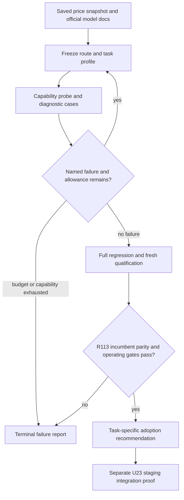

The experiment data path preserves the runtime boundary:

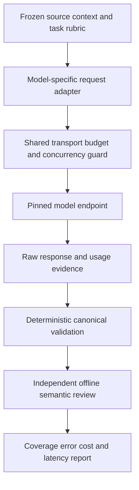

The R95 trial has two independent calls and one strict publication boundary:

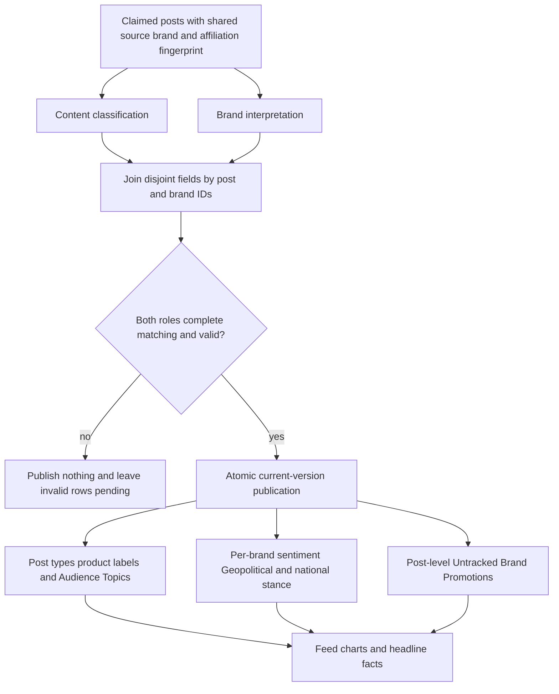

Classification state stays explicit across current and historical data:

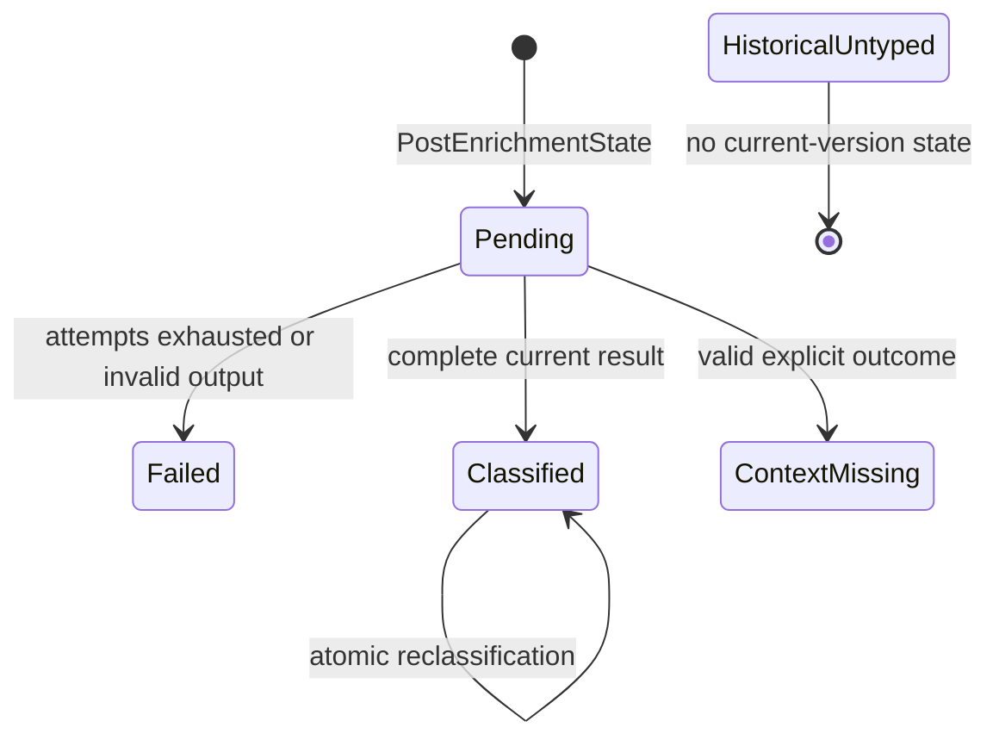

The compatibility window separates readable expansion from the write switch:

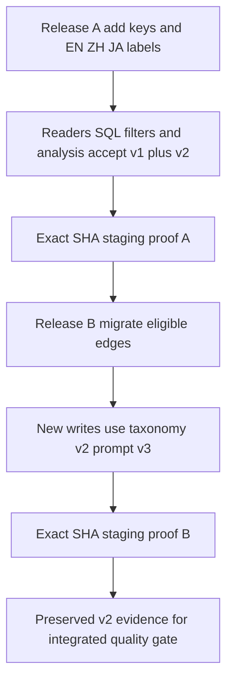

The analysis contract keeps the three stored populations distinct:

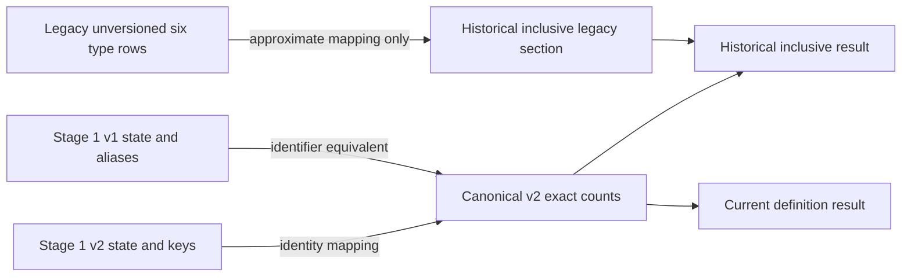

The Stage 1C extension keeps discovery, observed evidence, and interpreted records separate:

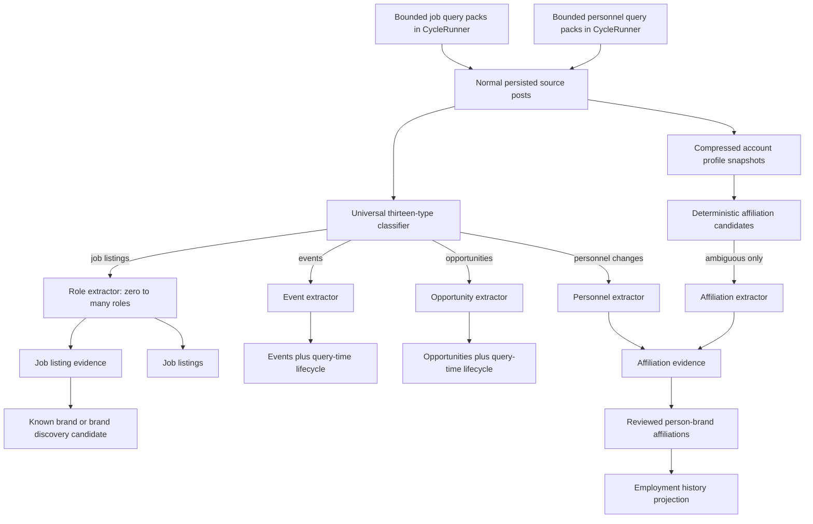

Headline demand extends the current lifecycle without putting provider work on the request path:

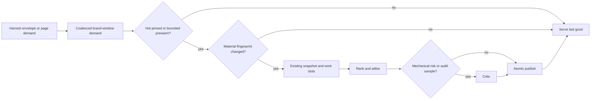

Translation and synthesis become separate versioned products:

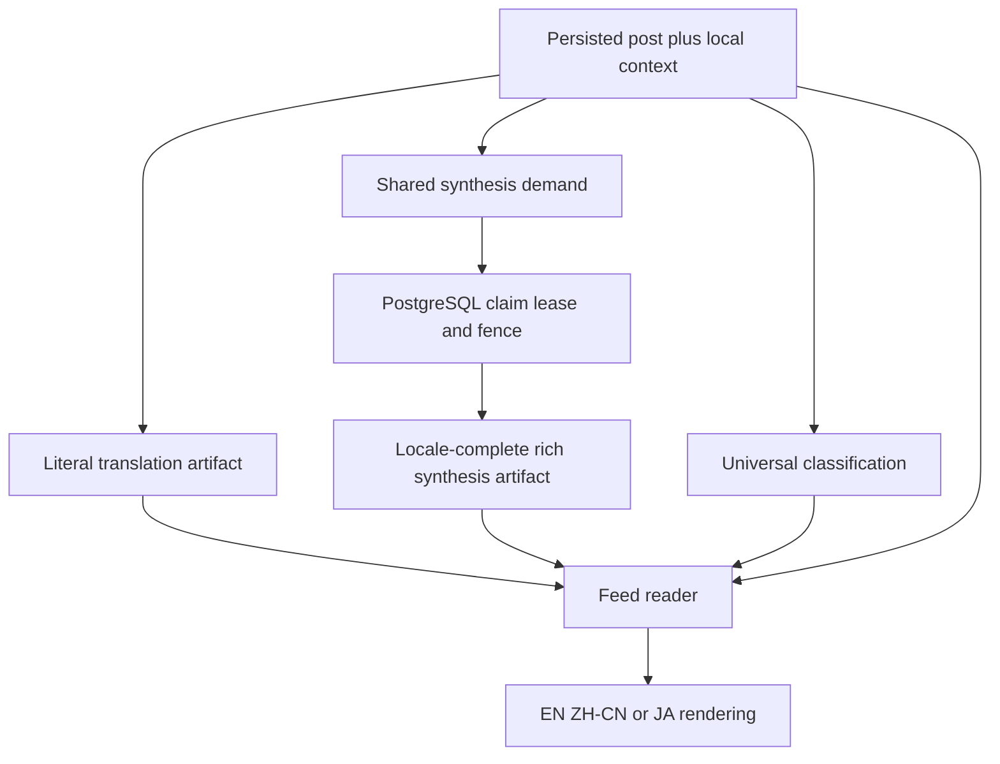

Lazy synthesis has one durable state machine across web, worker, and retry paths:

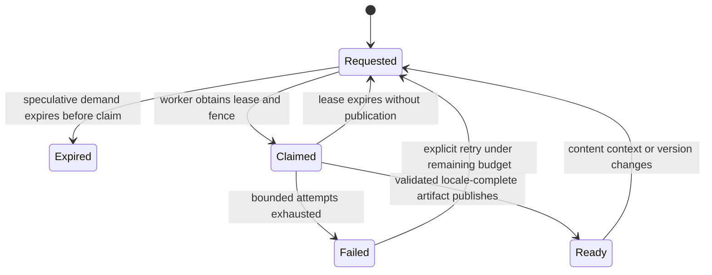

The integrated release keeps validation boundaries while promoting one candidate:

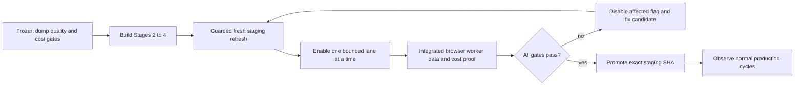

### Port, Exclude, and Defer Map

| Disposition | Files or surfaces | Integrated treatment |
| --- | --- | --- |
| Port | `x_monitor/attribution.py`, `monitor/cycle.py`, `core/models.py`, `core/migrations/`, `core/classification_labels.py`, `core/management/commands/seed_i18n_labels.py` | Implement the current classifier, schema, labels, and atomic Django writer. |
| Port | `monitor/views.py`, `monitor/templates/monitor/`, relevant `monitor/static/` filter/feed/chart modules | Replace visible discourse with product labels and preserve nationalism in existing layouts. |
| Port | `monitor/trend_narrative_candidates.py`, `monitor/trend_narrative_facts.py`, `monitor/trend_narrative_evaluation.py`, `monitor/trend_narrative_generation.py` | Remove discourse facts/prompts and preserve deterministic headline behavior through post-type diversity. |
| Compatibility only | `x_monitor/run.py` | Accept the shared result without attempting a discourse write; do not add product storage to the retired SQLite path. |
| Exclude | `x_monitor/store.py`, `x_monitor/_home_routes.py`, `x_monitor/dashboard.py`, `x_monitor/__main__.py` | Retired SQLite/Flask surfaces receive no feature port or writes. Preserve shared imports and Stage 0 telemetry. |
| Defer | `PostBrandDiscourse`, `DiscourseKey`, `DiscourseLabel`, their indexes/migration removal, and retired UI/data cleanup | Keep historical storage readable during the compatibility window; remove only under a later cleanup plan. |
| Port | `core/classification_contract.py`, `core/classification_readers.py`, `core/classification_labels.py`, `core/management/commands/seed_i18n_labels.py`, new additive migrations | Define one v1/v2 crosswalk, active 10/5/4/6 EN/ZH/JA labels, compatible reads, and the scoped identifier migration. |
| Port | Current-version predicates and grouping in `monitor/views.py`, `monitor/trend_narrative_facts.py`, `monitor/trend_narrative_candidates.py`, and the latest-N health helper | Accept recognized v1/v2 state and canonicalize in SQL before limits, grouping, and distinct counts. |
| Port | A shared classification-analysis query, management command, tests, and an agent-facing reference linked from `AGENTS.md` | Expose explicit `current_definition` and `historical_inclusive` JSON without silent blending or point-in-time claims. |
| Compatibility only | Existing UI filter query values and cache identity | Accept the five old aliases for one window, normalize before querying/caching, and emit canonical keys only. |
| Port in U20–U22 | `x_monitor/translator.py`, locale settings/middleware/catalogs, feed templates/static modules, headline schemas/readers, and normalized artifact readers | Separate literal translation from synthesis and complete EN/ZH-CN/JA product parity while preserving compatibility projections. |
| Port in U13–U17 | `core/models.py`, additive migrations, classifier/label contracts, `docs/reference/classifier-prompts.md`, v3 fixtures, feed/filter/headline consumers | Add the thirteen-type taxonomy v3, split `events_opportunities` into exact `events` and `opportunities` meanings for new writes, and preserve all v2 combined rows and provenance. |
| Add in U14–U16 | `people`, `people_accounts`, `account_profile_snapshots`, `people_brand_affiliations`, `people_brand_affiliation_evidence`, `brand_discovery_candidates`, `job_listings`, `job_listing_evidence`, `job_discovery_runs`, `personnel_discovery_runs`, `events`, and `opportunities` models, migrations, services, commands, and tests | Preserve observations, reviewed relationships, unreviewed organization discoveries, multi-source role evidence, openings, query-run provenance, attendance-bearing events, and bounded opportunities as distinct records. |
| Port in U15A | `config.yaml`, `monitor/cycle.py`, shared query planner/cursor/cost telemetry, post persistence and attribution, and harvest regression tests | Add disabled-by-default bounded organization-centric and role-centric job query packs inside the existing scheduler; no standalone cron or direct job-table writer. |
| Port in U15B | `config.yaml`, `monitor/cycle.py`, shared query planner/cursor/cost telemetry, post persistence and attribution, and harvest regression tests | Add disabled-by-default bounded organization-centric and transition-centric personnel query packs inside the existing scheduler; no standalone cron or direct affiliation writer. |
| Add in U15–U17 | Restartable historical-profile command, gated extractors, lifecycle projections/serializers, evaluation artifacts, and staging receipt | Backfill without date invention, expose recruiter-ready and event/opportunity shapes, measure discovery and extraction quality/cost independently, and prove idempotency. |
| Port in U19 | `monitor/trend_narrative_dispatch.py`, `monitor/trend_narrative_tasks.py`, `monitor/trend_narrative_lifecycle.py`, `monitor/trend_narrative_generation.py`, `monitor/tasks.py`, configuration, migrations, and tests | Coalesce brand-window demand, gate refresh on material change, escalate critics by risk/audit policy, preserve last-good output, and measure avoided calls. |
| Add in U20–U22 | Translation/synthesis artifact and demand models, shared services, `/api/v2/post-synthesis-demands/`, management commands, JavaScript demand controller, tests, and reference docs | Persist locale-complete reusable artifacts and bounded demand independently of feed requests and user identity. |
| Add in U21 | `pushinweight-synthesis` and `pushinweight-staging-synthesis` Render workers plus a polling management command | Claim PostgreSQL demand with leases/fences and no beat, harvesting, TwitterAPI credential, or headline-broker dependency. |
| Operate in U23–U24 | `bin/refresh-staging-data`, staging refresh policy/runbook, activation controls, receipts, monitoring queries, and Ollija delivery | Refresh current scrubbed data, activate/debug staging lane by lane, promote the exact candidate, and observe normal production cycles. |

### Sequencing and Parallel Ownership

U1–U5 and their exact-SHA staging receipt are immutable historical evidence for the first Stage 1 delivery. The follow-up begins at U6. U6 owns the crosswalk, future version constants, and label contract. After U6 commits, U7 owns its migration, seed, reader, view, headline, and health files while U8 may build only its new shared-analysis module, management command, new analysis tests, new reference, and `AGENTS.md` link. U8 completion and all Release A candidate/staging gates depend on U7. Only after Release A passes staging may U9 own activation of taxonomy v2/prompt v3, the edge migration, and the single-owner classifier-prompt exhibit update. U10 updates canonical output consumers. U11 reconciles and verifies the v2 cutover. U12 supplies the evaluator and freezes the exact v2 protocol. U12A records the historical blinded-assessment design that Delivery Exception 13 superseded; it is not an executable gate in this delivery. U14 owns additive identity, history, discovery-candidate, job/evidence, personnel-run, event, and opportunity schema. After U14, U15 owns profile history, U15A job discovery, U15B personnel discovery, U16 targeted extraction, and U17 read/evaluation contracts plus the v3 staging proof.

The active continuation begins at U18. U18 must close the owner-reference diagnostic before U18A expands the taxonomy, and both must pass before any feature lane is enabled. U19 then owns headline demand and critic policy. U20 owns normalized locale artifacts, split provider roles, compatibility projections, and Japanese parity. U21 owns synthesis demand, its service/command contract, and the isolated database worker. U22 owns feed selection, browser demand, pending/last-good rendering, and agent parity against U20–U21. U23 is the only unit allowed to refresh and activate staging; it uses a new scrubbed snapshot, enables one lane at a time, and returns failures to the owning unit without changing the candidate lineage. U24 alone owns production promotion and observation. Shared-file changes move forward through that order; each unit finishes its focused tests before the next unit reconciles them.

---

## Implementation Units

For the September 17 model-specific work, execute U25–U29 in dependency order; U18/U20 provide the existing callers and evidence. These units produce experiment results and an adoption recommendation, not an automatic production change.

| Unit | Work | Primary files | Depends on |
| --- | --- | --- | --- |
| U25 | Freeze documented model/route profiles | `scripts/u18_runtime_classifier_candidate.py`, `scripts/u20_translation_synthesis_execute.py` | Existing U18/U20 harnesses |
| U26 | Extend bounded trials and failure accounting | `scripts/u20_random100_live.py`, `scripts/u20_plaintext_translation_compare.py` | U25 |
| U27 | Independently tune assigned model/tasks | U18/U20 callers and versioned experiment artifacts | U26 |
| U28 | Qualify frozen configurations on fresh evidence | U18/U20 evaluators, `docs/analysis/` | U27 |
| U29 | Decide task routing and whole-system affordability | Consolidated experiment report, this plan | U28 |

U1–U5 below are the completed taxonomy-v1 baseline and retain their original
commands, identifiers, and evidence meaning. Executors of this amendment start
at U6; they do not rewrite U1–U5 receipts or treat those units as v2 proof.

### U1. Freeze the taxonomy, context, and parser contract

- **Goal:** Produce one canonical Stage 1 prompt/result contract that cannot fabricate a classification.
- **Requirements:** R1–R9, R15–R17; KTD1 and KTD5.
- **Dependencies:** None.
- **Files:** `x_monitor/attribution.py`; `docs/reference/2026-09-08-194415-enrichment-contracts.md`; `tests/fixtures/classification_stage1_contract_v1.json`; `tests/test_classify_pragmatics_full_prompt.py`; `tests/test_classify_pragmatics_full.py`; `tests/test_classify_pragmatics_full_arrays.py`; `tests/test_classify_batch_pragmatics_full.py`; `tests/test_classification_stage1_contract.py`.
- **Approach:**
  1. Define the ten keys, five product labels, sentiment, nullable nationalism, and outcomes once and make both batch and per-post fallback prompt builders use that definition.
  2. Include source text, stored quote text, and locally persisted parent text only when available, with explicit context provenance. Preserve input order and the existing list of attributed brands.
  3. Validate all expected brands and dimensions before returning a publishable result. Remove `hands_on_usage`, `neutral`, and nationalism `none` coercions for missing or unknown values; invalid responses enter existing fallback/failure handling.
  4. Preserve multi-type and multi-product arrays without a count cap, remove duplicates, enforce exclusive `other`, and represent `context_missing` without classification rows.
  5. Version the prompt/taxonomy identity without changing Stage 0 telemetry ownership, provider selection, batches, workers, token budget, or retries.
  6. Copy the bounded R1–R9 taxonomy, label, context, and state semantics into the tracked enrichment contract so implementers do not depend on the untracked planning source.
- **Execution note:** Add characterization coverage for batch/fallback cardinality and output alignment before changing the shared parser.
- **Commit note:** U1 is not independently commit-ready because its result shape would make the current writer silently omit signals. The same worker must complete, verify, and commit U1 together with U2, without a transitional duplicate prompt or compatibility default.
- **Patterns to follow:** `_PRAGMATICS_FULL_SYSTEM_PROMPT`, `build_batch_pragmatics_full_prompt`, `_classify_one_batch_to_by_brand`, `classify_batch_pragmatics_full`, and the Stage 0 fake direct-HTTP caller tests.
- **Test scenarios:**
  - All ten types and five product labels parse from exact keys, remain per brand, deduplicate, and preserve valid overlaps.
  - Empty product labels succeed; `other` alone succeeds; `other` plus another type is invalid and invokes fallback/failure.
  - Missing, unknown, wrong-type, or incomplete required fields never become Hands-On Usage, neutral, nationalism none, or Other.
  - A complete explicit `context_missing` result publishes no type/product rows but remains distinguishable from parser invalidity.
  - Stored quote and local-parent context appear with correct provenance; absent context causes no network lookup and can support `context_missing`.
  - A multi-post batch failure retains current three-attempt and per-post fallback counts, result ordering, model/config, and one telemetry event per application invocation.
  - Synthetic fixture rows declare non-gold provenance, and analyst calibration records cannot be loaded as heldout truth.
- **Verification:** One canonical contract drives both call modes; every malformed case fails closed; provider and telemetry regression assertions remain unchanged.

### U2. Add versioned storage and atomically cut over the Django writer

- **Goal:** Persist current Stage 1 judgments without coupling nationalism to discourse or leaving stale labels.
- **Requirements:** R1–R3, R5–R12, R15; KTD2–KTD4 and KTD7.
- **Dependencies:** U1.
- **Files:** `core/models.py`; `core/migrations/0028_ai_enrichment_stage1_taxonomy.py`; `core/classification_labels.py`; `core/classification_readers.py`; `core/management/commands/seed_i18n_labels.py`; `monitor/cycle.py`; `tests/test_classification_labels.py`; `tests/test_classification_readers.py`; `tests/test_migration_028_ai_enrichment_stage1_taxonomy.py`; `tests/test_run_post_fetch.py`; `tests/test_provider_telemetry_call_chain.py`.
- **Approach:**
  1. Add and index the per-brand classification state, product-label vocabulary/labels, and post-brand product edge from KTD2. Seed all ten type keys and five product keys during migration, and keep the idempotent management command aligned for current EN/ZH-CN surfaces.
  2. Leave discourse models and rows intact. Add no data migration that infers current versions, new types, product labels, context outcomes, nationalism, or completion identity.
  3. Build classification inputs from claimed `PostEnrichmentState` rows and add bounded local quote/parent context without changing collection.
  4. Validate the complete post result, then replace type and product rows and upsert per-brand state, sentiment, and nationalism in one transaction. Mirror a classified state's sentiment onto each required legacy signal column. Context-missing writes no type/product edge and may keep independently supported state sentiment/nationalism while leaving unknown scalars null. Do not mark post-level success before commit.
  5. Stop all new `PostBrandDiscourse` writes, retain legacy rows untouched, and replace misleading discourse counters with classification counters while keeping any operator-facing compatibility alias clearly labeled.
  6. Add one bounded reader helper for current-state sentiment/nationalism precedence and historical-untyped unique-value fallback. U3 and U4 consume this helper rather than duplicating conflict rules; it is not a generalized classification-axis framework.
- **Execution note:** Prove migration reversibility and atomic failure behavior before switching the writer.
- **Commit note:** Commit only the verified U1+U2 packet; do not expose the new parser shape to the old cycle writer at any intermediate branch head.
- **Patterns to follow:** Django composite-key models in `core/models.py`, additive migrations in `core/migrations/`, `CycleRunner._run_post_fetch`, and `_finish_enrichment_stage` claim ownership.
- **Test scenarios:**
  - A valid multi-brand result creates exact state, signal, product, sentiment, and nationalism rows for every brand and marks the post succeeded after commit; every type edge mirrors its state's sentiment.
  - Reclassifying a brand with fewer types/labels removes stale rows and leaves other brands untouched.
  - Explicit nationalism `none` stores the key; unknown remains null; no discourse row is created or modified.
  - Empty product labels and context-missing are successful semantic outcomes; context-missing stores no type/product edge and preserves only independently valid state sentiment/nationalism, while missing expected brands and invalid values keep the post pending/failed through existing policy with no partial current publication.
  - A forced database error rolls back every Stage 1 row and leaves `PostEnrichmentState` retryable.
  - The shared reader prefers current state, accepts one distinct historical fallback value, returns unknown for zero/conflicting legacy values, and reports conflicts without changing stored rows.
  - Migration forward creates and seeds exact keys/labels/indexes without changing existing discourse/signal rows. Reverse is exercised only on an empty disposable pre-publication database, preserves shared post-type keys, and is not represented as a safe rollback after Stage 1 rows exist.
  - The true `CycleRunner` factory path preserves batch 20, three workers, model/provider routing, retries, and Stage 0 event cardinality.
- **Verification:** Fresh and existing PostgreSQL test databases migrate cleanly; writer rows match the complete validated result exactly; no production database or provider is contacted.

### U3. Replace discourse with product labels across existing feed and chart UI

- **Goal:** Make the current public and protected reader surfaces display and filter the selected taxonomy without changing their layout or access rules.
- **Requirements:** R1–R3, R5–R8, R11–R13, R18; KTD2 and KTD4.
- **Dependencies:** U1 and U2.
- **Files:** `monitor/views.py`; `monitor/templates/monitor/home.html`; `monitor/templates/monitor/home_internal.html`; `monitor/templates/monitor/brand_home.html`; `monitor/templates/monitor/_feed_initial_v22.html`; `monitor/templates/monitor/_feed_initial_legacy.html`; `monitor/static/pw-filter-store.js`; `monitor/static/pw-filter-pills.js`; `monitor/static/pw-feed.js`; `monitor/static/pw-brand-chart.js`; `monitor/static/pw-chart.js`; `monitor/static/pw-locale-toggle.js`; `monitor/static/pw-icons.js`; `monitor/static/home-v20.css`; `monitor/static/dashboard.css`; `tests/fixtures/ui_assurance/declaration.json`; `tests/fixtures/ui_assurance/data.json`; `tests/golden/v22_mockup_fixture.json`; `tests/test_home_v22_filter_pills.py`; `tests/test_home_v22_feed_row_shape.py`; `tests/test_feed_page.py`; `tests/test_views.py`; `tests/test_home_v22_browser.py`; `tests/test_ui_assurance_browser.py`.
- **Approach:**
  1. Update label catalogs, server filter families, feed payloads, and chart datasets for ten post types and five product labels; remove discourse from serialized UI state and visible controls.
  2. Read current sentiment and nationalism from the new state. For historical-untyped rows only, use a legacy sentiment or nationalism axis when its rows have one distinct non-null value; treat zero or conflicting distinct values as unknown and count conflicts for review.
  3. Replace the existing discourse control/badge/chart slot with product labels while preserving control order, nationalism lens, anonymous `/`, protected `/internal/` and brand routes, locale toggle, and responsive layout.
  4. Use distinct post IDs and pre-aggregated relations so joining multiple types and product labels cannot multiply counts or duplicate feed rows.
  5. Update the Bridgewright declarations and deterministic fixtures as product-contract changes, not as looser expectations.
- **Execution note:** Follow `.claude/skills/fix-ui/SKILL.md`: pin the real URL-to-browser behavior first and run affected assurance before editing visible output.
- **Patterns to follow:** `core/classification_readers.py`, `_dashboard_filter_entries`, `_load_feed_classifications`, `_post_matches_filters`, existing post-type multi-select controls, and the `pw-filter-store.js` reducer contract.
- **Test scenarios:**
  - Anonymous English and Chinese public pages render all ten localized types and five product labels, render no discourse control or badge, and preserve nationalism controls.
  - Product-label filtering supports one and several selected labels; posts with an empty label set remain visible under the all/default state.
  - Multi-type and multi-product posts appear once and chart/feed counts use distinct posts rather than relation products.
  - Current explicit Other, context-missing, failed, pending, and historical-untyped states render distinctly without assigning a false type.
  - Current nationalism and unambiguous historical fallback filter correctly; conflicting legacy values never become a chosen nationalism judgment.
  - Public, internal, and brand-page filter state round-trips through JavaScript without stale discourse keys; locale switching preserves selections.
  - Real browser assurance proves controls are visible, interactive, reversible, and nonzero geometry with zero required skips/errors.
- **Verification:** Server-rendered and runtime feed paths agree on keys and labels; affected and candidate Bridgewright obligations pass; screenshots or DOM assertions show only the requested taxonomy substitution.

### U4. Remove discourse from headline facts and prompts

- **Goal:** Preserve headline generation and evidence quality using the current call graph without discourse-derived facts or ranking.
- **Requirements:** R5–R7, R11, R12, R14, R15, R18; KTD4 and KTD6.
- **Dependencies:** U1 and U2.
- **Files:** `monitor/trend_narrative_candidates.py`; `monitor/trend_narrative_facts.py`; `monitor/trend_narrative_evaluation.py`; `monitor/trend_narrative_generation.py`; `tests/fixtures/trend_narrative_co_dominance_v1.json`; `tests/test_trend_narrative_candidates.py`; `tests/test_trend_narrative_facts.py`; `tests/test_trend_narrative_evaluation.py`; `tests/test_trend_narrative_projection.py`; `tests/test_trend_narrative_orchestration.py`.
- **Approach:**
  1. Remove discourse vocabulary, counts, dominant labels, evidence arrays, coverage families, and prompt instructions from active trend snapshots and closed provider packets.
  2. Reuse post-type coverage and diversity for the deterministic evidence slot previously influenced by discourse; do not add a new classifier dimension or provider call.
  3. Read nationalism from current state with the same historical-only fallback as U3. Add product-label facts only with explicit coverage and semantic wording that keeps Misinformation provisional.
  4. Preserve snapshot immutability, fingerprints, work slots, last-good fallback, provider-call entitlements, rank/editor/critic batch sizes, and current telemetry/ledger identity.
  5. Update rank/editor prompts so unavailable or partial classification cannot support taxonomy claims and raw post content remains untrusted evidence.
- **Execution note:** Characterize candidate ordering, provider packets, and last-good behavior before removing discourse fields.
- **Patterns to follow:** `core/classification_readers.py`, `_metadata_taxonomy`, `_metadata_counts`, candidate evidence streams, closed projection schemas, `RANK_SYSTEM_PROMPT_V1`, and `EDITOR_SYSTEM_PROMPT_V2`.
- **Test scenarios:**
  - Snapshots and provider packets contain post types, sentiment, nationalism, and scoped product labels but no discourse family or role.
  - Post-type diversity preserves deterministic ordering and bounded evidence when discourse rows exist historically, are absent, or conflict.
  - Product-label coverage is partial/unavailable when classification is incomplete, and Misinformation cannot become an asserted factual conclusion.
  - Existing visible/last-good results survive a held or failed new run; work-slot, fingerprint, and provider-call counts do not change.
  - New and historical nationalism use the same precedence as feeds without duplicate counts from multiple relations.
  - Rank/editor/critic prompts receive no discourse text and retain prompt-injection, numeric ownership, bilingual, and evidence-coverage safeguards.
- **Verification:** Existing headline lifecycle tests pass with unchanged provider-call topology; serialized snapshots and packets have no active discourse field.

### U5. Reconcile shared callers, evaluate contracts, and verify staging readiness

- **Goal:** Close cross-unit drift, preserve the retired caller boundary, and produce a reviewable Stage 1 staging receipt.
- **Requirements:** R9–R18; KTD3–KTD7.
- **Dependencies:** U1–U4.
- **Files:** `x_monitor/run.py`; `.claude/skills/harvester-latest-n-health-check/scripts/check.py`; `scripts/post_fetch_smoketest.py`; `tests/test_run.py`; `tests/test_run_pipeline_live_wiring.py`; `tests/regression_net.py`; `tests/test_post_fetch_smoketest.py`; `tests/test_post_fetch_smoketest_renderer.py`; `tests/test_harvester_latest_n_health_check.py`; `tests/test_classification_stage1_contract.py`; `docs/analysis/2026-09-08-134925-ai-enrichment-stage1-evaluation.md`; `docs/analysis/2026-09-08-134925-ai-enrichment-stage1-staging.md`; `docs/plans/2026-09-08-134925-feat-ai-enrichment-stage1-plan.md`.
- **Approach:**
  1. Adjust only the retired `x_monitor.run` shared-result adapter so it accepts the Stage 1 result without indexing or writing discourse. Do not add product-label schema, migrations, or writes to legacy SQLite modules.
  2. Audit imports, SQL, templates, JavaScript state, fixtures, prompts, and active tests for stale discourse dependencies. Classify every remaining occurrence using the Port/Exclude/Defer map rather than global deletion.
  3. Reconcile shared taxonomy constants and result shapes across U1–U4, with one source per rule and no compatibility default that fabricates a judgment.
  4. Run the deterministic contract evaluator from stored JSON. Record schema and boundary results separately from the future adjudicated heldout quality assessment.
  5. Review the passive Stage 0 telemetry window before staging. Compare observed classifier usage, invocation counts, errors, and latency without treating unknowns as zero or tiny samples as percentiles.
  6. Make latest-N and post-fetch diagnostics schema-aware: use the current state, type/product labels, sentiment, and nationalism after Stage 1 schema exists, while retaining a safe legacy query before those tables exist. A successful Stage 1 row without discourse must not be diagnosed as unhealthy.
  7. After local regression checks and before staging, capture the literal latest 20 production posts in exact order, retain their IDs, wait 30 minutes, and recheck those same IDs once. Do not substitute a new cohort or retry the observation. Record attribution, enrichment state, and the pre-existing missing-discourse condition as Stage 0 production health evidence, not Stage 1 semantic proof.
  8. Execute migration, focused PostgreSQL, headline, UI browser/Bridgewright, Stage 0 telemetry, and aggregate regression gates; then record exact candidate SHA, staging deploy SHA, health, migration state, and observed limitations. Run Stage 1 table diagnostics only after the staging migration exists; never query nonexistent Stage 1 tables in production before deployment.
- **Execution note:** This is the sole reconciliation unit. Resolve cross-import conflicts here after the component owners finish; do not let parallel units silently edit each other's files.
- **Patterns to follow:** `tests/regression_net.py`, Stage 0 true-caller telemetry tests, `docs/analysis/2026-09-08-194415-enrichment-stage0-baseline.md`, and the generated Ollija staging guide.
- **Test scenarios:**
  - The retired run adapter handles classified, context-missing, and invalid shared results without discourse writes or new legacy schema.
  - Repository audit finds no active Django UI/headline prompt, write, filter, or packet dependence on discourse; retained model/migration/retired references match the disposition table.
  - Health and smoke diagnostics choose the legacy query before Stage 1 schema exists and the current-version query afterward; a valid discourse-free Stage 1 classification reports healthy.
  - Aggregate tests prove collection scheduling, batch/workers, provider routes, retries, fallback, telemetry cardinality/privacy, and headline call entitlements remain unchanged.
  - Offline contract evaluation reports 100% structural validity and zero invalid-to-fallback coercions without labeling synthetic or analyst cases as gold.
  - The baseline receipt contains a bounded 1–2 hour production window and reports observed role usage/latency/errors plus explicit unknowns; material unexplained regression blocks staging.
  - The latest-20 receipt preserves one ordered production cohort across the 30-minute recheck, performs no substitution or retry, and distinguishes existing missing-discourse rows from new failures.
  - Exact candidate SHA staging deployment passes web health, migration checks, deterministic feed/filter/headline probes, and required browser obligations without a paid harvest trigger.
- **Verification:** All five unit contracts agree; required tests execute with zero skips/errors; the staging receipt separates deterministic contract proof from unmeasured semantic accuracy and confirms no production promotion occurred.

### U6. Freeze the taxonomy v2 crosswalk and three-locale label contract

- **Goal:** Establish one canonical identifier and label source before any reader, migration, or prompt changes.
- **Requirements:** R1–R5, R19, R20, R22, R25; KTD8 and KTD13.
- **Dependencies:** Completed U1–U5 baseline.
- **Files:** `core/classification_contract.py`; `core/classification_labels.py`; `tests/test_classification_stage1_contract.py`; `tests/test_classification_labels.py`.
- **Approach:**
  1. Define taxonomy v2 and prompt v3 as future write targets while retaining taxonomy v1 as a recognized compatible stored version. Keep `stage1-v1` and the exact provider response fields unchanged.
  2. Add the five R19 aliases to one ordered crosswalk; all unchanged v2 keys map to themselves. Expose one canonicalization representation suitable for Python and parameterized SQL rather than copying maps across modules.
  3. Add reviewed English, Simplified Chinese, and Japanese labels for exactly the active ten types, five products, four sentiments, and six nationalism values. Do not add Japanese fallback rows for retired discourse/role families.
- **Test scenarios:**
  - Every old alias maps to the named v2 key, every unchanged canonical key is identity, and no two aliases map to conflicting canonical values.
  - The v2 output sets contain exactly ten types and five products; parser field names, sentiment/nationalism/outcome vocabularies, and classification contract version are unchanged.
  - Each active key has exactly one nonblank `en`, `zh-cn`, and `ja` label; retired families do not gain accidental Japanese rows.
  - Unknown keys fail canonical validation rather than falling through to a display label.
- **Verification:** Contract and label tests pin ordered allowlists, version roles, crosswalk totality, uniqueness, and exact 10/5/4/6 locale coverage.

### U7. Ship Release A compatible storage and readers

- **Goal:** Make the previous write format and future canonical format readable together before any edge rewrite or writer switch.
- **Requirements:** R11, R12, R18–R22, R25; KTD8, KTD9, KTD11, and KTD13.
- **Dependencies:** U6.
- **Files:** `core/migrations/0029_ai_enrichment_stage1_taxonomy_v2_labels.py`; `core/management/commands/seed_i18n_labels.py`; `core/classification_readers.py`; `monitor/views.py`; `monitor/trend_narrative_facts.py`; `monitor/trend_narrative_candidates.py`; `.claude/skills/harvester-latest-n-health-check/scripts/check.py`; related migration, reader, view, fact, candidate, and health tests.
- **Approach:**
  1. Add canonical lookup keys and EN/ZH-CN/JA active-family labels without changing any classification state or type/product edge. Retain v1 keys and labels so unversioned legacy foreign keys remain valid and an older application tolerates the additive rows.
  2. Replace exact-v1 currency predicates with recognized v1/v2 predicates. Canonicalize through the shared SQL relation before window limits, grouping, or distinct operations, while preserving current-state explicit-null precedence and unversioned historical fallback.
  3. Keep the writer and provider parser on taxonomy v1/prompt v2 throughout Release A. Queue completion remains version-agnostic and recognized v1 rows are never requeued for this rename.
  4. Report actual stored taxonomy/prompt provenance in health output, label both recognized versions current-compatible, and identify the latest write target separately.
- **Execution note:** Characterize mixed v1/v2 and current-null behavior before replacing any exact-version predicate. This unit follows `.claude/skills/change-harvester/SKILL.md` only for its bounded health/call-chain verification; it does not change collection or invoke providers.
- **Test scenarios:**
  - A fresh database and a database with v1 rows gain canonical lookup/three-locale labels while all existing states and edges remain byte-for-byte semantically unchanged.
  - Mixed alias/canonical edges collapse to one post-brand-key membership before grouping; two attributed brands remain two memberships and one unique post.
  - A v1 or v2 current state wins over legacy fallback, including explicit null; conflicting legacy scalars remain unknown.
  - A post-brand with an unknown contract or taxonomy state is excluded with provenance counts/warnings and cannot fall through to its legacy type or scalar rows.
  - Every raw SQL reader accepts both recognized versions, rejects unknown versions, and returns row counts bounded by aggregate dimensions rather than post-brand edge count.
  - Health distinguishes stored v1/v2 provenance, treats both as current-compatible, and does not report v1 as pending or trigger reclassification.
- **Verification:** Focused PostgreSQL tests cover migration forward/idempotence, mixed versions, empty strings/nulls, conflicts, deduplication, query bounds, and rollback to the Release A binary without reversing the additive migration.

### U8. Add explicit historical analysis and canonical compatibility surfaces

- **Goal:** Give humans and agents one reproducible analysis contract while preserving old filter links and canonicalizing all new outputs.
- **Requirements:** R19, R22–R26; KTD8, KTD11, and KTD12.
- **Dependencies:** U6 for the isolated new-file analysis packet; U7 for shared-surface integration, database/browser validation, completion, and Release A delivery.
- **Files:** a shared classification-analysis query module under `core/`; a management command under `core/management/commands/`; `monitor/views.py`; relevant feed/filter/chart JavaScript and icon maps; `monitor/trend_narrative_facts.py`; `monitor/trend_narrative_candidates.py`; `AGENTS.md`; a new `docs/reference/` analysis contract; analysis, view, headline, command, and browser tests.
- **Approach:**
  1. Implement one query service used by the management command and available to agent adapters. Require a named history policy, half-open UTC `Post.created_at` timestamps, and optional canonical brand scope; never infer classification era from publication time. Exclude and count null post timestamps, emit `range_basis: post_created_at`, and expose `classified_at` only as provenance.
  2. Emit the deterministic R24 schema. `historical_inclusive` nests approximate unversioned legacy results beside, never inside, exact v1/v2 counts. Snapshot output includes source revision/query identity and states the latest-state limitation from R26.
  3. Normalize old filter aliases before ORM predicates and cache-key construction. Responses, DOM state, charts, icon lookup, and headline facts emit canonical keys only and canonicalize before aggregation.
  4. Link the agent-facing reference from `AGENTS.md`, including copyable CLI examples, provenance/count units, empty/error behavior, and the identifier-equivalence table.
- **Execution note:** Before U7 commits, limit parallel work to the new analysis module, command, tests, reference, and `AGENTS.md` link named above; do not edit or validate through U7-owned database/UI/headline surfaces. After the parent transfers ownership, integrate against committed U7 and follow `.claude/skills/fix-ui/SKILL.md` for old-link and canonical-output browser checks. The work changes machine keys but does not add Japanese UI controls or copy.
- **Test scenarios:**
  - `current_definition` reports canonical exact counts with separate stored v1/v2 provenance; `historical_inclusive` leaves those counts unchanged and adds a labeled approximate legacy section.
  - Empty ranges exit zero with `status: empty`; invalid policy/range/brand/schema or crosswalk collision exits nonzero with a structured safe error and no partial counts.
  - Rows exactly at the inclusive start and exclusive end boundary behave correctly; null `Post.created_at` rows are excluded, counted, and warned without consulting `classified_at`.
  - Unversioned legacy types map only in the approximate section and product labels report unavailable; unknown provenance is counted as excluded with a warning.
  - An old alias URL and its canonical URL produce equivalent filtering and one normalized cache identity, while responses expose only the canonical key.
  - Mixed aliases cannot duplicate feed rows, chart counts, headline facts, or CLI memberships.
- **Verification:** Deterministic JSON/golden tests, PostgreSQL count parity, management-command subprocess tests, and bounded browser tests prove the two policies and compatibility window. Release A then receives its own clean aggregate, exact-SHA staging deploy, migration/seed check, and rollback-only probe before U9 starts.

### U9. Migrate eligible edges and switch new writes in Release B

- **Goal:** Canonicalize stored Stage 1 memberships and make new classifier results use taxonomy v2/prompt v3 without changing semantics or provenance.
- **Requirements:** R7–R10, R15, R19, R21, R22, R25; KTD8–KTD10.
- **Dependencies:** U8 and successful Release A staging proof.
- **Files:** `core/classification_contract.py`; `core/migrations/0030_ai_enrichment_stage1_taxonomy_v2_edges.py`; `x_monitor/attribution.py`; `monitor/cycle.py`; `docs/reference/classifier-prompts.md` through its existing single-owner formatter; migration, parser, prompt, cycle, publisher, provider-route, retry, and telemetry tests.
- **Approach:**
  1. In one forward-only migration, select edges only for post-brand pairs with recognized v1 Stage 1 state. Rewrite the five aliases, collapse old/new collisions, and rebuild each type membership with authoritative state sentiment; leave unversioned pairs and state provenance untouched.
  2. Preserve old lookup rows, all state taxonomy/prompt/model/classified-at values, immutable headline snapshots, request ledgers, and enrichment success. Supply no reverse callable: an attempted Django reverse raises `IrreversibleError` before migration-recorder or row changes.
  3. Activate the U6 future constants only in Release B, switching the canonical prompt/parser/write target to taxonomy v2/prompt v3. The provider response stays the same shape, uses only canonical keys, and rejects v1 aliases as invalid new output through the existing batch/fallback/failure semantics.
  4. Preserve batch 20, workers 3, provider/model route, max tokens, retry/backoff, fallback, telemetry identity/cardinality/privacy, atomic all-brand publication, and zero added recurring calls.
- **Execution note:** Coordinate `docs/reference/classifier-prompts.md` with its current owner; mechanically regenerate its literal prompt/example evidence after the prompt version change rather than concurrent manual edits.
- **Test scenarios:**
  - Mixed v1 alias plus canonical collision produces one canonical type/product edge; type sentiment comes from state and no uniqueness error or duplicate remains.
  - Eligible v1 state retains taxonomy v1/prompt v2/model/classified-at after edge rewrite; unversioned legacy and existing v2 rows remain untouched.
  - Attempting to reverse migration 0030 raises `IrreversibleError` and leaves the migration recorder and canonical rows unchanged.
  - New valid v2 results publish atomically; a result containing any v1 alias fails strict parsing and cannot partially replace rows.
  - Context-missing/current-null, multi-brand completion, stale-row replacement, claim loss, database rollback, retries, and deadline behavior match the completed Stage 1 contract.
  - Provider route, role isolation, application-call telemetry, batch/workers, and call cardinality remain unchanged.
- **Verification:** Fresh/upgrade PostgreSQL migration tests, irreversible-reverse and collision fixtures, exact prompt/version pins, true HTTP-wrapper call-chain tests, and publisher failure injection pass without paid calls.

### U10. Reconcile canonical UI, headline, health, and provenance fixtures

- **Goal:** Close cross-import and closed-taxonomy drift after Release B without broadening Japanese UI or historical semantics.
- **Requirements:** R12–R16, R19–R26; KTD8–KTD13.
- **Dependencies:** U9.
- **Files:** current feed/chart/filter templates and JavaScript; `monitor/views.py`; `monitor/trend_narrative_facts.py`; `monitor/trend_narrative_candidates.py`; health/smoke diagnostics; UI assurance declarations; headline fixtures; classifier reference; analysis reference; affected tests.
- **Approach:** Audit every active v1 literal and exact-version predicate, then classify it as accepted compatibility input, stored-provenance output, immutable historical evidence, or stale current output. Canonicalize current outputs and closed headline taxonomy while retaining v1 provenance and historical artifacts. Do not edit the Stage 0 baseline, completed Stage 1 staging receipt, headline snapshots, or request ledgers; new candidate evidence goes only to the dated follow-up receipt owned by U11.
- **Test scenarios:**
  - Feed, chart, DOM, icons, headline packets, and new URLs contain only canonical keys; v1 appears only in compatibility input or explicit provenance fields.
  - Headline evidence built from mixed v1/v2 state has canonical distinct counts and unchanged provider-call topology, cache/last-good behavior, and immutable old snapshots.
  - English and Chinese existing UI remains localized; Japanese label persistence is verified without exposing a Japanese locale option.
  - Health, smoke, analysis, prompt reference, and version fixtures agree on contract v1, compatible v1/v2, write target v2, and prompt v3.
- **Verification:** Focused current-surface/browser, headline, health, documentation-literal, and provenance suites pass with no obsolete current-key expectation or accidental Japanese UI path.

### U11. Run the follow-up regression net and verify Release B on staging

- **Goal:** Prove the amended contract end to end and preserve the old Stage 1 evidence as historical rather than rerunning production observations.
- **Requirements:** R15–R26; KTD8–KTD13.
- **Dependencies:** U10.
- **Files:** `tests/fixtures/ai_enrichment_stage1_test_scope.json`; regression manifests/runners; a new `docs/analysis/YYYY-MM-DD-HHMMSS-ai-enrichment-stage1-taxonomy-v2-staging.md`; Release A/B ignored receipts promoted only where the new receipt requires durable evidence. The parent workflow alone may append final execution state to this plan after implementation.
- **Approach:** Reconcile shared imports and ownership, run focused and aggregate local gates on the frozen Release B source, independently review the migration/history contract, and deploy the exact candidate to staging under the existing Ollija guide. Exercise only transaction-local probe fixtures and authenticated/local browser flows already allowed by the staging runbook; do not run provider work, production reads, a new baseline, or a new cohort capture.
- **Test scenarios:**
  - The active aggregate includes every new migration, crosswalk, analysis CLI, call-chain, old-filter alias, canonical-output, headline, health, and three-locale label node with zero required failures/skips/errors.
  - Release A receipt proves the exact compatible binary before Release B; Release B receipt proves migration 0030, retained v1 provenance, canonical edges, analysis policy outputs, current-null behavior, and exact Release A compatibility with retained Release B data.
  - Local browser proof covers old alias input and canonical emission in EN/ZH; Japanese remains a storage/reference assertion and is not reported as selectable parity.
  - Staging probe creates bounded v1/v2/legacy transaction-local rows, checks both history policies and canonical aggregate SQL, then rolls back without touching existing data or invoking a queue/provider.
- **Verification:** Formal review, required aggregate, candidate/browser/headline gates, source/artifact identity checks, and exact-SHA Release B staging verification pass. For the rollback proof, archive exact M_A sources with `git archive` into a hashed ignored bundle, run that bundle's Django readers through the existing absolute virtualenv against an owned disposable database after actual migration 0030, and prove v1/v2 reads without creating a branch or worktree. Keep staging on M_B. The final receipt names Release A and B identities, historical receipt boundaries, live-auth limitations, R17 as preproduction-only, and no production deployment.

### U12. Make the R17 semantic-quality gate reproducible

- **Goal:** Provide a deterministic, provider-free evaluator and blinded review packet contract before acquiring or scoring the fresh heldout cohort.
- **Requirements:** R1–R9, R16, R17; KTD1 and KTD5.
- **Dependencies:** U11 and the frozen taxonomy v2/prompt v3 contract.
- **Files:** `core/classification_evaluation.py`; `core/management/commands/evaluate_classifications.py`; `tests/fixtures/classification_evaluation_v1.json`; focused evaluator/command tests; a new `docs/reference/` evaluation runbook; this plan.
- **Approach:**
  1. Score only explicit candidate and adjudicated-gold JSON artifacts paired by `(example_id, brand_id)`. Require the gold artifact to declare heldout, gold, cohort, reviewer, and adjudication provenance; reject synthetic and analyst-calibration material as truth.
  2. Preserve missing and invalid candidate rows as separate coverage failures. Never turn either into a semantic label or include it in a semantic denominator.
  3. Report post-type and product-label TP/FP/FN, precision/recall/F1, exact-set accuracy, and Jaccard; outcome and scalar confusion matrices; explicit `none` versus null-unknown errors; per-language and context-provenance slices; support gaps; artifact hashes; and a deterministic evaluation identity.
  4. Accept an explicit preregistered floor policy rather than embedding changeable product thresholds in code. Without a policy, or with under-supported required labels/slices, report the production decision as unassessed or blocked.
  5. Keep live cohort material and source/context text outside ordinary tracked fixtures. The tracked fixture proves arithmetic and rejection boundaries only and declares itself synthetic/non-gold.
- **Test scenarios:**
  - Multi-label arithmetic, exact sets, empty products, multiple products, exclusive `other`, scalar confusion, and `none`/unknown separation are deterministic.
  - Missing and malformed candidate rows reduce coverage, remain outside semantic denominators, and block a production pass.
  - Low-support labels are named rather than omitted; EN, ZH-CN, JA and context slices retain their own denominators.
  - Invalid, incomplete, synthetic, or non-gold adjudication artifacts fail before scoring.
  - Repeated inputs produce byte-identical JSON and identity; changing candidate, gold, or floor policy changes the identity.
  - The management command reads files only and emits structured errors without opening a database or provider transport.
- **Verification:** Focused unit and command tests pass under denied provider/network credentials. The runbook separates evaluator readiness from semantic evidence. Delivery Exception 13 supersedes the former fresh-cohort, independent-annotation, and adjudication requirements; U18 instead requires the frozen ordered owner reference, preregistered supported floors, bounded candidate transport, and an explicit account of unmeasured categories before activation.

### U12A. Historical taxonomy-v2 R17 assessment design — superseded

- **Goal:** Preserve the former blinded-assessment design as historical planning evidence. Delivery Exception 13 supersedes its independent-annotation, adjudication, and production-gate requirements for this delivery.
- **Requirements:** R16, R17, R26; KTD1, KTD5, and KTD12.
- **Dependencies:** U12 evaluator and runbook complete; taxonomy v2/prompt v3 frozen; exception 10 authorizes bounded candidate transport after the R59 role/config/cost budget record is written.
- **Files:** ignored frozen source/context, candidate, and reviewer packets; versioned floor policy; a durable `docs/analysis/YYYY-MM-DD-HHMMSS-ai-enrichment-stage1-taxonomy-v2-r17.md` containing only permitted evidence, aggregate metrics, artifact hashes, and limitations; this plan's execution state.
- **Approach:** Do not execute a new cohort, independent annotation, adjudication, or provider run under this unit. Preserve any existing files under their original historical identities. The executable U18 gate uses the ordered 45-case, unblinded owner reference under R86 and R96; unsupported labels remain explicitly unmeasured and cannot be presented as population accuracy.
- **Test scenarios:** Candidate/gold/floor artifacts match exact identities; annotation order cannot affect the result; missing candidates lower coverage; under-supported labels/slices remain blocking gaps; failed floors cannot be restated as a pass; rerunning the same artifacts produces byte-identical output; changing any input changes the assessment identity.
- **Verification:** The plan and execution receipt state that U12A was superseded by owner direction and never claim its absent blinded assessment was completed. U18 identifies the exact owner-reference hash, limitations, measured support, and any unmeasured categories.

### U13. Freeze taxonomy v3 and rare-type boundaries

- **Goal:** Extend the classifier from ten to thirteen types by splitting events from opportunities and adding jobs and personnel, without changing the meaning or provenance of taxonomy-v2 data.
- **Requirements:** R27–R30, R38, R40–R47; KTD14 and KTD18.
- **Dependencies:** U12 complete with the exact taxonomy-v2 prompt identity and evaluator frozen. U12A is historical and no longer blocks U18 under Delivery Exception 13.
- **Files:** `core/classification_contract.py`; `core/classification_labels.py`; `x_monitor/attribution.py`; `docs/reference/classifier-prompts.md`; deterministic job/personnel and event/opportunity boundary fixtures; label seed/migration; parser, prompt, label, version, and consumer tests.
- **Approach:** Define the thirteen-key v3 allowlist once; add the exact EN/ZH-CN/JA labels; preserve the taxonomy-v2 `events_opportunities` key and rows only as versioned historical data; pin taxonomy v3/prompt v4; update batch and single-post prompts from the same source; and make all readers accept v2/v3 provenance while emitting the exact stored-version key. The old broad filter may select the v2 combined population plus both v3 families but cannot present an exact crosswalk. Do not relabel taxonomy-v2 rows.
- **Test scenarios:** Concrete roles/application routes qualify as jobs; vague hiring promotion does not. Named joining/leaving statements qualify regardless of author role or handle presence; Anna Wang’s first-person Google DeepMind-to-Anthropic statement qualifies despite unknown effective dates; unchanged bios and employee spotlights do not. The R41–R46 cases distinguish attendance from asynchronous action, allow event/opportunity co-labels, retain past/closed subjects, and preserve missing dates. A job is not automatically an opportunity, while a separate grant or attendance-bearing hiring event may justify another type. Batch fallback, multi-brand atomicity, sentiment/nationalism, product labels, telemetry, and `other` exclusivity retain the existing contract.
- **Verification:** Closed-key prompt/parser tests, exact label tests, mixed-v2/v3 reader tests, and current call-chain regressions pass without a provider call.

### U14. Add people, profile-history, affiliation, discovery, job, event, and opportunity schemas

- **Goal:** Add normalized storage for durable personnel, job, event, and opportunity intelligence while keeping observations, review candidates, evidence, and interpreted facts separate.
- **Requirements:** R31–R37, R41–R47, R54, R56; KTD15–KTD17 and KTD20–KTD22.
- **Dependencies:** U13 contract freeze.
- **Files:** `core/models.py`; new additive `core/migrations/`; `docs/reference/db-schema.md`; model factories and focused PostgreSQL migration/model tests.
- **Approach:**
  1. Add `Person` / `people` with UUID PK, canonical display-name fields, and the R32 nullable birth-date/precision, `sexs`, nationality, ethnicity, and primary-language fields; add `PersonAccount` / `people_accounts` with composite person/account identity and resolution metadata.
  2. Add `AccountProfileSnapshot` / `account_profile_snapshots` with the R35 observed-profile fields, normalized X business-affiliate-label facts, and hash-compression contract.
  3. Add `PersonBrandAffiliation` / `people_brand_affiliations` with the R33 recruiter-ready employment and community relationship types and `PersonBrandAffiliationEvidence` / `people_brand_affiliation_evidence` with the R34 source contract. Preserve the R33A role-resolution confidence, review state, source kind, and conflict state rather than forcing unknown mentions into staff or community.
  4. Add `BrandDiscoveryCandidate` / `brand_discovery_candidates` and `UntrackedBrandPromotionEvidence` / `untracked_brand_promotion_evidence` with the R36 review-state, observed-identity, recurrence, source-post, and nullable exact-account-match fields. Audit and seed distinct organization-facing brands and company edges required by R54, including Anthropic and Google DeepMind; a candidate may resolve to a brand after review, but discovery never auto-creates or mutates authoritative organization records.
  5. Add `JobListing` / `job_listings` and `JobListingEvidence` / `job_listing_evidence` with the R36A–R36B identity, organization, role, application-route, lifecycle, provenance, media, and extraction fields. Deduplicate listings at the role/requisition level while retaining many evidence rows and the shared source post for a multi-role announcement.
  6. Extend existing `SearchQuery` rows with versioned job/personnel-lane identity where needed; add `JobDiscoveryRun` / `job_discovery_runs` with the R51 per-query execution contract and `PersonnelDiscoveryRun` / `personnel_discovery_runs` with the R56 equivalent personnel counts, provenance, cost, and stop-reason fields.
  7. Add `Event` / `events` and `Opportunity` / `opportunities` with R45–R46 fields and an optional opportunity-to-event link; store source-stated times/statuses and derive lifecycle during reads.
  8. Use `CASCADE` for owned account/person junctions, `PROTECT` for reviewed evidence-bearing entities, and `SET_NULL` for optional source posts so deleting a source wrapper cannot erase a durable reviewed fact. Add database constraints for the R32 confirmed/primary person-account rules and birth-date/precision shape, R34/R36B source-reference invariants, known-brand-or-candidate listing ownership, deterministic affiliation/listing/event/opportunity and run/query/window identities, observed/effective date order where comparable, allowed status/type/precision/application-route values, positive opening counts, nonnegative counters/costs, and coherent salary ranges; use service validation only where PostgreSQL cannot express normalization or partial-date rules.
- **Test scenarios:** Fresh and upgrade migrations preserve every existing row; exact, month-only, and year-only birth dates round-trip with matching precision while unknown remains null; `sexs`, nationality, ethnicity, and primary language preserve supplied values; one person can have several accounts and repeated employment, ambassador, or creator-partner roles at one brand; two concurrent confirmed-person or primary-account claims cannot violate R32; conflicting person/account, role, or organization identity enters review rather than silent merge; evidence accepts each valid post/URL/media/profile source form and rejects all-null or blank references; promotion evidence requires one source post, one candidate, visible identity/evidence, and permits only an exact account match; repeated observations converge while advancing candidate recurrence; the same post may link several promoted candidates without copying post-level promotion keys; full X affiliate-label facts round-trip independently of verification; one post can support 23 distinct role identities without becoming 23 source posts; one listing can retain several evidence sources; partial listings allow unknown deadline/location/workplace/openings and QR/email routes; duplicate job/personnel-discovery execution identities converge while distinct bounded windows remain separate; repeated affiliation/listing/event/opportunity writes converge while legitimate repeats remain separate; invalid birth-date/precision, date, salary, status, or counter combinations fail.
- **Verification:** `makemigrations --check --dry-run`, forward migration, model checks, constraints, deletion behavior, and fresh/upgrade PostgreSQL tests pass with no rewrite of `accounts`, `posts`, or existing classification rows.

### U15. Build compressed profile capture and historical discovery

- **Goal:** Convert existing account/post profile facts into auditable snapshots and affiliation candidates without claiming employment dates the sources do not provide.
- **Requirements:** R32–R35A, R39; KTD15–KTD17 and KTD21.
- **Dependencies:** U14.
- **Files:** a shared `core/profile_snapshots.py`; `core/management/commands/backfill_account_profile_snapshots.py`; deterministic brand-handle/name candidate rules; backfill checkpoint/report format; focused service, command, idempotency, and PostgreSQL tests.
- **Approach:** Process account and post-author observations in stable chronological order; retain explicit field presence; deterministically normalize business-label target, description, badge URL/type, and verification fields; normalize only for hashing/matching; collapse consecutive identical versions; create a new row when content changes or returns after an intervening version; and checkpoint by stable source identity. Generate reviewable candidates from known brand handles/names, business labels, existing account/brand relationships, explicit employment/community phrases, and Call A drift. Apply the R33A hierarchy: trusted positive sources remain positive, explicit nonemployee relationships remain typed community evidence, former status stays independent, and bare mentions remain unresolved. Do not call a model in this unit. Backfill output remains unreviewed; a bad rule version is disabled and its candidates are quarantined or marked rejected by recorded rule/run identity while immutable source snapshots remain available for a corrected replay.
- **Test scenarios:** Empty/partial payloads do not erase present facts; reruns create no duplicates; interruption resumes after the last committed batch; A → A → B → A yields three versions with correct observation windows/counts; fetch dates remain observation metadata; the MiniMax badge fixture extracts its target and label without image processing; staff, ambassador/CPP, former-intern, and bare-handle fixtures route to distinct candidate states; Call A additions enter reconciliation while list removals do not close affiliations; ambiguous names and missing brands remain reviewable/unmatched.
- **Verification:** Provider-denied unit/command tests and a bounded disposable-database backfill prove deterministic row counts, hashes, checkpoints, and zero fabricated effective dates. Production execution requires separate authorization and a recorded dry-run estimate.

### U15A. Build and calibrate the bounded global job-discovery lane

- **Goal:** Find job announcements across AI-related organizations and broader employers without limiting discovery to tracked brands or creating a second harvest system.
- **Requirements:** R36, R48–R53; KTD19–KTD20.
- **Dependencies:** U14 schema; the current `CycleRunner` cursor, run-lock, credit, and persistence contracts remain authoritative.
- **Files:** `config.yaml`; `monitor/cycle.py`; the shared query planner/cursor and harvest-cost reporting; job query-pack schema and fixtures; fake-client planner, call-chain, cursor, cap, attribution, deduplication, and regression-net tests; a provider-free calibration report derived from the Grok research artifact.
- **Approach:** Add disabled-by-default organization-centric and role-centric query packs for EN, ZH-CN, and JA through `plan_calls_for_cycle`. Assign each query a stable identity, bounded window, cadence, cursor/checkpoint, result/page ceiling, timeout, stop rule, and per-cycle/daily credit ownership. Feed returned posts through normal persistence and attribution; organization discoveries enter the review queue, and only later positive classifications can schedule job extraction. Normalize the eight Grok seed queries against provider limits and false-positive exclusions before any bounded live trial. Preserve the single 15-minute scheduler and run lock.
- **Test scenarios:** Missing date bounds, cadence, cursor identity, query ID, or credit ceilings fail planning with zero calls; disabled packs plan zero calls; provider pagination respects every cap and checkpoint; restarts neither skip nor duplicate posts; multi-role posts remain one fetched post; tracked and untracked organizations follow the same post path; third-party results cannot create authoritative brands; EN/ZH-CN/JA and both lanes retain independent yield/cost counters; existing A/B/C calls and metrics refresh remain unchanged when the lane is disabled.
- **Verification:** Provider-denied/fake-client call-chain and regression tests pass; `python -m scripts.harvest_cost` or its extended report shows the maximum per-cycle/day call and credit delta; the calibration report names query hypotheses, known false positives, syntax/capability gaps, and separate post/listing/organization counts. U23 may run only the exception-10-authorized bounded staging trial after U18 passes.

### U15B. Build and calibrate the bounded personnel-discovery lane

- **Goal:** Find explicit AI-lab appointments, departures, and before/after employment statements that Call A and the existing tracked-brand queries do not collect, without creating a second harvest system or assigning employment dates from observation time.
- **Requirements:** R29, R36–R37, R54–R57; KTD20 and KTD22.
- **Dependencies:** U14 schema; the current `CycleRunner` cursor, run-lock, credit, and persistence contracts remain authoritative. U15A may proceed independently after U14, but shared planner/config edits have one owner at a time and reconcile before U16.
- **Files:** `config.yaml`; `config/harvest_policy.yaml` where organization aliases belong; `monitor/cycle.py`; the shared query planner/cursor and harvest-cost reporting; personnel query-pack schema; EN/ZH-CN/JA transition and exclusion fixtures; fake-client planner, call-chain, cursor, cap, attribution, deduplication, and regression-net tests; a provider-free calibration report that includes the Anna Wang miss and the current Call A/`brands_accounts` drift snapshot as evidence rather than fixed production invariants.
- **Approach:** Add disabled-by-default organization-centric and transition-centric query packs through `plan_calls_for_cycle`. Include canonical lab handles and plain names, with distinct Anthropic, Google DeepMind, and Gemini identities, plus bounded transition constructions such as joined/left and “worked at … now at” in EN/ZH-CN/JA. Assign every query a stable identity, bounded window, cadence, cursor/checkpoint, result/page ceiling, timeout, stop rule, and per-cycle/daily credit ownership. Feed results through normal persistence and classification; targeted extraction may create only reviewable person/brand/affiliation evidence. Unknown organizations enter `BrandDiscoveryCandidate`. Preserve the single 15-minute scheduler and run lock, and keep all query packs disabled until their separate cost and quality gates pass.
- **Test scenarios:** The Anna Wang fixture is discovered, persisted once, classified `personnel_changes`, and extracted as current Anthropic plus former Google DeepMind with all effective dates null and one exact observation timestamp. A static “researcher at” biography, job vacancy, model-team announcement without a named person, and generic “now available at” post remain discovery/classification negatives as appropriate. Missing query bounds, cadence, identity, cursor, or credit ceilings fail with zero calls; pagination and retries converge; disabled packs leave A/B/C calls and cost unchanged; plain names work without handles; untracked organizations remain review candidates.
- **Verification:** Provider-denied/fake-client call-chain and regression tests pass; the extended harvest-cost report states the maximum personnel-lane call and credit delta separately from jobs and existing A/B/C calls; the calibration report gives per-language and per-query-family reviewed/accepted post counts, false-positive reasons, syntax/capability limits, and the exact disabled configuration. U23 may run only the exception-10-authorized bounded staging trial after U18 passes.

### U16. Persist rare post signals through targeted extraction

- **Goal:** Turn event, opportunity, job, personnel, and ambiguous-profile candidates into structured, provenance-bearing records while adding model cost only for applicable positives.
- **Requirements:** R28–R57 and R84; KTD15–KTD22.
- **Dependencies:** U13–U15B.
- **Files:** targeted extraction contracts/services under `core/`; `monitor/cycle.py`; provider-role configuration; `PostEnrichmentState` integration or a dedicated idempotent targeted-work state; event/opportunity/job/personnel/profile extraction prompts; media/redirect adapters; publisher and call-chain tests.
- **Approach:** Queue targeted extraction only after a valid applicable v3 type or an ambiguous deterministic profile candidate. Use separate `event_extraction`, `opportunity_extraction`, `job_listing_extraction`, `personnel_change_extraction`, and `profile_affiliation_extraction` roles and version identities. A job extractor emits zero or more role records and evidence links from one source post; an event/opportunity pair remains two linked records. Persist an event occurrence separately from its many source observations, resolve only through R84's strong or date-compatible identities, and link an opportunity to the resolved occurrence. Validate source-bound structured output before one transaction upserts entities and evidence. Preserve partial values, date precision, unknown status, application-route state, raw/truncated evidence, and source text; never promote extractor inference to reviewed truth. Deduplicate concurrent/retried work by source and versioned content identity, and record media/redirect capabilities rather than assuming them.
- **Test scenarios:** Negative posts cause zero targeted calls; multi-label positives route once to each applicable extractor; one 23-role fixture creates 23 listing rows linked to one source post; retries do not duplicate jobs, people, affiliations, evidence, events, or opportunities; two strongly matched event mentions retain two evidence rows on one occurrence while an undated ambiguous mention and a later same-name dated edition do not silently merge; parent/reply and later ATS evidence attach to one listing; third-party “X joined Y” and first-person “worked at X and now at Y” can produce reviewable candidates; explicit current/former status survives with null effective dates; bio mention removal alone cannot mark a departure; null deadlines/locations and unresolved or QR/email application routes survive; invalid identities/dates/URLs fail safely; telemetry has one event per targeted transport attempt without source text or secrets.
- **Verification:** Fake-provider true-caller tests prove routing, validation, atomicity, idempotency, retry/fallback, privacy, and incremental call cardinality. A bounded dry-run report estimates positive rate and cost before any live activation.

### U17. Publish recruiter-ready read contracts and verify Stage 1C

- **Goal:** Make stored employment, job, event, and opportunity data intelligible to future MCP/API clients, freeze separate discovery/classification/extraction evaluation contracts, and establish provider-free staging evidence.
- **Requirements:** R30, R33–R57 and R84; KTD14–KTD22.
- **Dependencies:** U16.
- **Files:** shared employment-history, job-listing, event, and opportunity query/projection modules; deterministic JSON schemas/examples; agent-facing reference; evaluation strata and floor policy; discovery/extraction reports; test manifest; dated Stage 1C staging receipt.
- **Approach:** Define stable read shapes for person identity and the R32 birth-date/precision, `sexs`, nationality, ethnicity, and primary-language fields; broad affiliations; filtered `employment_history`; staff/community/unknown evidence resolution; business-label and profile-observation provenance; organization review state; `job_listings` using `hiring_organization` terminology; and event/opportunity lifecycle under explicit `as_of`. Keep public MCP/API routing and recruiter write access deferred. Extend the U12 evaluator and freeze provider-free fixtures, schemas, strata, identities, and floor-policy formats for taxonomy v3, job and personnel discovery, listing extraction, and affiliation extraction. U18 owns the authorized owner-reference diagnostic and separate discovery/extraction measurements under Delivery Exception 13. Reconcile classifier, feed, filter, headline, health, and analysis consumers before exact-SHA staging delivery.
- **Test scenarios:** Person projections preserve supplied `sexs`, nationality, ethnicity, and primary-language text and serialize reduced-precision birth dates without inventing components; employment history excludes non-employment affiliations; community subtypes and unknown evidence never appear as employees; observed employer text survives a changed normalization mapping; unknown dates/precision serialize without invented values; jobs expose all evidence and application routes while preserving one-post-to-many-listing structure; personnel claims expose observation time separately from effective dates; event/opportunity temporal state changes only with source facts and `as_of`; v2 combined and v3 exact analyses remain separate. Provider-free fixtures prove that prevalence false positives, targeted per-type precision/recall, job/personnel discovery yield, extraction completeness, and post/listing/affiliation/organization counts are reported independently; missing support produces a blocking preproduction result rather than a false zero or staging failure.
- **Verification:** JSON-schema/golden tests, query-count and PostgreSQL tests, full affected classifier/headline/UI/health/harvest regressions, migration/backfill replay, data-integrity review, separate provider-free job/personnel calibration and maximum token/call delta reports, deterministic evaluation-contract fixtures, and exact-SHA staging proof pass. The three-stratum adjudicated classification evaluation and real-label post-discovery, role-extraction, and affiliation-extraction evaluations move to U18; taxonomy-v3 and bounded discovery/extraction production activation move to U23–U24 under the owner's integrated-delivery authorization. Public MCP/API activation remains separately deferred.

### U18. Complete the owner-reference quality and cost gates

- **Goal:** Preserve the completed R97–R106 comparisons and implement the
  owner-selected cloud DeepSeek V4 Flash 0731 two-role classifier with
  consistent input evidence, label definitions, candidate identity, and
  encoded owner decisions. Preserve all activation and delivery requirements.
- **Current execution order, September 16:** Model selection is closed by
  Delivery Exception 24. Apply the shared corrections and R108 boundaries to a
  newly versioned content/brand prompt pair, add promotion-candidate identity
  persistence, run provider-free call-chain/schema tests, then run only the
  bounded selected-model acceptance needed for U18A and staging. R97–R106 and
  the numbered experimental steps below remain historical execution evidence,
  not instructions to restart model or topology bakeoffs.
- **Owner review material:** The owner reviewed the
  [fresh 45-post packet](../analysis/2026-09-15-121342-u18-fresh-45-review-packet.md).
  Keep L45-01 through L45-45 in their existing order, distinct from the original
  45-case development reference. Reserve these posts and known duplicate/thread
  groups from teacher-label generation for training, student training, examples
  in prompts, and threshold tuning. Freeze shared prompt corrections using the
  already accepted rules and original development cases, without using the new
  answers to tune the candidate. Sol receives source/context and reviewed
  author-brand facts, never owner answers, selection rationales, prior model
  judgments, or expected labels. The owner's supplied L45 comments become
  explicit prompt/acceptance fixtures under R108; blank fields remain unreviewed
  and never become negative labels. Record any later use for tuning as
  consumption of the test set rather than continuing to call it unseen evaluation.
  Score reviewed fields only: blank means unreviewed, not a negative or `none`;
  missing candidate output on a reviewed field remains a failure. Keep optional
  proposed-taxonomy notes separate from current-v3 scores unless a matching
  versioned contract is explicitly included. Report rare-label support and the
  actual source-language slices (32 en, 4 ja, 4 zh, 2 es, 1 pt, 1 fr, 1 tr).
  This deliberately difficult selection is not a population-accuracy sample.
  Preserve the packet, selection manifest, owner answers, and every model output
  as separate versioned artifacts.
- **Requirements:** R16–R17, R40, R48–R59, R81–R86, R95–R100, and R107–R108; KTD14, KTD18–KTD22, KTD24, KTD37–KTD39, KTD47–KTD56.
- **Dependencies:** U12 evaluator and U17 implementation; the verified September 10 dump; the completed ordered owner reference under R86; exact prompt/model/provider-role identities. U12A is superseded and is not executed. Delivery Exception 24 selects the model/topology; R97–R106 remain immutable development evidence.
- **Files:** `x_monitor/attribution.py`, `x_monitor/reattribute.py` provider selection and the existing provider-client module, `monitor/cycle.py`, `core/classification_contract.py`, existing classification artifact/state models and migrations only if needed for role provenance, `docs/reference/classifier-prompts.md`; versioned floor/budget/ownership/model-configuration JSON under `docs/analysis/` or `docs/reference/`; ignored source/context and candidate packets; existing classification/discovery/extraction evaluators and commands; focused prompt/parser/real-caller/publication/evaluator/provider-adapter tests; dated durable reports; this plan's execution state.
- **Approach:**
  1. Preserve the completed taxonomy-v2 baseline, historical v18–v27 reviewer experiments, and any captured single-call results under their original identities. Under Delivery Exception 13 the ordered 45-case owner reference is the sole completed human review. No independent reviewer, new adjudicator, agreement study, or later human cohort is required.
  2. Reuse the frozen source/context packets and keep current-v3 evaluation distinct from new U18A semantics. The verified dump may be read through an access-restricted disposable local PostgreSQL database for existing discovery/prevalence needs; never serve it through the application. Retain hash/provenance controls and source-post versus extracted-role denominators.
  3. Implement content and brand-interpretation envelopes with one explicit owner per field and one common input/brand/affiliation fingerprint. Use the R107 pinned OpenRouter/DeepInfra 0731 route and the newly versioned R83/R108 definitions for both roles. Neither role consumes the other's predictions. The content envelope also returns bounded untracked-promotion subject identities for R36/R94 persistence.
  4. Run the roles concurrently through the shared limiter, then assemble their disjoint fields by stable IDs and validate the full current contract. Preserve role artifacts and composite prompt/model/merge provenance. Extend `PostBrandClassificationJudgment` with distinct `content` and `brand_interpretation` stages and give each new assembled `final` row explicit self-FK links to exactly one matching judgment from each role. Historical primary/review/final lineage remains readable. Database nullability/shape checks plus publisher validation enforce matching post, brand, source fingerprint, role revision, and merge revision; a final row cannot point to a role from another classification identity. Publish complete matching pairs atomically; retain last-good state and normal pending handling for incomplete or invalid pairs. Replace the existing uncommitted single-call migration with this role-aware shape; do not ship both call topologies as active competing defaults.
  5. Preserve the frozen R97 budget and terminal report. For R98, complete the
     provider-free adaptive-runner regression net and use the same conservative
     exact-packet size distribution. Freeze one new machine-readable budget
     containing the direct control plus four fallback model/provider/price/
     precision identities, exact input and ownership hashes, baseline identity,
     quality floors, total and per-candidate spend/request/retry/token caps,
     per-1,000-post cost, and complete-result p95 limit. The maximum allowance
     is 30 logical requests across five candidates, but the adaptive stop rule
     can only reduce it. Reserve both role calls before dispatch. Record a dated
     policy decision for the public-X packet; any missing or changed identity,
     price, service tier, policy, or limit blocks that route before transport.
  6. Execute only R98's frozen adaptive pilot, giving each attempted model all
     45 owner cases in their original order. Run the direct control first, then
     stop as soon as the cheapest passing result is decided. Compare each
     complete assembled result with the same baseline/reference/taxonomy and
     report overall and per-language/per-label agreement, false additions,
     missed labels, cross-brand errors, source gaps, rare-label support, missing
     pairs, calls, cache use, all measured tokens, total/normalized cost, and
     complete-result latency. Include regular-price and promotional projections.
     Do not claim population accuracy or score new U18A fields as human gold.
  7. Select the cheapest tested pair only if all preregistered quality, coverage, cost, latency, capacity, and invariant gates pass. Both roles use that candidate model in this first comparison; report per-role strengths without silently constructing mixed-model candidates. Failure produces a retained report and an architecture decision; do not automatically add another role, judge, repair, fourth model, or larger budget. Keep SetFit and other dedicated classifiers and training/hosting work deferred under KTD48. Discovery and targeted extraction retain their separately frozen caps and invariants.
  8. Preserve R99's terminal direct-DeepSeek result with 40/5 batches and 8,000
     output tokens per role call. It records complete pairs, truncation or
     omission, per-axis agreement, latency, all tokens, calls, retries, and cost
     beside the R98 20/20/5 control. Do not replay prior responses or interpret
     a batch-shape effect as unseen model validation.
  9. Run R100 from its frozen contract and saved R98 answers. Its standalone
     evaluator adds three conditional requests only and never invokes either
     base role, the harvest pipeline, or database publication. Freeze the
     prompt/screen/caps before transport and retain its own terminal evidence.
- **R100 regression net:** Exercise the actual specialist caller with a fake
  provider: only selected rows cross the boundary, all four predicates are
  explicit, multiple positives survive, other axes and unrouted rows remain
  unchanged, malformed/duplicate/missing/foreign-brand responses fail closed,
  failed transports never retry, changed frozen inputs refuse transport, and
  an existing run marker prevents repeat spend. The focused suite includes
  17 new tests, the existing 29 two-role pilot tests, and 36 Ollija checks.
- **Regression net:** Drive the actual cycle-to-classifier caller with fake transports and PostgreSQL publication where applicable. Prove two initial logical calls for 20 posts and four for 21, all attributed brands present, no call for an empty batch, real parallel execution when capacity permits, a shared maximum of three concurrent transports across batches/retries, and zero reviewer/topic-only/consensus/semantic-repair/per-post-fallback calls. Reject wrong-role fields, missing/duplicate IDs, mismatched source or role revisions, and incompatible `context_missing` combinations. Exercise sibling failure, exact-identity later reuse, source/affiliation invalidation, race/stale-writer fencing, all-or-nothing publication per post, last-good preservation, role telemetry, and pair-budget refusal before the first call.
- **Semantic test scenarios:** Preserve the R83/R108 boundaries for generic praise versus results, technical product explanation versus company-value analysis, customer cost versus analyst-oriented business/finance, broad news overlap, advertising-plus-testimonial overlap, unavailable media, ambiguous valence, and retrospective hackathons. Both roles receive the reviewed DeepSeek account's relationship in the DeepSeek/MiniMax advertising-foil fixture. A favorable endorsement can retain both content labels and an independently supported testimonial. Untracked-promotion fixtures persist the promoted candidate identity and exact-matched account when available without transferring advertising to a tracked foil. Job/personnel discovery support, 18-post/55-listing denominators, unknown dates, source provenance, safe event occurrence matching, and no silent authoritative brand creation remain required. Missing candidate rows remain coverage failures and cannot be removed from the denominator.
- **Verification:** Retain the immutable taxonomy-v2 baseline and the valid,
  ordered, explicitly unblinded 45-row owner reference with
  `complete_by_owner_acceptance`, `waived_by_owner`, `human_grounded=false`,
  and null inter-reviewer agreement. Retain R97's frozen budget and durable
  three-model failed report. Record the exact commands and passing counts for
  the focused real-caller/parser/publication/evaluator/adapter suites including
  AE48–AE49, R98 and R99 frozen budget and output hashes, the direct control result,
  each attempted fallback result, skipped-candidate reasons, and the owner's
  R107 selection decision. R98's three batches per candidate and
  R99's two batches provide only pilot latency observations. A failed quality/economics/capacity
  gate prevents classifier activation and promotion without reopening the
  selected model or adding a fallback ladder; return to the failing
  prompt/schema/persistence boundary. U18A begins only after the
  current-v3 gate passes; U19/U23 activation and U24 production retain their
  independent gates.

#### Shared classifier corrections from R106 — applicable to every model

The owner requested inspection of Sol's extra assignments, then explicitly
directed that the prompt learnings be incorporated independently of model
selection. The full evidence is
[Sol extra-label review](../analysis/2026-09-15-143001-u18-sol-extra-label-review.md)
and its [machine-readable packet](../analysis/2026-09-15-143001-u18-sol-extra-label-review.json).
There are 31 affected posts and 64 distinct post/axis/extra-label assignments
across the low/xhigh runs. The export preserves original case order, full
source/context, all six axes, both outputs, and tentative agent commentary.
An extra means absent from the frozen reference; it is not automatically a
proven model error or an approved new reference label.

1. **One evidence envelope for every execution shape.** Preserve reviewed
   per-target-brand author relationships through the actual primary and role
   callers, not merely in the stored evaluation packet. The current
   `scripts/u18_single_primary_conditional_pilot.py:primary_input` delegates to
   `x_monitor/attribution.py:_stage1_payload`, which omits the affiliations
   already present in four of these 45 packets. Include known/unknown state
   explicitly; absence is not evidence of non-affiliation. Include the
   relationship and available context provenance in the input fingerprint.
   Carry the official-self-praise exclusion into the common semantic prompt,
   not only the two-role brand prompt. A source relationship never creates a
   job, event, personnel change, promotion, or positive stance by itself.
2. **Separate author stance from quoted facts.** Define, by axis, how the
   main post, local parent, stored quotation, and unavailable media can
   contribute. Attributed factual background may support content labels when
   it concerns the target brand; the quotation's praise, criticism, or
   nationalism is not automatically the posting author's adopted stance.
   Use only known provenance; do not invent a quotation's author or assume
   it is the same author. The main post's explicit job/request/announcement
   must be evaluated independently even when quoted context is much longer.
   Decide the background-content boundary explicitly before accepting all
   quote-derived secondary labels. Do not fetch media or add an LLM pass as
   an implicit remedy.
3. **Pair every label's inclusion rule with its boundary.** Retain independent
   overlapping labels, including complaint plus testimonial when different
   products of the same target brand receive opposite judgments. Enforce
   target-brand scope independently for each label. A measured generation
   speed can be results/evaluations even when the post's main argument is
   about something else. A comparison foil cannot inherit another brand's
   testimonial, advertisement, request, or sentiment. Clarify whether a
   source-stated compatibility outcome, historical billing defect, resolved
   workflow mismatch, or passing release mention meets the existing predicate.
   Preserve explicit owner case decisions until any genuine semantic change
   is separately documented; do not turn every plausible inference into a yes.
4. **Reconcile instructions with the encoded reference.** Trace expected
   values back to the owner's existing comments and the matching semantic
   revision. For H7046A8A0689, the current prompt requires neutral sentiment
   toward comparison-foil Qwen, while the encoded reference retains positive
   despite the owner identifying the praise as Meta/Muse. For HB4FB5810A09,
   the reference excludes official self-praise while the primary prompt and
   wire input omit the required rule/relationship. For H0DEC6F537E0, reconcile
   the expected support-related ideas/request label with the prompt's narrower
   product-change wording; do not automatically label every question a product
   request. These are concrete instruction/evidence/reference alignment cases.
   Do not require the owner to repeat the completed 45-case human review.
5. **Keep possible reference omissions distinct from confirmed corrections.**
   The owner subsequently accepted exactly six additions: H92A808A114E
   `results_evaluations`, H74C810FB007 `testimonial`, HAF1D06FBEBA `bug`,
   H9C7C731F3C3 `releases_updates`, HFD61C2DE5BD `testimonial`, and
   H1E48CCEEB2F `research_explanations`. Their versioned decision ledger and
   [saved-output comparison](../analysis/2026-09-15-144939-u18-owner-approved-sol-additions-rescore.md)
   preserve the original reference and all other fields. The older inspection
   packet remains the pre-approval snapshot; do not interpret its tentative
   status as overriding this later owner decision. Remaining extras are
   unresolved, and approval does not extend to every label on these six posts.
   HCCC266D762E and HF7C5DFD8079 specifically test quoted-background handling.
   Record unresolved interpretation questions without silently making new
   human truth or reopening the whole review as a delivery requirement.
6. **Version corrections and compare every model fairly.** Preserve the
   frozen R97–R106 requests, owner-reference snapshot, raw results, and scores.
   Create an explicit reference/prompt revision and decision crosswalk for
   corrections; record whether each change fixes encoded intent, supplied
   evidence, or a semantic definition. Re-score saved model outputs without
   paid inference when only the reference/scorer changes. Show old and revised
   comparisons together; never repair only Sol's reported score. The six owner-
   approved additions have now been replayed across 15 strict configurations
   and three separate invalid-batch diagnostic views, using
   `.context/u18/owner-reference-sol-six-additions-v1/owner-accepted-reference.json`.
   This completes that bounded reference correction, not the remaining input,
   prompt, reference-alignment, or release-gate work. When inputs
   or prompts change, old responses are historical controls rather than
   responses to the revised contract. Additional inference needs its own
   bounded, frozen comparison using equivalent evidence and semantic rules.
7. **Measure recovery and overassignment separately.** Report correct,
   extra-relative-to-reference, and missed assignments per label alongside
   exact-set agreement and F1. Dense labels should not hide jobs or personnel
   misses, and empty-heavy product labels should not look successful merely
   because the output is empty. Fix the known rounded-baseline one-case
   allowance using exact counts in a new scorer revision, then replay saved
   outputs; preserve the old numeric results. This remains a consumed
   development corpus, not unseen population accuracy.
8. **Separate shared semantics from provider settings.** Keep label meaning,
   source/brand scope, and outcome/null rules in a common versioned contract.
   Provider-specific request construction may adapt supported schema,
   temperature, and reasoning parameters without silently changing those
   meanings. Simplify repetitive omission-focused instructions while retaining
   their decision rules. No mandatory second classifier, extra judge, long
   rationale output, or new training/hosting system follows from these lessons.

**Implementation and regression proof:** Update the shared payload, common
semantic prompt and derived role prompts, their reference documentation, and
the existing evaluator/reference tooling together. Use the real caller with
fake providers to assert that reviewed relationship/provenance fields reach
the serialized request for every supported topology; inspecting a helper or
stored packet alone is insufficient. Pin quote-versus-author stance,
main-post retention, target-brand foil handling, same-brand mixed product
feedback, explicit owner decisions, and missing-media behavior with focused
fixtures. A versioned decision registry must connect each corrected expected
value to its source. Verify exact-count scorer boundaries and missing-row
failures. Before new inference, freeze the revised evidence/semantics/scorer
identities and recompute cost including provider-specific reasoning. Record
remaining uncertainty rather than claiming that a prompt change guarantees
Sol, DeepSeek, or a cheaper model will pass.

#### U18 OpenRouter shortlist — researched September 14, 2026

This tests Eric's suggestion to try smaller API-hosted models and different
instructions. It retains the accepted two-role division; his multiple-voter
and larger-judge suggestion remains outside this trial. Selection below is a
hypothesis about useful candidates, not a classification-quality result.

Prices are USD per **one million input / output tokens** at the named endpoint,
before credit-purchase fees. Parameter sizes describe different architectures;
a mixture-of-experts model activates only part of its total weights per token.

| Candidate | Size | OpenRouter ID and pinned provider | Observed price and precision | Purpose |
| --- | --- | --- | --- | --- |
| Small paid | 9B dense | `qwen/qwen3.5-9b`; `deepinfra/bf16` | $0.10 / $0.15; BF16 | Test whether a recent small multilingual model can handle the complete label task after splitting the instructions. |
| Medium free | 30.7B dense | `google/gemma-4-31b-it:free`; `google-ai-studio` | $0 / $0; precision undisclosed | Directly test the roughly 35B model idea with a different model family and no token charge. |
| Large discounted | 235B total / 22B active | `qwen/qwen3-235b-a22b-2507`; `gmicloud/fp8` | $0.0875 / $0.35; FP8; 75% off $0.35 / $1.40 | Test whether a larger non-thinking instruction model improves difficult brand/stance judgments at an acceptable promotional and regular cost. |

Endpoint sources: [Qwen9](https://openrouter.ai/api/v1/models/qwen/qwen3.5-9b/endpoints),
[Gemma31 free](https://openrouter.ai/api/v1/models/google/gemma-4-31b-it:free/endpoints),
and [Qwen235](https://openrouter.ai/api/v1/models/qwen/qwen3-235b-a22b-2507/endpoints).
The [discount collection](https://openrouter.ai/collections/discounted-models)
and individual model pages were also checked. Preserve the public-source
selection receipt at `docs/research/2026-09-14-171515-openrouter-classifier-model-selection.json`.

**Why these three:** Qwen9 supplies the small-model test without the cheaper
Darkbloom FP4 endpoint ($0.08 / $0.13), so an aggressively compressed version
does not determine the initial small-model result. BF16 is a 16-bit weight
format, not a claim of FP32 inference. Gemma31 supplies the dense mid-size and
free tests together; the serving precision is unknown, so do not describe it
as a verified full-precision experiment. Qwen235 supplies the larger
comparison and a substantial observed discount. The [Qwen9 model card](https://huggingface.co/Qwen/Qwen3.5-9B),
[Gemma31 model card](https://huggingface.co/google/gemma-4-31B-it), and
[Qwen235 model card](https://huggingface.co/Qwen/Qwen3-235B-A22B-Instruct-2507)
support the multilingual selection rationale; none proves the project's
EN/JA/ZH-CN, target-brand, or rare-label performance.

**Common request contract:** Freeze non-thinking inference for Qwen9 and
Gemma31; Qwen235 Instruct-2507 has no thinking mode. All three selected
endpoints advertise `response_format`, but the free Gemma endpoint does not
advertise strict JSON Schema enforcement. Use the same
`response_format: {"type": "json_object"}` mode, JSON instructions, and local
schema/invariant validation across the three. Do not quietly add schema-guided
decoding to only one candidate or repair invalid Gemma responses with another
LLM. Resolve any unsupported parameter before inference; use
`provider.require_parameters: true`. The observed contexts are 262,144 tokens;
the smallest endpoint output ceiling is Gemma's 32,768. Freeze much smaller
task-specific caps under R96 after tokenizing the actual packets. Pin provider
and precision through the documented routing controls, and record any
undisclosed precision as unknown. [Routing](https://openrouter.ai/docs/guides/routing/provider-selection)
and [structured-output support](https://openrouter.ai/docs/guides/features/structured-outputs).

**Offers and alternatives considered, not extra scheduled tests:**

- Mistral Nemo 12B at DeepInfra is cheaper in raw tokens ($0.019 / $0.03)
  and advertises JSON support. Keep it as the low-price reserve; the initial
  small-model slot tests the more recent Qwen9's ability to handle these subtle
  multilingual labels. This is a selection judgment, not evidence that Nemo
  would fail. [Endpoint](https://openrouter.ai/api/v1/models/mistralai/mistral-nemo/endpoints).
- Qwen3-30B-A3B-Instruct-2507 is 55% off at StreamLake ($0.04815 / $0.19305),
  but has only 3.3B active parameters and undisclosed serving precision. Gemma
  already occupies the mid-size slot; this discounted MoE is a reserve, not
  evidence for a dense 35B model. [Endpoint](https://openrouter.ai/api/v1/models/qwen/qwen3-30b-a3b-instruct-2507/endpoints).
- Nemotron 3 Super 120B-A12B free is the strongest reserve when strict
  server-side JSON Schema is essential. Its advertised EN/JA/ZH and structured
  output support are useful, but the free NVIDIA endpoint's logging and
  training/product-improvement terms require attention to the complete input
  packet. Gemma is selected for the dense mid-size comparison. [Free endpoint](https://openrouter.ai/nvidia/nemotron-3-super-120b-a12b:free).
- Ling 3.0 Flash is 65% off at Novita ($0.021 / $0.063), but that discounted
  endpoint does not advertise `response_format`; the more expensive DeepInfra
  route has different capabilities. Do not combine one endpoint's low price
  with another's JSON features. [Endpoint](https://openrouter.ai/api/v1/models/inclusionai/ling-3.0-flash/endpoints).
- Mercury 2.5 is 80% off ($0.04 / $0.15) and exposes structured outputs, but
  its parameter count is undisclosed and advertised token throughput does not
  establish our complete-result latency. Keep it as a later speed-focused
  alternative rather than replacing a named size tier. [Model and offer](https://openrouter.ai/inception/mercury-2.5).
- DeepSeek V4 Flash 0731 is 92% off at Baidu ($0.0352 / $0.1056); OpenInference
  instead lists $0.04 / $0.07 without a discount. The cheaper choice depends on
  input/output/cache usage. Keep the existing configured DeepSeek baseline
  explicit rather than spending one of these three alternative-model slots
  on it or assuming its historical route/revision matches either offer.
  [Endpoints](https://openrouter.ai/api/v1/models/deepseek/deepseek-v4-flash-0731/endpoints).

No promotion expiry was disclosed in the inspected price records; recheck
immediately before freezing the run. Recalculate regular-price economics for
the Qwen235 offer and include OpenRouter's credit-purchase fee separately from
inference charges. Do not double-apply the displayed 75% discount. Free calls
have a documented 20 requests/minute and 50/day allowance, rising to 1,000/day
after at least $10 in purchases. The six initial Gemma requests fit that base
allowance if unused, but failures and other activity can consume it. A changed
or exhausted quota is recorded, with no automatic paid fallback. Check the
selected provider's current data terms before sending the frozen public-post
packet; never send owner judgments or answer keys as candidate input.
[Fees](https://openrouter.ai/docs/faq) and [free limits](https://openrouter.ai/docs/api_reference/limits).

**Secret placement:** On fuchitalee, add
`export OPENROUTER_API_KEY="<key>"` to `/Users/fuchitalee/.env.secrets`.
This existing file has owner-only mode `0600` and is referenced by the shell
startup configuration. The adapter must explicitly read the exported value;
adding it does not itself enable OpenRouter in the application or Render. The
receipt may record only a non-secret key identifier, active/revoked status, and
rotation timestamps. If OpenRouter is not selected, revoke the evaluation key
after the bounded trial. If it is selected, provision a separately managed
Render production secret before activation and revoke the local evaluation key
after exact-SHA production verification; suspected exposure requires immediate
revocation and a new key.

### U18A. Add Audience Topics, news reporting, Geopolitical, `investigate_claim`, and source-aware policy

- **Goal:** Implement the owner-directed audience taxonomy without reopening or silently rewriting the completed v3 owner review.
- **Requirements:** R87–R97 and R107–R108; KTD39–KTD50 and KTD55–KTD56.
- **Dependencies:** U18 owner-reference diagnostic and all current-v3 invariant checks pass; the taxonomy-v2/v3 historical analysis contract remains authoritative.
- **Files:** `core/models.py`; additive `core/migrations/`; the taxonomy manifest and EN/ZH-CN/JA seed labels; `core/classification_contract.py`; `x_monitor/attribution.py`; classifier prompt/version exhibits; canonical analysis/query services; feed/filter/chart readers; health and cost telemetry; focused schema, prompt, writer, reader, analysis, migration, and browser tests; a dated shadow-prevalence report.
- **Approach:** Add normalized topic scheme/concept/locale-label/assignment tables and the versioned `investigate_claim` product label. Add normalized Geopolitical mode keys/labels/assignments and correctly named China/U.S. national-stance fields/tables; copy current v3 state values exactly, dual-read/write during the expand-and-contract window, and keep old current-state and discourse nationalism fields behind the version-aware compatibility reader. Advance the post-type taxonomy for broad `news_reporting`, rename current-write `results_evaluations` to `results_analysis` through a version-aware concept alias, tighten `research_explanations` to technical product/model/system knowledge, and widen `business_finance` to the R83 company-value lens while keeping historical rows readable under their original keys. Resolve source relationship per attributed brand from reviewed account-brand edges, include it in the compact input fingerprint, use it to distinguish a tracked brand's own promotion from promotion of an untracked subject, and never auto-assign a rare post type from account role alone. Replace the user-facing and current-write unsanctioned family with the post-level Untracked Brand Promotions family and exact keys `general`, `spam`, `scam`, `crypto`, and `unauthorized`; keep legacy `marketing_spam` readable under its old meaning, derive mentioned tracked brands through `posts_brands` without per-brand copies of the promotion judgment, and persist every promoted subject through R36 candidate/evidence rows with nullable exact account matches. Enforce the R93 brand boundary in both role-specific prompts, the deterministic merge, parser, persistence, readers, and analysis queries; preserve every mentioned brand association while writing only the types and scalar judgments supported for that brand. Derive cross-brand promotion/comparison views from existing per-brand signals and account-brand relationships instead of adding a semantic-role taxonomy. Return Audience Topics, the post-level promotion result, and bounded promoted-subject identities through content classification; brand interpretation returns product labels and all stance fields. Use the exact R107 cloud model/route and two-role contract. Both roles receive the same post/context/brand/relationship packet and together count against one R96 budget. Introduce no third topic-only, reviewer, consensus, or semantic-repair call. Give the expanded two-role contract new role and merge identities, rerun the call-chain regression net, and measure only supported owner-example mappings plus separately identified shadow evidence for new fields; do not retrofit the 45-case v3 reference. Keep media fetch and harvest-time source bans deferred while adding the exact recurrence/context-missing metrics required by R91.
- **Test scenarios:** Current v3 rows retain their exact values and query meaning; old `results_evaluations` rows remain version-exact while current writes use `results_analysis`; pre-topic and pre-Geopolitical rows report unavailable for the new dimensions; no v3 `none` value is recast as a framework; label-only topic edits preserve concept identity; material definition changes require a revision; the seven initial topics allow multiple assignments per post-brand with exact evidence; geopolitical reporting, framework, and `nationalism` can be separated and can coexist; a neutral explanation of a national strategy is `framework` with both national stances `none`, while an author's positive or negative evaluation of a national ecosystem, system, or group is `nationalism` with the matching China/U.S. direction even without a superiority claim; the R108 China/U.S. fixture produces China `anti` and U.S. `constructive_critical`; `news_reporting` remains broad and can overlap company, product, personnel, research, or finance subjects; company resource allocation and organization strategy do not receive `research_explanations`; a strategic civil-engineering hiring report may receive `job_listings`, `news_reporting`, and `business_finance` but no `personnel_changes` without a named transition; a reported distillation allegation is not adjudicated false; neither classifier role adjudicates claim truth; official self-praise is not a testimonial; an official or staff account establishes per-brand source context but a job, event, opportunity, or personnel change still requires its content predicate; a tracked brand's official self-promotion is outside Untracked Brand Promotions, while the same account's promotion of a separate untracked subject may qualify; ordinary XYZ Harness, Sider, Stella V, Astorie, and PokePay fixtures preserve the tracked/untracked subject boundary and persist candidate identities; repeated substantially duplicated promotion may receive `spam`, while a single call to action does not; `general` never coexists with a narrower key; joining the post through `posts_brands` finds DeepSeek without attributing the promotion key to DeepSeek; “DSV4 performed better than MiniMax; subscribe here” gives DeepSeek advertising/results/opinion but gives MiniMax results/opinion without advertising, and the MiniMax association remains queryable; a two-brand evaluation filter requires both brand associations and results while the broader opinion-inclusive filter is explicitly approximate; multi-brand fixtures prove that sentiment, testimonial, complaint, claim, Geopolitical, and national-stance values never transfer between brands; promotion outputs require a visible subject identity, exact evidence, deterministic candidate linkage, and nullable exact account match; a global view applies its explicit aggregation policy; role changes alter the input fingerprint; unavailable media produces `context_missing`; no semantic-role/cross-brand taxonomy, per-topic database columns, historical date inference, or automatic harvest ban appears. A shadow-only family renders no selectable control; a stale URL using it is canonicalized by removing the parameter and shows one localized, accessible “classification unavailable” notice. It never looks like a valid filter with zero matching posts, and the API returns its structured unavailable state.
- **Verification:** Fresh and upgrade PostgreSQL tests, exact 14-post-type, 7-topic, 3-Geopolitical-mode, and five-key Untracked Brand Promotions manifests with EN/ZH-CN/JA labels where applicable; v2/v3/v4 analysis-policy tests; provider-denied/fake-client call-chain tests; legacy `marketing_spam` compatibility and new `spam` recurrence tests; promotion-subject candidate/evidence/account matching and recurrence tests; cross-family target-brand/source-role/promotion regressions; derived post-to-brand promotion/comparison query tests; and affected browser filters pass. At least one production-shaped fake-client call-chain test must carry two attributed brands plus one promoted untracked subject through the two role requests, deterministic merge, candidate/evidence writer, classification writer, and readers; assert the exact different per-brand outputs and post-level promotion keys; prove the candidate identity and nullable exact account match persisted; and prove no third classifier request occurred. A bounded frozen-corpus shadow report gives per-topic/news/claim/Geopolitical support, overlaps, false-positive samples, media proxy, repeated-promoter and repeated-candidate counts, prompt bytes, tokens, calls, latency, and maximum cost before v4 live activation. Apply R94A independently and record an enabled or shadow-only decision for each new family/concept; one family's missing support cannot be hidden by aggregate accuracy or silently lower another family's gate. A v3 shortlist pass does not establish quality or cost for the expanded U18A prompts. Failures return to U18A and do not reopen the completed v3 owner review or model selection.

#### U18A locked locale labels

These exact display strings are the v1 copy contract. A copy change requires a
new label revision; code, seeded catalogs, filters, charts, API output, and
browser tests all use these values.

| Family/key | EN | ZH-CN | JA |
| --- | --- | --- | --- |
| Audience Topic `local_inference` | Local Inference | 本地推理 | ローカル推論 |
| Audience Topic `cost_performance` | Cost & Performance | 成本与性能 | コスト・性能 |
| Audience Topic `model_distillation` | Model Distillation | 模型蒸馏 | モデル蒸留 |
| Audience Topic `evals_benchmarks` | Evaluations & Benchmarks | 评测与基准 | 評価・ベンチマーク |
| Audience Topic `openness_license` | Openness & Licensing | 开放性与许可证 | オープン性・ライセンス |
| Audience Topic `agents_tools` | Agents & Tools | 智能体与工具 | エージェント・ツール |
| Audience Topic `api_developer_surface` | API & Developer Surface | API 与开发者平台 | API・開発者向け機能 |
| Post Type `results_analysis` | Results Analysis | 结果分析 | 結果分析 |
| Post Type `news_reporting` | News Reporting | 新闻报道 | ニュース報道 |
| Product Label `investigate_claim` | Claim to Investigate | 待核实声明 | 要確認の主張 |
| Geopolitical `reporting` | Reporting | 地缘政治报道 | 地政学的報道 |
| Geopolitical `framework` | Framework | 地缘政治框架 | 地政学的フレームワーク |
| Geopolitical `nationalism` | Nationalism | 民族主义 | ナショナリズム |
| Promotion family | Untracked Brand Promotions | 未跟踪品牌推广 | 未追跡ブランドのプロモーション |
| Promotion `general` | General | 一般推广 | 一般 |
| Promotion `spam` | Spam | 垃圾推广 | スパム |
| Promotion `scam` | Scam | 欺诈 | 詐欺 |
| Promotion `crypto` | Crypto | 加密货币 | 暗号資産 |
| Promotion `unauthorized` | Unauthorized | 未经授权 | 無許可 |

### U19. Make headline generation demand-shaped and critics conditional

- **Goal:** Stop regenerating cold or unchanged brand/window narratives while preserving valid last-good headlines and review where risk warrants it.
- **Requirements:** R61–R64; KTD25–KTD26.
- **Dependencies:** U18 and U18A pass their gates; current trend-narrative lifecycle and Stage 0 telemetry stay authoritative.
- **Files:** `core/models.py`; an additive migration; `monitor/trend_narrative_dispatch.py`; `monitor/trend_narrative_tasks.py`; `monitor/trend_narrative_lifecycle.py`; `monitor/trend_narrative_generation.py`; `monitor/tasks.py`; narrative configuration, health/metrics, fixtures, and focused orchestration/evaluation tests.
- **Approach:** Add `TrendNarrativeDemand` and one service that records/coalesces demand. Compute demand eligibility before initializing work slots. Reuse the existing material fingerprint, queue, provider transport, ledgers, and last-good publisher. Add deterministic critic-risk codes and stable audit sampling; reserve the critic ledger only when required. Store bypass, escalation, audit, and suppression reasons so replay explains every call or non-call. Keep the current headline worker queue isolated and idempotent.
- **Test scenarios:** Repeated identical harvest/page events coalesce; cold and unchanged windows make zero model calls and retain last-good output; a changed hot window schedules once; an explicit operator refresh bypasses only the material-change gate and remains budgeted; invalid editor output cannot bypass mechanical validation; causal, quotation, contested, event-led, low-coverage, and disagreement fixtures invoke the critic; low-risk fixtures bypass it; audit sampling is stable across processes; retries and duplicate Celery delivery cannot double-publish or double-count calls; critic failure leaves last-good intact.
- **Verification:** Focused lifecycle, task, dispatch, candidate/facts, provider-call, and PostgreSQL concurrency tests pass. A fixed replay compares the old always-eligible policy with the new policy and reports eligible windows, suppressed editor/critic calls, tokens/cost, publications, output validity, and last-good coverage; the new path must reduce provider calls without losing a valid previously served narrative.

### U20. Split translation and synthesis, and complete Japanese parity

- **Goal:** Make literal readability reliable independently of rich commentary and give EN, ZH-CN, and JA the same stored and visible product contract.
- **Requirements:** R65–R69; KTD27–KTD28 and KTD32.
- **Dependencies:** U19 contract settled; current translation/classification call-chain characterized.
- **Files:** `core/models.py`; additive migrations; normalized artifact readers/publishers; `x_monitor/translator.py`; `monitor/cycle.py`; settings, locale middleware, Python/JavaScript catalogs, taxonomy/metadata seeds, headline schemas/prompts, templates/static locale controls; migration, provider-call, locale, and browser tests; updated reference docs.
- **Approach:** Characterize the current combined translator first. Extract shared source/context preparation, then implement independent literal-translation and rich-synthesis provider roles. Persist immutable parent artifacts and locale child rows with current/last-good readers. Write all required locales atomically for synthesis; translation may skip the source locale while recording an identity result. Keep legacy field fallback explicit and maintain the minimum rollback projection. Add Japanese locale negotiation, catalogs, text/headline fields through normalized children, cache keys, completeness checks, and UI controls using the same route as EN/ZH-CN. Before locale activation, freeze a source-visible evaluation of at least 15 available posts per source language across EN, ZH-CN, and JA and blind the evaluator to provider/model identity. Record source/output/evaluator/prompt/rubric hashes; require 100% preservation of entities, numbers, URLs, and negation/polarity, zero critical meaning inversions, and at least 90% fidelity/readability pass per target locale. This bounded evaluation is separate from runtime translation and classifier calls.
- **0731 translation comparison gate:** Before staging activation, freeze a
  bounded source-visible corpus, the incumbent translation model/route and the
  pinned cloud `deepseek/deepseek-v4-flash-0731` DeepInfra-FP8 route, prompt
  and artifact-contract identities, concurrency, transport/token/dollar caps,
  and stop conditions within the existing U18/U23 budget envelope. Use the
  literal-translation prompt and contract only; do not reuse classifier or
  synthesis prompts. Measure each route's exact entity, number, URL,
  negation/polarity, and line-break preservation, fidelity/readability,
  critical inversions, valid-locale coverage, complete-result latency, and
  observed cost. Select 0731 for translation only if it passes every existing
  locale-quality and operational gate; otherwise retain the incumbent. This
  is a per-role staging decision, not a blanket provider switch.
- **Test scenarios:** Translation succeeds while synthesis is absent or failed; synthesis retries do not rerun translation/classification; a context change invalidates synthesis but not an unchanged literal translation; concurrent publication converges; partial locale synthesis cannot become current; existing legacy-only posts remain readable with identified fallback; EN/ZH-CN behavior does not regress; `ja`, `ja-JP`, cookie, query, and default-locale flows resolve consistently; Japanese source text avoids pointless same-language translation; Japanese labels, headline, post text, pending/error copy, and cache identity render without English leakage or overflow. A target-locale quality failure leaves that locale's new artifact lane disabled, serves identified original or last-good content, and exposes an explicit unavailable state instead of publishing the failed output.
- **Verification:** Fresh/upgrade migrations, strict artifact/version tests, Stage 0 call-cardinality/privacy regressions, all current translation/classification tests, gettext/JavaScript catalog checks, query-count tests, and authenticated browser matrices for EN/ZH-CN/JA pass. The frozen language-quality report records per-direction support, invariant failures, fidelity/readability rates, critical errors, and the enabled/disabled decision against the exact numeric floors. No page request calls a provider, and legacy rollback readers work on the new database.
  The 0731 comparison receipt additionally records both exact routes and
  contracts, caps, raw usage/cost, latency, all preservation measurements, and
  the resulting translation-model decision.

### U21. Add durable lazy-synthesis demand and an isolated worker

- **Goal:** Generate rich post synthesis once per versioned content context only after bounded user or prewarm demand.
- **Requirements:** R70–R71, R73–R75; KTD29–KTD30.
- **Dependencies:** U20 normalized synthesis contract.
- **Files:** `core/models.py`; additive migration; synthesis demand/service/worker modules; `/api/v2/` URL/view/serializer surface; a polling management command; `render.yaml`; `render-staging.yaml`; health/metrics; database concurrency, API, provider-call, worker-isolation, and Blueprint tests; agent-facing reference.
- **Approach:** Add the unique demand identity, priority/reason, expiry, retry, lease, and fence fields from R70. Insert/upsert through one authenticated service used by the API and management command. Claim small batches inside short database transactions with `SELECT FOR UPDATE SKIP LOCKED`; perform provider work outside locks; publish only if the identity/fence remains current and the locale-complete artifact validates. Add dedicated production/staging background workers with only database and synthesis-provider access. Use database state for work; do not attach the worker to Celery or the headline broker.
- **0731 synthesis comparison gate:** Before staging activation, separately
  freeze a bounded demand-shaped corpus, the incumbent synthesis model/route
  and the pinned cloud `deepseek/deepseek-v4-flash-0731` DeepInfra-FP8 route,
  the synthesis prompt and artifact-contract identities, concurrency,
  transport/token/dollar caps, and stop conditions within the existing
  U18/U23 budget envelope. Use the rich-synthesis prompt and locale-complete
  artifact contract only; no classifier or literal-translation prompt may be
  reused. Compare valid locale-complete artifacts, source-visible entity,
  number, URL, negation/polarity, and line-break preservation, completeness,
  latency, and observed cost. Select 0731 for synthesis only when it passes
  every existing synthesis and operational gate; otherwise retain the
  incumbent. The two role selections are independent.
- **Test scenarios:** Concurrent visible/expanded requests create one demand; user identity does not change artifact identity; a higher-priority reason upgrades an existing row; expired lookahead is never claimed; abandoned leases recover; stale fences cannot publish; attempts stop at configured limits; malformed or partial output preserves last-good; two workers claim disjoint rows; the web/API remains fast while the provider is slow/down; unauthenticated, cross-site, oversized, malformed, or throttled requests fail without demand; Blueprint inspection proves no beat, harvest command, TwitterAPI secret, or headline-broker link.
- **Verification:** PostgreSQL concurrency and lease/fence tests, API/security/rate tests, fake-provider true-caller tests, `render.yaml`/`render-staging.yaml` topology checks, health/readiness checks, and agent command parity pass. Failure injection proves database reconnect, provider timeout, process death, retry exhaustion, and deploy restart do not duplicate artifacts or block feed reads.
  The 0731 comparison receipt records both exact routes and contracts, caps,
  raw usage/cost, latency, artifact-validity and preservation measurements,
  and the resulting synthesis-model decision.

### U22. Drive bounded synthesis demand from the feed and install the locked post-type glyphs

- **Goal:** Keep every relevant post visible while requesting only the synthesis the reader is likely to consume.
- **Requirements:** R69, R71–R72, R74–R75, R77; KTD30–KTD32.
- **Dependencies:** U20–U21.
- **Files:** `monitor/views.py`; feed JSON/query services; `monitor/templates/monitor/`; `monitor/static/pw-icons.js`; feed/locale static modules; CSS for explicit pending/error/last-good states and the existing icon size; optional harvester prewarm hook/config; focused icon tests; view/query-count/JavaScript/browser/accessibility tests; user and agent reference docs.
- **Approach:** Remove the completed-commentary predicate from feed membership and annotate each row with original, literal, synthesis, and last-good status. Request the first visible slice only after document visibility; use intersection/expansion signals and one capped lookahead batch; debounce navigation/filter changes and expire unsent speculation. Poll only the current batch while visible with bounded exponential backoff, aborting on navigation, ready/terminal state, or timeout. Render from the best available locale-aware layer without reordering or hiding the post. Add a low-priority, separately capped prewarm hook only after cycle success. Keep the demand endpoint and shared service as the one action surface for browser and agents. Following `.claude/skills/fix-ui/SKILL.md`, copy the exact SVG geometry for the seven R77 Column A symbol IDs from the locked comparison screen into the established icon registry; do not redraw, simplify, or substitute Column B paths. Preserve existing icon entries, 24 × 24 view boxes, `currentColor`, and 15 × 15 rendered sizing.
- **Test scenarios:** Pending and failed posts remain in chronological feed order; original/literal text is readable before synthesis; ready content replaces pending state without full reload; last-good remains during refresh; initial hidden tabs request nothing; rapid filter changes create no obsolete unbounded queue; scroll/expansion raises priority; lookahead never exceeds its configured count; two tabs coalesce; a provider outage leaves navigation usable; EN/ZH-CN/JA each show correct content and status; keyboard and screen-reader users can discover state; management-command requests produce the same demand/result contract as browser requests. Focused icon tests pin each canonical key to its locked Column A SVG, assert 24 × 24 and `currentColor`, assert the existing 15 × 15 runtime rule, prove old glyphs are unchanged, and reject every Column B alternative.
- **Verification:** Focused view/query-count, icon, and JavaScript tests pass, then the repository browser skill covers default feed, brand feed, all seven new glyphs in filters and rows, filtering, scrolling, expansion, locale switching, slow provider, failed provider, and recovery on a production-shaped local database. The measured request count, queue depth, duplicate suppression, demand-to-ready latency, cache reuse, and provider cost stay inside the U18/U23 envelope. Capture the exact locked glyph rendering in the next U23 staging evidence before production promotion.

### U23. Refresh, activate, and debug the integrated staging system

- **Goal:** Prove the complete candidate against a fresh scrubbed production-shaped database and real bounded external calls before production.
- **Requirements:** R58–R60, R76–R77; KTD23–KTD24 and KTD33.
- **Dependencies:** U18–U22 focused and aggregate gates pass; candidate is committed and pushed; Ollija check passes.
- **Files:** provider-aware classifier, translation, and synthesis configuration and factory code; the direct DeepInfra adapter; `render-staging.yaml`; `render.yaml`; `config/staging_refresh.yaml`; `docs/operations/staging-data-refresh.md`; ignored refresh/activation receipts; dated durable integrated-staging report under `docs/analysis/`; monitoring/cost output; this plan's execution state.
- **Approach:** Update the exhaustive refresh copy/scrub policy and least-privilege grant documentation for every new table/sequence. Quiesce only the staging-owned headline and synthesis work boundary, purge only its queues/state, run preflight, create a new source snapshot, refresh, verify the same receipt, and run the independent census. Deploy the exact candidate with all new paid lanes disabled. Delivery Exception 41 controls the selected runtime: provision only `DEEPINFRA_API_KEY` for these lanes; use direct DeepInfra `deepseek-ai/DeepSeek-V4-Flash-0731` for the two-role classifier and direct DeepInfra `google/gemma-4-31B-it-turbo` for literal translation and commentary. Preserve the locked task-specific prompts, request shapes, normalization, model/provider identity checks, and equal-or-tighter caps. Do not route a selected lane through OpenRouter or silently fall back to another provider, model, gateway, or credential. A route mismatch or missing secret keeps that lane disabled. This owner override accepts the recorded direct-0731 classifier failure and unresolved Gemma translation comparison without relabeling either as a pass. Enable and observe in dependency order: the selected two-role classifier, headline demand, the selected literal-translation/JA route, the selected lazy-synthesis route, targeted extraction, then one capped job and personnel discovery trial. Run profile history first as a dry-run, then as a bounded checkpointed staging backfill. After each step, inspect data integrity, quality samples, calls/tokens/credits, retries, queue age, UI, and logs; disable and fix any failing lane before continuing.
- **Test scenarios:** Refresh refuses unknown relations, an active worker, a nonempty owned queue, wrong role/database/TLS/version, missing space, or unavailable lock; source/private/operational tables are scrubbed per policy; migrations and sequences validate; recovery receipt remains usable. Each disabled lane makes zero calls; each enabled trial stops at its cap; classification/extraction/translation/synthesis rows retain versions and provenance; job/personnel results remain reviewable; pending feed and all three locales work under slow/failing providers; headline/synthesis workers cannot consume each other's work; repeated normal staging cycles converge without credit, backlog, or row-count spikes.
- **Verification:** Exact Render SHA, migrations, web/headline/synthesis health, refresh receipt/census, aggregate tests, authenticated browser matrix, live bounded quality sample, cost report, queue/backlog telemetry, and rollback-disable drills pass. The selected classifier route must prove the exact pinned provider/model in real caller telemetry, respect the pair reservation and capacity ceilings, and fall back operationally only by disabling the lane; it never silently reroutes. Observe at least two complete normal-equivalent staging cycle intervals after the final activation with no unresolved error, budget breach, or data-integrity anomaly. Preserve a dated secret-free report with exact candidate/config/prompt/model identities and the production flag/cap proposal.

### U24. Promote the unchanged candidate and verify production

- **Goal:** Release the complete, staging-proven system without changing code or widening cost caps during promotion.
- **Current-run boundary:** Delivery Exception 26 excludes U24 from this LFG
  run. Do not promote this candidate, provision a production secret, or remove
  the worktree unless the owner grants new explicit production authority after
  reviewing the completed U23 staging evidence.
- **Requirements:** R58–R60, R76; KTD23 and KTD33.
- **Dependencies:** U23 passes with no unresolved blocker; final code/data/security/simplicity reviews pass; candidate worktree is clean; Ollija `--check` passes.
- **Files:** existing Ollija plan metadata and Delivery Guide; `render.yaml`; durable production release report under `docs/analysis/`; no production data-edit script.
- **Approach:** This unit is excluded from the current staging-only run. If the owner later authorizes production, promote the exact staging candidate SHA to `main` under the generated fast-forward guide. Provision the production `DEEPINFRA_API_KEY` separately from local evaluation credentials and apply Delivery Exception 41's exact direct DeepInfra routes with equal-or-tighter caps and no implicit fallback: 0731 for classification and Gemma 4 31B for literal translation and commentary. Verify web, headline worker, synthesis worker, harvest cron, and migrations report that SHA. Start with the staging-proven flags and caps; observe normal scheduled cycles rather than triggering an ad hoc paid harvest. Check latest persisted posts, classifications, translations, synthesis demands/artifacts, headlines, extraction records, job/personnel discovery ledgers, credits/tokens, queue ages, errors, and EN/ZH-CN/JA browser flows. Disable only the affected reversible lane if a stop condition fires and preserve all source/provenance rows for a forward fix.
- **Test scenarios:** Remote main and every deployed service agree on the candidate; old or mixed worker code cannot process new work; normal harvest produces visible posts while synthesis is pending; cap enforcement and single-scheduler behavior match staging; no lane silently uses an on-demand key for scheduled work; locale switching and last-good output survive provider failure; disabling one lane leaves classification, literal feed access, and unrelated workers healthy.
- **Verification:** Ollija exact-SHA checks, production service/migration health, literal latest-N persisted-post health, read-only data/ledger/cost/queue queries, authenticated browser smoke in all three locales, and normal-cycle observation pass. Write the release evidence, update PR title/body to the final integrated scope, merge/close as appropriate, and perform guarded worktree removal only as the final filesystem action required by the Delivery Guide.

---

### U25. Freeze model-specific route and request profiles

- **Goal:** Give every shortlisted task/model a researched, reproducible API contract before quality testing.
- **Requirements:** R109–R111; KTD57 and KTD60.
- **Dependencies:** Existing U18/U20 frozen harnesses and the September 17 research exhibit.
- **Files:** `scripts/u18_runtime_classifier_candidate.py`; `scripts/u20_translation_synthesis_execute.py`; `x_monitor/openrouter.py`; planned `scripts/model_task_profiles.py`; `tests/test_u18_runtime_classifier_candidate.py`; `tests/test_u20_translation_synthesis_execute.py`; planned `tests/test_model_task_profiles.py`; versioned profile artifacts under `docs/research/`.
- **Approach:** Extract only the small reusable profile seam needed by the existing callers. Record exact model/provider/upstream ID, tier/quantization, official URLs and retrieval dates, allowed/omitted parameters, reasoning accounting, representation/schema, batch shape, source/token/output limits, timeout, lifecycle, credential name, and snapshot hash. Remove live-price lookup from new trial preflight. Use existing Qwen/Gemini endpoint captures; mark the four catalog-only profiles ineligible for paid execution until separately adopted endpoint snapshot coverage exists. Use normal Chat Completions for hosted models and preserve native-provider versus gateway distinctions. Resolve capabilities with fake-wire checks and the bounded probes from the tuning sequence; never infer an unsupported field is accepted merely because HTTP returns 200.
- **Test scenarios:** A GPT-5 Nano profile omits inherited temperature/top-p; Hy uses its user-message/raw-text interface; Qwen cannot silently claim strict-schema support; Gemini Flex cannot switch to standard unnoticed. A missing endpoint price or wrong profile hash prevents a full trial. A captured caller request matches the frozen model and settings; a stale shared environment cannot redirect it. Fake clients exercise the real caller paths rather than only profile helpers.
- **Verification:** All listed fields have evidence or an explicit probe result; unresolved routes are reported individually and do not stop eligible routes. The profile registry does not change current runtime defaults.

### U26. Extend bounded trials and failure accounting

- **Goal:** Make model-specific customization measurable without duplicate sends or unbounded spend.
- **Requirements:** R111–R114; KTD59–KTD60.
- **Dependencies:** U25.
- **Files:** `scripts/u18_runtime_classifier_candidate.py`; `scripts/u20_random100_live.py`; `scripts/u20_plaintext_translation_compare.py`; `scripts/u20_translation_synthesis_execute.py`; their existing `tests/test_*.py` counterparts.
- **Approach:** Reuse before-send consumption markers, arm/process locks, source/caller/request hashes, raw response capture, and replay. Add a shared portfolio ledger with per-task reservations and the KTD59 global guard. Give each profile its own request count, output allowance, parser, and deterministic mapping to the canonical result. Calculate token reservations with the selected model's tokenizer when available and a documented conservative bound otherwise. Separate request failures, delivered-output errors, exclusions, and unknown billing. Preserve existing immutable runs and keep all new output out of production tables.
- **Test scenarios:** Two simultaneous attempts for one frozen request send once; a restart replays completed evidence without charge; changed prompts require a new identity. Cross-role concurrency never exceeds three. Unsupported fields, missing pricing, exhausted reservation, truncated reasoning-only output, wrong provider, and incomplete locale/brand coverage fail visibly. A representation-only normalizer cannot create an absent semantic label or suppress an extra one.
- **Verification:** Fake-transport call-chain tests prove request identity, accounting, failure retention, and no hidden fallback through the existing classifier, translation, and synthesis callers.

### U27. Tune each assigned model and task independently

- **Goal:** Find each candidate's lowest-complexity configuration that removes its observed failures within the bounded search.
- **Requirements:** R109–R113; KTD57–KTD60.
- **Dependencies:** U26 and an eligible U25 route for the task.
- **Files:** `x_monitor/attribution.py`; `x_monitor/literal_translation.py`; `x_monitor/translation_invariants.py`; `x_monitor/synthesis.py`; `scripts/model_task_profiles.py`; existing U18/U20 runners; `tests/test_model_task_profiles.py`; relevant existing caller tests; timestamped diagnostic contracts/reports under `docs/analysis/`.
- **Approach:** Follow the researched starting profiles, eight-case smoke, and 24-case diagnostic sequence. Work translation first because its 0731 fidelity failures are already concrete, then commentary, then classification; candidate tasks remain independent. Use Qwen and Gemini plus Hy where applicable; start reserve models only for an unsatisfied assigned task. For each failure distinguish wrong fact/omission, taxonomy ambiguity, formatting, context loss, output truncation, provider failure, and evaluator defect before changing anything. A new revision names its expected fix, changed factor, and regression risk. Use model-specific reasoning and output headroom; test shrinking batches before multiplying semantic roles. Once quality passes, optionally spend a remaining variant on batch sizes 10 or 20 to reduce repeated prompt cost, rerunning the same gate.
- **Test scenarios:** Cases exercise the historical secondary-label omissions, DeepSeek/MiniMax promotion boundary, vague employment transition, country stance, short ambiguous text, pronunciation/idiom/currency errors, paragraph formatting, and all five documented random100 commentary hallucination families. Different wire shapes must map to identical required fields and source identities. A three-locale split counts three requests and must retain cross-locale meaning. Long inputs or unsupported language pairs remain in coverage, never disappear from the denominator.
- **Verification:** Every attempted profile has its frozen input/settings, raw output, reviewed errors, spend, latency, and terminal disposition. Nonqualifying profiles remain failures; no test-set-specific post-ID corrections enter code.

### U28. Qualify frozen profiles with independent assessment

- **Goal:** Meet R113 incumbent quality parity or superiority on the complete regression set and a genuinely new temporal sample under a fixed configuration.
- **Requirements:** R112–R113; KTD58–KTD59.
- **Dependencies:** U27 qualifying diagnostic profile and versioned review rubric.
- **Review preflight:** Before buying qualification outputs, freeze the reviewer routes and reserve a conservative envelope for both full review passes and reconciliation across every scored output. Apply KTD59 to that complete envelope. Insufficient remaining review budget blocks qualification before candidate transport; sampling fewer outputs cannot satisfy R113.
- **Files:** Existing U18 comparison/evaluation scripts and U20 random100 runner; their evaluator tests; source selections, rubric, independent judgments, reconciliation, and reports under `docs/analysis/` and private `.context/`.
- **Approach:** Reuse all consumed corpora for regression without claiming unseen accuracy. Freeze the fresh selection using the existing read-only collected-post method, exclude prior corpus IDs, and retain its natural language/account distribution. Run the complete current semantic contract, not just old v3 axes. Reuse the previously successful independent reviewer method with candidate identity hidden; configure two independent review passes and source-grounded reconciliation for unresolved differences within KTD59's review budget. If a reviewer is paid, its route/price must pass U25 too. The main agent adjudicates using supplied evidence and the owner's rules; unresolved cases block a zero-error claim without requiring another owner-labeling exercise. Repeat the predetermined 20-case stability slice once and retain both outputs.
- **Test scenarios:** An owner blank is not scored as `none`; a valid extra classification can expose a reference defect; unreviewed fields remain distinct from assessed negatives. A refusal, missing language, capacity error, context cap, or unjustified `context_missing` cannot earn a perfect score. Reconciliation cannot overwrite the original reviews. Rare-label fixture success does not imply a population prevalence or accuracy estimate.
- **Verification:** Reports give numerator/denominator, per-label/language support, measured coverage, review uncertainty, complete-post p50/p95 latency, wall time, and cost including all attempts. A fresh-sample failure closes the attempt under the bounded follow-up rule rather than generating more holdouts until one passes.

### U29. Recommend task routing and verify affordability

- **Goal:** Identify an independently qualified route for each task whose combined operating cost fits the owner's budget.
- **Requirements:** R111, R113–R114; KTD59–KTD60.
- **Dependencies:** U28 reports; historical production volume audit and snapshot cost screen.
- **Files:** `docs/research/2026-09-15-135812-u18-classifier-model-and-architecture-experiment-report.md`; timestamped model/task results under `docs/analysis/`; this plan's U18/U20/U23 integration decisions.
- **Approach:** Report each task on two dimensions: measured error/coverage against its required intelligence, and total delivered-result cost. Include latency separately. Forecast monthly calls from classified posts, generated language targets, requested commentary, headlines, and every retained LLM role; show present and 2x/3x coverage scenarios with demand assumptions. Use measured candidate usage and snapshot endpoint/tier prices, with reasoning, failed calls, cache assumptions, and fees separated. Keep non-LLM TwitterAPI charges outside the $150 target. State when volume or billing gaps prevent a defensible forecast. Recommend only qualifying task routes; otherwise name the unresolved task and cheapest remaining bounded experiment.
- **Test expectation:** No new unit tests for documentation-only calculation; verify the totals reproducibly from saved ledger and snapshot inputs and reconcile their denominators with the reports.
- **Verification:** An adoption recommendation includes exact profiles, quality limitations, operating cost, latency, remaining uncertainty, and the U23 caller/staging checks required before activation. Remove abandoned runtime experiment paths while preserving immutable research artifacts. Production remains outside the current delivery target.

## Verification Contract

For U25–U29, run the focused existing harness/caller suites named in those units plus `tests/test_model_task_profiles.py`. Passing helper tests alone is insufficient: at least one fake-transport call-chain test for each of classification, literal translation, and synthesis must inspect the actual request. The paid qualification criteria are R113 and KTD59; failed experiments can complete the research work under R114 but cannot satisfy the product-quality gate. Recheck Ollija after the final plan amendment. U23 must verify a selected custom shape through the real staging worker/cycle before its model profile becomes active.

| Gate | Applies to | Required evidence |
| --- | --- | --- |
| Schema and Django integrity | U2, U3 | `python manage.py makemigrations --check --dry-run`, migration forward tests, an empty disposable pre-publication reverse proof, `python manage.py check --deploy`, and focused PostgreSQL tests. Post-publication rollback retains migrations and data. |
| Classifier contract | U1, U2 | Focused prompt/parser/batch/cycle suites prove exact keys, state semantics, atomic replacement, real factory wiring, retry/fallback counts, and no paid provider call. |
| Headline regression | U4 | Candidate/facts/evaluation/projection/orchestration suites prove closed packet schemas, deterministic evidence, unchanged provider-call topology, and last-good behavior. |
| UI behavior | U3 | URL/view/template tests plus Bridgewright affected and candidate gates from `.claude/skills/fix-ui/SKILL.md`; every required obligation executes with zero failed, skipped, errored, missing, or unknown results. |
| Stage 0 invariants | U1, U2, U4, U5 | Existing provider telemetry call-chain tests retain role/model/provider host, one-event-per-application-invocation cardinality, privacy, retries, and nullable usage semantics. |
| Reconciliation and aggregate | U5 | Scoped Ruff on changed Python, `pytest tests/ollija`, the impacted regression manifest, and the active Django/shared-runtime aggregate selected by `tests/fixtures/ai_enrichment_stage1_test_scope.json`. Every selected test must pass with zero failures, skips, errors, or missing results. Retain the complete mixed-stack pytest result and paired Stage 0 comparison as separate evidence. Project-wide pre-existing lint debt is reported separately. |
| Offline evaluation | U1, U5, U12, U18 | Stored fixture/candidate JSON yields 100% contract validity and zero fabricated defaults. The provider-free evaluator rejects non-gold truth, preserves coverage failures, and deterministically reports dimensioned metrics and support gaps. U12 freezes the exact taxonomy-v2 prompt identity and evaluator before U13; U18 records owner-reference agreement plus separate discovery/extraction evidence under Delivery Exception 13, while U12A remains a superseded historical design. |
| Staging delivery | U5 | Passive baseline reviewed; remote staging and Render report the unchanged candidate SHA; migrations and web health pass; deterministic UI/headline probes pass; no manual paid harvest is required. |
| Latest-N production health | U5 | Before staging, capture the literal latest 20 production IDs in order and recheck the identical cohort once after 30 minutes. No substitution, retry, production write, or semantic-accuracy claim is allowed; existing missing-discourse evidence stays labeled as pre-existing. |
| Crosswalk and label foundation | U6, U7 | Exact key/version tests prove the five aliases, unchanged identities, and the exact R20 Japanese strings; migration/seed tests prove one nonblank `en`, `zh-cn`, and `ja` row for each active 10/5/4/6 value, exactly 25 Japanese rows among active keys, and no Japanese UI/catalog claim. |
| Release A compatibility | U7, U8 | PostgreSQL and call-chain tests prove writers remain v1/prompt-v2, readers and SQL accept v1/v2, aliases canonicalize before limits/distinct/grouping, current-null precedence survives, and no row is requeued or rewritten. Run the current aggregate and candidate gates, then deploy and probe exact P_A/M_A on staging before U9. |
| Analysis contract | U8 | Command/query tests prove explicit policies, half-open UTC `Post.created_at` boundaries, null-timestamp exclusion/warning, deterministic JSON, separate exact/approximate populations, unknown-state fallback blocking, canonical count units, provenance/exclusion counts, unavailable legacy products, empty success, safe failures, and the latest-state limitation. |
| Release B migration and writer | U9 | Fresh and upgrade PostgreSQL tests cover eligible-only rewrite, alias collisions, current-state sentiment, unchanged v1 provenance, untouched unversioned rows, `IrreversibleError` without recorder/data change, strict v2 provider output, atomic publication, retries, role isolation, and telemetry without a paid call. |
| Canonical consumers | U8, U10 | View/API/browser and headline tests prove old filter aliases work for one window, cache keys normalize, new outputs use canonical keys, mixed aliases count once, immutable snapshots/ledgers stay unchanged, and Japanese selection/content is absent. |
| Release B regression and staging | U10, U11 | Run focused checks and the current/shared aggregate manifest with zero required failures/skips/errors/missing nodes. Run candidate, browser, headline, migration, analysis, and rollback-only probes, then verify exact P_B/M_B on staging. No production or provider action. |
| Taxonomy-v3 contract | U13 | Exact prompt/parser/label/version tests prove thirteen closed keys, the v3 `events`/`opportunities` boundary and four exact v3-only label rows, preserve taxonomy-v2 `events_opportunities` rows/provenance, and exercise batch plus single-post fallback without a paid call. |
| People, jobs, events, and opportunities schema | U14 | Fresh and upgrade PostgreSQL tests prove the additive tables, keys, constraints, deletion behavior, person birth-date precision and supplied demographic/language values, employment/community relationship types, business-label facts, partial and multi-source social-job rows, reviewed brand candidates, separate job/personnel run ledgers, repeated affiliations, event/opportunity links, query-time lifecycle, and no rewrite of existing posts, accounts, or classifications. |
| Profile history and discovery | U15 | Provider-denied service/command tests and a bounded disposable-database replay prove field-presence semantics, consecutive-hash compression, A → B → A history, business-label normalization, source-aware staff/community/unknown candidate routing, Call A reconciliation, restart checkpoints, deterministic output, idempotency, and zero invented dates. |
| Global job discovery | U15A | Provider-denied and fake-client tests prove disabled-by-default planning, mandatory query/window/cursor/cadence/cost bounds, normal post ingestion, independent EN/ZH-CN/JA lane telemetry, no automatic brand creation, no change to existing calls when disabled, and an explicit maximum credit delta. |
| Personnel discovery | U15B | Provider-denied and fake-client tests prove disabled-by-default organization/transition query families, mandatory query/window/cursor/cadence/cost bounds, plain-name and handle coverage, normal post ingestion, independent EN/ZH-CN/JA telemetry, no automatic reviewed affiliation or brand creation, no change to existing calls when disabled, and an explicit maximum credit delta. |
| Targeted structured extraction | U16 | Fake-provider true-caller tests prove negative posts incur zero targeted calls; positives route once per applicable event/opportunity/job/personnel/profile extractor; one post may produce many role rows; retries remain idempotent; source/media-bound validation, atomic writes, telemetry, privacy, and cost estimates remain explicit. |
| Stage 1C read and staging gate | U17 | JSON/golden, query-count, classifier/headline/UI/health/harvest regression, migration/backfill replay, provider-free calibration/cost reports, and deterministic evaluation-contract fixtures prove stable employment, community, job, event, opportunity, evidence, lifecycle, and counting contracts before exact-SHA staging delivery. Real-label classification, discovery, and extraction assessments remain preproduction gates. |
| Owner-reference quality and budgets | U18 | The two-role pilot reuses all 45 ordered v3 cases under the sole unblinded owner reference with explicit waiver/no-accuracy limitations; baseline/input/role/merge identities and numeric request/retry/token/credit/trial-cost/per-1,000-post-cost/p95-completion-latency caps are frozen before transport. Both role and combined reports show quality, support, coverage, limitations, and pass/fail. The earlier 30-row diagnostic remains historical evidence. Discovery/extraction retain separate budgets. |
| Parallel classifier regression | U18, U18A | Real cycle/caller tests prove disjoint ownership, identical source/brand/affiliation input, two concurrent logical calls per initial at-most-20-post batch, the shared three-transport limit, pair-budget reservation, no third semantic call, exact-identity sibling reuse/invalidation, complete merged validation, atomic publication, and last-good preservation on any incomplete pair. |
| Audience taxonomy refinement | U18A | Fresh/upgrade schema, exact 14-type/7-topic/3-Geopolitical-mode three-locale manifests, historical-policy, both source-aware role prompts and their deterministic merge, `investigate_claim`, Untracked Brand Promotions, browser, and bounded shadow-prevalence tests pass without rewriting v3 history or treating unavailable old dimensions as false. |
| Demand-shaped headlines | U19 | PostgreSQL concurrency and current narrative suites prove coalesced demand, material-change suppression, last-good serving, deterministic critic risk/audit routing, idempotent queue behavior, and a fixed-replay call/token/cost reduction without lost valid output. |
| Split enrichment and Japanese parity | U20 | Additive migration, artifact identity, provider call-chain, compatibility-reader, locale catalog, cache, headline, and authenticated browser matrices prove independent translation/synthesis and equal EN/ZH-CN/JA behavior with no provider call on a request thread. |
| Lazy synthesis backend | U21 | Database concurrency, lease/fence, expiry/retry, authenticated `/api/v2/`, management-command parity, provider failure, health, and Render topology tests prove shared bounded work through an isolated PostgreSQL worker. |
| Feed demand and pending behavior | U22 | Query-count, JavaScript, browser, accessibility, slow/failing-provider, locale, navigation, expansion, and prewarm tests prove relevant posts never disappear for missing synthesis and demand remains within visible/lookahead caps. |
| Integrated staging | U23 | Guarded refresh receipt plus census, exact service SHA, migrations, focused/aggregate gates, bounded live calls, lane-by-lane quality/cost/data checks, three-locale browser proof, rollback-disable drills, and two normal-equivalent cycle intervals pass on fresh scrubbed production-shaped data. |
| Production promotion | U24 | Ollija fast-forward/exact-SHA checks, every service revision, migration/health, literal latest-N persistence, read-only ledgers/cost/queue data, normal scheduled cycles, and authenticated EN/ZH-CN/JA smoke prove the unchanged staging candidate is operating within equal-or-tighter caps. |

### Aggregate Scope Clarification

The repository's single-stack instructions retire Flask and the historical
SQLite stack. The broad pytest collection still includes their migrations,
CLI paths, dashboards, and one-time data tools. U5's aggregate Django gate
therefore uses the portable scope manifest above, derived from current runtime
callsites and the Port/Exclude/Defer map. The default includes every test;
explicit rules identify retired whole files, retired nodes within mixed files,
and optional live checks. Shared provider, normalization, query-boundary,
classification, and translation tests remain required, as do U5's named
retired-caller compatibility tests.

Record every collected node's disposition independently of its outcome,
including passing retired tests. Preserve the full mixed-stack log and JUnit
result, the paired baseline comparison, and the exact selected aggregate
command. A failure shared with Stage 0 remains a failure; current/shared
failures must be repaired before this gate passes. The five explicit live
exclusions and 28 guarded historical production-snapshot tests are outside
local aggregate execution. R18's separate immutable-cohort health check
retains its existing requirements; U23–U24 own the superseding integrated
staging and production delivery gates.

For this follow-up, the completed baseline and fixed latest-20 cohort remain
archived evidence and are not repeated. Each Release A/B runner uses a unique
output prefix and owned database names, rejects preexisting owned databases,
closes only its own ports 8763/8764, verifies zero owned sessions, and drops
only its recorded base/test databases without `FORCE`; port 8765 and foreign
sessions are untouched. Test and preview subprocesses receive a minimal
allowlisted environment with provider credentials, tokens, proxies, Redis,
and dotenv-loaded secrets denied. No runner prints environment values.

Record separate product and metadata chains P_A/M_A and P_B/M_B. Bridgewright
declarations and literal pins identify P; the local preview and response
header identify M. Bridgewright package source
`0390f3c42195856a67afcb1d62464052cebf3476` and the installed
performance package identity remain separate tool identities and must not be
replaced by a product SHA. The staging probe is phase-aware rather than fixed
to migration 0028/v1. The Release A-on-B-data proof uses a hashed `git archive`
of exact M_A plus an owned disposable post-0030 database on the authoritative
host; it does not move a Git ref, create a worktree, or roll staging backward.
Staging remains on and finishes with exact M_B.

### Preproduction Quality Gate

The taxonomy-v2 frozen heldout design remains historical evidence; Delivery Exception 13 closed the human-review gate without executing its independent annotation and adjudication procedure. U18 scores the frozen current-v3 candidates only against the ordered 45-case, unblinded owner reference under R86 and R96. It records per-label support and every unsupported dimension as unmeasured, and may claim agreement with that reference only. An unsupported category cannot be silently omitted or described as validated, but its absence alone does not recreate the superseded U12A blocker.

Taxonomy v3 never inherits a taxonomy-v2 score. The completed owner reference, frozen prevalence material, targeted rare-positive fixtures, and event/opportunity boundary fixtures remain separate evidence with their own source identities, support, and coverage. They do not become blinded gold. U18 requires the preregistered agreement and invariant gates that the available owner evidence supports and reports other population-quality questions as unmeasured rather than inventing adjudication.

The Grok job-search artifact calibrates schema, query hypotheses, and hard cases only. Its 55 records are non-exhaustive, concentrated in four organizations, selected through a limited search budget, and partly expanded from multi-role posts; they cannot satisfy classification precision/recall, discovery coverage, or prevalence gates. Freeze a source-visible provider-free evaluation corpus and independently versioned agent-audit artifact under R94A's no-candidate-output procedure; do not add a human reviewer or adjudicator. Report job discovery precision/coverage in source-post units and extraction precision/recall/completeness in role/requisition units, with organization counts shown separately. If the available evidence cannot satisfy the frozen lane floor, keep job discovery disabled. Query seeds require provider-syntax and cost validation before any production activation.

Personnel discovery receives its own frozen source-visible provider-free corpus and independently versioned agent audit; it cannot borrow the job or taxonomy assessment and requires no new human reviewer or adjudicator. Measure organization-centric and transition-centric query families separately, including the known production miss for Anna Wang’s plain-name Google DeepMind-to-Anthropic statement, and report current/former/future, effective-date-known/unknown, source-role, tracked/untracked organization, and EN/ZH-CN/JA slices. Evaluate staff/community/unknown profile resolution separately from post discovery: the current database contains positive official/staff edges but no community edges, so absence from `brands_accounts` is unlabeled rather than a negative training example. If its frozen floor cannot be supported, keep personnel discovery disabled. Query packs require provider-syntax and cost validation before any production activation.

### Rollback and Data Safety

The original Stage 1 release and follow-up Release A are additive. Release B rewrites only provenance-bearing Stage 1 edges after Release A proves it can read both identifier sets. Rollback is application-only: run or deploy Release A against retained Release B migrations/data; never reverse migration 0030, restore aliases, alter provenance, move staging backward during verification, force-push, or resume a retired service. The mandatory rollback proof uses the hashed exact-M_A archive and disposable post-0030 database described above; staging remains on M_B. A forward fix may reprocess only explicitly authorized posts. Historical discourse and old taxonomy keys remain until a later cleanup plan proves every reader and rollback window no longer needs them.

Stage 1C migrations are additive and its writers retain v2 readers and data. A Stage 1C application rollback disables taxonomy-v3 writes, job- and personnel-discovery query packs, targeted extraction, and the profile command while leaving v3 classifications, people, snapshots, affiliations, evidence, brand candidates, job rows, events, opportunities, and job/personnel search-run ledgers intact for a forward fix. Suspect extracted or backfill-created interpretations are quarantined by extraction/rule/query-pack/run identity and marked rejected; immutable profile/source/search observations remain. Taxonomy-v2 combined rows remain a separate historical population, and rollback never fabricates `events` or `opportunities` from them. Never reverse or truncate populated Stage 1C tables, infer missing dates during rollback, or reclassify historical posts without separate authorization. Before staging activation, prove that the taxonomy-v2 binary reads the post-Stage-1C database without crashing or misreporting v3 data; the rollback receipt names the exact binary and migration identities.

Stages 2–4 also use additive state and reversible activation. Disable headline demand to return to the existing eligible-window dispatcher and last-good reads; disable synthesis demand/prewarm to stop new rows while retaining artifacts; disable the synthesis worker before any application rollback; and keep normalized translation/synthesis artifacts plus legacy projections readable. A rollback never deletes demand, artifacts, provider ledgers, profile history, or extraction evidence. Lease fences prevent an old worker from publishing after disablement or redeploy. The immediately previous production binary must be proven against the fully migrated disposable database before U24, and any forward fix preserves the exact failed candidate/config identities.

---

## Definition of Done

- U25–U29: Every attempted model/task has a complete, reproducible success or failure report; every qualified profile satisfies R113 without excluded failures or fabricated reference coverage. U29 records a defensible whole-system affordability result or its explicit missing evidence. Research completion is distinct from model acceptance and runtime activation; a remaining failed task stays open for delivery.

- U1: One versioned, discourse-free classifier contract covers the final ten types, five product labels, context provenance, strict parsing, and deterministic non-gold fixtures.
- U2: Additive schema and seed migration work on fresh and existing databases; the production Django writer publishes complete per-brand results atomically and never writes discourse or stale rows.
- U3: Public, internal, and brand reader surfaces replace discourse with product labels, preserve nationalism and discoverability, and pass real browser assurance in supported current locales without layout redesign.
- U4: Headline facts, evidence selection, packet schemas, and prompts contain no active discourse dependency and preserve current queue, ledger, last-good, fingerprint, and provider-call behavior.
- U5: Shared callers and constants are reconciled, the retired SQLite path receives no feature port or write, contract and aggregate gates pass with required execution counts, and the passive baseline plus exact-SHA staging receipt are recorded.
- U6: One total, collision-free crosswalk defines taxonomy v2 while preserving the response contract, and every active 10/5/4/6 value has reviewed EN/ZH-CN/JA labels.
- U7: Release A adds only compatible lookup/label data, reads and groups v1/v2 canonically across every current predicate, preserves current-null and queue semantics, and keeps writes on v1/prompt v2.
- U8: The history-policy CLI/reference and old-filter compatibility emit canonical deterministic results over explicit `Post.created_at` ranges without blending legacy approximations; exact P_A/M_A staging proof is complete before Release B.
- U9: Release B irreversibly migrates only eligible Stage 1 edges, preserves original state provenance and immutable artifacts, and switches new strict output to taxonomy v2/prompt v3 without changing calls, retries, or telemetry.
- U10: UI, headline, health, diagnostic, and reference surfaces agree on canonical output, compatible provenance, closed taxonomies, and the Japanese foundation boundary.
- U11: New focused/aggregate/browser/headline gates and exact P_B/M_B staging probes pass; Release A can read Release B data; staging ends on M_B; no production, provider, baseline, or cohort action occurs.
- U12: One provider-free file evaluator and runbook define cohort, coverage, support, metrics, identity, and floor-policy boundaries without claiming that synthetic arithmetic proves semantic quality; its former blinded-adjudication path is historical under Delivery Exception 13.
- U12A: Preserved as a superseded historical assessment design. It creates no executable independent-review or adjudication gate; U18 uses the exact ordered, unblinded owner reference and reports unsupported dimensions as unmeasured.
- U13: One taxonomy-v3/prompt-v4 contract defines exactly thirteen post types with exact EN/ZH-CN/JA labels, splits attendance-bearing events from action-for-benefit opportunities, preserves taxonomy-v2 combined provenance, and keeps jobs semantically distinct.
- U14: Additive people, person-account, profile-snapshot, affiliation/evidence, brand-candidate, job/evidence, job/personnel-discovery-run, event, and opportunity schemas preserve reduced-precision DOB, `sexs`, nationality, ethnicity, primary language, source observations, business-label facts, uncertainty, reviewed brand identity, recruiter-ready fields, query provenance, lifecycle facts, and all existing data.
- U15: Historical and live profile capture is deterministic, restartable, idempotent, field-presence aware, preserves X business-label evidence, distinguishes staff/community/unknown candidates, reconciles Call A drift, and never invents employment dates or departure events.
- U15A: Disabled-by-default EN/ZH-CN/JA organization-centric and role-centric job queries run only through the bounded existing harvest planner, preserve post/listing/organization counts and search provenance, cannot auto-create brands, and have a verified maximum call/credit delta before any live activation.
- U15B: Disabled-by-default EN/ZH-CN/JA organization-centric and transition-centric personnel queries run only through the bounded existing harvest planner, preserve post/affiliation/organization counts and search provenance, cannot auto-create reviewed brands or affiliations, correctly retain unknown effective dates, and have a verified maximum call/credit delta before any live activation.
- U16: Applicable positive classifications route through source/media-bound event, opportunity, job, personnel, and profile extractors with independent version/telemetry identities, atomic idempotent persistence, one-post-to-many-role support, zero negative-post calls, and a measured incremental cost.
- U17: Stable affiliation, `employment_history`, evidence, `job_listings`, event, opportunity, and explicit-`as_of` lifecycle projections plus provider-free evaluation contracts, calibration/cost reports, and exact-SHA staging proof pass. U18 retains owner-reference, discovery/extraction evidence, cost, and invariant gates under Delivery Exception 13; public MCP/API activation remains deferred.
- U18: Taxonomy-v2 remains the immutable historical baseline; the 45-case taxonomy-v3 owner reference remains complete, ordered, valid, explicitly unblinded/non-gold, and measured only as owner-reference agreement. The R95–R98 two-role trials record reproducible price/precision/provider comparisons; both ended without a candidate passing the frozen quality, per-label/locale regression, total-spend, per-1,000-post-cost, complete-result latency, capacity, and real-caller/publication gates. Free or promotional pilot economics do not establish production viability. Job/personnel discovery and role/affiliation extraction retain reproducible reports, invariant checks, separate units, and provider/credit/token/cost budgets.
- U18A: The separately versioned refinement adds `news_reporting`, seven Audience Topics, three Geopolitical modes with China/U.S. national stance, `investigate_claim`, and per-brand speaker policy with EN/ZH-CN/JA labels through the two disjoint classifier roles and one code-only merge, with revision-aware analysis, bounded cost/latency, and no rewrite of completed v3 evidence.
- U19: Headline demand coalesces per brand/window, refreshes only hot/pinned/prewarmed materially changed inputs, serves last-good output otherwise, routes deterministic risk/audit cases through the critic, and demonstrates a measured provider-call/token/cost reduction on a fixed replay.
- U20: Literal translation and rich synthesis have independent immutable artifacts, identities, states, telemetry, and compatibility reads; locale-complete synthesis and the entire product UI/headline/cache surface support EN, ZH-CN, and JA equally.
- U21: A bounded authenticated demand contract, management-command parity, PostgreSQL lease/fence queue, and dedicated Render synthesis workers generate one shared synthesis artifact without blocking web requests or sharing harvest/headline execution infrastructure.
- U22: Feed membership no longer depends on completed commentary; original/literal/last-good content and explicit pending/error state render while visible/expanded/lookahead/prewarm demand remains capped, cancellable, measurable, accessible, and agent-callable. The seven added post types use their exact locked Column A SVG geometry at the preserved 24 × 24 `currentColor` source and 15 × 15 runtime size, with every existing glyph and other UI behavior unchanged.
- U23: A fresh guarded scrubbed-production staging refresh, migration/census, lane-by-lane activation, real bounded calls, profile replay, three-locale browser QA, worker isolation, cost/queue/error/data checks, disable drills, and two normal-equivalent cycle intervals all pass on one exact candidate.
- U24: The unchanged staging candidate is promoted by fast-forward to production; every service reports its SHA; normal scheduled cycles and latest-post, ledger, queue, cost, locale, last-good, and cap checks pass; the durable release receipt and final PR describe the integrated implementation.
- The selected classifier has exactly the two budgeted roles and no active reviewer, topic-only third pass, consensus, judge, semantic repair, abandoned prompt variants, temporary adapters beyond the named retired-caller compatibility seam, duplicate taxonomy sources, dead migrations, or test-only product behavior. A dedicated small classifier remains deferred under KTD48.
- Production receives no public recruiter MCP/API, destructive legacy cleanup, historical LLM reclassification, second harvester scheduler, Celery beat, or unbounded speculative/provider work.

---

## Sources and Research

- `docs/research/2026-09-17-145314-model-specific-optimization-research.md` — official model/provider customization evidence, saved-price provenance, candidate task assignments, and unresolved endpoint questions for U25–U29.
- `docs/research/2026-09-17-143812-openrouter-pricing-snapshot/manifest.json` and `docs/research/2026-09-17-144306-snapshot-only-model-task-cost-screen/README.md` — sole current pricing authority and measured workload screen; no web-price substitution.

- `docs/research/2026-09-14-171515-openrouter-classifier-model-selection.json` — public catalog and endpoint receipt for R97's three-model shortlist, observed offers and precision, considered alternatives, and fixed request counts; no inference results.
- `docs/research/2026-09-16-151113-u18a-two-role-classifier-prompts.md` — complete readable system-prompt templates for the selected content and brand-interpretation calls, including the owner-reviewed brand-isolation, label-boundary, Geopolitical, and deterministic output rules.
- [OpenRouter model catalog](https://openrouter.ai/api/v1/models), [discounted models](https://openrouter.ai/collections/discounted-models), [provider routing](https://openrouter.ai/docs/guides/routing/provider-selection), and [API authentication](https://openrouter.ai/docs/api_reference/authentication) — current selection, explicit routing, and credential contract; endpoint-specific records take precedence over aggregate headline prices.
- [SetFit multilingual training](https://huggingface.co/docs/setfit/main/en/index) and [multi-label classification](https://huggingface.co/docs/setfit/main/en/how_to/multilabel) — the explicit deferred KTD48 experiment; library support does not establish this project's sample adequacy or accuracy.
- [Parallel task sectioning](https://www.anthropic.com/engineering/building-effective-agents) — source for independent concurrent subtasks with programmatic assembly; this model-agnostic pattern does not select Anthropic as a provider or prove quality on the owner cohort.
- [GLiClass paper](https://arxiv.org/abs/2508.07662) and [SetFit classification heads](https://huggingface.co/docs/setfit/how_to/classification_heads) — deferred KTD48 candidates for label-conditioned classification or embeddings with a trained head; neither establishes this project's brand-specific, rare-label, or EN/JA/ZH-CN performance.
- `docs/analysis/2026-09-12-024922-u18-v26-classification-quality-assessment.md` — the complete-result reviewer did not improve post-type agreement against its model-generated reference. This is historical evidence about a reviewer, not a test of the R95 division of field ownership.
- `docs/plans/2026-09-08-194415-feat-staged-ai-enrichment-roadmap-plan.md` — staged sequence, settled decisions, Stage 0 boundaries, and later-stage deferrals.
- `docs/reference/2026-09-08-194415-enrichment-contracts.md` — Stage 0 telemetry and semantic-state boundary contract.
- `docs/analysis/2026-09-08-194415-enrichment-stage0-baseline.md` — pre-instrumentation baseline and unknown-spend discipline.
- `docs/analysis/2026-09-13-203542-u18-owner-human-review-comments.md` — the owner's original 45-case comments preserved byte-for-byte above a dated prevalence appendix that answers every requested corpus-frequency question and records the Geopolitical decision.
- `docs/analysis/2026-09-13-225451-u18-owner-review-decision-summary.md` — consolidated current-v3 owner decisions and the separately versioned next-taxonomy contract.
- `docs/analysis/2026-09-14-075314-u18-owner-edge-prevalence.json` — machine-readable frozen-dump counts, rates, cohort diagnostics, interpretations, and limitations for questions versus requests, distillation allegations, news, Geopolitical modes, media dependency, repeated promotion, official/staff policy, Qwen-clip collisions, and limited access.
- `core/models.py`, `monitor/cycle.py`, `x_monitor/attribution.py`, `monitor/views.py`, and `monitor/trend_narrative_candidates.py` — current schema, writer, parser defaults, active feed, and headline discourse coupling.
- `core/classification_contract.py`, `core/classification_readers.py`, `core/classification_labels.py`, and `core/management/commands/seed_i18n_labels.py` — current version pins, latest-state precedence, generic locale-key storage, and bilingual seed boundary.
- `project/settings.py`, `project/locale_cookie.py`, `monitor/static/pw-locale-toggle.js`, and the bilingual fields in `core/models.py` — evidence that Japanese label rows can be additive while selectable/global content parity remains future work.
- `docs/solutions/workflow-issues/django-i18n-locale-toggle-debugging-journey.md` — locale middleware, cookie, catalog, and browser risks that keep Japanese UI parity out of this follow-up.
- `docs/solutions/data-migration/posts-raw-denormalize-prod-incident-2026-07-28.md` — additive migration sequencing and exact-environment verification discipline.
- `docs/research/2026-09-10-154845-grok-ai-company-job-search.json` (`sha256:48d2a0d206df7aeb2858a8e1e9f2f8cf52388c3a5a8d29ce1867d7df182c0a42`) — non-exhaustive calibration evidence containing 55 role records from 18 source posts and 12 organizations, 47 records outside the tracked catalog, multi-role expansion, exclusions, search ledger, capability gaps, and eight unvalidated TwitterAPI query hypotheses; it is not gold, prevalence, or recall evidence.
- Read-only production account/list audit on 2026-09-10 — `brands_accounts` contained 52 official and 46 staff edges across 40 and 36 unique accounts respectively, with no community edges; active Call A membership contained 62 accounts, including 20 without a database role edge. In the 50-account exact MiniMax-handle profile cohort, `@MiniMax_AI`, `@RyanLeeMiniMax`, and `@VictorSuOrtiz` had reviewed database roles, while list-only `@olive_jy_song` and `@RenLeanna` exposed the reconciliation gap. These are dated calibration facts, not permanent cardinality assertions.
- Read-only production profile audit on 2026-09-10 — post snapshots for owner-confirmed staff `@Bonne301` and `@olive_jy_song` retained `author_affiliates_highlighted_label` with target `MiniMax_AI`, description `MiniMax (official)`, `BusinessLabel`/`Badge` types, and badge image `VxHk9HyU_bigger.jpg`; the normalized account row did not retain that structured label. This supports R35’s snapshot fields and R33A’s evidence separation.
- Read-only production lookup for the supplied Anna Wang (`@a_nnawang`) source on 2026-09-10 — neither the account nor exact post text was present, and the active brand catalog had Gemini but no distinct Anthropic or Google DeepMind rows. This is discovery/catalog gap evidence for R29 and R54–R57, not proof of provider-wide recall.
- `docs/external_vendors/x_twitter/compliance/xai-x-search-terms.md` — existing X/Grok research constraints and evidence-handling boundary.
- `monitor/cycle.py`, `monitor/list_membership.py`, `config.yaml`, `config/harvest_policy.yaml`, and `scripts/harvest_cost/` — the required single-scheduler query planner, Call A evidence boundary, configuration source of truth, cursor/cap behavior, and credit-accounting path for job and personnel discovery.
- `docs/operations/prod-dump-log.md` and `/Users/fuchitalee/Downloads/pushinweight-dumps/pushinweight-prod-20260910-165134.dump` (`sha256:618f31498b94a42e54940c4e5bf90d7bb09a122b72f1406181b4e029f9b25e06`) — the verified PostgreSQL 18 frozen analysis source; it is not the final staging refresh source.
- `docs/operations/staging-data-refresh.md`, `config/staging_refresh.yaml`, and `bin/refresh-staging-data` — guarded source allowlist, scrub policy, shadow restore/migrate/validate/swap workflow, recovery receipt, and staging-only authority.
- `monitor/trend_narrative_dispatch.py`, `monitor/trend_narrative_tasks.py`, `monitor/trend_narrative_lifecycle.py`, `monitor/trend_narrative_generation.py`, and `core/models.py` — existing headline envelope, PostgreSQL work-slot, provider-ledger, fingerprint, validation, publication, and last-good boundaries extended by U19.
- `/Users/fuchitalee/development/pushin-weight-v2/.context/compound-engineering/ce-prototype/2026-09-11-130557-post-type-glyphs/decisions.md` and its linked `01-seven-post-type-glyphs/screens/001-glyph-comparison.html` — owner-locked Column A symbol IDs, exact SVG geometry, preserved icon-system constraints, and explicit rejection of Column B for U22/U23.
- `x_monitor/translator.py`, `monitor/cycle.py`, `monitor/views.py`, feed templates/static modules, and `PostEnrichmentState` — current combined eager translation/commentary flow, completed-output feed predicate, compatibility columns, and browser fallback behavior split by U20–U22.
- [Render background workers](https://render.com/docs/background-workers) — long-running queue consumers run outside request-serving web processes.
- [PostgreSQL 18 `SELECT`](https://www.postgresql.org/docs/18/sql-select.html) — `SKIP LOCKED` is suitable for multiple consumers accessing a queue-like table when normal consistent views are not required.
- [Celery task guidance](https://docs.celeryq.dev/en/stable/userguide/tasks.html) — late acknowledgements require idempotent tasks; the existing headline worker retains that contract while synthesis uses a separate PostgreSQL queue.
- [Schema.org `OrganizationRole`](https://schema.org/OrganizationRole) and [`EmployeeRole`](https://schema.org/EmployeeRole) — broad affiliation modeling with an explicit employment subtype and temporal role fields.
- [Schema.org `JobPosting`](https://schema.org/JobPosting) — interoperable public-job vocabulary including hiring organization, employment type, location, compensation, requirements, and lifecycle dates.
- [Schema.org `Event`](https://schema.org/Event), [`Offer`](https://schema.org/Offer), and [RFC 5545](https://www.rfc-editor.org/rfc/rfc5545.html) — event attendance/schedule, offer availability, status, recurrence, and timezone vocabulary used to check the event/opportunity fields and query-time lifecycle contract.
- [JobSpy job model](https://github.com/speedyapply/JobSpy/blob/main/jobspy/model.py) — open-source normalized fields for source identity, location, compensation, work arrangement, description, skills, and application data.
- [Lever Postings API](https://github.com/lever/postings-api) — applicant-tracking-system posting fields and stable source identifiers useful for later canonical-page enrichment.
- [Frappe HRMS Job Opening](https://github.com/frappe/hrms/blob/develop/hrms/hr/doctype/job_opening/job_opening.json) and [ERPNext external work history](https://github.com/frappe/erpnext/blob/develop/erpnext/setup/doctype/employee_external_work_history/employee_external_work_history.json) — open-source recruiting and employment-history schemas used to check recruiter-facing field coverage.

## Confidence and Review State

Planning confidence is high for the five-key crosswalk, latest-state provenance boundary, compatible-reader inventory, label storage, two-release staging design, thirteen-key count, event/opportunity semantic boundary, one-post-to-many-listing identity, and the need for discovery beyond tracked brands because those points are grounded in completed Stage 1 proof, owner decisions, repository structure, or the validated Grok artifact. Confidence is medium for provider-compatible query syntax, global job-discovery recall, multilingual yield, identity resolution, media/QR extraction, and incremental cost until U18's bounded provider trial, realistic adjudication, and cost measurement pass. The Grok artifact cannot approve semantic quality or production economics, and the taxonomy-v2 R17 assessment cannot approve taxonomy v3.

The amendment confidence check strengthened crosswalk ownership, canonicalization before SQL aggregation, the latest-state analysis limitation, Release A/B identity and rollback proof, runner isolation, and Japanese parity boundaries. The plan includes data-flow, state, two-release rollout, and three-population analysis diagrams; every new feature-bearing unit has concrete files, failure cases, integration proof, and observable completion criteria.

Independent non-interactive document review on 2026-09-08 found four material issues in the original plan; all were resolved before U1–U5. The September 9 amendment adds U6–U11 without rewriting that historical proof. Its design review selected compatibility-first staging, original-provenance retention, canonical-before-aggregation semantics, and explicit non-blended analysis. A second independent amendment review resolved nine implementation blockers covering exact Japanese copy, range basis, unknown-version fallback, version activation ownership, migration irreversibility, rollback proof, alias lifetime, receipt ownership, and legacy-map provenance; closure review found no remaining blocker.

Independent review of the September 10 Stage 1C extension resolved its remaining blockers by assigning the taxonomy-v2 R17 assessment to U12A, completing U13–U17 verification and Definition of Done criteria, making rollback and quarantine explicit, pinning evidence/source-post invariants, clarifying the `PersonAccount` FK and conditional uniqueness rules, defining concurrent deduplication, and requiring a preregistered rare-class floor policy. The event/opportunity amendment then corrected the v3 count to thirteen, added attendance and action-for-benefit boundaries, separate persistence, lifecycle derivation, and a third evaluation stratum. Two independent reviews of the Grok job-search artifact added the bounded global-discovery lane, reviewed organization candidates, one-post-to-many-role storage, application-route and media evidence, explicit post/listing/organization counts, and separate discovery/extraction gates while rejecting the artifact as gold or coverage evidence. No remaining material planning blocker is known.

The September 11 integrated amendment resolves the owner-selected delivery sequence, the distinct roles of the frozen dump and fresh staging refresh, headline demand/coalescing, risk-based critic use, translation/synthesis separation, normalized locale-complete artifacts, Japanese parity, database-backed synthesis leases/fences, feed pending behavior, worker isolation, and lane-by-lane activation. Confidence is high in the architecture because it extends current durable lifecycle and refresh patterns. Confidence is medium in achievable semantic floors, live query yield, provider cost, queue latency, and Japanese prose quality until U18 and U23 produce measured evidence. Those uncertainties are explicit blocking gates rather than assumptions hidden in production rollout.

The required September 11 non-interactive document review applied five corrections across coherence, feasibility, design, security, scope, product, and adversarial lenses: it made headline-demand uniqueness and version rollover exact, separated translation parent identity from target-locale child identity, required feed-equivalent authorization on the demand API, bounded visible-page status polling, and isolated the full production dump from application serving during cohort extraction. Cross-reference, identifier, Markdown-fence, and Ollija checks then passed with no unresolved plan decision.

## Execution State — Taxonomy v2 Follow-up

U6–U11 are complete through the owner-authorized staging target. Release A
product revision `a1b72acb8a146092d933c49a54e79aca2ce873d7` and metadata
revision `a698504e43134064b5d000dbe2f96f78d7aa56f0` first established compatible
v1/v2 reads on staging. Release B product revision
`6bc9fd952eff558dc9f7c2e26a86b8967230331b` and metadata revision
`a6599bcacc360879cc8037b429fa151613eccbd6` then activated the canonical
taxonomy-v2/prompt-v3 writer and migration 0030.

The Release B focused, aggregate, candidate, browser, headline, migration,
analysis, and exact-M_A-on-post-0030 compatibility gates passed. Staging web and
the headline worker report exact M_B. The erroneous staging harvest cron
remains suspended on older code with its dormant schedule and did not run.
Staging finishes on M_B; the application-only rollback proof did not reverse
migration 0030 or move staging backward.

The durable evidence is
`docs/analysis/2026-09-09-175200-ai-enrichment-stage1-taxonomy-v2-staging.md`.
The completed Stage 0 baseline and original taxonomy-v1 Stage 1 receipts remain
immutable historical evidence. No provider call, production database read, new
baseline, or new cohort capture occurred during this follow-up. Production
promotion is still unauthorized, and R17's heldout semantic-quality assessment
remains a preproduction gate.

## Execution State — Stage 1C Candidate

U13–U17 implementation is complete through local provider-denied verification.
The candidate activates the thirteen-type taxonomy-v3/prompt-v4 contract, adds
EN/ZH-CN/JA lookup labels, and preserves taxonomy-v2 combined-event provenance.
Additive migrations 0031–0036 create people/account/profile/affiliation,
organization-candidate, job/evidence, discovery-ledger, event, opportunity, and
targeted-extraction state with database-level source, range, status, confidence,
opening-count, and comparable-date checks.

The optional EN/ZH-CN/JA job and personnel discovery lanes remain disabled in
`config.yaml`. They share the existing `CycleRunner` lock, planner, durable
cursors, backlog, normal post persistence, runtime daily-credit recheck, and
run ledgers. Targeted extraction remains disabled, uses independent role/model/
prompt identities, accepts only source-bound structured rows, and converges
profile evidence, self-authored personnel posts, and official announcements
that name the person's X handle on the same account-linked person. The staging
refresh copy policy includes every new intelligence table and sequence. The
internal read contract exposes explicit observation/effective times, evidence,
review state, counting units, and caller-supplied lifecycle `as_of`.

Provider-free tests cover classifier cardinality and strict parsing, migration
constraints, compressed profile history, restartable discovery cursors,
one-request truncation handling, runtime credit ceilings, candidate source
preservation, order-independent person identity, canonical job convergence,
atomic targeted writes, and stable read/evaluation shapes. Staging web and the
headline worker now report exact metadata revision
`2d4e50f5b6a9d185190d2cf8919ad2b8664f9ae0`, which pins reviewed product
revision `84377b43d5938a07fbc6e95b1b7a4cf2212ceba1`; the read-only deployed probe,
database migrations, disabled controls, and service health all passed. The
staging harvest cron remains suspended on its older revision and did not run.
The durable receipt is
`docs/analysis/2026-09-10-231858-ai-enrichment-stage1c-staging.md`. No provider
call, production database write, discovery activation, targeted-extraction
activation, public MCP/API route, or taxonomy production promotion occurred.
U12A and every real-label taxonomy, discovery, role, and affiliation assessment
remain preproduction gates.

## Execution State — Integrated Roadmap Continuation

On 2026-09-11 the owner confirmed that the blank one-day staging view was
caused by stale data; the seven-day view renders the new taxonomy and posts.
The read-only staging census found no posts in the last day and healthy
application behavior, so no UI fix is required for that symptom. The selected
delivery target is now production after U18–U23 complete.

The verified September 10 local dump remains the frozen offline evaluation
source. At this checkpoint U23 was still expected to use
`bin/refresh-staging-data` for a new scrubbed snapshot rather than restoring the
local dump directly into the active staging database. The later execution
entries record that refresh and the implemented U19–U22 work. Job/personnel
discovery, targeted extraction, profile backfill, synthesis provider calls,
prewarm, and other new live activation flags remain off until their owning
gates pass.

U18 is now in progress. Development prompt iterations ended at the frozen
taxonomy-v3/prompt-v10 production candidate. The first final reviewer preflight
exposed 16 duplicated post IDs among 700 post-brand rows and was stopped before
producing a complete reviewer, candidate, or gold artifact. Its partial private
packets are excluded, and its bounded usage is recorded in the replacement
budget. A corrected deterministic 700-row cohort contains 700 unique post IDs,
310 prevalence rows, 300 multilingual rare-term candidates, 90
event/opportunity boundary candidates, 30 official-account rows, and 12
staff-account rows. Its SHA-256 is
`3c7ddbe896f0fc5b5f163f7ac300af4431d8aacac2c3da615b6e239960f1598b`, and it
has zero overlap with the 500-row development cohort. The final reviewer and
auditor envelope excludes `stratum`, `source_role`, and `source_hint`, because
those selection fields are not production evidence and their inclusion in the
development review packet could bias gold labels. The isolated replacement
budget is frozen in
`docs/analysis/2026-09-11-125833-u18-final-provider-budgets-v2.json`; later
budget amendments preserve its cohort and original lane caps. The original
machine-readable quality floors remain unchanged. U19–U24 and every live
activation flag remain gated on the complete U18 decision.

The corrected cohort's two blinded reviewers completed 700/700 with 78.1%
exact post-type-set agreement. The frozen candidate then produced 695 valid
rows after consuming both ordinary fallback attempts on five deterministic
namespace/exclusivity failures. The production classifier now owns one
separately versioned semantic-repair call for an invalid single-post fallback,
with a shared maximum of 20 repairs per classifier invocation, strict parsing,
the existing deadline, and repair telemetry. The matching final-evaluation
lane and its independent cost cap are frozen in
`docs/analysis/2026-09-11-132312-u18-final-provider-budgets-v4.json`. The five
saved invalid responses will be repaired without rerunning the other 695
candidate rows. The candidate-blind Pro gold audit is separately resumable and
does not read any candidate artifact.

The corrected candidate and gold audit subsequently completed 700/700. The
first unseen taxonomy-v3 score passed micro post-type F1, every rare type except
`other`, product labels, sentiment, and overall nationalism, but blocked on
58.43% exact post-type sets, per-language exact sets, `other`, and
`context_missing`/unknown recall. This cohort is now consumed development
evidence; its floors remain unchanged and it cannot be reused as the next final
gate. Bounded development probes rejected Pro, high- and low-effort thinking,
an explicit thirteen-boolean prompt, a second large-batch pass, and a
twenty-post reviewer-shaped pass. The measured passing development composition
uses two independent ten-post reviews for general types/products, preserves the
more precise personnel decision, and treats context rejection as overriding.
R78/KTD34 convert that finding into a cheaper production shape by replacing the
full third classification with narrow rare-label adjudication and by retrying
only malformed rows. The next step is to prove that exact implementation on
consumed development data before freezing a new unseen cohort.

The first exact runtime-v11 development run completed 500/500 rows in 117
transport attempts, using 282,759 reported input tokens and 79,702 reported
output tokens. It failed the unchanged gate: post-type exact-set accuracy was
56.2%, personnel and Other each scored 0.50 F1, and the stronger context rule
created 34 false `context_missing` outcomes, although jobs scored 0.933 F1,
events 0.857, opportunities 0.800, post-type micro F1 0.844, and every
product-label floor passed. This confirms that repeating the publication-shaped
prompt does not reproduce the measured reviewer recall. The final cohort stays
sealed. R78/KTD34 now bind the production candidate to the per-brand review
wire that reached 78.6% exact sets before rare-label filtering. The frozen
120-row runtime-v12 probe completed 120/120 with 24 requests but failed its
continuation rule: post-type exact-set accuracy was 56.7%, product-label
exact-set accuracy was 79.2%, outcome accuracy was 95.8%, and
`context_missing` recall was 1.0 with five false positives. On the identical
rows, the two previously measured byte-exact candidate-blind reviews scored
70.8% and 68.3% individually and 79.2% when unioned. This isolates the
regression to extra context and unsanctioned-flag duties added to the base
prompt. Runtime v13 therefore restores that byte-exact 9,403-byte review prompt
and moves unsanctioned flags into the conditional narrow audit. Its separate
frozen probe completed all 120 rows in 37 attempts with 107,521 reported input
tokens and 22,575 reported output tokens. It removed the context false-positive
regression but still failed the continuation rule: post-type exact sets were
60.0% and product-label exact sets were 80.0%, while outcome accuracy was 98.3%,
`context_missing` recall was 60%, jobs scored 1.00 F1, events 0.909, and
opportunities 0.952. Raw pass and no-call consensus analysis found that
arbitrary batch peers changed the two review outputs and that every deterministic
per-label selection remained below 62.5% exact sets. Existing candidate-blind
development evidence provides the next measured shape: adjudicating differing
classified judgments, while retaining either-pass `context_missing`, reached
77.5% post-type exact sets and 93.3% product-label exact sets. Runtime v14 binds
that conditional consensus into the exact production path under a new frozen
120-row budget. This probe still cannot approve release.

Runtime v14 completed all 120 rows but failed its continuation rule: post-type
exact-set accuracy was 61.7%, product-label exact-set accuracy was 76.7%,
outcome accuracy was 97.5%, and `context_missing` recall was 40%. Jobs scored
1.00 F1, events 0.909, and opportunities 0.952. The raw saved responses show
that 42 of the 46 wrong post-type sets occurred when both base reviews agreed,
so disagreement-only consensus cannot correct the dominant error. Union,
majority, and intersection merges of the saved answers all remained below
63.4% exact sets. Pro, thinking mode, and another from-scratch label pass are
therefore still rejected. The frozen v15 consumed-development probe instead
audits every row in five-row batches, treats both saved v14 reviews as fallible,
requires source-verifiable quotes, and makes no new base-classification call.
Its independent transport cap is recorded in
`docs/analysis/2026-09-11-162500-u18-v15-full-audit-probe-budget.json`. It must
pass overall and per-language continuation floors before this shape can enter
the production path or consume the full development cohort; it still cannot
approve release.

The v15 Flash audit completed 120/120 rows in 26 attempts with 82,753
reported input tokens and 25,627 reported output tokens. It improved outcome
accuracy to 99.2% and `context_missing` recall to 80%, but failed the label
gates: post-type exact sets were 62.5%, product-label exact sets were 76.7%,
and EN/ZH-CN post-type exact sets were 50.0%/60.0%. The complete audit shape
therefore does not solve the repeated Flash judgment ceiling. A Pro classifier
from scratch remains rejected by the earlier 43.6% result. The next bounded
test is a different role: a six-request, 30-row Pro evidence audit of the saved
prompt-v10 proposal, frozen in
`docs/analysis/2026-09-11-164000-u18-v16-pro-audit-probe-budget.json`. It stops
at 30 rows unless it clears the exact-set continuation floors; no production
code or unseen cohort changes before that result.

The v16 Pro evidence audit completed its predeclared 30 rows in six attempts,
using 23,265 reported input tokens and 7,966 reported output tokens. It passed
product-label exactness at 86.7%, outcome accuracy at 100%, and sentiment at
83.3%, but post-type exact sets reached only 60.0% and the one supported event
was missed. The Pro judge role is rejected and the remaining 90 rows will not
be purchased. The next test is a shorter Flash check pass limited to the eight
common overlapping post types and `ideas_requests`, because the saved
prompt-v10 base already passes the rare-type and product exactness floors. Its
direct replacement rule, prompt bytes, and $0.35 hard cap are frozen in
`docs/analysis/2026-09-11-170000-u18-v17-common-checks-probe-budget.json`.
The probe forbids choosing per-language or per-label sources after scoring.

The v17 common-label check completed 120/120 rows in 12 attempts with 61,596
reported input tokens and 9,933 reported output tokens. Its preregistered
direct replacement rule failed: post-type exact sets fell to 50.0%, while
product-label exact sets reached 85.8%, outcome accuracy reached 98.3%, and
`context_missing` recall remained 60%. The direct replacement shape is
rejected. A provider-free analysis of the already saved prompt-v10, v12, and
v14 candidate-blind responses then found one fixed three-pass selector that
reached 72.5% post-type exact sets, 90.3% post-type micro F1, 85.8%
product-label exact sets, 77.5% product-label micro F1, and 98.3% outcome
accuracy on the same locked rows. Locale post-type exact sets were 70.0% EN,
75.0% JA, and 72.5% ZH-CN; `context_missing` precision was 100% and recall was
60%. Every supported per-label floor passed, but this 120-row probe has no
support for `other`, `personnel_changes`, or product `bug`, so it cannot satisfy
a release gate.

R78/KTD34 now freeze that exact v18 topology and selector. The code and
regression tests require all three pass rows plus every selected narrow audit,
pin the twenty-/ten-post call pattern, and keep the existing strict fallback
and atomic publication boundaries. The paid exact-runtime development probe is
bounded by
`docs/analysis/2026-09-11-171500-u18-runtime-v18-three-pass-probe-budget.json`.
It must reproduce the continuation floors before the full 500-row consumed
development assessment. Neither development result may approve release; a new
unique-ID zero-overlap cohort remains mandatory.

The exact v18 runtime probe completed all 120 rows in 42 attempts, using
56,577 reported input tokens and 33,014 reported output tokens, but failed its
continuation rule: post-type exact sets were 63.3%, EN/JA/ZH-CN exact sets were
55.0%/70.0%/65.0%, and product-label exact sets were 83.3%. A search over all
saved base, secondary, and review runs found no fixed per-label merge whose
worst saved English and Chinese runs clear the 70% locale floor; the best
worst-case scores were 57.5% and 67.5%. The dominant remaining variable is
batch-peer sensitivity in the exact base prompt, whose score fell from 63.3%
to 56.7% when the same 120 posts were merely repacked. The next bounded test
therefore changes only the base batch size from 20 to 5 on 30 frozen English
development rows. Its prompt identity, cohort, cost ceiling, and stop rule are
frozen in
`docs/analysis/2026-09-11-172500-u18-runtime-v19-en-batch5-pilot-budget.json`.
A pass permits an all-locale development probe; a failure rejects batch size 5
and permits one preregistered singleton pilot. Neither can approve release.

The v19 batch-5 pilot completed all 30 rows in six attempts with 17,463
reported input tokens and 2,418 reported output tokens. It failed at 56.7%
post-type exact sets even though product-label exact sets reached 90%, outcome
accuracy reached 100%, and sentiment reached 90%. Reducing batch peers from 19
to four therefore did not improve the common-type judgment. The one permitted
singleton isolation test is frozen in
`docs/analysis/2026-09-11-173000-u18-runtime-v20-en-singleton-pilot-budget.json`.
It uses the same 30 rows and exact base prompt with one post per call. Failure
rejects further batch-size tuning and requires a decomposed classification task
before any more provider transport.

The v20 singleton transport completed the 30 base requests plus one ordinary
single-row fallback, using 19,845 reported input tokens and 2,603 output
tokens. A runner-only error initially rejected that valid fallback while
assembling the candidate; the runner was corrected and all saved provider
responses replayed without new transport. The resulting singleton candidate
failed at 40.0% post-type exact sets, 80.0% product-label exact sets, and 96.7%
outcome accuracy. Batch size is therefore rejected as the cause or remedy. The
v21 pilot replaces the eight common post-type decisions with three short,
independent, candidate-blind judgment groups requiring exact source evidence;
it preserves the stronger v19 base fields outside those eight labels. Its
nine-request envelope and $0.28 hard ceiling are frozen in
`docs/analysis/2026-09-11-174000-u18-runtime-v21-grouped-label-pilot-budget.json`.
A pass permits one all-locale development probe; a failure blocks further
transport until the architecture and gate are reconsidered.

The v21 grouped probe used nine attempts, 55,854 reported input tokens, and
6,212 output tokens, but failed its strict response contract when one false
action decision omitted its required null evidence key. Provider-free
normalization of only that omitted null was retained as diagnostic evidence,
not a passing candidate; the grouped decisions scored 33.3% post-type exact
sets. DeepSeek Flash has now failed the full, review, consensus, evidence,
common-check, three-pass, smaller-batch, singleton, and grouped architectures.
The next reconsidered candidate holds the byte-exact candidate-blind review
contract constant and changes the provider role to direct Claude Haiku 4.5,
which the repository already uses for relevance and signal judgments. The
30-row English pilot, current $1/$5 per-million-token standard list prices,
and $0.61 hard ceiling are frozen in
`docs/analysis/2026-09-11-175000-u18-runtime-v22-haiku-review-pilot-budget.json`.
A pass permits one all-locale development probe; a failure requires an
owner-visible decision about provider quality, taxonomy ambiguity, or the
exact-set gate before more classifier transport.

The following direct-Haiku attempts are superseded historical dead ends, not
current instructions. The v22 attempt made zero successful provider calls: the local
`ANTHROPIC_API_KEY_AL` credential returned HTTP 401, then the frozen 18-attempt
cap stopped the production fallback loop. This is an infrastructure failure
and supplies no quality result. Both existing local Anthropic credential slots
have the expected secret shape; the replacement v22b lane changes only the
credential slot to `ANTHROPIC_API_KEY_CO_JP` while preserving the exact cohort,
prompt, model, pricing, and caps. It is frozen in
`docs/analysis/2026-09-11-180000-u18-runtime-v22b-haiku-review-pilot-budget.json`.
At that checkpoint, a second authentication failure would have blocked the
direct-Haiku evaluation; the later owner correction cancelled this provider
path entirely.

The v22b replacement also made zero successful provider calls: the local
`ANTHROPIC_API_KEY_CO_JP` credential returned HTTP 401 on every permitted
attempt, after which the frozen 18-attempt cap stopped transport. Both local
direct-Anthropic credential slots were rejected by Anthropic, and the Haiku
quality pilot remained unmeasured. This did not establish a current U18 next
step; the owner correction below supersedes it.

That provider path was superseded by owner correction later on September 11:
Anthropic is not part of the active stack. The 401 attempts are retained only
as historical evidence that no quality result was produced. U18 is now open on
the measured DeepSeek quality decision itself: the exact runtime remains below
the frozen exact-set floor, while further direct-Haiku work is cancelled. A
saved-response diagnostic also rejected the existing MiniMax review output as
a drop-in classifier. Staging may receive the integrated code and refreshed
scrubbed data with paid feature lanes disabled; no failed classification result
is relabeled as passing, and production remains gated.

U19–U21 and most of U22 have implementation commits and provider-free local
verification on this branch:
demand-shaped headlines, normalized translation/synthesis artifacts, Japanese
locale support, PostgreSQL synthesis demand, the isolated worker, authenticated
demand API, and visible/lookahead feed requests. They remain unaccepted and
their paid/live controls remain disabled until U18 passes. The U22 locked
Column A glyph unit is now implemented: all seven exact prototype bodies use
24 × 24 `currentColor` symbols, the semantic registry maps the seven canonical
post types to Column A, and all 33 pre-existing runtime symbols remain
byte-normalized-identical.
Focused sprite and JavaScript tests pass (4 and 102 tests respectively), and a
real homepage browser test passes at 1440 × 960, 390 × 844, and 320 × 700 while
asserting every affected filter icon renders at exactly 15 × 15 CSS pixels.
The integrated U22 browser/cost proof remains required after U18 passes and
before U23 may refresh and activate staging.

The first aggregate U19–U22 local pass executed 199 focused tests, including
82 PostgreSQL-required checks, with zero skips or errors. A fresh disposable
PostgreSQL database then applied the complete migration chain through `0038`,
reported no model drift, and passed Django system checks. The affected
Bridgewright UI assurance gate initially exposed four stale pre-U20/U22 pins:
pending posts were still expected to be hidden, translation and synthesis
status shared an overly broad selector, the query ceiling omitted five bounded
normalized-artifact queries, and the visual mask did not include the approved
Japanese locale control. Those pins now express the current contract. The
rerun passed all 3,598 declared obligations with 171 Python/browser tests (44
required PostgreSQL checks and zero skips/errors), 108 chart JavaScript tests,
and 102 feed JavaScript tests.

The first U19 production-dump replay exposed that the configured 5% materiality
band was not used: volatile evidence ranks, engagement counters, and sliding
bucket timestamps changed every dossier fingerprint. The corrected
`headline-materiality-v2` projection retains semantic facts/evidence/topics,
bands numeric jitter, and ignores those volatile fields. Its fixed seven-day,
160-run replay suppressed 2,106 of 5,280 unchanged dossiers. Under an
all-brands-visible upper bound where every retained editor batch still receives
a critic, provider calls fell 6.81%, total tokens fell 2.34%, and estimated
cost fell 2.54%; the risk-routed estimate reduced calls 7.98% and cost 3.38%.
Historical and replayed last-good coverage were both 77.5947%, and replayed
publication validity was 100%. The machine-readable and plain-English evidence
is in `docs/analysis/2026-09-11-180315-headline-demand-replay.json` and its
Markdown sibling. The provider-free U19 replay gate now passes. The
production-shaped integrated U22 proof remains open after U18.

The integrated data, migration, concurrency, and security review is complete
on product revision `1b3d73e6a36c5e053c70942fc7e9c786d2de8d8f`. It closes six
candidate defects before activation: untracked personnel affiliations now
retain a pending organization owner and evidence; impossible or backwards
source dates and timezone-free job timestamps fail atomically; fallback job
identity normalizes text and unordered locations; later canonical job evidence
fills missing listing facts without erasing first-seen provenance; an older
headline run cannot satisfy a newer provider/version or operator request; and
synthesis rate-limit identities use a secret-keyed digest. Extraction prompt
identities advance to v2 for every replay-sensitive role. Migration `0039`
applied cleanly to the frozen 211,245-post production copy, where the new
affiliation table remains empty, and the exact-one-organization constraint is
present. The focused review suite passes 55 PostgreSQL-required tests with no
skips or errors. Full findings, SQL, rollback boundaries, and remaining gates
are recorded in
`docs/analysis/2026-09-11-214911-integrated-candidate-integrity-review.md`.
The selected aggregate and exact-candidate replays passed. The current routing
correction now pins scheduled translator, classifier, relevancy, and signal
roles to the explicit DeepSeek endpoint and credential even when a stale shared
Anthropic environment value is present. U18 still blocks paid lane activation
and production on classification quality, not authentication. The next staging
candidate keeps discovery, targeted extraction, synthesis, and staging harvest
provider calls disabled while the guarded data refresh and integration checks
run.

The guarded U23 data refresh and disabled-lane integration pass is now complete
on candidate `cb715ce205b2e5417d981981971a7cb9c14d0334`. Production snapshot
`2026-09-11T15:21:42.081758+00:00` restored 217,402 posts and 261,233
post-brand edges into the canonical staging database, applied the additive
migrations through core 0039, scrubbed all 29 private and operational tables,
and retained disabled recovery database
`pushinweight_staging_recovery_20260911t154614z`. The database-stored receipt,
independent census, exact service revisions, controls, and browser evidence are
recorded in
`docs/analysis/2026-09-12-010055-integrated-staging-refresh-verification.md`.

Authenticated staging renders the seven-day chart and feed in EN, ZH-CN, and
JA. All 13 localized post-type labels are present; every locked Column A symbol
uses its exact ID, 24 by 24 `currentColor` source, and 15 by 15 runtime size on
desktop and mobile. Historical rows remain visible under the all-types state
and are excluded by a narrowed post-type filter because staging has zero
current versioned classification states; that is the intentional no-silent-
reclassification boundary, not a failed compatibility read. The staging
headline worker is live on the candidate with provider calls, demand shaping,
and critic routing disabled. The synthesis worker and staging harvester remain
suspended. This closes only the refresh, migration, scrub, service-isolation,
and browser portions of U23. U18 classification quality and every dependent
live-lane, interval, disable-drill, and production gate remain open.

Metadata revision `d3ad0f0141a0a8d6a1105270b2330ffa4041eba7` adds only this
execution record, the staging report, the runbook correction, and screenshots.
It does not supersede `cb715ce205b2e5417d981981971a7cb9c14d0334` as the deployed
product revision. A later U18 implementation will establish and stage a new
exact product candidate before any live-lane or production decision.

The September 12 U18 architecture audit distinguishes label-level usefulness
from complete-set correctness. The v18 runtime produced 63.3% exact post-type
sets despite 0.868 micro F1, so the release problem is chiefly incomplete or
over-complete label sets. Its language-specific selector is rejected because
the saved-output gain did not reproduce through the exact call path. Batch-5,
singleton, and v21 grouped-label probes also failed; v21's normalized
diagnostic reached only 33.3% exact sets. R79/KTD35 therefore supersede
R78/KTD34 for future implementation while retaining every failed experiment as
evidence. The next candidate is one complete primary classification plus one
candidate-aware completeness review with a reviewer-authoritative selector and
durable primary/review/final provenance. No new provider call is permitted
until that path passes provider-free tests and a new 120-row budget freezes the
cohort hash, prompt/parser/model identities, selector, attempt/token/cost caps,
and stop rule.

The R79 provider-free implementation is complete in the working candidate.
The production call path now runs one complete primary classification in
20-post batches followed by one candidate-aware completeness review in
10-post-brand batches. A valid reviewer judgment is the complete final result;
an invalid reviewer is repaired only for its malformed packet and never falls
back to publishing the primary. The runtime records the actual normal or
repair prompt identity, and migration `0040` adds versioned primary, review,
and final judgment rows linked to the current classification projection.
Publisher validation enforces matching post, brand, revision, selector, and
canonical final output before the transaction writes anything. The affected
PostgreSQL suite passes 257 tests, including all 21 required PostgreSQL checks,
with no failures, skips, or errors.

The consumed-development pilot is frozen before transport in
`docs/analysis/2026-09-12-015231-u18-runtime-v23-completeness-review-pilot-budget.json`.
It reuses the unchanged 120-row, 40-per-locale cohort, pins the complete
primary, primary repair, review, and review repair hashes, and expects 18
normal calls. The hard envelope permits at most 38 logical requests, 58
transport attempts, 900,000 reserved input tokens, 237,568 reserved output
tokens, and $0.72 at the recorded DeepSeek rates. The runner now preserves
primary/review/final trace data in its ignored candidate artifact while
retaining `classification` as the final-output compatibility field.

The v23 paid development transport completed 26 successful DeepSeek calls: six
primary calls, twelve completeness-review calls, and eight review repairs. It
used 130,406 observed input tokens and 24,725 observed output tokens with no
transport errors. Candidate assembly then stopped because eight review rows had
valid complete classifications and exact evidence but contradicted those
classifications in redundant `decision` or `change_reasons` fields. Five of the
repair requests also exposed a runtime defect: each repair received the entire
invalid batch response instead of the one matching row. No candidate or quality
decision was produced from v23.

Selector v23 corrects that development failure without another provider call.
It keeps the complete validated reviewer classification authoritative, derives
the decision and ordered closed reasons from the canonical diff, requires the
evidence array to contain at least as many exact rows as derived change
categories, and records `metadata_normalized` in the review trace and durable
judgment. The wire format does not map rows to individual reasons, so this is a
structural count guard rather than proof of one-to-one association. Unknown
reasons and invalid or insufficient changed-case evidence still fail closed.
Repair requests now receive only the response fragment attributable to their
one post-brand packet. The prompt bytes remain unchanged; the selector identity is
`stage1-selector-v23-review-authoritative-derived-metadata-v1`.

The replay budget at
`docs/analysis/2026-09-12-020703-u18-runtime-v24-derived-metadata-replay-budget.json`
pins the 26-response corpus by manifest hash and permits zero requests, retries,
transport attempts, tokens, and dollars. This parser was designed after
inspecting consumed-development output, so its replay can guide the next
development iteration but cannot approve release. The affected regression net
passes 333 tests across two disjoint groups, including all 47 required
PostgreSQL checks with no skips or errors. Schema generation, Django system
checks, Python compilation, focused Ruff undefined-name/import checks, and diff
whitespace checks also pass. A separate read-only review found and closed three
provenance gaps: replay now ignores unpinned local response files, persistence
accepts `metadata_normalized` only as a boolean, and label arrays with identical
members retain the primary canonical order. It also documented the evidence
wire format's lack of reason-to-row mapping. The resulting 67-test focused net,
including nine required PostgreSQL checks, passes. Commit
`f8cbf5546ed95fcda38c9e0ccf4b5e076611c6d7` pins and pushes that exact
selector and replay budget.

The v24 replay then resolved 119 rows from 18 pinned cache hits, used zero
provider transports and tokens, and stopped before candidate publication on
one `context_missing`-to-`classified` review. The parser had counted the type,
sentiment, and nationalism fields required by the new outcome as separate
decisions, demanding repeated evidence rows without any corresponding wire
mapping. Selector v24 treats a transition into or out of `context_missing` as
one coupled `outcome` reason; when the outcome is unchanged, it continues to
derive dimension-specific reasons and enforce the evidence count guard.

The second zero-transport replay budget at
`docs/analysis/2026-09-12-021845-u18-runtime-v25-coupled-outcome-replay-budget.json`
pins the same 26-response manifest, the new
`stage1-selector-v24-review-authoritative-derived-metadata-v1` identity, and
zero request, attempt, token, and dollar caps. Its result remains
consumed-development evidence that cannot approve release.

The v25 replay completed 120/120 rows from 18 pinned cache hits with zero new
provider transport, tokens, or cost. It failed the unchanged continuation
gate: overall post-type exact sets were 52.5%, with EN/JA/ZH-CN at
52.5%/62.5%/42.5%, and overall product-label exact sets were 82.5%. Outcome
accuracy was 95.8%; `context_missing` precision/recall were 50%/100%; every
supported per-label F1 passed. The cohort still lacks positive support for
`other`, `personnel_changes`, and product `bug`. The reviewer accepted 111/120
rows, improved one post-type exact set, regressed two, and changed no product
exact sets. Its selected output scored 63/120 post-type exact sets versus
64/120 for the primary. The complete aggregate evidence and artifact hashes
are recorded in
`docs/analysis/2026-09-12-022841-u18-v25-classification-quality-assessment.md`.
The 500-row assessment is forbidden.

R80/KTD36 define the final bounded DeepSeek Flash prompt-topology test. Its
reviewer must return all thirteen post-type and all five product-label boolean
verdicts plus a matching complete classification. Parser equality validates
the reviewer's own audit and cannot inject labels. The primary, batching,
reviewer authority, derived metadata, evidence, failure behavior, provider,
and concurrency remain unchanged. Provider transport is forbidden until the
provider-free tests pass and a new budget pins the exact prompt, parser,
selector, cohort, request, retry, token, and dollar identities. Failure on any
unchanged 120-row continuation floor stops Flash prompt tuning before a
stronger-model or taxonomy/gate decision.

The R80 provider-free implementation is complete. Review and repair identities
advance to `stage1-prompt-v26-completeness-review-v1` and
`stage1-prompt-v26-completeness-review-repair-v1`; the selector identity is
`stage1-selector-v26-review-authoritative-verdict-audit-v1`. The parser
requires exact boolean maps for all thirteen post types and five product
labels and equality with the reviewer's complete classification. The trace and
durable review judgment retain only validated, canonical-order maps; arbitrary,
malformed, or classification-mismatched map metadata is rejected. The maps
never change the selected labels. The prompt exhibit is updated at
`docs/reference/classifier-prompts.md` with browser-wrapped display text and
runtime-verified byte counts and hashes.

The final wider classifier regression net passed 244 checks, including all 66
PostgreSQL-required checks, with no failures, skips,
or errors. One overlapping local rerun temporarily lost its disposable test
database while another test process recreated the same default database; a
subsequent isolated `--create-db` run passed and supplies the recorded result.

The paid pilot budget is frozen at
`docs/analysis/2026-09-12-023646-u18-runtime-v26-exhaustive-verdict-review-budget.json`.
It keeps the fixed 120-row multilingual consumed-development cohort, six
expected primary requests, twelve expected review requests, three-call maximum
concurrency, the existing shared repair/retry ceilings, and the $0.72 hard cap.
Expected cost is $0.27. No provider call may occur until this candidate and
budget are committed and pushed and the Ollija delivery check passes.

Revision `4f9405b7872edbd1078357198f32b14e2c0b25ae` committed and pushed the
v26 runtime, durable verdict provenance, prompt exhibit, failure evidence, and
budget before transport. The paid pilot then completed 120/120 rows in 26
successful DeepSeek calls with no errors. It observed 64,384 input and 36,174
output tokens, approximately $0.0761 at the frozen rates, and stayed within
every request, retry, token, concurrency, and dollar cap.

V26 failed the continuation gate. Overall post-type exact sets were 50.8%,
with EN/JA/ZH-CN at 45.0%/60.0%/47.5%. Overall product-label exact sets were
83.3%. Outcome accuracy was 93.3%, but `context_missing` precision was 38.5%.
The exhaustive reviewer reached 61/120 exact post-type sets versus 62/120 for
its primary, while product exact sets improved only from 99 to 100. The full
aggregate result and artifact hashes are in
`docs/analysis/2026-09-12-024922-u18-v26-classification-quality-assessment.md`.
The 500-row run and sealed release cohort remain closed. Per R80/KTD36, all
further DeepSeek Flash prompt-topology tuning is stopped. The next classifier
work requires a recorded architecture decision between a preregistered
stronger-DeepSeek reviewer pilot and fresh candidate-blind human review of the
taxonomy/gold boundary; no provider call precedes that decision and budget.

The provenance audit then established that the v18/v25 reference and its
500-row parent were made by two candidate-blind DeepSeek Flash reviews and a
DeepSeek Pro audit, with no human annotator. R81–R82/KTD37 therefore select the
human-first path. Existing classifier scores are development agreement against
a model-generated reference and cannot be presented as human-grounded
accuracy.

The provider-free human-study builder froze 45 consumed-development cases:
15 each for EN, JA, and ZH-CN, and within each language five stable
model-versus-reference disagreements, five model-run conflicts, and five
agreement controls. The private manifest SHA-256 is
`50f46d0d8583f91c316583704efe314ddf98c6306032d9dfd3e0543da1497c91`;
the two independently shuffled blinded packet hashes are
`f69557a8467579d49d601a37b8204768c597a635466a9b42dde788945bbded35`
and `4ce7330d5976a0b968b6db7fb2271a441e540a59e0b3332cd749acc58a20ec1f`.
Automated checks confirm that reviewer packets omit source IDs, selection
hints, prior labels, candidate labels, and model identities. The protocol,
validator, adjudication packet, finalizer, and locked floors are tracked; the
source and human answers remain ignored. Zero provider calls or dollars were
used. U18 now waits on two independent qualified human reviews per language
and a distinct human adjudicator before any new model budget or transport.
Finalization requires a private per-language attestation of proficiency,
independence, no model assistance, and three distinct human references; a
failed reliability gate emits only a non-gold diagnostic artifact.

The owner then supplied a candidate-blind Grok 4.6 audit of all 45 cases. Its
private artifact SHA-256 is
`0618cf78e44773ae5c58dda9ec35cbc262f37443f06bfec36fa5acf536a0ead0`;
all 45 expected IDs and closed-schema invariants passed. Grok agreed with the
model-generated reference on only 31.1% of exact outcome-plus-post-type sets,
including 40.0% of the 15 prior agreement controls. Its post-type micro F1
against that reference was 73.2%, showing substantial individual-label overlap
despite different complete sets. Grok reported 14 taxonomy issues, led by six
brand-attribution cases. Within the 15 stable model-versus-reference
disagreements, it matched the old candidate consensus three times, the
reference twice, and neither ten times. This is useful independent model
evidence but cannot satisfy R81–R82, select a ground truth, or authorize more
transport. The durable aggregate is in
`docs/analysis/2026-09-12-125824-u18-grok-independent-model-audit.md`.

The owner then reviewed the 16 highlighted Grok disagreements with model
answers visible. R83 records those decisions as taxonomy and prompt
calibration, never as blinded human labels. The primary, repair, review, and
review-repair prompts advance to v27 and the selector advances to the v27
owner-calibrated identity. The immutable budget at
`docs/analysis/2026-09-12-220424-u18-runtime-v27-owner-calibrated-blocked-budget.json`
pins those exact bytes but sets request, transport, token, and dollar caps to
zero. It preserves R82: no provider call is authorized until the independent
human review and adjudication gate passes, after which any permitted 30-row
DeepSeek Pro pilot requires a separate budget.

On September 13 the owner reviewed the entire ordered 45-case packet, supplied
case corrections and cross-cutting taxonomy decisions, assumed responsibility,
and directed that no additional human reviewer or adjudicator be used for this
delivery. Delivery Exception 13 supersedes the earlier human-review gate while
retaining its history and preventing human-gold, agreement, or accuracy claims.
The original owner-message prefix has SHA-256
`bb1dca6b9f4d2b931ef93e9d79946ca41c2cbc8efacd2618ac12b8c550cd49ab`.
After the requested prevalence appendix, the complete source file has SHA-256
`b0eb3d9c5e1be474e75498fad7e9b15c95cc3a9be5f2707f03e8b1b3fff91b9e`;
the consolidated decision record has SHA-256
`33341fa0983bae9b6a518f8d11d9ee9a8a13c4665771ce9780ef7c48a4695cd1`;
and the machine-readable prevalence exhibit has SHA-256
`d0cb2163f79f9baf993f845e265c7d26859897c934033bf36fde1458350954f1`.
The ignored 45-row owner reference is now `owner_accepted_unblinded` with
`complete_by_owner_acceptance`, `waived_by_owner`, null agreement, and SHA-256
`d1c390c0f689e5aae4648a60f5a8878a82e5471fda1c9d6bfe72cee4ab215f80`.
Its manifest order, 15/15/15 language counts, and every six-field v3 row passed
provider-free validation; the focused v27 pilot runner suite passed 5 tests.
The rebuilt 30-row cohort and immutable budget have SHA-256
`07690a807fa7d68f75db9ca8b943b875e06fd5ed59c500e11cafa194396c83c1`
and `b8fd9abcf04c3f92424f0e0ed07eaf0b8af1b7fd58da84d1f1ed0ad778f2c84a`.
The human-review exercise is closed. The bounded v27 owner-reference diagnostic
described below is complete and failed its post-type and product-label
agreement floors. Current-v3 prompt correction and a new immutable candidate
are the next U18 actions. R87–R92/KTD39–KTD44 and U18A then add
`news_reporting`, seven Audience Topics, claim metadata, Geopolitical modes,
and per-brand source policy as a new semantic revision without reopening or
re-scoring the v3 review.

The bounded v27 owner-reference diagnostic then consumed its six authorized
logical review requests and seven transport attempts. It observed 28,412
input and 11,243 output tokens at approximately $0.082 under the frozen rates.
Candidate assembly initially failed because two otherwise valid replacements
used two exact source quotes to support three changed classification
dimensions, while the parser incorrectly required one evidence row per
derived change reason. One exact source-bound quote can support several
changed fields, so selector
`stage1-selector-v27-owner-calibrated-evidence-reuse-v2` removes that false
cardinality rule while retaining the requirement for at least one exact,
packet-bound quote on every replacement. The provider prompt bytes are
unchanged.

The immutable zero-transport replay budget and failure report are
`docs/analysis/2026-09-13-232000-u18-runtime-v27-evidence-reuse-replay-budget.json`
(SHA-256
`cb78dda9dad7de581a261d6242d63858c5f7ca35af02f1e4880c180250c7b132`)
and
`docs/analysis/2026-09-13-232100-u18-v27-evidence-reuse-failure-replay.md`
(SHA-256
`db009ca156b1fa4b91ab1f511598053397e9408d607d9c4cd92f22e55fbdf29b`).
The replay verified every cohort, reference, usage, and response hash, never
constructed the provider transport, and parsed 30/30 saved rows. Post-type
exact-set agreement was 19/30 (63.33%) against the 70% floor, product-label
exact-set agreement was 23/30 (76.67%) against the 85% floor, and outcome
accuracy was 29/30 (96.67%) against the 90% floor. EN/JA/ZH-CN post-type exact
agreement was 30%/80%/70%. The owner review remains closed, but the current-v3
model diagnostic is blocked. Its disagreements return to U18 prompt work under
R86 before U18A or live activation; no additional human review of this 45-case
cohort is required.

`docs/reference/classifier-prompts.md` now records the v2 selector identity and
the exact evidence rule: every replacement needs exact packet-bound evidence,
and one quote may support more than one changed classification field.

On September 14 the requested prevalence audit ran against the verified frozen
production dump: 211,245 posts, 210,587 distinct branded posts, and 252,579
post-brand pairs. It found 1.69% general-news candidates without a historical
release; a 0.91% narrow geopolitical-framework population whose majority
(68.4%) had no stored national stance; a 0.22% historical to 0.46% tight-screen
distillation-allegation range; 1.95% `@BAI_AGI` recurrence; 11.88% of official
posts carrying legacy marketing-spam flags; a 3.18%/4.38% short media/URL
no-context upper bound; 0.08% limited-access posts with an action route; and a
372-post Qwen-clip collision burst concentrated in eight accounts over four
days. Historical labels and lexical screens remain model-derived bounds, not
human truth or forward forecasts.

Those results select the U18A shadow scope: add `news_reporting`; keep seven Audience
Topics including `model_distillation`; replace `misinformation` with the single
`investigate_claim` product label and add no claim subtypes or truth state; replace
the separate `geopolitics_state` topic and Nationalism family with one
Geopolitical family containing `reporting`, `framework`, and
`nationalism`; pass per-brand source relationship and promotion policy;
add repeat-promoter/relevance handling while retaining source evidence; keep
media enrichment deferred; and keep limited-access action inside the existing
`opportunities` boundary. Geopolitical live activation still requires the
bounded prompt/cost/error comparison in U18A. The owner source plus analysis and machine-readable
evidence are `docs/analysis/2026-09-13-203542-u18-owner-human-review-comments.md`
and `docs/analysis/2026-09-14-075314-u18-owner-edge-prevalence.json`.

### September 14 — Single-call decision, superseded by Delivery Exception 15

Later on September 14 the owner rejected every routine second classifier LLM
call. Delivery Exception 14 therefore supersedes the reviewer-authoritative
R79/R80 runtime and the planned independent Audience Topics pass. Those runs
remain historical evidence: the reviewer added substantial requests and failed
to improve complete post-type sets. The shipping path must now remove that
reviewer from `classify_batch_pragmatics_full`, return every current and U18A
classification family from one sparse primary response, and leave malformed
semantic rows pending rather than making an immediate repair or per-post
fallback request. The first compact prompt targets at most 9,000 UTF-8 bytes,
keeps only the owner-proven semantic boundaries in natural language, moves
mechanical invariants into deterministic validation, and is measured against
the existing ordered owner reference. This architecture decision authorizes no
new provider transport by itself; a new immutable single-call replay budget is
required before any paid candidate run.

### September 14 — Two focused parallel classifiers accepted for a bounded trial

After considering Eric's suggestions, prompt limitations, ensembles, and
embedding-based classifiers, the owner accepted the recommendation to try two
focused calls in parallel and said, "ok write that into the plan". Delivery
Exception 15 and R95–R96 now govern the next classifier experiment. They
supersede the single-call requirement above while retaining the ban on a
reviewer, vote, judge, third semantic call, and immediate semantic repair.

Content classification owns the outcome, post types, Audience Topics, and the
post-level promotion family. Brand interpretation owns product labels,
sentiment, Geopolitical modes, and national stance. Both use the same source,
brand, and reviewed affiliation evidence; a versioned code-only merge publishes
only complete valid pairs. Start with the same configured model and evaluate
the initial division without adding a model-selection service or new training
dependency. Cost per 1,000 source posts and p95 complete-result latency, together
with quality and coverage, decide whether the pair is selected. KTD48 retains
a dedicated small classifier as a later replacement experiment.

The human-review exercise remains closed under Delivery Exception 13. Reuse
all 45 cases in their original order and do not turn historical model-reference
scores or unreviewed new U18A fields into human accuracy. U18's next execution
steps are provider-free implementation/regression proof and a frozen numeric
pilot budget, followed by its bounded comparison. A failed comparison remains
a failure; it does not authorize additional calls or weaker thresholds.

This entry records a plan amendment only. No two-role implementation, paid
trial, new semantic-quality pass, staging activation, or production deployment
has occurred as part of this amendment. The existing uncommitted single-call
prototype must be reconciled under U18 before any shipping implementation is
claimed. The selected production delivery target and full staging-first
U18–U24 sequence remain unchanged.

### September 14 — Three OpenRouter candidates selected, including a free model

The owner requested live price/offer research before selecting the three
candidate sizes, explicitly required one free model, and asked whether SetFit
is an option. The researched U18 shortlist is Qwen3.5-9B on DeepInfra BF16,
Gemma 4 31B on the free Google AI Studio route, and Qwen3-235B-A22B-Instruct-2507
on GMICloud FP8 at the observed 75% discount. The endpoint receipt records
prices, capabilities, precision, observation times, and alternative offers.
R97 and Delivery Exception 16 supersede the earlier same-provider starting
assumption for this comparison. Each candidate still uses one model for both
roles and the same 45 ordered owner cases: six initial requests per candidate,
18 total, under the shared three-transport limit and frozen R96 budget.

SetFit is now named explicitly under KTD48 as a subsequent multilingual trained
classifier experiment, with training/evaluation separation and no new human
review. No SetFit training or OpenRouter inference was performed for this plan
amendment. The API secret belongs in `/Users/fuchitalee/.env.secrets` as
`OPENROUTER_API_KEY`; the explicit adapter remains implementation work. Existing
DeepSeek/MiniMax configuration, closed human-review status, and staging-first
production delivery gates remain in place.

### September 14 — Frozen OpenRouter comparison completed and blocked

The R95–R97 comparison ran under the frozen budget at
`docs/analysis/2026-09-14-190649-u18-r97-two-role-pilot-contract.json`. The
provider-free runner and source-receipt checkpoint is commit `ee7ab3a`; commit
`1aa9257` retains billable usage when future semantic content is malformed.
Neither commit changes the frozen prompts, candidates, floors, or transport
caps.

No candidate passed the mandatory complete-pair gate. Qwen3.5 9B returned
malformed JSON on its first pair and received no semantic retry. Free Gemma 4
31B exhausted the one allowed identical transport retry for both roles. Qwen3
235B completed all six calls, used 47,873 input and 7,803 output tokens at
$0.0068668775 with a 79.277-second complete-batch p95, but its content batches
returned 19/20, 20/20, and 5/5 rows while brand interpretation returned only
1/20, 1/20, and 1/5. Deterministic assembly therefore published zero partial
pairs. Total evaluation-key usage immediately after the bounded experiment was
$0.009550375, below the $0.042190175 cap.

The durable report is
`docs/analysis/2026-09-14-194529-u18-openrouter-two-role-pilot-results.md` with
its machine-readable JSON companion. R97 now requires the two-role classifier
to stay disabled. No OpenRouter candidate is selected, U18A remains blocked,
and no staging activation or production promotion is authorized by this
failed gate. A changed prompt, output contract, batch shape, model set, or
budget is a separately frozen experiment and cannot turn this consumed owner
cohort into unseen validation evidence.

### September 14 — Direct control and fallback ladder frozen

The owner identified the missing live DeepSeek control and authorized it plus
preapproved alternatives. Delivery Exception 17 and R98 open one separate
bounded experiment without altering the terminal R97 failure. The provider and
data-use receipt is
`docs/research/2026-09-14-213123-u18-r98-control-fallback-receipt.md`. The
machine-readable contract is
`docs/analysis/2026-09-14-213123-u18-r98-control-fallback-pilot-contract.json`
(SHA-256 `b7eacdefbcf59c125fe796ef1585cbce2f2e3cbcb00193f0c23bf61bd531be6c`).

The maximum envelope is five candidates, 30 logical requests, 60 transport
attempts, 1,672,220 conservatively bounded input tokens, 245,760 output tokens,
zero reasoning tokens, and $0.5629859322. Actual execution is adaptive and can
only use less: direct DeepSeek runs first, then Qwen3 30B, Mistral Small 3.2,
GPT-5.6 Luna, and Gemini 3.8 Flash are considered in frozen cost order until the
cheapest passing result is known. All source, prompt, parser, merge, quality,
latency, and no-repair conditions remain the same as R97. This amendment made
no inference request and changed no staging or production setting.

### September 14 — Direct control and fallback ladder completed and blocked

The R98 adaptive pilot ran from `2026-09-14T13:07:27Z` through
`2026-09-14T13:08:14Z` using the exact frozen contract. Commit `46ca9cd`
froze the control, candidates, and caps; commit `7898981` made a live catalog
mismatch terminal for only that candidate, as required by R98, without sending
it a request. The durable results are
`docs/analysis/2026-09-14-221023-u18-r98-control-fallback-pilot-results.json`
(SHA-256 `be736ee1d1144cd917288009ab3f57aae6fc4577356797646a6efad437aba8c4`)
and its readable Markdown companion
`docs/analysis/2026-09-14-221023-u18-r98-control-fallback-pilot-results.md`
(SHA-256 `9f35252fbfa055393f7d108bea16a87dfe561085edade4c4bd22d598df92b196`).

Direct DeepSeek completed all 45 post-brand pairs with six requests, no retry,
zero reasoning tokens, an 8.793-second complete-result p95, and an estimated
$0.03512344 cost. It failed the unchanged semantic gates: post-type exact-set
accuracy was 0.244, product-label exact-set accuracy was 0.822, sentiment
accuracy was 0.622, China and U.S. nationalism accuracy were each 0.156, and
the improvement composite was 0.485 against the required 0.864. The model used
`null` for most assessable no-nationalism rows instead of `none`, and it also
missed substantial event, opportunity, research-explanation, and
results/evaluation coverage.

Qwen3 30B returned invalid content, Mistral Small 3.2 exhausted both allowed
transport attempts, GPT-5.6 Luna was blocked with zero requests because its
live Flex endpoint did not support the frozen temperature parameter, and
Gemini 3.8 Flash returned HTTP 400. The run used 12 logical requests and 14
transport attempts overall. The conservative ledger was $0.04334947570;
settled OpenRouter billing was $0.001552160, producing a combined direct
estimate plus router billing of $0.036675600 under the $0.5629859322 cap.

No candidate was selected. At the R98 conclusion U18 remained blocked under
the frozen gate, U18A and all classifier-dependent activation remained blocked,
and neither staging activation nor production promotion was authorized. R97
and R98 remain immutable consumed-owner-reference evidence; R99 below is the
one separately frozen batch-size experiment authorized afterward.

### September 15 — DeepSeek 40-row batch diagnostic frozen

The owner authorized R99 to determine whether the direct DeepSeek two-role
classifier behaves better with fewer, larger requests and clarified that the
4,096 output setting should not be treated as a model limit. The current
application budget rule assigns 8,000 output tokens to a 40-row batch, so R99
freezes two batches of 40/5 and four initial role requests while preserving the
same 45-row order, prompts, route, parser, merge, and quality gates used by R98.

The provider-free receipt is
`docs/research/2026-09-15-071753-u18-r99-deepseek-batch-size-pilot-receipt.md`
(SHA-256 `9f52b1da4cbf7fa005680387016bb6ee65e2228833d0506e42bf0da877452c56`).
The machine-readable contract is
`docs/analysis/2026-09-15-071753-u18-r99-deepseek-batch-size-pilot-contract.json`
(SHA-256 `8d2525901e6a8508e44cec2cc1d97785a4ee2a9bda81f581063c231eff048d0a`).
Its maximum is four logical requests, eight transport attempts, 322,602
conservatively bounded input tokens, 64,000 output tokens, zero reasoning
tokens, and $0.22642488.

R99 then completed all 45 rows with four logical requests and four transports,
no retries, 21,415 reported non-cache input tokens, 22,144 cache-read input
tokens, 12,215 output tokens, zero reasoning tokens, and a 14.427-second p95.
The 40-row responses used 5,462 and 5,355 output tokens, confirming that the
old 4,096 floor would have been too small for this batch. The runner ledger
estimated $0.02554640; pricing every reported cache-read token at the full
frozen input rate gives a conservative $0.03528976 comparison estimate.

The larger batch improved every top-level classification score over R98, but
it still failed every semantic release-gate family. Post-type exact-set
accuracy was 0.311, product-label exact-set accuracy was 0.844, sentiment
accuracy was 0.667, China-nationalism accuracy was 0.178, U.S.-nationalism
accuracy was 0.222, and the improvement composite was 0.522 against the
required 0.864. No candidate was selected. U18A, classifier activation,
staging activation, and production promotion remain blocked.

The durable machine result is
`docs/analysis/2026-09-15-073517-u18-r99-deepseek-batch-size-pilot-results.json`
(SHA-256 `ed8d2bbed14680063a601321fd24842b5a9054d069bfa3801ac822ee614a839a`).
The readable report is
`docs/analysis/2026-09-15-073517-u18-r99-deepseek-batch-size-pilot-results.md`
(SHA-256 `6e59a6887b3d9c3ccb74fee6e206900eab968b363677d8f0b90b6ef972f9af86`).
An independent agent reconciled the contract, all four request signatures,
route attestations, caps, score, gate result, private evidence shape, and R98
comparison with no findings. Raw outputs remain ignored under
`.context/u18/openrouter-two-role-pilot-r99-deepseek-batch-size-v1`. This is
agreement with a consumed owner reference, not unseen validation. No staging
or production change occurred.

After reviewing the 20-versus-40 tradeoff, the owner retained the 20-row
runtime default under KTD53. The semantic failure analysis and all tested-model
cost estimates are recorded in
`docs/analysis/2026-09-15-094428-u18-deepseek-semantic-failure-and-model-costs.md`
(SHA-256 `164a9b08bc80eb2ec74436966e91daed8c5bb58749ada3cb833c3f047a990af7`).
DeepSeek's dominant defect was multi-label post-type recall: it emitted 66
labels against 95 in the owner reference, with 57 true positives, 38 misses,
and nine extras. A second independent analysis confirmed that the failures are
semantic rather than truncation, row coverage, structural target-brand ID, or
late-batch position failures. The same analysis distinguishes observed,
settled, ledger, same-token, and worst-case model costs instead of presenting
failed partial runs as production prices.

### September 15 — R100 conditional specialist trial frozen

The owner requested a third conditional call. The versioned contract is
`docs/analysis/2026-09-15-103348-u18-r100-conditional-rare-type-contract.json`;
the experiment receipt is
`docs/research/2026-09-15-103348-u18-r100-conditional-rare-type-receipt.md`.
The screen selects 23/45 rows (10 English, 5 Japanese, 8 Simplified Chinese),
preserving original batch boundaries as 12/8/3. No owner labels enter the
provider packet. Current provider documentation says the retained Flash alias
now serves V4.1; preserve that limitation in every causal interpretation.

Verification before inference:
`python -m pytest tests/test_u18_conditional_rare_type_pilot.py tests/test_u18_openrouter_two_role_pilot.py tests/ollija -q`
passed 82 tests with zero skips or errors. The paid run is authorized only
under the frozen three-request, zero-retry, $0.05247396 envelope. No new
classifier activation, database writes, or deployment is part of R100.

### September 15 — R100 complete; recall improved, opportunity boundary still fails

R100 executed at frozen implementation commit
`73339fc6f876dd95faf183b842655ccc9a5e4a53`, from 10:43:24 through 10:43:35 JST.
All three requests returned valid results for all 23 selected rows, with zero
retries. It recovered six of seven missing rare labels: events rose from 0/3
to 3/3, opportunities from 1/5 to 4/5, and jobs remained 1/1. There were no
personnel positives to assess. It incorrectly added one opportunity to an
ongoing free-access promotion and still missed Hunyuan's opportunity in a
multi-model b.ai promotion. Every reference rare-positive passed the screen;
the remaining miss is inside the specialist. The frozen zero-false-addition
diagnostic gate failed. Do not alter the owner reference to make it pass.

The trial used 14,521 non-cache input, 768 cache-read input, and 2,635 output
tokens. Estimated marginal spend is $0.007522908 at the current published peak
rates, or $0.01020536 under the older conservative frozen rates, safely within
the $0.05247396 reserved ceiling. On a consistent conservative-rate basis,
the add-on increases the measured R98 cohort cost by 28.5%. Individual extra
requests took 4.268, 4.121, and 2.492 seconds. This does not measure the full
end-to-end pipeline because the base responses were saved. Retain the model
alias caveat: the provider now documents V4.1 behind the legacy Flash name.

All-post-type exact agreement rose from 11/45 to 14/45 and micro F1 from 0.654
to 0.700, but the full quality gates still fail. Other axes, original labels,
and 45-row order were verified unchanged. The original human review remains
complete; classifier activation, U18A execution, and production promotion stay
blocked by machine quality gates, not by another requested human review.

The durable report is
`docs/analysis/2026-09-15-104335-u18-r100-conditional-rare-type-results.md`;
the machine result is
`docs/analysis/2026-09-15-104335-u18-r100-conditional-rare-type-results.json`
(SHA-256 `47d3896a42e5976edd12de5dfa6eb300568c19fb640c4dd2d111ff2dccf711e3`).
The contract hash is
`f98180427034e695ec43520751e579e9ad9a80ae9b3109e166a5306aa153e49a`.
Raw requests and responses remain ignored under
`.context/u18/conditional-rare-type-pilot-r100-v1/`. R100 is terminal evidence;
its run marker prevents another spend. No staging/production change occurred.

### September 15 — R101 complete; choose one primary plus one follow-up

R101 tested the owner-authorized alternative to two parallel primary calls:
one full primary request and one conditional rare-type specialist per original
20/20/5 batch. All six serial requests were valid, with 45 primary and 21
conditional rows; there were zero retries. It improved post-type exact-set
agreement from R98+R100's 31.1% to 48.9% and micro F1 from 0.700 to 0.807,
while lowering consistent conservative token cost from $0.04600464 to
$0.02705736. Product-label exactness fell from 82.2% to 75.6%, while sentiment
and both nationalism axes improved. The conditional pass recovered two events
and two opportunities, but added two unsupported opportunities and left one
Hunyuan opportunity un-routed because its primary outcome was
`context_missing`. R101 therefore fails its own zero-false-addition condition
and all existing full activation gates. It nevertheless establishes the
preferred next topology: one primary plus one bounded follow-up. The durable
report is `docs/analysis/2026-09-15-111545-u18-r101-single-primary-conditional-results.md`;
the machine result hash is
`4ad0fe6267a74c560a5870b29e50bf9bd20eaa42976a27694e7f7aecb343e5ab`.
No staging or production mutation occurred.

### September 15 — R104 complete: NeMo and Ling are not drop-in replacements

The owner clarified a tenfold reduction in LLM spending per inference relative
to incumbent DeepSeek V4.1 Flash, within $150/month for all LLM operations.
R104 tested Mistral NeMo on DekaLLM first and Ling 3.0 Flash on Novita second,
using the frozen R101 full primary prompt and original 20/20/5 packets. Both
API smoke checks succeeded; eight total transports completed, with no retries,
repairs, provider fallbacks, or reasoning tokens. The direct Flash control was
reused from saved R101 primary responses, with its follow-up excluded.

NeMo produced zero valid batches and only three independently valid diagnostic
rows. One response omitted posts and emitted illegal values, another hit the
6,000-token limit with missing identities and unfinished JSON, and the final
batch also failed the schema. Its three benchmark calls took 267.959 seconds.
Ling produced two valid batches and 44 independently valid diagnostic rows;
the invalid row answered for Qwen when the packet requested MiniMax. Its calls
took 18.768 seconds, versus Flash's 15.369 seconds. Ling recovered zero of 17
positive product-label assignments, zero of three events, and one of sixteen
results/evaluation cases. Its two emitted testimonials were false positives.
Neither candidate passes the unchanged quality/coverage gates.

Actual billed cost, including both tiny smoke calls, was $0.0016699134,
matching the settled key delta within rounding and staying below the frozen
$0.006311319 reservation. For the same 45 attempted rows, raw inference cost
was 7.37 times cheaper on NeMo and 7.03 times cheaper on Ling than current
off-peak Flash; peak Flash doubles those ratios. Those attempted-call ratios
do not demonstrate tenfold savings for usable completed classifications.
Ling's advertised promotion must also be compared with regular rates.

The inherited exploratory scorer credited some missing rows as correct empty
sets. R104's published report recomputes exact agreements with every missing
or invalid row counted wrong, while preserving frozen historical outputs.
Individual rows salvaged from invalid batches are diagnostic only. Six existing
primary/parser tests and two new raw-response/row-identity tests passed.

The original human review remains complete. This is the consumed development
reference, not unseen validation; personnel positives are absent, and there is
only one job positive. The requested fresh 45-case packet is excluded until
owner answers exist. Keep the incumbent and current activation gates. A short,
product-label-only Ling experiment is a suggested next diagnostic, not started
by this result. No runtime, database, staging, or production change occurred.

Evidence: `docs/analysis/2026-09-15-124808-u18-r104-low-cost-primary-results.md` and
`docs/analysis/2026-09-15-124808-u18-r104-low-cost-primary-results.json`.
Raw requests, outputs, usage, and provider receipts are retained at
`.context/u18/low-cost-single-primary-r104-v1/`.

### September 15 — R105 complete: NeMo output fixed; quality still fails

The owner authorized adapting NeMo after the unchanged-prompt result. Five
full-cohort configurations were measured: schema enforcement alone; a 45%
shorter prompt with compact IDs/output at 20/20/5; the compact request at
five rows per call; temperature 0.3; and the same advertised NeMo FP8 model
on DeepInfra. The 45 ordered public posts, stored context, current-v3
definitions, saved R101 Flash primary, and owner reference stayed fixed.
The compact bundle changes prompt and representation together, so their
individual contributions are not isolated. Account affiliations remain
omitted to match the original R101 input evidence.

Schema enforcement alone produced one valid five-row batch and two invalid
20-row batches. All four compact variants produced 45/45 valid post-brand
rows, versus zero strictly accepted rows in the original NeMo test. The
strongest measured type/product-label scores came from five-row batches:
post-type F1 0.420 and product-label F1 0.261, versus Flash 0.789 and 0.645.
That variant recovered 3/17 expected product labels, none of the three
expected events or the one job listing, and returned context_missing for
12 owner-classifiable posts.
Temperature 0.3 and DeepInfra did not improve the compact DekaLLM scores.
Every configuration fails the existing quality gates; no model is selected.

The compact 20-row DekaLLM configuration costs 10.92 times less than
off-peak Flash after OpenRouter's 5.5% fee; the slightly more accurate
five-row configuration costs only 8.22 times less. Peak Flash doubles
those ratios. Fewer emitted labels contribute to low output cost, so these
are not demonstrated quality-preserving savings or a whole-pipeline
$150/month budget. Serial inference was 72.3–108.1 seconds for compact
variants versus the saved Flash primary's 15.4 seconds.

All 21 requests completed without retries, repairs, fallback providers,
extra judges, or production changes. Total billed inference was
$0.003008445, exactly matching the settled key-usage delta, below the frozen
$0.014582723 reservation and $0.10 ceiling. Nine focused tests passed;
zero required tests were skipped or errored. Raw requests, responses,
provider policies/prices, usage, and source hashes are retained. The
six-row singleton reserve was not run because its frozen condition (an
invalid five-row batch) did not occur; single-post semantic accuracy remains
unmeasured. The original owner review remains complete and the unreviewed
fresh packet remains excluded. R105 is closed as an unsuccessful replacement
trial; deployment and quality gates remain unchanged.

Exhibits:

- [R105 readable comparison](../analysis/2026-09-15-132232-u18-r105-nemo-adaptation-results.md)
- [R105 detailed results](../analysis/2026-09-15-132232-u18-r105-nemo-adaptation-results.json)
- [R105 frozen contract](../analysis/2026-09-15-132232-u18-r105-nemo-adaptation-contract.json)
- [R105 compact prompt](../analysis/2026-09-15-132232-u18-r105-nemo-adaptation-compact-prompt.txt)

Private evidence: `.context/u18/nemo-adaptation-r105-v1/`.

### September 15 — R106 complete: Sol xhigh costs more and overassigns labels

The owner requested a frontier GPT-5.6 Sol trial and asked whether reasoning
effort matters. R106 compared `low` with `xhigh` on the same 45 reviewed
post-brand rows, unchanged full R101 primary prompt, strict response schema,
and 20/20/5 batches. Only reasoning effort differed between the arms.
The standard OpenAI route through OpenRouter was pinned to
`openai/gpt-5.6-sol-20260709`; unsupported temperature/top_p settings were
omitted. Six sequential requests completed without retries, repairs,
fallbacks, truncation, or invalid batches. Both arms accepted all 45 rows.

Low scored post-type F1 0.813 and product-label F1 0.622, compared with
xhigh's 0.735 and 0.571. Low recovered 76 correct post-type assignments
with 16 false positives; xhigh recovered 79 with 41 false positives.
Both recovered 14/17 positive product-label assignments, but false positives
increased from 14 to 18. Exact agreement across all six axes fell from
9/45 to 4/45. Extra reasoning therefore worsened agreement on this consumed
development cohort; it did not solve incomplete classification.

Low used 1,793 reasoning tokens, took 65.165 seconds of serial inference,
and cost $0.136168. Xhigh used 49,012 reasoning tokens, took 688.894 seconds,
and cost $0.609898. Each arm had the same 28,825 input tokens, zero cache
reads, and 28,816 cache writes. The entire billed difference came from
additional completion tokens; reasoning is already included in that count.
Current endpoint rates were advertised at 50% off; the report also gives
regular-price and ordinary-input-rate sensitivities.

Against the saved DeepSeek primary, low improved post-type F1 from 0.789
to 0.813 but reduced product-label F1 from 0.645 to 0.622 and sentiment
agreement from 30/45 to 27/45. It cost 22.68 times as much as repriced
off-peak DeepSeek, before OpenRouter fee sensitivity. Both Sol arms fail
the unchanged quality gates and the tenfold-savings requirement. No model
is selected or activated; retain the incumbent. This frontier test does
not establish the whole-pipeline $150/month budget.

Total inference spending was $0.746066 across six calls, exactly matching
the settled key-usage delta. Including 5.5% fee sensitivity gives
$0.78709963, below the frozen $2.434449425 reservation and $2.50 ceiling.
Twelve focused harness tests passed, with zero required-test skips or
errors. Source/request identities, raw responses, provider receipts,
usage, paired case changes, per-label support, and strict/diagnostic scores
are retained. This experiment uses current-v3 only; no Audience Topics,
Geopolitical revisions, new affiliations, media access, or fresh unreviewed
cases were added. The completed owner review remains the sole human review.
No runtime, database, Git, staging, or production mutation occurred.

Exhibits:

- [R106 readable comparison](../analysis/2026-09-15-134818-u18-r106-sol-reasoning-results.md)
- [R106 detailed scores and paired cases](../analysis/2026-09-15-134818-u18-r106-sol-reasoning-results.json)
- [R106 frozen contract](../analysis/2026-09-15-134818-u18-r106-sol-reasoning-contract.json)

Private evidence: `.context/u18/sol-reasoning-r106-v1/`.

Scoring audit: the frozen R98 baseline rounds rates to six decimals before
subtracting a one-case (1/45) regression allowance. Literal axis gates thus
reject three low-effort comparisons and one xhigh comparison by less than
0.000001, despite exactly one fewer correct case. Preserve those original
outputs and disclose the rounding edges; all substantial quality/cost failures
and the overall decision remain unchanged. Future scorer maintenance should
compare exact counts for this boundary and replay saved outputs without new
paid inference. The detailed R106 JSON identifies every affected comparison.

### September 15 — Consolidated evidence and supplemental-session context

The owner requested a subagent-written comparison of all model tests and
execution-method changes, saved in research. The consolidated report is
[Classifier model and architecture experiments](../research/2026-09-15-135812-u18-classifier-model-and-architecture-experiment-report.md).
It distinguishes actual inference from catalog, authentication, transport,
and parameter failures; separates strict accepted results from individual
diagnostics; and preserves price, cache, fee, latency, and cohort differences.
Its status metadata records whether the final R106 integration is complete.

The owner also requested context for parallel brainstorming and supplemental
sessions, with the existing main session continuing. An immutable temporary
brief was created on fuchitalee at
`/tmp/compound-engineering-501/ce-handoff/pushin-weight-v2-aff2eb3769a9/2026-09-15-140819-supplemental-session-brief.md`.
It records HEAD `83c95f2d5ca33369ce257cf8697076d899a81b53`, the uncommitted-file
inventory, active ownership, latest evidence pointers, and the distinction
between a committed baseline and worktree-only experiment files. It is a
context aid, not a backup, a transfer of this session's task, or deployment
authorization. No checkpoint commit or new worktree was created for this
request. Independently scoped code work can use a separately agreed committed
checkpoint; research can begin by reading the current evidence and returning
separate proposals for integration.

### September 15 — Sol extras inspected; shared prompt lessons adopted

The owner asked to inspect Sol's additional categories rather than assume
every reference disagreement is an error, then directed that the prompting
lessons apply regardless of the model chosen. The resulting
[31-post evidence packet](../analysis/2026-09-15-143001-u18-sol-extra-label-review.md)
preserves the original case order and supplies full text/context, all six
classifications, exact low/xhigh extras, and tentative assistant commentary.
It contains 64 distinct extra assignments across both efforts. Some are
strong potential reference omissions; others conflict with explicit owner
decisions or depend on unresolved quote/source boundaries. No new inference
was purchased and no reference labels or frozen scores were changed.

U18 now explicitly prioritizes common input/prompt/reference consistency
before more model selection. Its shared-corrections section names the actual
payload omission, missing official-self-praise rule, quoted versus authored
stance, primary-post retention, per-brand boundaries, and concrete encoded
reference conflicts. It specifies versioned correction provenance, fair
rescoring of every model, exact-count scorer boundaries, and real-caller
regression proof. These are accepted planning requirements, not a claim that
the runtime prompt or input builder has already been changed. The original
human review stays complete; this inspection introduces no mandatory second
human review, automatic extra LLM call, or deployment action.

### September 15 — Six Sol additions accepted; reference replay complete

The owner accepted the six additions shown in the immediately preceding
assistant table and observed that Sol may have outperformed the human review.
The [new reference and comparison](../analysis/2026-09-15-144939-u18-owner-approved-sol-additions-rescore.md)
record the exact approval, cases, axes, additions, source hashes, and original
versus revised results. All 45 cases retain their original order and all other
fields. The reference now contains 98 post-type positives and 20 product-label
positives. Both Sol settings found all six accepted additions. This is evidence
of missed labels in the original reference, not a general human-versus-model
accuracy result; the revised reference was informed by Sol's outputs.

Fifteen strict candidate configurations and three separate invalid-batch
diagnostic views were rescored from stored outputs with zero new provider
calls. Sol low post-type F1 changes from 0.813 to 0.832 and product-label F1
from 0.622 to 0.708; DeepSeek primary changes from 0.789 to 0.775 and from
0.645 to 0.647. These are development-set agreement scores. The original
reference, frozen results, paid usage, prompts and all 15 R106 source hashes
remain unchanged. Historical gate decisions are preserved; this comparison
does not activate a classifier or complete the remaining shared corrections.
The original sole human review remains complete.

The owner then asked whether Sol output could train the previously discussed
embedding-based or smaller model. The researched feasibility note is
[Sol as a teacher for a small classifier](../research/2026-09-15-145139-u18-sol-teacher-small-classifier-feasibility.md).
It proposes using model-generated labels on real posts for a multilingual
SetFit/embedding baseline, with a possible smaller-model fine-tuning comparison,
explicit per-brand inputs, rare-label support, independent data splits, and
measured training/serving economics. This remains a considered option under
KTD48; the question starts no training, bulk paid labeling, new human-review
requirement, hosting resource, or runtime architecture change.

### September 15 — Teacher labeling stays on OpenRouter

After discussing subscription-backed Codex labeling, the owner chose to keep
Sol labeling on OpenRouter to avoid the additional agent instructions and
session context introduced by Codex. A later switch to the direct OpenAI API
is permitted if verified total cost is lower for equivalent model and request
settings. KTD48 and the feasibility note now carry this decision. Future cost
comparisons must include applicable discounts, funding fees, cache behavior,
billed reasoning/output, and batch turnaround, with route-specific provenance
and validation of request/output equivalence. No current-price superiority is
assumed and no provider credentials, runtime route, or frozen experiment were
changed by this planning update.

### September 15 — Owner reviewing the fresh 45; Sol evaluation next

The owner reported that categorization of the new 45-post packet is underway
and selected evaluation against Sol as the next step. U18 now records that
sequence, retains OpenRouter as the chosen route, and reserves this cohort
from training and tuning. The original packet, case order, and selection
manifest remain unchanged. Completed owner answers will be stored separately
and kept out of the model's input. No inference or training was launched while
the review is in progress, and the original 45-case human review remains closed.

### September 16 — Cloud V4 Flash 0731 and two-role runtime selected

The owner selected cloud-hosted DeepSeek V4 Flash 0731 as the default
classifier and the two-role, two-call content/brand design as the planned
runtime architecture. The exact selected evaluation route is OpenRouter model
`deepseek/deepseek-v4-flash-0731` pinned to DeepInfra FP8 with fallback and
reasoning disabled, fixed P/D slots, plain JSON instructions, temperature 1,
top-p 1, seed 42, and 20/20/5 evaluation batches. Production keeps a 20-post
batch default. The two independent roles may run concurrently and merge only
through code; no third semantic call, reviewer, repair, judge, or mixed-model
pair is part of the selected design.

The prior-45 cloud run produced 180/270 exact owner-reference fields, five
complete cases, post-type F1 0.650, and product-label F1 0.541 for $0.00297612
raw inference cost. The fresh-45 cloud run produced 249/358 exact reviewed
fields. These are consumed development-set agreement measurements, not
population accuracy. The owner selected the route after reviewing the broader
cloud, frontier, cheaper-model, and local-MXFP4 evidence; local MXFP4 remains
offline evidence only. Durable comparisons are
[fresh-45 cloud 0731](../analysis/2026-09-15-225939-u18-fresh-45-owner-v4-0731-comparison.json)
and
[prior-45 cloud 0731](../analysis/2026-09-16-061619-u18-prior-45-owner-v4-0731-comparison.json).

The owner's first 25 fresh-case comments lock the next prompt/schema revision.
Current-write `results_evaluations` becomes `results_analysis` through
versioned compatibility. Technical product/model/system explanations remain
`research_explanations`; broad factual company reporting remains
`news_reporting`; and `business_finance` expands to company-value signals for
a financial analyst, including industry competition, company strategy,
organization structure, strategic hiring, C-suite/key research appointments,
financing, investment, and capital allocation. The acceptance set also pins
positive company language, hands-on security testing, concrete time/cost
results, attendance-bearing livestreams, target-brand promotion boundaries,
crypto/unauthorized promotion, and the reviewed China/U.S. stance directions.

Untracked Brand Promotions now carry bounded promoted-subject identities in
the content-role output. The writer creates or links `BrandDiscoveryCandidate`
and `UntrackedBrandPromotionEvidence`, including a nullable exact-matched
account and recurrence facts. Promotion keys remain stored once per post and
are never copied onto tracked brands or candidate rows. Tests and future model
evaluations must retain these identities; a positive promotion judgment with
no persisted subject fails validation. This supersedes R94's former deferral
without authorizing automatic catalog promotion.

#### U18A adopted prompt decisions — September 16, 2026

The following decisions are adopted plan decisions from the latest evaluated
U18A prompt review. They govern implementation and acceptance fixtures; they
do not authorize editing the standalone prompt artifact or runtime activation
by themselves.

- `personnel_changes` includes a named formal role start, end, or change:
  employment, internships, executive or research appointments, and formally
  announced adviser or ambassador roles. It excludes static biographies,
  unchanged affiliations, generic programs, employee spotlights, and quotes
  without a role transition.
- `evals_benchmarks` requires an actual test, benchmark, evaluation method,
  score, ranking, reported evaluation result, or source-visible comparative
  assessment. A country or company superiority claim is not excluded merely
  because it is a superiority claim.
  `openness_license` explicitly includes open source, alongside open weights,
  source availability, licensing, access, and restrictions.
- Tracked-brand context uses the authoritative active brand catalog, including
  aliases, handles, domains, and products. The compact catalog is passed to
  the prompt. Before persisting an untracked candidate, deterministic code
  normalizes and rechecks the promoted subject against the active catalog, and
  the request fingerprint includes the catalog revision.
- `unauthorized` requires visible evidence that the promotion or claimed
  relationship lacks authorization; uncertainty alone is insufficient.
- The compact testimonial exclusion is scoped to same-brand official/staff
  self-praise. It does not suppress an independently supported customer or
  third-party testimonial for another brand.
- `ideas_requests` includes an explicitly stated or clearly implied gap,
  desired outcome, capability, improvement, unmet need, or product idea for
  the target brand.

These adopted boundaries must appear in the shared semantic contract,
role-specific prompts, deterministic merge/parser/persistence checks, and
the U18A regression fixtures. They remain subject to the existing catalog,
cost, staging, and exact-SHA release gates.

### September 16 — Staging-only runtime acceptance and role comparisons

The owner explicitly selected staging as this LFG run's delivery target. No
production deployment or pause is part of this run. The owner also requested
0731 trials for literal translation and rich commentary; U20 and U21 now have
separate incumbent-versus-0731 comparisons and independent model decisions.

The selected U18 runtime adapter and fixed-slot reconstruction passed 38 local
checks, including all three required PostgreSQL checks, before a six-request
live acceptance run. The live run took 10.183 seconds and cost $0.00268614 in
inference charges. It produced only 25/45 valid merged rows: the second
20-post content response used a post type as `outcome` in eight decisions, so
the complete role batch was rejected. The valid rows also missed unchanged
semantic quality floors. Coverage and quality did not pass; cost and bounded
latency did. See the [runtime acceptance exhibit](../analysis/2026-09-16-170618-u18-runtime-0731-acceptance.md)
for exact field matches, limitations, and frozen evidence paths.

The failed run is preserved without repair or replay. Follow-up local work
separates selected-profile prompt/merge identities from legacy identities,
restores legacy prompt text, and tests exact publication revision combinations.
The broader telemetry check exposed a pre-existing stale expected-usage fixture;
its missing cost/request-ID fields were updated explicitly to null, and all
18 telemetry/config/acceptance tests then passed.

U18 remains incomplete and U18A plus classifier-dependent staging activation
remain blocked by the existing gate. The cloud 0731/two-role selection and the
completed owner review remain settled. The next classifier work must address
invalid outcome values, assessable-null nationalism, and omitted labels under
a new explicit prompt revision and bounded acceptance contract; it cannot
silently repair this run or lower the frozen floors.

Independent U20/U21 preparation is provider-free: freeze 45 posts (15 per
source language), both roles' true-caller prompts and request settings,
source/contract hashes, separate arm budgets, and a blinded semantic rubric.
This preparation is not a paid comparison, a quality pass, or a runtime model
switch. Actual role comparisons and the integrated staging verification remain
outstanding.

Final local follow-up: 62 runtime/pilot/PostgreSQL tests passed (three required
database tests executed, none skipped), plus 18 telemetry/config/acceptance
tests. An offline replay of all six saved provider responses preserved the
exact classification results under the new selected revision triplet.

U20/U21 prepare-only harness verification passed five tests, including a
red-to-green regression for a short post whose stored quote exceeds the
synthesis caller's input guard. Actual preparation succeeded at
`.context/u20/translation-synthesis-0731-prepare-20260916-v1/`: 45 posts,
15 EN/15 ZH-CN/15 JA, stratified by source length; three literal-translation
and 45 synthesis requests captured per model arm. Both arms' inputs and
settings are saved. This script has no paid execution path. Planning cost
reservations are $0.221507 and $0.22260656 respectively, using unverified
planning price ceilings; current pricing, fees, final wire requests, and
once-only transport limits still require preflight before any paid comparison.
The explicit $0.35 per-arm preparation ceiling is not an observed cost or a
model-selection result. Semantic evaluation and all live role comparisons
remain outstanding.

### September 16 — Owner reaffirms 0731; restore tested requests before retry

The owner explicitly reaffirmed cloud 0731 and requested another attempt with
the configuration already demonstrated in R123. This supersedes the interrupted
interpretation of “use DeepSeek” as a request to switch to the incumbent route;
no such switch was implemented. Model choice remains 0731.

Investigation found the runtime adapter had shortened the tested prompts and
changed the slot envelope. Both proven prompts and the `cases`/`post_flags`
contract are now restored, with separate selected v2 lineage and a preflight
that rejects any request drift except omission of study-only IDs and the
more-specific DeepInfra FP8 endpoint pin. Legacy default prompts are unchanged.
The saved R123 responses pass today's full runtime validation: 45/45 valid.

The fresh six-call retry produced 43/45 strictly valid posts and 178/270 exact
fields against the original owner reference, compared with 25/45 and 64/270
for the broken integration and 45/45 and 180/270 for the earlier R123 result.
Post-type/product-label F1 were 0.6790/0.6667; cost $0.00291204; time 21.279
seconds. All invalid-outcome errors disappeared. The remaining failures are
two content-versus-brand relevance conflicts, H1A3B3731E1C and H87229E54527:
content says context_missing while brand interpretation says testimonial.
They remain unpublished under the unchanged strict merge rules.

[Restored-contract retry exhibit](../analysis/2026-09-16-173328-u18-0731-restored-contract-retry.md)
records the exact comparisons, 69 passing local tests (all three required
PostgreSQL checks executed), unchanged failed acceptance floors, and the two
remaining conflicts. This retry does not mark U18 closed, change the completed
human-review status, authorize production, lower a quality floor, or discard
the planned U18A semantic refinements. It does establish that the shortened
runtime prompts were a materially different experiment and must not be used
to reject the selected model.

### September 16 — Per-post validation repaired; complete 0731 coverage restored

The selected cloud 0731 route remains unchanged. The selected fixed-slot adapter
now isolates invalid values per post after validating the whole response
envelope; all attributed brands within a post still succeed or fail together.
This restores R95's rule that one malformed result must not discard other
complete posts. No semantic repairs, third calls, or relaxed vocabularies were
introduced. Seven new real-caller cases demonstrated four failures before the
fix; the corrected focused suite passed 78 tests including three required
PostgreSQL tests with no skips.

The first shared relevance addition regressed and is retained as failed evidence.
The shorter shared rule plus corrected parser produced 45/45 valid results in
19.948 seconds for $0.00280908 billed, matching 180/270 original-reference
fields. Coverage passed, but semantic floors remain unpassed; U18 is incomplete,
U18A remains gated by the current plan dependency, and classifier-dependent
staging activation remains disabled. No new human review is required.
See [coverage and parser exhibit](../analysis/2026-09-16-175138-u18-0731-row-isolation-and-coverage.md).

### September 16 — Owner authorizes raising the literal-translation output ceiling

The bounded U20 comparison exercised actual literal-translation callers and
found both the incumbent and 0731 reach the self-imposed 13,000 output tokens
for 20-post batches. The owner explicitly approved raising that ceiling.
Raise full-batch literal-translation allowance to 32,768, retain the 20-post
batch maximum and three-language output contract, and capture a fresh bounded
comparison contract before retries. Keep the failed lower-ceiling run unchanged.
This changes a maximum allowance, not a requirement to generate that many
tokens. Record actual tokens, cost, latency, complete rows, and semantic quality;
no model or locale activation follows merely from valid JSON. The independent
commentary comparison continues under its existing 1,200-token per-post budget.

### September 16 — Extended output comparison and diagnostic limits

The higher literal ceiling is implemented proportionally: 20 posts receive
32,768 output tokens, five receive 8,192; the batch maximum remains 20.
A direct-incumbent 20-post response completed with 26,292 output tokens in
107.061 seconds, demonstrating that 13,000 was too small. Another batch hit
the experiment's 60-second socket timeout, so the next frozen test allows
180-second socket inactivity for literal translation. This is not a hard
wall-clock deadline: provider keep-alives can extend total elapsed time.

The independent incumbent commentary comparison produced 40/45 complete
artifacts; the five failures reached its 1,200-token allowance. Applying the
owner's direction to raise self-imposed ceilings, the next **evaluation-only**
commentary allowance is 4,000. Runtime synthesis configuration remains 1,200
and disabled pending validated model/locale activation. The fresh bounded
U20 contract has a conservative $0.50 maximum per model across both roles
(worst-case reservations $0.44654 incumbent / $0.44764 0731), maximum 48
provider attempts per complete model comparison, and no transport retries.
It is stored under `.context/u20/translation-synthesis-execute-20260916-v3/`;
the corpus/request capture is `translation-synthesis-prepare-20260916-v4/`.
Source-bearing artifacts remain private. All lower-ceiling failures are kept
under the earlier execution-v1/v2 directories; no report is overwritten.

A diagnostic review of the first 20 completed 0731 translations found all
three locales present but one material omission in all three: post
`2079629240996155513` lost two source sentences describing an observed
leadership-departure pattern and mid-level researchers updating profiles.
This is not a blinded acceptance pass. The exact review is
`.context/u20/translation-diagnostic-20260916.json`; translation fidelity
remains unpassed even when the full JSON output is now complete.

### September 16 — Higher-ceiling translation comparisons complete

Both models now returned 45/45 structurally complete translations. With
20/20/5 serial batches, cloud 0731 took 794.116 seconds total and reported
$0.00868044 billed; the incumbent took 194.049 seconds, with a documented-peak
usage estimate of $0.057892152 (not a provider-reported bill). These are
development measurements, with other independent test arms sometimes in
flight, not controlled production p95 estimates. The longest 0731 call was
526.390 seconds, exceeding the configured 300-second enrichment attempt
budget; do not infer that experimental success establishes operational
readiness or that socket timeouts enforce that budget.

A full unblinded diagnostic of the 0731 translations found two affected posts:
`2079629240996155513` loses two sentences in all three locales, and
`2097798902875599143` misspells Anthropic as Anhtropic in ZH-CN. The incumbent
diagnostic found no corresponding material omissions across its 45 outputs.
Both diagnostics explicitly disclaim blinded acceptance and activation.
The exact reports are `.context/u20/0731-translation-complete-diagnostic-20260916.json`
and `.context/u20/incumbent-translation-diagnostic-20260916.json`.

The owner separately requested a browser review page: original on the left,
translations and commentary on the right, following the one-post-per-tab
human-review-packet layout. This is an optional inspection artifact, not a
new mandatory human-review gate. The separate UI session handoff is
`/tmp/compound-engineering-501/ce-handoff/pushin-weight-v2-aff2eb3769a9/2026-09-16-090912-supplemental-ui-session-brief.md`;
it supplements the prior brief and preserves parent ownership of shared
runtime/plan files while the other session works on an explicitly scoped UI.

### September 16 — U20 comparison terminal evidence

All bounded calls finished. The higher-ceiling incumbent produced 45/45
translations and 45/45 commentary artifacts. Cloud 0731 produced 45/45
translations and 40/45 commentary artifacts; the five commentary failures
were three invalid-content JSON responses and two HTTP 429 responses, not
output truncation. No automatic retry or model activation followed.
The [comparison exhibit](../analysis/2026-09-16-182000-u20-translation-commentary-comparison.md)
and [machine-readable summary](../analysis/2026-09-16-182000-u20-translation-commentary-comparison.json)
record costs, estimated versus reported bills, serial timing, failed and
successful configurations, source-visible diagnostics, and outstanding gates.

The combined focused test command passed 102 tests, including three required
PostgreSQL tests with zero skips/errors. The owner-requested browser artifact
keeps original text left and per-post translations/commentary right; missing
failed responses must be shown as unavailable, never as empty benchmarks or
successes. A scoped generator fix and actual browser checks address the initial
multiple-post insertion defect without changing model responses.

### September 16 — Owner-authorized full raised-ceiling repeat

The owner requested one complete repeat of the 45-post translation/commentary
comparison to test whether the errors recur. The new immutable execution is
`.context/u20/translation-synthesis-repeat-20260916-183930/`, reusing the exact
prepared-v4 source and request hashes. Each model has three 20/20/5 literal
requests and 45 single-post three-locale commentary requests, with 32,768 /
8,192 literal caps and a 4,000 commentary cap. Prompts, model routes, and
sampling parameters are unchanged. The literal socket-idle setting is now
180 seconds for both models; the earlier successful 0731 literal run used
60 seconds, so this is not an identical timeout comparison. Commentary remains
60 seconds. Each model runs its calls serially; the two independent provider
routes overlap. The existing $0.50 cap per model and no-automatic-retry rule
apply. No runtime configuration, database, staging, or production change is
part of this repeat. Final results will be recorded below after all calls finish.

### September 16 — Full repeat completed; request-shape research remains proposed

All 96 bounded attempts finished. Both models returned 45/45 structurally
complete translations. Cloud 0731 returned 44/45 accepted commentary outputs
(previously 40/45); the incumbent returned 42/45 (previously 45/45). The repeat
0731 commentary failure is a new post with invalid JSON at 604 output tokens;
none of its prior five failures recurred and no 429 occurred. The incumbent
had two non-JSON results and one unexpected extra field, all below 4,000 tokens.
The same two-paragraph 0731 translation omission **did recur in all locales**.
An agent diagnostic falsely claimed recovery; parent inspection of the saved raw
response corrected it and retained the rejected diagnostic for audit. The prior
Anthropic typo was fixed; uncertain Japanese-name romanization is not counted
as proven source-name corruption. Do not claim comprehensive semantic acceptance
from the contradicted agent review.

0731 translation took 875.535 seconds, with batches 363.554 / 478.120 / 33.846
seconds. The longest request still exceeds the 300-second runtime attempt
budget. Total repeat spend was $0.01515132 reported for 0731 and about $0.09354844
estimated for the incumbent. Cost differences do not establish monthly savings
or population quality on this deliberately language-balanced corpus.
The [repeat exhibit](../analysis/2026-09-16-190600-u20-raised-ceiling-repeat.md)
and JSON sibling preserve exact counts, timings, error IDs, limitations, and
source-artifact paths. No deployment, database write, or runtime activation occurred.

The owner then requested brainstorming and web research on request-shape changes.
[Research and proposed experiments](../research/2026-09-16-190600-u20-0731-request-shape-research.md)
recommend evaluating deterministic source-language copying, output-size-based
small batches, minimal structured versus single-language plain-text responses,
source-segment completeness checks, and bounded retries of only failed units.
These are proposals, not approved taxonomy/runtime changes or new paid runs.
The selected classifier's two-call design and existing quality floors are
unchanged. U18, U18A, and integrated staging activation retain their existing
requirements; the optional browser review remains no new human-review gate.

### September 16 — Approved plain-text literal translation experiment (U20)

Owner approved the proposed request-shape changes and continuation through staging.
Implement exact native-language copying in code and one source post × one target
language per raw-text provider call. Code supplies IDs, locale keys and JSON
serialization. Preserve the classifier two-call design and the legacy combined
translator rollback flag. Paragraph tracking remains deferred unless measured
omissions persist. No model/config activation or production change is implied.

Regression net: provider HTTP tests preserve literal quotes/newlines and reject
truncation with usage; caller tests cover native copies, global source languages,
isolated failure, deadlines, stable ordering and usage; real CycleRunner →
PostTranslationArtifact tests cover successful publication and failed locale
handling with prompt identity literal-translation-plaintext-v2. Database storage
must validate nonempty content without trimming the source or translations.

Bounded evaluation: freeze the same 45 prepared-v4 posts and caller/provider
hashes; run each incumbent/0731 arm once, serial within each arm, at most 90
requests per model (known EN/ZH-CN/JA), no automatic retries, $0.50 ceiling per
arm verified before spending, one consumed marker before each request. Calls
reserve 1,024 + ceil(0.75 × source characters) output tokens, capped at 8,192;
unknown-language detection uses 16 tokens outside this known-language cohort.
Production helper is bounded by per-post calls, max_workers=3 and the existing
attempt deadline. Inspect the recurrent omitted paragraphs personally; raw-text
validity alone does not establish translation fidelity. Record tokens, actual
billed/estimated cost, failed locales, source-copy equality and wall time.
Save a scoped tested checkpoint commit; preserve unrelated uncommitted work.

Runtime checkpoint `e2a439e` preserves the plaintext implementation plus the
previously verified opt-in 0731 classifier dependencies sharing its adapters.
Validation: 174 affected tests passed (24 required PostgreSQL tests, no skips);
a subsequent failed-usage persistence regression passed with all 14 artifact
lifecycle tests. Current live config and flags remain unchanged.

Frozen comparison launched at 2026-09-16 19:29 JST in
`.context/u20/plaintext-translation-20260916-192900/`. Each model has 90 requests,
136,670 aggregate reserved output tokens (largest request 3,006), socket-idle
timeout 180 seconds and one request at a time. The conservative cost bounds
are $0.32506672 incumbent and $0.32597752 0731. These are reserved ceilings, not
expected or billed costs. The independent provider arms overlap in wall time.
The harness and earlier comparison regression tests passed 19/19.

### September 16 — Plain-text comparison complete; paragraph guard triggered

The 45-post per-model comparison completed: 90/90 requests and 45/45
structurally complete rows on both arms, with exact native source copies.
0731 cost $0.00723006 reported and took 759.533 seconds; incumbent cost
$0.04653360 estimated and took 205.297 seconds. Parent inspection confirmed
that the original two missing paragraphs recovered, but 0731 still removed
the Japanese-original half of a bilingual post. Both models also altered a
numeric magnitude in a different post. Two fresh, model-blinded Terra reviewers
assessed all 180 non-native translations; review flags and parent cautions are
preserved, not treated as human gold. Neither model passes the complete U20
invariant gate. See `docs/analysis/2026-09-16-195300-u20-plaintext-translation-comparison.md`.

Persistent omissions activate the owner-approved deferred paragraph tracking
experiment. Add optional `paragraph_tracking=True` with a distinct
`literal-translation-paragraphs-v3` identity. Native copies and default v2
behavior stay unchanged. Short source-collision-free markers bound each
paragraph in the same one-post/one-target-language response. Code validates
all markers in order and nonempty blocks and restores original separators;
it never makes one call per paragraph. Invalid responses retain usage and
fail the locale without automatic retry. Single-paragraph sources keep the
existing raw-text protocol. This opt-in mode is not activated in CycleRunner.

After focused tests, freeze one targeted 0731 proof on source IDs
`2079629240996155513` and `2096881764480561562`: exactly four calls, no retries,
serial requests, 180-second socket-idle setting, conservative reserved cost
no greater than $0.10 (within the existing per-model $0.50 experiment envelope).
Only the 0731 arm is authorized for this targeted probe; any prepared incumbent
arm stays unexecuted. Missing paragraph checks are necessary but do not prove
correct numeric magnitude, entity identity, negation or target language.
Record this proof separately; it cannot overwrite or rescore the 45-post run.

The targeted paragraph proof completed: 4/4 accepted calls, 2/2 complete posts,
75.424 seconds, 5,251 input / 4,848 output tokens, $0.00118770 reported.
All 24/44 expected blocks and source URL occurrences survived. English
added blank lines, so block completeness is not exact line-count parity.
The opt-in guard/harness regression run passed 53 tests, including 14 required
PostgreSQL tests and no skips. The default raw path remains v2; v3 is only an
opt-in experiment. U20 is not closed: next address number magnitudes, target
language and entity fidelity, then run a new frozen full-cohort quality and
operational check before selecting or activating any translator route.
No new human-review gate is being added.

### September 16 — Owner-approved translation invariants and spacing correction

Owner approved the proposed quantity-preservation checks, unchanged-source
language detection, and paragraph-framing whitespace correction. Update the
raw and paragraph prompt identities; make the same checks at the shared
translation caller, without a reviewer call or automatic repair/retry. Check
only supported explicit numeric quantities, normalize their units in code,
and reject observed contradictions; document unsupported forms rather than
claiming universal numeric validation. Reject clearly untranslated prose
copied across incompatible scripts, while allowing names, URLs, and short
examples. Strip added blank framing lines around paragraph blocks, preserving
content indentation/internal line breaks and the source separators. Preserve
provider selection, feature flags, classifier behavior and deployment state.

Regression net: reproduce rejected wrong quantities and unchanged Japanese
in an English field; retain usage and isolate failed locales; exercise the
CycleRunner-to-artifact path so rejected output cannot publish. Verify valid
localized quantities, source copies, and paragraph formatting remain accepted.
After offline validation, freeze one 0731-only four-post probe (eight calls):
the two previous omission posts plus 2095737515894313379 and
2093192147700977838. Cap reserved cost at $0.10, serial calls, 180-second
socket-idle timeout, no retry. If that proof succeeds, run the same frozen
45-source cohort once with 0731 only (90 calls, $0.50 reserved-cost cap,
same serial/timeout/no-retry contract). Retain raw outputs and validation
failures; perform semantic inspection rather than treating acceptance as
accuracy. No production calls, writes, or activation are authorized by this
experiment. Save results to a new dated exhibit and checkpoint scoped files.

The v4/v5 eight-call probe completed with zero transport errors but one rejected
locale: 0731 still changed 10.9 trillion into 109兆 in Japanese. The quantity
validator prevented publication. Both omission posts preserved content and
line counts; the pronunciation guide now had English prose. Cost $0.00175404,
126.166 seconds. Preserve this failure evidence. Do not run its prepared
full45 contract (`invariant-full45-20260916-211500`).

Complete the same correction using deterministic protection of supported
token-quantity spans: replace each source occurrence with a collision-free
placeholder, require it exactly once in the response, and restore an exact
localized value computed in code. Preserve surrounding qualifiers such as
"more than" and "next". No model arithmetic, extra call or repair is added.
Version raw/paragraph identities v6/v7 and pin source copies, markers,
standard CJK magnitudes, restored quantities, failed-placeholder usage and
the database failure path. Run one new frozen 0731-only eight-call four-post
probe under $0.10 reserved; if accepted and inspected, one fresh full45 run
under $0.50 reserved. This is a changed-protocol experiment, not replay of a
consumed request. Existing inference, deployment and human-review boundaries
remain unchanged.

The protected-quantity v6/v7 probe is recorded separately at
`.context/u20/quantity-probe-20260916-212100/`: 8/8 accepted calls, 4/4 complete
posts, 144.360 seconds, 8,887 input / 6,748 output tokens, $0.00174786 reported.
All four source/output line counts match (47, 35, 87, 36); the bilingual post
retains all five source URL occurrences. Japanese restores three 10.9兆
occurrences plus the distinct next 1兆 occurrence. Pronunciation-guide prose
now translates, but its phrasing and pronunciation distinctions still need
semantic review. This is not a claim of complete fidelity. Latest focused
validation: 75 passed including 16 required PostgreSQL checks, no skips;
subsequent 39-test core rerun passed after strengthening the injected-number
test. Independent review found no blocking code issues.

Freeze/execute the 0731-only full45 at
`.context/u20/quantity-full45-20260916-212100/`: 90 calls, 224,755 total reserved
output tokens, maximum 4,621 per request, conservative reservation $0.49167668
below $0.50. Native fields remain code copies; paragraph mode remains opt-in.
No incumbent rerun, provider activation, or deployment is part of this probe.

### September 16 — Full45 invariant retest and parser-only recovery complete

Implementation checkpoint `28ac3f0` protects supported token quantities, rejects
unchanged foreign-language source copies and normalizes paragraph framing.
The paid v6/v7 full45 run completed 90/90 responses in 858.251 seconds, using
57,494 input / 35,500 output tokens and $0.00960924 reported. No transport
errors occurred. The original strict parser rejected five posts for missing
or malformed terminal markers; preserve that 40/45 result unchanged.

After the run finished, a tested parser-only adjustment accepted complete
numbered blocks with an omitted END or the observed exact final ::END variant.
It still rejects missing, duplicate or reordered numbered blocks, empty
content, unknown markers and terminal garbage. An offline replay verified
all 90 request fingerprints unchanged and all previously accepted text
byte-identical. It recovered all five locales: 45/45 complete posts, 90/90
translated outputs, 45 exact native copies, no added calls/cost. All source
URL occurrences survive. Two English outputs still merge an internal source
newline; do not claim universal line-count parity.

Source-visible automated review screened all 90 non-native outputs with model
identity withheld. Fidelity screening passes: EN 26/30, ZH-CN 27/30, JA 27/30;
readability: 30/30, 29/30, 30/30; zero critical inversions flagged. These are
screening results, not human gold or population accuracy. Parent confirmed
remaining pronunciation-example and model/character-role defects. Therefore
U20's exact semantic invariants and English fidelity floor remain unmet;
translator activation stays off and no deployment occurred. Do not add a new
owner review gate or treat source-copy/marker acceptance as semantic quality.

Final verification: 82 focused tests passed, including 16 required PostgreSQL
checks with no skips; Ruff/diff checks and independent review passed. The
required 45-tab browser layout passed Chromium and is open on the MacBook,
served from fuchitalee. Commentary shown there is explicitly unchanged.
Detailed exhibit and next quality concerns:
`docs/analysis/2026-09-16-213715-u20-translation-invariant-retest.md` (JSON sibling).
Total three new paid runs: $0.01311114. Compared with the previous plaintext
run, the final full45 cost increased about 33% and serial duration about 13%;
this does not establish a tenfold reduction or production throughput.

### September 17 — Compact semantic-fidelity correction (owner authorized)

The owner requested the shortest elegant fixes for remaining pronunciation,
entity-role, tone, currency and internal-newline errors, with model-specific
limitations stated. Test one compact instruction rewrite (raw v8 / paragraph
v9): use whole-post context, preserve actor/entity relationships, copy
pronunciation spellings while translating explanation, retain hostile tone
and identity references without resolving ambiguity, preserve currency units
and line breaks. Remove duplicated paragraph instructions and the instruction
to translate each block independently. This is a general fidelity contract,
empirically tuned on 0731; no evidence yet establishes model exclusivity.
Do not add a model-specific post dictionary, second call, repair pass, numeric
regex for semantic roles, or guessed newline insertion. Existing numeric
protection and strict paragraph parsing remain unchanged.

Regression net: capture both real translation formats and the CycleRunner
artifact path; retain native copies, quantities, usage and call cardinality.
Freeze one 0731-only targeted run on eight existing posts: 2064770455920357428,
2092276068790989096, 2091055380835217448, 2096881764480561562,
2093192147700977838, 2093747347859865794, 2066503919505977649 and
2095737515894313379. These cover every flagged failure family plus numerical
protection and bilingual content. Exactly 16 serial calls, no retries,
180-second socket-idle limit, reserved cost at most $0.20; use the existing
frozen-cohort harness and pinned 0731 route. Inspect semantic fidelity against
source and preserve all original failures. If confirmed defects remain,
diagnose before another change; do not buy a full45 rerun on a failed probe.
No model activation, production mutation, deployment or new human gate.

The v8/v9 targeted run completed all 16 calls / 8 posts without provider or
parser failure: $0.00231120, 294.963 seconds. Chinese pronunciation pairs and
one internal-linebreak failure recovered; English pronunciation pairs,
model-versus-character roles and explicit monetary units did not. Preserve
this consumed run at `.context/u20/semantic-probe-20260917-073100/`. General
fidelity instructions are insufficient for these 0731 cases.

Try one final compact instruction variant (raw v10 / paragraph v11): explicitly
retain kana in pronunciation examples, distinguish a model/tool topic before
a comma from following list members, retain currency-unit names (fen versus
generic cents), and retain single newlines inside blocks. Keep stylized prose
translation explicit. No source-specific brand/character dictionary or extra
call. Freeze a separate six-post / 12-call 0731-only probe: 2093192147700977838,
2093747347859865794, 2091055380835217448, 2092276068790989096,
2064770455920357428 and 2066503919505977649. Same serial/no-retry/180-second
contract, maximum reserved cost $0.15. Do not re-run the long bilingual and
numerical controls yet; their v8/v9 evidence remains separately identified.
If confirmed defects persist, stop prompt growth and report the limitation.

The v10/v11 probe is preserved at
`.context/u20/semantic-explicit-probe-20260917-073700/`: 11/12 responses,
134.321 seconds, $0.00112596 reported for responses with usage (incomplete
billing evidence), one HTTP 429 on the Chinese MiniMax-character translation.
English now correctly treats MiniMax H3 as the model and retains all four
source lines; currency is now fen and Japanese identifies renminbi. English
pronunciation examples still ignore the kana-copy instruction; the other
linebreak defect returned. This is a limit of prompting on this observed route,
not proof that other models fail or that this model always fails.

Stop adding semantic prompt rules. Reuse existing protection/framing instead:
raw v12 and opt-in line v13 protect narrowly anchored Latin-name → katakana
reading pairs and quoted katakana alternatives on the same line, restoring
exact source spellings through the existing exactly-once placeholder checker.
Keep surrounding explanations translatable; ordinary Japanese prose/quotes
remain unmasked. This is not a general-purpose pronunciation detector. Reuse
the existing ordered-block parser at nonempty-source-line granularity and
restore source separators verbatim; reject inserted internal line breaks.
No line-by-line calls, post-specific dictionary, guessed word segmentation,
repair, fallback or deployment. Native copies remain exact. The historical
`paragraph_tracking` API flag stays opt-in but v13 now identifies line framing.

Regression net includes collision handling, mixed quantity/pronunciation
markers, unprotected prose, duplicate/missing-marker rejection, exact CRLF
roundtrip, line count, retained usage and actual CycleRunner publication
rejection when a pronunciation marker is missing. After review/tests, freeze
one final 0731-only four-post/eight-call proof on 2093192147700977838,
2093747347859865794, 2091055380835217448 and 2066503919505977649, reserved
cost <= $0.10, serial, 180-second socket idle, no retries. This is a new
request shape, not retrying the consumed 429. Any further failure is recorded
without another automatic prompt-tuning run or full45 purchase.

Final v12/v13 proof completed at
`.context/u20/protected-lines-probe-20260917-074500/`: five responses from
8 attempts, 52.890 seconds, $0.00061890 known reported cost; three HTTP 429
failures have no usage. All returned outputs pass marker and line checks;
34 pronunciation spans survive exactly in both guide translations, and both
previous English merged-line cases match source line counts. English entity
roles regress again and Chinese leaves a Japanese heading untranslated.
Currency is unavailable in this final run (429), not marked passing. Earlier
prompt-only tone/slang improvements were inconsistent. U20 remains open.

90 focused tests passed including 17 required PostgreSQL tests and zero skips;
Ruff/diff checks and independent code review passed. No further prompt growth,
full45 inference, repair call, provider activation or deployment this turn.
Retain the inactive deterministic preservation changes, recorded model/route
limitations and original rate-limit failures. Detailed exhibit:
`docs/analysis/2026-09-17-075000-u20-compact-fidelity-fixes.md` and JSON sibling.
The three experiments have $0.00405606 known reported inference spend, not a
complete billing total for requests without usage and excluding review work.

### September 17 — Fresh five-post error reproduction result

The owner-requested frozen fresh-five translation check completed 10/10 0731
responses with zero provider errors in 67.118 seconds for $0.00075378 reported.
The purposive September 10 database snapshot sample had three explicit
model/tool-versus-character/person cases and two standalone-heading cases, all
disjoint from the prior 45. Native Japanese copies were exact 5/5 and
non-native source-line counts matched 10/10. F01 Chinese was a complete
Japanese-source echo that the mechanical echo validator accepted, reproducing
the untranslated-text family but not a role-translation pass. F04/F05 headings
translated and passed their four frozen checks; no role confusion appeared in
the usable outputs for the three clearer role cases. This does not estimate
accuracy or prevalence and does not reverse the earlier, more elliptical
MiniMax/Phoebes failure. No code, prompt, provider, classifier, database, or
deployment change occurred; 12 harness tests passed and the U20 quality gate
remains open. Full evidence: `docs/analysis/2026-09-17-124500-u20-five-post-error-reproduction.md` and JSON sibling.

### September 17 — Owner-requested fresh five-post reproduction check

Owner requested five real database posts likely to expose the model/entity-role
and untranslated-heading failures, then a run through the current process.
Read the local production-data snapshot `pushinweight_u18_eval` in a read-only
transaction (211,245 posts, latest source timestamp September 10). Select
three Japanese entity-role stress cases and two short-heading cases, excluding
the earlier 45-source cohort. Freeze verbatim source, database provenance,
selection reasons and source-based expected checks before inference. This is
a purposive diagnostic sample, not a population prevalence estimate or new
human gold. Do not rewrite sources or select after seeing model output.

Extend only the evaluation harness to accept an explicitly versioned targeted
source contract (1–10 unique EN/ZH/JA rows); keep the original 45-row contract's
language/count requirement unchanged. Verify fingerprints, drift rejection,
request/cost caps and real caller routing. Translation code/prompts stay at
f8df295, raw v12 / opt-in line v13. Prepare exactly five source-native JA
copies and ten 0731-only EN/ZH requests through the same caller: serial,
180-second socket idle, no retries, reservation <= $0.12, no additional
semantic judge call in runtime. Prepared incumbent requests remain unexecuted.
Save every response/error and inspect meaning against frozen expectations;
provider failures are unavailable, never evidence of a semantic pass/fail.
Record source/output and reproduction outcomes in a dated exhibit. No DB
writes, model activation, staging/production deployment or new human gate.

### September 17 — Owner-requested live random-100 translation/commentary evaluation

The owner requested a subagent to choose 100 random posts from the live database
collected within the past 24 hours and run the system, following discussion of
0731 translation error rates. This authorizes a bounded offline evaluation of
the current 0731 translation and commentary callers, not harvesting, classifier
reruns, production writes, provider activation, or deployment. Use production
read-only queries with a statement timeout. Freeze the database clock/window,
uniform random selection method, eligible count, 100 unique IDs, verbatim source,
collection and publication timestamps, source language and available stored
quote/local-parent context before inference. Apply no language, author-role,
length, or known-hard-case selection filters and do not replace failures.

Use the existing raw v12 / opt-in line v13 translation callers, preserving
source-native locale copies and all three target locales for other languages.
Missing/invalid source language follows the existing detection path. Use the
existing commentary caller with 4,000 output tokens and all three output locales
per post. Freeze current source and request hashes, exact 0731 OpenRouter /
DeepInfra identity, current price preflight and actual conservative reservation
before transport. The outer experiment cap is $5, with at most 500 requests
(100 posts times a worst-case detection + three translations + commentary).
Bound total in-flight requests to three across both roles; preserve serial
within-post translation and no automatic retries, repairs, fallbacks or judge
call in the runtime. Use the existing per-role timeout behavior and retain raw
provider responses, errors, usage, unavailable-cost markers and wall time.

Extend only experiment harness support for this explicit 100-row contract; keep
legacy 45-row and 1–10-row diagnostic validation intact. Test real caller routing,
source/request drift rejection, caps, native-language handling and failures.
Save outputs outside the production database. Distinguish request/structural
failures, missing translations, minor wording defects, and material meaning
defects. Independently screen source/output pairs with exact supporting excerpts;
uncertain findings remain uncertain. Source-language copies are excluded from
translation-quality denominators. Report by language direction and per post as
well as per translated output; commentary is a separate denominator. This sample
represents the collected 24-hour window, not all X posts. Automated semantic
review is screening evidence, not human gold, and introduces no new owner review
requirement. Current quality gates remain unchanged.

### September 17 — Four audience-topic candidates for the next classifier shadow run

The owner asked when the three previously discussed topics would receive shadow
testing and added AGI as a fourth. Queue these explicitly in the next U18A
classifier evaluation, after the ongoing live random-100 translation/commentary
run and before U23 staging activation. This is a topic-candidate evaluation, not
a new post-type family. Keep the seven existing audience topics in the baseline
and these four candidates shadow-only until their individual support, false-positive,
overlap, and cost findings justify activation. This amendment does not start an
additional paid classifier run or change the current translator experiment.

- `multimodal`: substantive image, video, speech/audio (including TTS/STT), or
  cross-modal model capabilities, use, limitations, or development. An attached
  image/video alone is insufficient.
- `world_models`: learning or simulating environment dynamics, physical/spatial
  relationships, or predicting consequences/actions through a world model.
  Ordinary image/video generation alone is insufficient.
- `dual_use`: substantive discussion of civilian/military/security applications
  or beneficial/harmful uses of the same AI capabilities. Geopolitical labels
  remain independently assigned from their own evidence; no automatic nationalism.
- `agi`: substantive discussion or claims about artificial general intelligence,
  progress or limits toward general intelligence, capability criteria, feasibility,
  timelines, or implications. General praise, isolated task competence, or a bare
  hashtag without topic-bearing content is insufficient.

These are initial shadow definitions, to be versioned before evaluation. Use
the existing content-role classifier request and its normal two-role architecture;
no third topic-only call. Require evidence tied to the current attributed brand,
while allowing multiple supported topics. Reuse the frozen random100 as an
unweighted prevalence sample when source/brand context is complete. Add separately
identified candidate-positive and near-miss examples if random100 contains too
few positives; do not pool those enriched examples into prevalence estimates.
Compare the existing seven-topic baseline and expanded candidate contract on
identical inputs under a separately frozen bounded run. Report new-topic support,
false positives, confusions, effects on existing axes, tokens, latency and cost.
No new mandatory owner review is introduced and none of these candidates is
automatically promoted by this planning decision.

Random100 preparation receipt: live `pushinweight-db-shadow`
(`dpg-d9koekqjobas73fvjqng-a`) yielded 3,960 eligible posts in the frozen window
2026-09-16T03:56:26.424322Z through 2026-09-17T03:56:26.424322Z. Selected 100
unique posts, using `fetched_at` (Django `auto_now_add`, first collection) and
`ORDER BY random() LIMIT 100`. The stored-language mix is 69 English, 10
Simplified Chinese, 6 Japanese, 1 Traditional Chinese, 1 Korean, and 13 other.
The exact current caller gives 215 translation calls and 85 native copies.
Four full-context commentary inputs exceed the existing input cap, leaving 96
commentary provider requests plus four recorded pre-call coverage failures.
Frozen run: `.context/u20/random100-live-20260917-125626/`. The maximum
reservation is $1.64891628 ($0.99896588 translation + $0.64995040 commentary),
311 requests, no retries, total concurrency three. These are reservations and
planned counts, not completed results or actual spend.

### September 17 — Same-sample incumbent DSV4.1 Flash control

After the live random100 0731 run completed, the owner requested the same test
using DSV4.1 Flash. Reuse the exact frozen 100 source/context rows and order from
`.context/u20/random100-live-20260917-125626/`; do not query/resample the database
or repurchase the 0731 arm. Use the existing direct DeepSeek incumbent adapter
and credentials, retaining its observed `deepseek-v4-flash` request alias while
recording the advertised current V4.1 identity and response identity separately.
Freeze a new contract and preflight current pricing before any paid transport.
Use identical translation and commentary prompt strings and the same 215
translation requests, 85 source-native copies, four commentary input-cap
rejections, and 96 commentary requests. Preserve role output/timeout caps,
three total in-flight requests, zero retries/repairs/fallbacks, no publication,
and a separately derived reservation within a $5 outer cap. Differences required
by each provider's native sampling/thinking API must be explicit rather than
hidden as identical execution. Save the original 0731 harness source before
extending arm selection; never rewrite its frozen contracts/results. Add focused
arm-routing and prompt-equivalence checks before execution. Direct DeepSeek cost
is a token-based estimate when it supplies no billed dollar amount; distinguish
that estimate from OpenRouter's reported billing. Review outputs with the same
frozen rubric and save original and reconciled judgments. This is a paired
model comparison, not a translator activation or new owner-review requirement.

Random100 0731 outcome: all 311 provider requests consumed once. Translation
returned 202 responses; 13 rate limits and two caller-rejected responses left
200 available translations, 85 exact native copies, and 12/100 posts with at
least one missing locale. Reconciled automated screening found 7/200 material
translation defects, six uncertain outputs, and three minor-only defects.
Commentary completed 87/100 posts: four input-cap rejects, eight adapter
invalid-content failures, and one schema mismatch. Reconciled screening found
15/261 material commentary-locale defects (five complete source posts), three
uncertain outputs and six minor-only defects. At post level, 17/100 had a missing
or confirmed-material translation issue; 18/100 had a missing or confirmed-
material commentary issue. Counts retain unresolved cases and reviewer
disagreements rather than treating unflagged output as human-verified truth.
Known reported inference cost $0.02357100 (incomplete billing for some failures),
wall time 931.320 seconds; 14 focused tests passed. Gates remain open. See
`docs/analysis/2026-09-17-125626-u20-random100-live-report.md` and its durable
evidence directory. This sample uses the natural recent language mix; it cannot
isolate prompt gains against the older balanced language corpus.

### September 17 — U25–U29 autonomous model trials started

The owner authorized three total corrected attempts per model/task with the
R113 1% source-post error threshold; Delivery Exception 28 is the controlling
instruction. Checkpoint `a837870` freezes the starting plan, official research,
and original snapshot/cost screen before execution. No production activation
or runtime-default change has occurred.

The supplemental specialist endpoint snapshot is adopted for trial pricing:
`docs/research/2026-09-17-062006-model-specialist-endpoints/manifest.json`, SHA-256
`46e265fd438f4f85d0766103987d8b10f310d4966f49dd04b3c8716d0e6b4c38`.
All four specialist models have nonempty endpoint captures. Each eventual
trial must pin a specific endpoint and cite this manifest; Qwen and Gemini
continue using the original September 17 snapshot.

One-request capability probes succeeded for Qwen/Alibaba raw text,
Gemini/Google AI Studio Flex strict JSON Schema (served tier explicitly Flex),
and Hy-MT2-1.8B/Tencent raw text. All reported zero reasoning tokens, normal
completion, and no retries/fallbacks. These probes establish interface
compatibility only. Details and prices are in the execution addendum of
`docs/research/2026-09-17-145314-model-specific-optimization-research.md`.
The source-based review rubric is frozen at
`.context/model-task-20260917/review-rubric.md` (SHA-256
`0e8cd987c8700a4b8c8b0aafeff99249dd6fafa3ab82998bc97ee513f4cdb709`).

The selected runtime classifier's revision suffix `v4` denotes its r123
prompt version, not coverage of the expanded proposed taxonomy. The trial
must use the expanded experiment contract for new categories and retain
legacy runtime/reference results as explicitly limited regression evidence.
U27 semantic testing and U28 qualification remain pending. Existing literal
translation and frozen transport regression suites passed 61 tests before
new live-trial integration.

### September 17 — Qwen refactoring and wider diagnostics

U27 is now in progress, not merely prepared. The owner explicitly rejected
stopping Qwen after the initial small diagnostic failures; Exception 29
controls the additional correction block and wider non-qualifying diagnostics.
The execution record is
[the model-specific trial report](../research/2026-09-17-160400-model-task-optimization-execution-report.md),
with separate source-based review reports for every completed configuration.

Qwen translation has completed six configurations: original caller, bounded
reasoning, compact prompt, structured source lines, interpretation plus
translation within one call, and larger reasoning plus a development-derived
language glossary. The structured line version delivered all 55 generated
outputs on a wider 24-source cohort, but automated independent review found
11 confirmed defective source posts and one further unresolved source. This
purposive cohort does not estimate production prevalence. More reasoning
increased the eight-source translation run to 392 seconds without passing
quality. Qwen commentary has completed three configurations and still has
confirmed semantic defects. No new configuration has qualified.

Classifier refactoring is separate: sparse arrays, dense named flags, compact
bits with deterministic none values, corrected prompt assembly, and singleton
post requests. A review error about H7046A8A0689 has been corrected: a claim
that a model is better based on vibes does not meet the results_analysis
post-type definition. A code error that dropped appended consistency checks
is recorded against the affected prompt configurations; its correction is a
new frozen configuration. Mechanical null/empty collection normalization is
reported separately from semantic label accuracy and preserves raw results.
The wider singleton diagnostic is finishing before final task adjudication.

Gemini translation has completed three configurations; Gemini commentary two;
Hy-MT2-1.8B translation two. Their errors remain visible, and remaining task
trials are queued while the owner-requested Qwen work is completed. U28
qualification, U29 routing recommendations/integration and staging acceptance
remain open. None of these research results activate a new production route.

### September 17 — Incumbent 4.1 benchmark required throughout specialist trials

The owner explicitly requested: “u should also be testing against 4.1 as benchmark”. Include incumbent DeepSeek V4.1 Flash beside each classification, translation and commentary comparison, on matching source IDs and with the current task rubric. The benchmark is evidence, not automatically correct gold. Keep structural delivery, semantic errors, unknowns, tokens and latency separate; do not compare different cohorts as equivalent accuracy measurements.

For translation/commentary, reuse the completed direct incumbent random100 run at `.context/u20/random100-incumbent-20260917-133300/` when source text, source language, supplied context and caller hashes match. This has been verified for all 24 current diagnostic sources and every original caller hash; receipt: `.context/model-task-20260917/incumbent4.1-reuse-manifest.json`. Re-review the selected outputs under the current rubric, including minor real errors, rather than importing incompatible older aggregate scores. Retain original outputs and reviews unchanged. Candidate-specific prompt adaptations remain allowed and must be identified.

For classification, the expanded current taxonomy is not covered by the older incumbent control. Authorize one fresh 24-source, two-role, singleton direct incumbent run using the same readable contract as Qwen configuration 6, without its experimental bit-vector formats. Freeze exact prompts, source/context, request alias and observed response identity; preserve raw responses and mechanical-normalization results separately. Use the established direct DeepSeek adapter and credentials, no retries/fallback, the shared experiment lock, maximum three in-flight calls, and the existing $3/task/$30 portfolio ceilings. Pricing must come exclusively from already saved snapshots; a missing matching direct-provider price means unavailable billed cost, with any conservative reservation or proxy explicitly labelled. Do not claim OpenRouter rates are direct DeepSeek bills. This new changed-contract control is an explicit owner-authorized addition to KTD58 reuse, not permission to repeat unchanged old runs or deploy a route.

Official capability check: https://api-docs.deepseek.com/guides/anthropic_api/ confirms the native Anthropic-compatible endpoint, supported system/max_tokens/temperature, ignored thinking token budgets, and model-alias mapping. Preserve that alias limitation in results; do not claim an immutable checkpoint from a floating incumbent alias.

Incumbent classifier benchmark outcome: 48/48 requests completed, 24/24 sources passed strict two-role parsing, and no mechanical recovery was required. Exact prompt/source equivalence to Qwen v6 was verified for all 48 requests. Aggregate sequential latency was 51.256 seconds. This is not a semantic pass: at least five reviewed sources expose missed question/tutorial/testimonial labels, a reversed China stance, or competitor-to-target attribution. Full receipt: `docs/research/2026-09-17-201000-direct-deepseek-v41-classifier-diagnostic24-report.md`. No route activation follows from this diagnostic.

### September 17 — Retain experiment folders until stage completion

Owner instruction: “just don't rm rf right now, u can store somewhere and we can clear out when this stage is finished”. All agents must stop destructive temporary-folder cleanup during this stage. Use a new uniquely named directory for each prepare/run/test retry; preserve earlier contracts, outputs and scratch directories, with superseded/rejected status recorded separately. Do not request deletion approval merely to reuse a path. Defer cleanup until the stage is finished; this instruction does not authorize blanket deletion then. Existing canonical worktree-retention rules remain in force.

### September 17 — Success is incumbent quality parity, not fixed 1%

Owner changed the success criterion to equal or beat 4.1, independently for classification, translation and commentary. R109/R113 and Delivery Exception 30 are the current authority. The new rubric is `.context/model-task-20260917/review-rubric-v2-incumbent-parity.md`; the original rubric and frozen runs retain their hashes. Reassess retained source/output evidence using the same semantic definitions and matched cohorts, with wins/losses/shared errors, rather than repurchasing it or overwriting old decisions. Candidate-specific prompt/configuration improvements remain permitted. Cost and speed remain visible and retain the existing operating caps; lower cost cannot hide worse quality. Current partial baseline reviews do not yet establish a complete qualification reference.

### September 17 — Classifier selection settled; remaining experiments narrowed

The owner concluded that prior 0731 performance against 4.1 already establishes the classifier candidate and instructed: “we only need to test other models on translation and commentary.” Cloud 0731 remains selected. The classifier worker was interrupted and told not to send any new alternative-model request; Gemini v2 prepared artifacts remain retained/unspent unless a consumption receipt establishes otherwise. Remaining work is task-specific translation/commentary optimization against incumbent quality parity, whole-system budget accounting, selected-route integration and staging verification. Do not introduce another paid classifier bakeoff as a prerequisite.

Parity scoring clarification: uncertainty must not create a false pass or an unnecessary block. Count source-level confirmed failures as a lower bound, and include each additional unknown source once in an upper bound. If a completely reviewed candidate has two errors while incumbent has two confirmed errors plus one unknown, the candidate is no worse even if the unknown incumbent case is ultimately good (2 <= 2). This establishes observed diagnostic parity only; regression/fresh qualification and operating fit remain separate. If the bounds overlap without dominance, parity remains unresolved.

### September 17 — Gemini commentary reasoning-disabled paired control completed

Delivery Exception 33 was executed on the exact retained random100 cohort. All 100 requests matched the v3 prompt, source/context, schema, model, pinned provider, Flex tier and 8192-token ceiling apart from disabling reasoning. All returned valid JSON without transport failure; one source nevertheless contained three unfinished commentary fragments (provider STOP after 83 output tokens), which counts as an incomplete result. Provider receipts total $0.0069008 versus reasoning-enabled v3's $0.0299522, a 76.96% saving; reported reasoning tokens fell from 114,584 to eight, not literal zero. Two independent full reviews and parent reconciliation found 21 confirmed erroneous sources plus four unresolved versus the paired, corrected v3 reference's ten confirmed plus three unresolved. The paired inspection corrected two previously missed v3 errors and retained one additional unresolved source; prior records remain unchanged. The disabled variant adds eleven confirmed-error sources, fixes none of the enabled variant's confirmed-error sources, and does not qualify. This bounded test is complete; it activates no runtime route and authorizes no further model calls. Profile/experiment tests plus classifier compatibility tests passed (51 total). Evidence and exact receipts: `.context/model-task-20260917/gemini-commentary-v4-no-reasoning-r113-random100-20260917-220100/parent-paired-comparison.json`; durable discussion stays in the existing model experiment research report. Direct incumbent billing remains unavailable, so Gemini-versus-4.1 dollar savings must not be described as a comparison of actual bills.

### September 17 — Three expanded translation candidates: bounded experiments closed

Delivery Exception 34 has been executed through separate candidate agents, with paid runs serialized and at most three in-flight calls. Qwen235, HY-MT2 30B and Gemma 4 31B each received three evidence-driven configurations using official documentation and snapshot-only prices. Smoke8 and diagnostic24 runs are retained; promising HY v3 and Gemma v1 advanced to the same retained random100 sources as the incumbent. All paid runs are complete.

Final parent-reconciled random100 results are Gemma 11 erroneous sources and HY 14, versus V4.1 nine confirmed plus one additional uncertain. Qwen v3 diagnostic24 has 17 erroneous sources, primarily rate-limit-related coverage failures despite serialization and four-second pacing. Neither wider candidate matches incumbent quality; Qwen's route does not establish parity. No candidate is activated. Three-configuration experiment completion does not mean product qualification, U28 closure or staging completion.

Keep cloud 0731 selected for classification. Leave translation/commentary runtime selection unchanged pending remaining plan work. Preserve all contracts and original reviews; use the final additive parent ledgers instead of initial review totals. There is no new owner review requirement. The next decision is translation/commentary selection under the established budget and quality constraints, followed by selected-route integration and staging verification; this entry authorizes no fourth configuration or additional paid sweep by itself.

Validation: 58 focused harness/profile/classifier compatibility tests passed. Fourteen runs contain 982 frozen requests and $0.0975184795 retained provider-reported charges; missing usage on failures prevents treating that sum as a verified invoice. Reservations remain within $3 per new candidate and $30 portfolio caps. See `docs/research/2026-09-17-160400-model-task-optimization-execution-report.md` and the appended section in `docs/research/2026-09-15-135812-u18-classifier-model-and-architecture-experiment-report.md`; exact paired source IDs are in `docs/research/2026-09-17-224500-expanded-translation-final-reconciliation.json`. Delivery target remains staging.

### September 17 — Exception 35 recovery reruns completed

Both owner-requested translation reruns and source reviews are complete. Qwen235 v3 diagnostic24 delivered 52/55 targets after four recoveries; parent review finds ten confirmed erroneous sources plus one uncertain, versus incumbent seven plus one. Gemma v1 random100 returned 186/215 targets after twelve recoveries, of which 181 survived caller validation; parent review finds 25 affected sources (21 coverage, four additional semantic). A symmetric price-relation correction raises this paired incumbent control to ten confirmed plus one uncertain; its original nine-plus-one review remains preserved. Neither candidate qualifies. Error metadata confirms upstream shared-provider pool overload on both current routes. No route activation or deployment occurred; delivery remains staging.

The isolated helpers, all retry receipts, stopped setup receipts, corrected per-field reviews and incumbent amendment are retained. Full rerun response-reported charges are $0.02482317 (Gemma) and $0.0044253475 (Qwen); missing error/timeout usage is not assumed free. Existing worst-case reservations remain under both caps. The owner-authorized reruns are closed, with no further paid calls queued. See `docs/research/2026-09-17-235000-gemma-qwen-recovery-rerun-comparison.json` and the Exception 35 section in the existing model-task execution report. This completes this experiment only, not the overall staging plan or production qualification.

### September 18 — Exception 36 direct DeepInfra Gemma test completed

The exact retained random100 Gemma v1 corpus ran through DeepInfra's direct standard endpoint as `google/gemma-4-31B-it-turbo`. All 215 requests returned on their first attempt; no 429, 503, timeout, fallback or retry occurred. The production literal-translation parser rejected two generated fields after complete `stop` responses because the model entered a repetitive `our` loop. The serial run took 1,781.804 seconds and DeepInfra reported 111,835 input tokens, 57,171 output tokens and $0.029156410003 total cost.

Two source-grounded half-corpus reviews plus parent reconciliation cover all 300 locale fields. A symmetric price-relation correction and shared ambiguity correction produce ten confirmed-error source posts plus one uncertain for direct Gemma, versus the paired corrected incumbent's ten confirmed plus the same one uncertain. Confirmed errors and paired differences are tied; the strict R113 conservative interval remains unresolved at [10,11] versus [10,11]. Direct access fixes the observed OpenRouter shared-pool delivery failure on this bounded run but does not remove Gemma's semantic defects. No runtime route, database, staging deployment or production configuration changed. Evidence is under `.context/model-task-20260918/gemma4-translation-v1-random100-direct-deepinfra-2026-09-18-110000/`; the detailed comparison is appended to `docs/research/2026-09-17-160400-model-task-optimization-execution-report.md`.

### September 18 — Exceptions 37–38 direct Gemma commentary test completed

The strict-JSON v1 probe returned HTTP 200 from the exact Gemma model but malformed its final JSON string, so it stopped without a full run and retained its $0.00008855 receipt. Tagged-text v2 preserved the same random100 source/context and semantic prompt, disabled reasoning, used temperature 0.2, raised the ceiling to 4,096, and ran serially through direct DeepInfra. All 100 provider requests returned without retries or transport failures; 99 passed application validation and one malformed its tag boundary. The v2 run took 611.232 seconds, used 63,540 input and 20,622 output tokens, and cost $0.011350240014. Including the failed v1 probe, experiment receipts total $0.011438790014.

Two blind half-corpus reviews, a paired critic and parent reconciliation cover all 300 locale outputs. Gemma has three confirmed semantic-error sources, one coverage-failure source and one additional uncertain source, interval [4,5]. The matching corrected V4.1 control has five semantic-error sources, four coverage-failure sources and the same additional uncertain source, interval [9,10]. One confirmed error is shared, three are Gemma-only, eight are V4.1-only, and the uncertain source is shared. Gemma passes R113's conservative rule because candidate upper bound five is below incumbent lower bound nine. The direct tagged profile therefore qualifies for commentary staging integration; no route was activated and no runtime, database, staging deployment or production setting changed. Evidence is under `.context/model-task-20260918/gemma4-commentary-random100-direct-deepinfra-tagged-v2-2026-09-18-154000/`, controlled by `parent-reconciliation.json`; the detailed execution record is in `docs/research/2026-09-17-160400-model-task-optimization-execution-report.md`.

### September 18 — Exception 39 direct Gemma classifier test completed

All three allowed Gemma classifier configurations completed on the frozen
diagnostic24 two-role singleton corpus. Each delivered 48/48 valid calls and
24/24 complete source pairs without transport, parser, fallback, or retry
failure. V1 used tagged fields with thinking disabled; v2 added independent-axis
and target-brand checks; v3 used Google's documented Gemma 4 thinking token and
sampling defaults. Their serial wall times were 166.846, 231.965, and 259.468
seconds, with response-reported costs of $0.010620480041, $0.011007940047, and
$0.012397540033. V3 exposed no reasoning content in the provider response.

The semantic gate remains closed. Historical nonblank-owner field matches are
only a secondary diagnostic because the controls are consumed and partly
legacy. Parent reconciliation finds 19 confirmed Gemma error sources plus two
uncertain, versus 18 plus the same two for V4.1; the intervals [19,21] and
[18,20] do not establish R113 parity. Failures include missed independent axes,
invalid neutral state when target context is absent, missed untracked-brand
promotion, and incorrect country stance. V3 fixed the MiniMax testimonial that
v2 lost but introduced other results/topic omissions. Gemma does not qualify
for classifier activation; cloud 0731 remains selected. No runtime, database,
staging deployment, or production setting changed. See
`docs/research/2026-09-18-180500-gemma4-direct-classifier-diagnostic.md`.

### September 18 — Exception 40 direct DeepInfra 0731 provider-isolation tests

The owner explicitly directed a true direct-DeepInfra test of the already
selected DeepSeek V4 Flash 0731 checkpoint for all three model tasks:
classification, translation, and commentary. This experiment removes
OpenRouter from the request path while preserving each task's best established
0731 semantic prompt and output shape. It is a provider-isolation test, not a
new generic-model bakeoff.

Use DeepInfra's OpenAI-compatible endpoint with the exact available 0731 model
identifier confirmed by official provider documentation. Record both the
requested and returned model identities. Remove only OpenRouter-specific
routing fields; do not silently substitute another model, fallback provider,
or generic prompt. Use the existing direct `DEEPINFRA_API_KEY` credential
without printing it.

For classification, use the frozen expanded diagnostic24 cohort, both
singleton classifier roles, and the selected 0731 classifier contract. For
translation and commentary, use the exact retained random100 source cohort,
source/context inputs, caller contracts, and current task rubrics used by the
matched V4.1 and Gemma controls. Keep structural delivery, semantic quality,
token usage, provider-reported cost, and elapsed time separate. Prices used for
planning or normalized comparisons must come only from the repository's saved
pricing snapshots; provider response `estimated_cost` is retained as actual
run evidence and labelled separately.

Run the three paid task suites serially so provider load in one task cannot
distort another. Begin each task with one paid probe and reuse that response if
it passes the exact identity and parser contract. Retry only explicit 429 or
503 responses, at most three attempts with `Retry-After` or bounded backoff;
do not retry timeouts, ambiguous responses, parser failures, or semantic
errors. Do not use fallbacks. Retain sanitized request envelopes, raw
responses, attempt receipts, usage, cost, wall time, parser results, and exact
source IDs in new uniquely named experiment directories. The existing $3 per
task and $30 portfolio ceilings apply.

Review every source against the current task rubric and compare it with the
matched incumbent evidence. A direct route qualifies only if it equals or
beats the relevant V4.1 quality interval; cheaper transport cannot hide worse
quality or missing coverage. Append all three direct-0731 outcomes to the one
canonical execution report at
`docs/research/2026-09-17-160400-model-task-optimization-execution-report.md`.
Detailed per-run evidence may remain separate, but do not create a competing
top-level results summary. This exception authorizes experiments and report
updates only: no runtime activation, database mutation, staging deployment, or
production change.

### September 18 — Exception 40 completed outcome

All three direct-DeepInfra 0731 suites are complete and retained. The exact
R122 classifier replay received 6/6 provider responses but failed the frozen
application contract on one 20-post brand-role call, leaving 45/45 content rows
and 25/45 brand rows; the response collapsed separate China/U.S. stance fields,
so it cannot be repaired as representation-only normalization. Translation
received 215/215 responses and finished at 10 confirmed-error sources plus one
uncertain, tied with the fixed V4.1 [10,11] control and unresolved under the
conservative rule. Commentary received 96/96 called responses but retained
four pre-call input caps and two malformed responses; full review found eight
semantic plus six coverage-error sources, [14,14], versus V4.1's [9,10].

Main-suite provider receipts total $0.02915772; a stopped native-JSON probe adds
$0.00019284. The direct route qualifies for none of the three tasks. Keep 0731
through OpenRouter pinned to DeepInfra for classification, V4.1 for
translation, and direct Gemma 4 31B tagged v2 for commentary as staging
recommendations. No route was activated and no runtime, database, staging or
production change occurred. The controlling narrative and artifact paths are
in `docs/research/2026-09-17-160400-model-task-optimization-execution-report.md`.

### September 18 — Delivery Exception 41: owner-selected direct DeepInfra stack

The owner made the execution decision to use direct DeepInfra for all three
model tasks: `deepseek-ai/DeepSeek-V4-Flash-0731` for the two-role classifier,
and `google/gemma-4-31B-it-turbo` for literal translation and commentary. Use
`https://api.deepinfra.com/v1/openai` with `DEEPINFRA_API_KEY`; OpenRouter is
not in any selected runtime path, and no selected route may silently fall back
to another provider, model, credential, or gateway.

This is an explicit owner override of the prior quality-selection gates. The
owner understands and accepts that the direct 0731 classifier failed one
20-row brand-role schema contract, leaving 25/45 brand rows; direct Gemma
translation remained unresolved at `[10,11]` against the corrected incumbent
`[10,11]`; and direct Gemma commentary passed its matched comparison at
`[4,5]` against `[9,10]`. Preserve these outcomes as failures, uncertainty, and
success respectively. Do not relabel the first two as passed or rewrite their
historical evidence. This exception authorizes implementation and bounded
staging activation despite those results; the owner assumes responsibility for
that selection.

Lock the tested task shapes: classifier uses the current two independent roles,
20-source batches, temperature `1.0`, top-p `1.0`, seed `42`, reasoning off,
plain JSON instructions, no native JSON mode, and deterministic
representation-only normalization. Literal translation uses the current
per-source raw-text paragraph protocol without reasoning or native JSON mode.
Commentary uses the current per-source tagged-text protocol, temperature `0.2`,
reasoning off, and a 4,096-token output ceiling. Runtime call limits,
deadlines, durable state, atomic publication, source/context fingerprints,
telemetry, and last-good behavior remain mandatory.

Supersede the route and model choices in R107, U20, U21, U23, U24 and prior
recommendations only to the extent they conflict with this locked direct stack.
Do not reopen model selection as a prerequisite. Complete fake-transport
request-shape tests, the real post-fetch/worker call-chain regressions, exact
model/provider telemetry assertions, and a bounded live staging smoke before
activation. Delivery remains staging; this exception does not authorize a
production secret, production configuration change, or production promotion.

### September 18 — U18A R94A normalized activation decision

The frozen 220-case, candidate-blind U18A audit was executed against the
locked direct-DeepInfra 0731 two-role runtime after adding only bounded,
representation-only normalization. The first run is retained as mechanically
invalid because all rows failed before semantic scoring. The corrected run
made 22 successful calls with no transport errors, used 107,038 input and
21,985 output tokens, took 241.871 seconds, and cost $0.01037958 at the locked
standard price ($0.00758022 response-reported after cache discounts).

Under R94A, enable only the independently passing Audience Topics
`local_inference`, `model_distillation`, and `api_developer_surface`. Keep
`cost_performance`, `evals_benchmarks`, `openness_license`, `agents_tools`,
`news_reporting`, `investigate_claim`, Geopolitical, and Untracked Brand
Promotions shadow-only. The classifier may retain their versioned shadow data;
readers, filters, URLs, APIs, and charts must treat them as unavailable until a
new frozen activation revision passes. The evaluator SHA-256 is
`cf1ec56b963fe687eb0abb6a5d5e23d88ebf6475adc48b5b0818617cb4ac9678`
and the candidate-output SHA-256 is
`9d47e93d019685be179bfaf8271b19b5eeee70b7b072d7b69298200b98f05cbb`.
This per-family result implements the existing R94A policy and does not reopen
the owner's direct-provider model selection.

### September 18 — Locked runtime implementation and local release gate

The owner-selected direct stack is now implemented as the sole configured
staging runtime: direct DeepInfra `deepseek-ai/DeepSeek-V4-Flash-0731` for the
two-role classifier and direct DeepInfra `google/gemma-4-31B-it-turbo` for
literal translation and commentary. All three routes use
`https://api.deepinfra.com/v1/openai`, require `DEEPINFRA_API_KEY`, verify the
returned model identity, and fail closed without OpenRouter, credential, model,
or provider fallback. The classifier keeps the locked 20-source two-role
shape; translation keeps raw text; commentary keeps tagged text.

Migration 0043 adds the v4 taxonomy, Audience Topics, Geopolitical state,
Untracked Brand Promotions, and promoted-subject candidate/evidence storage.
The persisted activation manifest fails closed against the frozen evaluator
and candidate hashes. Only `local_inference`, `model_distillation`, and
`api_developer_surface` are exposed by current readers and UI; the remaining
U18A concepts persist as shadow data and cannot enter filters, URLs, APIs,
charts, or default feed eligibility. Historical v1-v3 rows and experiment
evaluators retain their original vocabularies and provenance.

Before staging delivery, the conservative Stage 1 test scope passed **3,140
tests plus 114 subtests**, with 25 explicitly documented retired/live nodes
deselected, 771 PostgreSQL-required tests executed, zero required skips, and
zero errors. The focused browser/UI run passed 95 tests plus 106 subtests.
`makemigrations --check --dry-run`, Django checks, JavaScript suites, the
generated UI-assurance obligations, and `git diff --check` also passed. The
first broad local attempt used production HTTPS redirect settings and produced
only local HTTP 301/TLS failures; rerunning with the repository's correct
`DEBUG=1` local-test setting passed the complete scoped gate. After integrating
the official-job staging commit, the complete merged gate passed **3,177 tests
plus 114 subtests**, with 25 documented retired/live nodes deselected and all
771 PostgreSQL-required tests executed with zero required skips or errors. The
merged JavaScript chart, feed, official-job-card, and timezone suites also
passed. Staging deploy,
schema-v4 refresh/seed, bounded live provider smoke, and EN/ZH-CN/JA browser
verification remain the next delivery actions. Production remains out of
scope.

The staging branch also contained the independently reviewed official AI-lab
job-source ingestion commit `ae94d5a`. The final candidate integrates that
commit rather than overwriting staging. Its existing migration identity
`0040_direct_job_sources` remains intact for the already-migrated staging
database, while no-op merge migration 0044 joins it to the Stage 1 migration
line. Current `releases_updates` filter semantics replace that commit's stale
test-only `model_releases` spelling. Focused combined validation passed 138
Python tests, including four PostgreSQL-required cases, plus the official-job
feed JavaScript test. The merged candidate then passed the complete scoped
aggregate recorded above and is eligible for exact-SHA staging deployment.

### September 19 — Integrated staging execution state

Candidate `6a24eecc7242f6cc2dc870a21ee78dc0a9b1fa8a` is deployed across the
staging web, harvest, headline, synthesis, and jobs services. The guarded
production-shaped refresh, independent receipt verification, scrub census,
migrations through `0044_merge_20260918_1344`, and 188-row i18n seed check all
passed. The refreshed database contains 241,905 posts, 296,807 post-brand rows,
76,808 accounts, and 36 brands; its latest source post is
`2026-09-18T14:45:49Z`. All checked operational/private state is empty.

The final conservative local gate passed 3,181 tests, with 25 documented
deselections, all 774 PostgreSQL-required tests executed, zero required skips,
and zero errors. A bounded direct-DeepInfra Gemma commentary call then passed
on staging: one demand was claimed and succeeded, EN/ZH-CN/JA output reached
`ready`, usage was 634 input and 217 output tokens, cost was $0.00013084, and
the service returned to provider-disabled, empty-queue state. Anonymous hosted
login rendered cleanly in EN, ZH-CN, and JA. Authenticated hosted feed/glyph
inspection remains unclaimed because the refresh intentionally scrubbed user
and session state; local UI suites cover the candidate behavior. Two idle
15-minute staging intervals then held the post count/latest timestamp, one
succeeded synthesis artifact, zero active synthesis work, unchanged token
usage, disabled provider controls, and clean service logs.

The first bounded harvester acceptance attempt stopped at preflight because
the staging harvester lacked `DEEPINFRA_API_KEY`. It consumed no Twitter or
model calls and made no data/cursor mutation. The secret wiring has since been
fixed and proved present, but the acceptance runbook forbids retrying a failed
Trigger Run without separate owner authorization. Exactly one replacement
one-search/one-page/five-post attempt is the remaining paid staging gate.
Headline enqueueing and provider calls remain disabled, with a required
zero-call delta; enabling them would require separate budget authorization.
Production remains untouched and unauthorized. The integrated evidence is in
`docs/analysis/2026-09-19-005400-ai-enrichment-stage1-staging-integration.md`.

### September 19 — Replacement staging run and acceptance corrections

The owner-authorized replacement staging Trigger Run
`20260918T205912_0000-0c3aa4cf` began at `2026-09-18T20:58:46Z`. It performed
one Twitter search/page, received two results, and inserted post
`2101052699269886249`. Literal translation succeeded. Both direct DeepInfra
classifier roles returned successfully, but their output did not form a
publishable combined classification, so the post remained pending with
`classification_incomplete`. The relevancy gate attempted the obsolete
`deepseek-v4-flash` route through the wrong protocol adapter, failed, and kept
the post under its existing keep-biased policy.

The run also exposed two false-negative acceptance rules. Its remaining search
window was durably transferred to backlog and the cursor advanced, but the old
wrapper rejected `truncated_replay_queued` as `pipeline_or_bound_failure`.
Separately, the wrapper treated literal-v2 output as incomplete unless legacy
commentary columns were populated, even though commentary now belongs to the
separate lazy synthesis lane. A preceding execution exposed a third defect:
the classifier and publisher could reconstruct different tracked-brand catalog
revisions and reject an otherwise complete trace.

The correction preserves one validated catalog snapshot from prompt through
publication, routes matching relevancy requests through the direct DeepInfra
client, defines literal-v2 completion from the current successful EN/ZH-CN/JA
artifact plus successful classification, and accepts
`truncated_replay_queued` only with a durable transferred backlog window and
cursor advancement. The legacy completion predicate remains in place for the
legacy lane.

A read-only audit found five unexplained manual/API Trigger Runs around
`17:25`, `18:22`, `19:22`, `20:23`, and `20:58 UTC`. The staging schedule
remained `0 0 31 2 *`, so an hourly cron or schedule drift did not cause them.
The current Render plan does not expose the actor audit log. The staging harvest
service was suspended at `2026-09-18T21:00:29Z` and must remain suspended at
rest. Production was not modified.

The replacement attempt remains failed; changing the evaluator does not rewrite
that historical result. After the correction passes local checks and is
deployed at one exact staging SHA, any further Twitter/provider-backed attempt
requires fresh explicit owner authorization and a new immutable evidence entry.
Headline enqueueing and provider calls remain disabled, with a required zero
call delta.

### September 19 — Final exact-SHA staging attempt: inconclusive, production blocked

The corrected candidate `8c80ee1809e44c5dafc88d379e59c8dec8affb21` passed the
exact local aggregate with 3,195 passed, 25 deselected, 82 warnings, 774
PostgreSQL-required tests executed, zero skips, and zero errors in 424.24
seconds. The feature and staging refs resolved to this exact candidate, and
the staging web, headline, synthesis, and jobs services were verified at the
same SHA. The harvester was resumed only to deploy and run preflight, then
immediately suspended again.

The successful preflight job `job-damr673ncjis73chr6o0` proved the staging
service, staging environment, `pushinweight_staging` database/role, direct
DeepInfra classifier `deepseek-ai/DeepSeek-V4-Flash-0731`, direct DeepInfra
translator `google/gemma-4-31B-it-turbo`, credential presence, and selected
Call A. Inspection job `job-damr5m6k1f9s738l3lv0` failed only because its
inspection command used obsolete `translation_*` names instead of the live
`translator_*` names; it made no provider or Twitter call.

The owner-authorized manual Trigger Run was executed exactly once at about
`2026-09-18T21:58:53Z`, run ID `20260918T215853_0000-4468c64e`. Its top-level
outcome is **inconclusive** (`no_results`): one Call A completed but returned
zero results, with zero kept, inserted, updated, persist-failure, or attributed
rows; `cursor_advanced=true`; and `error_count=0`. All enrichment counts and
evidence-row counts were zero. Headline dispatch was ineligible with no task;
headline provider calls were 0 before and after, and the queue was 0 before
and after. The five historical pending backlog windows, seven
translation-succeeded/classification-pending enrichment rows, and two fully
succeeded enrichment rows remained unchanged because the current/carryover cap
excluded them at 5/5/0.

The harvester was immediately re-suspended and remains on dormant schedule
`0 0 31 2 *`. Production remained independently live on `*/15 * * * *` and
was untouched. This exact live attempt does not pass the Stage 1 acceptance
gate and provides no live classification/enrichment result. Stage 1 is
therefore not authorized for production, and no retry is permitted under this
acceptance record. Preserve all earlier failed runs and this inconclusive run
as immutable evidence. Full details are in
`docs/analysis/2026-09-19-005400-ai-enrichment-stage1-staging-integration.md`.

### September 19 — Owner-authorized on-demand credential retry

The owner separately authorized one retry after the preceding inconclusive
staging attempt, specifically requiring the manual staging lane to use the
on-demand TwitterAPI credential. Manual and backfill cycles now select
`ON_DEMAND`; scheduled cycles select `SCHEDULED`. The correction passed its
focused PostgreSQL gate: 80 passed, 26 PostgreSQL-required executed, zero
skips/errors. It was deployed and verified at exact SHA
`554449c6965286dbcfec6f220e72614d2a1c1020` across all staging services.

The retry was Render run `20260919T002539_0000-1ce111b6`, cron run ID
`crn-da7vrdqd0e5s739uvcs0-1789777507`. It made one Call A/search request and
received one result; relevancy succeeded, one LLM drop followed, and zero
posts were kept, inserted, or attributed. There were zero recorded errors and
the final acceptance reason was `no_inserted_posts`, so the outcome remains
inconclusive. The staging harvester was suspended immediately after the run;
production was untouched. This confirms the credential lane but does not
provide a live classification/enrichment result or authorize production.

### September 19 — Bounded existing-data probe and deterministic stance repair

The owner authorized a five-post staging probe over existing rows, with no
TwitterAPI request. The final integrated attempt completed all four required
Gemma literal-translation requests and both 0731 classifier roles, then failed
closed before synthesis because one three-brand post contained a cross-field
inconsistency: a non-`none` China national stance without the mechanically
entailed `nationalism` geopolitical mode. All probe writes rolled back and the
staging harvester remained suspended.

Treat this as a deterministic wire-normalization defect, not a new taxonomy
decision. For the selected 0731 route, append `nationalism` when a recognized
non-`none` U.S. or China national stance accompanies non-sentinel geopolitical
modes and nationalism is absent. Continue rejecting `none`/`unavailable`
contradictions. After the focused and PostgreSQL gates pass, deploy the exact
candidate to staging and rerun the same five-post, zero-TwitterAPI probe through
translation, both classifier roles, persistence, and synthesis. Production
remains outside the selected delivery target.

The first repaired staging SHA passed its focused PostgreSQL gate but exposed
a second representation-only deviation on the exact five-post rerun: 0731
wrapped each explicit post promotion as `{"promotion":"none"}` instead of the
required singleton array. Normalize only an exact one-key `promotion` object
whose value is in the allowlist; preserve fail-closed behavior for extra keys,
unknown values, and every other shape. Rerun the same exact-SHA gate after this
follow-up candidate deploys.

### September 19 — Bounded existing-data staging gate passed

The bounded five-post staging gate is complete at candidate
`45532f72c1e3f3baa62f8facfe7ad926950dd749`. The same fixed cohort of three
English, one Simplified-Chinese, and one Japanese post now has five complete
EN/ZH-CN/JA literal-translation artifacts, seven persisted post-brand
classifications, and five complete EN/ZH-CN/JA synthesis artifacts. All five
enrichment states and synthesis demands are succeeded. The probe used direct
DeepInfra 0731 for the two classifier roles and direct DeepInfra Gemma 4 31B
for translation and synthesis. It made zero TwitterAPI requests.

Three deterministic transport normalizations were required after the prior
entry. Catalog strings now use a total ordering so case variants such as
`Grok`/`grok` cannot produce a revision mismatch during reconstruction. The
selected classifier continues to normalize only the locked stance implication
and exact one-key promotion wrapper already recorded above. The Gemma tagged
synthesis parser accepts a narrowly bounded ordered grammar in which the next
locale's closing tag may delimit the preceding value, with or without the next
opening tag. Identity, locale order, single-line values, distinctness, and
no-extra-text checks remain strict.

The completed SHA passed 61 classifier tests with 13 PostgreSQL-required cases
and 26 synthesis tests with 14 required cases. The earlier combined
classifier/synthesis candidate passed 85 tests with 27 required cases. All gates
had zero required skips and zero errors. Final database audit job
`job-damuncijnfac73enmmr0` proved five posts, seven decisions, complete locale
sets, succeeded state, and zero TwitterAPI calls. The staging harvester was
re-suspended after the audit and retains schedule `0 0 31 2 *`. Production
remains untouched. All five staging services were then verified live at the
same candidate SHA; a superseded intermediate headline build was canceled to
unblock that final deployment. Update PR 41 and then continue to the remaining
staging-only roadmap; this gate does not authorize production promotion.

### September 19 — Integrated staging candidate ready for owner review

The final U23 product candidate is
`36fb513aac1ce4e9345ba8f798d29ac2e9f9a20d`. The feature and staging refs and
all five Render staging services resolve to that exact commit. The authenticated
hosted browser pass now covers the real home and DeepSeek brand pages in
English and Japanese, including production-shaped graph/feed content, 655
official job listings, current post-type and Audience Topic filters, and the
seven owner-locked Column A glyphs. The owner-review URL is
`https://pushinweight-staging-web.onrender.com/`; the owner's Chrome is open at
its normal Google sign-in wall.

The remaining bounded data paths also completed without another TwitterAPI
request. Four existing discovered posts now have successful literal translation
and two-role 0731 classification. A targeted job extraction retry succeeded and
correctly wrote no listing for a generic job-board post that did not name the
employer. Its preceding failures produced two bounded server-side corrections:
exact source-visible organization handles are valid when a separate display
name is absent, and extraction provenance is always recorded by the server as
`structured_text` rather than accepted from model output. Focused targeted-
extraction/discovery tests pass 50/50 with all 50 PostgreSQL-required tests
executed.

The final database census contains 17 fully succeeded enrichment rows, four
older untouched pending rows, nine succeeded and six cancelled synthesis
demands, nine current synthesis artifacts, one succeeded targeted-extraction
state, 655 job listings, and one unpromoted pending brand-discovery candidate.
The candidate observed `AI Data Annotator` from promotion text and has no job
listing; retaining it for human review proves that noisy candidates cannot enter
the tracked-brand catalog automatically. Author account metadata is not yet in
the classifier payload, so this remains a documented candidate-quality limit.

At rest, harvest is suspended on schedule `0 0 31 2 *`; official jobs use the
same impossible schedule; headline enqueue/provider calls, synthesis provider
calls, discovery, targeted extraction, and synthesis prewarming are disabled.
Production was not touched. Preserve the exact-SHA browser screenshots and the
full staging receipt in
`docs/analysis/2026-09-19-005400-ai-enrichment-stage1-staging-integration.md`,
which now records the clean aggregate (3,231 passed, 25 documented
deselections, 783 PostgreSQL-required executed, zero skips/errors) and two
stable normal-equivalent 15-minute intervals. Update PR 41. U24 remains
excluded until the owner separately chooses production after review.

### September 19 — Historical-data review clock for staging

The owner found that wall-clock `window:1d` had aged past the production-shaped
staging snapshot, making the locale-switched feed and graph look empty even
though the copied data was intact. On staging only, anchor every dashboard
window, chart, feed, pulse, top-voices projection, brand view, and relative-time
label to one review horizon: one microsecond after the copied dataset's
`posts.created_at` cutoff recorded in the guarded refresh receipt. Sparse posts
from later bounded staging probes must not move that horizon. A staging database
without a receipt may fall back to its newest stored post. The current snapshot
therefore treats
`2026-09-18T14:45:49.000001Z` as “now.” Cache that aggregate briefly, expose
the exact horizon to browser rendering, and clear it with the existing home
projection caches. Locale changes must retain the same ordered row identities.

Keep production on wall time by requiring the existing owner-only staging
profile, and never rewrite a post or job timestamp. The five official
Chinese-lab job sources remain enabled in the staged product, and their 655
copied listings keep their actual source/observation dates. They use the same
historical calendar:
an older listing belongs in a wider 7/30/90/365-day window rather than being
made artificially current in `1d`. The staging jobs cron and harvest cron stay
on the impossible manual-only schedule, so this review aid performs no crawl,
provider call, or database mutation. Verify the staging-only/production-off
boundary, English/Japanese row parity, exact graph cutoff, relative labels,
official-job window behavior, JavaScript formatting, topology, and an
authenticated hosted-browser pass before replacing the staging candidate.

The replacement staging product candidate is
`3456f2fdc1529f3f5eec87a56a7df6ae3c575375`. All five Render staging services
report that SHA live; harvest was re-suspended after its guarded deployment and
both cron schedules remain impossible. Provider-free deployed job
`job-dan7lvjbc2fs73f9prig` proved the receipt-derived cutoff, identical ordered
EN/JA first-page identities, and the unchanged 655-listing census. The owner's
authenticated Chrome is open on the staged one-day review surface. Retain the
local live-browser TCP exhaustion as an explicit coverage limit rather than
claiming a scripted hosted-DOM pass.

### September 21 — Production delivery complete

The owner declared this plan complete after the integrated system and the
seven-topic dropdown shipped to production. The final production candidate is
`98dee23eda0e5c47b5a39f9c4a384c981285a1e1`; `main`, `staging`, and
`feat/ai-enrichment-stage1` all resolved to that exact commit at verification
time. The production web, harvest, headline, synthesis, and jobs services all
reported the same live revision. This release is package version `0.2.0b1`,
published as the annotated Git tag `v0.2.0-beta.1` on that exact deployed
candidate under the repository's existing PEP 440-to-tag mapping.

The final guarded candidate gate passed 211 tests, including 82 tests that
required PostgreSQL and 64 browser subtests. The stateful UI contract passed
all 4,311 obligations with zero failures, skips, errors, missing results, or
unknown results. Authenticated production browser checks confirmed that the
Audience Topics dropdown opens and shows all seven canonical topics in the
same order with exact English, Simplified-Chinese, and Japanese labels.

The synthesis worker's rolling-deploy lock collision cleared after one guarded
restart and did not recur. Natural scheduled harvest cycles remained the only
production acceptance path. The first cycle exposed retryable translation
transport failures and one invalid classifier batch; the following cycle
completed 41 of 50 carryover rows. At close, six older translations and three
older classifications remained queued under the existing bounded retry policy,
alongside newly collected work. These are recorded operational limitations,
not hidden successes or evidence of lost posts.
