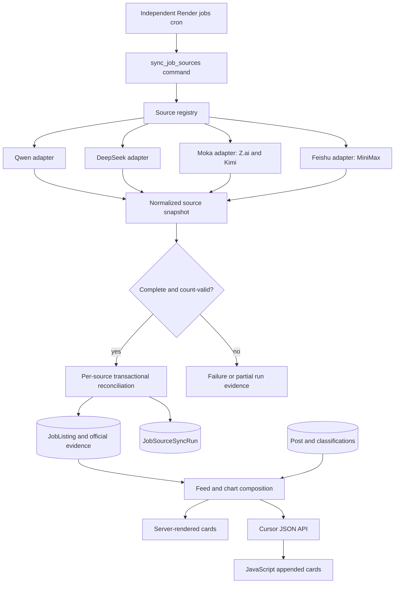
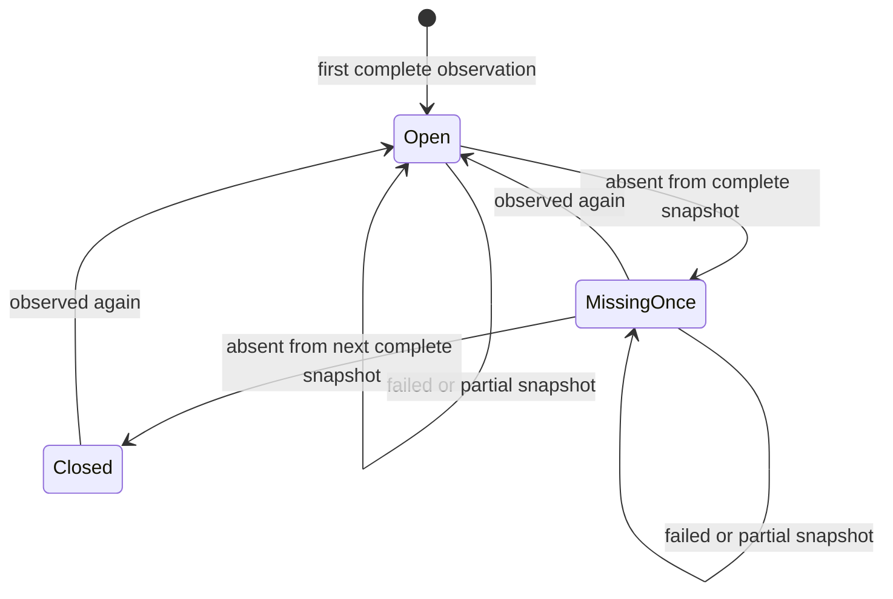
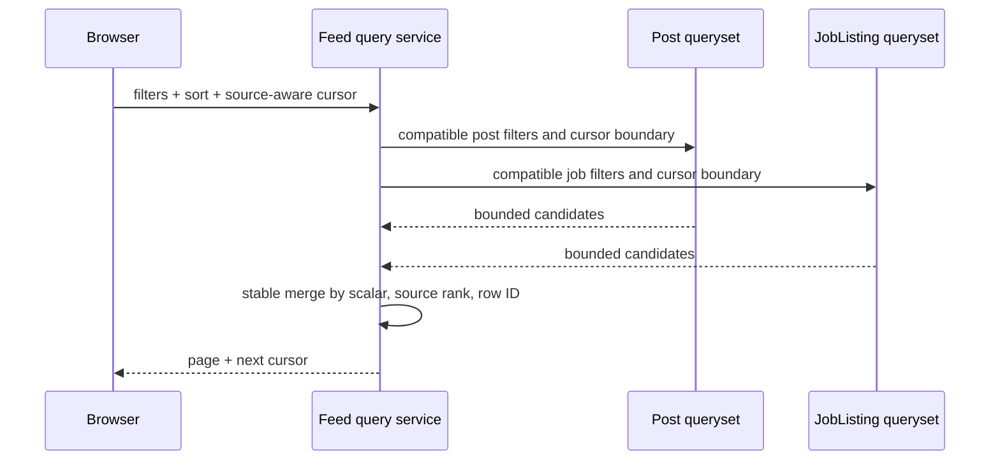

<!-- BEGIN OLLIJA DELIVERY GUIDE -->
## Ollija Delivery Guide

This block is generated guidance. Do not edit it directly. Correct durable facts in `.ollija/project.yaml` or this template, then rerun `ollija annotate-plan`. Put a user-directed exception in the editable Delivery Exceptions section below.

### Resolved locations

- Authoritative host: `fuchitalee`
- Authoritative repository: `/Users/fuchitalee/development/pushin-weight-v2`
- Ollija release worktree area: `/Users/fuchitalee/development/pushin-weight-v2/.worktrees`
- Active worktree: `/Users/fuchitalee/development/pushin-weight-v2/.worktrees/feat/direct-ai-lab-jobs-ingestion`
- Plan: `/Users/fuchitalee/development/pushin-weight-v2/.worktrees/feat/direct-ai-lab-jobs-ingestion/docs/plans/2026-09-12-133558-feat-direct-ai-lab-jobs-ingestion-plan.md`
- Change: `feat-direct-ai-lab-jobs-ingestion-2026-09-12-133558`
- Branch: `feat/direct-ai-lab-jobs-ingestion`
- Staging branch and blueprint: `staging`, `/Users/fuchitalee/development/pushin-weight-v2/.worktrees/feat/direct-ai-lab-jobs-ingestion/render-staging.yaml`
- Production branch and blueprint: `main`, `/Users/fuchitalee/development/pushin-weight-v2/.worktrees/feat/direct-ai-lab-jobs-ingestion/render.yaml`
- Staging URL: `https://pushinweight-staging-web.onrender.com`
- Production URL: `https://pushinweight-web.onrender.com`

### Placement

This worktree is inside the Ollija release worktree area. Reuse it for the whole change. Do not create a second worktree or plan for this branch.

### Delivery scope

- Workflow: `lfg`
- Delivery target: `staging`
- Owner selection recorded: `true`

1. Complete implementation and the plan's verification contract.
2. Run the configured focused checks:
   - `pytest tests/ollija`
3. The parent workflow commits only this plan's changes, pushes the feature branch, and records the candidate SHA.
4. Fetch the remote staging lane: `git fetch origin refs/heads/staging`.
5. Require the unchanged candidate SHA to be a fast-forward of that fetched remote ref, then push the exact candidate SHA to `refs/heads/staging` with the server-enforced fast-forward command `git push origin <candidate-sha>:refs/heads/staging`.
6. Verify the remote staging ref resolves to the candidate SHA and the Render deployment for `pushinweight-staging-web` reports that same SHA.
7. Run staging checks. Stop here if they fail.

### Failure handling

- Never promote a staging candidate whose automated checks failed.
- Implementation failures return to the parent implementation workflow for diagnosis, correction, recommit, and restaging.
- SSH, shell, environment, or multi-machine failures use the repository infra/multi-machine skill first.
- The change ledger is advisory; do not validate or enforce it.
- Never force-remove a worktree. Retain staging-only, failed, dirty, locked,
  noncanonical, or candidate-mismatched worktrees for diagnosis or later
  delivery.
- Do not run an endless retry loop or start a persistent Ollija process.
<!-- END OLLIJA DELIVERY GUIDE -->

## Delivery Exceptions

- The owner explicitly selected staging for this LFG run. Stop after the staging deployment is verified; do not promote to production.

# Direct AI Lab Jobs Ingestion - Plan

## Plain-English Summary

Pushin' Weight will pull current openings from the official recruiting sites for Qwen, DeepSeek, MiniMax, Z.ai/GLM, and Kimi, store them as the existing `JobListing` records, and show them in the dashboard whenever the `job_listings` post type is in scope. Each card will identify the lab and link to the official job page instead of pretending the listing came from X.

This adds a separate jobs sync command and Render cron. It does not add official-site traffic to the X harvest cycle, spend TwitterAPI credits, run job descriptions through the post classifier, or promote this change beyond staging. The ingestion layer is adapter-based so later official sources can be added without redesigning persistence or the feed.

Completion is verified with sanitized provider-contract tests, reconciliation and failure-safety tests, feed and chart integration tests, real browser checks for server-rendered and infinite-scroll job cards, a no-write live source smoke run, and exact-commit staging verification. The largest risk is upstream recruiting-site contract drift; source-level failures are therefore isolated, recorded, and forbidden from closing jobs unless a complete snapshot has succeeded twice without seeing them.

---

## Goal Capsule

- **Objective:** A visitor can use Pushin' Weight's existing jobs post type to discover current openings published by major Chinese AI labs and open the official application page, even when no X post announced the role.
- **Means:** Pull five official recruiting sources through isolated adapters, reconcile them into `JobListing`, and merge open listings into the existing feed and chart read paths without manufacturing `Post` rows. (KTD1, KTD2, KTD4)
- **Authority:** Product Requirements govern visible behavior; Key Technical Decisions govern implementation; the Ollija Delivery Guide and Delivery Exceptions govern delivery.
- **Execution profile:** Deep, cross-cutting Django implementation covering external HTTP contracts, persistence, scheduling, pagination, charts, and responsive feed rendering.
- **Stop conditions:** Stop for a source contract that cannot be consumed without credentials or bypassing access controls, a migration that cannot be made backward compatible, or any staging candidate that fails its verification contract.
- **Owner:** The LFG workflow implements, reviews, tests, commits, opens the pull request, and verifies the exact candidate on staging.

---

## Product Contract

### Summary

Add first-party website ingestion as a second content-source family beside X. The initial source set is Qwen, DeepSeek, MiniMax, Z.ai/GLM, and Kimi; all five publish item-level openings through an official lab domain or an applicant-tracking-system portal linked from that domain.

### Problem Frame

The dashboard currently discovers job announcements only when they appear in harvested X posts. That misses openings that exist only on a lab's recruiting site and makes freshness depend on social posting behavior. The database already has a detailed `JobListing` domain model, but those records are not a visible feed source and their current X-derived persistence path does not authoritatively update or close listings.

### Key Decisions

- **Official recruiting pages are the authority for this source family.** Third-party Chinese job aggregators may help discovery but cannot supply displayed records or closure decisions. Governs R1, R2, R6.
- **Official jobs remain part of the existing `job_listings` experience.** A separate jobs product or standalone page is out of scope. Governs R8, R9, R10.
- **This LFG run ends after staging is verified.** (session-settled: user-directed — chosen over production: the owner explicitly selected staging for this first non-X source rollout.) Governs R16.

### Requirements

**Source coverage and provenance**

- R1. A sync can retrieve all currently published item-level openings from Qwen, DeepSeek, MiniMax, Z.ai/GLM, and Kimi using only public official recruiting surfaces.
- R2. Every persisted direct listing records a dedicated source key, stable source listing ID, official canonical and application URLs, raw source payload, observed timestamp, and `official` evidence; X-derived listings keep a null source key and cannot enter direct-source reconciliation.
- R3. Each source adapter returns the same normalized listing contract while retaining source-specific parsing, pagination, headers, decryption, and validation inside the adapter boundary.

**Reconciliation and safety**

- R4. Repeating an unchanged sync is idempotent: it updates observation metadata without creating duplicate listings or feed items.
- R5. A changed upstream listing overwrites source-owned fields, refreshes its content hash, and reopens a previously closed listing when the official source publishes it again.
- R6. A listing is closed only after it is absent from two consecutive complete successful snapshots of its own source; partial, empty-anomalous, timed-out, malformed, or failed snapshots never advance closure state.
- R7. Failure in one source is recorded and does not roll back or prevent successful reconciliation of other selected sources.

**Dashboard behavior**

- R8. Open direct listings participate in home and brand feed results whenever `job_listings` is selected or all post types are active, and they are excluded when another post-type selection does not include jobs.
- R9. Direct listing cards show the lab, title, locations and available role metadata, observed/published time, and an official-source link; they do not show X handles, follower counts, engagement counts, X icons, or synthesis-pending states.
- R10. Mixed X posts and direct listings have deterministic, cursor-based pagination for date and engagement sorts with no duplicates or skipped rows across page boundaries.
- R11. Dashboard post-type and brand chart counts include direct listings under `job_listings`; filters that a direct listing cannot satisfy, such as sentiment or nationalism selections, exclude it rather than inventing values.
- R12. Server-rendered initial rows and JavaScript-inserted rows have equivalent source-aware markup, labels, keyboard behavior, responsive layout, and safe escaped text.

**Operations and extensibility**

- R13. Operators can run all enabled sources or named sources, perform a no-write dry run, and disable closure reconciliation for diagnosis from one management command.
- R14. Every non-dry-run source attempt records timing, completion state, expected and observed counts, create/update/unchanged/reopen/close counts, and a bounded error summary suitable for production diagnosis.
- R15. A separate Render cron runs official job ingestion on its own schedule and cannot trigger X harvesting, post classification, translation, synthesis, or TwitterAPI credit use.
- R16. The implementation is committed and pushed through the feature branch, deployed to staging as the same exact commit, and not promoted to production in this run.

### Actors

- A1. **Dashboard visitor** filters or browses feed activity and opens an official job application.
- A2. **Operator** runs or diagnoses source synchronization and uses persisted run evidence to distinguish healthy absence from crawler failure.
- A3. **Official recruiting source** publishes the authoritative role identity, content, status, and destination URL.
- A4. **Future adapter author** adds another lab by implementing the normalized source contract and registering configuration.

### Key Flows

- F1. Scheduled pull
  - **Trigger:** The independent Render cron invokes the management command.
  - **Actors:** A2, A3
  - **Steps:** Resolve selected sources; fetch each independently with bounded retries and pages; validate completeness; reconcile inside a per-source transaction; record the run.
  - **Outcome:** Healthy sources refresh listings while any failed source leaves its prior listings unchanged.
  - **Covered by:** R1–R7, R13–R15
- F2. Jobs feed discovery
  - **Trigger:** A1 opens a home or brand feed with all post types or `job_listings` active.
  - **Actors:** A1
  - **Steps:** Apply compatible filters to posts and open listings; merge ordered candidates; issue a source-aware cursor; render source-aware cards.
  - **Outcome:** X announcements and official listings appear as one deterministic jobs result set with correct destinations.
  - **Covered by:** R8–R12
- F3. Safe closure
  - **Trigger:** A complete source snapshot omits a previously open source-managed listing.
  - **Actors:** A2, A3
  - **Steps:** Increment the listing's miss counter; keep it open after the first miss; close it after a second consecutive complete miss; reset the counter whenever it reappears.
  - **Outcome:** Removed roles disappear after confirmation without transient source failures causing mass closure.
  - **Covered by:** R4–R7, R14

### Acceptance Examples

- AE1. **Covers R1, R2, R4.** Given Qwen returns the same 260 stable IDs twice, when two syncs complete, then 260 source-managed listings exist for Qwen, their `last_seen_at` advances, and no duplicates are created.
- AE2. **Covers R5, R6.** Given an open MiniMax role disappears from one complete snapshot and returns in the next, when both runs reconcile, then it never closes and its miss counter returns to zero.
- AE3. **Covers R6, R7.** Given the Moka response for Kimi is malformed after Z.ai synced successfully, when the command finishes, then the Kimi run fails without advancing misses while Z.ai remains committed and the command reports a non-zero overall result.
- AE4. **Covers R8–R10.** Given the jobs filter matches both an X announcement and a direct DeepSeek listing at the same timestamp, when A1 paginates, then each appears once in stable order and the direct card opens `talent.deepseek.com` or its official Moka destination rather than X.
- AE5. **Covers R11.** Given all post types are active, direct jobs add to chart and feed counts; when a negative-sentiment filter is active, those jobs are absent from both because the source provides no sentiment judgment.
- AE6. **Covers R12.** Given a title contains HTML-like text and a description contains upstream HTML, when initial and appended cards render, then visible text is escaped, no upstream markup executes, and both card paths expose the same official link and job metadata.
- AE7. **Covers R13–R15.** Given the command runs with dry-run for one named source, then it fetches and validates that source, prints counts, writes no listing or run rows, and makes no TwitterAPI or LLM calls.
- AE8. **Covers R16.** Given the candidate passes local and browser gates, when staging delivery completes, then the remote `staging` ref and `pushinweight-staging-web` deployment report the candidate SHA and production remains unchanged.

### Success Criteria

- A healthy live dry run retrieves a non-zero, complete snapshot from each of the five official sources and reports totals consistent with the source response.
- The `job_listings` feed can show an official listing on both the home page and its mapped brand page with no X-only chrome.
- Two identical fixture-backed syncs and two paginated feed reads prove idempotency and cursor stability.
- Source breakage is diagnosable from `JobSourceSyncRun` without inspecting Render logs, and cannot close listings until completeness gates pass twice.

### Scope Boundaries

**In scope**

- Public official social-recruitment listings for the five initial labs.
- Source adapters, authoritative reconciliation, run telemetry, a management command, a separate cron, feed/chart integration, and source-aware card presentation.
- Existing `JobListing` rows derived from X remain readable and unchanged unless they share the exact direct-source identity.

**Deferred to Follow-Up Work**

- Additional labs such as StepFun, Baichuan, 01.AI, ByteDance Seed, and overseas labs.
- Push/webhook ingestion when a lab or applicant-tracking provider offers a documented callback contract.
- Translation or LLM synthesis of full job descriptions, salary normalization, skills extraction, search alerts, and notification delivery.
- Cross-source fuzzy deduplication between an X-derived listing and an official listing that lack a shared canonical URL or source ID.

**Outside this product's identity**

- Scraping private WeChat feeds, requiring applicant accounts, bypassing bot challenges, or republishing third-party aggregator records as authoritative openings.
- Applying for jobs or collecting applicant information.

### Sources / Research

- [Qwen C-end business careers](https://talent.quark.cn/off-campus/position-list?lang=zh) exposes a public paginated JSON search response with stable numeric IDs, complete descriptions, requirements, locations, and modification times; [Alibaba identifies Qwen as its model family](https://www.alibabagroup.com/en-US/ai-governance/qwen).
- [DeepSeek Careers](https://talent.deepseek.com/) publishes a same-origin application bundle containing a normalized snapshot with stable IDs, locations, full HTML descriptions, and official Moka detail/apply URLs; its embedded metadata also names the official High-Flyer Moka source used as the stale-snapshot fallback.
- [MiniMax Careers](https://www.minimax.cn/careers) links its recruiting programs to the [official MiniMax Feishu portal](https://vrfi1sk8a0.jobs.feishu.cn/379481/), whose public search response contains stable IDs, descriptions, requirements, categories, cities, recruitment types, and publish times.
- [Z.ai Join Us](https://www.zhipuai.cn/zh/joinus) links social hiring to the [official Zhipu Moka portal](https://app.mokahr.com/social-recruitment/zphz/148983?locale=zh-CN#/jobs).
- [Kimi Careers](https://careers.kimi.com/) links openings to the [official Moonshot Moka portal](https://app.mokahr.com/social-recruitment/moonshot/148506#/jobs).
- Repository anchors: `core/models.py` already owns `JobListing`, `JobListingEvidence`, `Post`, and feed classification models; `core/targeted_extraction.py` demonstrates X-derived listing identity/evidence persistence; `monitor/views.py`, `monitor/templates/monitor/_feed_initial_v22.html`, and `monitor/static/pw-feed.js` own current feed filtering, pagination, serialization, and the two rendering paths.

---

## Planning Contract

### Key Technical Decisions

- KTD1. **Use pull-based source adapters behind one normalized contract.** None of the five official surfaces offers a documented push callback; a bounded scheduled pull is the only common mechanism and keeps provider quirks isolated. Governs R1, R3, R7, R13–R15.
- KTD2. **Persist official openings as `JobListing`, never synthetic `Post` rows.** Read-time composition keeps non-X identifiers out of Twitter metrics, enrichment, classification, and synthesis code while preserving one authoritative job record. Governs R2, R4, R5, R8–R12, R15.
- KTD3. **Treat a snapshot as complete only when pagination terminates consistently and observed count equals the provider's declared total.** A zero snapshot after a prior non-zero success is anomalous unless the adapter explicitly proves zero is valid. A DeepSeek embedded snapshot older than 14 days or missing its crawl timestamp must fall back to the official linked Moka source before the adapter can declare failure. Governs R1, R6, R7, R14.
- KTD4. **Reconcile each source independently and close after two complete misses.** Source-owned fields overwrite on hash change; failures and incomplete snapshots commit only the failed run record and do not mutate listing observation or miss state. Governs R4–R7, R14.
- KTD5. **Use one versioned, source-aware feed cursor across heterogeneous rows.** It carries the active sort, order, scalar sort value, source rank, and stable row ID; old valid post cursors remain readable for created-at pagination during the rollout. Governs R8, R10.
- KTD6. **Direct jobs have no inferred social signals.** They contribute `job_listings` and brand identity only; sentiment, nationalism, product label, engagement, role geography, and synthesis remain absent. Governs R9, R11, R12.
- KTD7. **Declare `cryptography` as a direct dependency for Moka's public-client AES response envelope.** The adapter obtains the per-session initialization vector from Moka's public bootstrap and the response key from each envelope; no fixed secrets or copied browser bundle code are stored. Governs R1–R3.
- KTD8. **Schedule a separate job-source cron.** It runs outside `CycleRunner` and `run_cycle`, so source drift and scheduling cannot alter X locks, cursors, credit accounting, or classifier follow-ups. Governs R7, R13–R15.
- KTD9. **Deliver only to staging in this run.** (session-settled: user-directed — chosen over production: the owner explicitly selected staging for this first non-X source rollout.) Governs R16.
- KTD10. **Serialize each mutating source run with a database-backed 30-minute lease.** The command atomically claims a `JobSourceState` row before network work, rejects an active lease, and can replace an expired lease only after marking its abandoned run failed; read-only dry runs do not claim or alter the lease. Governs R4, R6, R7, R13, R14.

### High-Level Technical Design

**Component and data flow**

**Snapshot and listing lifecycle**

**Mixed feed pagination**

### Source Adapter Matrix

| Source key | Brand | Official transport | Completeness proof | Notable normalization |
|---|---|---|---|---|
| `qwen` | `qwen` | Quark Talent session plus CSRF-protected paginated JSON search | `totalCount`, page size, and collected unique IDs agree | Millisecond publish/modify timestamps; description plus requirement text |
| `deepseek` | `deepseek` | Same-origin careers snapshot, with its linked High-Flyer Moka portal as the stale/malformed fallback | Embedded or Moka `total` equals unique job count | HTML stripped for feed text; official detail and apply URLs retained |
| `minimax` | `minimax` | Feishu public JSON search with portal headers | `count`, offset exhaustion, and unique IDs agree | Description and requirement joined; cities/categories/recruit type mapped |
| `zhipu` | `glm` | Moka bootstrap session plus encrypted paginated JSON | `jobStats.total`, page exhaustion, and unique IDs agree | AES-CBC envelope decrypted from per-page IV and per-response key |
| `kimi` | `moonshot_kimi` | Same Moka adapter with separate organization/site config | `jobStats.total`, page exhaustion, and unique IDs agree | Organization/site-specific URLs and departments retained |

### Assumptions

- The public recruiting responses observed on 2026-09-12 remain accessible from Render's outbound network; a staging dry run is the verification point for IP- or region-specific behavior.
- Direct listing display time uses `posted_at`, then `updated_source_at`, then `first_seen_at`; this keeps officially dated roles in their published chronology while still showing sources without a publish timestamp.
- Engagement sort assigns direct listings the neutral scalar `0`; the cursor's source rank and stable ID make the zero-value tail deterministic.
- Existing brands `qwen`, `deepseek`, `minimax`, `glm`, and `moonshot_kimi`, plus the `job_listings` and `neutral` taxonomy keys, remain seeded prerequisites. The command fails that source clearly if a mapped brand is absent.

### Implementation Constraints

- Source endpoints and allowed hosts are code-owned configuration, never request parameters, which prevents server-side request forgery. Redirects and stored destination URLs must stay on each source's explicit lab and applicant-tracking host allowlist.
- HTTP requests use explicit connect/read timeouts, bounded retries with jitter for transient statuses, maximum pages/records/response bytes, a descriptive user agent, and HTTPS-only redirect validation.
- Upstream HTML is converted to plain text for dashboard display and never marked safe. URLs are accepted only after HTTPS scheme and configured-host validation.
- Source configuration records the checked robots policy and public entry page. The client never logs in, solves challenges, or follows a route the source prohibits for automated access.
- The direct sync does not call `CycleRunner`, classifiers, translators, synthesis queues, or metrics refresh.
- Staging cron follows the repository's manual-only cron convention; the command is invoked manually for staging proof. Production scheduling is described in `render.yaml` but is not applied in this run.

### Sequencing

U1 establishes source and lifecycle persistence. U2 builds and proves the adapters. U3 adds reconciliation and the command. U4 composes direct jobs into the read model. U5 makes both render paths source-aware. U6 adds scheduling and operational documentation. U7 runs full verification and staging delivery after all prior units pass.

### Alternatives Considered

- **Create synthetic `Post` rows for every job.** Rejected because namespaced fake tweet IDs would leak into X-only metrics, enrichment, synthesis, and maintenance paths and duplicate the authoritative `JobListing` data.
- **Show a standalone jobs page.** Rejected because the product decision is to use the existing jobs post type and brand/feed interaction model.
- **Crawl a Chinese third-party aggregator or WeChat account.** Rejected as the primary source because authorship, item identity, update timing, and closure state are weaker than the official recruiting contracts.
- **Close on the first missing snapshot.** Rejected because applicant-tracking systems can transiently return incomplete pages or zero results; two complete misses add one sync interval of delay in exchange for protection from destructive false closure.
- **Embed official-source fetching in `run_cycle`.** Rejected because it couples unrelated failure domains and risks changing X credit, locking, and post-fetch behavior.

### System-Wide Impact

- **Data lifecycle:** `JobListing` becomes both an extracted intelligence artifact and a first-class feed source. Only registered direct sources participate in authoritative updates and closure.
- **API contract:** Feed rows gain a stable `source_kind`, `source_url`, and job payload while preserving current X fields for compatibility. Cursor versioning changes to support both row kinds.
- **Dashboard consistency:** Home feed, brand feed, and chart aggregation must apply the same direct-job eligibility rules so counts and cards do not disagree.
- **Operations:** A new external-data cron and persistent run ledger add monitoring responsibilities but remain isolated from harvest cycles.
- **Security:** Upstream content and redirects are untrusted input despite official origin; text and links are normalized before persistence/rendering.

### Risks & Mitigations

| Risk | Consequence | Mitigation |
|---|---|---|
| Provider response shape or encryption changes | One lab stops refreshing | Adapter contract fixtures, strict validation, DeepSeek's independent official Moka fallback, isolated failures, bounded error evidence, and no closure on incomplete runs |
| Provider blocks Render egress | Staging/prod source failure despite local success | Required staging live dry run; source-specific run evidence; no coupling to other sources |
| Bad completeness signal | Mass false closure | Declared-total equality, unique-ID checks, zero anomaly gate, two complete misses, and `--no-close` diagnostic mode |
| Mixed cursor boundary bug | Duplicate or skipped cards | Source-ranked cursor key and multi-page tie tests for both sort modes and directions |
| Unsafe upstream content | Cross-site scripting or malicious redirect | Plain-text rendering, normal template/DOM escaping, HTTPS and host allowlists, payload-size caps |
| Chart/feed eligibility drift | Counts disagree with visible cards | One shared direct-job compatibility predicate and regression tests across home and brand paths |
| Migration affects existing X-derived jobs | Existing intelligence data changes unexpectedly | Nullable/defaulted fields, source-scoped reconciliation, and characterization tests proving non-registered sources remain unchanged |

### Documentation / Operational Notes

- Extend `docs/deploy/render.md` with manual dry-run, selected-source, no-close, first live sync, failure diagnosis, and staging verification procedures.
- Document each source's official entry URL, provider, configured brand, expected completeness field, and adapter fixture refresh procedure near the source registry.
- Log one concise structured completion line per source; keep raw payloads in listing records and bounded summaries in run rows rather than logging complete descriptions.

---

## Implementation Units

### U1. Persist source sync lifecycle

- **Goal:** Add the durable state needed for source-scoped reconciliation, missed-listing confirmation, and operator-visible run evidence.
- **Requirements:** R2, R4–R7, R14
- **Dependencies:** None
- **Files:** `core/models.py`, `core/migrations/0040_direct_job_sources.py`, `tests/test_direct_job_sync.py`, `tests/test_stage1c_intelligence_schema.py`
- **Approach:**
  1. Add a nullable dedicated source key and defaulted reconciliation fields to `JobListing`, including consecutive complete misses and last complete observation.
  2. Add `JobSourceSyncRun` with source key, status, snapshot completeness, declared/observed totals, reconciliation counters, timing, bounded error detail, and metadata.
  3. Add `JobSourceState` for KTD10's lease plus last-successful snapshot count and timestamp.
  4. Add constraints and indexes for source/status diagnosis while leaving X-derived rows valid and untouched.
  5. Expose run and state evidence through the Django object-relational mapper and documented operator queries; this repository has no Django admin surface.
- **Patterns to follow:** `JobListing`, `JobDiscoveryRun`, and other run-ledger models in `core/models.py`; migration and schema assertions in `tests/test_stage1c_intelligence_schema.py`.
- **Test scenarios:**
  - A direct listing accepts zero misses and a last-complete timestamp while a legacy X-derived listing remains valid with defaults.
  - Miss counts cannot be negative and run status/count combinations reject structurally invalid values.
  - A successful and a failed run retain their expected counters and bounded diagnostic metadata.
  - An unexpired source lease prevents a second claimant, while an expired lease marks its abandoned run failed before a new claimant proceeds.
- **Verification:** Django migration checks show no pending model changes, schema tests pass, and legacy job fixtures require no rewrites.

### U2. Implement official source adapters

- **Goal:** Fetch and normalize complete snapshots from all five official sources behind a common interface.
- **Requirements:** R1–R3, R7, R14
- **Dependencies:** U1
- **Files:** `pyproject.toml`, `uv.lock`, `core/job_sources/__init__.py`, `core/job_sources/types.py`, `core/job_sources/http.py`, `core/job_sources/registry.py`, `core/job_sources/adapters.py`, `tests/test_job_source_adapters.py`, `tests/test_job_source_http.py`
- **Approach:**
  1. Define immutable normalized listing and snapshot values with source key, brand, completeness, totals, URLs, role fields, timestamps, and raw payload.
  2. Add a bounded HTTP client enforcing KTD3 and the implementation security constraints.
  3. Implement Qwen, DeepSeek, Feishu, and reusable Moka adapters from the Source Adapter Matrix.
  4. Register Z.ai and Kimi as separate configurations of Moka so adding another Moka tenant is configuration plus fixtures, not copied parser code.
  5. Record sanitized contract payloads that preserve provider shapes without cookies, tokens, or applicant data.
- **Execution note:** Start with fixture contract tests for every observed provider response before adding network logic.
- **Patterns to follow:** Typed boundary values in `core/targeted_extraction.py`; request retry conventions already used under `x_monitor/`.
- **Test scenarios:**
  - **Covers AE1.** Each fixture yields its declared unique count and representative normalized IDs, titles, descriptions, locations, timestamps, and URLs.
  - Multi-page Qwen, Feishu, and Moka fixtures stop exactly at the declared total without duplicating IDs.
  - A duplicate ID, total mismatch, oversized response, non-HTTPS redirect, disallowed destination host, or malformed timestamp marks the snapshot incomplete or fails the adapter without returning a closable snapshot.
  - Moka bootstrap extraction obtains the IV, decrypts a response envelope with its response key, and rejects invalid padding or non-JSON plaintext.
  - DeepSeek resolves the current same-origin bundle rather than assuming a fixed asset filename, falls back to the linked Moka portal after 14 days or malformed snapshot data, and rejects the source only if both paths fail.
  - A transient timeout/status retries within the cap; a permanent response error stops after the cap with a bounded diagnostic.
- **Verification:** All recorded-source fixtures normalize through one contract, no adapter logs secrets or descriptions, and a live dry run can identify current totals without database writes.

### U3. Reconcile listings and expose the sync command

- **Goal:** Apply source snapshots idempotently, safely update or close listings, and give operators a single controllable entry point.
- **Requirements:** R2, R4–R7, R13–R15
- **Dependencies:** U1, U2
- **Files:** `core/job_sources/runner.py`, `core/job_sources/sync.py`, `core/management/commands/sync_job_sources.py`, `tests/test_direct_job_sync.py`, `tests/test_sync_job_sources_command.py`
- **Approach:**
  1. Claim and release KTD10's source lease around each independent fetch-and-reconcile attempt so successful sources commit independently.
  2. Derive direct identities from the dedicated source key plus stable source ID and upsert all source-owned fields on hash change.
  3. Normalize tracking parameters out of stable canonical URLs, preserve direct application destinations, and upsert one official evidence record per direct listing/source without unbounded per-run growth.
  4. Apply KTD4 only after KTD3 passes; reset misses on observation, reopen observed roles, and close after the second complete miss.
  5. Support all or repeated named `--source`, `--dry-run`, and `--no-close`; return failure when any requested source fails while preserving other source commits.
- **Execution note:** Implement reconciliation test-first, especially the two-miss and failed-snapshot paths, because closure is the destructive boundary.
- **Patterns to follow:** Transactional upserts and evidence logic in `_persist_jobs` under `core/targeted_extraction.py`; Django command result patterns in `core/management/commands/`.
- **Test scenarios:**
  - **Covers AE1.** Two identical complete snapshots create once, advance observation fields, and report unchanged on the second run.
  - A changed title, description, location, application URL, or source status overwrites the corresponding source-owned value and changes `content_hash`.
  - **Covers AE2.** One complete miss keeps a listing open, a reappearance resets misses, two consecutive complete misses close it, and a later observation reopens it.
  - **Covers AE3.** A malformed Kimi snapshot writes a failed Kimi run, advances no Kimi listing state, preserves a separately committed successful Z.ai result, and makes the command fail overall.
  - A dry run and a no-close run report prospective counters while writing no rows or while suppressing closure respectively.
  - An X-derived listing with an unregistered source name remains unchanged through every reconciliation path.
  - Concurrent invocation for the same source follows KTD10 without duplicate listings or overlapping closure decisions, including stale-lease recovery.
- **Verification:** Command tests prove counters match database effects, failure isolation and closure guards hold, and querying run rows explains each result without raw log inspection.

### U4. Compose official listings into feed and chart reads

- **Goal:** Make open direct jobs first-class results in home/brand feeds and post-type charts without changing their persistence identity.
- **Requirements:** R8, R10, R11
- **Dependencies:** U1, U3
- **Files:** `monitor/views.py`, `tests/test_direct_job_feed.py`, existing home and brand feed/chart regression tests as needed
- **Approach:**
  1. Define a shared predicate for whether direct listings can satisfy active brand, post-type, language, social-signal, geography, and unsanctioned filters per KTD6.
  2. Query open registered-source listings by their display timestamp and merge bounded candidates with post candidates using KTD5.
  3. Serialize a source-neutral row contract with `source_kind`, official URLs, brand identity, job metadata, and no synthetic social or synthesis values.
  4. Extend home and brand chart aggregation to add eligible listing buckets under `job_listings` using the same predicate.
  5. Preserve post-only behavior and old created-at cursor decoding when no direct listing is eligible.
- **Execution note:** Add characterization coverage for current post-only cursor and filter results before changing the merge path.
- **Patterns to follow:** `_feed_page_posts`, `_feed_page_wire`, `_filter_home_posts_queryset`, `_serialize_feed_row`, and chart payload builders in `monitor/views.py`.
- **Test scenarios:**
  - Direct jobs appear for all post types and jobs-only filters on home and mapped brand pages, but not for a non-job post-type selection or the wrong brand.
  - **Covers AE4.** Equal-timestamp post/job ties paginate through date ascending and descending without duplicates or skips.
  - Engagement ascending/descending pagination places zero-engagement jobs deterministically relative to posts at zero and non-zero counts.
  - **Covers AE5.** Chart and feed include the same direct jobs with compatible filters and both exclude them for sentiment, product-label, nationalism, unsupported language, role-other, country, or region filters.
  - Closed, future, unknown, and unregistered-source listings do not appear.
  - A legacy cursor remains safe and deterministic, while a malformed or mismatched new cursor restarts at the first page without an error.
- **Verification:** Home and brand JSON responses, initial page context, and chart buckets agree for mixed fixtures; the existing post-only regression suite remains unchanged.

### U5. Render source-aware job cards in both feed paths

- **Goal:** Present direct jobs as official job listings rather than X posts in server-rendered and appended cards.
- **Requirements:** R9, R12
- **Dependencies:** U4
- **Files:** `monitor/templates/monitor/_feed_initial_v22.html`, `monitor/templates/monitor/_feed_initial_legacy.html`, `monitor/templates/monitor/brand_home.html`, `monitor/static/pw-feed.js`, `monitor/static/home-v20.css`, `monitor/static/dashboard.css`, `tests/test_direct_job_feed.py`, `tests/test_pw_feed_job_cards.js`, `tests/test_home_v22_browser.py`
- **Approach:**
  1. Branch card chrome on `source_kind` while keeping shared brand and post-type signal presentation.
  2. Render lab identity, job title, locations, department/function/employment metadata, display time, and one official destination link for direct jobs.
  3. Omit follower, engagement, X-handle, X-icon, enrichment, and synthesis controls for direct jobs in both templates and JavaScript.
  4. Preserve escaping, keyboard interaction, inspection popovers, responsive two-column layout, and existing X card output.
- **Execution note:** Follow `.claude/skills/fix-ui/SKILL.md`; inspect the live DOM before edits and compare initial versus appended cards in a real browser.
- **Patterns to follow:** Existing row data attributes and signal painter in `_feed_initial_v22.html` and `pw-feed.js`; current responsive feed styles rather than a parallel card system.
- **Test scenarios:**
  - A direct job row contains an official HTTPS link and job metadata but no `x.com`, follower, engagement, or pending-synthesis UI.
  - **Covers AE6.** HTML-like title text and upstream description markup render as text in both SSR and JavaScript paths without executable nodes or attribute injection.
  - X rows remain byte/structure compatible for their source links and engagement controls.
  - Keyboard focus and activation reach the official link, long Chinese titles/descriptions wrap without horizontal overflow, and mobile/desktop layouts preserve the signal column.
- **Verification:** Template/JavaScript tests and a browser run prove parity for initial and infinite-scroll job cards at desktop and mobile viewports with no console errors.

### U6. Add isolated scheduling and operator documentation

- **Goal:** Make the pull repeatable in Render and diagnosable without coupling it to the X cycle.
- **Requirements:** R13–R15
- **Dependencies:** U3
- **Files:** `render.yaml`, `render-staging.yaml`, `config/staging_refresh.yaml`, `docs/deploy/render.md`, `docs/operations/staging-data-refresh.md`, deployment/config tests
- **Approach:**
  1. Add a production jobs cron at a conservative interval and a staging manual-only equivalent using the repository's impossible schedule convention.
  2. Reuse the web service environment/database wiring without adding a worker, beat, broker, TwitterAPI credential, or LLM credential dependency.
  3. Document source selection, dry-run, no-close, first sync, run-ledger queries, fixture refresh, and source-disable/failure response.
- **Patterns to follow:** Existing web/harvest service environment anchors in both Render blueprints and the manual-only staging cron pattern.
- **Test scenarios:**
  - Blueprint parsing finds exactly one new jobs cron per environment with the sync command and no `run_cycle` or Celery beat command.
  - **Covers AE7.** The staging definition is manual-only and the dry-run path has no database writes or TwitterAPI/LLM calls.
  - Existing harvest service names, schedules, suspension state, and commands remain unchanged.
- **Verification:** Render YAML validates, focused configuration tests pass, and the runbook gives an operator exact safe commands and failure interpretation.

### U7. Verify and stage the exact candidate

- **Goal:** Prove the integrated system locally and on staging, then stop at the owner-selected delivery boundary.
- **Requirements:** R1–R16
- **Dependencies:** U1–U6
- **Files:** No product files expected; only review fixes within prior unit scope and pull-request metadata.
- **Approach:**
  1. Run the Verification Contract, simplify the settled diff, perform code and data-safety review, and resolve all blocking findings.
  2. Run live no-write source smoke checks and browser tests after deterministic tests pass.
  3. Follow the Ollija guide to commit only scoped changes, push the feature branch, open the pull request, fast-forward the exact candidate to `staging`, and verify Render reports that SHA.
  4. Run staging database, command dry-run, web, and browser checks; retain the staging worktree and stop without production promotion per KTD9.
- **Patterns to follow:** Ollija Delivery Guide, Delivery Exceptions, and `docs/deploy/render.md`.
- **Test scenarios:**
  - **Covers AE8.** Remote staging and Render report the exact reviewed candidate SHA while production remains on its prior ref/deployment.
  - Staging migration and system checks pass before any source writes.
  - A staging dry run retrieves non-zero complete snapshots for every source and the authenticated jobs feed renders an official listing after the controlled write sync.
- **Verification:** All gates are green, the pull request records evidence and staging URL, exact-SHA staging checks pass, and no production action occurs.

---

## Verification Contract

| Gate | Applies to | Command or evidence | Pass condition |
|---|---|---|---|
| Model and migration integrity | U1 | `python manage.py makemigrations --check --dry-run`; targeted schema tests | No pending migrations; new defaults preserve legacy rows |
| Adapter contracts | U2 | `pytest tests/test_job_source_adapters.py tests/test_job_source_http.py` | All provider shapes, pagination, completeness, retry, response bounds, and security cases pass |
| Reconciliation and command | U3 | `pytest tests/test_direct_job_sync.py tests/test_sync_job_sources_command.py` | Idempotency, update, reopen, two-miss close, dry-run, isolation, and concurrency cases pass |
| Feed/chart backend | U4 | Targeted new tests plus existing home/feed/chart test modules selected from the diff | Mixed pagination and filter/chart parity pass without post-only regressions |
| Static renderer | U5 | `node --test tests/test_pw_feed_job_cards.js` plus relevant existing JavaScript formatter tests | Initial/appended source-aware markup stays equivalent and escaped |
| Browser behavior | U5 | Focused `tests/test_home_v22_browser.py` cases under the browser-test skill | Desktop/mobile direct job cards and infinite scroll work with no console errors |
| Blueprint and runbook | U6 | Render configuration tests and YAML parse | Separate jobs crons exist; current harvest/worker topology is unchanged |
| Full regression | U1–U6 | `pytest`; repository lint checks; `python manage.py check --deploy`; `pytest tests/ollija` | All relevant deterministic gates pass or pre-existing unrelated failures are evidenced |
| Live contracts | U2, U3 | `python manage.py sync_job_sources --dry-run` | Every enabled source returns a non-zero complete snapshot and no rows change |
| Staging exactness | U7 | Remote ref, Render deploy metadata, migration/system checks, command dry run, authenticated browser evidence | Staging serves the candidate SHA and the jobs flow passes; production is untouched |

The live-contract gate is intentionally after fixture tests because it tests reachability and drift, not deterministic parser correctness. Any live failure blocks staging verification for that source; it is not waived as network flakiness.

---

## Implementation Evidence (pre-staging, 2026-09-13)

- The integrated affected-surface gate passes 172 tests, including the migration graph, source lifecycle, HTTP boundary, adapters, mixed feed/chart reads, staging refresh policy, Render topology, and Ollija checks.
- The official-card JavaScript test passes, and the existing feed formatter reports 102 passed assertions.
- The live no-write command validates 662 current listings: Qwen 260, DeepSeek 34, MiniMax 97, Z.ai/Zhipu 162, and Kimi/Moonshot 109.
- Both Render Blueprints validate. The staging plan contains one action, creation of `pushinweight-staging-jobs`; the production Blueprint was validated but will not be applied in this staging-only delivery.
- The full repository run completed with 3,552 passed, 78 skipped, 114 subtests passed, and 275 failures. Three failures exposed stale topology and staging-refresh expectations; those tests were updated and now pass in the 172-test affected-surface gate. A representative unrelated chart failure was reproduced unchanged from an archive of `origin/staging`.
- Local browser acceptance covered server-rendered and appended official job cards at desktop and mobile sizes, pagination from 50 to 100 rows, source-aware single-brand tables (including Zhipu pagination from 50 to 100 valid table rows), official-only links, readable lab names, and no page-level horizontal overflow or fresh console errors.
- The adversarial review findings were resolved: zero-after-nonzero snapshots are diagnostic-only, leases are rechecked before persistence, skipped attempts are recorded, counters are capped, DeepSeek malformed data falls back safely, China-local Moka times are preserved, cursors are strict, response bodies are streamed under a byte cap, and persisted network errors omit URLs and tokens.

---

## Definition of Done

- R1–R15 are implemented with passing unit, integration, security-boundary, and browser evidence.
- Each of Qwen, DeepSeek, MiniMax, Z.ai/GLM, and Kimi produces a complete non-zero live dry-run snapshot on the staging runtime.
- Open direct listings appear under `job_listings` in home and brand feeds and counts; source-incompatible filters exclude them consistently.
- Complete snapshots reconcile idempotently, failures preserve prior state, and closure requires two complete misses.
- The jobs cron is separate from the X harvest cycle and existing Render service commands/schedules remain unchanged.
- Documentation explains safe operation and source-contract maintenance.
- U1 is done when migration state, constraints, admin visibility, and legacy compatibility pass.
- U2 is done when all adapter fixtures and live no-write contracts pass.
- U3 is done when command and lifecycle transitions match counters under success, partial failure, concurrency, and dry-run.
- U4 is done when mixed feed pagination and feed/chart filter parity pass for home and brand views.
- U5 is done when both render paths pass static and real-browser accessibility, responsive, escaping, and regression checks.
- U6 is done when blueprints validate and operational instructions match the command and topology.
- U7 is done when the reviewed candidate is the exact SHA deployed and verified on staging, with no production promotion.
- No abandoned adapter experiments, captured credentials, browser artifacts, temporary fixtures, dead code, or unrelated working-tree changes remain in the diff.
