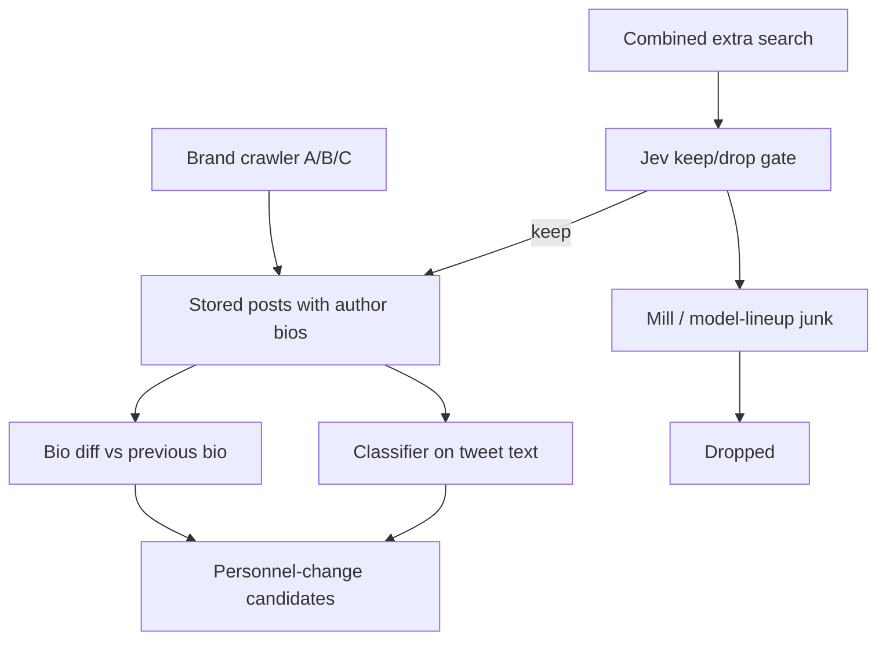
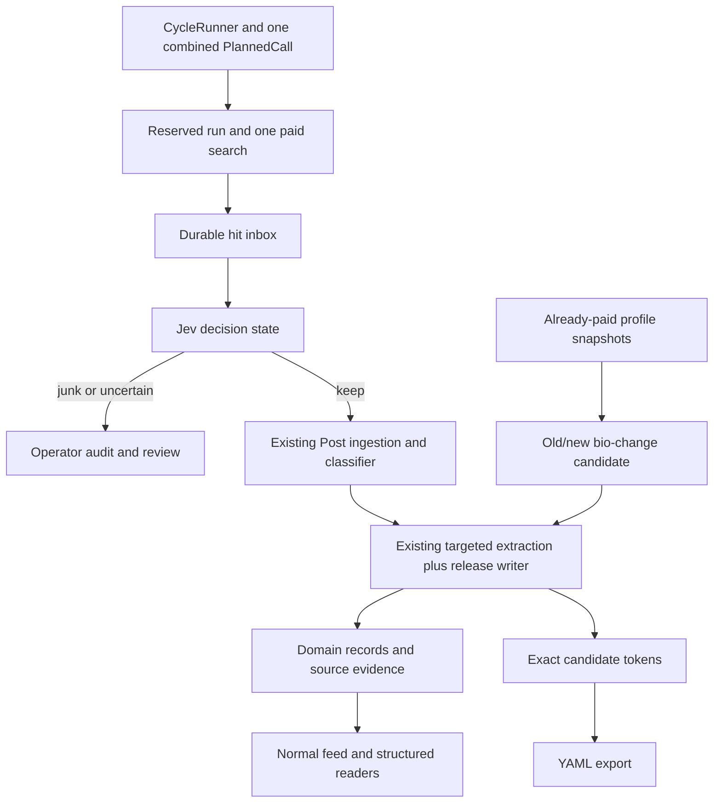

<!-- BEGIN OLLIJA DELIVERY GUIDE -->
## Ollija Delivery Guide

This block is generated guidance. Do not edit it directly. Correct durable facts in `.ollija/project.yaml` or this template, then rerun `ollija annotate-plan`. Put a user-directed exception in the editable Delivery Exceptions section below.

### Resolved locations

- Authoritative host: `fuchitalee`
- Authoritative repository: `/Users/fuchitalee/development/pushin-weight-v2`
- Ollija release worktree area: `/Users/fuchitalee/development/pushin-weight-v2/.worktrees`
- Active worktree: `/Users/fuchitalee/development/pushin-weight-v2`
- Plan: `/Users/fuchitalee/development/pushin-weight-v2/docs/plans/2026-09-21-081940-feat-combined-rare-type-extra-search-plan.md`
- Change: `feat-combined-rare-type-extra-search-2026-09-21-081940`
- Branch: `feat/combined-rare-type-extra-search`
- Staging branch and blueprint: `staging`, `/Users/fuchitalee/development/pushin-weight-v2/render-staging.yaml`
- Production branch and blueprint: `main`, `/Users/fuchitalee/development/pushin-weight-v2/render.yaml`
- Staging URL: `https://pushinweight-staging-web.onrender.com`
- Production URL: `https://pushinweight-web.onrender.com`

### Placement

1. Move this worktree from `/Users/fuchitalee/development/pushin-weight-v2` to `/Users/fuchitalee/development/pushin-weight-v2/.worktrees/feat/combined-rare-type-extra-search` before any other delivery action.
2. Rerun `ollija annotate-plan` after the move; this guide contains stale active-worktree paths until then.
Ollija does not move or reject the worktree.

### Delivery scope

- Workflow: `lfg`
- Delivery target: `staging`
- Owner selection recorded: `true`

1. Complete implementation and the plan's verification contract.
2. Run the configured focused checks:
   - `pytest tests/ollija`
3. The parent workflow commits only this plan's changes, pushes the feature branch, and records the candidate SHA.
4. Fetch the remote staging lane: `git fetch origin refs/heads/staging`.
5. Require the unchanged candidate SHA to be a fast-forward of that fetched remote ref, then push the exact candidate SHA to `refs/heads/staging` with the server-enforced fast-forward command `git push origin <candidate-sha>:refs/heads/staging`.
6. Verify the remote staging ref resolves to the candidate SHA and the deployment for `pushinweight-staging-web` reports that same SHA.
7. Run staging checks. Stop here if they fail.

### Failure handling

- Never promote a staging candidate whose automated checks failed.
- Implementation failures return to the parent implementation workflow for diagnosis, correction, recommit, and restaging.
- SSH, shell, environment, or multi-machine failures use the repository infra/multi-machine skill first.
- The change ledger is advisory; do not validate or enforce it.
- Never force-remove a worktree. Retain staging-only, failed, dirty, locked,
  noncanonical, or candidate-mismatched worktrees for diagnosis or later
  delivery.
- Do not run an endless retry loop or start a persistent Ollija process.
<!-- END OLLIJA DELIVERY GUIDE -->

## Delivery Exceptions

- Owner-directed, 2026-09-22: continue implementation and staging delivery in the existing authoritative checkout on `feat/combined-rare-type-extra-search`. Do not move it or create a replacement release worktree; this overrides the generated Placement instructions for this change only. Retain this checkout after staging.
- Owner-approved carryover: the existing uncommitted plan, handoff, trial assessment, `x_monitor/rare_type_extra_search.py`, `monitor/management/commands/trial_rare_type_extra_search.py`, `tests/test_rare_type_extra_search_query.py`, and `tests/test_trial_rare_type_extra_search.py` are inputs to this feature and may be updated and committed with it. Preserve all other pre-existing edits and untracked files; do not stage them.
- Execution stays in this checkout. Use serial native GPT-5.6 Sol workers for implementation and routine verification; do not use a detached-worker route that requires a clean canonical tree or creates additional worktrees. Astra retains planning and integration oversight.

# Combined Rare-Type Extra Search - Plan

## Plain-English Summary

PushinWeight will collect rare AI-related posts the brand crawler misses and turn useful discoveries into saved, source-linked records: personnel changes, jobs, events, opportunities, and model releases. The intended surface is the next 15-minute harvest, subject to the provider returning the post and the processing budget being available.

One combined search feeds a Jev keep/drop gate, then the existing classifier and extraction pipeline. Several reports of the same release become evidence for one model-release record. Conferences remain ordinary events. Changes to already-collected author bios provide a second source of personnel candidates, without inventing employment dates.

This is the full feature plan, including durable storage, unknown-name YAML exports, failure recovery, operator visibility, tests, and staging delivery. The existing trial command is only an early part of it. HuggingFace collection, automatic catalog promotion, and production activation remain out of scope. Staging stays manually triggered; this plan does not add another scheduler.

Completion requires evidence that a returned post reaches the correct record and visible surface, retries do not duplicate records or repeat paid searches, and the original harvest remains unchanged when the feature is off. One page has limited room: junk, repeated coverage, or a provider outage can prevent the 15-minute target. Those failures must be visible, not reported as successful coverage.

---

## Goal Capsule

- **Objective:** An operator sees personnel changes, job listings, events, opportunities, and new-model upgrades/releases the brand crawler missed, within about 15 minutes of the post appearing.
- **Means:** One tight combined extra TwitterAPI search on each 15-minute harvest, Jev routing to type or junk, plus bio diffs on already-collected author profiles. (KTD1, KTD2)
- **Authority:** Product Requirements govern visible behavior; Key Decisions constrain those requirements. The Ollija Delivery Guide and Delivery Exceptions govern delivery. The owner selected staging; production is not authorized.
- **Execution profile:** Full implementation plan. The implementation workflow owns coding, review, and exact-candidate staging verification; the planning deliverable does not itself execute those steps.
- **Stop conditions:** Stop if mill or conference-spam fills extra-search pages so personnel/job keepers are not returned. Stop if a bio observation time is treated as an employment start date.
- **Release stop conditions:** Failed quality gate, unresolved query overflow, unsafe credential routing, or a staging identity mismatch prevents enablement/delivery. Provider-limited recall is measured, never presented as complete coverage.

---

## Product Contract

### Summary

Add one tight combined extra Twitter search to each 15-minute harvest for personnel changes, job listings, events, opportunities, and model releases the brand crawler misses. Jev routes returned tweets to type or junk. Bio diffs remain a second personnel source. Keep extra searches disabled until a bakeoff and a bounded TwitterAPI.io trial pass. Do not turn on the unused jobs/personnel query packs as written.

### Problem Frame

The classifier only labels posts the harvest already stored. Personnel changes are rare in that set because the brand crawler is choosy: a list of official accounts, bare brand names for a few labs, and co-occurrence words like `llm` for ambiguous names.

A person writing “I recently left OpenAI” or “I've joined @deepseek_ai” with no catalog brand word never enters that net. A researcher who only updates their X bio also never looks like a personnel-change tweet. Unused jobs/personnel search strings exist in config and stay off; live Grok probes of those strings returned job-board spam, F1/Kimi collisions, and “model joined a lineup” hits.

TwitterAPI.io charges for every tweet it returns. Saving a duplicate in the database does not refund that charge. A 24-hour extra-search window on every 15-minute harvest would re-buy posts. A 15-minute lookback on a 15-minute extra call does not. Several loose extra calls every 15 minutes would pay the empty floor many times; one tight combined call pays it once. Mill hiring on that same page can crowd out a rare personnel post, so hiring language in the combined query stays narrow.

### Key Decisions

- **Personnel first, rewritten extra searches.** (session-settled: user-directed — chosen over enabling the unused jobs/personnel packs, adding events/opportunities searches, or adding no extra Twitter searches: live samples of the unused packs were mostly noise.) Governs R14, R18.
- **Org ring is all AI-related companies.** (session-settled: user-directed — chosen over AI-labs-only after later widening: mill junk and a typed gate must carry the extra volume.) Governs R1, R2, R12, R13, R19.
- **Mill job posts are junk, not a nationality rule.** (session-settled: user-directed — chosen over ingesting the hiring firehose: data-entry/temp/low-wage mill listings are the noise pattern, including the India job-board shape, not a ban on people.) Governs R12.
- **First-person quoted phrases, not a people roster or destination-org list.** Live probes showed a roster cannot discover unknown movers, and METR-style landing-pad hits mostly duplicated origin-lab phrases. Governs R3, R4.
- **Search in EN, ZH-CN, and JA.** (session-settled: user-directed — chosen over company-home-language-only: that split was raised and struck.) Governs R3.
- **Pay-avoidance is query-time.** Database uniqueness does not save TwitterAPI credits. Extra searches use miss-only language, including catalog `@handle` joins that a brand-name crawl can skip. Governs R5, R6, R7.
- **Combined extra search runs with the 15-minute harvest.** (session-settled: user-directed — chosen over a daily-only slot: the operator wants personnel and jobs surfaced within 15 minutes; one tight combined call keeps the empty-floor bill small.) Governs R6, R16, R20, R21.
- **Events and opportunities ride the same extra call.** (session-settled: user-directed — chosen over deferring them: combine everything so the 15-minute slot is worth running.) Governs R16, R21.
- **New-model upgrades/releases ride the same extra call.** (session-settled: user-directed — chosen over relying on A/B/C: Call A already sees official tracked-account posts; B/C miss new names and nicknames such as a dormant lab's “step 5 preview”.) Governs R22.
- **HuggingFace activity crawler is a later work unit.** (session-settled: user-directed to judge now — it lives in top-gun, polls `huggingface_hub`, and scores repos, not X posts. It can proceed independently and must not block this extra-search plan.) Governs the Scope Boundaries HuggingFace deferral.
- **Untracked company names accumulate in a YAML-shaped stopgap, persisted on the server.** (session-settled: user-directed — chosen over waiting for a full brand parser: extra-search hits on untracked orgs need a growing, disambiguated token list Jev can later score for catalog promotion.) Governs R13, R23, R24, R25.
- **Bio diffs are a second personnel source.** (session-settled: user-directed — chosen over tweet-text-only personnel detection: bios already arrive on harvested posts, and a silent bio rewrite is a real move.) Governs R8, R9, R10, R11.
- **Grok X search is research-only.** Production harvest stays TwitterAPI.io `advanced_search`. Governs R15, R17.
- **Jev is a typed extra-search gate, not the 0731 replacement.** (session-settled: user-directed — chosen over skipping Jev: a 2026-09-21 OpenRouter Decisions probe scored mill/lineup/joke drops correctly when first-person employment is a separate question.) Governs R19.

<!-- ce-section: work-relationships -->
### How This Work Fits Together

This plan owns extra-search capture and persistence of five rare types plus bio-diff personnel observation.

The broader picture:

- Official recruiting-site job sync — Independent. Shares `job_listings`. Spends no TwitterAPI credits. Covers five labs' career pages; X extra search is for listings those pages miss.
- Unused jobs/personnel discovery packs — Stay off as written.
- HuggingFace model-activity crawler — Separate later work. Existing design is in top-gun (`docs/plans/2026-05-16-001-feat-huggingface-collector-simplified-plan.md` and the 2026-05-15 discover-collector plan): `HfApi.list_models` / `list_datasets` / `list_spaces`, ingest to `topgun.db`. It does not harvest X and does not belong in this extra-search call.
- Jev promotion of untracked-name candidates to tracked brands — Later/out. This plan only accumulates disambiguated tokens (R23–R25).
- `brand_discovery_candidates` — Existing review queue. New token/evidence rows extend it without invoking its alias-merging or catalog-promotion paths. YAML is an export, not the durable database.
- Stage 1 classifier and targeted extraction — Shares `personnel_changes`, `job_listings`, `events`, and `opportunities` labels. This plan does not add a HuggingFace poller or a new taxonomy solely for HF repos.

### Actors

- A1. Operator — reviews unknown AI labs, reads personnel changes, decides whether extra searches may turn on after a trial.
- A2. Brand crawler — existing 15-minute list, brand-name, handle, and co-occurrence searches.
- A3. Combined extra search — one optional TwitterAPI.io search for five rare types; stays off until R17 passes.
- A4. Bio-diff watcher — compares successive author bios already stored on posts.
- A5. Classifier — labels `personnel_changes` on persisted posts; does not see unharvested tweets.

### Requirements

**Coverage**

- R1. Extra personnel searches collect first-person join, leave, and appointment posts about tracked catalog brands and about other AI-related companies.
- R2. Extra personnel searches include AI-related employers (AI labs, AI-product firms, and AI/ML roles at broader companies). Mill listings still drop per R12.
- R3. Extra search language is the first-person quoted family in the Appendix exhibit (English, Chinese, and Japanese), not bare `left` / `joined` OR-chains.
- R4. Extra searches include catalog `@handle` join phrases when the post never uses the brand word the name crawler already buys.

**Credit overlap**

- R5. Extra searches do not fetch every post that already contains a B1 bare brand word (MiniMax, Qwen, DeepSeek, StepFun, Hunyuan).
- R6. Combined extra search runs on each 15-minute harvest cycle. Lookback is since the last extra-search call (about 15 minutes). It is not a 24-hour window stacked on every cycle.
- R7. A tweet already in the database still costs credits if TwitterAPI returns it again; overlap control happens in the query, not after insert.

**Bio diffs**

- R8. A change between successive author bios collected on harvested posts is a personnel-change candidate.
- R9. An unchanged static bio is not a personnel change.
- R10. The time PushinWeight first sees a new bio is observation time only; it is never an employment start or end date unless the bio itself states a date.
- R11. A bio-change remains a personnel candidate when the tweet that carried the new bio is about something else.

**Quality**

- R12. Data-entry, temp, and low-wage mill job posts are dropped as junk and never stored as personnel changes or job listings.
- R13. An unknown AI-related organization is recorded in the untracked-name stopgap (R23). Extra search does not silently make it a tracked brand.

**Enablement**

- R14. The unused jobs and personnel query packs stay disabled; this work rewrites personnel search instead of turning those packs on.
- R15. Grok X search may calibrate phrases; it is not part of the 15-minute harvest.
- R16. Job-listing, event, opportunity, and new-model-release phrases share the combined extra-search call with personnel phrases. Official recruiting-site sync stays the catalog-jobs path.
- R20. Extra search is exactly one TwitterAPI.io `advanced_search` call per 15-minute harvest cycle. The full rendered query, including `min_faves:0 since_time:<epoch> until_time:<epoch>`, is under 512 characters. The Appendix one-call exhibit is the seed; planning may shorten it, not split it into a second extra call.
- R21. Events are attendance at a venue or session. Opportunities are a bounded action-for-benefit with a deadline or apply step. Conference spam, generic “grant” word hits, and hackathon-judging product ads are junk.
- R22. Combined extra search also collects posts announcing a new model name, version, nickname, or preview that B/C would miss because the token is not a current brand keyword (example: a dormant lab posting “step 5 preview” without the lab token). Official tracked-account release posts remain Call A’s job.
- R23. Names of untracked organizations seen on kept extra-search posts (personnel, jobs, events, opportunities, model-releases) accumulate in a YAML-shaped registry that survives Render deploys and restarts. A file on the container disk alone is not enough; Postgres (already used for `brand_discovery_candidates`) is the durable store, with a YAML export the operator can read and later parse.
- R24. Each observed spelling, transliteration, handle, and nickname is stored as its own token. Tokens are grouped under a candidate, not merged automatically. “Kimi” and “Moonshot” stay separate tokens until review or Jev says they are the same org. “step 5 preview” stays a token even when “stepfun” is already a tracked brand keyword.
- R25. A later Jev (or parser) pass may score whether a candidate is worth adding to tracked brands. That pass is not this stopgap. The stopgap only appends tokens, rare types seen, and first/last source post ids.
- R17. Combined extra searches stay off until a Grok phrasing bakeoff and a bounded on-demand TwitterAPI.io trial show kept rare-type posts per credit, with mill, recap, lineup, and conference-spam counted as failures.
- R18. Classifier `personnel_changes` still needs a named person and a role start, end, or change; static biographies stay excluded.
- R19. Extra-search keep/drop and type routing may use TypeSafe Jev through the Decisions API (not chat-completions): one post per state, independent yes/no questions combined in code into personnel, job, event, opportunity, model-release, or junk. Jev does not replace the 0731 classifier and does not write production labels until R17 passes.

**Full-feature completion**

- R26. A kept post enters normal classification and produces a source-linked structured record when the evidence supports one; Jev acceptance alone is not a published label or a completed extraction.
- R27. Several reports of one model release support one release record. A model release is distinct from an attendance event, and uncertain identity never silently merges separate releases.
- R28. The operator can inspect each run, paid search volume, gate outcome, processing failure, resulting record, and source post; pending or failed processing is distinguishable from junk and from publication.
- R29. Retrying local processing never requires another Twitter search and never duplicates canonical records, evidence, or registry tokens. Unknown organizations can survive the full pipeline without becoming tracked brands.
- R30. Delivery ends on isolated staging at a verified candidate SHA. Production configuration stays disabled and its running scheduler is untouched.



### Key Flows

- F1. Extra search, still off
  - **Trigger:** A harvest cycle runs.
  - **Actors:** A2, A3
  - **Steps:** Brand crawler runs as today. Combined extra searches emit zero TwitterAPI calls while R17 is unmet.
  - **Outcome:** Brand-crawler cost is unchanged.
  - **Covered by:** R14, R17

- F2. Extra search, after a passing trial
  - **Trigger:** Operator has passed R17 and a harvest cycle runs.
  - **Actors:** A3, A5
  - **Steps:** Combined extra search runs with ~15-minute lookback. Jev (R19) routes each tweet to personnel, job, event, opportunity, model-release, or junk. Remaining posts enter normal persistence, classification, and structured extraction.
  - **Outcome:** A rare keeper posted in this cycle can appear in the product within about 15 minutes.
  - **Covered by:** R1, R3, R5, R6, R7, R12, R16, R19, R20, R21

- F3. Bio diff on already-paid posts
  - **Trigger:** A harvested post carries an author bio different from the account's previous observed bio.
  - **Actors:** A4, A5
  - **Steps:** The new bio is compared to the last observed bio. An unchanged bio is ignored. A change becomes a personnel candidate with observation time only. Tweet text may be unrelated.
  - **Outcome:** A silent lab move is visible without an extra TwitterAPI search.
  - **Covered by:** R8, R9, R10, R11

- F4. Unknown lab
  - **Trigger:** A passing extra-search or bio-diff names an organization not in the catalog.
  - **Actors:** A1, A3
  - **Steps:** Each new spelling/handle/nickname is appended as its own token on a YAML-shaped candidate (R23–R24). Mill junk is dropped. Jev promotion to tracked brands is later (R25).
  - **Outcome:** No automatic new tracked brand. The operator can read the growing YAML export.
  - **Covered by:** R2, R12, R13, R23, R24, R25

### Acceptance Examples

- AE1. Handle-only catalog join
  - **Covers R4, R5.**
  - **Given:** A post says “I've joined @deepseek_ai, working on product ops” and never uses the word DeepSeek.
  - **When:** Extra search is on after R17.
  - **Then:** The post is collected. A different MiniMax mention that B1 already buys is not fetched again.

- AE2. First-person counterpart move
  - **Covers R1, R3.**
  - **Given:** “I recently left OpenAI” or “I've recently left @GoogleDeepMind”.
  - **When:** Extra search runs.
  - **Then:** The post is in scope as an AI-lab personnel change.

- AE3. Model lineup is not a person
  - **Covers R3, R17.**
  - **Given:** “Qwen3.8-Flash joined DeepSeek-V4.1-Flash in the 90% off lineup”.
  - **When:** Phrase scoring or trial scoring runs.
  - **Then:** It counts as a failed hit, not a personnel change.

- AE4. Mill listing is junk
  - **Covers R12.**
  - **Given:** A data-entry or temp mill posting, including the India job-board shape.
  - **When:** Extra search returns it.
  - **Then:** It is dropped as junk. An Indian researcher joining an AI lab is not dropped for nationality.

- AE5. Joke and F1 collisions
  - **Covers R3, R12.**
  - **Given:** “Joined Anthropic as a User” or “george left kimi” as F1.
  - **When:** Extra search or junk filter runs.
  - **Then:** Neither is a personnel change.

- AE6. Bio rewrite, unrelated tweet
  - **Covers R8, R9, R10, R11.**
  - **Given:** Prior bio “researcher @OpenAI”; new bio “researcher @Anthropic” on a product tweet.
  - **When:** Bio diff runs.
  - **Then:** A personnel candidate is opened with observation time only. The old static bio by itself was not a personnel change.

- AE7. Extra search stays off
  - **Covers R14, R17.**
  - **Given:** R17 has not passed.
  - **When:** A scheduled harvest cycle runs.
  - **Then:** Combined extra searches make zero TwitterAPI calls. Unused jobs/personnel packs stay off.

- AE9. Combined 15-minute surface
  - **Covers R6, R16, R20.**
  - **Given:** A first-person lab join is posted at minute 2 of a harvest cycle.
  - **When:** Extra search is on after R17.
  - **Then:** The next extra-search call in that cycle can return it. Mill hiring language is not wide enough to fill the page with recruiter repeats and hide it.

- AE8. Jev extra-search gate
  - **Covers R12, R19.**
  - **Given:** Seven probe posts including a DeepSeek first-person join, Benton leave, Nokia mill, Qwen lineup, joke subscription, Kimi ambassador, and a Japanese recap.
  - **When:** Jev 1.13 scores independent yes/no questions on one post per call.
  - **Then:** Mill, lineup, joke, and ambassador drop. Recaps drop only if source-announcement is required. First-person “I've joined @handle” keeps only if the author counts as the named person.

- AE10. Several release reports, one record
  - **Covers R22, R26, R27, R29.** Two posts name the same Step-5 preview and link the same release announcement. They produce one model-release record and two evidence links, not two attendance events. A price table mentioning Step-5 alone does not establish a release.
- AE11. Resume after a provider failure
  - **Covers R19, R28, R29.** A search succeeds but Jev times out. Its paid results remain pending in Postgres. Local retry uses those results, makes no Twitter call, and publishes nothing until downstream processing succeeds.
- AE12. Unknown organizer
  - **Covers R13, R23, R24, R26, R29.** A real AI workshop or fellowship from an untracked organization produces a candidate-owned record and separately preserved observed tokens. It creates no tracked Brand and makes no alias-equivalence claim.
- AE13. Staging-only completion
  - **Covers R14, R17, R30.** Exact-candidate staging checks pass through the guarded manual command. Production still plans its original A/B/C calls, and staging has no periodic harvest schedule.

### Success Criteria

- SC1. After R17, extra-search credits buy kept rare-type posts across the five types at a rate the operator accepts; mill, recap, lineup, and conference-spam are counted against that rate. A returned personnel or job keeper can surface in the next harvest, with delay and coverage gaps reported separately.
- SC2. Bio diffs surface silent affiliation rewrites without inventing employment dates.
- SC3. Scheduled harvest credit cost is unchanged while extra searches remain off.
- SC4. A planner can implement without inventing org ring, junk policy, lookback, or enablement gates.

### Scope Boundaries

**Deferred for later**

- Enabling the unused jobs-discovery-v1 or personnel-discovery-v1 packs as written.
- A HuggingFace poller for model-repo activity (top-gun collector: queue → `huggingface_hub` → `topgun.db`). Independent of this X extra-search plan.
- Jev (or a parser) promoting YAML untracked-name candidates into tracked brands. The stopgap only accumulates tokens; promotion is later/out.
- A maintained people roster as a harvest source.
- A destination-org list (METR-style landing pads) as a first-class search family.

**Outside this work**

- Putting Grok X search on the 15-minute harvest.
- Official recruiting-site job sync (already separate).
- Changing classifier taxonomy definitions except to consume bio-diff candidates.
- Treating mill-filter policy as a country or ethnicity rule.

### Dependencies / Assumptions

- D1. Provider payloads may omit author profile fields. Compare only present fields; missing bio data is not an empty bio or a departure.
- D2. TwitterAPI.io `advanced_search` is the only production X fetch for extra searches.
- D3. Grok `x_keyword_search` / `x_semantic_search` remain available for bakeoff calibration and do not bill TwitterAPI credits.
- D4. Classifier labels `personnel_changes`, `job_listings`, `events`, and `opportunities` remain the types extra-search posts must earn after junk filtering.
- D5. Observation-time vs effective-date rules follow `docs/plans/2026-09-08-134925-feat-ai-enrichment-stage1-plan.md` R37 and R39; this plan does not restate those date rules.

### Planning Assumptions

- Numeric spend and quality defaults are planning choices in KTD7 and KTD8, not claims that the owner already approved a measured yield.
- Query-language coverage means EN/ZH-CN/JA phrase coverage, not a nationality filter or automatic rejection of a relevant post written in another language.
- The current classifier is taxonomy-v4. The historical “0731 classifier” wording in R19 means preserve the normal classifier's authority, not restore an obsolete model or taxonomy.

### Sources / Research

- Live Grok X probes on 2026-09-21 of unused jobs/personnel strings and rewritten phrases (this brainstorm).
- Live OpenRouter Decisions probe 2026-09-21, `typesafe/jev-1.13-20260917`, seven posts, 5/7 with a strict named-person noul; first-person “I've joined @handle” rose to 0.84–0.98 when the author counts as the person. Recaps need a source-announcement noul or they keep.
- `docs/reference/classifier-prompts.md` — `personnel_changes` vs static biographies.
- `docs/reference/x_semantic_search.md` — Grok search is research-only.
- `docs/reference/twitterapi-io-calls.md` — production `advanced_search`, page/credit charging.
- `docs/plans/2026-09-08-134925-feat-ai-enrichment-stage1-plan.md` — disabled discovery lanes, R37/R39 date rules, unused packs as seed hypotheses.
- `docs/research/2026-09-10-154845-grok-ai-company-job-search.json` — most X job listings sat outside the catalog.
- `docs/research/2026-07-08-143643-x-event-announcement-language-probe.md` — event announcement phrasing.
- Live Grok probes 2026-09-21: events (booths, DevDay, AI Conference) several per day; opportunities poisoned by generic “grant” and hackathon-product ads; unique bounded opps maybe daily.
- top-gun HuggingFace collector plans: `2026-05-15-001-feat-huggingface-discover-collector-plan.md`, `2026-05-16-001-feat-huggingface-collector-simplified-plan.md` (`HfApi.list_models` sort `lastModified`, ingest `topgun.db`).

---

## Planning Contract

R1–R25 retain the owner-settled scope. R26–R30 make full-feature completion explicit. The owner’s full-feature request supersedes the earlier trial-only implementation scope; the trial remains a prerequisite, not the deliverable.

### Key Technical Decisions

- KTD1. **Deliver the full path through staging.** (session-settled: user-directed — chosen over the previous trial-only units: the owner requested the missing implementation units and selected staging.) Implement R26–R30 through the shared `CycleRunner`; do not create a second harvest pipeline.
- KTD2. **Credential purpose follows the invocation.** Trial, replay probes, and staging acceptance use `TwitterApiCredentialPurpose.ON_DEMAND`. A future authorized production cron uses the existing explicit `SCHEDULED` path. Local replay constructs no Twitter client. No legacy key or cross-purpose fallback is allowed.
- KTD3. **One versioned query, one page, no search retries.** R20 is enforced on the final rendered query before any network call. Use outer parentheses and `min_faves:0` in `PlannedCall.query_string`; pass times through `run_search` kwargs. Reuse `X_LENGTH_CAP` and `assert_under_length_cap`. `max_pages=1`, `max_results=20`, `Latest`, one physical HTTP attempt, no cursor walk or fallback search. Staging's stricter five-result envelope wins without assuming the provider bills only five results.
- KTD4. **Freshness cursor is not a completeness claim.** Record a durable attempted window separately from complete coverage. Start a first activation at `now - 15 minutes`; normally start at the preceding attempted window end. Cap outage catch-up at 30 minutes. Truncation, timeout, or skipped older time becomes a recorded coverage gap, not an automatic paid backfill. Reserving the cycle slot precedes HTTP dispatch; an ambiguous crash never causes that slot to be searched again. Local processing retries use stored hits. The optional seven-day trial is never a scheduled cursor.
- KTD5. **Jev gates; the classifier and extractors remain authoritative.** Apply R19 through `POST https://openrouter.ai/api/alpha/decisions`, with one post in `state` and stable independent `noul` questions. Pin model ID, question-set version, and threshold version in config; retain the historical `typesafe/jev-1.13-20260917` pin if still available. Missing model/API support disables the lane instead of silently substituting chat-completions or another model. The normal taxonomy-v4 classifier must still earn labels before targeted extraction.
- KTD6. **Enablement is environment-specific and off by default.** Add `discovery.rare_types` and call ID `RARE_EXTRA`. `config.yaml` ships disabled; existing jobs/personnel packs remain disabled. A version-matched passing assessment plus explicit staging configuration enables only the guarded manual staging path. A disabled lane plans the unchanged seven call IDs; an enabled, due, funded lane adds one. This delivery never enables production.
- KTD7. **Reserve spend before making a paid call.** Initial limits: 300 Twitter credits per search attempt, 6,000 per UTC day for this lane, one attempt per 15-minute slot. Reserve the full page under a database lock and settle against provider-observed volume; keep the reservation charged when usage is unknown. Empty successful pages use the documented 15-credit floor. Count raw paid results, including filtered and duplicate results, separately from normalized rows. Trial quality sampling has its own explicit 1,200-credit ceiling. These are protective defaults, not an assertion of provider invoices; revalidate pricing before live execution.
- KTD8. **R17 is an evidence gate, not a four-row success claim.** Require a versioned fixture set with at least five positive cases per rare type, EN/ZH-CN/JA personnel positives, and at least 25 negative/ambiguous cases. All hard-negative mill, lineup, F1, joke, static-bio, recap, price-only, and conference-ad cases must fail the relevant keep test. Require at least 90% positive recall and 90% precision on that labeled set. A bounded live sample must contain at least ten returned posts, at least 60% independently assessed keepers, at most 20% previously stored IDs, and no mill/recruiter pattern occupying more than 20% of any sampled page. Fewer than ten is inconclusive; do not buy extra pages beyond KTD7 to force a pass. Report keeper yield per credit and type coverage even on failure. The operator must accept the recorded yield before enabling staging.
- KTD9. **Persist paid hits before interpretation.** Add run, hit, and decision ledgers in Postgres. A hit holds its provider ID, bounded original payload, source window/query, and nullable normal `Post` link. Jev junk is retained as an audit decision, not inserted as a new feed post. If A/B/C independently stored the same ID, attach discovery provenance without deleting it, suppressing its existing labels, or reclassifying it solely because Jev rejected it.
- KTD10. **Uncertain is neither junk nor published.** Initial Jev yes threshold is 0.80 and no threshold 0.20; intermediate, contradictory, incomplete, or malformed answers are pending review. Require AI relevance plus the appropriate fact questions; reject definite junk before applying type routes. Several well-supported types may survive. Pending hits, classifier failures, and extractor failures remain resumable with bounded attempts and visible reasons; they never fabricate a completed record.
- KTD11. **Reuse four domain writers; add a model-release domain.** Extend existing personnel/job/event/opportunity extraction and readers. Add `ModelRelease` and `ModelReleaseEvidence`, keeping taxonomy `releases_updates` unchanged. `Event` continues to mean attendance at a session or venue. Release identity uses resolved publisher, exact model/version, and release channel, supported by a source URL or other strong identity evidence. Aliases and fuzzy titles alone never merge releases. Availability at a reseller is evidence only when the underlying release is identified; a price comparison alone is not a release announcement.
- KTD12. **Unknown ownership and exact tokens survive end to end.** Follow the existing JobListing/personnel brand-or-candidate pattern for events, opportunities, and releases. Extend `BrandDiscoveryCandidate` with separate exact-token and token-evidence rows. An observed alias or handle is not permission to invoke `_merge_candidate`, alter Brand keywords, or group independently observed candidates. Associate tokens only when the source explicitly identifies the same subject; retain ambiguous grouping for review.
- KTD13. **Bio-change evidence has its own trigger.** Build on `capture_post_profile_snapshot` and `ProfileCaptureResult.snapshot_changed`. Compare present description/affiliation fields between consecutive observations for the same stable account. Exclude display-name/avatar/verification changes from employment inference. A first snapshot establishes a baseline. Preserve existing static-affiliation evidence, but emit a movement candidate only for a meaningful change with an old and new snapshot. Observation time and any explicitly stated effective date remain separate.
- KTD14. **Normal feed plus an operator audit command.** Published keepers use the existing enriched-only feed and normal type labels. Add structured release reading and read-only `rare_type_search_status --json`; add deterministic `export_rare_type_tokens` YAML output. A separate guarded replay command retries saved local work. Do not build a new public dashboard, introduce a new taxonomy, or make pending records look published. If an existing feed excludes untracked discovery posts, fix that predicate narrowly and verify it in a browser under the UI skill.
- KTD15. **Additive migration and feature-off rollback.** New tables start empty. Nullable candidate-owner additions preserve existing rows before constraints are validated. Do not backfill historical posts or rewrite taxonomy-v2/v3 history. Disabling the lane stops new paid searches and gate calls without deleting evidence or changing the original A/B/C harvest.

### Existing Evidence and Gaps

| Area | Verified starting point | Work still required |
|---|---|---|
| Query/trial | `x_monitor/rare_type_extra_search.py`, trial command, and two test files exist as uncommitted work; Appendix seed renders to 463 characters | Full coverage/overlap proof, raw-paid accounting, full-text evidence, unknown DB-overlap handling |
| Live evidence | Historical corrected harvest-shaped call returned four posts; no Jev routing or domain persistence was exercised | Reproducible corpus, scored gate, real ingestion and reader proof |
| Discovery | `core/discovery.py` dispatches jobs/personnel through a hard-coded run-model map | Combined lane, isolated budgets, cursor policy, and audit persistence |
| Ingestion | `monitor/cycle.py` has discovery provenance and `_unattributed` handling | Preserve combined-lane hits through the shared post-fetch chain |
| Domain extraction | `core/targeted_extraction.py` writes jobs, personnel, events, opportunities and keeps extraction state/attempts | Unknown event/opportunity owners, release domain, deferred-role resumption |
| Profiles | `core/profile_snapshots.py` already stores profile changes and affiliation evidence | Movement-specific old/new evidence, pending interpretation independent of tweet label |
| Candidate names | `BrandDiscoveryCandidate` exists, with alias-merging in current v4 persistence | Exact-token append path that cannot auto-merge or promote |
| Delivery | Staging has a guarded, manual-only harvester and shares production provider quota | Combined-call allowlist, bounded Jev budget, exact-candidate verification |

Historical sample IDs: `2101974766110269572` (@Temperatur2com, price/ranking mention), `2101973880000667923` (@NanoGPTcom, availability announcement), `2101972712901992561` (@CapyToolkit, pricing complaint), `2101972709282361784` (@SinTokens1, Spanish release report). The earlier manual report called three token-relevant rows keepers; that is not three verified releases or a Jev result. Reassess full text against R21/R22 before using these as labeled fixtures.

The recorded staging overlap `0/20` against 241,924 posts concerned the earlier unwrapped-query sample, not the corrected four-post sample. The corrected command could not read its local `posts` table. Neither result proves query-time non-overlap with A/B/C. `/tmp/pw-rare-trial/` is optional historical input, never a required fixture path.

### High-Level Technical Design

This is the intended component boundary; exact helper signatures remain implementation details.



Hit processing lifecycle: `fetched → decision_pending → kept → post_persisted → classified → extracted`. `junk` is a terminal gate outcome; `review_needed`, `provider_failed`, and `extraction_deferred` remain distinct. Publication is a separate timestamp verified against the normal feed predicate, not inferred from `kept` or `extracted`. Retries resume the last durable stage; they never return to paid search.

Search lifecycle: `reserved → dispatched → returned|empty|failed|usage_unknown`. A unique `(lane, slot_start)` claim prevents concurrent or repeated execution. The daily budget reservation and that claim share one transaction; no database lock is held across HTTP. A crash after dispatch stays usage-unknown until reconciled and is not retried automatically. The next cycle uses its next fresh bounded window and exposes any lost interval.

| Mode | Search behavior | Processing | Visible result |
|---|---|---|---|
| Disabled / assessment absent | No combined call | Existing pipeline only | Unchanged feed |
| Trial | ON_DEMAND, explicit window, one page | Read-only assessment | Evidence artifact; no Post/domain writes |
| Local replay | No Twitter client | Saved hits, guarded provider budget | Resumed decisions/records |
| Staging acceptance | ON_DEMAND, approved call ID, strict staging envelope | Same shared pipeline | Staging-only feed and audit |
| Future production, not authorized here | Scheduled purpose and natural cron | Same shared pipeline | Requires later delivery approval |

### Data and Decision Contracts

- `RareTypeSearchRun`: unique slot/run identity, query/hash/version, window, attempted/complete boundaries, status/error, provider-request count, raw/normalized counts, reserved/estimated/confirmed credits, gap/truncation flags, environment and release SHA.
- `RareTypeSearchHit`: unique `(run, provider_post_id)`, original text and allowlisted provider fields, content hash, gate state, nullable `Post` link, processing timestamps and error reason. Retain full payload for 30 days; keep minimal source identity and decisions afterward. Expired unprocessed hits are visibly expired, never silently complete.
- `RareTypeDecision`: unique `(provider_post_id, content_hash, model, question_version, threshold_version)`, response ID, per-question probabilities, derived types, request latency/usage, attempts, and terminal/pending state. Only a matching successful decision is reused. Prompt or content changes permit a new versioned decision without destroying the prior one.
- `ModelRelease` / `ModelReleaseEvidence`: publisher Brand or candidate, exact model/version/channel, source-supported release date and precision, stable identity, review status, extraction version, and unique per-post/source evidence. Concurrent writes use database uniqueness and atomic get-or-create. Insufficient identity remains a source-specific pending record rather than a guessed merge.
- Candidate-token rows preserve `form`, `kind`, `script`, candidate identity, and first/last observations. Evidence rows carry source post/hit, rare type, and observed time. Exact-form uniqueness within a candidate makes replay safe; lookup normalization never replaces the observed form.
- Profile movement candidates carry account, prior/new snapshot IDs, source post, observed time, inferred transition with confidence/review state, and any source-stated date plus precision. A unique account/old/new identity prevents replay duplicates. They link to existing personnel/affiliation evidence without labeling an unrelated tweet as a personnel announcement.

Jev questions cover: AI-related subject, real person/author identity, actual role start/end/change, genuine role opening, attendance event, bounded action/benefit, actual model release, source announcement rather than recap, and each junk pattern. First-person author identity satisfies the named-person question when account evidence supports it. Text, quoted text, and bios are untrusted data in `state`, never instructions. Jev supplies probabilities, not extracted names or dates; validated extractors perform structured writes.

Initial gate budget: at most 20 decisions per normal cycle, at most five during staging acceptance, two concurrent requests, ten-second per-request timeout, 60-second cycle allocation, zero HTTP retries. Initial monetary ceilings are USD 0.02 per cycle and USD 0.50 per UTC day for the gate; the entire quality-assessment run is capped separately at USD 0.25. Reserve a conservative per-request amount using pinned pricing and bounded input size before dispatch. Unknown usage retains its reservation; absent pricing/quota configuration blocks live enablement rather than assuming free Jev calls.

Persist deferred hits when that allocation or the existing cycle deadline is exhausted. An enabled normal cycle first claims up to four due pending hits, then spends its remaining gate allowance on the current page; either queue may use otherwise-unused allowance. Retry transient failures no earlier than the next 15-minute slot, with at most two automatic attempts per decision version. The shared cycle's existing deadline bounds the whole operation; the gate does not extend it. Staging's zero-carryover rule remains authoritative: acceptance processes its exact current cohort, and saved-hit retry is a separately budgeted explicit command. A drained hit makes no new Twitter request.

Operator review in this release means inspecting source evidence and correcting configuration/question versions before an explicit replay. It does not introduce a manual override of classifier labels or silently convert uncertainty to acceptance. Exhausted or genuinely ambiguous hits remain visibly unresolved.

Send only public source text, quoted text, language, post time, and the necessary public author identifier/name/handle/bio to Jev. Do not send headers, credentials, private contact fields, or an entire provider response. Store the Jev credential only in environment-managed secret configuration. Existing authenticated feed access and operator-shell access govern the new readers/commands; no public export endpoint is added.

### Query Coverage and Acceptance Boundaries

The Appendix is a seed, not a claim of universal coverage. U1 must produce a single reviewed query version within R20 that retains EN/ZH-CN/JA first-person phrases, a catalog handle-only case, narrow AI hiring, bounded events/opportunities, and an unbranded release-name clause. Unknown-company coverage uses first-person or role phrases with AI context, not a closed employer roster. Reviewed release tokens are bounded configuration input; newly observed registry tokens never expand the live query automatically.

Use current A/B/C query semantics to identify avoidable overlap. Do not assume `-DeepSeek` preserves `@deepseek_ai`, or that list-author exclusions work, without provider evidence. Unsupported exclusion operators are not shipped. If all required groups and exclusions do not fit, shorten within the settled phrase family and repeat the length/coverage tests; do not silently drop a required type or add a second query. Inability to satisfy that combination blocks enablement.

The 15-minute goal is a next-harvest freshness target, not a guarantee that X indexes every matching post in time. Record post-created, fetched, gate-completed, persisted, classified, extracted, and first-visible times. Test no more than 60 seconds from a staged returned fixture entering processing to its visible result, and no more than 16 minutes in the controlled 15-minute cadence simulation. Live latency and missed/truncated windows are reported separately.

### Assumptions and Constraints

- A provider-free fixture suite establishes behavior; a paid live sample establishes current query syntax/yield. Neither substitutes for the other.
- New model-release records are source claims pending review where evidence is incomplete, not independently verified facts about the model.
- No automatic historical backfill, catalog promotion, new scheduler, production suspension, or HuggingFace integration is authorized.
- Staging live gates share provider quota with production. Budget authorization immediately before Trigger Run remains required by `docs/deploy/render.md`; target selection alone is not permission for unbounded paid testing.
- New migrations depend on the actual latest migration in the implementation checkout. Do not preassign a migration number from this plan.
- Preserve unrelated dirty documentation and `.pytest-tmp/`. Reconcile relevant changes from current `main`, especially synthesis and model-task routing, before final tests; do not test only the stale planning base.

### Sequencing

U4 establishes the regression baseline. U1 → U2 provides the query/trial contract. U5 precedes U6/U7/U10; U7 precedes U3's Jev assessment and U8; U8 precedes U9; U5 and U10 support U11. U12 consumes U9–U11. U13 verifies cross-cutting failures. U14 requires all preceding units and the passing U3 enablement gate. Keep intermediate commits feature-off.

Model allocation is execution metadata, not a product-model change: Astra owns planning/design judgments; `gpt-5.6-sol` owns implementation and routine verification. This does not change the configured runtime Jev, classifier, translator, or extraction models.

## Implementation Units

| Unit | Outcome | Primary files | Depends on |
|---|---|---|---|
| U1 | Single-query coverage and length | `x_monitor/rare_type_extra_search.py` | — |
| U2 | Trustworthy bounded trial | trial command and tests | U1 |
| U3 | Reproducible quality gate | fixtures and assessment | U2, U7 |
| U4 | Existing-harvest regression net | cycle/discovery tests | — |
| U5 | Durable run/hit/decision storage | `core/models.py`, migrations | U4 |
| U6 | Guarded combined scheduled lane | `core/discovery.py`, `monitor/cycle.py` | U1, U4, U5 |
| U7 | Versioned Jev Decisions gate | `x_monitor/jev_decisions.py` | U5 |
| U8 | Shared ingestion and resumable processing | `monitor/cycle.py`, rare-type service | U6, U7 |
| U9 | Canonical domain records and evidence | targeted extraction and models | U8 |
| U10 | Exact tokens and YAML export | candidate token models/command | U5 |
| U11 | Bio-change personnel candidates | profile snapshots and extraction | U5, U10 |
| U12 | Feed/readers/operator inspection | readers and status/replay commands | U9, U10, U11 |
| U13 | Failure, cost, and recovery assurance | telemetry, tests, runbook | U6–U12 |
| U14 | Isolated staging delivery | staging guard/config and evidence | U1–U13 |

### U1. Pin a complete one-call query under 512

- **Goal:** The query meets the required coverage without silently adding paid calls.
- **Requirements:** R1–R7, R14–R16, R20–R22; AE1–AE5; KTD3.
- **Files:** Existing uncommitted `x_monitor/rare_type_extra_search.py`, `tests/test_rare_type_extra_search_query.py`; existing `x_monitor/queries.py`; new `tests/fixtures/rare_type_extra_search/query_cases.json`.
- **Approach:** Preserve the seed as historical fixture, then version the candidate query and coverage matrix. Compare against the actual A/B/C configuration, including handle-only exceptions. Test the provider-rendered query, not a second homemade serializer. Fail on excess length before any paid call.
- **Test scenarios:** Required groups and all three language families survive rendering; a handle-only join remains eligible; a broad B1 hit is not added as a search alternative; unbranded release token remains eligible; 10/11-digit times fit or fail clearly; overflow and malformed operators make zero network calls. Live syntax claims must have U3 evidence.
- **Verification:** `pytest tests/test_rare_type_extra_search_query.py tests/test_cycle_query_length_guard.py`.
- **Dependencies:** None.

### U2. Make the on-demand trial evidentially reliable

- **Goal:** Trial output can support a keep-rate/cost decision without modifying application data.
- **Requirements:** R6, R7, R15, R17, R20; KTD2–KTD4, KTD7.
- **Files:** `monitor/management/commands/trial_rare_type_extra_search.py`, `tests/test_trial_rare_type_extra_search.py`, `x_monitor/apify.py`, `x_monitor/twitterapi_credentials.py`.
- **Approach:** Retain `--window {15m,7d}` and one-page cap, validating direct command invocation as well as argparse. Add provider-free query preview and explicit evidence export. Include full available source text, raw/normalized counts, truncation, actual kwargs, query hash/version, credential-purpose name, and estimate/confirmed-cost distinction. DB-overlap is `known` or `unavailable`; never convert a missing table/connection to zero overlap.
- **Test scenarios:** Missing ON_DEMAND key never reads scheduled credentials; more than one page is rejected; empty page records the floor; provider returns 20 but local normalization returns four without claiming four paid rows; missing DB gives unknown overlap; network timeout does not retry; no `Post`, classification, or domain inserts occur.
- **Verification:** `pytest tests/test_trial_rare_type_extra_search.py`; review redacted JSON schema and preview output before any live request.
- **Dependencies:** U1.

### U3. Establish the quality and enablement gate

- **Goal:** Keep/drop precision and novel yield are demonstrated with reproducible evidence.
- **Requirements:** R12, R15–R19, R21, R22; AE1–AE5, AE8, AE10; KTD7, KTD8.
- **Files:** Existing `docs/analysis/harvester/2026-09-21-185032-rare-type-extra-search-trial.md`; new timestamped assessment if query version changes; new `tests/fixtures/rare_type_extra_search/gate_cases.json`, `tests/test_rare_type_quality_gate.py`.
- **Approach:** Preserve historical results with explicit limitations. Recover raw local samples only if available; otherwise use source-linked or synthetic labeled fixtures, clearly distinguished. Cite the prior Grok phrase comparison and repeat research-only comparison for materially changed phrase families. Evaluate the exact query/model/prompt/threshold tuple using captured real Jev responses; fake probabilities test gate logic but cannot prove model quality. Keep human/reference labels separate from Jev output. Produce a machine-readable assessment whose pass state is reproducible and whose hash is required by enablement.
- **Test scenarios:** Historical price-only Step-5 mention cannot count as a release; same-brand recap fails source-announcement criteria; genuine Indian researcher is retained; mill negative drops; fixture metrics below KTD8 fail; missing overlap or insufficient live sample is inconclusive; changing any tuple component invalidates prior approval.
- **Verification:** `pytest tests/test_rare_type_quality_gate.py`; bounded ON_DEMAND evidence under KTD7, with no production writes. Report per-type precision/recall and keeper-per-credit, not only total keepers.
- **Dependencies:** U2, U7. Offline work may proceed while live sampling remains gated.

### U4. Establish the existing-harvest regression net

- **Goal:** The feature cannot alter existing collection when disabled.
- **Requirements:** R5–R7, R14, R17, R30; F1, AE7, AE13; KTD6, KTD15.
- **Files:** `tests/test_discovery_lanes.py`, `tests/test_run_cycle_call_ids.py`, `tests/test_cycle_regression_net.py`, `tests/test_cycle_cursor_wiring.py`, `tests/test_staging_harvest_acceptance.py`.
- **Approach:** Characterize the full planner → client → ingestion → enrichment chain with feature-off configuration before modifying it. Preserve A/B/C query strings, credential routing, cursor updates, lock behavior, and feed predicate. Read repository harvester/mistake skills before implementation.
- **Test scenarios:** Default IDs remain A, B1, B2, B3, C1, C2, C3; disabled lane constructs no Jev client; existing jobs/personnel packs remain off; no combined-lane budget affects other lanes; scheduled/on-demand boundaries hold; bio-baseline evidence is not removed by the new watcher.
- **Verification:** Run the named files against PostgreSQL, with actual DB assertions executing. Skipped database tests are not evidence of passage.
- **Dependencies:** None; begin here.

### U5. Add durable search and interpretation ledgers

- **Goal:** Every paid result and processing decision can be accounted for and resumed.
- **Requirements:** R7, R26, R28, R29; AE11; KTD4, KTD7, KTD9, KTD10, KTD15.
- **Files:** `core/models.py`, new `core/migrations/` migrations, new `core/rare_type_search.py`, new `tests/test_rare_type_search_schema.py`.
- **Approach:** Implement the run/hit/decision contracts and database constraints. Reuse `SearchQuery` history without pretending the existing jobs/personnel run models support the new lane. Use atomic reservation/claim helpers and an allowlisted payload serializer; redact headers/secrets. Define payload-expiry behavior separately from immutable audit evidence.
- **Test scenarios:** Concurrent same-slot claims produce one dispatch reservation; concurrent replay creates one decision identity; failed serialization rolls back the hit batch visibly; crash before/after HTTP has distinct usage states; existing populated schema migrates without lost rows; missing/deleted source remains representable without cascading away the audit.
- **Verification:** `pytest tests/test_rare_type_search_schema.py`; `python manage.py makemigrations --check --dry-run`; migrate a disposable PostgreSQL database up from the previous schema and inspect constraints.
- **Dependencies:** U4.

### U6. Wire the combined lane into CycleRunner

- **Goal:** An enabled due cycle adds exactly one bounded search while preserving ordinary collection.
- **Requirements:** R4–R7, R14, R16, R17, R20; F1, F2, AE7, AE9; KTD2–KTD4, KTD6, KTD7.
- **Files:** `x_monitor/config.py`, `config.yaml`, `core/discovery.py`, `monitor/cycle.py`, `monitor/management/commands/run_cycle.py`, `tests/test_discovery_lanes.py`, new `tests/test_rare_type_cycle.py`.
- **Approach:** Add typed config and `RARE_EXTRA` planning using the query helper, new run model, discovery provenance, and KTD4 slot/windows. Keep optional-lane IDs separate from `VALID_CALL_IDS` and its exact seven-entry `degraded_skip_order` validation. Extend only the call selectors that must recognize the lane. Ensure breadth-first/tip/backlog logic cannot replay this lane or walk a second page. Validate assessment identity, enabled state, deadline, and reserved budget before constructing the paid request.
- **Test scenarios:** Off → seven IDs with unchanged valid degraded-skip configuration; enabled/due → eight planned IDs; optional call selector accepts the lane without requiring it in default config; repeated invocation same slot → no second combined HTTP request; empty/truncated/error pages obey KTD4; restart cannot reuse stale cursor as seven-day catch-up; budget exhausted skips only this lane; an unrelated A/B/C failure does not reset its reservation; source query/version survives ingestion.
- **Verification:** `pytest tests/test_rare_type_cycle.py tests/test_discovery_lanes.py tests/test_cycle_tip_sweep.py tests/test_cycle_search_caps.py tests/test_harvest_cursor_lifecycle.py` with fake provider transport and real PostgreSQL.
- **Dependencies:** U1, U4, U5.

### U7. Implement the Jev Decisions adapter and gate

- **Goal:** Every fetched candidate receives a versioned, explainable keep/drop/pending outcome.
- **Requirements:** R1–R3, R12, R18, R19, R21, R22, R28; AE2–AE5, AE8, AE11; KTD5, KTD10.
- **Files:** New `x_monitor/jev_decisions.py`, `tests/test_jev_decisions.py`; `x_monitor/config.py`, `config.yaml`, `core/rare_type_search.py`; new versioned question fixture under `tests/fixtures/rare_type_extra_search/`.
- **Approach:** Use the Decisions endpoint contract directly; do not route through a chat-only generic model client. Parse each required `answers.<id>.noul` as a finite probability in [0,1]. Compose allowed rare types in code. Persist usage and request identity before handing keepers onward. Enforce the gate time/cost allocation in the Data and Decision Contracts.
- **Test scenarios:** Request contains one post/state and all required questions; first-person author counts as person; missing keys, NaN/out-of-range probabilities, wrong response type, 401/402/429/5xx, timeout, and unavailable model stay pending/failed with no publication. Prompt injection in post text cannot alter question definitions. Identical content/version reuses a decision; changed prompt creates a new one; nationality alone never determines junk.
- **Verification:** `pytest tests/test_jev_decisions.py tests/test_rare_type_quality_gate.py`; one bounded live schema smoke only as part of U3/U14's explicit provider budget.
- **Dependencies:** U5.

### U8. Persist keepers through the existing enrichment path

- **Goal:** Jev-kept posts survive attribution and become normally classified posts without a parallel ingestion system.
- **Requirements:** R13, R18, R19, R26, R28, R29; F2, F4, AE11, AE12; KTD9, KTD10.
- **Files:** `monitor/cycle.py`, `monitor/classification_persistence.py`, `core/rare_type_search.py`, new `tests/test_rare_type_ingestion.py`.
- **Approach:** Join the normal normalization/persistence path after gate completion, preserving raw source identity and discovery metadata. Carry accepted unknown-company posts through the existing discovery `_unattributed` exception. Link an already-existing Post instead of inserting a duplicate. Drain pending hits under the Data and Decision Contracts without a second search. Reuse current enrichment claims/deadlines and record any disagreement between Jev and the classifier. Read persisted untracked-organization classifications as well as `by_brand`; the existing `by_brand`-only targeted-type loop cannot be the sole source for unknown organizations.
- **Test scenarios:** Unknown AI company reaches classifier and extraction with evidence intact; rejected mill hit creates no new Post; existing A/B/C Post is never deleted/relabeled by gate rejection; same ID on two paths links once; transient Jev failure drains on the next eligible cycle without a search; attempt exhaustion becomes review-needed; staging drains no carryover; translation/classifier failures remain resumable; a kept but nonqualifying classified post creates no structured rare-type record; restart after Post insert does not duplicate it.
- **Verification:** `pytest tests/test_rare_type_ingestion.py tests/test_cycle_classifier_model_propagation.py tests/test_u18a_v4_classification_persistence.py tests/test_cycle_regression_net.py`.
- **Dependencies:** U6, U7.

### U9. Create or attach canonical records and source evidence

- **Goal:** Accepted classified discoveries become the correct domain objects, including one record per identifiable model release.
- **Requirements:** R18, R21, R22, R26, R27, R29; AE10, AE12; KTD11, KTD12, KTD15.
- **Files:** `core/models.py`, new migrations, `core/targeted_extraction.py`, `core/intelligence_readers.py`, `x_monitor/config.py`, model-task profile configuration; `tests/test_targeted_extraction.py`, new `tests/test_model_releases.py`.
- **Approach:** Reuse the four existing persisters, source-bound URL validation, effective-date precision, and extraction attempt/state machinery. Add a release extraction role gated by Jev's release route plus `releases_updates`. Support Brand-or-candidate ownership for events/opportunities/releases with database constraints. Upsert records and evidence atomically; preserve review status on replay. Make failed/deferred extraction roles selectable after normal post classification has already completed.
- **Test scenarios:** Every type produces its own record; an attendance event never becomes ModelRelease; two source-linked Step-5 reports share one release and have two evidence rows; same nickname with conflicting publisher/version/channel does not merge; unknown organizer persists; missing URL/date is not invented; concurrent repeats do not duplicate; malformed extraction rolls back all writes for that role; replay after a targeted-extraction deadline completes the deferred role.
- **Verification:** `pytest tests/test_model_releases.py tests/test_targeted_extraction.py tests/test_targeted_extraction_model_route.py tests/test_stage1c_intelligence_schema.py tests/test_intelligence_readers.py` plus migration constraint checks.
- **Dependencies:** U8.

### U10. Persist exact unknown-name tokens and export YAML

- **Goal:** The growing stopgap survives restarts while preserving each observed token and its sources.
- **Requirements:** R13, R23–R25, R29; F4, AE12; KTD12.
- **Files:** `core/models.py`, new migrations, `core/rare_type_search.py`, `core/targeted_extraction.py`, new `monitor/management/commands/export_rare_type_tokens.py`, new `tests/test_rare_type_tokens.py`.
- **Approach:** Append token/evidence rows only from kept, source-grounded discoveries or valid bio-change evidence. Keep tracked-brand nicknames such as `step 5 preview` as observed tokens without changing brand keywords. Export a versioned, deterministic YAML document sorted by stable candidate/token identity; stdout by default, with no server-disk dependency or import/promotion feature.
- **Test scenarios:** Moonshot, 月之暗面, @Kimi_Moonshot, and Kimi remain four forms; replay changes evidence/last-seen appropriately without duplicating tokens; distinct candidates are not merged by spelling similarity; YAML round-trips Unicode and hostile scalar strings safely; restart/export preserves exact forms; junk adds no candidate; export makes no network or Brand writes.
- **Verification:** `pytest tests/test_rare_type_tokens.py`; parse export back with a safe YAML loader and compare to database evidence.
- **Dependencies:** U5; integrate writers with U8/U9 when available.

### U11. Make bio changes actionable personnel candidates

- **Goal:** An observed affiliation rewrite becomes inspectable personnel evidence independently of the carrier tweet's label.
- **Requirements:** R8–R11, R13, R18, R23, R24, R29; F3, AE6; KTD13.
- **Files:** `core/profile_snapshots.py`, `core/models.py`, new migrations as needed, `core/targeted_extraction.py`, `monitor/cycle.py`, `tests/test_profile_snapshots.py`, new `tests/test_bio_change_personnel.py`.
- **Approach:** Preserve the current deterministic capture path and static affiliations. Add old/new movement-candidate identity and route ambiguous changes through the existing bounded profile-affiliation extractor. Do not call Jev on every baseline/stable bio. Link unknown organization tokens through U10 and keep observation/effective dates separate.
- **Test scenarios:** OpenAI → Anthropic bio on a product tweet creates one movement candidate; unchanged, first-ever, missing-field, avatar-only, and display-name-only observations create none; explicit empty description does not prove a departure; A→B→A creates two distinct observations; provider error leaves candidate pending; no tweet personnel label is fabricated; explicit year/month dates retain precision rather than becoming observed day.
- **Verification:** `pytest tests/test_bio_change_personnel.py tests/test_profile_snapshots.py tests/test_targeted_extraction.py`.
- **Dependencies:** U5, U10; shared extraction integration with U9.

### U12. Expose results, provenance, and resumable work

- **Goal:** An operator can tell what was found, what was saved, and why anything remains pending.
- **Requirements:** R23, R26–R29; F2–F4, AE9–AE12; KTD14.
- **Files:** `core/intelligence_readers.py`, versioned intelligence read-contract reference; new `monitor/management/commands/rare_type_search_status.py`, `monitor/management/commands/replay_rare_type_hits.py`; `monitor/views.py` and its feed query helper only if necessary; new `tests/test_rare_type_readers.py`, `tests/test_rare_type_commands.py`; existing `tests/test_feed_page.py`.
- **Approach:** Add release documents with source links and separate canonical-record/evidence/post counts. Status accepts run/post IDs and JSON output including query, cost, gate, classification, extraction, latency, and gap states. Replay is explicit-ID, dry-run by default, guarded by environment and provider budgets, and processes persisted hits without constructing a Twitter client. Document normal feed locations for each type and the CLI for structured details; no new public unauthenticated endpoint.
- **Test scenarios:** Two posts/one release reports counts as 2/1, not three discoveries; failed/pending/junk/expired are distinct; CLI output remains stable and secret-free; dry-run replay makes no writes/network calls; committed replay completes one saved failure without a search; unknown-org keeper is visible under the normal enriched-only rules; unrelated bio carrier keeps its original tweet labels.
- **Verification:** `pytest tests/test_rare_type_readers.py tests/test_rare_type_commands.py tests/test_intelligence_readers.py`; browser check of affected feed filters using the fix-ui skill if a visible surface changes.
- **Dependencies:** U9–U11.

### U13. Verify limits, failure recovery, and observability

- **Goal:** Failures are contained and explainable without breaking the existing harvest or disguising extra cost.
- **Requirements:** R6, R7, R14, R17, R20, R28–R30; AE7, AE9, AE11; KTD4, KTD7, KTD15.
- **Files:** `monitor/cycle.py`, existing harvest summary/cohort emitters and readers, `scripts/harvest_cost/`, new `tests/test_rare_type_regression_net.py`, new timestamped operator runbook under `docs/operations/`.
- **Approach:** Add version-compatible lane counters for provider attempts/raw paid hits, gate decisions, pending work, canonical inserts/evidence attachments, unknown tokens, and latency. Include discovery costs in the existing cost tool without double counting. Exercise the full cycle with injected transport, database, and downstream failures. Add operator procedures for feature-off, local replay, budget exhaustion, and query-version rollout.
- **Test scenarios:** Ten concurrent starts make one extra HTTP request; DB or Jev outage does not mark coverage complete; failed reservation makes zero calls; interrupted post insert resumes safely; daily-cap race cannot overspend reservations; deadline defers work; disabling the feature returns exact seven-call behavior; historical summary versions still parse; no raw post text or credentials leak into counts-only harvest summaries.
- **Verification:** `pytest tests/test_rare_type_regression_net.py tests/test_cycle_regression_net.py tests/test_cycle_error_counters.py tests/test_cycle_cost_emit.py tests/test_harvester_cycle_cost_cli.py tests/test_validate_cycle_post_fetch.py`.
- **Dependencies:** U6–U12.

### U14. Deliver and verify the exact candidate on staging

- **Goal:** The feature is inspectable on isolated staging with evidence for the shipped SHA and no production changes.
- **Requirements:** R14, R17, R20, R26–R30; AE13; KTD1, KTD2, KTD6.
- **Files:** `monitor/staging_acceptance.py`, `render-staging.yaml` only where necessary, `tests/test_staging_harvest_acceptance.py`, `tests/ollija/test_render_staging_topology.py`, `docs/deploy/render.md`, timestamped staging evidence artifact.
- **Approach:** Follow the generated Ollija guide and existing staging acceptance runbook. Extend its call-ID allowlist for `RARE_EXTRA` without weakening database/service identity checks, one call/page/pass, five normalized results, zero retries/metrics, and `5/5/0` enrichment allocation. Verify the new Jev budget and same runtime model fingerprints. Use fixture replay for all type/failure cases; reserve the bounded live run for provider wiring and exact inserted-cohort evidence.
- **Test scenarios:** Wrong DB/service/key purpose/call ID rejects before network; staged query is the approved version; preexisting posts do not masquerade as newly inserted cohort; empty/no-keeper live result is inconclusive for end-to-end publication; restart preserves token/release/decision state; toggle-off restores baseline; staging remains manual-only; production configuration and scheduler remain unchanged.
- **Verification:** U14 gates in the Verification Contract; exact-SHA health/deploy receipt, bounded acceptance JSON, source-to-record trace, and browser/reader evidence. Retain the staging worktree and feature branch.
- **Dependencies:** U1–U13 and accepted U3 evidence.

## Verification Contract

### Automated Gates

Use the project virtual environment and a disposable PostgreSQL test database. Keep test scratch under a dedicated ignored directory on the authoritative host; do not rely on disappearing macOS temporary folders. Run per-unit commands after each change, then:

```bash
pytest tests/test_rare_type_extra_search_query.py tests/test_trial_rare_type_extra_search.py tests/test_rare_type_quality_gate.py tests/test_rare_type_search_schema.py tests/test_rare_type_cycle.py tests/test_jev_decisions.py tests/test_rare_type_ingestion.py tests/test_model_releases.py tests/test_rare_type_tokens.py tests/test_bio_change_personnel.py tests/test_rare_type_readers.py tests/test_rare_type_commands.py tests/test_rare_type_regression_net.py
pytest tests/test_discovery_lanes.py tests/test_profile_snapshots.py tests/test_targeted_extraction.py tests/test_intelligence_readers.py tests/test_cycle_regression_net.py tests/test_staging_harvest_acceptance.py tests/ollija
python manage.py makemigrations --check --dry-run
python manage.py check
pytest
```

Names marked new in units are required test deliverables, not commands claimed to pass today. Inspect collection and skips. No SQLite-only or skipped-Postgres result satisfies uniqueness, reservation-race, migration, or shared-cycle integration gates.

| Requirement group | Implementing units | Required proof |
|---|---|---|
| R1–R4, R12, R18, R19 | U1, U3, U7, U8 | Labeled multilingual positives and hard-negative gate cases; downstream classification |
| R5–R7, R14–R17, R20 | U1–U6, U13 | Query-time coverage audit, one physical request, disabled baseline, spend/slot races |
| R8–R11 | U11, U12 | Old/new bio evidence independent of tweet type, with observation precision |
| R13, R23–R25 | U9–U12 | Unknown-owner persistence, exact tokens, restart-safe YAML, no Brand promotion |
| R21, R22, R26, R27 | U3, U8, U9, U12 | Correct domain type, canonical deduplication, multiple source links, visible results |
| R28, R29 | U5, U7–U13 | Inspectable stage outcomes, provider-free replay, idempotency and failure injection |
| R30 | U4, U14 | Exact-SHA isolated staging proof and unchanged production |

### Live Trial and Staging Gates

1. Run provider-free query preview and inspect the KTD7 budget. Read pricing/current API availability without exposing credentials. Use the ON_DEMAND purpose for all explicitly launched probes.
2. Run `python manage.py trial_rare_type_extra_search --window 15m --max-pages 1` for the approved candidate version. A separately budgeted `--window 7d` is optional yield research, never scheduled catch-up. Save full redacted evidence and compute KTD8 metrics; a schema-only smoke or token mention is not a quality pass.
3. Before any Git/deployment mutation, read selected target, generated guide, and Delivery Exceptions, then run `ollija annotate-plan docs/plans/2026-09-21-081940-feat-combined-rare-type-extra-search-plan.md --check`. Resolve placement instructions safely: the current checkout is the dirty authoritative root, not a disposable linked worktree. Do not literally move/delete that root or include unrelated changes. If the generated guide cannot express a safe canonical linked-worktree setup, correct the project delivery guidance before proceeding; do not bypass it.
4. Deliver the reviewed candidate through the guide to `staging`, verify the deployed SHA and all configured staging service/database identities, and apply additive migrations there. Follow `docs/operations/2026-08-27-171845-staging-harvester-acceptance.md` for actual Trigger Run authority and receipts. Do not substitute a plain/manual production cycle.
5. Prove all five domain routes, duplicate evidence, unknown tokens, bio change, and failure replay through fixtures on the same shared code. Then perform the bounded `run_cycle --staging-acceptance RARE_EXTRA --json` through the authorized staging Trigger Run mechanism. No second automatic attempt on failure/inconclusive output.
6. Inspect the exact inserted cohort through normal feed/readers and `rare_type_search_status --json`. Record source IDs, canonical IDs, evidence counts, processing times, model fingerprints, cost estimates/usage, and remaining pending items. Verify KTD3 and KTD14; do not claim a complete release from deployment health alone.
7. Verify feature-off behavior and durable state across restart. End with staging-only evidence. Do not push to `main`, run `run_cycle --scheduled` locally, alter the production schedule, pause/resume production, or remove the staging worktree.

### Rollback and Failure Disposition

Disable staging's combined-lane configuration first; confirm no further combined paid calls while normal processing remains intact. Preserve ledgers and token/domain evidence for diagnosis. A code rollback is a reviewed feature-only revert through the same staging route, not a database reset or historical-data deletion. Report an inconclusive quality/live result as inconclusive and keep enablement off; do not relax R17 to finish delivery.

## Definition of Done

- U1–U14 satisfy their specific tests and the Verification Contract on the actual candidate; plans and skipped tests are not evidence of implementation.
- The approved single query reaches Jev, normal classification, correct domain records, source evidence, and the existing visible surface. Unknown organizations and model releases are not silently lost or misfiled as attendance events.
- Bio changes, exact-token YAML export, local retry, and operator status work after restart. Concurrent/repeated work does not duplicate records or buy the same reserved search again.
- Quality/cost evidence distinguishes fetched posts, paid provider volume, kept posts, canonical records, evidence links, and publication. Pending, failed, truncated, and expired outcomes remain visible.
- Default production behavior remains unchanged, unused query packs remain off, and exact-candidate staging verification is complete. No production promotion, catalog promotion, or HuggingFace work is included.
- Remove only abandoned experimental code created for this feature; preserve unrelated user work, historical evidence, and the staging worktree. Update relevant query, classifier, intelligence-reader, and operator documentation with the implemented contracts.

### Technical Sources

- `core/discovery.py`, `monitor/cycle.py`, `core/profile_snapshots.py`, `core/targeted_extraction.py`, `core/intelligence_readers.py`, `monitor/classification_persistence.py` — reuse points verified during planning.
- `docs/deploy/render.md`, `monitor/staging_acceptance.py`, `.ollija/project.yaml` — environment, quota, and delivery constraints.
- [OpenRouter Decisions API](https://openrouter.ai/docs/api/api-reference/alphadecisions/submit-a-decisions-questions-and-answers-request) — endpoint and `state`/`questions`/`noul` schema, consulted 2026-09-22. This is an alpha interface; recheck the pinned model before live execution.
- [TwitterAPI.io advanced search](https://docs.twitterapi.io/api-reference/endpoint/tweet_advanced_search) — `query`, `queryType`, cursor, and response contract, consulted 2026-09-22. Local page/credit controls must be tested against actual provider-returned volume.

---

## Appendix

### Exhibit: one extra `advanced_search` call (verbatim)

Same shape as harvest `PlannedCall.query_string`: wrap the OR of groups, then `min_faves:0`. CycleRunner injects `since_time` / `until_time` as kwargs (not baked into the planner string). Counted 2026-09-21: planner 419, post-injection 463 / 512.

**Planner string** (`query_string`, no time operators)

```text
(("I left OpenAI" OR "I've joined OpenAI" OR "I left Anthropic" OR "I've joined Anthropic" OR "I've joined @deepseek_ai" OR "I've joined Moonshot" OR "我离开了OpenAI" OR "OpenAIに入社") OR ("we're hiring" ("research scientist" OR "ML engineer")) OR (("we'll be at" OR "tickets are live") (DevDay OR "AI Conference" OR GTC)) OR (("apply by" OR "applications close") (hackathon OR fellowship)) OR ("step 5 preview")) min_faves:0
```

**Full rendered call** (epochs are examples; harvest substitutes the real window)

```text
(("I left OpenAI" OR "I've joined OpenAI" OR "I left Anthropic" OR "I've joined Anthropic" OR "I've joined @deepseek_ai" OR "I've joined Moonshot" OR "我离开了OpenAI" OR "OpenAIに入社") OR ("we're hiring" ("research scientist" OR "ML engineer")) OR (("we'll be at" OR "tickets are live") (DevDay OR "AI Conference" OR GTC)) OR (("apply by" OR "applications close") (hackathon OR fellowship)) OR ("step 5 preview")) min_faves:0 since_time:1726900000 until_time:1726900900
```

Do not split this into a second extra call. Do not add bare `jobs OR careers OR opening OR apply`. Do not require a current brand keyword on the release clause. `assert_under_length_cap` must fail the cycle if the rendered string exceeds 512.

### Exhibit: untracked-name YAML shape

Durable on the server (Postgres-backed). Operator-readable export. Tokens are not auto-merged.

```yaml
candidates:
  - id: cand_step5
    status: pending
    rare_types_seen: [model_release]
    tokens:
      - {form: "step 5 preview", kind: nickname, script: latn}
      - {form: "Step-5", kind: spelling, script: latn}
      - {form: "step5", kind: spelling, script: latn}
    first_post_id: "2100299862839603398"
    last_post_id: "2100299862839603398"
  - id: cand_moonshot_kimi
    status: pending
    rare_types_seen: [personnel_changes]
    tokens:
      - {form: "Moonshot", kind: spelling, script: latn}
      - {form: "月之暗面", kind: spelling, script: hans}
      - {form: "@Kimi_Moonshot", kind: handle, script: latn}
      - {form: "Kimi", kind: nickname, script: latn}
```

Do not ship these variants:

```text
(joined OR left OR departed OR appointed OR "now at")
("joined Qwen" OR "joined DeepSeek" OR "joined MiniMax")
("joined Kimi" OR "left Kimi")
(engineer OR researcher) (hiring OR jobs OR apply OR careers)
```

Those are the unused-pack and model-lineup/F1 collisions the probes rejected.
