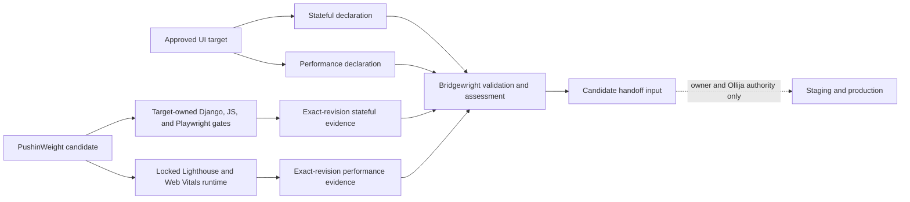

<!-- BEGIN OLLIJA DELIVERY GUIDE -->
## Ollija Delivery Guide

This block is generated guidance. Do not edit it directly. Correct durable facts in `.ollija/project.yaml` or this template, then rerun `ollija annotate-plan`. Put a user-directed exception in the editable Delivery Exceptions section below.

### Resolved locations

- Authoritative host: `fuchitalee`
- Authoritative repository: `/Users/fuchitalee/development/pushin-weight-v2`
- Ollija release worktree area: `/Users/fuchitalee/development/pushin-weight-v2/.worktrees`
- Active worktree: `/Users/fuchitalee/development/pushin-weight-v2/.worktrees/feat/ui-glyphs-footer-polish`
- Plan: `/Users/fuchitalee/development/pushin-weight-v2/.worktrees/feat/ui-glyphs-footer-polish/docs/plans/2026-09-21-123711-feat-ui-glyphs-and-footer-plan.md`
- Change: `feat-ui-glyphs-and-footer-2026-09-21-123711`
- Branch: `feat/ui-glyphs-footer-polish`
- Staging branch and blueprint: `staging`, `/Users/fuchitalee/development/pushin-weight-v2/.worktrees/feat/ui-glyphs-footer-polish/render-staging.yaml`
- Production branch and blueprint: `main`, `/Users/fuchitalee/development/pushin-weight-v2/.worktrees/feat/ui-glyphs-footer-polish/render.yaml`
- Staging URL: `https://pushinweight-staging-web.onrender.com`
- Production URL: `https://pushinweight-web.onrender.com`

### Placement

This worktree is inside the Ollija release worktree area. Reuse it for the whole change. Do not create a second worktree or plan for this branch.

### Delivery scope

- Workflow: `plan`
- Delivery target: `production`
- Owner selection recorded: `true`

1. Complete implementation and the plan's verification contract.
2. Run the configured focused checks:
   - `pytest tests/ollija`
3. The parent workflow commits only this plan's changes, pushes the feature branch, and records the candidate SHA.
4. Fetch the remote staging lane: `git fetch origin refs/heads/staging`.
5. Require the unchanged candidate SHA to be a fast-forward of that fetched remote ref, then push the exact candidate SHA to `refs/heads/staging` with the server-enforced fast-forward command `git push origin <candidate-sha>:refs/heads/staging`.
6. Verify the remote staging ref resolves to the candidate SHA and the deployment for `pushinweight-staging-web` reports that same SHA.
7. Run staging checks. Stop here if they fail.
8. Only after staging passes, fetch the remote production lane: `git fetch origin refs/heads/main`.
9. Require the same unchanged candidate SHA to be a fast-forward of that fetched remote ref, then push the exact candidate SHA to `refs/heads/main` with the server-enforced fast-forward command `git push origin <candidate-sha>:refs/heads/main`.
10. Verify the remote production ref resolves to the candidate SHA and the deployment for `pushinweight-web` reports that same SHA before reporting completion.
11. After step 10 succeeds, perform worktree cleanup as the final filesystem action:
    - From `/Users/fuchitalee/development/pushin-weight-v2`, require `/Users/fuchitalee/development/pushin-weight-v2/.worktrees/feat/ui-glyphs-footer-polish` to remain registered, clean, unlocked, and at the verified candidate SHA. If any guard fails, retain it and report the reason.
    - Run `git -C /Users/fuchitalee/development/pushin-weight-v2 worktree remove /Users/fuchitalee/development/pushin-weight-v2/.worktrees/feat/ui-glyphs-footer-polish` without `--force`.
    - Preserve the local and remote feature branches. Continue final reporting from the authoritative repository root.

### Failure handling

- Never promote a staging candidate whose automated checks failed.
- Implementation failures return to the parent implementation workflow for diagnosis, correction, recommit, and restaging.
- SSH, shell, environment, or multi-machine failures use the repository infra/multi-machine skill first.
- The change ledger is advisory; do not validate or enforce it.
- Never force-remove a worktree. Retain staging-only, failed, dirty, locked,
  noncanonical, or candidate-mismatched worktrees for diagnosis or later
  delivery.
- Do not run an endless retry loop or start a persistent Ollija process.
<!-- END OLLIJA DELIVERY GUIDE -->
# UI Glyphs, Version Footer, and UI Polish - Plan

## Plain-English Summary

This is the shared draft for the selected taxonomy glyphs, a quiet sitewide footer, aligned Role filter labels, one-step residual filtering, fixed-language locale buttons, an honest partial-day chart treatment, and the other UI changes that will be added in later review rounds.

The footer will read `Made with ❤️ in Yokohama. v0.2.0b1.` today, but templates will render the shared `app_version` variable rather than hardcoding `0.2.0b1`. That variable will resolve from the installed package metadata generated from `pyproject.toml`. The glyph choices already selected in the browser prototype are locked below. Everything else should continue to work and look as it does now unless this plan later names a change.

Bridgewright will be the common assurance layer for this batch. Its existing stateful UI profile will cover filters, locale persistence, refresh behavior, and the partial-day chart cue; its existing performance profile will run Lighthouse and Web Vitals against bounded homepage scenarios. Bridgewright remains measurement and evidence infrastructure only: it will not become application runtime code or gain approval, Git, staging, or deployment authority.

The owner froze this scope by invoking LFG on 2026-09-21 and explicitly selected production. The implementation baseline is `origin/main` at `91faac5b34a4eeed63a8590c88ea53fe29b6a103`, which already contains AI enrichment Stage 1, Japanese display localization, and the Bridgewright performance first-adopter work. Staging must verify the exact candidate before that unchanged revision is promoted to production.

## Delivery Exceptions

None.

## Goal Capsule

- **Objective:** PushinWeight presents its expanded taxonomy consistently, makes its filters and locale controls predictable, distinguishes partial chart data honestly, and gives every product-owned page a quiet, accurate product signature.
- **Means:** Reuse one SVG treatment across initial and refreshed UI, render a shared footer whose version comes from the package version source, reserve the existing icon column for Role → Other, add consistent atomic All/Clear/Other-only actions to each classification filter, make the locale selector use stable autonyms with no Original option, distinguish the incomplete current day in multi-day charts, and bind the batch into Bridgewright's stateful and performance assurance profiles (KTD1–KTD10).
- **Authority:** The Product Contract owns visible behavior. Bridgewright validates and assesses declared evidence without approving release. The generated Ollija Delivery Guide owns release sequencing.
- **Stop condition:** Stop only if implementation evidence invalidates a settled requirement, the baseline no longer contains the named Stage 1/localization/Bridgewright prerequisites, or a required verification or delivery gate fails.
- **Delivery target:** Production, selected by the owner; staging must verify the unchanged candidate first.

## Product Contract

### Summary

Replace the new taxonomy items' temporary or missing markers with the selected custom SVG glyphs, align the Role filter's `Other` label with its glyph-bearing neighbors, give each classification filter consistent All/Clear/Other-only controls, keep locale-button names stable in their own languages while removing Original, show the unfinished final day of multi-day charts with a dotted incoming segment, then add an unobtrusive version footer to every PushinWeight-rendered page. Additional UI changes will be appended to this same plan before implementation.

Product Contract changed: R13–R14 add residual-only category filtering while preserving the difference between real classifier labels and missing data; R15–R16 fix the three locale labels and remove the Original locale option; R17 distinguishes today's partial count in multi-day charts; R18 makes “today” follow the browser's local calendar rather than the server's UTC date.

### Problem Frame

The expanded audience-topic and product-label taxonomies need a coherent visual vocabulary at the feed's small runtime size. Classification filters need one predictable way to select all, clear all, or isolate residual data without conflating real `Other` labels with missing classification. Locale controls should remain recognizable across languages, multi-day charts should not present today's unfinished total as a completed decline, and every owned page needs a low-key signature identifying where it is made and which release is running.

### Key Decisions

- **Use the browser-selected glyph candidate for every named taxonomy item.** (session-settled: user-directed — chosen over the alternate drawings shown at full and 15×15 px: these were the owner's preferred forms after direct comparison.) Governs R1–R4.
- **Keep the footer secondary to page content.** Governs R5 and R7.
- **Treat the displayed version as release data, not template copy.** Governs R6.
- **Align Role → Other with a blank icon column, not a fake glyph.** Governs R11.
- **Preserve missing classification values as missing.** Governs R12.
- **Use one predictable All/Clear/Other-only pattern across classification families.** Governs R13.
- **Keep stored `Other` values distinct from empty or unclassified states.** Governs R14.
- **Name each locale in its own language and remove Original.** (session-settled: user-directed — chosen over translating locale-button labels with the active interface language and retaining the Original toggle.) Governs R15–R16.
- **Mark the unfinished day instead of presenting it as a completed decline.** (session-settled: user-directed — chosen over drawing the final multi-day segment as a normal solid line.) Governs R17.

### Requirements

**Taxonomy glyphs**

- R1. Audience-topic glyphs shall use the selected mappings in the following table.

| Audience topic | Choice | Visual treatment | Prototype symbol |
|---|---:|---|---|
| Model distillation | A | Flared chemistry vessel | `distillation-a` |
| Openness & licensing | B | Nested copyright C | `licensing-b` |
| API | A | Soft braces | `api-a` |
| Agents / tools | B | Rounded agent robot | `agents-b` |
| Local inference | B | Mac Studio | `local-b` |
| Evaluation / benchmark | A | Level beam and bowls | `evaluation-a` |
| Cost / performance | A | Sideways price tag with ¥ | `cost-a` |

- R2. Product-label glyphs shall use the selected mappings in the following table.

| Product label | Choice | Visual treatment | Prototype symbol |
|---|---:|---|---|
| Bug | A | Spotted software bug | `bug-a` |
| Complaint | A | Thumbs down with cuff | `complaint-a` |
| Testimony | A | Thumbs up with cuff | `testimony-a` |
| Idea / request | A | Filament lightbulb | `idea-a` |

- R3. Every new glyph shall retain the established family treatment: a 24×24 viewBox, `currentColor`, rounded irregular strokes, and clear recognition at the feed's 15×15 px runtime size.
- R4. A taxonomy value shall render the same glyph in the initial server-rendered page, refreshed feed rows, filters, and any other existing UI location that represents that value.

**Sitewide footer**

- R5. The bottom of every PushinWeight-owned full page shall show `Made with ❤️ in Yokohama. v{version}.`, producing `Made with ❤️ in Yokohama. v0.2.0b1.` for the current release.
- R6. Templates shall render `{version}` through one shared `app_version` context variable. That variable shall resolve from `importlib.metadata.version("x-monitor")`, whose installed value is generated from `[project].version` in `pyproject.toml`; templates shall not contain a second hardcoded version.
- R7. The footer shall use low visual emphasis, remain readable in the active color scheme, and never cover content, controls, or mobile safe areas.
- R10. Missing `x-monitor` package metadata is an invalid build and shall fail startup/deployment verification rather than serving a stale or placeholder footer version.

**Preservation and draft scope**

- R8. Existing glyphs, feed behavior, filters, scrolling, localization, responsive layout, and application behavior shall remain unchanged except where a later requirement in this plan explicitly says otherwise.
- R9. Additional UI changes shall be added to this plan with new stable R-IDs and U-IDs; existing IDs shall not be renumbered.

**Filter alignment and optional metadata**

- R11. In the Role filter, `Other` shall reserve the same blank icon-width space used by `Official`, `Staff`, and `Community` so all four labels start at the same horizontal position. It shall remain the text-only bucket for missing or unknown roles without gaining whitespace in its accessible name.
- R12. A post with no persisted Audience Topic, product label, post type, or sentiment shall not receive an invented metadata value or feed glyph.
- R13. Post Type, Role, Product Label, Audience Topic, and Sentiment shall each provide accessible `All`, `Clear`, and `Other only` actions. `All` selects every option, `Clear` selects none, and `Other only` atomically selects that family's residual values. Brand and Language shall retain their existing All/Clear behavior so the dropdown families use one predictable interaction pattern.
- R14. `Other only` shall use the family-specific residual meanings below without rewriting missing data as a persisted taxonomy label.

| Filter family | Residual values selected by `Other only` | Meaning |
|---|---|---|
| Post Type | `Other` and `Unclassified` | `Other` is an explicit persisted classified value; `Unclassified` has no recognized current classified post type. |
| Role | `Other` | A virtual bucket for authors with no known `official`, `staff`, or `community` relationship to an attributed brand. |
| Product Label | `No product signal` and `Unclassified` | A classified post-brand may validly have zero product labels; `Unclassified` has no recognized current classified result. |
| Audience Topic | `No assigned topic` and `Unclassified` | A classified post-brand has no current topic edge, or no recognized current classified result exists. The persisted projection does not retain the transport-only `none` versus `unavailable` distinction once both produce zero edges. |
| Sentiment | `Unclassified` | A valid classified result always has one sentiment; missing sentiment therefore means no recognized current classified result. |

**Locale selector**

- R15. The locale selector shall contain exactly three visible choices labeled `en`, `中文`, and `日本語`. Each label shall remain unchanged when any of the three locales is active; the selector shall not translate one locale's name into another locale.
- R16. The `original` / `Original` / `原文` locale choice shall be removed completely from the selector and from the supported selectable-locale contract. A stale `original` cookie, query value, saved preference, or direct locale request shall resolve safely to `en` rather than leaving an invisible active selection.

**Multi-day chart**

- R17. For every chart window longer than one day, the final line segment leading from the latest completed day into today's partial count shall be dotted for every visible brand-total line. All earlier completed-day segments shall remain solid. The one-day chart shall retain its existing intraday treatment.
- R18. For every chart window longer than one day, daily labels, aggregation, and the lower window boundary shall use the browser's valid IANA timezone. A 7-day chart shall contain the six preceding local calendar days plus the current partial local day beginning at 00:00. Invalid or absent timezone input shall fall back safely to UTC, and the one-day rolling 24-hour chart shall remain unchanged.

### Acceptance Examples

- AE1. **Covers R1–R3.** Given a post carrying one of the new taxonomy values, when the initial feed loads and later refreshes, then the same selected SVG remains visible at 15×15 px in both states.
- AE2. **Covers R5–R7.** Given the current package version is `0.2.0b1`, when any PushinWeight-owned full page renders, then its bottom edge contains the exact text `Made with ❤️ in Yokohama. v0.2.0b1.` in secondary styling without obscuring page content.
- AE3. **Covers R6.** Given the package version changes for a release, when pages render from that release, then the footer reflects the new value without a template-copy edit.
- AE4. **Covers R7–R8.** Given a narrow mobile viewport and a long scrolling page, when the user reaches the end, then the footer participates in normal document flow and no interactive surface is displaced or covered.
- AE5. **Covers R11.** Given the Role filter contains `Official`, `Staff`, `Community`, and `Other`, when the dropdown opens in any supported locale or viewport, then all four label edges align, exactly three role glyphs appear, and `Other` remains text-only.
- AE6. **Covers R12.** Given a feed post has no persisted value for an optional metadata family, when the initial row renders or refreshes, then that family contributes no value or glyph to the row.
- AE7. **Covers R13–R14.** Given any of the five classification filters is open, when the user activates `Clear`, `All`, or `Other only`, then one filter-state update respectively selects none, selects every option, or selects only that family's residual values, and refreshes the feed and chart from the same state.
- AE8. **Covers R13–R14.** Given Post Type contains one explicitly classified `Other` post and one unclassified post, when `Other only` is active, then both remain visible as distinct checked residual rows; unchecking `Unclassified` leaves only the explicit `Other` post.
- AE9. **Covers R15.** Given any of `en`, `zh_cn`, or `ja` is active, when the locale selector renders or updates, then its three button labels remain exactly `en`, `中文`, and `日本語`, with only the active locale marked selected.
- AE10. **Covers R16.** Given a new visitor or a returning visitor with a legacy `original` preference, when the page resolves its locale, then no Original button is rendered and the legacy value resolves to `en` without producing a fourth or invisible active locale.
- AE11. **Covers R17.** Given a 7-, 30-, or 365-day chart whose final bucket is today, when the chart renders initially or after a refresh/filter/window change, then each visible brand-total line is solid through the completed days and only its final segment into today is dotted; the same series in the 1-day view has no partial-day segment override.
- AE12. **Covers R18.** Given the browser timezone is `Asia/Tokyo` and the server clock is `2026-09-21T22:11:04Z`, when a 7-day chart settles, then its labels run from `2026-09-16` through local today `2026-09-22`, posts are counted by those Tokyo calendar boundaries, and only the segment entering `2026-09-22` is dotted.

### Production Baseline Evidence

A single read-only query inspected the literal latest 100 production posts ordered by `fetched_at DESC, tweet_id DESC` on 2026-09-21. The cohort spans `2026-09-21T03:16:05.540647Z` through `2026-09-21T04:00:47.424397Z`. Each post counts once when at least one applicable per-brand value is visible under the current dashboard read contract.

| Family | Present | Absent or `Other` | Interpretation |
|---|---:|---:|---|
| Audience Topic | 47 | 53 | Zero topics is valid after an assessed `none`; `unavailable` also persists no topic assignment. |
| Post type | 70 | 30 | A recognized `classified` post-brand requires at least one type; absence includes posts without a recognized classified result. |
| Role | 3 known | 97 `Other` | A known role is `official`, `staff`, or `community`; all other posts belong to the filter's explicit `Other` bucket. |
| Product label | 17 | 83 | Zero product labels is a valid classified result. |
| Sentiment | 70 | 30 | A recognized `classified` post-brand requires sentiment; `context_missing` or unavailable classification can leave it absent. |

The snapshot confirms that Audience Topics and product labels are optional rather than universal. It also shows why the `Other` role needs a blank alignment slot without turning absent post metadata into placeholder glyphs.

The first snapshot caught the classifier in flight. A later read-only recheck of the same 100 tweet IDs found 94 posts with a post type, including 6 explicitly classified as `other`, while 6 still had no classified post type. It also found 18 posts with product labels, 76 classified posts with a valid empty product-label set, 6 unclassified posts, 94 posts with sentiment, 56 with Audience Topics, and 97 in the virtual Role → Other bucket. The original 30 missing post types were therefore absent or pending values, not defaults silently stored as `other`.

### Bridgewright Baseline Evidence

- PushinWeight already pins Bridgewright as a development dependency, declares `stateful-ui-assurance/v1` in `bridgewright.yaml`, and runs the target-owned `tests/ui_assurance/gate.py` around Bridgewright's validate, prescribe, and assess operations.
- `origin/main` at `91faac5b34a4eeed63a8590c88ea53fe29b6a103` already contains the reviewed PushinWeight performance first-adopter integration, including `performance-assurance/v1`, immutable Bridgewright package identities, bounded declarations, the target-owned combined gate, and `X-Bridgewright-Revision` middleware.
- The local Bridgewright `feat/performance-assurance` branch was clean at `611105319bed1aaf563b28e0a61efbe817314f3b` when this plan was updated. That observed development SHA confirms continuing upstream work but is not authority to replace PushinWeight's reviewed immutable pin. Refresh the pin only if this batch needs a capability absent from the landed profile.

### Scope Boundaries

- This plan changes UI presentation, filtering over existing classification state, package-version exposure, and startup/deployment validation; it does not change classifier meaning, taxonomy persistence, harvesting, ranking, or feed-data contracts.
- The complete current set of PushinWeight-owned full-page templates is `monitor/templates/monitor/home.html`, `monitor/templates/monitor/home_internal.html`, and `monitor/templates/monitor/brand_home.html`. Partial templates are covered through those owners rather than receiving their own footer. Re-enumerate this list before implementation if the target branch adds another full-page template.
- Third-party pages that PushinWeight does not render, such as Google's OAuth screens, are outside the meaning of “every page.”
- New UI requests remain outside executable scope until they are written here and the owner freezes the draft.
- Removing Original changes the display-locale selector only; it does not remove stored source text from posts or the application's ability to use original post text internally.
- Bridgewright core implementation remains owned by the Bridgewright repository. This plan changes only PushinWeight's pinned dependency, target contracts, declarations, fixtures, gates, and evidence adapters after the required upstream capabilities land.

### Resolved Preconditions

- The owner froze the UI scope and selected production through the 2026-09-21 LFG instruction.
- Fresh remote inspection resolved the integration baseline to `origin/main` at `91faac5b34a4eeed63a8590c88ea53fe29b6a103`; it is the same revision as `origin/feat/ai-enrichment-stage1` and contains the final audience-topic, product-label, Japanese-locale, and Bridgewright performance surfaces required by this plan.

## Planning Contract

### Key Technical Decisions

- KTD1. **Use inline SVGs from one reusable glyph registry while preserving the selected family treatment.** Both first render and refresh paths must resolve only persisted taxonomy keys through that registry. Every definition retains its 24×24 viewBox, `currentColor`, rounded irregular strokes, and recognition at 15×15 px so a refresh cannot replace, erase, or restyle the selected glyphs. (session-settled: user-directed — chosen over the alternate SVG drawings and emoji fallbacks: the owner selected these exact forms at their real runtime size.) Covers R1–R4 and R12.
- KTD2. **Expose package metadata to templates once through a named variable.** Resolve `importlib.metadata.version("x-monitor")` once during Django settings/startup as `APP_VERSION`, expose it to templates as `app_version` through shared Django context, and render only that variable in the footer. The Render build installs this repository as `x-monitor` before Django starts; missing metadata therefore fails deployment verification instead of producing a stale fallback. Covers R5–R6 and R10.
- KTD3. **Render one shared footer partial in normal document flow.** Include it from each of the three full-page templates enumerated in Scope Boundaries and style it as muted site chrome; do not make it sticky or fixed. Covers R5 and R7.
- KTD4. **Integrate against the post-refactor UI baseline.** Reconcile the final taxonomy keys and existing rendering registry before editing so this plan extends the incoming work instead of rebuilding or overwriting it. Covers R4 and R8.
- KTD5. **Use the existing empty semantic-icon slot as a layout spacer only for Role → Other.** Keep its 16 px column visible through the current `data-pw-semantic-family="role"` and `data-pw-semantic-key="other"` hooks while leaving the slot empty and `aria-hidden`; do not insert literal spaces or a transparent SVG. Covers R11.
- KTD6. **Reuse one atomic bulk-action path for All, Clear, and Other-only.** Extend the existing Brand/Language All/Clear control pattern to the five classification families, add allowlisted request-only residual keys that never enter taxonomy tables, and emit one filter-change event only after the selected action reaches its final state. Covers R13–R14.
- KTD7. **Use fixed autonym markup and normalize legacy Original preferences at the locale boundary.** Render the three labels as stable button text instead of swapping them through `data-label-*` attributes or `applyChrome()`. Remove `original` from the supported selector values and normalize any legacy `original` input to `en` before the active locale, cookie, session, and client preference are synchronized. Covers R15–R16.
- KTD8. **Style partial-day status as a client-side segment property, not a data mutation.** For daily-granularity payloads with more than one bucket, use Chart.js segment styling on each visible brand-total dataset so only the segment whose destination is the last bucket receives the dotted dash pattern. Preserve all counts, labels, tooltips, hidden breakdown datasets, colors, and the 1-day minute-granularity configuration. Covers R17.
- KTD9. **Extend the existing Bridgewright stateful UI contract instead of creating a parallel UI checklist.** Add this batch's approved target, controls, actions, invariants, fixtures, and evidence mappings to the existing `stateful-ui-assurance/v1` adoption. The declaration shall cover per-family All/Clear/Other-only behavior, fixed locale autonyms and legacy Original normalization, initial/refresh glyph parity, footer presence, and final-segment-only chart styling. The target-owned gate continues to execute the real Django, JavaScript, and Playwright paths before Bridgewright assesses exact-revision evidence.
- KTD10. **Extend the landed Bridgewright performance profile without replacing its reviewed pin by default.** Reuse the existing `performance-assurance/v1` declarations, combined target-owned gate, revision middleware, and immutable package identities already on the baseline. Add or revise only the scenarios and budgets required by this UI batch; refresh the Bridgewright Git pin and manifest identities only if a required capability is demonstrably absent. Keep first-slice timing thresholds advisory; completeness, revision identity, DOM/network structure, request counts, and declared cache behavior remain blocking. Bridgewright remains unable to approve or deploy.

### High-Level Technical Design

These sketches are directional. They define ownership and evidence flow, not implementation syntax.



```mermaid
sequenceDiagram
    participant P as PushinWeight gate
    participant B as Bridgewright
    participant A as Candidate app
    P->>B: validate and prescribe pinned declarations
    P->>A: run target-owned stateful and browser scenarios
    P->>B: assess evidence bound to candidate SHA
    P->>B: prepare locked performance runtime
    B->>A: run bounded Lighthouse and Web Vitals scenarios
    B-->>P: immutable clean, invalid, or unavailable result
    Note over P,B: A clean result supplies evidence; it does not approve release
```

| Gate mode | Product execution | Bridgewright role | Blocking rule |
|---|---|---|---|
| Affected | Only controls and invariants touched by the current change | Validate, prescribe, and assess the affected stateful obligations | No required skip, error, zero-match selector, or missing obligation |
| Candidate | Full stateful declaration at one immutable product SHA | Assess every normalized stateful obligation | Zero failed, skipped, errored, missing, or unknown required results |
| Performance candidate | Bounded desktop/mobile cold-load and interaction scenarios | Run locked Lighthouse/Web Vitals and seal the result | Identity, completeness, structural, network, and cache checks block; first-slice timing thresholds remain advisory |

### Implementation Constraints

- Follow `.claude/skills/fix-ui/SKILL.md` before changing visible UI.
- Follow `.agents/skills/avoiding-recurring-mistakes/SKILL.md` before code changes.
- Copy the selected 24×24 symbol definitions unchanged from `docs/ideation/assets/2026-09-21-123711-selected-taxonomy-glyphs.svg`; do not regenerate or approximate them during implementation.
- Keep footer markup and version lookup shared; do not copy the version literal or footer sentence among templates.
- Do not vendor Bridgewright, add it to the production runtime, or replace its immutable Git pin with a local path. Keep executable target commands in PushinWeight-owned gates, never in Bridgewright declarations.

### Sequencing Note

Begin U7's target/declaration characterization before changing U1–U6, so the existing behavior and intended deltas are explicit. Complete U7's candidate assessment and U8's performance evidence only after the product units are integrated at one candidate SHA. Reuse the landed Bridgewright performance adopter on the selected baseline; do not recreate Lighthouse or Web Vitals wrappers locally.

## Implementation Units

### U1. Integrate the selected taxonomy glyphs

- **Goal:** Render the eleven locked glyphs consistently everywhere their taxonomy values appear.
- **Requirements:** R1–R4, R8, R12; KTD1, KTD4.
- **Dependencies:** Use the final Stage 1 taxonomy keys on the resolved `origin/main` baseline.
- **Files:** `docs/ideation/assets/2026-09-21-123711-selected-taxonomy-glyphs.svg`, `monitor/static/pw-icons.js`, `monitor/static/pw-feed.js`, `monitor/templates/monitor/_feed_initial_v22.html`, `monitor/templates/monitor/home.html`, `monitor/static/home-v20.css`, `tests/test_pw_feed_formatter.js`, `tests/test_home_v22_feed_row_shape.py`, `tests/test_home_v22_browser.py`; revise this list after the target branch is frozen if the existing shared registry moves.
- **Approach:** Copy the approved symbol definitions unchanged from the tracked design source into the existing `monitor/static/pw-icons.js` registry consumed by the current render paths; do not create a second registry unless the selected integration branch no longer contains this one. Map the final taxonomy keys to the locked symbols, keep decorative SVGs hidden from assistive technology where adjacent text already provides the label, and preserve existing row geometry.
- **Execution note:** Start with regression coverage for initial-load and refresh parity because prior glyph defects appeared only after feed refresh.
- **Test scenarios:**
  - Covers AE1. Load a feed row for each new taxonomy key and assert that the selected SVG symbol is visible at 15×15 px.
  - Covers AE1. Refresh or append the same rows through the live feed formatter and assert that symbol identity does not change or disappear.
  - Covers R4. Open the Audience Topic and Product Label filters and assert that every mapped option uses the same selected symbol identity as its feed-row representation.
  - Render two taxonomy values on one row and assert both glyphs remain ordered, separated, and legible.
  - Covers AE6. Render and refresh rows with no Audience Topic, product label, post type, or sentiment and assert that no value or glyph is invented for the absent family.
- **Verification:** Browser review confirms each symbol at actual feed size on desktop and mobile, and automated tests prove initial/refresh parity.

### U2. Add the shared version footer

- **Goal:** Show the exact Yokohama signature at the bottom of every PushinWeight-owned full page using the canonical release version.
- **Requirements:** R5–R8, R10; KTD2–KTD3.
- **Dependencies:** None after the target implementation branch is selected.
- **Files:** `pyproject.toml` as the declared version source, `project/settings.py`, `core/context_processors.py`, `monitor/templates/monitor/_site_footer.html`, `monitor/templates/monitor/home.html`, `monitor/templates/monitor/home_internal.html`, `monitor/templates/monitor/brand_home.html`, the shared stylesheets used by those pages, `tests/test_views.py`, and `tests/test_home_v22_browser.py`.
- **Approach:** Resolve the installed package version once as `settings.APP_VERSION`, expose it as template variable `app_version`, render one shared footer partial from each enumerated full-page template, and place its quiet styling in the smallest existing shared style boundary available after branch reconciliation.
- **Test scenarios:**
  - Covers AE2. Render each owned full-page view with version `0.2.0b1` and assert that the exact footer sentence appears once.
  - Covers AE3. Override `APP_VERSION` in a test and assert that the `app_version` template variable changes the footer without modifying template text.
  - Covers R10. Simulate unavailable `x-monitor` package metadata and assert that settings/startup fails explicitly rather than supplying a stale or placeholder version.
  - Covers AE4. Check desktop and mobile layouts with short and long content and assert that the footer remains at the document bottom without overlaying controls.
- **Verification:** Template tests cover every owned full-page response, and browser checks confirm quiet placement in all supported viewport classes and locales.

### U3. Align the Role filter's Other option

- **Goal:** Make `Other` line up with the three glyph-bearing Role options while remaining visibly and semantically text-only.
- **Requirements:** R8, R11; KTD5.
- **Dependencies:** The post-refactor UI baseline named by KTD4 must be selected before implementation.
- **Files:** `monitor/static/home-v20.css`, `monitor/templates/monitor/home.html`, `tests/test_home_v22_filter_pills.py`, and `tests/test_home_v22_browser.py`.
- **Approach:** Preserve the existing empty semantic-icon element for Role → Other and override the generic empty-slot hiding rule only for that keyed option. Keep the existing 16 px icon column, checkbox spacing, label text, and accessibility semantics unchanged.
- **Test scenarios:**
  - Covers AE5. Render the Role options and assert that `Other` retains an empty, hidden-from-assistive-technology icon slot while the other three options retain their approved glyphs.
  - Covers AE5. Open the Role dropdown on desktop and mobile in English, Simplified Chinese, and Japanese; assert that the four label left edges align within one CSS pixel and that exactly three visible role SVGs remain.
- **Verification:** Browser evidence shows aligned labels at supported sizes and locales, with unchanged checkbox behavior and no fourth role glyph.

### U4. Add residual-only classification filtering

- **Goal:** Give every classification dropdown the same one-action All/Clear pattern as Brand and Language, plus an Other-only action that keeps explicit labels, valid empty sets, and unclassified data distinguishable.
- **Requirements:** R8, R12–R14; KTD6.
- **Dependencies:** The post-refactor UI baseline named by KTD4 must be selected before implementation.
- **Files:** `monitor/templates/monitor/home.html`, `monitor/static/pw-filter-pills.js`, `monitor/static/pw-filter-store.js`, `monitor/views.py`, `tests/test_home_v22_filter_pills.py`, `tests/test_home_chart.py`, and `tests/test_home_v22_browser.py`.
- **Approach:** Reuse the existing Brand/Language bulk-control markup and behavior for localized All and Clear actions, then add localized residual rows and one `Other only` control to each named classification dropdown. Reuse the existing filter-store synchronization and event bus, and translate virtual residual keys into negative-existence or missing-classification predicates only at the server filter boundary.
- **Execution note:** Start with filter-matrix characterization tests so explicit `post_types=other`, valid empty product labels, and unclassified rows cannot collapse into one meaning.
- **Test scenarios:**
  - Covers AE7. Activate `Clear`, `All`, and `Other only` in each family and assert respectively that none, every option, or only the residual rows are checked, with exactly one `pw:filter-change` event per action.
  - Verify Brand and Language retain the same All/Clear labels, keyboard/touch behavior, and atomic event count.
  - Covers AE8. Verify that Post Type `Other` matches a persisted classified edge, `Unclassified` matches its absence, and either row can be removed independently after the combined action.
  - Verify Product Label and Audience Topic distinguish a classified empty assignment set from an unclassified result under both all-brand and single-brand scopes.
  - Verify Sentiment `Unclassified` matches no recognized classified sentiment and never aliases `neutral` or `mixed`.
  - Verify Role `Other` retains its current virtual meaning and the new action does not change role storage or glyph behavior.
  - Round-trip each residual selection through the filter JSON/query contract and assert that feed and chart requests apply the same normalized state.
  - Open every affected dropdown on desktop and mobile in English, Simplified Chinese, and Japanese; verify keyboard and touch activation, visible selected state, and the paired `All` action restoring every option.
- **Verification:** Unit, response, and browser evidence prove one-action selection, family-correct results, a single refresh event, locale parity, and feed/chart agreement.

### U5. Make locale choices self-naming and remove Original

- **Goal:** Keep the locale controls readable and stable in every language while reducing the selector to English, Simplified Chinese, and Japanese.
- **Requirements:** R8, R15–R16; KTD4, KTD7.
- **Dependencies:** Use the Japanese display-locale contract already present on the resolved `origin/main` baseline.
- **Files:** `monitor/templates/monitor/home.html`, `monitor/templates/monitor/home_internal.html`, `monitor/templates/monitor/brand_home.html`, `monitor/static/pw-locale-toggle.js`, `monitor/views.py`, `tests/test_home_v22_mockup_diff.py`, `tests/test_home_v22_browser.py`, and `tests/test_ui_assurance_contract.py`; include the localization refactor's Japanese-locale tests if they land under different paths.
- **Approach:** Render exactly `en`, `中文`, and `日本語` in the three locale buttons and stop rewriting those button texts when chrome language changes. Remove the Original button and supported selector value, while keeping backward compatibility by normalizing stale `original` values to `en` at the shared locale boundary. Preserve source-text fields and internal source-text fallback behavior.
- **Execution note:** Begin with browser characterization of locale persistence and navigation because this control has previously passed tests that bypassed the real cookie-and-reload path (`docs/solutions/workflow-issues/django-i18n-locale-toggle-debugging-journey.md`).
- **Test scenarios:**
  - Covers AE9. For each active locale (`en`, `zh_cn`, and `ja`), assert that the selector has exactly three buttons whose visible text remains `en`, `中文`, and `日本語` in that order.
  - Covers AE9. Activate each button through the real browser POST, cookie, redirect, and reload path; assert that exactly one button is active and that the page language changes without relabeling the selector.
  - Covers AE10. Assert that no template, rendered control, or UI-assurance contract exposes an `original` locale option.
  - Covers AE10. Seed `original` independently through the locale cookie, URL query, saved client preference, and locale endpoint; assert that each path resolves to `en`, updates the visible active state, and cannot preserve an invisible fourth selection.
  - Verify that removing the selector option does not delete or alter `text_original`, source-language metadata, or source-text fallback behavior outside display-locale selection.
- **Verification:** Response and real-browser coverage prove fixed autonyms, exactly three choices, correct Japanese/Chinese/English activation, safe legacy normalization, and no regression in source-text storage or rendering fallbacks.

### U6. Mark today's multi-day chart segment as partial

- **Goal:** Prevent today's incomplete post count from looking like a completed-day decline.
- **Requirements:** R8, R17; KTD8.
- **Dependencies:** None after the final chart baseline is selected.
- **Files:** `monitor/static/pw-chart.js`, `tests/test_pw_chart_filter.js`, and `tests/test_home_v22_browser.py`.
- **Approach:** Add one reusable daily-segment style callback to the existing brand-total line dataset configuration. Apply a dotted `borderDash` only when the segment ends at the final daily bucket and `window_days > 1`; leave preceding segments and all minute-granularity datasets unchanged. Reuse the same construction path for initial render and atomic chart replacement so the cue survives every refresh.
- **Test scenarios:**
  - Covers AE11. Inspect 7-, 30-, and 365-day Chart.js configurations with multiple visible brands and assert that each brand-total dataset dots only the segment ending at the final bucket.
  - Covers AE11. Inspect the 1-day minute chart and assert that it receives no partial-day segment override.
  - Refresh after a filter or window change and assert that the dotted final segment remains attached to the new final daily bucket rather than a stale data index.
  - Assert that series values, totals, tooltips, legend state, colors, and hidden stacked-breakdown datasets are unchanged.
- **Verification:** The focused JavaScript contract and real-browser chart test prove the final-segment-only treatment on every multi-day window and unchanged 1-day behavior.

### U7. Extend the Bridgewright stateful UI target and evidence

- **Goal:** Turn every interactive and visible behavior in this batch into traceable, exact-revision UI obligations using PushinWeight's existing Bridgewright adoption.
- **Requirements:** R1–R17; KTD1, KTD4–KTD9.
- **Dependencies:** The owner freezes this draft and the final taxonomy/localization integration branch is selected. Characterization starts before U1–U6; final assessment waits for them.
- **Files:** a new timestamped `docs/reference/*-ui-glyphs-footer-filters-locale-chart-bridgewright-target.md`, `bridgewright.yaml`, `tests/fixtures/ui_assurance/declaration.json`, `tests/fixtures/ui_assurance/data.json`, `tests/ui_assurance/reference.py`, `tests/ui_assurance/evidence.py`, `tests/ui_assurance/gate.py`, `tests/test_bridgewright_v24_target.py`, `tests/test_ui_assurance_contract.py`, `tests/test_ui_assurance_reference.py`, `tests/test_ui_assurance_evidence.py`, and `tests/test_ui_assurance_browser.py`.
- **Approach:** Append one approved target contract without weakening earlier protected targets. Expand the state model to the final Post Type, Role, Product Label, Audience Topic, Sentiment, locale, and bulk-action values. Represent All, Clear, and Other-only as explicit actions; add invariants for residual semantics, locale-label stability, glyph initial/refresh parity, footer coverage, and partial-day chart styling. Keep target execution and evidence capture in PushinWeight, then submit exact-candidate evidence to the pinned Bridgewright assessor.
- **Execution note:** Run `assurance-validate` and `assurance-prescribe` immediately after declaration edits. A stale build identity, unknown control, missing obligation, skipped required environment, or zero-match browser selector is a failure, not an allowable skip.
- **Test scenarios:**
  - Every multi-select family performs Clear then All reversibly; each classification family performs Other-only atomically and preserves the family-specific residual meanings in R14.
  - Locale actions cover `en`, `zh_cn`, and `ja`; rendered and accessibility evidence proves the fixed labels `en`, `中文`, and `日本語`, while seeded legacy `original` state resolves to `en` without losing unrelated preferences.
  - Initial and refreshed feed rows map every selected taxonomy key to the same approved SVG identity, and absent optional metadata emits no invented glyph.
  - All owned full pages emit one footer with the candidate's package version and no overlay at desktop or mobile geometry.
  - Window actions cover 1, 7, 30, and 365 days; chart evidence proves only the final segment of daily brand-total lines is dotted and the 1-day chart is unchanged after refresh and request races.
  - The affected gate closes only obligations touched by this batch; the candidate gate closes every normalized required obligation with zero failed, skipped, errored, missing, or unknown results.
- **Verification:** `assurance-validate`, `assurance-prescribe`, the affected target gate, and the full candidate assessment all bind to the same product SHA and report complete obligation closure.

### U8. Add Bridgewright Lighthouse and Web Vitals assurance

- **Goal:** Detect load, responsiveness, layout-shift, DOM-growth, request, and cache regressions caused by the combined homepage UI changes through Bridgewright's one-stop performance workflow.
- **Requirements:** R1–R17; KTD10.
- **Dependencies:** U1–U7 integrated at one candidate SHA; use the reviewed `performance-assurance/v1` adopter already on the resolved baseline.
- **Files:** `bridgewright.yaml`, `tests/fixtures/performance_assurance/declaration.json`, `tests/fixtures/performance_assurance/declaration.local-candidate.json`, `tests/fixtures/performance_assurance/declaration.staging.json`, `tests/ui_assurance/gate.py`, `tests/test_performance_declarations.py`, `tests/test_static_performance_contract.py`, and `.claude/skills/fix-ui/SKILL.md`; change `pyproject.toml`, `uv.lock`, or `project/revision.py` only if evidence proves the landed pin or revision middleware is insufficient.
- **Approach:** Extend the landed bounded cold-load and interacted homepage scenarios for desktop and mobile, retaining their deterministic fixture identity, repeated Lighthouse collection, required LCP/CLS/INP Web Vitals, DOM and request-count budgets, exact same-origin cache expectations, combined target-owned gate, and validated `X-Bridgewright-Revision` binding. Update the immutable Bridgewright pin only if the installed profile cannot express a required scenario. Preserve external attempt artifacts without writing them into the repository.
- **Execution note:** Establish the first baseline on the production-aligned parent and the candidate under the same declared runtime and fixture. Timing numbers remain advisory for this first batch; missing metrics, mismatched revision/runtime/fixture identity, extra disallowed requests, failed blocking structure/cache budgets, or incomplete repetitions fail closed.
- **Test scenarios:**
  - The stateful and performance assurance references coexist in `bridgewright.yaml`, and all required build identities match the installed immutable package.
  - Three complete runs per declared profile retain separate Lighthouse and Web Vitals engine identities and produce medians without combining like-named metrics across engines.
  - A filter/locale interaction finalizes INP and leaves exactly one current feed/chart request pair; stale or duplicate requests fail the declared network expectation.
  - Local, staging, and production environment runs fail when `X-Bridgewright-Revision` is absent, malformed, changes mid-attempt, or differs from the declared candidate; unrelated responses do not gain release authority from the header.
  - The candidate stays within the reviewed DOM-element and same-origin request budgets, applicable static assets satisfy their declared cache policy, and no declaration contains executable commands, credentials, or unrestricted URLs.
  - Missing Chrome/runtime, a required metric, revision header, fixture digest, raw artifact, or run returns unavailable/invalid and cannot be reported as clean.
  - A dependency-pin or candidate-SHA change invalidates prior evidence and requires a new attempt.
- **Verification:** The target performance gate records clean, immutable, lab-labeled evidence for the exact candidate and Bridgewright runtime; the result grants no release authority and is consumed alongside the stateful UI gate and normal staging checks.

### U9. Repair the partial-day chart's local-calendar boundary

- **Goal:** Make the bucket styled as today's incomplete day actually be today for the viewer, including when their local date is ahead of or behind UTC.
- **Requirements:** R8, R17–R18; KTD8.
- **Dependencies:** U6's final-segment styling remains the single visual treatment.
- **Files:** `monitor/views.py`, `monitor/static/pw-chart.js`, `tests/test_home_chart_pulse.py`, `tests/test_pw_chart_filter.js`, and `tests/test_home_v22_browser.py`.
- **Approach:** Send `Intl.DateTimeFormat().resolvedOptions().timeZone` with chart fragment requests, validate it with Python's IANA `zoneinfo` database, include it in the chart cache identity, and use that zone for multi-day local-midnight bounds and database date truncation. When a server-rendered multi-day payload was built without the browser zone, immediately replace it through the existing atomic chart refresh path; do not change the one-day rolling 24-hour path.
- **Test scenarios:**
  - Covers AE12. Freeze at the Tokyo/UTC date crossover and prove the final label is Tokyo's current date, the first label is six local midnights earlier, and posts on either side of local 00:00 land in different expected buckets.
  - Verify the chart request carries the browser's IANA timezone and the server rejects malformed/unknown zones by falling back to UTC rather than erroring.
  - Verify timezone is part of the complete chart cache key so one viewer cannot receive another viewer's calendar buckets.
  - Verify 1-day labels, 24-hour cutoff, totals, and timezone comparison-axis behavior remain unchanged.
- **Verification:** Focused PostgreSQL, JavaScript, and real-browser tests prove the calendar boundary and final dotted segment agree for Tokyo while existing UTC and one-day behavior remains stable.

## Verification Contract

- Run focused Django response and template coverage for the version context and all full-page templates.
- Run the feed formatter and V22 feed-row suites for taxonomy rendering, including initial-load, automatic-refresh, and Audience Topic/Product Label filter parity.
- Run the affected browser suite through the repository's browser-testing workflow at desktop and mobile sizes.
- Verify the Role dropdown in every supported locale: four aligned labels, three visible role glyphs, and an empty reserved slot for `Other`.
- Verify all five classification dropdowns expose atomic `All`, `Clear`, and `Other only` actions, preserve distinct residual rows, emit one filter-state change per activation, and apply the same result to feed and chart requests; verify Brand and Language retain their existing All/Clear behavior.
- Verify the locale selector shows exactly `en`, `中文`, and `日本語` in every active locale, and exercise a stale `original` preference through the production-equivalent cookie-and-reload path.
- Verify 7-, 30-, and 365-day charts dot only the segment leading into today's partial bucket on every visible brand-total line, including after filter and window refreshes; verify the 1-day chart is unchanged.
- At a UTC/local-date crossover, verify every multi-day chart ends on the browser's local date and starts at the matching local 00:00 calendar boundary; verify invalid timezone input falls back safely and cache entries remain timezone-specific.
- Run the pinned Bridgewright stateful workflow: `uv run --extra dev bridgewright assurance-validate --project-root .`, `uv run --extra dev bridgewright assurance-prescribe --project-root .`, the affected target gate during implementation, and the candidate target gate against the exact product SHA before handoff.
- Run the PushinWeight-owned performance gate backed by Bridgewright `performance.validate`, `performance.prepare`, `performance.run`, and `performance.result`; require complete Lighthouse and Web Vitals evidence, exact candidate/build/fixture identity, and every blocking structural, network, and cache expectation to close.
- Run `python manage.py check --deploy` and the repository's normal regression suite before delivery.
- Verify the exact candidate on staging, including the glyph matrix and footer on each owned page, before promoting the unchanged SHA to production under the Ollija Delivery Guide.

## Definition of Done

- Every runtime requirement added before scope freeze is implemented and traced to at least one stable U-ID.
- R9 is satisfied while extending this draft by assigning new stable R-IDs and U-IDs without renumbering existing ones.
- The eleven selected glyphs are visually correct at 15×15 px and survive initial load, refresh, filtering, and feed pagination.
- The production glyph definitions match `docs/ideation/assets/2026-09-21-123711-selected-taxonomy-glyphs.svg` without path-geometry changes.
- Every PushinWeight-owned full page renders the unobtrusive footer exactly once with the canonical package version.
- Role → Other aligns with Official, Staff, and Community through a blank icon column while remaining text-only and accessible.
- Posts with absent optional metadata render no invented value or glyph; the explicit Role → Other filter behavior remains intact.
- Each classification family supports atomic All, Clear, and Other-only actions; explicit `Other`, valid empty, and unclassified states remain independently selectable, while Brand and Language keep their existing All/Clear behavior.
- Locale buttons retain the exact autonyms `en`, `中文`, and `日本語` across all three selections; Original is absent and legacy `original` preferences resolve to `en`.
- Multi-day charts render only the final segment into today's partial bucket as dotted for every visible brand-total line; completed-day history and the 1-day chart remain unchanged.
- Bridgewright's expanded stateful declaration and exact-revision evidence close every obligation introduced by this batch with no failed, skipped, errored, missing, or unknown required result.
- PushinWeight pins a reviewed immutable Bridgewright performance build, and the exact candidate has complete Lighthouse and Web Vitals lab evidence with all blocking identity, DOM, network, and cache expectations clean.
- Desktop, mobile, locale, scrolling, filtering, and feed-refresh regression checks pass.
- The staging-verified candidate is promoted unchanged to production and production reports that exact SHA.
- Experimental, superseded, or duplicate icon/footer code is absent from the final diff.
