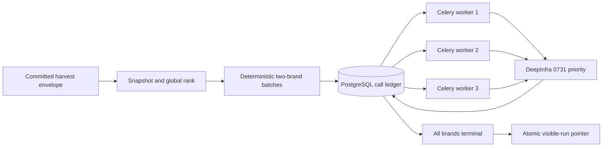
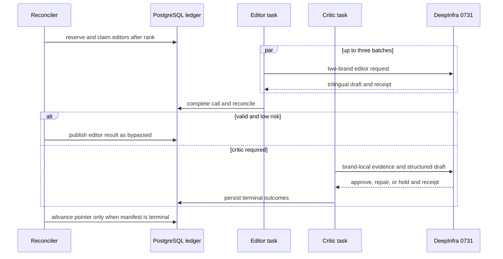
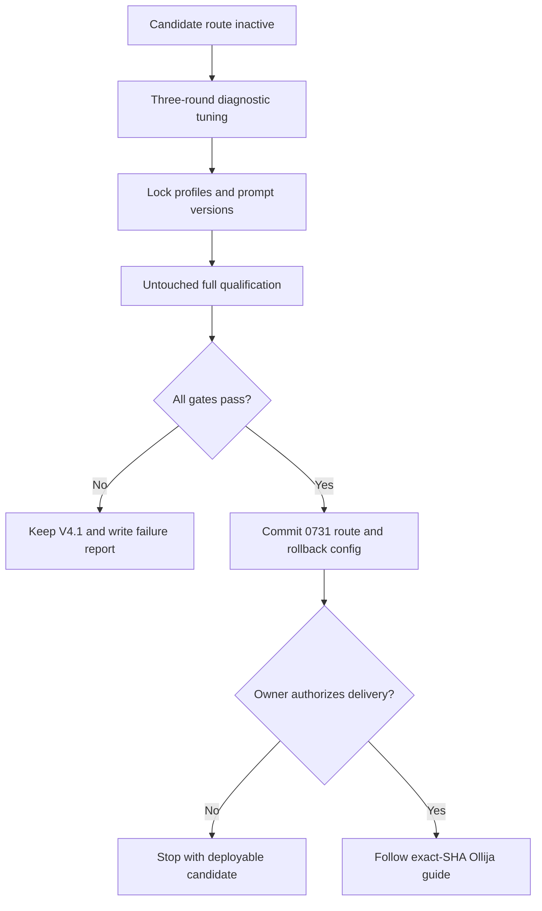

<!-- BEGIN OLLIJA DELIVERY GUIDE -->
## Ollija Delivery Guide

This block is generated guidance. Do not edit it directly. Correct durable facts in `.ollija/project.yaml` or this template, then rerun `ollija annotate-plan`. Put a user-directed exception in the editable Delivery Exceptions section below.

### Resolved locations

- Authoritative host: `fuchitalee`
- Authoritative repository: `/Users/fuchitalee/development/pushin-weight-v2`
- Ollija release worktree area: `/Users/fuchitalee/development/pushin-weight-v2/.worktrees`
- Active worktree: `/Users/fuchitalee/development/pushin-weight-v2/.worktrees/feat/headline-0731-architecture`
- Plan: `/Users/fuchitalee/development/pushin-weight-v2/.worktrees/feat/headline-0731-architecture/docs/plans/2026-09-24-060052-feat-headline-0731-architecture-plan.md`
- Change: `feat-headline-0731-architecture-2026-09-24-060052`
- Branch: `feat/headline-0731-architecture`
- Staging branch and blueprint: `staging`, `/Users/fuchitalee/development/pushin-weight-v2/.worktrees/feat/headline-0731-architecture/render-staging.yaml`
- Production branch and blueprint: `main`, `/Users/fuchitalee/development/pushin-weight-v2/.worktrees/feat/headline-0731-architecture/render.yaml`
- Staging URL: `https://pushinweight-staging-web.onrender.com`
- Production URL: `https://pushinweight-web.onrender.com`

### Placement

This worktree is inside the Ollija release worktree area. Reuse it for the whole change. Do not create a second worktree or plan for this branch.

### Delivery scope

- Workflow: `ce-work`
- Delivery target: `production`
- Owner selection recorded: `true`

1. Complete implementation and the plan's verification contract.
2. Run the configured focused checks:
   - `pytest tests/ollija`
3. The parent workflow commits only this plan's changes, pushes the feature branch, and records the candidate SHA.
4. Fetch the remote staging lane: `git fetch origin refs/heads/staging`.
5. Require the unchanged candidate SHA to be a fast-forward of that fetched remote ref, then push the exact candidate SHA to `refs/heads/staging` with the server-enforced fast-forward command `git push origin <candidate-sha>:refs/heads/staging`.
6. Verify the remote staging ref resolves to the candidate SHA and the deployment for `pushinweight-staging-web` reports that same SHA.
7. Run staging checks. Stop here if they fail.
8. Only after staging passes, fetch the remote production lane: `git fetch origin refs/heads/main`.
9. Require the same unchanged candidate SHA to be a fast-forward of that fetched remote ref, then push the exact candidate SHA to `refs/heads/main` with the server-enforced fast-forward command `git push origin <candidate-sha>:refs/heads/main`.
10. Verify the remote production ref resolves to the candidate SHA and the deployment for `pushinweight-web` reports that same SHA before reporting completion.
11. After step 10 succeeds, perform worktree cleanup as the final filesystem action:
    - From `/Users/fuchitalee/development/pushin-weight-v2`, require `/Users/fuchitalee/development/pushin-weight-v2/.worktrees/feat/headline-0731-architecture` to remain registered, clean, unlocked, and at the verified candidate SHA. If any guard fails, retain it and report the reason.
    - Run `git -C /Users/fuchitalee/development/pushin-weight-v2 worktree remove /Users/fuchitalee/development/pushin-weight-v2/.worktrees/feat/headline-0731-architecture` without `--force`.
    - Preserve the local and remote feature branches. Continue final reporting from the authoritative repository root.

### Failure handling

- Never promote a staging candidate whose automated checks failed.
- Implementation failures return to the parent implementation workflow for diagnosis, correction, recommit, and restaging.
- SSH, shell, environment, or multi-machine failures use the repository infra/multi-machine skill first.
- The change ledger is advisory; do not validate or enforce it.
- Never force-remove a worktree. Retain staging-only, failed, dirty, locked,
  noncanonical, or candidate-mismatched worktrees for diagnosis or later
  delivery.
- Do not run an endless retry loop or start a persistent Ollija process.
<!-- END OLLIJA DELIVERY GUIDE -->

## Delivery Exceptions

None.

# Reshape headline generation for DeepSeek V4 Flash 0731

## Plain-English Summary

This plan makes the cheaper DeepSeek V4 Flash 0731 model viable for Pushin
Weight's trilingual headlines by changing how work is packaged and scheduled.
The current five-brand requests ask 0731 to produce too much structured text at
once and then execute every request serially. The new route keeps one global
ranking call, uses two-brand editor and critic packets, and lets three durable
provider-call tasks run at the same time.

The request format will be tuned for 0731 rather than copied from V4.1. That
includes stage-specific prompts, JSON mode or schema, output ceilings, sampler
settings, and a critic packet that pairs each draft directly with its own brand
evidence. Reasoning stays disabled. Existing last-good headlines, critic
routing, one-call entitlements, and atomic publication remain intact.

The switch happens only if the locked 0731 configuration equals or beats the
current V4.1 route on blinded quality and mechanical reliability, completes
inside the headline freshness budget, and costs no more than 35% of the V4.1
control on the same frozen workload. A failed qualification leaves V4.1 in
place. The owner selected production delivery after qualification.

---

## Goal Capsule

- **Objective:** Publish current trilingual trend headlines at materially lower
  LLM cost without reducing factual support, proportionality, usefulness, or
  availability compared with the V4.1 Flash incumbent.
- **Means:** Adapt the provider request contract to 0731, reduce editor and
  critic packets to two brands, and execute the existing durable stage tasks at
  bounded concurrency three (KTD1–KTD5).
- **Authority:** The Product Contract governs observable behavior. The Planning
  Contract governs implementation. The generated Ollija Delivery Guide governs
  delivery authority and currently permits planning only.
- **Execution profile:** Characterize the incumbent first, add the candidate
  route behind explicit configuration, tune on a diagnostic set, lock one
  request profile, then run the untouched qualification set.
- **Stop conditions:** Stop activation if 0731 misses any quality, integrity,
  completeness, cost, latency, memory, provider-attestation, or queue-drain
  gate. Do not compensate with runtime retries, per-call V4.1 fallback, a larger
  reasoning budget, or partial-run publication.
- **Landing ownership:** The owner selected production delivery. The release
  still requires qualification, staging, and exact-SHA production verification.

---

## Product Contract

### Summary

Reshape the existing rank-editor-critic headline pipeline around 0731's
strengths and throughput limits while keeping the public headline product and
its safety guarantees unchanged.

### Problem Frame

The direct DeepInfra evaluation proved that 0731 can complete all 37 production-
shaped calls for 84.5% less measured cost than V4.1, but the current request
shape is unsuitable. Five-brand serial packets made the production-shaped
workload 5.6 times slower in summed provider time. In blinded review, V4.1 won
9 of 12 pairs; 0731's recurring errors were unsupported causal language,
claims broader than the sample, reversed volume direction, cross-brand
conflation, and translated proper names.

The limitation was not hidden reasoning. The baseline ran with reasoning
disabled, while a low-reasoning correction probe exhausted the 11,000-token
ceiling on all three calls. A production-sized priority-tier critic probe
reduced latency from 290.4 seconds to 103.4 seconds. The evidence points to
smaller brand-local packets, explicit checks, bounded concurrency, and
provider-specific request tuning.

### Requirements

- R1. The public result remains one complete English, Simplified Chinese, and
  Japanese narrative for every eligible tracked brand, with the existing
  headline, secondary, proposition, event, confidence, and narrative-kind
  contract.
- R2. One global rank call continues to order every eligible brand. An invalid
  rank response falls back to the complete deterministic order and cannot drop
  a brand.
- R3. Editor and critic work uses deterministic packets of at most two brands;
  an irreducibly oversized pair splits to one-brand packets without dropping
  evidence or changing rank order.
- R4. The 0731 route uses direct DeepInfra, priority service, zero provider or
  SDK retries, and reasoning disabled. The application rejects a response whose
  model or service-tier receipt does not match the configured route.
- R5. Rank, editor, and critic each receive a request shape optimized for 0731.
  The selected prompt, structured-output mode, sampler settings, packet
  projection, and output ceiling are versioned independently and locked before
  qualification.
- R6. A valid editor result reaches the critic as structured brand-local review
  bundles pairing each draft with its own dossier. Raw editor text is included
  only for a mechanically invalid draft the critic may reconstruct.
- R7. After rank completes, up to three existing provider-call tasks may execute
  concurrently. Each task still owns exactly one durable call entitlement and
  at most one outbound transport.
- R8. Risk-based critic bypass remains available only for mechanically valid,
  low-risk editor output under the existing policy. Causal, event-led,
  fact-alignment, incomplete-coverage, invalid, and audit-sampled output still
  reaches the critic.
- R9. Every manifest brand reaches a terminal state before the visible run
  advances atomically. Failed work keeps the previous last-good narrative.
- R10. Budget reservation covers the maximum graph implied by the configured
  brand cap and two-brand batching. Provider receipts preserve model, service
  tier, token counts, cost, request ID, and latency for audit.
- R11. No headline browser request, harvest request count, classification,
  translation, commentary, or database fact calculation changes in this work.
- R12. The candidate passes a locked comparison against the current V4.1
  production route. Failure leaves V4.1 active and produces a reproducible
  failure report rather than a partial switch.
- R13. V4.1 remains a whole-route rollback configuration. Production never
  retries an ambiguous 0731 call through V4.1.

### Key Decisions

- KD1. **0731 is the candidate model, and its request shape may differ from
  V4.1.** (session-settled: user-directed — chosen over an identical-shape
  comparison: the goal is to give 0731 its best reasonable chance to equal or
  beat the incumbent.) Governs R4–R6, R12.
- KD2. **Quality parity with V4.1 is the activation bar.** (session-settled:
  user-directed — chosen over switching on cost or mechanical completion alone:
  the first evaluation showed those signals can hide semantic failures.)
  Governs R12.
- KD3. **Reasoning remains disabled.** (session-settled: user-approved — chosen
  over low reasoning: every low-reasoning critic probe exhausted the response
  budget.) Governs R4–R5.
- KD4. **The normal packet contains two brands.** (session-settled:
  user-approved — chosen over retaining five brands or making every request
  single-brand: two brands reduce model burden without repeating all fixed
  prompt context forty times.) Governs R3, R5–R7.

### Success Criteria

- SC1. The locked 0731 arm completes every planned request and gives every
  eligible brand a terminal outcome, with zero unsupported false approvals and
  zero missing locale fields.
- SC2. In the blinded holdout, 0731 has no worse aggregate mean or rubric score
  than V4.1, no more critical failures, and no pairwise loss majority. Factual
  support and proportionality cannot be rescued by a less material rubric.
  Three independent reviewers each score eight disjoint randomized A/B pairs
  against the frozen five-part rubric: factual support, proportionality,
  why-first relevance, secondary usefulness, and translation equivalence.
- SC3. Symmetrically normalized mechanical-invalid calls are no higher than the
  V4.1 control, and normalization supplies no model-written content.
- SC4. One-day completion p95 is at most 12 minutes, seven-day completion p95 is
  at most 15 minutes, and arrival/drain utilization stays below 0.75 at
  concurrency three.
- SC5. Actual provider-billed cost for the locked 0731 workload is at most 35%
  of the V4.1 control cost on identical frozen inputs.
- SC6. Three concurrent worker processes remain below the Render memory ceiling
  with at least 25% headroom, and simultaneous due windows do not build an
  unbounded queue.
- SC7. Duplicate delivery, worker loss, timeout, rate limit, malformed JSON,
  model mismatch, tier mismatch, and one failed brand batch preserve the
  one-transport entitlement and last-good behavior.

### Scope Boundaries

- The visible headline layout, supported locales, ranking semantics, fact
  arithmetic, evidence selection, critic bypass policy, and publication model
  remain unchanged.
- No database migration is planned. Existing JSON request and response payloads
  carry versioned request profiles and provider receipts.
- No automatic per-call fallback, speculative dual-model execution, additional
  critic pass, reasoning mode, or browser-triggered generation is added.

#### Deferred to Follow-Up Work

- Test standard-tier ranking as a separate cost optimization after the all-
  priority route qualifies.
- Consider prompt-cache retention only after production prefix reuse is
  measured.
- Revisit one-brand critics only if the two-brand design still shows cross-brand
  conflation after all three bounded tuning rounds.

---

## Planning Contract

### Key Technical Decisions

- KTD1. Extend the strict direct DeepInfra client with named headline profiles
  for rank, editor, and critic. Profiles own allowed sampler fields,
  `reasoning_effort=none`, priority tier, structured-output mode, and exact model
  identity. Arbitrary caller options remain rejected. This applies KD1 and KD3.
- KTD2. Keep the all-brand rank call, then use a configurable two-brand maximum
  in the deterministic split function. The recursive packet-budget split remains
  the one-brand fallback. This applies KD4.
- KTD3. Replace the critic's escaped `editor_response_raw` string on valid
  results with structured per-brand review bundles. Each bundle contains one
  dossier, its matching draft, and local parse diagnostics; invalid output uses
  bounded raw text plus the closed packet.
- KTD4. Use Celery's existing one-call-per-task graph at worker concurrency
  three. Do not add an in-process thread pool: durable claims, fences, unique
  `(run, stage, batch_key)` rows, and the reconciler already provide safe fan-
  out and recovery across processes.
- KTD5. Tune request shape in at most three diagnostic rounds, then lock one
  immutable stage profile before touching the holdout. Candidate dimensions are
  concise prompt wording, JSON schema versus JSON-object mode, temperature,
  top-p, fixed seed, brand-local projection, and output ceiling. Reasoning,
  retries, evidence removal, and extra model calls are not tuning dimensions.
- KTD6. Reserve for `1 + 2 × ceil(N / 2)` calls. For 40 brands this is 41
  calls. Start with a 300-second timeout, the existing 900-second lease,
  concurrency three, a 1.6M input-token cap, 350k output-token cap, and $0.30
  priority-tier cap. Price reservations use the captured direct-DeepInfra
  priority rates of $0.09 per million input tokens and $0.27 per million output
  tokens; qualification may lower these caps but may not raise them without a
  new finite preflight and refreshed price evidence.
- KTD7. Compare optimized 0731 with the current V4.1 production route rather
  than forcing identical parameters. This applies KD1–KD2.
- KTD8. Activate by committed route configuration only after qualification.
  Keep the DeepSeek credential and V4.1 route valid for whole-route rollback,
  but never mix them inside a run.

### High-Level Technical Design

### Request-Shape Optimization Matrix

| Dimension | Rank | Editor | Critic |
| --- | --- | --- | --- |
| Packet | Global compact dossiers | At most two dossiers | Per-brand dossier/draft bundles |
| Output | Complete ordered manifest | Trilingual narrative schema | Approve/repair/hold schema |
| Structured mode | Schema or JSON object | Schema or JSON object | Schema or JSON object |
| Emphasis | Relative notability | Why-first copy and citations | Direction, causality, scope, ownership, names, locale parity |
| Reasoning | Disabled | Disabled | Disabled |
| Runtime retries | Zero | Zero | Zero |
| Initial ceiling | 2,400 | 8,000 | 8,000 |

### System-Wide Impact

- **Provider:** Headlines move from the DeepSeek Anthropic-compatible client to
  the existing direct DeepInfra transport. Other enrichment routes do not move.
- **Queue:** The isolated headline worker changes from one to three processes
  with prefetch one. Harvest and every non-headline queue remain untouched.
- **Persistence:** Existing call identity and state remain authoritative. JSON
  payloads gain request-profile and provider-receipt provenance.
- **Serving:** The browser still reads the persisted visible run. No payload or
  UI schema changes.
- **Operations:** Status reports configured versus observed route, batch size,
  concurrency, graph ceiling, latency, cost, and budget suspension.

### Risks & Dependencies

- Priority performance can vary. Qualify with actual p95 and tier receipts.
- Three prefork workers may exceed Render Starter memory. SC6 is an activation
  gate, not a monitoring suggestion. The staging load check must include total
  resident memory and database connections across the parent and child
  processes; if it fails, do not silently substitute a thread pool or lower the
  concurrency after qualification.
- Structured output can improve syntax while harming content. Tune both schema
  and JSON-object forms, then pin one without runtime retries.
- Concurrent completions can reconcile simultaneously. Database uniqueness and
  locks must be proven under concurrency.
- Prompt tuning can overfit known errors. Keep diagnostic and holdout IDs
  disjoint and freeze profiles before qualification.
- The active checkout contains unrelated work. Implementation must use an
  isolated canonical worktree or an owner-directed Delivery Exception.

### Alternatives Considered

- **Keep five-brand serial requests:** already failed quality and latency.
- **Use one brand for every call:** simplest packets, but doubles fixed prompt
  overhead; retain it as the oversize fallback.
- **Use an in-process thread pool:** weakens the one-task/one-entitlement failure
  boundary and complicates cancellation.
- **Enable reasoning:** exhausted the response ceiling three times.
- **Fallback to V4.1 per call:** can duplicate ambiguous sends and mix behavior
  within one run; use whole-route rollback.

### Sources & Research

- `docs/research/2026-09-23-105318-headline-0731-model-evaluation.md` at commit
  `7e4523b`: full cost, latency, normalization, blind-review, and probe evidence.
- `docs/solutions/architecture-patterns/2026-08-12-205000-cached-bilingual-trend-narratives.md`:
  durable ledger, queue isolation, last-good, and publication pattern.
- [DeepInfra chat API overview](https://docs.deepinfra.com/chat/overview):
  priority service, structured output, and reasoning parameters.
- [DeepInfra reasoning controls](https://docs.deepinfra.com/chat/reasoning):
  `reasoning_effort=none` behavior.
- [DeepInfra 0731 endpoint](https://deepinfra.com/deepseek-ai/DeepSeek-V4-Flash-0731/api):
  exact route, JSON support, priority support, and request schema.

---

## Implementation Units

### U1. Add strict 0731 headline transport profiles

**Goal:** Express and attest each headline stage through direct DeepInfra
without loosening other callers.

**Requirements:** R4–R5, R10, R13.

**Dependencies:** None.

**Files:** `x_monitor/deepinfra.py`, `monitor/trend_narrative_generation.py`,
`x_monitor/config.py`, `tests/test_deepinfra.py`,
`tests/test_trend_narrative_generation.py`, `tests/test_llm_config.py`.

**Approach:** Add named rank/editor/critic profiles; admit only their approved
structured-output and priority fields; resolve only `DEEPINFRA_API_KEY`; and
persist the full non-secret provider receipt. Reject model or tier mismatch
before the response can become publication input.

**Execution note:** Characterize the current strict client first because its
omission of headline-only fields protects existing profiles.

**Patterns to follow:** Named DeepInfra request profiles, provider telemetry,
and provider-call JSON payloads.

**Test scenarios:**

- A valid profile emits exact model, priority tier, samplers, structured mode,
  and no reasoning.
- Existing classifier and Gemma profiles remain byte-for-byte unchanged.
- Callers cannot override pinned fields or inject routing controls.
- Missing credential, model/tier mismatch, incomplete response, 429, timeout,
  and malformed usage fail closed without a second transport.
- Successful calls persist actual tokens, cost, request ID, model, tier, and
  latency without credentials.

**Verification:** Transport and configuration tests prove isolation and receipt
attestation; existing enrichment-route tests remain green.

### U2. Build two-brand 0731 request contracts

**Goal:** Reduce per-call cognitive and output load while making brand ownership
and critic evidence alignment explicit.

**Requirements:** R1–R6, R8.

**Dependencies:** U1.

**Files:** `monitor/trend_narrative_candidates.py`,
`monitor/trend_narrative_generation.py`, `x_monitor/config.py`,
`tests/test_trend_narrative_candidates.py`,
`tests/test_trend_narrative_generation.py`.

**Approach:** Replace fixed five-brand math with a two-brand setting; retain
recursive one-brand splitting; version closed stage schemas; send structured
brand-local critic bundles; and shorten prompts around checks for direction,
causality, sample scope, brand ownership, proper names, and locale parity.

**Test scenarios:**

- Zero, one, two, three, and forty eligible brands produce complete ordered
  packets with no batch above two brands.
- An oversized pair splits without losing evidence or changing rank order.
- Each structured draft is paired only with its matching dossier.
- Invalid raw output remains bounded and cannot inject instructions.
- Cross-brand IDs, reversed numbers, translated proper names, and missing locale
  fields trigger the intended control.
- Existing low-risk bypass and risk reasons retain their behavior.

**Verification:** Packet fixtures prove size, ownership, deterministic identity,
and readable versioned prompts; legacy headline validators still pass.

### U3. Run the call graph at concurrency three

**Goal:** Recover wall-clock latency through existing Celery fan-out without
weakening call entitlement or publication.

**Requirements:** R7–R10, R13.

**Dependencies:** U2.

**Files:** `monitor/trend_narrative_tasks.py`, `monitor/tasks.py`,
`x_monitor/config.py`, `render.yaml`, `render-staging.yaml`,
`tests/test_trend_narrative_orchestration.py`,
`tests/test_trend_narrative_lifecycle.py`,
`tests/test_render_headline_topology.py`, `tests/test_headline_status.py`.

**Approach:** Keep one task per ledger row; raise isolated worker concurrency to
three with prefetch one; let each completed editor release its critic without an
all-editor barrier; and derive graph budgets and drain validation from batch
size and concurrency using KTD6.

**Test scenarios:**

- At most three transports run simultaneously and a fourth waits.
- A critic starts while unrelated editors remain active.
- Concurrent reconcilers enqueue each stage/batch at most once.
- Pre-send loss recovers; post-send loss becomes ambiguous and never resends.
- Out-of-order completion cannot publish a partial or older run.
- Forty brands fit the caps; the next call or over-budget request suspends before
  transport.
- Render and status agree on queue, prefetch, and concurrency.

**Verification:** Concurrency tests prove one transport per entitlement and one
monotonic activation; topology remains isolated from harvest and beat.

### U4. Tune and lock the best 0731 request shape

**Goal:** Give each stage its best reasonable configuration without training on
the qualification holdout.

**Requirements:** R5, R10, R12.

**Dependencies:** U1–U3.

**Files:** `monitor/trend_narrative_evaluation.py`,
`scripts/headline_0731_bakeoff.py`, `tests/test_trend_narrative_evaluation.py`,
`tests/test_evaluate_trend_headlines_command.py`, `docs/research/`.

**Approach:** Port the no-publication harness from commit `7e4523b`, then
generalize it to explicit route, batch size, and bounded concurrency. Freeze a
diagnostic set around the five observed semantic failures, run at most three
correction rounds over KTD5's dimensions, record exact requests and receipts,
then freeze one profile per stage.

**Test scenarios:**

- Preflight rejects unbounded resources, concurrency above three, unknown
  route/profile, stale price evidence, and oversized packets.
- Evaluation never exceeds manifest concurrency and writes deterministic output
  order despite completion order.
- Diagnostic and holdout IDs are disjoint; locked profiles cannot change after
  holdout start.
- Every round preserves exact prompt/schema, receipt, errors, tokens, cost,
  latency, and artifact digest.

**Verification:** The tuning report names all attempted shapes, why each failed
or won, and the exact locked configuration.

### U5. Qualify 0731 against V4.1

**Goal:** Decide the switch from product quality, reliability, latency, and
actual spending.

**Requirements:** R1, R8–R13; SC1–SC6.

**Dependencies:** U4.

**Files:** `scripts/headline_0731_bakeoff.py`,
`monitor/trend_narrative_evaluation.py`, `docs/research/`,
`tests/test_trend_narrative_evaluation.py`.

**Approach:** Run the unchanged V4.1 route and locked 0731 route on identical
frozen and unseen inputs; apply symmetric representation-only normalization;
blind 24 paired narratives across three reviewers, with eight disjoint pairs
per reviewer and randomized model-hidden A/B order; measure end-to-end
concurrent wall time, queue drain, memory, tokens, and billed cost; then emit
one hashed `qualify_0731` or `retain_v41_flash` result. Freeze the five-part
rubric in SC2 and the complete review manifest before revealing any holdout
output.

**Test scenarios:**

- A cheaper or faster arm that loses quality cannot qualify.
- A quality winner with a critical support error, tier mismatch, incomplete
  brand, excessive memory, or unsafe drain cannot qualify.
- Aggregate ties cannot hide factual-support or proportionality regressions.
- A passing result uses provider receipts and verifies every success criterion
  mechanically before writing the decision.

**Verification:** The report includes raw counts, blinded judgments, bills,
wall-clock distributions, route attestation, hashes, and one decision.

### U6. Activate the qualified route and preserve rollback

**Goal:** Commit 0731 as the headline route only after U5 passes, with an
auditable V4.1 rollback.

**Requirements:** R4–R5, R10–R13; SC7.

**Dependencies:** U5 with `qualify_0731`.

**Files:** `config.yaml`, `render.yaml`, `render-staging.yaml`,
`monitor/trend_narrative_projection.py`, `monitor/views.py`,
`tests/test_headline_status.py`, `tests/test_render_headline_topology.py`,
`docs/reference/headline-trend-narratives.md`, `docs/deploy/render.md`.

**Approach:** Pin the qualified route, profiles, prompt versions, priority
prices, batch/concurrency controls, budgets, and publication epoch; add the
DeepInfra worker secret while retaining the V4.1 rollback credential; expose
route receipts and capacity in status; and, only after later authorization,
stage the exact candidate disabled-first before a bounded canary.

**Test scenarios:**

- Stale model, endpoint, profile, price, tier, credential, or concurrency fails
  closed.
- Status distinguishes configured route from observed receipts without secrets
  or post text.
- Disabled calls serve last-good copy and perform no transport.
- Whole-route rollback affects new runs without erasing rows or retrying an
  in-progress call.
- A bounded staged run publishes only after all brands are terminal and serves
  all three locales.

**Verification:** Configuration, topology, status, projection, and rollback
tests pass; reference docs describe the live route rather than experiment
history.

---

## Verification Contract

### Automated gates

- Run `pytest tests/test_deepinfra.py tests/test_llm_config.py tests/test_trend_narrative_generation.py`.
- Run `pytest tests/test_trend_narrative_candidates.py tests/test_trend_narrative_orchestration.py tests/test_trend_narrative_lifecycle.py`.
- Run `pytest tests/test_trend_narrative_evaluation.py tests/test_evaluate_trend_headlines_command.py tests/test_headline_status.py tests/test_render_headline_topology.py`.
- Run the full `pytest` suite after focused checks because worker concurrency
  and shared transport cross module boundaries.
- Run `python manage.py check --deploy` against release configuration.
- Run finite tuning and qualification only with explicit manifests and budgets.

### Behavioral gates

- Inspect representative rank, editor, critic, invalid-editor recovery, and
  bypass artifacts in all three locales.
- Preserve every score and comment from the 24-pair blind review.
- Verify actual receipts show exact model, priority, tokens, cost, and zero
  reasoning tokens.
- Verify SC4 and SC6 from wall-clock, queue, and process telemetry rather than
  summed provider latency.

### Release gates

- U5 must record `qualify_0731`; otherwise U6 stops before changing the active
  route.
- Before Git or deployment mutation, rerun Ollija's plan check and resolve its
  placement guidance or record an owner-directed Delivery Exception.
- A later authorized staging run must prove no harvest-call change, no queue
  crossover, no partial publication, no route mismatch, and valid rollback.

---

## Definition of Done

- U1–U5 are implemented and verified; U6 runs only after `qualify_0731`.
- Every requirement and success criterion has automated or preserved evaluation
  evidence.
- If switched, the route is exact-model direct DeepInfra 0731 priority with
  reasoning disabled, two-brand packets, and concurrency three.
- V4.1 remains active if any qualification gate fails.
- Route identity, tier, latency, tokens, and cost are auditable without secrets
  or post text.
- Last-good, call-entitlement, ambiguity, critic-routing, and atomic-publication
  regressions pass.
- Current reference and deployment docs match the qualified runtime.
- Abandoned prompt variants, temporary credentials, unreferenced fixtures, and
  dead code are removed; durable reports and hashes remain.
- Commit, push, staging deployment, and production deployment follow the
  refreshed Ollija production guide and all qualification gates.
