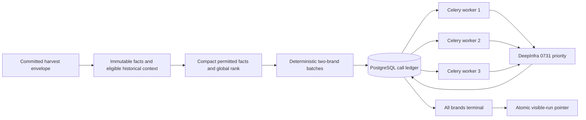
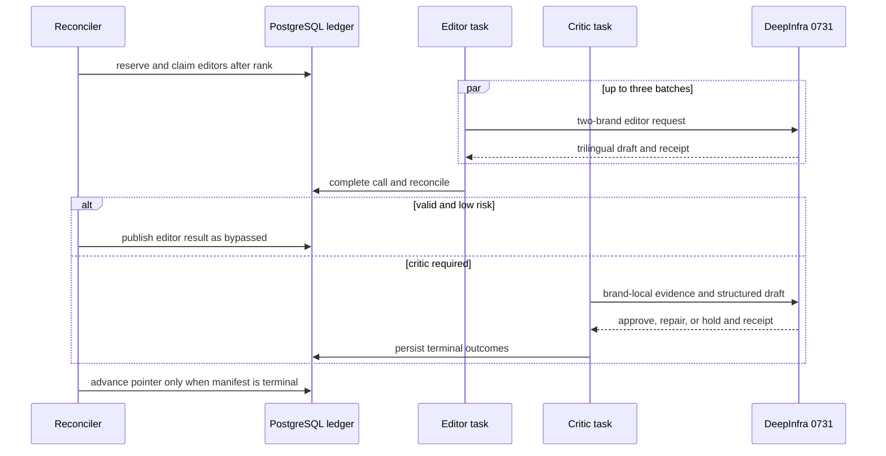
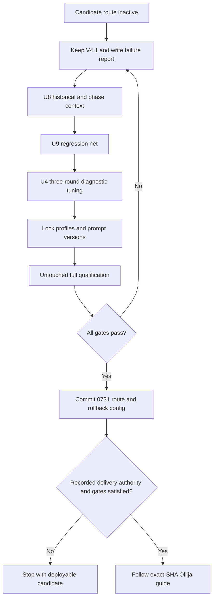

<!-- BEGIN OLLIJA DELIVERY GUIDE -->
## Ollija Delivery Guide

This block is generated guidance. Do not edit it directly. Correct durable facts in `.ollija/project.yaml` or this template, then rerun `ollija annotate-plan`. Put a user-directed exception in the editable Delivery Exceptions section below.

### Resolved locations

- Authoritative host: `fuchitalee`
- Authoritative repository: `/Users/fuchitalee/development/pushin-weight-v2`
- Ollija release worktree area: `/Users/fuchitalee/development/pushin-weight-v2/.worktrees`
- Active worktree: `/Users/fuchitalee/development/pushin-weight-v2/.worktrees/feat/headline-0731-architecture`
- Plan: `/Users/fuchitalee/development/pushin-weight-v2/.worktrees/feat/headline-0731-architecture/docs/plans/2026-09-24-060052-feat-headline-0731-architecture-plan.md`
- Change: `feat-headline-0731-architecture-2026-09-24-060052`
- Branch: `feat/headline-0731-architecture`
- Staging branch and blueprint: `staging`, `/Users/fuchitalee/development/pushin-weight-v2/.worktrees/feat/headline-0731-architecture/render-staging.yaml`
- Production branch and blueprint: `main`, `/Users/fuchitalee/development/pushin-weight-v2/.worktrees/feat/headline-0731-architecture/render.yaml`
- Staging URL: `https://pushinweight-staging-web.onrender.com`
- Production URL: `https://pushinweight-web.onrender.com`

### Placement

This worktree is inside the Ollija release worktree area. Reuse it for the whole change. Do not create a second worktree or plan for this branch.

### Delivery scope

- Workflow: `ce-work`
- Delivery target: `production`
- Owner selection recorded: `true`

1. Complete implementation and the plan's verification contract.
2. Run the configured focused checks:
   - `pytest tests/ollija`
3. The parent workflow commits only this plan's changes, pushes the feature branch, and records the candidate SHA.
4. Fetch the remote staging lane: `git fetch origin refs/heads/staging`.
5. Require the unchanged candidate SHA to be a fast-forward of that fetched remote ref, then push the exact candidate SHA to `refs/heads/staging` with the server-enforced fast-forward command `git push origin <candidate-sha>:refs/heads/staging`.
6. Verify the remote staging ref resolves to the candidate SHA and the deployment for `pushinweight-staging-web` reports that same SHA.
7. Run staging checks. Stop here if they fail.
8. Only after staging passes, fetch the remote production lane: `git fetch origin refs/heads/main`.
9. Require the same unchanged candidate SHA to be a fast-forward of that fetched remote ref, then push the exact candidate SHA to `refs/heads/main` with the server-enforced fast-forward command `git push origin <candidate-sha>:refs/heads/main`.
10. Verify the remote production ref resolves to the candidate SHA and the deployment for `pushinweight-web` reports that same SHA before reporting completion.
11. After step 10 succeeds, perform worktree cleanup as the final filesystem action:
    - From `/Users/fuchitalee/development/pushin-weight-v2`, require `/Users/fuchitalee/development/pushin-weight-v2/.worktrees/feat/headline-0731-architecture` to remain registered, clean, unlocked, and at the verified candidate SHA. If any guard fails, retain it and report the reason.
    - Run `git -C /Users/fuchitalee/development/pushin-weight-v2 worktree remove /Users/fuchitalee/development/pushin-weight-v2/.worktrees/feat/headline-0731-architecture` without `--force`.
    - Preserve the local and remote feature branches. Continue final reporting from the authoritative repository root.

### Failure handling

- Never promote a staging candidate whose automated checks failed.
- Implementation failures return to the parent implementation workflow for diagnosis, correction, recommit, and restaging.
- SSH, shell, environment, or multi-machine failures use the repository infra/multi-machine skill first.
- The change ledger is advisory; do not validate or enforce it.
- Never force-remove a worktree. Retain staging-only, failed, dirty, locked,
  noncanonical, or candidate-mismatched worktrees for diagnosis or later
  delivery.
- Do not run an endless retry loop or start a persistent Ollija process.
<!-- END OLLIJA DELIVERY GUIDE -->

## Delivery Exceptions

- **2026-09-24, owner-requested document publication:** The owner asked to push
  this plan to `main` for reading in VS Code. Publish only this plan and its
  directly supporting research/review documents from a fresh `origin/main`
  base, using an ordinary fast-forward push and `[skip render]` in the commit
  message. Do not merge the implementation branch or activate its candidate.
  A separate, temporary documentation-publication worktree may assemble that
  commit; the canonical implementation worktree and this plan remain the
  execution authority. Suppress only automatic creation of a new plan during
  that worktree's initial checkout; run this canonical plan's Ollija check
  before publication and retain normal commit hooks. Staging/model
  qualification and production-deployment verification are not prerequisites
  for this document-only publication. They remain mandatory for application
  delivery; the existing no-go and root checkout's unrelated changes remain
  intact. This exception does not authorize application or infrastructure
  changes or removal of the canonical implementation worktree.

# Reshape headline generation for DeepSeek V4 Flash 0731

## Plain-English Summary

This plan makes the cheaper DeepSeek V4 Flash 0731 model viable for Pushin
Weight's trilingual headlines by changing how work is packaged and scheduled.
The current five-brand requests ask 0731 to produce too much structured text at
once and then execute every request serially. The new route keeps one global
ranking call, uses two-brand editor and critic packets, and lets three durable
provider-call tasks run at the same time.

The request format will be tuned for 0731 rather than copied from V4.1. That
includes stage-specific prompts, JSON mode or schema, output ceilings, sampler
settings, and a critic packet that pairs each draft directly with its own brand
evidence. Reasoning stays disabled. Existing last-good headlines, critic
routing, one-call entitlements, and atomic publication remain intact.

The switch happens only if the locked 0731 configuration equals or beats the
current V4.1 route on blinded quality and mechanical reliability, completes
inside the headline freshness budget, and costs no more than 35% of the V4.1
control on the same frozen workload. A failed qualification leaves V4.1 in
place. The owner selected production delivery after qualification.

The first qualification failed on factual support. Before retesting, this plan
now incorporates the owner's finance-context handoff: distinguish a temporary
spike from sustained activity, recent cooling from overall growth, and a
preceding-period comparison from activity that is unusual for this time. Code
calculates these measurements; the existing writer explains them using posts.
This describes collected discussion, not market value or future performance.

The packet will also become smaller. Exact duplicate post text and internal
selection scores alone account for 26% of captured editor messages and 23% of
critic messages. Remove that repetition, meaningless phrase signals, and
prohibited comparisons before adding historical context. Keep original source
wording, citations, brand identity, time intervals, and coverage limitations.
These are measured byte reductions on saved requests, not yet measured token
or latency savings. The revised design requires fresh qualification; the first
failed run remains evidence and does not become a passing test retroactively.

---

## Goal Capsule

- **Objective:** Publish current trilingual trend headlines at materially lower
  LLM cost without reducing factual support, proportionality, usefulness, or
  availability compared with the V4.1 Flash incumbent.
- **Means:** Adapt the provider request contract to 0731, reduce editor and
  critic packets to two brands, and execute the existing durable stage tasks at
  bounded concurrency three, with compact permitted facts and finance-informed
  context (KTD1–KTD11).
- **Authority:** The Product Contract governs observable behavior. The Planning
  Contract governs implementation. The generated Ollija Delivery Guide governs
  delivery authority and permits production only after the qualification and
  staging gates. The present amendment is planning work, not activation.
- **Execution profile:** Characterize the incumbent first, add the candidate
  route behind explicit configuration, tune on a diagnostic set, lock one
  request profile, then run the untouched qualification set. After the first
  no-go, execute U7 → U8 → U9, repeat U4 on diagnostics, then U5 on a new
  unseen holdout; U6 remains conditional. Existing U1–U3 are retained.
- **Stop conditions:** Stop activation if 0731 misses any quality, integrity,
  completeness, cost, latency, memory, provider-attestation, or queue-drain
  gate. Do not compensate with runtime retries, per-call V4.1 fallback, a larger
  reasoning budget, or partial-run publication.
- **Landing ownership:** The owner selected production delivery. The release
  still requires qualification, staging, and exact-SHA production verification.

---

## Product Contract

### Summary

Reshape the existing rank-editor-critic headline pipeline around 0731's
strengths and throughput limits while keeping the public headline product and
its safety guarantees intact. Add supported historical and phase context to
the same narrative fields; do not expand the public request/filter contract.

### Problem Frame

The direct DeepInfra evaluation proved that 0731 can complete all 37 production-
shaped calls for 84.5% less measured cost than V4.1, but the current request
shape is unsuitable. Five-brand serial packets made the production-shaped
workload 5.6 times slower in summed provider time. In blinded review, V4.1 won
9 of 12 pairs; 0731's recurring errors were unsupported causal language,
claims broader than the sample, reversed volume direction, cross-brand
conflation, and translated proper names.

The limitation was not hidden reasoning. The baseline ran with reasoning
disabled, while a low-reasoning correction probe exhausted the 11,000-token
ceiling on all three calls. A production-sized priority-tier critic probe
reduced latency from 290.4 seconds to 103.4 seconds. The evidence points to
smaller brand-local packets, explicit checks, bounded concurrency, and
provider-specific request tuning.

### Requirements

- R1. The public result remains one complete English, Simplified Chinese, and
  Japanese narrative for every eligible tracked brand, with the existing
  headline, secondary, proposition, event, confidence, and narrative-kind
  contract.
- R2. One global rank call continues to order every eligible brand. An invalid
  rank response falls back to the complete deterministic order and cannot drop
  a brand.
- R3. Editor and critic work uses deterministic packets of at most two brands;
  an irreducibly oversized pair splits to one-brand packets without dropping
  evidence or changing rank order.
- R4. The 0731 route uses direct DeepInfra, priority service, zero provider or
  SDK retries, and reasoning disabled. The application rejects a response whose
  model or service-tier receipt does not match the configured route.
- R5. Rank, editor, and critic each receive a request shape optimized for 0731.
  The selected prompt, structured-output mode, sampler settings, packet
  projection, and output ceiling are versioned independently and locked before
  qualification.
- R6. A valid editor result reaches the critic as structured brand-local review
  bundles pairing each draft with its own dossier. Raw editor text is included
  only for a mechanically invalid draft the critic may reconstruct.
- R7. After rank completes, up to three existing provider-call tasks may execute
  concurrently. Each task still owns exactly one durable call entitlement and
  at most one outbound transport.
- R8. Risk-based critic bypass remains available only for mechanically valid,
  low-risk editor output under the existing policy. Causal, event-led,
  fact-alignment, incomplete-coverage, invalid, and audit-sampled output still
  reaches the critic.
- R9. Every manifest brand reaches a terminal state before the visible run
  advances atomically. Failed work keeps the previous last-good narrative.
- R10. Budget reservation covers the maximum graph implied by the configured
  brand cap and two-brand batching. Provider receipts preserve model, service
  tier, token counts, cost, request ID, and latency for audit.
- R11. No headline browser request, harvest request count, classification,
  translation, or commentary changes in this work. Headline-only deterministic
  calculations and provider projections may change under R14–R19; source
  classifications and historical database rows are not rewritten.
- R12. The candidate passes a locked comparison against the current V4.1
  production route. Failure leaves V4.1 active and produces a reproducible
  failure report rather than a partial switch.
- R13. V4.1 remains a whole-route rollback configuration. Production never
  retries an ambiguous 0731 call through V4.1.
- R14. Every provider stage receives an explicit field allowlist. Preserve the
  rich immutable snapshot privately; omit selection internals and exact text
  duplicates from the model request. Do not trade away evidence cardinality,
  provenance, meaningful minority views, or completeness warnings for size.
- R15. Suppressed aggregate comparisons are absent from model-visible facts,
  phrase statistics, summaries, and generated examples, not merely accompanied
  by a warning. This does not redact comparisons an author actually wrote;
  source claims retain attribution and cannot substitute for corpus metrics.
  Each permitted quantitative fact specifies its brand, interval, unit,
  denominator, coverage, and comparison basis. Within-window endpoint change,
  prior-period change, and historical-normalized activity are distinct.
- R16. Historical expectations use comparable, completed intervals within the
  same collection regime and scope. Expose the baseline policy/version, sample
  size, interval, timezone, coverage, and observed/expected ratio. Insufficient
  history produces unavailable context; it never licenses "normal" or "usual."
- R17. Describe overall and recent direction, peak/cooling, persistence, and
  participation breadth using bounded deterministic facts. Incomplete buckets,
  low bases, backfills, and collection changes cannot masquerade as trends.
- R18. Source support must concern the attributed brand/product. A citation
  belonging to a brand dossier is not proof that every entity or number in that
  post concerns that brand. Quoted allegations remain attributed allegations;
  an individual's stated reason cannot establish the cause of an aggregate
  movement or population-wide adoption.
- R19. Retain the rank/editor/critic graph with no new LLM pass. Measure packet
  bytes, provider-reported tokens, SQL/build time, total wall time, and billed
  cost. The finance additions must fit the existing finite resource envelope.

### Key Decisions

- KD1. **0731 is the candidate model, and its request shape may differ from
  V4.1.** (session-settled: user-directed — chosen over an identical-shape
  comparison: the goal is to give 0731 its best reasonable chance to equal or
  beat the incumbent.) Governs R4–R6, R12.
- KD2. **Quality parity with V4.1 is the activation bar.** (session-settled:
  user-directed — chosen over switching on cost or mechanical completion alone:
  the first evaluation showed those signals can hide semantic failures.)
  Governs R12.
- KD3. **Reasoning remains disabled.** (session-settled: user-approved — chosen
  over low reasoning: every low-reasoning critic probe exhausted the response
  budget.) Governs R4–R5.
- KD4. **The normal packet contains two brands.** (session-settled:
  user-approved — chosen over retaining five brands or making every request
  single-brand: two brands reduce model burden without repeating all fixed
  prompt context forty times.) Governs R3, R5–R7.
- KD5. **Integrate finance context and packet cleanup before the next tuning
  campaign.** (user-directed on 2026-09-24.) Preserve the no-go and qualify the
  revised design on fresh data. Jev and semantic reason histories are deferred.

### Success Criteria

- SC1. The locked 0731 arm completes every planned request and gives every
  eligible brand a terminal outcome, with zero unsupported false approvals and
  zero missing locale fields.
- SC2. In the blinded holdout, 0731 has no worse aggregate mean or rubric score
  than V4.1, no more critical failures, and no pairwise loss majority. Factual
  support and proportionality cannot be rescued by a less material rubric.
  Three independent reviewers each score eight disjoint randomized A/B pairs
  against the frozen five-part rubric: factual support, proportionality,
  why-first relevance, secondary usefulness, and translation equivalence.
- SC3. Symmetrically normalized mechanical-invalid calls are no higher than the
  V4.1 control, and normalization supplies no model-written content.
- SC4. One-day completion p95 is at most 12 minutes, seven-day completion p95 is
  at most 15 minutes, and arrival/drain utilization stays below 0.75 at
  concurrency three.
- SC5. Actual provider-billed cost for the locked 0731 workload is at most 35%
  of the V4.1 control cost on identical frozen inputs.
- SC6. Three concurrent worker processes remain below the Render memory ceiling
  with at least 25% headroom, and simultaneous due windows do not build an
  unbounded queue.
- SC7. Duplicate delivery, worker loss, timeout, rate limit, malformed JSON,
  model mismatch, tier mismatch, and one failed brand batch preserve the
  one-transport entitlement and last-good behavior.
- SC8. The production snapshot → projected request → draft/critic → served
  narrative path preserves permitted facts and their scope. Suppressed prior
  comparisons cannot enter any stage, and no historical norm is emitted when
  baseline eligibility is unavailable.
- SC9. Publish before/after per-stage packet and token measurements, including
  the new context. The diagnostic engineering target is at least 20% fewer
  aggregate message bytes than the saved candidate on the same source workload;
  this is not a promised token reduction or a substitute for SC1–SC8. Record a
  target miss and its cause; never remove required evidence to meet it.

### Scope Boundaries

- The visible layout, supported locales, complete rank manifest, critic bypass
  policy, and publication model remain unchanged. Headline facts, phrase
  selection, source-relevance handling, and provider projection are revised;
  numerical inputs retain explicit provenance and versioned meaning.
- No database migration is planned. Existing JSON request and response payloads
  carry versioned request profiles and provider receipts.
- No automatic per-call fallback, speculative dual-model execution, additional
  critic pass, reasoning mode, or browser-triggered generation is added.

#### Deferred to Follow-Up Work

- Test standard-tier ranking as a separate cost optimization after the all-
  priority route qualifies.
- Consider prompt-cache retention only after production prefix reuse is
  measured.
- Revisit one-brand critics only if the two-brand design still shows cross-brand
  conflation after all three bounded tuning rounds.
- Jev; semantic reason-history extraction/taxonomy; chart-image interpretation;
  financial forecasting; arbitrary date/country/post-language headline filters;
  and new statistical libraries such as `ruptures`.
- Full matched historical norms for 30/365-day windows beyond the initial
  bounded baseline policy. Those windows keep supported within-window context
  and explicitly unavailable historic norms, rather than invented comparisons.

---

## Planning Contract

### Key Technical Decisions

- KTD1. Extend the strict direct DeepInfra client with named headline profiles
  for rank, editor, and critic. Profiles own allowed sampler fields,
  `reasoning_effort=none`, priority tier, structured-output mode, and exact model
  identity. Arbitrary caller options remain rejected. This applies KD1 and KD3.
- KTD2. Keep the all-brand rank call, then use a configurable two-brand maximum
  in the deterministic split function. The recursive packet-budget split remains
  the one-brand fallback. This applies KD4.
- KTD3. Replace the critic's escaped `editor_response_raw` string on valid
  results with structured per-brand review bundles. Each bundle contains one
  dossier, its matching draft, and local parse diagnostics; invalid output uses
  bounded raw text plus the closed packet.
- KTD4. Use Celery's existing one-call-per-task graph at worker concurrency
  three. Do not add an in-process thread pool: durable claims, fences, unique
  `(run, stage, batch_key)` rows, and the reconciler already provide safe fan-
  out and recovery across processes.
- KTD5. Tune request shape in at most three diagnostic rounds, then lock one
  immutable stage profile before touching the holdout. Candidate dimensions are
  concise prompt wording, JSON schema versus JSON-object mode, temperature,
  top-p, fixed seed, brand-local projection, and output ceiling. Reasoning,
  retries, arbitrary evidence removal, and extra model calls are not tuning
  dimensions. R14 permits exact duplicate removal and stage-specific
  projection; R18 permits auditable exclusion/replacement of demonstrably
  unrelated evidence without silently reducing the evidence target. The first
  reviewed holdout is now diagnostic material, never an unseen qualification.
- KTD6. Reserve for `1 + 2 × ceil(N / 2)` calls. For 40 brands this is 41
  calls. Start with a 300-second timeout, the existing 900-second lease,
  concurrency three, a 1.6M input-token cap, 350k output-token cap, and $0.30
  priority-tier cap. Price reservations use the captured direct-DeepInfra
  priority rates of $0.09 per million input tokens and $0.27 per million output
  tokens; qualification may lower these caps but may not raise them without a
  new finite preflight and refreshed price evidence.
- KTD7. Compare optimized 0731 with the current V4.1 production route rather
  than forcing identical parameters. For the revised packet, also run V4.1
  with the same revised factual information: this separates packet benefit
  from provider capability. Freeze three explicit evaluation arms and one
  finite budget before paid execution; no three-arm runtime is introduced.
  Apply SC1–SC3 to the revised candidate against both controls; SC5 retains
  unchanged-production-route cost as its denominator. This applies KD1–KD2.
- KTD8. Activate by committed route configuration only after qualification.
  Keep the DeepSeek credential and V4.1 route valid for whole-route rollback,
  but never mix them inside a run.
- KTD9. Use separate rank/editor/critic projections from a versioned canonical
  snapshot. Rank gets concise per-brand notability facts and two source
  previews. Editor gets the selected source evidence and permitted context.
  Critic gets the same admissible brand facts/evidence with its matching draft,
  including contrary context; do not narrow it to the draft's citations alone.
- KTD10. New finance facts are calculated in the existing read-only repeatable-
  read snapshot transaction with finite database work. Adopt the bounded
  initial policy below, calibrate thresholds on diagnostics, and lock the
  policy and projector before fresh qualification.
- KTD11. Reject mechanically invalid fact IDs, units, intervals, and structured
  numerical bindings before publication. The critic separately checks whether
  prose actually follows from the source. Do not treat an ID-ownership check
  or a regex over prose as semantic proof.

### High-Level Technical Design

### Request-Shape Optimization Matrix

| Dimension | Rank | Editor | Critic |
| --- | --- | --- | --- |
| Packet | Salient permitted facts and two source previews per brand | At most two compact dossiers with full selected evidence | Per-brand compact dossier/draft bundles |
| Output | Complete ordered manifest | Trilingual narrative schema | Approve/repair/hold schema |
| Structured mode | Schema or JSON object | Schema or JSON object | Schema or JSON object |
| Emphasis | Relative notability | Why-first copy and citations | Direction, causality, scope, ownership, names, locale parity |
| Reasoning | Disabled | Disabled | Disabled |
| Runtime retries | Zero | Zero | Zero |
| Initial ceiling | 2,400 | 8,000 | 8,000 |

The initial ceilings above are starting defaults, not the previously tested
profile: the first qualification used a 7,000-token rank ceiling. Preserve
exact manifests and re-lock actual ceilings during U4.

### Packet redesign: remove noise before adding context

The saved first qualification contains 50 requests: two ranks, 24 editors,
and 24 critics for the 1/7-day snapshots. The byte audit in
`docs/research/2026-09-24-170254-headline-packet-size-audit.md` examines the
actual message strings in `provider_request`, not the larger retained artifact.

| Stage | Messages | Original aggregate UTF-8 bytes | After duplicate/internal-score removal | Reduction |
| --- | ---: | ---: | ---: | ---: |
| Rank | 2 | 501,126 | 501,126 | 0% |
| Editor | 24 | 1,450,418 | 1,072,295 | 26.1% |
| Critic | 24 | 1,613,273 | 1,235,150 | 23.4% |
| Total | 50 | 3,564,817 | 2,808,571 | 21.2% |

This offline accounting removes only `original_text` when identical to
`excerpt`, `text_en`/`text_zh_cn` when identical to that same excerpt, and
`_ranks`/`_role_eligible`. All 301 selected evidence occurrences remain.
Aliases in the new schema will retain the language/translation relationships.
No prompt was run, and no token or latency reduction is established. The
original receipts total 1,002,636 input tokens across these 50 calls.

Implement these changes in order:

1. **Allowed fields instead of an exclusion list.** `_provider_dossier()`
   currently copies fields unless explicitly excluded, so internal evidence
   fields escape into requests. Keep those in the private snapshot only.
   Define and test explicit nested schemas for every stage; unknown private
   fields must not silently enlarge a request.
2. **One original excerpt, with translation only where useful.** Preserve source
   language, source ID, timestamp, brand-specific author role, and unaltered
   wording including attribution/negation. Exact duplicates use references.
   Retain a distinct existing English translation when needed; test removing a
   redundant second translated rendering separately on multilingual diagnostics.
   Trilingual output does not require three copies of the same input. Do not
   replace source quotations with model-written summaries or cut context just
   to reach a byte target. Retain meaningful truncation/translation status.
3. **One representation of each fact.** Replace redundant `current_value`,
   `source_value`, rendered EN/ZH strings, repeated coverage objects, and family
   summaries with typed facts and shared scope/coverage references where their
   meanings coincide. Preserve genuinely distinct values. Count facts must not
   say `direction=increase` merely because their absolute value is positive.
   Carry counts, units, denominators, intervals, and exact allowed citations;
   format display text in application code where that contract already exists.
4. **Remove unusable comparisons at the boundary.** When comparison is
   suppressed, remove `baseline_value`, `prior_post_count`, prior phrase
   prevalence, change facts, and summary `largest_change` derived from that
   comparison. Keep a concise suppression reason and current coverage. Apply
   this to rank, editor, critic, bypass, and invalid-editor reconstruction.
  The legacy `_provider_family_facts(..., comparison_allowed=...)` filter is
   not proof that the current compact path is filtered. This restriction
   concerns our aggregate comparisons, not an author's quoted product test.
5. **Useful phrases only.** Current top phrases include `https co`, `of the`,
   and `in the`. Strip URL artifacts before phrase extraction and exclude
   language-appropriate stopword-only phrases; rank remaining signals within
   the existing cap of eight, allowing fewer. Preserve model names, versions,
   non-English terms, negative/contrary views, and genuine promotional topics.
   Cross-brand repetition can itself be evidence of a campaign, not automatic
   deletion. Store each representative excerpt once and reference its ID.
   Keep exact source-deduplicated prevalence and resource-limit status; phrase
   frequency still cannot establish a semantic cause or stated-reason trend.
6. **Smaller rank input.** It currently receives full fact/family/phrase blocks
   despite being a ranking task (201–288 KiB per captured rank message). Send
   only salient permitted measurements, identity, eligibility/coverage, and
   the existing two source previews; retain all manifest brands and citations
   needed by the rank schema. Editor and critic retain the detailed evidence.

Critic duplicate removal is partly implemented already: valid critic requests
send structured review bundles without also sending `analysis_packet` or raw
editor JSON. Do not count that existing optimization as a new saving. The
critic still needs its own closed source context; no hidden conversational
memory, narrower contrary-evidence set, or additional LLM call is assumed.

### Finance-informed fact contract

Reuse `monitor/trend_narrative_facts.py` and the snapshot transaction in
`monitor/trend_narrative_candidates.py`; expose new facts through all provider
projections, not only private aggregates. The durable research handoff is
`docs/research/2026-09-24-153052-finance-informed-headline-context.md`.

- **Initial historical policy:** for 1/7-day windows, consider at most eight
  preceding weekly offsets, aligned in UTC with the same start weekday/hour
  and duration as the completed observed interval. Require at least four
  eligible matched intervals and the existing coverage floor, plus no known
  backlog overlap or collection-regime mismatch. Earliest stored-post time
  alone cannot prove complete comparable collection. Unsupported coverage
  becomes unavailable; do not add a new collection system to manufacture it.
  Calculate mean matched post rate and observed/expected ratio, preserving
  sample size, start/end, policy version, timezone, and eligibility reasons.
  Expected zero means unavailable ratio, not infinity. These are initial
  diagnostic defaults; lock any justified changes before qualification.
- **Temporal scope:** prior-period comparison, first-to-last completed bucket
  change, matched historical expectation, and recent change have distinct fact
  types and explicit intervals. Use rates for unequal durations. Exclude an
  unfinished final bucket rather than describing its low count as cooling.
  For 30/365-day windows, keep the shape facts but mark matched historical
  norms unavailable under this initial policy.
- **Shape:** expose overall/recent direction, peak time/rate, time since peak,
  drop from peak, and remaining elevation above a valid baseline. Replace
  ambiguous `total_change_pct` with an interval-specific fact. Add directional
  efficiency `abs(last-first)/sum(abs(adjacent changes))` with explicit
  flat/zero handling; it is not magnitude, significance, or proof of noise.
  Normalized slope/fit is a diagnostic candidate, not another mandatory
  redundant metric in every provider packet.
- **Phases:** at most three supported, ordered phase records with completed
  interval bounds and supporting fact IDs: buildup, spike, sustained elevated
  activity, cooling, return to usual, or repeated bursts. Calibrate duration,
  low-base, and magnitude thresholds using diagnostic fixtures and existing
  episode thresholds. Historical-elevation phrases require a valid norm;
  otherwise use literal peak/cooling descriptions. Mark an ongoing phase
  provisional and never use observations after `as_of`. Do not add `ruptures`
  or a new public taxonomy for this first implementation.
- **Breadth and content:** calculate distinct observed authors and deduplicated
  sources over the same interval. First-party posts and repeated public posts
  are not independent evidence of adoption. Keep representative source text
  and contrary examples alongside shape facts; headlines still lead with the
  topic people discuss. Explicit reasons support that speaker's position,
  not an explanation for all activity. No new sentiment/intent extraction or
  additional model pass is introduced.
- **Bounds and provenance:** fetch historical aggregates in bounded queries,
  never send raw historical post/bucket arrays to the model, and retain the
  existing statement/row/time limits. If history exceeds resource or coverage
  limits, publish supported current context with historical status unavailable.
  Snapshot, comparison policy, semantic fact schema, prompt, and projection
  versions participate in fingerprints/demand identity so stale old packets
  cannot satisfy a redesigned request. Already persisted runs stay immutable.

### System-Wide Impact

- **Provider:** Headlines move from the DeepSeek Anthropic-compatible client to
  the existing direct DeepInfra transport. Other enrichment routes do not move.
- **Queue:** The isolated headline worker changes from one to three processes
  with prefetch one. Harvest and every non-headline queue remain untouched.
- **Persistence:** Existing call identity and state remain authoritative. JSON
  payloads gain fact-policy/projection versions as well as request-profile and
  provider-receipt provenance. Original snapshots and historical runs remain
  readable without rewriting their fact meaning.
- **Serving:** The browser still reads the persisted visible run. No payload or
  UI schema changes.
- **Operations:** Status reports configured versus observed route, batch size,
  concurrency, graph ceiling, latency, cost, and budget suspension.

### Risks & Dependencies

- Priority performance can vary. Qualify with actual p95 and tier receipts.
- Three prefork workers may exceed Render Starter memory. SC6 is an activation
  gate, not a monitoring suggestion. The staging load check must include total
  resident memory and database connections across the parent and child
  processes; if it fails, do not silently substitute a thread pool or lower the
  concurrency after qualification.
- Structured output can improve syntax while harming content. Tune both schema
  and JSON-object forms, then pin one without runtime retries.
- Concurrent completions can reconcile simultaneously. Database uniqueness and
  locks must be proven under concurrency.
- Prompt tuning can overfit known errors. Keep diagnostic and holdout IDs
  disjoint and freeze profiles before qualification.
- Reducing bytes can remove nuance without improving latency. Preserve exact
  source meaning and measure provider tokens and total completion time; input
  cleanup does not eliminate output-generation or queue time.
- Historical collection is not necessarily stable. Suppress unsupported norms
  and broad participation claims rather than interpreting collection changes
  as audience behavior. Versioned defaults are hypotheses until calibrated.
- The active checkout contains unrelated work. Implementation must use an
  isolated canonical worktree or an owner-directed Delivery Exception.

### Alternatives Considered

- **Keep five-brand serial requests:** already failed quality and latency.
- **Use one brand for every call:** simplest packets, but doubles fixed prompt
  overhead; retain it as the oversize fallback.
- **Use an in-process thread pool:** weakens the one-task/one-entitlement failure
  boundary and complicates cancellation.
- **Enable reasoning:** exhausted the response ceiling three times.
- **Fallback to V4.1 per call:** can duplicate ambiguous sends and mix behavior
  within one run; use whole-route rollback.

### Sources & Research

- `docs/research/2026-09-23-105318-headline-0731-model-evaluation.md` at commit
  `7e4523b`: full cost, latency, normalization, blind-review, and probe evidence.
- `docs/solutions/architecture-patterns/2026-08-12-205000-cached-bilingual-trend-narratives.md`:
  durable ledger, queue isolation, last-good, and publication pattern.
- [DeepInfra chat API overview](https://docs.deepinfra.com/chat/overview):
  priority service, structured output, and reasoning parameters.
- [DeepInfra reasoning controls](https://docs.deepinfra.com/chat/reasoning):
  `reasoning_effort=none` behavior.
- [DeepInfra 0731 endpoint](https://deepinfra.com/deepseek-ai/DeepSeek-V4-Flash-0731/api):
  exact route, JSON support, priority support, and request schema.
- `docs/research/2026-09-24-163708-headline-0731-qualification-no-go.md`:
  first campaign failure, blinded scores, and remaining activation gates.
- `docs/research/2026-09-24-153052-finance-informed-headline-context.md`:
  preserved finance handoff, official research links, implementation boundaries,
  and limitations; integration authorized by the owner after that handoff.
- `docs/research/2026-09-24-170254-headline-packet-size-audit.md`:
  captured-message byte measurements and reproduction method, without paid calls.

---

## Implementation Units

For the revised campaign, reuse U1–U3, then execute **U7 → U8 → U9 → U4 → U5
→ U6**. U6 requires a new passing qualification; old unit IDs and the original
failure record are preserved. This amendment does not initiate implementation
or paid calls.

### U1. Add strict 0731 headline transport profiles

**Goal:** Express and attest each headline stage through direct DeepInfra
without loosening other callers.

**Requirements:** R4–R5, R10, R13.

**Dependencies:** None.

**Files:** `x_monitor/deepinfra.py`, `monitor/trend_narrative_generation.py`,
`x_monitor/config.py`, `tests/test_deepinfra.py`,
`tests/test_trend_narrative_generation.py`, `tests/test_llm_config.py`.

**Approach:** Add named rank/editor/critic profiles; admit only their approved
structured-output and priority fields; resolve only `DEEPINFRA_API_KEY`; and
persist the full non-secret provider receipt. Reject model or tier mismatch
before the response can become publication input.

**Execution note:** Characterize the current strict client first because its
omission of headline-only fields protects existing profiles.

**Patterns to follow:** Named DeepInfra request profiles, provider telemetry,
and provider-call JSON payloads.

**Test scenarios:**

- A valid profile emits exact model, priority tier, samplers, structured mode,
  and no reasoning.
- Existing classifier and Gemma profiles remain byte-for-byte unchanged.
- Callers cannot override pinned fields or inject routing controls.
- Missing credential, model/tier mismatch, incomplete response, 429, timeout,
  and malformed usage fail closed without a second transport.
- Successful calls persist actual tokens, cost, request ID, model, tier, and
  latency without credentials.

**Verification:** Transport and configuration tests prove isolation and receipt
attestation; existing enrichment-route tests remain green.

### U2. Build two-brand 0731 request contracts

**Goal:** Reduce per-call cognitive and output load while making brand ownership
and critic evidence alignment explicit.

**Requirements:** R1–R6, R8.

**Dependencies:** U1.

**Files:** `monitor/trend_narrative_candidates.py`,
`monitor/trend_narrative_generation.py`, `x_monitor/config.py`,
`tests/test_trend_narrative_candidates.py`,
`tests/test_trend_narrative_generation.py`.

**Approach:** Replace fixed five-brand math with a two-brand setting; retain
recursive one-brand splitting; version closed stage schemas; send structured
brand-local critic bundles; and shorten prompts around checks for direction,
causality, sample scope, brand ownership, proper names, and locale parity.

**Test scenarios:**

- Zero, one, two, three, and forty eligible brands produce complete ordered
  packets with no batch above two brands.
- An oversized pair splits without losing evidence or changing rank order.
- Each structured draft is paired only with its matching dossier.
- Invalid raw output remains bounded and cannot inject instructions.
- Cross-brand IDs, reversed numbers, translated proper names, and missing locale
  fields trigger the intended control.
- Existing low-risk bypass and risk reasons retain their behavior.

**Verification:** Packet fixtures prove size, ownership, deterministic identity,
and readable versioned prompts; legacy headline validators still pass.

### U3. Run the call graph at concurrency three

**Goal:** Recover wall-clock latency through existing Celery fan-out without
weakening call entitlement or publication.

**Requirements:** R7–R10, R13.

**Dependencies:** U2.

**Files:** `monitor/trend_narrative_tasks.py`, `monitor/tasks.py`,
`x_monitor/config.py`, `render.yaml`, `render-staging.yaml`,
`tests/test_trend_narrative_orchestration.py`,
`tests/test_trend_narrative_lifecycle.py`,
`tests/test_render_headline_topology.py`, `tests/test_headline_status.py`.

**Approach:** Keep one task per ledger row; raise isolated worker concurrency to
three with prefetch one; let each completed editor release its critic without an
all-editor barrier; and derive graph budgets and drain validation from batch
size and concurrency using KTD6.

**Test scenarios:**

- At most three transports run simultaneously and a fourth waits.
- A critic starts while unrelated editors remain active.
- Concurrent reconcilers enqueue each stage/batch at most once.
- Pre-send loss recovers; post-send loss becomes ambiguous and never resends.
- Out-of-order completion cannot publish a partial or older run.
- Forty brands fit the caps; the next call or over-budget request suspends before
  transport.
- Render and status agree on queue, prefetch, and concurrency.

**Verification:** Concurrency tests prove one transport per entitlement and one
monotonic activation; topology remains isolated from harvest and beat.

### U4. Tune and lock the best 0731 request shape

**Goal:** Give each stage its best reasonable configuration without training on
the qualification holdout.

**Requirements:** R5, R10, R12.

**Dependencies:** U1–U3 and, for the revised campaign, U7–U9.

**Files:** `monitor/trend_narrative_evaluation.py`,
`scripts/headline_0731_bakeoff.py`, `tests/test_trend_narrative_evaluation.py`,
`tests/test_evaluate_trend_headlines_command.py`, `docs/research/`.

**Approach:** Port the no-publication harness from commit `7e4523b`, then
generalize it to explicit route, batch size, and bounded concurrency. Freeze a
diagnostic set around the five observed semantic failures, run at most three
correction rounds over KTD5's dimensions, record exact requests and receipts,
then freeze one profile per stage.

For the revised campaign, treat all first-qualification outputs and reviewer
comments as diagnostic material. Include suppressed comparisons, unrelated
Yi suffix matches, product/parent-brand scope, wrong-company financial figures,
interval-confused percentages, allegation attribution, and spike/cooling
fixtures. Lock baseline/phase thresholds and projection versions alongside
prompts. Compare old/new packet bytes before paid execution; preserve all
selected source IDs or document relevance replacement and insufficient supply.

**Test scenarios:**

- Preflight rejects unbounded resources, concurrency above three, unknown
  route/profile, stale price evidence, and oversized packets.
- Evaluation never exceeds manifest concurrency and writes deterministic output
  order despite completion order.
- Diagnostic and holdout IDs are disjoint; locked profiles cannot change after
  holdout start.
- Every round preserves exact prompt/schema, receipt, errors, tokens, cost,
  latency, and artifact digest.

**Verification:** The tuning report names all attempted shapes, why each failed
or won, and the exact locked configuration.

### U5. Qualify 0731 against V4.1

**Goal:** Decide the switch from product quality, reliability, latency, and
actual spending.

**Requirements:** R1, R8–R19; SC1–SC9.

**Dependencies:** U4.

**Files:** `scripts/headline_0731_bakeoff.py`,
`monitor/trend_narrative_evaluation.py`, `docs/research/`,
`tests/test_trend_narrative_evaluation.py`.

**Approach:** Freeze a new unseen source corpus and historical inputs; do not
reuse the first qualification as a holdout. Run the unchanged V4.1 route,
V4.1 with revised facts, and optimized 0731 with revised facts under KTD7.
Use the same source corpus, cutoff, and scope for all arms; document that the
unchanged route has the old packet semantics. Apply symmetric
representation-only normalization;
blind 24 paired narratives across three reviewers, with eight disjoint pairs
per reviewer for each comparison and randomized model-hidden A/B order;
measure end-to-end
concurrent wall time, queue drain, memory, tokens, and billed cost; then emit
one hashed `qualify_0731` or `retain_v41_flash` result. Freeze the five-part
rubric in SC2 and the complete review manifest before revealing any holdout
output. Break down legacy-control versus revised-control results explicitly:
better packets do not by themselves establish that 0731 equals V4.1.

**Test scenarios:**

- A cheaper or faster arm that loses quality cannot qualify.
- A quality winner with a critical support error, tier mismatch, incomplete
  brand, excessive memory, or unsafe drain cannot qualify.
- Aggregate ties cannot hide factual-support or proportionality regressions.
- A passing result uses provider receipts and verifies every success criterion
  mechanically before writing the decision.

**Verification:** The report includes raw counts, blinded judgments, bills,
wall-clock distributions, route attestation, hashes, and one decision.

### U6. Activate the qualified route and preserve rollback

**Goal:** Commit 0731 as the headline route only after U5 passes, with an
auditable V4.1 rollback.

**Requirements:** R4–R5, R10–R13; SC7.

**Dependencies:** U5 with `qualify_0731`.

**Files:** `config.yaml`, `render.yaml`, `render-staging.yaml`,
`monitor/trend_narrative_projection.py`, `monitor/views.py`,
`tests/test_headline_status.py`, `tests/test_render_headline_topology.py`,
`docs/reference/headline-trend-narratives.md`, `docs/deploy/render.md`.

**Approach:** Pin the qualified route, profiles, prompt versions, priority
prices, batch/concurrency controls, budgets, and publication epoch; add the
DeepInfra worker secret while retaining the V4.1 rollback credential; expose
route receipts and capacity in status; and, after fresh U5 qualification under
the recorded delivery choice, stage the exact candidate disabled-first before
a bounded canary.

**Test scenarios:**

- Stale model, endpoint, profile, price, tier, credential, or concurrency fails
  closed.
- Status distinguishes configured route from observed receipts without secrets
  or post text.
- Disabled calls serve last-good copy and perform no transport.
- Whole-route rollback affects new runs without erasing rows or retrying an
  in-progress call.
- A bounded staged run publishes only after all brands are terminal and serves
  all three locales.

**Verification:** Configuration, topology, status, projection, and rollback
tests pass; reference docs describe the live route rather than experiment
history.

### U7. Compact and constrain the provider packet

**Goal:** Remove repeated and unusable input while correcting the evidence and
fact-scope failures exposed by the first qualification.

**Requirements:** R3, R5–R6, R14–R15, R18–R19; SC8–SC9.

**Dependencies:** Existing U2; first no-go and packet-size audit are diagnostics.

**Files:** `monitor/trend_narrative_candidates.py`,
`monitor/trend_narrative_generation.py`,
`tests/test_trend_narrative_candidates.py`,
`tests/test_trend_narrative_generation.py`, `docs/research/`.

**Approach:** Implement the six packet cleanup steps above. Preserve rich
private snapshots, add strict per-stage projections, and carry concise
unavailability rather than unusable numerical values. Audit source relevance
before selecting examples: Turkish suffix `-yi` alone cannot substantiate
01.AI; a multi-company post's DeepSeek financing cannot become Kling financing.
Use existing verified brand/product relationships and source text; do not
invent an alias or hardcode holdout IDs. Where attribution is uncertain, retain
the uncertainty and require the critic to omit/hold that claim. Do not rewrite
underlying `PostBrand` or classification rows in this headline task.

**Verification:** All provider-visible paths omit suppressed comparisons and
private scores, preserve selected evidence IDs, retain source language and
negation, and give the critic both supporting and contrary context. Measure
the serialized request actually sent, not only its local enclosing artifact.
Record changed source selection separately from representation-only savings.

### U8. Add bounded historical and phase facts

**Goal:** Explain unusual activity and its progression with measured context.

**Requirements:** R16–R19; SC8–SC9.

**Dependencies:** U7.

**Files:** `monitor/trend_narrative_facts.py`,
`monitor/trend_narrative_candidates.py`, `monitor/trend_narrative_demand.py`,
`monitor/trend_narrative_generation.py`,
`tests/test_trend_narrative_facts.py`,
`tests/test_trend_narrative_candidates.py`,
`tests/test_trend_narrative_demand.py`, `docs/research/`.

**Approach:** Implement the Finance-informed fact contract in the existing
snapshot transaction. Start with completed 1/7-day matched intervals, shared
scope references, peak/recent/overall facts, bounded phases, and participation
counts. Inspect available harvest/coverage provenance before admitting any
historic norm. Calibrate on diagnostics; store all rejected/unsupported facts
privately and expose concise unavailable status. Incomplete history must not
prevent a supported current-topic narrative. New content stays in existing
trilingual output fields and requires no browser/filter redesign.

**Verification:** Fixtures distinguish `[10,20,80,40,15]` from a steady rise
with the same endpoints; recent decline from overall growth; a regular weekly
cycle from an unusual burst; and a broad conversation from repeated posts by
one author. Test zero/flat/low bases, missing/incomplete buckets, backfill,
scope changes, source deduplication, and observations after `as_of`. Assert
resource-limited/insufficient baselines remain unavailable, with no divide-by-
zero or invented normal-range claim. Measure database and snapshot-build cost
as well as provider bytes; added context must remain bounded.

### U9. Regression net for factual support and compaction

**Goal:** Prove that the real headline call chain uses the redesigned facts
without weakening last-good serving or introducing new model calls.

**Requirements:** R1, R8–R9, R14–R19; SC7–SC9.

**Dependencies:** U7–U8.

**Files:** `tests/test_trend_narrative_candidates.py`,
`tests/test_trend_narrative_facts.py`,
`tests/test_trend_narrative_generation.py`,
`tests/test_trend_narrative_evaluation.py`,
`tests/test_trend_narrative_orchestration.py`,
`tests/test_trend_narrative_projection.py`, `tests/test_trend_narrative_demand.py`.

**Approach:** Add unit fixtures plus production-caller tests with captured
provider kwargs for snapshot → ranking → editor → critic/reconstruction →
persisted projection. Validate typed numerical bindings and interval/unit/brand
ownership in code. Tune the existing critic to distinguish current counts,
endpoint changes, historical comparisons, source-level allegations, and
unsupported aggregate causality; repair or hold when support is absent.

**Verification:** Cover all three locales, short ambiguous/non-English posts,
per-brand product ownership, a wrong-company amount with a valid evidence ID,
partial taxonomy coverage versus total post counts, unknown extra private
fields, duplicate translation aliases, URL/stopword phrases, retained valid
model/version phrases, retained minority opinions, and stable citation IDs.
Prove valid and invalid-editor critic paths enforce the same eligible-fact
boundary; no code-only fixture is counted as an LLM quality pass. Re-run demand,
one-call, ambiguity, bypass-risk, atomic-publication, and last-good regressions.

---

## Verification Contract

### Automated gates

- Run `pytest tests/test_deepinfra.py tests/test_llm_config.py tests/test_trend_narrative_generation.py`.
- Run `pytest tests/test_trend_narrative_candidates.py tests/test_trend_narrative_orchestration.py tests/test_trend_narrative_lifecycle.py`.
- Run `pytest tests/test_trend_narrative_facts.py tests/test_trend_narrative_demand.py tests/test_trend_narrative_projection.py` for the revised factual and serving contract.
- Run `pytest tests/test_trend_narrative_evaluation.py tests/test_evaluate_trend_headlines_command.py tests/test_headline_status.py tests/test_render_headline_topology.py`.
- Run the full `pytest` suite after focused checks because worker concurrency
  and shared transport cross module boundaries.
- Run `python manage.py check --deploy` against release configuration.
- Run finite tuning and qualification only with explicit manifests and budgets.

### Behavioral gates

- Inspect representative rank, editor, critic, invalid-editor recovery, and
  bypass artifacts in all three locales.
- Preserve every score and comment from the 24-pair blind review.
- Verify actual receipts show exact model, priority, tokens, cost, and zero
  reasoning tokens.
- Verify SC4 and SC6 from wall-clock, queue, and process telemetry rather than
  summed provider latency.
- Verify SC8 through captured production-call inputs and output/projection
  checks, including invalid-editor recovery; measure SC9 with unchanged source
  inputs and new historical context included. Preserve byte, token, database,
  provider-latency, and total-wall-time breakdowns separately.

### Release gates

- U5 must record `qualify_0731`; otherwise U6 stops before changing the active
  route.
- Before Git or deployment mutation, rerun Ollija's plan check and resolve its
  placement guidance or record an owner-directed Delivery Exception.
- The staging run after fresh qualification must prove no harvest-call change, no queue
  crossover, no partial publication, no route mismatch, and valid rollback.

---

## Definition of Done

- U1–U5 and U7–U9 are implemented and verified; U6 runs only after a fresh
  `qualify_0731`. Original failure evidence remains unchanged.
- Every requirement and success criterion has automated or preserved evaluation
  evidence.
- If switched, the route is exact-model direct DeepInfra 0731 priority with
  reasoning disabled, two-brand packets, and concurrency three.
- V4.1 remains active if any qualification gate fails.
- Route identity, tier, latency, tokens, and cost are auditable without secrets
  or post text.
- Last-good, call-entitlement, ambiguity, critic-routing, and atomic-publication
  regressions pass.
- Current reference and deployment docs match the qualified runtime.
- Abandoned prompt variants, temporary credentials, unreferenced fixtures, and
  dead code are removed; durable reports and hashes remain.
- Commit, push, staging deployment, and production deployment follow the
  refreshed Ollija production guide and all qualification gates.

## Qualification Outcome (2026-09-24)

U5 recorded `retain_v41_flash`. The untouched holdout's 24-pair blind review
found ten critical factual failures in the 0731 candidate, including claims
from explicitly suppressed period comparisons and wrong-brand evidence. The
candidate did not qualify under SC2, so U6 and the staging/production delivery
steps are stopped. The measurements, review records, hashes, and remaining
gate limitations are in
[the qualification report](../research/2026-09-24-163708-headline-0731-qualification-no-go.md).

The owner subsequently requested finance-context integration and packet noise
reduction before continuing. U7–U9 and the revised U4/U5 describe that next
campaign. They do not reverse this no-go or authorize activation on the old run.
